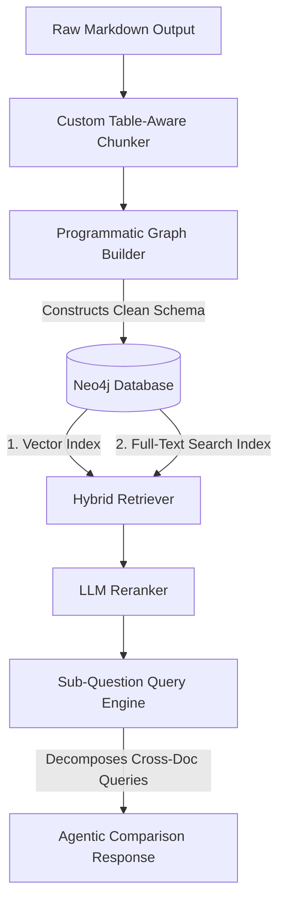

# Implementation Plan - Complex Table and Cross-Doc RAG Optimization

This plan addresses the optimization of the RAG system to achieve high-accuracy retrieval and synthesis over complex PDF documents. Specifically, it targets questions asking for exact numerical details in tables and cross-document relations.

---

## Current System Analysis & Limitations

We evaluated the baseline system on sample queries. The current system relies on a standard LlamaIndex `PropertyGraphIndex` built with a `MarkdownNodeParser` and an LLM-based `SimpleLLMPathExtractor` running on `gemma4:e4b`.

Our testing revealed four critical limitations:
1. **Table Splitting & Context Loss**: The default `MarkdownNodeParser` splits document sections based on heading structures and a generic character chunk size. When a complex table (such as the DISCOM tariff tables) exceeds this limit, it is cut in half. The second half of the table is retrieved without table headers, causing the LLM to hallucinate or fail to map column headers to specific values.
2. **Noisy, Slow Knowledge Graph Construction**: Using `SimpleLLMPathExtractor` to extract arbitrary triples via a local LLM is slow, computationally expensive, and extremely noisy. It extracts thousands of arbitrary relationship types (e.g., `Adopted basis for arr calculations` or `Allowable gross depreciation`) without a consistent schema. This makes structured Cypher traversal or query template retrievers ineffective.
3. **Weak Keyword Matching (Vector Search Only)**: Vector search (using `BAAI/bge-small-en-v1.5`) matches semantic similarity but struggles to distinguish between specific numeric values (e.g., matching "3,236.67" vs "3,051.55") or specific petitions (e.g., "O.P. No. 13 of 2026").
4. **Poor Cross-Document Synthesis**: For questions comparing two states or years, standard retrieval retrieves the top K chunks. These chunks are often heavily skewed toward one document, or are formatted in a way that doesn't allow the LLM to perform a reliable comparison.

---

## Proposed Architecture & Improvements

We propose a four-tier optimization strategy to resolve these limitations:

### 1. Table-Aware Chunking & Narrative Enrichment
- **Atomic Table Blocks**: We will implement a custom Markdown parser that detects Markdown tables and treats them as single, atomic chunks. Tables will never be split across nodes.
- **Narrative Row Expansion**: For every markdown table, we will programmatically generate a **narrative text representation** for each row. For example, for a row like `| APSPDCL | 21,662.06 | 3,236.67 |`, we will generate the sentence:
  *"For APSPDCL, the Total Energy Purchased is 21,662.06 MU, the Total Fixed Cost is 3,236.67 Rs. Crores."*
  We will append this narrative text directly to the table chunk. This makes the numeric values highly searchable via vector embeddings because the row headers are directly associated with the numbers in a clean, semantic sentence.

### 2. Programmatic Clean Graph Construction
- Instead of using the slow and noisy `SimpleLLMPathExtractor`, we will construct a clean, structured schema in Neo4j programmatically.
- **Schema Design**:
  - `(State {name: "Andhra Pradesh"})`
  - `(Year {year: "2024-25"})`
  - `(Document {id: "...", name: "...", state: "...", year: "..."})`
  - `(Chunk {id: "...", text: "...", type: "text" | "table", index: 0})`
- **Relationships**:
  - `(Document)-[:FOR_STATE]->(State)`
  - `(Document)-[:FOR_YEAR]->(Year)`
  - `(Document)-[:HAS_CHUNK]->(Chunk)`
- Building this graph is 100% deterministic, takes less than a minute, and ensures a clean, noise-free database.

### 3. Hybrid Retrieval (Vector + Full-Text Search)
- We will configure a custom retriever in LlamaIndex that combines:
  - Vector similarity search on `Chunk` nodes.
  - Native Neo4j full-text search (BM25) on `Chunk.text`.
- We will combine the scores/ranks of both retrievers using Reciprocal Rank Fusion (RRF) and pass the top results to the LLM Reranker. This guarantees exact matches for numeric values, O.P. numbers, and specific terms.

### 4. Agentic Cross-Document Querying
- We will implement a `SubQuestionQueryEngine` or a tool-based ReAct agent using LlamaIndex.
- We will create document/state-specific query tools (e.g. `AndhraPradeshQueryTool` and `UttarPradeshQueryTool`).
- When a user asks: *"Compare the pooled cost of Andhra Pradesh in 2024 and Uttar Pradesh in 2025"*, the engine will automatically split it into two sub-queries:
  1. *"What is the pooled cost of Andhra Pradesh in 2024?"* (executed against the AP tool)
  2. *"What is the pooled cost of Uttar Pradesh in 2025?"* (executed against the UP tool)
  And then synthesize the results into a clean markdown table/comparison.

---

## User Review Required

> [!IMPORTANT]
> - **Schema Migration**: Implementing this plan requires clearing the existing Neo4j database (running `MATCH (n) DETACH DELETE n`) to remove the noisy `SimpleLLMPathExtractor` nodes/relationships and index the documents using our clean programmatic schema. Let us know if we have permission to reset the database.
> - **LlamaIndex PropertyGraphIndex Compatibility**: We will transition from the raw `PropertyGraphIndex` class to a custom Hybrid Retriever model backed by `Neo4jPropertyGraphStore` or standard Graph Store interfaces.

---

## Open Questions

> [!NOTE]
> 1. Are there any other states/documents you plan to add in the future? Our programmatic metadata extractor (State, Year) handles arbitrary directories, but let us know if there are custom naming conventions we should support.
> 2. Do you have a preferred top-K value for the reranker? (We propose retrieving top 15-20 nodes via hybrid search, and reranking down to the top 3-4 nodes for final synthesis).

---

## Proposed Changes

### [RAG System Configuration & Utilities]

#### [NEW] [utils.py](file:///c:/Joulewise/Llama%20index%20rag/utils.py)
This module will contain the custom table detector, table narrative parser, custom chunker, and hybrid retriever.

### [Data Ingestion & Graph Building]

#### [MODIFY] [2_build_graph.py](file:///c:/Joulewise/Llama%20index%20rag/2_build_graph.py)
We will modify this script to:
- Reset the Neo4j database.
- Use our custom chunker to extract text and enriched table nodes.
- Programmatically create `State`, `Year`, `Document`, and `Chunk` nodes and link them, bypassing the LLM extractor.
- Create vector and full-text indexes in Neo4j.

### [Retrieval & Synthesis]

#### [MODIFY] [3_query_graph.py](file:///c:/Joulewise/Llama%20index%20rag/3_query_graph.py)
We will modify this script to:
- Initialize the custom Hybrid Retriever (combining Neo4j Vector + Full-text indexes).
- Configure the LLM Reranker.
- Build the `SubQuestionQueryEngine` using document-specific query tools to decompose cross-document questions.

---

## Verification Plan

### Automated Tests
- We will execute the updated `3_query_graph.py` programmatically over our test queries:
  1. *APSDCL proposed Fixed Cost in O.P. No. 13 of 2026* (tests table chunking, exact matching, and retrieval).
  2. *APEPDCL average market purchase rate* (tests specific table column lookup).
  3. *AP vs UP pooled cost comparison* (tests cross-document agentic sub-question decomposition).

### Manual Verification
- We will print the retrieved source nodes, their retrieval scores, and the final synthesized response to verify accuracy and lack of hallucinations.
