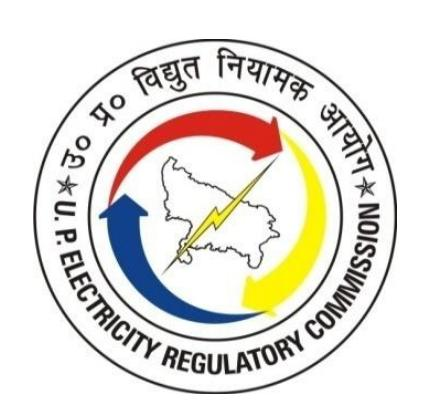

## **UTTAR PRADESH ELECTRICITY REGULATORY COMMISSION LUCKNOW**

Petition No. 2162 / 2024, 2163 / 2024, 2164 / 2024, 2165 / 2024, and 2176 / 2024

## **TRUING UP OF TARIFF FOR FY 2023-24, ANNUAL PERFORMANCE REVIEW (APR) FOR FY 2024-25**

#### **AND**

## **APPROVAL OF AGGREGATE REVENUE REQUIREMENT AND TARIFF FOR FY 2025-26 FOR**

Dakshinanchal Vidyut Vitran Nigam Ltd., Agra (DVVNL)- (Petition No. 2165 / 2024) Madhyanchal Vidyut Vitran Nigam Ltd., Lucknow (MVVNL)- (Petition No. 2164 / 2024) Pashchimanchal Vidyut Vitran Nigam Ltd., Meerut (PVVNL)- (Petition No. 2162 / 2024) Purvanchal Vidyut Vitran Nigam Ltd., Varanasi (PuVVNL)- (Petition No. 2163 / 2024) Kanpur Electricity Supply Company Ltd., Kanpur (KESCO)- (Petition No. 2176 / 2024)

> ORDER UNDER SECTIONS 62 & 64 OF-THE ELECTRICITY ACT, 2003

 **November 22, 2025**

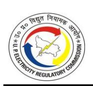

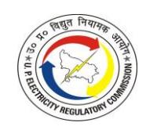

## **CONTENTS**

| 1.    | INTRODUCTION AND HISTORICAL BACKGROUND 34                     |     |
|-------|------------------------------------------------------------------|-----|
| 1.1.  | INTRODUCTION                                                     | 34  |
| 1.2.  | HISTORICAL BACKGROUND                                            | 34  |
| 1.3.  | BACKGROUND OF ENACTMENTS                                         | 36  |
| 1.4.  | DISTRIBUTION TARIFF REGULATION                                   | 38  |
| 2.    | PROCEDURAL HISTORY 39                                         |     |
| 2.1.  | SUBMISSION OF TARIFF PETITIONS                                   | 39  |
| 2.2.  | PRELIMINARY SECURITY OF THE FILINGS                           | 39  |
| 2.3.  | ADMITTANCE OF THE TRUE-UP, APR AND ARR/TARIFF FILINGS            | 40  |
| 2.4.  | PUBLICITY OF THE LICENSEES' FILINGS                           | 41  |
| 2.5.  | PUBLIC HEARING                                                   | 41  |
| 2.6.  | STATE ADVISORY COMMITTEE                                      | 42  |
| 3.    | PUBLIC HEARING PROCESS 43                                     |     |
| 3.1.  | INTRODUCTION                                                     | 43  |
| 3.2.  | TARIFF                                                        | 45  |
| 3.3.  | TARIFF-GENERAL PROVISIONS OF RATE SCHEDULE                    | 52  |
| 3.4.  | DISTRIBUTION LOSSES/LINE LOSSES AND TRANSMISSION LOSSES       | 56  |
| 3.5.  | POWER PURCHASE COST                                              | 59  |
| 3.6.  | CAPITAL EXPENDITURE AND IMPLEMENTATION OF RDSS                | 61  |
| 3.7.  | OTHER ARR COMPONENTS                                             | 62  |
| 3.8.  | REVENUE FROM SALES AND GOUP SUBSIDY                              | 65  |
| 3.9.  | TORRENT (AGRA DISTRIBUTION FRANCHISEE)                           | 69  |
| 3.10. | MULTISTORIED BUILDINGS                                        | 70  |
| 3.11. | SUPPLY CODE/PERFORMANCE-RELATED ISSUES                        | 72  |
| 3.12. | PRIVATIZATION                                                    | 76  |
| 3.13. | OPEN ACCESS CHARGES AND OTHER RELATED ISSUES                  | 77  |
| 3.14. | SMART METERS AND PREPAID METERS                               | 80  |
| 3.15. | PROMOTION OF RENEWABLE ENERGY                                 | 81  |
| 3.16. | MISCELLANEOUS                                                    | 82  |
| 4.    | TRUING UP OF AGGREGATE REVENUE REQUIREMENT FOR FY 2023-24:86     |     |
| 4.1.  | INTRODUCTION                                                     | 86  |
| 4.2.  | BILLING DETERMINANTS: CONSUMER NUMBERS, CONNECTED LOAD AND SALES | 86  |
| 4.3.  | DISTRIBUTION LOSSES                                           | 100 |
| 4.4.  | ENERGY BALANCE                                                | 102 |
| 4.5.  | POWER PURCHASE EXPENSES                                       | 104 |
| 4.6.  | INTRA-STATE TRANSMISSION CHARGES                                 | 123 |
| 4.7.  | OPERATION AND MAINTENANCE EXPENSES                            | 124 |
| 4.8.  | CAPITAL INVESTMENT, CAPITALISATION AND FINANCING                 | 145 |
| 4.9.  | DEPRECIATION                                                  | 156 |

| 4.10.  | INTEREST ON LOAN                                                 | 171 |
|--------|------------------------------------------------------------------|-----|
| 4.11.  | INTEREST ON CONSUMER SECURITY DEPOSITS                           | 177 |
| 4.12.  | BANKING AND FINANCE CHARGES                                      | 180 |
| 4.13.  | INTEREST ON WORKING CAPITAL                                      | 180 |
| 4.14.  | INTEREST & FINANCE CHARGES                                       | 186 |
| 4.15.  | PROVISION FOR BAD AND DOUBTFUL DEBTS                             | 188 |
| 4.16.  | RETURN ON EQUITY                                                 | 193 |
| 4.17.  | DEEMED REVENUE                                                   | 198 |
| 4.18.  | SUBSIDY FROM GOUP                                                | 199 |
| 4.19.  | NON-TARIFF INCOME                                                | 200 |
| 4.20.  | INCOME TAX                                                       | 209 |
| 4.21.  | REVENUE FROM THE SALE OF POWER                                   | 210 |
| 4.22.  | ARR AND REVENUE GAP/(SURPLUS) FOR FY 2023-24 AFTER TRUING UP     | 211 |
| 5. ANN | NUAL PERFORMANCE REVIEW OF FY 2024-25                            | 218 |
| 5.1.   | INTRODUCTION                                                     | 218 |
| 5.2.   | BILLING DETERMINANTS: CONSUMER NUMBERS, CONNECTED LOAD AND SALES | 218 |
| 5.3.   | DISTRIBUTION LOSS                                                | 227 |
| 5.4.   | ENERGY BALANCE                                                   | 228 |
| 5.5.   | POWER PURCHASE EXPENSE                                           | 232 |
| 5.6.   | INTRA-STATE TRANSMISSION CHARGES                                 | 242 |
| 5.7.   | OPERATION AND MAINTENANCE EXPENSE                                | 244 |
| 5.8.   | CAPITAL INVESTMENT, CAPITALISATION AND FINANCING                 | 253 |
| 5.9.   | DEPRECIATION                                                     | 257 |
| 5.10.  | INTEREST ON LONG-TERM LOAN                                       | 260 |
| 5.11.  | INTEREST ON CONSUMER SECURITY DEPOSITS                           | 265 |
| 5.12.  | BANKING AND FINANCE CHARGES                                      | 266 |
| 5.13.  | INTEREST ON WORKING CAPITAL                                      | 267 |
| 5.14.  | PROVISION FOR BAD AND DOUBTFUL DEBTS                             | 269 |
| 5.15.  | RETURN ON EQUITY                                                 | 271 |
| 5.16.  | NON-TARIFF INCOME                                                | 273 |
| 5.17.  | INCOME TAX                                                       | 274 |
| 5.18.  | REVENUE                                                          | 274 |
| 5.19.  | GOUP SUBSIDY                                                     | 275 |
| 5.20.  | ANNUAL PERFORMANCE REVIEW (APR) FOR FY 2024-25                   | 276 |
| 6. AG  | GREGATE REVENUE REQUIREMENT (ARR) & TARIFF FOR FY 2025-26        | 284 |
| 6.1.   | INTRODUCTION                                                     | 284 |
| 6.2.   | BILLING DETERMINANTS: CONSUMER NUMBERS, CONNECTED LOAD AND SALES | 284 |
| 6.3.   | DISTRIBUTION LOSS                                                | 293 |
| 6.4.   | ENERGY BALANCE                                                   | 306 |
| 6.5.   | POWER PURCHASE EXPENSE                                           | 308 |

| 6.6.  | INTRA-STATE TRANSMISSION CHARGES                            | 344 |
|-------|-------------------------------------------------------------|-----|
| 6.7.  | OPERATION AND MAINTENANCE EXPENSES                       | 345 |
| 6.8.  | CAPITAL INVESTMENT, CAPITALISATION AND FINANCING            | 363 |
| 6.9.  | DEPRECIATION                                             | 366 |
| 6.10. | INTEREST ON LONG-TERM LOAN                                  | 383 |
| 6.11. | INTEREST ON CONSUMER SECURITY DEPOSIT                    | 388 |
| 6.12. | INTEREST ON WORKING CAPITAL                              | 390 |
| 6.13. | BANKING AND FINANCE CHARGES                              | 395 |
| 6.14. | PROVISION FOR BAD AND DOUBTFUL DEBTS                        | 396 |
| 6.15. | RETURN ON EQUITY                                         | 399 |
| 6.16. | NON-TARIFF INCOME                                        | 401 |
| 6.17. | INCOME TAX                                                  | 403 |
| 6.18. | GOUP SUBSIDY                                                | 403 |
| 6.19. | UTTAR PRADESH STATE LOAD DESPATCH CENTER CHARGES            | 404 |
| 6.20. | AGGREGATE REVENUE REQUIREMENT (ARR) FOR FY 2025-26       | 406 |
| 7.    | REGULATORY ASSETS 414                                    |     |
| 8.    | TARIFF DESIGN419                                            |     |
| 8.1.  | CONSIDERATIONS IN TARIFF DESIGN                          | 419 |
| 8.2.  | BRIEF OF PROPOSAL                                           | 419 |
| 8.3.  | REGULATORY TRANSITION UNDER MYT REGULATIONS, 2025        | 421 |
| 8.4.  | REALIGNMENT OF DISTRIBUTION LOSS                         | 422 |
| 8.5.  | PROPOSAL FOR TARIFF HIKE & ITS BROAD ANALYSIS               | 422 |
| 8.6.  | TARIFF DESIGN APPROVED BY THE COMMISSION                    | 425 |
| 8.7.  | GREEN TARIFF (ADDITIONAL TARIFF FOR SUPPLY OF GREEN ENERGY) | 427 |
| 8.8.  | CONSUMER ORIENTED INITIATIVES                            | 431 |
| 8.9.  | ISSUES OF MULTI-STORIED BUILDINGS                        | 433 |
| 9.    | REVENUE, GOUP SUBSIDY AND REVENUE GAP/ (SURPLUS) 440     |     |
| 9.1.  | REVENUE FROM SALE OF ELECTRICITY AT EXISTING TARIFF      | 440 |
| 9.2.  | AVERAGE COST OF SUPPLY VIS-À-VIS AVERAGE BILLING RATE       | 447 |
| 10.   | OPEN ACCESS AND OTHER TARIFF CHARGES 450                 |     |
| 10.1. | BACKGROUND                                                  | 450 |
| 10.2. | OPEN ACCESS TRANSMISSION CHARGES                      | 450 |
| 10.3. | OPEN ACCESS WHEELING CHARGES                             | 450 |
| 10.4. | CROSS-SUBSIDY SURCHARGE                                     | 453 |
| 11.   | DIRECTIVES 465                                           |     |
| 11.1. | STATUS OF COMPLIANCE OF DIRECTIVES FOR FY 2024-25        | 465 |
| 11.2. | DIRECTIVES FOR FY 2025-26                                   | 478 |
| 11.3. | DIRECTIVES RELATED TO TARIFF FILING                      | 478 |
| 11.4. | DIRECTIVES RELATED TO POWER PROCUREMENT                     | 480 |
| 11.5. | DIRECTIVES RELATED TO MULTI-STORIED BUILDINGS            | 482 |

| 11.6. | OTHER STANDING DIRECTIVES                                         | 483     |
|-------|-------------------------------------------------------------------|---------|
| 12.   | APPLICABILITY OF THE ORDER486                                     |         |
| 13.   | ANNEXURES 487                                                  |         |
| 13.1. | ANNEXURE-I (RATE SCHEDULE FOR FY 2025-26)                      | 487     |
| 13.2. | ANNEXURE-II (CATEGORY/SUB-CATEGORY WISE DETAILS OF THE REVENUE AT |         |
|       | APPROVED TARIFF FOR FY 2025-26)                                | 543     |
| 13.3. | ANNEXURE-III (ADMITTANCE ORDER)                                   | 546     |
| 13.4. | ANNEXURE-IV (PUBLIC NOTICE ISSUED BY THE COMMISSION)           | 552     |
| 13.5. | ANNEXURE-V (MOM OF SAC MEETING)                                   | 554     |
| 13.6. | ANNEXURE-VI (LIST OF OBJECTORS/ STAKEHOLDERS)                     | 561     |
| 13.7. | ANNEXURE-VII (LIST OF CONSUMERS WHO ATTENDED PUBLIC HEARINGS)     |  564 |

## **LIST OF TABLES**

| TABLE 2-1: LIST OF NEWSPAPERS AND DATES OF PUBLICATION OF PUBLIC NOTICE BY THE PETITIONER 41                  |
|---------------------------------------------------------------------------------------------------------------------|
| TABLE 2-2: DETAILS OF PUBLIC HEARINGS CONDUCTED BY THE COMMISSION  41                                         |
| TABLE 4-1: ACTUAL BILLING DETERMINANTS FOR FY 2023-24 AS SUBMITTED BY DVVNL 86                                   |
| TABLE 4-2: ACTUAL BILLING DETERMINANTS FOR FY 2023-24 AS SUBMITTED BY MVVNL 87                                   |
| TABLE 4-3: ACTUAL BILLING DETERMINANTS FOR FY 2023-24 AS SUBMITTED BY PVVNL 88                                   |
| TABLE 4-4: ACTUAL BILLING DETERMINANTS FOR FY 2023-24 AS SUBMITTED BY PUVVNL89                                      |
| TABLE 4-5: ACTUAL BILLING DETERMINANTS FOR FY 2023-24 AS SUBMITTED BY KESCO  90                               |
| TABLE 4-6: BILLING DETERMINANTS OF AGRA - DISTRIBUTION FRANCHISEE FOR FY 2023-24  91                       |
| TABLE 4-7: SALES COMPARISON OF AGRA DF VIS-À-VIS AS BULK SUPPLY CONSUMER SUBMITTED BY DVVNL FOR FY 2023-24 92 |
| TABLE 4-8: SALES FOR LMV-1 RURAL UNMETERED CATEGORY AS PER NORMS  93                                          |
| TABLE 4-9: SALES FOR UNMETERED CATEGORY OF LMV-5 AS PER NORMS  93                                             |
| TABLE 4-10: SALES FOR UNMETERED CATEGORY FOR LMV-7 AS PER NORMS  93                                           |
| TABLE 4-11: APPROVED BILLING DETERMINANTS FOR DVVNL WITH AGRA (DF) AS BULK SUPPLY CONSUMER FOR FY 2023-24 94  |
| TABLE 4-12: APPROVED BILLING DETERMINANTS FOR MVVNL FOR FY 2023-24  95                                        |
| TABLE 4-13: APPROVED BILLING DETERMINANTS FOR PVVNL FOR FY 2023-24  96                                        |
| TABLE 4-14: APPROVED BILLING DETERMINANTS FOR PUVVNL FOR FY 2023-24 97                                           |
| TABLE 4-15: APPROVED BILLING DETERMINANTS FOR KESCO FOR FY 2023-24 98                                            |
| TABLE 4-16: APPROVED CONSOLIDATED BILLING DETERMINANTS FOR FY 2023-24  99                                     |
| TABLE 4-17: DISTRIBUTION LOSS TRAJECTORY FOR FY 2023-24 AS SUBMITTED BY THE PETITIONERS 100                   |
| TABLE 4-18: ACTUAL DISCOM LOSSES IN LT & HT SYSTEM FOR FY 2023-2024 100                                          |
| TABLE 4-19: APPROVED DISCOM LOSSES FOR FY 2023-2024 102                                                          |
| TABLE 4-20: ENERGY BALANCE FOR FY 2023-24 AS SUBMITTED BY PETITIONERS 102                                        |
| TABLE 4-21: APPROVED ENERGY BALANCE FOR FY 2023-2024 104                                                         |
| TABLE 4-22: GENERATING STATION WISE POWER PURCHASE COST FOR FY 2023-24 AS SUBMITTED BY THE PETITIONERS 105    |
| TABLE 4-23: POWER PURCHASE COST FOR FY 2023-24 AS SUBMITTED BY DVVNL 111                                         |
| TABLE 4-24: POWER PURCHASE COST FOR FY 2023-24 AS SUBMITTED BY MVVNL 111                                         |
| TABLE 4-25: POWER PURCHASE COST FOR FY 2023-24 AS SUBMITTED BY PVVNL  111                                     |

| TABLE 4-26: POWER PURCHASE COST FOR FY 2023-24 AS SUBMITTED BY PUVVNL  111                                                   |
|------------------------------------------------------------------------------------------------------------------------------------|
| TABLE 4-27: POWER PURCHASE COST FOR FY 2023-24 AS SUBMITTED BY KESCO  112                                                    |
| TABLE 4-28: RECONCILIATION OF POWER PURCHASE COST CLAIMED FOR FY 2023-24 AS PER UPPCL'S BALANCE SHEET (IN RS. CRORE)  112 |
| TABLE 4-29: APPROVED BULK SUPPLY TARIFF FOR FY 2023-24  115                                                               |
| TABLE 4-30: APPROVED AVERAGE POWER PURCHASE COST FOR FY 2023-24 116                                                             |
| TABLE 4-31: PLANT-WISE ALLOCATION MATRIX FOR FY 2023-24 117                                                                     |
| TABLE 4-32: ALLOCATED PLANT-WISE ENERGY RECEIVED AT DISCOM PERIPHERY FOR FY 2023-24 (IN MUs)  117                         |
| TABLE 4-33: ALLOCATED PLANT-WISE POWER PROCUREMENT COST AT DISCOM PERIPHERY FOR FY 2023-24 (IN RS. CRORE)  118            |
| TABLE 4-34: APPROVED DIFFERENTIAL BULK SUPPLY TARIFF FOR FY 2023-24  118                                                     |
| TABLE 4-35: APPROVED ALLOWABLE POWER PURCHASE COST BASED ON DBST (RS/KWH) FOR FY 2023-24 119                                 |
| TABLE 4-36: DISALLOWANCE IN PPC FOR FY 2023-24 (In RS. CRORE) 119                                                               |
| TABLE 4-37: CONSOLIDATED APPROVED POWER PURCHASE COST FOR FY 2023-24 (IN RS. CRORE)  120                                  |
| TABLE 4-38: ACTUAL RPO TRAJECTORY AS PER UPERC RPO REGULATIONS (%)  120                                                      |
| TABLE 4-39: RPO COMPLIANCE FOR FY 2023-24 AS SUBMITTED BY THE PETITIONERS  120                                               |
| TABLE 4-40: RPO COMPLIANCE FOR FY 2023-24 AS APPROVED BY COMMISSION 122                                                         |
| TABLE 4-41: INTRA-STATE TRANSMISSION CHARGES FOR FY 2023-24 AS SUBMITTED BY THE PETITIONERS 123                              |
| TABLE 4-42: APPROVED INTRA-STATE TRANSMISSION CHARGES FOR FY 2023-24 124                                                        |
| TABLE 4-43: TRUED UP AND BASE YEAR O&M EXPENSES FOR FY 2019-20 (IN RS. CR)  126                                              |
| TABLE 4-44: INFLATION INDICES AS SUBMITTED BY THE PETITIONERS  127                                                           |
| TABLE 4-45: EMPLOYEE EXPENSES FOR FY 2023-24 AS SUBMITTED BY DVVNL (IN RS. CRORE)  129                                       |
| TABLE 4-46: EMPLOYEE EXPENSES FOR FY 2023-24 AS SUBMITTED BY MVVNL (IN RS. CRORE)  129                                       |
| TABLE 4-47: EMPLOYEE EXPENSES FOR FY 2023-24 AS SUBMITTED BY PVVNL (IN RS. CRORE)  129                                       |
| TABLE 4-48: EMPLOYEE EXPENSES FOR FY 2023-24 AS SUBMITTED BY PUVVNL (IN RS. CRORE)  130                                   |
| TABLE 4-49: EMPLOYEE EXPENSES FOR FY 2023-24 AS SUBMITTED BY KESCO (IN RS. CRORE)  130                                       |
| TABLE 4-50: R&M EXPENSES FOR FY 2023-24 AS SUBMITTED BY THE PETITIONERS  130                                                 |

| TABLE 4-51: NET NORMATIVE R&M EXPENSES FOR FY 2023-24 AS SUBMITTED BY DVVNL (IN RS. CRORE) 131                 |
|----------------------------------------------------------------------------------------------------------------------|
| TABLE 4-52: NET NORMATIVE R&M EXPENSES FOR FY 2023-24 AS SUBMITTED BY MVVNL (IN RS. CRORE) 131                 |
| TABLE 4-53: NET NORMATIVE R&M EXPENSES FOR FY 2023-24 AS SUBMITTED BY PVVNL (IN RS. CRORE) 131                 |
| TABLE 4-54: TABLE- 4-1: NET NORMATIVE R&M EXPENSES FOR FY 2023-24 AS SUBMITTED BY PUVVNL (IN RS. CRORE) 131 |
| TABLE 4-55: NET NORMATIVE R&M EXPENSES FOR FY 2023-24 AS SUBMITTED BY KESCO (IN RS. CRORE) 131                 |
| TABLE 4-56: A&G EXPENSES FOR FY 2023-24 AS SUBMITTED BY THE PETITIONERS  132                                   |
| TABLE 4-57: A&G EXPENSES FOR FY 2023-24 AS SUBMITTED BY DVVNL (IN RS. CRORE) 132                                  |
| TABLE 4-58: A&G EXPENSES FOR FY 2023-24 AS SUBMITTED BY MVVNL (IN RS. CRORE) 132                                  |
| TABLE 4-59: A&G EXPENSES FOR FY 2023-24 AS SUBMITTED BY PVVNL (IN RS. CRORE) 133                                  |
| TABLE 4-60: A&G EXPENSES FOR FY 2023-24 AS SUBMITTED BY PUVVNL (IN RS. CRORE)133                                     |
| TABLE 4-61: A&G EXPENSES FOR FY 2023-24 AS SUBMITTED BY KESCO (IN RS. CRORE)  133                              |
| TABLE 4-62: SMART METERING OPEX FOR FY 2023-24 AS SUBMITTED BY THE PETITIONERS  135                            |
| TABLE 4-63: O&M EXPENSES FOR FY 2023-24 AS SUBMITTED BY DVVNL (IN RS. CRORE) 136                                  |
| TABLE 4-64: O&M EXPENSES FOR FY 2023-24 AS SUBMITTED BY MVVNL (IN RS. CRORE) 136                                  |
| TABLE 4-65: O&M EXPENSES FOR FY 2023-24 AS SUBMITTED BY PVVNL (IN RS. CRORE). 136                                 |
| TABLE 4-66: O&M EXPENSES FOR FY 2023-24 AS SUBMITTED BY PUVVNL (IN RS. CRORE)  137                          |
| TABLE 4-67: O&M EXPENSES FOR FY 2023-24 AS SUBMITTED BY KESCO (IN RS. CRORE). 137                                 |
| TABLE 4-68: CONSUMER PRICE INDEX FOR FY 2023-24  138                                                           |
| TABLE 4-69: WHOLESALE PRICE INDEX FOR FY 2023-24  138                                                          |
| TABLE 4-70: APPROVED NORMATIVE EMPLOYEE EXPENSES FOR FY 2023-24 (IN RS. CRORE)  140                            |
| TABLE 4-71: APPROVED EMPLOYEE EXPENSES FOR FY 2023-24 (IN RS. CRORE) 140                                          |
| TABLE 4-72: APPROVED NORMATIVE R&M EXPENSES FOR FY 2023-24 (IN RS. CRORE) 140                                     |
| TABLE 4-73: APPROVED R&M EXPENSES FOR FY 2023-24 (IN RS. CRORE) 141                                               |
| TABLE 4-74: APPROVED NORMATIVE A&G EXPENSES FOR FY 2023-24 (IN RS. CRORE) 141                                     |
| TABLE 4-75: APPROVED A&G EXPENSES FOR FY 2023-24 (IN RS. CRORE) 142                                               |
| TABLE 4-76: APPROVED O&M EXPENSES OF DVVNL FOR FY 2023-24 (IN RS. CRORE)  143                                  |
| TABLE 4-77: APPROVED O&M EXPENSES OF MVVNL FOR FY 2023-24 (IN RS. CRORE)  143                                  |

| TABLE 4-78: APPROVED O&M EXPENSES OF PVVNL FOR FY 2023-24 (IN RS. CRORE) 144                                                                                                                                                                                                                                                            |
|--------------------------------------------------------------------------------------------------------------------------------------------------------------------------------------------------------------------------------------------------------------------------------------------------------------------------------------------|
| TABLE 4-79: APPROVED O&M EXPENSES OF PUVVNL FOR FY 2023-24 (IN RS. CRORE)  144                                                                                                                                                                                                                                                       |
| TABLE 4-80: APPROVED O&M EXPENSES OF KESCO FOR FY 2023-24 (IN RS. CRORE) 145                                                                                                                                                                                                                                                            |
| TABLE 4-81: APPROVED CONSOLIDATED O&M EXPENSES FOR FY 2023-24 (IN RS. CRORE)  145                                                                                                                                                                                                                                                    |
| TABLE 4-82: CAPEX FOR FY 2023-24 AS SUBMITTED BY DVVNL (IN RS. CRORE)  146                                                                                                                                                                                                                                                           |
| TABLE 4-83: CAPEX FOR FY 2023-24 AS SUBMITTED BY MVVNL (IN RS. CRORE)  146                                                                                                                                                                                                                                                           |
| TABLE 4-84: CAPEX FOR FY 2023-24 AS SUBMITTED BY PVVNL (IN RS. CRORE) 146                                                                                                                                                                                                                                                            |
| TABLE 4-85: CAPEX FOR FY 2023-24 AS SUBMITTED BY PUVVNL (IN RS. CRORE)  147                                                                                                                                                                                                                                                          |
| TABLE 4-86: CAPEX FOR FY 2023-24 AS SUBMITTED BY KESCO (IN RS. CRORE) 147                                                                                                                                                                                                                                                               |
| TABLE 4-87: FINANCING OF CAPITAL INVESTMENTS IN FY 2023-24 AS SUBMITTED BY DVVNL (IN RS. CRORE) 148                                                                                                                                                                                                                                  |
| TABLE 4-88: FINANCING OF CAPITAL INVESTMENTS IN FY 2023-24 AS SUBMITTED BY MVVNL (IN RS. CRORE) 148                                                                                                                                                                                                                                  |
| TABLE 4-89: FINANCING OF CAPITAL INVESTMENTS IN FY 2023-24 AS SUBMITTED BY PVVNL (IN RS. CRORE) 148                                                                                                                                                                                                                                  |
| TABLE 4-90: FINANCING OF CAPITAL INVESTMENTS IN FY 2023-24 AS SUBMITTED BY PUVVNL (IN RS. CRORE) 149                                                                                                                                                                                                                                 |
| TABLE 4-91: FINANCING OF CAPITAL INVESTMENTS IN FY 2023-24 AS SUBMITTED BY KESCO (IN RS. CRORE) 149                                                                                                                                                                                                                               |
| TABLE 4-92: RECONCILIATION DETAILS OF DVVNL FOR FY 2023-24 AS SUBMITTED BY THE PETITIONER (IN RS. CRORE)  149                                                                                                                                                                                                                     |
| TABLE 4-93: RECONCILIATION DETAILS OF MVVNL FOR FY 2023-24 AS SUBMITTED BY THE PETITIONER (IN RS. CRORE)  150                                                                                                                                                                                                                     |
| TABLE 4-94: RECONCILIATION DETAILS OF PVVNL FOR FY 2023-24 AS SUBMITTED BY THE                                                                                                                                                                                                                                                             |
| PETITIONER (IN RS. CRORE)  150                                                                                                                                                                                                                                                                                                       |
| TABLE 4-95: APPROVED CAPITALISATION FOR FY 2023-24 (IN RS. CRORE)  150                                                                                                                                                                                                                                                               |
| CRORE)  151                                                                                                                                                                                                                                                                                                                          |
| CRORE)  151                                                                                                                                                                                                                                                                                                                          |
| CRORE)  151                                                                                                                                                                                                                                                                                                                          |
| TABLE 4-96: APPROVED CONSUMER CONTRIBUTION OF DVVNL FOR FY 2023-24 (IN RS. TABLE 4-97: APPROVED CONSUMER CONTRIBUTION OF MVVNL FOR FY 2023-24 (IN RS. TABLE 4-98: APPROVED CONSUMER CONTRIBUTION OF PVVNL FOR FY 2023-24 (IN RS. TABLE 4-99: APPROVED CONSUMER CONTRIBUTION OF PUVVNL FOR FY 2023-24 (IN RS. CRORE)  152 |

| TABLE 4-101: APPROVED CONSOLIDATED CONSUMER CONTRIBUTION FOR FY 2023-24 (IN RS. CRORE) 152                        |
|-------------------------------------------------------------------------------------------------------------------------|
| TABLE 4-102: APPROVED FINANCING OF TOTAL CAPITALISATION OF DVVNL IN FY 2023-24 (IN RS. CRORE) 153                 |
| TABLE 4-103: APPROVED FINANCING OF TOTAL CAPITALISATION OF MVVNL IN FY 2023-24 (IN RS. CRORE) 153                 |
| TABLE 4-104: APPROVED FINANCING OF TOTAL CAPITALISATION OF PVVNL IN FY 2023-24 (IN RS. CRORE) 154                 |
| TABLE 4-105: APPROVED FINANCING OF TOTAL CAPITALISATION OF PUVVNL IN FY 2023-24 (IN RS. CRORE) 154                |
| TABLE 4-106: APPROVED FINANCING OF TOTAL CAPITALISATION OF KESCO IN FY 2023-24 (IN RS. CRORE) 155                 |
| TABLE 4-107: APPROVED CONSOLIDATED FINANCING OF TOTAL CAPITALISATION IN FY 2023-24 (IN RS. CRORE)  155         |
| TABLE 4-108: GROSS ALLOWABLE DEPRECIATION FOR FY 2023-24 AS SUBMITTED BY DVVNL (IN RS. CRORE) (PART- A) 157    |
| TABLE 4-109: GROSS ALLOWABLE DEPRECIATION FOR FY 2023-24 AS SUBMITTED BY DVVNL (IN RS. CRORE) (PART- B) 157    |
| TABLE 4-110: GROSS ALLOWABLE DEPRECIATION FOR FY 2023-24 AS SUBMITTED BY MVVNL (IN RS. CRORE) (PART- A) 158 |
| TABLE 4-111: GROSS ALLOWABLE DEPRECIATION FOR FY 2023-24 AS SUBMITTED BY MVVNL (IN RS. CRORE) (PART- B) 158    |
| TABLE 4-112: GROSS ALLOWABLE DEPRECIATION FOR FY 2023-24 AS SUBMITTED BY PVVNL (IN RS. CRORE) (PART- A) 159 |
| TABLE 4-113: GROSS ALLOWABLE DEPRECIATION FOR FY 2023-24 AS SUBMITTED BY PVVNL (IN RS. CRORE) (PART- B) 159    |
| TABLE 4-114: GROSS ALLOWABLE DEPRECIATION FOR FY 2023-24 AS SUBMITTED BY PUVVNL (IN RS. CRORE) (PART- A) 160   |
| TABLE 4-115: GROSS ALLOWABLE DEPRECIATION FOR FY 2023-24 AS SUBMITTED BY PUVVNL (IN RS. CRORE) (PART- B) 160   |
| TABLE 4-116: GROSS ALLOWABLE DEPRECIATION FOR FY 2023-24 AS SUBMITTED BY KESCO (IN RS. CRORE) (PART- A) 161    |
| TABLE 4-117: GROSS ALLOWABLE DEPRECIATION FOR FY 2023-24 AS SUBMITTED BY KESCO (IN RS. CRORE) (PART- B) 161    |
| TABLE 4-118: NET ALLOWABLE DEPRECIATION FOR FY 2023-24 AS SUBMITTED BY DVVNL (IN RS. CRORE) 162                   |
| TABLE 4-119: NET ALLOWABLE DEPRECIATION FOR FY 2023-24 AS SUBMITTED BY MVVNL (IN RS. CRORE) 162                   |

| TABLE 4-120: NET ALLOWABLE DEPRECIATION FOR FY 2023-24 AS SUBMITTED BY PVVNL (IN RS. CRORE) 162                |
|----------------------------------------------------------------------------------------------------------------------|
| TABLE 4-121: NET ALLOWABLE DEPRECIATION FOR FY 2023-24 AS SUBMITTED BY PUVVNL (IN RS. CRORE) 162               |
| TABLE 4-122: NET ALLOWABLE DEPRECIATION FOR FY 2023-24 AS SUBMITTED BY KESCO (IN RS. CRORE) 163                |
| TABLE 4-123: APPROVED GROSS ALLOWABLE DEPRECIATION OF DVVNL FOR FY 2023-24 (IN RS. CRORE) (PART- A)  163 |
| TABLE 4-124: APPROVED GROSS ALLOWABLE DEPRECIATION OF DVVNL FOR FY 2023-24 (IN RS. CRORE) (PART- B) 164     |
| TABLE 4-125: APPROVED GROSS ALLOWABLE DEPRECIATION OF MVVNL FOR FY 2023-24 (IN RS. CRORE) (PART- A)  164 |
| TABLE 4-126: APPROVED GROSS ALLOWABLE DEPRECIATION OF MVVNL FOR FY 2023-24 (IN RS. CRORE) (PART- B) 165     |
| TABLE 4-127: APPROVED GROSS ALLOWABLE DEPRECIATION OF PVVNL FOR FY 2023-24 (IN RS. CRORE) (PART- A)  166 |
| TABLE 4-128: APPROVED GROSS ALLOWABLE DEPRECIATION OF PVVNL FOR FY 2023-24 (IN RS. CRORE) (PART- B) 166     |
| TABLE 4-129: APPROVED GROSS ALLOWABLE DEPRECIATION OF PUVVNL FOR FY 2023-24 (IN RS. CRORE) (PART- A) 167    |
| TABLE 4-130: APPROVED GROSS ALLOWABLE DEPRECIATION OF PUVVNL FOR FY 2023-24 (IN RS. CRORE) (PART- B) 167    |
| TABLE 4-131: APPROVED GROSS ALLOWABLE DEPRECIATION OF KESCO FOR FY 2023-24 (IN RS. CRORE) (PART- A)  168 |
| TABLE 4-132: APPROVED GROSS ALLOWABLE DEPRECIATION OF KESCO FOR FY 2023-24 (IN RS. CRORE) (PART- B) 168     |
| TABLE 4-133: APPROVED NET ALLOWABLE DEPRECIATION OF DVVNL FOR FY 2023-24 (IN RS. CRORE)  169                |
| TABLE 4-134: APPROVED NET ALLOWABLE DEPRECIATION OF MVVNL FOR FY 2023-24 (IN RS. CRORE) 170                    |
| TABLE 4-135: APPROVED NET ALLOWABLE DEPRECIATION OF PVVNL FOR FY 2023-24 (IN RS. CRORE)  170                |
| TABLE 4-136: APPROVED NET ALLOWABLE DEPRECIATION OF PUVVNL FOR FY 2023-24 (IN RS. CRORE) 170                   |
| TABLE 4-137: APPROVED NET ALLOWABLE DEPRECIATION OF KESCO FOR FY 2023-24 (IN RS. CRORE)  171                |
| TABLE 4-138: CONSOLIDATED APPROVED NET ALLOWABLE DEPRECIATION FOR FY 2023-24 (IN RS. CRORE) 171                |

| TABLE 4-139: INTEREST ON LONG TERM LOAN FOR FY 2023-24 AS SUBMITTED BY DVVNL (IN RS. CRORE) 172                           |
|---------------------------------------------------------------------------------------------------------------------------------|
| TABLE 4-140: INTEREST ON LONG TERM LOAN FOR FY 2023-24 AS SUBMITTED BY MVVNL (IN RS. CRORE) 172                           |
| TABLE 4-141: INTEREST ON LONG TERM LOAN FOR FY 2023-24 AS SUBMITTED BY PVVNL (IN RS. CRORE) 173                           |
| TABLE 4-142: INTEREST ON LONG TERM LOAN FOR FY 2023-24 AS SUBMITTED BY PUVVNL (IN RS. CRORE) 173                          |
| TABLE 4-143: INTEREST ON LONG TERM LOAN FOR FY 2023-24 AS SUBMITTED BY KESCO (IN RS. CRORE) 173                           |
| TABLE 4-144: RATE OF INTEREST ON LONG TERM LOAN FOR FY 2023-24 CALCULATED BY COMMISSION FOR PETITONERS (IN RS. CRORE) 174 |
| TABLE 4-145: APPROVED INTEREST ON LONG-TERM LOAN OF DVVNL FOR FY 2023-24 (IN RS. CRORE)  175                           |
| TABLE 4-146: APPROVED INTEREST ON LONG-TERM LOAN OF MVVNL FOR FY 2023-24 (IN RS. CRORE) 176                               |
| TABLE 4-147: APPROVED INTEREST ON LONG-TERM LOAN OF PVVNL FOR FY 2023-24 (IN RS. CRORE)  176                           |
| TABLE 4-148: APPROVED INTEREST ON LONG TERM LOAN OF PUVVNL FOR FY 2023-24 (IN RS. CRORE) 176                              |
| TABLE 4-149: APPROVED INTEREST ON LONG TERM LOAN OF KESCO FOR FY 2023-24 (IN RS. CRORE)  177                           |
| TABLE 4-150: CONSOLIDATED APPROVED INTEREST ON LONG-TERM LOAN FOR FY 2023-24 (IN RS. CRORE) 177                           |
| TABLE 4-151: INTEREST ON CONSUMER SECURITY DEPOSITS FOR FY 2023-24 AS SUBMITTED BY DVVNL (IN RS. CRORE) 178               |
| TABLE 4-152: INTEREST ON CONSUMER SECURITY DEPOSITS FOR FY 2023-24 AS SUBMITTED BY MVVNL (IN RS. CRORE) 178               |
| TABLE 4-153: INTEREST ON CONSUMER SECURITY DEPOSITS FOR FY 2023-24 AS SUBMITTED BY PVVNL (IN RS. CRORE)  178           |
| TABLE 4-154: INTEREST ON CONSUMER SECURITY DEPOSITS FOR FY 2023-24 AS SUBMITTED BY PUVVNL (IN RS. CRORE) 178           |
| TABLE 4-155: INTEREST ON CONSUMER SECURITY DEPOSITS FOR FY 2023-24 AS SUBMITTED BY KESCO (IN RS. CRORE) 178               |
| TABLE 4-156: ACTUAL INTEREST ON CONSUMER SECURITY DEPOSITS PAID TO THE CONSUMER IN FY 2023-24 179                         |
| TABLE 4-157: APPROVED INTEREST ON CONSUMER SECURITY DEPOSITS FOR FY 2023-24 (IN RS. CRORE) 179                            |

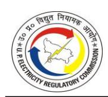

| TABLE 4-158: BANKING AND FINANCE CHARGE FOR FY 2023-24 AS SUBMITTED BY THE PETITIONERS (IN RS. CRORE)  180              |
|----------------------------------------------------------------------------------------------------------------------------------|
| TABLE 4-159: INTEREST ON WORKING CAPITAL FOR FY 2023-24 AS SUBMITTED BY DVVNL (IN RS. CRORE) 181                           |
| TABLE 4-160: INTEREST ON WORKING CAPITAL FOR FY 2023-24 AS SUBMITTED BY MVVNL (IN RS. CRORE) 181                           |
| TABLE 4-161: INTEREST ON WORKING CAPITAL FOR FY 2023-24 AS SUBMITTED BY PVVNL (IN RS. CRORE) 182                           |
| TABLE 4-162: INTEREST ON WORKING CAPITAL FOR FY 2023-24 AS SUBMITTED BY PUVVNL (IN RS. CRORE) 182                          |
| TABLE 4-163: INTEREST ON WORKING CAPITAL FOR FY 2023-24 AS SUBMITTED BY KESCO (IN RS. CRORE) 182                           |
| TABLE 4-164: INTEREST RATE FOR WORKING CAPITAL FOR FY 2023-24 AS CONSIDERED BY THE COMMISSION  183                      |
| TABLE 4-165: INTEREST ON WORKING CAPITAL OF DVVNL FOR FY 2023-24 AS APPROVED BY THE COMMISSION (IN RS. CRORE) 184          |
| TABLE 4-166: INTEREST ON WORKING CAPITAL OF MVVNL FOR FY 2023-24 AS APPROVED BY THE COMMISSION (IN RS. CRORE) 184          |
| TABLE 4-167: INTEREST ON WORKING CAPITAL OF PVVNL FOR FY 2023-24 AS APPROVED BY THE COMMISSION (IN RS. CRORE) 185       |
| TABLE 4-168: INTEREST ON WORKING CAPITAL OF PUVVNL FOR FY 2023-24 AS APPROVED BY THE COMMISSION (IN RS. CRORE) 185         |
| TABLE 4-169: INTEREST ON WORKING CAPITAL OF KESCO FOR FY 2023-24 AS APPROVED BY THE COMMISSION (IN RS. CRORE) 185          |
| TABLE 4-170: CONSOLIDATED INTEREST ON WORKING CAPITAL FOR FY 2023-24 AS APPROVED BY THE COMMISSION (IN RS. CRORE)  186  |
| TABLE 4-171: INTEREST AND FINANCE CHARGES OF DVVNL FOR FY 2023-24 AS APPROVED BY THE COMMISSION (IN RS. CRORE) 186         |
| TABLE 4-172: INTEREST AND FINANCE CHARGES OF MVVNL FOR FY 2023-24 AS APPROVED BY THE COMMISSION (IN RS. CRORE) 187         |
| TABLE 4-173: INTEREST AND FINANCE CHARGES OF PVVNL FOR FY 2023-24 AS APPROVED BY THE COMMISSION (IN RS. CRORE) 187         |
| TABLE 4-174: INTEREST AND FINANCE CHARGES OF PUVVNL FOR FY 2023-24 AS APPROVED BY THE COMMISSION (IN RS. CRORE) 187        |
| TABLE 4-175: INTEREST AND FINANCE CHARGES OF KESCO FOR FY 2023-24 AS APPROVED BY THE COMMISSION (IN RS. CRORE) 188         |
| TABLE 4-176: CONSOLIDATED INTEREST AND FINANCE CHARGES FOR FY 2023-24 AS APPROVED BY THE COMMISSION (IN RS. CRORE)  188 |

| TABLE 4-177: PROVISION FOR BAD AND DOUBTFUL DEBTS FOR FY 2023-24 AS SUBMITTED BY DVVNL (IN RS. CRORE) 189                          |
|------------------------------------------------------------------------------------------------------------------------------------------|
| TABLE 4-178: PROVISION FOR BAD AND DOUBTFUL DEBTS FOR FY 2023-24 AS SUBMITTED BY MVVNL (IN RS. CRORE) 189                          |
| TABLE 4-179: PROVISION FOR BAD AND DOUBTFUL DEBTS FOR FY 2023-24 AS SUBMITTED BY PVVNL (IN RS. CRORE)  189                      |
| TABLE 4-180: PROVISION FOR BAD AND DOUBTFUL DEBTS FOR FY 2023-24 AS SUBMITTED BY PUVVNL (IN RS. CRORE) 189                         |
| TABLE 4-181: PROVISION FOR BAD AND DOUBTFUL DEBTS FOR FY 2023-24 AS SUBMITTED BY KESCO (IN RS. CRORE) 190                          |
| TABLE 4-182: PROVISION FOR BAD AND DOUBTFUL DEBTS OF DVVNL FOR FY 2023-24 AS APPROVED BY THE COMMISSION (IN RS. CRORE)  190     |
| TABLE 4-183: PROVISION FOR BAD AND DOUBTFUL DEBTS OF MVVNL FOR FY 2023-24 AS APPROVED BY THE COMMISSION (IN RS. CRORE)  191  |
| TABLE 4-184: PROVISION FOR BAD AND DOUBTFUL DEBTS OF PVVNL FOR FY 2023-24 AS APPROVED BY THE COMMISSION (IN RS. CRORE)  192     |
| TABLE 4-185: PROVISION FOR BAD AND DOUBTFUL DEBTS OF PUVVNL FOR FY 2023-24 AS APPROVED BY THE COMMISSION (IN RS. CRORE)  192 |
| TABLE 4-186: PROVISION FOR BAD AND DOUBTFUL DEBTS OF KESCO FOR FY 2023-24 AS APPROVED BY THE COMMISSION (IN RS. CRORE)  192     |
| TABLE 4-187: CONSOLIDATED PROVISION FOR BAD AND DOUBTFUL DEBTS FOR FY 2023-24 AS APPROVED BY THE COMMISSION (IN RS. CRORE)  193 |
| TABLE 4-188: RETURN ON EQUITY FOR FY 2023-24 AS SUBMITTED BY DVVNL (IN RS. CRORE)  193                                             |
| TABLE 4-189: RETURN ON EQUITY FOR FY 2023-24 AS SUBMITTED BY MVVNL (IN RS. CRORE)  193                                             |
| TABLE 4-190: RETURN ON EQUITY FOR FY 2023-24 AS SUBMITTED BY PVVNL (IN RS. CRORE)  194                                             |
| TABLE 4-191: RETURN ON EQUITY FOR FY 2023-24 AS SUBMITTED BY PUVVNL (IN RS. CRORE)  194                                         |
| TABLE 4-192: RETURN ON EQUITY FOR FY 2023-24 AS SUBMITTED BY KESCO (IN RS. CRORE)  194                                             |
| TABLE 4-193: RETURN ON EQUITY OF DVVNL FOR FY 2023-24 AS APPROVED BY COMMISSION (IN RS. CRORE) 195                                 |
| TABLE 4-194: RETURN ON EQUITY OF MVVNL FOR FY 2023-24 AS APPROVED BY THE COMMISSION (IN RS. CRORE) 196                             |
| TABLE 4-195: RETURN ON EQUITY OF PVVNL FOR FY 2023-24 AS APPROVED BY THE COMMISSION (IN RS. CRORE) 196                             |

| TABLE 4-196: RETURN ON EQUITY OF PUVVNL FOR FY 2023-24 AS APPROVED BY THE COMMISSION (IN RS. CRORE) 197                                |
|----------------------------------------------------------------------------------------------------------------------------------------------|
| TABLE 4-197: RETURN ON EQUITY OF KESCO FOR FY 2023-24 AS APPROVED BY THE COMMISSION (IN RS. CRORE) 197                                 |
| TABLE 4-198: CONSOLIDATED RETURN ON EQUITY FOR FY 2023-24 AS APPROVED BY THE COMMISSION (IN RS. CRORE) 197                             |
| TABLE 4-199: CONSUMPTION OF LMV-10 IN FY 2023-24 (IN RS. CRORE)  199                                                                   |
| TABLE 4-200: CONSOLIDATED DEEMED REVENUE OF LMV-10 FOR FY 2023-24 (IN RS. CRORE)  199                                                  |
| TABLE 4-201: GOUP SUBSIDY FOR FY 2023-24 AS SUBMITTED BY THE PETITIONERS (IN RS. CRORE)  199                                        |
| TABLE 4-202: GOUP SUBSIDY FOR STATE DISCOMS FOR FY 2023-24 200                                                                            |
| TABLE 4-203: FINANCING COST OF DPS FOR FY 2023-24 AS SUBMITTED BY THE PETITIONERS (IN RS. CRORE) 200                                   |
| TABLE 4-204: ADDITIONAL INTEREST INCURRED FOR FUNDING FY 2023-24 AS SUBMITTED BY THE PETITIONERS (IN RS. CRORE)  201                |
| TABLE 4-205: REVENUE REALIZED UNDER RENTING OF POLE/5G ACTIVITIES IN FY 2023-24 AS SUBMITTED BY THE PETITIONERS (IN RS. CRORE)  201 |
| TABLE 4-206: NON-TARIFF INCOME FOR FY 2023-24 AS SUBMITTED BY DVVNL (IN RS. CRORE)  202                                          |
| TABLE 4-207: NON-TARIFF INCOME FOR FY 2023-24 AS SUBMITTED BY MVVNL (IN RS. CRORE)  202                                             |
| TABLE 4-208: NON-TARIFF INCOME FOR FY 2023-24 AS SUBMITTED BY PVVNL (IN RS. CRORE)  202                                             |
| TABLE 4-209: NON-TARIFF INCOME FOR FY 2023-24 AS SUBMITTED BY PUVVNL (IN RS. CRORE)  202                                            |
| TABLE 4-210: NON-TARIFF INCOME FOR FY 2023-24 AS SUBMITTED BY KESCO (IN RS. CRORE)  203                                                |
| TABLE 4-211: REVISED SUBMISSION BY DVVNL FOR NON-TARIFF INCOME OF FY 2023-24 (IN RS. CRORE) 203                                        |
| TABLE 4-212: REVISED SUBMISSION BY MVVNL FOR NON-TARIFF INCOME OF FY 2023-24 (IN RS. CRORE) 204                                        |
| TABLE 4-213: REVISED SUBMISSION BY PVVNL FOR NON-TARIFF INCOME OF FY 2023-24 (IN RS. CRORE) 204                                        |
| TABLE 4-214: REVISED SUBMISSION BY PUVVNL FOR NON-TARIFF INCOME OF FY 2023-24 (IN RS. CRORE) 204                                       |
| TABLE 4-215: REVISED SUBMISSION BY KESCO FOR NON-TARIFF INCOME OF FY 2023-24 (IN RS. CRORE) 205                                     |

| TABLE 4-216: APPROVED NON-TARIFF INCOME OF DVVNL FOR FY 2023-24 (IN RS. CRORE)  207                                |
|--------------------------------------------------------------------------------------------------------------------------|
| TABLE 4-217: APPROVED NON-TARIFF INCOME OF MVVNL FOR FY 2023-24 (IN RS. CRORE)  207                                |
| TABLE 4-218: APPROVED NON-TARIFF INCOME OF PVVNL FOR FY 2023-24 (IN RS. CRORE)  208                                |
| TABLE 4-219: APPROVED NON-TARIFF INCOME OF PUVVNL FOR FY 2023-24 (IN RS. CRORE)  208                               |
| TABLE 4-220: APPROVED NON-TARIFF INCOME OF KESCO FOR FY 2023-24 (IN RS. CRORE)  209                                |
| TABLE 4-221: APPROVED CONSOLIDATED NON-TARIFF INCOME FOR FY 2023-24 (IN RS. CRORE)  209                         |
| TABLE 4-222: REVENUE FROM SALE OF POWER OF PETITIONERS FOR FY 2023-24 (IN RS. CRORE)  210                       |
| TABLE 4-223: APPROVED REVENUE BY COMMISSION FOR FY 2023-24  210                                                    |
| TABLE 4-224: SUMMARY OF ARR FOR TRUE UP OF DVVNL FOR FY 2023-24 (IN RS. CRORE)  211                                |
| TABLE 4-225: SUMMARY OF ARR FOR TRUE UP OF MVVNL FOR FY 2023-24 (IN RS. CRORE)  212                                |
| TABLE 4-226: SUMMARY OF ARR FOR TRUE-UP OF PVVNL FOR FY 2023-24 (IN RS. CRORE)  213                                |
| TABLE 4-227: SUMMARY OF ARR FOR TRUE-UP OF PUVVNL FOR FY 2023-24 (IN RS. CRORE)  214                               |
| TABLE 4-228: SUMMARY OF ARR FOR TRUE-UP OF KESCO FOR FY 2023-24 (IN RS. CRORE)  215                                |
| TABLE 4-229: SUMMARY OF ARR FOR TRUE-UP OF FY 2023-24 (CONSOLIDATED) (IN RS. CRORE)  216                        |
| TABLE 4-230: COMPARISON OF TRUE-UP FOR FY 2023-24 WITH TARIFF ORDER FOR FY 2022- 23 DATED OCTOBER 10, 2024  217 |
| TABLE 5-1: BILLING DETERMINANTS FOR FY 2024-25 AS SUBMITTED BY DVVNL  218                                          |
| TABLE 5-2: BILLING DETERMINANTS INCLUDING AGRA DF FOR FY 2024-25 AS SUBMITTED BY DVVNL  219                     |
| TABLE 5-3: BILLING DETERMINANTS FOR FY 2024-25 AS SUBMITTED BY MVVNL  220                                          |
| TABLE 5-4: BILLING DETERMINANTS FOR FY 2024-25 AS SUBMITTED BY PVVNL  221                                          |
| TABLE 5-5: BILLING DETERMINANTS FOR FY 2024-25 AS SUBMITTED BY PUVVNL 222                                             |
| TABLE 5-6: BILLING DETERMINANTS FOR FY 2024-25 AS SUBMITTED BY KESCO 223                                              |
| TABLE 5-7: BILLING DETERMINANTS FOR FY 2024-25 DF AGRA AS SUBMITTED BY DVVNL                                             |
|  225                                                                                                                  |

| TABLE 5-8: BILLING DETERMINANTS SUBMISSION OF AGRA DF BY DVVNL 226                                                |
|----------------------------------------------------------------------------------------------------------------------|
| TABLE 5-9: COMPARISON OF CONSUMER NUMBERS OF STATE DISCOMS FOR FY 2023-24 VS FY 2024-25 226                    |
| TABLE 5-10: COMPARISON OF LOAD OF STATE DISCOMS FOR FY 2023-24 VS FY 2024-25226                                      |
| TABLE 5-11: COMPARISON OF SALES OF STATE DISCOMS FOR FY 2023-24 VS FY 2024-25  227                             |
| TABLE 5-12: DISTRIBUTION LOSS FOR FY 2024-25 AS PER RDSS TRAJECTORY  227                                       |
| TABLE 5-13: REVISED DISTRIBUTION LOSS FOR FY 2024-25 AS SUBMITTED BY PETITIONERS  228                          |
| TABLE 5-14: ENERGY BALANCE FOR FY 2024-25 AS SUBMITTED BY DVVNL  228                                           |
| TABLE 5-15: ENERGY BALANCE FOR FY 2024-25 AS SUBMITTED BY MVVNL 229                                               |
| TABLE 5-16: ENERGY BALANCE FOR FY 2024-25 AS SUBMITTED BY PVVNL 229                                               |
| TABLE 5-17: ENERGY BALANCE FOR FY 2024-25 AS SUBMITTED BY PUVVNL  230                                       |
| TABLE 5-18: ENERGY BALANCE FOR FY 2024-25 AS SUBMITTED BY KESCO  230                                           |
| TABLE 5-19: CONSOLIDATED ENERGY BALANCE FOR FY 2024-25 AS SUBMITTED BY THE PETITIONERS 231                     |
| TABLE 5-20: GENERATING STATION WISE POWER PURCHASE COST FOR FY 2024-25 AS SUBMITTED BY THE PETITIONERS 232     |
|                                                                                                                      |
| TABLE 5-21: COMPUTATION OF DBST FOR FY 2024-25 AS SUBMITTED BY THE PETITIONERS  237                            |
| TABLE 5-22: COMPUTATION OF DBST FOR FY 2024-25 AS SUBMITTED BY DVVNL 238                                          |
| TABLE 5-23: COMPUTATION OF DBST FOR FY 2024-25 AS SUBMITTED BY MVVNL 238                                          |
| TABLE 5-24: COMPUTATION OF DBST FOR FY 2024-25 AS SUBMITTED BY PVVNL  238                                      |
| TABLE 5-25: COMPUTATION OF DBST FOR FY 2024-25 AS SUBMITTED BY PUVVNL 239                                         |
| TABLE 5-26: COMPUTATION OF DBST FOR FY 2024-25 AS SUBMITTED BY KESCO 239                                          |
| TABLE 5-27: CONSOLIDATED POWER PURCHASE FOR FY 2024-25 AS SUBMITTED BY THE PETITIONERS 239                     |
| TABLE 5-28: RPO TRAJECTORY AS PER UPERC REGULATION 240                                                            |
| TABLE 5-29: RENEWABLE PURCHASE OBLIGATION (RPO) CALCULATION FOR FY 2024-25 AS SUBMITTED BY THE PETITIONERS 241 |
| TABLE 5-30: INTRA-STATE TRANSMISSION CHARGES FOR FY 2024-25 AS SUBMITTED BY DVVNL  242                      |
| TABLE 5-31: INTRA-STATE TRANSMISSION CHARGES FOR FY 2024-25 AS SUBMITTED BY MVVNL  242                      |

| TABLE 5-33: INTRA-STATE TRANSMISSION CHARGES FOR FY 2024-25 AS SUBMITTED BY PUVVNL  243                            |
|-----------------------------------------------------------------------------------------------------------------------------|
| TABLE 5-34: INTRA-STATE TRANSMISSION CHARGES FOR FY 2024-25 AS SUBMITTED BY KESCO 243                                 |
| TABLE 5-35: CONSOLIDATED INTRA-STATE TRANSMISSION CHARGES FOR FY 2024-25 AS PER SUBMISSION BY THE PETITIONERS  244 |
| TABLE 5-36: COMPUTED EMPLOYEE EXPENSES FOR FY 2024-25 AS SUBMITTED BY THE PETITIONERS 244                             |
| TABLE 5-37: EMPLOYEE EXPENSES FOR FY 2024-25 AS SUBMITTED BY DVVNL (IN RS. CRORE)  245                                |
| TABLE 5-38: EMPLOYEE EXPENSES FOR FY 2024-25 AS SUBMITTED BY MVVNL (IN RS. CRORE)  245                                |
| TABLE 5-39: EMPLOYEE EXPENSES FOR FY 2024-25 AS SUBMITTED BY PVVNL (IN RS. CRORE)  245                                |
| TABLE 5-40: EMPLOYEE EXPENSES FOR FY 2024-25 AS SUBMITTED BY PUVVNL (IN RS. CRORE)  246                            |
| TABLE 5-41: EMPLOYEE EXPENSES FOR FY 2024-25 AS SUBMITTED BY KESCO (IN RS. CRORE)  246                                |
| TABLE 5-42: R&M EXPENSES FOR FY 2024-25 AS SUBMITTED BY THE PETITIONERS  246                                          |
| TABLE 5-43: NORMATIVE R&M EXPENSES FOR FY 2024-25 AS SUBMITTED BY DVVNL (IN RS. CRORE)  246                        |
| TABLE 5-44: NORMATIVE R&M EXPENSES FOR FY 2024-25 AS SUBMITTED BY MVVNL (IN RS. CRORE)  247                        |
| TABLE 5-45: NORMATIVE R&M EXPENSES FOR FY 2024-25 AS SUBMITTED BY PVVNL (IN RS. CRORE)  247                        |
| TABLE 5-46: NORMATIVE R&M EXPENSES FOR FY 2024-25AS SUBMITTED BY PUVVNL (IN RS. CRORE)  247                        |
| TABLE 5-47: NORMATIVE R&M EXPENSES FOR FY 2024-25 AS SUBMITTED BY KESCO (IN RS. CRORE)  247                        |
| TABLE 5-48: A&G EXPENSES FOR FY 2024-25 AS SUBMITTED BY THE PETITIONERS  248                                          |
| TABLE 5-49: NORMATIVE A&G EXPENSES FOR FY 2024-25 AS SUBMITTED BY DVVNL (IN RS. CRORE)  248                        |
| TABLE 5-50: NORMATIVE A&G EXPENSES FOR FY 2024-25 AS SUBMITTED BY MVVNL (IN RS. CRORE)  248                        |
| TABLE 5-51: NORMATIVE A&G EXPENSES FOR FY 2024-25 AS SUBMITTED BY PVVNL (IN RS. CRORE)  248                        |
| TABLE 5-52: NORMATIVE A&G EXPENSES FOR FY 2024-25 AS SUBMITTED BY PUVVNL (IN RS. CRORE)  249                       |

| TABLE 5-53: NORMATIVE A&G EXPENSES FOR FY 2024-25 AS SUBMITTED BY KESCO (IN RS. CRORE)  249                     |
|--------------------------------------------------------------------------------------------------------------------------|
| TABLE 5-54: SMART METERING OPEX FOR FY 2024-25 AS SUBMITTED BY THE PETITIONERS  249                                |
| TABLE 5-55: O&M EXPENSES FOR FY 2024-25 AS SUBMITTED BY DVVNL (IN RS. CRORE) 250                                      |
| TABLE 5-56: O&M EXPENSES FOR FY 2024-25 AS SUBMITTED BY MVVNL (IN RS. CRORE) 250                                      |
| TABLE 5-57: O&M EXPENSES FOR FY 2024-25 AS SUBMITTED BY PVVNL (IN RS. CRORE). 251                                     |
| TABLE 5-58: O&M EXPENSES FOR FY 2024-25 AS SUBMITTED BY PUVVNL (IN RS. CRORE)  251                                 |
| TABLE 5-59: O&M EXPENSES FOR FY 2024-25 AS SUBMITTED BY KESCO (IN RS. CRORE). 251                                     |
| TABLE 5-60: CONSOLIDATED O&M EXPENSES FOR FY 2024-25 AS PER SUBMISSION BY THE PETITIONERS (IN RS. CRORE)  252   |
| TABLE 5-61: NORMATIVE EMPLOYEE EXPENSES FOR FY 2024-25 AS CONSIDERED BY THE COMMISSION (IN RS. CRORE) 252          |
| TABLE 5-62: NORMATIVE R&M EXPENSES FOR FY 2024-25 AS CONSIDERED BY THE COMMISSION (IN RS. CRORE) 253               |
| TABLE 5-63: NORMATIVE A&G EXPENSES FOR FY 2024-25 AS CONSIDERED BY THE COMMISSION (IN RS. CRORE) 253               |
| TABLE 5-64: CAPEX FOR FY 2024-25 AS SUBMITTED BY DVVNL (IN RS. CRORE)  253                                         |
| TABLE 5-65: CAPEX FOR FY 2024-25 AS SUBMITTED BY MVVNL (IN RS. CRORE)  254                                         |
| TABLE 5-66: CAPEX FOR FY 2024-25 AS SUBMITTED BY PVVNL (IN RS. CRORE) 254                                             |
| TABLE 5-67: CAPEX FOR FY 2024-25 AS SUBMITTED BY PUVVNL (IN RS. CRORE)  254                                        |
| TABLE 5-68: CAPEX FOR FY 2024-25 AS SUBMITTED BY KESCO (IN RS. CRORE) 254                                             |
| TABLE 5-69: CAPITALISATION AND CWIP FOR FY 2024-25 AS SUBMITTED BY THE PETITIONERS (IN RS. CRORE)  255          |
| TABLE 5-70: FINANCING OF TOTAL CAPITALISATION IN FY 2024-25 AS SUBMITTED BY THE PETITIONERS (IN RS. CRORE)  255 |
| TABLE 5-71: FINANCING OF CAPITAL INVESTMENT IN FY 2024-25 AS CONSIDERED BY THE COMMISSION (IN RS. CRORE) 256       |
| TABLE 5-72: DEPRECIATION FOR FY 2024-25 AS SUBMITTED BY DVVNL (in Rs. Crore) 257                                      |
| TABLE 5-73: DEPRECIATION FOR FY 2024-25 AS SUBMITTED BY MVVNL (IN RS. CRORE). 257                                     |
| TABLE 5-74: DEPRECIATION FOR FY 2024-25 AS SUBMITTED BY PVVNL (IN RS. CRORE)  258                                  |
| TABLE 5-75: DEPRECIATION FOR FY 2024-25 AS SUBMITTED BY PUVVNL (IN RS. CRORE) 258                                     |
| TABLE 5-76: DEPRECIATION FOR FY 2024-25 AS SUBMITTED BY KESCO (IN RS. CRORE) 258                                      |
| TABLE 5-77: CONSOLIDATED DEPRECIATION FOR FY 2024-25 AS PER SUBMISSION BY THE PETITIONERS (IN RS. CRORE)  258   |

| TABLE 5-78: DEPRECIATION APPROVED FOR FY 2024-25 OF DVVNL (in Rs. Crore) 259                                                  |
|----------------------------------------------------------------------------------------------------------------------------------|
| TABLE 5-79: DEPRECIATION APPROVED FOR FY 2024-25 OF MVVNL (IN RS. CRORE) 259                                                  |
| TABLE 5-80: DEPRECIATION APPROVED FOR FY 2024-25 OF PVVNL (IN RS. CRORE)  259                                              |
| TABLE 5-81: DEPRECIATION APPROVED FOR FY 2024-25 OF PUVVNL (IN RS. CRORE) 259                                                 |
| TABLE 5-82: DEPRECIATION APPROVED FOR FY 2024-25 OF KESCO (IN RS. CRORE) 259                                                  |
| TABLE 5-83: CONSOLIDATED DEPRECIATION APPROVED FOR FY 2024-25 (IN RS. CRORE)260                                                  |
| TABLE 5-84: INTEREST ON LONG-TERM LOAN FOR FY 2024-25 AS SUBMITTED BY DVVNL (IN RS. CRORE) 261                             |
| TABLE 5-85: INTEREST ON LONG-TERM LOAN FOR FY 2024-25 AS SUBMITTED BY MVVNL (IN RS. CRORE) 261                             |
| TABLE 5-86: INTEREST ON LONG-TERM LOAN FOR FY 2024-25 AS SUBMITTED BY PVVNL (IN RS. CRORE) 261                             |
| TABLE 5-87: INTEREST ON LONG-TERM LOAN FOR FY 2024-25 AS SUBMITTED BY PUVVNL (IN RS. CRORE) 262                            |
| TABLE 5-88: INTEREST ON LONG-TERM LOAN FOR FY 2024-25 AS SUBMITTED BY KESCO (IN RS. CRORE) 262                             |
| TABLE 5-89: CONSOLIDATED INTEREST ON LONG-TERM LOAN FOR FY 2024-25 AS PER SUBMISSION BY THE PETITIONERS (IN RS. CRORE) 262 |
| TABLE 5-90: LONG-TERM LOAN FOR FY 2024-25 AS CONSIDERED BY THE COMMISSION FOR DVVNL (IN RS. CRORE) 263                     |
| TABLE 5-91: LONG-TERM LOAN FOR FY 2024-25 AS CONSIDERED BY THE COMMISSION FOR MVVNL (IN RS. CRORE) 263                     |
| TABLE 5-92: LONG-TERM LOAN FOR FY 2024-25 AS CONSIDERED BY THE COMMISSION FOR PVVNL (IN RS. CRORE)  264                 |
| TABLE 5-93: LONG-TERM LOAN FOR FY 2024-25 AS CONSIDERED BY THE COMMISSION FOR PUVVNL (IN RS. CRORE) 264                    |
| TABLE 5-94: LONG-TERM LOAN FOR FY 2024-25 AS CONSIDERED BY THE COMMISSION FOR KESCO (IN RS. CRORE) 264                     |
| TABLE 5-95: LONG-TERM LOAN FOR FY 2024-25 AS CONSIDERED BY THE COMMISSION (CONSOLIDATED) (IN RS. CRORE)  264            |
| TABLE 5-96: INTEREST ON CONSUMER SECURITY DEPOSIT FOR FY 2024-25 AS SUBMITTED BY THE PETITIONERS (IN RS. CRORE)  265    |
| TABLE 5-97: INTEREST ON CONSUMER SECURITY DEPOSIT FOR FY 2024-25 AS CONSIDERED BY THE COMMISSION (IN RS. CRORE) 266        |
| TABLE 5-98: BANKING AND FINANCE CHARGES FOR FY 2024-25 AS SUBMITTED BY THE PETITIONERS (IN RS. CRORE)  266              |
| TABLE 5-99: INTEREST ON WORKING CAPITAL FOR FY 2024-25 AS SUBMITTED BY DVVNL (IN RS. CRORE) 267                            |

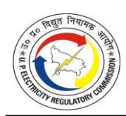

| TABLE 5-100: INTEREST ON WORKING CAPITAL FOR FY 2024-25 AS SUBMITTED BY MVVNL (IN RS. CRORE) 267                                      |
|---------------------------------------------------------------------------------------------------------------------------------------------|
| TABLE 5-101: INTEREST ON WORKING CAPITAL FOR FY 2024-25 AS SUBMITTED BY PVVNL (IN RS. CRORE) 267                                      |
| TABLE 5-102: INTEREST ON WORKING CAPITAL FOR FY 2024-25 AS SUBMITTED BY PUVVNL (IN RS. CRORE) 268                                     |
| TABLE 5-103: INTEREST ON WORKING CAPITAL FOR FY 2024-25 AS SUBMITTED BY KESCO (IN RS. CRORE) 268                                   |
| TABLE 5-104: CONSOLIDATED INTEREST ON WORKING CAPITAL FOR FY 2024-25 AS PER SUBMISSION BY THE PETITIONERS (IN RS. CRORE) 269          |
| TABLE 5-105: PROVISION FOR BAD AND DOUBTFUL DEBTS FOR FY 2024-25 AS SUBMITTED BY DVVNL (IN RS. CRORE) 269                             |
| TABLE 5-106: PROVISION FOR BAD AND DOUBTFUL DEBTS FOR FY 2024-25 AS SUBMITTED BY MVVNL (IN RS. CRORE) 269                          |
| TABLE 5-107: PROVISION FOR BAD AND DOUBTFUL DEBTS FOR FY 2024-25 AS SUBMITTED BY PVVNL (IN RS. CRORE)  270                         |
| TABLE 5-108: PROVISION FOR BAD AND DOUBTFUL DEBTS FOR FY 2024-25 AS SUBMITTED BY PUVVNL (IN RS. CRORE) 270                            |
| TABLE 5-109: PROVISION FOR BAD AND DOUBTFUL DEBTS FOR FY 2024-25 AS SUBMITTED BY KESCO (IN RS. CRORE) 270                             |
| TABLE 5-110: CONSOLIDATED PROVISION FOR BAD AND DOUBTFUL DEBTS FOR FY 2024-25 AS PER SUBMISSION BY THE PETITIONERS (IN RS. CRORE) 270 |
| TABLE 5-111: CONSOLIDATED PROVISION FOR BAD AND DOUBTFUL DEBTS FOR FY 2024-25 APPROVED BY THE COMMISSION (IN RS. CRORE)  271       |
| TABLE 5-112: RETURN ON EQUITY FOR FY 2024-25 AS SUBMITTED BY DVVNL (IN RS. CRORE)  272                                                |
| TABLE 5-113: RETURN ON EQUITY FOR FY 2024-25 AS SUBMITTED BY MVVNL (IN RS. CRORE)  272                                                |
| TABLE 5-114: RETURN ON EQUITY FOR FY 2024-25 AS SUBMITTED BY PVVNL (IN RS. CRORE)  272                                                |
| TABLE 5-115: RETURN ON EQUITY FOR FY 2024-25 AS SUBMITTED BY PUVVNL (IN RS. CRORE)  272                                         |
| TABLE 5-116: RETURN ON EQUITY FOR FY 2024-25 AS SUBMITTED BY KESCO (IN RS. CRORE)  273                                                |
| TABLE 5-117: CONSOLIDATED RETURN ON EQUITY FOR FY 2024-25 AS PER SUBMISSION BY THE PETITIONERS (IN RS. CRORE)  273              |
| TABLE 5-118: NON-TARIFF INCOME FOR FY 2024-25 AS SUBMITTED BY PETITIONERS (IN RS. CRORE)  274                                      |

| TABLE 5-119: REVENUE FROM SALE OF POWER FOR FY 2024-25 (IN RS. CRORE) 275                                       |
|--------------------------------------------------------------------------------------------------------------------|
| TABLE 5-120: DETAILS OF APPROVED GOUP SUBSIDY SUBMITTED BY THE PETITIONERS 275                                  |
| TABLE 5-121: GOUP SUBSIDY FOR FY 2024-25 276                                                                    |
| TABLE 5-122: SUMMARY OF APR OF DVVNL FOR FY 2024-25 276                                                         |
| TABLE 5-123: SUMMARY OF APR OF MVVNL FOR FY 2024-25 277                                                         |
| TABLE 5-124: SUMMARY OF APR OF PVVNL FOR FY 2024-25 278                                                         |
| TABLE 5-125: SUMMARY OF APR OF PuVVNL FOR FY 2024-25 279                                                        |
| TABLE 5-126: SUMMARY OF APR OF KESCO FOR FY 2024-25  280                                                     |
| TABLE 5-127: SUMMARY OF APR FOR FY 2024-25 (CONSOLIDATED)  281                                               |
| TABLE 5-128: COMPARISON OF APR FOR FY 2024-25 WITH TARIFF ORDER FOR FY 2024-25 DATED OCTOBER 10, 2024 283    |
| TABLE 6-1: BILLING DETERMINANTS FOR FY 2025-26 AS SUBMITTED BY DVVNL  285                                    |
| TABLE 6-2: BILLING DETERMINANTS FOR FY 2025-26 AS SUBMITTED BY MVVNL  286                                    |
| TABLE 6-3: BILLING DETERMINANTS FOR FY 2025-26 AS SUBMITTED BY PVVNL  286                                    |
| TABLE 6-4: BILLING DETERMINANTS FOR FY 2025-26 AS SUBMITTED BY PuVVNL  287                                   |
| TABLE 6-5: BILLING DETERMINANTS FOR FY 2025-26 AS SUBMITTED BY KESCO 287                                        |
| TABLE 6-6: BILLING DETERMINANTS OF THE AGRA DISTRIBUTION FRANCHISE FOR FY 2025- 26 AS SUBMITTED BY DVVNL 288 |
| TABLE 6-7: APPROVED BILLING DETERMINANTS OF DVVNL FOR FY 2025-26 (INCLUDING DF OF AGRA) 290                  |
| TABLE 6-8: APPROVED BILLING DETERMINANTS OF MVVNL FOR FY 2025-26  290                                        |
| TABLE 6-9: APPROVED BILLING DETERMINANTS OF PVVNL FOR FY 2025-26  291                                        |
| TABLE 6-10: APPROVED BILLING DETERMINANTS OF PuVVNL FOR FY 2025-26  291                                      |
| TABLE 6-11: APPROVED BILLING DETERMINANTS OF KESCO FOR FY 2025-26 292                                           |
| TABLE 6-12: APPROVED BILLING DETERMINANTS OF (CONSOLIDATED) FOR FY 2025-26 292                                  |
| TABLE 6-13: DISTRIBUTION LOSS FOR THE CONTROL PERIOD AS SUBMITTED BY THE PETITIONERS 293                  |
| TABLE 6-14: AT&C LOSSES FOR FY 2024-25 AS SUBMITTED BY THE PETITIONERS AS PER CEA METHODOLOGY 295            |
| TABLE 6-15: PM SURYA GHAR: MUFT BIJLI YOJANA (RTS INSTALLATIONS) FOR FY 2024-25  296                      |
| TABLE 6-16: PM SURYA GHAR: MUFT BIJLI YOJANA (RTS INSTALLATIONS) FOR FY 2025-26 UP TILL MAY 2025 296         |
| TABLE 6-17: SUMMARY OF KUSUM PROGRESS  297                                                                   |
| TABLE 6-18: COMPONENT C-1 (INDIVIDUAL PUMP SOLARIZATION)  297                                                |

| TABLE 6-19: COMPONENT C-2 (FEEDER LEVEL SOLARIZATION)  298                                                     |
|----------------------------------------------------------------------------------------------------------------------|
| TABLE 6-20: DISCOM-WISE CAPACITY (IN MW) 298                                                                      |
| TABLE 6-21: SMART METER INSTALLATION PROGRESS  298                                                             |
| TABLE 6-22: RDSS ACHIEVEMENT VIS-À-VIS PROPOSED TRAJECTORY 301                                                    |
| TABLE 6-23: ACTUAL DISTRIBUTION LOSS DETAILS OF DISCOMS FROM FY 2020-21 TO FY 2024-25 302                      |
| TABLE 6-24: LOSS REDUCTION PERCENTAGE ACHIEVED COMPARED TO THE PREVIOUS YEAR  302                              |
| TABLE 6-25: CAPEX AND CAPITALIZATION PROGRESS ON SMART METERING AND LOSS REDUCTION WORKS (IN RS. CRORE) 303    |
| TABLE 6-26: CAGR CALCULATION FROM FY 2024-25 TO FY 2029-30 OF DISTRIBUTION LOSSES  305                         |
| TABLE 6-27: DISTRIBUTION LOSS TRAJECTORY APPROVED FOR THE CONTROL PERIOD FROM FY 2025-26 TO FY 2029-30  306 |
| TABLE 6-28: REVISED ENERGY BALANCE FOR FY 2025-26 AS SUBMITTED BY PETITIONERS  306                             |
| TABLE 6-29: APPROVED ENERGY BALANCE FOR FY 2025-26 307                                                            |
| TABLE 6-30: CONSOLIDATED ENERGY BALANCE FOR FY 2025-26 AS SUBMITTED BY THE PETITIONERS 308                     |
| TABLE 6-31: COD OF UPCOMING PLANTS FOR FY 2025-26 AS SUBMITTED BY THE PETITIONERS 309                          |
| TABLE 6-32: SHORT-TERM POWER PROCUREMENT PLAN FOR FY 2025-26 AS SUBMITTED BY THE PETITIONERS 310               |
| TABLE 6-33: ASSUMPTIONS CONSIDERED FOR FY 2025-26 AS SUBMITTED BY THE PETITIONERS 311                          |
| TABLE 6-34: POWER PURCHASE FOR FY 2025-26 AS SUBMITTED BY PETITIONERS  315                                     |
| TABLE 6-35: COMPUTATION OF DBST FOR FY 2025-26 AS SUBMITTED BY THE PETITIONERS  321                            |
| TABLE 6-36: POWER PURCHASE FOR FY 2025-26 AS SUBMITTED BY THE PETITIONERS  323                                 |
| TABLE 6-37: RPO COMPLIANCE FOR FY 2025-26 AS SUBMITTED BY THE PETITIONERS  323                                 |
| TABLE 6-38: DETAILS OF VARIOUS PROPOSALS SUBMITTED TO THE COMMISSION 326                                          |
| TABLE 6-39: UPDATED STATUS OF UPCOMING PLANTS FOR FY 2025-26  328                                              |
| TABLE 6-40: APPROVED POWER PURCHASE FOR FY 2025-26  329                                                        |
| TABLE 6-41: SUMMARY OF APPROVED POWER PURCHASE FOR FY 2025-26  334                                             |
| TABLE 6-42: APPROVED BULK SUPPLY TARIFF FOR THE STATE DISCOMS FOR FY 2025-26  335                              |

| TABLE 6-43: APPROVED AVERAGE POWER PURCHASE COST FOR FY 2025-26 335                                                         |
|--------------------------------------------------------------------------------------------------------------------------------|
| TABLE 6-44: PLANT-WISE ALLOCATION MATRIX FOR FY 2025-26 336                                                                 |
| TABLE 6-45: ALLOCATED PLANT-WISE ENERGY RECEIVED AT DISCOM PERIPHERY FOR FY 2025-26 (IN MUs)  336                     |
| TABLE 6-46: ALLOCATED PLANT-WISE POWER PROCUREMENT COST AT DISCOM PERIPHERY FOR FY 2025-26 (IN RS. CRORE)  336        |
| TABLE 6-47: APPROVED DIFFERENTIAL BULK SUPPLY TARIFF FOR THE STATE DISCOMS FOR FY 2025-26 337                            |
| TABLE 6-48: ALLOWABLE POWER PURCHASE FOR THE STATE DISCOMS FOR FY 2025-26 AS APPROVED BY THE COMMISSION 338              |
| TABLE 6-49: RPO TRAJECTORY AS PER UPERC RPO REGULATIONS, 2019  339                                                       |
| TABLE 6-50: RSPV LOAD DETAILS AS ON MAY'25 AS PER PETITIONER'S SUBMISSION (IN KW)  341                                   |
| TABLE 6-51: CAPACITY DETAILS UNDER KUSUM SCHEME (IN MW) 341                                                                 |
| TABLE 6-52: APPROVED TRANSMISSION LOSSES FOR RPO FOR FY 2025-26 343                                                         |
| TABLE 6-53: APPROVED RPO COMPLIANCE FOR FY 2025-26  343                                                                  |
| TABLE 6-54: INTRA-STATE TRANSMISSION CHARGES FOR FY 2025-26 AS SUBMITTED BY THE PETITIONERS 344                          |
| TABLE 6-55: APPROVED INTRA-STATE TRANSMISSION CHARGES FOR FY 2025-26 345                                                    |
| TABLE 6-56: INFLATION INDICES FOR FY 2025-26 AS SUBMITTED BY THE PETITIONERS  346                                        |
| TABLE 6-57: COMPUTATION OF EMPLOYEE EXPENSES FOR FY 2025-26 AS SUBMITTED BY THE PETITIONERS 346                          |
| TABLE 6-58: EMPLOYEE EXPENSES FOR FY 2025-26 AS SUBMITTED BY THE PETITIONERS (IN RS. CRORE) 347                          |
| TABLE 6-59: COMPUTATION OF R&M EXPENSES FOR FY 2025-26 AS SUBMITTED BY THE PETITIONERS 347                               |
| TABLE 6-60: COMPUTATION OF A&G EXPENSES FOR FY 2025-26 AS SUBMITTED BY THE PETITIONERS 348                               |
| TABLE 6-61: SMART METER OPEX FOR FY 2025-26 AS SUBMITTED BY THE PETITIONERS (IN RS. CRORE) 350                           |
| TABLE 6-62: OPERATION & MAINTENANCE (O&M) EXPENSES FOR FY 2025-26 AS SUBMITTED BY THE PETITIONERS (IN RS. CRORE)  351 |
| TABLE 6-63: CONSUMER PRICE INDEX FOR INDUSTRIAL WORKERS (ALL INDIA) AS PER LABOUR BUREAU 352                             |
| TABLE 6-64: CPI INFLATION INDEX FOR FY 2025-26 CONSIDERED BY THE COMMISSION. 353                                            |
| TABLE 6-65: NORMATIVE EMPLOYEE EXPENSES FOR FY 2025-26 AS CONSIDERED BY THE COMMISSION (IN RS. CRORE) 353                |

| TABLE 6-66: NORMATIVE R&M EXPENSES FOR FY 2025-26 AS CONSIDERED BY THE COMMISSION (IN RS. CRORE) 355                                               |
|----------------------------------------------------------------------------------------------------------------------------------------------------------|
| TABLE 6-67: WHOLESALE PRICE INDEX (WPI) AS PER THE OFFICE OF ECONOMIC ADVISOR OF THE GOVERNMENT OF INDIA  356                                   |
| TABLE 6-68: WPI INFLATION INDEX FOR FY 2025-26 CONSIDERED BY THE COMMISSION 357                                                                       |
| TABLE 6-69: AUDITED A&G EXPENSES FROM FY 2019-20 TO FY 2023-24 (IN RS. CRORE). 357                                                                    |
| TABLE 6-70: SMART METERING OPEX DETAILS FROM FY 2019-20 TO FY 2023-24 (IN RS. CRORE)  358                                                       |
| TABLE 6-71: NORMATIVE A&G EXPENSES FOR FY 2025-26 AS APPROVED BY THE COMMISSION (IN RS. CRORE) 358                                                 |
| TABLE 6-72: APPROVED O&M EXPENSES OF DVVNL FOR FY 2025-26 (IN RS. CRORE)  361                                                                      |
| TABLE 6-73: APPROVED O&M EXPENSES OF MVVNL FOR FY 2025-26 (IN RS. CRORE)  361                                                                      |
| TABLE 6-74: APPROVED O&M EXPENSES OF PVVNL FOR FY 2025-26 (IN RS. CRORE) 362                                                                          |
| TABLE 6-75: APPROVED O&M EXPENSES OF PUVVNL FOR FY 2025-26 (IN RS. CRORE)  362                                                                     |
| TABLE 6-76: APPROVED O&M EXPENSES OF KESCO FOR FY 2025-26 (IN RS. CRORE) 362                                                                          |
| TABLE 6-77: APPROVED CONSOLIDATED O&M EXPENSES FOR FY 2025-26 (IN RS. CRORE)                                                                             |
|  363                                                                                                                                                  |
| TABLE 6-78: CAPITAL EXPENSES FOR FY 2025-26 FOR DVVNL (IN RS. CRORE) 363                                                                              |
| TABLE 6-79: CAPITAL EXPENSES FOR FY 2025-FOR MVVNL (IN RS. CRORE) 364                                                                                 |
| TABLE 6-80: CAPITAL EXPENSES FOR FY 2025-26 FOR PVVNL (IN RS. CRORE)  364                                                                          |
| TABLE 6-81: CAPITAL EXPENSES FOR FY 2025-26 FOR PUVVNL (IN RS. CRORE) 364                                                                             |
| TABLE 6-82: CAPITAL EXPENSES FOR FY 2025-26 FOR KESCO (IN RS. CRORE) 365                                                                              |
| TABLE 6-83: CONSOLIDATED CAPITAL EXPENSES FOR FY 2025-26 (IN RS. CRORE)  365                                                                       |
| TABLE 6-84: FINANCING OF CAPITALISATION FOR FY 2025-26 APPROVED BY THE COMMISSION (IN RS. CRORE) 366                                               |
| TABLE 6-85: GROSS ALLOWABLE DEPRECIATION FOR ASSETS UP TO 31.03.2020 FOR FY 2025- 26 AS SUBMITTED BY DVVNL (IN RS. CRORE) (PART-A) 367             |
| TABLE 6-86: GROSS ALLOWABLE DEPRECIATION FOR ASSETS FROM 01.04.2020 ONWARD FOR FY 2025-26 AS SUBMITTED BY DVVNL (IN RS. CRORE) (PART-B)  367    |
| TABLE 6-87: GROSS ALLOWABLE DEPRECIATION FOR ASSETS FROM 01.04.2025 ONWARDS FY 2025-26 AS SUBMITTED BY DVVNL (IN RS. CRORE) (PART-C) 367           |
| TABLE 6-88: GROSS ALLOWABLE DEPRECIATION FOR ASSETS UP TO 31.03.2020 FOR FY 2025- 26 AS SUBMITTED BY MVVNL (IN RS. CRORE) (PART-A) 368             |
| TABLE 6-89: GROSS ALLOWABLE DEPRECIATION FOR ASSETS FROM 01.04.2020 TO 31.03.2025 FOR FY 2025-26 AS SUBMITTED BY MVVNL (IN RS. CRORE) (PART-B) 368 |

| TABLE 6-90: GROSS ALLOWABLE DEPRECIATION FOR ASSETS FROM 01.04.2025 ONWARDS FY 2025-26 AS SUBMITTED BY MVVNL (IN RS. CRORE) (PART-C) 369               |
|--------------------------------------------------------------------------------------------------------------------------------------------------------------|
| TABLE 6-91: GROSS ALLOWABLE DEPRECIATION FOR ASSETS UP TO 31.03.2020 FOR FY 2025- 26 AS SUBMITTED BY PVVNL (IN RS. CRORE) (PART-A)  369             |
| TABLE 6-92: GROSS ALLOWABLE DEPRECIATION FOR ASSETS FROM 01.04.2020 TO 31.03.2025 FOR FY 2025-26 AS SUBMITTED BY PVVNL (IN RS. CRORE) (PART-B)  370 |
| TABLE 6-93: GROSS ALLOWABLE DEPRECIATION FOR ASSETS UP FROM 01.04.2025 ONWARDS FY 2025-26 AS SUBMITTED BY PVVNL (IN RS. CRORE) (PART-C) 370         |
| TABLE 6-94: GROSS ALLOWABLE DEPRECIATION FOR ASSETS UP TO 31.03.2020 FOR FY 2025- 26 AS SUBMITTED BY PUVVNL (IN RS. CRORE) (PART-A) 371             |
| TABLE 6-95: GROSS ALLOWABLE DEPRECIATION FOR ASSETS FROM 31.03.2020 TO 31.03.2025 FOR FY 2025-26 AS SUBMITTED BY PUVVNL (IN RS. CRORE) (PART-B) 371    |
| TABLE 6-96: GROSS ALLOWABLE DEPRECIATION FOR ASSETS FROM 01.04.2025 ONWARDS FY 2025-26 AS SUBMITTED BY PUVVNL (IN RS. CRORE) (PART-C) 371              |
| TABLE 6-97: GROSS ALLOWABLE DEPRECIATION FOR ASSETS UP TO 31.03.2020 FOR FY 2025- 26 AS SUBMITTED BY KESCO (IN RS. CRORE) (PART-A) 372                 |
| TABLE 6-98: GROSS ALLOWABLE DEPRECIATION FOR ASSETS FROM 01.04.2020 TO 31.03.2025 FOR FY 2025-26 AS SUBMITTED BY KESCO (IN RS. CRORE) (PART-B)  372 |
| TABLE 6-99: GROSS ALLOWABLE DEPRECIATION FOR ASSETS 01.04.2025 ONWARDS FY 2025-26 AS SUBMITTED BY KESCO (IN RS. CRORE) (PART-C) 373                    |
| TABLE 6-100: DEPRECIATION FOR FY 2025-26 AS SUBMITTED BY THE PETITIONERS (IN RS. CRORE)  373                                                        |
| TABLE 6-101: GROSS ALLOWABLE DEPRECIATION FOR ASSETS UP TO 31.03.2020 FOR FY 2025-26 AS APPROVED FOR DVVNL (IN RS. CRORE) (PART-A) 375                 |
| TABLE 6-102: GROSS ALLOWABLE DEPRECIATION FOR ASSETS FROM 01.04.2020 TO 31.03.2025 FOR FY 2025-26 APPROVED FOR DVVNL (IN RS. CRORE) (PART-B) 376       |
| TABLE 6-103: GROSS ALLOWABLE DEPRECIATION FOR ASSETS FROM 01.04.2025 ONWARDS FY 2025-26 APPROVED FOR DVVNL (IN RS. CRORE) (PART-C) 376                 |
| TABLE 6-104: GROSS ALLOWABLE DEPRECIATION FOR ASSETS UP TO 31.03.2020 FOR FY 2025-26 APPROVED FOR MVVNL (IN RS. CRORE) (PART-A) 376                    |
| TABLE 6-105: GROSS ALLOWABLE DEPRECIATION FOR ASSETS FROM 01.04.2020 TO 31.03.2025 FOR FY 2025-26 APPROVED FOR MVVNL (IN RS. CRORE) (PART-B) 377       |
| TABLE 6-106: GROSS ALLOWABLE DEPRECIATION FOR ASSETS FROM 01.04.2025 ONWARDS FY 2025-26 APPROVED FOR MVVNL (IN RS. CRORE) (PART-C) 377                 |
| TABLE 6-107: GROSS ALLOWABLE DEPRECIATION FOR ASSETS UP TO 31.03.2020 FOR FY 2025-26 APPROVED FOR PVVNL (IN RS. CRORE) (PART-A)  378                |
| TABLE 6-108: GROSS ALLOWABLE DEPRECIATION FOR ASSETS FROM 01.04.2020 TO 31.03.2025 FOR FY 2025-26 APPROVED FOR PVVNL (IN RS. CRORE) (PART-B) 378       |

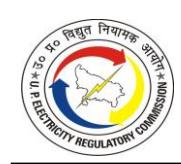

| TABLE 6-109: GROSS ALLOWABLE DEPRECIATION FOR ASSETS UP FROM 01.04.2025 ONWARDS FY 2025-26 APPROVED FOR PVVNL (IN RS. CRORE) (PART-C) 378             |
|-------------------------------------------------------------------------------------------------------------------------------------------------------------|
| TABLE 6-110: GROSS ALLOWABLE DEPRECIATION FOR ASSETS UP TO 31.03.2020 FOR FY 2025-26 APPROVED FOR PUVVNL (IN RS. CRORE) (PART-A) 379                  |
| TABLE 6-111: GROSS ALLOWABLE DEPRECIATION FOR ASSETS FROM 31.03.2020 TO 31.03.2025 FOR FY 2025-26 APPROVED FOR PUVVNL (IN RS. CRORE) (PART-B)  379 |
| TABLE 6-112: GROSS ALLOWABLE DEPRECIATION FOR ASSETS FROM 01.04.2025 ONWARDS FY 2025-26 APPROVED FOR PUVVNL (IN RS. CRORE) (PART-C)  380           |
| TABLE 6-113: GROSS ALLOWABLE DEPRECIATION FOR ASSETS UP TO 31.03.2020 FOR FY 2025-26 APPROVED FOR KESCO (IN RS. CRORE) (PART-A) 380                   |
| TABLE 6-114: GROSS ALLOWABLE DEPRECIATION FOR ASSETS FROM 01.04.2020 TO 31.03.2025 FOR FY 2025-26 APPROVED FOR KESCO (IN RS. CRORE) (PART-B)  380  |
| TABLE 6-115: GROSS ALLOWABLE DEPRECIATION FOR ASSETS 01.04.2025 ONWARDS FY 2025-26 APPROVED FOR KESCO (IN RS. CRORE) (PART-C) 381                  |
| TABLE 6-116: NET ALLOWABLE DEPRECIATION OF DVVNL FOR FY 2025-26 AS APPROVED BY THE COMMISSION (IN RS. CRORE) 381                                      |
| TABLE 6-117: NET ALLOWABLE DEPRECIATION OF MVVNL FOR FY 2025-26 AS APPROVED BY THE COMMISSION (IN RS. CRORE) 382                                      |
| TABLE 6-118: NET ALLOWABLE DEPRECIATION OF PVVNL FOR FY 2025-26 AS APPROVED BY THE COMMISSION (IN RS. CRORE) 382                                      |
| TABLE 6-119: NET ALLOWABLE DEPRECIATION OF PUVVNL FOR FY 2025-26 AS APPROVED BY THE COMMISSION (IN RS. CRORE) 382                                     |
| TABLE 6-120: NET ALLOWABLE DEPRECIATION OF KESCO FOR FY 2025-26 AS APPROVED BY THE COMMISSION (IN RS. CRORE) 383                                      |
| TABLE 6-121: CONSOLIDATED NET ALLOWABLE DEPRECIATION FOR FY 2025-26 AS APPROVED BY THE COMMISSION (IN RS. CRORE  383                               |
| TABLE 6-122: INTEREST ON LONG-TERM LOAN FOR FY 2025-26 AS SUBMITTED BY THE PETITIONERS (IN RS. CRORE)  384                                         |
| TABLE 6-123: INTEREST ON LONG-TERM LOAN OF DVVNL FOR FY 2025-26 AS APPROVED BY THE COMMISSION (IN RS. CRORE) 386                                      |
| TABLE 6-124: INTEREST ON LONG-TERM LOAN OF MVVNL FOR FY 2025-26 AS APPROVED BY THE COMMISSION (IN RS. CRORE) 386                                      |
| TABLE 6-125: INTEREST ON LONG-TERM LOAN OF PVVNL FOR FY 2025-26 AS APPROVED BY THE COMMISSION (IN RS. CRORE) 386                                      |
| TABLE 6-126: INTEREST ON LONG TERM LOAN OF PuVVNL FOR FY 2025-26 AS APPROVED BY THE COMMISSION (IN RS. CRORE) 387                                     |
| TABLE 6-127: INTEREST ON LONG-TERM LOAN OF KESCO FOR FY 2025-26 AS APPROVED BY THE COMMISSION (IN RS. CRORE) 387                                      |

| TABLE 6-128: CONSOLIDATED INTEREST ON LONG-TERM LOAN FOR FY 2025-26 AS APPROVED BY THE COMMISSION (IN RS. CRORE)  387             |
|--------------------------------------------------------------------------------------------------------------------------------------------|
| TABLE 6-129: INTEREST ON SECURITY DEPOSIT OF DVVNL FOR FY 2025-26 AS APPROVED BY THE COMMISSION (IN RS. CRORE) 388                   |
| TABLE 6-130: INTEREST ON SECURITY DEPOSIT OF MVVNL FOR FY 2025-26 AS APPROVED BY THE COMMISSION (IN RS. CRORE) 389                   |
| TABLE 6-131: INTEREST ON SECURITY DEPOSIT OF PVVNL FOR FY 2025-26 AS APPROVED BY THE COMMISSION (IN RS. CRORE) 389                   |
| TABLE 6-132: INTEREST ON SECURITY DEPOSIT OF PUVVNL FOR FY 2025-26 AS APPROVED BY THE COMMISSION (IN RS. CRORE) 389                  |
| TABLE 6-133: INTEREST ON SECURITY DEPOSIT OF KESCO FOR FY 2025-26 AS APPROVED BY THE COMMISSION (IN RS. CRORE) 390                   |
| TABLE 6-134: CONSOLIDATED INTEREST ON SECURITY DEPOSIT FOR FY 2025-26 AS APPROVED BY THE COMMISSION (IN RS. CRORE)  390           |
| TABLE 6-135: INTEREST ON WORKING CAPITAL LOAN FOR FY 2025-26 AS SUBMITTED BY THE PETITIONERS (IN RS. CRORE)  390                  |
| TABLE 6-136: APPROVED INTEREST ON WORKING CAPITAL LOAN OF DVVNL FOR FY 2025-26 (IN RS. CRORE) 392                                    |
| TABLE 6-137: APPROVED INTEREST ON WORKING CAPITAL LOAN OF MVVNL FOR FY 2025- 26 (IN RS. CRORE)  392                               |
| TABLE 6-138: APPROVED INTEREST ON WORKING CAPITAL LOAN OF PVVNL FOR FY 2025-26 (IN RS. CRORE) 393                                    |
| TABLE 6-139: APPROVED INTEREST ON WORKING CAPITAL LOAN OF PuVVNL FOR FY 2025- 26 (IN RS. CRORE)  393                              |
| TABLE 6-140: APPROVED INTEREST ON WORKING CAPITAL LOAN OF KESCO FOR FY 2025-26 (IN RS. CRORE) 394                                 |
| TABLE 6-141: APPROVED CONSOLIDATED INTEREST ON WORKING CAPITAL LOAN FOR FY 2025-26 (IN RS. CRORE)  394                         |
| TABLE 6-142: BANKING AND FINANCE CHARGE FOR FY 2025-26 AS SUBMITTED BY THE PETITIONERS (IN RS. CRORE)  395                     |
| TABLE 6-143: BANKING AND FINANCE CHARGE FOR FY 2025-26 APPROVED BY THE COMMISSION (IN RS. CRORE) 396                                 |
| TABLE 6-144: PROVISION FOR BAD AND DOUBTFUL DEBTS FOR FY 2025-26 AS SUBMITTED BY THE PETITIONERS (IN RS. CRORE) dated 19.05.2025 396 |
| TABLE 6-145: APPROVED PROVISION FOR BAD DEBT OF DVVNL FOR FY 2025-26 (IN RS. CRORE)  397                                          |
| TABLE 6-146: APPROVED PROVISION FOR BAD DEBT OF MVVNL FOR FY 2025 (IN RS. CRORE)                                                           |
|  398                                                                                                                                    |

| TABLE 6-147: APPROVED PROVISION FOR BAD DEBT OF PVVNL FOR FY 2025-26 (IN RS. CRORE)  398                       |
|-------------------------------------------------------------------------------------------------------------------------|
| TABLE 6-148: APPROVED PROVISION FOR BAD DEBT OF PUVVNL FOR FY 2025-26 (IN RS. CRORE)  398                      |
| TABLE 6-149: APPROVED PROVISION FOR BAD DEBT OF KESCO FOR FY 2025-26 (IN RS. CRORE)  398                       |
| TABLE 6-150: APPROVED CONSOLIDATED PROVISION FOR BAD DEBT FOR FY 2025-26 (IN RS. CRORE)  399                   |
| TABLE 6-151: RETURN ON EQUITY CLAIMED FOR FY 2025-26 (IN RS. CRORE)  399                                       |
| TABLE 6-152: APPROVED RETURN ON EQUITY FOR FY 2025-26 (IN RS. CRORE) 400                                             |
| TABLE 6-153: NON-TARIFF INCOME CLAIMED FOR FY 2025-26 (IN RS. CRORE) 401                                             |
| TABLE 6-154: APPROVED NON-TARIFF INCOME FOR FY 2025-26 (IN RS. CRORE) 402                                            |
| TABLE 6-155: GOUP SUBSIDY SUBMITTED BY PETITIONERS FOR 2025-26 (IN RS. CRORE) 403                                    |
| TABLE 6-156: GoUP SUBSIDY VIDE LETTER NO. 1307/2020 (E-1382876) DATED AUGUST 05, 2025 (IN RS. CRORE)  404      |
| TABLE 6-157: SUMMARY OF ARR OF DVVNL FOR FY 2025-26 (IN RS. CRORE)  407                                           |
| TABLE 6-158: SUMMARY OF ARR OF MVVNL FOR FY 2025-26 (IN RS. CRORE)  408                                           |
| TABLE 6-159: SUMMARY OF ARR FOR OF PVVNL FOR FY 2025-26 (IN RS. CRORE)  409                                       |
| TABLE 6-160: SUMMARY OF ARR OF PUVVNL FOR FY 2025-26 (IN RS. CRORE) 410                                              |
| TABLE 6-161: SUMMARY OF ARR OF KESCO FOR FY 2025-26 (IN RS. CRORE) 411                                               |
| TABLE 6-162: SUMMARY OF ARR FOR FY 2025-26 (CONSOLIDATED) (IN RS. CRORE) 412                                         |
| TABLE 6-163: ANALYSIS ON A FEW PARAMETERS FOR PERCENTAGE (%) CHANGE  413                                          |
| TABLE 7-1: REGULATORY ASSETS FROM FY 2000-01 TO FY 2023-24 AS SUBMITTED BY THE PETITIONERS (IN RS. CRORE)  416 |
| TABLE 7-2: PROCEEDINGS UNDER APPELLATE TRIBUNAL 417                                                                  |
| TABLE 8-1: COMPARISON OF EXISTING VS PROPOSED TARIFF  419                                                      |
| TABLE 8-2: APPC OF RENEWABLE SOURCES (BOTH SOLAR AND NON-SOLAR) FOR FY 2025-26  428                               |
| TABLE 8-3: CONTRIBUTION OF OTHER COMPONENTS OF ARR EXCLUDING POWER PURCHASE COST FOR FY 2025-26  429           |
| TABLE 8-4: CONTRIBUTION OF FIXED COST OF POWER PURCHASE FOR FY 2025-26  429                                       |
| TABLE 8-5: TOTAL SERVICE CHARGES FOR FY 2025-26 429                                                                  |
| TABLE 8-6: COMPUTATION OF GREEN TARIFF FOR FY 2025-26 (round off to two decimal places)  429                   |
| TABLE 8-7: GREEN TARIFF APPROVED FOR HV CATEGORIES FOR FY 2025-26 430                                                |

| TABLE 8-8: GREEN TARIFF (ADDITIONAL TARIFF FOR SUPPLY OF GREEN ENERGY) APPROVED FOR FY 2025-26 430                                                           |
|--------------------------------------------------------------------------------------------------------------------------------------------------------------------|
| TABLE 9-1: CATEGORY WISE REVENUE SUBMITTED BY PETITIONERS FOR FY 2025-26 BASED ON EXISTING TARIFF (IN RS. CRORE)  440                                     |
| TABLE 9-2: GoUP SUBSIDY VIDE LETTER NO. 1307/2020 (E-1382876) DATED AUGUST 05, 2025 (IN RS. CRORE)  441                                                   |
| TABLE 9-3: CONSOLIDATED CATEGORY WISE REVENUE PROPOSAL BY PETITIONERS FOR FY 2025-26 (IN RS. CRORE)  441                                                  |
| TABLE 9-4: ABR BASED ON EXISTING AND PROPOSED TARIFF FOR FY 2025-26 CLAIMED BY PETITIONERS IN RS. PER UNIT 442                                               |
| TABLE 9-5: CUMULATIVE GAP / (SURPLUS) FOR ALL 5 STATE DISCOMS (CONSOLIDATED) (IN RS. CRORE) 442                                                              |
| TABLE 9-6: APPROVED REVENUE OF DVVNL (INCLUDING DF OF AGRA) FOR FY 2025-26 (IN RS. CRORE) 443                                                                |
| TABLE 9-7: APPROVED REVENUE OF MVVNL FOR FY 2025-26 (IN RS. CRORE) 444                                                                                       |
| TABLE 9-8: APPROVED REVENUE OF PVVNL FOR FY 2025-26 (IN RS. CRORE) 444                                                                                          |
| TABLE 9-9: APPROVED REVENUE OF PUVVNL FOR FY 2025-26 (IN RS. CRORE)  445                                                                                     |
| TABLE 9-10: APPROVED TARIFF REVENUE OF KESCO FOR FY 2025-26 (IN RS. CRORE)  445                                                                              |
| TABLE 9-11: APPROVED REVENUE OF ALL FIVE STATE DISCOMS (INCLUDING DF OF AGRA) FOR FY 2025-26 (IN RS. CRORE)  446                                          |
| TABLE 9-12: CONSOLIDATED ESTIMATION OF ARR GAP/(SURPLUS) OF FIVE STATE DISCOMS FOR FY 2025-26 (IN RS. CRORE)  446                                         |
| TABLE 9-13: AVERAGE BILLING RATE (@TARIFF PAYABLE PLUS SUBSIDY) 448                                                                                             |
| TABLE 9-14: APPROVED MONTHLY SALES FIGURES FOR FY 2025-26  448                                                                                               |
| Table 10-1: WHEELING AND RETAIL SUPPLY ARR SUBMITTED BY THE PETITIONER  451                                                                                  |
| TABLE 10-2: WHEELING AND RETAIL SUPPLY ARR APPROVED BY THE COMMISSION FOR FY 2025-26 (IN RS. CRORE)  452                                                  |
| TABLE 10-3: WHEELING CHARGE APPROVED BY THE COMMISSION FOR FY 2025-26 452                                                                                       |
| TABLE 10-4: DISTRIBUTION CHARGES FOR FY 2025-26 SUBMITTED BY THE PETITIONER 453                                                                                 |
| TABLE 10-5: CROSS SUBSIDY SURCHARGE AS SUBMITTED BY THE PETITIONER FOR FY 2025- 26 (Rs. /kWh) 453                                                            |
| TABLE 10-6: INTRA-STATE TRANSMISSION CHARGES FOR THE PURPOSE OF COMPUTATION OF 'TC-INTRA' COMPONENT FOR FY 2025-26 (TC) 460                                  |
| TABLE 10-7: INTER-STATE TRANSMISSION CHARGES FOR THE PURPOSE OF COMPUTATION OF 'TC-INTER' COMPONENT FOR 2025-26  460                                      |
| TABLE 10-8: DISTRIBUTION / RETAIL SUPPLY CHARGES FOR THE PURPPOSE OF COMPUTATION OF 'DC' COMPONENT FOR FY 2025-26 (DC)  460 |

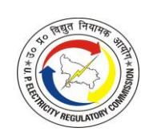

| Table 10-9: AGGREGATE OF TRANSMISSION, DISTRIBUTION & WHEELING CHARGES, APPLICABLE TO RELEVANT VOLTAGE LEVEL) D =TC-INTER + TC-INTRA + DC + WC FOR THE STATE DISCOMS FOR FY 2025-26 461 |
|--------------------------------------------------------------------------------------------------------------------------------------------------------------------------------------------------|
| TABLE 10-10: DISTRIBUTION LOSS AT VARIOUS VOLTAGE LEVELS AS SUBMITTED BY THE PETITIONER FOR FY 2025-26 461                                                                                 |
| TABLE 10-11: DISTRIBUTION LOSSES APPROVED BY THE COMMISSION FOR COMPUTATION OF CSS FOR FY 2025-26 FOR OA CONSUMERS CONNECTED AT DIFFERENT VOLTAGE LEVELS  462                           |
| TABLE 10-12: VOLTAGE WISE COST OF SUPPLY WORKED OUT FOR COMPUTATION OF CSS FOR FY 2025-26 463                                                                                              |
| TABLE 10-13: CSS COMPUTED BY THE COMMISSION FOR FY 2025-26 (Rs./kWh) 463                                                                                                                      |
| TABLE 10-14: CSS APPROVED BY THE COMMISSION FOR FY 2025-26 (Rs. /kWh) 464                                                                                                                     |
| TABLE 11-1: DIRECTIVES COMPLIED BY THE PETITIONER FOR FY 2024-25 466                                                                                                                          |

#### **Before**

#### **UTTAR PRADESH ELECTRICITY REGULATORY COMMISSION**

Petition No. 2162 of 2024, 2163 of 2024, 2164 of 2024, 2165 of 2024, and 2176 of 2024

#### **IN THE MATTER OF:**

**TRUING UP OF TARIFF FOR FY 2023-24, ANNUAL PERFORMANCE REVIEW (APR) FOR FY 2024-25 AND APPROVAL OF AGGREGATE REVENUE REQUIREMENT (ARR) AND TARIFF FOR FY 2025-26.**

#### **and**

#### **IN THE MATTER OF:**

**Dakshinanchal Vidyut Vitran Nigam Ltd., Agra (DVVNL)- (Petition No. 2165 / 2024) Madhyanchal Vidyut Vitran Nigam Ltd., Lucknow (MVVNL)- (Petition No. 2164 / 2024) Pashchimanchal Vidyut Vitran Nigam Ltd., Meerut (PVVNL)- (Petition No. 2162 / 2024) Purvanchal Vidyut Vitran Nigam Ltd., Varanasi (PuVVNL)- (Petition No. 2163 / 2024) Kanpur Electricity Supply Company Ltd., Kanpur (KESCO)- (Petition No. 2176 / 2024)**

#### **ORDER**

The Commission having deliberated upon the above Petitions and the subsequent filings by the Petitioners, thereafter being admitted on May 09, 2025 and having considered the views/comments/suggestions/objections/representations received from the stakeholders during the course of the above proceedings and also in the Public Hearings held, in exercise of powers vested under Sections 61, 62, 64 and 86 of the Electricity Act, 2003 (hereinafter referred to as 'the Act'), hereby passes this Order.

The State owned Discoms (State Discoms) / Petitioners, in accordance with Regulation 5.10 of the Uttar Pradesh Electricity Regulatory Commission (Multi Year Tariff for Distribution & Transmission) Regulations, 2019 and Regulation 5.7 of the Uttar Pradesh Electricity Regulatory Commission (Multi Year Tariff for Distribution) Regulations, 2025 shall publish the Tariff/Rate Schedule approved by the Commission in at least two (2) English and two (2) Hindi daily newspapers having wide circulation in its Licence area of supply and shall put up the approved Tariff/Rate Schedule on its website and make available for sale of a booklet in English and Hindi containing such approved Tariff/Rate Schedule.

The Tariff so published shall be in force seven days after the date of such publication of the Tariffs and shall, unless amended or revised, continue to be in force for such period as may be stipulated therein. The Commission may issue clarification/corrigendum/addendum to this Order as it deems fit from time to time, with the reasons to be recorded in writing.

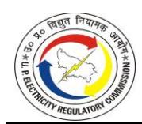

## **1. INTRODUCTION AND HISTORICAL BACKGROUND**

#### **1.1. INTRODUCTION**

1.1.1. This Order relates to the Petition No. 2165 of 2024 filed by Dakshinanchal Vidyut Vitran Nigam Ltd., Agra (DVVNL), Petition No. 2164 of 2024 filed by Madhyanchal Vidyut Vitran Nigam Ltd., Lucknow (MVVNL), Petition No. 2162 of 2024 filed by Pashchimanchal Vidyut Vitran Nigam Ltd., Meerut (PVVNL), Petition No. 2163 of 2024 filed by Purvanchal Vidyut Vitran Nigam Ltd., Varanasi (PuVVNL) and Petition No. 2176 of 2024 filed by Kanpur Electricity Supply Company Ltd., Kanpur (KESCO) (hereinafter collectively referred to as the 'Petitioners') for approval of True Up of FY 2023-24, APR of FY 2024-25 and approval of ARR & determination of Tariff for FY 2025-26.

#### **1.2. HISTORICAL BACKGROUND**

#### **ELECTRICITY ACT 2003**

- 1.2.1. Enactment of the Electricity Act, 2003, along with subsequent policy reforms and digital initiatives, laid the foundation for a robust and enabling framework for the holistic development of India's power sector. Over the past two decades, the sector has transitioned from a monopolistic structure dominated by State Electricity Boards (SEBs) to a more competitive and market-driven ecosystem. Today, the power sector is characterized by open access, private participation, renewable energy integration, and advanced market mechanisms such as power exchanges and real-time markets.
- 1.2.2. Initially, given the strategic importance of electricity and the massive investment requirements, India—like many developing nations—relied heavily on public sector investment for rapid capacity addition. The sector's early growth was driven by SEBs and later supported by Central Public Sector Undertakings (CPSUs) such as NTPC, NHPC, and Power Grid Corporation of India Limited. In recent years, this growth has been complemented by private sector participation, renewable energy expansion, and modernization of transmission and distribution networks, supported by initiatives like the Green Energy Corridor, smart grids, and digitalization of operations.
- 1.2.3. **Uttar Pradesh Electricity Regulatory Commission:** The Uttar Pradesh Electricity

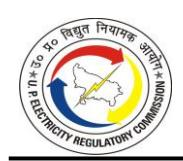

Regulatory Commission (hereinafter referred to as the 'UPERC' or 'the Commission') was constituted under Section 17 of the Electricity Regulatory Commissions Act, 1998 and came into being on September 10, 1998, vide Government of Uttar Pradesh (GoUP) Notification No. 2813-P-1/98-24. It was later deemed to have been appointed under Section 3 of the U.P. Electricity Regulatory Act, 1999 and continues to be the State Commission under the first proviso of Section 82 of the Electricity Act, 2003 (hereinafter referred to as 'the Act' or 'EA, 2003').

- 1.2.4. To promote bulk and retail competition in the electricity sector, several states undertook the unbundling of generation, transmission, and distribution functions. In line with this reform, the erstwhile Uttar Pradesh State Electricity Board (UPSEB) was restructured under the Uttar Pradesh Electricity Reforms Transfer Scheme, 2000, through Notification No. 149/P-1/2000-24 dated January 14, 2000. This restructuring resulted in the creation of:
  - Uttar Pradesh Power Corporation Limited (UPPCL): vested with the function of Transmission and Distribution within the State
  - Uttar Pradesh Rajya Vidyut Utpadan Nigam Limited (UPRVUNL): vested with the function of Thermal Generation within the State
  - Uttar Pradesh Jal Vidyut Nigam Limited (UPJVNL): vested with the function of Hydro Generation within the State
- 1.2.5. Through another Transfer Scheme dated January 15, 2000, assets, liabilities, and personnel of Kanpur Electricity Supply Authority (KESA) under UPSEB were transferred to Kanpur Electricity Supply Company Limited (KESCO), a company registered under the Companies Act, 1956.
- 1.2.6. Similar to any service industry, in the case of electricity supply also, the client interface or the distribution segment is the most critical element of the business not only because the performance of the service provider is evaluated primarily on the basis of the quality of service provided to the customer but also because distribution is the area where energy flows are converted into cash flows. Thus, for the operation of the power utilities to be sustainable in the long run, the performance of the distribution segment plays an extremely vital role. With a view to introduce

competition in the industry and also to increase accountability in the operations of UPPCL, UPPCL was further divided into five successor companies, in pursuance of GOUP notification no. 2740/P-1/2003-24-14P/2003 dated 12th August 2003, with UPPCL as Transco and four successor distribution companies (hereinafter referred to as "licensees") which are as follows.

- Paschhimanchal Vidyut Vitran Nigam Limited Meerut (Meerut DISCOM)
- Dakshinanchal Vidyut Vitran Nigam Limited Agra (Agra DISCOM)
- Madhyanchal Vidyut Vitran Nigam Limited, Lucknow (Lucknow DISCOM)
- Poorvanchal Vidyut Vitran Nigam Limited, Varanasi (Varanasi DISCOM)

For the purposes of this order, these distribution companies have been collectively referred to as "Discoms or Distribution companies".

1.2.7. Thereafter, on January 21, 2010, as the successor Distribution companies of UPPCL (a deemed Licensee), the Distribution Companies, which were created through the notification of the UP-Power Sector Reforms (Transfer of Distribution Undertakings) Scheme, 2003 were issued fresh Distribution Licenses, which replaced the UP-Power Corporation Ltd (UPPCL) Distribution, Retail & Bulk Supply License, 2000.

#### **1.3. BACKGROUND OF ENACTMENTS**

1.3.1. The Electricity Act, 2003 (Central Act 36 of 2003) came into force with effect from 10.6.2003 and the previous acts governing the electricity supply in the country, viz. The Indian Electricity Act, 1910 (9 of 1910), the Electricity (Supply) Act, 1948 (54 of 1948), and the Electricity Regulatory Commissions Act, 1998 have been repealed. The provisions of the Uttar Pradesh Electricity Reform Act 1999(Uttar Pradesh Act 24 of 1999) to the extent not inconsistent with the provisions of the Electricity Act 2003, however, continue to apply to Uttar Pradesh. The first proviso of Section 14 of the Electricity Act 2003 specifies that any person already engaged in the business of transmission or supply of electricity under the UP-Electricity Reform Act on or before the Electricity Reform Act on or before the appointed date i.e. 10.06.2003 shall be deemed to be a licensee under the Electricity Act 2003 and the provisions of Reform Act in respect of such licensee shall apply for a period of one year the appointed of commencement of the Electricity Act 2003 (10th June 2003) and thereafter the

provisions of the Electricity Act 2003 shall apply to such business.

1.3.2. Section 61 of the Electricity Act provides the guiding principles for tariff determination:

#### **"***Section 61. (Tariff Regulations):*

*The Appropriate Commission shall, subject to the provisions of this Act, specify the terms and conditions for the determination of tariff, and in doing so, shall be guided by the following, namely: -* 

- *a. the principles and methodologies specified by the Central Commission for determination of the tariff applicable to generating companies and transmission licensees.*
- *b. the generation, transmission, distribution and supply of electricity are conducted on commercial principles.*
- *c. the factors which would encourage competition, efficiency, economical use of the resources, good performance and optimum investments.*
- *d. safeguarding consumers' interest and at the same time, recovery of the cost of electricity in a reasonable manner.*
- *e. the principles rewarding efficiency in performance;*
- *f. multiyear tariff principles;*
- *g. that the tariff progressively reflects the cost of supply of electricity and also, reduces cross-subsidies in the manner specified by the Appropriate Commission;]*
- *h. the promotion of co-generation and generation of electricity from renewable sources of energy.*
- i. *the National Electricity Policy and tariff policy:*

*Provided that the terms and conditions for determination of tariff under the Electricity (Supply) Act, 1948, the Electricity Regulatory Commission Act, 1998 and the enactments specified in the Schedule as they stood immediately before the appointed date, shall continue to apply for a period of one year or until the terms and conditions for tariff are specified under this section, whichever is earlier."*

## **1.4. DISTRIBUTION TARIFF REGULATION**

- 1.4.1. The Uttar Pradesh Electricity Regulatory Commission (Terms and Conditions for Determination of Distribution Tariff) Regulations 2006 were notified on October 6, 2006. These Regulations were applicable for the determination of ARR and Tariff till FY 2014-15.
- 1.4.2. The Uttar Pradesh Electricity Regulatory Commission (Multi-Year Distribution Tariff) Regulations, 2014, were notified on May 12, 2014. As per these Regulations, a transition period of two years was provided, during which UPERC (Terms and Conditions for Determination of Distribution Tariff) Regulations 2006 were applicable and Uttar Pradesh Electricity Regulatory Commission (Multi-Year Distribution Tariff) Regulations, 2014 were applicable from FY 2017-18 to FY 2019- 20.
- 1.4.3. The Uttar Pradesh Electricity Regulatory Commission (Multi-Year Tariff for Distribution and Transmission) Regulations, 2019 (hereinafter referred to as "MYT Regulations, 2019") were notified on September 23, 2019. These Regulations are applicable for the determination of ARR and Tariff for the Control Period from FY 2020-21 to FY 2024-25.
- 1.4.4. The Uttar Pradesh Electricity Regulatory Commission (Multi-Year Tariff for Distribution) Regulations, 2025 (hereinafter referred to as "MYT Regulations, 2025") were notified on March 26, 2025. These Regulations are applicable for the determination of ARR and Tariff for the Control Period from FY 2025-26 to FY 2029- 30 unless otherwise extended by the Commission.
- 1.4.5. The Petitioners filed the Petitions as per the MYT Regulations, 2019. After the notification of MYT Regulations, 2025, the Petitioners made revised submissions for ARR for FY 2025-26 as per the provisions of MYT Regulations, 2025.

\*\*\*\*\*

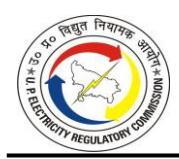

#### **2. PROCEDURAL HISTORY**

#### **2.1. SUBMISSION OF TARIFF PETITIONS**

2.1.1. The Petitioners submitted their Petitions in the matter of determination of ARR and Tariff for FY 2025-26, APR for FY 2024-25 and Truing Up for FY 2023-24 for the State Discoms (DVVNL, MVVNL, PVVNL, PuVVNL and KESCO) before the Commission on November 29, 2024, as per provisions of MYT Regulations, 2019. After the notification of MYT Regulations, 2025, the Petitioners made revised submissions for ARR for FY 2025-26 as per the provisions of MYT Regulations, 2025.

#### **2.2. PRELIMINARY SECURITY OF THE FILINGS**

- 2.2.1. The Commission conducted a preliminary analysis and certain deficiencies were observed which were raised to the Petitioners wherein information was sought regarding Billing Determinants, Distribution Loss, Collection Efficiency, Voltage-wise Losses, Inter-State Loss, Calculation of BST and DBST, Energy Balance, reconciliation of Power purchase related matters (like Fixed Charges, Energy Charges, Transmission and Load Despatch Charges, Late Payment Charges, etc.), submission of Power Purchase Agreement, RPO Compliance, O&M expenses, CAPEX related to Smart Metering, Weighted average rate of Interest of Loan, Reconciliation of Revenue under renting of Pola/5G activities, Rebate/Discounts included in Revenue, Reconciliation of Open Access charges, Details of OTS Scheme, Capital Investment, Capitalization & Financing, Interest on Consumer Security, Revenue from Sale of Power/CSS, Reconciliation of Non-Tariff Income & GoUP Subsidy, Details of Electricity duty as part of the bad debts, CAG Audited Reports, Implementation Plan for smart meters installation along with other various deficiencies.
- 2.2.2. The Technical Validation Session (TVS) on the ARR Petitions of all the Petitioners was conducted on May 09, 2025, at the office of the Commission, which was attended by the Senior officials of the Commission and the State Discoms. During TVS, the Stateowned Distribution Licensees explained various issues raised in the deficiencies. Subsequently, Minutes of Meeting (M.O.M) comprising of pending data/information were issued to Petitioners vide Ref: UPERC/Secy/ D(T)/2025-190, dated May 09, 2025.
- 2.2.3. The Commission further directed the State Discoms to submit their response on the

pending matters, immediately. Also, the Petitioners were directed that they shall furnish further information/clarifications, if any, as deemed necessary by the Commission during the processing of the Petitions and would provide the same to the satisfaction of the Commission within the time frame as stipulated by the Commission.

### **2.3. ADMITTANCE OF THE TRUE-UP, APR AND ARR/TARIFF FILINGS**

- 2.3.1. The Commission, vide its Admittance Order dated May 09, 2025 **(Annexed as Annexure –III of this Tariff Order**), admitted the ARR Petition of the Petitioners and directed the Petitioners to publish separate Public Notices within three working days of issue of the Admittance Order, consisting of the summary and highlights of the proposed ARR and Tariff for FY 2025-26, APR for FY 2024-25 and True-Up for FY 2023- 24 of their respective Petitions in at least two (2) English and two (2) Hindi daily newspapers having wide circulation in their respective license areas, outlining the True-Up, ARR, Gap/(Surplus), approved and actual Distribution losses for FY 2023-24 along with actual/proposed losses for FY 2024-25 and proposed losses for FY 2025-26, Power Purchase Cost, Bulk Supply Tariff, DBST, Average Cost of Supply, wheeling charges, cross subsidy surcharge for Open Access consumers, category-wise, subcategory & slab-wise subsidy by GoUP etc., and invite suggestions and objections within 15 days from the date of publication of the Public Notice(s) from the stakeholders and public at large.
- 2.3.2. The Petitioner was also directed to upload on its website the True up Petition, the APR Petition and updated ARR, Tariff Proposal along with Rate Schedule & Distribution Loss Trajectory along with formats filed before the Commission along with all regulatory filings, information, particulars, and related documents in their original version (not in zipped or compress folder), which should be signed digitally and in searchable pdf formats along with all Excel files as per any other provision of the Regulations and Order of the Commission. The Petitioner was also directed to ensure that these files are broken into such sizes so that they can be easily downloaded, and for downloading the same, there should be no requirement to provide personal information. The Petitioner was also directed not to provide or put up any such information, particulars, or documents, which are confidential in nature, without the prior approval of the Commission.

2.3.3. Further, the Commission raised several deficiencies after the issuance of the admittance order to which replies have been received from the Petitioners, and which have also been taken into consideration.

## **2.4. PUBLICITY OF THE LICENSEES' FILINGS**

2.4.1. The Public Notice detailing the salient features of the filings was published by the Petitioners in daily newspapers as detailed below, inviting objections from the public at large and all stakeholders.

**TABLE 2-1: LIST OF NEWSPAPERS AND DATES OF PUBLICATION OF PUBLIC NOTICE BY THE PETITIONER**

| DISCOMs | English Newspaper            | Hindi Newspaper            |  |  |
|---------|------------------------------|----------------------------|--|--|
|         | Times of India & 05.06.2025  | Amar Ujala & 05.06.2025    |  |  |
| DVVNL   | Hindustan Times & 05.06.2025 | Dainik Jagran & 05.06.2025 |  |  |
|         | Times of India & 05.06.2025  | Amar Ujala & 05.06.2025    |  |  |
| MVVNL   | Hindustan Times & 05.06.2025 | Dainik Jagran & 05.06.2025 |  |  |
|         | Times of India & 05.06.2025  | Amar Ujala & 05.06.2025    |  |  |
| PVVNL   | Hindustan Times & 05.06.2025 | Hindustan & 05.06.2025     |  |  |
|         | Times of India & 05.06.2025  | Amar Ujala & 05.06.2025    |  |  |
| PuVVNL  | Indian Express & 05.06.2025  | Dainik Jagran & 05.06.2025 |  |  |
|         | Hindustan Times & 05.06.2025 | Amar Ujala & 05.06.2025    |  |  |
| KESCO   | Times of India & 05.06.2025  | Dainik Jagran & 05.06.2025 |  |  |

*Source: As per data submitted by the Licensee*

#### **2.5. PUBLIC HEARING**

2.5.1. The Public Notice for the hearing was published in various Hindi and English newspapers **(Annexed as Annexure IV)** on June 20, 2025 & July 03, 2025, and was also uploaded on the Commission's website. The Public Hearings were conducted as per below details:

**TABLE 2-2: DETAILS OF PUBLIC HEARINGS CONDUCTED BY THE COMMISSION**

| Licensees Covered | Date & Time of Public Hearing           | Place    | Venue                                                                                                                                                     |
|----------------------|--------------------------------------------|----------|-----------------------------------------------------------------------------------------------------------------------------------------------------------|
| KESCO                | July 09, 2025 @ 11.00 AM (Wednesday) | Kanpur   | The Sports Hub, F8HG+PCW, Palika Stadium Ln, Khalasi Line, Arya Nagar, Kanpur, Uttar Pradesh 208002                                                 |
| PuVVNL               | July 11, 2025 @ 11.00 AM (Friday)    | Varanasi | Commissioner Office, Auditorium, Opposite Vikas Bhavan, Hamrautia, Varanasi – 221002                                                                   |
| DVVNL                | July 15, 2025 @ 11.00 AM (Tuesday)   | Agra     | Rao Kishan Pal Singh Auditorium Campus R.B.S. College, Raja Balwant Singh Degree College, Madiya Katra Railway Crossing, Kandhari, Agra - 282002 |

| Licensees Covered | Date & Time of Public Hearing          | Place   | Venue                                                                                                                                                   |
|----------------------|-------------------------------------------|---------|---------------------------------------------------------------------------------------------------------------------------------------------------------|
| PVVNL                | July 17, 2025 @ 11.00 AM (Thursday) | Meerut  | Atal Sabhagar, Chaudhary Charan Singh University, Ramgarhi, Meerut, Uttar Pradesh 250001                                                          |
| MVVNL                | July 21, 2025 @ 11.00 AM (Monday)   | Lucknow | Auditorium (3rd Floor) Of Uttar Pradesh Electricity Regulatory Commission, Vidyut Niyamak Bhawan, Vibhuti Khand, Gomti Nagar, Lucknow – 226010 |

2.5.2. Consumers, industry associations, various representatives of consumer categories, officials of different organizations like UP Metro, farmers and their representatives, inhabitants of multi-storied buildings as well as residential townships, along with officers of Licensees, participated actively in the Public Hearing process, as detailed in Chapter 3 of this Tariff Order.

#### **2.6. STATE ADVISORY COMMITTEE**

- 2.6.1. The State Advisory Committee (SAC) meeting was conducted on July 25, 2025, wherein the views and suggestions of the members of the SAC were sought. The same has also been taken into consideration while finalizing the ARR and determining the Tariff. The Minutes of the Meeting of the SAC are attached as **Annexure V**.
- 2.6.2. Accordingly, taking into consideration the objections/suggestions received from all the stakeholders, the public at large within the stipulated time and the views of the State Advisory Committee, the Commission has finalized the Tariff Order for FY 2025- 26.

\*\*\*\*\*

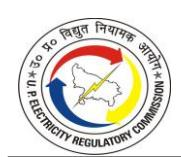

#### 3. PUBLIC HEARING PROCESS

#### 3.1. INTRODUCTION

- 3.1.1. The provisions of the Electricity Act 2003, UPERC (Conduct of Business) Regulations 2019, MYT Regulations 2019 and MYT Regulations 2025 mandate upon the Commission to provide fair and balanced opportunities to all stakeholders to present their views and suggestions during the tariff determination process. The Commission, in order to achieve the twin objective that has been conferred upon it under the Act, i.e. "to observe transparency in its proceedings and functions" and "to ensure a fair deal to consumers", has always attached paramount importance to the objections/suggestions/comments of the public on the ARR/Tariff. The process is significantly important in a "cost plus regime", where the entire cost allowed to the licensee gets transferred to the consumer; therefore, the consumers have a locus standi to comment on what costs are being allowed vis-à-vis the kind of services that are available to them.
- 3.1.2. To provide an opportunity to all sections of the population in the State to express their views and to also obtain feedback from them, public hearings were held by the Commission. The public hearings were conducted as per the details below:

| Sr. No. | Date          | Public Hearing in the Matter of |
|------------|---------------|------------------------------------|
| 1.         | July 09, 2025 | KESCO                              |
| 2.         | July 11, 2025 | PuVVNL                             |
| 3.         | July 15, 2025 | DVVNL                              |
| 4.         | July 17, 2025 | PVVNL                              |
| 5.         | July 21, 2025 | MVVNL                              |

- 3.1.3. The Commission in order to have broader participation and views/comments/suggestions/objections from the public at large and all stakeholders, had uploaded the Notice for Public hearing dated June 20, 2025 and July 03, 2025, on its website (www.uperc.org) and the same was also published in the daily newspapers.
- 3.1.4. A large number of consumers across categories and various consumer representatives& associations participated in the public hearings and expressed their views on the Petitions.

- 3.1.5. The State Advisory Committee meeting was held on July 25, 2025, in which ARR and Tariff related issues were discussed, and inputs were sought from the members of the Committee. The same have also been taken into consideration while finalizing and determining the ARR and Tariff. Further, during the proceedings, the Petitioners have updated/revised few data and the same has been used as the final submission of the Petitioners.
- 3.1.6. The views / suggestions / comments / objections / representations on the True-up / APR / ARR / Tariff submissions received from the public were forwarded to the petitioners for their comments / response. The Commission acknowledges that the rate design in itself should not be an independent parameter; rather, it should have meaningful correlation with the nature of the electricity supply that is being provided to the consumers, and in this context, the comments of consumers play a pivotal role in leading the Commission to embark upon a reasoned rate structure.
- 3.1.7. Besides this, the Commission, while disposing of the True-Up / APR / ARR / Tariff Petition filed by the State Discoms, has also taken into consideration the oral and written views/comments/suggestions/objections/representations received from various stakeholders during the public hearings or through post or by email.
- 3.1.8. The Commission collated different consumers' representations and categorized these, issue-wise, to get specific replies from the Petitioners. The list of the consumers who have submitted their objections/submissions is appended at the end of this Order as **Annexure: VI** to this Tariff Order. Category-wise issues, along with the response of the Petitioners against these issues, are listed below. Some of the issues, wherever possible, have been redressed in the determination of the tariff order; otherwise, limitations on account of the ground realities have been underlined.
- 3.1.9. The responses of State discoms, UPPCL, NPCL, etc., on these issues were solicited by the Commission by communicating the views/opinions of stakeholders to these entities. Issue-wise responses to various comments have been enlisted in this chapter while also providing the Commission's view on these issues. Further, the views/comments/suggestions/objections/representations from the stakeholders after 12.08.2025 have not been taken into consideration.

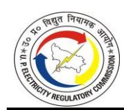

## *VIEWS/ COMMENTS / SUGGESTIONS / OBJECTIONS / REPRESENTATIONS IN TRUE UP, APR, AND ARR / TARIFF FILINGS*

- 3.1.10. The Commission has attempted to capture the summary of views/comments/ suggestions/objections/representations in this section. It may be that a few names of stakeholders/ public on the attendance list do not appear in this section; however, all the issues/matters raised by them relevant to these proceedings have been discussed. In case any comment/ suggestion/observation is not specifically elaborated, it does not mean that the same has not been considered. The Commission has considered all the issues raised by the stakeholders and Licensee's response on such issues while carrying out the detailed analysis/discussion of the True-Up for FY 2023-24, APR for FY 2024-25 and ARR / Tariff for FY 2025-26.
- 3.1.11. All consumer complaints received by the Commission, which are not a part of these ARR/Tariff proceedings, have also been sent to the Discoms for speedy resolution under intimation to the Commission vide a compliance report. All consumers who had submitted their complaints to the Commission are required to follow up with their respective distribution licensees.
- 3.1.12. The list of consumers who have submitted their views/comments/suggestions/objections/representations is appended **(Annexed as Annexure –VI**) to this Order. The major issues raised therein, the replies given by the Licensees and the views of the Commission have been summarized as detailed below:

#### **3.2. TARIFF**

#### *Comments / Suggestions of the Public*

- 3.2.1. All the stakeholders, from different categories of consumers, have submitted that the proposal of tariff hike should be rejected. The stakeholders submitted that the tariff hike will have broader economic/commercial implications, thereby affecting their mundane life.
- 3.2.2. The stakeholders from different industries, such as hotels, Metro Rail, telecom and industry associations, have referred to various aspects such as linking rate with Bulk Supply Tariff (BST) and voltage level. The farmers and domestic consumers have also requested not to give any tariff hike.

- 3.2.3. Stakeholders, particularly from the agricultural and domestic sectors, submitted that the tariff hike will impose a significant financial burden on farmers and low-income households. They requested for downward revision of tariffs to enhance affordability and support rural livelihoods.
- 3.2.4. PTW consumers/farmers have also opposed the imposition of minimum consumption charges against their connections, stating that domestic and other categories do not have any minimum consumption charges, and it is illegal.
- 3.2.5. Representatives from the industry and MSME contended that the imposition of fixed charges on electricity bills is unjustified, particularly in light of the State's surplus electricity generation. They have submitted that the fixed charges should be abolished, which will reduce operational costs for industries, thereby contributing towards their sustainability. The stakeholders emphasized that such a measure would promote entrepreneurship and job creation.
- 3.2.6. Stakeholders representing the hotel industry submitted that, as per UP Tourism Policy 2022, hotels are recognized as an industry and therefore requested reclassification of hotels from the commercial to the industrial tariff category. It is also contended that the fixed charges and electricity duty levied on hotel electricity bills are excessive and contrary to the intent of the UP-Tourism Policy 2022.
- 3.2.7. The Lifeline consumers recommended that the limit of Lifeline consumers is increased from 1kW to 2kW.
- 3.2.8. A comparison of rates with other states has been provided to demonstrate that tariffs in some states are lower than the tariff in Uttar Pradesh, and an increase in tariff will further increase this gap. It is requested that tariff rates be brought in line with, or made lower than, those prevailing in other states to promote industrial development and investment.
- 3.2.9. The stakeholders have submitted that vide its Tariff Order dated September 03, 2019, the Commission had determined a regulatory surplus of Rs. 13,337.17 Crore. Surplus has also been created thereafter in the tariff order approved by the Commission till FY 2024-25. Together with admissible carrying cost, such surplus has become huge. The stakeholders have requested that there should be a reduction in tariff on account of the accumulated surplus approved by the Commission in previous Orders.

3.2.10. The stakeholders from multi-storied buildings having a single point connection have submitted that in case of a single point connection, metering and billing costs are negligible for the Petitioners. Therefore, the tariff for consumers in multistoried buildings should be low.

#### *Petitioners' Response:*

- 3.2.11. It is submitted that the Petitioner has prepared the petition in line with the principles outlined in the UPERC Multi-Year Tariff (MYT) Regulations, 2019, and the recently notified MYT Regulations, 2025. As stipulated by the Commission, the licensee is required to propose tariff revisions addressing the identified revenue gap. Accordingly, the licensee has proposed tariff adjustments considering prudent cost projections covering power purchase expenses (constituting nearly 80% of total expenditure), operation and maintenance costs, and transmission charges. Further, recognizing the practical revenue scenario, the revenue gap for FY 2025-26 has been estimated based on realistic assessments of actual revenue collection trends to ensure financial sustainability and operational viability of the licensee.
- 3.2.12. In response to stakeholders' requests for relief in the existing Tariff and proposals for reduced industrial Tariffs, it is respectfully submitted that electricity, like other commodities, is subject to market-driven fluctuations. Notably, there has been no increase in Tariff over the past four years, despite an approximate annual inflation rate of 7%. Therefore, it is imperative that the Tariff be revised to reflect the actual cost of electricity supply in accordance with the prescribed norms.
- 3.2.13. The Petitioners have submitted that no tariff hike has been proposed by the licensee for agriculture (PTW) consumers in the Tariff proposal. Imposition of minimum consumption charges is in accordance with the Commission's Tariff order.
- 3.2.14. In response to no fixed charges, it is submitted that fixed charges are recovered to cover the cost of maintaining generation capacity and grid readiness, ensuring power is available to consumers when needed. These charges relate to infrastructure and contractual obligations that exist regardless of actual consumption. The petitioner has entered into long-term power purchase agreements, which require payment of fixed charges to generators even when power is not drawn. On average, 55% of the power

procurement cost is fixed, while 45% is variable. In contrast, under the current tariff structure, only about 17% is recovered through fixed charges and 83% through variable charges. In addition to this, there are other expenses such as O&M expenses, transmission charges, etc., which are also fixed in nature.

- 3.2.15. In response to the UP-Tourism Policy 2022 & Tourism Policy operational guidelines, the Petitioner submitted that the stakeholder has suggested issuing clarification / corresponding Orders for the implementation of UP Tourism Policy 2022, which is not related to the current proceeding of ARR for FY 2025-26. It is further submitted that the relaxation with respect to the Electricity Duty as mentioned in the proposed submission is a matter for the State Government. In regard to the applicability of the Industrial Tariff to Hotels, it is submitted that the categorization of hotels under LMV-2/Commercial category is strictly in line with the provisions of the UPERC Tariff Orders. The Commission has, on multiple occasions, clarified that hotels, though serviceoriented establishments, are essentially engaged in commercial activity and therefore do not qualify to be treated under the ambit of the industrial tariff. Accordingly, billing of hotels under the prescribed commercial tariff category is in full conformity with the orders of the Commission. It is further submitted that the Licensees have not proposed any change in this categorization in the present tariff petition.
- 3.2.16. As regards the concern over disparity in tariff hikes across different states, it is respectfully submitted that such comparisons do not constitute a suitable benchmark. Tariff revisions are inherently linked to each state's deficiency in projected revenue recovery and its Annual Revenue Requirement (ARR), both of which are influenced by various state-specific factors such as demographic profile, urban-rural consumer distribution, per capita income, and the overall consumer mix (residential, agricultural, industrial, etc.). Therefore, tariff hikes must be assessed in the context of the financial needs and operational realities of each individual state and its distribution licensees.
- 3.2.17. In regard to the impact on consumers with low consumption levels, the Petitioner has submitted that the Tariff applicability framework in the State is governed by the Commission. As per the prevailing Tariff schedule, a telescopic structure is in place, wherein consumers with higher consumption are charged higher Tariffs, while also

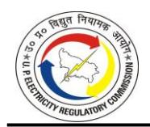

benefiting from slab-based concessions.

3.2.18. On the matter of Regulatory Surplus, it is submitted that the issue is currently sub judice before the Appellate Tribunal for Electricity (APTEL), and a final decision is awaited. The Commission has previously clarified in its Orders that it cannot take unilateral action on this matter.

### *Commission's View:*

- 3.2.19. The Commission has examined all the submissions received from stakeholders across various consumer categories, including domestic, agricultural, industrial, commercial, MSMEs, and sector-specific bodies such as hotel associations and Metro Rail. The Commission is of the view that Tariffs are determined in accordance with the provisions of MYT Regulations notified by the Commission and adhering to the principles of Section 62(3) of the Electricity Act 2003, while ensuring alignment with the actual cost of electricity supply, including power purchase, transmission, and distribution expenses. Further, the Commission takes into consideration tariff rationalization to reflect service costs while minimizing cross-subsidies.
- 3.2.20. The Commission acknowledges the concerns raised regarding the impact of a tariff hike on economically vulnerable segments such as domestic consumers, low-income households, and farmers. The Commission has assessed the proposed tariffs keeping in view the principles of affordability, equity, and consumer protection, particularly for low-consumption and economically weaker consumer categories. Moreover, it needs to be mentioned that there is no tariff hike proposed by the Petitioners for agricultural consumers (LMV-5 category). However, as far as the imposition of minimum charges is concerned, it is considered to be an important tool for the consumers, where either metering is not in place or there is an apprehension that the consumption is suppressed. As and when the correct metering spreads across the category, the Commission may consider removal of such charges. However, as far as the legality of minimum consumption charges is concerned, it requires mention that imposition of minimum consumption charges has been adjudged to be legally correct, as can be seen from the findings of the Hon'ble Supreme Court in the matter of Raymond Limited & Ors. Vs. MPSEB & Ors., the relevant portion of which is being

reproduced below:

*"The question of exonerating the consumer from the liability undertaken to pay minimum guaranteed charges for a month and billing only for the actual consumption of energy or allowing a consumer to pay the rates on the actual consumption of electricity measured in units will and can arise and has also been considered for determination only in case the supply by the Board itself fell short of the minimum of energy, the consumption of which goes to make up the minimum guaranteed sum. It is well settled and there could be no controversy over the position that if only the supply was available for consumption but the consumer did not consume so much of energy up to the extent of the obligation cast upon him to pay the minimum charge there is no escape from the payment of minimum guarantee charges………….. In fact the tariff inclusive of such a provision for payment of a minimum guaranteed sum irrespective of the supply factor appears to be the consideration for the commitments undertaken by the Board as a package deal and it is not possible or permissible to allow the consumer to wriggle out of such commitments merely on the ground that the Board is not able to supply at any point of time or period the required or agreed quantum of supply or even supply up to the level of the minimum guaranteed rate of charges."*

- 3.2.21. The Commission has examined the suggestions made by various stakeholders regarding the elimination or reduction of fixed charges. While the concerns of consumers, particularly MSMEs and other industries, are duly noted, it is important to recognize that fixed charges are an essential component of the tariff structure. These charges are designed to recover the fixed costs incurred by the distribution licensees, such as infrastructure costs, network maintenance, employee expenses, and capacity charges payable to generating stations, which are incurred irrespective of the actual energy consumption. Eliminating fixed charges would result in an under-recovery of these costs, potentially jeopardizing the financial viability of the DISCOMs and leading to higher variable charges or cross-subsidization burdens. Therefore, the Commission considers fixed charges as necessary for ensuring cost recovery and long-term sustainability.
- 3.2.22. Reclassification from one consumer category to another cannot be undertaken merely on the basis of a Government policy statement. In terms of Section 108 of the Electricity Act, 2003, such a change requires a specific direction from the State Government. In the Tariff Order dated October 10, 2024, the category change for the IT industry was effected pursuant to such a Government direction. On the same

principle, any reclassification of "hotels" would also require a similar direction; absent this, the existing classification shall continue. Further, UP Tourism Policy 2022 does not contain any such stipulation regarding reclassification of hotels as industry for the purposes of tariff. Further, as communicated by the Government of Uttar Pradesh, subsidy for lifeline consumers is admissible only to those who meet the criteria prescribed in the prevailing Rate Schedule.

- 3.2.23. Regarding the proposal to raise the lifeline consumer load limit from 1 kW to 2 kW, such a change would disrupt the existing subsidy architecture under the prevailing Rate Schedule and introduce classification anomalies. The request is, therefore, not accepted.
- 3.2.24. The stakeholders' comparison of electricity tariffs with other States provides context; however, it must be emphasized that each State's tariff structure is determined by its own cost of supply, power procurement mix, and cross-subsidization requirements.
- 3.2.25. The Commission notes the submissions from stakeholders regarding the surplus projected or approved in earlier Tariff Orders. As regards the surplus determined vide Tariff Order dated September 03, 2019, the Petitioners have challenged this Order in APTEL and have a counterclaim that instead of the regulatory surplus of Rs. 13,337.17 Crore, a regulatory asset of Rs. 34,866.91 Crore should have been determined by the Commission up to the True-up year of FY 2017-18. As the amounts involved are significant and would require large tariff revisions, leading either to adversely impacting the financial position of DISCOMs or a tariff shock as regards the consumers, the Commission is of the view that the treatment of this surplus be kept in abeyance till the matter is finally decided through the judicial process. A similar view has been taken by the Commission in previous Tariff Orders. As regard surpluses determined from FY 2018-19 onwards, the Commission has been considering the surpluses for the determination of subsequent years' tariff. Further details may be seen in Chapters 8 and 9.
- 3.2.26. The Commission has considered the submissions seeking lower tariffs for multistoried buildings with single-point connections. In view of the persistent service and accountability issues in such buildings, the Commission has adopted measures to encourage migration to multi-point connections. Tariff determination is guided not

only by the cost of service but also by broader regulatory and policy objectives. Accordingly, tariffs for single point supply have been kept comparatively higher as a deliberate policy instrument to discourage continuation of the single point arrangement and to motivate Resident Welfare Associations and developers to move to multi-point systems. The higher tariff is therefore not a statement of higher operational costs; it is a regulatory tool to advance long-term objectives of fairness, transparency, and consumer rights.

#### **3.3. TARIFF-GENERAL PROVISIONS OF RATE SCHEDULE**

#### *Comments / Suggestions of the Public*

- 3.3.1. The stakeholders submitted several concerns related to the General Provisions of Rate Schedule in the Tariff Order. One of the stakeholders submitted that the LPS that is levied is much higher than the interest on security deposit. It is requested to reduce the LPS and make it the same as the interest on security deposit. Another stakeholder submitted that the demand charges that are levied for exceeding the contract demand are 200% for non-domestic consumers, which are quite high and requested to reduce these charges. It is also requested to reduce the limit on minimum demand charges from 75% to 50%. A suggestion has been made to offer a rebate of Rs.0.50 per unit to encourage consumers to adopt prepaid meters.
- 3.3.2. The rural consumers have submitted that urban tariffs are applied in Rural areas, leading to high bills being generated.
- 3.3.3. The stakeholders from industry proposed that for the leading power factor, billing should be done by considering the unity power factor. Additionally, it is recommended to provide an incentive for maintaining a power factor in excess of 0.9.
- 3.3.4. Several concerns have been raised by consumers from the power loom industry. This includes Billing based on kW/HP instead of the mandated Rs.430/month rate, Excess payments remain unreconciled after a year, Excess load assessed under domestic category instead of applicable power loom tariff, increase in load without meter readings, etc.
- 3.3.5. The notification regarding the free electricity scheme for LMV-5 category consumers (private tube wells), effective from April 1, 2023, includes conditions such as

installation of meters, completion of KYC formalities, and clearance of existing dues. Owing to these reasons, many farmer consumers are unable to avail the benefits of the free electricity scheme. The issue is aggravated due to inflated outstanding dues caused by tariff misclassification.

- 3.3.6. It is submitted that approximately Rs. 35,000 crore in consumer security deposits remain unutilized. The stakeholder recommended that a portion of these funds be used to provide rebates.
- 3.3.7. The stakeholder has requested relief for rural consumers who use domestic connections for small commercial activities, such as shops.
- 3.3.8. It is recommended by stakeholdersto launch a scheme of billing based on Credit Score under which consumers shall be rewarded with a timely bill payment with incentives such as reduced security deposits and priority service.

## *Petitioners' Response:*

- 3.3.9. In regard to submissions such as penalty for exceeding contracted demand, LPS, minimum demand charges, etc., the Petitioners have submitted that these are in line with the prevailing tariff order and no changes have been proposed.
- 3.3.10. It is submitted that the bills are generated based on supply hours; therefore, the rural consumers who are under the urban schedule, the urban tariff would be applicable.
- 3.3.11. For submission made on billing to be done considering unity power factor, it is submitted that, as per the Supply Code and Tariff Order, the consumers are responsible for maintaining the specified threshold of 0.9. The Petitioners have installed capacitor banks at various substations to improve the power factor.
- 3.3.12. The Petitioners have made detailed submissions on the issues raised by power loom consumers. It is submitted that billing of power loom consumers is carried out under the 'Atal Bihari Bajpai Bunker' flat rate scheme. However, for all other aspects related to billing and supply, the provisions provided in the supply code and cost data book have to be complied with.
- 3.3.13. It is submitted that for KYC-related issues for getting the benefit of subsidy provided by GoUP, it is submitted that as per the PTW Farmers Scheme (UPPCL OM dated 07.03.2024), the consumer fulfilling the eligibility criteria as provided in the OM issued

by the Government can only avail the benefit.

- 3.3.14. It is submitted that the stakeholder's suggestion is not maintainable, as the ARR is approved in accordance with the MYT Regulations, which only recognize the interest related to consumer security deposits. The regulations do not provide guidelines for including consumer security deposits in the ARR.
- 3.3.15. Regarding Small Commercial consumers operating shops from their residences, it is submitted that such consumers shall be charged under the LMV-1 Tariff category, and provisions under Section 126 of the Electricity Act may not be applicable. However, the applicable Tariff for each consumer category is determined strictly as per the Tariff schedule approved by the Commission. Any consumer found using electricity for purposes other than those for which the connection was sanctioned shall be subject to action under Section 126 for unauthorized usage.
- 3.3.16. In regard to comments on incentives for timely payment, it is submitted that the consumers making timely payments are provided a rebate on the bills.

#### *Commission's View:*

- 3.3.17. Regarding the request to align the LPS rate with the interest payable on security deposits, the Commission is of the view that both LPS and interest on security deposits are different in nature. The purpose of LPS is to ensure timely cash flow to distribution licensees, which is critical for meeting their operational and financial obligations, including payments to generators and transmission utilities. On the other hand, the interest on security deposits is intended to compensate consumers for the amount held by the licensee as a security and reflects a passive holding cost, not a penal charge. Equating the two would dilute the deterrent effect of the LPS, potentially encouraging payment delays.
- 3.3.18. The request to reduce the 200% demand charge for non-domestic consumers who exceed their sanctioned contract demand is not accepted. The prevailing rate serves as a necessary deterrent against overdrawal beyond sanctioned limits, which can compromise network stability and reliability. Reducing this charge would weaken incentives for compliance. Since industrial and commercial categories are bulk users, the system impact of overdrawal is more pronounced for non-domestic consumers

- than for domestic users. The Commission therefore finds no merit in revising the existing demand-charge framework for overdrawal.
- 3.3.19. The request to reduce minimum demand charges is not accepted. The approved methodology applies a minimum billing threshold linked to 75% of contracted demand to ensure cost-reflective recovery of fixed network and capacity costs, maintain billing consistency, and deter under-declaration of demand. Lowering this threshold would weaken these safeguards and shift unrecovered fixed costs onto other consumers. The existing threshold is therefore retained. In fact, applying a minimum billing threshold linked to 75% of contracted demand is also a kind of round-aboutery while considering the whole spectrum of consumers. Otherwise, Hon'ble Supreme Court, in catena of judgments, have held that a consumer is responsible to pay full demand charges based on his contracted demand as the licensee has to be in readiness to supply full demand of all the consumers, when asked for it, and hence it should be in a position to defray the complete capital cost for supplying total demand of the consumers.
- 3.3.20. As per the General Provisions of the rate schedule in the Tariff Order, the prepaid consumers are provided with a rebate of 2% in comparison to 1% rebate given to postpaid consumers for timely payment. The Commission is of the view that increasing the limit to Rs. 0.5 per unit would not be appropriate as this rebate has to be a token incentive in nature rather than a rebate, making the tariff structure discriminatory on the basis of make of meter, which is not permissible under Section 62(3) of the Electricity Act 2003.
- 3.3.21. The Petitioners have to comply with the Tariff Order of the Commission and applicable Rate as provided in the Rate Schedule. Since, under the Tariff Order, rural-urban classification is not based on area rather it is based on supply hours viz., urban schedule and rural schedule, hence, even if a consumer is residing in rural area but is being fed with a feeder having an urban supply schedule, then it will have to pay the tariff in accordance with the urban supply schedule tariff. However, if there is a concern of incorrect billing by applying the Rate for the urban schedule, the consumers may approach the licensee or CGRF.
- 3.3.22. Billing based on unity power factor for leading conditions is not maintainable, as it would result in under-recovery of reactive power costs. No additional incentives for

leading power factor are approved, and the existing power factor provisions will continue to apply. It also needs to be underlined that a leading power factor may have a positive outcome in the overall grid scenario, where the grid is largely lagging in characteristic, but it must be pointed out that a leading power factor may cause overvoltage in a localized framework; hence, it should not be incentivised, otherwise it might create local safety hazards.

- 3.3.23. The security deposits are held to secure payment obligations and ensure financial discipline among consumers. These are not surplus funds, but liabilities reflected in the utility's accounts, which must be returned upon termination of service or adjusted against dues. Moreover, the suggestion is contrary to the provisions of MYT Regulations, 2025, which provide reasoned treatment for security deposits.
- 3.3.24. As regards, the conditions imposed by the Government for availing the benefit of free electricity scheme for PTW, the Commission cannot go beyond the contours of notification of the State Government for free electricity scheme for private tubewells as the notification is based on these conditions and the Commission is not mandated to interfere with the subsidy imparting mechanism of the State Government unless the mechanism is arbitrary and discriminatory at the face of it. However, it is observed that metering of consumption of electricity is essential for the purposes of energy accounting and has also been mandated by the Commission. The Commission does not find any other conditions also in the eligibility criteria unreasonable, as they are provided to inculcate discipline and prevent any misuse of the scheme.

## **3.4. DISTRIBUTION LOSSES/LINE LOSSES AND TRANSMISSION LOSSES** *Comments / Suggestions of the Public*

3.4.1. The stakeholders have raised concerns regarding the high level of losses of the Discoms and are of the view that the burden of losses should not be put on consumers. Concerns have also been raised regarding the distribution loss trajectory submitted by the Petitioners. It is submitted that efficiency in performance should be reflected in the distribution loss trajectory and, therefore, should be lowered. The stakeholders also submitted that in the distribution loss trajectory submitted by DVVNL, the distribution loss of Torrent Power is not included. In this regard, the stakeholder

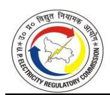

- submits that the distribution losses for DVVNL should incorporate Torrent Power distribution losses as well.
- 3.4.2. One of the stakeholders has raised concern that there has been a drastic variation in collection efficiency in the submissions made on 17.05.2025 and 02.07.2025. Thus, concerns have been raised regarding the reliability of data and submitted that a thirdparty forensic audit of DVVNL's loss data and billing systems by agencies such as PFC or REC should be conducted. The stakeholders have submitted that a penalty should be imposed on Discoms for not meeting the distribution loss trajectory. The concerns have also been raised that the distribution loss trajectory for the control period from FY 2025-26 to FY 2029-30 is high and needs to be lowered so that the consumers are not burdened with excess expenditure.
- 3.4.3. It was submitted that DISCOMs must proactively replace degraded transformers with upgraded units to ensure reliable service delivery. It was also suggested that meters be installed at substations to facilitate accurate net billing and help mitigate electricity theft. It is recommended to employ stronger measures to combat line losses and electricity theft to prevent honest consumers from bearing the costs.
- 3.4.4. The Stakeholders have highlighted that the claimed inter-state transmission losses of 6.29% are significantly higher than the approved losses of 3.77%.

#### *Petitioners' Response:*

- 3.4.5. The Petitioners have submitted that it has requested the Commission to consider the actual distribution loss for FY 2023–24 while evaluating the Petition, acknowledging the genuine efforts made by the licensee and the ongoing initiatives for operational improvement.
- 3.4.6. In regard to distribution loss trajectory, the Petitioners have submitted that Regulation 31.1 of the MYT Regulations, 2025 provides that the Distribution Licensee shall submit the AT&C loss trajectory and corresponding distribution loss trajectory for the entire Control Period along with the ARR Petition for the first year of the Control Period, after taking into account any agreement between the State Government and the Central Government under any national scheme or programme, wherever applicable. Accordingly, the Petitioners have submitted the trajectory for Aggregate Technical & Commercial (AT&C) Loss and Distribution Loss for each of the

| Projected Distribution Loss trajectory (%) of State Discoms |        |        |        |        |        |        |  |  |
|-------------------------------------------------------------|--------|--------|--------|--------|--------|--------|--|--|
| DISCOM                                                      | FY 25  | FY 26  | FY 27  | FY 28  | FY 29  | FY 30  |  |  |
| DVVNL                                                       | 15.53% | 15.53% | 15.22% | 14.91% | 14.62% | 14.32% |  |  |
| MVVNL                                                       | 13.59% | 13.59% | 13.32% | 13.05% | 12.79% | 12.53% |  |  |
| PVVNL                                                       | 11.18% | 11.18% | 10.95% | 10.73% | 10.52% | 10.31% |  |  |
| PuVVNL                                                      | 16.23% | 16.23% | 15.90% | 15.58% | 15.27% | 14.97% |  |  |
| KESCO                                                       | 7.68%  | 7.68%  | 7.53%  | 7.38%  | 7.23%  | 7.09%  |  |  |
| UPPCL                                                       | 13.78% | 13.78% | 13.50% | 13.23% | 12.97% | 12.71% |  |  |

| Projected AT&C Loss trajectory (%) of State Discoms |        |        |        |        |        |        |  |  |
|-----------------------------------------------------|--------|--------|--------|--------|--------|--------|--|--|
| DISCOM                                              | FY 25  | FY 26  | FY 27  | FY 28  | FY 29  | FY 30  |  |  |
| DVVNL                                               | 28.48% | 28.48% | 26.06% | 23.57% | 21.00% | 18.35% |  |  |
| MVVNL                                               | 21.93% | 21.93% | 19.92% | 17.87% | 15.77% | 13.62% |  |  |
| PVVNL                                               | 13.35% | 13.35% | 12.70% | 12.05% | 11.39% | 10.74% |  |  |
| PuVVNL                                              | 36.08% | 36.08% | 33.27% | 30.34% | 27.28% | 24.10% |  |  |
| KESCO                                               | 10.37% | 10.37% | 9.77%  | 9.17%  | 8.57%  | 7.97%  |  |  |
| UPPCL                                               | 23.44% | 23.44% | 22.27% | 20.34% | 18.34% | 16.29% |  |  |

*Note: Above trajectory has been prepared based on the unaudited data for FY 2024-25.*

- 3.4.7. The proposed trajectories in above tables reflect a realistic approach, taking into account various factors such as considering FY 2024-25 (unaudited) data as the baseline with improvement of 1% in collection efficiency in FY 2026-27 and 2% in each subsequent year till FY 2029-30, a gradual glide path for reduction in AT&C loss by ~7.16% during the control period and impact of implementation of RDSS and reduction in T&D losses expected to be achieved through a combination of initiatives under government schemes and the Discoms' internal business plans.
- 3.4.8. The Petitioners have further clarified that Torrent Power is treated as a franchisee and bulk consumer of DVVNL, and accordingly, the losses of the network operated by Torrent cannot be considered.
- 3.4.9. In regard to mandating a study to be conducted by PFC/ REC, the petitioner has submitted that the figures furnished on 17.05.2025 were based on projections, whereas the data submitted on 02.07.2025 is on the basis of actual audited figures as per the balance sheet. The submissions have been made in a transparent manner with proper justification. Further, the petitioner has submitted that detailed calculations of AT&C losses have been provided in the balance sheet of the licensee for FY 2024-25.
- 3.4.10. In response to concerns regarding electricity theft and line losses, the Petitioners submitted that DISCOMs have undertaken multiple initiatives aimed at curbing power

theft. These efforts have reportedly yielded positive outcomes.

3.4.11. In regard to transmission losses, the Petitioner, with reference to the concern regarding the variation between the approved and actual Inter-State Transmission (ISTS) losses, has submitted that such differences arise due to the method of computation based on actual energy flow, balancing of energy, and prevailing grid conditions during the year. It is important to clarify that the inter-state transmission loss is not a fixed value, but rather a computed figure based on actual energy balancing across regional and national grids. These losses are influenced by network congestion, scheduling variations, and loop flows in the national transmission system, which affect the net quantum of energy delivered versus scheduled. Therefore, the Petitioner claimed ISTS loss of 6.29% for FY 2023–24 that reflects the actual energy balancing and delivery across inter-state transmission lines and is in line with the approach consistently accepted by the Commission.

#### *Commission's View:*

3.4.12. The concerns of the stakeholders regarding the distribution loss trajectory have been duly noted. The Commission has given detailed consideration to these concerns while evaluating the Annual Revenue Requirement (ARR) for approval of the distribution loss trajectory. It is observed that the inter-state losses submitted are based on the generation plants operating under the Merit Order Dispatch (MOD) mechanism. Further elaboration on these aspects is provided in the True-up and ARR Chapter, specifically within the power purchase section.

#### **3.5. POWER PURCHASE COST**

#### *Comments / Suggestions of the Public*

- 3.5.1. The Stakeholders have expressed concern that the power purchase cost claimed by the Petitioners is high. This excessive increase in power purchase cost is on account of the high escalation rate, which has led to a sharp rise in fixed costs.
- 3.5.2. One of the stakeholders has raised concerns regarding the Late Payment Surcharge (LPSC) paid to the generating stations. It is recommended that such costs should not be passed on to consumers. It is also submitted that the power purchase cost has increased on account of higher distribution losses and therefore should not be

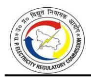

allowed.

- 3.5.3. Stakeholders have also raised that DBST has not been implemented correctly, as a result of which the power purchase cost allocated to the Petitioners is incorrect.
- 3.5.4. One of the stakeholders submitted that the Resource Adequacy Plan has not been submitted by the Petitioners. It is also submitted that there has been no submission on power purchase through battery and pump storage.

#### *Petitioners' Response:*

- 3.5.5. The Petitioners have detailed the methodology adopted for projecting power purchase quantum and associated costs in their filings. These projections have been developed in accordance with regulatory norms and submitted for the Commission's review and approval. The estimates account for anticipated distribution losses as well.
- 3.5.6. It is submitted that deducting the Late Payment Surcharge (LPSC) from admissible power-purchase cost while simultaneously setting off the Delayed Payment Surcharge (DPS) under Non-Tariff Income (NTI) without recognizing the interest/carrying cost incurred to finance DPS receivables amounts to double penalization of the Petitioner. In the interest of regulatory consistency, either LPSC be allowed as a legitimate cost, or the interest on DPS-funded receivables be admitted (or the NTI set-off be correspondingly adjusted).
- 3.5.7. It is submitted that the DBST impact approved in the True-up is duly accounted for by the Licensees in subsequent ARR filings, with adjustments made to power purchase cost based on audited data and Commission approvals. Accordingly, there is no omission in applying the DBST impact.

#### *Commission's View:*

3.5.8. In regard to the submission made by the petitioners, the Commission is of the view that the Petitioners have made a convoluted submission by relating the delayed payment surcharge, levied by the Generation Plants, to Non-Tariff Income. The Commission has not allowed LPS in the past, and the same approach will be taken as the Petitioners are allowed the cost of working capital. Further, there were some discrepancies in the DBST methodology that were adopted by the Petitioners. The Commission has deliberated in detail on DBST in power purchase for True-Up and ARR.

The Commission has also given directions to submit a Resource Adequacy Plan in line with MOP guidelines in the relevant chapters of this Order. The Power purchase cost has been allowed by the Commission as per MYT Regulations and has been dealt with appropriately.

#### **3.6. CAPITAL EXPENDITURE AND IMPLEMENTATION OF RDSS**

#### *Comments / Suggestions of the Public*

- 3.6.1. Stakeholders have expressed concern over the potential impact of large-scale expenditure under RDSS on consumer tariffs. It is requested that suitable treatment is done for funding under RDSS.
- 3.6.2. The stakeholders have made a submission regarding the misuse of RDSS funds, including providing illegal electricity connections without proper estimates and unauthorized line shifting. Concerns were also raised regarding the quality of materials being used in RDSS projects across various DISCOMs. Stakeholders alleged that substandard equipment and components may be compromising the reliability and safety of the distribution network. The stakeholders submitted that third-party inspections should be done to ensure that materials used in RDSS-funded projects meet prescribed technical standards and performance benchmarks.
- 3.6.3. The stakeholders submitted that, alongside RDSS rollout, feeder segregation should be implemented to ensure daytime supply for agricultural consumers while maintaining uninterrupted supply for other categories. To optimize resource utilization, stakeholders recommended that DISCOMs adopt a strategic and costeffective approach by exploring virtual feeder segregation.

#### *Petitioners' Response:*

- 3.6.4. The Petitioners submitted that the ARR petitions have been filed in accordance with the timelines prescribed under the UPERC MYT Regulations, 2019. With respect to the petitions seeking approval for capital expenditure under the Revamped Distribution Sector Scheme (RDSS), the Petitioners acknowledged that the disposal of such petitions falls under the exclusive jurisdiction of the Commission. In this regard, the petitioner has requested to consider its submission.
- 3.6.5. In response to concerns regarding the quality of materials used in RDSS projects, the

Petitioners clarified that all equipment and components are subject to sample-based inspections conducted by accredited Central Government agencies or laboratories. These inspections are intended to ensure compliance with technical standards and safeguard the integrity of the distribution infrastructure. The Petitioners further stated that any deviations or deficiencies identified during these inspections are addressed promptly through corrective measures.

## *Commission's View:*

- 3.6.6. The Commission has already granted approval to RDSS, and capitalization was allowed for FY 2024-25 in the Tariff Order dated October 10, 2024. Taking into consideration the Commission's approval, the appropriate treatment has been done for Capex and ARR components associated with such treatment. The concerns of consumers regarding the quality of material being deployed under RDSS are not deliberated under this order, as the quality control aspect or procurement of materials, etc., are beyond the scope of the Tariff Order. The Commission cannot be expected to become a roving eye on the quality of works being undertaken by the licensees. The licensees are expected to conduct their activities with prudence and professionalism.
- 3.6.7. The Commission directs the Petitioners to explore the opportunities related to virtual feeder segregation and submit a report on its viability and plan within three months.

#### **3.7. OTHER ARR COMPONENTS**

#### *Comments / Suggestions of the Public*

- 3.7.1. In regard to the classification of Contractual and spot billing expenses under employee expenses, which were earlier classified under A&G, it is submitted that the Commission has been considering these expenses under A&G expenses. Therefore, the submission made by the Petitioners should not be considered while truing-up. It is also submitted that the O&M expenses have been incorrectly claimed by the Petitioners for FY 2025-26, as the value of the base year is not correct.
- 3.7.2. The stakeholders have raised concerns over the huge amount of bad and doubtful debts that have been claimed by the Petitioners. Accordingly, it is requested to conduct a detailed consumer-wise breakup along with data on recovery efforts undertaken by the DISCOMs. It is submitted that the absence of such granular

information raises questions about the legitimacy and accountability of these claims. Collectively, these submissions underscore the need for enhanced scrutiny, transparent reporting, and independent verification of bad and doubtful debt figures. Stakeholders have urged the Commission to take a proactive role in ensuring that such provisions are based on verifiable data and aligned with sound financial and regulatory practices.

- 3.7.3. The concerns have been raised that the Petitioners have failed to reflect any growth in non-tariff income figures over time. It has also been submitted that the non-tariff income claimed by the Petitioners is incorrect, as higher non-tariff income has been submitted in the audited annual accounts.
- 3.7.4. It is recommended that smart metering is a "self-sustaining scheme," and therefore the Smart meter Opex claimed by the Petitioners should not be allowed.

#### *Petitioners' Response:*

- 3.7.5. It is submitted that the Petitioner has increasingly engaged contractual manpower for essential functions such as metering, billing, and revenue collection to improve operational performance and reduce long-term fixed establishment costs. As per the existing accounting practice, these expenses are recorded under A&G expenses, but their nature is essentially that of Employee Expenses. Since the methodology under Regulation 45(b) of the UPERC MYT Regulations, 2019, uses historical trued-up data up to FY 2018–19, when such expenses were minimal, and it does not reflect the actual cost structure at present. Due to this, the normative approach understates genuine manpower-related expenses, leading to under-recovery. The Petitioner, therefore, requests the Commission to recognize and allow these expenses separately as Employee Expenses. Also, as per the general provisions of the Rate Schedule transaction charges for online payment up to Rs. 4,000 are borne by the Petitioners. This not only reduces the employee expenses related to collection but also results in additional expenditure in relation to transaction charges. The Petitioners have requested the Commission to remove this provision under clause no. 17, of rate schedule.
- 3.7.6. In regard to the claim for bad and doubtful debts, the Petitioner has submitted that

- bad and doubtful debts have been claimed as per the UPERC MYT Regulations, 2019 and MYT Regulations 2025.
- 3.7.7. In regard to non-tariff income, it is submitted that non-tariff income is generally not projected for the Annual Performance Review (APR) and Annual Revenue Requirement (ARR) years. Instead, it is accounted for during the true-up process based on actuals. Consistent with this approach, the Commission has adopted the non-tariff income figures approved during the true-up as the basis for ARR calculations. Further, the Petitioner has estimated Non-Tariff Income (NTI) in accordance with the provisions of the UPERC MYT Regulations, 2019 and UPERC MYT Regulations, 2025. The methodology prescribed under these regulations has been duly followed by the Petitioner.
- 3.7.8. In reference to the stakeholder's comment that smart metering is a "self-sustaining scheme," it is submitted that full benefits of RDSS Smart metering will only be realized after complete rollout across all consumer categories, including rural and low-load areas.

#### *Commission's View:*

- 3.7.9. The Commission observed that non-tariff income claimed by the Petitioners in trueup is lower in comparison to non-tariff income in audited accounts. The Commission has taken note of the submissions made by the Stakeholders on other aspects and has appropriately dealt with these in the relevant chapters. To briefly describe the treatment, the smart meter opex has been disallowed, and for treatment of expenses related to contractual employees and Non-Tariff Income, the approach of the Commission in previous orders has been considered. For approving ARR, the provisions of the MYT Regulations, 2025, have been considered.
- 3.7.10. In regard to the lack of growth in non-tariff income, the Commission is of the view that, as per Regulation 35.3 of MYT Regulations, 2025, the Petitioners shall undertake an asset monetization study within six months of issuance of these Regulations. The Commission directs the Petitioners to comply with the Regulations and undertake an asset monetization study, which will be useful in identifying areas for increasing nontariff income.

3.7.11. In regard to the request of the Petitioners to remove clause 17 of the general provisions of Rate Schedule, the Commission is of the view that as per Regulation 23 of MYT Regulations, 2025, banking and finance charges are to be allowed as per actuals subject to the prudence check by the Commission. Therefore, the concern of the Petitioners is already addressed.

#### **3.8. REVENUE FROM SALES AND GOUP SUBSIDY**

#### *Comments / Suggestions of the Public*

- 3.8.1. It is submitted that complete disclosure of all subsidy-related data, including the requirement, commitment, actual disbursement, and ABR with and without subsidy, should be made. Further, such data should be submitted for each category/ subcategory who are getting a subsidy from GOUP.
- 3.8.2. The stakeholders submitted that despite the Commission's directive prohibiting the continuation of the One-Time Settlement (OTS) scheme, UPPCL has persisted with its implementation. The revenue waived under this scheme has not been appropriately reflected in the True-up process.
- 3.8.3. One of the stakeholders submitted that the Petitioners incurred expenditure of interest amounting to Rs. 1,622 Cr. due to delays in subsidy disbursement from the Government of Uttar Pradesh (GoUP). It is recommended that the actual Interest on Working Capital (IoWC) may be allowed for such amount.
- 3.8.4. One of the stakeholders submitted that while truing-up, rather than considering actual revenue realized from Torrent Power as a Bulk Supply consumer, the revenue billed by Torrent should be considered.
- 3.8.5. The stakeholders have highlighted the concern about annual financial losses amounting to Rs. 488 Cr. due to unmetered and uncontrolled electricity consumption by departmental employees.
- 3.8.6. The stakeholders have also raised concerns regarding inconsistencies in actual sales figures, with a particular focus on LMV-3, where there is an unexplained increase in both consumer count and energy sales.
- 3.8.7. Concerns have been raised regarding the TOD Tariff that is applicable to industrial consumers. One of the stakeholders submitted that the existing Time of Day (TOD)

tariff structure, comprising five slots and eight peak hours, poses operational challenges for industries. Stakeholders have requested an alignment with the Ministry of Power (MoP) guidelines and a reduction in peak hours. Concerns were also raised that frequent tariff revisions and TOD changes should not be there. Stakeholders from industry have also submitted that several States have revised TOD tariffs downward. Similar reforms are requested by the stakeholders in Uttar Pradesh to ensure tariff competitiveness and support industrial growth. Further, it was suggested that the current TOD tariff structure is outdated in the context of surplus power availability and should be discontinued for industrial consumers.

#### *Petitioners' Response:*

- 3.8.8. It is submitted that the Government of Uttar Pradesh has budgeted a subsidy of ₹17,100 crore for FY 2025–26, while the Petitioner has submitted provisionally ₹17,512 crore with the request to the commission to consider the subsidy as per the letter from GoUP.
- 3.8.9. The Petitioners submitted that the One-Time Settlement (OTS) scheme is funded through the Discom's Return on Equity (RoE) and does not impact consumer tariffs. As such, the waived revenue is neither passed on to paying consumers nor reflected in the Annual Revenue Requirement (ARR). Also, the OTS scheme is not governed by UPERC MYT Regulations, 2019, and DISCOMs have not sought any related relaxation in their Petition. It was introduced by UPPCL solely to enhance revenue collection, which is recorded as consumer revenue.
- 3.8.10. DVVNL has submitted that Torrent Power is an input-based Distribution franchisee. The energy billed by DVVNL is determined as per the formula provided in the agreement with the distribution franchisee. Accordingly, the revenue generated from supplying power to the distribution franchisee has been considered.
- 3.8.11. The Petitioner submitted the billing determinants and revenue recovered from employees/retirees/pensioners before the Commission under data-gap submissions as mentioned below:

| DISCOM | FY      | No. of Consumers | Load (in kW) | Sales (in MU) | Revenue recovered (in Cr.) |  |
|--------|---------|---------------------|-----------------|------------------|-------------------------------|--|
| DVVNL  | 2023-24 | 7,748               | 16,805          | 111.88           | 68.37                         |  |

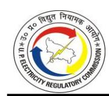

| DISCOM | FY      | No. of Consumers | Load (in kW) | Sales (in MU) | Revenue recovered (in Cr.) |
|--------|---------|---------------------|-----------------|------------------|-------------------------------|
| MVVNL  | 2023-24 | 14,631              | 31,489          | 238.38           | 25.19                         |
| PVVNL  | 2023-24 | 13,637              | 34,981          | 165.02           | 20.53                         |
| PuVVNL | 2023-24 | 17,121              | 35,526          | 221.99           | 11.13                         |
| KESCO  | 2023-24 | 5,211               | 17,506          | 1.37             | 0.05                          |
| UPPCL  | 2023-24 | 58,348              | 1,36,307        | 738.64           | 125.27                        |

- 3.8.12. The Petitioner submitted that due to a comprehensive drive undertaken to register and regularize previously unaccounted LED streetlight connections in rural areas, the addition of these connections, particularly in gram panchayat areas and smart city projects, led to a large increase in consumer count and connected load. While LED lights have lower per-unit consumption, the vast increase in the number of connections drove the overall sales growth.
- 3.8.13. A detailed submission has been made in relation to comments received on the TOD Tariff structure. It is submitted that the Time-of-Day (ToD) tariff is applied to encourage consumers to shift their electricity usage from peak hours to off-peak hours. This helps in reducing pressure on the grid during peak demand periods and promotes better load management. Even in a surplus energy scenario, the demand during certain peak hours can be significantly high, requiring the DISCOM to purchase expensive power or run costly generating stations to meet that short-term demand. The ToD tariff helps in managing this cost and improving overall system efficiency. Abolishing the ToD tariff may lead to higher demand during peak hours, increasing the power procurement cost for the DISCOM. This would ultimately impact financial sustainability and may put upward pressure on tariffs for all consumer categories. Therefore, the ToD tariff remains an important tool for maintaining grid stability and cost-effective power supply.
- 3.8.14. The Petitioners have submitted that the Commission, vide its Order dated 10.10.2024, has already examined the provisions of the Ministry of Power's Electricity (Rights of Consumers) Amendment Rules, 2023, and observed that the aggregated load profile of the State does not align with the concept of "solar hours" being treated as off-peak hours, particularly during the summer months when system peak is recorded outside solar hours. Nearly 75% of the consumption in the State is contributed by consumer

categories such as Domestic, Non-Domestic, Public Lamps, Institutions, etc., whose demand profile is largely inelastic, while Industrial and Public Water Works categories have significant daytime demand. If ToD "off-peak" hours were aligned strictly with solar hours as per the MoP Rules, it would not match the actual demand profile in UP and would also cause substantial revenue loss, since a large portion of consumption occurs in daytime when rates would fall by 20%. Accordingly, the ToD framework as approved in the Tariff Order dated 10.10.2024, with revised peak and off-peak slots, is being implemented by the Discoms. As directed, the Petitioners will also submit a study on consumer category-wise demand curves and revenue impact for further rationalization; however, till such time, the current Commission-approved ToD structure is being followed in letter and spirit.

#### *Commission's View:*

- 3.8.15. The Commission directs the Petitioners to furnish category-wise and sub-categorywise subsidy details in their next tariff filings. Section 65 of the Electricity Act requires that subsidies notified by the State Government be paid in advance. In case of any delay, the Petitioners shall pursue the matter with the Government of Uttar Pradesh. The burden of the delayed subsidy cannot be shifted to other consumers. Accordingly, no additional interest on working capital is allowed on this account, and the stakeholders' request is not accepted.
- 3.8.16. In regard to OTS, the Commission finds that an appropriate submission has been made by the Petitioners. In regard to the impact of unmetered consumers, the Commission is of the view that it has been allowing power purchase as per norms approved by the Commission. Further, the Commission does not consider the revenue realized by Torrent as it is an arrangement between the Petitioner and the Franchisee.
- 3.8.17. In regard to the TOD structure, no proposal has been submitted by the Petitioners. Also, the stakeholders have not submitted any data to support their argument. The Commission in Order dated October 10, 2024, had approved the TOD structure after analyzing several aspects that influence demand and supply. Moreover, it is recommended that the TOD structure is not modified frequently. Therefore, the Commission does not find any merit in changing the TOD structure.

#### **3.9. TORRENT (AGRA DISTRIBUTION FRANCHISEE)**

#### *Comments / Suggestions of the Public*

- 3.9.1. The stakeholders have raised concerns overthe asset valuation of Torrent. There have been concerns about inflated bills in the area of Torrent Power. The stakeholders representing agricultural consumers submitted that the billing of consumers under the LMV-5 category is done as per the urban schedule; however, in the adjoining area, which is served by DVVNL, the rural schedule is applicable. The stakeholders requested that billing of consumers under the LMV-5 category in the Torrent area should be done as per the rural schedule. They also requested that subsidy should also be provided to agricultural consumers in Torrent areas as provided to other consumers in the State.
- 3.9.2. It is requested that the distribution loss and ARR for Torrent Power should be determined separately. This will ensure that the benefits of better performance of Torrent Power are realized by its consumers.

## *Petitioners' Response:*

3.9.3. DVVNL has submitted that Torrent Power is an input-based Distribution franchisee. The treatment of capital expenditure and other aspects is governed by the agreement between DVVNL and the distribution franchisee. Therefore, the Petitioner considers Torrent Power as a 'Bulk consumer'.

#### *Commission's View:*

3.9.4. The capital expenditure and distribution losses of Torrent Power cannot be considered, as these aspects are governed by the franchisee agreement between Torrent Power and the Licensee (DVVNL). Accordingly, a separate ARR for Torrent Power is not approved. Torrent Power shall comply with the Tariff Order of the Commission and apply the rates as per the approved Rate Schedule. However, if the consumers have any concern regarding the Rate applicability, they may approach the Consumer Grievance Redressal Forum (CGRF). Since the private tubewell consumers under the Torrent area are being fed with an urban supply schedule hence billing of these consumers cannot be done as per the rural billing schedule, and accordingly, these consumers may not be eligible for the subsidy provided to rural private tubewell consumers.

#### **3.10. MULTISTORIED BUILDINGS**

#### *Comments / Suggestions of the Public*

- 3.10.1. Several issues have been raised by the consumers in multi-storied buildings. The concern has been raised that the collection of electricity bills by the builder / RWA is higher in comparison to the payment made to the distribution licensee. The rebate received from distribution companies is not being passed on to the consumers. Further, it is submitted that there is no clarity in how the commercial load in multistoried buildings will be charged and what the treatment will be. The concerns have been raised that miscellaneous charges not related to electricity supply are being deducted from the prepaid meters that have been installed. It is requested to direct the builders to collect payments related to electricity only. The consumers are not getting the bills for electricity consumption. This issue is particularly there for prepaid meters in both single-point and multi-point connections.
- 3.10.2. The concerns have been raised in relation to the denial of new connections and other supply code-related issues, such as disconnection, increase in load, etc. The infrastructure in society may require repair and replacement. Concerns have been raised with respect to the entity that will be responsible for maintaining the infrastructure. This issue is more relevant in the case of societies that have been converted from single-point to multi-point connection.
- 3.10.3. It has been submitted that proper surveys have not been conducted to take the consent/opinion of the resident for conversion from single-point to multi-point. It is submitted that proper surveys are not conducted, and there is a lack of transparency, leading to fraud in showing support from single-point connection. The concern has been raised that, despite consent being given, conversion is not being done. Several documents are being demanded that are not available with the consumers. It has been raised that the townships are not being covered under the 13th amendment, and as a result, the consumers are not able to opt for multi-point connection. The concern has been raised that the builder is not developing adequate infrastructure. In some cases, the builder has handed over the building to RWA without the complete infrastructure being developed.
- 3.10.4. Clarity is sought on how RSPV can be installed in multi-storied buildings. There are

concerns that the builders have taken a net metering connection, and the benefit is not being given to consumers. The consumers are not able to get the applications resolved that are made with CGRFs, as there is limited control over builders. The complaints were raised that issues are being faced in getting the connection for EV charging in multi-storied buildings. The consumers are facing issues related to the recharging of prepaid meters.

3.10.5. There are concerns that in townships, there are two levels of single-point connections. This means that the single point connect holder is further giving single point who in turn is giving connections to consumers. This leads to several issues, such as an exorbitant increase in tariff and other issues related to the supply code, for which there is no remedy.

#### *Petitioners' Response:*

3.10.6. The Petitioners submitted that the matters set out in above paragraphs are governed by the Electricity Supply Code, 2005, as amended, including the 13th Amendment, and by the Commission's Tariff Orders. These instruments prescribe the framework for single-point and multi-point supply, the consent requirements for conversion, the applicable billing and disclosure obligations, and the mechanisms for consumer grievance redressal. The Petitioners further submitted that the individual complaints received during the public hearing have been forwarded to the competent divisions for action in accordance with the prescribed procedure. The Petitioners also submitted that certain issues raised by stakeholders require policy clarification or regulatory interpretation, including the treatment of commercial loads within group housing, the norms set out by the Commission for conversion, the coverage of townships, and the responsibility for internal electrical infrastructure, and that these matters fall within the remit of the Commission. The Petitioners undertake to implement any clarifications or directions that the Commission may issue.

#### *Commission's View:*

3.10.7. The Commission is developing a concept paper to holistically address different concerns raised by the consumers in multistoried buildings, both on single-point and on multi-point supply subsequent to implementation of the 13th Amendment in Supply

Code, as well as in townships on single-point connection. The concept paper will be issued shortly after issuance of Tariff Order. The concept paper endeavors to resolve as many issues as possible, barring the extension of the facility of net metering benefits in multi-storied buildings, as this will be taken care of immediately in the aftermath of the issuance of group net metering and virtual net metering Regulations by this Commission. These Regulations are likely to be issued shortly. However, the Concept paper will deal with virtually all remaining issues but since it will involve a paradigm shift in the roles and responsibilities of various stakeholders involved in providing supply to the consumers of multi-storied buildings and townships and an attempt is being made to use technology in order to optimize the cost, the Commission considers it prudent that the discussion paper is floated for discussion among the stakeholders and would be given a final shape after providing an opportunity of hearing to various stakeholders so that the solution remains pragmatic keeping in view the ground realities while ensuring that a strict regulatory oversight is there on various players so that the consumers at large are not fleeced by the unscrupulous developers/builders/RWAs and that the consumers do not fall hostage to the situational seize. Tariff-related aspects are provided in this Tariff Order.

#### **3.11. SUPPLY CODE/PERFORMANCE-RELATED ISSUES**

#### *Comments / Suggestions of the Public*

- 3.11.1. Numerous complaints have been raised regarding delays in providing electricity connections, load reduction, slow electrification of residential areas and societies, misuse of existing connections, inaccurate billing, fictitious dues, and wrongful disconnections. Concerns were raised about delayed billing in remote areas. The stakeholders submitted that consumers should be compensated for incorrect billing and overcharges. It is proposed to reduce documentation for increasing or decreasing the contracted load.
- 3.11.2. The stakeholders from the hotel industry highlighted the financial and operational burden caused by the requirement to install 30–40 kW transformers for new connections and requested relief in line with the policy's industrial classification for tourism units.

- 3.11.3. The stakeholders also highlighted that small connections in the LMV-6 category consumers are required to pay minimum charges for two years if they disconnect their electricity connection within that period. It is requested that the requirement to pay minimum fees for disconnection within two years should be eliminated. It is also recommended to abolish the imposition of mandatory minimum charges on newly established units and in cases where operations are halted prematurely due to market fluctuations or technical constraints.
- 3.11.4. Concerns have been raised that petitioners have not disclosed details related to accidents, compensation, or payments made to affected individuals or families. The stakeholders submitted that there is a lack of clear guidelines and publicly available information regarding compensation for victims of electrical accidents and fatalities in Uttar Pradesh.
- 3.11.5. It is also submitted that the consumers under the LMV-5 category are getting supply for less than 10 hours. Industries emphasized the need for uninterrupted 24x7 electricity supply and sought compensation for prolonged outages.
- 3.11.6. The Stakeholders have proposed implementing OTP-based closure mechanisms to prevent false resolution reporting.
- 3.11.7. The current status of CGRFs in terms of their establishment and operational effectiveness is highly unsatisfactory. This has led to prolonged delays in addressing consumer complaints, leaving many grievances unresolved. As a result, affected consumers are left vulnerable, with no viable alternative for seeking redress, and are often at the mercy of the Licensees. It is recommended that the Consumer Grievance Redressal Forum (CGRF) be empowered to adjudicate all types of rule violations. In instances where theft is not evident, consumers should not be denied access to the grievance redressal mechanism by the inappropriate application of theft-related provisions.
- 3.11.8. The stakeholders have stated that the Petitioners have not submitted the details of compensation paid under SOP Regulations.

#### *Petitioners' Response:*

3.11.9. In regard to the concerns raised by the stakeholders on service-related issues, it is

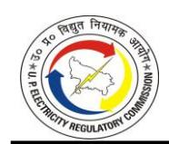

submitted that the security deposit is charged from the consumer as per the UP Electricity Supply Code 2005 and the Cost Data Book issued by the Commission. It is further submitted that continuous and proactive efforts to improve infrastructure, reduce technical faults, and address regional challenges to ensure uninterrupted and quality power supply to consumers, in line with the standards prescribed under the Electricity Supply Code, 2005, are being made. With regard to the concern raised by the stakeholders for NOC, change in land use and relaxation for newly established units, it is respectfully submitted that the Petitioner strictly complies with the provisions of the UPERC Electricity Supply Code, 2005, as amended from time to time.

- 3.11.10. For the comments regarding matters related to electrical accidents, it is submitted that the Petitioners maintain a zero-tolerance policy toward electrical accidents and enforce strict compliance with safety protocols, including mandatory use of protective equipment and adherence to safety guidelines. Infrastructure modernization and strengthening efforts are also underway to mitigate accident risks. It is further submitted that there is a provision for providing compensation in case of electrical accidents after following the due procedure and submission of relevant documents to the concerned office of the Discoms. Compensation for human and animal fatalities resulting from electrical accidents is provided in accordance with UPPCL's Office Memorandum dated 25.09.2021.
- 3.11.11. For supply hours, it is submitted that the Petitioners are actively working to reduce outages and ensure a more stable and reliable power supply. Significant investments have been made under successive Business Plans. Further, supply hours for each feeder are continuously being monitored through the installed feeder meter and supply analytical tools. Specifically, in relation to supply to the LMV-5 consumer category, it is submitted that supply hours on rural & agricultural feeders are based on the rostering schedule.
- 3.11.12. Regarding OTP based closure of complaints, it is submitted that many consumers do not provide correct or updated mobile numbers in their connection records, limiting the feasibility of implementing an OTP-based complaint closure system.
- 3.11.13. With regard to the constitution of the Consumer Grievance Redressal Forums (CGRFs), it is submitted that Licensees have established CGRFs at various levels. It is submitted

that the constitution of CGRF and the selection/appointment of its members are being done in compliance with the eligibility criteria as provided in UPERC CGRF Regulations 2022. Further, DISCOMs are making their best efforts to complete the process and constitute the CGRF at the earliest possible time, so that grievances of consumers may be addressed promptly and effectively. Comprehensive details, including the procedure for lodging complaints, are made available on the respective Licensees' websites to ensure ease of access for all consumers.

3.11.14. The Petitioners have submitted that they have been complying with the UPERC SOP Regulations, 2019.

#### *Commission's View:*

- 3.11.15. The Commission has taken note of the submissions made by the stakeholders and is of the view that the concerns raised by the stakeholders are primarily related to the supply code, which is being recast to meet new challenges. The Commission is likely to come up with a new draft Supply Code, which will be finalized only after a detailed consultation process. The Commission would like to address the concerns of stakeholders in the upcoming Supply Code, and while doing so, the submissions provided in the Tariff Hearings will be taken into consideration.
- 3.11.16. The Commission, while accepting that there are certain practical difficulties in implementing a directive regarding OTP-based complaint closure, observes that complaint resolution remains critical to the consumers' satisfaction level towards the services of the licensee. Hence, the Commission observes that a mechanism needs to be developed to assess the satisfaction level of consumers in the resolution of their complaints. Such a mechanism must emphasize encouraging consumers to share the experience and providing feedback regarding complaint-tackling time and the responsiveness of the local distribution system. The mechanism should also have a rating provision so that the consumers can suitably indicate their satisfaction level as regards the disposal done by the Licensee. The Petitioners are directed to develop a framework in this regard and submit the same before the Commission within 3 months.
- 3.11.17. In regard to CGRF, the Commission regularly monitors the status and ensures that

CGRFs are operational, and appropriate sitting of the benches is taking place. In case there is a delay in the grant of various services by the licensee or standards have not been maintained, the consumer may claim compensation as per the Standards of Performance Regulations framed by the Commission.

- 3.11.18. The Commission finds that the Petitioners have not submitted the quarterly reports on SOP as required under SOP Regulations, for the preceding three quarters. Such an omission constitutes a clear instance of non-compliance with applicable regulatory requirements. The Commission directs the Petitioners to furnish detailed data pertaining to the complaints received and the number of complaints resolved, irrespective of any compensation that has been awarded in such cases. The said information shall be submitted under distinct categories, including but not limited to new connections, billing-related grievances, disconnection issues, and other relevant service areas as provided in the Standards of Performance Regulations, 2019.
- 3.11.19. The Commission has received several individual complaints. These have been forwarded to the Petitioners for resolution. The Commission directs the Petitioner to submit a compliance report on each consumer complaint within a month.

#### **3.12. PRIVATIZATION**

#### *Comments / Suggestions of the Public*

3.12.1. The Stakeholders have raised concerns regarding the Privatization of DVVNL and PuVVNL. It is alleged that misleading financial data has been submitted to justify privatization. Concerns have been raised regarding the undervaluation of assets and procedural irregularities. Concerns have also been raised that privatization would lead to higher costs and reduced stakeholder participation. It is also highlighted that privatization would lead to loss of reservation benefits for marginalized communities (SC/ST/OBC/EWS/minorities), increased unemployment, and overall public hardship.

#### *Petitioners' Response:*

3.12.2. On the matter of privatization of PuVVNL and DVVNL, it is submitted that the current Petition exclusively pertains to the determination of the Annual Revenue Requirement (ARR) and tariff proposals for FY 2025-26. Decisions concerning structural changes, disinvestment, or privatization of state-owned utilities are within the jurisdiction of

the Government of Uttar Pradesh. It is submitted that the State Government has given in-principal approval for reforms in two DISCOMs, and M/s Grant Thornton Bharat LLP has been appointed as a transaction advisor through an open tendering process, to study and provide advisory inputs regarding possible structural reforms and private participation in the distribution sector.

## *Commission's View:*

3.12.3. The Comments made by the stakeholders are outside the scope of the Tariff proceedings. The present proceeding is confined to the determination of ARR and tariff for FY 2025–26 under the applicable Regulations. Questions of restructuring, disinvestment, or privatization lie within the policy and executive domain of the Government of Uttar Pradesh and are outside the scope of this tariff determination. The Commission therefore does not adjudicate on these issues in this Order. Any transition undertaken by the Government will be governed by the applicable legal framework and shall not dilute the obligations of the distribution licensee towards consumers, including compliance with the Commission's Regulations, Orders, and Standards of Performance. Concerns of the stakeholders, if any, may be raised before the appropriate forum.

#### **3.13. OPEN ACCESS CHARGES AND OTHER RELATED ISSUES**

#### *Comments / Suggestions of the Public*

- 3.13.1. The Stakeholders have submitted their concern for delays in the issuance of No Objection Certificates (NOCs) for open access and request that such approvals be granted in a timely and transparent manner. It is also submitted to approved voltage losses, including those below 650 Volts, to eliminate ambiguity and ensure equitable treatment of Green Energy Open Access consumers.
- 3.13.2. It is also submitted that the lower of approved losses or the actual losses recorded be applied for billing purposes, to ensure fairness and avoid undue financial burden. Additionally, stakeholders requested to notify a Multi-Year Tariff (MYT) framework to provide stability in open access charges, which is essential for encouraging long-term investments in renewable energy and supporting net-zero commitments.
- 3.13.3. It is submitted that the CSS values determined by the Petitioners are based on

assumptions and not on voltage-wise values of different components required for determining CSS. Concerns were raised regarding the absence of a clear and timebound roadmap for the gradual elimination of cross-subsidies, as envisioned under the Electricity Act, 2003. It is requested that the Commission revisit the CSS trajectory and consider a phased reduction to the elimination of cross-subsidy, in line with the provisions of the Electricity Act and judicial directives from APTEL and the Hon'ble Supreme Court.

#### *Petitioners' Response:*

- 3.13.4. The Petitioner submitted that there is no inordinate delay in granting NOC for open access by the DISCOMs. Whenever an applicant applies for Short-Term Open Access through the EASS portal of SLDC, a Format ST-11 is generated, which is reflected in the domain of the respective DISCOM. The ST-11 format is then forwarded to the concerned field unit of Distribution for investigation of the technical feasibility within the stipulated timeframe. Based on the feasibility report, the application is approved by the competent authority of the DISCOM on the said portal, enabling SLDC to issue the NOC accordingly. Further, Discom endeavors to issue Open Access NOC within a timeline.
- 3.13.5. Also, the Petitioner mentions that the methodology for applying distribution losses to open access billing is prescribed by the Commission in its last Tariff Orders, which is on the basis of the actual losses of the network for the immediately preceding quarter. At present, it is not operationally feasible to measure and allocate actual voltage-wise distribution losses in real time due to the absence of smart metering on all the consumers and advanced network analytics across all five government-owned Discoms. This limitation prevents the reliable and consistent calculation of actual losses for each discom at different voltage levels. Moreover, applying actual loss figures at this stage when the metering and monitoring infrastructure varies significantly among discoms would result in uneven distribution loss charges for otherwise similar industrial and open access consumers, solely based on their geographic location or discom jurisdiction. This disparity would undermine the principles of regulatory equity, a level playing field, and predictability for bulk and

- industrial consumers operating in different parts of the State. Therefore, keeping the approved loss approach is necessary for uniformity, transparency, and regulatory consistency for all open access consumers.
- 3.13.6. In regard to open access charges, it is submitted that, as per Clause 39.1 (Wheeling Charges) of the UPERC MYT Regulation 2025, the fixed costs related to network assets are to be recovered through wheeling charges, determined/calculated as provided in the Regulation. The Petitioners clarified that the wheeling charges proposed in their submission represent an average value, while voltage-wise loss components have been utilized exclusively for the computation of Cross-Subsidy Surcharge (CSS). Stakeholders, however, appear to have misinterpreted the voltage-wise figures as directly applicable wheeling charges. The Petitioners requested the Commission to approve the average wheeling charge as proposed, emphasizing that the voltage-wise elements have been appropriately integrated into the CSS model and are not intended for direct consumer billing. The Petitioners clarified that distribution charges are not levied independently but are embedded within the CSS computation framework. These charges are essential for maintaining grid reliability and ensuring equitable cost recovery across consumer categories. The Petitioners cautioned that eliminating these charges could disrupt the regulatory balance, potentially creating unfair advantages for large consumers while placing smaller businesses at a disadvantage. They urged the Commission to retain the current structure to preserve fairness and operational sustainability within the electricity distribution ecosystem.
- 3.13.7. It is further submitted that the Cross Subsidy Surcharge (CSS) has been computed strictly in accordance with the methodology prescribed under Clause 37 of the UPERC Multi-Year Tariff (Distribution) Regulations, 2025. The said Regulations further stipulate that in no case shall the CSS exceed 20% of the Average Cost of Supply. Accordingly, the computation undertaken by the Petitioner fully adheres to the applicable regulatory provisions and is consistent with the framework laid down by the Commission.

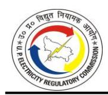

#### *Commission's View:*

3.13.8. The Commission has taken note of the submissions made by the stakeholders and the Petitioners, and it has endeavored to deal with them in an appropriate manner under the relevant chapters of this Tariff Order.

#### **3.14. SMART METERS AND PREPAID METERS**

#### *Comments / Suggestions of the Public*

- 3.14.1. The stakeholder recommended that prepaid meters should be made optional rather than being made mandatory.
- 3.14.2. Concerns have also been raised regarding the proper functioning of smart meters, as abnormally high consumption is being recorded.

#### *Petitioners' Response:*

- 3.14.3. Regarding making prepaid meters optional, it is submitted that, as per the AMISP program being implemented by the Petitioners for the installation of smart meters, which is approved by the Commission, it has been directed to provide connection in prepaid mode.
- 3.14.4. Regarding the stakeholders' concern about fast-running smart meters, it is submitted that, as per Clause 5.6 of the Uttar Pradesh Electricity Supply Code, 2005 and its subsequent amendments, a consumer may request the installation of a check meter to verify the accuracy of consumption recorded by the existing meter.

#### *Commission's View:*

3.14.5. As per the Electricity (Rights of Consumers) Rules, 2020 and agreement under RDSS, the Petitioners are required to provide new connections through smart meters/ prepaid meters only. It also requires mention that the language of Section 47(5) of the Electricity Act 2003 does not make it mandatory. However, this Commission refrains from commenting on the correctness of the legal situation as PILs against mandatory installation of pre-paid meters are sub judice before different Hon'ble High Courts. Unless a clear legal understanding emerges, the Commission would only like to state that, irrespective of whether the meter is pre-paid or post-paid, the consumer should be provided with a correct meter, which is their undiluted right. Going forward, the

Commission would only like to state that in case of concern regarding the functionality of smart meters/ prepaid meters, the Consumers can get testing done as per the provisions of the Supply Code, till this issue is resolved by the Courts.

#### **3.15. PROMOTION OF RENEWABLE ENERGY**

#### *Comments / Suggestions of the Public*

- 3.15.1. The stakeholder from industry requested the reintroduction of net metering for industrial consumers to facilitate renewable energy adoption and reduce dependence on conventional grid supply.
- 3.15.2. The stakeholders also proposed the introduction of lower daytime electricity tariffs in conjunction with net metering to incentivize solar energy usage and reduce overall power procurement costs. It is suggested to provide incentives for solar energy adoption and net metering to reduce transmission losses and enhance sustainability across the power distribution network.

#### *Petitioners' Response:*

3.15.3. It is submitted that introducing net metering for industrial consumers will require the DISCOM to compensate such consumers at the retail tariff, which is significantly higher than the rate at which the DISCOM can procure renewable energy through competitive bidding. It is pertinent to note that net metering is primarily intended for consumers who are cross-subsidized, such as residential and agricultural consumers. These categories are charged with tariffs, which are lower than the average cost of supply. Allowing net metering for such cross-subsidized consumers contributes to reducing their dependence on subsidized power, thereby lowering the cross-subsidy burden on cross-subsidizing consumers, such as industrial and commercial users.

#### *Commission's View:*

3.15.4. In regard to incentives for RSPV, the Commission is of the view that subsidy is being provided to the consumers under PMSG-MBY. The RSPV Regulations also provide a conducive framework for the adoption/ installation of the RSPV system. Further, regarding keeping the tariff low during solar hours, in the Tariff Order dated October 10, 2024, the Commission has deliberated in detail on the TOD structure and regarding

- incentives during solar hours. Considering the load profile of the Petitioners, the Commission could not allow incentives during solar hours. Therefore, the comments of the stakeholders are not accepted.
- 3.15.5. The Commission is of the considered view that the benefit of net metering cannot be extended to all categories of consumers, as it has huge cost implications for the Discoms. Net metering allows 100% banking and withdrawal of such banked power at any time of the day, including peak hours. Power purchase cost for daytime (off-peak hours) is low, and during peak hours, it is high. Thus, a net metered consumer injects power when it is cheap and withdraws power when it is costly. Moreover, considering the demand profile of the state, demand during daytime is low and solar power injections are high, leading to issues of management of such power. Therefore, domestic consumers who are subsidized consumers are promoted to install a rooftop and avail net metering. While industrial consumers cannot avail net metering, they can opt for net billing and reduce their power purchase cost.

#### **3.16. MISCELLANEOUS**

#### *Comments / Suggestions of the Public*

- 3.16.1. The stakeholders have raised concerns regarding continued non-compliance with the directives of the Commission regarding the installation of electricity meters at the residences of employees and pensioners.
- 3.16.2. The stakeholders have also submitted that the Petitioners have refrained from compliance with the provisions of Electricity (Rights of Consumers) Rules 2020, as per which 24-hour supply must be ensured.
- 3.16.3. Consumers have reported unauthorized deductions for charges of SMS services.
- 3.16.4. The Stakeholders proposed the implementation of underground cabling, which will be useful in curbing losses. Stakeholders have also requested the urgent replacement of transformers and associated wiring to ensure a consistent and reliable electricity supply.
- 3.16.5. Electricity bills should be simplified to ensure they are easily understandable by the average consumer.
- 3.16.6. Various instances of theft have been submitted by the stakeholders, and concerns

- have been raised that these are leading to losses, which are being transferred onto the consumers.
- 3.16.7. The stakeholders have also raised concerns that no proposals have been submitted for Demand Side Management (DSM) initiatives.

#### *Petitioners' Response:*

- 3.16.8. The Petitioners have submitted that, as per MYT Regulations 2025, the installation of the meters has to be completed by 31.12.2025. Petitioners are in the process of installing smart meters at the premises of such consumers.
- 3.16.9. The Petitioner submitted that electricity supply across various regions is being provided as per the defined schedule. While DISCOM remains committed to delivering an uninterrupted 24x7 power supply, it acknowledges that the extensive network faces operational challenges during seasonal events such as monsoons and storms, which may temporarily affect service reliability. To address these issues, licensees are actively implementing enhanced safety measures and system improvements aimed at minimizing such disruptions.
- 3.16.10. In regard to the matter of charging SMS charges, it is submitted that there is no such charge being levied on consumers at present.
- 3.16.11. The Petitioners have submitted that various initiatives are being taken to ensure that a reliable electricity supply is maintained. A drive has been undertaken to ensure that HT/LT protection systems are installed in DTs. It is also submitted that the Petitioners are undertaking initiatives such as underground cabling to further improve the quality of supply.
- 3.16.12. Regarding ease of understanding bills, it is submitted that the Electricity bills are issued in both Hindi and English with all essential details.
- 3.16.13. The Petitioner submitted that the issue of electricity theft raised by the stakeholder is a significant concern that Discoms have actively worked to address. To combat electricity theft, the Discom has implemented a series of targeted initiatives, which have led to noticeable improvements in reducing losses and ensuring a more efficient and secure distribution network. It is submitted that the DISCOMs have established dedicated Enforcement Cells that operate round-the-clock to monitor and curb

electricity theft. Routine vigilance inspections are conducted continuously, with a particular focus on high-loss and theft-prone feeders to minimize unauthorized usage. The Petitioners have implemented targeted measures to reduce electricity theft, including enhanced monitoring, increased inspections, and deployment of AB cables and smart meters. Awareness campaigns and stricter enforcement have further supported these efforts, resulting in a significant decline in theft-related losses. These improvements have been presented during the public hearing, demonstrating the Petitioners' commitment to strengthening the distribution system.

#### *Commission's View:*

- 3.16.14. Regarding the metering of employees of the Petitioners, the Commission has given directions. The metering status has been submitted by the Petitioners, which is included in the compliance of the directives Chapter of this order. The order also discusses punitive corrections in the assessment data of these Officers/ Employees,so that it pinches the licensees more and more, as it looks askance to the directions of the Commission regarding universal metering of all Employees/Officers.
- 3.16.15. As regards unauthorized deductions for charges of SMS services, the Commission directs the Petitioners to comply with the directions of the Commission and recover charges from the consumers as per the Rate Schedule. Charges for SMS service, if recovered, need to be reimbursed. The Commission directs the Petitioners to submit the compliance report.
- 3.16.16. In regard to DSM initiatives, the Commission directs the Petitioners to submit a plan considering the best practices being adopted by the distribution licensees across the country.
- 3.16.17. The Commission also expects Licensees to put in more sincere efforts in tackling electricity thefts and improving the quality of supply. The Commission does not have an iota of doubt that if the management and staff of the licensees put their heads and hands together, a drastic improvement on both these counts is possible. The licensees are also directed to nominate a nodal officer in its each circle and zone, who should remain in touch with high-value industrial/commercial consumers at least on a monthly basis to understand their difficulties and their concerns. Speedy resolution of their complaints will not only improve the revenue scenario of the licensees but it will

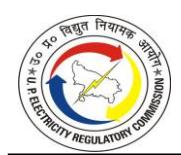

also increase the trust of the investors in the system, which is central to industrialization policy of any State.

3.16.18. The Commission has taken note of other submissions made by the Petitioners as well.

\*\*\*\*\*

#### 4.1. INTRODUCTION

4.1.1. The Petitioners, namely DVVNL, MVVNL, PVVNL, PuVVNL and KESCO, have sought the Truing Up of expenditure and revenue for FY 2023-24 based on actual expenditure and revenue as per Audited Accounts of FY 2023-24. The Commission has analyzed all elements of actual revenue and expenses for FY 2023-24 based on the prudence check of the data provided by the Licensees.

# 4.2. BILLING DETERMINANTS: CONSUMER NUMBERS, CONNECTED LOAD AND SALES

#### **Petitioners' Submission**

- 4.2.1. The Petitioners have submitted that though actual billing determinants for FY 2023-24 are in the range of figures approved by the Commission vide its Tariff Order dated May 24, 2023, yet sales, being a derivative of demand, which is uncontrollable in nature, leads to variations in actual billing determinants in comparison to those approved by the Commission in some categories.
- 4.2.2. The Category-wise approved vis-à-vis actual billing determinants of State Discoms under the aegis of UPPCL for FY 2023-24 are shown in the Table below:

TABLE 4-1: ACTUAL BILLING DETERMINANTS FOR FY 2023-24 AS SUBMITTED BY DVVNL

|                                                                  |                    | Approved in ted May 24th, | 2023          | Actual             |              |               |
|------------------------------------------------------------------|--------------------|---------------------------|---------------|--------------------|--------------|---------------|
| Category                                                         | Consumers (Nos) | Load (kW)                 | Sales (MU) | Consumers (Nos) | Load (kW)    | Sales (MU) |
| LMV-1: Domestic Light Fan & Power                             | 60,16,623          | 84,71,917                 | 9,557.51      | 54,03,370          | 74,89,660.09 | 8,243.24      |
| LMV-2: Non-Domestic Light Fan & Power                         | 3,73,166           | 10,25,701                 | 1,519.48      | 3,12,275           | 8,67,602.67  | 1,276.45      |
| LMV-3: Public Lamps                                              | 2,672              | 39,962                    | 117.18        | 20,981             | 63,249.28    | 260.76        |
| LMV-4: Light, Fan & Power for Public/ Private Institutions | 47,562             | 1,81,215                  | 332.75        | 73,590             | 2,16,435.90  | 421.02        |
| LMV-5: Private Tube Well/ Pumping Sets                        | 3,12,595           | 25,21,837                 | 4,868.91      | 3,18,866           | 25,43,987.63 | 6,188.29      |
| LMV-6: Small & Medium Power up to 100 HP (75kW)               | 58,142             | 5,79,060                  | 801.94        | 43,902             | 4,69,368.59  | 572.58        |

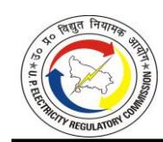

|                                                                                         | Approved in T.O. dated May 24th, 2023 |             |               | Actual             |                |               |
|-----------------------------------------------------------------------------------------|---------------------------------------|-------------|---------------|--------------------|----------------|---------------|
| Category                                                                                | Consumers (Nos)                    | Load (kW)   | Sales (MU) | Consumers (Nos) | Load (kW)      | Sales (MU) |
| LMV-7: Public Water Works & LMV-8: State Tube Wells & Pumps Canal up to 100 HP | 22,995                                | 3,54,644    | 1,275.28      | 22,355             | 3,50,448.13    | 988.65        |
| LMV-9: Temporary Supply                                                                 | 4,871                                 | 17,611      | 49.86         | 4,653              | 15,623.13      | 91.49         |
| LMV- 10: Departmental Employees                                                      | 19,855                                | 88,029      | 180.16        | -                  | -              | -             |
| LMV-11: Electrical Vehicles                                                             | 18                                    | 6,551       | 5.14          | 170                | 6,846.60       | 11.71         |
| HV-1: Non-Industrial Bulk Load                                                       | 892                                   | 2,24,176    | 524.48        | 861                | 2,05,227.61    | 398.99        |
| HV-2: Large & Heavy Power above 100 BHP (75 kW)                                         | 3,675                                 | 11,55,806   | 3,375.50      | 3,657              | 12,46,071.20   | 3,303.31      |
| HV-3: Railway Traction                                                                  | -                                     | -           | -             | 1                  | 5,400.00       | 2.52          |
| HV-4: Lift Irrigation & P. Canal above 100 BHP (75kW)                             | 46                                    | 47,276      | 109.19        | 43                 | 44,895.03      | 105.93        |
| Bulk Supply Consumer*                                                                   | -                                     | -           | -             | 1                  | 12,79,888.53   | 2,301.07      |
| Extra State Consumer                                                                    | -                                     | _           | -             | -                  | -              | -             |
| Total                                                                                   | 68,63,131                             | 1,47,13,994 | 22,717.91     | 62,04,725          | 1,48,04,704.39 | 24,166.02     |

\* BILLING DETERMINANTS OF AGRA DF SHOWN AS BULK SUPPLY CONSUMER.

TABLE 4-2: ACTUAL BILLING DETERMINANTS FOR FY 2023-24 AS SUBMITTED BY MVVNL

|                                                                                         | Approved in T.O. dated May 24th, 2023 |             |               | Actual             |                |               |
|-----------------------------------------------------------------------------------------|---------------------------------------|-------------|---------------|--------------------|----------------|---------------|
| Category                                                                                | Consume rs (Nos)                   | Load (kW)   | Sales (MU) | Consumers (Nos) | Load (kW)      | Sales (MU) |
| LMV-1: Domestic Light Fan & Power                                                    | 89,80,584                             | 1,10,22,307 | 13,296.71     | 86,92,591          | 1,14,33,008.50 | 13,127.24     |
| LMV-2: Non-Domestic Light Fan & Power                                                   | 4,61,316                              | 13,87,933   | 2,038.47      | 5,33,773           | 15,03,072.22   | 2,396.63      |
| LMV-3: Public Lamps                                                                     | 974                                   | 86,397      | 337.01        | 10,978             | 68,878.79      | 501.99        |
| LMV-4: Light, Fan & Power for Public/ Private Institutions                        | 38,681                                | 1,83,103    | 330.47        | 1,00,154           | 2,78,296.22    | 554.59        |
| LMV-5: Private Tube Well/ Pumping Sets                                               | 2,77,876                              | 16,66,927   | 3,048.57      | 2,92,426           | 13,87,111.68   | 2,582.57      |
| LMV-6: Small & Medium Power up to 100 HP (75kW)                                      | 35,324                                | 3,84,499    | 566.09        | 24,495             | 3,13,009.35    | 424.40        |
| LMV-7: Public Water Works & LMV-8: State Tube Wells & Pumps Canal up to 100 HP | 15,840                                | 2,76,654    | 1,397.02      | 15,846             | 2,41,401.63    | 760.13        |

|                                                             | T.O. da             | Approved in ated May 24th | , 2023        | Actual             |                |               |  |
|-------------------------------------------------------------|---------------------|---------------------------|---------------|--------------------|----------------|---------------|--|
| Category                                                    | Consume rs (Nos) | Load (kW)                 | Sales (MU) | Consumers (Nos) | Load (kW)      | Sales (MU) |  |
| LMV-9: Temporary Supply                                     | 9,206               | 25,190                    | 33.93         | 13,363             | 33,646.15      | 50.70         |  |
| LMV- 10: Departmental Employees                          | 25,342              | 83,194                    | 164.77        | -                  | -              | -             |  |
| LMV-11: Electrical Vehicles                                 | 34                  | 7,162                     | 6.23          | 327                | 11,103.00      | 15.47         |  |
| HV-1: Non-Industrial Bulk Load                           | 1,551               | 5,25,865                  | 1,005.96      | 1,836              | 5,62,139.64    | 1,157.65      |  |
| HV-2: Large & Heavy Power above 100 BHP (75 kW)             | 2,556               | 9,32,550                  | 1,969.32      | 2,801              | 9,76,942.51    | 2,431.07      |  |
| HV-3: Railway Traction                                      | 2                   | 9,334                     | 38.06         | 2                  | 12,000.00      | 16.82         |  |
| HV-4: Lift Irrigation & P. Canal above 100 BHP (75kW) | 35                  | 30,735                    | 81.03         | 17                 | 23,663.83      | 45.25         |  |
| Bulk Supply Consumer                                        | -                   | -                         | -             |                    | -              | -             |  |
| Extra State Consumer                                        | 1                   | 5,000                     | 19.85         | 1                  | 5,000.00       | 13.00         |  |
| Total                                                       | 98,49,322           | 1,66,26,850               | 24,333.50     | 96,88,610          | 1,68,49,273.52 | 24,077.49     |  |

TABLE 4-3: ACTUAL BILLING DETERMINANTS FOR FY 2023-24 AS SUBMITTED BY PVVNL

|                                                                                         |                    | Approved in ted May 24th | , 2023        |                    | Actual         |               |
|-----------------------------------------------------------------------------------------|--------------------|--------------------------|---------------|--------------------|----------------|---------------|
| Category                                                                                | Consumers (Nos) | Load (kW)                | Sales (MU) | Consumers (Nos) | Load (kW)      | Sales (MU) |
| LMV-1: Domestic Light Fan & Power                                                    | 65,74,811          | 1,38,41,439              | 13,922.46     | 63,04,268          | 1,37,32,268.54 | 13,495.01     |
| LMV-2: Non-Domestic Light Fan & Power                                                | 5,57,526           | 15,81,526                | 2,180.45      | 5,81,869           | 17,45,676.64   | 2,205.89      |
| LMV-3: Public Lamps                                                                     | 2,649              | 63,797                   | 189.63        | 6,641              | 54,419.99      | 365.48        |
| LMV-4: Light, Fan & Power for Public/ Private Institutions                        | 29,091             | 2,14,916                 | 233.03        | 47,294             | 1,97,764.77    | 245.19        |
| LMV-5: Private Tube Well/ Pumping Sets                                               | 4,86,944           | 30,31,936                | 7,849.21      | 5,05,168           | 32,13,055.68   | 6,923.32      |
| LMV-6: Small & Medium Power up to 100 HP (75kW)                                   | 72,966             | 10,07,130                | 1466.89       | 72,326             | 9,95,689.13    | 1,411.45      |
| LMV-7: Public Water Works & LMV-8: State Tube Wells & Pumps Canal up to 100 HP | 11,952             | 2,71,432                 | 918.70        | 10,772             | 2,59,372.52    | 533.65        |
| LMV-9: Temporary Supply                                                                 | 7,001              | 70,255                   | 148.15        | 8,038              | 74,190.16      | 202.11        |
| LMV- 10: Departmental Employees                                                      | 22,516             | 1,32,375                 | 133.68        | -                  | -              | -             |

|                                                             |                    | Approved in ted May 24th, | , 2023        | Actual             |                |               |  |
|-------------------------------------------------------------|--------------------|---------------------------|---------------|--------------------|----------------|---------------|--|
| Category                                                    | Consumers (Nos) | Load (kW)                 | Sales (MU) | Consumers (Nos) | Load (kW)      | Sales (MU) |  |
| LMV-11: Electrical Vehicles                              | 67                 | 817                       | 1.20          | 930                | 14,538.40      | 23.12         |  |
| HV-1: Non-Industrial Bulk Load                           | 2,674              | 11,45,377                 | 1965.15       | 2,805              | 11,39,798.21   | 2,034.72      |  |
| HV-2: Large & Heavy Power above 100 BHP (75 kW)       | 6,638              | 23,19,746                 | 6,578.78      | 6,931              | 25,43,200.72   | 6,583.77      |  |
| HV-3: Railway Traction                                      | 4                  | 44,009                    | 83.43         | 6                  | 42,300.00      | 107.88        |  |
| HV-4: Lift Irrigation & P. Canal above 100 BHP (75kW) | 2                  | 286                       | 1.32          | 4                  | 1,098.00       | 1.32          |  |
| Bulk Supply Consumer                                        | -                  | -                         | -             | -                  | -              | -             |  |
| Extra State Consumer                                        | -                  | -                         | -             | -                  | -              | -             |  |
| Total                                                       | 77,74,840          | 2,37,25,041               | 35,672.08     | 75,47,052          | 2,40,13,372.76 | 34,132.91     |  |

TABLE 4-4: ACTUAL BILLING DETERMINANTS FOR FY 2023-24 AS SUBMITTED BY PUVVNL

|                                                                                         | T.O. da            | Approved in ated May 24th, | 2023       |                     | Actual         |               |
|-----------------------------------------------------------------------------------------|--------------------|----------------------------|------------|---------------------|----------------|---------------|
| Category                                                                                | Consumers (Nos) | Load (kW)                  | Sales (MU) | Consume rs (Nos) | Load (kW)      | Sales (MU) |
| LMV-1: Domestic Light Fan & Power                                                    | 95,18,809          | 1,20,73,667                | 15,882.49  | 92,59,462           | 1,17,94,888.79 | 15,182.83     |
| LMV-2: Non-Domestic Light Fan & Power                                                | 5,62,778           | 14,87,594                  | 2,458.73   | 6,18,107            | 16,48,595.79   | 2,893.57      |
| LMV-3: Public Lamps                                                                     | 1,567              | 48,397                     | 146.22     | 13,910              | 61,191.99      | 366.65        |
| LMV-4: Light, Fan & Power for Public/ Private Institutions                              | 45,934             | 1,74,060                   | 379.26     | 97,620              | 2,63,940.32    | 518.48        |
| LMV-5: Private Tube Well/ Pumping Sets                                               | 3,55,415           | 15,88,491                  | 3,516.10   | 3,74,821            | 13,20,839.35   | 3,021.33      |
| LMV-6: Small & Medium Power up to 100 HP (75kW)                                   | 40,900             | 4,14,721                   | 669.89     | 34,379              | 3,33,837.49    | 625.28        |
| LMV-7: Public Water Works & LMV-8: State Tube Wells & Pumps Canal up to 100 HP | 17,669             | 3,78,193                   | 1,780.18   | 17,812              | 3,37,710.39    | 1,459.72      |
| LMV-9: Temporary Supply                                                                 | 3,191              | 6,988                      | 15.52      | 7,500               | 15,667.16      | 51.05         |
| LMV- 10: Departmental Employees                                                      | 27,883             | 92,584                     | 123.67     | -                   | -              | -             |
| LMV-11: Electrical Vehicles                                                          | 11                 | 1,863                      | 7.02       | 261                 | 8,336.20       | 25.40         |

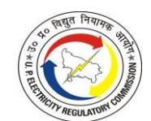

|                                                             | T.O. da            | Approved in ated May 24th, | 2023       | Actual              |                |               |  |
|-------------------------------------------------------------|--------------------|----------------------------|------------|---------------------|----------------|---------------|--|
| Category                                                    | Consumers (Nos) | Load (kW)                  | Sales (MU) | Consume rs (Nos) | Load (kW)      | Sales (MU) |  |
| HV-1: Non-Industrial Bulk Load                           | 1,089              | 2,88,845                   | 641.41     | 1,341               | 3,29,379.65    | 643.34        |  |
| HV-2: Large & Heavy Power above 100 BHP (75 kW)       | 1,730              | 6,95,279                   | 1,612.44   | 1,956               | 7,52,811.85    | 1,785.20      |  |
| HV-3: Railway Traction                                      | -                  | -                          | -          | -                   | -              | -             |  |
| HV-4: Lift Irrigation & P. Canal above 100 BHP (75kW) | 56                 | 1,33,652                   | 530.71     | 70                  | 1,40,896.21    | 574.22        |  |
| Bulk Supply Consumer                                        | ı                  | ı                          | -          | -                   | ı              | -             |  |
| Extra State Consumer                                        | 1                  | 699                        | 4.02       | 2                   | 80,200.00      | 76.46         |  |
| Total                                                       | 1,05,77,033        | 1,73,85,035                | 27,767.68  | 1,04,27,2 41     | 1,70,88,295.19 | 27,223.53     |  |

TABLE 4-5: ACTUAL BILLING DETERMINANTS FOR FY 2023-24 AS SUBMITTED BY KESCO

|                                                                                      |                    | Approved in ed May 24th | , 2023        |                    | Actual       |               |
|--------------------------------------------------------------------------------------|--------------------|-------------------------|---------------|--------------------|--------------|---------------|
| Category                                                                             | Consumers (Nos) | Load (kW)            | Sales (MU) | Consumers (Nos) | Load (kW)    | Sales (MU) |
| LMV-1: Domestic Light Fan & Power                                                    | 6,24,794           | 15,08,808               | 1,898.79      | 6,04,686           | 15,30,015.28 | 1,799.57      |
| LMV-2: Non-Domestic Light Fan & Power                                                | 92,091             | 2,64,428                | 413.19        | 92,984             | 2,74,939.64  | 352.38        |
| LMV-3: Public Lamps                                                                  | 232                | 10,536                  | 35.35         | 490                | 25,134.02    | 52.95         |
| LMV-4: Light, Fan & Power for Public/ Private Institutions                     | 1,644              | 27,641                  | 77.89         | 1,900              | 28,369.66    | 67.50         |
| LMV-5: Private Tube Well/ Pumping Sets                                            | 16                 | 198                     | 0.10          | 17                 | 103.25       | 0.07          |
| LMV-6: Small & Medium Power up to 100 HP (75kW)                                   | 16,040             | 2,06,437                | 388.33        | 15,397             | 2,00,192.02  | 334.00        |
| LMV-7: Public Water Works & LMV-8: State Tube Wells & Pumps Canal up to 100 HP | 1,249              | 52,706                  | 122.38        | 1,300              | 54,970.42    | 102.00        |
| LMV-9: Temporary Supply                                                              | 630                | 3,420                   | 9.72          | 5,428              | 25,609.58    | 29.77         |
| LMV- 10: Departmental Employees                                                   | 5,299              | 21,139                  | 42.54         | 1                  | 1            | -             |
| LMV-11: Electrical Vehicles                                                          | -                  | -                       | -             | 31                 | 1,029.34     | 0.84          |
| HV-1: Non-Industrial Bulk Load                                                    | 305                | 84,872                  | 245.27        | 339                | 97,693.60    | 235.47        |
| HV-2: Large & Heavy Power above 100 BHP (75 kW)                                      | 651                | 2,22,742                | 937.76        | 659                | 2,17,925.94  | 891.94        |

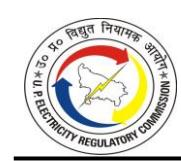

|                                                          |                    | Approved in ed May 24th | , 2023        | Actual             |              |               |  |
|----------------------------------------------------------|--------------------|-------------------------|---------------|--------------------|--------------|---------------|--|
| Category                                                 | Consumers (Nos) | Load (kW)            | Sales (MU) | Consumers (Nos) | Load (kW)    | Sales (MU) |  |
| HV-3: Railway Traction                                   | 1                  | 5,400                   | 6.07          | 1                  | 5,400.00     | 11.04         |  |
| HV-4: Lift Irrigation & P. Canal above 100 BHP (75kW) | -                  | -                       | -             | -                  | -            | -             |  |
| Bulk Supply Consumer                                     | -                  | -                       | -             | -                  | -            | _             |  |
| Extra State Consumer                                     | -                  | -                       | -             | -                  | -            | -             |  |
| Total                                                    | 7,42,951           | 24,08,326               | 4,177.39      | 7,23,232           | 24,61,382.75 | 3,877.51      |  |

4.2.3. The Petitioners have further submitted that, as per the Commission's direction in the Tariff Order dated May 24, 2023, sales under unmetered categories have been booked according to the norms approved by the Commission in its order dated 09.12.2016.

#### Commission's Analysis:

4.2.4. The Commission observes that DVVNL has shown the billing determinants of Agra Franchisee under the 'Bulk Supply' category. In this regard, the Commission, vide Letter Ref. UPERC/Secy/D(T)/2025-190, had directed DVVNL to submit Category-wise billing determinants for FY 2023-24, FY 2024-25 and FY 2025-26 of Distribution Franchisee M/s. Torrent Power Limited (Agra DF). In reply to the Commission's directions, DVVNL submitted category-wise billing determinants for FY 2023-24, FY 2024-25 and FY 2025-26 of Distribution Franchisee M/s. Torrent Power Limited (Agra DF), which is shown in the table below:

TABLE 4-6: BILLING DETERMINANTS OF AGRA - DISTRIBUTION FRANCHISEE FOR FY 2023-24

| Category                                                                        | Consumers (Nos) | Load (kW) | Sales (MU) |
|---------------------------------------------------------------------------------|--------------------|--------------|---------------|
| LMV-1: Domestic Light, Fan & Power                                              | 4,29,184           | 8,09,003.36  | 1,190.99      |
| LMV-2: Non-Domestic Light, Fan & Power                                          | 64,909             | 1,82,085.73  | 256.46        |
| LMV-3: Public Lamps                                                             | 90                 | 7,228.00     | 28.66         |
| LMV-4: Light, fan & Power for Institutions                                      | 2,039              | 16,173.26    | 30.13         |
| LMV-5: Private Tube Wells / Pumping Sets                                        | 451                | 3,390.23     | 6.23          |
| LMV-6: Small and Medium Power up to 100 HP (75 kW)                              | 11,244             | 1,00,494.03  | 139.65        |
| LMV-7 & LMV-8: Public Water Works & State Tube Wells & Pump Canals up to 100 HP | 153                | 12,026.95    | 25.67         |
| LMV-9: Temporary Supply                                                         | 1,308              | 7,714.10     | 13.60         |

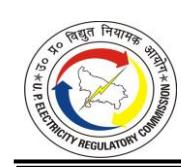

| Category                                                | Consumers (Nos) | Load (kW) | Sales (MU) |
|---------------------------------------------------------|--------------------|--------------|---------------|
| LMV-10: Departmental Employees                          | -                  | -            | -             |
| LMV-11: Electrical Vehicles                             | 105                | 6,007.00     | 8.17          |
| HV-1: Non-Industrial Bulk Loads                         | 251                | 60,340.17    | 153.60        |
| HV-2: Large and Heavy Power above 100 BHP (75 kW)       | 282                | 75,425.70    | 224.11        |
| HV-3: Railway Traction                                  | -                  | -            | -             |
| HV-4: Lift Irrigation & P. Canals above 100 BHP (75 kW) | -                  | -            | -             |
| Extra State Consumer                                    | -                  |              | -             |
| Total                                                   | 5,10,016           | 12,79,888.53 | 2,077.28      |

4.2.5. Further, as regards Petitioners' Submission on the Billing Determinants of its Agra DF, it is observed that Sales (MUs) are not matching with the billing determinants of "bulk consumer category" as submitted by DVVNL. The difference in figures for Sales (MUs) is shown in the table below:

**TABLE 4-7: SALES COMPARISON OF AGRA DF VIS-À-VIS AS BULK SUPPLY CONSUMER SUBMITTED BY DVVNL FOR FY 2023-24**

| Category   | As Bulk Supply Consumer | As per DVVNL letter dated June 26, 2025 | Variation |
|------------|----------------------------|--------------------------------------------|-----------|
| Sales (MU) | 2,301.07                   | 2,077.28                                   | 223.79    |

- 4.2.6. In view of the above table, the Commission has decided not to consider the billing determinants of the Distribution Franchisee, M/s Torrent Power Limited (Agra DF), for FY 2023-24. Instead, the Commission has considered the billing determinants of M/S Torrent Power Limited (Agra DF) as those of a "Bulk Supply Consumer", in accordance with the DVVNL's last submission, dated May 17, 2025.
- 4.2.7. Further, the Commission strictly directs DVVNL to submit billing determinants of the Agra Franchisee, along with revenue details for all the Tariff filings henceforth.
- 4.2.8. The Commission observes that the billing determinants submitted by the Petitioners had few linkage errors, which have been rectified while approving the billing determinants for FY 2023-24.
- 4.2.9. The Commission observes that the Petitioners have reported sales of unmetered category consumers under LMV-1, LMV-5, and LMV-7. In this regard, the Commission has undertaken an assessment to verify whether the sales to these categories have

been billed in accordance with the norms prescribed by the Commission. The detailed analysis is presented in the tables below:

**TABLE 4-8: SALES FOR LMV-1 RURAL UNMETERED CATEGORY AS PER NORMS**

| Particulars                                      | Unit         | DVVNL | MVVNL | PVVNL | PuVVNL | KESCO |
|--------------------------------------------------|--------------|-------|-------|-------|--------|-------|
| Load (A)                                         | kW           | 0     | 669   | 58    | 2,279  | 0     |
| Norms (B) (As per Tariff Order dated 09.12.2016) | kWh/Month/kW | 144   |       |       |        |       |
| Sales as per Norms (C) = (A) * (B) *12/10^6      | MU           | 0     | 1.16  | 0.10  | 3.94   | 0     |
| Sales Booked (D)                                 | MU           | 0     | 7.30  | 1.15  | 3.94   | 0     |
| Excess Sales Booked (E)=D-C                      | MU           | 0     | 6.14  | 1.05  | 0.00   | 0     |

*\* No unmetered sales (MU) billed by DVVNL and KESCO in this category*

**TABLE 4-9: SALES FOR UNMETERED CATEGORY OF LMV-5 AS PER NORMS**

| Particulars                                         | Unit             | DVVNL       | MVVNL    | PVVNL        | PuVVNL      |  |  |
|-----------------------------------------------------|------------------|-------------|----------|--------------|-------------|--|--|
| Load (A)                                            | kW               | 4,42,111.30 | 6,342.29 | 20,93,241.87 | 2,65,228.57 |  |  |
| Norms (B) (As per Tariff Order dated 03.09.2019) | kWh/Mon th/kW | 140         |          |              |             |  |  |
| Sales as per Norms (C) = (A) * (B) *12/10^6      | MU               | 742.75      | 10.66    | 3,516.65     | 445.58      |  |  |
| Sales Booked (D)                                    | MU               | 742.63      | 69.68    | 4,989.20     | 343.10      |  |  |
| Excess Sales Booked (E)=D-C                         | MU               | -           | 59.02    | 1,472.55     | -           |  |  |

**TABLE 4-10: SALES FOR UNMETERED CATEGORY FOR LMV-7 AS PER NORMS**

| Particulars                                      | Unit         | DVVNL    | PuVVNL |
|--------------------------------------------------|--------------|----------|--------|
| Load (A)                                         | kW           | 99.49    | 70.31  |
| Norms (B) (As per Tariff Order dated 09.12.2016) | kWh/Month/kW | 7,124.71 |        |
| Sales as per Norms (C) = (A) * (B) *12/10^6      | MU           | 8.51     | 6.01   |
| Sales Booked                                     | MU           | 0.65     | 0.51   |
| Excess Sales Booked (E)                          | MU           | -        | -      |

*\*The LMV-8 category was merged with the LMV-7 category by the Commission vide Tariff Order dated July 20, 2022.*

- 4.2.10. The Commission directs the Petitioners to complete the metering of all unmetered consumers under their license area on a priority basis. Until the complete metering is achieved, the energy accounting of unmetered consumers must be carried out strictly in accordance with the consumption norms prescribed by the Commission.
- 4.2.11. The comparison of the billing determinants as approved by the Commission for FY 2023-24 is shown in the Tables below:

TABLE 4-11: APPROVED BILLING DETERMINANTS FOR DVVNL WITH AGRA (DF) AS BULK SUPPLY CONSUMER FOR FY 2023-24

|                                                                                         | Approved in T.O. dated May 24th, 2 |             | , 2023        | Ap                 | pproved in True-u | n True-up     |  |
|-----------------------------------------------------------------------------------------|------------------------------------|-------------|---------------|--------------------|-------------------|---------------|--|
| Category                                                                                | Consumers (Nos)                 | Load (kW)   | Sales (MU) | Consumers (Nos) | Load (kW)         | Sales (MU) |  |
| LMV-1: Domestic Light Fan & Power                                                    | 60,16,623                          | 84,71,917   | 9,557.51      | 54,03,370          | 74,89,660.09      | 8,243.24      |  |
| LMV-2: Non-Domestic Light Fan & Power                                                | 3,73,166                           | 10,25,701   | 1,519.48      | 3,12,275           | 8,67,602.67       | 1,276.45      |  |
| LMV-3: Public Lamps                                                                     | 2,672                              | 39,962      | 117.18        | 20,981             | 63,249.28         | 260.76        |  |
| LMV-4: Light, Fan & Power for Public/ Private Institutions                        | 47,562                             | 1,81,215    | 332.75        | 73,590             | 2,16,435.90       | 421.02        |  |
| LMV-5: Private Tube Well/ Pumping Sets                                               | 3,12,595                           | 25,21,837   | 4,868.91      | 3,18,866           | 25,43,987.63      | 6,188.29      |  |
| LMV-6: Small & Medium Power up to 100 HP (75kW)                                   | 58,142                             | 5,79,060    | 801.94        | 43,902             | 4,69,368.59       | 572.58        |  |
| LMV-7: Public Water Works & LMV-8: State Tube Wells & Pumps Canal up to 100 HP | 22,995                             | 3,54,644    | 1,275.28      | 22,355             | 3,50,448.13       | 988.65        |  |
| LMV-9: Temporary Supply                                                                 | 4,871                              | 17,611      | 49.86         | 4,653              | 15,623.13         | 91.49         |  |
| LMV- 10: Departmental Employees                                                      | 19,855                             | 88,029      | 180.16        | -                  | -                 | -             |  |
| LMV-11: Electrical Vehicles                                                          | 18                                 | 6,551       | 5.14          | 170                | 6,846.60          | 11.71         |  |
| HV-1: Non-Industrial Bulk Load                                                       | 892                                | 2,24,176    | 524.48        | 861                | 2,05,227.61       | 398.99        |  |
| HV-2: Large & Heavy Power above 100 BHP (75 kW)                                   | 3,675                              | 11,55,806   | 3,375.50      | 3,657              | 12,46,071.20      | 3,303.31      |  |
| HV-3: Railway Traction                                                                  | -                                  | -           | -             | 1                  | 5,400.00          | 2.52          |  |
| HV-4: Lift Irrigation & P. Canal above 100 BHP (75kW)                             | 46                                 | 47,276      | 109.19        | 43                 | 44,895.03         | 105.93        |  |
| Bulk Supply Consumer                                                                    | -                                  | -           | -             | 1                  | 12,79,888.53      | 2,301.07      |  |
| Extra State Consumer                                                                    | -                                  | -           |               | -                  | -                 | -             |  |
| Total                                                                                   | 68,63,131                          | 1,47,13,994 | 22,717.91     | 62,04,725          | 1,48,04,704.39    | 24,166.02     |  |

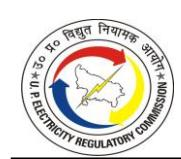

TABLE 4-12: APPROVED BILLING DETERMINANTS FOR MVVNL FOR FY 2023-24

|                                                                                         |                    | Approved in ted May 24th | , 2023        | Aŗ                 | pproved in True-u | р             |
|-----------------------------------------------------------------------------------------|--------------------|--------------------------|---------------|--------------------|-------------------|---------------|
| Category                                                                                | Consumers (Nos) | Load (kW)                | Sales (MU) | Consumers (Nos) | Load (kW)         | Sales (MU) |
| LMV-1: Domestic Light Fan & Power                                                    | 89,80,584          | 1,10,22,307              | 13,296.71     | 86,92,591          | 1,14,33,008.50    | 13,127.24     |
| LMV-2: Non-Domestic Light Fan & Power                                                | 4,61,316           | 13,87,933                | 2,038.47      | 5,33,773           | 15,03,072.22      | 2,396.63      |
| LMV-3: Public Lamps                                                                     | 974                | 86,397                   | 337.01        | 10,978             | 68,878.79         | 501.99        |
| LMV-4: Light, Fan & Power for Public/ Private Institutions                        | 38,681             | 1,83,103                 | 330.47        | 1,00,154           | 2,78,296.22       | 554.59        |
| LMV-5: Private Tube Well/ Pumping Sets                                               | 2,77,876           | 16,66,927                | 3,048.57      | 2,92,426           | 13,87,111.68      | 2,582.57      |
| LMV-6: Small & Medium Power up to 100 HP (75kW)                                   | 35,324             | 3,84,499                 | 566.09        | 24,495             | 3,13,009.35       | 424.40        |
| LMV-7: Public Water Works & LMV-8: State Tube Wells & Pumps Canal up to 100 HP | 15,840             | 2,76,654                 | 1,397.02      | 15,846             | 2,41,401.63       | 760.13        |
| LMV-9: Temporary Supply                                                                 | 9,206              | 25,190                   | 33.93         | 13,363             | 33,646.15         | 50.70         |
| LMV- 10: Departmental Employees                                                      | 25,342             | 83,194                   | 164.77        | -                  | -                 | -             |
| LMV-11: Electrical Vehicles                                                          | 34                 | 7,162                    | 6.23          | 327                | 11,103.00         | 15.47         |
| HV-1: Non-Industrial Bulk Load                                                       | 1,551              | 5,25,865                 | 1,005.96      | 1,836              | 5,62,139.64       | 1,157.65      |
| HV-2: Large & Heavy Power above 100 BHP (75 kW)                                   | 2,556              | 9,32,550                 | 1,969.32      | 2,801              | 9,76,942.51       | 2,431.07      |
| HV-3: Railway Traction                                                                  | 2                  | 9,334                    | 38.06         | 2                  | 12,000.00         | 16.82         |
| HV-4: Lift Irrigation & P. Canal above 100 BHP (75kW)                             | 35                 | 30,735                   | 81.03         | 17                 | 23,663.83         | 45.25         |
| Bulk Supply Consumer                                                                    |                    |                          |               |                    |                   |               |
| Extra State Consumer                                                                    | 1                  | 5,000                    | 19.85         | 1 5,000.00         |                   | 13.00         |
| Total                                                                                   | 98,49,322          | 1,66,26,850              | 24,333.50     | 96,88,610          | 1,68,49,273.52    | 24,077.49     |

TABLE 4-13: APPROVED BILLING DETERMINANTS FOR PVVNL FOR FY 2023-24

|                                                                                |                    | Approved in ted May 24th | , 2023        | Approved in True-up |                |               |  |  |
|--------------------------------------------------------------------------------|--------------------|--------------------------|---------------|---------------------|----------------|---------------|--|--|
| Category                                                                       | Consumers (Nos) | Load (kW)                | Sales (MU) | Consumers (Nos)  | Load (kW)      | Sales (MU) |  |  |
| LMV-1: Domestic Light Fan & Power                                           | 65,74,811          | 1,38,41,439              | 13,922.46     | 63,04,268           | 1,37,32,268.54 | 13,495.01     |  |  |
| LMV-2: Non-Domestic Light Fan & Power                                       | 5,57,526           | 15,81,526                | 2,180.45      | 5,81,869            | 17,45,676.64   | 2,205.89      |  |  |
| LMV-3: Public Lamps                                                            | 2,649              | 63,797                   | 189.63        | 6,641               | 54,419.99      | 365.48        |  |  |
| LMV-4: Light, Fan & Power for Public/ Private Institutions               | 29,091             | 2,14,916                 | 233.03        | 47,294              | 1,97,764.77    | 245.19        |  |  |
| LMV-5: Private Tube Well/ Pumping Sets                                      | 4,86,944           | 30,31,936                | 7,849.21      | 5,05,168            | 32,13,055.68   | 6,923.32      |  |  |
| LMV-6: Small & Medium Power up to 100 HP (75kW)                          | 72,966             | 10,07,130                | 1466.89       | 72,326              | 9,95,689.13    | 1,411.45      |  |  |
| LMV-7: Public Water Works & LMV-8: State Tube Wells & Pumps Canal up to 100 HP | 11,952             | 2,71,432                 | 918.70        | 10,772              | 2,59,372.52    | 533.65        |  |  |
| LMV-9: Temporary Supply                                                        | 7,001              | 70,255                   | 148.15        | 8,038               | 74,190.16      | 202.11        |  |  |
| LMV- 10: Departmental Employees                                             | 22,516             | 1,32,375                 | 133.68        | -                   | -              | -             |  |  |
| LMV-11: Electrical Vehicles                                                 | 67                 | 817                      | 1.20          | 930                 | 14,538.40      | 23.12         |  |  |
| HV-1: Non-Industrial Bulk Load                                              | 2674               | 11,45,377                | 1965.15       | 2,805               | 11,39,798.21   | 2,034.72      |  |  |
| HV-2: Large & Heavy Power above 100 BHP (75 kW)                          | 6,638              | 23,19,746                | 6,578.78      | 6,931               | 25,43,200.72   | 6,583.77      |  |  |
| HV-3: Railway Traction                                                         | 4                  | 44,009                   | 83.43         | 6                   | 42,300.00      | 107.88        |  |  |
| HV-4: Lift Irrigation & P. Canal above 100 BHP (75kW)                    | 2                  | 286                      | 1.32          | 4                   | 1,098.00       | 1.32          |  |  |
| Bulk Supply Consumer                                                           |                    |                          |               |                     |                |               |  |  |
| Extra State Consumer                                                           |                    |                          |               |                     |                |               |  |  |
| Total                                                                          | 77,74,840          | 2,37,25,041              | 35,672.08     | 75,47,052           | 2,40,13,372.76 | 34,132.91     |  |  |

TABLE 4-14: APPROVED BILLING DETERMINANTS FOR PUVVNL FOR FY 2023-24

|                                                                                         |                    | Approved in ted May 24th, | , 2023        | Approved in True-up |                |               |  |  |  |
|-----------------------------------------------------------------------------------------|--------------------|---------------------------|---------------|---------------------|----------------|---------------|--|--|--|
| Category                                                                                | Consumers (Nos) | Load (kW)                 | Sales (MU) | Consumers (Nos)  | Load (kW)      | Sales (MU) |  |  |  |
| LMV-1: Domestic Light Fan & Power                                                    | 95,18,809          | 1,20,73,667               | 15,882.49     | 92,59,462           | 1,17,94,888.79 | 15,182.83     |  |  |  |
| LMV-2: Non-Domestic Light Fan & Power                                                | 5,62,778           | 14,87,594                 | 2,458.73      | 6,18,107            | 16,48,595.79   | 2,893.57      |  |  |  |
| LMV-3: Public Lamps                                                                     | 1,567              | 48,397                    | 146.22        | 13,910              | 61,191.99      | 366.65        |  |  |  |
| LMV-4: Light, Fan & Power for Public/ Private Institutions                              | 45,934             | 1,74,060                  | 379.26        | 97,620              | 2,63,940.32    | 518.48        |  |  |  |
| LMV-5: Private Tube Well/ Pumping Sets                                               | 3,55,415           | 15,88,491                 | 3,516.10      | 3,74,821            | 13,20,839.35   | 3,021.33      |  |  |  |
| LMV-6: Small & Medium Power up to 100 HP (75kW)                                   | 40,900             | 4,14,721                  | 669.89        | 34,379              | 3,33,837.49    | 625.28        |  |  |  |
| LMV-7: Public Water Works & LMV-8: State Tube Wells & Pumps Canal up to 100 HP | 17,669             | 3,78,193                  | 1,780.18      | 17,812              | 3,37,710.39    | 1,459.72      |  |  |  |
| LMV-9: Temporary Supply                                                              | 3,191              | 6,988                     | 15.52         | 7,500               | 15,667.16      | 51.05         |  |  |  |
| LMV- 10: Departmental Employees                                                      | 27,883             | 92,584                    | 123.67        | -                   | -              | -             |  |  |  |
| LMV-11: Electrical Vehicles                                                          | 11                 | 1863                      | 7.02          | 261                 | 8,336.20       | 25.40         |  |  |  |
| HV-1: Non-Industrial Bulk Load                                                       | 1089               | 2,88,845                  | 641.41        | 1,341               | 3,29,379.65    | 643.34        |  |  |  |
| HV-2: Large & Heavy Power above 100 BHP (75 kW)                                   | 1,730              | 6,95,279                  | 1,612.44      | 1,956               | 7,52,811.85    | 1,785.20      |  |  |  |
| HV-3: Railway Traction                                                                  |                    |                           |               |                     | -              |               |  |  |  |
| HV-4: Lift Irrigation & P. Canal above 100 BHP (75kW)                             | 56                 | 1,33,652                  | 530.71        | 70                  | 1,40,896.21    | 574.22        |  |  |  |
| Bulk Supply Consumer                                                                    |                    |                           |               |                     | -              |               |  |  |  |
| Extra State Consumer                                                                    | 1                  | 699                       | 4.02          | 2                   | 80,200.00      | 76.46         |  |  |  |
| Total                                                                                   | 1,05,77,033        | 1,73,85,035               | 27,767.68     | 1,04,27,241         | 1,70,88,295.19 | 27,223.53     |  |  |  |

TABLE 4-15: APPROVED BILLING DETERMINANTS FOR KESCO FOR FY 2023-24

|                                                                                         |                    | Approved in ted May 24th, | 2023          | Ар                 | proved in True-u | р             |
|-----------------------------------------------------------------------------------------|--------------------|---------------------------|---------------|--------------------|------------------|---------------|
| Category                                                                                | Consumers (Nos) | Load (kW)                 | Sales (MU) | Consumers (Nos) | Load (kW)        | Sales (MU) |
| LMV-1: Domestic Light Fan & Power                                                    | 6,24,794           | 15,08,808                 | 1,898.79      | 6,04,686           | 15,30,015.28     | 1,799.57      |
| LMV-2: Non-Domestic Light Fan & Power                                                | 92,091             | 2,64,428                  | 413.19        | 92,984             | 2,74,939.64      | 352.38        |
| LMV-3: Public Lamps                                                                     | 232                | 10,536                    | 35.35         | 490                | 25,134.02        | 52.95         |
| LMV-4: Light, Fan & Power for Public/ Private Institutions                        | 1,644              | 27,641                    | 77.89         | 1,900              | 28,369.66        | 67.50         |
| LMV-5: Private Tube Well/ Pumping Sets                                               | 16                 | 198                       | 0.10          | 17                 | 103.25           | 0.07          |
| LMV-6: Small & Medium Power up to 100 HP (75kW)                                   | 16,040             | 2,06,437                  | 388.33        | 15,397             | 2,00,192.02      | 334.00        |
| LMV-7: Public Water Works & LMV-8: State Tube Wells & Pumps Canal up to 100 HP | 1,249              | 52,706                    | 122.38        | 1,300              | 54,970.42        | 102.00        |
| LMV-9: Temporary Supply                                                                 | 630                | 3,420                     | 9.72          | 5,428              | 25,609.58        | 29.77         |
| LMV- 10: Departmental Employees                                                      | 5,299              | 21,139                    | 42.54         | -                  | -                | -             |
| LMV-11: Electrical Vehicles                                                          |                    |                           |               | 31                 | 1,029.34         | 0.84          |
| HV-1: Non-Industrial Bulk Load                                                       | 305                | 84,872                    | 245.27        | 339                | 97,693.60        | 235.47        |
| HV-2: Large & Heavy Power above 100 BHP (75 kW)                                   | 651                | 2,22,742                  | 937.76        | 659                | 2,17,925.94      | 891.94        |
| HV-3: Railway Traction                                                                  | 1                  | 5,400                     | 6.07          | 1                  | 5,400.00         | 11.04         |
| HV-4: Lift Irrigation & P. Canal above 100 BHP (75kW)                             |                    |                           |               |                    |                  |               |
| Bulk Supply Consumer                                                                    |                    |                           |               |                    |                  |               |
| Extra State Consumer                                                                    |                    |                           |               |                    |                  |               |
| Total                                                                                   | 7,42,951           | 24,08,326                 | 4,177.39      | 7,23,232           | 24,61,382.75     | 3,877.51      |

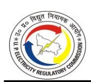

TABLE 4-16: APPROVED CONSOLIDATED BILLING DETERMINANTS FOR FY 2023-24

|                                                                                            | T.O. da                 | Approved in ated May 24th   | ı, 2023                     | A                       | pproved in True-u                  | ıp qı                       |
|--------------------------------------------------------------------------------------------|-------------------------|-----------------------------|-----------------------------|-------------------------|------------------------------------|-----------------------------|
| Category                                                                                   | Consumers (Nos)      | Load (kW)                   | Sales (MU)                  | Consumers (Nos)      | Load (kW)                          | Sales (MU)                  |
| LMV-1: Domestic Light Fan & Power                                                       | 3,17,15,621             | 4,69,18,138                 | 54,557.95                   | 3,02,64,377             | 4,59,79,841.20                     | 51,847.89                   |
| LMV-2: Non- Domestic Light Fan & Power                                               | 20,46,877               | 57,47,182                   | 8,610.33                    | 21,39,008               | 60,39,886.96                       | 9,124.91                    |
| LMV-3: Public Lamps                                                                        | 8,095                   | 2,49,089                    | 825.39                      | 53,000                  | 2,72,874.07                        | 1,547.83                    |
| LMV-4: Light, Fan & Power for Public/ Private Institutions                                 | 1,62,912                | 7,80,936                    | 1,353.40                    | 3,20,558                | 9,84,806.87                        | 1,806.78                    |
| LMV-5: Private Tube Well/ Pumping Sets                                                  | 14,32,846               | 88,09,389                   | 19,282.89                   | 14,91,298               | 84,65,097.59                       | 18,715.57                   |
| LMV-6: Small & Medium Power up to 100 HP (75kW)                                      | 2,23,372                | 25,91,848                   | 3,893.14                    | 1,90,499                | 23,12,096.58                       | 3,367.72                    |
| LMV-7: Public Water Works & LMV-8: State Tube Wells & Pumps Canal up to 100 HP | 69,722                  | 13,33,837                   | 5,494.08                    | 68,085                  | 12,43,903.09                       | 3,844.15                    |
| LMV-9: Temporary Supply                                                                 | 24,898                  | 1,23,464                    | 257.19                      | 38,982                  | 1,64,736.18                        | 425.13                      |
| LMV- 10: Departmental Employees                                                      | 1,00,895                | 4,17,320                    | 644.83                      | -                       | -                                  | -                           |
| LMV-11: Electrical Vehicles                                                             | 129                     | 16,395                      | 19.58                       | 1,719                   | 41,853.54                          | 76.54                       |
| HV-1: Non-Industrial Bulk Load                                                          | 6,511                   | 22,69,135                   | 4,382.27                    | 7,182                   | 23,34,238.71                       | 4,470.16                    |
| HV-2: Large & Heavy Power above 100 BHP (75 kW)                                      | 15,250                  | 53,26,124                   | 14,473.80                   | 16,004                  | 57,36,952.22                       | 14,995.29                   |
| HV-3: Railway Traction                                                                  | 7                       | 58,743                      | 127.56                      | 10                      | 65,100.00                          | 138.25                      |
| HV-4: Lift Irrigation & P. Canal above 100 BHP (75kW)                                | 139                     | 2,11,949                    | 722.26                      | 134                     | 2,10,553.07                        | 726.71                      |
| Bulk Supply Consumer                                                                    | -                       | -                           | -                           | 1                       | 12,79,888.53                       | 2,301.07                    |
| Extra State Consumer Total                                                                 | 2 <b>3,58,07,277</b> | 5,699 <b>7,48,59,246</b> | 23.87 <b>1,14,668.56</b> | 3 <b>3,45,90,860</b> | 85,200.00 <b>7,52,17,028.61</b> | 89.46 <b>1,13,477.46</b> |

#### **4.3. DISTRIBUTION LOSSES**

#### *Petitioners' Submission:*

- 4.3.1. The Petitioners have submitted that state-owned distribution licensees in Uttar Pradesh have formulated the Revamped Distribution Sector Scheme (RDSS) for the State. Based on the submissions made by the licensees, the Commission has approved the distribution loss trajectory under RDSS for FY 2023-24 onwards.
- 4.3.2. The Distribution Loss level approved by the Commission and achieved as submitted by the Petitioners is as below:

**TABLE 4-17: DISTRIBUTION LOSS TRAJECTORY FOR FY 2023-24 AS SUBMITTED BY THE PETITIONERS**

| DISCOM | Petitioner's submission in Petition dated November 29, 2024, as per the RDSS loss Trajectory | Actuals as per Balance Sheet |  |  |
|--------|----------------------------------------------------------------------------------------------------|---------------------------------|--|--|
| DVVNL  | 17.10%*                                                                                            | 18.44%                          |  |  |
| MVVNL  | 15.23%                                                                                             | 14.96%                          |  |  |
| PVVNL  | 13.44%*                                                                                            | 12.72%                          |  |  |
| PuVVNL | 15.56%*                                                                                            | 17.33%                          |  |  |
| KESCO  | 7.95%*                                                                                             | 9.60%                           |  |  |

*\* Petitioners have made a wrong submission in their Petitions dated November 29, 2024, now corrected.*

4.3.3. The actual voltage-wise distribution losses submitted by petitioners are given below:

**TABLE 4-18: ACTUAL DISCOM LOSSES IN LT & HT SYSTEM FOR FY 2023-2024**

| S.N. | Voltage Level                                           | DVVNL Actual (MUs) | MVVNL Actual (MUs) | PVVNL Actual (MUs) | PuVVNL Actual (MUs) | KESCO Actual (MUs) |
|------|---------------------------------------------------------|--------------------------|--------------------------|--------------------------|---------------------------|--------------------------|
| A    | System Losses At 220 kV                                 |                          |                          |                          |                           |                          |
| 1    | Energy received into the system                         | 372.88                   | 15.40                    | 152.49                   | 0.00                      | 10.96                    |
| 2    | Energy sold at this voltage level                       | 371.95                   | 15.40                    | 152.21                   | 0.00                      | 10.96                    |
| 3    | Energy transmitted to the next (lower) voltage level | 0.00                     | 0.00                     | 0.00                     | 0.00                      | 0.00                     |
| 4    | Energy Lost                                             | 0.93                     | 0.00                     | 0.28                     | 0.00                      | 0.00                     |
| 5    | Total Loss in the system (4/1) *100%                    | 0.25%                    | 0.00%                    | 0.00%                    | 0.00%                     | 0.00%                    |
| B    | System Losses At 132 kV                                 |                          |                          |                          |                           |                          |
| 1    | Energy received into the system                         | 143.67                   | 176.87                   | 728.11                   | 195.41                    | 522.48                   |
| 2    | Energy sold at this voltage level                       | 142.92                   | 176.87                   | 725.88                   | 195.41                    | 522.48                   |

| S.N. | Voltage Level                                           | DVVNL Actual (MUs) | MVVNL Actual (MUs) | PVVNL Actual (MUs) | PuVVNL Actual (MUs) | KESCO Actual (MUs) |
|------|---------------------------------------------------------|--------------------------|--------------------------|--------------------------|---------------------------|--------------------------|
| 3    | Energy transmitted to the next (lower) voltage level | 0.00                     | 0.00                     | 0.00                     | 0.00                      | 0.00                     |
| 4    | Energy Lost                                             | 0.75                     | 0.09                     | 2.23                     | 0.00                      | 0.00                     |
| 5    | Total Loss in the system (4/1) *100%                    | 0.52%                    | 0.05%                    | 0.31%                    | 0.00%                     | 0.00%                    |
| C    | System Losses At 33 kV                                  |                          |                          |                          |                           |                          |
| 1    | Energy received into the system                         | 29,111.89                | 28,120.84                | 38,227.24                | 32,734.19                 | 3,755.71                 |
| 2    | Energy sold at this voltage level                       | 1,247.00                 | 635.44                   | 3,207.82                 | 861.20                    | 185.95                   |
| 3    | Energy transmitted to the next (lower) voltage level | 27,857.21                | 26,462.38                | 34,989.58                | 30,688.18                 | 3,544.20                 |
| 4    | Energy Lost                                             | 7.68                     | 1,023.01                 | 30.00                    | 1,184.81                  | 25.56                    |
| 5    | Total Loss in the system (4/1) *100%                    | 0.61%                    | 3.64%                    | 0.08%                    | 3.62%                     | 0.68%                    |
| D    | System Losses at 11 kV                                  |                          |                          |                          |                           |                          |
| 1    | Energy received into the system                         | 27,857.21                | 26,462.38                | 35,548.00                | 30,688.18                 | 3,544.20                 |
| 2    | Energy sold at this voltage level                       | 22,404.15                | 20,584.10                | 30,047.00                | 1,892.43                  | 407.88                   |
|      | Energy transmitted to the next (lower) voltage level | 0.00                     | 3,136.54                 | 0.00                     | 26,954.46                 | 3,017.53                 |
| 3    | Energy Lost                                             | 5,453.06                 | 2,741.74                 | 4,944.00                 | 1,841.29                  | 118.78                   |
| 4    | Total Loss in the system (3/1) *100%                    | 19.58%                   | 10.36%                   | 13.91%                   | 6.00%                     | 3.35%                    |
| E    | System Losses at LT                                     |                          |                          |                          |                           |                          |
| 1    | Energy received into the system                         |                          | 3,136.54                 |                          | 26,954.46                 | 3,017.53                 |
| 2    | Energy sold at this voltage level                       |                          | 2,665.74                 |                          | 24,274.48                 | 2,750.23                 |
| 3    | Energy Lost                                             |                          | 470.79                   |                          | 2,679.98                  | 267.30                   |
| 4    | Total Loss in the system (3/1) *100%                    |                          | 15.01%                   |                          | 9.94%                     | 4.84%                    |
| F    | Overall, Losses                                         |                          |                          |                          |                           |                          |
| 1    | Energy In                                               | 29,628.43                | 28,313.10                | 39,107.84                | 32,929.61                 | 4,289.15                 |
| 2    | Energy Out                                              | 24,166.02                | 24,077.46                | 34,132.91                | 27,223.53                 | 3,877.51                 |
| 3    | Total T&D Loss (1-2)/1) *100%                           | 18.44%                   | 14.96%                   | 12.72%                   | 17.33%                    | 9.60%                    |

*\* DVVNL and PVVNL have not submitted Losses at the LT Level and have given combined Losses at 11 kV and the LT Level.*

#### *Commission's Analysis:*

4.3.4. The Commission has identified discrepancies in the submissions made by the Petitioners, namely DVVNL, PVVNL, and KESCO. Specifically, it was observed that DVVNL and PVVNL have not calculated losses at the LT level. Additionally, KESCO has reported LT level losses at 4.84%, which appears to be inaccurate. There has been repeated noncompliance by the Petitioners in submitting the voltage-wise losses. With the increasing penetration of smart meters in the system, it is expected that accurate data at a granular level will be available. The Petitioners are directed to

submit the voltage-wise losses in a proper manner along with the Tariff Petition.

4.3.5. The Commission, in its Tariff Order dated October 10, 2024, had decided to consider the Distribution Losses as per the RDSS Trajectory for FY 2023-24. Therefore, as per Regulation 10 of MYT Regulations, 2019, the Commission has approved the distribution losses as the lower of the actual distribution losses vis-à-vis the loss approved by the Commission in the Tariff Order dated October 10, 2024.

**TABLE 4-19: APPROVED DISCOM LOSSES FOR FY 2023-2024**

| Particular   | Approved in Tariff Order dated October 10, 2024 | Claimed in True Up | Approved in True Up |
|--------------|-------------------------------------------------------|-----------------------|------------------------|
| DVVNL        | 17.10%                                                | 18.44%                | 17.10%                 |
| MVVNL        | 15.23%                                                | 14.96%                | 14.96%                 |
| PVVNL        | 13.44%                                                | 12.72%                | 12.72%                 |
| PuVVNL       | 15.56%                                                | 17.33%                | 15.56%                 |
| KESCO        | 7.95%                                                 | 9.60%                 | 7.95%                  |
| Consolidated | 14.93%                                                | 15.48%                | 14.69%                 |

#### **4.4. ENERGY BALANCE**

#### *Petitioners' Submission:*

4.4.1. The Petitioners have requested the Commission to allow the actual losses for FY 2023- 24. The Energy Balance claimed by the Petitioners for FY 2023-24 is shown in the Table below:

**TABLE 4-20: ENERGY BALANCE FOR FY 2023-24 AS SUBMITTED BY PETITIONERS**

| Particulars                                                | Unit | Formula        | DVVNL     | MVVNL     | PVVNL     | PuVVNL    | KESCO    | Consolidated |
|------------------------------------------------------------|------|----------------|-----------|-----------|-----------|-----------|----------|--------------|
| Retail Sales                                               | MU   | A              | 24,166.02 | 24,077.49 | 34,132.91 | 27,223.53 | 3,877.51 | 1,13,477.46  |
| Distribution Losses                                        | %    | B              | 18.44%    | 14.96%    | 12.72%    | 17.33%    | 9.60%    | 15.48%       |
| Energy at Discom Periphery for Retail Sales          | MU   | C=A/ (1- B) | 29,628.44 | 28,313.14 | 39,107.84 | 32,929.61 | 4,289.15 | 1,34,268.18  |
| Intra-State Transmission Losses                         | %    | D              | 3.22%     | 3.22%     | 3.22%     | 3.22%     | 3.22%    | 3.22%        |
| Energy Available at State Periphery for Transmission | MU   | E=C/ (1- D) | 30,614.21 | 29,255.16 | 40,409.01 | 34,025.22 | 4,431.86 | 1,38,735.46  |
| Energy Purchase from Stations connected to              | MU   | F              | 20,098.30 | 19,206.07 | 26,528.60 | 22,337.63 | 2,909.53 | 91,080.13    |

| Particulars              | Unit | Formula   | DVVNL     | MVVNL     | PVVNL     | PuVVNL    | KESCO    | Consolidated |
|--------------------------|------|-----------|-----------|-----------|-----------|-----------|----------|--------------|
| Intra-State Transmission |      |           |           |           |           |           |          |              |
| network (UPPTCL)         |      |           |           |           |           |           |          |              |
| Energy Purchase from     |      |           |           |           |           |           |          |              |
| Stations connected to    |      |           |           |           |           |           |          |              |
| the Inter-State          | MU   | G=        | 10,515.91 | 10,049.09 | 13,880.41 | 11,687.59 | 1,522.33 | 47,655.33    |
| Transmission Network     |      | E-F       |           |           |           |           |          |              |
| (PGCIL)                  |      |           |           |           |           |           |          |              |
| Inter-State Transmission |      |           |           |           |           |           |          |              |
| Loss                     | %    | H=(G-I)/I | 6.29%     | 6.29%     | 6.29%     | 6.29%     | 6.29%    | 6.29%        |
| Net Energy Received      |      |           |           |           |           |           |          |              |
| from Stations            |      |           |           |           |           |           |          |              |
| connected to the Inter   | MU   | I         | 11,221.21 | 10,723.07 | 14,811.36 | 12,471.47 | 1,624.43 | 50,851.55    |
| State Transmission       |      |           |           |           |           |           |          |              |
| network at UPPTCL        |      |           |           |           |           |           |          |              |
| Periphery (Ex-Bus)       |      |           |           |           |           |           |          |              |
| Power Purchase           |      |           |           |           |           |           |          |              |
| Required & Billed        | MU   | J=F+I     | 31,319.51 | 29,929.14 | 41,339.96 | 34,809.10 | 4,533.96 | 1,41,931.68  |
| Energy (Ex-Bus)          |      |           |           |           |           |           |          |              |

## *Commission's Analysis:*

- 4.4.2. The Commission observes that the Petitioners have presented the energy balance based on actual distribution losses. The intra-state transmission losses have been accounted for in accordance with the UPPTCL Tariff Order dated May 24, 2023. However, the inter-state transmission losses have been claimed in a manner that does not align with the approved losses provided in Section 5.4.2 of the Tariff Order dated October 10, 2024.
- 4.4.3. Petitioners, in response to the Commission's query, submitted inter-state transmission losses of 6.29% for FY 2023-24, which is substantially higher than the losses approved by the Commission in the Tariff Order dated May 24, 2023. Further, Petitioners have been informed that the Inter-State Transmission losses have been computed based on all other components of the Energy Balance (Input energy, Retail Sales, Intra-State Transmission Losses) as per the methodology of the Commission in the previous Tariff Orders.
- 4.4.4. Based on the above, the Commission approves the energy balance for FY 2023-24, considering the retail sales and distribution loss trajectory approved in the above section, as shown in the Table below:

**TABLE 4-21: APPROVED ENERGY BALANCE FOR FY 2023-2024**

| Particulars                                                                                                                     | Unit | Formula        | DVVNL     | MVVNL     | PVVNL     | PuVVNL    | KESCO    | Consolidated |
|---------------------------------------------------------------------------------------------------------------------------------|------|----------------|-----------|-----------|-----------|-----------|----------|--------------|
| Retail Sales                                                                                                                    | MU   | A              | 24,166.02 | 24,077.49 | 34,132.91 | 27,223.53 | 3,877.51 | 1,13,477.46  |
| Distribution Losses                                                                                                             | %    | B              | 17.10%    | 14.96%    | 12.72%    | 15.56%    | 7.95%    | 14.69%       |
| Energy at Discom Periphery for Retail Sales                                                                               | MU   | C=A/ (1- B) | 29,150.81 | 28,313.14 | 39,107.84 | 32,240.08 | 4,212.39 | 1,33,024.27  |
| Intra-State Transmission Losses                                                                                              | %    | D              | 3.22%     | 3.22%     | 3.22%     | 3.22%     | 3.22%    | 3.22%        |
| Energy Available at State periphery for Transmission                                                                      | MU   | E=C/ (1- D) | 30,120.70 | 29,255.16 | 40,409.01 | 33,312.75 | 4,352.55 | 1,37,450.16  |
| Energy Purchase from Stations connected to Intra-State Transmission network (UPPTCL)                                   | MU   | F              | 19,332.98 | 19,262.16 | 27,306.55 | 21,779.00 | 3,102.03 | 90,782.72    |
| Energy Purchase from Stations connected to the Inter-State Transmission Network (PGCIL)                             | MU   | G= E-F      | 10,787.72 | 9,993.00  | 13,102.46 | 11,533.75 | 1,250.51 | 46,667.44    |
| Inter-State Transmission Loss                                                                                                | %    | H=(G-I)/I      | 6.29%     | 6.29%     | 6.29%     | 6.29%     | 6.29%    | 6.29%        |
| Net Energy Received from Stations connected to the Inter State Transmission network at UPPTCL Periphery (Ex-Bus) | MU   | I              | 11,511.25 | 10,663.23 | 13,981.23 | 12,307.32 | 1,334.38 | 49,797.41    |
| Power Purchase Required & Billed Energy (Ex-Bus)                                                                          | MU   | J=F+I          | 30,844.23 | 29,925.38 | 41,287.79 | 34,086.32 | 4,436.42 | 1,40,580.13  |

#### **4.5. POWER PURCHASE EXPENSES**

#### *Petitioners' Submission:*

4.5.1. The Petitioners have submitted that UPPCL is procuring power on behalf of State Discoms. The power purchased at the UPPCL level is then allocated to DISCOMS on the basis of the DBST methodology approved by the Commission. The Generating Stationwise break-up of power purchase quantum and cost as claimed by the Petitioners for FY 2023-24 is as follows:

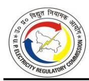

TABLE 4-22: GENERATING STATION WISE POWER PURCHASE COST FOR FY 2023-24 AS SUBMITTED BY THE PETITIONERS

|                            |                                                               |                                            |                              |                                        |                              | FY 202                       | 3-24                         |                              |             |                      |                              |
|----------------------------|---------------------------------------------------------------|--------------------------------------------|------------------------------|----------------------------------------|------------------------------|------------------------------|------------------------------|------------------------------|-------------|----------------------|------------------------------|
|                            |                                                               |                                            |                              | al Fixed                               |                              | al Energy/                   | Annual (                     | Other Cost                   | LPS         | Total Cost           |                              |
| S.No                       | Source of Power (Station-wise)                                | Units (MU)                                 | (Rs. / kWh)               | arges (Rs. Cr.)                     | (Rs. / kWh)               | (Rs. Cr.)                    | (Rs. /                       | (Rs. Cr.)                    | (Rs. Cr.)   | (Rs. /               | (Rs. Cr.)                    |
| Α                          | Long Term Sources                                             |                                            |                              |                                        | ,                            |                              | ,                            |                              |             |                      |                              |
| а                          | Power procured from own Generating Statio                     | ns (if any)                                |                              |                                        |                              |                              |                              |                              |             |                      |                              |
| b                          | From State Generating Stations Thermal                        | _                                          | 1                            |                                        | 1                            |                              | 1                            | 1                            |             |                      | ı                            |
| 1                          | ANPARA-A                                                      | 3,431.39                                   | 0.20                         | 69.80                                  | 2.33                         | 799.39                       | 0.53                         | 183.25                       | 0           | 3.07                 | 1,052.44                     |
| 2                          | ANPARA-B                                                      | 5,600.43                                   | 0.47                         | 262.95                                 | 2.01                         | 1123.85                      | 0.08                         | 42.12                        | 0           | 2.55                 | 1,428.92                     |
| 3                          | ANPARA-D                                                      | 6,848.83                                   | 1.59                         | 1,088.75                               | 1.99                         | 1363.10                      | 0.05                         | 33.64                        | 0           | 3.63                 | 2,485.49                     |
| 4                          | HARDUAGANI                                                    | 297.41                                     | 7.00                         | 208.10                                 | 5.09                         | 151.48                       | 3.39                         | 100.94                       | 0           | 15.48                | 460.53                       |
| 5                          | HARDUAGANI EXT.                                               | 2,207.48                                   | 1.97                         | 434.38                                 | 4.26                         | 940.80                       | 0.02                         | 4.58                         | 0           | 6.25                 | 1,379.75                     |
| 6                          | HARDUAGANJ EXT. STAGE-II                                      | 3,356.50                                   | 2.65                         | 890.03                                 | 3.76                         | 1263.66                      | 0.00                         | 0.46                         | 0           | 6.42                 | 2,154.16                     |
| 7                          | OBRA-A                                                        | 4 200 00                                   | 2.25                         | 067.24                                 | 2.72                         | 0.00                         | 0.47                         | 36.49                        |             |                      | 36.49                        |
| 9                          | OBRA-B                                                        | 4,306.86                                   | 2.25                         | 967.21                                 | 2.72                         | 1171.78                      | 0.47                         | 204.01                       | 0           | 5.44                 | 2,343.00                     |
| 10                         | OBRA-C                                                        | -                                          | _                            |                                        | -                            | 0.00                         | -                            | 0.01 80.95                | 0           | _                    | 0.01                         |
| 11                         | PANKI                                                         | <del>-</del>                               | -                            |                                        |                              | 0.00                         | -                            | 4.75                         | 0           | -                    | 80.95                        |
| 12                         | PANKI EXTN. PARICHHA                                          | -                                          | _                            | 17.20                                  | -                            | 0.00                         | -                            | 45.46                        | 0           | _                    | 4.75 62.66                |
| 13                         |                                                               | _                                          |                              |                                        | 2 20                         | 695.18                       |                              |                              | 0           |                      |                              |
| 14                         | PARICHHA EXTN. PARICHHA EXTN. STAGE-II                        | 2,112.03 2,543.21                       | 1.35 1.44                 | 285.71 366.05                       | 3.29 3.30                 | 839.66                       | 0.12                         | 24.91 8.37                | 0           | 4.76 4.77         | 1,005.80 1,214.09         |
| 15                         | UPRVUNL CONSOLIDATED                                          | 2,343.21                                   | 1.44                         | 300.03                                 | 5.50                         | 0.00                         | 0.05                         | (7.53)                       | 0           | 4.//                 | (7.53)                       |
| 13                         | Sub-Total                                                     | 30,704.15                                  | 1.49                         | 4,590.19                               | 2.72                         | 8348.91                      | 0.25                         | 762.42                       | 0           | 4.46                 | 13,701.51                    |
|                            | Sub-Total                                                     | 30,704.13                                  | 1.45                         | 4,330.13                               | 2.72                         | 0340.31                      | 0.23                         | 702.42                       |             | 4.40                 | 13,701.31                    |
| С                          | From State Generating Stations Hydro                          |                                            |                              |                                        | _                            |                              | _                            |                              |             |                      |                              |
| 1                          | RIHAND                                                        | 261.18                                     | 0.96                         | 25.18                                  | 0.46                         | 12.04                        | 1.64                         | 42.89                        | 0           | 3.07                 | 80.11                        |
| 2                          | OBRA (H)                                                      | 141.81                                     | 0.71                         | 10.11                                  | 0.41                         | 5.86                         | 1.04                         |                              | 0           | 1.13                 | 15.96                        |
| 3                          | MATATILA                                                      | 63.60                                      | 0.38                         | 2.42                                   | 0.41                         | 2.60                         | (9.94)                       | (63.23)                      | 0           | 1.13                 | (58.21)                      |
| 4                          | KHARA                                                         | 228.18                                     | 0.55                         | 12.52                                  | 0.45                         | 10.19                        | - (3.31)                     | - (03.23)                    | 0           | 0.99                 | 22.70                        |
| 5                          | UGC                                                           | 30.09                                      | -                            | -                                      | 2.83                         | 8.51                         | _                            | _                            | 0           | 2.83                 | 8.51                         |
| 6                          | SHEETLA                                                       | 3.21                                       | -                            | _                                      | 1.54                         | 0.50                         | _                            | _                            | 0           | 1.54                 | 0.50                         |
| 7                          | BELKA                                                         | 3.40                                       | -                            | -                                      | 2.12                         | 0.72                         | -                            | -                            | 0           | 2.12                 | 0.72                         |
| 8                          | BABAIL                                                        | 3.70                                       | -                            | -                                      | 2.83                         | 1.05                         | -                            | -                            | 0           | 2.83                 | 1.05                         |
|                            | UPJVNL CONSOLIDATED                                           | -                                          | -                            | -                                      | -                            | 0.00                         | -                            | -                            | 0           | -                    | -                            |
|                            | Sub-Total                                                     | 735.17                                     | 0.68                         | 50.22                                  | 0.56                         | 41.46                        | (0.28)                       | (20.34)                      | 0           | 0.97                 | 71.34                        |
|                            |                                                               |                                            | -                            |                                        | -                            |                              | -                            |                              |             | -                    |                              |
| d                          | From Central Sector Generating Stations                       |                                            | -                            |                                        | -                            |                              | -                            |                              |             | -                    |                              |
| а                          | Thermal (NTPC)                                                |                                            | -                            |                                        | -                            |                              | -                            |                              |             | -                    |                              |
| 1                          | ANTA GPS                                                      | 3.11                                       | 151.63                       | 47.23                                  | 4.18                         | 1.30                         | (19.76)                      | (6.15)                       | 0           |                      | 42.38                        |
| 2                          | AURAIYA GPS                                                   | 185.09                                     | 6.80                         | 125.88                                 | 11.23                        | 207.89                       | 19.50                        | 360.95                       | 0           |                      | 694.72                       |
| 3                          | DADRI GPS                                                     | 272.68                                     | 3.65                         | 99.59                                  | 8.43                         | 229.94                       | 3.92                         | 106.87                       | 0           | 16.00                | 436.40                       |
| 4                          | FGUTPS-I                                                      | 861.42                                     | 1.89                         | 162.89                                 | 4.55                         | 392.20                       | 0.69                         | 59.41                        | 0           | 7.13                 | 614.50                       |
| 5                          | FGUTPS-II                                                     | 627.31                                     | 1.57                         | 98.41                                  | 3.69                         | 231.65                       | 0.04                         | 2.77                         | 0           | 5.31                 | 332.83                       |
| 6                          | FGUTPS-III                                                    | 261.63                                     | 2.00                         | 52.37                                  | 4.39                         | 114.74                       | 0.73                         | 19.08                        | 0           | 7.12                 | 186.19                       |
| 7                          | FGUTPS-IV                                                     | 859.73                                     | 2.95                         | 253.87                                 | 4.17                         | 358.79                       | 0.63                         | 54.50                        | 0           | 7.76                 | 667.16                       |
| 8                          | FSTPS                                                         | 134.30                                     | 1.51                         | 20.21                                  | 3.43                         | 46.13                        | 2.50                         | 33.51                        | 0           | 7.44                 | 99.85                        |
| 9                          | GODARWARA STPS-I                                              | 13.59                                      | 3.66                         | 4.97                                   | 3.54                         | 4.81                         | 0.30                         | 0.40                         | 0           | 7.49                 | 10.18                        |
| 10                         | JHANOR GPS                                                    | 0.00                                       |                              | 0.01                                   | 11.13                        | 0.00                         | 74.22                        | 0.00                         | 0           |                      | 0.01                         |
| 11                         | KAWAS GPS                                                     | 0.00                                       |                              | 0.01                                   | 3.00                         | 0.00                         |                              | 0.00                         | 0           | 0.77                 | 0.01                         |
| 12                         | KHARGONE STPS                                                 | 12.40                                      | 3.77                         | 4.67                                   | 3.89                         | 4.82                         | 2.04                         | 2.53                         | 0           | 9.69                 | 12.02                        |
| 4.0                        | I/I/EDC I                                                     |                                            | . 171                        | 54.52                                  | 3.05                         | 95.70                        | 0.12                         | 3.83                         | 0           | 4.91                 | 154.06                       |
| 13                         | KHTPS-I                                                       | 313.46                                     | 1.74                         |                                        |                              | 255.50                       | 0.10                         | 4-4-                         | _           | 4 00                 | F00 00                       |
| 14                         | KHTPS-II                                                      | 1,213.45                                   | 1.33                         | 161.97                                 | 2.93                         | 355.50                       | 0.12                         | 15.15                        | 0           | 4.39                 | 532.62                       |
| 14 15                   | KHTPS-II KORBA-I STPS                                      | 1,213.45 16.62                          | 1.33 0.73                 | 161.97 1.22                         | 2.93 1.43                 | 2.37                         | 0.29                         | 0.49                         | 0           | 2.46                 | 4.08                         |
| 14 15 16             | KHTPS-II KORBA-I STPS KORBA-III STPS                    | 1,213.45 16.62 8.12                  | 1.33 0.73 1.01         | 161.97 1.22 0.82                 | 2.93 1.43 1.40         | 2.37 1.14                 | 0.29 0.31                 | 0.49 0.25                 | 0           | 2.46 2.72         | 4.08 2.21                 |
| 14 15 16 17       | KHTPS-II KORBA-I STPS KORBA-III STPS LARA STPS-I              | 1,213.45 16.62 8.12 22.53         | 1.33 0.73 1.01 1.70 | 161.97 1.22 0.82 3.84         | 2.93 1.43 1.40 1.35 | 2.37 1.14 3.05         | 0.29 0.31 0.54         | 0.49 0.25 1.23         | 0 0 0 | 2.46 2.72 3.60 | 4.08 2.21 8.11         |
| 14 15 16 17 18 | KHTPS-II KORBA-I STPS KORBA-III STPS LARA STPS-I MAUDA-I STPS | 1,213.45 16.62 8.12 22.53 6.85 | 1.33 0.73 1.01         | 161.97 1.22 0.82 3.84 1.87 | 2.93 1.43 1.40         | 2.37 1.14 3.05 2.34 | 0.29 0.31 0.54 0.45 | 0.49 0.25 1.23 0.31 | 0 0 0 | 2.46 2.72         | 4.08 2.21 8.11 4.52 |
| 14 15 16 17       | KHTPS-II KORBA-I STPS KORBA-III STPS LARA STPS-I              | 1,213.45 16.62 8.12 22.53         | 1.33 0.73 1.01 1.70 | 161.97 1.22 0.82 3.84         | 2.93 1.43 1.40 1.35 | 2.37 1.14 3.05         | 0.29 0.31 0.54         | 0.49 0.25 1.23         | 0 0 0 | 2.46 2.72 3.60 | 4.08 2.21 8.11         |

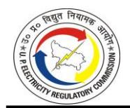

|               |                                            |                | FY 2023-24     |                    |                |                          |                |               |           |                |              |
|---------------|--------------------------------------------|----------------|----------------|--------------------|----------------|--------------------------|----------------|---------------|-----------|----------------|--------------|
| S.No          | Source of Power (Station-wise)             | Units (MU)     |                | ial Fixed arges |                | al Energy/ ole charge |                | Other Cost    | LPS       | To             | tal Cost     |
|               |                                            | Onits (WO)     | (Rs. / kWh) | (Rs. Cr.)          | (Rs. / kWh) | (Rs. Cr.)                | (Rs. / kWh) | (Rs. Cr.)     | (Rs. Cr.) | (Rs. / kWh) | (Rs. Cr.)    |
| 22            | NCTPS-II                                   | 349.91         | 2.52           | 88.12              | 4.69           | 163.98                   | 0.66           | 23.15         | 0         | 7.87           | 275.24       |
| 23            | RIHAND-I                                   | 2,296.40       | 0.82           | 189.27             | 1.58           | 363.50                   | (0.13)         | (29.31)       | 0         | 2.28           | 523.46       |
| 24            | RIHAND-II                                  | 1,967.83       | 0.83           | 163.96             | 1.57           | 309.66                   | 0.12           | 24.40         | 0         | 2.53           | 498.01       |
| 25            | RIHAND-III                                 | 2,333.43       | 1.42           | 331.25             | 1.55           | 362.48                   | 1.24           | 290.36        | 0         | 4.22           | 984.09       |
| 26            | SINGRAULI                                  | 5,291.55       | 0.72           | 379.70             | 1.54           | 813.03                   | 0.43           | 229.27        | 0         | 2.69           | 1,422.00     |
| 27            | SIPAT-I STPS                               | 27.74          | 1.31           | 3.64               | 1.44           | 3.98                     | 0.34           | 0.95          | 0         | 3.09           | 8.58         |
| 28            | SIPAT-II STPS                              | 10.85          | 0.92           | 1.00               | 1.48           | 1.60                     | 0.36           | 0.39          | 0         | 2.75           | 2.99         |
| 29            | SOLAPUR TPS                                | 18.74          | 2.69           | 5.04               | 4.53           | 8.49                     | 0.25           | 0.46          | 0         | 7.46           | 13.99        |
| 30            | TANDA -II-TPS                              | 5,314.82       | 1.84           | 976.91             | 3.61           | 1920.03                  | 0.12           | 61.21         | 0         | 5.57           | 2,958.15     |
| 31 32      | TANDA -TPS                                 | 1,472.52       | 2.49 0.94   | 366.51             | 5.09           | 749.79 2.02           | 0.21           | 31.60 0.20 | 0         | 7.80 2.70   | 1,147.89     |
| 33            | VINDHYANCHAL II STPS                       | 12.66          | 0.94           | 1.19 0.82       | 1.60           |                          |                | 0.20          |           | 2.70           | 3.42 2.68 |
| 34            | VINDHYANCHAL-II STPS VINDHYANCHAL-III STPS | 10.86 11.78 | 0.75           | 0.82               | 1.54 1.53   | 1.67 1.80             | 0.18 0.18   | 0.19          | 0         | 2.47           | 2.68         |
| 35            | VINDHYANCHAL-IV STPS                       | 14.72          | 1.67           | 2.45               | 1.51           | 2.22                     | 1.37           | 2.02          | 0         | 4.55           | 6.69         |
| 36            | VINDHYANCHAL-V STPS                        | 7.02           | 1.76           | 1.24               | 1.56           | 1.10                     | 1.16           | 0.82          | 0         | 4.49           | 3.15         |
| 37            | NTPC CONSOLIDATED                          | 7.02           | 1.70           | 1.24               | 1.50           | 0.00                     | 1.10           | 3.93          | 0         | 4.43           | 3.13         |
| 37            | Sub-total                                  | 25,514.11      | 1.57           | 4,010.85           | 2.84           | 7246.93                  | 0.52           | 1,333.40      | 0         | 4.93           | 12,591.18    |
|               | - 545 total                                | 25,517.11      | - 1.57         | 7,010.03           |                | , 240.33                 | - 5.52         | 1,555.70      |           | 7.55           | 12,331.10    |
| е             | NPCIL                                      |                | -              |                    | -              |                          | -              |               |           | _              |              |
| 1             | KAPS                                       | 15.10          | -              | -                  | 4.10           | 6.19                     | 2.15           | 3.24          | 0.000972  | 6.25           | 9.44         |
| 2             | NAPP                                       | 853.12         | -              | _                  | 2.99           | 255.27                   | 0.05           | 3.88          | 0         | 3.04           | 259.14       |
| 3             | TAPP-3 & 4                                 | 15.24          | -              | -                  | 3.45           | 5.25                     | 0.02           | 0.03          | 0.0158191 | 3.47           | 5.29         |
| 4             | RAPP-3 & 4                                 | 244.52         | -              | -                  | 3.34           | 81.67                    | 0.04           | 1.01          | 0         | 3.38           | 82.68        |
| 5             | RAPP-5 & 6                                 | 742.71         | -              | -                  | 3.92           | 290.98                   | (0.00)         | (0.25)        | 0         | 3.91           | 290.73       |
| 6             | NPCIL CONSOLIDATED                         | -              | -              | -                  | -              | 0.00                     | -              | -             | 0.000133  | _              | 0.00         |
|               | Sub-Total                                  | 1,870.69       | -              | -                  | 3.42           | 639.35                   | 0.04           | 7.91          | 0.0169241 | 3.46           | 647.29       |
|               |                                            |                |                |                    |                |                          |                |               |           |                |              |
| f             | Hydro (NHPC)                               |                |                |                    |                |                          |                |               |           |                |              |
| 1             | SALAL                                      | 228.61         | 1.06           | 24.32              | 0.76           | 17.45                    | 1.04           | 23.89         | 0         | 2.87           | 65.67        |
| 2             | TANAKPUR                                   | 80.09          | 3.80           | 30.41              | 2.58           | 20.64                    | 0.09           | 0.71          | 0         | 6.46           | 51.75        |
| 3             | CHAMERA-I                                  | 424.59         | 1.03           | 43.90              | 1.04           | 44.12                    | 0.09           | 3.83          | 0         | 2.16           | 91.86        |
| 4             | URI                                        | 464.86         | 1.18           | 54.80              | 0.87           | 40.52                    | 0.57           | 26.31         | 0         | 2.62           | 121.62       |
| 5             | CHAMERA-II                                 | 276.09         | 1.32           | 36.51              | 0.97           | 26.86                    | 0.10           | 2.83          | 0         | 2.40           | 66.19        |
| 6             | DHAULIGANGA                                | 213.87         | 1.74           | 37.16              | 1.25           | 26.76                    | 0.47           | 9.99          | 0         | 3.46           | 73.90        |
| 7             | DULHASTI                                   | 489.64         | 2.28           | 111.80             | 2.15           | 105.10                   | 0.52           | 25.48         | 0         | 4.95           | 242.37       |
| 8             | SEWA-II                                    | 132.22         | 2.63           | 34.76              | 2.36           | 31.19                    | 0.16           | 2.11          | 0         | 5.15           | 68.06        |
| 9             | CHAMERA-III                                | 189.49         | 2.63           | 49.80              | 1.95           | 36.97                    | 0.00           | 0.03          | 0         | 4.58           | 86.81        |
| 10            | URI-II                                     | 304.99         | 2.30           | 70.29              | 1.93           | 58.82                    | 0.77           | 23.55         | 0         | 5.01           | 152.67       |
| 11            | PARBATI-III HEP                            | 62.79          | 7.78           | 48.87              | 1.33           | 8.32                     | 0.01           | 0.08          | 0         | 9.12           | 57.27        |
| 12            | KISHANGANGA                                | 551.84         | 2.26           | 124.57             | 1.89           | 104.10                   | 0.16           | 8.72          | 0         | 4.30           | 237.39       |
| 13            | NHPC CONSOLIDATED                          | 2 440 00       | 1.05           |                    | 4.52           | 0.00                     | 2.16           | 611.53        | 0         |                | 611.53       |
|               | Sub-Total                                  | 3,419.09       | 1.95           | 667.18             | 1.52           | 520.86                   | 2.16           | 739.04        | 0         | 5.64           | 1,927.08     |
| σ             | HYDRO (NTPC)                               |                | _              |                    | -              |                          | -              |               |           | <del>-</del>   |              |
| <b>g</b> 1 | KOLDAM HPS                                 | 601.20         | 2.76           | 165.63             | 2.44           | 146.87                   | (1.13)         | (67.66)       | 0         | 4.07           | 244.84       |
| 2             | SINGRAULI SHPS                             | 16.25          | - 2.70         | 103.03             | 5.04           | 8.19                     | 0.00           | 0.00          | 0         | 5.04           | 8.19         |
|               | Sub-Total                                  | 617.44         | 2.68           | 165.63             | 2.51           | 155.06                   | (1.10)         | (67.66)       | 0         | 4.10           | 253.03       |
|               |                                            | 022.27         |                |                    |                |                          | (=:==)         | (23.00)       |           |                |              |
| h             | THDC                                       |                |                |                    |                |                          |                |               |           |                |              |
|               | HYDRO                                      |                | -              |                    | -              |                          | -              |               |           | -              |              |
| 1             | TEHRI                                      | 1,248.94       | 1.86           | 232.23             | 1.95           | 243.26                   | 0.00           | 0.41          | 0         | 3.81           | 475.90       |
| 2             | KOTESHWAR                                  | 467.31         | 2.73           | 127.48             | 2.73           | 127.55                   | (0.00)         | (0.19)        | 0         | 5.45           | 254.84       |
| 3             | DHUKWAN                                    | 73.66          | -              | -                  | 4.87           | 35.87                    | 0.04           | 0.33          | 0         | 4.91           | 36.20        |
| 4             | THDC CONSOLIDATED                          | 0.00           |                | -                  | -              | 0.00                     |                | -             | 0         | _              |              |
|               | Sub-Total                                  | 1,789.91       | 2.01           | 359.71             | 2.27           | 406.69                   | 0.00           | 0.55          | 0         | 4.28           | 766.94       |
|               |                                            |                |                |                    |                |                          | -              |               |           | -              |              |
| i             | SJVN                                       |                | -              |                    | -              |                          | -              |               |           | -              |              |
| 1             | RAMPUR                                     | 246.47         | 2.79           | 68.84              | 2.08           | 51.29                    | 0.59           | 14.61         | 0         | 5.47           | 134.74       |
| 2             | NATHPA JHAKRI                              | 1,016.48       | 1.39           | 141.42             | 1.20           | 122.29                   | 0.06           | 5.93          | 0.00      | 2.65           | 269.64       |
| 3             | SJVNL CONSOLIDATED                         | -              | -              | -                  | -              | 0.00                     | -              | -             | 0.02      | -              | 0.02         |
|               | Sub-Total                                  | 1,262.95       | 1.66           | 210.27             | 1.37           | 173.58                   | 0.16           | 20.54         | 0.02      | 3.20           | 404.41       |
|               |                                            |                |                |                    |                |                          |                |               |           |                |              |

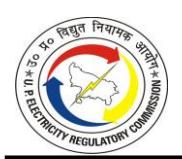

|          |                                                                      | FY 2023-24           |                |                    |                |                          |                |                   |           |                |                    |  |
|----------|----------------------------------------------------------------------|----------------------|----------------|--------------------|----------------|--------------------------|----------------|-------------------|-----------|----------------|--------------------|--|
| S.No     | Source of Power (Station-wise)                                       | Units (MU)           |                | ial Fixed arges |                | al Energy/ ole charge |                | Other Cost        | LPS       | To             | Total Cost         |  |
|          |                                                                      | Offics (IVIO)        | (Rs. / kWh) | (Rs. Cr.)          | (Rs. / kWh) | (Rs. Cr.)                | (Rs. / kWh) | (Rs. Cr.)         | (Rs. Cr.) | (Rs. / kWh) | (Rs. Cr.)          |  |
| j        | NEEPCO                                                               |                      |                |                    |                |                          |                |                   |           |                |                    |  |
| 1        | KAMENG HEP                                                           | 238.93               | -              | -                  | 4.00           | 95.57                    | 0.01           | 0.31              | 0.00      | 4.01           | 95.88              |  |
|          | Sub-Total                                                            | 238.93               | -              | -                  | 4.00           | 95.57                    | 0.01           | 0.31              | 0.00      | 4.01           | 95.88              |  |
| k        | IPP/JV                                                               |                      |                |                    |                |                          |                |                   |           |                |                    |  |
|          | HYDRO                                                                |                      |                |                    |                |                          |                |                   |           |                |                    |  |
| 1        | TALA                                                                 | 54.48                | -              | -                  | 2.27           | 12.37                    | -              | -                 | 0.00      | 2.27           | 12.37              |  |
| 2        | SRI NAGAR HEP                                                        | 1,137.58             | 5.08           | 577.97             | 4.93           | 560.67                   | (0.06)         | (7.18)            | 0.00      | 9.95           | 1,131.46           |  |
| 3        | VISHNU PRAYAG                                                        | 1,405.05             | 0.17           | 24.48              | 1.06           | 149.60                   | (0.44)         | (61.17)           | 0.00      | 0.80           | 112.90             |  |
| 5        | KARCHAM                                                              | 732.94               | 1.48           | 108.47             | 1.55           | 113.34                   | 0.32)          | 23.55             | 0.00      | 3.35           | 245.36             |  |
| 6        | TEESTA-III TEESTA URJA LTD                                        | 612.55               | 2.84           | 174.24             | 2.43           | 148.81 0.00           | (0.39)         | (23.71)           | 0.00      | 4.89           | 299.35             |  |
| 7        | GMR BAJOLI HOLI                                                      | 185.23               | 2.28           | 42.31              | 2.94           | 54.49                    | 0.28           | 5.19              | 0.00      | 5.51           | 101.99             |  |
| 8        | TIDONG POWER GENERATION                                              | 76.11                | 2.30           | 17.51              | 2.30           | 17.51                    | 0.26           | 2.01              | 0.00      | 4.86           | 37.02              |  |
| -        | Sub-Total                                                            | 4,203.94             | 2.25           | 944.97             | 2.51           | 1056.78                  | (0.15)         | (61.31)           | 0.00      | 4.62           | 1,940.44           |  |
|          | Thermal                                                              | .,_55.54             |                |                    |                |                          | ,::20,         | ,,                | 3.55      |                | ,=                 |  |
| 1        | APCPL                                                                | 44.72                | 3.38           | 15.13              | 4.37           | 19.55                    | 1.80           | 8.03              | 0.00      | 9.55           | 42.71              |  |
| 2        | BEPL BARKHERA                                                        | 315.82               | 2.80           | 88.33              | 4.53           | 143.06                   | 0.15           | 4.77              | 3.59      | 7.59           | 239.75             |  |
| 3        | BEPL KHAMBHAKHERA                                                    | 309.11               | 3.00           | 92.64              | 4.65           | 143.82                   | (1.08)         | (33.40)           | 0.00      | 6.57           | 203.06             |  |
| 4        | BEPL KUNDRAKHI                                                       | 298.34               | 3.03           | 90.44              | 4.56           | 136.05                   | (1.21)         | (36.24)           | 0.00      | 6.38           | 190.25             |  |
| 5        | BEPL MAQSOODAPUR                                                     | 318.34               | 2.91           | 92.64              | 4.56           | 145.16                   | (0.95)         | (30.27)           | 0.00      | 6.52           | 207.53             |  |
| 6        | BEPL UTRAULA                                                         | 308.58               | 3.07           | 94.77              | 4.63           | 142.85                   | (1.17)         | (35.95)           | 0.00      | 6.54           | 201.67             |  |
| 7        | KSK MAHANADI                                                         | 5,588.89             | 2.73           | 1,526.10           | 3.29           | 1841.04                  | 0.52           | 288.02            | 25.04     | 6.58           | 3,680.21           |  |
| 8        | LALITPUR                                                             | 11,659.64            | 2.67           | 3,117.18           | 3.26           | 3803.98                  | 0.12           | 135.45            | 189.68    | 6.21           | 7,246.30           |  |
| 9        | LANCO                                                                | 6,994.36             | 0.74           | 517.49             | 2.37           | 1659.45                  | 0.16           | 113.58            | 0.00      | 3.27           | 2,290.52           |  |
| 10       | M.B. POWER (PTC)                                                     | 2,375.61             | 2.54           | 603.73             | 2.14           | 507.60                   | 1.53           | 363.32            | 24.06     | 6.31           | 1,498.72           |  |
| 11       | MEJA THERMAL POWER PLANT                                             | 6,070.60             | 2.47           | 1,501.11           | 3.03           | 1841.39                  | 0.04           | 25.43             | 0.00      | 5.55           | 3,367.92           |  |
| 12       | NABINAGAR POWER PROJECT                                              | -                    | -              | -                  | -              | 0.00                     |                | - (11 = 2)        | 0.00      | -              | -                  |  |
| 13       | PRAYAGRAJ POWER                                                      | 11,016.50            | 1.07           | 1,182.50           | 2.55           | 2809.63                  | (0.01)         | (11.76)           | 0.00      | 3.61           | 3,980.37           |  |
| 14       | R.K.M. POWER                                                         | 2,694.89             | 2.25           | 607.58             | 2.39           | 644.32                   | 0.02           | 5.53              | 0.00      | 4.67           | 1,257.43           |  |
| 15 16 | ROSA-1&2 SASAN                                                    | 6,996.54 3,686.76 | 1.66 0.15   | 1,159.35 54.49  | 3.18 1.15   | 2225.46 423.81        | (0.31) 0.05 | (214.90) 20.22 | 0.00      | 4.53 1.35   | 3,169.91 498.53 |  |
| 17       | TRN ENERGY (PTC)                                                     | 2,980.58             | 1.55           | 462.17             | 1.15           | 468.42                   | 0.05           | 132.92            | 0.00      | 3.57           | 1,063.58           |  |
| 17       | Sub-Total                                                            | 61,659.29            | 1.82           | 11,205.64          | 2.75           | 16955.58                 | 0.43           | 734.77            | 242.46    | 4.73           | 29,138.44          |  |
| В        | Medium Term Sources                                                  | 02,000.20            |                |                    |                |                          | V              | 10.111            |           |                |                    |  |
|          | Station/Source 1                                                     | _                    | _              | -                  | _              | 0.00                     | _              | _                 | 0.00      | _              | _                  |  |
|          | Station/Source 2                                                     | _                    | -              | -                  | -              | 0.00                     | -              | -                 | 0.00      | -              | _                  |  |
|          | Sub-Total                                                            | -                    | -              | -                  | -              | 0.00                     | -              | -                 | 0.00      | -              | -                  |  |
|          |                                                                      |                      | -              |                    | -              |                          | -              |                   |           | -              |                    |  |
| С        | Short Term Sources                                                   |                      |                |                    |                |                          |                |                   |           |                |                    |  |
|          | Station/Source 1                                                     | -                    | -              | -                  | -              | 0.00                     | -              | -                 | 0.00      | -              | -                  |  |
|          | Station/Source 2                                                     | -                    | -              | -                  | -              | 0.00                     | -              | -                 | 0.00      | -              | -                  |  |
|          | Sub-Total                                                            | -                    | -              | •                  | -              | 0.00                     | -              | -                 | 0.00      | -              | -                  |  |
| D        | Cogen/ Captive                                                       |                      |                |                    |                |                          |                |                   |           |                |                    |  |
| 1        | Akbarpur Chini Mills Ltd                                             | 27.73                | 1.27           | 3.52               | 2.15           | 5.96                     | -              | -                 | 0.00      | 3.42           | 9.48               |  |
| 2        | Avadh sugar , Hargaon                                                | 38.15                | 1.30           | 4.97               | 2.26           | 8.61                     | -              | -                 | 0.00      | 3.56           | 13.58              |  |
| 3        | Avadh Sugar., Sehora (Upper Ganges)                                  | 76.28                | 1.28           | 9.80               | 2.41           | 18.36                    | -              | -                 | 0.00      | 3.69           | 28.16              |  |
| 4        | Birla Carbon (Hi Tech Carbon)                                        | 36.53                | 2.20           | 8.04               | 2.22           | 8.11                     | -              | -                 | 0.00      | 4.42           | 16.15              |  |
| 5        | Bajaj Hindustan Ltd., Barkhera                                       | 4.77                 | 1.29           | 0.61               | 2.15           | 1.02                     | 0.00           | 0.00              | 0.00      | 3.44           | 1.64               |  |
| 6        | Bajaj Hindustan Ltd., Bilai                                          | 28.06                | 1.29           | 3.62               | 2.15           | 6.03                     | 0.00           | 0.00              | 0.00      | 3.44           | 9.65               |  |
| 7        | Bajaj Hindustan Ltd., Budhana                                        | 30.62                | 1.29           | 3.95               | 2.15           | 6.58                     | 0.00           | 0.00              | 0.00      | 3.44           | 10.53              |  |
| 8        | Bajaj Hindustan Ltd., Gangnauli                                      | 0.13                 | 1.29           | 0.02               | 2.15           | 0.03                     | 0.11           | 0.00              | 0.00      | 3.55           | 0.05               |  |
| 9        | Bajaj Hindustan Ltd., Khambakhera                                    | 14.28                | 1.29 1.29   | 1.84               | 2.15           | 3.07                     | 0.00           | 0.00              | 0.00      | 3.44           | 4.91               |  |
| 10 11 | Bajaj Hindustan Ltd., Kinauni Bajaj Hindustan Ltd., Kundrakhi     | 30.80 17.05       | 1.29           | 3.98 2.20       | 2.15 2.10   | 6.62 3.58             | 0.00           | 0.00              | 0.00      | 3.44           | 10.60 5.78      |  |
| 12       | Bajaj Hindustan Ltd., Maqsoodapur                                    | 6.56                 | 1.29           | 0.87               | 2.10           | 1.41                     | 0.00           | 0.00              | 0.00      | 3.48           | 2.28               |  |
| 13       | Bajaj Hindustan Etd., Maqsoodapui Bajaj Hindustan Ltd., Paliaklan | 11.15                | 1.29           | 1.44               | 2.15           | 2.40                     | 0.00           | 0.00              | 0.00      | 3.44           | 3.84               |  |
| 14       | Bajaj Hindustan Ltd., Thanabhawn                                     | 24.67                | 1.29           | 3.18               | 2.15           | 5.30                     | 0.00           | 0.00              | 0.00      | 3.44           | 8.49               |  |
| 15       | Bajaj Hindustan Ltd., Utraula                                        | 11.60                | 1.42           | 1.65               | 2.03           | 2.35                     | 0.00           | 0.00              | 0.00      | 3.45           | 4.00               |  |
| 16       | Balrampur Chini Mills Ltd., Maizapur                                 | 11.76                | 1.81           | 2.13               | 2.47           | 2.90                     | -              | -                 | 0.00      | 4.28           | 5.03               |  |
| 17       | Balrampur Chini Mills Ltd., Tulsipur                                 | 1.52                 | 1.81           | 0.27               | 2.47           | 0.37                     | 0.03           | 0.00              | 0.00      | 4.31           | 0.65               |  |
| 18       | Balrampur Chini Mills Ltd., Balrmpur                                 | -                    | -              | -                  | -              | 0.00                     | -              | -                 | 0.00      | -              | -                  |  |

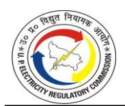

|          |                                                                                       | FY 2023-24      |                |                    |                |                          |                |            |           |                |               |  |
|----------|---------------------------------------------------------------------------------------|-----------------|----------------|--------------------|----------------|--------------------------|----------------|------------|-----------|----------------|---------------|--|
| S.No     | Source of Power (Station-wise)                                                        | Units (MU)      |                | ial Fixed arges |                | al Energy/ ole charge |                | Other Cost | LPS       |                | Total Cost    |  |
|          |                                                                                       | Offics (WIO)    | (Rs. / kWh) | (Rs. Cr.)          | (Rs. / kWh) | (Rs. Cr.)                | (Rs. / kWh) | (Rs. Cr.)  | (Rs. Cr.) | (Rs. / kWh) | (Rs. Cr.)     |  |
| 19       | Balrampur Chini Mills Ltd., Babhnan                                                   | 20.70           | 1.52           | 3.15               | 1.95           | 4.04                     | -              | -          | 0.00      | 3.47           | 7.19          |  |
| 20       | Continental Carbon India Ltd                                                          | 37.15           | 2.01           | 7.45               | 2.32           | 8.60                     | 0.24           | 0.89       | 0.00      | 4.56           | 16.94         |  |
| 21       | Dalmia Chini Mills Ltd., Jawaharpur                                                   | 56.74           | 1.29           | 7.32               | 2.11           | 11.97                    | -              | -          | 0.00      | 3.40           | 19.29         |  |
| 22       | Dalmia Chini Mills Ltd., Nigohi                                                       | 52.98           | 1.29           | 6.83               | 2.15           | 11.39                    | -              | -          | 0.00      | 3.44           | 18.22         |  |
| 23       | Dalmia Chini Mills Ltd., Ramgarh                                                      | 36.65           | 1.29           | 4.73               | 2.15           | 7.88                     | -              | -          | 0.00      | 3.44           | 12.61         |  |
| 24       | DCM Sriram Ltd., Daurala (Meerut)                                                     | 37.88           | 1.32           | 5.00               | 2.15           | 8.14                     | -              | -          | 0.00      | 3.47           | 13.14         |  |
| 25       | Daya Sugar., Saharaanpur                                                              | 5.10            | 1.81           | 0.92               | 2.47           | 1.26                     | -              | -          | 0.00      | 4.28           | 2.18          |  |
| 26       | DCM Sriram Ltd, Loni,Hardoi                                                           | 44.04           | 1.31           | 5.77               | 2.15           | 9.47                     | -              | -          | 0.00      | 3.46           | 15.24         |  |
| 27       | DCM Sriram Ltd, Hariawan, Hardoi                                                      | 124.37          | 1.50           | 18.69              | 2.59           | 32.22                    | -              | -          | 0.00      | 4.09           | 50.91         |  |
| 28 29 | DCM Sriram Ltd., Lakhimpur Ajbapur                                                    | 141.34          | 1.62 1.27   | 22.92              | 3.83           | 54.14 3.47            | -              | -          | 0.00      | 5.45 3.42   | 77.07         |  |
| 30       | Dhampur Sugar Mills Ltd., Bareilly, Meerganj                                          | 16.13 112.82 | 1.33           | 2.05 15.00      | 2.15           | 24.03                    | -              | -          | 0.00      | 3.42           | 5.52 39.03 |  |
| 31       | Dhampur Sugar Mills Ltd., Dhampur, Bijnor Dhampur Sugar Mills Ltd. Mansoorpur, Mzf    | 37.30           | 1.33           | 4.81               | 2.13 2.15   | 8.02                     | -              | -          | 0.00      | 3.44           | 12.83         |  |
| 32       | Dhampur Sugar Mills Ltd., Rajpura, Sambhal                                            | 51.63           | 1.29           | 9.48               | 2.13           | 10.48                    | _              | _          | 0.00      | 3.87           | 19.96         |  |
| 33       | Dhampur Sugar Mills Ltd., Asmoli, Sambhal                                             | 29.50           | 1.29           | 3.80               | 2.03           | 6.34                     | _              | -          | 0.00      | 3.44           | 10.15         |  |
| 34       | Dwarikesh Sugar Ind. Ltd., Dhampur Bijnor                                             | 63.97           | 1.29           | 8.38               | 2.15           | 13.75                    | 0.00           | 0.00       | 0.00      | 3.44           | 22.14         |  |
| 35       | Dwarikesh Sugar Ind. Ltd., Briampur Bareilly                                          | 58.34           | 1.31           | 7.64               | 2.15           | 12.54                    | 0.00           | 0.00       | 0.00      | 3.46           | 20.21         |  |
| 36       | Dwarikesh Sugar Ind. Ltd., Paridpur Barelly  Dwarikesh Sugar Ind. Ltd., Nagina Bijnor | 14.22           | 1.31           | 1.81               | 2.15           | 3.06                     | 0.00           | 0.03       | 0.00      | 3.43           | 4.88          |  |
| 37       | Govind Sugar                                                                          | 64.66           | 2.02           | 13.09              | 2.13           | 15.74                    | 0.01           | 0.01       | 0.00      | 4.46           | 28.83         |  |
| 38       | Gularia Chini Mills Ltd                                                               | 69.08           | 1.31           | 9.04               | 2.07           | 14.28                    | 0.00           | 0.01       | 0.00      | 3.38           | 23.33         |  |
| 39       | Haidergarh Chini Mills Ltd                                                            | 9.78            | 1.25           | 1.22               | 2.15           | 2.10                     |                | - 0.01     | 0.00      | 3.40           | 3.32          |  |
| 40       | India Glycols                                                                         | 2.94            | 1.79           | 0.53               | 5.52           | 1.62                     | _              | _          | 0.00      | 7.31           | 2.15          |  |
| 41       | K.M. Sugar Ltd                                                                        | 10.34           | 1.27           | 1.31               | 2.15           | 2.22                     | -              | _          | 0.00      | 3.42           | 3.54          |  |
| 42       | Kesar Enterprises Ltd                                                                 | 89.64           | 1.43           | 12.82              | 2.03           | 18.20                    | -              | _          | 0.00      | 3.46           | 31.02         |  |
| 43       | Kisan Sahkari Chini Mil                                                               | 18.87           | 2.18           | 4.11               | 2.12           | 4.01                     | -              | -          | 0.00      | 4.30           | 8.12          |  |
| 44       | Kumbhi Sugar Mills Ltd                                                                | 28.57           | 1.60           | 4.58               | 2.09           | 5.96                     | 0.01           | 0.01       | 0.00      | 3.70           | 10.56         |  |
| 45       | L.H. Sugar Factories Ltd                                                              | 67.50           | 1.16           | 7.82               | 2.15           | 14.51                    | -              | -          | 0.00      | 3.31           | 22.33         |  |
| 46       | Mankapur Chini Mills Ltd                                                              | 80.94           | 1.48           | 11.98              | 2.19           | 17.74                    | 0.00           | 0.01       | 0.00      | 3.67           | 29.73         |  |
| 47       | Mawana Sugar Ltd., Meerut                                                             | 22.03           | 1.28           | 2.82               | 2.15           | 4.74                     | -              | -          | 0.00      | 3.43           | 7.56          |  |
| 48       | Mawana Sugar Ltd., Naglamal                                                           | 34.81           | 1.29           | 4.49               | 2.15           | 7.48                     | -              | -          | 0.00      | 3.44           | 11.97         |  |
| 49       | Mawana Sugar Ltd., Titawi                                                             | 52.78           | 1.29           | 6.81               | 2.15           | 11.35                    | -              | -          | 0.00      | 3.44           | 18.16         |  |
| 50       | New India Sugar Mills                                                                 | 58.75           | 1.31           | 7.70               | 2.15           | 12.63                    | -              | -          | 0.00      | 3.46           | 20.33         |  |
| 51       | Novel Sugar (Bajaj Sugar - Barkhera)                                                  | 0.34            | 1.31           | 0.04               | 2.15           | 0.07                     | -              | -          | 0.00      | 3.46           | 0.12          |  |
| 52       | Oswal Overseas                                                                        | 7.31            | 1.69           | 1.24               | 2.71           | 1.98                     | -              | -          | 0.00      | 4.40           | 3.22          |  |
| 53       | Parle Biscuits Pvt. Ltd                                                               | 1.23            | 1.21           | 0.15               | 2.15           | 0.26                     | -              | -          | 0.00      | 3.36           | 0.41          |  |
| 54       | Ramala Sahkari Chini Mills                                                            | 42.76           | 1.75           | 7.48               | 3.04           | 13.00                    | -              | -          | 0.00      | 4.79           | 20.48         |  |
| 55       | Rana Sugar Miis Ltd., Karimganj                                                       | 14.32           | 1.49           | 2.13               | 2.11           | 3.02                     | -              | -          | 0.00      | 3.60           | 5.15          |  |
| 56       | Rana Sugar Miis Ltd., Belwara                                                         | 21.80           | 1.51           | 3.30               | 2.10           | 4.59                     | -              | -          | 0.00      | 3.62           | 7.89          |  |
| 57       | Rana Sugar Miis Ltd., Bilari                                                          | 44.16           | 2.18           | 9.63               | 2.03           | 8.96                     | -              | -          | 0.00      | 4.21           | 18.59         |  |
| 58       | Rauzagaon Chini Mills Ltd.                                                            | 40.92           | 1.31           | 5.36               | 2.15           | 8.80                     | -              | -          | 0.00      | 3.46           | 14.16         |  |
| 59       | SBEC Bioenergy Ltd.                                                                   | 30.53           | 1.27           | 3.88               | 2.15           | 6.56                     | -              | -          | 0.00      | 3.42           | 10.44         |  |
| 60       | Simbholi Sugar Ltd Chilwaria                                                          | 18.65           | 1.57           | 2.93               | 2.10           | 3.91                     | -              | -          | 0.00      | 3.67           | 6.84          |  |
| 61       | Simbholi Sugar Ltd Hapur                                                              | 69.99           | 1.75           | 12.22              | 2.07           | 14.50                    | -              | -          | 0.00      | 3.82           | 26.72         |  |
| 62       | Sukhbir Agro Energy Ltd                                                               | 39.63           | 1.72           | 6.82               | 5.85           | 23.18                    | -              | -          | 0.00      | 7.57           | 30.00         |  |
| 63       | Superior Food Grain                                                                   | 64.61           | 2.18           | 14.08              | 2.03           | 13.12                    | -              | -          | 0.00      | 4.21           | 27.20         |  |
| 64       | The Seksaria, Biswan                                                                  | 95.56           | 2.40           | 22.89              | 2.03           | 19.37                    |                |            | 0.00      | 4.42           | 42.26         |  |
| 65       | Tikaula Sugar Ltd. Triveni Engg. & Industries LtdMilak                                | 31.07           | 1.39           | 4.33               | 2.48           | 7.72                     | -              | -          | 0.00      | 3.88           | 12.05         |  |
| 66       | Narayanpur                                                                            | 0.73            | 1.29           | 0.09               | 2.15           | 0.16                     | -              | -          | 0.00      | 3.44           | 0.25          |  |
| 67       | Triveni Engg. & Industries Ltd Chandanpur                                             | 5.53            | 1.29           | 0.71               | 2.15           | 1.19                     | -              | -          | 0.00      | 3.44           | 1.90          |  |
| 68       | Triveni Engg. & Industries Ltd Deoband                                                | 46.92           | 1.27           | 5.96               | 2.15           | 10.09                    | -              | -          | 0.00      | 3.42           | 16.05         |  |
| 69       | Triveni Engg. & Industries Ltd Khatuali                                               | 106.80          | 1.18           | 12.60              | 2.15           | 22.96                    | -              | -          | 0.00      | 3.33           | 35.57         |  |
| 70       | Triveni Engg. & Industries Ltd., Sabitgarh                                            | 8.08            | 1.95           | 1.57               | 2.05           | 1.66                     | -              | -          | 0.00      | 4.00           | 3.23          |  |
| 71       | U.P State Sugar Corp. Ltd Munderwa                                                    | 37.53           | 1.75           | 6.57               | 3.04           | 11.41                    | -              | -          | 0.00      | 4.79           | 17.98         |  |
| 72       | U.P State Sugar Corp. Ltd Pipraich                                                    | 33.29           | 1.75           | 5.83               | 3.04           | 10.12                    | -              | -          | 0.00      | 4.79           | 15.95         |  |
| 73       | U.P State Sugar Corp. Ltd Mohiuddinpur                                                | 14.85           | 2.52           | 3.74               | 2.03           | 3.01                     | -              | -          | 0.00      | 4.55           | 6.76          |  |
| 74       | Uttam Sugar Mills, Ltd. Barkatpur                                                     | 41.74           | 1.31           | 5.49               | 2.15           | 8.97                     | -              | -          | 0.00      | 3.46           | 14.46         |  |
| 75       | Uttam Sugar Mills, Ltd. Khaikheri                                                     | 25.18           | 1.31           | 3.30               | 2.15           | 5.41                     | -              | -          | 0.00      | 3.46           | 8.71          |  |
| 76       | Uttam Sugar Mills, Ltd. Shermau                                                       | 25.31           | 1.30           | 3.30               | 2.15           | 5.44                     | 0.07           | 0.19       | 0.00      | 3.53           | 8.92          |  |
| 77       | Wave Ind. & Engg. Ltd                                                                 | 11.85           | 1.31           | 1.55               | 2.15           | 2.55                     | -              | -          | 0.00      | 3.46           | 4.10          |  |
| 78       | Yadu Sugars Ltd.                                                                      | 7.68            | 1.27           | 0.97               | 2.03           | 1.56                     |                | -          | 0.00      |                | 2.53          |  |
| 79       | Banked Energy                                                                         | 337.15          | -              | -                  | 0.95           | 32.04                    | -              | -          | 0.00      | 0.95           | 32.04         |  |

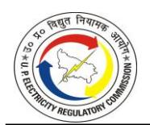

|          |                                                                                |                              |                |           |                     | FY 202                      | 3-24           |            |                     |                     |                             |
|----------|--------------------------------------------------------------------------------|------------------------------|----------------|-----------|---------------------|-----------------------------|----------------|------------|---------------------|---------------------|-----------------------------|
|          |                                                                                |                              |                | al Fixed  |                     | al Energy/                  |                | Other Cost | LPS                 | Tot                 | tal Cost                    |
| S.No     | Source of Power (Station-wise)                                                 | Units (MU)                   |                | arges     | Variab (Rs. /    | ole charge                  | (Rs. /         |            |                     |                     | 1                           |
|          |                                                                                |                              | (Rs. / kWh) | (Rs. Cr.) | (KS. / kWh)      | (Rs. Cr.)                   | (KS. / kWh) | (Rs. Cr.)  | (Rs. Cr.)           | (Rs. / kWh)      | (Rs. Cr.)                   |
|          | Sub-Total                                                                      | 3,148.69                     | 1.35           | 424.34    | 2.20                | 691.75                      | 0.00           | 1.17       | 0.00                | 3.55                | 1,117.25                    |
|          |                                                                                |                              | -              |           | -                   |                             | -              |            |                     | -                   |                             |
| E        | Bilateral & Others (Power Purchase through Trading)                            |                              | -              |           | -                   |                             | -              |            |                     | -                   |                             |
| 1        | Power Purchase from Exchange                                                   |                              | -              | _         | _                   | 0.00                        | _              | _          | 0.00                | _                   | _                           |
|          | IEX (Sale)/PXIL (Sale)                                                         | 6,396.71                     | -              | -         | -                   | 0.00                        | -              | -          | 0.00                | -                   | -                           |
|          | IEX (Purchase)/PXIL (Purchase)                                                 | 1,449.37                     | -              | -         | 8.53                | 1235.97                     | 0.18           | 26.09      | 0.00                | 8.71                | 1,262.06                    |
|          | NET-IEX                                                                        | (4,947.34)                   |                | -         |                     | 1235.97                     |                | 26.09      | 0.00                |                     | 1,262.06                    |
| _        | Hindustan Power Exchange (HPX)                                                 | 21.79                        | -              | -         | 9.83                | 21.41                       | -              | -          | 0.00                | 9.83                | 21.41                       |
| 2 i)  | Purchase from Open Access (OA) ADANI ENTERPRISES                               | <b>1,407.74</b> 695.96       | -              | -         | <b>10.09</b> 10.12  | <b>1420.40</b> 704.43       | -              | -          | <b>0.00</b>         | <b>10.09</b> 10.12  | <b>1,420.40</b> 704.43      |
| ii)      | MANIKARAN                                                                      | 92.87                        | -              | -         | 9.86                | 91.53                       | -              | -          | 0.00                | 9.86                | 91.53                       |
| iii)     | SHREE CEMENT                                                                   | 113.77                       | -              | -         | 9.92                | 112.85                      | -              | -          | 0.00                | 9.92                | 112.85                      |
| iv)      | NVVN- STOA                                                                     | 44.79                        | -              | -         | 8.29                | 37.12                       | -              | -          | 0.00                | 8.29                | 37.12                       |
| v)       | PTC                                                                            | 68.02                        | -              | -         | 10.13               | 68.93                       | -              | -          | 0.00                | 10.13               | 68.93                       |
| vi)      | TATA POWER TRADING                                                             | 392.32                       | -              | -         | 10.34               | 405.54 <b>2677.78</b>    | - (0.07)       | - 20.00    | 0.00                | 10.34               | 405.54                      |
|          | Sub-Total                                                                      | (3,517.81)                   | -              | -         | (7.61)              | 20//./8                     | (0.07)         | 26.09      | 0.00                | (7.69)              | 2,703.87                    |
| E 1      | Unscheduled Interchange                                                        |                              | -              |           | -                   |                             | -              |            |                     | -                   |                             |
| i        | UI (UNDERDRAWL)                                                                | -                            | -              | -         | -                   | (115.55)                    | -              | -          | 0.00                | -                   | -115.55                     |
| ii       | UI (OVERDRAWL)                                                                 | 1.27                         | -              | -         |                     | 115.55                      | -              | -          | 0.00                |                     | 115.55                      |
| iii      | UPSLDC (UI)                                                                    | (504.13)                     | -              | -         | 1.35                | (68.09)                     | -              | -          | 0.00                | 1.35                | (68.09)                     |
| iv       | NAEYVELI POWER LTD Sub-Total                                                   | (22.13) ( <b>524.99</b> ) | -              | -         | 5.60 <b>1.53</b> | (12.39) ( <b>80.47</b> ) | -              | -          | 0.00 <b>0.00</b> | 5.60 <b>1.53</b> | (12.39) ( <b>80.47</b> ) |
|          | Sub-rotal                                                                      | (324.33)                     | -              |           | 1.55                | (80.47)                     | _              | -          | 0.00                | - 1.55              | (80.47)                     |
| F        | Solar (Existing)                                                               |                              | -              |           | -                   |                             | -              |            |                     | -                   |                             |
| 1        | Adani Green Energy                                                             | 89.69                        | -              | -         | 6.83                | 61.29                       | -              | -          | 3.79                | 7.26                | 65.07                       |
| 2        | Adani Solar Energy Chitrakoot.(50 MW)                                          | 106.66                       | -              | -         | 3.09                | 32.97                       | -              | -          | 0.00                | 3.09                | 32.97                       |
| 3        | Adani Solar Energy Four Pvt. Ltd., Bhahpur                                     | 102.91                       | -              | -         | 3.19                | 32.83                       | -              | -          | 0.00                | 3.19                | 32.83                       |
| 5        | Adani Solar Energy Four Pvt. Ltd., Sukrullapur Agrawal Solar Power Pvt. Ltd | 103.36 8.21               | -              | -         | 3.22 7.02        | 33.33 5.77               | -              | -          | 0.00                | 3.22 7.02        | 33.33 5.77               |
| 6        | Aryavaan Renewable Energy Pvt. Ltd                                             | 5.44                         | -              | _         | 6.92                | 3.76                        | -              | -          | 0.00                | 6.92                | 3.76                        |
| 7        | Avaada Non-Conventional                                                        | 96.50                        | -              | -         | 3.24                | 31.27                       | -              | -          | 0.00                | 3.24                | 31.27                       |
| 8        | Azure Surya Private Limited                                                    | 16.59                        | -              | -         | 8.99                | 14.92                       | -              | -          | 0.00                | 8.99                | 14.92                       |
| 9        | Bundelkhand Saur Urja                                                          | 38.25                        | -              | -         | 2.12                | 8.11                        | -              | -          | 0.00                | 2.12                | 8.11                        |
| 10       | Dante Energy Private Limited                                                   | 2.02                         | -              | -         | 14.95               | 3.02                        | -              | -          | 0.00                | 14.95               | 3.02                        |
| 11       | Dhruv Milkose Private Limited Essel Urja Private Limited                       | 0.79 86.15                | -              | -         | 19.46 9.28       | 1.53 79.99               | _              | -          | 0.00                | 19.46 9.28       | 1.53 79.99               |
| 13       | Green Urja Pvt. Ltd                                                            | 47.71                        | -              | _         | 9.24                | 44.08                       | -              | -          | 0.00                | 9.24                | 44.08                       |
| 14       | Jakson Power Pvt. Ltd                                                          | 80.64                        | -              | -         | 3.07                | 24.76                       | 2.13           | 17.19      | 0.00                | 5.20                | 41.95                       |
| 15       | K.M. Energy Pvt. Ltd                                                           | 8.31                         | -              | -         | 9.25                | 7.69                        | -              | -          | 0.00                | 9.25                | 7.69                        |
| 16       | Lohia Developers (India) Pvt. Ltd                                              | 7.84                         | -              | -         | 7.02                | 5.51                        | -              | -          | 0.00                | 7.02                | 5.51                        |
| 17       | Maheswari Mining & Energy pvt. Ltd                                             | 36.53                        | -              | -         | 3.11                | 11.36                       | -              | -          | 0.00                | 3.11                | 11.36                       |
| 18 19 | Nirosha Power Pvt. Ltd NTPC Auraiya Solar                                   | 49.65 76.24               | -              | <u>-</u>  | 8.93 3.03        | 44.33 23.10              | -              | -          | 0.00                | 8.93 3.03        | 44.33 23.10              |
| 20       | NTPC Green Energy Ltd                                                          | 482.65                       | -              | <u>-</u>  | 2.83                | 136.36                      | -              | -          | 0.00                | 2.83                | 136.36                      |
| 21       | Pinnacle Renewable Energy                                                      | 5.92                         | -              | -         | 5.07                | 3.00                        | -              | -          | 0.00                | 5.07                | 3.00                        |
| 22       | Priapus Infrastructure Limited                                                 | 2.74                         | -              | -         | 17.93               | 4.91                        | -              | -          | 0.00                | 17.94               | 4.91                        |
| 23       | PSPN Synergy Pvt. Ltd                                                          | 24.28                        | -              | -         | 7.02                | 17.04                       | -              | -          | 0.00                | 7.02                | 17.04                       |
| 24       | Refex Energy (Rajasthan) Pvt. Ltd                                              | 17.38                        | -              | -         | 9.24                | 16.06                       | -              | -          | 0.00                | 9.24                | 16.06                       |
| 25 26 | Sahashradhara Energy Pvt. Ltd Salasar Green Energy Pvt. Ltd                    | 7.57 8.98                 | -              | <u>-</u>  | 6.65 7.02        | 5.03 6.31                | -              | -          | 2.21 0.00        | 9.57 7.02        | 7.24 6.31                |
| 27       | Samavist Energy Solutions Pvt. Ltd                                             | 16.60                        | -              | -         | 9.33                | 15.49                       | _              | -          | 0.00                | 9.33                | 15.49                       |
| 28       | SECI, SAKET NEW DELHI                                                          | 2,746.87                     | -              | -         | 2.98                | 818.51                      | 0.24           | 66.88      | 6.29                | 3.25                | 891.68                      |
| 29       | Spinel Energy Infrastructure Limited                                           | 36.06                        | -              | -         | 7.54                | 27.19                       | -              | -          | 0.00                | 7.54                | 27.19                       |
| 30       | Sukhbir Agro (1) Lalitpur UP. (10 MW)                                          | 16.40                        | -              | -         | 7.02                | 11.51                       | -              | -          | 0.00                | 7.02                | 11.51                       |
| 31       | Sukhbir Agro (2) Lalitpur UP. (20 MW)                                          | 33.63                        | -              | -         | 7.02 7.02        | 23.61 24.19              | -              | -          | 0.00                | 7.02 7.02        | 23.61                       |
|          | Sukhbir Agro (3) Mahoba UP. (20 MW) Sukhbir Agro Energy Ltd. Chitrakoot UP     | 34.46                        | -              | -         |                     |                             | -              | -          | 0.00                |                     | 24.19                       |
| 33       | (50MW)                                                                         | 169.50                       | -              | -         | 3.14                | 53.31                       | -              | -          | 0.00                | 3.14                | 53.31                       |
| 34       | Sun n Wind Infra Energy Pvt. Ltd                                               | 17.51                        | -              | -         | 9.27                | 16.23                       | -              | -          | 0.00                | 9.27                | 16.23                       |

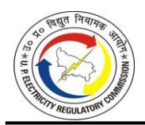

| Source of Power (Station-weise)                                                                                                                                                                                                                                                                                                                                                                                                                                                                                                                                                                                                                                                                                                                                                                                                                                                                                                                                                                                                                                                                                                                                                                                                                                                                                                                                                                                                                                                                                                                                                                                                                                                                                                                                                                                                                                                                                                                                                                                                                                                                                                |      |                                          |               |              |           |      | FY 202     | 3-24   |             |             |              |            |  |
|--------------------------------------------------------------------------------------------------------------------------------------------------------------------------------------------------------------------------------------------------------------------------------------------------------------------------------------------------------------------------------------------------------------------------------------------------------------------------------------------------------------------------------------------------------------------------------------------------------------------------------------------------------------------------------------------------------------------------------------------------------------------------------------------------------------------------------------------------------------------------------------------------------------------------------------------------------------------------------------------------------------------------------------------------------------------------------------------------------------------------------------------------------------------------------------------------------------------------------------------------------------------------------------------------------------------------------------------------------------------------------------------------------------------------------------------------------------------------------------------------------------------------------------------------------------------------------------------------------------------------------------------------------------------------------------------------------------------------------------------------------------------------------------------------------------------------------------------------------------------------------------------------------------------------------------------------------------------------------------------------------------------------------------------------------------------------------------------------------------------------------|------|------------------------------------------|---------------|--------------|-----------|------|------------|--------|-------------|-------------|--------------|------------|--|
| Section   Section   Section   Section   Section   Section   Section   Section   Section   Section   Section   Section   Section   Section   Section   Section   Section   Section   Section   Section   Section   Section   Section   Section   Section   Section   Section   Section   Section   Section   Section   Section   Section   Section   Section   Section   Section   Section   Section   Section   Section   Section   Section   Section   Section   Section   Section   Section   Section   Section   Section   Section   Section   Section   Section   Section   Section   Section   Section   Section   Section   Section   Section   Section   Section   Section   Section   Section   Section   Section   Section   Section   Section   Section   Section   Section   Section   Section   Section   Section   Section   Section   Section   Section   Section   Section   Section   Section   Section   Section   Section   Section   Section   Section   Section   Section   Section   Section   Section   Section   Section   Section   Section   Section   Section   Section   Section   Section   Section   Section   Section   Section   Section   Section   Section   Section   Section   Section   Section   Section   Section   Section   Section   Section   Section   Section   Section   Section   Section   Section   Section   Section   Section   Section   Section   Section   Section   Section   Section   Section   Section   Section   Section   Section   Section   Section   Section   Section   Section   Section   Section   Section   Section   Section   Section   Section   Section   Section   Section   Section   Section   Section   Section   Section   Section   Section   Section   Section   Section   Section   Section   Section   Section   Section   Section   Section   Section   Section   Section   Section   Section   Section   Section   Section   Section   Section   Section   Section   Section   Section   Section   Section   Section   Section   Section   Section   Section   Section   Section   Section   Section   Section   Section   Section   Sect   | S.No | Source of Power (Station-wise)           | Limita (BALI) |              |           |      | al Energy/ |        | Other Cost  | LPS         | Tot          | Total Cost |  |
| 18                                                                                                                                                                                                                                                                                                                                                                                                                                                                                                                                                                                                                                                                                                                                                                                                                                                                                                                                                                                                                                                                                                                                                                                                                                                                                                                                                                                                                                                                                                                                                                                                                                                                                                                                                                                                                                                                                                                                                                                                                                                                                                                             |      |                                          | Units (MU)    |              | (Rs. Cr.) |      | (Rs. Cr.)  |        | (Rs. Cr.)   | (Rs. Cr.)   |              | (Rs. Cr.)  |  |
| 321   Telestuden Solar Projects   101.99                                                                                                                                                                                                                                                                                                                                                                                                                                                                                                                                                                                                                                                                                                                                                                                                                                                                                                                                                                                                                                                                                                                                                                                                                                                                                                                                                                                                                                                                                                                                                                                                                                                                                                                                                                                                                                                                                                                                                                                                                                                                                       | 35   |                                          | 182.83        | -            | -         | 2.69 | 49.17      | -      | -           | 0.00        | 2.69         | 49.17      |  |
| 38   Technical Associate lumined                                                                                                                                                                                                                                                                                                                                                                                                                                                                                                                                                                                                                                                                                                                                                                                                                                                                                                                                                                                                                                                                                                                                                                                                                                                                                                                                                                                                                                                                                                                                                                                                                                                                                                                                                                                                                                                                                                                                                                                                                                                                                               | 36   |                                          | 15.94         | -            | -         | 5.07 | 8.08       | -      | -           | 0.00        | 5.07         | 8.08       |  |
| 39   The VigaPric Ltd                                                                                                                                                                                                                                                                                                                                                                                                                                                                                                                                                                                                                                                                                                                                                                                                                                                                                                                                                                                                                                                                                                                                                                                                                                                                                                                                                                                                                                                                                                                                                                                                                                                                                                                                                                                                                                                                                                                                                                                                                                                                                                          | 37   |                                          | 101.93        |              | -         | 3.21 |            | -      | -           | 0.00        |              | 32.72      |  |
| 40   Tata Power Rememble   12200   - 2.55   36.05   - 0.00   2.95   36.54                                                                                                                                                                                                                                                                                                                                                                                                                                                                                                                                                                                                                                                                                                                                                                                                                                                                                                                                                                                                                                                                                                                                                                                                                                                                                                                                                                                                                                                                                                                                                                                                                                                                                                                                                                                                                                                                                                                                                                                                                                                      | 38   | Technical Associate Limited              | 2.59          |              | -         |      | 4.63       | -      | -           | 0.00        |              | 4.63       |  |
| 41   Terra Light Solar   1727                                                                                                                                                                                                                                                                                                                                                                                                                                                                                                                                                                                                                                                                                                                                                                                                                                                                                                                                                                                                                                                                                                                                                                                                                                                                                                                                                                                                                                                                                                                                                                                                                                                                                                                                                                                                                                                                                                                                                                                                                                                                                                  |      | -                                        |               |              | -         |      |            | -      | -           |             |              | 60.03      |  |
| 1.00   1.00   1.00   1.00   1.00   1.00   1.00   1.00   1.00   1.00   1.00   1.00   1.00   1.00   1.00   1.00   1.00   1.00   1.00   1.00   1.00   1.00   1.00   1.00   1.00   1.00   1.00   1.00   1.00   1.00   1.00   1.00   1.00   1.00   1.00   1.00   1.00   1.00   1.00   1.00   1.00   1.00   1.00   1.00   1.00   1.00   1.00   1.00   1.00   1.00   1.00   1.00   1.00   1.00   1.00   1.00   1.00   1.00   1.00   1.00   1.00   1.00   1.00   1.00   1.00   1.00   1.00   1.00   1.00   1.00   1.00   1.00   1.00   1.00   1.00   1.00   1.00   1.00   1.00   1.00   1.00   1.00   1.00   1.00   1.00   1.00   1.00   1.00   1.00   1.00   1.00   1.00   1.00   1.00   1.00   1.00   1.00   1.00   1.00   1.00   1.00   1.00   1.00   1.00   1.00   1.00   1.00   1.00   1.00   1.00   1.00   1.00   1.00   1.00   1.00   1.00   1.00   1.00   1.00   1.00   1.00   1.00   1.00   1.00   1.00   1.00   1.00   1.00   1.00   1.00   1.00   1.00   1.00   1.00   1.00   1.00   1.00   1.00   1.00   1.00   1.00   1.00   1.00   1.00   1.00   1.00   1.00   1.00   1.00   1.00   1.00   1.00   1.00   1.00   1.00   1.00   1.00   1.00   1.00   1.00   1.00   1.00   1.00   1.00   1.00   1.00   1.00   1.00   1.00   1.00   1.00   1.00   1.00   1.00   1.00   1.00   1.00   1.00   1.00   1.00   1.00   1.00   1.00   1.00   1.00   1.00   1.00   1.00   1.00   1.00   1.00   1.00   1.00   1.00   1.00   1.00   1.00   1.00   1.00   1.00   1.00   1.00   1.00   1.00   1.00   1.00   1.00   1.00   1.00   1.00   1.00   1.00   1.00   1.00   1.00   1.00   1.00   1.00   1.00   1.00   1.00   1.00   1.00   1.00   1.00   1.00   1.00   1.00   1.00   1.00   1.00   1.00   1.00   1.00   1.00   1.00   1.00   1.00   1.00   1.00   1.00   1.00   1.00   1.00   1.00   1.00   1.00   1.00   1.00   1.00   1.00   1.00   1.00   1.00   1.00   1.00   1.00   1.00   1.00   1.00   1.00   1.00   1.00   1.00   1.00   1.00   1.00   1.00   1.00   1.00   1.00   1.00   1.00   1.00   1.00   1.00   1.00   1.00   1.00   1.00   1.00   1.00   1.00   1.00   1.00   1.00   1.00   1.00   1.00   1.00   1.00   1.00      |      |                                          |               |              |           |      |            |        |             |             |              | 36.05      |  |
| Sub-Total   Sub-Total   Sub-Total   Sub-Total   Sub-Total   Sub-Total   Sub-Total   Sub-Total   Sub-Total   Sub-Total   Sub-Total   Sub-Total   Sub-Total   Sub-Total   Sub-Total   Sub-Total   Sub-Total   Sub-Total   Sub-Total   Sub-Total   Sub-Total   Sub-Total   Sub-Total   Sub-Total   Sub-Total   Sub-Total   Sub-Total   Sub-Total   Sub-Total   Sub-Total   Sub-Total   Sub-Total   Sub-Total   Sub-Total   Sub-Total   Sub-Total   Sub-Total   Sub-Total   Sub-Total   Sub-Total   Sub-Total   Sub-Total   Sub-Total   Sub-Total   Sub-Total   Sub-Total   Sub-Total   Sub-Total   Sub-Total   Sub-Total   Sub-Total   Sub-Total   Sub-Total   Sub-Total   Sub-Total   Sub-Total   Sub-Total   Sub-Total   Sub-Total   Sub-Total   Sub-Total   Sub-Total   Sub-Total   Sub-Total   Sub-Total   Sub-Total   Sub-Total   Sub-Total   Sub-Total   Sub-Total   Sub-Total   Sub-Total   Sub-Total   Sub-Total   Sub-Total   Sub-Total   Sub-Total   Sub-Total   Sub-Total   Sub-Total   Sub-Total   Sub-Total   Sub-Total   Sub-Total   Sub-Total   Sub-Total   Sub-Total   Sub-Total   Sub-Total   Sub-Total   Sub-Total   Sub-Total   Sub-Total   Sub-Total   Sub-Total   Sub-Total   Sub-Total   Sub-Total   Sub-Total   Sub-Total   Sub-Total   Sub-Total   Sub-Total   Sub-Total   Sub-Total   Sub-Total   Sub-Total   Sub-Total   Sub-Total   Sub-Total   Sub-Total   Sub-Total   Sub-Total   Sub-Total   Sub-Total   Sub-Total   Sub-Total   Sub-Total   Sub-Total   Sub-Total   Sub-Total   Sub-Total   Sub-Total   Sub-Total   Sub-Total   Sub-Total   Sub-Total   Sub-Total   Sub-Total   Sub-Total   Sub-Total   Sub-Total   Sub-Total   Sub-Total   Sub-Total   Sub-Total   Sub-Total   Sub-Total   Sub-Total   Sub-Total   Sub-Total   Sub-Total   Sub-Total   Sub-Total   Sub-Total   Sub-Total   Sub-Total   Sub-Total   Sub-Total   Sub-Total   Sub-Total   Sub-Total   Sub-Total   Sub-Total   Sub-Total   Sub-Total   Sub-Total   Sub-Total   Sub-Total   Sub-Total   Sub-Total   Sub-Total   Sub-Total   Sub-Total   Sub-Total   Sub-Total   Sub-Total   Sub-Total   Sub-Total   Sub-Total   Sub-   |      | ŭ                                        |               |              | -         |      |            | -      | -           |             |              | 14.57      |  |
| Sub-Total                                                                                                                                                                                                                                                                                                                                                                                                                                                                                                                                                                                                                                                                                                                                                                                                                                                                                                                                                                                                                                                                                                                                                                                                                                                                                                                                                                                                                                                                                                                                                                                                                                                                                                                                                                                                                                                                                                                                                                                                                                                                                                                      |      | -                                        |               |              |           |      |            |        |             |             |              | 49.62      |  |
| Color                                                                                                                                                                                                                                                                                                                                                                                                                                                                                                                                                                                                                                                                                                                                                                                                                                                                                                                                                                                                                                                                                                                                                                                                                                                                                                                                                                                                                                                                                                                                                                                                                                                                                                                                                                                                                                                                                                                                                                                                                                                                                                                          | 43   |                                          | +             |              |           |      |            |        |             |             |              | 21.82      |  |
| Color                                                                                                                                                                                                                                                                                                                                                                                                                                                                                                                                                                                                                                                                                                                                                                                                                                                                                                                                                                                                                                                                                                                                                                                                                                                                                                                                                                                                                                                                                                                                                                                                                                                                                                                                                                                                                                                                                                                                                                                                                                                                                                                          |      | Sub-Total                                | 5,203.17      | -            | =         |      | 1925.04    |        | 84.07       | 12.28       | 3.88         | 2,021.39   |  |
| PTC-Adam Green Energy MP Ltd                                                                                                                                                                                                                                                                                                                                                                                                                                                                                                                                                                                                                                                                                                                                                                                                                                                                                                                                                                                                                                                                                                                                                                                                                                                                                                                                                                                                                                                                                                                                                                                                                                                                                                                                                                                                                                                                                                                                                                                                                                                                                                   | G    | Non-Solar (Renewable)                    |               |              |           |      |            |        |             |             | -            |            |  |
| 2                                                                                                                                                                                                                                                                                                                                                                                                                                                                                                                                                                                                                                                                                                                                                                                                                                                                                                                                                                                                                                                                                                                                                                                                                                                                                                                                                                                                                                                                                                                                                                                                                                                                                                                                                                                                                                                                                                                                                                                                                                                                                                                              | I    | WIND                                     |               | -            |           | -    |            | -      |             |             | -            |            |  |
| 3                                                                                                                                                                                                                                                                                                                                                                                                                                                                                                                                                                                                                                                                                                                                                                                                                                                                                                                                                                                                                                                                                                                                                                                                                                                                                                                                                                                                                                                                                                                                                                                                                                                                                                                                                                                                                                                                                                                                                                                                                                                                                                                              | 1    | PTC-Adani Green Energy MP Ltd            | 141.89        | -            | -         | 3.53 | 50.09      | -      | -           | 0.00        | 3.53         | 50.09      |  |
| PIC Costro Kutch Power                                                                                                                                                                                                                                                                                                                                                                                                                                                                                                                                                                                                                                                                                                                                                                                                                                                                                                                                                                                                                                                                                                                                                                                                                                                                                                                                                                                                                                                                                                                                                                                                                                                                                                                                                                                                                                                                                                                                                                                                                                                                                                         | 2    | PTC-Green Infra Wind Power               | 273.43        | -            | -         | 3.53 | 96.52      | -      | -           | 0.00        | 3.53         | 96.52      |  |
| Second   Second   Second   Second   Second   Second   Second   Second   Second   Second   Second   Second   Second   Second   Second   Second   Second   Second   Second   Second   Second   Second   Second   Second   Second   Second   Second   Second   Second   Second   Second   Second   Second   Second   Second   Second   Second   Second   Second   Second   Second   Second   Second   Second   Second   Second   Second   Second   Second   Second   Second   Second   Second   Second   Second   Second   Second   Second   Second   Second   Second   Second   Second   Second   Second   Second   Second   Second   Second   Second   Second   Second   Second   Second   Second   Second   Second   Second   Second   Second   Second   Second   Second   Second   Second   Second   Second   Second   Second   Second   Second   Second   Second   Second   Second   Second   Second   Second   Second   Second   Second   Second   Second   Second   Second   Second   Second   Second   Second   Second   Second   Second   Second   Second   Second   Second   Second   Second   Second   Second   Second   Second   Second   Second   Second   Second   Second   Second   Second   Second   Second   Second   Second   Second   Second   Second   Second   Second   Second   Second   Second   Second   Second   Second   Second   Second   Second   Second   Second   Second   Second   Second   Second   Second   Second   Second   Second   Second   Second   Second   Second   Second   Second   Second   Second   Second   Second   Second   Second   Second   Second   Second   Second   Second   Second   Second   Second   Second   Second   Second   Second   Second   Second   Second   Second   Second   Second   Second   Second   Second   Second   Second   Second   Second   Second   Second   Second   Second   Second   Second   Second   Second   Second   Second   Second   Second   Second   Second   Second   Second   Second   Second   Second   Second   Second   Second   Second   Second   Second   Second   Second   Second   Second   Second   Second   Second   Second   S   | 3    | PTC-Mytrah Vayu                          | 237.44        |              | -         | 3.53 | 83.82      | -      |             | 0.00        | 3.53         | 83.82      |  |
| Fig.   Fig.   Fig.   Fig.   Fig.   Fig.   Fig.   Fig.   Fig.   Fig.   Fig.   Fig.   Fig.   Fig.   Fig.   Fig.   Fig.   Fig.   Fig.   Fig.   Fig.   Fig.   Fig.   Fig.   Fig.   Fig.   Fig.   Fig.   Fig.   Fig.   Fig.   Fig.   Fig.   Fig.   Fig.   Fig.   Fig.   Fig.   Fig.   Fig.   Fig.   Fig.   Fig.   Fig.   Fig.   Fig.   Fig.   Fig.   Fig.   Fig.   Fig.   Fig.   Fig.   Fig.   Fig.   Fig.   Fig.   Fig.   Fig.   Fig.   Fig.   Fig.   Fig.   Fig.   Fig.   Fig.   Fig.   Fig.   Fig.   Fig.   Fig.   Fig.   Fig.   Fig.   Fig.   Fig.   Fig.   Fig.   Fig.   Fig.   Fig.   Fig.   Fig.   Fig.   Fig.   Fig.   Fig.   Fig.   Fig.   Fig.   Fig.   Fig.   Fig.   Fig.   Fig.   Fig.   Fig.   Fig.   Fig.   Fig.   Fig.   Fig.   Fig.   Fig.   Fig.   Fig.   Fig.   Fig.   Fig.   Fig.   Fig.   Fig.   Fig.   Fig.   Fig.   Fig.   Fig.   Fig.   Fig.   Fig.   Fig.   Fig.   Fig.   Fig.   Fig.   Fig.   Fig.   Fig.   Fig.   Fig.   Fig.   Fig.   Fig.   Fig.   Fig.   Fig.   Fig.   Fig.   Fig.   Fig.   Fig.   Fig.   Fig.   Fig.   Fig.   Fig.   Fig.   Fig.   Fig.   Fig.   Fig.   Fig.   Fig.   Fig.   Fig.   Fig.   Fig.   Fig.   Fig.   Fig.   Fig.   Fig.   Fig.   Fig.   Fig.   Fig.   Fig.   Fig.   Fig.   Fig.   Fig.   Fig.   Fig.   Fig.   Fig.   Fig.   Fig.   Fig.   Fig.   Fig.   Fig.   Fig.   Fig.   Fig.   Fig.   Fig.   Fig.   Fig.   Fig.   Fig.   Fig.   Fig.   Fig.   Fig.   Fig.   Fig.   Fig.   Fig.   Fig.   Fig.   Fig.   Fig.   Fig.   Fig.   Fig.   Fig.   Fig.   Fig.   Fig.   Fig.   Fig.   Fig.   Fig.   Fig.   Fig.   Fig.   Fig.   Fig.   Fig.   Fig.   Fig.   Fig.   Fig.   Fig.   Fig.   Fig.   Fig.   Fig.   Fig.   Fig.   Fig.   Fig.   Fig.   Fig.   Fig.   Fig.   Fig.   Fig.   Fig.   Fig.   Fig.   Fig.   Fig.   Fig.   Fig.   Fig.   Fig.   Fig.   Fig.   Fig.   Fig.   Fig.   Fig.   Fig.   Fig.   Fig.   Fig.   Fig.   Fig.   Fig.   Fig.   Fig.   Fig.   Fig.   Fig.   Fig.   Fig.   Fig.   Fig.   Fig.   Fig.   Fig.   Fig.   Fig.   Fig.   Fig.   Fig.   Fig.   Fig.   Fig.   Fig.   Fig.   Fig.   Fig.   Fig.   Fig.   Fig.   Fig.   Fig.   Fig.   Fig.   Fig.      | 4    | PTC-Ostro Kutch Power                    | 313.00        | -            | -         | 3.53 | 110.49     | -      | -           | 0.00        | 3.53         | 110.49     |  |
| 7 SECH-Renew Power                                                                                                                                                                                                                                                                                                                                                                                                                                                                                                                                                                                                                                                                                                                                                                                                                                                                                                                                                                                                                                                                                                                                                                                                                                                                                                                                                                                                                                                                                                                                                                                                                                                                                                                                                                                                                                                                                                                                                                                                                                                                                                             | 5    |                                          |               | -            | -         | 3.53 | 46.98      | _      | _           | 0.00        |              | 46.98      |  |
| 8       SECI- Ostro Energy       185.92       -       2.88       33.54       0.00       0.00       0.00       2.88       53.54         10       SECI- Powerica       162.90       -       -       2.89       47.08       0.04       0.71       0.00       2.93       47.7         10       SECI- Adami Wind energy MP One Pvt. Ltd       991.51       -       2.90       287.54       -       -       0.00       2.93       287.51         11       SECI- Adami Wind energy MP One Pvt. Ltd       240.28       -       2.58       191.10       -       -       0.00       2.58       61.91         12       SECI-Adami Wind Scalar Energy Pvt. Ltd       240.28       -       2.58       61.99       -       0.00       0.28       61.91         14       SECI-Adami Wind Energy Three, Kutch       240.52       -       2.89       695.1       -       0.00       0.00       2.99       1,327.5         14       SECI-Adami Wind Energy Three, Kutch       240.52       -       2.89       695.1       -       0.00       2.99       1,327.5         18       Biomass (Existing)       -       -       -       0.00       -       -       0.00       -       - <td>6</td> <td>PTC-Wind Two Energy Pvt. Ltd</td> <td>105.27</td> <td>-</td> <td>-</td> <td>3.53</td> <td>37.16</td> <td>-</td> <td>-</td> <td>0.00</td> <td>3.53</td> <td>37.16</td>                                                                                                                                                                                                                                                                                                                                                                                                                                                                                                                                                                                                                                                                                                                                                                           | 6    | PTC-Wind Two Energy Pvt. Ltd             | 105.27        | -            | -         | 3.53 | 37.16      | -      | -           | 0.00        | 3.53         | 37.16      |  |
| 9 SECI-Powerica 162.90 - 2.89 47.08 0.04 0.71 0.00 2.93 47.7 10 SECI-Adam Wind energy MP One Pvt. Ltd 991.51 - 2.90 287.54 - 0.00 2.90 287.5 11 SECI-Spring Renewable Energy 740.71 - 2.58 191.10 - 0.00 2.58 191.1 21 SECI-Vivid Solarie Energy Pvt. Ltd 240.28 - 2.58 61.99 - 0.00 2.58 61.91 21 SECI-Adam Wind Energy Pvt. Ltd 240.28 - 2.58 61.99 - 0.00 2.58 61.91 21 SECI-Adam Wind Energy Pvt. Ltd 240.28 - 2.58 61.99 - 0.00 0.9 0.00 2.58 61.91 21 SECI-Adam Wind Energy Three, Kutch 240.28 - 2.89 96.95 - 0.00 0.9 0.00 2.99 123.1 22 SECI-Adam Wind Energy Three, Kutch 240.22 - 2.89 96.95 - 0.00 0.80 0.00 2.99 1327.5 23 Sub-Total 4,441.22 - 2.99 1326.79 0.00 0.80 0.00 2.99 1,327.5 24 Sub-total - 0.00 - 0.00 - 0.00 - 0.00 - 0.00 - 0.00 - 0.00 - 0.00 - 0.00 - 0.00 - 0.00 - 0.00 - 0.00 - 0.00 - 0.00 - 0.00 - 0.00 - 0.00 - 0.00 - 0.00 - 0.00 - 0.00 - 0.00 - 0.00 - 0.00 - 0.00 - 0.00 - 0.00 - 0.00 - 0.00 - 0.00 - 0.00 - 0.00 - 0.00 - 0.00 - 0.00 - 0.00 - 0.00 - 0.00 - 0.00 - 0.00 - 0.00 - 0.00 - 0.00 - 0.00 - 0.00 - 0.00 - 0.00 - 0.00 - 0.00 - 0.00 - 0.00 - 0.00 - 0.00 - 0.00 - 0.00 - 0.00 - 0.00 - 0.00 - 0.00 - 0.00 - 0.00 - 0.00 - 0.00 - 0.00 - 0.00 - 0.00 - 0.00 - 0.00 - 0.00 - 0.00 - 0.00 - 0.00 - 0.00 - 0.00 - 0.00 - 0.00 - 0.00 - 0.00 - 0.00 - 0.00 - 0.00 - 0.00 - 0.00 - 0.00 - 0.00 - 0.00 - 0.00 - 0.00 - 0.00 - 0.00 - 0.00 - 0.00 - 0.00 - 0.00 - 0.00 - 0.00 - 0.00 - 0.00 - 0.00 - 0.00 - 0.00 - 0.00 - 0.00 - 0.00 - 0.00 - 0.00 - 0.00 - 0.00 - 0.00 - 0.00 - 0.00 - 0.00 - 0.00 - 0.00 - 0.00 - 0.00 - 0.00 - 0.00 - 0.00 - 0.00 - 0.00 - 0.00 - 0.00 - 0.00 - 0.00 - 0.00 - 0.00 - 0.00 - 0.00 - 0.00 - 0.00 - 0.00 - 0.00 - 0.00 - 0.00 - 0.00 - 0.00 - 0.00 - 0.00 - 0.00 - 0.00 - 0.00 - 0.00 - 0.00 - 0.00 - 0.00 - 0.00 - 0.00 - 0.00 - 0.00 - 0.00 - 0.00 - 0.00 - 0.00 - 0.00 - 0.00 - 0.00 - 0.00 - 0.00 - 0.00 - 0.00 - 0.00 - 0.00 - 0.00 - 0.00 - 0.00 - 0.00 - 0.00 - 0.00 - 0.00 - 0.00 - 0.00 - 0.00 - 0.00 - 0.00 - 0.00 - 0.00 - 0.00 - 0.00 - 0.00 - 0.00 - 0.00 - 0.00 - 0.00 - 0.00 - 0.00 - 0.00 - 0.00 - 0.00 - 0.00 - 0.00 - 0.00 - 0. | 7    |                                          |               | -            | -         | 2.71 | 67.88      | -      | -           | 0.00        | 2.71         | 67.88      |  |
| 10   SECI- Adam Wind energy MP One Pvt. Ltd   991.51   -         2.90   287.54   -     -                                                                                                                                                                                                                                                                                                                                                                                                                                                                                                                                                                                                                                                                                                                                                                                                                                                                                                                                                                                                                                                                                                                                                                                                                                                                                                                                                                                                                                                                                                                                                                                                                                                                                                                                                                                                                                                                                                                                                                                                                                       | 8    | <u> </u>                                 | 185.92        | -            | -         | 2.88 | 53.54      |        | 0.00        | 0.00        | 2.88         | 53.55      |  |
| 10   P18, P2 (SBESS Services)                                                                                                                                                                                                                                                                                                                                                                                                                                                                                                                                                                                                                                                                                                                                                                                                                                                                                                                                                                                                                                                                                                                                                                                                                                                                                                                                                                                                                                                                                                                                                                                                                                                                                                                                                                                                                                                                                                                                                                                                                                                                                                  | 9    |                                          | 162.90        | -            | -         | 2.89 | 47.08      | 0.04   | 0.71        | 0.00        | 2.93         | 47.79      |  |
| 12   SECI-Vivid Solaire Energy Pvt. Ltd   240.28   -   2.58   61.99   -   -   0.00   2.58   61.91     3   SECI-Adani Wind Kutch Five   424.74   -   2.90   123.08   0.00   0.09   0.00   2.90   123.14     4   SECI-Adani Wind Energy Three, Kutch   240.52   -   2.89   69.51   -   -   0.00   2.89   69.51     5   Sub-Total   4,441.22   -   2.89   69.51   -     -   0.00   2.99   1,327.5     11   Biomass (Existing)   -     -     0.00   -     -       2   Sub-Total   -     -     0.00   -     -   0.00   -       5   Sub-Total   -     -     0.00   -     -   0.00   -       5   Sub-Total   -     -     0.00   -     -   0.00   -       6   Sub-Total   -     -     0.00   -     -   0.00   -       7   Sub-Total   -     -     0.00   -     -   0.00   -       8   Sub-Total   -     -     0.00   -     -     0.00   -       8   Sub-Total   -     -     0.00   -     -     0.00   -       9   Sub-Total   -       -     0.00   -     -     0.00   -       10   10   10   10   10   10   10                                                                                                                                                                                                                                                                                                                                                                                                                                                                                                                                                                                                                                                                                                                                                                                                                                                                                                                                                                                                                                                                                                                         | 10   | , · · · · · · · · · · · · · · · · · · ·  | 991.51        | -            | -         | 2.90 | 287.54     | -      | -           | 0.00        | 2.90         | 287.54     |  |
| 3   SECI-Adani Wind Energy Three, Kutch   424.74   - 2.90   123.08   0.00   0.09   0.00   2.90   123.11     4   SECI-Adani Wind Energy Three, Kutch   240.52   - 2.89   69.51   0.00   2.89   69.51     5   Sub-Total   4,441.22   2.89   1326.79   0.00   0.80   0.00   2.99   1,327.51     8   Biomass (Existing)                                                                                                                                                                                                                                                                                                                                                                                                                                                                                                                                                                                                                                                                                                                                                                                                                                                                                                                                                                                                                                                                                                                                                                                                                                                                                                                                                                                                                                                                                                                                                                                                                                                                                                                                                                                                            | 11   |                                          | 740.71        | -            | -         | 2.58 | 191.10     | -      | -           | 0.00        | 2.58         | 191.10     |  |
| SECI-Adami Wind Energy Three, Kutch                                                                                                                                                                                                                                                                                                                                                                                                                                                                                                                                                                                                                                                                                                                                                                                                                                                                                                                                                                                                                                                                                                                                                                                                                                                                                                                                                                                                                                                                                                                                                                                                                                                                                                                                                                                                                                                                                                                                                                                                                                                                                            | 12   |                                          | 240.28        | -            | -         | 2.58 | 61.99      | -      | -           | 0.00        | 2.58         | 61.99      |  |
| Sub-Total                                                                                                                                                                                                                                                                                                                                                                                                                                                                                                                                                                                                                                                                                                                                                                                                                                                                                                                                                                                                                                                                                                                                                                                                                                                                                                                                                                                                                                                                                                                                                                                                                                                                                                                                                                                                                                                                                                                                                                                                                                                                                                                      | 13   |                                          |               | -            | -         | 2.90 | 123.08     | 0.00   | 0.09        | 0.00        | 2.90         | 123.18     |  |
| Blomass (Existing)                                                                                                                                                                                                                                                                                                                                                                                                                                                                                                                                                                                                                                                                                                                                                                                                                                                                                                                                                                                                                                                                                                                                                                                                                                                                                                                                                                                                                                                                                                                                                                                                                                                                                                                                                                                                                                                                                                                                                                                                                                                                                                             | 14   |                                          |               | -            | -         |      |            |        | -           |             |              | 69.51      |  |
| Biomass (Existing)                                                                                                                                                                                                                                                                                                                                                                                                                                                                                                                                                                                                                                                                                                                                                                                                                                                                                                                                                                                                                                                                                                                                                                                                                                                                                                                                                                                                                                                                                                                                                                                                                                                                                                                                                                                                                                                                                                                                                                                                                                                                                                             |      | Sub-Total                                | 4,441.22      | -            | -         | 2.99 | 1326.79    | 0.00   | 0.80        | 0.00        | 2.99         | 1,327.59   |  |
| 1                                                                                                                                                                                                                                                                                                                                                                                                                                                                                                                                                                                                                                                                                                                                                                                                                                                                                                                                                                                                                                                                                                                                                                                                                                                                                                                                                                                                                                                                                                                                                                                                                                                                                                                                                                                                                                                                                                                                                                                                                                                                                                                              |      |                                          |               | -            |           |      |            | -      |             |             | -            |            |  |
| 2 Sub-total                                                                                                                                                                                                                                                                                                                                                                                                                                                                                                                                                                                                                                                                                                                                                                                                                                                                                                                                                                                                                                                                                                                                                                                                                                                                                                                                                                                                                                                                                                                                                                                                                                                                                                                                                                                                                                                                                                                                                                                                                                                                                                                    | II   | Biomass (Existing)                       |               | -            |           | -    |            | -      |             |             | -            |            |  |
| Sub-total   -   -   -   -   0.00   -   -   0.00   -                                                                                                                                                                                                                                                                                                                                                                                                                                                                                                                                                                                                                                                                                                                                                                                                                                                                                                                                                                                                                                                                                                                                                                                                                                                                                                                                                                                                                                                                                                                                                                                                                                                                                                                                                                                                                                                                                                                                                                                                                                                                            |      |                                          | -             | -            | -         | -    |            |        | -           |             | -            | -          |  |
| MSW                                                                                                                                                                                                                                                                                                                                                                                                                                                                                                                                                                                                                                                                                                                                                                                                                                                                                                                                                                                                                                                                                                                                                                                                                                                                                                                                                                                                                                                                                                                                                                                                                                                                                                                                                                                                                                                                                                                                                                                                                                                                                                                            | 2    |                                          | -             | -            | -         |      |            |        | -           |             | -            | -          |  |
| MSW                                                                                                                                                                                                                                                                                                                                                                                                                                                                                                                                                                                                                                                                                                                                                                                                                                                                                                                                                                                                                                                                                                                                                                                                                                                                                                                                                                                                                                                                                                                                                                                                                                                                                                                                                                                                                                                                                                                                                                                                                                                                                                                            |      | Sub-total                                | -             |              | -         |      | 0.00       |        | -           | 0.00        | -            | -          |  |
| 1                                                                                                                                                                                                                                                                                                                                                                                                                                                                                                                                                                                                                                                                                                                                                                                                                                                                                                                                                                                                                                                                                                                                                                                                                                                                                                                                                                                                                                                                                                                                                                                                                                                                                                                                                                                                                                                                                                                                                                                                                                                                                                                              |      | 24014                                    |               |              |           |      |            |        |             |             |              |            |  |
| 2         Sub-Total         -         -         -         0.00         -         -         0.00         -           H1         NSM-II -Thermal         335.99         -         -         3.40         114.19         0.03         1.02         0.00         3.43         115.2           NSM-II -Solar         163.38         -         -         4.28         69.95         -         -         0.00         4.28         69.95           NVVNL -Thermal         522.59         -         -         4.03         210.62         0.44         23.04         0.00         4.47         233.6           I2         NVVNL -Solar         143.78         -         -         8.82         126.75         -         0.00         4.47         233.6           I         Reactive Energy Charges         -         -         -         -         0.00         -         3.55         0.00         -         3.55         0.00         -         3.26         1         1.00         -         4.61         1.00         -         -         -         -         -         0.00         -         3.45         0.00         -         -         -         -         0.00         -                                                                                                                                                                                                                                                                                                                                                                                                                                                                                                                                                                                                                                                                                                                                                                                                                                                                                                                                                   |      | IVISW                                    |               | 1            |           |      | 0.00       |        |             | 0.00        | -            |            |  |
| Sub-Total                                                                                                                                                                                                                                                                                                                                                                                                                                                                                                                                                                                                                                                                                                                                                                                                                                                                                                                                                                                                                                                                                                                                                                                                                                                                                                                                                                                                                                                                                                                                                                                                                                                                                                                                                                                                                                                                                                                                                                                                                                                                                                                      |      |                                          | -             |              |           |      |            |        |             |             | <u> </u>     |            |  |
| H1 NSM-II-Thermal   335.99   -   -   3.40   114.19   0.03   1.02   0.00   3.43   115.2                                                                                                                                                                                                                                                                                                                                                                                                                                                                                                                                                                                                                                                                                                                                                                                                                                                                                                                                                                                                                                                                                                                                                                                                                                                                                                                                                                                                                                                                                                                                                                                                                                                                                                                                                                                                                                                                                                                                                                                                                                         | 2    | Sub Total                                |               |              |           |      |            |        |             |             | 1            | -          |  |
| NSM-II - Solar   163.38                                                                                                                                                                                                                                                                                                                                                                                                                                                                                                                                                                                                                                                                                                                                                                                                                                                                                                                                                                                                                                                                                                                                                                                                                                                                                                                                                                                                                                                                                                                                                                                                                                                                                                                                                                                                                                                                                                                                                                                                                                                                                                        |      | Sub-Total                                | _             | _            | -         | _    | 0.00       |        | -           | 0.00        | -            |            |  |
| NSM-II - Solar   163.38                                                                                                                                                                                                                                                                                                                                                                                                                                                                                                                                                                                                                                                                                                                                                                                                                                                                                                                                                                                                                                                                                                                                                                                                                                                                                                                                                                                                                                                                                                                                                                                                                                                                                                                                                                                                                                                                                                                                                                                                                                                                                                        | Н1   | NSM-II -Thermal                          | 335.99        | _            | _         | 3.40 | 114.19     | 0.03   | 1.02        | 0.00        | 3.43         | 115.21     |  |
| NVVNL -Thermal   522.59   -   -   4.03   210.62   0.44   23.04   0.00   4.47   233.66     NVVNL -Solar   143.78   -   -   8.82   126.75   -   -   0.00   8.82   126.75     Reactive Energy Charges   -   -   -   0.00   -   3.55   0.00   -   3.5     Banking   -   -   -   -   0.00   -   (6.19)   0.00   -   (6.19)     RUVNL   -   -   -   -   0.00   -   0.00   -   0.00   -     MPPMCL   -   -   -   -   0.00   -   3.45   0.00   -   3.45     J.K PCL   -   -   -   -   0.00   -   -   -   -   0.00   -   -   -   -   -   -     Karnataka   -   -   -   -   0.00   -   -   -   -   -   -   -   -   -                                                                                                                                                                                                                                                                                                                                                                                                                                                                                                                                                                                                                                                                                                                                                                                                                                                                                                                                                                                                                                                                                                                                                                                                                                                                                                                                                                                                                                                                                                                     |      |                                          |               |              |           |      |            | - 3.03 |             |             |              | 69.95      |  |
| H2   NVVNL - Solar   143.78   -   -   8.82   126.75   -   -   -   0.00   8.82   126.75                                                                                                                                                                                                                                                                                                                                                                                                                                                                                                                                                                                                                                                                                                                                                                                                                                                                                                                                                                                                                                                                                                                                                                                                                                                                                                                                                                                                                                                                                                                                                                                                                                                                                                                                                                                                                                                                                                                                                                                                                                         |      |                                          |               |              |           |      |            | 0.44   | 23.04       |             |              | 233.66     |  |
| Reactive Energy Charges                                                                                                                                                                                                                                                                                                                                                                                                                                                                                                                                                                                                                                                                                                                                                                                                                                                                                                                                                                                                                                                                                                                                                                                                                                                                                                                                                                                                                                                                                                                                                                                                                                                                                                                                                                                                                                                                                                                                                                                                                                                                                                        | H2   |                                          |               | -            |           |      |            | -      | -           |             |              | 126.75     |  |
| Banking                                                                                                                                                                                                                                                                                                                                                                                                                                                                                                                                                                                                                                                                                                                                                                                                                                                                                                                                                                                                                                                                                                                                                                                                                                                                                                                                                                                                                                                                                                                                                                                                                                                                                                                                                                                                                                                                                                                                                                                                                                                                                                                        | I    |                                          | 1             | -            |           |      |            | -      | 3.55        |             | -            | 3.55       |  |
| RUVNL                                                                                                                                                                                                                                                                                                                                                                                                                                                                                                                                                                                                                                                                                                                                                                                                                                                                                                                                                                                                                                                                                                                                                                                                                                                                                                                                                                                                                                                                                                                                                                                                                                                                                                                                                                                                                                                                                                                                                                                                                                                                                                                          | J    | 5: 5                                     | -             | -            | -         | -    |            | -      | (6.19)      | 0.00        | -            | (6.19)     |  |
| J.K.PCL                                                                                                                                                                                                                                                                                                                                                                                                                                                                                                                                                                                                                                                                                                                                                                                                                                                                                                                                                                                                                                                                                                                                                                                                                                                                                                                                                                                                                                                                                                                                                                                                                                                                                                                                                                                                                                                                                                                                                                                                                                                                                                                        |      |                                          | -             | -            | -         | -    | 0.00       | -      | -           | 0.00        | -            | -          |  |
| Karnataka       -       -       -       -       0.00       -       -0.03       0.00       -       -0.00         Gujrat Urja Vikas Nigam Ltd       -       -       -       -       0.00       -       0.03       0.00       -       0.00         Sub-total       1,165.74       -       -       4.47       521.51       0.18       21.42       0.00       4.66       542.9         Transmission Charges       -       -       -       -       0.00       -       3,830.95       4.21       -       3,835.1         UPPTCL Charges       -       -       -       -       0.00       -       1.66       0.00       -       1.66         N       WUPPTCL Charges       -       -       -       -       0.00       -       862.16       0.00       -       862.1         O       SEUPPTCL Charges       -       -       -       -       -       0.00       -       253.78       0.00       -       253.7         i       Obra Badaun Transmission Ltd       -       -       -       -       0.00       -       78.72       2.78       -       81.5         Power Grid Transmission Ltd                                                                                                                                                                                                                                                                                                                                                                                                                                                                                                                                                                                                                                                                                                                                                                                                                                                                                                                                                                                                                                              |      | MPPMCL                                   |               |              |           |      | 0.00       |        | 3.45        | 0.00        |              | 3.45       |  |
| Gujrat Urja Vikas Nigam Ltd         -         -         -         -         0.00         -         0.03         0.00         -         0.00           Sub-total         1,165.74         -         -         4.47         521.51         0.18         21.42         0.00         4.66         542.9           M         PGCIL / POSOCO Charges         -         -         -         -         0.00         -         3,830.95         4.21         -         3,835.1           UPPTCL Charges         -         -         -         -         0.00         -         (1.66)         0.00         -         (1.60)           N         WUPPTCL Charges         -         -         -         -         0.00         -         862.16         0.00         -         862.1           O         SEUPPTCL Charges         -         -         -         -         -         0.00         -         253.78         0.00         -         253.78           i         Obra Badaun Transmission Ltd         -         -         -         -         0.00         -         78.72         2.78         -         81.5           Power Grid Transmission Ltd         -         -         -<                                                                                                                                                                                                                                                                                                                                                                                                                                                                                                                                                                                                                                                                                                                                                                                                                                                                                                                                            |      | J.K PCL                                  | -             | _            |           | -    | 0.00       | _      | -9.64       | 0.00        |              | -9.64      |  |
| Sub-total         1,165.74         -         -         4.47         521.51         0.18         21.42         0.00         4.66         542.9           Transmission Charges         Image: Control of the control of the control of the control of the control of the control of the control of the control of the control of the control of the control of the control of the control of the control of the control of the control of the control of the control of the control of the control of the control of the control of the control of the control of the control of the control of the control of the control of the control of the control of the control of the control of the control of the control of the control of the control of the control of the control of the control of the control of the control of the control of the control of the control of the control of the control of the control of the control of the control of the control of the control of the control of the control of the control of the control of the control of the control of the control of the control of the control of the control of the control of the control of the control of the control of the control of the control of the control of the control of the control of the control of the control of the control of the control of the control of the control of the control of the control of the control of the control of the control of the control of the control of the control of the control of the control of the control of the control of the control of the control of the control of the control of the control of the control of the control of the control of the control of the control of the control of the control of the control of the control of the control of the control of the control of the control of the control of the control of the control of the control of the control of the control of the control of the control of the                                                                                                                                                      |      |                                          | -             | -            | -         | -    | 0.00       | -      |             |             | -            | -0.03      |  |
| Transmission Charges         -         -         -         -         0.00         -         3,830.95         4.21         -         3,835.1           UPPTCL Charges         -         -         -         -         -         0.00         -         (1.66)         0.00         -         (1.66)           N         WUPPTCL Charges         -         -         -         -         -         0.00         -         862.16         0.00         -         862.1           O         SEUPPTCL Charges         -         -         -         -         -         0.00         -         253.78         0.00         -         253.78           i         Obra Badaun Transmission Ltd         -         -         -         -         0.00         -         78.72         2.78         -         81.5           Power Grid Transmission Ltd         -         -         -         -         0.00         -         33.06         0.00         -         33.06           ii         Ghatampur Transmission Ltd         -         -         -         -         0.00         -         (38.32)         0.00         -         (38.33)                                                                                                                                                                                                                                                                                                                                                                                                                                                                                                                                                                                                                                                                                                                                                                                                                                                                                                                                                                                         |      | Gujrat Urja Vikas Nigam Ltd              | -             | -            | -         | -    |            | -      |             | 0.00        | -            | 0.03       |  |
| M         PGCIL / POSOCO Charges         -         -         -         -         0.00         -         3,830.95         4.21         -         3,835.1           UPPTCL Charges         -         -         -         -         -         0.00         -         (1.66)         0.00         -         (1.66)           N         WUPPTCL Charges         -         -         -         -         0.00         -         862.16         0.00         -         862.1           O         SEUPPTCL Charges         -         -         -         -         -         0.00         -         253.78         0.00         -         253.78           i         Obra Badaun Transmission Ltd         -         -         -         -         0.00         -         78.72         2.78         -         81.5           Power Grid Transmission Ltd         -         -         -         -         0.00         -         33.06         0.00         -         33.06           ii         Ghatampur Transmission Ltd         -         -         -         -         0.00         -         (38.32)         0.00         -         (38.33)                                                                                                                                                                                                                                                                                                                                                                                                                                                                                                                                                                                                                                                                                                                                                                                                                                                                                                                                                                                       |      | Sub-total Sub-total                      | 1,165.74      |              | -         | 4.47 | 521.51     | 0.18   | 21.42       | 0.00        | 4.66         | 542.93     |  |
| M         PGCIL / POSOCO Charges         -         -         -         -         0.00         -         3,830.95         4.21         -         3,835.1           UPPTCL Charges         -         -         -         -         -         0.00         -         (1.66)         0.00         -         (1.66)           N         WUPPTCL Charges         -         -         -         -         0.00         -         862.16         0.00         -         862.1           O         SEUPPTCL Charges         -         -         -         -         -         0.00         -         253.78         0.00         -         253.78           i         Obra Badaun Transmission Ltd         -         -         -         -         0.00         -         78.72         2.78         -         81.5           Power Grid Transmission Ltd         -         -         -         -         0.00         -         33.06         0.00         -         33.06           ii         Ghatampur Transmission Ltd         -         -         -         -         0.00         -         (38.32)         0.00         -         (38.33)                                                                                                                                                                                                                                                                                                                                                                                                                                                                                                                                                                                                                                                                                                                                                                                                                                                                                                                                                                                       |      | Transmission Charges                     |               |              |           |      |            |        |             |             |              |            |  |
| UPPTCL Charges         -         -         -         -         0.00         -         (1.66)         0.00         -         (1.66)         0.00         -         (1.66)         0.00         -         (1.66)         0.00         -         (1.66)         0.00         -         (1.66)         0.00         -         (1.66)         0.00         -         (1.66)         0.00         -         (1.66)         0.00         -         862.16         0.00         -         862.16         0.00         -         862.16         0.00         -         253.78         0.00         -         253.78         0.00         -         253.78         0.00         -         253.78         0.00         -         253.78         0.00         -         253.78         0.00         -         253.78         0.00         -         253.78         0.00         -         253.78         0.00         -         253.78         0.00         -         278.72         2.78         -         81.5         0.00         -         33.06         0.00         -         33.06         0.00         -         33.06         0.00         -         33.06         0.00         -         33.06         0.00         -                                                                                                                                                                                                                                                                                                                                                                                                                                                                                                                                                                                                                                                                                                                                                                                                                                                                                                           | M    |                                          | <u> </u>      | _            |           | _    | 0.00       |        | 3 830 05    | <b>∆</b> 21 | _            | 3 835 16   |  |
| N         WUPPTCL Charges         0.00         -         862.16         0.00         -         862.16           O         SEUPPTCL Charges         -         -         -         -         -         0.00         -         253.78         0.00         -         253.78           i         Obra Badaun Transmission Ltd         -         -         -         -         0.00         -         78.72         2.78         -         81.5           Power Grid Transmission Ltd         -         -         -         -         0.00         -         33.06         0.00         -         33.0           ii         Ghatampur Transmission Lt         -         -         -         -         0.00         -         (38.32)         0.00         -         (38.32)                                                                                                                                                                                                                                                                                                                                                                                                                                                                                                                                                                                                                                                                                                                                                                                                                                                                                                                                                                                                                                                                                                                                                                                                                                                                                                                                                         |      | •                                        | <u> </u>      | <del>-</del> |           |      |            |        |             |             | <del>-</del> | (1.66)     |  |
| O         SEUPPTCL Charges         -         -         -         -         0.00         -         253.78         0.00         -         253.7           i         Obra Badaun Transmission Ltd         -         -         -         -         0.00         -         78.72         2.78         -         81.5           Power Grid Transmission Ltd         -         -         -         -         0.00         -         33.06         0.00         -         33.0           ii         Ghatampur Transmission Lt         -         -         -         -         0.00         -         (38.32)         0.00         -         (38.33)                                                                                                                                                                                                                                                                                                                                                                                                                                                                                                                                                                                                                                                                                                                                                                                                                                                                                                                                                                                                                                                                                                                                                                                                                                                                                                                                                                                                                                                                                    | N    |                                          | _             | _            |           | _    |            |        | · · · · · · |             |              | 862.16     |  |
| i         Obra Badaun Transmission Ltd         -         -         -         -         0.00         -         78.72         2.78         -         81.5           Power Grid Transmission Ltd         -         -         -         -         0.00         -         33.06         0.00         -         33.0           ii         Ghatampur Transmission Lt         -         -         -         0.00         -         (38.32)         0.00         -         (38.33)                                                                                                                                                                                                                                                                                                                                                                                                                                                                                                                                                                                                                                                                                                                                                                                                                                                                                                                                                                                                                                                                                                                                                                                                                                                                                                                                                                                                                                                                                                                                                                                                                                                      | 0    | •                                        | _             | -            | -         | _    |            |        |             |             |              | 253.78     |  |
| Power Grid Transmission Ltd   -   -   -   0.00   -   33.06   0.00   -   33.0                                                                                                                                                                                                                                                                                                                                                                                                                                                                                                                                                                                                                                                                                                                                                                                                                                                                                                                                                                                                                                                                                                                                                                                                                                                                                                                                                                                                                                                                                                                                                                                                                                                                                                                                                                                                                                                                                                                                                                                                                                                   | i    | ~                                        | -             | -            |           |      |            |        |             |             |              | 81.50      |  |
| ii Ghatampur Transmission Lt 0.00 - (38.32) 0.00 - (38.33)                                                                                                                                                                                                                                                                                                                                                                                                                                                                                                                                                                                                                                                                                                                                                                                                                                                                                                                                                                                                                                                                                                                                                                                                                                                                                                                                                                                                                                                                                                                                                                                                                                                                                                                                                                                                                                                                                                                                                                                                                                                                     |      |                                          |               |              |           |      |            |        |             |             |              | 33.06      |  |
|                                                                                                                                                                                                                                                                                                                                                                                                                                                                                                                                                                                                                                                                                                                                                                                                                                                                                                                                                                                                                                                                                                                                                                                                                                                                                                                                                                                                                                                                                                                                                                                                                                                                                                                                                                                                                                                                                                                                                                                                                                                                                                                                | ii   |                                          | -             | -            |           |      |            |        |             |             |              | (38.32)    |  |
|                                                                                                                                                                                                                                                                                                                                                                                                                                                                                                                                                                                                                                                                                                                                                                                                                                                                                                                                                                                                                                                                                                                                                                                                                                                                                                                                                                                                                                                                                                                                                                                                                                                                                                                                                                                                                                                                                                                                                                                                                                                                                                                                |      | Power Grid Rampur Sambhal Trans. (PRSTL) | -             | -            | -         | -    | 0.00       | -      | 63.96       | 0.00        | -            | 63.96      |  |

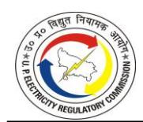

|      |                                                       |               |                |                    |                | FY 202                   | 3-24              |           |           |                |           |
|------|-------------------------------------------------------|---------------|----------------|--------------------|----------------|--------------------------|-------------------|-----------|-----------|----------------|-----------|
| S.No | Source of Power (Station-wise)                        | 11::4: (8411) |                | ial Fixed arges |                | al Energy/ ole charge | Annual Other Cost |           | LPS       | Total Cost     |           |
|      |                                                       | Units (MU)    | (Rs. / kWh) | (Rs. Cr.)          | (Rs. / kWh) | (Rs. Cr.)                | (Rs. / kWh)    | (Rs. Cr.) | (Rs. Cr.) | (Rs. / kWh) | (Rs. Cr.) |
|      | Power Grid Gomti Yamuna Trans. Ltd                    | -             | -              | -                  | -              | 0.00                     | -                 | 31.37     | 0.00      | -              | 31.37     |
|      | UP SLDC Charges                                       | -             | -              | -                  | -              | 0.00                     | -                 | 0.17      | 0.00      | -              | 0.17      |
|      | MPPTCL                                                | -             | -              | -                  | -              | 0.00                     | -                 | -         | 0.00      | -              | -         |
|      | NOAR                                                  | -             | -              | -                  | -              | 0.00                     | -                 | 0.12      | 0.00      | -              | 0.12      |
|      | Sub-total                                             | -             | -              | -                  | -              | 0.00                     | -                 | 5,114.32  | 6.99      | -              | 5,121.31  |
|      |                                                       |               | -              |                    | -              |                          | -                 |           |           | -              |           |
| iii  | Transmission Charges for Competitive Bidding Stations |               |                |                    |                |                          |                   |           |           |                |           |
| a.   | KSK Mahanadi                                          | -             | -              | -                  | -              | 0.00                     | -                 | -         | 0.00      | -              | -         |
| b.   | MB Power                                              | -             | -              | -                  | -              | 0.00                     | -                 | -         | 0.00      | -              | -         |
| C.   | TRN                                                   |               |                |                    |                |                          |                   |           |           |                |           |
| d.   | RKM Power                                             | -             | -              | -                  | -              | -                        | -                 | -         | -         | -              | -         |
|      | Sub-total                                             | -             | -              | -                  | -              | -                        | -                 | -         | -         | -              | -         |
|      | Other Charges                                         |               | -              |                    | -              |                          | -                 | -         | -         | -              | (398.66)  |
| Р    | RRAS                                                  | -             | -              | -                  | -              | -                        | -                 | -         | -         | -              | -         |
|      | Less                                                  | -             | -              | -                  | -              | -                        | -                 | -         | -         | -              |           |
|      | Late Payment Surcharge                                | -             | -              | -                  | -              | -                        | -                 | -         | -         | -              | -         |
|      | Grand Total                                           | 1,41,931.69   | 1.59           | 22,628.99          | 3.01           | 42,703.16                | 0.61              | 8,697.50  | 261.76    | 5.21           | 73,892.75 |

4.5.2. The Petitioners have claimed the Power Purchase Cost for FY 2023-24 based on actuals as per the books of accounts for FY 2023-24, as shown in the Table below:

TABLE 4-23: POWER PURCHASE COST FOR FY 2023-24 AS SUBMITTED BY DVVNL

| Particulars                   | Approved in Tariff Order dated. 24.05.2023 | Claimed   |
|-------------------------------|--------------------------------------------|-----------|
| Allowable Power Purchase (MU) | 25,388.81                                  | 29,628.44 |
| Average Rate (Rs. /kWh)/ DBST | 5.13                                       | 5.29      |
| Power Purchase Cost (Rs. Cr.) | 13,029.11                                  | 15,680.90 |

TABLE 4-24: POWER PURCHASE COST FOR FY 2023-24 AS SUBMITTED BY MVVNL

| Particulars                   | Approved in Tariff Order dated. 24.05.2023 | Claimed   |
|-------------------------------|--------------------------------------------|-----------|
| Allowable Power Purchase (MU) | 27,115.56                                  | 28,313.10 |
| Average Rate (Rs. /kWh)/ DBST | 5.43                                       | 5.48      |
| Power Purchase Cost (Rs. Cr.) | 14,735.36                                  | 15,521.51 |

TABLE 4-25: POWER PURCHASE COST FOR FY 2023-24 AS SUBMITTED BY PVVNL

| Particulars                   | Approved in Tariff Order dated 24.05.2023 | Claimed   |
|-------------------------------|-------------------------------------------|-----------|
| Allowable Power Purchase (MU) | 39,750.48                                 | 39,107.84 |
| Average Rate (Rs. /kWh)/ DBST | 5.68                                      | 5.60      |
| Power Purchase Cost (Rs. Cr.) | 22,568.30                                 | 21,890.05 |

TABLE 4-26: POWER PURCHASE COST FOR FY 2023-24 AS SUBMITTED BY PUVVNL

| Particulars                   | Approved in Tariff Order dated 24.05.2023 | Claimed   |
|-------------------------------|-------------------------------------------|-----------|
| Allowable Power Purchase (MU) | 31,042.68                                 | 32,929.61 |
| Average Rate (Rs. /kWh)/ DBST | 5.40                                      | 4.81      |

| Particulars                   | Approved in Tariff Order dated 24.05.2023 | Claimed   |
|-------------------------------|-------------------------------------------|-----------|
| Power Purchase Cost (Rs. Cr.) | 16,763.39                                 | 15,826.63 |

**TABLE 4-27: POWER PURCHASE COST FOR FY 2023-24 AS SUBMITTED BY KESCO**

| Particulars                   | Approved in Tariff Order dated 24.05.2023 | Claimed  |
|-------------------------------|-------------------------------------------|----------|
| Allowable Power Purchase (MU) | 4,538.17                                  | 4,289.15 |
| Average Rate (Rs. /kWh)/ DBST | 6.19                                      | 6.03     |
| Power Purchase Cost (Rs. Cr.) | 2,808.54                                  | 2,587.12 |

4.5.3. The Petitioners have requested the Commission to allow the Power Purchase quantum and power purchase cost for FY 2023-24 as claimed in the Petition.

#### *Commission's Analysis:*

- 4.5.4. The Commission observes that the total amount of Power Purchase in the Audited Accounts of all the Petitioners combined is Rs. 71,503.65 Cr. The Commission further observes that the gross power purchase by UPPCL is Rs. 73,892.75 Cr.
- 4.5.5. The Commission had directed the Petitioners to make submissions on the difference in power purchase cost in the audited accounts of UPPCL and the consolidated power purchase cost as per the audited accounts of the Petitioners. Based on the submissions made by the Petitioners, the Commission has reconciled the Power Purchase cost claimed by the Petitioners with the Audited Accounts of the Petitioners and UPPCL.

**TABLE 4-28: RECONCILIATION OF POWER PURCHASE COST CLAIMED FOR FY 2023-24 AS PER UPPCL'S BALANCE SHEET (IN RS. CRORE)**

| Particulars               | DVVNL     | MVVNL     | PVVNL     | PuVVNL    | KESCO    | Total     |  |
|---------------------------|-----------|-----------|-----------|-----------|----------|-----------|--|
| Gross Sale of Power to    |           |           |           |           |          |           |  |
| state DISCOMs as per      |           |           |           |           |          |           |  |
| UPPCL's Balance Sheet as  | 15,680.90 | 15,521.51 | 21,889.67 | 15,824.45 | 2,587.12 | 71,503.65 |  |
| on 31.03.2024 (A)         |           |           |           |           |          |           |  |
| Less: Adjustment of sales |           |           |           |           |          |           |  |
| not billed to DISCOMs in  |           | 333.80    |           |           |          |           |  |
| UPPCL Balance sheet (B)   |           |           |           |           |          |           |  |
| Add: Sale of Power by     |           |           |           |           |          |           |  |
| UPPCL on Energy           |           |           | 2,722.90  |           |          | 2,722.90  |  |
| Exchange (C)              |           |           |           |           |          |           |  |
| Net Sale as per UPPCL's   |           |           |           |           |          |           |  |
| Balance Sheet as on       |           |           | 73,892.75 |           |          |           |  |
| 31.03.2024 (D=A-B+C)      |           |           |           |           |          | 73,892.75 |  |

4.5.6. The Commission observes that the Petitioners have made an adjustment to certain

- provisions that are related to the adjustment of sales not billed to DISCOM, i.e. Rs. 333.80 Crore.
- 4.5.7. The Commission further observes that the Petitioners have claimed Late Payment Surcharge (LPS) (towards Generating Stations and Transmission Charges bills) amounting to Rs. 261.76 Crore as part of its Power Purchase Cost for FY 2023-24.
- 4.5.8. Regarding the LPS paid to the Generating Stations and Transmission Licensees, the Commission is of the view that working capital has been provided to the Petitioners for the purpose of bearing the expenses towards Power Purchase Cost and other cost components as per the MYT Regulations, 2019. Therefore, it is not prudent to allow the LPS paid to the Generating Stations and Transmission Licensees as part of the Power Purchase Cost. Accordingly, in line with the approach of the Commission in the previous Tariff Orders, LPS paid to the Generating Stations and Transmission Licensees is disallowed.
- 4.5.9. PuVVNL has reported an expenditure of Rs. 2.18 crore towards power purchase from SBPDCL, as disclosed under Note 21 of its Balance Sheet. However, the Commission, through its Order dated January 31, 2024, in Petition No. 2036 of 2023, has disallowed this power purchase for FY 2023-24. The relevant excerpt from the aforementioned Order is reiterated below for consideration regarding approval for FY 2023-24 and subsequent periods:

#### *Approval For Period FY 2023-24 and onwards*

*"16. The Commission finds that there is a lack of clarity as to whether the connection agreement done by Executive Engineer is on behalf of PuVVNL or the Executive Engineer himself. In case of latter, the agreement needs to be modified to be between the two licensees.*

*17. It is further observed that the rates of Indo-Nepal Power Exchange Committee have been agreed upon for the purchase of power from SSPDCL, which are higher than the tariff rate of Bihar Electricity Regulatory Commission. It is not clear why the existing dispensation has been adopted. Therefore, it would be appropriate if the agreement is made at the tariff rate approved by either of the Commissions i.e. either UPERC or BERC.*

- *18. Considering the above, the Commission decides to reject the prayer for approval of power purchase cost for the period from FY 2016-17 to FY 2022-23. For considering the approval for period for FY 2023-24 and onwards, the Commission directs the Petitioner to make submission regarding the observations made by it in paras 16 & 17 as above."*
- 4.5.10. However, it is observed that no submission has been made by PuVVNL pursuant to the directions issued by the Commission in its Order dated January 31, 2024. In view of the above, the Commission disallows an amount of Rs. 2.18 Crore from SBPDCL out of the total power purchase cost claimed by the Petitioners for FY 2023-24.
- 4.5.11. PVVNL has incurred Rs. 0.38 Crore for the Power Purchase from UHBVNL. The Commission, in its Order in Petition No. 2032 of 2023, dated January 12, 2024, had observed the following:

#### *Approval for period from FY 2023-24 and onwards*

- *"12. The Commission observes the following:*
- *a) Firstly, there is a lack of clarity if the connection agreement done by Executive Engineer is on behalf of PVVNL or the Executive Engineer himself. In case of later, the agreement needs to be modified to be between the two licensees.*
- *b) Regarding the tariff rate at which the Petitioner is being billed by UHBVNL, the Petitioner had submitted in the hearing that they are being charged at tariff rate approved by Hon'ble Haryana Electricity Regulatory Commission. 13. Considering the above, the Commission decides to reject the prayer for approval of power purchase cost for the period from FY 2016-17 to FY 2022- 23. For the period from FY 2023-24 and onwards, the Commission approves the same and directs the Petitioner to comply to Point 12(a) and intimate the Commission."*
- 4.5.12. The Commission had directed the Petitioner to intimate the Commission regarding the execution of the connection agreement to be carried out by the Executive Engineer on behalf of PVVNL. In compliance, the Director (Commercial), PVVNL, vide letter dated January 17, 2025, intimated the Commission in this regard. Hence, the Commission

- allows an amount of Rs. 0.38 Crore from UHBVNL out of the total power purchase cost claimed by the Petitioners for FY 2023-24.
- 4.5.13. Further, the power purchase requirement is determined by first considering the mustrun status plants. The Power Purchase Cost of the must-run generating stations has been allowed as per the actuals. For the remaining generating stations, capacity charges as per actuals have been allowed. Further, in UPERC (Merit Order Despatch and Optimization of Power Purchase Regulations, 2021), principles to be followed by distribution companies for Merit Order Dispatch have been provided. As per the submissions made by the Petitioners, these principles have been followed. Accordingly, the energy charges that are allowed are determined by multiplying the actual per unit energy charges by the quantum computed by the Commission. Accordingly, the BST approved by the Commission for FY 2023-24 is as follows:

**TABLE 4-29: APPROVED BULK SUPPLY TARIFF FOR FY 2023-24**

| Particular                                                                                                                 | Derivation | Approved in Tariff Order dated May 24, 2023 | Claimed     | Approved    |
|----------------------------------------------------------------------------------------------------------------------------|------------|---------------------------------------------------------|-------------|-------------|
| Power Purchase Required & Billed Energy (MU) (Ex Bus)                                                                   | A          | 1,33,447.89                                             | 1,41,931.68 | 1,40,580.13 |
| Purchase from Inter-State Source (MU)                                                                                      | B          | 39,154.67                                               | 50,851.55   | 49,797.41   |
| Interstate Transmission Loss (%)                                                                                           | C          | 3.47%                                                   | 6.29%       | 6.29%       |
| Energy Available at State periphery from Inter-State Source (MU)                                                        | D=B*(1-C)  | 37,796.01                                               | 47,655.33   | 46,667.44   |
| Energy Available at State periphery from Intra-State Source (MU)                                                        | E          | 94,293.21                                               | 91,080.13   | 90,782.72   |
| Net Energy Available at State periphery for Transmission (MU)                                                           | F=D+E      | 1,32,089.22                                             | 1,38,735.46 | 1,37,450.16 |
| Intra -State Transmission losses %                                                                                         | G          | 3.22%                                                   | 3.22%       | 3.22%       |
| Net Energy Input at Discoms end i.e. Transmission-Distribution Interface for Retail Sales (MU)                       | H=F*(1-G)  | 1,27,835.95                                             | 1,34,268.18 | 1,33,024.27 |
| Power Purchase Cost (Rs. Cr.)                                                                                              | I          | 65,192.24                                               | 66,130.13   | 65,386.35   |
| Total transmission charges excluding intra state transmission charges (Rs. Crore) (J=J1+J2+J3+J4+J5+J6+J7+J8+J9+J10) | J          | 4,712.46                                                | 5,114.32    | 5,114.32    |
| PGCIL / POSOCO Charges                                                                                                     | J1         | 2,979.44                                                | 3,830.95    | 3,830.95    |
| UPPTCL Charges                                                                                                             | J2         |                                                         | (1.66)      | (1.66)      |
| WUPPTCL Charges                                                                                                            | J3         | 867.19                                                  | 862.16      | 862.16      |
| SEUPPTCL Charges                                                                                                           | J4         | 310.09                                                  | 253.78      | 253.78      |
| OBRA BADAUN TRANSMISSION LTD.                                                                                              | J5         |                                                         | 78.72       | 78.72       |

| Particular                                                   | Derivation             | Approved in Tariff Order dated May 24, 2023 | Claimed   | Approved  |
|--------------------------------------------------------------|------------------------|---------------------------------------------------------|-----------|-----------|
| Power Grid Transmission Ltd                                  | J6                     |                                                         | 33.06     | 33.06     |
| Ghatampur Transmission Ltd                                   | J7                     |                                                         | (38.32)   | (38.32)   |
| Power Grid Rampur Sambhal Trans. (PRSTL)                     | J8                     |                                                         | 63.96     | 63.96     |
| Power Grid Gomti Yamuna Trans. Ltd                           | J9                     |                                                         | 31.37     | 31.37     |
| UP SLDC Charges +NOAR                                        | J10                    |                                                         | 0.29      | 0.29      |
| Other Charges (Rs. Crore)                                    | K                      | -                                                       | 261.76    | -         |
| Total Power Procurement Cost (Rs. Crore)                     | L=I+J+K                | 69,904.70                                               | 71,506.21 | 70,500.67 |
| APPC (excluding Transmission Charges) (Ex Bus) (Rs./Unit) | M=I/A*10               | 4.89                                                    | 4.66      | 4.65      |
| Bulk Supply Tariff (BST) (Rs./Unit)                          | O=(L/H)*10             | 5.47                                                    | 5.33      | 5.30      |
| BST excluding WUPPTCL & SEUPPTCL Charges (Rs. /Unit)      | P=((L-J2- J3)/H)*10 | 5.38                                                    | 5.26      | 5.24      |

\* For A to G, refer Commission Approved Energy Balance for FY 2023-24.

4.5.14. The Average Power Purchase Cost (APPC) from different sources, excluding Transmission Charges as shown below:

**TABLE 4-30: APPROVED AVERAGE POWER PURCHASE COST FOR FY 2023-24**

| Sources                                            | APPC Ex-bus (Rs. /kWh) |
|----------------------------------------------------|------------------------|
| Non-RE (inc. Large Hydro & Nuclear)                | 4.76                   |
| RE (exc. Large Hydro & Nuclear)                    | 3.56                   |
| RE Solar                                           | 4.00                   |
| RE Non-Solar (incl. Small Hydro & Co-Gen/ Captive) | 3.24                   |
| All Sources                                        | 4.65                   |

- 4.5.15. The Commission, vide its various Orders, had directed the Petitioners to pursue GoUP for the allocation of PPAs to Discoms. Further, the Commission, vide Order dated December 13, 2018, in the matter of "Suo-Moto Proceedings on Allocation of Power Purchase Agreement among Discoms in Uttar Pradesh", approved the Differential Bulk Supply Tariff (DBST) mechanism wherein the Commission approves different BST for each Discoms. The Commission found that there was a difference in the power purchase cost of DISCOMs determined based on the DBST methodology approved by the Commission and the power purchase cost in the audited accounts. The matter was discussed in the TVS, and submissions were made by UPPCL.
- 4.5.16. As per the submissions made by UPPCL, the power purchase cost is allocated based on the revenue potential of DISCOMs, whereas, as per the methodology approved by

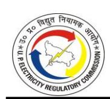

the Commission, all the cost elements are taken into consideration. It was found that in the methodology adopted by the Petitioners, the allocated PPAs were not assigned to the DISCOMs to which they are allocated and were made part of the power purchase pool. The Commission, therefore, approves the proposal submitted by the Petitioners during the Technical Validation Session (TVS), subject to the modification that the cost of allocated PPAs shall first be adjusted against the respective DISCOMs, and the balance power purchase cost shall thereafter be apportioned in proportion to the revenue potential of each DISCOM.

4.5.17. Based on submissions provided by the Petitioners, the Commission has calculated the energy input received at the Discom periphery from allocated plants. The table showing the allocation matrix and plant-wise allocated energy at DISCOM periphery received for FY 2023-24 is given below:

**TABLE 4-31: PLANT-WISE ALLOCATION MATRIX FOR FY 2023-24**

| Name of Plants                 | DVVNL  | MVVNL  | PVVNL  | PuVVNL | KESCO | Total |
|--------------------------------|--------|--------|--------|--------|-------|-------|
| ANPARA C (LANCO)               | 21.67% | 21.67% | 35.00% | 21.67% | -     | 100%  |
| TRN ENERGY                     | 21.67% | 21.67% | 35.00% | 21.67% | -     | 100%  |
| RKM POWER GEN                  | 21.67% | 21.67% | 35.00% | 21.67% | -     | 100%  |
| MB POWER                       | 21.67% | 21.67% | 35.00% | 21.67% | -     | 100%  |
| KSK MAHANADI                   | 21.67% | 21.67% | 35.00% | 21.67% | -     | 100%  |
| PRAYAGRAJ                      | 15.00% | 20.00% | 40.00% | 20.00% | 5.00% | 100%  |
| SASAN                          | 20.00% | 10.00% | 60.00% | 10.00% | -     | 100%  |
| HYDRO (COMPETITIVE BIDDING) | 0.00%  | 0.00%  | 0.00%  | 0.00%  | -     | 0%    |

**TABLE 4-32: ALLOCATED PLANT-WISE ENERGY RECEIVED AT DISCOM PERIPHERY FOR FY 2023-24 (IN MUs)**

| Name of Plants     | DVVNL    | MVVNL    | PVVNL     | PuVVNL   | KESCO  | Total     |
|--------------------|----------|----------|-----------|----------|--------|-----------|
| ANPARA C (LANCO)   | 1,466.65 | 1,466.65 | 2,369.20  | 1,466.65 | -      | 6,769.14  |
| TRN ENERGY (PTC)   | 585.71   | 585.71   | 946.15    | 585.71   | -      | 2,703.30  |
| R.K.M. POWER       | 529.57   | 529.57   | 855.46    | 529.57   | -      | 2,444.18  |
| M.B. POWER (PTC)   | 466.83   | 466.83   | 754.11    | 466.83   | -      | 2,154.60  |
| KSK MAHANADI       | 1,098.27 | 1,098.27 | 1,774.13  | 1,098.27 | -      | 5,068.95  |
| PRAYAGRAJ POWER    | 1,599.27 | 2,132.35 | 4,264.71  | 2,132.35 | 533.09 | 10,661.77 |
| SASAN              | 668.76   | 334.38   | 2,006.27  | 334.38   | -      | 3,343.78  |
| HYDRO (COMPETITIVE |          |          |           |          |        |           |
| BIDDING)           | -        | -        | -         | -        | -      | -         |
| Total              | 6,415.06 | 6,613.77 | 12,970.04 | 6,613.77 | 533.09 | 33,145.74 |

**TABLE 4-33: ALLOCATED PLANT-WISE POWER PROCUREMENT COST AT DISCOM PERIPHERY FOR FY 2023-24 (IN RS. CRORE)**

| Name of Plants                 | DVVNL    | MVVNL    | PVVNL    | PuVVNL   | KESCO  | Total     |
|--------------------------------|----------|----------|----------|----------|--------|-----------|
| ANPARA C (LANCO)               | 496.28   | 496.28   | 801.68   | 496.28   | -      | 2,290.52  |
| TRN ENERGY (PTC)               | 230.43   | 230.43   | 372.23   | 230.43   | -      | 1,063.50  |
| R.K.M. POWER                   | 272.44   | 272.44   | 440.10   | 272.44   | -      | 1,257.43  |
| M.B. POWER (PTC)               | 319.51   | 319.51   | 516.13   | 319.51   | -      | 1,474.65  |
| KSK MAHANADI                   | 791.95   | 791.95   | 1,279.31 | 791.95   | -      | 3,655.16  |
| PRAYAGRAJ POWER                | 597.06   | 796.07   | 1,592.15 | 796.07   | 199.02 | 3,980.37  |
| SASAN                          | 99.71    | 49.85    | 299.12   | 49.85    | -      | 498.53    |
| HYDRO (COMPETITIVE BIDDING) | -        | -        | -        | -        | -      | -         |
| Total                          | 2,807.37 | 2,956.54 | 5,300.71 | 2,956.54 | 199.02 | 14,220.17 |

4.5.18. Based on the methodology above, the Commission has approved DBST for FY 2023-24 for allocation of Power Purchase Cost amongst the Petitioners, as shown in the Table below:

**TABLE 4-34: APPROVED DIFFERENTIAL BULK SUPPLY TARIFF FOR FY 2023-24**

| SN | Particulars                                                                         | Formulae                                | DVVNL     | MVVNL     | PVVNL     | PuVVNL    | KESCO    | Total       |
|----|-------------------------------------------------------------------------------------|-----------------------------------------|-----------|-----------|-----------|-----------|----------|-------------|
| 1  | Revenue from Tariff including subsidy (Rs. Cr.)                                  | A                                       | 18,004.27 | 18,704.33 | 27,191.77 | 19,206.48 | 3,222.52 | 86,329.38   |
| 2  | Energy Sales (MU)                                                                   | B                                       | 24,166.02 | 24,077.49 | 34,132.91 | 27,223.53 | 3,877.51 | 1,13,477.46 |
| 3  | ABR (Rs/ kWh)                                                                       | C=(A/B)*10                              | 7.45      | 7.77      | 7.97      | 7.06      | 8.31     |             |
| 4  | Total Power input at Discom Periphery (MU)                                       | D                                       | 29,150.81 | 28,313.14 | 39,107.84 | 32,240.08 | 4,212.39 | 1,33,024.27 |
| 4A | Input at Discom Periphery allocated PPAs (MU)                                    | E                                       | 6,415.06  | 6,613.77  | 12,970.04 | 6,613.77  | 533.09   | 33,145.74   |
| 4B | Input at Discom Periphery unallocated PPAs (MU)                                  | F = D-E                                 | 22,735.75 | 21,699.37 | 26,137.80 | 25,626.31 | 3,679.30 | 99,878.53   |
| 5  | Weighted average ABR on unallocated power input at DISCOM periphery (Rs./kWh) | G=sum product (C,F)/Total of F |           |           |           |           |          | 7.58        |
| 6  | Total Power Procurement Cost (Excl. Intra-State Tx. Charges) (Rs. Cr.)        | H                                       |           |           |           |           |          | 70,500.67   |
| 7  | Power Procurement cost of Allocated PPAs (Rs. Cr.)                               | I                                       | 2807.37   | 2956.54   | 5300.71   | 2956.54   | 199.02   | 14,220.17   |
| 8  | Total Power Purchase cost for unallocated PPAs (Rs. Cr.)                         | J=H-I                                   |           |           |           |           |          | 56,280.50   |
| 9  | APPC of unallocated PPAs (Rs./kWh)                                               | K=J/F*10                                |           |           |           |           |          | 5.63        |
| 10 | DBST of unallocated PPAs (Rs./kWh)                                               | L=C/G*K                                 | 5.53      | 5.77      | 5.92      | 5.24      | 6.17     |             |
| 11 | Total Power Purchase cost of unallocated PPAs (Rs. Cr.)                          | M=F*L/10                                | 12,584.13 | 12,523.38 | 15,469.52 | 13,431.77 | 2,271.70 | 56,280.50   |
| 12 | Total Power Purchase cost allocated (Rs. Cr.)                                    | N=M+I                                   | 15,391.50 | 15,479.92 | 20,770.23 | 16,388.30 | 2,470.72 | 70,500.67   |
| 13 | DBST (Rs/kWh)                                                                       |                                         |           |           |           |           |          |             |

| SN | Particulars                                       | Formulae | DVVNL | MVVNL | PVVNL | PuVVNL | KESCO | Total |
|----|---------------------------------------------------|----------|-------|-------|-------|--------|-------|-------|
| 14 | DBST Computation of Allocated PPAs (Rs./kWh)   | O=I/E*10 | 4.38  | 4.47  | 4.09  | 4.47   | 3.73  |       |
| 15 | DBST Computation of Unallocated PPAs (Rs./kWh) | P=C/G*K  | 5.53  | 5.77  | 5.92  | 5.24   | 6.17  |       |
| 16 | DBST of total PPAs (Rs./kWh)                      | Q=N/D*10 | 5.28  | 5.47  | 5.31  | 5.08   | 5.87  | 5.30  |

**TABLE 4-35: APPROVED ALLOWABLE POWER PURCHASE COST BASED ON DBST (RS/KWH) FOR FY 2023-24**

| Particulars                                                                         | Unit        | Formul ae | DVVNL     | MVVNL     | PVVNL     | PuVVNL    | KESCO    | Consolidated |
|-------------------------------------------------------------------------------------|-------------|--------------|-----------|-----------|-----------|-----------|----------|--------------|
| Power Purchase Required at DISCOM periphery as per approved energy balance | MU          | A            | 29,150.81 | 28,313.14 | 39,107.84 | 32,240.08 | 4,212.39 | 1,33,024.27  |
| Differential Bulk Supply Tariff (DBST)                                           | Rs./ kWh | B            | 5.28      | 5.47      | 5.31      | 5.08      | 5.87     | 5.30         |
| Allowable Power Purchase Cost                                                    | Rs. Cr.  | C=A*B        | 15,391.50 | 15,479.92 | 20,770.23 | 16,388.30 | 2,470.72 | 70,500.67    |

- 4.5.19. As outlined in the section on Billing Determinants, the Petitioners have reported sales for unmetered consumer categories in excess of the normative benchmarks approved by the Commission for which no explanation could be provided by the Petitioners.
- 4.5.20. Consequently, the Commission has disallowed the excess sales over and above the norms specified by the Commission at the variable charge rate calculated at DISCOM periphery, as reflected in the table below:

**TABLE 4-36: DISALLOWANCE IN PPC FOR FY 2023-24 (In RS. CRORE)**

| Particulars                                                                   | Unit         | DVVNL  | MVVNL  | PVVNL    | PuVVNL | KESCO | Consolidated |
|-------------------------------------------------------------------------------|--------------|--------|--------|----------|--------|-------|--------------|
| Excess Sales booked under unmetered categories                             | MU           | 0.00   | 65.16  | 1,473.60 | 0.00   | 0.00  | 1,538.76     |
| Distribution Loss                                                             | %            | 17.10% | 14.96% | 12.72%   | 15.56% | 7.95% |              |
| Excess energy at the Discom periphery                                      | MU           | 0.00   | 76.62  | 1,688.38 | 0.00   | 0.00  | 1,765.00     |
| Approved Variable Charges at DISCOM periphery                              | Rs. /kWh  | 2.81   | 2.81   | 2.81     | 2.81   | 2.81  | 2.81         |
| Disallowance in PPC due to excess sales booking in unmetered categories | Rs. Crore | 0.00   | 21.57  | 475.27   | 0.00   | 0.00  | 496.84       |

4.5.21. Based on the above, the total Power Purchase Cost approved by the Commission for FY 2023-24 is as follows:

**TABLE 4-37: CONSOLIDATED APPROVED POWER PURCHASE COST FOR FY 2023-24 (IN RS. CRORE)**

| Particular                                                      | Consolidated |
|-----------------------------------------------------------------|--------------|
| Total Power Procurement Cost                                    | 70,500.67    |
| Disallowance due to excess sales (in unmetered) w.r.t normative | 496.84       |
| Disallowance due to Power Purchase w.r.t SBPDCL                 | 2.18         |
| Net Power Purchase Cost approved                                | 70,001.65    |

### **Renewable Purchase Obligation (RPO)**

4.5.22. The Commission has notified UPERC (Promotion of Green Energy through Renewable Purchase Obligation) (First Amendment) Regulations, 2019 (UPERC RPO Regulations), dated August 16, 2019. The long-term trajectory of the minimum quantum of purchase of renewable power from various renewable sources from FY 2019-20 to FY 2023-24 as set by the Commission is shown in the Table below:

**TABLE 4-38: ACTUAL RPO TRAJECTORY AS PER UPERC RPO REGULATIONS (%)**

| Minimum quantum of purchase from renewable energy sources as a percentage of total energy consumed (in kWh) |                 |        |       |       |  |  |
|----------------------------------------------------------------------------------------------------------------|-----------------|--------|-------|-------|--|--|
|                                                                                                                | Non-Solar       |        |       |       |  |  |
| Financial Year                                                                                                 | Other Non-Solar | HPO    | Solar | Total |  |  |
|                                                                                                                | A               | B C |       |       |  |  |
| 2019-20                                                                                                        | 5               | 1      | 2     | 8     |  |  |
| 2020-21                                                                                                        | 6               | 2      | 3     | 11    |  |  |
| 2021-22                                                                                                        | 6               | 3      | 4     | 13    |  |  |
| 2022-23                                                                                                        | 6               | 3      | 5     | 14    |  |  |
| 2023-24                                                                                                        | 7               | 3      | 5     | 15    |  |  |

4.5.23. In response to the Commission's query regarding RPO compliance for FY 2023-24, the Petitioners have submitted RPO details as shown in the Table below:

**TABLE 4-39: RPO COMPLIANCE FOR FY 2023-24 AS SUBMITTED BY THE PETITIONERS**

| S. No. | Particular                                    | Reference | FY 2023-24   |
|--------|-----------------------------------------------|-----------|--------------|
|        |                                               |           | Quantum (MU) |
|        | Energy Consumption (Sales) (Excluding Inter   |           |              |
| 1      | State sales)                                  | A         | 1,38,735     |
| 2      | Distribution Loss (%)                         | X         | 15.48%       |
| 3      | Energy Consumption at Discom Periphery        | B=A/(1-X) | 1,64,154     |
|        | Hydro Purchase during the year (Large Hydro   |           |              |
| 4      | excluding Hydro purchase considered under HPO | C         | 11,637       |
|        | i.e., before March 08, 2019)                  |           |              |
| 4.1    | Hydro Purchase from Inter-State Sources (MU)  | C1        | 8,399        |
| 4.2    | Hydro Purchase from intra-State Sources (MU)  | C2        | 3,237        |

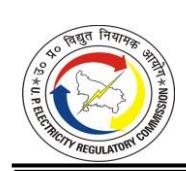

|        |                                                |                    | FY 2023-24   |
|--------|------------------------------------------------|--------------------|--------------|
| S. No. | Particular                                     | Reference          | Quantum (MU) |
| 4.3    | Hydro Purchased at State Periphery (MU)        | D=(C1*(1-T1)) +C2  | 11,637       |
| 4.4    | Hydro Purchase at Distribution Periphery (MU)  | E=D*(1-T2)         | 11,262       |
| 5      | Net Power Sale for RPO computation             | F=B-E              | 1,52,892     |
|        |                                                |                    |              |
| 5.1    | Total Obligation for the year (%)              |                    |              |
| 5.2    | Solar (%)                                      | G                  | 5.00%        |
| 5.3    | Non-Solar (%)                                  | H                  | 7.00%        |
| 5.4    | HPO obligation for the year (%)                | I                  | 3.00%        |
|        |                                                |                    |              |
|        | Total RPO Fulfilled during the year- Solar     |                    |              |
| 6      | Total Obligation for the year (MU)             | J1=F*G             | 7,645        |
| 6.1    | Purchase (MU)                                  | K                  | 5,510        |
| 6.2    | Purchase from sources at Inter-State Bus (MU)  | K1                 | 3,054        |
| 6.3    | Purchase from sources at Intrastate Bus (MU)   | K2                 | 2,456        |
| 6.4    | Purchase from sources at DISCOM Bus (MU)*      | K3                 |              |
| 6.5    | Purchased at State Periphery (MU)              | L1=(K1*(1-T1)) +K2 | 5,318        |
| 6.6    | Purchase at Distribution Periphery (MU)        | M1=L1*(1-T2) +K3   | 5,147        |
| 6.7    | Balance Obligation (MUs)                       | N1=J1-M1           | 2,497        |
|        |                                                |                    |              |
|        | Total RPO Fulfilled during the year- Non-Solar |                    |              |
| 7      | Total Obligation for the year (MU)             | J2=F*H             | 10,702       |
| 7.1    | Purchase (MU)                                  | K                  | 7,720        |
| 7.2    | Purchase from sources at Inter-State Bus (MU)  | K4                 | 4,457        |
| 7.3    | Purchase from sources at Intrastate Bus (MU)   | K5                 | 3,263        |
| 7.4    | Purchase from sources at DISCOM Bus (MU)       | K6                 |              |
| 7.5    | Purchased at State Periphery (MU)              | L2=(K4*(1-T1)) +K5 | 7,440        |
| 7.6    | Purchase at Distribution Periphery (MU)        | M2=L2*(1-T2) +K6   | 7,200        |
| 7.7    | Balance Obligation (MUs)                       | N2=J2-M2           | 3,502        |
|        |                                                |                    |              |
|        | Total RPO Fulfilled during the year- HPO       |                    |              |
| 8      | Total Obligation for the year (MU)             | J3=F*I             | 4,587        |
| 8.1    | Purchase (MU)                                  | K                  |              |
| 8.2    | Purchase from sources at Inter-State Bus (MU)  | K5                 | 500          |
| 8.3    | Purchase from sources at Intrastate Bus (MU)   | K6                 |              |
| 8.4    | Purchase from sources at DISCOM Bus (MU)       | K7                 |              |
| 8.5    | Purchased at State Periphery (MU)              | L3=(K5*(1-T1)) +K6 | 469          |
| 8.6    | Purchase at Distribution Periphery (MU)        | M3=L3*(1-T2) +K7   | 454          |
| 8.7    | Balance Obligation (MUs)                       | N3=J3-M3           | 4,133        |

4.5.24. The Commission has analyzed the RPO compliance for FY 2023-24 as submitted by the Petitioners. Accordingly, the Commission has determined the RPO based on the approved energy sales and power purchase in this Order, as shown in the Table below:

#### **TABLE 4-40: RPO COMPLIANCE FOR FY 2023-24 AS APPROVED BY COMMISSION**

| Particulars                     | Reference | FY 2025-26 |
|---------------------------------|-----------|------------|
| Inter-State Transmission Losses | T1        | 6.29%      |
| Intra-State Transmission Losses | T2        | 3.22%      |

|        |                                                                                                                              |                   | FY 2023-24   |
|--------|------------------------------------------------------------------------------------------------------------------------------|-------------------|--------------|
| S. No. | Particular                                                                                                                   | Reference         | Quantum (MU) |
| 1      | Energy Consumption (Sales) (Excluding Inter-State sales)                                                                  | A                 | 1,13,477.46  |
| 2      | Distribution Loss (%)                                                                                                        | X                 | 14.69%       |
| 3      | Energy Consumption at Discom Periphery                                                                                       | B=A/(1-X)         | 1,33,024.27  |
| 4      | Hydro Purchase during the year (Large Hydro excluding Hydro purchase considered under HPO i.e., before March 08, 2019) | C                 | 11,636.86    |
| 4.1    | Hydro Purchase from Inter-State Sources (MU)                                                                                 | C1                | 8,399.46     |
| 4.2    | Hydro Purchase from intra-State Sources (MU)                                                                                 | C2                | 3,237.40     |
| 4.3    | Hydro Purchased at State Periphery (MU)                                                                                      | D=(C1*(1-T1))+C2  | 11,108.92    |
| 4.4    | Hydro Purchase at Distribution Periphery (MU)                                                                                | E=D*(1-T2)        | 10,751.22    |
| 5      | Net Power Sale for RPO computation                                                                                           | F=B-E             | 1,22,273.05  |
| 5.1    | Total Obligation for the year (%)                                                                                            |                   |              |
| 5.2    | Solar (%)                                                                                                                    | G                 | 5.00%        |
| 5.3    | Non Solar (%)                                                                                                                | H                 | 7.00%        |
| 5.4    | HPO obligation for the year (%)                                                                                              | I                 | 3.00%        |
|        | Total RPO Fulfilled during the year- Solar                                                                                   |                   |              |
| 6      | Total Obligation for the year(MU)                                                                                            | J1=F*G            | 6,113.65     |
| 6.1    | Purchase (MU)                                                                                                                | K                 | 5,510.33     |
| 6.2    | Purchase from sources at Inter-State Bus (MU)                                                                                | K1                | 3,054.03     |
| 6.3    | Purchase from sources at Intrastate Bus (MU)                                                                                 | K2                | 2,456.30     |
| 6.4    | Purchase from sources at DISCOM Bus (MU)*                                                                                    | K3                | 0.00         |
| 6.5    | Purchased at State Periphery (MU)                                                                                            | L1=(K1*(1-T1))+K2 | 5,318.37     |
| 6.6    | Purchase at Distribution Periphery (MU)                                                                                      | M1=L1*(1-T2)+K3   | 5,147.12     |
| 6.7    | Balance Obligation (MUs)                                                                                                     | N1=J1-M1          | 966.53       |
|        | Total RPO Fulfilled during the year- Non-Solar                                                                               |                   |              |
| 7      | Total Obligation for the year(MU)                                                                                            | J2=F*H            | 8,559.11     |
| 7.1    | Purchase (MU)                                                                                                                | K                 | 7,720.21     |
| 7.2    | Purchase from sources at Inter-State Bus (MU)                                                                                | K4                | 4,457.47     |
| 7.3    | Purchase from sources at Intrastate Bus (MU)                                                                                 | K5                | 3,262.74     |
| 7.4    | Purchase from sources at DISCOM Bus (MU)                                                                                     | K6                | 0.00         |
| 7.5    | Purchased at State Periphery (MU)                                                                                            | L2=(K4*(1-T1))+K5 | 7,440.04     |
| 7.6    | Purchase at Distribution Periphery (MU)                                                                                      | M2=L2*(1-T2)+K6   | 7,200.47     |
| 7.7    | Balance Obligation (MUs)                                                                                                     | N2=J2-M2          | 1,358.64     |
|        | Total RPO Fulfilled during the year- HPO                                                                                     |                   |              |
| 8      | Total Obligation for the year(MU)                                                                                            | J3=F*I            | 3,668.19     |
| 8.1    | Purchase (MU)                                                                                                                | K                 | 500.27       |
| 8.2    | Purchase from sources at Inter-State Bus (MU)                                                                                | K5                | 500.27       |
| 8.3    | Purchase from sources at Intrastate Bus (MU)                                                                                 | K6                | 0.00         |
| 8.4    | Purchase from sources at DISCOM Bus (MU)                                                                                     | K7                | 0.00         |
| 8.5    | Purchased at State Periphery (MU)                                                                                            | L3=(K5*(1-T1))+K6 | 468.83       |
| 8.6    | Purchase at Distribution Periphery (MU)                                                                                      | M3=L3*(1-T2)+K7   | 453.73       |
| 8.7    | Balance Obligation (MUs)                                                                                                     | N3=J3-M3          | 3,214.46     |

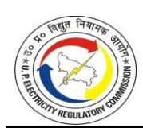

- 4.5.25. There is a huge RPO backlog pending from previous years as well. It shows a lack of seriousness on the part of the Petitioners regarding RPO implementation. The Commission has dealt with the issue in detail in the ARR Chapter.
- 4.5.26. The Commission directs the Petitioner to comply with RPO targets as set by the Commission from time to time through the purchase of power from Renewable Energy sources or Certificates and make submissions in their Tariff Petitions.

#### **4.6. INTRA-STATE TRANSMISSION CHARGES**

#### *Petitioners' Submission:*

4.6.1. The Petitioners have claimed actual Intra-State Transmission charges (including SLDC Charges) based on the Audited Accounts for FY 2023-24 as shown in the Table below:

**TABLE 4-41: INTRA-STATE TRANSMISSION CHARGES FOR FY 2023-24 AS SUBMITTED BY THE PETITIONERS**

| Particulars | Approved in Tariff Order dated May 24, 2023                                          |                                       | Claimed for FY 2023-24                                                                  |                                       |
|-------------|-----------------------------------------------------------------------------------------|---------------------------------------|-----------------------------------------------------------------------------------------|---------------------------------------|
| DISCOM      | Units Wheeled (Energy Input into Transmission Distribution Interface) (MUs) | Transmission Charges (Rs Crore) | Units Wheeled (Energy Input into Transmission Distribution Interface) (MUs) | Transmission Charges (Rs Crore) |
| DVVNL       | 25,388.81                                                                               | 670.52                                | 29,628.44                                                                               | 774.46                                |
| MVVNL       | 27,115.56                                                                               | 716.12                                | 28,313.14                                                                               | 739.27                                |
| PVVNL       | 39,750.48                                                                               | 1,049.81                              | 39,107.84                                                                               | 1,021.14                              |
| PuVVNL      | 31,042.68                                                                               | 819.84                                | 32,929.61                                                                               | 860.13                                |
| KESCO       | 4,538.17                                                                                | 119.86                                | 4,289.15                                                                                | 111.95                                |

#### *Commission's Analysis:*

4.6.2. The Commission has approved Intra-State Transmission charges for FY 2023-24, considering the allowable energy of respective Discoms. The Intra-State Transmission charges claimed by the Petitioners and approved by the Commission are shown in the Table below:

|             | Approved in Tariff Order Claimed dated May 24, 2023 |                                        |                           |                                         |                           |                                       |                                        |
|-------------|-----------------------------------------------------------|----------------------------------------|---------------------------|-----------------------------------------|---------------------------|---------------------------------------|----------------------------------------|
| Particulars | Units Wheeled (MUs)                                 | Transmission Charges (Rs. Crore) | Units Wheeled (MUs) | Transmission Charges* (Rs. Crore) | Units Wheeled (MUs) | Per Unit Charges** (Rs. / Unit) | Transmission Charges (Rs. Crore) |
| DVVNL       | 25,388.81                                                 | 670.52                                 | 29,628.44                 | 774.46                                  | 29,150.81                 | 0.2612                                | 761.39                                 |
| MVVNL       | 27,115.55                                                 | 716.12                                 | 28,313.14                 | 739.27                                  | 28,313.14                 | 0.2612                                | 739.51                                 |
| PVVNL       | 39,750.48                                                 | 1,049.81                               | 39,107.84                 | 1,021.14                                | 39,107.84                 | 0.2612                                | 1,021.46                               |
| PuVVNL      | 31,042.68                                                 | 819.84                                 | 32,929.61                 | 860.13                                  | 32,240.08                 | 0.2612                                | 842.08                                 |
| KESCO       | 4,538.42                                                  | 119.86                                 | 4,289.15                  | 111.95                                  | 4,212.39                  | 0.2612                                | 110.02                                 |

**Total 1,27,835.95 3,376.15 1,34,268.18 3,506.95 1,33,024.27 0.2612 3,474.46**

**TABLE 4-42: APPROVED INTRA-STATE TRANSMISSION CHARGES FOR FY 2023-24**

#### **4.7. OPERATION AND MAINTENANCE EXPENSES**

### *Petitioners' Submission:*

- 4.7.1. The Petitioners have submitted that the Operation & Maintenance (O&M) Expenses comprise of Employee Expenses, Repair & Maintenance (R&M) Expenses and Administrative & General (A&G) Expenses. Regulation 45 of the MYT Regulations, 2019 stipulates the methodology for the determination of O&M Expenses from FY 2020-21 to FY 2024-25.
- 4.7.2. The Petitioners have submitted that the Commission had disallowed the O&M expenses claimed by the Petitioners in the Tariff Order dated May 24, 2023, for ARR of FY 2023-24. The O&M expenses being allowed by the Commission are insufficient to cover the actual cost/ impact of O&M expenses incurred by the Petitioner.
- 4.7.3. The Petitioners have further submitted that the Commission has arrived at the midyear (FY 2016-17) value of each component of O&M expenses based on the average of the last 5 years' trued-up values of FY 2014-15 to FY 2018-19. The mid-year value of each component of O&M expenses has been escalated year on year, with the escalation factor considering Consumer Price Index (CPI) and Wholesale Price Index (WPI) of respective years in the ratio 60:40, for subsequent years up to FY 2019-20.
- 4.7.4. Accordingly, the Commission has computed the O&M expenses of the base year, which is escalated at the Inflation/Escalation rate notified by the Labour Bureau, Govt. of India [\(http://labourbureau.gov.in/LBO\\_indexes.htm\)](http://labourbureau.gov.in/LBO_indexes.htm) and Economic Advisor, Govt.

*\*As submitted by the Petitioners based on the Audited Accounts.*

*\*\*Per Unit Intra-state charges are back-calculated from claimed figures.*

- of India [\(https://eaindustry.nic.in/\)](https://eaindustry.nic.in/) respectively for different years. In view of the above, the Commission has computed the average WPI and CPI inflation of the last 3 years (average) at 2.42% and 6.00%, respectively.
- 4.7.5. In terms of this methodology, Employee Expenses for FY 2023-24 have been computed by escalating the base year (FY 2019-20) employee expenses by the average CPI inflation of the last 3 years. The A&G Expenses (including Finance Charges) and R&M Expenses for FY 2023-24 have been computed by escalating the base year (FY 2019- 20) by the average WPI inflation of the last 3 years.
- 4.7.6. The Petitioners have submitted that the O&M expenses are computed on a normative basis in terms of the norms prescribed under the Tariff Regulations. The methodology prescribed by the Commission for the computation of normative O&M expenses is significantly different in MYT Regulations, 2019, as compared to the methodology provided under the erstwhile regime, i.e., MYT Regulations, 2014. Under the MYT Regulations 2014, computation of O&M expenses was based on the trajectory of norms derived from the average of the past five years' audited figures. The draft MYT Regulations, 2019, issued by the Commission also had similar provisions for the computation of O&M expenses. However, in the final MYT Regulations 2019, the Commission completely changed the methodology and adopted a completely new methodology for computing the O&M expenses, which is based on an escalation factor considering CPI and WPI based on the average of the last 5 years' trued-up values (that too without consideration of efficiency gain/ losses on O&M expenses). Such a change was effected without giving any opportunity to the stakeholders, including the Petitioner, to submit their suggestions/ objections on the same. This new approach adopted by the Commission will result in substantial loss to the Petitioner, and it is likely that the Petitioner will not be able to meet its regular expenses, including employee costs, R&M expenses and A&G expenses.
- 4.7.7. The Petitioners have submitted that owing to the implementation of the Government's Saubhagya Scheme in the last three financial years (i.e., FY 2017-18 onwards), Petitioners have added a significant consumer base, leading to an increase in load, extension of LT Network and backbone distribution infrastructure. Accordingly, there is a result of a significant increase in the O&M expenses. As

- deliberated above, computation of O&M expenses as per the methodology provided under the MYT Regulations, 2019, will cause severe financial hardship to the Petitioner.
- 4.7.8. Petitioners have submitted that since the Commission has already trued up the O&M expenses for FY 2019-20, the same should be considered as the base value rather than deriving the base value for FY 2019-20 as stipulated in Regulation 45 of MYT Regulations, 2019. The Commission has Trued-up O&M expenses of FY 2019-20, and computations done by the Commission on the O&M expenses in the Tariff Order dated 29.07.2021 for the base year value (FY 2019-20) are as under:

**TABLE 4-43: TRUED UP AND BASE YEAR O&M EXPENSES FOR FY 2019-20 (IN RS. CR)**

| Particulars          | DVVNL    | MVVNL    | PVVNL    | PUVVNL   | KESCO  | Total    |
|----------------------|----------|----------|----------|----------|--------|----------|
| Trued-up O&M         |          |          |          |          |        |          |
| expenses             | 1,193.06 | 1,433.57 | 1,360.66 | 1,804.31 | 246.43 | 6,038.03 |
| Computed O&M         |          | 1,256.36 | 1,117.22 | 1,528.79 | 239.36 | 5,179.84 |
| 1,038.11 expenses |          |          |          |          |        |          |

- 4.7.9. The Petitioners have submitted that the Commission, while computing the O&M expenses in the Tariff Order dated May 24, 2023, has computed the base year value (i.e. for FY 2019-20) which is less than the approved O&M Expenses as provided in the table above. It can be perceived from the above data that the Commission has itself estimated two different O&M Expenses for the same year. Thus, the Petitioner has considered the Trued-up value for FY 2019-20 as a base value for the escalation of normative O&M Expenses for FY 2020-21 and subsequently for FY 2021-22, FY 2022- 23 & FY 2023-24 as per MYT Regulations.
- 4.7.10. The Petitioners have requested the Commission to allow the O&M Expenses in line with the methodology proposed in the instant petition which is based on the Trued up O&M Expenses for FY 2019-20 and considering the applicable CPI escalation factors (for Employee Expenses) and WPI escalation factors (R&M Expenses and A&G Expenses) failing which the Petitioner will incur substantial loss and the Petitioner may not be able to meet its regular expenses including employee costs, R&M expenses and A&G expenses.
- 4.7.11. The Petitioners have further submitted that the Commission has issued the Uttar

Pradesh Electricity Regulatory Commission (Standard of Performance) Regulation, 2019, dated 16.12.2019, wherein stringent norms for Standards of Performance are to be followed by the Distribution Licensee for providing various services to the consumers in a time-bound manner, failing which the Distribution Licensee is required to pay compensation. While the Commission has laid down stringent Standards of Performance which can only be complied with by enhancing the office and field workforce, implementation of various IT & Automation systems, etc., entailing more expenditure on employees, R&M expenses and A&G expenses than the prescribed norms for approval of O&M Expenses, which are so low that even the existing manpower and facilities cannot be retained.

- 4.7.12. The Petitioners have submitted that these expenses are over and above the normative expense trajectory followed by the Commission. It is prayed before the Commission that a separate provision may be allowed to reduce the hardship on account of the O&M expenses.
- 4.7.13. The Petitioners have submitted that they have considered the CPI and WPI inflation index as per the Inflation/Escalation rate notified by the Labour Bureau, Govt. of India [\(http://labourbureau.gov.in/LBO\\_indexes.htm\)](http://labourbureau.gov.in/LBO_indexes.htm) and Economic Advisor, Govt. of India [\(https://eaindustry.nic.in/\)](https://eaindustry.nic.in/) respectively, as shown in the Table below:

**TABLE 4-44: INFLATION INDICES AS SUBMITTED BY THE PETITIONERS**

|            | Index  |        | Inflation rate |       |
|------------|--------|--------|----------------|-------|
| FY         | WPI    | CPI    | WPI            | CPI   |
| FY 2017-18 | 114.88 | 284.42 | 2.92%          | 3.08% |
| FY 2018-19 | 119.79 | 299.92 | 4.28%          | 5.45% |
| FY 2019-20 | 121.83 | 322.50 | 1.70%          | 7.53% |
| FY 2020-21 | 123.38 | 338.71 | 1.27%          | 5.03% |
| FY 2021-22 | 139.41 | 356.06 | 13.00%         | 5.12% |
| FY 2022-23 | 152.53 | 377.62 | 9.41%          | 6.05% |
| FY 2023-24 | 151.42 | 397.20 | -0.73%         | 5.19% |
| FY 2024-25 | 154.02 | 406.66 | 1.72%          | 2.38% |

4.7.14. Regarding Employee Expense, the Petitioners have considered the trued-up value for FY 2019-20 as approved by the Commission in Tariff Order for FY 2021-22. Thereafter, the Petitioners have considered the same methodology and norms for the Truing-up of Employee Expenses for FY 2023-24 on the normative basis in terms of the norms

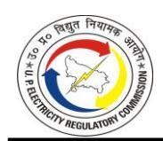

prescribed under MYT Regulations, 2019.

- 4.7.15. The Petitioners have submitted that Petitioner is striving to improve its performance and focusing heavily on billing and collection. To improve its performance, the Petitioners have initiated the hiring of contractual persons for the activities related to metering, billing and collection. As per the existing accounting policy, the expense pertaining to the contractual person & expenses on spot billing centres is being recorded under A&G expenses; however, the nature of these expenses is in the nature of employee expense. Therefore, the Petitioner requested the Commission to recognize this expense over & above the normative employee expenses as submitted by the Petitioner and allow the same in true-up for FY 2023-24. It is important to note that due to the accounting practice, Administrative and General (A&G) Expenses increased substantially from FY 2017-18. Such expenses are recorded under the head of "Payment to Contractual Person", "Incidental Stores Expenses (Expenses Incurred on revenue realization)" and "Expenses on Spot Billing Centre" under A&G Expenses. It is noteworthy to mention that expenses recorded under these heads were very less prior to FY 2018.
- 4.7.16. The Petitioners have further submitted that the Commission, as per provision (b) of Regulation 45 of MYT Tariff Regulations, 2019, depicts the methodology to derive O&M expenses, which is based on the average of the Trued-up values for the last five (5) financial years ending March 31, 2019. Further, the Petitioner started incurring high A&G expenses from FY 2018 as it started hiring contractual personnel. Hence, the methodology adopted by the Commission suppresses the base year value as the actual / true-up expenses were very less prior to FY 2018. Since the Commission is disallowing the actual A&G expense and adopts the partial approach of approving the lower of the audited/normative figures, the Petitioner incurs substantial financial loss. Owing to such disallowance of the expenses which are establishment expenses under A&G expenses, the petitioner is unable to recover genuine establishment expenses. Petitioner has started deployment of contractual manpower for activities like spot billing, Revenue collection to reduce its establishment nature of fixed expenditure on a long-term basis, and expenses recorded under such heads purely involve Manpower, the petitioner is bound to claim such expenses under Employee Expenses. Hence, the

Petitioner requests the Commission to recognize the said expenses as separate items of expenses and allow the same separately as a part of Employee Expenses over and above the amount calculated by the normative approach.

4.7.17. The Actual Employee Expenses submitted by the petitioners are shown in the table below:

**TABLE 4-45: EMPLOYEE EXPENSES FOR FY 2023-24 AS SUBMITTED BY DVVNL (IN RS. CRORE)**

| S. No. | Particular                               | Approved in Tariff Order dated May 24, 2023 | Claimed  |
|--------|------------------------------------------|---------------------------------------------------|----------|
| A      | Gross Employee Expenses after escalation | 628.55                                            | 1,014.19 |
| 1      | Normative employee expense               |                                                   | 653.28   |
| 2      | Payment to Contractual Person            |                                                   | 238.86   |
| 3      | Expenses on Spot Billing Centre          |                                                   | 122.05   |
| B      | Less: Employee Expenses capitalised      | 336.85                                            | 216.58   |
| C      | Net Employee Expenses Claimed            | 291.70                                            | 797.61   |

**TABLE 4-46: EMPLOYEE EXPENSES FOR FY 2023-24 AS SUBMITTED BY MVVNL (IN RS. CRORE)**

| S. No. | Particular                               | Approved in Tariff Order dated May 24, 2023 | Claimed  |
|--------|------------------------------------------|---------------------------------------------------|----------|
| A      | Gross Employee Expenses after escalation | 869.57                                            | 1,448.74 |
| 1      | Normative employee expense               |                                                   | 947.45   |
| 2      | Payment to Contractual Person            |                                                   | 323.43   |
| 3      | Expenses on Spot Billing Centre          |                                                   | 177.86   |
| B      | Less: Employee Expenses capitalised      | 450.88                                            | 264.92   |
| C      | Net Employee Expenses                    | 418.69                                            | 1,183.82 |

**TABLE 4-47: EMPLOYEE EXPENSES FOR FY 2023-24 AS SUBMITTED BY PVVNL (IN RS. CRORE)**

| S. No. | Particular                               | Approved in Tariff Order dated May 24, 2023 | Claimed  |
|--------|------------------------------------------|------------------------------------------------|----------|
| A      | Gross Employee Expenses after escalation | 770.78                                         | 1,034.64 |
| 1      | Normative employee expense               |                                                | 753.48   |
| 2      | Payment to Contractual Person            |                                                | -        |
| 3      | Expenses on Spot Billing Centre          |                                                | 281.16   |
| B      | Less: Employee Expenses capitalised      | 282.73                                         | 182.01   |
| C      | Net Employee Expenses Claimed            | 488.05                                         | 852.63   |

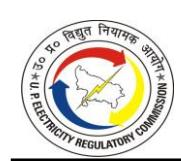

**TABLE 4-48: EMPLOYEE EXPENSES FOR FY 2023-24 AS SUBMITTED BY PUVVNL (IN RS. CRORE)**

| S. No. | Particular                               | Approved in Tariff Order dated May 24, 2023 | Claimed  |
|--------|------------------------------------------|---------------------------------------------------|----------|
| A      | Gross Employee Expenses after escalation | 976.38                                            | 1,065.83 |
| 1      | Normative employee expense               |                                                   | 959.21   |
| 2      | Payment to Contractual Person            |                                                   | -        |
| 3      | Expenses on Spot Billing Centre          |                                                   | 106.62   |
| B      | Less: Employee Expenses capitalised      | 309.25                                            | 366.82   |
| C      | Net Employee Expenses Claimed            | 667.13                                            | 699.01   |

**TABLE 4-49: EMPLOYEE EXPENSES FOR FY 2023-24 AS SUBMITTED BY KESCO (IN RS. CRORE)**

| S. No. | Particular                               | Approved in Tariff Order dated May 24, 2023 | Claimed |
|--------|------------------------------------------|---------------------------------------------------|---------|
| A      | Gross Employee Expenses after escalation | 187.82                                            | 199.13  |
| 1      | Normative employee expense               |                                                   | 170.33  |
| 2      | Payment to Contractual Person            |                                                   | 6.31    |
| 3      | Expenses on Spot Billing Centre          |                                                   | 22.49   |
| B      | Less: Employee Expenses capitalised      | 13.51                                             | 7.03    |
| C      | Net Employee Expenses Claimed            | 174.31                                            | 192.10  |

4.7.18. Regarding R&M Expenses, the Petitioners have submitted that they have considered the Trued-Up value of FY 2019-20 as the base number as approved by the Commission in the respective Tariff Order. Thereafter, the Petitioners have considered the same methodology and norms, as adopted for Employee expenses as discussed above, for arriving at the normative R&M Expenses for FY 2023-24. The R&M Expenses, as submitted by the Petitioners, are shown in the Table below:

**TABLE 4-50: R&M EXPENSES FOR FY 2023-24 AS SUBMITTED BY THE PETITIONERS**

| Particulars | Base Computed value (FY 2022-23) (Rs. Cr) | Average WPI Escalation of last three years. | Computed for FY 2023-24 (Rs. Crore) |
|-------------|----------------------------------------------|------------------------------------------------|----------------------------------------|
| DVVNL       | 605.87                                       | 7.89%                                          | 653.67                                 |
| MVVNL       | 407.99                                       | 7.89%                                          | 440.18                                 |
| PVVNL       | 654.21                                       | 7.89%                                          | 705.83                                 |
| PuVVNL      | 966.11                                       | 7.89%                                          | 1,042.33                               |
| KESCO       | 92.95                                        | 7.89%                                          | 100.29                                 |

4.7.19. The Normative R&M expenses approved by the Commission in Tariff Order dated May

24, 2023, and claimed by the Petitioners for FY 2023-24 are shown in the Table below:

#### **TABLE 4-51: NET NORMATIVE R&M EXPENSES FOR FY 2023-24 AS SUBMITTED BY DVVNL (IN RS. CRORE)**

| S No. | Particulars                                     | Approved in Tariff Order dated May 24, 2023 | Claimed |
|-------|-------------------------------------------------|---------------------------------------------------|---------|
| 1     | Gross R&M Expenses after escalation | 609.85                                            | 653.67  |
| 2     | Less: R&M Expenses capitalised         | -                                                 | -       |
| 3     | Net R&M Expenses                          | 609.85                                            | 653.67  |

#### **TABLE 4-52: NET NORMATIVE R&M EXPENSES FOR FY 2023-24 AS SUBMITTED BY MVVNL (IN RS. CRORE)**

| S No. | Particulars                                     | Approved in Tariff Order May 24, 2023 | Claimed |
|-------|-------------------------------------------------|---------------------------------------------|---------|
| 1     | Gross R&M Expenses after escalation | 453.24                                      | 440.18  |
| 2     | Less: R&M Expenses capitalised         | -                                           | -       |
| 3     | Net R&M Expenses                          | 453.24                                      | 440.18  |

#### **TABLE 4-53: NET NORMATIVE R&M EXPENSES FOR FY 2023-24 AS SUBMITTED BY PVVNL (IN RS. CRORE)**

| S No. | Particulars                         | Approved in Tariff Order May 24, 2023 | Claimed |
|-------|-------------------------------------|------------------------------------------|---------|
| 1     | Gross R&M Expenses after escalation | 532.95                                   | 705.83  |
| 2     | Less: R&M Expenses capitalised      | -                                        | -       |
| 3     | Net R&M Expenses                    | 532.95                                   | 705.83  |

#### **TABLE 4-54: TABLE- 4-1: NET NORMATIVE R&M EXPENSES FOR FY 2023-24 AS SUBMITTED BY PUVVNL (IN RS. CRORE)**

| S No. | Particulars                                     | Approved in Tariff Order May 24, 2023 | Claimed  |
|-------|-------------------------------------------------|------------------------------------------|----------|
| 1     | Gross R&M Expenses after escalation | 828.73                                   | 1,042.33 |
| 2     | Less: R&M Expenses capitalised         | -                                        | -        |
| 3     | Net R&M Expenses                          | 828.73                                   | 1,042.33 |

#### **TABLE 4-55: NET NORMATIVE R&M EXPENSES FOR FY 2023-24 AS SUBMITTED BY KESCO (IN RS. CRORE)**

| S No. | Particulars                                     | Approved in Tariff Order May 24, 2023 | Claimed |
|-------|-------------------------------------------------|---------------------------------------------|---------|
| 1     | Gross R&M Expenses after escalation | 91.47                                       | 100.29  |
| 2     | Less: R&M Expenses capitalised         | -                                           | -       |

| S No. | Particulars            | Approved in Tariff Order May 24, 2023 | Claimed |
|-------|------------------------|---------------------------------------------|---------|
| 3     | Net R&M Expenses | 91.47                                       | 100.29  |

4.7.20. Regarding A&G Expenses, the Petitioners have submitted that they have considered the Trued-Up value for FY 2019-20 as the base number as approved by the Commission in the respective Tariff Order. Thereafter, the Petitioners have considered the same methodology and norms, as adopted for Employee expenses and R&M expenses as discussed above, for arriving at the normative A&G for FY 2023-24. The A&G Expenses, as submitted by the Petitioners, are shown in the Table below:

**TABLE 4-56: A&G EXPENSES FOR FY 2023-24 AS SUBMITTED BY THE PETITIONERS**

| Particulars | Trued Up Value (FY 2022-23) (Rs. Crore) | Average WPI Escalation of last three years. | Computed for FY 2023-24 (Rs. Crore) |
|-------------|-----------------------------------------------|------------------------------------------------|----------------------------------------|
| DVVNL       | 133.70                                        | 7.89%                                          | 144.25                                 |
| MVVNL       | 340.00                                        | 7.89%                                          | 366.83                                 |
| PVVNL       | 181.14                                        | 7.89%                                          | 195.44                                 |
| PuVVNL      | 183.18                                        | 7.89%                                          | 197.64                                 |
| KESCO       | 28.98                                         | 7.89%                                          | 31.26                                  |

4.7.21. The A&G expenses approved by the Commission and as claimed by the Petitioners for FY 2023-24 are shown in the Table below:

**TABLE 4-57: A&G EXPENSES FOR FY 2023-24 AS SUBMITTED BY DVVNL (IN RS. CRORE)**

| S No. | Particulars                             | Approved in Tariff Order dated May 24, 2023 | Claimed |
|----------|-----------------------------------------|---------------------------------------------------|---------|
| 1        | Gross A&G Expenses                | 135.67                                            | 144.25  |
| 2        | Less: A&G expenses capitalised | -                                                 | -       |
| 3        | Net A&G expenses                  | 135.67                                            | 144.25  |

**TABLE 4-58: A&G EXPENSES FOR FY 2023-24 AS SUBMITTED BY MVVNL (IN RS. CRORE)**

| S No. | Particulars                             | Approved in Tariff Order dated May 24, 2023 | Claimed |
|----------|-----------------------------------------|---------------------------------------------------|---------|
| 1        | Gross A&G Expenses                | 325.43                                            | 366.83  |
| 2        | Less: A&G expenses capitalised | -                                                 | -       |
| 3        | Net A&G expenses                  | 325.43                                            | 366.83  |

**TABLE 4-59: A&G EXPENSES FOR FY 2023-24 AS SUBMITTED BY PVVNL (IN RS. CRORE)**

| S No. | Particulars                             | Approved in Tariff Order dated May 24, 2023 | Claimed |
|----------|-----------------------------------------|---------------------------------------------------|---------|
| 1        | Gross A&G Expenses                | 189.79                                            | 195.44  |
| 2        | Less: A&G expenses capitalised | -                                                 | -       |
| 3        | Net A&G expenses                  | 189.79                                            | 195.44  |

**TABLE 4-60: A&G EXPENSES FOR FY 2023-24 AS SUBMITTED BY PUVVNL (IN RS. CRORE)**

| S No. | Particulars                             | Approved in Tariff Order dated May 24, 2023 | Claimed |
|----------|-----------------------------------------|---------------------------------------------------|---------|
| 1        | Gross A&G Expenses                | 204.22                                            | 197.64  |
| 2        | Less: A&G expenses capitalised | -                                                 | -       |
| 3        | Net A&G expenses                  | 693.12                                            | 197.64  |

**TABLE 4-61: A&G EXPENSES FOR FY 2023-24 AS SUBMITTED BY KESCO (IN RS. CRORE)**

| S No. | Particulars                             | Approved in Tariff Order dated May 24, 2023 | Claimed |
|-------|-----------------------------------------|---------------------------------------------------|---------|
| 1     | Gross A&G Expenses                | 34.40                                             | 31.26   |
| 2     | Less: A&G expenses capitalised | -                                                 | -       |
| 3     | Net A&G expenses                  | 34.40                                             | 31.26   |

- 4.7.22. Regarding Smart Metering OPEX, the Petitioners have submitted that on May 16, 2018, the Commission had directed the Petitioners to submit the detailed rollout plan for the installation of Smart Meters for approval. The Petitioners have submitted the Smart Meter rollout plan under the OPEX Model to the Commission on August 6, 2018. In terms of the rollout plan, Energy Efficiency Services Limited (EESL) had to make the upfront capital investment during the build-up phase and then recover its investment out of the gains of the project on an OPEX basis. Accordingly, the Petitioners are required to pay monthly fees as O&M expenditure to EESL on a per-meter per-month basis. The per-meter per month cost is calculated as the total project cost spread over the actual recovery period after the integration of meters on a per-meter basis.
- 4.7.23. The Petitioners have further submitted that on November 15, 2018, the Commission approved the Smart Meter rollout plan for State Discoms of Uttar Pradesh. The additional O&M component against this plan was computed based on the per meter per month rate mentioned in the above-referred Order of the Commission. The

amount sought as 'Additional O&M Expenses under Smart Metering' is payable to the implementation agency to cover the costs towards Smart Meter and box installation, AMI software cost, consumer indexing, training, integration, and commissioning of the AMI solution. The same was proposed to be recovered under the Opex model based on a per meter per month basis, and there is no additional burden of depreciation, interest and return on equity on the consumer. Such expenditure qualifies as Statutory expenses. In the regulatory framework, it is a settled position that Statutory expenses are uncontrollable factors and are to be allowed as a pass-through in the distribution Tariff. As a result, the Petitioners have incurred and will continue to incur substantial additional expenditures. The Petitioners have further added that this type of expense was not envisaged during the projection of MYT O&M norms from FY 2017-18 to FY 2019-20. Further, O&M Norms approved by the Commission were based on five-year Audited Accounts, which didn't have any O&M expenses towards Smart Metering. The amount of this additional O&M has been entered as rent in the replies of comments on the roll-out plan submitted to the Commission vide MD, UPPCL Letter no. 352/CE(Com-II)/Smart Meter/18 dated 25.09.2018. The Commission, after considering the cost implications of the implementation of the Smart Metering Rollout Plan, has approved/allowed the same by its Order dated November 15, 2018.

4.7.24. The Petitioners have further submitted that the approach of compensating the Opex cost with likely savings in billing and collection efficiency is not justified. Presently, the Tariff is already being determined based on 100% collection efficiency, despite the actual percentage being substantially lower. Therefore, even if billing and collection efficiency increases by the installation of Smart Meters, the same will not have any impact on the Tariff of the Discoms. Moreover, the Commission in its Order dated November 15, 2018, has itself noted that the Petitioners would incur substantial Opex cost (to be paid to EESL) towards implementation of Smart Metering Rollout Plans. Hence, there is no reason to now disallow the said cost, which is a Statutory expense and must be mandatorily incurred by the Licensee. The Smart Meter roll-out plan on the Opex model was submitted to the Commission well before its implementation. Further, the Commission, while approving the roll-out plan, has not stated that the cost envisaged under the Opex model would not be allowed to be passed on in the

ARR. Moreover, the Commission, in its Tariff Order dated September 03, 2019, stated that it would carry out a detailed analysis of the additional O&M expenses (on account of the implementation of the Smart Meter rollout plan) for FY 2018-19 at the time of Truing Up. Accordingly, the Petitioners have a legitimate expectation that after approval of the Smart Meter roll-out plan (Opex model) the cost incurred by the Licensees would be allowed to be recovered in the Tariff. Hence, such disallowance at this belated stage would be contrary to the principle of regulatory certainty, which is embedded in the Electricity Act, 2003, and policies framed thereunder. Therefore, this expense shall be considered under the head of A&G expenses as additional expenses.

- 4.7.25. Further, the Petitioners have submitted that the Commission has adopted the RDSS philosophy and the associated distribution loss trajectory. However, the Commission estimates revenue for the licensees based on 100% collection efficiency, leaving no margin for efficiency improvement. Consequently, the expenses incurred for smart meters cannot be recovered through efficiency gains. Therefore, it is requested that the Commission may kindly allow the expenses as claimed by the Petitioner.
- 4.7.26. The Smart Metering OPEX submitted by the Petitioners for FY 2023-24 are shown below:

**TABLE 4-62: SMART METERING OPEX FOR FY 2023-24 AS SUBMITTED BY THE PETITIONERS**

| Particulars | Smart Meters installed till Mar 23 | Smart Meters installed till Mar 24 | Rate (Rs. /meter/month) including GST@18% | OPEX (In Rs. Crore) |
|-------------|------------------------------------------|------------------------------------------|----------------------------------------------------|------------------------|
| DVVNL       | 1,47,991                                 | 1,47,991                                 | 101.42                                             | 18.01                  |
| MVVNL       | 3,80,731                                 | 3,80,731                                 | 101.42                                             | 46.34                  |
| PVVNL       | 1,98,726                                 | 1,98,726                                 | 101.42                                             | 24.19                  |
| PuVVNL      | 3,21,433                                 | 3,21,433                                 | 101.42                                             | 39.12                  |
| KESCO       | 155,168                                  | 155,168                                  | 101.42                                             | 18.88                  |

4.7.27. The summary of the O&M expenses approved in the Tariff Order for FY 2023-24 vis-avis the actual O&M expenses as per Audited Accounts and Normative O&M expenses as claimed by the Petitioners are shown in the Table below:

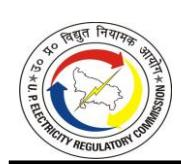

**TABLE 4-63: O&M EXPENSES FOR FY 2023-24 AS SUBMITTED BY DVVNL (IN RS. CRORE)**

| Particulars                                        | Approved in T.O. dated 24.05.2023 | Actual (A) | Claimed (B) |
|----------------------------------------------------|--------------------------------------|---------------|----------------|
| Employee expenses                                  | 628.55                               | 651.71        | 1,014.19       |
| Repair & Maintenance expenses                      | 609.85                               | 626.05        | 653.67         |
| Administrative and General expenses                | 135.67                               | 795.55        | 144.25         |
| Gross O&M Expenses                                 | 1,374.07                             | 2,073.31      | 1,812.11       |
| Less:                                              |                                      |               |                |
| Employee expenses capitalised                      | 336.85                               | 216.58        | 216.58         |
| Administrative and General expenses capitalised | -                                    | -             | -              |
| Gross expenses Capitalised                         | 336.85                               | 216.58        | 216.58         |
| Smart Meter Opex                                   | -                                    | -             | 18.01          |
| Net O&M Expenses                                   | 1,037.22                             | 1,856.73      | 1,613.54       |

#### **TABLE 4-64: O&M EXPENSES FOR FY 2023-24 AS SUBMITTED BY MVVNL (IN RS. CRORE)**

| Particulars                                        | Approved in T.O. | Actual   | Claimed  |
|----------------------------------------------------|------------------|----------|----------|
|                                                    | dated 24.05.2023 | (A)      | (B)      |
| Employee expenses                                  | 869.57           | 924.02   | 1,448.74 |
| Repair & Maintenance expenses                      | 453.24           | 374.20   | 440.18   |
| Administrative and General expenses                | 325.43           | 939.20   | 366.83   |
| Gross O&M Expenses                                 | 1,648.24         | 2,237.42 | 2,255.75 |
| Less:                                              |                  |          |          |
| Employee expenses capitalised                      | 450.88           | 264.92   | 264.92   |
| Administrative and General expenses capitalised | -                | -        | -        |
| Gross expenses Capitalised                         | 450.88           | 264.92   | 264.92   |
| Smart Meter Opex                                   | 0                | 0        | 46.34    |
| Net O&M Expenses                                   | 1,197.36         | 1,972.50 | 2,037.16 |

**TABLE 4-65: O&M EXPENSES FOR FY 2023-24 AS SUBMITTED BY PVVNL (IN RS. CRORE)**

| Particulars                                        | Approved in T.O. dated 24.05.2023 | Actual (A) | Claimed (B) |
|----------------------------------------------------|--------------------------------------|---------------|----------------|
| Employee expenses                                  | 770.78                               | 907.69        | 1,034.64       |
| Repair & Maintenance expenses                      | 532.95                               | 743.04        | 705.83         |
| Administrative and General expenses                | 189.79                               | 495.51*       | 195.44         |
| Gross O&M Expenses                                 | 1,493.52                             | 2,146.24      | 1,935.91       |
| Less:                                              |                                      |               |                |
| Employee expenses capitalised                      | 282.73                               | 182.01        | 182.01         |
| Administrative and General expenses capitalised | -                                    | -             | -              |
| Gross expenses Capitalised                         | 282.73                               | 182.01        | 182.01         |
| Smart Meter Opex                                   | -                                    | -             | 24.19          |
| Net O&M Expenses                                   | 1,210.79                             | 1,964.23*     | 1,778.08       |

*\*Wrong Submission done by Petitioner in its Petition submitted on November 29, 2024*

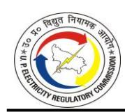

**TABLE 4-66: O&M EXPENSES FOR FY 2023-24 AS SUBMITTED BY PUVVNL (IN RS. CRORE)**

| Particulars                                        | Approved in T.O. dated 24.05.2023 | Actual (A) | Claimed (B) |
|----------------------------------------------------|--------------------------------------|---------------|----------------|
| Employee expenses                                  | 976.38                               | 1,025.15      | 1,065.83       |
| Repair & Maintenance expenses                      | 828.73                               | 634.54        | 1,042.33       |
| Administrative and General expenses                | 204.22                               | 771.57*       | 197.64         |
| Gross O&M Expenses                                 | 2,009.33                             | 2,431.26      | 2,305.79       |
| Less:                                              |                                      |               |                |
| Employee expenses capitalised                      | 309.25                               | 366.82        | 366.82         |
| Administrative and General expenses capitalised | -                                    | -             | -              |
| Gross expenses Capitalised                         | 309.25                               | 366.82        | 366.82         |
| Smart Meter Opex                                   | -                                    | -             | 39.12*         |
| Net O&M Expenses                                   | 1,700.08                             | 2,064.44*     | 1,978.09*      |

*\*Wrong Submission done by Petitioner in its Petition submitted on November 29, 2024*

**TABLE 4-67: O&M EXPENSES FOR FY 2023-24 AS SUBMITTED BY KESCO (IN RS. CRORE)**

| Particulars                                        | Approved in T.O. dated 24.05.2023 | Actual (A) | Claimed (B) |
|----------------------------------------------------|--------------------------------------|---------------|----------------|
| Employee expenses                                  | 187.82                               | 149.49        | 199.13         |
| Repair & Maintenance expenses                      | 91.47                                | 56.34         | 100.29         |
| Administrative and General expenses                | 34.40                                | 113.46        | 31.26          |
| Gross O&M Expenses                                 | 313.69                               | 319.29        | 330.68         |
| Less:                                              |                                      |               |                |
| Employee expenses capitalised                      | 13.51                                | 7.03          | 7.03           |
| Administrative and General expenses capitalised | -                                    | -             | -              |
| Gross expenses Capitalised                         | 13.51                                | 7.03          | 7.03           |
| Smart Meter Opex                                   | -                                    | -             | 18.88          |
| Net O&M Expenses                                   | 300.18                               | 312.26        | 342.53         |

#### *Commission's Analysis:*

4.7.28. Regulation 45 of the MYT Regulations, 2019, stipulates the methodology for consideration of the O&M Expenses, wherein such expenses are linked to the inflation index. As per the Regulation, at the time of the Truing Up of the O&M expenses, the actual point-to-point inflation over WPI inflation numbers (as per the Office of Economic Advisor, Government of India) and the actual CPI inflation for Industrial Workers- all India (as per the Labour Bureau, Government of India), in the concerned year shall be considered. Accordingly, the inflation indices considered by the Commission for FY 2023-24 are as shown in the Table below:

**TABLE 4-68: CONSUMER PRICE INDEX FOR FY 2023-24**

| Month                         | FY 2022-23 | FY 2023-24 |
|-------------------------------|------------|------------|
| April                         | 367.78     | 386.50     |
| May                           | 371.52     | 387.94     |
| June                          | 372.10     | 392.83     |
| July                          | 374.11     | 402.34     |
| August                        | 374.98     | 400.90     |
| September                     | 378.14     | 396.00     |
| October                       | 381.60     | 398.59     |
| November                      | 381.60     | 400.61     |
| December                      | 381.02     | 399.74     |
| January                       | 382.46     | 400.03     |
| February                      | 382.18     | 400.90     |
| March                         | 383.90     | 400.03     |
| Average                       | 377.62     | 397.20     |
| CPI Escalation for FY 2023-24 |            | 5.19%      |

**TABLE 4-69: WHOLESALE PRICE INDEX FOR FY 2023-24**

| Month                         | FY 2022-23 | FY 2023-24 |
|-------------------------------|------------|------------|
| April                         | 152.30     | 151.10     |
| May                           | 155.00     | 149.40     |
| June                          | 155.40     | 148.90     |
| July                          | 154.00     | 152.10     |
| August                        | 153.20     | 152.50     |
| September                     | 151.90     | 151.80     |
| October                       | 152.90     | 152.50     |
| November                      | 152.50     | 153.10     |
| December                      | 150.50     | 151.80     |
| January                       | 150.70     | 151.20     |
| February                      | 150.90     | 151.20     |
| March                         | 151.00     | 151.40     |
| Average                       | 152.53     | 151.42     |
| WPI Escalation for FY 2023-24 |            | (0.73%)    |

4.7.29. The Commission observes that the Petitioners have considered the Trued-Up value of FY 2019–20 as the base for computing the normative O&M expenses for FY 2023–24. However, Regulation 45 of the MYT Regulations clearly stipulates that the normative base year value, as determined by the Commission, is required to be considered for the purpose of computing the normative O&M expenses for FY 2023–24. The Regulations, being subordinate legislation, are required to be complied with by all the entities being governed by them. Moreover, as the True-up of three years has already been done, the Commission does not find it appropriate to deviate from the methodology provided in the Regulation through an Order. Regulator is not supposed

to approbate and reprobate in its treatment and thereby topple its own regulation through an order. Therefore, the Commission has employed the methodology as provided in the Regulations to arrive at the normative values of different components of O&M Expenses.

- 4.7.30. The Petitioners have submitted that there is an increase in O&M Expenses on account of the implementation of Standards of Performance Regulations framed by the Commission. However, none of the Petitioners have submitted any details on the initiatives that have been taken exclusively to maintain the standards and comply with the provisions of the SOP Regulations, 2019. Moreover, the Petitioners have not submitted details of compensation that have been given to the consumers under these Regulations. During the public hearing as well, concerns have been raised by the consumers regarding the non-compliance of the SOP Regulations.
- 4.7.31. It is submitted that expenses related to "Payment to contractual person", "incidental store expenses" and "Expenses on spot billing centre" were very less prior to FY 2017- 18. This is a conscious decision taken by the Petitioners to manage their operations, and in doing so, if the expenses being incurred are higher than the normative expenses approved by the Commission as per the Regulations, the burden of such an increase in costs cannot be passed on to the consumers. Further, the major outsourcing of its functions is not a new phenomenon in state DISCOMs, tracing back only to FY 2018. In fact, this practice has been continuing in a dominant manner since 2000, if not earlier. Hence, FY 2018 cannot be considered as an inflection point for the purpose.

#### **Employee Expenses**

4.7.32. The Commission has computed the normative employee expenses for FY 2023-24 by considering the normative employee expenses of FY 2022-23 as the base value, as determined by the Commission in the Tariff Order dated October 10, 2024. The Normative Employee Expenses, as worked out by the Commission for FY 2023-24, are shown in the Table below:

**TABLE 4-70: APPROVED NORMATIVE EMPLOYEE EXPENSES FOR FY 2023-24 (IN RS. CRORE)**

| Particulars | Normative approved for FY 2022-23 in Tariff Order dated Oct 10, 2024 | CPI Escalation for FY 2023-24 | Normative expenses for FY 2023-24 |
|-------------|----------------------------------------------------------------------------|----------------------------------|--------------------------------------|
| DVVNL       | 566.64                                                                     | 5.19%                            | 596.03                               |
| MVVNL       | 783.92                                                                     | 5.19%                            | 824.58                               |
| PVVNL       | 694.85                                                                     | 5.19%                            | 730.89                               |
| PuVVNL      | 880.20                                                                     | 5.19%                            | 925.85                               |
| KESCO       | 169.32                                                                     | 5.19%                            | 178.11                               |
| Total       | 3,094.93                                                                   |                                  | 3,255.44                             |

4.7.33. Based on the above, the Employee Expense as approved by the Commission for FY 2023-24 is shown in the Table below:

**TABLE 4-71: APPROVED EMPLOYEE EXPENSES FOR FY 2023-24 (IN RS. CRORE)**

| Particulars | Approved in Tariff Order dated May 24, 2023 | Audited Accounts | Claimed  | Normative expenses for FY 2023-24 | Approved |
|-------------|---------------------------------------------------|---------------------|----------|-----------------------------------------|----------|
| DVVNL       | 628.55                                            | 651.71              | 1,014.19 | 596.03                                  | 596.03   |
| MVVNL       | 869.57                                            | 924.02              | 1,448.74 | 824.58                                  | 824.58   |
| PVVNL       | 770.78                                            | 907.69              | 1,034.64 | 730.89                                  | 730.89   |
| PuVVNL      | 976.38                                            | 1,025.15            | 1,065.83 | 925.85                                  | 925.85   |
| KESCO       | 187.82                                            | 149.49              | 199.13   | 178.11                                  | 149.49   |
| Total       | 3,433.09                                          | 3,658.06            | 4,762.52 | 3,255.44                                | 3,226.83 |

*\* For KESCO, the audited values for employee expenses are lower compared to the normative values for FY 2023-24. Hence, the audited values are approved in the True Up for FY 2023-24.*

4.7.34. The Commission has considered the employee expense capitalized as per the Audited Accounts of FY 2023-24 as claimed by the Petitioner.

#### **Repair and Maintenance (R&M) Expenses:**

4.7.35. The Commission has computed the normative R&M expenses for FY 2023-24 by considering the normative R&M expenses of FY 2022-23 as the base value, as determined by the Commission in the Tariff Order dated October 10, 2024. The Normative R&M Expenses, as worked out by the Commission for FY 2023-24, are shown in the Table below:

**TABLE 4-72: APPROVED NORMATIVE R&M EXPENSES FOR FY 2023-24 (IN RS. CRORE)**

| Particulars | Normative approved for FY 2022-23 in Tariff Order dated Oct 10, 2024 | WPI Escalation for FY 2023-24 | Normative Expenses for FY 2023-24 |
|-------------|----------------------------------------------------------------------------|----------------------------------|--------------------------------------|
| DVVNL       | 587.14                                                                     | -0.73%                           | 582.87                               |

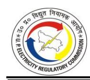

| Particulars | Normative approved for FY 2022-23 in Tariff Order dated Oct 10, 2024 | WPI Escalation for FY 2023-24 | Normative Expenses for FY 2023-24 |
|-------------|----------------------------------------------------------------------------|----------------------------------|--------------------------------------|
| MVVNL       | 436.37                                                                     | -0.73%                           | 433.20                               |
| PVVNL       | 513.11                                                                     | -0.73%                           | 509.38                               |
| PuVVNL      | 797.87                                                                     | -0.73%                           | 792.07                               |
| KESCO       | 88.06                                                                      | -0.73%                           | 87.42                                |
| Total       | 2,422.55                                                                   |                                  | 2,404.95                             |

4.7.36. The R&M Expense as approved by the Commission for FY 2023-24 is shown in the Table below:

**TABLE 4-73: APPROVED R&M EXPENSES FOR FY 2023-24 (IN RS. CRORE)**

| Particulars | Approved in Tariff Order dated May 24, 2023 | Audited Accounts | Claimed  | Normative expenses for FY 2023-24 | Approved |
|-------------|---------------------------------------------------|---------------------|----------|-----------------------------------------|----------|
| DVVNL       | 609.85                                            | 626.05              | 653.67   | 582.87                                  | 582.87   |
| MVVNL       | 453.24                                            | 374.20              | 440.18   | 433.20                                  | 374.20   |
| PVVNL       | 532.95                                            | 743.04              | 705.83   | 509.38                                  | 509.38   |
| PuVVNL      | 828.73                                            | 634.54              | 1,042.33 | 792.07                                  | 634.54   |
| KESCO       | 91.47                                             | 56.34               | 100.29   | 87.42                                   | 56.34    |
| Total       | 2,516.23                                          | 2,434.17            | 2,942.29 | 2,404.95                                | 2,157.33 |

*\* For KESCO, MVVNL and PUVVNL, the audited values for R&M expenses are lower compared to the normative values for FY 2023-24. Hence, the audited values are approved in the True Up for FY 2023-24.*

#### **Administrative and General Expenses:**

4.7.37. The Commission has computed the normative A&G expenses for FY 2023-24 by considering the normative A&G expenses of FY 2022-23 as the base value, as determined by the Commission in the Tariff Order dated October 10, 2024. The Normative A&G Expenses, as worked out by the Commission for FY 2023-24, are shown in the Table below:

**TABLE 4-74: APPROVED NORMATIVE A&G EXPENSES FOR FY 2023-24 (IN RS. CRORE)**

| Particulars | Normative approved for FY 2022-23 in Tariff Order dated Oct 10, 2024 | WPI Escalation for FY 2023-24 | Normative expenses for FY 2023-24 |
|-------------|----------------------------------------------------------------------------|----------------------------------|--------------------------------------|
| DVVNL       | 130.62                                                                     | -0.73%                           | 129.67                               |
| MVVNL       | 313.31                                                                     | -0.73%                           | 311.03                               |
| PVVNL       | 182.72                                                                     | -0.73%                           | 181.39                               |
| PuVVNL      | 196.62                                                                     | -0.73%                           | 195.19                               |
| KESCO       | 33.12                                                                      | -0.73%                           | 32.88                                |
| Total       | 856.40                                                                     |                                  | 850.17                               |

4.7.38. The Commission has approved the lower of Audited and Normative A&G Expenses for FY 2023-24. The A&G Expenses as approved by the Commission for FY 2023-24 are shown in the Table below:

**TABLE 4-75: APPROVED A&G EXPENSES FOR FY 2023-24 (IN RS. CRORE)**

| Particulars | Approved in Tariff Order dated May 24, 2023 | Audited Accounts | Claimed | Normative expenses for FY 2023-24 | Approved |
|-------------|---------------------------------------------------|---------------------|---------|-----------------------------------------|----------|
| DVVNL       | 135.67                                            | 795.55              | 144.25  | 129.67                                  | 129.67   |
| MVVNL       | 325.43                                            | 939.20              | 366.83  | 311.03                                  | 311.03   |
| PVVNL       | 189.79                                            | 495.51              | 195.44  | 181.39                                  | 181.39   |
| PuVVNL      | 204.22                                            | 771.57              | 197.64  | 195.19                                  | 195.19   |
| KESCO       | 34.40                                             | 113.46              | 31.26   | 32.88                                   | 32.88    |
| Total       | 889.52                                            | 3,115.29            | 935.42  | 850.17                                  | 850.17   |

#### **Smart Metering OPEX:**

- 4.7.39. The Commission observes that the Petitioners have claimed Opex Cost for Smart Meters installed under the Opex model, considering the rate of Rs. 101.42 / Meter/ Month (including GST@18%).
- 4.7.40. The Commission observes that vide Order dated November 15, 2018, the Commission had approved the Roll Out plan for Smart Meters. In this Order, the Commission had directed the Petitioners to comply with certain conditions such as Smart Meters to conform to the standards set out by Ministry of Power / CEA i.e. IS 16444 & IS 15959, personal data privacy of the consumer's data stored on 3rd party cloud server, maintaining Billing efficiency not less than 98% of the consumers having Smart Meters etc. Further, the Commission has been disallowing additional O&M expenses on account of Smart Meters Opex in the previous Tariff Orders, stating that the Smart Meter Rollout scheme is under the OPEX model and not under the CAPEX model. With the rollout of Smart Meters, the billing and collection efficiency of Discoms will increase, thereby reducing the commercial losses. As observed by the Commission in the previous Tariff Orders, it is expected that the overall O&M cost of the Discoms will also decrease due to improved billing & collection efficiency, which would compensate for the charges paid in the OPEX model. Further, since the MYT Regulations, 2019 provide for the O&M expenses on a normative basis, the same cannot be allowed as additional O&M expenses.

- 4.7.41. The Commission observes that the Letter No. F.No.14/02/2021-UR&SI-II-Part (1) (E-258136) issued by the Ministry of Power, Government of India, to all the SERCs states as follows:
  - *"...5. The Smart Metering implementation is self-sustaining. Therefore, no extra cost be passed on to the consumers."*
- 4.7.42. Thus, the Government of India has also provided in an unambiguous term that Smart Metering implementation will not have any impact on the consumers' Tariff.
- 4.7.43. In line with the approach in the previous Tariff Orders, the Commission is not allowing any additional O&M expenses on account of Smart Meters Opex for FY 2023-24.
- 4.7.44. The summary of O&M Expense as approved by the Commission for True Up of FY 2023- 24 is shown in the Tables below:

**TABLE 4-76: APPROVED O&M EXPENSES OF DVVNL FOR FY 2023-24 (IN RS. CRORE)**

| Particulars                                     | Approved in Tariff Order dated May 24, 2023 | Claimed  | Approved |
|-------------------------------------------------|------------------------------------------------------|----------|----------|
| Employee expenses                               | 628.55                                               | 1,014.19 | 596.03   |
| Repair & Maintenance expenses                   | 609.85                                               | 653.67   | 582.87   |
| Administrative and General expenses             | 135.67                                               | 144.25   | 129.67   |
| Gross O&M Expenses                              | 1,374.07                                             | 1,812.11 | 1,308.57 |
| Less:                                           |                                                      |          |          |
| Employee expenses capitalised                   | 336.85                                               | 216.58   | 216.58   |
| Administrative and General expenses capitalised | -                                                    | -        | -        |
| Gross expenses Capitalised                      | 336.85                                               | 216.58   | 216.58   |
| Add: Smart Metering Opex                        | -                                                    | 18.01    | -        |
| Add: Additional R&M Expenses                    | -                                                    | -        | -        |
| Net O&M Expenses                                | 1,037.22                                             | 1,613.54 | 1,091.99 |

**TABLE 4-77: APPROVED O&M EXPENSES OF MVVNL FOR FY 2023-24 (IN RS. CRORE)**

| Particulars                                     | Approved in Tariff Order dated May 24, 2023 | Claimed  | Approved |
|-------------------------------------------------|------------------------------------------------------|----------|----------|
| Employee expenses                               | 869.57                                               | 1,448.74 | 824.58   |
| Repair & Maintenance expenses                   | 453.24                                               | 440.18   | 374.20   |
| Administrative and General expenses             | 325.43                                               | 366.83   | 311.03   |
| Gross O&M Expenses                              | 1,648.24                                             | 2,255.75 | 1,509.81 |
| Less:                                           |                                                      |          |          |
| Employee expenses capitalised                   | 450.88                                               | 264.92   | 264.92   |
| Administrative and General expenses capitalised | -                                                    | -        | -        |

| Particulars                  | Approved in Tariff Order dated May 24, 2023 | Claimed  | Approved |
|------------------------------|------------------------------------------------------|----------|----------|
| Gross expenses Capitalised   | 450.88                                               | 264.92   | 264.92   |
| Add: Smart Metering Opex     | -                                                    | 46.34    | -        |
| Add: Additional R&M Expenses | -                                                    | -        | -        |
| Net O&M Expenses             | 1,197.35                                             | 2,037.16 | 1,244.89 |

**TABLE 4-78: APPROVED O&M EXPENSES OF PVVNL FOR FY 2023-24 (IN RS. CRORE)**

| Particulars                                     | Approved in Tariff Order dated May 24, 2023 | Claimed  | Approved |
|-------------------------------------------------|------------------------------------------------------|----------|----------|
| Employee expenses                               | 770.78                                               | 1,034.64 | 730.89   |
| Repair & Maintenance expenses                   | 532.95                                               | 705.83   | 509.38   |
| Administrative and General expenses             | 189.79                                               | 195.44   | 181.39   |
| Gross O&M Expenses                              | 1,493.51                                             | 1,935.91 | 1,421.66 |
| Less:                                           |                                                      |          |          |
| Employee expenses capitalised                   | 282.73                                               | 182.01   | 182.01   |
| Administrative and General expenses capitalised | -                                                    | -        | -        |
| Gross expenses Capitalised                      | 282.73                                               | 182.01   | 182.01   |
| Add: Smart Metering Opex                        | -                                                    | 24.19    | -        |
| Add: Additional R&M Expenses                    | -                                                    | -        | -        |
| Net O&M Expenses                                | 1,210.78                                             | 1,778.09 | 1,239.65 |

**TABLE 4-79: APPROVED O&M EXPENSES OF PUVVNL FOR FY 2023-24 (IN RS. CRORE)**

| Particulars                                     | Approved in Tariff Order dated May 24, 2023 | Claimed  | Approved |
|-------------------------------------------------|------------------------------------------------------|----------|----------|
| Employee expenses                               | 976.38                                               | 1,065.83 | 925.85   |
| Repair & Maintenance expenses                   | 828.73                                               | 1,042.33 | 634.54   |
| Administrative and General expenses             | 204.22                                               | 197.64   | 195.19   |
| Gross O&M Expenses                              | 2,009.32                                             | 2,305.79 | 1,755.58 |
| Less:                                           |                                                      |          |          |
| Employee expenses capitalised                   | 309.25                                               | 366.82   | 366.82   |
| Administrative and General expenses capitalised | -                                                    | -        | -        |
| Gross expenses Capitalised                      | 309.25                                               | 366.82   | 366.82   |
| Add: Smart Metering Opex                        | -                                                    | 39.12    | -        |
| Add: Additional R&M Expenses                    | -                                                    | -        | -        |
| Net O&M Expenses                                | 1,700.07                                             | 1,978.09 | 1,388.76 |

**TABLE 4-80: APPROVED O&M EXPENSES OF KESCO FOR FY 2023-24 (IN RS. CRORE)**

| Particulars                                     | Approved in Tariff Order dated May 24, 2023 | Claimed | Approved |
|-------------------------------------------------|---------------------------------------------------|---------|----------|
| Employee expenses                               | 187.82                                            | 199.13  | 149.49   |
| Repair & Maintenance expenses                   | 91.47                                             | 100.29  | 56.34    |
| Administrative and General expenses             | 34.40                                             | 31.26   | 32.88    |
| Gross O&M Expenses                              | 313.70                                            | 330.68  | 238.71   |
| Less:                                           |                                                   |         |          |
| Employee expenses capitalised                   | 13.51                                             | 7.03    | 7.03     |
| Administrative and General expenses capitalised | -                                                 | -       | -        |
| Gross expenses Capitalised                      | 13.51                                             | 7.03    | 7.03     |
| Add: Smart Metering Opex                        | -                                                 | 18.88   | -        |
| Add: Additional R&M Expenses                    | -                                                 | -       | -        |
| Net O&M Expenses                                | 300.19                                            | 342.53  | 231.68   |

**TABLE 4-81: APPROVED CONSOLIDATED O&M EXPENSES FOR FY 2023-24 (IN RS. CRORE)**

| Particulars                                     | Approved in Tariff Order dated May 24, 2023 | Claimed  | Approved |
|-------------------------------------------------|---------------------------------------------------|----------|----------|
| Employee expenses                               | 3,433.09                                          | 4,762.52 | 3,226.83 |
| Repair & Maintenance expenses                   | 2,516.23                                          | 2,942.29 | 2,157.33 |
| Administrative and General expenses             | 889.52                                            | 935.42   | 850.17   |
| Gross O&M Expenses                              | 6,838.84                                          | 8,640.23 | 6,234.33 |
| Less:                                           |                                                   |          |          |
| Employee expenses capitalised                   | 1,393.22                                          | 1,037.36 | 1,037.36 |
| Administrative and General expenses capitalised | -                                                 | -        | -        |
| Gross expenses Capitalised                      | 1,393.22                                          | 1,037.36 | 1,037.36 |
| Add: Smart Metering Opex                        | -                                                 | 146.54   | -        |
| Add: Additional R&M Expenses                    | -                                                 | -        | -        |
| Net O&M Expenses                                | 5,445.62                                          | 7,749.41 | 5,196.97 |

#### **4.8. CAPITAL INVESTMENT, CAPITALISATION AND FINANCING**

#### *Petitioners' Submission:*

4.8.1. The Petitioner has submitted that the Commission vide its order dated 13.08.2024 has approved the proposed investment plan under the RDSS Scheme of the Petitioner. Considering the Commission's approval, the Petitioner has incurred capital expenditure under the RDSS Scheme to further strengthen the distribution network of the Petitioner that will help in extending quality and reliable power supply in its license area. The details of the Capital Expenditure scheme as submitted by the Petitioners for FY 2023-24 are shown in the Table below:

**TABLE 4-82: CAPEX FOR FY 2023-24 AS SUBMITTED BY DVVNL (IN RS. CRORE)**

| Schemes                           | Investments | Capitalization |
|-----------------------------------|-------------|----------------|
| Other Schemes                     | 2,305.15    | 2,131.35       |
| RGGVY 12th Plan                   | 0.84        | 0.84           |
| DDUGJY YOJNA                      | 0.00        | 0.00           |
| ADB                               | 330.72      | 100.36         |
| RAPDRP                            | 0.01        | 0.01           |
| IPDS                              | 0.00        | 0.00           |
| SAUBHAGYA YOJNA                   | 0.00        | 0.00           |
| RDSS                              | 685.54      | 299.97         |
| Intangible Assets                 | 0.00        | 0.24           |
| Total (A)                         | 3,322.26    | 2,532.77       |
| Employee Cost Capitalised (B)     | 0.00        | 216.58         |
| Interest Expenses Capitalised (C) | 0.00        | 0.00           |
| Total (D= A + B + C)              | 3,322.26    | 2,749.35       |

**TABLE 4-83: CAPEX FOR FY 2023-24 AS SUBMITTED BY MVVNL (IN RS. CRORE)**

| Schemes                           | Investments | Capitalization |
|-----------------------------------|-------------|----------------|
| Other Schemes                     | 1,662.27    | 2,108.80       |
| ADB                               | 252.57      | -              |
| IPDS                              | 68.17       | 28.07          |
| SAUBHAGYA YOJNA                   | 39.56       | 0.00           |
| RDSS                              | 861.59      | 0.00           |
| Intangible Assets                 | 27.98       | 4.43           |
| Total(A)                          | 2,912.14    | 2,141.30       |
| Employee Cost Capitalised (B)     | -           | 264.92         |
| Interest Expenses Capitalised (C) | -           | -              |
| Total (D= A + B + C)              | 2,912.14    | 2,406.22       |

**TABLE 4-84: CAPEX FOR FY 2023-24 AS SUBMITTED BY PVVNL (IN RS. CRORE)**

| Schemes                       | Investments | Capitalization |
|-------------------------------|-------------|----------------|
| Other Schemes                 | 920.13      | 1,434.04       |
| RGGVY 12th Plan               | 0.00        | 8.18           |
| RGGVY 11th Plan               | 0.00        | 0.00           |
| DDUGJY YOJNA                  | 5.12        | 28.80          |
| ADB                           | 17.70       | 33.98          |
| RAPDRP                        | 0.00        | 0.00           |
| IPDS                          | 0.00        | 18.65          |
| SAUBHAGYA YOJNA               | 6.81        | 21.64          |
| Non- Saubhagya                | 0.58        | 0.00           |
| RDSS                          | 707.73      | 31.72          |
| Intangible Assets             | 0.00        | 0.39           |
| Total(A)                      | 1,658.07    | 1,577.40       |
| Employee Cost Capitalised (B) | 0.00        | 182.01         |

| Schemes                           | Investments | Capitalization |
|-----------------------------------|-------------|----------------|
| Interest Expenses Capitalised (C) | 0.00        | 0.00           |
| Total (D= A + B + C)              | 1,658.07    | 1,759.41       |

**TABLE 4-85: CAPEX FOR FY 2023-24 AS SUBMITTED BY PUVVNL (IN RS. CRORE)**

| Schemes                           | Investments | Capitalization |
|-----------------------------------|-------------|----------------|
| Other Schemes                     | 1,789.56    | 1,673.24       |
| RGGVY 12th Plan                   | 0.00        | 43.00          |
| RGGVY 11th Plan                   | 0.00        | 0.00           |
| DDUGJY YOJNA                      | 0.00        | 91.89          |
| ADB                               | 0.00        | 0.00           |
| RAPDRP                            | 30.76       | 359.60         |
| IPDS                              | 55.27       | 169.87         |
| SAUBHAGYA YOJNA                   | 6.26        | 179.97         |
| Non- Saubhagya                    | 0.00        | 0.00           |
| RDSS                              | 1,962.33    | 0.00           |
| Intangible Assets                 | 0.02        | 0.32           |
| Total(A)                          | 3,844.20    | 2,517.89       |
| Employee Cost Capitalised (B)     | 0.00        | 366.82         |
| Interest Expenses Capitalised (C) | 0.00        | 0.00           |
| Total (D= A + B + C)              | 3,844.20    | 2,884.71       |

**TABLE 4-86: CAPEX FOR FY 2023-24 AS SUBMITTED BY KESCO (IN RS. CRORE)**

| Schemes                           | Investments | Capitalization |
|-----------------------------------|-------------|----------------|
| Other Schemes                     | 55.55       | 21.91          |
| Intangible Assets                 | 5.32        | 8.64           |
| Total(A)                          | 60.87       | 30.55          |
| Employee Cost Capitalised (B)     | -           | 7.03           |
| Interest Expenses Capitalised (C) | -           | -              |
| Total (D= A + B + C)              | 60.87       | 37.58          |

- 4.8.2. The capital investment eligible for financing is calculated after deducting the amounts received for consumer contributions, capital grants, and subsidies.
- 4.8.3. The Petitioners have submitted that they have considered the same approach as adopted by the Commission in previous Orders and, therefore, considered the funding of net capital expenditure in the ratio of 70:30 in compliance with Regulation 20 of the MYT Regulations, 2019. Hence, 70% of the capital expenditure undertaken during the year has been financed through loans, and the remaining 30% has been financed through equity contributions. The funding details of the Capital Investments in FY 2023-24 as submitted by the Petitioners, are shown in the Tables below:

**TABLE 4-87: FINANCING OF CAPITAL INVESTMENTS IN FY 2023-24 AS SUBMITTED BY DVVNL (IN RS. CRORE)**

| Particulars                                             | Derivation | Approved in Tariff Order dated 24.05.2023 | Claimed  |
|---------------------------------------------------------|------------|----------------------------------------------------|----------|
| Total Investment during the year (Asset Put to use)     | A          | 1,559.62                                           | 2,532.77 |
| Less:                                                   |            | -                                                  | -        |
| Consumer Contribution, Grants and De capitalizations | B          | -                                                  | 579.30   |
| Investment funded by debt and equity                    | C=A-B      | 1,559.62                                           | 1,953.47 |
| Debt Funded                                             | 70% of C   | 1,091.73                                           | 1,367.43 |
| Equity Funded                                           | 30% of C   | 467.89                                             | 586.04   |

**TABLE 4-88: FINANCING OF CAPITAL INVESTMENTS IN FY 2023-24 AS SUBMITTED BY MVVNL (IN RS. CRORE)**

| Particulars                                             | Derivation | Approved in Tariff Order dated 24.05.2023 | Claimed  |
|---------------------------------------------------------|------------|----------------------------------------------------|----------|
| Total Investment during the year (Asset Put to use)     | A          | 1,304.19                                           | 2,141.30 |
| Less:                                                   |            | -                                                  | -        |
| Consumer Contribution, Grants and De capitalizations | B          | -                                                  | 503.26   |
| Investment funded by debt and equity                    | C=A-B      | 1,304.19                                           | 1,638.04 |
| Debt Funded                                             | 70% of C   | 912.93                                             | 1,146.63 |
| Equity Funded                                           | 30% of C   | 391.26                                             | 491.41   |

**TABLE 4-89: FINANCING OF CAPITAL INVESTMENTS IN FY 2023-24 AS SUBMITTED BY PVVNL (IN RS. CRORE)**

| Particulars                                          | Derivation | Approved in Tariff Order dated 24.05.2023 | Claimed  |
|------------------------------------------------------|------------|-------------------------------------------------------|----------|
| Total Investment during the year (Asset Put to use)  | A          | 854.59                                                | 1,577.40 |
| Less:                                                |            | -                                                     | -        |
| Consumer Contribution, Grants and De-capitalizations | B          | -                                                     | 876.11   |
| Investment funded by debt and equity                 | C=A-B      | 854.59                                                | 701.29   |
| Debt Funded                                          | 70% of C   | 598.21                                                | 490.90   |
| Equity Funded                                        | 30% of C   | 256.38                                                | 210.39   |

**TABLE 4-90: FINANCING OF CAPITAL INVESTMENTS IN FY 2023-24 AS SUBMITTED BY PUVVNL (IN RS. CRORE)**

| Particulars                                          | Derivation | Approved in Tariff Order dated 24.05.2023 | Claimed  |
|------------------------------------------------------|------------|----------------------------------------------------|----------|
| Total Investment during the year (Asset Put to use)  | A          | 1,416.98                                           | 2,517.88 |
| Less:                                                |            | -                                                  | -        |
| Consumer Contribution, Grants and De-capitalizations | B          | -                                                  | 244.61   |
| Investment funded by debt and equity                 | C=A-B      | 1,416.98                                           | 2,273.27 |
| Debt Funded                                          | 70% of C   | 991.89                                             | 1,591.29 |
| Equity Funded                                        | 30% of C   | 425.09                                             | 681.98   |

**TABLE 4-91: FINANCING OF CAPITAL INVESTMENTS IN FY 2023-24 AS SUBMITTED BY KESCO (IN RS. CRORE)**

| Particulars                                          | Derivation | Approved in Tariff Order dated 24.05.2023 | Claimed |
|------------------------------------------------------|------------|-------------------------------------------------------|---------|
| Total Investment during the year (Asset Put to use)  | A          | 144.38                                                | 30.55   |
| Less:                                                |            | -                                                     | -       |
| Consumer Contribution, Grants and De-capitalizations | B          | -                                                     | 10.26   |
| Investment funded by debt and equity                 | C=A-B      | 144.38                                                | 20.29   |
| Debt Funded                                          | 70% of C   | 101.07                                                | 14.20   |
| Equity Funded                                        | 30% of C   | 43.31                                                 | 6.09    |

#### *Commission's Analysis:*

4.8.4. The Petitioners DVVNL, MVVNL and PVVNL, in response to the Commission's query regarding the variation in the actual Capitalisation claimed by the Petitioners and the figures shown in the balance sheet for FY 2023-24, have submitted the reconciliation, as given below:

**TABLE 4-92: RECONCILIATION DETAILS OF DVVNL FOR FY 2023-24 AS SUBMITTED BY THE PETITIONER (IN RS. CRORE)**

| Particulars                                                  | Value in Cr. |
|--------------------------------------------------------------|--------------|
| Total capitalization claimed in the Petition                 | 2,532.77     |
| Capitalisation of tangible assets as per the balance sheet   | 2,532.53     |
| Capitalisation of intangible assets as per the balance sheet | 0.24         |
| Total Capitalization as per the balance sheet                | 2,532.77     |

**TABLE 4-93: RECONCILIATION DETAILS OF MVVNL FOR FY 2023-24 AS SUBMITTED BY THE PETITIONER (IN RS. CRORE)**

| Particulars          | Capitalization Claimed | Capitalization as per balance sheet |
|----------------------|---------------------------|----------------------------------------|
| Other Schemes        | 2,108. 80                 |                                        |
| IPDS                 | 28.07                     | 2,136.87                               |
| Intangible Assets    | 4.43                      | 4.43                                   |
| Total Capitalization | 2,141.30                  | 2,141.30                               |

**TABLE 4-94: RECONCILIATION DETAILS OF PVVNL FOR FY 2023-24 AS SUBMITTED BY THE PETITIONER (IN RS. CRORE)**

| Particulars          | Capitalization Claimed | Capitalization as per balance sheet |
|----------------------|---------------------------|----------------------------------------|
| Other Schemes        | 1,434. 04                 |                                        |
| RGGVY 11th Plan      | 8.18                      |                                        |
| DDUGJY YOJNA         | 28.80                     |                                        |
| ADB                  | 33.98                     | 1,577.01                               |
| IPDS                 | 18.65                     |                                        |
| SAUBHAGYA YOJNA      | 21.64                     |                                        |
| RDSS                 | 31.72                     |                                        |
| INTANGIBLE ASSET     | 0.39                      | 0.39                                   |
| Total Capitalization | 1,577.40                  | 1,577.40                               |

- 4.8.5. Further, in response to the Commission's queries, the Petitioners responded that no capitalization has been done under smart metering works under the RDSS Scheme.
- 4.8.6. The Commission has considered capitalization for FY 2023-24 as per the audited account, as shown in the Table below:

**TABLE 4-95: APPROVED CAPITALISATION FOR FY 2023-24 (IN RS. CRORE)**

| Particulars  | Approved in Tariff Order dt. May 24, 2023 | Claimed  | As per audited figures for FY 2023-24 | Approved |
|--------------|-------------------------------------------------|----------|---------------------------------------------|----------|
| DVVNL        | 1,559.62                                        | 2,532.77 | 2,532.77                                    | 2,532.77 |
| MVVNL        | 1,304.19                                        | 2,141.30 | 2,141.30                                    | 2,141.30 |
| PVVNL        | 854.59                                          | 1,577.40 | 1,577.40                                    | 1,577.40 |
| PuVVNL       | 1,416.98                                        | 2,517.88 | 2,517.88                                    | 2,517.88 |
| KESCO        | 144.38                                          | 30.55    | 30.55                                       | 30.55    |
| Consolidated | 5,279.75                                        | 8,799.90 | 8,799.90                                    | 8,799.90 |

4.8.7. Accordingly, the Commission has considered the capitalization for FY 2023-24 as per the Audited Accounts.

#### **Consumer Contribution, Capital Grant, and Subsidies:**

4.8.8. The Commission approves consumer contributions as per the Audited Accounts of FY 2023-24 for respective State Discoms. The consumer contributions submitted by the State Discoms and allowed by the Commission are shown in the Table below:

**TABLE 4-96: APPROVED CONSUMER CONTRIBUTION OF DVVNL FOR FY 2023-24 (IN RS. CRORE)**

| Particulars                                 | Approved in Tariff Order dt. May 24, 2023 | Claimed  | Approved |
|---------------------------------------------|-------------------------------------------------|----------|----------|
| Opening Balance of Consumer Contributions   | 4,559.19                                        | 5,670.46 | 5,654.36 |
| Additions during the year                   | -                                               | 579.30   | 579.30   |
| Less: Amortization on consumer contribution | -                                               | 252.64   | 252.64   |
| Closing Balance                             | 4,559.19                                        | 5,997.12 | 5,981.02 |

**TABLE 4-97: APPROVED CONSUMER CONTRIBUTION OF MVVNL FOR FY 2023-24 (IN RS. CRORE)**

| Particulars                                 | Approved in Tariff Order dated May 24, 2023 | Claimed  | Approved |
|---------------------------------------------|------------------------------------------------------|----------|----------|
| Opening Balance of Consumer Contributions   | 5,738.28                                             | 6,159.01 | 6,486.79 |
| Additions during the year                   | -                                                    | 503.26   | 503.26   |
| Less: Amortization on consumer contribution | -                                                    | 202.41   | 202.41   |
| Closing Balance                             | 5,738.28                                             | 6,459.86 | 6,787.64 |

**TABLE 4-98: APPROVED CONSUMER CONTRIBUTION OF PVVNL FOR FY 2023-24 (IN RS. CRORE)**

| Particulars                                 | Approved in Tariff Order dated May 24, 2023 | Claimed  | Approved |
|---------------------------------------------|------------------------------------------------------|----------|----------|
| Opening Balance of Consumer Contributions   | 175.81                                               | 5,950.63 | 6,274.06 |
| Additions during the year                   | -                                                    | 876.11   | 876.11   |
| Less: Amortization on consumer contribution | -                                                    | 288.45   | 288.45   |
| Closing Balance                             | 175.81                                               | 6,538.29 | 6,861.72 |

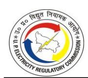

**TABLE 4-99: APPROVED CONSUMER CONTRIBUTION OF PUVVNL FOR FY 2023-24 (IN RS. CRORE)**

| Particulars                                 | Approved in Tariff Order dated May 24, 2023 | Claimed  | Approved |
|---------------------------------------------|------------------------------------------------------|----------|----------|
| Opening Balance of Consumer Contributions   | 4,960.76                                             | 5,245.69 | 5,372.98 |
| Additions during the year                   | -                                                    | 244.61   | 244.61   |
| Less: Amortization on consumer contribution | -                                                    |          | 201.01*  |
| Closing Balance                             | 4,960.76                                             | 5,490.30 | 5,416.58 |

*\* Petitioner has not claimed Amortization on consumer contribution. The Commission has approved the value as per the Audited Balance Sheet.*

**TABLE 4-100: APPROVED CONSUMER CONTRIBUTION OF KESCO FOR FY 2023-24 (IN RS. CRORE)**

| Particulars                                 | Approved in Tariff Order dated May 24, 2023 | Claimed | Approved |
|---------------------------------------------|------------------------------------------------------|---------|----------|
| Opening Balance of Consumer Contributions   | 424.88                                               | 414.70  | 430.93   |
| Additions during the year                   | -                                                    | 10.26   | 10.26    |
| Less: Amortization on consumer contribution | -                                                    | 19.34   | 19.34    |
| Closing Balance                             | 424.88                                               | 405.62  | 421.85   |

**TABLE 4-101: APPROVED CONSOLIDATED CONSUMER CONTRIBUTION FOR FY 2023-24 (IN RS. CRORE)**

| Particulars                                 | Approved in Tariff Order dated May 24, 2023 | Claimed   | Approved  |
|---------------------------------------------|------------------------------------------------------|-----------|-----------|
| Opening Balance of Consumer Contributions   | 15,858.92                                            | 23,440.49 | 24,219.12 |
| Additions during the year                   | -                                                    | 2,213.54  | 2,213.54  |
| Less: Amortization on consumer contribution | -                                                    | 762.84    | 963.85    |
| Closing Balance                             | 15,858.92                                            | 24,891.19 | 25,468.81 |

#### **Financing of Capital Investment:**

- 4.8.9. The Commission has approved capital investment and its financing, considering the provisions of MYT Regulations, 2019, wherein capitalization (GFA addition during the year based on the 'Put to Use' philosophy) and its funding has been considered.
- 4.8.10. The Commission observes that out of the total capitalization, some portion has been financed through consumer contributions, subsidies, and grants received during FY 2023-24, and the balance has been funded through Debt and Equity in the ratio of

- 70:30. Accordingly, the Commission has considered capitalization net of consumer contributions, subsidies, and grants received during the year. Decapitalization and corresponding accumulated depreciation have been taken from the audited books of accounts. Such accumulated depreciation, on account of Decapitalization has been adjusted in the computation of debt. As a result, the debt addition computed by the Commission is higher in comparison to the Petitioners claim.
- 4.8.11. Based on the above, financing of the capitalization claimed by the Petitioners and approved by the Commission is shown in the Tables below:

**TABLE 4-102: APPROVED FINANCING OF TOTAL CAPITALISATION OF DVVNL IN FY 2023-24 (IN RS. CRORE)**

| Particulars                                            | Derivation      | Approved in Tariff Order dated May 24, 2023 | Claimed  | Approved |
|--------------------------------------------------------|-----------------|------------------------------------------------------------|----------|----------|
| Total Investment during the year (Asset Put to use) | A               | 1,559.62                                                   | 2,532.77 | 2,532.77 |
| Less:                                                  |                 |                                                            |          |          |
| Consumer Contribution, Grants                          | B               | -                                                          | 579.30   | 579.30   |
| Investment funded by debt and equity                | C=A-B           | 1,559.62                                                   | 1,953.47 | 1,953.47 |
| Debt Addition                                          | D=70% of C      | 1,091.73                                                   | 1,367.43 | 1,367.43 |
| Equity Addition                                        | E=30% of C      | 467.89                                                     | 586.04   | 586.04   |
| De-capitalizations                                     | F               |                                                            |          | 905.14   |
| Acc Depreciation Adj/Deletion                          | G               |                                                            |          | 117.87   |
| Debt Deletion                                          | H= (70% of F)-G |                                                            |          | 515.73   |
| Equity Deletion                                        | I=30% of F      |                                                            |          | 271.54   |
| Net Debt Addition                                      | J=D-H           |                                                            |          | 851.70   |
| Net Equity Addition                                    | L=E-I           |                                                            |          | 314.50   |

**TABLE 4-103: APPROVED FINANCING OF TOTAL CAPITALISATION OF MVVNL IN FY 2023-24 (IN RS. CRORE)**

| Particulars                                            | Derivation | Approved in Tariff Order dated May 24, 2023 | Claimed  | Approved |
|--------------------------------------------------------|------------|------------------------------------------------------|----------|----------|
| Total Investment during the year (Asset Put to use) | A          | 1,304.19                                             | 2,141.30 | 2,141.30 |
| Less:                                                  |            |                                                      |          |          |
| Consumer Contribution, Grants                       | B          | -                                                    | 503.26   | 503.26   |

| Particulars                             | Derivation      | Approved in Tariff Order dated May 24, 2023 | Claimed  | Approved |
|-----------------------------------------|-----------------|------------------------------------------------------|----------|----------|
| Investment funded by debt and equity | C=A-B           | 1,304.19                                             | 1,638.04 | 1,638.04 |
| Debt Addition                           | D=70% of C      | 912.93                                               | 1,146.63 | 1,146.63 |
| Equity Addition                         | E=30% of C      | 391.26                                               | 491.41   | 491.41   |
| De-capitalizations                      | F               |                                                      |          | 841.65   |
| Acc Depreciation Adj/Deletion        | G               |                                                      |          | 469.72   |
| Debt Deletion                           | H= (70% of F)-G |                                                      |          | 119.44   |
| Equity Deletion                         | I=30% of F      |                                                      |          | 252.50   |
| Net Debt Addition                       | J=D-H           |                                                      |          | 1,027.19 |
| Net Equity Addition                     | L=E-I           |                                                      |          | 238.92   |

**TABLE 4-104: APPROVED FINANCING OF TOTAL CAPITALISATION OF PVVNL IN FY 2023-24 (IN RS. CRORE)**

| Particulars                                            | Derivation      | Approved in Tariff Order dated May 24, 2023 | Claimed  | Approved |
|--------------------------------------------------------|-----------------|------------------------------------------------------|----------|----------|
| Total Investment during the year (Asset Put to use) | A               | 854.59                                               | 1,577.40 | 1,577.40 |
| Less:                                                  |                 |                                                      |          |          |
| Consumer Contribution, Grants                       | B               | -                                                    | 876.11   | 876.11   |
| Investment funded by debt and equity                | C=A-B           | 854.59                                               | 701.29   | 701.29   |
| Debt Addition                                          | D=70% of C      | 598.21                                               | 490.90   | 490.90   |
| Equity Addition                                        | E=30% of C      | 256.38                                               | 210.39   | 210.39   |
| De-capitalizations                                     | F               |                                                      |          | 721.86   |
| Acc Depreciation Adj/Deletion                       | G               |                                                      |          | 139.67   |
| Debt Deletion                                          | H= (70% of F)-G |                                                      |          | 365.63   |
| Equity Deletion                                        | I=30% of F      |                                                      |          | 216.56   |
| Net Debt Addition                                      | J=D-H           |                                                      |          | 125.27   |
| Net Equity Addition                                    | L=E-I           |                                                      |          | (6.17)   |

**TABLE 4-105: APPROVED FINANCING OF TOTAL CAPITALISATION OF PUVVNL IN FY 2023-24 (IN RS. CRORE)**

| Particulars                                            | Derivation | Approved in Tariff Order dated May 24, 2023 | Claimed  | Approved |
|--------------------------------------------------------|------------|------------------------------------------------------|----------|----------|
| Total Investment during the year (Asset Put to use) | A          | 1,416.98                                             | 2,517.88 | 2,517.88 |
| Less:                                                  |            |                                                      |          |          |

| Particulars                             | Derivation      | Approved in Tariff Order dated May 24, 2023 | Claimed  | Approved |
|-----------------------------------------|-----------------|------------------------------------------------------|----------|----------|
| Consumer Contribution, Grants           | B               | -                                                    | 244.61   | 244.61   |
| Investment funded by debt and equity | C=A-B           | 1,416.98                                             | 2,273.27 | 2,273.27 |
| Debt Addition                           | D=70% of C      | 991.89                                               | 1,591.29 | 1,591.29 |
| Equity Addition                         | E=30% of C      | 425.09                                               | 681.98   | 681.98   |
| De-capitalizations                      | F               |                                                      |          | 987.93   |
| Acc Depreciation Adj/Deletion           | G               |                                                      |          | 146.73   |
| Debt Deletion                           | H= (70% of F)-G |                                                      |          | 544.82   |
| Equity Deletion                         | I=30% of F      |                                                      |          | 296.38   |
| Net Debt Addition                       | J=D-H           |                                                      |          | 1,046.47 |
| Net Equity Addition                     | L=E-I           |                                                      |          | 385.60   |

**TABLE 4-106: APPROVED FINANCING OF TOTAL CAPITALISATION OF KESCO IN FY 2023-24 (IN RS. CRORE)**

| Particulars                                            | Derivation      | Approved in Tariff Order dated May 24, 2023 | Claimed | Approved |
|--------------------------------------------------------|-----------------|------------------------------------------------------|---------|----------|
| Total Investment during the year (Asset Put to use) | A               | 144.38                                               | 30.55   | 30.55    |
| Less:                                                  |                 |                                                      |         |          |
| Consumer Contribution, Grants                       | B               | -                                                    | 10.26   | 10.26    |
| Investment funded by debt and equity                | C=A-B           | 144.38                                               | 20.29   | 20.29    |
| Debt Addition                                          | D=70% of C      | 101.07                                               | 14.20   | 14.20    |
| Equity Addition                                        | E=30% of C      | 43.31                                                | 6.09    | 6.09     |
| De-capitalizations                                     | F               |                                                      |         | -        |
| Acc Depreciation Adj/Deletion                          | G               |                                                      |         | -        |
| Debt Deletion                                          | H= (70% of F)-G |                                                      |         | -        |
| Equity Deletion                                        | I=30% of F      |                                                      |         | -        |
| Net Debt Addition                                      | J=D-H           |                                                      |         | 14.20    |
| Net Equity Addition                                    | L=E-I           |                                                      |         | 6.09     |

**TABLE 4-107: APPROVED CONSOLIDATED FINANCING OF TOTAL CAPITALISATION IN FY 2023-24 (IN RS. CRORE)**

| Particulars                                            | Derivation | Approved in Tariff Order dated May 24, 2023 | Claimed  | Approved |
|--------------------------------------------------------|------------|------------------------------------------------------|----------|----------|
| Total Investment during the year (Asset Put to use) | A          | 5,279.75                                             | 8,799.90 | 8,799.90 |
| Less:                                                  |            |                                                      |          |          |
| Consumer Contribution, Grants                          | B          | -                                                    | 2,213.54 | 2,213.54 |

| Particulars                             | Derivation      | Approved in Tariff Order dated May 24, 2023 | Claimed  | Approved |
|-----------------------------------------|-----------------|------------------------------------------------------|----------|----------|
| Investment funded by debt and equity | C=A-B           | 5,279.75                                             | 6,586.36 | 6,586.36 |
| Debt Addition                           | D=70% of C      | 3,695.83                                             | 4,610.45 | 4,610.45 |
| Equity Addition                         | E=30% of C      | 1,583.93                                             | 1,975.91 | 1,975.91 |
| De-capitalizations                      | F               |                                                      |          | 3,456.58 |
| Acc Depreciation Adj/Deletion           | G               |                                                      |          | 873.99   |
| Debt Deletion                           | H= (70% of F)-G |                                                      |          | 1,545.62 |
| Equity Deletion                         | I=30% of F      |                                                      |          | 1,036.97 |
| Net Debt Addition                       | J=D-H           |                                                      |          | 3,064.84 |
| Net Equity Addition                     | L=E-I           |                                                      |          | 938.93   |

#### **4.9. DEPRECIATION**

#### *Petitioners' Submission:*

- 4.9.1. The Petitioners have computed the allowable depreciation expense on the GFA base (Part A & B) as per Audited Accounts for FY 2023-24 and at the rates stipulated by the Commission in Annexure A of MYT Regulations, 2019. The Petitioners have computed the depreciation only on the depreciable asset base and have excluded the nondepreciable assets such as land, land rights, etc. Further, the Petitioners have traced the figures concerning depreciation charged on assets created out of consumer contributions, capital grants, and subsidies from the Audited Accounts for FY 2023-24. The depreciation so traced out from consumer contribution/grant/subsidies has been reduced from the allowable depreciation for FY 2023-24.
- 4.9.2. The depreciation has been calculated in two parts (Part A & B) for the asset blocks created before 01.04.2020 and asset blocks created after 01.04.2020 as per the SLM methodology prescribed in MYT Regulations, 2019. The addition to GFA is considered in Part B, and the same is considered net of Consumer contribution and grants. Considering this philosophy, the gross entitlement towards depreciation has been computed as shown in the Tables below:

#### **TABLE 4-108: GROSS ALLOWABLE DEPRECIATION FOR FY 2023-24 AS SUBMITTED BY DVVNL (IN RS. CRORE) (PART- A)**

|      |                             | Opening GFA | Deducti |                |                | Depreci | Allowable    |
|------|-----------------------------|-------------|---------|----------------|----------------|---------|--------------|
| S.N. | Particulars                 | (as on      | on to   | Closing GFA | Average GFA | ation   | Gross        |
|      |                             | 31.03.2023) | GFA     |                |                | Rate    | Depreciation |
| 1    | Land & Land Rights          | 1.25        | -       | 1.25           | 1.25           | 0.00%   | -            |
| 2    | Buildings                   | 207.77      | -       | 207.77         | 207.77         | 3.34%   | 6.94         |
| 3    | Other Civil Works           | -           | -       | -              | -              | 3.34%   | -            |
| 4    | Plant & Machinery           |             |         |                |                | 5.28%   |              |
| 5    | Lines, Cables, Network etc. | 6,669.28    | 433.85  | 6,235.43       | 6,452.36       | 5.28%   | 340.68       |
| 6    | Vehicles                    | 3.16        | -       | 3.16           | 3.16           | 9.50%   | 0.30         |
| 7    | Furniture & Fixtures        | 8.19        | -       | 8.19           | 8.19           | 6.33%   | 0.52         |
| 8    | Office Equipment            | 0.47        | -       | 0.47           | 0.47           | 6.33%   | 0.03         |
| 9    | Intangible Assets           | -           | -       | -              | -              | 15.00%  | -            |
| 10   | Total Fixed Assets          | 6,890.12    | 433.85  | 6,456.27       | 6,673.20       | 5.22%   | 348.47       |
|      | Non-Depreciable Assets      |             |         |                |                |         |              |
| 11   | (Land & Land Rights)        | 1.25        | -       | -              | -              | -       | -            |
| 12   | Depreciable Assets          | 6,888.87    | 433.85  | 6,456.27       | 6,673.20       | 5.22%   | 348.47       |

**TABLE 4-109: GROSS ALLOWABLE DEPRECIATION FOR FY 2023-24 AS SUBMITTED BY DVVNL (IN RS. CRORE) (PART- B)**

| S.N. | Particulars                                    | Opening GFA (as on 31.03.2023) | Addition to GFA | Deducti on to GFA | Closing GFA | Average GFA | Depreci ation Rate | Allowab le Gross Depreci ation |
|------|------------------------------------------------|--------------------------------------|--------------------|-------------------------|----------------|----------------|--------------------------|-----------------------------------------|
| 1    | Land & Land Rights                             | 0.18                                 | -                  | -                       | 0.18           | 0.18           | 0.00%                    | -                                       |
| 2    | Buildings                                      | 91.36                                | 45.94              | -                       | 137.30         | 114.33         | 3.34%                    | 3.82                                    |
| 3    | Other Civil Works                              | -                                    | -                  | -                       | -              | -              | 3.34%                    | -                                       |
| 4    | Plant & Machinery                              | 2,414.87                             | 1,317.43           | 453.30                  | 3,279.00       | 2,846.93       | 5.28%                    | 150.32                                  |
| 5    | Lines, Cables, Network etc.                    | 4,938.71                             | 1,167.30           | 17.99                   | 6,088.02       | 5,513.37       | 5.28%                    | 291.11                                  |
| 6    | Vehicles                                       | 0.18                                 | -                  | -                       | 0.18           | 0.18           | 9.50%                    | 0.02                                    |
| 7    | Furniture & Fixtures                           | 3.92                                 | 0.69               | -                       | 4.61           | 4.27           | 6.33%                    | 0.27                                    |
| 8    | Office Equipment                               | 6.25                                 | 1.17               | -                       | 7.42           | 6.84           | 6.33%                    | 0.43                                    |
| 9    | Intangible Assets                              | 29.32                                | 0.24               | -                       | 29.56          | 29.44          | 15.00%                   | 4.42                                    |
| 10   | Total Fixed Assets                             | 7,484.79                             | 2,532.77           | 471.29                  | 10,017.56      | 8,751.18       | 5.15%                    | 450.38                                  |
| 11   | Non-Depreciable Assets (Land & Land Rights) | 0.18                                 | -                  | -                       | -              | -              | -                        | -                                       |
| 12   | Depreciable Assets                             | 7,484.61                             | 2,532.77           | 471.29                  | 10,017.56      | 8,751.18       | 5.15%                    | 450.38                                  |

#### **TABLE 4-110: GROSS ALLOWABLE DEPRECIATION FOR FY 2023-24 AS SUBMITTED BY MVVNL (IN RS. CRORE) (PART- A)**

|      |                             | Opening GFA | Deducti |                |                | Depreci | Allowable    |
|------|-----------------------------|-------------|---------|----------------|----------------|---------|--------------|
| S.N. | Particulars                 | (as on      | on to   | Closing GFA | Average GFA | ation   | Gross        |
|      |                             | 31.03.2023) | GFA     |                |                | Rate    | Depreciation |
| 1    | Land & Land Rights          | 1.07        | -       | 1.07           | 1.07           | 0.00%   | -            |
| 2    | Buildings                   | 182.32      | -       | 182.32         | 182.32         | 3.34%   | 6.09         |
| 3    | Other Civil Works           | 14.27       | -       | 14.27          | 14.27          | 3.34%   | 0.48         |
| 4    | Plant & Machinery           |             |         |                |                | 5.28%   |              |
| 5    | Lines, Cables, Network etc. | 3,321.12    | 247.90  | 3,073.22       | 3,197.17       | 5.28%   | 168.81       |
| 6    | Vehicles                    | 5.55        | 0.09    | 5.46           | 5.51           | 9.50%   | 0.52         |
| 7    | Furniture & Fixtures        | 9.59        | -       | 9.59           | 9.59           | 6.33%   | 0.61         |
| 8    | Office Equipment            | 76.48       | -       | 76.48          | 76.48          | 6.33%   | 4.84         |
| 9    | Intangible Assets           | -           | -       | -              | -              | 15.00%  | -            |
| 10   | Total Fixed Assets          | 3,610.40    | 247.98  | 3,362.42       | 3,486.41       | 5.20%   | 181.35       |
|      | Non-Depreciable Assets      |             |         |                |                |         |              |
| 11   | (Land & Land Rights)        | 1.07        | -       | -              | -              | -       | -            |
| 12   | Depreciable Assets          | 3,609.33    | 247.98  | 3,362.42       | 3,486.41       | 5.20%   | 181.35       |

**TABLE 4-111: GROSS ALLOWABLE DEPRECIATION FOR FY 2023-24 AS SUBMITTED BY MVVNL (IN RS. CRORE) (PART- B)**

| S.N. | Particulars                 | Opening GFA net of Grant (as on 01.04.2023) | Addition to GFA | Deduc tion to GFA | Closing GFA | Average GFA | Depreci ation Rate | Allowa ble Gross Deprec iation |
|------|-----------------------------|------------------------------------------------------|--------------------|-------------------------|----------------|----------------|--------------------------|--------------------------------------------|
| 1    | Land & Land Rights          | 0.31                                                 | -                  | -                       | 0.31           | 0.31           | 0.00%                    | -                                          |
| 2    | Buildings                   | 117.19                                               | 10.02              | -                       | 127.21         | 122.20         | 3.34%                    | 4.08                                       |
| 3    | Other Civil Works           | 4.16                                                 | -                  | -                       | 4.16           | 4.16           | 3.34%                    | 0.14                                       |
| 4    | Plant & Machinery           | 2,712.02                                             | 1,357.69           | 573.70                  | 3,496.01       | 3,104.01       | 5.28%                    | 163.89                                     |
| 5    | Lines, Cables, Network etc. | 5,715.84                                             | 767.34             | 19.75                   | 6,463.43       | 6,089.63       | 5.28%                    | 321.53                                     |
| 6    | Vehicles                    | 2.15                                                 | -                  | 0.21                    | 1.94           | 2.04           | 9.50%                    | 0.19                                       |
| 7    | Furniture & Fixtures        | 4.47                                                 | 0.34               | -                       | 4.81           | 4.64           | 6.33%                    | 0.29                                       |
| 8    | Office Equipment            | 59.02                                                | 1.48               | -                       | 60.50          | 59.76          | 6.33%                    | 3.78                                       |
| 9    | Intangible Assets           | 27.98                                                | 4.43               | -                       | 32.41          | 30.20          | 15.00%                   | 4.53                                       |
| 10   | Total Fixed Assets          | 8,643.14                                             | 2,141.30           | 593.67                  | 10,784.44      | 9,713.79       | 5.13%                    | 498.45                                     |
| 11   | Non-Depreciable Assets      | 0.31                                                 | -                  | -                       | -              | -              | -                        | -                                          |
|      | (Land & Land Rights)        |                                                      |                    |                         |                |                |                          |                                            |
| 12   | Depreciable Assets          | 8,642.83                                             | 2,141.30           | 593.67                  | 10,784.44      | 9,713.79       | 5.13%                    | 498.45                                     |

#### **TABLE 4-112: GROSS ALLOWABLE DEPRECIATION FOR FY 2023-24 AS SUBMITTED BY PVVNL (IN RS. CRORE) (PART- A)**

|      |                             | Opening GFA | Deducti | Closing  | Average  | Depreci | Allowable    |
|------|-----------------------------|-------------|---------|----------|----------|---------|--------------|
| S.N. | Particulars                 | (as on      | on to   | GFA      | GFA      | ation   | Gross        |
|      |                             | 31.03.2023) | GFA     |          |          | Rate    | Depreciation |
| 1    | Land & Land Rights          | 2.67        | -       | 2.67     | 2.67     | 0.00%   | -            |
| 2    | Buildings                   | 275.93      | 0.02    | 275.91   | 275.92   | 3.34%   | 9.22         |
| 3    | Other Civil Works           | -           | -       | -        | -        | 3.34%   | -            |
| 4    | Plant & Machinery           |             |         |          |          | 5.28%   |              |
| 5    | Lines, Cables, Network etc. | 7,051.96    | 422.55  | 6,629.41 | 6,840.68 | 5.28%   | 361.19       |
| 6    | Vehicles                    | 30.14       | 0.05    | 30.09    | 30.12    | 9.50%   | 2.86         |
| 7    | Furniture & Fixtures        | 5.63        | -       | 5.63     | 5.63     | 6.33%   | 0.36         |
| 8    | Office Equipment            | 20.53       | 0.04    | 20.49    | 20.51    | 6.33%   | 1.30         |
| 9    | Intangible Assets           | -           | -       | -        | -        | 15.00%  | -            |
| 10   | Total Fixed Assets          | 7,386.86    | 422.66  | 6,964.20 | 7,175.53 | 5.22%   | 374.92       |
|      | Non-Depreciable Assets      |             |         |          |          |         |              |
| 11   | (Land & Land Rights)        | 2.67        | -       | -        | -        | -       | -            |
| 12   | Depreciable Assets          | 7,384.19    | 422.66  | 6,964.20 | 7,175.53 | 5.22%   | 374.92       |

**TABLE 4-113: GROSS ALLOWABLE DEPRECIATION FOR FY 2023-24 AS SUBMITTED BY PVVNL (IN RS. CRORE) (PART- B)**

| S.N. | Particulars                 | Opening GFA net of Grant (as on 01.04.2023) | Addition to GFA | Deduc tion to GFA | Closing GFA | Average GFA | Depreci ation Rate | Allowa ble Gross Deprec iation |
|------|-----------------------------|------------------------------------------------------|--------------------|-------------------------|----------------|----------------|--------------------------|--------------------------------------------|
| 1    | Land & Land Rights          | 0.32                                                 | -                  | -                       | 0.32           | 0.32           | 0.00%                    | -                                          |
| 2    | Buildings                   | 84.47                                                | 4.81               | 0.02                    | 89.26          | 86.87          | 3.34%                    | 2.90                                       |
| 3    | Other Civil Works           | 2.43                                                 | -                  | -                       | 2.43           | 2.43           | 3.34%                    | 0.08                                       |
| 4    | Plant & Machinery           | 1,611.80                                             | 753.21             | 268.19                  | 2,096.82       | 1,854.31       | 5.28%                    | 97.91                                      |
| 5    | Lines, Cables, Network etc. | 3,456.87                                             | 815.39             | 30.94                   | 4,241.32       | 3,849.09       | 5.28%                    | 203.23                                     |
| 6    | Vehicles                    | 0.20                                                 | -                  | 0.03                    | 0.17           | 0.18           | 9.50%                    | 0.02                                       |
| 7    | Furniture & Fixtures        | 2.22                                                 | 0.06               | -                       | 2.28           | 2.25           | 6.33%                    | 0.14                                       |
| 8    | Office Equipment            | 13.36                                                | 3.54               | 0.02                    | 16.88          | 15.12          | 6.33%                    | 0.96                                       |
| 9    | Intangible Assets           | 57.58                                                | 0.39               | -                       | 57.97          | 57.78          | 15.00%                   | 8.67                                       |
| 10   | Total Fixed Assets          | 5,229.25                                             | 1,577.40           | 299.20                  | 6,806.65       | 6,017.95       | 5.22%                    | 313.91                                     |
| 11   | Non-Depreciable Assets      |                                                      |                    |                         |                |                |                          |                                            |
|      | (Land & Land Rights)        | 0.32                                                 | -                  | -                       | -              | -              | -                        | -                                          |
| 12   | Depreciable Assets          | 5,228.93                                             | 1,577.40           | 299.20                  | 6,806.65       | 6,017.95       | 5.22%                    | 313.91                                     |

#### **TABLE 4-114: GROSS ALLOWABLE DEPRECIATION FOR FY 2023-24 AS SUBMITTED BY PUVVNL (IN RS. CRORE) (PART- A)**

| S.N. | Particulars                 | Opening GFA (as on 31.03.2023) | Deducti on to GFA | Closing GFA | Average GFA | Depreci ation Rate | Allowable Gross Depreciation |
|------|-----------------------------|--------------------------------------|-------------------------|----------------|----------------|--------------------------|------------------------------------|
| 1    | Land & Land Rights          | 2.32                                 | -                       | 2.32           | 2.32           | 0.00%                    | -                                  |
| 2    | Buildings                   | 148.53                               | -                       | 148.53         | 148.53         | 3.34%                    | 4.96                               |
| 3    | Other Civil Works           | -                                    | -                       | -              | -              | 3.34%                    | -                                  |
| 4    | Plant & Machinery           |                                      |                         |                |                | 5.28%                    |                                    |
| 5    | Lines, Cables, Network etc. | 5,486.25                             | 496.14                  | 4,990.11       | 5,238.18       | 5.28%                    | 276.58                             |
| 6    | Vehicles                    | 0.43                                 | -                       | 0.43           | 0.43           | 9.50%                    | 0.04                               |
| 7    | Furniture & Fixtures        | 4.49                                 | -                       | 4.49           | 4.49           | 6.33%                    | 0.28                               |
| 8    | Office Equipment            | 58.91                                | 0.01                    | 58.90          | 58.90          | 6.33%                    | 3.73                               |
| 9    | Intangible Assets           | -                                    | -                       | -              | -              | 15.00%                   | -                                  |
| 10   | Total Fixed Assets          | 5,700.93                             | 496.15                  | 5,204.78       | 5,452.85       | 5.24%                    | 285.59                             |
|      | Non-Depreciable Assets      |                                      |                         |                |                |                          |                                    |
| 11   | (Land & Land Rights)        | 0.32                                 | -                       | -              | -              | -                        | -                                  |
| 12   | Depreciable Assets          | 5,700.61                             | 496.15                  | 5,204.78       | 5,452.85       | 5.24%                    | 285.59                             |

**TABLE 4-115: GROSS ALLOWABLE DEPRECIATION FOR FY 2023-24 AS SUBMITTED BY PUVVNL (IN RS. CRORE) (PART- B)**

| S.N. | Particulars                                    | Opening GFA net of Grant (as on 01.04.2023) | Addition to GFA | Deduc tion to GFA | Closing GFA | Average GFA | Depreci ation Rate | Allowa ble Gross Depre ciation |
|------|------------------------------------------------|------------------------------------------------------|--------------------|-------------------------|----------------|----------------|--------------------------|--------------------------------------------|
| 1    | Land & Land Rights                             | 0.14                                                 | -                  | -                       | 0.14           | 0.14           | 0.00%                    | -                                          |
| 2    | Buildings                                      | 117.67                                               | 30.62              | -                       | 148.29         | 132.98         | 3.34%                    | 4.44                                       |
| 3    | Other Civil Works                              | -                                                    | 0.04               | -                       | 0.04           | 0.02           | 3.34%                    | 0.00                                       |
| 4    | Plant & Machinery                              | 3,443.94                                             | 1,902.02           | 479.61                  | 4,866.35       | 4,155.14       | 5.28%                    | 219.39                                     |
| 5    | Lines, Cables, Network etc.                    | 2,031.88                                             | 583.59             | 12.16                   | 2,603.31       | 2,317.60       | 5.28%                    | 122.37                                     |
| 6    | Vehicles                                       | 0.21                                                 | -                  | -                       | 0.21           | 0.21           | 9.50%                    | 0.02                                       |
| 7    | Furniture & Fixtures                           | 1.08                                                 | 0.62               | -                       | 1.70           | 1.39           | 6.33%                    | 0.09                                       |
| 8    | Office Equipment                               | 10.42                                                | 0.67               | 0.01                    | 11.08          | 10.75          | 6.33%                    | 0.68                                       |
| 9    | Intangible Assets                              | 45.30                                                | 0.32               | -                       | 45.62          | 45.46          | 15.00%                   | 6.82                                       |
| 10   | Total Fixed Assets                             | 5,650.64                                             | 2,517.88           | 491.78                  | 8,168.52       | 6,909.58       | 5.12%                    | 353.81                                     |
| 11   | Non-Depreciable Assets (Land & Land Rights) | 0.14                                                 | -                  | -                       | -              | -              | -                        | -                                          |
| 12   | Depreciable Assets                             | 5,650.50                                             | 2,517.88           | 491.78                  | 8,168.52       | 6,909.58       | 5.12%                    | 353.81                                     |

**TABLE 4-116: GROSS ALLOWABLE DEPRECIATION FOR FY 2023-24 AS SUBMITTED BY KESCO (IN RS. CRORE) (PART- A)**

|      |                             | Opening GFA | Deducti |                |                | Depreci | Allowable    |
|------|-----------------------------|-------------|---------|----------------|----------------|---------|--------------|
| S.N. | Particulars                 | (as on      | on to   | Closing GFA | Average GFA | ation   | Gross        |
|      |                             | 31.03.2023) | GFA     |                |                | Rate    | Depreciation |
| 1    | Land & Land Rights          | -           | 0.00    | 0.00           | 0.00           | 0.00%   | -            |
| 2    | Buildings                   | 34.59       | 0.00    | 34.59          | 34.59          | 3.34%   | 1.16         |
| 3    | Other Civil Works           | -           | 0.00    | 0.00           | 0.00           | 3.34%   | 0.00         |
| 4    | Plant & Machinery           | 233.88      | 0.00    | 233.88         | 233.88         | 5.28%   | 12.35        |
| 5    | Lines, Cables, Network etc. | 479.85      | 0.00    | 479.85         | 479.85         | 5.28%   | 25.34        |
| 6    | Vehicles                    | 1.87        | 0.00    | 1.87           | 1.87           | 9.50%   | 0.18         |
| 7    | Furniture & Fixtures        | 1.64        | 0.00    | 1.64           | 1.64           | 6.33%   | 0.10         |
| 8    | Office Equipment            | 12.71       | 0.00    | 12.71          | 12.71          | 6.33%   | 0.80         |
| 9    | Intangible Assets           | -           | -       | -              | -              | 15.00%  | -            |
| 10   | Total Fixed Assets          | 764.54      | 0.00    | 764.54         | 764.54         | 5.22%   | 39.93        |
|      | Non-Depreciable Assets      |             |         |                |                |         |              |
| 11   | (Land & Land Rights)        | -           | -       | -              | -              | -       | -            |
| 12   | Depreciable Assets          | 764.54      | 0.00    | 764.54         | 764.54         | 5.22%   | 39.93        |

**TABLE 4-117: GROSS ALLOWABLE DEPRECIATION FOR FY 2023-24 AS SUBMITTED BY KESCO (IN RS. CRORE) (PART- B)**

| S.N. | Particulars                 | Opening GFA net of Grant (as on 01.04.2023) | Additi on to GFA | Deduc tion to GFA | Closing GFA | Average GFA | Depreci ation Rate | Allowa ble Gross Depre ciation |
|------|-----------------------------|------------------------------------------------------|------------------------|-------------------------|----------------|----------------|--------------------------|--------------------------------------------|
| 1    | Land & Land Rights          | -                                                    | -                      | 0.00                    | 0.00           | 0.00           | 0.00%                    | -                                          |
| 2    | Buildings                   | 4.83                                                 | 1.20                   | 0.00                    | 6.03           | 5.43           | 3.34%                    | 0.18                                       |
| 3    | Other Civil Works           | -                                                    | -                      | 0.00                    | 0.00           | 0.00           | 3.34%                    | 0.00                                       |
| 4    | Plant & Machinery           | 29.83                                                | 7.67                   | 0.00                    | 37.50          | 33.66          | 5.28%                    | 1.78                                       |
| 5    | Lines, Cables, Network etc. | 131.59                                               | 10.70                  | 0.00                    | 142.29         | 136.94         | 5.28%                    | 7.23                                       |
| 6    | Vehicles                    | 0.13                                                 | -                      | 0.00                    | 0.13           | 0.13           | 9.50%                    | 0.01                                       |
| 7    | Furniture & Fixtures        | 0.24                                                 | 0.41                   | 0.00                    | 0.65           | 0.44           | 6.33%                    | 0.03                                       |
| 8    | Office Equipment            | 7.16                                                 | 1.93                   | 0.00                    | 9.09           | 8.12           | 6.33%                    | 0.51                                       |
| 9    | Intangible Assets           | 5.32                                                 | 8.64                   | -                       | 13.96          | 9.64           | 15.00%                   | 1.45                                       |
| 10   | Total Fixed Assets          | 179.10                                               | 30.55                  | 0.00                    | 209.65         | 194.38         | 5.76%                    | 11.19                                      |
| 11   | Non-Depreciable Assets      | -                                                    | -                      | -                       | -              | -              | -                        | -                                          |
|      | (Land & Land Rights)        |                                                      |                        |                         |                |                |                          |                                            |
| 12   | Depreciable Assets          | 179.10                                               | 30.55                  | 0.00                    | 209.65         | 194.38         | 5.76%                    | 11.19                                      |

4.9.3. The Depreciation, as approved by the Commission in the Tariff Order for FY 2023-24 and as computed by the Petitioners, is shown in the Table below:

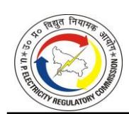

#### **TABLE 4-118: NET ALLOWABLE DEPRECIATION FOR FY 2023-24 AS SUBMITTED BY DVVNL (IN RS. CRORE)**

| Particulars                             | Approved in Tariff order dated 24.05.2023 | Claimed |  |  |
|-----------------------------------------|----------------------------------------------|---------|--|--|
| Gross Allowable Depreciation            | 541.58                                       | 798.85  |  |  |
| Less: Equivalent amount of depreciation |                                              |         |  |  |
| on assets acquired out of the Consumer  | 0.00                                         | 252.64  |  |  |
| Contribution and GoUP Subsidy           |                                              |         |  |  |
| Net Allowable Depreciation              | 541.58                                       | 546.21  |  |  |

#### **TABLE 4-119: NET ALLOWABLE DEPRECIATION FOR FY 2023-24 AS SUBMITTED BY MVVNL (IN RS. CRORE)**

| Particulars                             | Approved in Tariff order dated 24.05.2023 | Claimed |  |  |
|-----------------------------------------|----------------------------------------------|---------|--|--|
| Gross Allowable Depreciation            | 510.30                                       | 679.79  |  |  |
| Less: Equivalent amount of depreciation |                                              |         |  |  |
| on assets acquired out of the Consumer  | -                                            | 202.41  |  |  |
| Contribution and GoUP Subsidy           |                                              |         |  |  |
| Net Allowable Depreciation              | 510.30                                       | 477.38  |  |  |

#### **TABLE 4-120: NET ALLOWABLE DEPRECIATION FOR FY 2023-24 AS SUBMITTED BY PVVNL (IN RS. CRORE)**

| Particulars                         | Approved in Tariff order dated 24.05.2023 | Claimed |  |  |
|-------------------------------------|----------------------------------------------|---------|--|--|
| Gross Allowable Depreciation        | 485.10                                       | 688.83  |  |  |
| Less: Equivalent amount of          |                                              |         |  |  |
| depreciation on assets acquired out |                                              |         |  |  |
| of the Consumer Contribution and    | -                                            | 288.45  |  |  |
| GoUP Subsidy                        |                                              |         |  |  |
| Net Allowable Depreciation          | 485.10                                       | 400.38  |  |  |

#### **TABLE 4-121: NET ALLOWABLE DEPRECIATION FOR FY 2023-24 AS SUBMITTED BY PUVVNL (IN RS. CRORE)**

| Particulars                             | Approved in Tariff order dated 24.05.2023 | Claimed |
|-----------------------------------------|----------------------------------------------|---------|
| Gross Allowable Depreciation            | 525.05                                       | 639.40  |
| Less: Equivalent amount of depreciation |                                              |         |
| on assets acquired out of the Consumer  | 0.00                                         | 0.00    |
| Contribution and GoUP Subsidy           |                                              |         |
| Net Allowable Depreciation              | 525.05                                       | 639.40  |

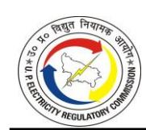

**TABLE 4-122: NET ALLOWABLE DEPRECIATION FOR FY 2023-24 AS SUBMITTED BY KESCO (IN RS. CRORE)**

| Particulars                             | Approved in Tariff order dated 24.05.2023 | Claimed |  |  |
|-----------------------------------------|----------------------------------------------|---------|--|--|
| Gross Allowable Depreciation            | 38.05                                        | 51.12   |  |  |
| Less: Equivalent amount of depreciation |                                              |         |  |  |
| on assets acquired out of the Consumer  | 0.00                                         | 19.34   |  |  |
| Contribution and GoUP Subsidy           |                                              |         |  |  |
| Net Allowable Depreciation              | 38.05                                        | 31.78   |  |  |

#### *Commission's Analysis:*

- 4.9.4. The Commission has computed depreciation as per Regulation 21 of MYT Regulations, 2019. In the previous Tariff Orders, the Commission had directed the Petitioners to maintain a separate individual asset-wise Fixed Asset Register (FAR) for assets capitalised after April 01, 2020. Accordingly, from FY 2020-21 onwards, the Stateowned Discoms have maintained two separate Gross Blocks, i.e., one for assets up to March 31, 2020 (Part A) and a second for assets after April 01, 2020 (Part B). Additionally, two separate FARs depicting the addition of asset details from April 01, 2020, onwards, are also to be maintained for depreciation computation for Regulatory Accounts.
- 4.9.5. The Commission has considered opening GFA for FY 2023-24 equal to the closing GFA of FY 2022-23 as approved by the Commission in the Tariff Order dated October 10, 2024. Further, the Commission has considered the GFA addition as approved in the above section for the computation of depreciation for FY 2023-24.

**TABLE 4-123: APPROVED GROSS ALLOWABLE DEPRECIATION OF DVVNL FOR FY 2023-24 (IN RS. CRORE) (PART- A)**

| Particulars                     | Written down Value of Assets (Opening GFA) | Addit ion to GFA | Deducti on to GFA | Closing GFA | Average GFA | Depreci ation Rate | Allowabl e Gross Deprecia tion |
|---------------------------------|--------------------------------------------------------|---------------------------|-------------------------|----------------|----------------|--------------------------|-----------------------------------------|
| Land                            | 1.25                                                   |                           | -                       | 1.25           | 1.25           | 0.00%                    | -                                       |
| Buildings                       | 207.77                                                 |                           | -                       | 207.77         | 207.77         | 3.34%                    | 6.94                                    |
| Other Civil Works               | -                                                      |                           | -                       | -              | -              | 3.34%                    | -                                       |
| Plants & Machinery              | -                                                      |                           | 417.29                  | (417.29)       | (208.64)       | 5.28%                    | (11.02)                                 |
| Lines, Cables, Networks etc. | 6,669.28                                               |                           | 16.56                   | 6,652.72       | 6,661.00       | 5.28%                    | 351.70                                  |
| Vehicles                        | 3.16                                                   |                           | -                       | 3.16           | 3.16           | 9.50%                    | 0.30                                    |

| Particulars                                    | Written down Value of Assets (Opening GFA) | Addit ion to GFA | Deducti on to GFA | Closing GFA | Average GFA | Depreci ation Rate | Allowabl e Gross Deprecia tion |
|------------------------------------------------|--------------------------------------------------------|---------------------------|-------------------------|----------------|----------------|--------------------------|-----------------------------------------|
| Furniture & Fixtures                           | 8.19                                                   |                           | -                       | 8.19           | 8.19           | 6.33%                    | 0.52                                    |
| Office Equipment                               | 0.47                                                   |                           | -                       | 0.47           | 0.47           | 6.33%                    | 0.03                                    |
| Intangible asset                               | -                                                      |                           | -                       | -              | -              | 15.00%                   | -                                       |
| Total Fixed Assets                             | 6,890.12                                               | -                         | 433.85                  | 6,456.27       | 6,673.19       |                          | 348.47                                  |
| Non depreciable assets (Land & Land Rights) | 1.25                                                   | 0.00                      | 0.00                    | 1.25           | 1.25           |                          | 0.00                                    |
| Depreciable Assets                             | 6,888.87                                               | 0.00                      | 433.85                  | 6,455.02       | 6,671.94       | 5.22%                    | 348.47                                  |

**TABLE 4-124: APPROVED GROSS ALLOWABLE DEPRECIATION OF DVVNL FOR FY 2023-24 (IN RS. CRORE) (PART- B)**

| Particulars                                       | Opening GFA | Addition to GFA | Deduction to GFA | Closing GFA | Average GFA | Depreciation Rate | Allowable Gross Depreciation |
|---------------------------------------------------|----------------|--------------------|---------------------|----------------|----------------|----------------------|------------------------------------|
| Land                                              | 0.18           | -                  | -                   | 0.18           | 0.18           | 0.00%                | -                                  |
| Buildings                                         | 91.36          | 45.94              | -                   | 137.30         | 114.33         | 3.34%                | 3.82                               |
| Other Civil Works                                 | -              | -                  | -                   | -              | -              | 3.34%                | -                                  |
| Plants & Machinery                             | 2,414.87       | 1,317.43           | 453.30              | 3,279.00       | 2,846.93       | 5.28%                | 150.32                             |
| Lines, Cables, Networks etc.                   | 4,938.71       | 1,167.30           | 17.99               | 6,088.02       | 5,513.36       | 5.28%                | 291.11                             |
| Vehicles                                          | 0.18           | -                  | -                   | 0.18           | 0.18           | 9.50%                | 0.02                               |
| Furniture & Fixtures                           | 3.92           | 0.69               | -                   | 4.61           | 4.27           | 6.33%                | 0.27                               |
| Office Equipment                                  | 6.25           | 1.17               | -                   | 7.42           | 6.84           | 6.33%                | 0.43                               |
| Intangible asset                                  | 29.32          | 0.24               | -                   | 29.56          | 29.44          | 15.00%               | 4.42                               |
| Total Fixed Assets                                | 7,484.79       | 2,532.77           | 471.29              | 9,546.27       | 8,515.53       |                      | 450.38                             |
| Non depreciable assets (Land & Land Rights) | 0.18           | 0.00               | 0.00                | 0.18           | 0.18           |                      | 0.00                               |
| Depreciable Assets                             | 7,484.61       | 2,532.77           | 471.29              | 9,546.09       | 8,515.35       | 5.29%                | 450.38                             |

**TABLE 4-125: APPROVED GROSS ALLOWABLE DEPRECIATION OF MVVNL FOR FY 2023-24 (IN RS. CRORE) (PART- A)**

| Particulars       | Written down Value of Assets (Opening GFA) | Addition to GFA | Deduction to GFA | Closing GFA | Average GFA | Depreciation Rate | Allowable Gross Depreciation |
|-------------------|-----------------------------------------------------------|--------------------|---------------------|----------------|----------------|----------------------|------------------------------------|
| Land              | 1.07                                                      |                    | -                   | 1.07           | 1.07           | 0.00%                | -                                  |
| Buildings         | 182.32                                                    |                    | -                   | 182.32         | 182.32         | 3.34%                | 6.09                               |
| Other Civil Works | 14.27                                                     |                    | -                   | 14.27          | 14.27          | 3.34%                | 0.48                               |

| Particulars                                       | Written down Value of Assets (Opening GFA) | Addition to GFA | Deduction to GFA | Closing GFA | Average GFA | Depreciation Rate | Allowable Gross Depreciation |
|---------------------------------------------------|-----------------------------------------------------------|--------------------|---------------------|----------------|----------------|----------------------|------------------------------------|
| Plants & Machinery                             | -                                                         |                    | 239.65              | (239.65)       | (119.82)       | 5.28%                | (6.33)                             |
| Lines, Cables, Networks etc.                   | 3,321.12                                                  |                    | 8.25                | 3,312.87       | 3,317.00       | 5.28%                | 175.14                             |
| Vehicles                                          | 5.55                                                      |                    | 0.09                | 5.46           | 5.51           | 9.50%                | 0.52                               |
| Furniture & Fixtures                           | 9.59                                                      |                    | -                   | 9.59           | 9.59           | 6.33%                | 0.61                               |
| Office Equipment                                  | 76.48                                                     |                    | -                   | 76.48          | 76.48          | 6.33%                | 4.84                               |
| Intangible asset                                  | -                                                         |                    | -                   | -              | -              | 15.00%               | -                                  |
| Total Fixed Assets                                | 3,610.41                                                  | -                  | 247.98              | 3,362.42       | 3,486.42       |                      | 181.35                             |
| Non depreciable assets (Land & Land Rights) | 1.07                                                      | 0.00               | 0.00                | 1.07           | 1.07           |                      | 0.00                               |
| Depreciable Assets                                | 3,609.34                                                  | 0.00               | 247.98              | 3,361.35       | 3,485.35       | 5.20%                | 181.35                             |

**TABLE 4-126: APPROVED GROSS ALLOWABLE DEPRECIATION OF MVVNL FOR FY 2023-24 (IN RS. CRORE) (PART- B)**

| Particulars                                       | Opening GFA | Addition to GFA | Deduction to GFA | Closing GFA | Average GFA | Depreciation Rate | Allowable Gross Depreciation |
|---------------------------------------------------|----------------|--------------------|---------------------|----------------|----------------|----------------------|------------------------------------|
| Land                                              | 0.31           | -                  | -                   | 0.31           | 0.31           | 0.00%                | -                                  |
| Buildings                                         | 117.19         | 10.02              | -                   | 127.21         | 122.20         | 3.34%                | 4.08                               |
| Other Civil Works                                 | 4.16           | -                  | -                   | 4.16           | 4.16           | 3.34%                | 0.14                               |
| Plants & Machinery                                | 2,712.02       | 1,357.69           | 573.70              | 3,496.00       | 3,104.01       | 5.28%                | 163.89                             |
| Lines, Cables, Networks etc.                   | 5,715.84       | 767.34             | 19.75               | 6,463.43       | 6,089.64       | 5.28%                | 321.53                             |
| Vehicles                                          | 2.15           | -                  | 0.21                | 1.94           | 2.04           | 9.50%                | 0.19                               |
| Furniture & Fixtures                              | 4.47           | 0.34               | -                   | 4.81           | 4.64           | 6.33%                | 0.29                               |
| Office Equipment                                  | 59.02          | 1.48               | -                   | 60.50          | 59.76          | 6.33%                | 3.78                               |
| Intangible asset                                  | 27.98          | 4.43               | -                   | 32.41          | 30.20          | 15.00%               | 4.53                               |
| Total Fixed Assets                                | 8,643.14       | 2,141.30           | 593.67              | 10,190.77      | 9,416.95       |                      | 498.44                             |
| Non depreciable assets (Land & Land Rights) | 0.31           | 0.00               | 0.00                | 0.31           | 0.31           |                      | 0.00                               |
| Depreciable Assets                                | 8,642.83       | 2,141.30           | 593.67              | 10,190.46      | 9,416.64       | 5.29%                | 498.44                             |

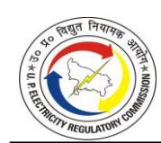

**TABLE 4-127: APPROVED GROSS ALLOWABLE DEPRECIATION OF PVVNL FOR FY 2023-24 (IN RS. CRORE) (PART- A)**

| Particulars                                    | Written down Value of Assets (Opening GFA) | Additi on to GFA | Deducti on to GFA | Closing GFA | Average GFA | Depreciat ion Rate | Allowa ble Gross Deprec iation |
|------------------------------------------------|-----------------------------------------------------------|------------------------|-------------------------|----------------|----------------|-----------------------|--------------------------------------------|
| Land                                           | 2.67                                                      |                        | -                       | 2.67           | 2.67           | 0.00%                 | -                                          |
| Buildings                                      | 275.93                                                    |                        | 0.02                    | 275.91         | 275.92         | 3.34%                 | 9.22                                       |
| Other Civil Works                              | -                                                         |                        | -                       | -              | -              | 3.34%                 | -                                          |
| Plants & Machinery                             | 156.05                                                    |                        | 378.84                  | (222.79)       | (33.37)        | 5.28%                 | (1.76)                                     |
| Lines, Cables, Networks etc.                   | 6,895.91                                                  |                        | 43.71                   | 6,852.20       | 6,874.06       | 5.28%                 | 362.95                                     |
| Vehicles                                       | 30.14                                                     |                        | 0.05                    | 30.10          | 30.12          | 9.50%                 | 2.86                                       |
| Furniture & Fixtures                           | 5.63                                                      |                        | -                       | 5.63           | 5.63           | 6.33%                 | 0.36                                       |
| Office Equipment                               | 20.53                                                     |                        | 0.04                    | 20.49          | 20.51          | 6.33%                 | 1.30                                       |
| Intangible asset                               | -                                                         |                        | -                       | -              | -              | 15.00%                | -                                          |
| Total Fixed Assets                             | 7,386.87                                                  | -                      | 422.66                  | 6,964.21       | 7,175.54       |                       | 374.92                                     |
| Non depreciable assets (Land & Land Rights) | 2.67                                                      | 0.00                   | 0.00                    | 2.67           | 2.67           |                       | 0.00                                       |
| Depreciable Assets                             | 7,384.20                                                  | 0.00                   | 422.66                  | 6,961.54       | 7,172.87       | 5.23%                 | 374.92                                     |

**TABLE 4-128: APPROVED GROSS ALLOWABLE DEPRECIATION OF PVVNL FOR FY 2023-24 (IN RS. CRORE) (PART- B)**

| Particulars                                       | Opening GFA | Addition to GFA | Deduction to GFA | Closing GFA | Average GFA | Depreciation Rate | Allowable Gross Depreciation |
|---------------------------------------------------|----------------|--------------------|---------------------|----------------|----------------|----------------------|------------------------------------|
| Land                                              | 0.32           | -                  | -                   | 0.32           | 0.32           | 0.00%                | -                                  |
| Buildings                                         | 84.47          | 4.81               | 0.02                | 89.26          | 86.87          | 3.34%                | 2.90                               |
| Other Civil Works                                 | 2.43           | -                  | -                   | 2.43           | 2.43           | 3.34%                | 0.08                               |
| Plants & Machinery                                | 1,611.80       | 753.21             | 268.19              | 2,096.82       | 1,854.31       | 5.28%                | 97.91                              |
| Lines, Cables, Networks etc.                   | 3,456.87       | 815.39             | 30.94               | 4,241.32       | 3,849.09       | 5.28%                | 203.23                             |
| Vehicles                                          | 0.20           | -                  | 0.03                | 0.17           | 0.19           | 9.50%                | 0.02                               |
| Furniture & Fixtures                              | 2.22           | 0.06               | -                   | 2.28           | 2.25           | 6.33%                | 0.14                               |
| Office Equipment                                  | 13.36          | 3.54               | 0.02                | 16.88          | 15.12          | 6.33%                | 0.96                               |
| Intangible asset                                  | 57.58          | 0.39               | -                   | 57.97          | 57.78          | 15.00%               | 8.67                               |
| Total Fixed Assets                                | 5,229.25       | 1,577.40           | 299.20              | 6,507.45       | 5,868.35       |                      | 313.91                             |
| Non depreciable assets (Land & Land Rights) | 0.32           | 0.00               | 0.00                | 0.32           | 0.32           |                      | 0.00                               |
| Depreciable Assets                                | 5,228.93       | 1,577.40           | 299.20              | 6,507.13       | 5,868.03       | 5.35%                | 313.91                             |

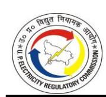

**TABLE 4-129: APPROVED GROSS ALLOWABLE DEPRECIATION OF PUVVNL FOR FY 2023-24 (IN RS. CRORE) (PART- A)**

| Particulars                                       | Written down Value of Assets (Opening GFA) | Addition to GFA | Deduction to GFA | Closing GFA | Average GFA | Depreciation Rate | Allowable Gross Depreciation |
|---------------------------------------------------|-----------------------------------------------------------|--------------------|---------------------|----------------|----------------|----------------------|------------------------------------|
| Land                                              | 2.32                                                      |                    | -                   | 2.32           | 2.32           | 0.00%                | -                                  |
| Buildings                                         | 148.53                                                    |                    | -                   | 148.53         | 148.53         | 3.34%                | 4.96                               |
| Other Civil Works                                 | -                                                         |                    | -                   | -              | -              | 3.34%                | -                                  |
| Plants & Machinery                                | 130.76                                                    |                    | 483.88              | (353.12)       | (111.18)       | 5.28%                | (5.87)                             |
| Lines, Cables, Networks etc.                   | 5,355.49                                                  |                    | 12.26               | 5,343.22       | 5,349.35       | 5.28%                | 282.45                             |
| Vehicles                                          | 0.43                                                      |                    | -                   | 0.43           | 0.43           | 9.50%                | 0.04                               |
| Furniture & Fixtures                           | 4.49                                                      |                    | -                   | 4.49           | 4.49           | 6.33%                | 0.28                               |
| Office Equipment                                  | 58.91                                                     |                    | 0.01                | 58.90          | 58.90          | 6.33%                | 3.73                               |
| Intangible asset                                  | -                                                         |                    | -                   | -              | -              | 15.00%               | -                                  |
| Total Fixed Assets                                | 5,700.93                                                  | -                  | 496.15              | 5,204.77       | 5,452.85       |                      | 285.59                             |
| Non depreciable assets (Land & Land Rights) | 2.32                                                      | 0.00               | 0.00                | 2.32           | 2.32           |                      | 0.00                               |
| Depreciable Assets                                | 5,698.61                                                  | 0.00               | 496.15              | 5,202.45       | 5,450.53       | 5.24%                | 285.59                             |

**TABLE 4-130: APPROVED GROSS ALLOWABLE DEPRECIATION OF PUVVNL FOR FY 2023-24 (IN RS. CRORE) (PART- B)**

| Particulars                                                  | Opening GFA | Addition to GFA | Deduct ion to GFA | Closing GFA | Average GFA | Deprec iation Rate | Allowa ble Gross Deprec iation |
|--------------------------------------------------------------|----------------|--------------------|-------------------------|----------------|----------------|--------------------------|--------------------------------------------|
| Land                                                         | 0.14           | -                  | -                       | 0.14           | 0.14           | 0.00%                    | -                                          |
| Buildings                                                    | 117.67         | 30.62              | -                       | 148.29         | 132.98         | 3.34%                    | 4.44                                       |
| Other Civil Works                                            | -              | 0.04               | -                       | 0.04           | 0.02           | 3.34%                    | 0.00                                       |
| Plants & Machinery                                           | 3,443.94       | 1,902.02           | 479.61                  | 4,866.35       | 4,155.14       | 5.28%                    | 219.39                                     |
| Lines, Cables, Networks etc.                              | 2,031.88       | 583.59             | 12.16                   | 2,603.31       | 2,317.60       | 5.28%                    | 122.37                                     |
| Vehicles                                                     | 0.21           | -                  | -                       | 0.21           | 0.21           | 9.50%                    | 0.02                                       |
| Furniture & Fixtures                                         | 1.08           | 0.62               | -                       | 1.70           | 1.39           | 6.33%                    | 0.09                                       |
| Office Equipment                                             | 10.42          | 0.67               | 0.01                    | 11.08          | 10.75          | 6.33%                    | 0.68                                       |
| Capital Expenditure on Assets not belonging to utility | -              | -                  | -                       | -              | -              | 15.00%                   | -                                          |
| Intangible asset                                             | 45.30          | 0.32               | -                       | 45.62          | 45.46          | 15.00%                   | 6.82                                       |
| Total Fixed Assets                                           | 5,650.63       | 2,517.88           | 491.78                  | 7,676.74       | 6,663.69       |                          | 353.81                                     |

| Particulars                                       | Opening GFA | Addition to GFA | Deduct ion to GFA | Closing GFA | Average GFA | Deprec iation Rate | Allowa ble Gross Deprec iation |
|---------------------------------------------------|----------------|--------------------|-------------------------|----------------|----------------|--------------------------|--------------------------------------------|
| Non depreciable assets (Land & Land Rights) | 0.14           | 0.00               | 0.00                    | 0.14           | 0.14           |                          | 0.00                                       |
| Depreciable Assets                                | 5,650.49       | 2,517.88           | 491.78                  | 7,676.60       | 6,663.55       | 5.31%                    | 353.81                                     |

**TABLE 4-131: APPROVED GROSS ALLOWABLE DEPRECIATION OF KESCO FOR FY 2023-24 (IN RS. CRORE) (PART- A)**

| Particulars                                                  | Written down Value of Assets (Opening GFA) | Addi tion to GFA | Deducti on to GFA | Closing GFA | Average GFA | Depreciat ion Rate | Allowable Gross Depreciat ion |
|--------------------------------------------------------------|--------------------------------------------------------|---------------------------|-------------------------|----------------|----------------|-----------------------|----------------------------------------|
| Land                                                         | (0.00)                                                 |                           | 0.00                    | (0.00)         | (0.00)         | 0.00%                 | -                                      |
| Buildings                                                    | 34.59                                                  |                           | 0.00                    | 34.59          | 34.59          | 3.34%                 | 1.16                                   |
| Other Civil Works                                            | (0.00)                                                 |                           | 0.00                    | (0.00)         | (0.00)         | 3.34%                 | (0.00)                                 |
| Plants & Machinery                                           | 233.88                                                 |                           | 0.00                    | 233.88         | 233.88         | 5.28%                 | 12.35                                  |
| Lines, Cables, Networks etc.                              | 479.85                                                 |                           | 0.00                    | 479.85         | 479.85         | 5.28%                 | 25.34                                  |
| Vehicles                                                     | 1.87                                                   |                           | 0.00                    | 1.87           | 1.87           | 9.50%                 | 0.18                                   |
| Furniture & Fixtures                                         | 1.64                                                   |                           | 0.00                    | 1.64           | 1.64           | 6.33%                 | 0.10                                   |
| Office Equipment                                             | 12.71                                                  |                           | 0.00                    | 12.71          | 12.71          | 6.33%                 | 0.80                                   |
| Capital Expenditure on Assets not belonging to utility | -                                                      |                           | -                       | -              | -              | 15.00%                | -                                      |
| Intangible asset                                             | -                                                      |                           | -                       | -              | -              | 15.00%                | -                                      |
| Total Fixed Assets                                           | 764.54                                                 | -                         | 0.00                    | 764.54         | 764.54         |                       | 39.93                                  |
| Non depreciable assets (Land & Land Rights)            | 0.00                                                   | 0.00                      | 0.00                    | 0.00           | 0.00           |                       | 0.00                                   |
| Depreciable Assets                                           | 764.54                                                 | 0.00                      | 0.00                    | 764.54         | 764.54         | 5.22%                 | 39.93                                  |

**TABLE 4-132: APPROVED GROSS ALLOWABLE DEPRECIATION OF KESCO FOR FY 2023-24 (IN RS. CRORE) (PART- B)**

| Particulars        | Opening GFA | Addition to GFA | Deduc tion to GFA | Closing GFA | Average GFA | Depreciat ion Rate | Allowable Gross Depreciation |
|--------------------|----------------|--------------------|-------------------------|----------------|----------------|-----------------------|------------------------------------|
| Land               | (0.00)         | -                  | 0.00                    | (0.00)         | (0.00)         | 0.00%                 | -                                  |
| Buildings          | 4.83           | 1.20               | 0.00                    | 6.03           | 5.43           | 3.34%                 | 0.18                               |
| Other Civil Works  | (0.00)         | -                  | 0.00                    | (0.00)         | (0.00)         | 3.34%                 | (0.00)                             |
| Plants & Machinery | 29.83          | 7.67               | 0.00                    | 37.50          | 33.67          | 5.28%                 | 1.78                               |

| Particulars                                                  | Opening GFA | Addition to GFA | Deduc tion to GFA | Closing GFA | Average GFA | Depreciat ion Rate | Allowable Gross Depreciation |
|--------------------------------------------------------------|----------------|--------------------|-------------------------|----------------|----------------|-----------------------|------------------------------------|
| Lines, Cables, Networks etc.                              | 131.59         | 10.70              | 0.00                    | 142.29         | 136.94         | 5.28%                 | 7.23                               |
| Vehicles                                                     | 0.13           | -                  | 0.00                    | 0.13           | 0.13           | 9.50%                 | 0.01                               |
| Furniture & Fixtures                                         | 0.24           | 0.41               | 0.00                    | 0.65           | 0.44           | 6.33%                 | 0.03                               |
| Office Equipment                                             | 7.16           | 1.93               | 0.00                    | 9.09           | 8.12           | 6.33%                 | 0.51                               |
| Capital Expenditure on Assets not belonging to utility | -              | -                  | -                       | -              | -              | 15.00%                | -                                  |
| Intangible asset                                             | 5.32           | 8.64               | -                       | 13.96          | 9.64           | 15.00%                | 1.45                               |
| Total Fixed Assets                                           | 179.11         | 30.55              | 0.00                    | 209.66         | 194.38         |                       | 11.19                              |
| Non-depreciable assets (Land & Land Rights)            | 0.00           | 0.00               | 0.00                    | 0.00           | 0.00           |                       | 0.00                               |
| Depreciable Assets                                           | 179.11         | 30.55              | 0.00                    | 209.66         | 194.38         | 5.76%                 | 11.19                              |

4.9.6. To compute net allowable depreciation, the Commission has reduced the equivalent depreciation on the assets created out of consumer contributions, capital grants and subsidies from the gross allowable depreciation for FY 2023-24. The net depreciation claimed by the Petitioners and approved by the Commission is shown in the Tables below:

**TABLE 4-133: APPROVED NET ALLOWABLE DEPRECIATION OF DVVNL FOR FY 2023-24 (IN RS. CRORE)**

| Particulars                                                                                                        | Approved in Tariff Order dated May 24, 2023 | Claimed | Approved |
|--------------------------------------------------------------------------------------------------------------------|---------------------------------------------------|---------|----------|
| Gross Allowable Depreciation (Part -A)                                                                             | 390.41                                            |         | 348.47   |
| Gross Allowable Depreciation (Part -B)                                                                             | 302.07                                            | 798.85  | 450.38   |
| Gross Allowable Depreciation (A+B)                                                                                 | 692.48                                            |         | 798.85   |
| Less: Equivalent amount of depreciation on assets acquired out of the Consumer Contribution and GoUP Subsidy | 150.90                                            | 252.64  | 252.64   |
| Net Allowable Depreciation                                                                                         | 541.58                                            | 546.21  | 546.21   |

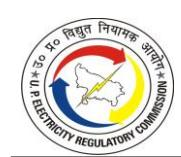

**TABLE 4-134: APPROVED NET ALLOWABLE DEPRECIATION OF MVVNL FOR FY 2023-24 (IN RS. CRORE)**

| Particulars                                                                                                        | Approved in Tariff Order dated May 24, 2023 | Claimed | Approved |
|--------------------------------------------------------------------------------------------------------------------|---------------------------------------------------|---------|----------|
| Gross Allowable Depreciation (Part -A)                                                                             | 203.04                                            |         | 181.35   |
| Gross Allowable Depreciation (Part -B)                                                                             | 449.82                                            | 679.79  | 498.44   |
| Gross Allowable Depreciation (A+B)                                                                                 | 652.86                                            |         | 679.79   |
| Less: Equivalent amount of depreciation on assets acquired out of the Consumer Contribution and GoUP Subsidy | 142.56                                            | 202.41  | 202.41   |
| Net Allowable Depreciation                                                                                         | 510.30                                            | 477.38  | 477.38   |

**TABLE 4-135: APPROVED NET ALLOWABLE DEPRECIATION OF PVVNL FOR FY 2023-24 (IN RS. CRORE)**

| Particulars                                                                                                        | Approved in Tariff Order dated May 24, 2023 | Claimed | Approved |
|--------------------------------------------------------------------------------------------------------------------|---------------------------------------------------|---------|----------|
| Gross Allowable Depreciation (Part -A)                                                                             | 413.42                                            |         | 374.92   |
| Gross Allowable Depreciation (Part -B)                                                                             | 247.49                                            | 688.83  | 313.91   |
| Gross Allowable Depreciation (A+B)                                                                                 | 660.91                                            |         | 688.83   |
| Less: Equivalent amount of depreciation on assets acquired out of the Consumer Contribution and GoUP Subsidy | 175.81                                            | 288.45  | 288.45   |
| Net Allowable Depreciation                                                                                         | 485.10                                            | 400.38  | 400.38   |

**TABLE 4-136: APPROVED NET ALLOWABLE DEPRECIATION OF PUVVNL FOR FY 2023-24 (IN RS. CRORE)**

| Particulars                                                                                                        | Approved in Tariff Order dated May 24, 2023 | Claimed | Approved |
|--------------------------------------------------------------------------------------------------------------------|---------------------------------------------------|---------|----------|
| Gross Allowable Depreciation (Part -A)                                                                             | 327.65                                            |         | 285.59   |
| Gross Allowable Depreciation (Part -B)                                                                             | 332.10                                            | 639.40  | 353.81   |
| Gross Allowable Depreciation (A+B)                                                                                 | 659.75                                            |         | 639.40   |
| Less: Equivalent amount of depreciation on assets acquired out of the Consumer Contribution and GoUP Subsidy | 134.69                                            | 0.00    | 201.01*  |
| Net Allowable Depreciation                                                                                         | 525.05                                            | 639.40  | 438.39   |

\* *Consumer Contribution amortization has been wrongly claimed "NIL" by PuVVNL in its submission however, this has been corrected accordingly.*

**TABLE 4-137: APPROVED NET ALLOWABLE DEPRECIATION OF KESCO FOR FY 2023-24 (IN RS. CRORE)**

| Particulars                                                                                                        | Approved in Tariff Order dated May 24, 2023 | Claimed | Approved |
|--------------------------------------------------------------------------------------------------------------------|---------------------------------------------------|---------|----------|
| Gross Allowable Depreciation (Part -A)                                                                             | 39.93                                             |         | 39.93    |
| Gross Allowable Depreciation (Part -B)                                                                             | 14.61                                             | 51.12   | 11.19    |
| Gross Allowable Depreciation (A+B)                                                                                 | 54.53                                             |         | 51.12    |
| Less: Equivalent amount of depreciation on assets acquired out of the Consumer Contribution and GoUP Subsidy | 16.48                                             | 19.34   | 19.34    |
| Net Allowable Depreciation                                                                                         | 38.05                                             | 31.78   | 31.78    |

**TABLE 4-138: CONSOLIDATED APPROVED NET ALLOWABLE DEPRECIATION FOR FY 2023-24 (IN RS. CRORE)**

| Particulars                                                                                                        | Approved in Tariff Order dated May 24, 2023 | Claimed  | Approved |
|--------------------------------------------------------------------------------------------------------------------|---------------------------------------------------|----------|----------|
| Gross Allowable Depreciation (Part -A)                                                                             | 1,374.44                                          |          | 1,230.26 |
| Gross Allowable Depreciation (Part -B)                                                                             | 1,346.09                                          | 2,857.99 | 1,627.73 |
| Gross Allowable Depreciation (A+B)                                                                                 | 2,720.53                                          |          | 2,857.99 |
| Less: Equivalent amount of depreciation on assets acquired out of the Consumer Contribution and GoUP Subsidy | 620.44                                            | 762.84   | 963.85*  |
| Net Allowable Depreciation                                                                                         | 2,100.09                                          | 2,095.15 | 1,894.14 |

*\*The approved value is higher due to the correction made for PuVVNL above.*

#### **4.10. INTEREST ON LOAN**

#### *Petitioners' Submission:*

4.10.1. The Petitioners have considered the same approach for the determination of Interest on long-term loans as approved by the Commission in its previous Tariff Orders. The Petitioners have considered a normative approach with a debt-equity ratio of 70:30. Considering this approach, 70% of the capitalisation undertaken (after deducting consumer contributions, capital subsidies and grants) in any year has been financed through loans, and the balance 30% has been financed through equity contributions.

The portion of capital expenditure financed through consumer contributions, capital subsidies and grants is separated, and the depreciation, interest and return on equity thereon have not been charged to the consumers. The closing loan balance for FY 2022-23 as approved by the Commission in the Tariff Order for FY 2024-25 dated October 10, 2024, has been considered as the opening balance of the long-term loan. The allowable depreciation for the year has been considered as a normative loan repayment. The actual weighted average rate of interest as per the Audited Accounts has been considered for computing the interest expenses.

4.10.2. The interest capitalisation has been considered as per the Audited Accounts. The computations for interest on long-term loans as submitted by the Petitioners are shown in the Table below:

**TABLE 4-139: INTEREST ON LONG TERM LOAN FOR FY 2023-24 AS SUBMITTED BY DVVNL (IN RS. CRORE)**

| Particulars                                                                  | Approved in Tariff Order dated 24.05.2023 | Claimed  |
|------------------------------------------------------------------------------|-------------------------------------------------|----------|
| Opening Loan                                                              | 3,854.90                                        | 4,284.60 |
| Additions (70% of Capitalisation net of Consumer Contribution and Grants) | 1,091.73                                        | 733.83   |
| Less: Repayments(Depreciation allowable for the year)            | 541.58                                          | 546.21   |
| Closing Loan Balance                                                   | 4,405.05                                        | 4,472.22 |
| Weighted Average Rate of Interest                                | 11.21%                                          | 9.97%    |
| Interest on Long-term loan                                          | 462.97                                          | 436.63   |
| Less: Interest Capitalized                                                   | -                                               | -        |
| Net Interest on Loan term loan                                               | 462.97                                          | 436.63   |

**TABLE 4-140: INTEREST ON LONG TERM LOAN FOR FY 2023-24 AS SUBMITTED BY MVVNL (IN RS. CRORE)**

| Particulars                                                                  | Approved in T.O. dated 24.05.2023 | Claimed  |
|------------------------------------------------------------------------------|--------------------------------------|----------|
| Opening Loan                                                              | 4,039.44                             | 3,722.06 |
| Additions (70% of Capitalisation net of Consumer Contribution and Grants) | 912.93                               | 557.47   |
| Less: Repayments(Depreciation allowable for the year)            | 510.30                               | 477.38   |
| Closing Loan Balance                                                   | 4,442.08                             | 3,802.15 |
| Weighted Average Rate of Interest                                | 10.91%                               | 10.13%   |

| Particulars                         | Approved in T.O. dated 24.05.2023 | Claimed |
|-------------------------------------|--------------------------------------|---------|
| Interest on Long-term loan | 462.67                               | 381.27  |
| Less: Interest Capitalized          | -                                    | -       |
| Net Interest on Long-term loan      | 462.67                               | 381.27  |

**TABLE 4-141: INTEREST ON LONG TERM LOAN FOR FY 2023-24 AS SUBMITTED BY PVVNL (IN RS. CRORE)**

| Particulars                                                                  | Approved in Tariff Order dated 24.05.2023 | Claimed  |
|------------------------------------------------------------------------------|----------------------------------------------|----------|
| Opening Loan                                                                 | 2,869.31                                     | 2,780.68 |
| Additions (70% of Capitalization net of Consumer Contribution and Grants) | 598.21                                       | (14.40)  |
| Less: Repayments (Depreciation allowable for the year)                    | 485.10                                       | 400.38   |
| Closing Loan Balance                                                         | 2,982.42                                     | 2,365.91 |
| Weighted Average Rate of Interest                                            | 8.40%                                        | 10.29%   |
| Interest on Long-term loan                                                   | 245.77                                       | 264.91   |
| Less: Interest Capitalized                                                   | -                                            | -        |
| Net Interest on Loan term loan                                               | 245.77                                       | 264.91   |

**TABLE 4-142: INTEREST ON LONG TERM LOAN FOR FY 2023-24 AS SUBMITTED BY PUVVNL (IN RS. CRORE)**

| Particulars                                                                  | Approved in Tariff Order dated 24.05.2023 | Claimed  |
|------------------------------------------------------------------------------|----------------------------------------------|----------|
| Opening Loan                                                              | 3,941.56                                     | 3,228.85 |
| Additions (70% of Capitalisation net of Consumer Contribution and Grants) | 991.88                                       | 899.74   |
| Less: Repayments(Depreciation allowable for the year)            | 525.05                                       | 639.40   |
| Closing Loan Balance                                                   | 4,408.39                                     | 3,489.19 |
| Weighted Average Rate of Interest                                | 10.24%                                       | 9.82%    |
| Interest on Long-term loan                                          | 427.52                                       | 329.72   |
| Less: Interest Capitalized                                                   | 111.18                                       | -        |
| Net Interest on long-term loan                                            | 316.33                                       | 329.72   |

**TABLE 4-143: INTEREST ON LONG TERM LOAN FOR FY 2023-24 AS SUBMITTED BY KESCO (IN RS. CRORE)**

| Particulars                                                                  | Approved in Tariff Order dated 24.05.2023 | Claimed |
|------------------------------------------------------------------------------|----------------------------------------------|---------|
| Opening Loan                                                              | 115.91                                       | 82.56   |
| Additions (70% of Capitalization net of Consumer Contribution and Grants) | 101.06                                       | 14.20   |

| Particulars                                   | Approved in Tariff Order dated 24.05.2023 | Claimed |
|-----------------------------------------------|----------------------------------------------|---------|
| Less: Repayments(Depreciation              | 38.05                                        | 31.78   |
| allowable for the year)                 |                                              |         |
| Closing Loan Balance                    | 178.92                                       | 64.99   |
| Weighted Average Rate of Interest | 10.63%                                       | 10.88%  |
| Interest on Long-term loan           | 15.67                                        | 8.03    |
| Less: Interest Capitalized                    | -                                            | -       |
| Net Interest on long-term loan             | 15.67                                        | 8.03    |

### *Commission's Analysis:*

- 4.10.3. As per Regulation 23.5 of MYT Regulations, 2019, the weighted average rate of interest of the actual long-term loans of the year is considered the normative rate of interest on long-term loans. The Commission has computed Interest on Loan as per Regulation 23 of the MYT Regulations, 2019. The closing balance of normative loans of FY 2022- 23, as approved by the Commission in the Tariff Order dated October 10, 2024, has been considered as the opening balance of normative loans as of April 1, 2023. Further, 70% of the approved net asset capitalised (net off deduction / decapitalisation and consumer contribution, etc., in capitalisation) has been considered as normative loan addition during the year. Further, the depreciation allowed during the year has been considered as repayment of normative loans during the year.
- 4.10.4. The Commission has calculated the interest rate considering the average loan balance and the interest expenses taken from the audited statement for FY 2023-24. The interest rate calculation is shown below:

**TABLE 4-144: RATE OF INTEREST ON LONG TERM LOAN FOR FY 2023-24 CALCULATED BY COMMISSION FOR PETITONERS (IN RS. CRORE)**

| Particulars                                           | Formulae | DVVNL     | MVVNL     | PVVNL     | PuVVNL    | KESCO    |
|-------------------------------------------------------|----------|-----------|-----------|-----------|-----------|----------|
| Opening Long-Term Loans                            | A1       | 16,408.02 | 14,354.79 | 8,170.25  | 22,687.83 | 2,315.93 |
| Add: Opening Current Maturity of long-term loan | A2       | 3,451.81  | 3,461.01  | 2,269.65  | 4,554.91  | 631.72   |
| Gross Opening Long Term Loans                      | A= A1+A2 | 19,859.83 | 17,815.80 | 10,439.90 | 27,242.74 | 2,947.65 |
| Closing Long-Term Loans                               | B1       | 13,478.10 | 11,849.93 | 6,599.69  | 18,834.25 | 1,884.14 |
| Add: Closing Current Maturity of Long-Term Loan | B2       | 4,270.96  | 3,802.56  | 1,560.29  | 5,061.18  | 591.67   |

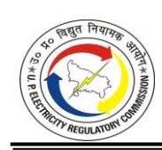

| Particulars                                                                       | Formulae       | DVVNL     | MVVNL     | PVVNL    | PuVVNL    | KESCO    |
|-----------------------------------------------------------------------------------|----------------|-----------|-----------|----------|-----------|----------|
| Gross Closing Long-Term Loans                                                  | B= B1+B2       | 17,749.06 | 15,652.49 | 8,159.98 | 23,895.43 | 2,475.81 |
| Average Loan                                                                      | C = (A+B)/2 | 18,804.45 | 16,734.15 | 9,299.94 | 25,569.09 | 2,711.73 |
| Gross Interest Cost                                                               | D              | 1,958.26  | 1,726.49  | 1,035.93 | 2,583.22  | 273.41   |
| Less: Interest on Security Deposits                                            | E              | 54.90     | 30.58     | 130.68   | 34.35     | 12.47    |
| Less: Interest/Stamp Duty on bill discounted for power purchase & others | F              | 8.48      | -         | -        | -         | -        |
| Net Interest Cost on Long-Term Loans                                           | G = (D-E F) | 1,894.88  | 1,695.91  | 905.25   | 2,548.87  | 260.94   |
| Rate of Interest on Long Term Loans                                            | H=(G/C) %      | 10.08%    | 10.13%    | 9.73%    | 9.97%     | 9.62%    |

4.10.5. The Commission has considered the above-average rate of interest for the computation of interest on long-term loans. Further, the Commission has adjusted the capitalization of interest expenses as per the Audited Accounts for the respective State Discom to compute net interest on loans during the year. The calculation of interest on long-term loans is shown in the Tables below:

**TABLE 4-145: APPROVED INTEREST ON LONG-TERM LOAN OF DVVNL FOR FY 2023-24 (IN RS. CRORE)**

| Particulars                                                                  | Approved in Tariff Order dated May 24, 2023 | Claimed  | Approved |
|------------------------------------------------------------------------------|------------------------------------------------|----------|----------|
| Opening Loan                                                                 | 3,854.90                                       | 4,284.60 | 4,284.60 |
| Additions (70% of Capitalisation net of Consumer Contribution and Grants) | 1,091.73                                       | 733.83   | 851.70   |
| Less: Repayments (Depreciation allowable for the year)                    | 541.58                                         | 546.21   | 546.21   |
| Closing Loan Balance                                                         | 4,405.05                                       | 4,472.22 | 4,590.09 |
| Average Loan                                                                 | 4,129.98                                       | 4,378.41 | 4,437.35 |
| Weighted Average Rate of Interest                                            | 11.21%                                         | 9.97%    | 10.08%   |
| Interest on Long-Term Loan                                                   | 462.97                                         | 436.63   | 447.14   |
| Less: Interest Capitalized                                                   | -                                              | -        | -        |
| Net Interest on Long-Term Loan                                               | 462.97                                         | 436.63   | 447.14   |

**TABLE 4-146: APPROVED INTEREST ON LONG-TERM LOAN OF MVVNL FOR FY 2023-24 (IN RS. CRORE)**

| Particulars                                                                  | Approved in Tariff Order dated May 24, 2023 | Claimed  | Approved |
|------------------------------------------------------------------------------|------------------------------------------------|----------|----------|
| Opening Loan                                                                 | 4,039.44                                       | 3,722.06 | 3,722.07 |
| Additions (70% of Capitalisation net of Consumer Contribution and Grants) | 912.93                                         | 557.47   | 1,027.19 |
| Less: Repayments (Depreciation allowable for the year)                    | 510.30                                         | 477.38   | 477.38   |
| Closing Loan Balance                                                         | 4,442.08                                       | 3,802.15 | 4,271.88 |
| Average Loan                                                                 | 4,240.76                                       | 3,762.10 | 3,996.97 |
| Weighted Average Rate of Interest                                            | 10.91%                                         | 10.13%   | 10.13%   |
| Interest on Long-Term Loan                                                   | 462.67                                         | 381.27   | 405.07   |
| Less: Interest Capitalized                                                   | -                                              | -        | -        |
| Net Interest on Long-Term Loan                                               | 462.67                                         | 381.27   | 405.07   |

**TABLE 4-147: APPROVED INTEREST ON LONG-TERM LOAN OF PVVNL FOR FY 2023-24 (IN RS. CRORE)**

| Particulars                                                                  | Approved in Tariff Order dated May 24, 2023 | Claimed  | Approved |
|------------------------------------------------------------------------------|------------------------------------------------|----------|----------|
| Opening Loan                                                                 | 2,869.31                                       | 2,780.68 | 2,780.68 |
| Additions (70% of Capitalisation net of Consumer Contribution and Grants) | 598.21                                         | (14.40)  | 125.27   |
| Less: Repayments (Depreciation allowable for the year)                    | 485.10                                         | 400.38   | 400.38   |
| Closing Loan Balance                                                         | 2,982.42                                       | 2,365.91 | 2,505.58 |
| Average Loan                                                                 | 2,925.87                                       | 2,573.29 | 2,643.13 |
| Weighted Average Rate of Interest                                            | 8.40%                                          | 10.29%   | 9.73%    |
| Interest on Long-Term Loan                                                   | 245.77                                         | 264.91   | 257.28   |
| Less: Interest Capitalized                                                   | -                                              | -        | -        |
| Net Interest on Long-Term Loan                                               | 245.77                                         | 264.91   | 257.28   |

**TABLE 4-148: APPROVED INTEREST ON LONG TERM LOAN OF PUVVNL FOR FY 2023-24 (IN RS. CRORE)**

| Particulars                                                                  | Approved in Tariff Order dated May 24, 2023 | Claimed  | Approved |
|------------------------------------------------------------------------------|------------------------------------------------|----------|----------|
| Opening Loan                                                                 | 3,941.56                                       | 3,228.85 | 3,228.85 |
| Additions (70% of Capitalisation net of Consumer Contribution and Grants) | 991.88                                         | 899.74   | 1,046.47 |
| Less: Repayments (Depreciation allowable for the year)                    | 525.05                                         | 639.40   | 438.39   |
| Closing Loan Balance                                                         | 4,408.39                                       | 3,489.19 | 3,836.93 |
| Average Loan                                                                 | 4,174.98                                       | 3,359.02 | 3,532.89 |

| Particulars                       | Approved in Tariff Order dated May 24, 2023 | Claimed | Approved |
|-----------------------------------|------------------------------------------------|---------|----------|
| Weighted Average Rate of Interest | 10.24%                                         | 9.82%   | 9.97%    |
| Interest on Long-Term Loan        | 427.52                                         | 329.72  | 352.18   |
| Less: Interest Capitalized        | 111.18                                         | -       | -        |
| Net Interest on Long-Term Loan    | 316.33                                         | 329.72  | 352.18   |

**TABLE 4-149: APPROVED INTEREST ON LONG TERM LOAN OF KESCO FOR FY 2023-24 (IN RS. CRORE)**

| Particulars                                                                  | Approved in Tariff Order dated May 24, 2023 | Claimed | Approved |
|------------------------------------------------------------------------------|------------------------------------------------|---------|----------|
| Opening Loan                                                                 | 115.91                                         | 82.56   | 82.56    |
| Additions (70% of Capitalisation net of Consumer Contribution and Grants) | 101.06                                         | 14.20   | 14.20    |
| Less: Repayments (Depreciation allowable for the year)                    | 38.05                                          | 31.78   | 31.78    |
| Closing Loan Balance                                                         | 178.92                                         | 64.99   | 64.99    |
| Average Loan                                                                 | 147.42                                         | 73.77   | 73.77    |
| Weighted Average Rate of Interest                                            | 10.63%                                         | 10.88%  | 9.62%    |
| Interest on Long-Term Loan                                                   | 15.67                                          | 8.03    | 7.10     |
| Less: Interest Capitalized                                                   | -                                              | -       | -        |
| Net Interest on Long-Term Loan                                               | 15.67                                          | 8.03    | 7.10     |

**TABLE 4-150: CONSOLIDATED APPROVED INTEREST ON LONG-TERM LOAN FOR FY 2023-24 (IN RS. CRORE)**

| Particulars                                                                  | Approved in Tariff Order dated May 24, 2023 | Claimed   | Approved  |
|------------------------------------------------------------------------------|------------------------------------------------|-----------|-----------|
| Opening Loan                                                                 | 14,821.13                                      | 14,098.75 | 14,098.75 |
| Additions (70% of Capitalisation net of Consumer Contribution and Grants) | 3,695.83                                       | 2,190.85  | 3,064.84  |
| Less: Repayments (Depreciation allowable for the year)                    | 2,100.09                                       | 2,095.15  | 1,894.14  |
| Closing Loan Balance                                                         | 16,416.86                                      | 14,194.45 | 15,269.45 |
| Average Loan                                                                 | 15,619.00                                      | 14,146.60 | 14,684.10 |
| Weighted Average Rate of Interest                                            | 10.34%                                         | 10.04%    | 10.00%    |
| Interest on Long-Term Loan                                                   | 1,614.60                                       | 1,420.56  | 1,468.77  |
| Less: Interest Capitalized                                                   | 111.18                                         | -         | -         |
| Net Interest on Long-Term Loan                                               | 1,503.41                                       | 1,420.56  | 1,468.77  |

#### **4.11. INTEREST ON CONSUMER SECURITY DEPOSITS**

#### *Petitioners' Submission:*

4.11.1. The Petitioners have submitted actual Interest on Consumer Security Deposit (IoSD)

paid during FY 2023-24 as per audited accounts for FY 2023-24 against the approved figures in the Tariff Order as shown in the Table below:

**TABLE 4-151: INTEREST ON CONSUMER SECURITY DEPOSITS FOR FY 2023-24 AS SUBMITTED BY DVVNL (IN RS. CRORE)**

| Particulars                     | Approved in Tariff Order dated 24.05.2023 | Claimed |
|---------------------------------|----------------------------------------------|---------|
| Total Consumer Security Deposit |                                              | 844.77  |
| Interest on Security Deposit    | 36.27                                        | 54.90   |

#### **TABLE 4-152: INTEREST ON CONSUMER SECURITY DEPOSITS FOR FY 2023-24 AS SUBMITTED BY MVVNL (IN RS. CRORE)**

| Particulars                     | Approved in Tariff Order dated 24.05.2023 | Claimed |
|---------------------------------|----------------------------------------------|---------|
| Total Consumer Security Deposit |                                              | 868.37  |
| Interest on Security Deposit    | 33.45                                        | 30.58   |

#### **TABLE 4-153: INTEREST ON CONSUMER SECURITY DEPOSITS FOR FY 2023-24 AS SUBMITTED BY PVVNL (IN RS. CRORE)**

| Particulars                     | Approved in Tariff Order dated 24.05.2023 | Claimed |
|---------------------------------|----------------------------------------------|---------|
| Total Consumer Security Deposit |                                              | 2008.12 |
| Interest on Security Deposit    | 90.24                                        | 130.68  |

#### **TABLE 4-154: INTEREST ON CONSUMER SECURITY DEPOSITS FOR FY 2023-24 AS SUBMITTED BY PUVVNL (IN RS. CRORE)**

| Particulars                     | Approved in Tariff Order dated 24.05.2023 | Claimed |
|---------------------------------|----------------------------------------------|---------|
| Total Consumer Security Deposit |                                              | 552.64  |
| Interest on Security Deposit    | 26.17                                        | 34.35   |

#### **TABLE 4-155: INTEREST ON CONSUMER SECURITY DEPOSITS FOR FY 2023-24 AS SUBMITTED BY KESCO (IN RS. CRORE)**

| Particulars                     | Approved in Tariff Order dated 24.05.2023 | Claimed |
|---------------------------------|----------------------------------------------|---------|
| Total Consumer Security Deposit |                                              | 187.98  |
| Interest on Security Deposit    | 8.22                                         | 12.47   |

#### *Commission's Analysis:*

4.11.2. The Commission observes that the Interest on Security Deposit, as claimed by the Petitioners, is as per the Audited Accounts. The Petitioners, in response to the Commission's query regarding actual IoSD paid to the consumers, submitted as follows:

**TABLE 4-156: ACTUAL INTEREST ON CONSUMER SECURITY DEPOSITS PAID TO THE CONSUMER IN FY 2023-24**

| Particulars  | Claimed by Petitioner | Actual Payment as per Petitioner Submission to the first data gap dated February 24, 2025 |
|--------------|-----------------------|----------------------------------------------------------------------------------------------------|
| DVVNL        | 54.90                 | 49.37                                                                                              |
| MVVNL        | 30.58                 | 55.32                                                                                              |
| PVVNL        | 130.68                | 115.34                                                                                             |
| PuVVNL       | 34.35                 | 46.52                                                                                              |
| KESCO        | 12.47                 | 10.75                                                                                              |
| Consolidated | 262.98                | 277.30                                                                                             |

4.11.3. As per the above Table, in the case of DVVNL and PVVNL payment made is lower than the Audited Accounts, whereas in the case of MVVNL and PuVVNL, the actual payment made is higher than the Audited Accounts. It is also observed that a submission has been made by UPPCL in Petition No. 780 of 2012, as per which there is a shortfall of Rs. 637 Crore in actual disbursement of IoSD. The Commission is of the view that a decision needs to be taken on the treatment to be done with respect to the shortfall in actual payment. Therefore, the Commission, in line with the previous tariff order, allows the IoSD as per the Audited Accounts and treatment for differences in IoSD as per Audited Accounts and actually paid will be done along with the balance amount of the previous years. Accordingly, the IoSD as claimed by the Petitioners and approved by the Commission is shown in the Table below:

**TABLE 4-157: APPROVED INTEREST ON CONSUMER SECURITY DEPOSITS FOR FY 2023-24 (IN RS. CRORE)**

| Particulars | Approved in Tariff Order dated May 24, 2023 | Claimed | Approved |
|-------------|---------------------------------------------------|---------|----------|
| DVVNL       | 36.27                                             | 54.90   | 54.90    |

| Particulars  | Approved in Tariff Order dated May 24, 2023 | Claimed | Approved |
|--------------|---------------------------------------------------|---------|----------|
| MVVNL        | 33.45                                             | 30.58   | 30.58    |
| PVVNL        | 90.24                                             | 130.68  | 130.68   |
| PuVVNL       | 26.17                                             | 34.35   | 34.35    |
| KESCO        | 8.22                                              | 12.47   | 12.47    |
| Consolidated | 194.36                                            | 262.98  | 262.98   |

#### **4.12. BANKING AND FINANCE CHARGES**

#### *Petitioners' Submission:*

4.12.1. The Petitioners have claimed Banking and Finance charges incurred towards expenditures like bank charges, finance charges, etc., as per the Audited Accounts for FY 2023-24. The Banking and Finance Charges for FY 2023-24, as submitted by the Petitioners, are shown in the Table below:

**TABLE 4-158: BANKING AND FINANCE CHARGE FOR FY 2023-24 AS SUBMITTED BY THE PETITIONERS (IN RS. CRORE)**

| Particulars | Claimed |
|-------------|---------|
| DVVNL       | 12.97   |
| MVVNL       | 13.04   |
| PVVNL       | 18.56   |
| PuVVNL      | 13.21   |
| KESCO       | 1.98    |

#### *Commission's Analysis:*

4.12.2. The Commission observes that Regulation 45.3 of MYT Regulations, 2019 stipulates that the Interest and Finance charges, such as Credit Rating charges, collection facilitation charges, financing cost of Delayed Payment Surcharge and other finance charges, are part of the A&G expenses. Accordingly, the same has been disallowed, and appropriate treatment has been done in the True Up of A&G expenses as part of O&M expenses.

#### **4.13. INTEREST ON WORKING CAPITAL**

#### *Petitioners' Submission:*

4.13.1. The Petitioners have submitted interest on working capital for FY 2023-24 as per

Regulation 25 of the MYT Regulations, 2019. The detailed working of Interest on Working Capital, as submitted by the Petitioners, is shown in the Table below:

**TABLE 4-159: INTEREST ON WORKING CAPITAL FOR FY 2023-24 AS SUBMITTED BY DVVNL (IN RS. CRORE)**

| Particulars                                                                                                                                                         | Derivation            | Approved in Tariff Order dated 24.05.2023 | Claimed  |
|---------------------------------------------------------------------------------------------------------------------------------------------------------------------|-----------------------|-------------------------------------------------------|----------|
| One Month's O&M Expenses                                                                                                                                            | A                     | 86.44                                                 | 132.96   |
| One and half months' equivalent of the expected revenue from charges for use of the Distribution system at the prevailing Tariff (excluding Electricity Duty) | B                     | 2,059.98                                              | 2,250.53 |
| Maintenance spares @40% of R&M expenses for two months                                                                                                           | C                     | 40.66                                                 | 43.58    |
| Less: Security Deposit from consumers, if any                                                                                                                       | D                     | 882.93                                                | 844.77   |
| Total Working Capital Requirement                                                                                                                                   | E = A+B+C-D     | 1,304.15                                              | 1,582.30 |
| Interest rate (actual wt. avg. MCLR rate of SBI for FY20 Plus 250 basis points)                                                                                  | F                     | 10.20%                                                | 11.15%   |
| Interest on Working Capital                                                                                                                                         | G = E x F | 133.02                                                | 176.43   |

**TABLE 4-160: INTEREST ON WORKING CAPITAL FOR FY 2023-24 AS SUBMITTED BY MVVNL (IN RS. CRORE)**

| Particulars                                                                                                                                                         | Derivation            | Approved in Tariff Order dated 24.05.2023 | Claimed  |
|---------------------------------------------------------------------------------------------------------------------------------------------------------------------|-----------------------|----------------------------------------------------|----------|
| One Month's O&M Expenses                                                                                                                                            | A                     | 99.78                                              | 165.90   |
| One and half months' equivalent of the expected revenue from charges for use of the Distribution system at the prevailing Tariff (excluding Electricity Duty) | B                     | 2,285.06                                           | 2,325.44 |
| Maintenance spares @ 40% of R&M expenses for two months                                                                                                          | C                     | 30.22                                              | 29.35    |
| Less: Security Deposit from consumers, if any                                                                                                                       | D                     | 806.83                                             | 868.37   |
| Total Working Capital Requirement                                                                                                                                   | E = A+B+C-D     | 1,608.22                                           | 1,652.32 |
| Interest rate (actual wt. avg. MCLR rate of SBI for FY20 Plus 250 basis points)                                                                                  | F                     | 10.20%                                             | 11.15%   |
| Interest on Working Capital                                                                                                                                         | G = E x F | 164.04                                             | 184.23   |

**TABLE 4-161: INTEREST ON WORKING CAPITAL FOR FY 2023-24 AS SUBMITTED BY PVVNL (IN RS. CRORE)**

| Particulars                                                                                                                                                     | Derivation  | Approved in Tariff Order dated 24.05.2023 | Claimed  |
|-----------------------------------------------------------------------------------------------------------------------------------------------------------------|-------------|-------------------------------------------------------|----------|
| One Month's O&M Expenses                                                                                                                                        | A           | 100.90                                                | 146.16   |
| One and half months' equivalent of the expected revenue from charges for use of Distribution system at the prevailing Tariff (excluding Electricity Duty) |             | 3,310.09                                              | 3,386.86 |
| Maintenance spares @ 40% of R&M expenses for two months                                                                                                      | C           | 35.53                                                 | 47.06    |
| Less: Security Deposit from consumers, if any                                                                                                                   | D           | 2,183.64                                              | 2,008.12 |
| Total Working Capital Requirement                                                                                                                               | E = A+B+C-D | 1,262.88                                              | 1,571.95 |
| Interest rate (actual wt. avg. MCLR rate of SBI for FY20 Plus 250 basis points)                                                                              | F           | 10.20%                                                | 11.15%   |
| Interest on Working Capital                                                                                                                                     | G = E x F   | 128.81                                                | 175.27   |

**TABLE 4-162: INTEREST ON WORKING CAPITAL FOR FY 2023-24 AS SUBMITTED BY PUVVNL (IN RS. CRORE)**

| Particulars                                                                                                                                                     | Derivation            | Approved in Tariff Order dated 24.05.2023 | Claimed  |
|-----------------------------------------------------------------------------------------------------------------------------------------------------------------|-----------------------|-------------------------------------------------|----------|
| One Month's O&M Expenses                                                                                                                                        | A                     | 141.67                                          | 161.58   |
| One and half months' equivalent of the expected revenue from charges for use of Distribution system at the prevailing Tariff (excluding Electricity Duty) | B                     | 2,565.36                                        | 2,383.78 |
| Maintenance spares @ 40% of R&M expenses for two months                                                                                                      | C                     | 55.25                                           | 69.49    |
| Less: Security Deposit from consumers, if any                                                                                                                   | D                     | 629.29                                          | 552.64   |
| Total Working Capital Requirement                                                                                                                               | E = A+B+C-D     | 2,132.99                                        | 2,062.20 |
| Interest rate (actual wt. avg. MCLR rate of SBI for FY20 Plus 250 basis points)                                                                              | F                     | 10.20%                                          | 11.15%   |
| Interest on Working Capital                                                                                                                                     | G = E x F | 217.57                                          | 229.94   |

**TABLE 4-163: INTEREST ON WORKING CAPITAL FOR FY 2023-24 AS SUBMITTED BY KESCO (IN RS. CRORE)**

| Particulars              | Derivation | Approved in Tariff Order dated 24.05.2023 | Claimed |
|--------------------------|------------|-------------------------------------------------|---------|
| One Month's O&M Expenses | A          | 25.02                                           | 26.97   |

| Particulars                                                                                                                                                     | Derivation            | Approved in Tariff Order dated 24.05.2023 | Claimed |
|-----------------------------------------------------------------------------------------------------------------------------------------------------------------|-----------------------|-------------------------------------------------|---------|
| One and half months' equivalent of the expected revenue from charges for use of Distribution system at the prevailing Tariff (excluding Electricity Duty) | B                     | 417.70                                          | 397.21  |
| Maintenance spares @ 40% of R&M expenses for two months                                                                                                      | C                     | 6.10                                            | 6.69    |
| Less: Security Deposit from consumers, if any                                                                                                                   | D                     | 196.59                                          | 187.98  |
| Total Working Capital Requirement                                                                                                                               | E = A+B+C-D     | 252.22                                          | 242.89  |
| Interest rate (actual wt. avg. MCLR rate of SBI for FY20 Plus 250 basis points)                                                                              | F                     | 10.20%                                          | 11.15%  |
| Interest on Working Capital                                                                                                                                     | G = E x F | 25.73                                           | 27.08   |

#### *Commission's Analysis:*

- 4.13.2. Based on the methodology specified in Regulation 25 of the MYT Regulations, 2019, the Commission has calculated the normative Interest on the Working capital.
- 4.13.3. As per the provisions of the aforesaid Regulations, the Commission has considered the interest rate as the weighted average SBI MCLR (1 Year) of FY 2023-24 plus 250 basis points, i.e., 11.07%. [\(https://www.sbi.co.in/web/interest-rates/interest-rates/mclr](https://www.sbi.co.in/web/interest-rates/interest-rates/mclr-historical-data)[historical-data](https://www.sbi.co.in/web/interest-rates/interest-rates/mclr-historical-data)) as shown in the Table below:

**TABLE 4-164: INTEREST RATE FOR WORKING CAPITAL FOR FY 2023-24 AS CONSIDERED BY THE COMMISSION**

| Effective Date                                              | Days | 1-Year SBI MCLR |
|-------------------------------------------------------------|------|-----------------|
| 01-04-2023                                                  | 14   | 8.50            |
| 15-04-2023                                                  | 30   | 8.50            |
| 15-05-2023                                                  | 31   | 8.50            |
| 15-06-2023                                                  | 30   | 8.50            |
| 15-07-2023                                                  | 31   | 8.55            |
| 15-08-2023                                                  | 31   | 8.55            |
| 15-09-2023                                                  | 30   | 8.55            |
| 15-10-2023                                                  | 31   | 8.55            |
| 15-11-2023                                                  | 30   | 8.55            |
| 15-12-2023                                                  | 31   | 8.65            |
| 15-01-2024                                                  | 31   | 8.65            |
| 15-02-2024                                                  | 29   | 8.65            |
| 15-03-2024                                                  | 17   | 8.65            |
| Weighted Average 1 Yr. SBI MCLR Rate                        |      | 8.57%           |
| Weighted Average SBI MCLR (1 Year) plus 250 basis points |      | 11.07%          |

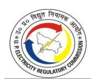

4.13.4. The Interest on Working Capital approved by the Commission in the Tariff Order dated May 24, 2023, claimed by the Petitioners and approved by the Commission upon Truing Up in the current Petition is shown in the Tables below:

**TABLE 4-165: INTEREST ON WORKING CAPITAL OF DVVNL FOR FY 2023-24 AS APPROVED BY THE COMMISSION (IN RS. CRORE)**

| Particulars                                                                                                                                                    | Approved in Tariff Order dated May 24, 2023 | Claimed  | Approved |
|----------------------------------------------------------------------------------------------------------------------------------------------------------------|------------------------------------------------------------|----------|----------|
| O&M expenses for 1 month                                                                                                                                       | 86.44                                                      | 132.96   | 91.00    |
| One and half month equivalent of the expected revenue from charges for use of Distribution system at the prevailing Tariff (excluding Electricity Duty); | 2,059.98                                                   | 2,250.53 | 2,250.53 |
| Maintenance spares @ 40% of R&M expenses for two months                                                                                                        | 40.66                                                      | 43.58    | 38.86    |
| Less: Security deposits from consumers, if any                                                                                                                 | 882.93                                                     | 844.77   | 809.11   |
| Net Working Capital                                                                                                                                            | 1,304.15                                                   | 1,582.30 | 1,571.28 |
| State Bank Marginal Cost Lending Rates (SBI-MCLR) %                                                                                                            | 10.20%                                                     | 11.15%   | 11.07%   |
| Interest on Working Capital                                                                                                                                    | 133.02                                                     | 176.43   | 173.86   |

**TABLE 4-166: INTEREST ON WORKING CAPITAL OF MVVNL FOR FY 2023-24 AS APPROVED BY THE COMMISSION (IN RS. CRORE)**

| Particulars                                                                                                                                                    | Approved in Tariff Order dated May 24, 2023 | Claimed  | Approved |
|----------------------------------------------------------------------------------------------------------------------------------------------------------------|------------------------------------------------------------|----------|----------|
| O&M expenses for 1 month                                                                                                                                       | 99.78                                                      | 165.90   | 103.74   |
| One and half month equivalent of the expected revenue from charges for use of Distribution system at the prevailing Tariff (excluding Electricity Duty); | 2,285.06                                                   | 2,325.44 | 2,325.44 |
| Maintenance spares @ 40% of R&M expenses for two months                                                                                                        | 30.22                                                      | 29.35    | 24.95    |
| Less: Security deposits from consumers, if any                                                                                                                 | 806.83                                                     | 868.37   | 829.37   |
| Net Working Capital                                                                                                                                            | 1,608.23                                                   | 1,652.32 | 1,624.77 |
| State Bank Marginal Cost Lending Rates (SBI-MCLR) %                                                                                                            | 10.20%                                                     | 11.15%   | 11.07%   |
| Interest on Working Capital                                                                                                                                    | 164.04                                                     | 184.23   | 179.78   |

#### **TABLE 4-167: INTEREST ON WORKING CAPITAL OF PVVNL FOR FY 2023-24 AS APPROVED BY THE COMMISSION (IN RS. CRORE)**

| Particulars                                                                                                                                                    | Approved in Tariff Order dated May 24, 2023 | Claimed  | Approved |
|----------------------------------------------------------------------------------------------------------------------------------------------------------------|------------------------------------------------------------|----------|----------|
| O&M expenses for 1 month                                                                                                                                       | 100.90                                                     | 146.16   | 103.30   |
| One and half month equivalent of the expected revenue from charges for use of Distribution system at the prevailing Tariff (excluding Electricity Duty); | 3,310.09                                                   | 3,386.86 | 3,386.86 |
| Maintenance spares @ 40% of R&M expenses for two months                                                                                                        | 35.53                                                      | 47.06    | 33.96    |
| Less: Security deposits from consumers, if any                                                                                                                 | 2,183.64                                                   | 2,008.12 | 1,937.91 |
| Net Working Capital                                                                                                                                            | 1,262.88                                                   | 1,571.95 | 1,586.21 |
| State Bank Marginal Cost Lending Rates (SBI-MCLR) %                                                                                                            | 10.20%                                                     | 11.15%   | 11.07%   |
| Interest on Working Capital                                                                                                                                    | 128.81                                                     | 175.27   | 175.52   |

#### **TABLE 4-168: INTEREST ON WORKING CAPITAL OF PUVVNL FOR FY 2023-24 AS APPROVED BY THE COMMISSION (IN RS. CRORE)**

| Particulars                                                                                                                                                    | Approved in Tariff Order dated May 24, 2023 | Claimed  | Approved |
|----------------------------------------------------------------------------------------------------------------------------------------------------------------|------------------------------------------------------------|----------|----------|
| O&M expenses for 1 month                                                                                                                                       | 141.67                                                     | 161.58   | 115.73   |
| One and half month equivalent of the expected revenue from charges for use of Distribution system at the prevailing Tariff (excluding Electricity Duty); | 2,565.36                                                   | 2,383.78 | 2,383.78 |
| Maintenance spares @ 40% of R&M expenses for two months                                                                                                        | 55.25                                                      | 69.49    | 42.30    |
| Less: Security deposits from consumers, if any                                                                                                                 | 629.29                                                     | 552.64   | 531.33   |
| Net Working Capital                                                                                                                                            | 2,132.99                                                   | 2,062.20 | 2,010.48 |
| State Bank Marginal Cost Lending Rates (SBI-MCLR) %                                                                                                            | 10.20%                                                     | 11.15%   | 11.07%   |
| Interest on Working Capital                                                                                                                                    | 217.57                                                     | 229.94   | 222.46   |

#### **TABLE 4-169: INTEREST ON WORKING CAPITAL OF KESCO FOR FY 2023-24 AS APPROVED BY THE COMMISSION (IN RS. CRORE)**

| Particulars              | Approved in Tariff Order dated May 24, 2023 | Claimed | Approved |
|--------------------------|------------------------------------------------------------|---------|----------|
| O&M expenses for 1 month | 25.02                                                      | 26.97   | 19.31    |

| Particulars                                                                                                                                                    | Approved in Tariff Order dated May 24, 2023 | Claimed | Approved |
|----------------------------------------------------------------------------------------------------------------------------------------------------------------|------------------------------------------------------------|---------|----------|
| One and half month equivalent of the expected revenue from charges for use of Distribution system at the prevailing Tariff (excluding Electricity Duty); | 417.70                                                     | 397.21  | 397.21   |
| Maintenance spares @ 40% of R&M expenses for two months                                                                                                        | 6.10                                                       | 6.69    | 3.76     |
| Less: Security deposits from consumers, if any                                                                                                                 | 196.59                                                     | 187.98  | 184.57   |
| Net Working Capital                                                                                                                                            | 252.23                                                     | 242.89  | 235.71   |
| State Bank Marginal Cost Lending Rates (SBI-MCLR) %                                                                                                            | 10.20%                                                     | 11.15%  | 11.07%   |
| Interest on Working Capital                                                                                                                                    | 25.73                                                      | 27.08   | 26.08    |

**TABLE 4-170: CONSOLIDATED INTEREST ON WORKING CAPITAL FOR FY 2023-24 AS APPROVED BY THE COMMISSION (IN RS. CRORE)**

| Particulars                                                                                                                                                    | Approved in Tariff Order dated May 24, 2023 | Claimed   | Approved  |
|----------------------------------------------------------------------------------------------------------------------------------------------------------------|------------------------------------------------------------|-----------|-----------|
| O&M expenses for 1 month                                                                                                                                       | 453.80                                                     | 633.57    | 433.08    |
| One and half month equivalent of the expected revenue from charges for use of Distribution system at the prevailing Tariff (excluding Electricity Duty); | 10,638.20                                                  | 10,743.83 | 10,743.83 |
| Maintenance spares @ 40% of R&M expenses for two months                                                                                                     | 167.75                                                     | 196.15    | 143.82    |
| Less: Security deposits from consumers, if any                                                                                                                 | 4,699.28                                                   | 4,461.88  | 4,292.29  |
| Net Working Capital                                                                                                                                            | 6,560.47                                                   | 7,111.67  | 7,028.44  |
| State Bank Marginal Cost Lending Rates (SBI-MCLR) %                                                                                                            | 10.20%                                                     | 11.15%    | 11.07%    |
| Interest on Working Capital                                                                                                                                    | 669.17                                                     | 792.95    | 777.71    |

#### **4.14. INTEREST & FINANCE CHARGES**

#### *Commission's Analysis:*

4.14.1. The Interest and Finance Charges claimed by the Petitioner and approved by the Commission in the True Up of FY 2023-24 are as follows:

**TABLE 4-171: INTEREST AND FINANCE CHARGES OF DVVNL FOR FY 2023-24 AS APPROVED BY THE COMMISSION (IN RS. CRORE)**

| Particulars                      | Approved in Tariff Order dated May 24, 2023 | Claimed | Approved |
|----------------------------------|---------------------------------------------------|---------|----------|
| Gross Interest on Long-term loan | 462.97                                            | 436.63  | 447.14   |

| Particulars                      | Approved in Tariff Order dated May 24, 2023 | Claimed | Approved |
|----------------------------------|---------------------------------------------------|---------|----------|
| Less: Interest Capitalised       | 0.00                                              | 0.00    | 0.00     |
| Net Interest on Loan term loan   | 462.97                                            | 436.63  | 447.14   |
| Banking & Finance Charges        | 0.00                                              | 12.97   | 0.00     |
| Interest on Security Deposit     | 36.27                                             | 54.90   | 54.90    |
| Interest on Working Capital      | 133.02                                            | 176.43  | 173.86   |
| Total Interest & Finance Charges | 632.26                                            | 680.93  | 675.91   |

**TABLE 4-172: INTEREST AND FINANCE CHARGES OF MVVNL FOR FY 2023-24 AS APPROVED BY THE COMMISSION (IN RS. CRORE)**

| Particulars                      | Approved in Tariff Order dated May 24, 2023 | Claimed | Approved |
|----------------------------------|---------------------------------------------------|---------|----------|
| Gross Interest on Long-term loan | 462.67                                            | 381.27  | 405.07   |
| Less: Interest Capitalised       | 0.00                                              | 0.00    | 0.00     |
| Net Interest on Long-term loan   | 462.67                                            | 381.27  | 405.07   |
| Banking & Finance Charges        | 0.00                                              | 13.04   | 0.00     |
| Interest on Security Deposit     | 33.45                                             | 30.58   | 30.58    |
| Interest on Working Capital      | 164.04                                            | 184.23  | 179.78   |
| Total Interest & Finance Charges | 660.16                                            | 609.12  | 615.43   |

**TABLE 4-173: INTEREST AND FINANCE CHARGES OF PVVNL FOR FY 2023-24 AS APPROVED BY THE COMMISSION (IN RS. CRORE)**

| Particulars                      | Approved in Tariff Order dated May 24, 2023 | Claimed | Approved |
|----------------------------------|---------------------------------------------------|---------|----------|
| Gross Interest on Long-term loan | 245.77                                            | 264.91  | 257.28   |
| Less: Interest Capitalised       | 0.00                                              | 0.00    | 0.00     |
| Net Interest on Long-term loan   | 245.77                                            | 264.91  | 257.28   |
| Banking & Finance Charges        | 0.00                                              | 18.56   | 0.00     |
| Interest on Security Deposit     | 90.24                                             | 130.68  | 130.68   |
| Interest on Working Capital      | 128.81                                            | 175.27  | 175.52   |
| Total Interest & Finance Charges | 464.82                                            | 589.42  | 563.48   |

**TABLE 4-174: INTEREST AND FINANCE CHARGES OF PUVVNL FOR FY 2023-24 AS APPROVED BY THE COMMISSION (IN RS. CRORE)**

| Particulars                      | Approved in Tariff Order dated May 24, 2023 | Claimed | Approved |
|----------------------------------|---------------------------------------------------|---------|----------|
| Gross Interest on Long-term loan | 427.52                                            | 329.72  | 352.18   |
| Less: Interest Capitalised       | 111.18                                            | 0.00    | 0.00     |
| Net Interest on Long-term        | 316.33                                            | 329.72  | 352.18   |

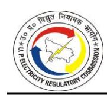

| Particulars                      | Approved in Tariff Order dated May 24, 2023 | Claimed | Approved |
|----------------------------------|---------------------------------------------------|---------|----------|
| Banking & Finance Charges        | 0.00                                              | 13.21   | 0.00     |
| Interest on Security Deposit     | 26.17                                             | 34.35   | 34.35    |
| Interest on Working Capital      | 217.57                                            | 229.94  | 222.46   |
| Total Interest & Finance Charges | 560.07                                            | 607.22  | 608.99   |

**TABLE 4-175: INTEREST AND FINANCE CHARGES OF KESCO FOR FY 2023-24 AS APPROVED BY THE COMMISSION (IN RS. CRORE)**

| Particulars                      | Approved in Tariff Order dated May 24, 2023 | Claimed | Approved |
|----------------------------------|---------------------------------------------------|---------|----------|
| Gross Interest on Long-term loan | 15.67                                             | 8.03    | 7.10     |
| Less: Interest Capitalised       | 0.00                                              | 0.00    | 0.00     |
| Net Interest on Long-term loan   | 15.67                                             | 8.03    | 7.10     |
| Banking & Finance Charges        | 0.00                                              | 1.98    | 0.00     |
| Interest on Security Deposit     | 8.22                                              | 12.47   | 12.47    |
| Interest on Working Capital      | 25.73                                             | 27.08   | 26.08    |
| Total Interest & Finance Charges | 49.62                                             | 49.56   | 45.65    |

**TABLE 4-176: CONSOLIDATED INTEREST AND FINANCE CHARGES FOR FY 2023-24 AS APPROVED BY THE COMMISSION (IN RS. CRORE)**

| Particulars                      | Approved in Tariff Order dated May 24, 2023 | Claimed  | Approved |
|----------------------------------|---------------------------------------------------|----------|----------|
| Gross Interest on Long-term loan | 1,614.60                                          | 1,420.56 | 1,468.77 |
| Less: Interest Capitalised       | 111.18                                            | 0.00     | 0.00     |
| Net Interest on Loan term loan   | 1,503.41                                          | 1,420.56 | 1,468.77 |
| Banking & Finance Charges        | 0.00                                              | 59.76    | 0.00     |
| Interest on Security Deposit     | 194.36                                            | 262.98   | 262.98   |
| Interest on Working Capital      | 669.18                                            | 792.95   | 777.71   |
| Total Interest & Finance Charges | 2,366.95                                          | 2,536.25 | 2,509.46 |

#### **4.15. PROVISION FOR BAD AND DOUBTFUL DEBTS**

#### *Petitioners' Submission*

4.15.1. The Petitioners have claimed Bad and Doubtful Debts as 2% of the revenue receivable as per Audited Accounts of FY 2023-24 in accordance with Regulation 46 of the MYT Regulations, 2019, as shown in the Tables below:

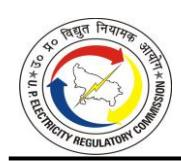

#### **TABLE 4-177: PROVISION FOR BAD AND DOUBTFUL DEBTS FOR FY 2023-24 AS SUBMITTED BY DVVNL (IN RS. CRORE)**

| Particulars                                         | Approved in Tariff Order dated 24.05.2023 | Claimed   |
|-----------------------------------------------------|-------------------------------------------------|-----------|
| Total Revenue Receivables from Retail Sales         | 12,905.61                                       | 13,655.32 |
| % of Provision for Bad and Doubtful Debts           | 2.00%                                           | 2.00%     |
| Bad and Doubtful Debts as per governing regulations | 258.11                                          | 273.11    |
| Bad and Doubtful Debts as per Audited Account       | NA                                              | 2,650.65  |
| Bad and Doubtful Debt                               | 258.11                                          | 273.11    |

#### **TABLE 4-178: PROVISION FOR BAD AND DOUBTFUL DEBTS FOR FY 2023-24 AS SUBMITTED BY MVVNL (IN RS. CRORE)**

| Particulars                                         | Approved in Tariff Order dated 24.05.2023 | Claimed   |
|-----------------------------------------------------|-------------------------------------------------|-----------|
| Total Revenue Receivables from Retail Sales         | 14,586.75                                       | 14,580.48 |
| % of Provision for Bad and Doubtful Debts           | 2.00%                                           | 2.00%     |
| Bad and Doubtful Debts as per governing regulations | 291.73                                          | 291.61    |
| Bad and Doubtful Debts as per Audited Account       | NA                                              | 3,136.62  |
| Bad and Doubtful Debt                               | 291.73                                          | 291.61    |

### **TABLE 4-179: PROVISION FOR BAD AND DOUBTFUL DEBTS FOR FY 2023-24 AS SUBMITTED BY PVVNL (IN RS. CRORE)**

| Particulars                                         | Approved in Tariff Order dated 24.05.2023 | Claimed   |
|-----------------------------------------------------|-------------------------------------------------|-----------|
| Total Revenue Receivables from Retail Sales         | 22,880.08                                       | 22,731.55 |
| % of Provision for Bad and Doubtful Debts           | 2.00%                                           | 2.00%     |
| Bad and Doubtful Debts as per governing regulations | 457.60                                          | 454.63    |
| Bad and Doubtful Debts as per Audited Account       | NA                                              | 44.27     |
| Bad and Doubtful Debt                               | 457.60                                          | 454.63    |

#### **TABLE 4-180: PROVISION FOR BAD AND DOUBTFUL DEBTS FOR FY 2023-24 AS SUBMITTED BY PUVVNL (IN RS. CRORE)**

| Particulars                                         | Approved in Tariff Order dated 24.05.2023 | Claimed   |
|-----------------------------------------------------|-------------------------------------------------|-----------|
| Total Revenue Receivables from Retail Sales         | 16,168.26                                       | 14,711.83 |
| % of Provision for Bad and Doubtful Debts           | 2.00%                                           | 2.00%     |
| Bad and Doubtful Debts as per governing regulations | 323.37                                          | 294.24    |
| Bad and Doubtful Debts as per Audited Account       | NA                                              | 3,472.98  |
| Bad and Doubtful Debt                               | 323.37                                          | 294.24    |

**TABLE 4-181: PROVISION FOR BAD AND DOUBTFUL DEBTS FOR FY 2023-24 AS SUBMITTED BY KESCO (IN RS. CRORE)**

| Particulars                                         | Approved in Tariff Order dated 24.05.2023 | Claimed  |
|-----------------------------------------------------|-------------------------------------------------|----------|
| Total Revenue Receivables from Retail Sales         | 3,266.10                                        | 3,177.70 |
| % of Provision for Bad and Doubtful Debts           | 2.00%                                           | 2.00%    |
| Bad and Doubtful Debts as per governing regulations | 65.32                                           | 63.55    |
| Bad and Doubtful Debts as per Audited Account       | NA                                              | 526.55   |
| Bad and Doubtful Debt                               | 65.32                                           | 63.55    |

#### *Commission's Analysis:*

4.15.2. The Commission observes that the Petitioners have booked a high amount towards Bad and Doubtful Debt in their Audited Accounts. However, the Petitioners have claimed Bad and Doubtful Debt as 2% of revenue receivable as per the provisions of MYT Regulations, 2019. Accordingly, the Commission has approved the Provision for Bad and Doubtful Debts at 2% of revenue in the Audited Accounts of FY 2023-24. The values are as shown in the Table below:

**TABLE 4-182: PROVISION FOR BAD AND DOUBTFUL DEBTS OF DVVNL FOR FY 2023-24 AS APPROVED BY THE COMMISSION (IN RS. CRORE)**

| Particulars                                            | Derivation | Approved in Tariff Order dated May 24, 2023 | Claimed   | Approved  |
|--------------------------------------------------------|------------|------------------------------------------------------------|-----------|-----------|
| Total Revenue Receivables from Retail Sales            | A          | 12,905.61                                                  | 13,655.32 | 13,655.32 |
| % of Provision for Bad and Doubtful Debts              | B          | 2.00%                                                      | 2.00%     | 2.00%     |
| Bad and Doubtful Debts as per governing regulations | C=A*B      | 258.11                                                     | 273.11    | 273.11    |
| Bad and Doubtful Debts as per Audited Account          | D          | NA                                                         | 2,650.65  | 2,650.65  |
| Bad and Doubtful Debt                                  | Min (C, D) | 258.11                                                     | 273.11    | 273.11    |

**TABLE 4-183: PROVISION FOR BAD AND DOUBTFUL DEBTS OF MVVNL FOR FY 2023-24 AS APPROVED BY THE COMMISSION (IN RS. CRORE)**

| Particulars                                            | Derivation | Approved in Tariff Order dated May 24, 2023 | Claimed   | Approved  |
|--------------------------------------------------------|------------|------------------------------------------------------|-----------|-----------|
| Total Revenue Receivables from Retail Sales         | A          | 14,586.75                                            | 14,580.48 | 14,580.48 |
| % of Provision for Bad and Doubtful Debts              | B          | 2.00%                                                | 2.00%     | 2.00%     |
| Bad and Doubtful Debts as per governing regulations | C=A*B      | 291.73                                               | 291.61    | 291.61    |
| Bad and Doubtful Debts as per Audited Account       | D          | NA                                                   | 3,136.62  | 3,136.62  |
| Bad and Doubtful Debt                                  | Min (C, D) | 291.73                                               | 291.61    | 291.61    |

- 4.15.3. The Commission observes that PVVNL has done zero provisioning against trade receivables in their Audited Accounts for FY 2023-24.
- 4.15.4. The relevant extract from the Audited Accounts for FY 2023-24 is as given below:

*"The provision for Bad & Doubtful Debts as on 31.03.2024, calculated as per above stated policy will be Rs. 23,748.79 crore in comparison to provision as on 31.03.2023 amounting to Rs. 34,211.70 crore. Following the conservative approach, the Management has decided that the provision stated in Annual Accounts up to 31.03.2023 is appropriate and no new addition/deduction in provision is required for FY 2023-24."*

4.15.5. Regulation 46.1 of MYT Regulations, 2019 provides for bad and doubtful debts on trade receivable. The relevant extract from the Regulation is given below:

> *"For any Year, the Commission may allow a provision for write off of bad and doubtful debts up to 2% of the amount shown as Revenue Receivables from sale of electricity in the audited accounts of the Distribution Licensee for that Year or the actual write off of bad debts, whichever is less:"*

4.15.6. Since the actual provisioning in the Audited books by PVVNL is zero, the Commission, in compliance with Regulation 46.1, has approved bad and doubtful debts as shown below:

**TABLE 4-184: PROVISION FOR BAD AND DOUBTFUL DEBTS OF PVVNL FOR FY 2023-24 AS APPROVED BY THE COMMISSION (IN RS. CRORE)**

| Particulars                                            | Derivation | Approved in Tariff Order dated May 24, 2023 | Claimed   | Approved  |
|--------------------------------------------------------|------------|---------------------------------------------------------|-----------|-----------|
| Total Revenue Receivables from Retail Sales            | A          | 22,880.08                                               | 22,731.55 | 22,731.55 |
| % of Provision for Bad and Doubtful Debts              | B          | 2.00%                                                   | 2.00%     | 2.00%     |
| Bad and Doubtful Debts as per governing regulations | C=A*B      | 457.60                                                  | 454.63    | 454.63    |
| Bad and Doubtful Debts as per Audited Account       | D          | NA                                                      | 0.00*     | 0.00      |
| Bad and Doubtful Debt                                  | Min (C, D) | 457.60                                                  | 454.63    | 0.00      |

*\*The Petitioner has reported an amount of Rs. 44.27 Crore under Bad and Doubtful Debts as per the Audited Financial Statements; however, this amount does not pertain to trade receivables. Hence, not considered by the Commission.*

**TABLE 4-185: PROVISION FOR BAD AND DOUBTFUL DEBTS OF PUVVNL FOR FY 2023-24 AS APPROVED BY THE COMMISSION (IN RS. CRORE)**

| Particulars                                            | Derivation | Approved in Tariff Order dated May 24, 2023 | Claimed   | Approved  |
|--------------------------------------------------------|------------|---------------------------------------------------------|-----------|-----------|
| Total Revenue Receivables from Retail Sales            | A          | 16,168.26                                               | 14,711.83 | 14,711.83 |
| % of Provision for Bad and Doubtful Debts              | B          | 2.00%                                                   | 2.00%     | 2.00%     |
| Bad and Doubtful Debts as per governing regulations | C=A*B      | 323.27                                                  | 294.24    | 294.24    |
| Bad and Doubtful Debts as per Audited Account       | D          | NA                                                      | 3,472.98  | 3,472.98  |
| Bad and Doubtful Debt                                  | Min (C, D) | 323.27                                                  | 294.24    | 294.24    |

**TABLE 4-186: PROVISION FOR BAD AND DOUBTFUL DEBTS OF KESCO FOR FY 2023-24 AS APPROVED BY THE COMMISSION (IN RS. CRORE)**

| Particulars                                            | Derivation | Approved in Tariff Order dated May 24, 2023 | Claimed  | Approved |
|--------------------------------------------------------|------------|------------------------------------------------------|----------|----------|
| Total Revenue Receivables from Retail Sales            | A          | 3,266.10                                             | 3,177.70 | 3,177.70 |
| % of Provision for Bad and Doubtful Debts              | B          | 2.00%                                                | 2.00%    | 2.00%    |
| Bad and Doubtful Debts as per governing regulations | C=A*B      | 65.32                                                | 63.55    | 63.55    |
| Bad and Doubtful Debts as per Audited Account       | D          | NA                                                   | 526.55   | 526.55   |
| Bad and Doubtful Debt                                  | Min (C, D) | 65.32                                                | 63.55    | 63.55    |

**TABLE 4-187: CONSOLIDATED PROVISION FOR BAD AND DOUBTFUL DEBTS FOR FY 2023-24 AS APPROVED BY THE COMMISSION (IN RS. CRORE)**

| Particulars                                            | Derivation | Approved in Tariff Order dated May 24, 2023 | Claimed   | Approved  |
|--------------------------------------------------------|------------|---------------------------------------------------------|-----------|-----------|
| Total Revenue Receivables from Retail Sales            | A          | 69,806.79                                               | 68,856.88 | 68,856.88 |
| % of Provision for Bad and Doubtful Debts              | B          | 2.00%                                                   | 2.00%     | 2.00%     |
| Bad and Doubtful Debts as per governing regulations | C=A*B      | 1,396.14                                                | 1,377.14  | 1,377.14  |
| Bad and Doubtful Debts as per Audited Account       | D          | NA                                                      | 9,786.80  | 9,786.80  |
| Consolidated Bad and Doubtful Debt Allowed             | E          | 1,396.14                                                | 1,377.14  | 922.51    |

#### **4.16. RETURN ON EQUITY**

#### *Petitioners' Submission*

4.16.1. The Petitioners have claimed Return on Equity@15% as per Regulation 22 of the MYT Regulations, 2019. The Petitioners have considered closing equity as approved by the Commission in its True Up Order for FY 2022-23, as opening for FY 2023-24. Equity addition during the year has been considered 30% of GFA addition during the year, net of consumer contribution, capital subsidies/grants and decapitalization. RoE as submitted by the Petitioners for FY 2023-24 is shown in the Table below:

**TABLE 4-188: RETURN ON EQUITY FOR FY 2023-24 AS SUBMITTED BY DVVNL (IN RS. CRORE)**

| Particulars                                                                                     | Approved in Tariff Order dated 24.05.2023 | Claimed  |
|-------------------------------------------------------------------------------------------------|-------------------------------------------------|----------|
| Opening Equity                                                                                  | 3,983.80                                        | 4,185.82 |
| Additions (30% of Capitalization net of Consumer Contribution, Grants and de-capitalization) | 467.89                                          | 314.50   |
| Closing Equity                                                                                  | 4,451.69                                        | 4,500.32 |
| Rate of Return on Equity (%)                                                                    | 14.50%                                          | 15.00%   |
| Allowable Return on Equity                                                                      | 611.57                                          | 651.46   |

**TABLE 4-189: RETURN ON EQUITY FOR FY 2023-24 AS SUBMITTED BY MVVNL (IN RS. CRORE)**

| Particulars    | Approved in Tariff Order dated 24.05.2023 | Claimed  |
|----------------|-------------------------------------------------|----------|
| Opening Equity | 3,721.22                                        | 3,582.23 |

| Particulars                                                                                     | Approved in Tariff Order dated 24.05.2023 | Claimed  |
|-------------------------------------------------------------------------------------------------|-------------------------------------------------|----------|
| Additions (30% of Capitalization net of Consumer Contribution, Grants and de-capitalization) | 391.26                                          | 238.92   |
| Closing Equity                                                                                  | 4,112.48                                        | 3,821.15 |
| Rate of Return on Equity (%)                                                                    | 14.50%                                          | 15.00%   |
| Allowable Return on Equity                                                                      | 567.94                                          | 555.25   |

#### **TABLE 4-190: RETURN ON EQUITY FOR FY 2023-24 AS SUBMITTED BY PVVNL (IN RS. CRORE)**

| Particulars                                                                                     | Approved in Tariff Order dated 24.05.2023 | Claimed  |
|-------------------------------------------------------------------------------------------------|-------------------------------------------------|----------|
| Opening Equity                                                                                  | 4,105.81                                        | 4,065.11 |
| Additions (30% of Capitalization net of Consumer Contribution, Grants and de-capitalization) | 256.38                                          | -6.17    |
| Closing Equity                                                                                  | 4,362.19                                        | 4,058.94 |
| Rate of Return on Equity (%)                                                                    | 14.50%                                          | 15.00%   |
| Allowable Return on Equity                                                                      | 613.93                                          | 609.30   |

#### **TABLE 4-191: RETURN ON EQUITY FOR FY 2023-24 AS SUBMITTED BY PUVVNL (IN RS. CRORE)**

| Particulars                                                                                     | Approved in Tariff Order dated 24.05.2023 | Claimed  |
|-------------------------------------------------------------------------------------------------|-------------------------------------------------|----------|
| Opening Equity                                                                                  | 4,006.67                                        | 3,676.44 |
| Additions (30% of Capitalization net of Consumer Contribution, Grants and de-capitalization) | 425.09                                          | 385.60   |
| Closing Equity                                                                                  | 4,431.76                                        | 4,062.04 |
| Rate of Return on Equity (%)                                                                    | 14.50%                                          | 15.00%   |
| Allowable Return on Equity                                                                      | 611.79                                          | 580.39   |

#### **TABLE 4-192: RETURN ON EQUITY FOR FY 2023-24 AS SUBMITTED BY KESCO (IN RS. CRORE)**

| Particulars                                                                                     | Approved in Tariff Order dated 24.05.2023 | Claimed |
|-------------------------------------------------------------------------------------------------|-------------------------------------------------|---------|
| Opening Equity                                                                                  | 358.35                                          | 337.76  |
| Additions (30% of Capitalization net of Consumer Contribution, Grants and de-capitalization) | 43.31                                           | 6.09    |
| Closing Equity                                                                                  | 401.66                                          | 343.85  |
| Rate of Return on Equity (%)                                                                    | 14.50%                                          | 15.00%  |
| Allowable Return on Equity                                                                      | 55.10                                           | 51.12   |

## *Commission's Analysis:*

- 4.16.2. The Commission, in accordance with Regulation 22 of the MYT Regulations, 2019, has computed the Return on Equity for the Petitioners. The closing balance of equity of FY 2022-23, as approved by the Commission in the Tariff Order dated October 10, 2024, has been considered as opening equity for FY 2023-24 (as of April 1, 2023). Further, 30% of approved assets capitalised (net off deduction / de-capitalization and consumer contribution, etc., in capitalization) have been considered as equity addition during the year.
- 4.16.3. The Commission, while approving the ARR for FY 2023–24 vide its Tariff Order dated May 24, 2023, reduced the Return on Equity (RoE) of the State DISCOMs to 14.50% on account of the delayed submission of their Tariff Petitions. The relevant excerpt from the Tariff Order dated May 23, 2023, is reproduced below:

*"…..*

*6.11.7. As per MYT Regulations, 2019, the last date of filing of ARR Petition was November 30, 2022. However, the Petitioners filed the Petition on January 09, 2023. Accordingly, as per the second Amendment of MYT Regulations, 2019, the rate of return on equity is reduced to 14.50%. Therefore, the Commission has reduced the rate of return on equity for FY 2023-24 as per above said Regulations and the same reduced rate of return on equity approved in this Tariff Order of FY 2023-24 shall also be considered at the time of True Up proceedings......"*

In view of the excerpt, the Commission has considered a rate of 14.50% instead of 15.00% to arrive at a final figure of RoE for FY 2023-24.

4.16.4. Further, the RoE claimed by the Petitioners and approved by the Commission for FY 2023-24 is shown in the Tables below:

**TABLE 4-193: RETURN ON EQUITY OF DVVNL FOR FY 2023-24 AS APPROVED BY COMMISSION (IN RS. CRORE)**

| Particulars                                                                  | Approved in Tariff Order dated May 24, 2023 | Claimed  | Approved |
|------------------------------------------------------------------------------|---------------------------------------------------|----------|----------|
| Opening Equity                                                               | 3,983.80                                          | 4,185.82 | 4,185.82 |
| Additions (30% of Capitalization net of Consumer Contribution and Grants) | 467.89                                            | 314.50   | 314.50   |
| Closing Equity                                                               | 4,451.69                                          | 4,500.32 | 4,500.32 |
| Average Equity                                                               | 4,217.75                                          | 4,343.07 | 4,343.07 |

| Particulars                                                       | Approved in Tariff Order dated May 24, 2023 | Claimed | Approved |
|-------------------------------------------------------------------|---------------------------------------------------|---------|----------|
| Rate of Return on Equity (%)                                      | 15.00%                                            | 15.00%  | 15.00%   |
| Return on Equity                                                  | 632.66                                            | 651.46  | 651.46   |
| Rate of RoE due to delayed filing (reduced by 0.25% per month) | 14.50%                                            |         | 14.50%   |
| Disallowance due to delay in filing                               | 21.09                                             |         | 21.72    |
| Allowable Return on Equity                                        | 611.57                                            | 651.46  | 629.75   |

**TABLE 4-194: RETURN ON EQUITY OF MVVNL FOR FY 2023-24 AS APPROVED BY THE COMMISSION (IN RS. CRORE)**

| Particulars                                                                  | Approved in Tariff Order dated May 24, 2023 | Claimed  | Approved |
|------------------------------------------------------------------------------|---------------------------------------------------|----------|----------|
| Opening Equity                                                               | 3,721.22                                          | 3,582.23 | 3,582.23 |
| Additions (30% of Capitalization net of Consumer Contribution and Grants) | 391.26                                            | 238.92   | 238.92   |
| Closing Equity                                                               | 4,112.48                                          | 3,821.15 | 3,821.15 |
| Average Equity                                                               | 3,916.85                                          | 3,701.69 | 3,701.69 |
| Rate of Return on Equity (%)                                                 | 15.00%                                            | 15.00%   | 15.00%   |
| Return on Equity                                                             | 587.53                                            | 555.25   | 555.25   |
| Rate of RoE due to delayed filing (reduced by 0.25% per month)            | 14.50%                                            |          | 14.50%   |
| Disallowance due to delay in filing                                          | 19.58                                             |          | 18.51    |
| Allowable Return on Equity                                                   | 567.94                                            | 555.25   | 536.74   |

**TABLE 4-195: RETURN ON EQUITY OF PVVNL FOR FY 2023-24 AS APPROVED BY THE COMMISSION (IN RS. CRORE)**

| Particulars                                                                  | Approved in Tariff Order dated May 24, 2023 | Claimed  | Approved |
|------------------------------------------------------------------------------|---------------------------------------------------|----------|----------|
| Opening Equity                                                               | 4,105.81                                          | 4,065.11 | 4,065.11 |
| Additions (30% of Capitalization net of Consumer Contribution and Grants) | 256.38                                            | (6.17)   | (6.17)   |
| Closing Equity                                                               | 4,362.19                                          | 4,058.94 | 4,058.94 |
| Average Equity                                                               | 4,234.00                                          | 4,062.02 | 4,062.02 |
| Rate of Return on Equity (%)                                                 | 15.00%                                            | 15.00%   | 15.00%   |
| Return on Equity                                                             | 635.10                                            | 609.30   | 609.30   |
| Rate of RoE due to delayed filing (reduced by 0.25% per month)            | 14.50%                                            |          | 14.50%   |
| Disallowance due to delay in filing                                          | 21.17                                             |          | 20.31    |
| Allowable Return on Equity                                                   | 613.93                                            | 609.30   | 588.99   |

**TABLE 4-196: RETURN ON EQUITY OF PUVVNL FOR FY 2023-24 AS APPROVED BY THE COMMISSION (IN RS. CRORE)**

| Particulars                                                                  | Approved in Tariff Order dated May 24, 2023 | Claimed  | Approved |
|------------------------------------------------------------------------------|---------------------------------------------------|----------|----------|
| Opening Equity                                                               | 4,006.67                                          | 3,676.44 | 3676.44  |
| Additions (30% of Capitalization net of Consumer Contribution and Grants) | 425.09                                            | 385.60   | 385.60   |
| Closing Equity                                                               | 4,431.76                                          | 4,062.04 | 4062.04  |
| Average Equity                                                               | 4,219.22                                          | 3,869.24 | 3,869.24 |
| Rate of Return on Equity (%)                                                 | 15.00%                                            | 15.00%   | 15.00%   |
| Return on Equity                                                             | 632.88                                            | 580.39   | 580.39   |
| Rate of RoE due to delayed filing (reduced by 0.25% per month)            | 14.50%                                            |          | 14.50%   |
| Disallowance due to delay in filing                                          | 21.10                                             |          | 19.35    |
| Allowable Return on Equity                                                   | 611.79                                            | 580.39   | 561.04   |

**TABLE 4-197: RETURN ON EQUITY OF KESCO FOR FY 2023-24 AS APPROVED BY THE COMMISSION (IN RS. CRORE)**

| Particulars                                                                  | Approved in Tariff Order dated May 24, 2023 | Claimed | Approved |
|------------------------------------------------------------------------------|---------------------------------------------------|---------|----------|
| Opening Equity                                                               | 358.35                                            | 337.76  | 337.76   |
| Additions (30% of Capitalization net of Consumer Contribution and Grants) | 43.31                                             | 6.09    | 6.09     |
| Closing Equity                                                               | 401.66                                            | 343.85  | 343.85   |
| Average Equity                                                               | 380.01                                            | 340.80  | 340.80   |
| Rate of Return on Equity (%)                                                 | 15.00%                                            | 15.00%  | 15.00%   |
| Return on Equity                                                             | 57.00                                             | 51.12   | 51.12    |
| Rate of RoE due to delayed filing (reduced by 0.25% per month)            | 14.50%                                            |         | 14.50%   |
| Disallowance due to delay in filing                                          | 1.90                                              |         | 1.70     |
| Allowable Return on Equity                                                   | 55.10                                             | 51.12   | 49.42    |

**TABLE 4-198: CONSOLIDATED RETURN ON EQUITY FOR FY 2023-24 AS APPROVED BY THE COMMISSION (IN RS. CRORE)**

| Particulars                                                                  | Approved in Tariff Order dated May 24, 2023 | Claimed   | Approved  |
|------------------------------------------------------------------------------|---------------------------------------------------|-----------|-----------|
| Opening Equity                                                               | 16,175.85                                         | 15,847.36 | 15,847.36 |
| Additions (30% of Capitalization net of Consumer Contribution and Grants) | 1,583.93                                          | 938.93    | 938.93    |
| Closing Equity                                                               | 17,759.78                                         | 16,786.29 | 16,786.29 |
| Average Equity                                                               | 16,967.82                                         | 16,316.83 | 16,316.83 |
| Rate of Return on Equity (%)                                                 | 15.00%                                            | 15.00%    | 15.00%    |
| Return on Equity                                                             | 2,545.17                                          | 2,447.52  | 2,447.52  |

| Particulars                                                       | Approved in Tariff Order dated May 24, 2023 | Claimed  | Approved |
|-------------------------------------------------------------------|---------------------------------------------------|----------|----------|
| Rate of RoE due to delayed filing (reduced by 0.25% per month) | 14.50%                                            |          | 14.50%   |
| Disallowance due to delay in filing                               | 84.84                                             |          | 81.58    |
| Allowable Return on Equity                                        | 2,460.33                                          | 2,447.52 | 2,365.94 |

#### **4.17. DEEMED REVENUE**

#### *Commission's Analysis:*

- 4.17.1. The Commission had abolished the LMV-10 category in the MYT Order dated November 30, 2017, and considered all consumers of the LMV-10 category as the LMV-1 metered category. The Petitioners were directed several times in the previous Tariff Orders for 100% metering of LMV-10 consumers. Despite the repetitive directions of the Commission, Petitioners did not comply with the directions of the Commission. In this regard, Regulation 17.3 (b) of MYT Regulations, 2019 specifies the computation of deemed revenue in case of non-compliance with 100% metering of LMV-10 categories.
- 4.17.2. The Petitioners, in response to the Commission's query, have submitted the billing determinants and revenue collected from the departmental employees for FY 2023- 24.
- 4.17.3. Based on the provisions of the above Regulations, balance sheet data, past trends and submissions of the Petitioners, the Commission has computed the deemed revenue for the Petitioners. The Commission in the previous Tariff Orders has adopted a methodology, as per which the consumption per consumer is to be increased by 10% per consumer per month (for True Up of FY 2020-21 it was 770 units/Month, for True Up of FY 2021-22 it was 847 Units/Month and for True Up of FY 2022-23 it was 931.7 Units/Month). Accordingly, the deemed revenue for LMV-10 consumers has been computed considering the average consumption per consumer per month as 1024.87 units and Rs. 7.00 / kWh (the highest energy charges in the LMV-1 category). This amount is added to the final revenue of FY 2023-24 while carrying out the Truing Up of revenue. Taking the above into consideration, the Commission has calculated the deemed revenue as given in the Table below:

TABLE 4-199: CONSUMPTION OF LMV-10 IN FY 2023-24 (IN RS. CRORE)

| Discoms                   | Actual No. of Consumers (FY 2023-24) (Petitioners' Submission including torrent) | Deemed Revenue for FY 2023- 24 @1,025 units per consumer per month at the highest energy charges of LMV-1 category, i.e., Rs. 7.00/unit (Rs. Crore) |
|---------------------------|-------------------------------------------------------------------------------------------|-----------------------------------------------------------------------------------------------------------------------------------------------------------------|
| DVVNL                     | 7,748                                                                                     | 66.71                                                                                                                                                           |
| MVVNL                     | 14,631                                                                                    | 125.97                                                                                                                                                          |
| PVVNL                     | 13,637                                                                                    | 117.41                                                                                                                                                          |
| PuVVNL                    | 17,121                                                                                    | 147.41                                                                                                                                                          |
| KESCO                     | 5,211                                                                                     | 44.87                                                                                                                                                           |
| Consolidated of 5 Discoms | 58,348                                                                                    | 502.38                                                                                                                                                          |

TABLE 4-200: CONSOLIDATED DEEMED REVENUE OF LMV-10 FOR FY 2023-24 (IN RS. CRORE)

| Revenue Final Figures - LMV-10 | Revenue Claimed (A) | Approved Deemed Revenue (B) | Additional Deemed Revenue (C) = (B) - (A) |
|-----------------------------------|---------------------|--------------------------------|----------------------------------------------|
| DVVNL                             | 68.37               | 66.71                          | 0.00                                         |
| MVVNL                             | 25.19               | 125.97                         | 100.78                                       |
| PVVNL                             | 20.53               | 117.41                         | 96.88                                        |
| PuVVNL                            | 11.13               | 147.41                         | 136.28                                       |
| KESCO                             | 0.05                | 44.87                          | 44.82                                        |
| Consolidated of 5 Discoms      | 125.27              | 502.38                         | 378.77                                       |

#### 4.18. SUBSIDY FROM GOUP

#### **Petitioners' Submission**

4.18.1. The details of the GoUP subsidy for FY 2023-24, as submitted by the Petitioners for FY 2023-24, are shown in the Table below:

TABLE 4-201: GOUP SUBSIDY FOR FY 2023-24 AS SUBMITTED BY THE PETITIONERS (IN RS. CRORE)

| Particulars | Annual Receipt |
|-------------|----------------|
| DVVNL       | 4,348.95       |
| MVVNL       | 4,023.07       |
| PVVNL       | 4,363.34       |
| PuVVNL      | 4,358.37       |
| KESCO       | 1              |
| Total       | 17,093.73      |

#### Commission's Analysis:

4.18.2. The Commission has verified the claim of the Petitioners from the Audited Accounts and finds that the claim is as per the audited accounts. Accordingly, the Commission

has accepted the submission of the State Discoms under this head as listed in the Table below:

TABLE 4-202: GOUP SUBSIDY FOR STATE DISCOMS FOR FY 2023-24

| Discom | Approved in Tariff Order dated May 24, 2023 | Audited Accounts | Claimed in True Up | Approved Upon Truing Up |
|--------|------------------------------------------------------|---------------------|-----------------------|-------------------------------|
| DVVNL  |                                                      | 4,348.95            | 4,348.95              | 4,348.95                      |
| MVVNL  |                                                      | 4,023.07            | 4,023.07              | 4,023.07                      |
| PVVNL  | 14,433.83                                            | 4,363.34            | 4,363.34              | 4,363.34                      |
| PuVVNL |                                                      | 4,358.37            | 4,358.37              | 4,358.37                      |
| Total  |                                                      | 17,093.73           | 17,093.73             | 17,093.73                     |

#### 4.19. NON-TARIFF INCOME

#### **Petitioners' Submission**

4.19.1. The Petitioners have submitted that the Bihar Electricity Regulatory Commission (BERC) in its Tariff Order dated March 26, 2021, has allowed the Discom of Bihar not to treat Financing Cost of Delayed Payment Surcharge (DPS) as Non-Tariff Income (NTI). The Order of BERC relied on the APTEL Judgment dated 30 July 2010 in Appeal No. 153 of 2009 between North Delhi Power Ltd. Vs DERC, wherein the Delhi Electricity Regulatory Commission was directed to rectify the computation of financing cost relating to DPS. The petitioner has submitted that the principal amount on which the DPS was charged to consumers was substantially high and could not be managed by working capital. Hence, financing of DPS was required to ensure the smooth working of the Discom. The Discoms have procured short-term loan towards the financing of DPS for smooth operation. The financing cost of DPS, as claimed by the Petitioners for FY 2023-24, is shown in the Table below:

TABLE 4-203: FINANCING COST OF DPS FOR FY 2023-24 AS SUBMITTED BY THE PETITIONERS (IN RS. CRORE)

| Particulars                                          | DVVNL  | MVVNL    | PVVNL  | PuVVNL               | KESCO  |
|------------------------------------------------------|--------|----------|--------|----------------------|--------|
| Delayed payment Surcharge Received                   | 52.85  | 508.08   | 113.89 | - Not - Submitted | 43.35  |
| DPS grossed up at 2% per month                       | 24.00% | 24.00%   | 24.00% |                      | 24.00% |
| Amount after grossing up of DPS                      | 220.21 | 2,117.00 | 474.54 |                      | 180.63 |
| Applicable interest rate for working capital finance | 11.15% | 11.15%   | 11.15% |                      | 11.15% |

| Particulars            | DVVNL | MVVNL  | PVVNL | PuVVNL | KESCO |
|------------------------|-------|--------|-------|--------|-------|
| Financing Costs of DPS | 24.55 | 236.05 | 52.91 |        | 20.14 |

4.19.2. The Petitioners have further worked out the additional interest incurred in funding the Cash gap due to delays in payment by consumers, etc., as shown in the Table below:

**TABLE 4-204: ADDITIONAL INTEREST INCURRED FOR FUNDING FY 2023-24 AS SUBMITTED BY THE PETITIONERS (IN RS. CRORE)**

| Particulars | Total Interest Incurred in FY 2023-24 (A) | Total Interest and Finance Charges claimed. (B) | Additional Interest incurred by Discoms for funding the Cash gap due to delay in payment by consumers, etc. (A-B) |
|-------------|-------------------------------------------------|----------------------------------------------------------|-------------------------------------------------------------------------------------------------------------------------------|
| DVVNL       | 1,962.75                                        | 680.93                                                   | 1,281.82                                                                                                                      |
| MVVNL       | 1,739.53                                        | 609.12                                                   | 1,130.41                                                                                                                      |
| PVVNL       | 1,054.49                                        | 589.42                                                   | 465.07                                                                                                                        |
| PuVVNL      | 2,598.81                                        | 607.22                                                   | 1,991.59                                                                                                                      |
| KESCO       | 284.60                                          | 49.56                                                    | 235.04                                                                                                                        |

- 4.19.3. The Petitioners have further submitted that they have claimed only the normative Financing Cost of DPS as a part of the non-tariff income.
- 4.19.4. The Petitioners, in response to the query raised by the Commission, have also submitted that they have recorded the amount under the impact of the UPERC Facilitation of Telecommunication Regulations, 2022, against renting of its assets for telecommunication/5G activities. As per the practice, the same has been captured in the balance sheet of the FY 2023-24 under miscellaneous receipts. The impact of revenue realized as per the regulation (only 70% of the revenue realized under these activities) has been considered under NTI. Revenue Realized under Renting of Pole/5G Activities FY 2023-24 as submitted by the Petitioners is shown in the Table below:

**TABLE 4-205: REVENUE REALIZED UNDER RENTING OF POLE/5G ACTIVITIES IN FY 2023-24 AS SUBMITTED BY THE PETITIONERS (IN RS. CRORE)**

| Particulars                                                          | DVVNL | MVVNL | PVVNL | PuVVNL | KESCO |
|----------------------------------------------------------------------|-------|-------|-------|--------|-------|
| Revenue Realized under Renting of Pole/5G Activities (A)          | 4.61  | 14.29 | 24.47 | 4.92   | 0.39  |
| Revenue under these activities considered under NTI (B= 70% of A) | 3.23  | 10.00 | 17.13 | 3.44   | 0.27  |
| Balance (C= A-B)                                                     | 1.38  | 4.29  | 7.34  | 1.48   | 0.12  |

4.19.5. The Non-Tariff Income as submitted by the Petitioners in the petition dated May 17, 2025, and May 19, 2025, is shown in the Table below:

**TABLE 4-206: NON-TARIFF INCOME FOR FY 2023-24 AS SUBMITTED BY DVVNL (IN RS. CRORE)**

| Particulars                            | Approved in T.O. dated 24.05.2023 | Claimed |
|----------------------------------------|--------------------------------------|---------|
| Delayed Payment Surcharge Received     |                                      | 52.85   |
| Income from rental from staff quarters |                                      | 0.39    |
| Income from rental from contractors    |                                      | 3.84    |
| Income from sale of tender documents   |                                      | 1.93    |
| Miscellaneous Receipts from consumers  |                                      | 80.89   |
| Less: Financing cost of DPS            |                                      | 24.55   |
| Total Non-Tariff Income                | 209.28                               | 115.34  |

#### **TABLE 4-207: NON-TARIFF INCOME FOR FY 2023-24 AS SUBMITTED BY MVVNL (IN RS. CRORE)**

| Particulars                            | Approved in Tariff Order dated 24.05.2023 | Claimed |
|----------------------------------------|----------------------------------------------|---------|
| Delayed Payment Surcharge Received     |                                              | 508.08  |
| Income from rental from staff quarters |                                              | 0.06    |
| Income from rental from contractors    |                                              | 91.88   |
| Interest on advances to suppliers /    |                                              |         |
| contractors                            |                                              | -       |
| Miscellaneous Receipts from consumers  |                                              | 82.66   |
| Less: Financing cost of DPS            |                                              | 236.05  |
| Total Non-Tariff Income                | 278.79                                       | 446.64  |

#### **TABLE 4-208: NON-TARIFF INCOME FOR FY 2023-24 AS SUBMITTED BY PVVNL (IN RS. CRORE)**

| Particulars                                                               | Approved in Tariff Order dated 24.05.2023 | Claimed |
|---------------------------------------------------------------------------|----------------------------------------------|---------|
| Delayed Payment Surcharge Received                                        |                                              | 113.89  |
| Income from rental from staff quarters                                    |                                              | 0.37    |
| Income from rental from contractors                                       |                                              | 120.44  |
| Miscellaneous receipts (including telecom revenue adjustment in claim) |                                              | 2.35    |
| Less: Financing cost of DPS                                               |                                              | 52.91   |
| Total Non-Tariff Income                                                   | 258.90                                       | 184.14  |

#### **TABLE 4-209: NON-TARIFF INCOME FOR FY 2023-24 AS SUBMITTED BY PUVVNL (IN RS. CRORE)**

| Particulars                            | Approved in Tariff Order dated 24.05.2023 | Claimed |
|----------------------------------------|----------------------------------------------|---------|
| Delayed Payment Surcharge Received     |                                              | 0.00    |
| Income from rental from staff quarters |                                              | 0.38    |
| Income from rental from contractors    |                                              | 18.09   |
| Miscellaneous receipts from consumers  |                                              | 64.18   |
| Less: Financing cost of DPS            |                                              | 0.00    |

| Particulars             | Approved in Tariff Order dated 24.05.2023 | Claimed |
|-------------------------|----------------------------------------------|---------|
| Total Non-Tariff Income | 613.95                                       | 82.65   |

**TABLE 4-210: NON-TARIFF INCOME FOR FY 2023-24 AS SUBMITTED BY KESCO (IN RS. CRORE)**

| Particulars                          | Approved in Tariff Order dated 24.05.2024 | Claimed |
|--------------------------------------|----------------------------------------------|---------|
| Delayed Payment Surcharge Received   |                                              | 43.35   |
| Income from sale of scrap            |                                              | 2.99    |
| Rental from Staff quarters           |                                              | 0.10    |
| Income from sale of Tender Documents |                                              | 0.26    |
| Miscellaneous Receipts               |                                              | 11.42   |
| Income from rental from contractors  |                                              | 2.19    |
| Any other Non-Tariff Income          |                                              | 21.06   |
| Less: Financing cost of DPS          |                                              | 20.14   |
| Total Non-Tariff Income              | 47.31                                        | 61.23   |

#### *Commission's Analysis:*

4.19.6. The Commission has examined the submissions made by the Petitioners and observed that the amount claimed under Non-Tariff Income does not reconcile with the figures reported in the Audited Accounts. In response to the Commission's query, the Petitioners have accordingly revised their submissions, and the details of the revised Non-Tariff Income are presented below:

**TABLE 4-211: REVISED SUBMISSION BY DVVNL FOR NON-TARIFF INCOME OF FY 2023-24 (IN RS. CRORE)**

| Particulars                                                            | As per Audited Balance Sheet | Claimed |
|------------------------------------------------------------------------|---------------------------------------|---------|
| Income from rental from staff quarters                                 | 0.39                                  | 0.39    |
| Income from rental from contractors                                    | 3.84                                  | 3.84    |
| Income from delayed payment surcharge, supervision charges, etc.       | 52.85                                 | 52.85   |
| Income from sale of tender documents                                   | 1.93                                  | 1.93    |
| Miscellaneous receipts (including Telecom revenue adjustment in claim) | 82.27                                 | 82.27   |
| Fixed Deposits                                                         | 0.43                                  | 0.00    |
| Banks (other than fixed deposits)                                      | 4.93*                                 | 0.00    |
| Gross Non-Tariff Income                                                | 146.64                                | 141.28  |
| Less: Financing cost of DPS                                            | 0.00                                  | 24.55   |
| Less: Revenue retained by Utility for Renting of Pole/5G Activities    | 0.00                                  | 1.38    |
| Net Non-Tariff Income                                                  | 146.64                                | 115.34  |

*\*Petitioners have not considered "Banks (other than fixed deposits)" figures in the balance sheet as part of audited NTI figures in their reply to the query raised in TVS.*

**TABLE 4-212: REVISED SUBMISSION BY MVVNL FOR NON-TARIFF INCOME OF FY 2023-24 (IN RS. CRORE)**

| Particulars                                                            | As per Audited Balance Sheet | Claimed |
|------------------------------------------------------------------------|---------------------------------------|---------|
| Income from rental from staff quarters                                 | 0.06                                  | 0.06    |
| Income from rental from contractors                                    | 91.88                                 | 91.88   |
| Income from delayed payment surcharge, supervision charges, etc.       | 508.08                                | 508.08  |
| Miscellaneous receipts (including Telecom revenue adjustment in claim) | 86.95                                 | 86.95   |
| Fixed Deposits                                                         | 2.94                                  | 0.00    |
| Others                                                                 | 20.41*                                | 0.00    |
| Gross Non-Tariff Income                                                | 710.32                                | 686.97  |
| Less: Financing cost of DPS                                            | 0.00                                  | 236.05  |
| Less: Revenue retained by Utility for Renting of Pole/5G Activities    | 0.00                                  | 4.29    |
| Net Non-Tariff Income                                                  | 710.32                                | 446.64  |

*\*Petitioners have not considered "Banks (other than fixed deposits)" figures in the balance sheet as part of audited NTI figures in their reply to the query raised in TVS.*

**TABLE 4-213: REVISED SUBMISSION BY PVVNL FOR NON-TARIFF INCOME OF FY 2023-24 (IN RS. CRORE)**

| Particulars                                                            | As per Audited Balance Sheet | Claimed |
|------------------------------------------------------------------------|---------------------------------------|---------|
| Income from rental from staff quarters                                 | 0.37                                  | 0.37    |
| Income from rental from contractors                                    | 120.44                                | 120.44  |
| Income from delayed payment surcharge, supervision charges, etc.       | 113.89                                | 113.89  |
| Miscellaneous receipts (including Telecom revenue adjustment in claim) | 9.69                                  | 9.69    |
| Fixed Deposits                                                         | 17.30*                                | 0.00    |
| Gross Non-Tariff Income                                                | 261.69                                | 244.39  |
| Less: Financing cost of DPS                                            | 0.00                                  | 52.91   |
| Less: Revenue retained by Utility for Renting of Pole/5G Activities    | 0.00                                  | 7.34    |
| Net Non-Tariff Income                                                  | 261.69                                | 184.14  |

*\*Petitioners have not considered "Banks (other than fixed deposits)" figures in the balance sheet as part of audited NTI figures in their reply to the query raised in TVS.*

**TABLE 4-214: REVISED SUBMISSION BY PUVVNL FOR NON-TARIFF INCOME OF FY 2023-24 (IN RS. CRORE)**

| Particulars                                                            | As per Audited Balance Sheet | Claimed |
|------------------------------------------------------------------------|---------------------------------------|---------|
| Income from rental from staff quarters                                 | 0.38                                  | 0.38    |
| Income from rental from contractors                                    | 18.09                                 | 18.09   |
| Miscellaneous receipts (including Telecom revenue adjustment in claim) | 65.66                                 | 65.66   |

| Particulars                                                         | As per Audited Balance Sheet | Claimed |
|---------------------------------------------------------------------|---------------------------------------|---------|
| Fixed Deposits                                                      | 11.68*                                | 0.00    |
| Gross Non-Tariff Income                                             | 95.81                                 | 84.13   |
| Less: Financing cost of DPS                                         | 0.00                                  | 0.00    |
| Less: Revenue retained by Utility for Renting of Pole/5G Activities | 0.00                                  | 1.48    |
| Net Non-Tariff Income                                               | 95.81                                 | 82.65   |

*\*Petitioners have not considered "Banks (other than fixed deposits)" figures in the balance sheet as part of audited NTI figures in their reply to the query raised in TVS.*

**TABLE 4-215: REVISED SUBMISSION BY KESCO FOR NON-TARIFF INCOME OF FY 2023-24 (IN RS. CRORE)**

| Particulars                                                            | As per Audited Balance Sheet | Claimed |
|------------------------------------------------------------------------|---------------------------------------|---------|
| Income from rental from staff quarters                                 | 0.10                                  | 0.10    |
| Income from rental from contractors                                    | 2.19                                  | 2.19    |
| Income from delayed payment surcharge, supervision charges, etc.       | 43.35                                 | 43.35   |
| Income from sale of tender documents                                   | 0.26                                  | 0.26    |
| Miscellaneous receipts (including Telecom revenue adjustment in claim) | 32.60                                 | 32.60   |
| Income from sale of scrap                                              | 2.99                                  | 2.99    |
| Fixed Deposits                                                         | 0.95*                                 | 0.00    |
| Gross Non-Tariff Income                                                | 82.44                                 | 81.49   |
| Less: Financing cost of DPS                                            | 0.00                                  | 20.14   |
| Less: Revenue retained by Utility for Renting of Pole/5G Activities    | 0.00                                  | 0.12    |
| Net Non-Tariff Income                                                  | 82.44                                 | 61.23   |

*\*Petitioners have not considered "Banks (other than fixed deposits)" figures in the balance sheet as part of audited NTI figures in their reply to the query raised in TVS.*

4.19.7. The Commission observes that the Petitioners have submitted that, since DPS recovered from consumers is considered as an income of UP Discoms and is deducted from the ARR, the LPS paid by the UP Discoms to the generating companies shall also be considered as an expense of the UP Discoms and allowed as pass-through in Tariff. LPS is a legitimate expense being incurred by UP Discoms for payment to the generating company to ensure a continuous supply of power. Further, in terms of Section 61 of the Electricity Act, the Petitioners have submitted that the Commission is mandated to safeguard consumers' interests and, at the same time, ensure recovery of the cost of electricity in a reasonable manner. In addition, the Petitioners have submitted that the principal amount on which DPS was levied on consumers is

significantly high and beyond the manageable capacity of working capital. Consequently, financing for DPS was essential to ensure the uninterrupted functioning of the Discom. Discoms have incurred the expenditure based on the applicable rate of interest used for calculating interest on working capital.

4.19.8. Regarding the financing cost of DPS, the Commission, in its Tariff Order dated October 10, 2024, stated as follows:

> *"4.16.13. Further, despite of recovering Delayed Payment Surcharge from consumers which is also allowed in the ARR, the Petitioners have claimed the financing cost of this surcharge. Therefore, the Commission taking into foregoing is of the view that interest on working capital on this account is already taken care. Also, the financing cost of DPS is part of A&G expenses as per Regulation 34.3 of MYT Regulations, 2019. The A&G expenses for the year has been Trued Up as per normative basis and the methodology specified in aforesaid Regulation. The relevant extract is as below:*

*4.16.14. Administrative and General Expenses*

*A&G expense shall be computed as per the following formula escalated by the Wholesale Price Index (WPI) and adjusted by provisions for confirmed initiatives (IT, etc., initiatives as proposed by the Transmission Licensee and validated by the Commission) or other expected one-time expenses:*

*A&Gn= A&G n-1 (1+ WPI inflation)*

*Where:*

*A&Gn: A&G expense for the nth year;*

*A&Gn-1: A&G expense for the (n-1)th year;*

*WPI inflation is the average of Wholesale Price Index (WPI) for the immediately preceding three Financial Years:*

*Provided that Interest and Finance charges such as Credit Rating charges, collection facilitation charges, financing cost of Delayed Payment Surcharge and other finance charges shall be a part of A&G expenses.*

*Illustration: For FY 2020-21, (n-1)th year will be FY 2019-20 which is also the base year.*

*4.16.15. Hence, in view of the above the Commission has disallowed the financing cost of DPS, claimed by the Petitioners for FY 2021-22."*

- 4.19.9. As per Regulation 4 of UP Electricity Regulatory Commission (Facilitation of Telecommunication Network) Regulations, 2022, an amount equal to 30% from the Gross Revenue as received from the telecommunication company from renting & related services of distribution assets, in a given financial year shall be retained by the distribution Licensee whereas, the remaining 70% shall be included as Non-Tariff income of corresponding ARR.
- 4.19.10. Further, the Commission has analyzed the Petitioners' submission regarding the Revenue Realized under Renting of Pole/5G Activities in FY 2023-24. Accordingly, the Commission has approved the Non-Tariff Income as shown in the Table below:

**TABLE 4-216: APPROVED NON-TARIFF INCOME OF DVVNL FOR FY 2023-24 (IN RS. CRORE)**

| Particulars                                                               | As per Tariff order dated May 24, 2023 | Claimed | Approved |
|---------------------------------------------------------------------------|----------------------------------------------|---------|----------|
| Income from rental from staff quarters                                    |                                              | 0.39    | 0.39     |
| Income from rental from contractors                                       |                                              | 3.84    | 3.84     |
| Income from delayed payment surcharge, supervision charges, etc.       |                                              | 52.85   | 52.85    |
| Income from sale of tender documents                                      |                                              | 1.93    | 1.93     |
| Miscellaneous receipts (including Telecom revenue adjustment in claim) |                                              | 82.27   | 82.27    |
| Fixed Deposits                                                            |                                              | 0.00    | 0.43     |
| Banks (other than fixed deposits)                                         |                                              | 0.00    | 4.93     |
| Gross Non-Tariff Income                                                   |                                              | 141.28  | 146.64   |
| Less: Financing cost of DPS                                               |                                              | 24.55   | 0.00     |
| Less: Revenue retained by Utility for Renting of Pole/5G Activities    |                                              | 1.38    | 1.38     |
| Net Non-Tariff Income                                                     | 209.28                                       | 115.34  | 145.26   |

**TABLE 4-217: APPROVED NON-TARIFF INCOME OF MVVNL FOR FY 2023-24 (IN RS. CRORE)**

| Particulars                            | As per Tariff order dated May 24, 2023 | Claimed | Approved |
|----------------------------------------|----------------------------------------------|---------|----------|
| Income from rental from staff quarters |                                              | 0.06    | 0.06     |
| Income from rental from contractors    |                                              | 91.88   | 91.88    |

| Particulars                                                               | As per Tariff order dated May 24, 2023 | Claimed | Approved |
|---------------------------------------------------------------------------|----------------------------------------------|---------|----------|
| Income from delayed payment surcharge, supervision charges, etc.       |                                              | 508.08  | 508.08   |
| Income from sale of tender documents                                      |                                              | 0.00    | 0.00     |
| Miscellaneous receipts (including Telecom revenue adjustment in claim) |                                              | 86.95   | 86.95    |
| Fixed Deposits                                                            |                                              | 0.00    | 2.94     |
| Banks (other than fixed deposits)                                         |                                              | 0.00    | 20.41    |
| Gross Non-Tariff Income                                                   |                                              | 686.97  | 710.32   |
| Less: Financing cost of DPS                                               |                                              | 236.05  | 0.00     |
| Less: Revenue retained by Utility for Renting of Pole/5G Activities    |                                              | 4.29    | 4.29     |
| Net Non-Tariff Income                                                     | 278.79                                       | 446.64  | 706.03   |

#### **TABLE 4-218: APPROVED NON-TARIFF INCOME OF PVVNL FOR FY 2023-24 (IN RS. CRORE)**

| Particulars                                                               | As per Tariff order dated May 24, 2023 | Claimed | Approved |
|---------------------------------------------------------------------------|----------------------------------------------|---------|----------|
| Income from rental from staff quarters                                    |                                              | 0.37    | 0.37     |
| Income from rental from contractors                                       |                                              | 120.44  | 120.44   |
| Income from delayed payment surcharge, supervision charges, etc.       |                                              | 113.89  | 113.89   |
| Income from sale of tender documents                                      |                                              | 0.00    | 0.00     |
| Miscellaneous receipts (including Telecom revenue adjustment in claim) |                                              | 9.69    | 9.69     |
| Fixed Deposits                                                            |                                              | 0.00    | 17.30    |
| Banks (other than fixed deposits)                                         |                                              | 0.00    | 0.00     |
| Gross Non-Tariff Income                                                   |                                              | 244.39  | 261.69   |
| Less: Financing cost of DPS                                               |                                              | 52.91   | 0.00     |
| Less: Revenue retained by Utility for Renting of Pole/5G Activities    |                                              | 7.34    | 7.34     |
| Net Non-Tariff Income                                                     | 258.90                                       | 184.14  | 254.35   |

#### **TABLE 4-219: APPROVED NON-TARIFF INCOME OF PUVVNL FOR FY 2023-24 (IN RS. CRORE)**

| Particulars                                                               | As per Tariff order dated May 24, 2023 | Claimed | Approved |
|---------------------------------------------------------------------------|----------------------------------------------|---------|----------|
| Income from rental from staff quarters                                    |                                              | 0.38    | 0.38     |
| Income from rental from contractors                                       |                                              | 18.09   | 18.09    |
| Income from delayed payment surcharge, supervision charges, etc.       |                                              | 0.00    | 0.00     |
| Income from sale of tender documents                                      |                                              | 0.00    | 0.00     |
| Miscellaneous receipts (including Telecom revenue adjustment in claim) |                                              | 65.66   | 65.66    |
| Fixed Deposits                                                            |                                              | 0.00    | 11.68    |

| Particulars                                                            | As per Tariff order dated May 24, 2023 | Claimed | Approved |
|------------------------------------------------------------------------|----------------------------------------------|---------|----------|
| Banks (other than fixed deposits)                                      |                                              | 0.00    | 0.00     |
| Gross Non-Tariff Income                                                |                                              | 84.13   | 95.81    |
| Less: Financing cost of DPS                                            |                                              | 0.00    | 0.00     |
| Less: Revenue retained by Utility for Renting of Pole/5G Activities |                                              | 1.48    | 1.48     |
| Net Non-Tariff Income                                                  | 613.95                                       | 82.65   | 94.33    |

**TABLE 4-220: APPROVED NON-TARIFF INCOME OF KESCO FOR FY 2023-24 (IN RS. CRORE)**

| Particulars                                                               | As per Tariff order dated May 24, 2023 | Claimed | Approved |
|---------------------------------------------------------------------------|----------------------------------------------|---------|----------|
| Income from rental from staff quarters                                    |                                              | 0.10    | 0.10     |
| Income from rental from contractors                                       |                                              | 2.19    | 2.19     |
| Income from delayed payment surcharge, supervision charges, etc.       |                                              | 43.35   | 43.35    |
| Income from sale of tender documents                                      |                                              | 0.26    | 0.26     |
| Miscellaneous receipts (including Telecom revenue adjustment in claim) |                                              | 32.60   | 32.60    |
| Income from sale of scrap                                                 |                                              | 2.99    | 2.99     |
| Fixed Deposits                                                            |                                              | 0.00    | 0.95     |
| Banks (other than fixed deposits)                                         |                                              | 0.00    | 0.00     |
| Gross Non-Tariff Income                                                   |                                              | 81.49   | 82.44    |
| Less: Financing cost of DPS                                               |                                              | 20.14   | 0.00     |
| Less: Revenue retained by Utility for Renting of Pole/5G                  |                                              |         |          |
| Activities                                                                |                                              | 0.12    | 0.12     |
| Net Non-Tariff Income                                                     | 47.31                                        | 61.23   | 82.32    |

**TABLE 4-221: APPROVED CONSOLIDATED NON-TARIFF INCOME FOR FY 2023-24 (IN RS. CRORE)**

| Particulars                           | As per Tariff order dated May 24, 2023 | Claimed  | Approved |
|---------------------------------------|----------------------------------------------|----------|----------|
| Gross Non-Tariff Income               |                                              | 1,238.26 | 1,296.90 |
| Less: Financing cost of DPS           |                                              | 333.65   | 0.00     |
| Less: Revenue retained by Utility for |                                              |          |          |
| Renting of Pole/5G Activities         |                                              | 14.61    | 14.61    |
| Net Non-Tariff Income                 | 1,408.23                                     | 890.00   | 1,282.29 |

#### **4.20. INCOME TAX**

#### *Commission's Analysis:*

4.20.1. The Petitioners have not claimed any expenses towards the Income Tax paid. The Commission observed that, as per the Audited Balance Sheets of the Petitioners, no

Income Tax has been paid by the Petitioners during the year. Hence, the Commission has approved the Income Tax for FY 2023-24 as 'Nil'.

#### 4.21. REVENUE FROM THE SALE OF POWER

#### Petitioners' Submission

4.21.1. The Petitioners have submitted the actual revenue from the sale of power for FY 2023-24. The Revenue from the sale of power approved by the Commission in the Tariff Order dated May 24, 2023, and claimed by the Petitioner is shown below:

TABLE 4-222: REVENUE FROM SALE OF POWER OF PETITIONERS FOR FY 2023-24 (IN RS. CRORE)

| Particulars  | Approved in Tariff Order dated May 24, 2023 | Revenue from Sale of Power (Rs. Cr.) | GOUP Subsidy (Rs. Cr.) | Revenue from Sale of Power + GOUP Subsidy (Rs. Cr.) |
|--------------|---------------------------------------------------|-----------------------------------------|---------------------------|--------------------------------------------------------------|
| DVVNL        | 16,479.87                                         | 13,655.32                               | 4,348.95                  | 18,004.27                                                    |
| MVVNL        | 18,280. 49                                        | 14,580.48                               | 4,023.07                  | 18,603.55                                                    |
| PVVNL        | 26,480.72                                         | 22,731.55                               | 4,363.34                  | 27,094.89                                                    |
| PuVVNL       | 20,522.91                                         | 14,711.83                               | 4,358.37                  | 19,070.20                                                    |
| KESCO        | 3,341.60                                          | 3,177.70                                | 0.00                      | 3,177.70                                                     |
| Consolidated | 85,105.59                                         | 68,856.88                               | 17,093.73                 | 85,950.61                                                    |

#### Commission's Analysis:

4.21.2. The Commission has approved revenue for FY 2023-24 as per the Audited Accounts of the respective State Discoms as shown in the Table below:

**TABLE 4-223: APPROVED REVENUE BY COMMISSION FOR FY 2023-24** 

| Particulars  | Approved in Tariff Order of FY 2023-24 dated May 24, 2023 | Audited Accounts | GOUP Subsidy (Rs. Cr.) | Deemed Revenue (Rs. Cr.) | Approved including Deemed Revenue (Rs. Cr.) |
|--------------|-----------------------------------------------------------|---------------------|---------------------------|-----------------------------|---------------------------------------------|
| DVVNL        | 16,479.87                                                 | 13,655.32           | 4,348.95                  | 0.00                        | 18,004.27                                   |
| MVVNL        | 18,280.49                                                 | 14,580.48           | 4,023.07                  | 100.78                      | 18,704.33                                   |
| PVVNL        | 26,480.72                                                 | 22,731.55           | 4,363.34                  | 96.88                       | 27,191.77                                   |
| PuVVNL       | 20,522.91                                                 | 14,711.83           | 4,358.37                  | 136.28                      | 19,206.48                                   |
| KESCO        | 3,341.60                                                  | 3,177.70            | 0.00                      | 44.82                       | 3,222.52                                    |
| Consolidated | 85,105.59                                                 | 68,856.88           | 17,093.73                 | 378.77                      | 86,329.38                                   |

## **4.22. ARR AND REVENUE GAP/(SURPLUS) FOR FY 2023-24 AFTER TRUING UP** *1. Commission's Analysis:*

4.22.1. The Aggregate Revenue Requirement, Revenue Gap / (Surplus) for the State Discoms, namely DVVNL, MVVNL, PVVNL, PuVVNL and KESCO for FY 2023-24, is summarized below:

**TABLE 4-224: SUMMARY OF ARR FOR TRUE UP OF DVVNL FOR FY 2023-24 (IN RS. CRORE)**

| Particulars / DVVNL                                                                                             | Formula                  | Approved in T.O. for FY 2023- 24 dated May 24, 2023 | Audited Accounts | Claimed   | Approved  |
|-----------------------------------------------------------------------------------------------------------------|--------------------------|--------------------------------------------------------------------|---------------------|-----------|-----------|
| Power Procurement Cost                                                                                          | A                        | 13,029.11                                                          | 15,607.70           | 14,501.96 | 14,274.96 |
| Add: PGCIL Charges and Others                                                                                   | B                        | -                                                                  | -                   | 1,178.94  | 1,116.54  |
| Power Purchase Cost (incl. Inter-State Tx. Charges)                                                          | C= A+B                   | 13,029.11                                                          | 15,607.70           | 15,680.90 | 15,391.50 |
| Transmission and Load Dispatch Charges (Intra-State Tx. Charges) incl. additional Gap Recovery for UPPTCL | D                        | 670.52                                                             | 774.46              | 774.46    | 761.39    |
| Disallowance in PPC due to excess sales (in unmetered) w.r.t Normative & SBPDCL and UHBVVN issue          | E                        | -                                                                  | -                   | -         | -         |
| Gross O&M Expenses                                                                                              | F= (F1+F2+F3+F4+F5)      | 1,374.07                                                           | 2,073.31            | 1,830.12  | 1,308.57  |
| Employee Expenses                                                                                               | F1                       | 628.55                                                             | 651.71              | 1,014.19  | 596.03    |
| R&M Expense                                                                                                     | F2                       | 609.85                                                             | 626.05              | 653.67    | 582.87    |
| A&G Expense                                                                                                     | F3                       | 135.67                                                             | 795.55              | 144.25    | 129.67    |
| Smart Metering OPEX                                                                                             | F4                       | -                                                                  | -                   | 18.01     | -         |
| Add: Additional O&M Expenses (50% of R&M Expenses)                                                           | F5                       | -                                                                  | -                   | -         | -         |
| Depreciation                                                                                                    | G                        | 541.58                                                             | 835.59              | 546.21    | 546.21    |
| Interest on Long-Term Loan                                                                                      | H                        | 462.97                                                             | 1,903.36            | 436.63    | 447.14    |
| Interest on Security Deposit from Consumers and Distribution System Users                                    | I                        | 36.27                                                              | 54.90               | 54.90     | 54.90     |
| Finance/Bank Charges                                                                                            | J                        | -                                                                  | 4.49                | 12.97     | -         |
| Interest on Working Capital                                                                                     | K                        | 133.02                                                             | -                   | 176.43    | 173.86    |
| Income Tax                                                                                                      | L                        | -                                                                  | -                   | -         | -         |
| Gross Expenditure                                                                                               | M= (C+D+E+F+G+H+I+J+K+L) | 16,394.63                                                          | 21,253.81           | 19,512.62 | 18,683.58 |
| Less: Interest Capitalisation                                                                                   | N                        | -                                                                  | -                   | -         | -         |
| Less: Employee Expense Capitalisation                                                                           | O                        | 336.85                                                             | 216.58              | 216.58    | 216.58    |
| Net Expenditure                                                                                                 | P=(M-N-O)                | 16,057.78                                                          | 21,037.23           | 19,296.04 | 18,467.00 |
| Bad and Doubtful Debts                                                                                          | Q                        | 258.11                                                             | 2,650.65            | 273.11    | 273.11    |
| Net Expenditure with Provisions                                                                                 | R=P+Q                    | 16,315.89                                                          | 23,687.88           | 19,569.14 | 18,740.10 |
| Return on Equity                                                                                                | S                        | 632.66                                                             | -                   | 651.46    | 629.75    |
| Less: Disallowance due to Filing Delay                                                                          | T                        | 21.09                                                              | -                   | -         | -         |
| Less: Non-Tariff Income                                                                                         | U                        | 209.28                                                             | 146.64              | 115.34    | 145.26    |
| Less: Revenue from Open Access Consumers                                                                        | V                        | -                                                                  | -                   | -         | -         |
| Net Annual Revenue Requirement                                                                                  | X= (R+S-T-U-V)           | 16,571.11                                                          | 23,541.24           | 20,105.26 | 19,224.59 |
| Revenue Assessment at Existing Tariff                                                                           | Y                        | 16,479.87                                                          | 13,655.32           | 13,655.32 | 13,655.32 |
| Deemed Revenue (LMV-10)                                                                                         | Z                        | -                                                                  | -                   | -         | -         |
| Govt. Subsidy Received/Declared                                                                                 | AA                       | -                                                                  | 4,348.95            | 4,348.95  | 4,348.95  |

| Particulars / DVVNL                         | Formula      | Approved in T.O. for FY 2023- 24 dated May 24, 2023 | Audited Accounts | Claimed   | Approved  |
|---------------------------------------------|--------------|--------------------------------------------------------------------|---------------------|-----------|-----------|
| Total Revenue                               | AB= (Y+Z+AA) | 16,479.87                                                          | 18,004.27           | 18,004.27 | 18,004.27 |
| Gap/(Surplus) before Tariff Revision Impact | AC=(X-AB)    | 91.24                                                              | 5,536.97            | 2,100.99  | 1,220.32  |

**TABLE 4-225: SUMMARY OF ARR FOR TRUE UP OF MVVNL FOR FY 2023-24 (IN RS. CRORE)**

| Particulars/ MVVNL                                                                                              | Formula                  | Approve d in T.O. for FY 2023-24 dated May 24, 2023 | Audited Accounts | Claimed               | Approved              |
|-----------------------------------------------------------------------------------------------------------------|--------------------------|-----------------------------------------------------------------------|---------------------|-----------------------|-----------------------|
| Power Procurement Cost                                                                                          | A                        | 14,735.36                                                             | 15,449.05           | 14,354.55             | 14,356.96             |
| Add: PGCIL Charges and Others Power Purchase Cost (incl. Inter-State Tx. Charges)                         | B C= A+B              | - 14,735.36                                                        | - 15,449.05      | 1,166.96 15,521.51 | 1,122.96 15,479.92 |
| Transmission and Load Dispatch Charges (Intra-State Tx. Charges) incl. additional Gap Recovery for UPPTCL | D                        | 716.12                                                                | 739.27              | 739.27                | 739.51                |
| Disallowance in PPC due to excess sales (in unmetered) w.r.t Normative & SBPDCL and UHBVVN issue          | E                        | -                                                                     | -                   | -                     | 21.57                 |
| Gross O&M Expenses                                                                                              | F= (F1+F2+F3+F4+F5)      | 1,648.24                                                              | 2,237.42            | 2,302.08              | 1,509.81              |
| Employee Expenses                                                                                               | F1                       | 869.57                                                                | 924.02              | 1,448.74              | 824.58                |
| R&M Expense                                                                                                     | F2                       | 453.24                                                                | 374.20              | 440.18                | 374.20                |
| A&G Expense                                                                                                     | F3                       | 325.43                                                                | 939.20              | 366.83                | 311.03                |
| Smart Metering OPEX                                                                                             | F4                       | -                                                                     | -                   | 46.34                 | -                     |
| Add: Additional O&M Expenses (50% of R&M Expenses)                                                           | F5                       | -                                                                     | -                   | -                     | -                     |
| Depreciation                                                                                                    | G                        | 510.30                                                                | 882.53              | 477.38                | 477.38                |
| Interest on Long-Term Loan                                                                                      | H                        | 462.67                                                                | 1,695.91            | 381.27                | 405.07                |
| Interest on Security Deposit from Consumers and Distribution System Users                                 | I                        | 33.45                                                                 | 30.58               | 30.58                 | 30.58                 |
| Finance/Bank Charges                                                                                            | J                        | -                                                                     | 13.04               | 13.04                 | -                     |
| Interest on Working Capital                                                                                     | K                        | 164.04                                                                | -                   | 184.23                | 179.78                |
| Income Tax                                                                                                      | L                        | -                                                                     | -                   | -                     | -                     |
| Gross Expenditure                                                                                               | M= (C+D+E+F+G+H+I+J+K+L) | 18,153.39                                                             | 21,047.80           | 19,649.37             | 18,800.49             |
| Less: Interest Capitalisation                                                                                   | N                        | -                                                                     | -                   | -                     | -                     |
| Less: Employee Expense Capitalisation                                                                           | O                        | 450.88                                                                | 264.92              | 264.92                | 264.92                |
| Net Expenditure                                                                                                 | P=(M-N-O)                | 17,702.51                                                             | 20,782.88           | 19,384.45             | 18,535.57             |
| Bad and Doubtful Debts                                                                                          | Q                        | 291.73                                                                | 3,136.62            | 291.61                | 291.61                |
| Net Expenditure with Provisions                                                                                 | R=P+Q                    | 17,994.24                                                             | 23,919.50           | 19,676.06             | 18,827.18             |
| Return on Equity                                                                                                | S                        | 587.53                                                                | -                   | 555.25                | 536.74                |
| Less: Disallowance due to Filing Delay                                                                          | T                        | 19.58                                                                 | -                   | -                     | -                     |
| Less: Non-Tariff Income                                                                                         | U                        | 278.79                                                                | 710.32              | 446.64                | 706.03                |
| Less: Revenue from Open Access Consumers                                                                     | V                        | -                                                                     | -                   | -                     | -                     |
| Net Annual Revenue Requirement                                                                                  | X= (R+S-T-U-V)           | 18,400.18                                                             | 23,209.18           | 19,784.67             | 18,657.89             |
| Revenue Assessment at Existing Tariff                                                                           | Y                        | 18,280.49                                                             | 14,580.48           | 14,580.48             | 14,580.48             |
| Deemed Revenue (LMV-10)                                                                                         | Z                        | -                                                                     | -                   | -                     | 100.78                |
| Govt. Subsidy Received/Declared                                                                                 | AA                       | -                                                                     | 4,023.07            | 4,023.07              | 4,023.07              |

| Particulars/ MVVNL                             | Formula      | Approve d in T.O. for FY 2023-24 dated May 24, 2023 | Audited Accounts | Claimed   | Approved  |
|------------------------------------------------|--------------|-----------------------------------------------------------------------|---------------------|-----------|-----------|
| Total Revenue                                  | AB= (Y+Z+AA) | 18,280.49                                                             | 18,603.55           | 18,603.55 | 18,704.33 |
| Gap/(Surplus) before Tariff Revision Impact | AC=(X-AB)    | 119.70                                                                | 4,605.63            | 1,181.12  | (46.45)   |

**TABLE 4-226: SUMMARY OF ARR FOR TRUE-UP OF PVVNL FOR FY 2023-24 (IN RS. CRORE)**

|                                                |                          | Approved    |           |           |           |
|------------------------------------------------|--------------------------|-------------|-----------|-----------|-----------|
|                                                |                          | in T.O. for |           |           |           |
| Particulars / PVVNL                            | Formula                  | FY 2023-    | Audited   | Claimed   | Approved  |
|                                                |                          | 24 dated    | Accounts  |           |           |
|                                                |                          | May 24,     |           |           |           |
|                                                |                          | 2023        |           |           |           |
| Power Procurement Cost                         | A                        | 22,568.30   | 21,787.48 | 20,244.28 | 19,263.50 |
| Add: PGCIL Charges and Others                  | B                        | -           | -         | 1,645.77  | 1,506.73  |
| Power Purchase Cost (incl. Inter-State Tx.     | C= A+B                   | 22,568.30   | 21,787.48 | 21,890.05 | 20,770.23 |
| Charges)                                       |                          |             |           |           |           |
| Transmission and Load Dispatch Charges         |                          |             |           |           |           |
| (Intra-State Tx. Charges) incl. additional Gap | D                        | 1,049.81    | 1,021.14  | 1,021.14  | 1,021.46  |
| Recovery for UPPTCL                            |                          |             |           |           |           |
| Disallowance in PPC due to excess sales (in    |                          |             |           |           |           |
| unmetered) w.r.t Normative & SBPDCL and        | E                        | -           | -         | -         | 475.27    |
| UHBVVN issue                                   |                          |             |           |           |           |
| Gross O&M Expenses                             | F= (F1+F2+F3+F4+F5)      | 1,493.52    | 2,146.24  | 1,960.10  | 1,421.66  |
| Employee Expenses                              | F1                       | 770.78      | 907.69    | 1,034.64  | 730.89    |
| R&M Expense                                    | F2                       | 532.95      | 743.04    | 705.83    | 509.38    |
| A&G Expense                                    | F3                       | 189.79      | 495.51    | 195.44    | 181.39    |
| Smart Metering OPEX                            | F4                       | -           | -         | 24.19     | -         |
| Add: Additional O&M Expenses (50% of           | F5                       | -           | -         | -         | -         |
| R&M Expenses) Depreciation                  | G                        | 485.10      | 881.25    | 400.38    | 400.38    |
| Interest on Long-Term Loan                     | H                        | 245.77      | 905.25    | 264.91    | 257.28    |
| Interest on Security Deposit from              |                          |             |           |           |           |
| Consumers and Distribution System Users        | I                        | 90.24       | 130.68    | 130.68    | 130.68    |
| Finance/Bank Charges                           | J                        | -           | 18.56     | 18.56     | -         |
| Interest on Working Capital                    | K                        | 128.81      | -         | 175.27    | 175.52    |
| Income Tax                                     | L                        | -           | -         | -         | -         |
| Gross Expenditure                              | M= (C+D+E+F+G+H+I+J+K+L) | 26,324.49   | 26,890.60 | 25,861.08 | 23,701.93 |
| Less: Interest Capitalisation                  | N                        | -           | -         | -         | -         |
| Less: Employee Expense Capitalisation          | O                        | 282.73      | 182.01    | 182.01    | 182.01    |
| Net Expenditure                                | P=(M-N-O)                | 26,041.76   | 26,708.59 | 25,679.07 | 23,519.92 |
| Bad and Doubtful Debts                         | Q                        | 457.60      | -         | 454.63    | -         |
| Net Expenditure with Provisions                | R=P+Q                    | 26,499.36   | 26,708.59 | 26,133.70 | 23,519.92 |
| Return on Equity                               | S                        | 635.10      | -         | 609.30    | 588.99    |
| Less: Disallowance due to Filing Delay         | T                        | 21.17       | -         | -         | -         |
| Less: Non-Tariff Income                        | U                        | 258.90      | 261.69    | 184.14    | 254.35    |
| Less: Revenue from Open Access                 |                          |             |           |           |           |
| Consumers                                      | V                        | -           | -         | -         | -         |
| Net Annual Revenue Requirement                 | X= (R+S-T-U-V)           | 26,591.45   | 26,446.90 | 26,558.87 | 23,854.56 |
| Revenue Assessment at Existing Tariff          | Y                        | 26,480.72   | 22,731.55 | 22,731.55 | 22,731.55 |
| Deemed Revenue (LMV-10)                        | Z                        | -           | -         | -         | 96.88     |
| Govt. Subsidy Received/Declared                | AA                       | -           | 4,363.34  | 4,363.34  | 4,363.34  |

| Particulars / PVVNL                            | Formula      | Approved in T.O. for FY 2023- 24 dated May 24, 2023 | Audited Accounts | Claimed   | Approved   |
|------------------------------------------------|--------------|--------------------------------------------------------------------|---------------------|-----------|------------|
| Total Revenue                                  | AB= (Y+Z+AA) | 26,480.72                                                          | 27,094.89           | 27,094.89 | 27,191.77  |
| Gap/(Surplus) before Tariff Revision Impact | AC=(X-AB)    | 110.73                                                             | (647.99)            | (536.02)  | (3,337.21) |

**TABLE 4-227: SUMMARY OF ARR FOR TRUE-UP OF PUVVNL FOR FY 2023-24 (IN RS. CRORE)**

| Particulars / PuVVNL                                                                                            | Formula                  | Approved in T.O. for FY 2023- 24 dated May 24, 2023 | Audited Accounts | Claimed   | Approved  |
|-----------------------------------------------------------------------------------------------------------------|--------------------------|--------------------------------------------------------------------|---------------------|-----------|-----------|
| Power Procurement Cost                                                                                          | A                        | 16,763.39                                                          | 15,750.58           | 14,636.73 | 15,199.45 |
| Add: PGCIL Charges and Others                                                                                   | B                        | -                                                                  | -                   | 1,189.90  | 1,188.85  |
| Power Purchase Cost (incl. Inter-State Tx. Charges)                                                          | C= A+B                   | 16,763.39                                                          | 15,750.58           | 15,826.63 | 16,388.30 |
| Transmission and Load Dispatch Charges (Intra-State Tx. Charges) incl. additional Gap Recovery for UPPTCL | D                        | 819.84                                                             | 860.13              | 860.13    | 842.08    |
| Disallowance in PPC due to excess sales (in unmetered) w.r.t Normative & SBPDCL and UHBVVN issue          | E                        | -                                                                  | -                   | -         | 2.18      |
| Gross O&M Expenses                                                                                              | F= (F1+F2+F3+F4+F5)      | 2,009.33                                                           | 2,431.26            | 2,344.91  | 1,755.58  |
| Employee Expenses                                                                                               | F1                       | 976.38                                                             | 1,025.15            | 1,065.83  | 925.85    |
| R&M Expense                                                                                                     | F2                       | 828.73                                                             | 634.54              | 1,042.33  | 634.54    |
| A&G Expense                                                                                                     | F3                       | 204.22                                                             | 771.57              | 197.64    | 195.19    |
| Smart Metering OPEX                                                                                             | F4                       | -                                                                  | -                   | 39.12     | -         |
| Add: Additional O&M Expenses (50% of R&M Expenses)                                                           | F5                       | -                                                                  | -                   | -         | -         |
| Depreciation                                                                                                    | G                        | 525.05                                                             | 932.04              | 639.40    | 438.39    |
| Interest on Long-Term Loan                                                                                      | H                        | 427.52                                                             | 2,548.97            | 329.72    | 352.18    |
| Interest on Security Deposit from Consumers and Distribution System Users                                    | I                        | 26.17                                                              | 34.35               | 34.35     | 34.35     |
| Finance/Bank Charges                                                                                            | J                        | -                                                                  | 13.21               | 13.21     | -         |
| Interest on Working Capital                                                                                     | K                        | 217.56                                                             | -                   | 229.94    | 222.46    |
| Income Tax                                                                                                      | L                        | -                                                                  | -                   | -         | -         |
| Gross Expenditure                                                                                               | M= (C+D+E+F+G+H+I+J+K+L) | 20,514.82                                                          | 22,570.54           | 20,278.29 | 20,031.16 |
| Less: Interest Capitalisation                                                                                   | N                        | 111.18                                                             | -                   | -         | -         |
| Less: Employee Expense Capitalisation                                                                           | O                        | 309.25                                                             | 366.82              | 366.82    | 366.82    |
| Net Expenditure                                                                                                 | P=(M-N-O)                | 20,094.39                                                          | 22,203.72           | 19,911.47 | 19,664.34 |
| Bad and Doubtful Debts                                                                                          | Q                        | 323.37                                                             | 3,472.98            | 294.24    | 294.24    |
| Net Expenditure with Provisions                                                                                 | R=P+Q                    | 20,417.76                                                          | 25,676.70           | 20,205.71 | 19,958.58 |
| Return on Equity                                                                                                | S                        | 632.88                                                             | -                   | 580.39    | 561.04    |
| Less: Disallowance due to Filing Delay                                                                          | T                        | 21.10                                                              | -                   | -         | -         |
| Less: Non-Tariff Income                                                                                         | U                        | 613.95                                                             | 95.81               | 82.65     | 94.33     |
| Less: Revenue from Open Access                                                                                  | V                        | -                                                                  | -                   | -         | -         |
| Consumers                                                                                                       |                          |                                                                    |                     |           |           |
| Net Annual Revenue Requirement                                                                                  | X= (R+S-T-U-V)           | 20,689.62                                                          | 25,580.89           | 20,703.44 | 20,425.29 |
| Revenue Assessment at Existing Tariff                                                                           | Y                        | 20,522.91                                                          | 14,711.83           | 14,711.83 | 14,711.83 |
| Deemed Revenue (LMV-10)                                                                                         | Z                        | -                                                                  | -                   | -         | 136.28    |
| Govt. Subsidy Received/Declared                                                                                 | AA                       | -                                                                  | 4,358.37            | 4,358.37  | 4,358.37  |

| Particulars / PuVVNL                           | Formula      | Approved in T.O. for FY 2023- 24 dated May 24, 2023 | Audited Accounts | Claimed   | Approved  |
|------------------------------------------------|--------------|--------------------------------------------------------------------|---------------------|-----------|-----------|
| Total Revenue                                  | AB= (Y+Z+AA) | 20,522.91                                                          | 19,070.20           | 19,070.20 | 19,206.48 |
| Gap/(Surplus) before Tariff Revision Impact | AC=(X-AB)    | 166.71                                                             | 6,510.69            | 1,633.24  | 1,218.80  |

**TABLE 4-228: SUMMARY OF ARR FOR TRUE-UP OF KESCO FOR FY 2023-24 (IN RS. CRORE)**

| Particulars / KESCO                                                                                             | Formula                  | Approve d in T.O. for FY 2023-24 dated May 24, 2023 | Audited Accounts | Claimed  | Approved |
|-----------------------------------------------------------------------------------------------------------------|--------------------------|-----------------------------------------------------------------------|---------------------|----------|----------|
| Power Procurement Cost                                                                                          | A                        | 2,808.54                                                              | 2,575.04            | 2,392.61 | 2,291.49 |
| Add: PGCIL Charges and Others                                                                                   | B                        | -                                                                     | -                   | 194.51   | 179.23   |
| Power Purchase Cost (incl. Inter-State Tx. Charges)                                                          | C= A+B                   | 2,808.54                                                              | 2,575.04            | 2,587.12 | 2,470.72 |
| Transmission and Load Dispatch Charges (Intra-State Tx. Charges) incl. additional Gap Recovery for UPPTCL | D                        | 119.86                                                                | 111.95              | 111.95   | 110.02   |
| Disallowance in PPC due to excess sales (in unmetered) w.r.t Normative & SBPDCL and UHBVVN issue          | E                        | -                                                                     | -                   | -        | -        |
| Gross O&M Expenses                                                                                              | F= (F1+F2+F3+F4+F5)      | 313.69                                                                | 319.29              | 349.56   | 238.71   |
| Employee Expenses                                                                                               | F1                       | 187.82                                                                | 149.49              | 199.13   | 149.49   |
| R&M Expense                                                                                                     | F2                       | 91.47                                                                 | 56.34               | 100.29   | 56.34    |
| A&G Expense                                                                                                     | F3                       | 34.40                                                                 | 113.46              | 31.26    | 32.88    |
| Smart Metering OPEX                                                                                             | F4                       | -                                                                     | -                   | 18.88    | -        |
| Add: Additional O&M Expenses (50% of R&M Expenses)                                                           | F5                       | -                                                                     | -                   | -        | -        |
| Depreciation                                                                                                    | G                        | 38.05                                                                 | 59.41               | 31.78    | 31.78    |
| Interest on Long-Term Loan                                                                                      | H                        | 15.67                                                                 | 260.94              | 8.03     | 7.10     |
| Interest on Security Deposit from Consumers and Distribution System Users                                    | I                        | 8.22                                                                  | 12.47               | 12.47    | 12.47    |
| Finance/Bank Charges                                                                                            | J                        | -                                                                     | 1.98                | 1.98     | -        |
| Interest on Working Capital                                                                                     | K                        | 25.73                                                                 | -                   | 27.08    | 26.08    |
| Income Tax                                                                                                      | L                        | -                                                                     | -                   | -        | -        |
| Gross Expenditure                                                                                               | M= (C+D+E+F+G+H+I+J+K+L) | 3,310.57                                                              | 3,341.08            | 3,129.97 | 2,896.88 |
| Less: Interest Capitalisation                                                                                   | N                        | -                                                                     | -                   | -        | -        |
| Less: Employee Expense Capitalisation                                                                           | O                        | 13.51                                                                 | 7.03                | 7.03     | 7.03     |
| Net Expenditure                                                                                                 | P=(M-N-O)                | 3,297.06                                                              | 3,334.05            | 3,122.94 | 2,889.85 |
| Bad and Doubtful Debts                                                                                          | Q                        | 65.32                                                                 | 526.55              | 63.55    | 63.55    |
| Net Expenditure with Provisions                                                                                 | R=P+Q                    | 3,362.38                                                              | 3,860.60            | 3,186.49 | 2,953.41 |
| Return on Equity                                                                                                | S                        | 57.00                                                                 | -                   | 51.12    | 49.42    |
| Less: Disallowance due to Filing Delay                                                                          | T                        | 1.90                                                                  | -                   | -        | -        |
| Less: Non-Tariff Income                                                                                         | U                        | 47.31                                                                 | 82.44               | 61.23    | 82.32    |
| Less: Revenue from Open Access Consumers                                                                     | V                        | -                                                                     | -                   | -        | -        |
| Net Annual Revenue Requirement                                                                                  | X= (R+S-T-U-V)           | 3,389.37                                                              | 3,778.16            | 3,176.38 | 2,920.50 |
| Revenue Assessment at Existing Tariff                                                                           | Y                        | 3,341.60                                                              | 3,177.70            | 3,177.70 | 3,177.70 |
| Deemed Revenue (LMV-10)                                                                                         | Z                        | -                                                                     | -                   | -        | 44.82    |

| Particulars / KESCO                            | Formula      | Approve d in T.O. for FY 2023-24 dated May 24, 2023 | Audited Accounts | Claimed  | Approved |
|------------------------------------------------|--------------|-----------------------------------------------------------------------|---------------------|----------|----------|
| Govt. Subsidy Received/Declared                | AA           | -                                                                     | -                   | -        | -        |
| Total Revenue                                  | AB= (Y+Z+AA) | 3,341.60                                                              | 3,177.70            | 3,177.70 | 3,222.52 |
| Gap/(Surplus) before Tariff Revision Impact | AC=(X-AB)    | 44.77                                                                 | 600.46              | (1.32)   | (302.02) |

#### **TABLE 4-229: SUMMARY OF ARR FOR TRUE-UP OF FY 2023-24 (CONSOLIDATED) (IN RS. CRORE)**

| Particulars / Consolidated                                                                                      | Formula                     | Approve d in T.O. for FY 2023-24 dated May 24, 2023 | Audited Accounts | Claimed   | Approved  |
|-----------------------------------------------------------------------------------------------------------------|-----------------------------|-----------------------------------------------------------------------|---------------------|-----------|-----------|
| Power Procurement Cost                                                                                          | A                           | 69,904.71                                                             | 71,169.85           | 66,130.13 | 65,386.35 |
| Add: PGCIL Charges and Others                                                                                   | B                           | -                                                                     | -                   | 5,376.08  | 5,114.32  |
| Power Purchase Cost (incl. Inter-State Tx. Charges)                                                          | C= A+B                      | 69,904.71                                                             | 71,169.85           | 71,506.21 | 70,500.67 |
| Transmission and Load Dispatch Charges (Intra-State Tx. Charges) incl. additional Gap Recovery for UPPTCL | D                           | 3,376.15                                                              | 3,506.95            | 3,506.95  | 3,474.46  |
| Disallowance in PPC due to excess sales (in unmetered) w.r.t Normative & SBPDCL and UHBVVN issue          | E                           | -                                                                     | -                   | -         | 499.02    |
| Gross O&M Expenses                                                                                              | F= (F1+F2+F3+F4+F5)         | 6,838.83                                                              | 9,207.52            | 8,786.77  | 6,234.33  |
| Employee Expenses                                                                                               | F1                          | 3,433.08                                                              | 3,658.06            | 4,762.52  | 3,226.83  |
| R&M Expense                                                                                                     | F2                          | 2,516.24                                                              | 2,434.17            | 2,942.29  | 2,157.33  |
| A&G Expense                                                                                                     | F3                          | 889.51                                                                | 3,115.29            | 935.42    | 850.17    |
| Smart Metering OPEX                                                                                             | F4                          | -                                                                     | -                   | 146.54    | -         |
| Add: Additional O&M Expenses (50% of R&M Expenses)                                                           | F5                          | -                                                                     | -                   | -         | -         |
| Depreciation                                                                                                    | G                           | 2,100.08                                                              | 3,590.82            | 2,095.15  | 1,894.14  |
| Interest on Long-Term Loan                                                                                      | H                           | 1,614.60                                                              | 7,314.43            | 1,420.56  | 1,468.77  |
| Interest on Security Deposit from Consumers and Distribution System Users                                    | I                           | 194.35                                                                | 262.98              | 262.98    | 262.98    |
| Finance/Bank Charges                                                                                            | J                           | -                                                                     | 51.28               | 59.76     | -         |
| Interest on Working Capital                                                                                     | K                           | 669.17                                                                | -                   | 792.95    | 777.71    |
| Income Tax                                                                                                      | L                           | -                                                                     | -                   | -         | -         |
| Gross Expenditure                                                                                               | M= (C+D+E+F+G+H+I+J+K+L) | 84,697.90                                                             | 95,103.83           | 88,431.33 | 84,114.04 |
| Less: Interest Capitalisation                                                                                   | N                           | 111.18                                                                | -                   | -         | -         |
| Less: Employee Expense Capitalisation                                                                           | O                           | 1,393.22                                                              | 1,037.36            | 1,037.36  | 1,037.36  |
| Net Expenditure                                                                                                 | P=(M-N-O)                   | 83,193.50                                                             | 94,066.47           | 87,393.97 | 83,076.68 |
| Bad and Doubtful Debts                                                                                          | Q                           | 1,396.13                                                              | 9,786.80            | 1,377.14  | 922.51    |
| Net Expenditure with Provisions                                                                                 | R=P+Q                       | 84,589.63                                                             | 1,03,853.27         | 88,771.11 | 83,999.18 |
| Return on Equity                                                                                                | S                           | 2,545.17                                                              | -                   | 2,447.52  | 2,365.94  |
| Less: Disallowance due to Filing Delay                                                                          | T                           | 84.84                                                                 | -                   | -         | -         |
| Less: Non-Tariff Income                                                                                         | U                           | 1,408.23                                                              | 1,296.90            | 890.01    | 1,282.30  |
| Less: Revenue from Open Access Consumers                                                                     | V                           | 62.22                                                                 | -                   | -         | -         |

| Particulars / Consolidated                     | Formula        | Approve d in T.O. for FY 2023-24 dated May 24, 2023 | Audited Accounts | Claimed   | Approved   |
|------------------------------------------------|----------------|-----------------------------------------------------------------------|---------------------|-----------|------------|
| Net Annual Revenue Requirement                 | X= (R+S-T-U-V) | 85,579.51                                                             | 1,02,556.37         | 90,328.62 | 85,082.83  |
| Revenue Assessment at Existing Tariff          | Y              | 85,105.59                                                             | 68,856.88           | 68,856.88 | 68,856.88  |
| Deemed Revenue (LMV-10)                        | Z              | -                                                                     | -                   | -         | 378.77     |
| Govt. Subsidy Received/Declared                | AA             | -                                                                     | 17,093.73           | 17,093.73 | 17,093.73  |
| Total Revenue                                  | AB= (Y+Z+AA)   | 85,105.59                                                             | 85,950.61           | 85,950.61 | 86,329.38  |
| Gap/(Surplus) before Tariff Revision Impact | AC=(X-AB)      | 473.92                                                                | 16,605.76           | 4,378.01  | (1,246.55) |

- 4.22.2. As observed from the above Tables, against the revenue gap of Rs. 4,378.01 Crore claimed by the State Discoms, namely DVVNL, MVVNL, PVVNL, PuVVNL and KESCO, for the Truing Up of FY 2023-24; the Commission has approved the Surplus of Rs. 1,246.55 Crore while carrying out the Truing Up based on Audited Accounts.
- 4.22.3. Analysis of a few parameters is depicted below:

**TABLE 4-230: COMPARISON OF TRUE-UP FOR FY 2023-24 WITH TARIFF ORDER FOR FY 2022-23 DATED OCTOBER 10, 2024**

| Parameters                                                                      | Formula        | FY 2022-23  | FY 2023-24  | % Change |
|---------------------------------------------------------------------------------|----------------|-------------|-------------|----------|
| Total Sales (MU)                                                                | A              | 1,08,410.38 | 1,13,477.46 | 4.67%    |
| Distribution Loss (%)                                                           | B              | 10.67%      | 14.69%      | 37.71%   |
| Power Purchase at DISCOM Periphery (MU)                                      | C              | 1,21,360.03 | 1,33,024.27 | 9.61%    |
| Revenue from Tariff (Excluding deemed revenue) (Rs. Crore)                   | D              | 64,461.32   | 68,856.88   | 6.82%    |
| Revenue from Tariff Payable (Including deemed revenue) (Rs. Crore)           | E              | 64,667.74   | 69,235.65   | 7.06%    |
| GoUP Subsidy (Rs. Crore)                                                        | F              | 14,611.92   | 17,093.73   | 16.98%   |
| Total Revenue from Tariff and Subsidy (Including deemed revenue) (Rs. Crore) | G=E+F          | 79,279.66   | 86,329.38   | 8.89%    |
| Total Power Purchase (MU)                                                       | H              | 1,28,014.10 | 1,40,580.13 | 9.82%    |
| Total Power Purchase (Rs. Crore)                                                | I              | 62,359.99   | 70,500.67   | 13.05%   |
| ARR (Rs. Crore)                                                                 | J              | 77,016.89   | 85,082.83   | 10.47%   |
| Revenue Gap / (Surplus) (Rs. Crore)                                             | K = (J)-(G)    | (2,262.77)  | (1,246.55)  | (44.91%) |
| BST (Rs. / kWh)                                                                 | L = (I)/(C)*10 | 5.14        | 5.30        | 3.14%    |
| ABR (excluding Subsidy) (Rs. / kWh)                                             | M=(D+F)/(A)*10 | 7.29        | 7.57        | 3.84%    |
| ABR (at Tariff Payable) (Rs. / kWh)                                             | N = (D)/(A)*10 | 5.95        | 6.07        | 2.05%    |
| ACoS (Rs. / kWh)                                                                | O = (J)/(A)*10 | 7.10        | 7.50        | 5.54%    |

\*\*\*\*\*

#### 5. ANNUAL PERFORMANCE REVIEW OF FY 2024-25

#### 5.1. INTRODUCTION

5.1.1. The Commission has conducted the Annual Performance Review (APR) for FY 2024-25 in this Chapter. The Petitioners filed the initial APR figures with their Petition dated November 29, 2024, followed by a revised filing on April 29, 2025. Subsequent updates were made on May 17, 2025, and May 19, 2025. For the purpose of this performance review, the Commission has relied upon the Petitioners' final submissions dated May 17, 2025, and May 19, 2025. The detailed analysis of the Annual Performance Review for FY 2024-25 is set out in the subsequent sections.

# 5.2. BILLING DETERMINANTS: CONSUMER NUMBERS, CONNECTED LOAD AND SALES

#### **Petitioners' Submission**

5.2.1. The Petitioners have submitted the Category-wise approved billing determinants visà-vis revised billing determinants for FY 2024-25 as shown in the Table below:

TABLE 5-1: BILLING DETERMINANTS FOR FY 2024-25 AS SUBMITTED BY DVVNL

|                                                                                         |                    | Approved in ed October 10 | ), 2024       | Actual             |              |               |
|-----------------------------------------------------------------------------------------|--------------------|---------------------------|---------------|--------------------|--------------|---------------|
| Category                                                                                | Consumers (Nos) | Load (kW)                 | Sales (MU) | Consumers (Nos) | Load (kW)    | Sales (MU) |
| LMV-1: Domestic Light Fan & Power                                                    | 60,67,535          | 85,15,425                 | 10,493.51     | 56,10,830          | 81,74,113.42 | 9,803.71      |
| LMV-2: Non-Domestic Light Fan & Power                                                | 3,91,356           | 10,83,183                 | 1,630.21      | 3,41,486           | 9,63,260.04  | 1,438.00      |
| LMV-3: Public Lamps                                                                     | 7,220              | 51,239                    | 145.43        | 21,594             | 65,750.40    | 344.28        |
| LMV-4: Light, Fan & Power for Public/ Private Institutions                        | 59,181             | 2,01,182                  | 384.81        | 76,179             | 2,36,148.87  | 455.95        |
| LMV-5: Private Tube Well/ Pumping Sets                                               | 3,32,564           | 27,09,520                 | 5,667.03      | 3,33,837           | 27,16,702.11 | 7,078.98      |
| LMV-6: Small & Medium Power up to 100 HP (75kW)                                   | 58,215             | 5,79,768                  | 830.43        | 44,752             | 4,95,367.16  | 585.66        |
| LMV-7: Public Water Works & LMV-8: State Tube Wells & Pumps Canal up to 100 HP | 25,179             | 3,98,369                  | 1,354.67      | 23,243             | 3,87,794.55  | 1,164.06      |

|                                                             |                    | Approved in ed October 10 | ), 2024       | Actual             |                |               |  |
|-------------------------------------------------------------|--------------------|---------------------------|---------------|--------------------|----------------|---------------|--|
| Category                                                    | Consumers (Nos) | Load (kW)                 | Sales (MU) | Consumers (Nos) | Load (kW)      | Sales (MU) |  |
| LMV-9: Temporary Supply                                     | 5,080              | 19,421                    | 72.31         | 5,641              | 18,282.85      | 83.81         |  |
| LMV- 10: Departmental Employees                          | -                  | -                         | -             | -                  | -              | -             |  |
| LMV-11: Electrical Vehicles                              | 162                | 12,405                    | 16.79         | 394                | 10,677.99      | 12.69         |  |
| HV-1: Non-Industrial Bulk Load                           | 1,154              | 2,72,272                  | 577.30        | 973                | 2,31,812.91    | 418.70        |  |
| HV-2: Large & Heavy Power above 100 BHP (75 kW)       | 4,010              | 13,00,484                 | 3,786.97      | 3,910              | 13,38,692.97   | 3,191.76      |  |
| HV-3: Railway Traction                                      | -                  | -                         | -             | 1                  | 5,400.00       | 10.56         |  |
| HV-4: Lift Irrigation & P. Canal above 100 BHP (75kW) | 47                 | 48,271                    | 105.61        | 44                 | 45,154.66      | 81.96         |  |
| Bulk Supply Consumer                                        | -                  | -                         | -             | 1                  | 13,17,873.00   | 2,481.68      |  |
| Extra State Consumer                                        | -                  | -                         | -             | -                  | -              | -             |  |
| Total                                                       | 69,51,704          | 1,51,91,540               | 25,065.07     | 64,62,885          | 1,60,07,030.93 | 27,151.77     |  |

TABLE 5-2: BILLING DETERMINANTS INCLUDING AGRA DF FOR FY 2024-25 AS SUBMITTED BY DVVNL

|                                                                  |                    | Approved in T.O. dated October 10, 2024 |               |                    | Actual       |               |  |  |
|------------------------------------------------------------------|--------------------|-----------------------------------------|---------------|--------------------|--------------|---------------|--|--|
| Category                                                         | Consumers (Nos) | Load (kW)                               | Sales (MU) | Consumers (Nos) | Load (kW)    | Sales (MU) |  |  |
| LMV-1: Domestic Light Fan & Power                             | 60,67,535          | 85,15,425                               | 10,493.51     | 60,45,334          | 90,01,650.42 | 1,115.71      |  |  |
| LMV-2: Non-Domestic Light Fan & Power                         | 3,91,356           | 10,83,183                               | 1,630.21      | 4,07,632           | 11,51,597.04 | 1,717.00      |  |  |
| LMV-3: Public Lamps                                              | 7,220              | 51,239                                  | 145.43        | 21,684             | 72,978.40    | 372.28        |  |  |
| LMV-4: Light, Fan & Power for Public/ Private Institutions | 59,181             | 2,01,182                                | 384.81        | 78,232             | 2,52,802.87  | 487.95        |  |  |
| LMV-5: Private Tube Well/ Pumping Sets                        | 3,32,564           | 27,09,520                               | 5,667.03      | 3,34,293           | 27,20,113.11 | 7,084.98      |  |  |
| LMV-6: Small & Medium Power up to 100 HP (75kW)            | 58,215             | 5,79,768                                | 830.43        | 56,414             | 5,98,623.16  | 732.66        |  |  |
| LMV-7: Public Water Works & LMV-8: State                      | 25,179             | 3,98,369                                | 1,354.67      | 23,395             | 3,99,906.55  | 1,191.06      |  |  |

|                                                             |                    | Approved in ed October 10 | ), 2024       | Actual             |                |               |  |
|-------------------------------------------------------------|--------------------|---------------------------|---------------|--------------------|----------------|---------------|--|
| Category                                                    | Consumers (Nos) | Load (kW)                 | Sales (MU) | Consumers (Nos) | Load (kW)      | Sales (MU) |  |
| Tube Wells & Pumps Canal up to 100 HP                    |                    |                           |               |                    |                |               |  |
| LMV-9: Temporary Supply                                     | 5,080              | 19,421                    | 72.31         | 6,978              | 23,550.85      | 97.81         |  |
| LMV- 10: Departmental Employees                          | -                  | -                         | -             | -                  | -              | -             |  |
| LMV-11: Electrical Vehicles                              | 162                | 12,405                    | 16.79         | 528                | 17,178.99      | 23.66         |  |
| HV-1: Non-Industrial Bulk Load                           | 1,154              | 2,72,272                  | 577.30        | 1243               | 2,93,348.91    | 581.70        |  |
| HV-2: Large & Heavy Power above 100 BHP (75 kW)       | 4,010              | 13,00,484                 | 3,786.97      | 4,197              | 14,16,580.97   | 3,429.76      |  |
| HV-3: Railway Traction                                      | -                  | -                         | -             | 1                  | 5,400.00       | 10.56         |  |
| HV-4: Lift Irrigation & P. Canal above 100 BHP (75kW) | 47                 | 48,271                    | 105.61        | 44                 | 45,154.66      | 81.96         |  |
| Bulk Supply Consumer                                        | -                  | -                         | -             | -                  | -              | -             |  |
| Extra State Consumer                                        | -                  | -                         | -             | -                  | -              | -             |  |
| Total                                                       | 69,51,704          | 1,51,91,540               | 25,065.07     | 69,79,975          | 1,59,98,885.93 | 26,927.06     |  |

TABLE 5-3: BILLING DETERMINANTS FOR FY 2024-25 AS SUBMITTED BY MVVNL

|                                                            |                    | Approved in ed October 10 | ), 2024       | Actual             |                |               |  |
|------------------------------------------------------------|--------------------|---------------------------|---------------|--------------------|----------------|---------------|--|
| Category                                                   | Consumers (Nos) | Load (kW)                 | Sales (MU) | Consumers (Nos) | Load (kW)      | Sales (MU) |  |
| LMV-1: Domestic Light Fan & Power                       | 90,80,958          | 1,14,65,959               | 15,050.91     | 91,02,149          | 1,23,01,951.07 | 15,188.10     |  |
| LMV-2: Non-Domestic Light Fan & Power                   | 5,17,173           | 15,29,966                 | 2,127.79      | 5,73,585           | 16,34,718.60   | 2,646.12      |  |
| LMV-3: Public Lamps                                        | 2,371              | 78,599                    | 324.97        | 11,283             | 78,008.62      | 455.45        |  |
| LMV-4: Light, Fan & Power for Public/ Private Institutions | 57,664             | 2,05,139                  | 339.20        | 1,03,901           | 3,02,852.51    | 618.25        |  |
| LMV-5: Private Tube Well/ Pumping Sets                  | 3,08,681           | 16,12,964                 | 2,774.92      | 3,06,352           | 14,66,915.03   | 3,173.38      |  |
| LMV-6: Small & Medium Power up to 100 HP (75kW)      | 34,709             | 3,81,706                  | 604.25        | 24,195             | 3,25,879.12    | 474.01        |  |
| LMV-7: Public Water Works & LMV-8: State                | 16,625             | 2,70,033                  | 1,435.21      | 15,739             | 2,57,060.25    | 887.96        |  |

|                                                             |                    | Approved in ed October 10 | ), 2024       | Actual             |                |               |  |
|-------------------------------------------------------------|--------------------|---------------------------|---------------|--------------------|----------------|---------------|--|
| Category                                                    | Consumers (Nos) | Load (kW)                 | Sales (MU) | Consumers (Nos) | Load (kW)      | Sales (MU) |  |
| Tube Wells & Pumps Canal up to 100 HP                    |                    |                           |               |                    |                |               |  |
| LMV-9: Temporary Supply                                  | 12,116             | 28,060                    | 40.54         | 15,009             | 37,614.43      | 74.07         |  |
| LMV- 10: Departmental Employees                          | -                  | -                         | -             | -                  | -              | -             |  |
| LMV-11: Electrical Vehicles                              | 140                | 10,097                    | 8.34          | 650                | 19,188.40      | 26.91         |  |
| HV-1: Non-Industrial Bulk Load                           | 1,760              | 5,80,018                  | 1,091.78      | 2,069              | 6,14,870.43    | 1,270.80      |  |
| HV-2: Large & Heavy Power above 100 BHP (75 kW)       | 2,907              | 10,09,332                 | 2,165.93      | 3,092              | 10,67,446.18   | 2,535.47      |  |
| HV-3: Railway Traction                                      | 2                  | 13,714                    | 37.23         | 2                  | 12,000.00      | 16.47         |  |
| HV-4: Lift Irrigation & P. Canal above 100 BHP (75kW) | 32                 | 29,150                    | 84.86         | 18                 | 23,850.13      | 44.49         |  |
| Bulk Supply Consumer                                        | -                  | -                         | -             | -                  | -              | -             |  |
| Extra State Consumer                                        | 1                  | 5,000                     | 26.51         | 1                  | 5,000.00       | 6.50          |  |
| Total                                                       | 1,00,35,140        | 1,72,19,737               | 26,112.43     | 1,01,58,045        | 1,81,47,354.77 | 27,417.96     |  |

TABLE 5-4: BILLING DETERMINANTS FOR FY 2024-25 AS SUBMITTED BY PVVNL

| Approved in T.O. dated October 10, 2024                          |                    |             | Actual        |                    |                |               |
|------------------------------------------------------------------|--------------------|-------------|---------------|--------------------|----------------|---------------|
| Category                                                         | Consumers (Nos) | Load (kW)   | Sales (MU) | Consumers (Nos) | Load (kW)      | Sales (MU) |
| LMV-1: Domestic Light Fan & Power                             | 66,14,500          | 1,39,19,571 | 15,543.90     | 65,15,813          | 1,55,30,404.23 | 16,029.05     |
| LMV-2: Non-Domestic Light Fan & Power                         | 5,93,087           | 17,47,971   | 2,366.21      | 6,19,547           | 19,54,717.94   | 2,576.22      |
| LMV-3: Public Lamps                                              | 4,394              | 73,252      | 219.43        | 6,934              | 58,211.99      | 323.24        |
| LMV-4: Light, Fan & Power for Public/ Private Institutions | 35,095             | 2,56,891    | 238.38        | 49,939             | 2,15,211.97    | 295.60        |
| LMV-5: Private Tube Well/ Pumping Sets                        | 5,32,867           | 33,83,460   | 8,130.79      | 5,22,825           | 34,21,060.52   | 7,709.53      |
| LMV-6: Small & Medium Power up to 100 HP (75kW)            | 76,272             | 10,61,762   | 1,502.34      | 74,898             | 10,71,451.49   | 1,480.28      |

|                                                                                         |                    | Approved in ed October 10 | ), 2024       |                    | Actual         |               |  |  |
|-----------------------------------------------------------------------------------------|--------------------|---------------------------|---------------|--------------------|----------------|---------------|--|--|
| Category                                                                                | Consumers (Nos) | Load (kW)                 | Sales (MU) | Consumers (Nos) | Load (kW)      | Sales (MU) |  |  |
| LMV-7: Public Water Works & LMV-8: State Tube Wells & Pumps Canal up to 100 HP | 12,355             | 2,76,656                  | 684.40        | 11,449             | 3,05,908.99    | 606.89        |  |  |
| LMV-9: Temporary Supply                                                                 | 7,993              | 87,751                    | 171.24        | 8,707              | 75,708.56      | 179.37        |  |  |
| LMV- 10: Departmental Employees                                                      | -                  | -                         | -             | -                  | -              | -             |  |  |
| LMV-11: Electrical Vehicles                                                          | 384                | 8,609                     | 6.62          | 1,578              | 32,182.11      | 63.17         |  |  |
| HV-1: Non-Industrial Bulk Load                                                       | 2,731              | 11,54,537                 | 2,162.80      | 3,048              | 11,95,215.73   | 2,248.15      |  |  |
| HV-2: Large & Heavy Power above 100 BHP (75 kW)                                   | 7,192              | 26,21,147                 | 7,069.41      | 7,389              | 27,41,207.47   | 6,476.06      |  |  |
| HV-3: Railway Traction                                                                  | 6                  | 58,054                    | 90.15         | 7                  | 51,300.00      | 126.96        |  |  |
| HV-4: Lift Irrigation & P. Canal above 100 BHP (75kW)                             | 4                  | 1,120                     | 2.31          | 4                  | 1,098.00       | 1.59          |  |  |
| Bulk Supply Consumer                                                                    | -                  | -                         | -             | -                  | -              | -             |  |  |
| Extra State Consumer                                                                    | -                  | -                         | -             | -                  | -              | -             |  |  |
| Total                                                                                   | 78,86,880          | 2,46,50,780               | 38,187.98     | 78,22,138          | 2,66,53,679.00 | 38,116.13     |  |  |

TABLE 5-5: BILLING DETERMINANTS FOR FY 2024-25 AS SUBMITTED BY PUVVNL

|                                                            |                    | Approved in T.O. dated October 10, 2024 |               |                    | Actual         |               |  |  |
|------------------------------------------------------------|--------------------|-----------------------------------------|---------------|--------------------|----------------|---------------|--|--|
| Category                                                   | Consumers (Nos) | Load (kW)                               | Sales (MU) | Consumers (Nos) | Load (kW)      | Sales (MU) |  |  |
| LMV-1: Domestic Light Fan & Power                       | 97,84,011          | 1,22,35,064                             | 16,923.62     | 96,91,196          | 1,26,06,461.01 | 17,683.80     |  |  |
| LMV-2: Non-Domestic Light Fan & Power                   | 6,21,969           | 16,17,862                               | 2,702.92      | 6,67,643           | 17,95,573.92   | 3,540.13      |  |  |
| LMV-3: Public Lamps                                        | 3,278              | 53,303                                  | 161.69        | 14,222             | 63,530.52      | 349.40        |  |  |
| LMV-4: Light, Fan & Power for Public/ Private Institutions | 66,690             | 2,09,165                                | 409.40        | 1,01,499           | 2,89,263.29    | 560.50        |  |  |
| LMV-5: Private Tube Well/ Pumping Sets                  | 3,98,246           | 17,73,613                               | 3,374.65      | 3,90,920           | 13,61,357.32   | 3,311.12      |  |  |

|                                                                                         |                    | Approved in ed October 10 | , 2024        |                    | Actual         |               |
|-----------------------------------------------------------------------------------------|--------------------|---------------------------|---------------|--------------------|----------------|---------------|
| Category                                                                                | Consumers (Nos) | Load (kW)                 | Sales (MU) | Consumers (Nos) | Load (kW)      | Sales (MU) |
| LMV-6: Small & Medium Power up to 100 HP (75kW)                                   | 39,551             | 3,90,100                  | 692.62        | 33,961             | 3,49,441.25    | 608.65        |
| LMV-7: Public Water Works & LMV-8: State Tube Wells & Pumps Canal up to 100 HP | 19,986             | 6,99,868                  | 1,851.01      | 18,343             | 3,49,875.54    | 1,370.72      |
| LMV-9: Temporary Supply                                                              | 5,583              | 11,081                    | 20.48         | 9,225              | 22,563.68      | 73.46         |
| LMV- 10: Departmental Employees                                                      | -                  | -                         | -             | -                  | -              | -             |
| LMV-11: Electrical Vehicles                                                          | 102                | 5,270                     | 15.38         | 491                | 12,051.70      | 18.03         |
| HV-1: Non-Industrial Bulk Load                                                       | 1,266              | 3,49,915                  | 691.12        | 1,511              | 3,68,967.91    | 739.30        |
| HV-2: Large & Heavy Power above 100 BHP (75 kW)                                   | 1,892              | 7,46,424                  | 1,734.22      | 2,271              | 8,53,444.02    | 1,776.05      |
| HV-3: Railway Traction                                                                  | -                  | -                         | -             | -                  | -              | -             |
| HV-4: Lift Irrigation & P. Canal above 100 BHP (75kW)                             | 70                 | 1,41,306                  | 591.99        | 63                 | 1,35,081.44    | 380.02        |
| Bulk Supply Consumer                                                                    | -                  | -                         | -             | -                  | -              | -             |
| Extra State Consumer                                                                    | 1                  | 699                       | 1.87          | 2                  | 80,200.00      | 76.46         |
| Total                                                                                   | 1,09,42,644        | 1,82,33,669               | 29,170.98     | 1,09,31,347        | 1,82,87,811.60 | 30,487.63     |

TABLE 5-6: BILLING DETERMINANTS FOR FY 2024-25 AS SUBMITTED BY KESCO

|                                                                  |                    | Approved in T.O. dated October 10, 2024 |               |                    | Actual       |               |  |  |
|------------------------------------------------------------------|--------------------|-----------------------------------------|---------------|--------------------|--------------|---------------|--|--|
| Category                                                         | Consumers (Nos) | Load (kW)                               | Sales (MU) | Consumers (Nos) | Load (kW)    | Sales (MU) |  |  |
| LMV-1: Domestic Light Fan & Power                             | 6,50,289           | 15,92,544                               | 2,047.08      | 6,29,547           | 16,77,794.92 | 2,010.40      |  |  |
| LMV-2: Non-Domestic Light Fan & Power                         | 92,566             | 2,71,122                                | 340.87        | 97,684             | 2,92,570.90  | 405.80        |  |  |
| LMV-3: Public Lamps                                              | 492                | 13,706                                  | 62.65         | 523                | 24,031.80    | 55.00         |  |  |
| LMV-4: Light, Fan & Power for Public/ Private Institutions | 1,912              | 32,199                                  | 79.57         | 2,027              | 30,038.18    | 72.72         |  |  |

|                                                                                         | Approved in T.O. dated October 10, 2024 |           |               | Actual             |              |               |  |
|-----------------------------------------------------------------------------------------|-----------------------------------------|-----------|---------------|--------------------|--------------|---------------|--|
| Category                                                                                | Consumers (Nos)                      | Load (kW) | Sales (MU) | Consumers (Nos) | Load (kW)    | Sales (MU) |  |
| LMV-5: Private Tube Well/ Pumping Sets                                               | 17                                      | 106       | 0.07          | 17                 | 103.25       | 0.19          |  |
| LMV-6: Small & Medium Power up to 100 HP (75kW)                                   | 16,546                                  | 2,12,830  | 356.92        | 15,970             | 2,05,840.56  | 365.86        |  |
| LMV-7: Public Water Works & LMV-8: State Tube Wells & Pumps Canal up to 100 HP | 1,365                                   | 54,615    | 109.38        | 1,362              | 60,938.66    | 120.21        |  |
| LMV-9: Temporary Supply                                                                 | 6,238                                   | 24,474    | 14.01         | 6,296              | 28,326.17    | 31.00         |  |
| LMV- 10: Departmental Employees                                                      | -                                       | -         | -             | -                  | -            | -             |  |
| LMV-11: Electrical Vehicles                                                          | 2                                       | 594       | 1.30          | 124                | 2,276.21     | 3.37          |  |
| HV-1: Non-Industrial Bulk Load                                                       | 362                                     | 1,00,152  | 267.60        | 367                | 1,05,976.10  | 295.63        |  |
| HV-2: Large & Heavy Power above 100 BHP (75 kW)                                   | 657                                     | 2,22,063  | 926.92        | 694                | 2,36,283.70  | 892.52        |  |
| HV-3: Railway Traction                                                                  | 1                                       | 5,400     | 11.38         | 1                  | 5,400.00     | 8.00          |  |
| HV-4: Lift Irrigation & P. Canal above 100 BHP (75kW)                             | -                                       | -         | -             | -                  | -            | -             |  |
| Bulk Supply Consumer                                                                    | -                                       | -         | -             | -                  | -            | -             |  |
| Extra State Consumer                                                                    | -                                       | -         | -             | -                  | -            | -             |  |
| Total                                                                                   | 7,70,446                                | 25,29,805 | 4,217.75      | 7,54,612           | 26,69,580.45 | 4,260.69      |  |

#### Commission's Analysis:

- 5.2.2. The Commission has reviewed the submissions made by the Petitioners and observes that the billing determinants with respect to consumer nos. and load submitted are higher compared to the consolidated number of consumers and connected load approved in the Tariff Order for FY 2024-25 dated October 10, 2024.
- 5.2.3. The Commission also observes that the revised estimated energy sales of DVVNL, MVVNL, PuVVNL, and KESCO for FY 2024-25 are higher than the approved sales figures in the Tariff Order dated October 10, 2024, whereas the estimated energy sales for PVVNL are lower than the corresponding approved figures.
- 5.2.4. On further analysis of the Petitioners' submissions, the Commission notes that DVVNL

- has provided billing determinants showing the Agra Franchisee under the 'Bulk Supply' category. As per the Commission's approach, the billing determinants of the Agra Franchisee are added to the respective consumer category to reflect the total billing determinants for each consumer category of DVVNL.
- 5.2.5. During the Technical Validation Session held on May 07, 2025, the Commission raised a data deficiency and directed DVVNL to provide the actual sales of the Agra Franchisee for FY 2024-25. Accordingly, DVVNL has submitted the billing determinants for the Agra Franchisee for FY 2024-25, as shown in the table below:

**TABLE 5-7: BILLING** *DETERMINANTS FOR FY 2024-25 DF AGRA AS SUBMITTED BY DVVNL*

|                                                                                   |                    | Revised Estimate |               |
|-----------------------------------------------------------------------------------|--------------------|------------------|---------------|
| Category                                                                          | Consumers (Nos) | Load (kW)        | Sales (MU) |
| LMV-1: Domestic Light Fan & Power                                                 | 4,34,504           | 8,27,537         | 1,312         |
| LMV-2: Non-Domestic Light Fan & Power                                             | 66,146             | 1,88,337         | 279           |
| LMV-3: Public Lamps                                                               | 90                 | 7,228            | 28            |
| LMV-4: Light, Fan & Power for Public/ Private Institutions                     | 2,053              | 16,654           | 32            |
| LMV-5: Private Tube Well/ Pumping Sets                                            | 456                | 3,411            | 6             |
| LMV-6: Small & Medium Power up to 100 HP (75kW)                                   | 11,662             | 1,03,256         | 147           |
| LMV-7: Public Water Works & LMV-8: State Tube Wells & Pumps Canal up to 100 HP | 152                | 12,112           | 27            |
| LMV-9: Temporary Supply                                                           | 1,337              | 5,268            | 14            |
| LMV-11: Electrical Vehicles                                                       | 134                | 6,501            | 11            |
| HV-1: Non-Industrial Bulk Load                                                    | 270                | 61,536           | 163           |
| HV-2: Large & Heavy Power above 100 BHP (75 kW)                                   | 287                | 77,888           | 238           |
| HV-3: Railway Traction                                                            | -                  | -                | -             |
| HV-4: Lift Irrigation & P. Canal above 100 BHP (75kW)                             | -                  | -                | -             |
| Bulk Supply Consumer                                                              | -                  | -                | -             |
| Extra State Consumer                                                              | -                  | -                | -             |
| Total                                                                             | 5,17,091           | 13,09,728        | 2,257         |

5.2.6. Commission has observed certain discrepancies in the Billing Determinants submitted by DVVNL, which are highlighted in the table below:

**TABLE 5-8: BILLING DETERMINANTS SUBMISSION OF AGRA DF BY DVVNL**

| PARTICULARS | As Bulk Supply Consumer | As per DVVNL letter dated June 26, 2025 | Difference |
|-------------|----------------------------|--------------------------------------------|------------|
| Load (kW)   | 13,17,873                  | 13,09,728                                  | 8,145      |
| Sales (MU)  | 2,481.68                   | 2,257                                      | 224.68     |

- 5.2.7. The Commission observes that, despite repeated directives regarding the billing determinants of the Agra Distribution Franchise, DVVNL continues to categorize these under the Bulk Supply category. Such persistent non-compliance reflects a lack of professionalism and disregard for the Commission's directions. DVVNL is directed to ensure that, for the True-Up of FY 2024-25, the actual billing determinants of the Agra Distribution Franchise are appropriately categorized and included within the Petition itself.
- 5.2.8. A comparison of the actual billing determinants of FY 2023-24 and the billing determinants of FY 2024-25 is presented in the table below:

**TABLE 5-9: COMPARISON OF CONSUMER NUMBERS OF STATE DISCOMS FOR FY 2023-24 VS FY 2024-25**

| Discom               | Consumers (Nos) FY 2023-24 | Consumers (Nos) FY 2024-25 | Consumer Growth (%) |
|----------------------|-------------------------------|-------------------------------|------------------------|
| DVVNL (Excluding DF) | 62,04,725                     | 64,62,885                     | 4.16%                  |
| MVVNL                | 96,88,610                     | 1,01,57,989                   | 4.84%                  |
| PVVNL                | 75,47,052                     | 78,22,138                     | 3.64%                  |
| PuVVNL               | 1,04,27,241                   | 1,09,31,347                   | 4.83%                  |
| KESCO                | 7,23,232                      | 7,54,612                      | 4.34%                  |
| Total                | 3,45,90,860                   | 3,61,28,971                   | 4.45%                  |

**TABLE 5-10: COMPARISON OF LOAD OF STATE DISCOMS FOR FY 2023-24 VS FY 2024-25**

|                      | Load (kW)   | Load (kW)   | Load Growth |
|----------------------|-------------|-------------|-------------|
| Discom               | FY 2023-24  | FY 2024-25  | (%)         |
| DVVNL (Excluding DF) | 1,48,04,704 | 1,60,07,031 | 8.12%       |
| MVVNL                | 1,68,49,274 | 1,81,47,355 | 7.70%       |
| PVVNL                | 2,40,13,373 | 2,66,53,679 | 11.00%      |
| PuVVNL               | 1,70,88,295 | 1,82,87,812 | 7.02%       |
| KESCO                | 24,61,383   | 26,69,580   | 8.46%       |
| Total                | 7,52,17,029 | 8,17,65,457 | 8.71%       |

**TABLE 5-11: COMPARISON OF SALES OF STATE DISCOMS FOR FY 2023-24 VS FY 2024-25**

|                      | Sales (MU)  | Sales (MU)  | Load Growth |
|----------------------|-------------|-------------|-------------|
| Discom               | FY 2023-24  | FY 2024-25  | (%)         |
| DVVNL (Excluding DF) | 24,166.02   | 27,151.77   | 12.36%      |
| MVVNL                | 24,077.49   | 27,417.96   | 13.87%      |
| PVVNL                | 34,132.91   | 38,116.13   | 11.67%      |
| PuVVNL               | 27,223.53   | 30,487.63   | 11.99%      |
| KESCO                | 3,877.51    | 4,260.69    | 9.88%       |
| Total                | 1,13,477.46 | 1,27,434.18 | 12.30%      |

5.2.9. The Commission observes that the consolidated billing determinants submitted by Petitioners for FY 2024-25 are higher in comparison to the consolidated billing determinants for FY 2023-24. Detailed analysis of the number of Consumers, Connected Load and Sales for FY 2024-25 would be carried out during True-Up proceedings based on actual data and the annual Audited Accounts of respective State Discoms.

#### **5.3. DISTRIBUTION LOSS**

#### *Petitioners' Submission*

5.3.1. In their submissions dated November 29, 2024, the Petitioners stated that the Uttar Pradesh State-owned Distribution Licensees are implementing the RDSS Scheme. The distribution loss trajectory, aligned with the RDSS trajectory approved by the Commission in its Tariff Order dated October 10, 2024, is set out in the table below:

**TABLE 5-12: DISTRIBUTION LOSS FOR FY 2024-25 AS PER RDSS TRAJECTORY**

| Distribution Loss | FY 2024-25 |
|-------------------|------------|
| DVVNL             | 14.20%     |
| MVVNL             | 14.20%     |
| PVVNL             | 11.48%     |
| PuVVNL            | 13.98%     |
| KESCO             | 7.19%      |

5.3.2. Further, vide letter no. 179/RAU/ARR 2025-26 dated 14.05.2025, The Petitioners have revised the Distribution Loss trajectory. Accordingly, the Petitioners have requested the Commission to consider the distribution loss trajectory as mentioned in the Table below:

**TABLE 5-13:** *REVISED DISTRIBUTION LOSS FOR FY 2024-25 AS SUBMITTED BY PETITIONERS*

| Distribution Loss | FY 2024-25 |  |
|-------------------|------------|--|
| DVVNL             | 15.53%     |  |
| MVVNL             | 13.59%     |  |
| PVVNL             | 11.18%     |  |
| PuVVNL            | 16.23%     |  |
| KESCO             | 7.68%      |  |

#### *Commission's Analysis:*

5.3.3. In its Tariff Order dated October 10, 2024, the Commission had approved the Distribution Loss for FY 2024-25 in line with the RDSS loss trajectories approved by the Ministry of Power (MoP). The Commission finds no merit in accepting the actual losses as submitted by the Petitioners. A detailed analysis will be undertaken during the True-Up proceedings, based on actual data and the annual audited accounts of the respective State DISCOMs.

#### **5.4. ENERGY BALANCE**

#### *Petitioners' Submission*

5.4.1. The Petitioners, in their submissions dated May 17, 2025 & May 19, 2025, submitted the Energy Balance as approved by the Commission for FY 2024-25 in the Tariff Order dated October 10, 2024, vis-à-vis the normative Energy Balance as claimed by the Petitioners for FY 2024-25 as shown in the Table below:

**TABLE 5-14: ENERGY BALANCE FOR FY 2024-25 AS SUBMITTED BY DVVNL**

| Particulars                                                                                  | Approved in Tariff Order dated October 10, 2024 | Claimed   |
|----------------------------------------------------------------------------------------------|-------------------------------------------------------------|-----------|
| Retail Sales (MU)                                                                            | 25,065.07                                                   | 27,151.77 |
| Distribution Losses (%)                                                                      | 14.20%                                                      | 15.53%    |
| Energy at Discom Periphery for Retail Sales (MU)                                             | 29,213.37                                                   | 32,143.69 |
| Intra-State Transmission Losses (%)                                                          | 3.18%                                                       | 3.18%     |
| Energy Available at State Periphery for Transmission (MU)                                    | 30,172.87                                                   | 33,199.43 |
| Energy Purchase from Stations connected to Intra-State Transmission network (UPPTCL) (MU) | 19,260.47                                                   | 21,565.54 |

| Particulars                                                    | Approved in Tariff Order dated October 10, 2024 | Claimed   |
|----------------------------------------------------------------|-------------------------------------------------------------|-----------|
| Energy Purchase from Stations connected to Inter-State         |                                                             | 11,633.89 |
| Transmission network (PGCIL) (MU)                              | 10,912.40                                                   |           |
| Inter-State Transmission Loss (%)                              | 3.77%                                                       | 4.78%     |
| Net Energy Received from Stations connected to the Inter-State |                                                             |           |
| Transmission network at UPPTCL Periphery (Ex-Bus) (MU)         | 11,340.02                                                   | 12,217.54 |
| Power Purchase Required & Billed Energy (MU) (Ex-Bus)          | 30,600.49                                                   | 33,783.08 |

**TABLE 5-15: ENERGY BALANCE FOR FY 2024-25 AS SUBMITTED BY MVVNL**

| Particulars                                                                                  | Approved in Tariff Order dated October 10, 2024 | Claimed   |
|----------------------------------------------------------------------------------------------|-------------------------------------------------------------|-----------|
| Retail Sales (MU)                                                                            | 26,112.43                                                   | 27,417.96 |
| Distribution Losses (%)                                                                      | 14.20%                                                      | 13.59%    |
| Energy at Discom Periphery for Retail Sales (MU)                                             | 30,434.07                                                   | 31,730.07 |
| Intra-State Transmission Losses (%)                                                          | 3.18%                                                       | 3.18%     |
| Energy Available at State Periphery for Transmission (MU)                                    | 31,433.66                                                   | 32,772.23 |
| Energy Purchase from Stations connected to Intra-State Transmission network (UPPTCL) (MU) | 20,065.28                                                   | 21,288.04 |
| Energy Purchase from Stations connected to Inter-State Transmission network (PGCIL) (MU)  | 11,368.38                                                   | 11,484.19 |
| Inter-State Transmission Loss (%)                                                            | 3.77%                                                       | 4.78%     |
| Net Energy Received from Stations connected to the Inter-State                               | 11,813.87                                                   | 12,060.33 |
| Transmission network at UPPTCL Periphery (Ex-Bus) (MU)                                       |                                                             |           |
| Power Purchase Required & Billed Energy (MU) (Ex-Bus)                                        | 31,879.15                                                   | 33,348.37 |

**TABLE 5-16: ENERGY BALANCE FOR FY 2024-25 AS SUBMITTED BY PVVNL**

| Particulars                                      | Approved in Tariff Order dated. October 10, 2024 | Claimed   |
|--------------------------------------------------|--------------------------------------------------------------|-----------|
| Retail Sales (MU)                                | 38,187.98                                                    | 38,116.13 |
| Distribution Losses (%)                          | 11.48%                                                       | 11.18%    |
| Energy at Discom Periphery for Retail Sales (MU) | 43,141.41                                                    | 42,913.90 |
| Intra-State Transmission Losses (%)              | 3.18%                                                        | 3.18%     |

| Particulars                                                                                                              | Approved in Tariff Order dated. October 10, 2024 | Claimed   |
|--------------------------------------------------------------------------------------------------------------------------|--------------------------------------------------------------|-----------|
| Energy Available at State Periphery for Transmission (MU)                                                                | 44,558.36                                                    | 44,323.38 |
| Energy Purchase from Stations connected to Intra-State Transmission network (UPPTCL) (MU)                             | 29,344.35                                                    | 28,791.39 |
| Energy Purchase from Stations connected to Inter-State Transmission network (PGCIL) (MU)                              | 15,214.01                                                    | 15,531.99 |
| Inter-State Transmission Loss (%)                                                                                        | 3.77%                                                        | 4.78%     |
| Net Energy Received from Stations connected to the Inter-State Transmission network at UPPTCL Periphery (Ex-Bus) (MU) | 15,810.20                                                    | 16,311.21 |
| Power Purchase Required & Billed Energy (MU) (Ex-Bus)                                                                    | 45,154.55                                                    | 45,102.60 |

**TABLE 5-17: ENERGY BALANCE FOR FY 2024-25 AS SUBMITTED BY PUVVNL**

| Particulars                                                                                                              | Approved in Tariff Order dated. October 10, 2024 | Claimed   |
|--------------------------------------------------------------------------------------------------------------------------|--------------------------------------------------------------|-----------|
| Retail Sales (MU)                                                                                                        | 29,170.98                                                    | 30,487.63 |
| Distribution Losses (%)                                                                                                  | 13.98%                                                       | 16.23%    |
| Energy at Discom Periphery for Retail Sales (MU)                                                                         | 33,911.86                                                    | 36,394.45 |
| Intra-State Transmission Losses (%)                                                                                      | 3.18%                                                        | 3.18%     |
| Energy Available at State Periphery for Transmission (MU)                                                                | 35,025.67                                                    | 37,589.81 |
| Energy Purchase from Stations connected to Intra-State Transmission network (UPPTCL) (MU)                             | 22,415.52                                                    | 24,417.43 |
| Energy Purchase from Stations connected to Inter-State Transmission network (PGCIL) (MU)                              | 12,610.15                                                    | 13,172.38 |
| Inter-State Transmission Loss (%)                                                                                        | 3.77%                                                        | 4.78%     |
| Net Energy Received from Stations connected to the Inter-State Transmission network at UPPTCL Periphery (Ex-Bus) (MU) | 13,104.30                                                    | 13,833.21 |
| Power Purchase Required & Billed Energy (MU) (Ex-Bus)                                                                    | 35,519.82                                                    | 38,250.64 |

**TABLE 5-18: ENERGY BALANCE FOR FY 2024-25 AS SUBMITTED BY KESCO**

| Particulars       | Approved in Tariff Order dated. October 10, 2024 | Claimed  |
|-------------------|--------------------------------------------------------------|----------|
| Retail Sales (MU) | 4,217.75                                                     | 4,260.69 |

| Particulars                                                                                                              | Approved in Tariff Order dated. October 10, 2024 | Claimed  |
|--------------------------------------------------------------------------------------------------------------------------|--------------------------------------------------------------|----------|
| Distribution Losses (%)                                                                                                  | 7.19%                                                        | 7.68%    |
| Energy at Discom Periphery for Retail Sales (MU)                                                                         | 4,544.48                                                     | 4,615.13 |
| Intra-State Transmission Losses (%)                                                                                      | 3.18%                                                        | 3.18%    |
| Energy Available at State Periphery for Transmission (MU)                                                                | 4,693.74                                                     | 4,766.71 |
| Energy Purchase from Stations connected to Intra-State Transmission network (UPPTCL) (MU)                             | 3,241.00                                                     | 3,096.34 |
| Energy Purchase from Stations connected to Inter-State Transmission network (PGCIL) (MU)                              | 1,452.74                                                     | 1,670.37 |
| Inter-State Transmission Loss (%)                                                                                        | 3.77%                                                        | 4.78%    |
| Net Energy Received from Stations connected to the Inter-State Transmission network at UPPTCL Periphery (Ex-Bus) (MU) | 1,509.67                                                     | 1,754.17 |
| Power Purchase Required & Billed Energy (MU) (Ex-Bus)                                                                    | 4,750.67                                                     | 4,850.51 |

#### *Commission's Analysis:*

5.4.2. The Commission has already deliberated on the distribution losses to be considered in the previous Tariff Orders. The consolidated distribution loss for FY 2024-25 claimed by the petitioners is 13.78%. Accordingly, a consolidated energy balance has been prepared as shown below:

**TABLE 5-19: CONSOLIDATED ENERGY BALANCE FOR FY 2024-25 AS SUBMITTED BY THE PETITIONERS**

| Particulars                                                                                                | Approved in Tariff Order dated. October 10, 2024 | Claimed     |
|------------------------------------------------------------------------------------------------------------|-----------------------------------------------------------|-------------|
| Retail Sales (MU)                                                                                          | 1,22,754.21                                               | 1,27,434.18 |
| Distribution Losses (%)                                                                                    | 13.09%                                                    | 13.78%      |
| Energy at Discom Periphery for Retail Sales (MU)                                                           | 1,41,245.19                                               | 1,47,797.24 |
| Intra-State Transmission Losses (%)                                                                        | 3.18%                                                     | 3.18%       |
| Energy Available at State Periphery for Transmission (MU)                                                  | 1,45,884.31                                               | 1,52,651.56 |
| Energy Purchase from Stations connected to Intra-State Transmission network (UPPTCL) (MU)               | 94,326.63                                                 | 99,158.74   |
| Energy Purchase from Stations connected to Inter-State Transmission network (PGCIL) (MU)                | 51,557.68                                                 | 53,492.82   |
| Inter-State Transmission Loss (%)                                                                          | 3.77%                                                     | 4.78%       |
| Net Energy Received from Stations connected to the Inter-State Transmission network at UPPTCL Periphery | 53,578.07                                                 | 56,176.48   |

| Particulars                                           | Approved in Tariff Order dated. October 10, 2024 | Claimed     |
|-------------------------------------------------------|-----------------------------------------------------------|-------------|
| (Ex-Bus) (MU)                                         |                                                           |             |
| Power Purchase Required & Billed Energy (MU) (Ex-Bus) | 1,47,904.69                                               | 1,55,335.22 |

5.4.3. The Commission has examined the Petitioners' submissions on the energy balance. It is noted that the balance has been prepared using the actual distribution losses for FY 2024-25, instead of the approved loss levels specified in the Tariff Order dated October 10, 2024. The detailed assessment of the energy balance shall be undertaken during the True-Up proceedings, on the basis of verified data and the audited annual accounts of the respective State DISCOMs.

#### **5.5. POWER PURCHASE EXPENSE**

#### *Petitioners' Submission*

5.5.1. The Petitioners have submitted that UPPCL is procuring power on behalf of State Discoms at the consolidated level. The Power Purchase Cost details for FY 2024-25, as submitted by the Petitioners, are as depicted below:

**TABLE 5-20: GENERATING STATION WISE POWER PURCHASE COST FOR FY 2024-25 AS SUBMITTED BY THE PETITIONERS**

| SN | Source                                                     | Despatched Units after MoD (MU) | Fixed Charges (Rs. Crs) | Energy Charges (Rs. Crs) | Other Cost (Rs. Crs) | Total cost (Rs Crs.) | Average Energy Cost (Rs. /kWh) |
|----|------------------------------------------------------------|---------------------------------------|-------------------------------|--------------------------------|-------------------------|-------------------------|-----------------------------------------|
| A  | Long-Term Sources                                          |                                       |                               |                                |                         |                         |                                         |
| a  | Power procured from own Generating Stations (if any) |                                       |                               |                                |                         |                         |                                         |
| b  | From State Generating Stations Thermal                  |                                       |                               |                                |                         |                         |                                         |
| 1  | ANPARAA                                                    | 3,664.93                              | 253.55                        | 790.16                         | 6.71                    | 1,050.42                | 2.87                                    |
| 2  | ANPARAB                                                    | 5,712.03                              | 277.25                        | 1,151.68                       | 20.04                   | 1,448.98                | 2.54                                    |
| 3  | PANKI                                                      | -                                     | -                             | -                              | -                       |                         |                                         |
| 4  | PARICHHA                                                   | -                                     | -                             | -                              | -                       |                         |                                         |
| 5  | PARICHHA EXT.                                              | 2,194.66                              | 316.57                        | 790.91                         | 2.50                    | 1,109.98                | 5.06                                    |
| 6  | OBRAA                                                      | -                                     | -                             | -                              | -                       |                         |                                         |
| 7  | OBRAB                                                      | 4,672.10                              | 518.00                        | 1,508.08                       | 58.01                   | 2,084.09                | 4.46                                    |
| 8  | HARDUAGANJ                                                 | 351.48                                | 93.65                         | 185.89                         | 8.34                    | 287.88                  | 8.19                                    |

| SN | Source                                     | Despatched Units after MoD (MU) | Fixed Charges (Rs. Crs) | Energy Charges (Rs. Crs) | Other Cost (Rs. Crs) | Total cost (Rs Crs.) | Average Energy Cost (Rs. /kWh) |
|----|--------------------------------------------|---------------------------------------|-------------------------------|--------------------------------|-------------------------|-------------------------|-----------------------------------------|
| 9  | HARDUAGANJ EXT.                            | 1,868.36                              | 483.57                        | 802.48                         | 12.50                   | 1,298.55                | 6.95                                    |
| 10 | PARICHHA EXT. STAGEII                      | 2,638.44                              | 452.96                        | 950.99                         | 3.26                    | 1,407.21                | 5.33                                    |
| 11 | ANPARAD                                    | 6,230.02                              | 1,010.58                      | 1,163.90                       | 29.11                   | 2,203.59                | 3.54                                    |
| 12 | Panki Extension                            | -                                     | -                             | -                              | -                       | -                       |                                         |
| 13 | HARDUAGANJ EXT. Stage II                | 2,633.95                              | 881.66                        | 1,072.80                       | 12.59                   | 1,967.06                | 7.47                                    |
| 14 | OBRAC                                      | 2,478.61                              | 455.99                        | 696.03                         | 28.68                   | 1,180.70                | 4.76                                    |
| 15 | Jawaharpur                                 | 2,113.63                              | 506.95                        | 789.69                         | 50.59                   | 1,347.22                | 6.37                                    |
| 16 | UPRVUNL Consolidated                       | -                                     | -                             | -                              | 143.11                  | 143.11                  |                                         |
|    | Sub Total                                  | 34,558.21                             | 5,250.73                      | 9,902.61                       | 375.44                  | 15,528.78               | 4.49                                    |
| c  | From State Generating Stations Hydro    |                                       |                               |                                |                         |                         |                                         |
| 1  | RIHAND                                     | 477.52                                | 37.39                         | 6.28                           | -                       | 31.11                   | 0.65                                    |
| 2  | OBRA (H)                                   | 227.35                                | 12.24                         | 22.32                          | -                       | 34.56                   | 1.52                                    |
| 3  | MATATILA                                   | 69.00                                 | 5.58                          | 4.92                           | -                       | 10.51                   | 1.52                                    |
| 4  | KHARA                                      | 203.26                                | 14.17                         | 11.92                          | -                       | 26.10                   | 1.28                                    |
| 5  | UGC                                        | 18.70                                 | -                             | 5.32                           | -                       | 5.32                    | 2.85                                    |
| 6  | SHEETLA                                    | 2.46                                  | -                             | 0.41                           | -                       | 0.41                    | 1.65                                    |
| 7  | BELKA                                      | 3.69                                  | -                             | 1.41                           | -                       | 1.41                    | 3.80                                    |
| 8  | BABAIL                                     | 3.55                                  | -                             | 1.10                           | -                       | 1.10                    | 3.11                                    |
| 9  | UPJVNL CONSOLIDATED                        | 93.60                                 | -                             | -                              | 11.79                   | 11.79                   |                                         |
|    | Sub Total                                  | 1,099.13                              | 69.39                         | 41.12                          | 11.79                   | 122.30                  | 1.11                                    |
| d  | From Central Sector Generating Stations |                                       |                               |                                |                         |                         |                                         |
| a  | Thermal (NTPC)                             |                                       |                               |                                |                         |                         |                                         |
| 1  | ANTA GPS                                   | -                                     | 43.28                         | -                              | 0.00                    | 43.28                   |                                         |
| 2  | AURAIYA GPS                                | 0.02                                  | 123.36                        | 0.02                           | 0.00                    | 123.38                  | 76,264                                  |
| 3  | DADRI GPS                                  | -                                     | 97.09                         | -                              | 0.01                    | 97.08                   |                                         |
| 4  | JHANOR GPS                                 | 5.00                                  | 0.02                          | 0.00                           | 0.00                    | 0.02                    |                                         |
| 5  | KAWAS GPS                                  | -                                     | 0.01                          | -                              | 0.00                    | 0.01                    |                                         |
| 6  | TANDA TPS                                  | 1,155.49                              | 285.17                        | 543.45                         | 151.78                  | 980.40                  | 8.48                                    |
| 7  | FGUTPSI                                    | 1,329.74                              | 177.39                        | 502.32                         | 19.36                   | 699.07                  | 5.26                                    |
| 8  | FGUTPSII                                   | 686.61                                | 97.77                         | 253.27                         | 8.06                    | 359.10                  | 5.23                                    |
| 9  | FGUTPSIII                                  | 325.41                                | 52.01                         | 120.72                         | 3.15                    | 175.89                  | 5.41                                    |
| 10 | FGUTPSIV                                   | 1,309.28                              | 260.75                        | 466.13                         | 32.40                   | 759.28                  | 5.80                                    |
| 11 | FSTPS                                      | 236.88                                | 25.32                         | 76.32                          | -                       | 101.64                  | 4.29                                    |
| 12 | KHTPSI                                     | 457.50                                | 55.39                         | 126.74                         | 13.69                   | 195.82                  | 4.28                                    |
| 13 | KHTPSII                                    | 1,587.20                              | 162.39                        | 410.29                         | 0.52                    | 573.20                  | 3.61                                    |
| 14 | NCTPSI                                     | 399.99                                | 61.34                         | 198.17                         | 20.48                   | 279.99                  | 7.00                                    |
| 15 | NCTPSII                                    | 491.21                                | 94.66                         | 213.02                         | 10.33                   | 318.01                  | 6.47                                    |
| 16 | RIHANDI                                    | 2,190.30                              | 186.39                        | 361.78                         | 0.68                    | 548.85                  | 2.51                                    |
| 17 | RIHANDII                                   | 2,254.31                              | 163.06                        | 369.91                         | 10.23                   | 543.20                  | 2.41                                    |
| 18 | RIHANDIII                                  | 2,327.65                              | 332.56                        | 377.68                         | 4.21                    | 714.45                  | 3.07                                    |
| 19 | SINGRAULI                                  | 5,295.62                              | 401.22                        | 909.05                         | 11.32                   | 1,321.59                | 2.50                                    |
| 20 | KORBAI STPS                                | 21.31                                 | 1.49                          | 3.05                           | 0.14                    | 4.68                    | 2.19                                    |

| SN | Source                    | Despatched Units after MoD (MU) | Fixed Charges (Rs. Crs) | Energy Charges (Rs. Crs) | Other Cost (Rs. Crs) | Total cost (Rs Crs.) | Average Energy Cost (Rs. /kWh) |
|----|---------------------------|---------------------------------------|-------------------------------|--------------------------------|-------------------------|-------------------------|-----------------------------------------|
| 21 | KORBAIII STPS             | 8.53                                  | 1.01                          | 1.19                           | 0.02                    | 2.22                    | 2.61                                    |
| 22 | MAUDAI STPS               | 24.06                                 | 4.74                          | 8.39                           | 0.07                    | 13.21                   | 5.49                                    |
| 23 | MAUDAII STPS              | 32.79                                 | 6.98                          | 14.04                          | 0.00                    | 21.02                   |                                         |
| 24 | SOLAPUR TPS               | 38.59                                 | 10.08                         | 16.93                          | 1.59                    | 28.60                   | 7.41                                    |
| 25 | SIPATI STPS               | 37.88                                 | 4.77                          | 6.10                           | 0.09                    | 10.97                   | 2.89                                    |
| 26 | SIPATII STPS              | 13.88                                 | 1.29                          | 2.30                           | 0.07                    | 3.66                    | 2.63                                    |
| 27 | VINDHYANCHALI STPS        | 17.45                                 | 1.71                          | 3.23                           | 0.00                    | 4.94                    | 2.83                                    |
| 28 | VINDHYANCHALII STPS       | 15.06                                 | 1.14                          | 2.67                           | 0.04                    | 3.84                    | 2.55                                    |
| 29 | VINDHYANCHALIII STPS      | 14.84                                 | 1.29                          | 2.61                           | 0.07                    | 3.96                    | 2.67                                    |
| 30 | VINDHYANCHALIV STPS       | 21.42                                 | 3.32                          | 3.76                           | 0.16                    | 7.24                    | 3.38                                    |
| 31 | VINDHYANCHALV STPS        | 10.84                                 | 1.70                          | 1.95                           | 0.08                    | 3.73                    | 3.45                                    |
| 32 | TANDA IITPS               | 5,802.46                              | 975.00                        | 1,855.46                       | 5.59                    | 2,836.04                | 4.89                                    |
| 33 | APCPL                     | 69.38                                 | 8.24                          | 29.59                          | 1.45                    | 36.38                   |                                         |
| 34 | GODARWARA STPSI           | 51.51                                 | 11.44                         | 16.90                          | 0.17                    | 28.51                   | 5.54                                    |
| 35 | LARA STPSI                | 30.92                                 | 7.91                          | 4.06                           | 4.93                    | 16.90                   | 5.47                                    |
| 36 | KHARGONE STPS             | 43.91                                 | 10.12                         | 17.73                          | -                       | 27.85                   | 6.34                                    |
| 37 | KUDGI I STPS              | 32.40                                 | 5.21                          | 15.93                          | 0.01                    | 21.15                   | 6.53                                    |
| 38 | RAMAGUNDAM I & II STPS | 30.48                                 | 2.09                          | 12.62                          | 0.06                    | 14.77                   | 4.85                                    |
| 39 | RAMAGUNDAM III STPS       | 7.63                                  | 0.56                          | 3.10                           | 0.09                    | 3.75                    | 4.92                                    |
| 40 | SIMHADRI II TPS           | 4.36                                  | 0.77                          | 1.52                           | 0.14                    | 2.43                    | 5.57                                    |
| 41 | TALCHER II STPS           | 8.50                                  | 0.83                          | 1.55                           | -                       | 2.39                    | 2.81                                    |
| 42 | TELANGANA STPS            | 5.25                                  | 0.85                          | 1.98                           | 1.43                    | 4.26                    | 8.12                                    |
| 43 | NTPC CONSOLIDATED         | -                                     | -                             | -                              | 137.86                  | 137.86                  |                                         |
|    | Sub Total                 | 26,395.65                             | 3,681.68                      | 6,955.57                       | 437.35                  | 11,074.61               | 4.20                                    |
| e  | NPCIL                     |                                       |                               |                                |                         |                         |                                         |
| 1  | KAPS                      | 31.93                                 | -                             | 13.74                          | 0.04                    | 13.78                   | 4.32                                    |
| 2  | NAPP                      | 1,057.02                              | -                             | 320.87                         | 0.42                    | 320.45                  | 3.03                                    |
| 3  | TAPP3 & 4                 | 19.72                                 | -                             | 6.78                           | 0.13                    | 6.91                    | 3.50                                    |
| 4  | RAPP3 & 4                 | 460.32                                | -                             | 156.63                         | 8.89                    | 165.52                  | 3.60                                    |
| 5  | RAPP5 & 6                 | 615.14                                | -                             | 241.37                         | 0.88                    | 242.25                  | 3.94                                    |
| 6  | NPCIL (MAPS)              | 0.97                                  | -                             | 0.25                           | 0.00                    | 0.25                    | 2.62                                    |
| 7  | NPCIL (KAIGA)             | 9.90                                  | -                             | 5.54                           | 0.00                    | 5.54                    | 5.60                                    |
| 8  | NPCIL (Kudankulam)        | 6.34                                  | -                             | 2.88                           | 0.00                    | 2.88                    | 4.54                                    |
|    | Sub Total                 | 2,201.33                              | -                             | 748.06                         | 9.53                    | 757.59                  | 3.44                                    |
| f  | Hydro (NHPC)              |                                       |                               |                                |                         |                         |                                         |
| 1  | SALAL                     | 219.38                                | 20.74                         | 17.29                          | 24.89                   | 62.92                   | 2.87                                    |
| 2  | TANAKPUR                  | 81.00                                 | 25.67                         | 20.13                          | 12.70                   | 58.50                   | 7.22                                    |
| 3  | CHAMERAI                  | 411.30                                | 39.75                         | 46.85                          | 12.74                   | 99.34                   | 2.42                                    |
| 4  | URI                       | 373.95                                | 44.90                         | 36.11                          | 41.77                   | 122.79                  | 3.28                                    |
| 5  | CHAMERAII                 | 297.44                                | 42.50                         | 35.84                          | 19.66                   | 98.01                   | 3.29                                    |
| 6  | DHAULIGANGA               | 236.42                                | 33.60                         | 30.27                          | 21.63                   | 85.50                   | 3.62                                    |
| 7  | DULHASTI                  | 503.77                                | 102.82                        | 110.52                         | 47.56                   | 260.90                  | 5.18                                    |
| 8  | SEWAII                    | 87.00                                 | 28.24                         | 19.19                          | 7.28                    | 54.72                   | 6.29                                    |
| 9  | CHAMERAIII                | 215.43                                | 53.51                         | 44.98                          | 16.89                   | 115.39                  | 5.36                                    |

| SN | Source                         | Despatched Units after MoD (MU) | Fixed Charges (Rs. Crs) | Energy Charges (Rs. Crs) | Other Cost (Rs. Crs) | Total cost (Rs Crs.) | Average Energy Cost (Rs. /kWh) |
|----|--------------------------------|---------------------------------------|-------------------------------|--------------------------------|-------------------------|-------------------------|-----------------------------------------|
| 10 | URIII                          | 277.37                                | 55.55                         | 58.91                          | 44.48                   | 158.94                  | 5.73                                    |
| 11 | PARBATIIII HEP                 | 120.22                                | 55.62                         | 16.37                          | 44.69                   | 27.30                   | 2.27                                    |
| 12 | KISHANGANGA                    | 552.48                                | 176.54                        | 131.93                         | 84.82                   | 393.29                  | 7.12                                    |
|    | NHPC Consolidated              | -                                     | -                             | -                              | 3.07                    | 3.07                    |                                         |
|    | Sub Total                      | 3,375.77                              | 679.45                        | 568.40                         | 292.81                  | 1,540.66                | 4.56                                    |
| g  | HYDRO (NTPC)                   |                                       |                               |                                |                         |                         |                                         |
| 1  | KOLDAM HPS                     | 654.37                                | 138.90                        | 142.77                         | 0.47                    | 282.13                  | 4.31                                    |
| 4  | SINGRAULI SHPS                 | 8.28                                  | -                             | 4.17                           | -                       | 4.17                    | 5.04                                    |
|    | Sub Total                      | 662.66                                | 138.90                        | 146.94                         | 0.47                    | 286.30                  | 4.32                                    |
| h  | THDC                           |                                       |                               |                                |                         |                         |                                         |
|    | HYDRO                          |                                       |                               |                                |                         |                         |                                         |
| 1  | TEHRI                          | 1,275.68                              | 234.43                        | 251.86                         | 76.10                   | 562.39                  | 4.41                                    |
| 2  | KOTESHWAR                      | 477.98                                | 123.27                        | 130.52                         | 85.34                   | 339.13                  | 7.10                                    |
| 3  | DHUKWAN                        | 74.23                                 | -                             | 36.15                          | 0.31                    | 36.46                   | 4.91                                    |
| 4  | VISHNUGARH PIPAL KOTHI      | -                                     | -                             | -                              | -                       | -                       |                                         |
|    | THDC Consolidated              | 254.37                                |                               |                                | 123.56                  | 123.56                  |                                         |
|    | Sub Total                      | 2,082.26                              | 357.71                        | 418.53                         | 285.31                  | 1,061.55                | 5.10                                    |
| i  | SJVN                           |                                       |                               |                                |                         |                         |                                         |
| 1  | RAMPUR                         | 290.46                                | 73.78                         | 66.60                          | 16.90                   | 157.28                  | 5.41                                    |
| 2  | NATHPA JHAKRI                  | 1,142.40                              | 153.49                        | 154.72                         | 6.98                    | 315.19                  | 2.76                                    |
|    | Sub Total                      | 1,432.85                              | 227.27                        | 221.32                         | 23.88                   | 472.47                  | 3.30                                    |
| j  | NEEPCO                         |                                       |                               |                                |                         |                         |                                         |
| 1  | Kameng HEP                     | 295.46                                | -                             | 90.81                          | 18.45                   | 109.26                  | 3.70                                    |
| k  | IPP/JV                         |                                       |                               |                                |                         |                         |                                         |
|    | HYDRO                          |                                       |                               |                                |                         |                         |                                         |
| 1  | TALA                           | 35.68                                 | -                             | 8.10                           | -                       | 8.10                    | 2.27                                    |
| 2  | VISHNU PRAYAG                  | 1,576.43                              | 24.50                         | 164.88                         | 6.01                    | 183.37                  | 1.16                                    |
| 3  | KARCHAM                        | 878.48                                | 80.18                         | 87.68                          | 23.19                   | 191.06                  | 2.17                                    |
| 4  | TEESTAIII                      | -                                     | -                             | -                              | 0.03                    | 0.03                    |                                         |
| 5  | SRI NAGAR HEP                  | 1,257.14                              | 436.83                        | 357.11                         | 37.42                   | 831.36                  | 6.61                                    |
| 6  | Rajghat Hydro                  | 37.24                                 | 0.32                          | -                              | 0.94                    | 1.25                    |                                         |
| 7  | Hydro (Competitive Bidding) | 278.63                                | 62.84                         | 68.60                          | 12.36                   | 143.80                  | 5.16                                    |
|    | Thermal                        |                                       |                               |                                |                         |                         |                                         |
| 1  | Meja Thermal Power Plant    | 6,209.25                              | 1,596.97                      | 1,895.99                       | 489.77                  | 3,982.74                | 6.41                                    |
| 2  | LANCO                          | 7,180.97                              | 568.55                        | 1,697.29                       | 50.86                   | 2,316.70                | 3.23                                    |
| 4  | BEPL BARKHERA                  | 351.84                                | 88.33                         | 147.92                         | 15.00                   | 251.25                  | 7.14                                    |
| 5  | BEPL KHAMBHAKHERA              | 353.12                                | 92.64                         | 156.55                         | -                       | 249.19                  | 7.06                                    |
| 6  | BEPL KUNDRAKHI                 | 342.29                                | 90.44                         | 151.77                         | -                       | 242.21                  | 7.08                                    |
| 7  | BEPL MAQSOODAPUR               | 368.12                                | 92.64                         | 158.39                         | -                       | 251.03                  | 6.82                                    |
| 8  | BEPL UTRAULA                   | 337.62                                | 94.77                         | 155.13                         | -                       | 249.90                  | 7.40                                    |
| 9  | KSK MAHANADI                   | 5,764.19                              | 1,478.49                      | 2,071.87                       | 133.01                  | 3,683.36                | 6.39                                    |
| 10 | LALITPUR                       | 11,874.71                             | 3,117.18                      | 3,817.18                       | -                       | 6,934.36                | 5.84                                    |

| SN | Source                                                     | Despatched Units after MoD (MU) | Fixed Charges (Rs. Crs) | Energy Charges (Rs. Crs) | Other Cost (Rs. Crs) | Total cost (Rs Crs.) | Average Energy Cost (Rs. /kWh) |
|----|------------------------------------------------------------|---------------------------------------|-------------------------------|--------------------------------|-------------------------|-------------------------|-----------------------------------------|
| 11 | M.B. POWER (PTC)                                           | 2,356.41                              | 584.37                        | 517.25                         | 123.05                  | 1,224.67                | 5.20                                    |
| 12 | PRAYAGRAJ POWER                                            | 11,231.49                             | 1,178.39                      | 3,001.16                       | 2.52                    | 4,177.04                | 3.72                                    |
| 13 | R.K.M. POWER                                               | 2,592.40                              | 582.45                        | 616.08                         | 2.24                    | 1,196.29                | 4.61                                    |
| 14 | ROSA1&2                                                    | 6,803.61                              | 1,149.34                      | 2,311.66                       | -                       | 3,461.00                | 5.09                                    |
| 15 | SASAN                                                      | 3,549.86                              | 54.03                         | 408.07                         | 124.40                  | 586.50                  | 1.65                                    |
| 16 | TRN ENERGY (PTC)                                           | 2,722.97                              | 475.19                        | 474.59                         | 141.56                  | 1,091.33                | 4.01                                    |
| 17 | NABINAGAR POWER PROJECT                                 | 1,396.14                              | 334.72                        | 392.96                         | 0.60                    | 728.28                  | 5.22                                    |
| 18 | NNTPS                                                      | 0.62                                  | 0.13                          | 0.17                           | 0.01                    | 0.31                    | 4.94                                    |
| 19 | TPS I EXP.                                                 | 7.50                                  | 0.64                          | 2.13                           | 0.08                    | 2.85                    | 3.79                                    |
| 20 | TPS II EXP.                                                | 3.68                                  | 0.89                          | 1.19                           | 0.02                    | 2.07                    | 5.62                                    |
| 21 | TPS II ST I                                                | 3.98                                  | 0.34                          | 1.29                           | 0.00                    | 1.63                    | 4.09                                    |
| 22 | TPS II ST II                                               | 4.32                                  | 0.43                          | 1.40                           | 0.00                    | 1.83                    | 4.23                                    |
| 23 | NTPL                                                       | 12.27                                 | 2.12                          | 4.97                           | 0.01                    | 7.07                    | 5.76                                    |
| 24 | NTECL STATION 1                                            | 11.47                                 | 1.94                          | 4.35                           | 0.13                    | 6.41                    | 5.59                                    |
| 25 | NEYVELI UTTAR PRADESH POWER LIMITED                     | 966.86                                | 251.90                        | 389.66                         | 20.70                   | 662.26                  | 6.85                                    |
|    | Sub Total                                                  | 68,509.27                             | 12,441.57                     | 19,065.36                      | 1,162.30                | 32,669.24               | 4.77                                    |
|    | Total                                                      | 1,40,612.60                           | 22,846.70                     | 38,158.72                      | 2,617.33                | 63,622.75               | 4.52                                    |
| B  | Medium term Sources                                        |                                       |                               |                                |                         |                         |                                         |
| C  | Short term Sources                                         | -                                     | -                             | -                              | -                       |                         |                                         |
|    | Other Sources Subtotal                                     | -                                     | -                             | -                              | -                       | -                       |                                         |
| D  | Cogen/ Captive                                             |                                       |                               |                                |                         |                         |                                         |
|    | Bagasse/Cogen/ CPP 1                                       | 2,107.31                              | 320.05                        | 491.24                         | 0.68                    | 810.61                  | 3.85                                    |
|    | Bagasse/Cogen/ CPP 2                                       | -                                     | -                             | -                              | -                       | -                       |                                         |
|    | Sub Total Cogen/ Captive                                   | 2,107.31                              | 320.05                        | 491.24                         | 0.68                    | 810.61                  | 3.85                                    |
| E  | Bilateral & Others (Power purchased through Trading) | 737.13                                | -                             | 3,104.78                       | 89.83                   | 3,014.95                | 40.90                                   |
| F  | Solar                                                      |                                       |                               |                                |                         |                         |                                         |
| 1  | Solar (Existing)                                           | 5,485.36                              | -                             | 2,033.49                       | 84.16                   | 2,117.66                | 3.86                                    |
|    | Sub Total Solar                                            | 5,485.36                              | -                             | 2,033.49                       | 84.16                   | 2,117.66                | 3.86                                    |
| G  | Non-Solar (Renewable)                                      |                                       |                               |                                |                         |                         |                                         |
| 1  | WIND                                                       | 4,249.87                              | -                             | 1,244.92                       | 15.03                   | 1,259.95                | 2.96                                    |
|    | Sub Total                                                  | 4,249.87                              | -                             | 1,244.92                       | 15.03                   | 1,259.95                | 2.96                                    |
|    | Other                                                      |                                       |                               |                                |                         |                         |                                         |
| 1  | Slop Based Power Project                                   |                                       |                               |                                |                         |                         |                                         |
| H  | NVVN + NSM (Thermal)                                       | 863.47                                | -                             | 295.41                         | 14.48                   | 309.89                  | 3.59                                    |
| I  | NVVN + NSM (Solar)                                         | 286.32                                | -                             | 205.76                         | 6.47                    | 212.23                  | 7.41                                    |
| J  | Reactive Energy Charges                                    |                                       |                               |                                | 0.59                    | 0.59                    |                                         |
| K  | UI Charges                                                 |                                       |                               |                                | 243.92                  | 243.92                  |                                         |
| M  | Banking                                                    |                                       |                               |                                | 7.02                    | 7.02                    |                                         |
| N  | Transmission Charges                                       | -                                     | -                             | 9.36                           | 5,490.84                | 5,500.20                |                                         |
|    | Less                                                       | 993.16                                | -                             | 414.56                         | -                       | 414.56                  |                                         |

| SN | Source                 | Despatched Units after MoD (MU) | Fixed Charges (Rs. Crs) | Energy Charges (Rs. Crs) | Other Cost (Rs. Crs) | Total cost (Rs Crs.) | Average Energy Cost (Rs. /kWh) |
|----|------------------------|---------------------------------------|-------------------------------|--------------------------------|-------------------------|-------------------------|-----------------------------------------|
|    | Late Payment Surcharge | -                                     | -                             | -                              |                         | -                       |                                         |
|    | Grand Total            | 1,55,335.22                           | 23,166.75                     | 45,958.25                      | 8,389.33                | 77,514.33               | 4.99                                    |

5.5.2. The Petitioners have further submitted that, as the revised estimates of distribution loss for the Petitioners are different from the distribution loss level approved by the Commission, DBST for FY 2024-25 has been computed and worked out on the basis of the Power Purchase Cost for FY 2024-25. Computation of DBST as per the Commissionapproved methodology is shown in the Table below:

**TABLE 5-21: COMPUTATION OF DBST FOR FY 2024-25 AS SUBMITTED BY THE PETITIONERS**

| SN            | Particulars                                                                              | Formula                      | DVVNL     | MVVNL                  | PVVNL     | PuVVNL    | KESCO    | Total       |  |
|---------------|------------------------------------------------------------------------------------------|------------------------------|-----------|------------------------|-----------|-----------|----------|-------------|--|
| 1             | Revenue from Tariff including subsidy (Rs Cr)                                         | A                            | 16,741.58 | 18,318.41              | 28,556.14 | 17,625.42 | 3,336.51 | 84,578.06   |  |
| 2             | Energy Sales (MU)                                                                        | B                            | 27,151.77 | 27,417.96              | 38,116.13 | 30,487.63 | 4,260.69 | 1,27,434.18 |  |
| 3             |                                                                                          |                              |           | Power Procurement Cost |           |           |          |             |  |
| A1            | Power Procurement Cost – Allocated and Unallocated PPAs (Rs Cr)                    |                              |           |                        |           |           |          | 73,382.84   |  |
| A2            | Inter State Transmission Charges (Rs Cr)                                              |                              |           |                        |           |           |          | 4,131.48    |  |
| A1 + A2 | Total Power Procurement Cost excluding intra state Transmission Charges (In Rs Cr) | C                            |           |                        |           |           |          | 77,514.33   |  |
| 4             | Power Procurement cost of Allocated PPAs (Rs Cr)                                      | D                            | 2,836.02  | 2,986.22               | 5,402.37  | 2,986.22  | 208.85   | 14,419.69   |  |
| 5             | Total Power Required at Discom Periphery (MU)                                         | E                            | 32,143.69 | 31,730.07              | 42,913.90 | 36,394.45 | 4,615.13 | 1,47,797.24 |  |
| 6             | Power at Discom Periphery from allocated PPAs (MU)                                    | F                            | 6,676.33  | 6,875.59               | 13,441.23 | 6,875.59  | 541.64   | 34,410.38   |  |
| 7             | Other Cost (Intra State Transmission, O&M, Interest, Dep etc.) (Rs. Cr.)           | G                            | 4,402.15  | 4,474.21               | 4,459.53  | 4,759.03  | 651.82   | 18,746.74   |  |
| 8             | ABR (Rs/ Unit)                                                                           | H=(A/B) *10               | 6.17      | 6.68                   | 7.49      | 5.78      | 7.83     | 6.64        |  |
| 9             | Other Cost (Rs/Unit of Sale)                                                             | I=G*10/ B                 | 1.62      | 1.63                   | 1.17      | 1.56      | 1.53     | 1.47        |  |
| 10            | Power Purchase Rate                                                                      |                              |           |                        |           |           |          |             |  |
| A             | Allocated PPAs per unit of sale (Rs/unit)                                             | J=D*10/ B                 | 1.04      | 1.09                   | 1.42      | 0.98      | 0.49     | 1.13        |  |
| B             | Unallocated PPAs per unit of sale                                                     | K= (C Total PP at "D") | 4.95      |                        |           |           |          |             |  |

| SN | Particulars                                                                                  | Formula                      | DVVNL     | MVVNL          | PVVNL     | PuVVNL    | KESCO    | Total     |
|----|----------------------------------------------------------------------------------------------|------------------------------|-----------|----------------|-----------|-----------|----------|-----------|
|    |                                                                                              | *10/Tot al Sale at "B" |           |                |           |           |          |           |
| 11 | Revenue available for unallocated PPAs (Rs. /Unit of sale)                             | L=H-I-J                      | 3.50      | 3.96           | 4.90      | 3.24      | 5.81     | 4.03      |
| 12 | Power Purchase Allocation (per unit of sale) "K" in the ratio of available Revenue "L" | M                            | 4.30      | 4.86           | 6.02      | 3.98      | 7.13     | 4.95      |
| 13 | Total Power Purchase cost per unit of sale including allocated PPAs                    | N=J+M                        | 5.34      | 5.95           | 7.44      | 4.96      | 7.62     | 6.08      |
| 14 | Total Power Purchase Cost (Rs. Cr.)                                                       | O=N*B/ 10                 | 14,499.02 | 16,311.61      | 28,344.78 | 15,111.61 | 3,247.31 | 77,514.33 |
| 15 |                                                                                              |                              |           | DBST (Rs/Unit) |           |           |          |           |
| 16 | DBST Computation of Allocated PPAs                                                        | P                            | 4.25      | 4.34           | 4.02      | 4.34      | 3.86     | 4.19      |
| 17 | DBST Computation of Unallocated PPAs                                                      | Q=M*B/ (E-F)              | 4.58      | 5.36           | 7.78      | 4.11      | 7.46     | 5.56      |
| 18 | DBST of total PPAs                                                                           | R=O*10 /E                 | 4.51      | 5.14           | 6.61      | 4.15      | 7.04     | 5.24      |

5.5.3. The Petitioners have worked out the Power Purchase Cost for FY 2024-25 based on the above DBST. The allowable Power Purchase Cost for FY 2024-25, as submitted by the Petitioners, is shown in the Table below:

**TABLE 5-22: COMPUTATION OF DBST FOR FY 2024-25 AS SUBMITTED BY DVVNL**

| Particulars                           | Approved in T.O. dated 10.10.2024 | Revised Estimates |
|---------------------------------------|--------------------------------------|-------------------|
| Allowable Power Purchase (MU)         | 29,213.37                            | 32,143.69         |
| DBST (Rs. /kWh)                       | 5.45                                 | 4.51              |
| Power Procurement Cost (In Rs. Crore) | 15,910.63                            | 14,499.02         |

**TABLE 5-23: COMPUTATION OF DBST FOR FY 2024-25 AS SUBMITTED BY MVVNL**

| Particulars                           | Approved in T.O. dated 10.10.2024 | Revised Estimates |
|---------------------------------------|--------------------------------------|-------------------|
| Allowable Power Purchase (MU)         | 30,434.07                            | 31,730.07         |
| DBST (Rs. /kWh)                       | 5.40                                 | 5.14              |
| Power Procurement Cost (In Rs. Crore) | 16,435.42                            | 16,311.61         |

**TABLE 5-24: COMPUTATION OF DBST FOR FY 2024-25 AS SUBMITTED BY PVVNL**

| Particulars                   | Approved in T.O. dated 10.10.2024 | Revised Estimates |
|-------------------------------|--------------------------------------|-------------------|
| Allowable Power Purchase (MU) | 43,140.41                            | 42,913.90         |

| Particulars                           | Approved in T.O. dated 10.10.2024 | Revised Estimates |
|---------------------------------------|--------------------------------------|-------------------|
| DBST (Rs. /kWh)                       | 5.65                                 | 6.61              |
| Power Procurement Cost (In Rs. Crore) | 24,357.97                            | 28,344.78         |

**TABLE 5-25: COMPUTATION OF DBST FOR FY 2024-25 AS SUBMITTED BY PUVVNL**

| Particulars                           | Approved in T.O. dated 10.10.2024 | Revised Estimates |
|---------------------------------------|--------------------------------------|-------------------|
| Allowable Power Purchase (MU)         | 33,911.86                            | 36,394.45         |
| DBST (Rs. /kWh)                       | 5.21                                 | 4.15              |
| Power Procurement Cost (In Rs. Crore) | 17,652.07                            | 15,111.61         |

**TABLE 5-26: COMPUTATION OF DBST FOR FY 2024-25 AS SUBMITTED BY KESCO**

| Particulars                           | Approved in T.O. dated 10.10.2024 | Revised Estimates |
|---------------------------------------|--------------------------------------|-------------------|
| Allowable Power Purchase (MU)         | 4,544.48                             | 4,615.13          |
| DBST (Rs. /kWh)                       | 6.51                                 | 7.04              |
| Power Procurement Cost (In Rs. Crore) | 2,959.59                             | 3,247.31          |

5.5.4. The Consolidated Power Purchase Cost based on the above DBST for FY 2024-25 is shown in the Table below:

**TABLE 5-27: CONSOLIDATED POWER PURCHASE FOR FY 2024-25 AS SUBMITTED BY THE PETITIONERS**

| Particulars                           | Approved in Tariff Order dated. 10.10.2024 | Claimed     |
|---------------------------------------|--------------------------------------------------|-------------|
| Allowable Power Purchase (MU)         | 1,41,245.19                                      | 1,47,797.24 |
| DBST (Rs. /kWh)                       | 5.47                                             | 5.24        |
| Power Procurement Cost (In Rs. Crore) | 77,315.68                                        | 77,514.33   |

#### *Commission's Analysis:*

- 5.5.5. The Commission has examined the Petitioners' submissions on power purchase. As power purchase cost constitutes the largest element of the ARR for a Distribution Licensee, its efficient management is critical. The Commission emphasizes that procurement must be undertaken in the most economical manner through an appropriate mix of long-term, medium-term, and short-term contracts, bilateral arrangements, and Power Exchange transactions.
- 5.5.6. A preliminary review of power purchase costs indicates that the bulk of procurement

is from State and Central thermal generating stations. The share of solar and wind in the total procurement is about 4%, whereas these sources are observed to be more cost-effective on a per-unit basis than thermal power, apart from fulfilling the RPO mandate.

5.5.7. A detailed assessment of power purchase for FY 2024-25 will be undertaken in the True-Up proceedings, based on verified data and audited accounts of the respective State DISCOMs.

#### **Renewable Purchase Obligation (RPO)**

5.5.8. The Commission has notified UPERC (Promotion of Green Energy through Renewable Purchase Obligation) (First Amendment) Regulations, 2019, dated August 16, 2019. The long-term trajectory of the minimum quantum of purchase of renewable power from various renewable sources from FY 2019-20 to FY 2023-24 is shown in the Table below:

**TABLE 5-28: RPO TRAJECTORY AS PER UPERC REGULATION**

| Minimum quantum of purchase from renewable energy sources as % of total energy consumed (in |                   |     |       |         |  |  |
|---------------------------------------------------------------------------------------------|-------------------|-----|-------|---------|--|--|
|                                                                                             | kWh) Non-Solar |     |       |         |  |  |
| Financial Year                                                                              | Other non-Solar   | HPO | Solar | Total   |  |  |
|                                                                                             | A B            |     | C     | D=A+B+C |  |  |
| 2019-20                                                                                     | 5                 | 1   | 2     | 8       |  |  |
| 2020-21                                                                                     | 6                 | 2   | 3     | 11      |  |  |
| 2021-22                                                                                     | 6                 | 3   | 4     | 13      |  |  |
| 2022-23                                                                                     | 6                 | 3   | 5     | 14      |  |  |
| 2023-24                                                                                     | 7                 | 3   | 5     | 15      |  |  |

- 5.5.9. In its Tariff Order dated October 10, 2024, the Commission directed the Petitioners to submit the Renewable Purchase Obligation (RPO) trajectory, including procurement from renewable energy sources and Renewable Energy Certificates (RECs), and to report compliance in subsequent tariff filings.
- 5.5.10. The Petitioners have furnished the RPO calculations for FY 2024-25. The compliance status, based on these submissions, is set out in the table below:

#### **TABLE 5-29: RENEWABLE PURCHASE OBLIGATION (RPO) CALCULATION FOR FY 2024-25 AS SUBMITTED BY THE PETITIONERS**

|       |                                                                                                                              |                    | Claimed                       |  |
|-------|------------------------------------------------------------------------------------------------------------------------------|--------------------|-------------------------------|--|
| S.No. | Particular                                                                                                                   | Reference          | FY 2024-25 Quantum (MU) |  |
| 1     | Energy Consumption (Sales) (Excluding Inter-State sales)                                                                  | A                  | 1,52,652                      |  |
| 2     | Distribution Loss (%)                                                                                                        | X                  | 13.78%                        |  |
| 3     | Energy Consumption at Discom Periphery                                                                                       | B=A/(1-X)          | 1,77,044                      |  |
| 4     | Hydro Purchase during the year (Large Hydro excluding Hydro purchase considered under HPO i.e., before March 08, 2019) | C                  | 11,979                        |  |
| 4.1   | Hydro Purchase from inter-State Sources (MU)                                                                                 | C1                 | 8,168                         |  |
| 4.2   | Hydro Purchase from intra-State Sources (MU)                                                                                 | C2                 | 3,811                         |  |
| 4.3   | Hydro Purchased at State Periphery (MU)                                                                                      | D=(C1*(1-T1)) +C2  | 11,979                        |  |
| 4.4   | Hydro Purchase at Distribution Periphery (MU)                                                                                | E=D*(1-T2)         | 11,598                        |  |
| 5     | Net Power Sale for RPO computation                                                                                           | F=B-E              | 1,65,446                      |  |
| 5.1   | Total Obligation for the year (%)                                                                                            |                    |                               |  |
| 5.2   | Solar (%)                                                                                                                    | G                  | 5.00%                         |  |
| 5.3   | Non-Solar (%)                                                                                                                | H                  | 7.00%                         |  |
| 5.4   | HPO obligation for the year (%)                                                                                              | I                  | 3.00%                         |  |
|       | Total RPO Fulfilled during the year- Solar                                                                                   |                    |                               |  |
| 6     | Total Obligation for the year (MU)                                                                                           | J1=F*G             | 8,272                         |  |
| 6.1   | Purchase (MU)                                                                                                                | K                  | 5,772                         |  |
| 6.2   | Purchase from sources at Inter-State Bus (MU)                                                                                | K1                 | 3,199                         |  |
| 6.3   | Purchase from sources at Intrastate Bus (MU)                                                                                 | K2                 | 2,573                         |  |
| 6.4   | Purchase from sources at DISCOM Bus (MU)*                                                                                    | K3                 |                               |  |
| 6.5   | Purchased at State Periphery (MU)                                                                                            | L1=(K1*(1-T1)) +K2 | 5,619                         |  |
| 6.6   | Purchase at Distribution Periphery (MU)                                                                                      | M1=L1*(1-T2) +K3   | 5,440                         |  |
| 6.7   | Balance Obligation (MUs)                                                                                                     | N1=J1-M1           | 2,832                         |  |
|       | Total RPO Fulfilled during the year- Non-Solar                                                                               |                    |                               |  |
| 7     | Total Obligation for the year (MU)                                                                                           | J2=F*H             | 11,581                        |  |
| 7.1   | Purchase (MU)                                                                                                                | K                  | 6,468                         |  |
| 7.2   | Purchase from sources at Inter-State Bus (MU)                                                                                | K4                 | 4,258                         |  |
| 7.3   | Purchase from sources at Intrastate Bus (MU)                                                                                 | K5                 | 2,210                         |  |
| 7.4   | Purchase from sources at DISCOM Bus (MU)                                                                                     | K6                 |                               |  |
| 7.5   | Purchased at State Periphery (MU)                                                                                            | L2=(K4*(1-T1)) +K5 | 6,265                         |  |
| 7.6   | Purchase at Distribution Periphery (MU)                                                                                      | M2=L2*(1-T2)+K6    | 6,065                         |  |
| 7.7   | Balance Obligation (MUs)                                                                                                     | N2=J2-M2           | 5,516                         |  |
|       | Total RPO Fulfilled during the year- HPO                                                                                     |                    |                               |  |
| 8     | Total Obligation for the year (MU)                                                                                           | J3=F*I             | 4,963                         |  |
| 8.1   | Purchase (MU)                                                                                                                | K                  |                               |  |
| 8.2   | Purchase from sources at Inter-State Bus (MU)                                                                                | K5                 | 574                           |  |
| 8.3   | Purchase from sources at Intrastate Bus (MU)                                                                                 | K6                 |                               |  |
| 8.4   | Purchase from sources at DISCOM Bus (MU)                                                                                     | K7                 |                               |  |
| 8.5   | Purchased at State Periphery (MU)                                                                                            | L3=(K5*(1-T1)) +K6 | 547                           |  |
| 8.6   | Purchase at Distribution Periphery (MU)                                                                                      | M3=L3*(1-T2) +K7   | 529                           |  |

| S.No. | Particular               | Reference | Claimed FY 2024-25 Quantum (MU) |
|-------|--------------------------|-----------|------------------------------------------|
| 8.7   | Balance Obligation (MUs) | N3=J3-M3  | 4,434                                    |

5.5.11. The Commission notes a significant shortfall in compliance with respect to non-solar RPO and HPO. The Petitioners are directed to ensure that this shortfall is addressed in accordance with the Commission's Orders and Regulations. The actual compliance for FY 2024-25 will be reviewed during the True-Up proceedings, based on verified data and the audited accounts of the respective State DISCOMs.

#### **5.6. INTRA-STATE TRANSMISSION CHARGES**

#### *Petitioners' Submission*

5.6.1. The Petitioners have submitted that the Intra-State Transmission charges (including SLDC charges) were computed based on the approved transmission rate as per the Tariff Order of UPPTCL for FY 2024-25. The Petitioners have further submitted that the variation in Intra-State Transmission charges from the approval granted in the Tariff Order for FY 2024-25 dated October 10, 2024, is due to an increase in the units wheeled by the Petitioners. Intra-state Transmission charges, as submitted by the Petitioners, are shown in the Table below:

**TABLE 5-30: INTRA-STATE TRANSMISSION CHARGES FOR FY 2024-25 AS SUBMITTED BY DVVNL**

| Particulars                                                            | Unit      | Approved in Tariff Order dated October 10, 2024, | Claimed |
|------------------------------------------------------------------------|-----------|--------------------------------------------------------|---------|
| Units Wheeled                                                          | MU        | 29,213.37                                              |         |
| Transmission Rate as approved by UPERC for UPPTCL for FY 2024-25 in | Rs/kWh    | 0.2326                                                 |         |
| Tariff Order dated October 10, 2024.                                   |           |                                                        |         |
| Transmission Charges                                                   | Rs. Crore | 679.37                                                 | 774.46  |

**TABLE 5-31: INTRA-STATE TRANSMISSION CHARGES FOR FY 2024-25 AS SUBMITTED BY MVVNL**

| Particulars   | Unit | Approved in Tariff Order dated October 10, 2024 | Claimed |
|---------------|------|-------------------------------------------------------|---------|
| Units Wheeled | MU   | 30,434.07                                             |         |

| Particulars                                                                                                    | Unit      | Approved in Tariff Order dated October 10, 2024 | Claimed |
|----------------------------------------------------------------------------------------------------------------|-----------|-------------------------------------------------------|---------|
| Transmission Rate as approved by UPERC for UPPTCL for FY 2024-25 in Tariff Order dated October 10, 2024. | Rs/kWh    | 0.2326                                                |         |
| Transmission Charges                                                                                           | Rs. Crore | 707.76                                                | 739.27  |

#### **TABLE 5-32: INTRA-STATE TRANSMISSION CHARGES FOR FY 2024-25 AS SUBMITTED BY PVVNL**

| Particulars                                                                                                    | Unit      | Approved in Tariff Order dated October 10, 2024 | Claimed  |
|----------------------------------------------------------------------------------------------------------------|-----------|-------------------------------------------------------|----------|
| Units Wheeled                                                                                                  | MU        | 43,141.41                                             |          |
| Transmission Rate as approved by UPERC for UPPTCL for FY 2024-25 in Tariff Order dated October 10, 2024. | Rs/kWh    | 0.2326                                                |          |
| Transmission Charges                                                                                           | Rs. Crore | 1,003.27                                              | 1,021.14 |

#### **TABLE 5-33: INTRA-STATE TRANSMISSION CHARGES FOR FY 2024-25 AS SUBMITTED BY PUVVNL**

| Particulars                                                                                                   | Unit      | Approved in Tariff Order dated October 10, 2024 | Claimed |
|---------------------------------------------------------------------------------------------------------------|-----------|----------------------------------------------------------|---------|
| Units Wheeled                                                                                                 | MU        | 33,911.86                                                |         |
| Transmission Rate as approved by UPERC for UPPTCL for FY 2024-25 in Tariff Order dated October 10, 2024 | Rs/kWh    | 0.2326                                                   |         |
| Transmission Charges                                                                                          | Rs. Crore | 788.63                                                   | 860.13  |

#### **TABLE 5-34: INTRA-STATE TRANSMISSION CHARGES FOR FY 2024-25 AS SUBMITTED BY KESCO**

| Particulars                                                                                                    | Unit      | Approved in Tariff Order dated October 10, 2024 | Claimed |
|----------------------------------------------------------------------------------------------------------------|-----------|----------------------------------------------------------|---------|
| Units Wheeled                                                                                                  | MU        | 4,544.48                                                 |         |
| Transmission Rate as approved by UPERC for UPPTCL for FY 2024-25 in Tariff Order dated October 10, 2024. | Rs/kWh    | 0.2326                                                   |         |
| Transmission Charges                                                                                           | Rs. Crore | 105.68                                                   | 111.95  |

**TABLE 5-35: CONSOLIDATED INTRA-STATE TRANSMISSION CHARGES FOR FY 2024-25 AS PER SUBMISSION BY THE PETITIONERS**

| Particulars                                                                                                    | Unit      | Approved in Tariff Order dated October 10, 2024 | Claimed  |
|----------------------------------------------------------------------------------------------------------------|-----------|----------------------------------------------------------|----------|
| Units Wheeled                                                                                                  | MU        | 1,41,245.19                                              |          |
| Transmission Rate as approved by UPERC for UPPTCL for FY 2024-25 in Tariff Order dated October 10, 2024. | Rs/kWh    | 0.2326                                                   |          |
| Transmission Charges                                                                                           | Rs. Crore | 3,284.71                                                 | 3,506.95 |

#### *Commission's Analysis:*

5.6.2. The Commission has reviewed the submission made by the Petitioners for Intra-state Transmission charges. The analysis of Transmission charges for FY 2024-25 shall be carried out during True-Up proceedings after the actual data and annual Audited Accounts of respective State Discoms are received.

#### **5.7. OPERATION AND MAINTENANCE EXPENSE**

#### *Petitioners' Submission*

- 5.7.1. The Petitioners have submitted the Operation and Maintenance Expenses (O&M expenses) comprising Employee expenses, Repair and Maintenance (R&M) expenses and Administrative and General (A&G) expenses.
- 5.7.2. Regarding Employee Expenses, the Petitioners have submitted that the base year is computed on the Trued-Up value for FY 2019-20. Further, the Petitioner has considered the same methodology as approved by the Commission in the Tariff Order for FY 2024-25 dated October 10, 2024. Employee expenses claimed by the Petitioners for FY 2024-25 are as shown in the Table below:

**TABLE 5-36: COMPUTED EMPLOYEE EXPENSES FOR FY 2024-25 AS SUBMITTED BY THE PETITIONERS**

| Particulars | Claimed in Instant Petition for FY 2023- 24 (Rs. Cr.) | Average CPI Escalation of the last 3 years. | Computed for FY 2024-25 (Rs. Cr) |
|-------------|-------------------------------------------------------------|---------------------------------------------------|-------------------------------------|
| DVVNL       | 1,014.19                                                    | 5.45%                                             | 1,069.50                            |
| MVVNL       | 1,448.74                                                    | 5.45%                                             | 1,527.76                            |
| PVVNL       | 1,034.64                                                    | 5.45%                                             | 1,091.07                            |

| Particulars | Claimed in Instant Petition for FY 2023- 24 (Rs. Cr.) | Average CPI Escalation of the last 3 years. | Computed for FY 2024-25 (Rs. Cr) |
|-------------|-------------------------------------------------------------|---------------------------------------------------|-------------------------------------|
| PuVVNL      | 1,065.83                                                    | 5.45%                                             | 1,123.96                            |
| KESCO       | 199.13                                                      | 5.45%                                             | 209.99                              |

5.7.3. The Petitioners have further submitted that the capitalization has been projected based on the same ratio of Employee expense capitalization and Employee expenses for FY 2023-24 (True Up year). Accordingly, Employee Expenses and Capitalization for FY 2024-25 as submitted by the Petitioners are shown in the Table below:

**TABLE 5-37: EMPLOYEE EXPENSES FOR FY 2024-25 AS SUBMITTED BY DVVNL (IN RS. CRORE)**

| Particulars                              | Approved in Tariff Order dated. October 10, 2024 | Claimed  |
|------------------------------------------|--------------------------------------------------------|----------|
| Gross Employee Expenses after Escalation | 630.10                                                 | 1,069.50 |
| Less: Employee Expenses capitalized      | 140.57                                                 | 228.94   |
| Net Employee Expenses                    | 489.53                                                 | 840.56   |

**TABLE 5-38: EMPLOYEE EXPENSES FOR FY 2024-25 AS SUBMITTED BY MVVNL (IN RS. CRORE)**

| Particulars                              | Approved in Tariff Order dated October 10, 2024 | Claimed  |
|------------------------------------------|-------------------------------------------------------|----------|
| Gross Employee Expenses after Escalation | 871.72                                                | 1,527.76 |
| Less: Employee Expenses capitalized      | 197.57                                                | 286.45   |
| Net Employee Expenses                    | 674.15                                                | 1,241.31 |

**TABLE 5-39: EMPLOYEE EXPENSES FOR FY 2024-25 AS SUBMITTED BY PVVNL (IN RS. CRORE)**

| Particulars                              | Approved in Tariff Order dated. October 10, 2024 | Claimed  |
|------------------------------------------|--------------------------------------------------------|----------|
| Gross Employee Expenses after Escalation | 772.68                                                 | 1,091.07 |
| Less: Employee Expenses capitalized      | 118.48                                                 | 218.78   |
| Net Employee Expenses                    | 654.20                                                 | 872.29   |

**TABLE 5-40: EMPLOYEE EXPENSES FOR FY 2024-25 AS SUBMITTED BY PUVVNL (IN RS. CRORE)**

| Particulars                              | Approved in Tariff Order dated. October 10, 2024 | Claimed  |
|------------------------------------------|--------------------------------------------------------|----------|
| Gross Employee Expenses after Escalation | 978.79                                                 | 1,123.96 |
| Less: Employee Expenses capitalized      | 300.66                                                 | 361.94   |
| Net Employee Expenses                    | 678.13                                                 | 762.02   |

**TABLE 5-41: EMPLOYEE EXPENSES FOR FY 2024-25 AS SUBMITTED BY KESCO (IN RS. CRORE)**

| Particulars                              | Approved in Tariff Order dated October 10, 2024 | Claimed |
|------------------------------------------|-------------------------------------------------------|---------|
| Gross Employee Expenses after Escalation | 188.29                                                | 209.99  |
| Less: Employee Expenses capitalized      | -                                                     | -       |
| Net Employee Expenses                    | 188.29                                                | 209.99  |

5.7.4. Regarding Repairs & Maintenance (R&M) Expenses, the Petitioners have submitted that the base year is computed on the Trued-Up value for FY 2019-20. Further, the Petitioner has considered the same methodology as approved by the Commission in the Tariff Order for FY 2024-25 dated October 10, 2024. R&M Expenses claimed by the Petitioners for FY 2024-25 are as shown in the Table below:

**TABLE 5-42: R&M EXPENSES FOR FY 2024-25 AS SUBMITTED BY THE PETITIONERS**

| Particulars | Claimed in Instant Petition for FY 2023-24 | Average WPI Escalation of last three years. | Computed for FY 2024-25 (Rs. Crore) |
|-------------|-----------------------------------------------|---------------------------------------------------|-------------------------------------------|
| DVVNL       | 653.67                                        | 7.23%                                             | 700.90                                    |
| MVVNL       | 440.18                                        | 7.23%                                             | 471.98                                    |
| PVVNL       | 705.83                                        | 7.23%                                             | 756.83                                    |
| PuVVNL      | 1,042.33                                      | 7.23%                                             | 1,117.65                                  |
| KESCO       | 100.29                                        | 7.23%                                             | 107.53                                    |

5.7.5. The Petitioners have submitted that these expenditures fall under various heads under O&M Expenses and shall be allowed. The actual claim will be submitted during the True Up of FY 2024-25. Net normative R&M expenses for FY 2024-25, as submitted by the Petitioners, are shown in the Table below:

**TABLE 5-43: NORMATIVE R&M EXPENSES FOR FY 2024-25 AS SUBMITTED BY DVVNL (IN RS. CRORE)**

| Particulars                         | Approved in Tariff Order dated October 10, 2024 | Claimed |
|-------------------------------------|-------------------------------------------------------|---------|
| Gross R&M Expenses after escalation | 679.35                                                | 700.90  |
| Less: R&M Expenses capitalized      | -                                                     | -       |
| Special R&M Expense                 | -                                                     | -       |
| Net R&M Expenses                    | 679.35                                                | 700.90  |

#### **TABLE 5-44: NORMATIVE R&M EXPENSES FOR FY 2024-25 AS SUBMITTED BY MVVNL (IN RS. CRORE)**

| Particulars                         | Approved in Tariff Order dated October 10, 2024 | Claimed |
|-------------------------------------|-------------------------------------------------------|---------|
| Gross R&M Expenses after escalation | 504.89                                                | 471.98  |
| Less: R&M Expenses capitalized      | -                                                     | -       |
| Net R&M Expenses                    | 504.89                                                | 471.98  |

#### **TABLE 5-45: NORMATIVE R&M EXPENSES FOR FY 2024-25 AS SUBMITTED BY PVVNL (IN RS. CRORE)**

| Particulars                         | Approved in Tariff Order dated October 10, 2024 | Claimed |
|-------------------------------------|----------------------------------------------------|---------|
| Gross R&M Expenses after escalation | 593.68                                             | 756.83  |
| Less: R&M Expenses capitalized      | -                                                  | -       |
| Net R&M Expenses                    | 593.68                                             | 756.83  |

#### **TABLE 5-46: NORMATIVE R&M EXPENSES FOR FY 2024-25AS SUBMITTED BY PUVVNL (IN RS. CRORE)**

| Particulars                         | Approved in Tariff Order dated October 10, 2024 | Claimed  |
|-------------------------------------|-------------------------------------------------------|----------|
| Gross R&M Expenses after escalation | 923.17                                                | 1,117.65 |
| Less: R&M Expenses capitalized      | -                                                     | -        |
| Net R&M Expenses                    | 923.17                                                | 1,117.65 |

#### **TABLE 5-47: NORMATIVE R&M EXPENSES FOR FY 2024-25 AS SUBMITTED BY KESCO (IN RS. CRORE)**

| Particulars                         | Approved in Tariff Order dated October 10, 2024 | Claimed |
|-------------------------------------|-------------------------------------------------------|---------|
| Gross R&M Expenses after escalation | 101.89                                                | 107.53  |
| Less: R&M Expenses capitalized      | -                                                     | -       |
| Net R&M Expenses                    | 101.89                                                | 107.53  |

5.7.6. Regarding Administrative & General (A&G) Expenses, the Petitioners have submitted that the base year is computed on the Trued-Up value for FY 2019-20. Further, the Petitioner has considered the same methodology as approved by the Commission in the Tariff Order for FY 2024-25 dated October 10, 2024. A&G expenses claimed by the Petitioners for FY 2024-25 are as shown in the Table below:

**TABLE 5-48: A&G EXPENSES FOR FY 2024-25 AS SUBMITTED BY THE PETITIONERS**

| Particulars | Claimed in instant Petition for FY 2023-24 (Rs. Crore) | Average WPI Escalation of the last three years. | Computed for FY 2024-25 (Rs. Crore) |
|-------------|-----------------------------------------------------------------|----------------------------------------------------|-------------------------------------------|
| DVVNL       | 144.25                                                          | 7.23%                                              | 154.68                                    |
| MVVNL       | 366.83                                                          | 7.23%                                              | 393.34                                    |
| PVVNL       | 195.44                                                          | 7.23%                                              | 209.56                                    |
| PuVVNL      | 197.64                                                          | 7.23%                                              | 211.92                                    |
| KESCO       | 31.26                                                           | 7.23%                                              | 33.52                                     |

5.7.7. The details of the normative A&G Expenses for FY 2024-25 as submitted by the Petitioners are shown in the Table below:

**TABLE 5-49: NORMATIVE A&G EXPENSES FOR FY 2024-25 AS SUBMITTED BY DVVNL (IN RS. CRORE)**

| Particulars                         | Approved in Tariff Order dated. October 10, 2024 | Claimed |
|-------------------------------------|--------------------------------------------------------|---------|
| Gross A&G Expenses after escalation | 151.14                                                 | 154.68  |
| Less: A&G expenses capitalized      | -                                                      | -       |
| Net A&G Expenses                    | 151.14                                                 | 154.68  |

**TABLE 5-50: NORMATIVE A&G EXPENSES FOR FY 2024-25 AS SUBMITTED BY MVVNL (IN RS. CRORE)**

| Particulars                         | Approved in Tariff Order dated. October 10, 2024 | Claimed |
|-------------------------------------|--------------------------------------------------------|---------|
| Gross A&G Expenses after escalation | 362.52                                                 | 393.34  |
| Less: A&G expenses capitalized      | -                                                      | -       |
| Net A&G Expenses                    | 362.52                                                 | 393.34  |

**TABLE 5-51: NORMATIVE A&G EXPENSES FOR FY 2024-25 AS SUBMITTED BY PVVNL (IN RS. CRORE)**

| Particulars                         | Approved in Tariff Order dated. October 10, 2024 | Claimed |
|-------------------------------------|--------------------------------------------------------|---------|
| Gross A&G Expenses after escalation | 211.42                                                 | 209.56  |
| Less: A&G expenses capitalized      | -                                                      | -       |
| Net A&G Expenses                    | 211.42                                                 | 209.56  |

**TABLE 5-52: NORMATIVE A&G EXPENSES FOR FY 2024-25 AS SUBMITTED BY PUVVNL (IN RS. CRORE)**

| Particulars                         | Approved in Tariff Order dated. October 10, 2024 | Claimed |
|-------------------------------------|--------------------------------------------------------|---------|
| Gross A&G Expenses after escalation | 227.50                                                 | 211.92  |
| Less: A&G expenses capitalized      | -                                                      | -       |
| Net A&G Expenses                    | 227.50                                                 | 211.92  |

**TABLE 5-53: NORMATIVE A&G EXPENSES FOR FY 2024-25 AS SUBMITTED BY KESCO (IN RS. CRORE)**

| Particulars                         | Approved in Tariff Order dated. October 10, 2024 | Claimed |
|-------------------------------------|--------------------------------------------------------|---------|
| Gross A&G Expenses after escalation | 38.32                                                  | 33.52   |
| Less: A&G expenses capitalized      | -                                                      | -       |
| Net A&G Expenses                    | 38.32                                                  | 33.52   |

5.7.8. The Petitioners have sought approval for 'Additional A&G Expenses' towards Smart Metering, payable to EESL for meter and box installation, AMI software, consumer indexing, training, integration, and commissioning of the AMI solution. The Petitioners submit that these costs are proposed to be recovered under an Opex model on a permeter per-month basis, without any additional burden of depreciation, interest, or return on equity on consumers. Petitioners have requested the Commission to allow the estimated Smart Meter Opex for FY 2024-25. The Petitioners further contend that Smart Metering Opex has not been included under the A&G expense head in previous years and should therefore be allowed in full, over and above the regular A&G expenses. The Smart Meter Opex claimed for FY 2024-25 is set out in the table below:

**TABLE 5-54: SMART METERING OPEX FOR FY 2024-25 AS SUBMITTED BY THE PETITIONERS**

| Particulars | Smart Meters installed till March 2024 | Smart Meters to be installed till March 2025 | Rate (Rs. /meter/month including GST @18%) | OPEX (IN RS. CR) |
|-------------|----------------------------------------------|----------------------------------------------------|-----------------------------------------------------|------------------|
| DVVNL       | 1,47,991                                     | 30,92,729                                          | 114.57                                              | 239.65           |
| MVVNL       | 3,80,731                                     | 5,31,670                                           | 114.57                                              | 63.59            |
| PVVNL       | 1,98,726                                     | 8,13,293                                           | 111.00                                              | 72.31            |
| PuVVNL      | 3,21,433                                     | 6,87,955                                           | 108.00                                              | 70.22            |
| KESCO       | 1,55,168                                     | 1,86,418                                           | 115.00                                              | 23.66            |

5.7.9. Based on the above submissions, the summary of the O&M expenses approved in the Tariff Order for FY 2024-25 dated October 10, 2024, vis-a-vis the O&M expenses as claimed by the Petitioners are shown in the Table below:

**TABLE 5-55: O&M EXPENSES FOR FY 2024-25 AS SUBMITTED BY DVVNL (IN RS. CRORE)**

| Particulars                         | Approved in Tariff Order dated. October 10, 2024 | Revised Estimate |
|-------------------------------------|--------------------------------------------------------|------------------|
| Employee expenses                   | 630.10                                                 | 1,069.50         |
| Repair & Maintenance expenses       | 679.35                                                 | 700.90           |
| Administrative and General expenses | 151.14                                                 | 154.68           |
| Gross O&M Expenses                  | 1,460.58                                               | 1,925.08         |
| Less:                               |                                                        |                  |
| Employee expenses capitalised       | 140.57                                                 | 228.94           |
| Administrative and General expenses | -                                                      | -                |
| capitalised.                        |                                                        |                  |
| Gross expenses Capitalized          | 140.57                                                 | 228.94           |
| Smart Meter Opex                    |                                                        | 239.65           |
| Net O&M Expenses                    | 1,320.01                                               | 1,935.79         |

**TABLE 5-56: O&M EXPENSES FOR FY 2024-25 AS SUBMITTED BY MVVNL (IN RS. CRORE)**

| Particulars                                         | Approved in Tariff Order dated. October 10, 2024 | Revised Estimate |
|-----------------------------------------------------|--------------------------------------------------------|------------------|
| Employee expenses                                   | 871.72                                                 | 1,527.76         |
| Repair & Maintenance expenses                       | 504.89                                                 | 471.98           |
| Administrative and General expenses                 | 362.52                                                 | 393.34           |
| Gross O&M Expenses                                  | 1,739.13                                               | 2,393.08         |
| Less:                                               |                                                        |                  |
| Employee expenses capitalised                       | 197.57                                                 | 286.45           |
| Administrative and General expenses capitalised. | -                                                      | -                |
| Gross expenses Capitalized                          | 197.57                                                 | 286.45           |
| Smart Meter Opex                                    | -                                                      | 63.59            |
| Net O&M Expenses                                    | 1,541.55                                               | 2,170.21         |

**TABLE 5-57: O&M EXPENSES FOR FY 2024-25 AS SUBMITTED BY PVVNL (IN RS. CRORE)**

| Particulars                                                  | Approved in Tariff Order dated. October 10, 2024 | Revised Estimate |
|--------------------------------------------------------------|--------------------------------------------------------|------------------|
| Employee expenses                                            | 772.68                                                 | 1,091.07         |
| Repair & Maintenance expenses                                | 593.68                                                 | 756.83           |
| Administrative and General expenses                          | 211.42                                                 | 209.56           |
| Gross O&M Expenses                                           | 1,577.78                                               | 2,057.46         |
| Less:                                                        |                                                        |                  |
| Employee expenses capitalised                                | 118.48                                                 | 218.78           |
| Administrative and General expenses capitalised. | -                                                      | -                |
| Gross expenses Capitalized                                   | 118.48                                                 | 218.78           |
| Smart Meter Opex                                             |                                                        | 72.31            |
| Net O&M Expenses                                             | 1,459.30                                               | 1,910.99         |

#### **TABLE 5-58: O&M EXPENSES FOR FY 2024-25 AS SUBMITTED BY PUVVNL (IN RS. CRORE)**

| Particulars                                                  | Approved in Tariff Order dated. October 10, 2024 | Revised Estimate |
|--------------------------------------------------------------|--------------------------------------------------------|------------------|
| Employee expenses                                            | 978.79                                                 | 1,123.96         |
| Repair & Maintenance expenses                                | 923.17                                                 | 1,117.65         |
| Administrative and General expenses                          | 227.50                                                 | 211.92           |
| Gross O&M Expenses                                           | 2,129.46                                               | 2,453.53         |
| Less:                                                        |                                                        |                  |
| Employee expenses capitalised                                | 300.66                                                 | 361.94           |
| Administrative and General expenses capitalised. | -                                                      | -                |
| Gross expenses Capitalized                                   | 300.66                                                 | 361.94           |
| Smart Meter Opex                                             |                                                        | 70.22            |
| Net O&M Expenses                                             | 1,828.80                                               | 2,161.80         |

#### **TABLE 5-59: O&M EXPENSES FOR FY 2024-25 AS SUBMITTED BY KESCO (IN RS. CRORE)**

| Particulars                         | Approved in Tariff Order dated. October 10, 2024 | Revised Estimate |
|-------------------------------------|--------------------------------------------------------|------------------|
| Employee expenses                   | 188.29                                                 | 209.99           |
| Repair & Maintenance expenses       | 101.89                                                 | 107.53           |
| Administrative and General expenses | 38.32                                                  | 33.52            |
| Gross O&M Expenses                  | 328.50                                                 | 351.05           |
| Less:                               |                                                        |                  |
| Employee expenses capitalised       | -                                                      | -                |
| Administrative and General expenses |                                                        |                  |
| capitalised.                        | -                                                      | -                |
| Gross expenses Capitalized          | -                                                      | -                |
| Smart Meter Opex                    | -                                                      | 23.66            |
| Net O&M Expenses                    | 328.50                                                 | 374.71           |

**TABLE 5-60: CONSOLIDATED O&M EXPENSES FOR FY 2024-25 AS PER SUBMISSION BY THE PETITIONERS (IN RS. CRORE)**

| Particulars                                         | Approved in Tariff Order dated. October 10, 2024 | Revised Estimate |
|-----------------------------------------------------|--------------------------------------------------------|------------------|
| Employee expenses                                   | 3,441.58                                               | 5,022.28         |
| Repair & Maintenance expenses                       | 2,802.98                                               | 3,154.90         |
| Administrative and General expenses                 | 990.88                                                 | 1,003.01         |
| Gross O&M Expenses                                  | 7,235.45                                               | 9,180.20         |
| Less:                                               |                                                        |                  |
| Employee expenses capitalised                       | 757.28                                                 | 1,096.12         |
| Administrative and General expenses capitalised. | -                                                      | -                |
| Gross expenses Capitalized                          | 757.28                                                 | 1,096.12         |
| Smart Meter Opex                                    | 0                                                      | 469.42           |
| Net O&M Expenses                                    | 6,478.16                                               | 8,553.50         |

## *Commission's Analysis:*

- 5.7.10. Regulation 45 of the MYT Regulations, 2019 prescribes the methodology for the determination of O&M expenses for the Control Period FY 2020-21 to FY 2024-25. In line with this Regulation, the Commission has provisionally computed the normative O&M expenses, considering the normative employee, A&G, and R&M expenses as determined in the True-Up for FY 2023-24, then applying the inflation index as specified under the MYT Regulations, 2019.
- 5.7.11. The Commission has already considered the issue of Smart Meter Opex and disallowed such expenses in the True-Up of O&M for FY 2023-24. Consistent with this approach, the Smart Meter Opex claimed for FY 2024-25 has also not been considered.

**TABLE 5-61: NORMATIVE EMPLOYEE EXPENSES FOR FY 2024-25 AS CONSIDERED BY THE COMMISSION (IN RS. CRORE)**

| Particulars  | Approved in Tariff Order dated Oct 10, 2024 | Claimed by Petitioner for FY 2024-25 | Normative Employee Expense approved for FY 2023-24 | Average CPI Escalation of last 3 years. | Normative Employee Expense for FY 2024-25 |
|--------------|------------------------------------------------------|--------------------------------------------|----------------------------------------------------------------|-----------------------------------------------|----------------------------------------------------|
| DVVNL        | 630.10                                               | 1,069.50                                   | 596.03                                                         | 4.80%                                         | 624.65                                             |
| MVVNL        | 871.72                                               | 1,527.76                                   | 824.58                                                         | 4.80%                                         | 864.18                                             |
| PVVNL        | 772.68                                               | 1,091.07                                   | 730.89                                                         | 4.80%                                         | 765.99                                             |
| PuVVNL       | 978.79                                               | 1,123.96                                   | 925.85                                                         | 4.80%                                         | 970.32                                             |
| KESCO        | 188.29                                               | 209.99                                     | 178.11                                                         | 4.80%                                         | 186.66                                             |
| Consolidated | 3,441.58                                             | 5,022.28                                   | 3,255.44                                                       | 4.80%                                         | 3,411.79                                           |

**TABLE 5-62: NORMATIVE R&M EXPENSES FOR FY 2024-25 AS CONSIDERED BY THE COMMISSION (IN RS. CRORE)**

| Particulars  | Approved in Tariff Order dated Oct 10, 2024 | Claimed by Petitioner for FY 2024-25 | Normative R&M Expense approved for FY 2023-24 | Average WPI Escalation of last 3 years. | Normative R&M Expense for FY 2024-25 |
|--------------|------------------------------------------------------|--------------------------------------------|--------------------------------------------------------|-----------------------------------------------|--------------------------------------------|
| DVVNL        | 679.35                                               | 700.90                                     | 582.87                                                 | 3.64%                                         | 604.08                                     |
| MVVNL        | 504.89                                               | 471.98                                     | 433.20                                                 | 3.64%                                         | 448.96                                     |
| PVVNL        | 593.68                                               | 756.83                                     | 509.38                                                 | 3.64%                                         | 527.92                                     |
| PuVVNL       | 923.17                                               | 1,117.65                                   | 792.07                                                 | 3.64%                                         | 820.89                                     |
| KESCO        | 101.89                                               | 107.53                                     | 87.42                                                  | 3.64%                                         | 90.60                                      |
| Consolidated | 2,802.98                                             | 3,154.90                                   | 2,404.95                                               | 3.64%                                         | 2,492.46                                   |

**TABLE 5-63: NORMATIVE A&G EXPENSES FOR FY 2024-25 AS CONSIDERED BY THE COMMISSION (IN RS. CRORE)**

| Particulars  | Approved in Tariff Order dated Oct 10, 2024 | Claimed by Petitioner for FY 2024-25 | Normative A&G Expense approved for FY 2023-24 | Average WPI Escalation of last 3 years. | Normative A&G Expense for FY 2024-25 |
|--------------|------------------------------------------------------|--------------------------------------------|--------------------------------------------------------|-----------------------------------------------|--------------------------------------------|
| DVVNL        | 151.14                                               | 154.68                                     | 129.67                                                 | 3.64%                                         | 134.39                                     |
| MVVNL        | 362.52                                               | 393.34                                     | 311.03                                                 | 3.64%                                         | 322.35                                     |
| PVVNL        | 211.42                                               | 209.56                                     | 181.39                                                 | 3.64%                                         | 187.99                                     |
| PuVVNL       | 227.50                                               | 211.92                                     | 195.19                                                 | 3.64%                                         | 202.29                                     |
| KESCO        | 38.32                                                | 33.52                                      | 32.88                                                  | 3.64%                                         | 34.08                                      |
| Consolidated | 990.90                                               | 1,003.01                                   | 850.17                                                 | 3.64%                                         | 881.10                                     |

5.7.12. The analysis of O&M expenses for FY 2024-25 will be carried out at the time of True-Up proceedings.

#### **5.8. CAPITAL INVESTMENT, CAPITALISATION AND FINANCING**

#### *Petitioners' Submission*

5.8.1. The petitioners have submitted the details of the CAPEX scheme as shown in the Table below:

**TABLE 5-64: CAPEX FOR FY 2024-25 AS SUBMITTED BY DVVNL (IN RS. CRORE)**

| Schemes                          | Investment | Capitalisation |
|----------------------------------|------------|----------------|
| OTHER SCHEMES                    | 1,359.08   | 1,420.94       |
| REVAMPED SCHEME (RDSS)           | 2,920.42   | 1,168.17       |
| Total Investments (A)            | 4,279.50   | 2,589.11       |
| Add: Employee Capitalization (B) | -          | 228.94         |
| Add: Interest Capitalization (C) | -          | -              |
| Total (D= A+B+C)                 | 4,279.50   | 2,818.05       |

**TABLE 5-65: CAPEX FOR FY 2024-25 AS SUBMITTED BY MVVNL (IN RS. CRORE)**

| Schemes                          | Investment | Capitalisation |
|----------------------------------|------------|----------------|
| OTHER SCHEMES                    | 1,209.85   | 1,573.52       |
| IPDS                             | 60.04      | 24.02          |
| REVAMPED SCHEME (RDSS)           | 428.52     | 171.41         |
| Total Investments (A)            | 1,698.41   | 1,768.95       |
| Add: Employee Capitalization (B) | -          | 286.45         |
| Add: Interest Capitalization (C) | -          | -              |
| Total (D= A+B+C)                 | 1,698.41   | 2,055.40       |

**TABLE 5-66: CAPEX FOR FY 2024-25 AS SUBMITTED BY PVVNL (IN RS. CRORE)**

| Schemes                                                | Investment | Capitalisation |
|--------------------------------------------------------|------------|----------------|
| OTHER SCHEMES (Net of Consumer Contribution and Grant) | 1,406.43   | 1,287.44       |
| ADB                                                    | 61.25      | 24.50          |
| REVAMPED SCHEME (RDSS)                                 | 2,414.62   | 965.85         |
| Total Investments (A)                                  | 3,882.30   | 2,277.78       |
| Add: Employee Capitalization (B)                       | -          | 218.78         |
| Add: Interest Capitalization (C)                       | -          | -              |
| Total (D= A+B+C)                                       | 3,882.30   | 2,496.57       |

**TABLE 5-67: CAPEX FOR FY 2024-25 AS SUBMITTED BY PUVVNL (IN RS. CRORE)**

| Schemes                          | Investment | Capitalisation |
|----------------------------------|------------|----------------|
| OTHER SCHEMES                    | 1,381.23   | 2,468.55       |
| REVAMPED SCHEME (RDSS)           | 2,330.96   | 932.38         |
| Total Investments (A)            | 3,712.19   | 3,400.94       |
| Add: Employee Capitalization (B) | -          | 361.94         |
| Add: Interest Capitalization (C) | -          | -              |
| Total (D= A+B+C)                 | 3,712.19   | 3,762.88       |

**TABLE 5-68: CAPEX FOR FY 2024-25 AS SUBMITTED BY KESCO (IN RS. CRORE)**

| Schemes                          | Investment | Capitalisation |
|----------------------------------|------------|----------------|
| OTHER SCHEMES                    | 87.37      | 183.18         |
| REVAMPED SCHEME (RDSS)           | 382.00     | 152.80         |
| Total Investments (A)            | 469.37     | 335.98         |
| Add: Employee Capitalization (B) | -          | -              |
| Add: Interest Capitalization (C) | -          | -              |
| Total (D= A+B+C)                 | 469.37     | 335.98         |

5.8.2. The Petitioners have submitted that the Investment considered for FY 2024-25 is the net investments (excluding grants and consumer contributions). This investment is

funded only by debt and equity.

**TABLE 5-69: CAPITALISATION AND CWIP FOR FY 2024-25 AS SUBMITTED BY THE PETITIONERS (IN RS. CRORE)**

| S.No. | Particulars                                      | DVVNL     | MVVNL     | PVVNL     | PuVVNL    | KESCO    |
|-------|--------------------------------------------------|-----------|-----------|-----------|-----------|----------|
| 1     | Capital Cost as admitted by UPERC                | 20,734.55 | 19,080.38 | 16,910.92 | 21,113.54 | 1,632.11 |
| 2     | Less: Gross Block of Assets not in use           | -         | -         | -         | -         | -        |
| 3     | Less: Consumer Contribution and Grants        | 252.64    | 202.41    | 288.45    | 201.01    | 19.34    |
| 4     | Less: Capital liabilities                        | -         | -         | -         | -         | -        |
| 5     | Total Capital Cost admitted                      | 20,481.91 | 18,877.97 | 16,622.47 | 20,912.53 | 1,612.77 |
| 6     | Less: Deductions during the year                 | -         | -         | -         | -         | -        |
| 7     | Increase /Decrease due to ACE                    | 2,818.05  | 2,055.40  | 2,496.57  | 3,762.88  | 335.98   |
| 8     | Increase /Decrease due to FERV                   | -         | -         | -         | -         | -        |
| 9     | Less: Capital liabilities on account of ACE   | -         | -         | -         | -         | -        |
| 10    | Add: Capital Liabilities Paid during the year | -         | -         | -         | -         | -        |
| 11    | Capital Cost for Purposes of ARR                 | 23,299.96 | 20,933.37 | 19,119.03 | 24,675.41 | 1,948.76 |

5.8.3. The Petitioners have considered the same approach as adopted in previous Orders and, therefore, considered the funding of capitalisation (Asset put to use) in the ratio of 70:30. Considering this approach, 70% of the Capitalisation (Asset put to use) undertaken during the year has been financed through loan and balance 30% has been funded through equity contributions. Detail of financing of the capital investment in FY 2024-25, as submitted by the Petitioners, is shown in the Table below:

**TABLE 5-70: FINANCING OF TOTAL CAPITALISATION IN FY 2024-25 AS SUBMITTED BY THE PETITIONERS (IN RS. CRORE)**

| Particulars                                        | Derivation | DVVNL    | MVVNL    | PVVNL    | PuVVNL   | KESCO  | Consolidated |
|----------------------------------------------------|------------|----------|----------|----------|----------|--------|--------------|
| Capitalisation (Asset put to use) net of CCG | A          | 2,818.05 | 2,055.40 | 2,496.57 | 3,762.88 | 335.98 | 11,468.88    |
| Less:                                              |            |          |          |          |          |        |              |
| Consumer Contribution and Grants          | B          | -        | -        | -        | -        | -      | -            |
| Investment funded by debt and equity            | C=A-B      | 2,818.05 | 2,055.40 | 2,496.57 | 3,762.88 | 335.98 | 11,468.88    |
| Debt Funded                                        | 70% of C   | 1,972.64 | 1,438.78 | 1,747.60 | 2,634.02 | 235.19 | 8,028.22     |

| Particulars   | Derivation | DVVNL  | MVVNL  | PVVNL  | PuVVNL   | KESCO  | Consolidated |
|---------------|------------|--------|--------|--------|----------|--------|--------------|
| Equity Funded | 30% of C   | 845.42 | 616.62 | 748.97 | 1,128.86 | 100.80 | 3,440.66     |

#### *Commission's Analysis:*

- 5.8.4. The analysis of Capital Investment for FY 2024-25 will be undertaken during the True-Up proceedings, based on actual data and the annual audited accounts of the respective State DISCOMs.
- 5.8.5. The closing balance of Consumer Contributions, Grants, and Subsidies for FY 2023-24, as approved in the True-Up, has been taken as the opening balance for FY 2024-25. Further, the Commission has provisionally considered the addition of Consumer Contributions, Grants, and Subsidies for the year as proposed by the Petitioners, which is 'Nil'. The closing balance of Consumer Contributions, Grants, and Subsidies computed for FY 2024-25 will be the opening value for FY 2025-26.
- 5.8.6. Regulation 20 of the MYT Regulations, 2019 stipulates that, for any capital investment scheme declared under commercial operation on or after April 1, 2020, the debtequity ratio shall be 70:30 of the capital cost approved by the Commission, after adjustment for assets funded through Consumer Contributions, Deposit Works, Capital Subsidies, or Grants.
- 5.8.7. Accordingly, the capital investment and GFA addition (capitalization) for FY 2024-25, as considered by the Commission, are presented in the table below:

**TABLE 5-71: FINANCING OF CAPITAL INVESTMENT IN FY 2024-25 AS CONSIDERED BY THE COMMISSION (IN RS. CRORE)**

| Particulars                          | Derivatio n | DVVNL     | MVVNL     | PVVNL     | PuVVNL    | KESCO  | Consolidated |
|--------------------------------------|----------------|-----------|-----------|-----------|-----------|--------|--------------|
| Opening GFA balance               | A              | 16,002.54 | 13,553.20 | 13,471.66 | 12,881.51 | 974.20 | 56,883.10    |
| Add: Transfer to GFA                 | B              | 2,818.05  | 2,055.40  | 2,496.57  | 3,762.88  | 335.98 | 11,468.88    |
| Less: Decapitalization            | C              | -         | -         | -         | -         | -      | -            |
| Net GFA Addition                     | D = B - C      | 2,818.05  | 2,055.40  | 2,496.57  | 3,762.88  | 335.98 | 11,468.88    |
| Less: Consumer Contribution/Grant | E              | -         | -         | -         | -         | -      | -            |
| GFA funded through Loan/Equity    | F = D - E      | 2,818.05  | 2,055.40  | 2,496.57  | 3,762.88  | 335.98 | 11,468.88    |
| Loan addition                        | 70% of F       | 1,972.64  | 1,438.78  | 1,747.60  | 2,634.02  | 235.19 | 8,028.22     |
| Equity addition                      | 30% of F       | 845.42    | 616.62    | 748.97    | 1,128.86  | 100.80 | 3,440.66     |

| Particulars         | Derivatio n | DVVNL     | MVVNL     | PVVNL     | PuVVNL    | KESCO    | Consolidated |
|---------------------|----------------|-----------|-----------|-----------|-----------|----------|--------------|
| Closing GFA balance | G = A + F      | 18,820.59 | 15,608.60 | 15,968.23 | 16,644.39 | 1,310.18 | 68,351.99    |

5.8.8. The detailed analysis of the financing of capital investment for FY 2024-25 would be carried out during True Up proceedings based on the actual data and annual Audited Accounts of respective State Discoms.

#### **5.9. DEPRECIATION**

#### *Petitioners' Submission*

5.9.1. The Petitioners have submitted that they have computed the allowable depreciation expense on the GFA base for FY 2024-25 at the rates approved by the Commission in MYT Distribution Regulations, 2019. The Petitioners have computed the depreciation only on the depreciable asset base and have excluded the non-depreciable assets, such as land, land rights, etc. The depreciation has been calculated in two parts (Part A & B) for the asset blocks depreciated before 01.04.2020 and asset blocks depreciated as of 01.02.2020 as per the SLM methodology prescribed in MYT Regulations, 2019. The addition to GFA is considered in Part B, and the net allowable depreciation by excluding consumer contributions and grants is considered. Considering this philosophy, the gross entitlement towards depreciation has been submitted by the Petitioners as shown in the Tables below:

**TABLE 5-72: DEPRECIATION FOR FY 2024-25 AS SUBMITTED BY DVVNL (in Rs. Crore)**

| Particulars                                                                                                        | Approved in Tariff Order dated October 10, 2024 | Revised Estimate |
|--------------------------------------------------------------------------------------------------------------------|----------------------------------------------------|---------------------|
| Gross Allowable Depreciation                                                                                       | 910.89                                             | 914.95              |
| Less: Equivalent amount of depreciation on assets acquired out of the Consumer Contribution and GoUP Subsidy | 161.55                                             | 252.64              |
| Net Allowable Depreciation                                                                                         | 749.34                                             | 662.31              |

**TABLE 5-73: DEPRECIATION FOR FY 2024-25 AS SUBMITTED BY MVVNL (IN RS. CRORE)**

| Particulars                                                                                                        | Approved in Tariff Order dated October 10, 2024 | Revised Estimate |
|--------------------------------------------------------------------------------------------------------------------|----------------------------------------------------|---------------------|
| Gross Allowable Depreciation                                                                                       | 789.66                                             | 767.65              |
| Less: Equivalent amount of depreciation on assets acquired out of the Consumer Contribution and GoUP Subsidy | 162.89                                             | 202.41              |

| Particulars                | Approved in Tariff Order dated October 10, 2024 | Revised Estimate |
|----------------------------|----------------------------------------------------|---------------------|
| Net Allowable Depreciation | 626.77                                             | 565.24              |

**TABLE 5-74: DEPRECIATION FOR FY 2024-25 AS SUBMITTED BY PVVNL (IN RS. CRORE)**

| Particulars                                                                                                        | Approved in Tariff Order dated October 10, 2024 | Revised Estimate |
|--------------------------------------------------------------------------------------------------------------------|----------------------------------------------------|---------------------|
| Gross Allowable Depreciation                                                                                       | 799.90                                             | 776.60              |
| Less: Equivalent amount of depreciation on assets acquired out of the Consumer Contribution and GoUP Subsidy | 214.44                                             | 288.45              |
| Net Allowable Depreciation                                                                                         | 585.46                                             | 488.15              |

#### **TABLE 5-75: DEPRECIATION FOR FY 2024-25 AS SUBMITTED BY PUVVNL (IN RS. CRORE)**

| Particulars                                                                                                        | Approved in Tariff Order dated October 10, 2024 | Revised Estimate |
|--------------------------------------------------------------------------------------------------------------------|----------------------------------------------------|---------------------|
| Gross Allowable Depreciation                                                                                       | 834.31                                             | 778.02              |
| Less: Equivalent amount of depreciation on assets acquired out of the Consumer Contribution and GoUP Subsidy | 180.93                                             | 0.00                |
| Net Allowable Depreciation                                                                                         | 653.38                                             | 778.02              |

#### **TABLE 5-76: DEPRECIATION FOR FY 2024-25 AS SUBMITTED BY KESCO (IN RS. CRORE)**

| Particulars                                                                                                        | Approved in Tariff Order dated October 10, 2024 | Revised Estimate |
|--------------------------------------------------------------------------------------------------------------------|----------------------------------------------------|---------------------|
| Gross Allowable Depreciation                                                                                       | 65.48                                              | 61.12               |
| Less: Equivalent amount of depreciation on assets acquired out of the Consumer Contribution and GoUP Subsidy | 18.83                                              | 19.34               |
| Net Allowable Depreciation                                                                                         | 46.65                                              | 41.78               |

**TABLE 5-77: CONSOLIDATED DEPRECIATION FOR FY 2024-25 AS PER SUBMISSION BY THE PETITIONERS (IN RS. CRORE)**

| Particulars                                                                                                        | Approved in Tariff Order dated October 10, 2024 | Revised Estimate |
|--------------------------------------------------------------------------------------------------------------------|----------------------------------------------------|---------------------|
| Gross Allowable Depreciation                                                                                       | 3,400.23                                           | 3,298.34            |
| Less: Equivalent amount of depreciation on assets acquired out of the Consumer Contribution and GoUP Subsidy | 738.64                                             | 762.84              |
| Net Allowable Depreciation                                                                                         | 2,661.59                                           | 2,535.50            |

#### *Commission's Analysis:*

5.9.2. The Commission has considered the opening GFA for FY 2024-25 equal to the closing GFA of FY 2023-24 as approved in the True Up. Further, the Commission has provisionally considered the GFA addition for the year as proposed by the Petitioners.

The closing value of GFA for FY 2024-25 will be the opening GFA for FY 2025-26.

#### **TABLE 5-78: DEPRECIATION APPROVED FOR FY 2024-25 OF DVVNL (in Rs. Crore)**

| Particulars                                                                                                        | Approved in Tariff Order dated October 10, 2024 | Revised Estimate |
|--------------------------------------------------------------------------------------------------------------------|----------------------------------------------------|---------------------|
| Gross Allowable Depreciation                                                                                       | 910.89                                             | 914.95              |
| Less: Equivalent amount of depreciation on assets acquired out of the Consumer Contribution and GoUP Subsidy | 161.55                                             | 252.64              |
| Net Allowable Depreciation                                                                                         | 749.34                                             | 662.31              |

#### **TABLE 5-79: DEPRECIATION APPROVED FOR FY 2024-25 OF MVVNL (IN RS. CRORE)**

| Particulars                                                                                                        | Approved in Tariff Order dated October 10, 2024 | Revised Estimate |
|--------------------------------------------------------------------------------------------------------------------|----------------------------------------------------|---------------------|
| Gross Allowable Depreciation                                                                                       | 789.66                                             | 767.65              |
| Less: Equivalent amount of depreciation on assets acquired out of the Consumer Contribution and GoUP Subsidy | 162.89                                             | 202.41              |
| Net Allowable Depreciation                                                                                         | 626.77                                             | 565.24              |

#### **TABLE 5-80: DEPRECIATION APPROVED FOR FY 2024-25 OF PVVNL (IN RS. CRORE)**

| Particulars                                                                                                        | Approved in Tariff Order dated October 10, 2024 | Revised Estimate |
|--------------------------------------------------------------------------------------------------------------------|----------------------------------------------------|---------------------|
| Gross Allowable Depreciation                                                                                       | 799.90                                             | 776.60              |
| Less: Equivalent amount of depreciation on assets acquired out of the Consumer Contribution and GoUP Subsidy | 214.44                                             | 288.45              |
| Net Allowable Depreciation                                                                                         | 585.46                                             | 488.15              |

#### **TABLE 5-81: DEPRECIATION APPROVED FOR FY 2024-25 OF PUVVNL (IN RS. CRORE)**

| Particulars                                                                                                        | Approved in Tariff Order dated October 10, 2024 | Revised Estimate |
|--------------------------------------------------------------------------------------------------------------------|----------------------------------------------------|---------------------|
| Gross Allowable Depreciation                                                                                       | 834.31                                             | 778.02              |
| Less: Equivalent amount of depreciation on assets acquired out of the Consumer Contribution and GoUP Subsidy | 180.93                                             | 201.01*             |
| Net Allowable Depreciation                                                                                         | 653.38                                             | 577.02              |

\* *Consumer Contribution amortization has been wrongly claimed "NIL" by PuVVNL in its submission; however, this has been corrected accordingly.*

#### **TABLE 5-82: DEPRECIATION APPROVED FOR FY 2024-25 OF KESCO (IN RS. CRORE)**

| Particulars                                       | Approved in Tariff Order dated October 10, 2024 | Revised Estimate |  |
|---------------------------------------------------|----------------------------------------------------|---------------------|--|
| Gross Allowable Depreciation                      | 65.48                                              | 61.12               |  |
| Less: Equivalent amount of depreciation on assets |                                                    |                     |  |

| Particulars                                   | Approved in Tariff Order dated October 10, 2024 | Revised Estimate |
|-----------------------------------------------|----------------------------------------------------|---------------------|
| acquired out of the Consumer Contribution and | 18.83                                              | 19.34               |
| GoUP Subsidy                                  |                                                    |                     |
| Net Allowable Depreciation                    | 46.65                                              | 41.78               |

**TABLE 5-83: CONSOLIDATED DEPRECIATION APPROVED FOR FY 2024-25 (IN RS. CRORE)**

| Particulars                                                                                                        | Approved in Tariff Order dated October 10, 2024 | Revised Estimate |
|--------------------------------------------------------------------------------------------------------------------|----------------------------------------------------|---------------------|
| Gross Allowable Depreciation                                                                                       | 3,400.23                                           | 3,298.34            |
| Less: Equivalent amount of depreciation on assets acquired out of the Consumer Contribution and GoUP Subsidy | 738.64                                             | 963.85              |
| Net Allowable Depreciation                                                                                         | 2,661.59                                           | 2,334.49            |

*\* Consumer Contribution amortization has been wrongly claimed "NIL" by PuVVNL in its submission; however, this has been corrected accordingly.*

5.9.3. Further, the analysis of the depreciation for FY 2024-25 would be carried out during True Up proceedings based on actual data and annual Audited Accounts of respective State Discoms.

#### **5.10. INTEREST ON LONG-TERM LOAN**

#### *Petitioners' Submission*

5.10.1. The Petitioners have submitted that they have considered the same approach for the estimation of Interest on long-term loans as approved by the Commission in its previous Tariff Orders. The Petitioners have considered a normative Tariff approach with a debt-equity ratio of 70:30. Considering this approach, 70% of the capitalization undertaken (after deducting consumer contributions, capital subsidies and grants) in any year was financed through a loan and a balance of 30% has been financed through equity contributions. The portion of capital expenditure financed through consumer contributions, capital subsidies, and grants is separated, and the depreciation, interest, and return on equity thereon are not charged to the consumers. Subsequently, the financing of the capital investment was worked out based on the debt-equity ratio of 70:30, and allowable depreciation was considered as normative loan repayment. The opening balance of a long-term loan has been considered equivalent to the closing loan balance for FY 2023-24. Allowable depreciation for the year has been considered as a normative loan repayment. The actual weighted

average rate, as per the details submitted by the Petitioners, has been considered for computing the eligible interest expenses. Considering the above, the Petitioners have worked out the interest on the long-term loan as shown in the Table below:

**TABLE 5-84: INTEREST ON LONG-TERM LOAN FOR FY 2024-25 AS SUBMITTED BY DVVNL (IN RS. CRORE)**

| Particulars                                               | Approved in Tariff Order dated. October 10, 2024 | Revised Estimate |
|-----------------------------------------------------------|--------------------------------------------------------|------------------|
| Opening Loan                                              | 4,945.63                                               | 4,472.22         |
| Additions during the year (Debt funded)                   | 1,533.96                                               | 1,972.64         |
| Less: Repayments (Depreciation allowable for the year) | 749.34                                                 | 662.31           |
| Closing Loan Balance                                      | 5,730.25                                               | 5,782.55         |
| Average Loan                                              | 5337.94                                                | 5,127.38         |
| Weighted Average Rate of Interest                         | 11.21%                                                 | 11.21%           |
| Interest on Long-term loan                                | 598.38                                                 | 574.78           |
| Less: Interest Capitalized                                | -                                                      | -                |
| Net Interest on Long-Term loan                            | 598.38                                                 | 574.78           |

**TABLE 5-85: INTEREST ON LONG-TERM LOAN FOR FY 2024-25 AS SUBMITTED BY MVVNL (IN RS. CRORE)**

| Particulars                                               | Approved in Tariff Order dated. October 10, 2024 | Revised Estimate |
|-----------------------------------------------------------|--------------------------------------------------------|------------------|
| Opening Loan                                              | 4,539.41                                               | 3,802.15         |
| Additions during the year (Debt funded)                   | 1,181.72                                               | 1,438.78         |
| Less: Repayments (Depreciation allowable for the year) | 626.77                                                 | 565.24           |
| Closing Loan Balance                                      | 5,094.36                                               | 4,675.69         |
| Average Loan                                              | 4816.88                                                | 4,238.92         |
| Weighted Average Rate of Interest                         | 10.91%                                                 | 10.91%           |
| Interest on Long-term loan                                | 525.52                                                 | 462.47           |
| Less: Interest Capitalized                                | -                                                      | -                |
| Net Interest on Long-Term loan                            | 525.52                                                 | 462.47           |

**TABLE 5-86: INTEREST ON LONG-TERM LOAN FOR FY 2024-25 AS SUBMITTED BY PVVNL (IN RS. CRORE)**

| Particulars                                               | Approved in Tariff Order dated. October 10, 2024 | Revised Estimate |
|-----------------------------------------------------------|--------------------------------------------------------|------------------|
| Opening Loan                                              | 3,391.93                                               | 2,365.91         |
| Additions during the year (Debt funded)                   | 1,262.94                                               | 1,747.60         |
| Less: Repayments (Depreciation allowable for the year) | 585.46                                                 | 488.15           |

| Particulars                       | Approved in Tariff Order dated. October 10, 2024 | Revised Estimate |
|-----------------------------------|--------------------------------------------------------|------------------|
| Closing Loan Balance              | 4,069.41                                               | 3,625.35         |
| Average Loan                      | 3730,67                                                | 2,995.63         |
| Weighted Average Rate of Interest | 8.40%                                                  | 8.40%            |
| Interest on Long-term loan        | 313.38                                                 | 251.63           |
| Less: Interest Capitalized        | -                                                      | -                |
| Net Interest on Long-Term loan    | 313.38                                                 | 251.63           |

**TABLE 5-87: INTEREST ON LONG-TERM LOAN FOR FY 2024-25 AS SUBMITTED BY PUVVNL (IN RS. CRORE)**

| Particulars                                               | Approved in Tariff Order dated. October 10, 2024 | Revised Estimate |
|-----------------------------------------------------------|--------------------------------------------------------|------------------|
| Opening Loan                                              | 4,739.96                                               | 3,489.19         |
| Additions during the year (Debt funded)                   | 2,271.14                                               | 2,634.02         |
| Less: Repayments (Depreciation allowable for the year) | 653.38                                                 | 778.02           |
| Closing Loan Balance                                      | 6,357.73                                               | 5,345.19         |
| Average Loan                                              | 5548.85                                                | 4,417.19         |
| Weighted Average Rate of Interest                         | 10.24%                                                 | 10.24%           |
| Interest on Long-term loan                                | 568.20                                                 | 452.32           |
| Less: Interest Capitalized                                | -                                                      | -                |
| Net Interest on Long-Term loan                            | 568.20                                                 | 452.32           |

**TABLE 5-88: INTEREST ON LONG-TERM LOAN FOR FY 2024-25 AS SUBMITTED BY KESCO (IN RS. CRORE)**

| Particulars                                               | Approved in Tariff Order dated. October 10, 2024 | Revised Estimate |
|-----------------------------------------------------------|--------------------------------------------------------|------------------|
| Opening Loan                                              | 186.53                                                 | 64.99            |
| Additions during the year (Debt funded)                   | 137.33                                                 | 235.19           |
| Less: Repayments (Depreciation allowable for the year) | 46.65                                                  | 41.78            |
| Closing Loan Balance                                      | 277.22                                                 | 258.40           |
| Average Loan                                              | 231.87                                                 | 161.69           |
| Weighted Average Rate of Interest                         | 10.63%                                                 | 10.63%           |
| Interest on Long-term loan                                | 24.65                                                  | 17.19            |
| Less: Interest Capitalized                                | -                                                      | -                |
| Net Interest on Long-Term loan                            | 24.65                                                  | 17.19            |

**TABLE 5-89: CONSOLIDATED INTEREST ON LONG-TERM LOAN FOR FY 2024-25 AS PER SUBMISSION BY THE PETITIONERS (IN RS. CRORE)**

| Particulars                                               | Approved in Tariff Order dated. October 10, 2024 | Revised Estimate |
|-----------------------------------------------------------|--------------------------------------------------------|------------------|
| Opening Loan                                              | 17,803.46                                              | 14,194.45        |
| Additions during the year (Debt funded)                   | 6,387.10                                               | 8,028.22         |
| Less: Repayments (Depreciation allowable for the year) | 2,661.59                                               | 2,535.50         |
| Closing Loan Balance                                      | 21,528.96                                              | 19,687.17        |
| Average Loan                                              | 19,666.21                                              | 16,940.81        |
| Weighted Average Rate of Interest                         | 10.32%                                                 | 10.38%           |
| Interest on Long-term loan                                | 2,030.13                                               | 1,758.39         |
| Less: Interest Capitalized                                | -                                                      | -                |
| Net Interest on Long-Term loan                            | 2,030.13                                               | 1,758.39         |

#### *Commission's Analysis:*

5.10.2. The Commission has considered the opening loan balance for FY 2024-25 to be equal to the closing loan balance of FY 2023-24, as approved in the True-Up. Further, the Commission has considered loan addition for the year as 70% of the net capitalization for FY 2024-25, in accordance with Regulation 23 of the MYT Regulations, 2019. The closing loan balance for FY 2024-25 will be taken as the opening loan balance for FY 2025-26. The detailed computation is presented in the tables below:

**TABLE 5-90: LONG-TERM LOAN FOR FY 2024-25 AS CONSIDERED BY THE COMMISSION FOR DVVNL (IN RS. CRORE)**

| Particulars                                                     | Approved in Tariff Order dated Oct 10, 2024 | Claimed by the Petitioner | Provisionally Approved for FY 2024-25 |
|-----------------------------------------------------------------|---------------------------------------------------|------------------------------|---------------------------------------------|
| Opening Loan                                                    | 4,945.63                                          | 4,472.22                     | 4,590.09                                    |
| Additions during the year (Debt funded)                         | 1,533.96                                          | 1,972.64                     | 1,972.64                                    |
| Less: Repayments (Depreciation allowable for the year) | 749.34                                            | 662.31                       | 662.31                                      |
| Closing Loan Balance                                            | 5,730.25                                          | 5,782.55                     | 5,900.42                                    |

**TABLE 5-91: LONG-TERM LOAN FOR FY 2024-25 AS CONSIDERED BY THE COMMISSION FOR MVVNL (IN RS. CRORE)**

| Particulars                                                     | Approved in Tariff Order dated Oct 10, 2024 | Claimed by the Petitioner | Provisionally Approved for FY 2024-25 |
|-----------------------------------------------------------------|---------------------------------------------------|------------------------------|---------------------------------------------|
| Opening Loan                                                    | 4,539.41                                          | 3,802.15                     | 4,271.88                                    |
| Additions during the year (Debt funded)                         | 1,181.72                                          | 1,438.78                     | 1,438.78                                    |
| Less: Repayments (Depreciation allowable for the year) | 626.77                                            | 565.24                       | 565.24                                      |
| Closing Loan Balance                                            | 5,094.36                                          | 4,675.69                     | 5,145.42                                    |

#### **TABLE 5-92: LONG-TERM LOAN FOR FY 2024-25 AS CONSIDERED BY THE COMMISSION FOR PVVNL (IN RS. CRORE)**

| Particulars                                                     | Approved in Tariff Order dated Oct 10, 2024 | Claimed by the Petitioner | Provisionally Approved for FY 2024-25 |
|-----------------------------------------------------------------|---------------------------------------------------|------------------------------|---------------------------------------------|
| Opening Loan                                                    | 3,391.93                                          | 2,365.91                     | 2,505.58                                    |
| Additions during the year (Debt funded)                         | 1,262.94                                          | 1,747.60                     | 1,747.60                                    |
| Less: Repayments (Depreciation allowable for the year) | 585.46                                            | 488.15                       | 488.15                                      |
| Closing Loan Balance                                            | 4,069.41                                          | 3,625.35                     | 3,765.02                                    |

**TABLE 5-93: LONG-TERM LOAN FOR FY 2024-25 AS CONSIDERED BY THE COMMISSION FOR PUVVNL (IN RS. CRORE)**

| Particulars                                                     | Approved in Tariff Order dated Oct 10, 2024 | Claimed by the Petitioner | Provisionally Approved for FY 2024-25 |
|-----------------------------------------------------------------|---------------------------------------------------|------------------------------|---------------------------------------------|
| Opening Loan                                                    | 4,739.96                                          | 3,489.19                     | 3,836.93                                    |
| Additions during the year (Debt funded)                         | 2,271.14                                          | 2,634.02                     | 2,634.02                                    |
| Less: Repayments (Depreciation allowable for the year) | 653.38                                            | 778.02                       | 577.01                                      |
| Closing Loan Balance                                            | 6,357.73                                          | 5,345.19                     | 5,893.94                                    |

**TABLE 5-94: LONG-TERM LOAN FOR FY 2024-25 AS CONSIDERED BY THE COMMISSION FOR KESCO (IN RS. CRORE)**

| Particulars                                                     | Approved in Tariff Order dated Oct 10, 2024 | Claimed by the Petitioner | Provisionally Approved for FY 2024-25 |
|-----------------------------------------------------------------|---------------------------------------------------|------------------------------|---------------------------------------------|
| Opening Loan                                                    | 186.53                                            | 64.99                        | 64.99                                       |
| Additions during the year (Debt funded)                         | 137.33                                            | 235.19                       | 235.19                                      |
| Less: Repayments (Depreciation allowable for the year) | 46.65                                             | 41.78                        | 41.78                                       |
| Closing Loan Balance                                            | 277.22                                            | 258.40                       | 258.40                                      |

**TABLE 5-95: LONG-TERM LOAN FOR FY 2024-25 AS CONSIDERED BY THE COMMISSION (CONSOLIDATED) (IN RS. CRORE)**

| Particulars                                               | Approved in Tariff Order dated Oct 10, 2024 | Claimed by the Petitioner | Provisionally Approved for FY 2024-25 |
|-----------------------------------------------------------|---------------------------------------------------|------------------------------|---------------------------------------------|
| Opening Loan                                              | 17,803.46                                         | 14,194.45                    | 15,269.46                                   |
| Additions during the year (Debt funded)                   | 6,387.09                                          | 8,028.22                     | 8,028.22                                    |
| Less: Repayments (Depreciation allowable for the year) | 2,661.60                                          | 2,535.50                     | 2,334.49                                    |
| Closing Loan Balance                                      | 21,528.96                                         | 19,687.17                    | 20,963.19                                   |

5.10.3. Further, the analysis of the Interest on Loan for FY 2024-25 would be carried out during True Up proceedings based on the actual data and annual Audited Accounts of

respective State Discoms.

### **5.11. INTEREST ON CONSUMER SECURITY DEPOSITS**

#### *Petitioners' Submission*

- 5.11.1. The Petitioners have submitted that they have considered the closing of the consumer security deposit for FY 2023-24 as the opening amount of the consumer security deposit for FY 2024-25. To arrive at the closing amount of the consumer security deposit for FY 2024-25, the ratio of revenue assessment for the current year (FY 2024- 25) and the previous year (FY 2023-24) is multiplied by the consumer security deposit as perthe books of accounts for FY 2023-24. The interest on consumer security deposit is calculated on the average amount of consumer security deposit at the rate of RBI as of 1st April 2024.
- 5.11.2. The Petitioners have requested the Commission to consider the interest on security deposits for FY 2024-25, computed at the RBI interest rate of 6.50% as on April 1, 2024.

**TABLE 5-96: INTEREST ON CONSUMER SECURITY DEPOSIT FOR FY 2024-25 AS SUBMITTED BY THE PETITIONERS (IN RS. CRORE)**

| Particulars  | Approved in the Tariff Order dated October 10, 2024 | Claimed by Petitioner |
|--------------|-----------------------------------------------------------|-----------------------|
| DVVNL        | 57.61                                                     | 51.70                 |
| MVVNL        | 60.16                                                     | 55.25                 |
| PVVNL        | 136.60                                                    | 131.60                |
| PuVVNL       | 42.11                                                     | 33.00                 |
| KESCO        | 11.42                                                     | 12.43                 |
| Consolidated | 307.89                                                    | 283.98                |

#### *Commission's Analysis:*

5.11.3. The Commission has considered the opening of the consumer security deposit for FY 2024-25 equal to the closing of the consumer security deposit for FY 2023-24 as approved in the True Up. Further, the Commission has considered a consumer security deposit addition for the year as submitted by the Petitioner for FY 2024-25. The closing value of the consumer security deposit for FY 2024-25 will be the opening consumer security deposit for FY 2025-26; detailed computation in accordance with Regulation 25.2 of MYT Regulations 2019 and 40.2 of the UPERC Electricity Supply Code 2005 is shown in the Tables below:

**TABLE 5-97: INTEREST ON CONSUMER SECURITY DEPOSIT FOR FY 2024-25 AS CONSIDERED BY THE COMMISSION (IN RS. CRORE)**

| Particulars  | Approved in Tariff Order dated. October 10, 2024 | Claimed by Petitioner | Provisionally Approved for FY 2024-25 |
|--------------|--------------------------------------------------------|--------------------------|---------------------------------------------|
| DVVNL        | 57.61                                                  | 51.70                    | 51.70                                       |
| MVVNL        | 60.16                                                  | 55.25                    | 55.25                                       |
| PVVNL        | 136.60                                                 | 131.60                   | 131.60                                      |
| PuVVNL       | 42.11                                                  | 33.00                    | 33.00                                       |
| KESCO        | 11.42                                                  | 12.43                    | 12.43                                       |
| Consolidated | 307.89                                                 | 283.98                   | 283.98                                      |

5.11.4. Further, the analysis of the Interest on consumer security deposit for FY 2024-25 would be carried out during True Up proceedings based on the actual data and annual Audited Accounts of respective State Discoms.

#### **5.12. BANKING AND FINANCE CHARGES**

#### *Petitioners' Submission*

5.12.1. The Petitioners have submitted that the Banking and Finance charges are legitimate charges, and therefore, for the estimation purpose, the Petitioners have considered the same value for FY 2024-25 as recorded in the account FY 2023-24. Banking and Finance Charges as submitted by the Petitioners are shown in the Table below:

**TABLE 5-98: BANKING AND FINANCE CHARGES FOR FY 2024-25 AS SUBMITTED BY THE PETITIONERS (IN RS. CRORE)**

| Particulars  | Claimed |
|--------------|---------|
| DVVNL        | 12.97   |
| MVVNL        | 13.04   |
| PVVNL        | 18.56   |
| PuVVNL       | 13.21   |
| KESCO        | 1.98    |
| Consolidated | 59.76   |

#### *Commission's Analysis:*

5.12.2. The Commission has disallowed the Banking and Finance charges in True-Up, as these are part of the A&G expenses; therefore, these have not been incorporated in the normative values of A&G expenses. In view of this, the Commission disallows the Banking and Finance charges for FY 2024-25. The Commission directs the Petitioners to include actual Banking and Finance in the A&G expenses rather than claiming it

separately.

#### **5.13. INTEREST ON WORKING CAPITAL**

#### *Petitioners' Submission*

5.13.1. The Petitioners have submitted Interest on Working Capital (IoWC) for FY 2024-25 as per Regulation 25 of the MYT Regulations, 2019. The detailed working of IoWC for FY 2024-25, as submitted by the Petitioners, is shown in the Table below:

**TABLE 5-99: INTEREST ON WORKING CAPITAL FOR FY 2024-25 AS SUBMITTED BY DVVNL (IN RS. CRORE)**

| Particulars                                                | Approved in Tariff Order dated. October 10, 2024 | Revised Estimate |
|------------------------------------------------------------|-----------------------------------------------------------|------------------|
| O&M expenses for One month                                 | 121.72                                                    | 141.35           |
| One and Half month equivalent of expected revenue       | 2,315.89                                                  | 2,092.70         |
| Maintenance spares @ 40% of R&M expenses for two months | 45.29                                                     | 46.73            |
| Less: Security deposits from consumers, if any             | 891.20                                                    | 746.15           |
| Total Working Capital Requirement                          | 1,591.69                                                  | 1,534.62         |
| State Bank Marginal Cost Lending Rates (SBI MCLR) %     | 11.05%                                                    | 11.45%           |
| Interest on Working Capital                                | 175.88                                                    | 175.71           |

**TABLE 5-100: INTEREST ON WORKING CAPITAL FOR FY 2024-25 AS SUBMITTED BY MVVNL (IN RS. CRORE)**

| Particulars                                                | Approved in Tariff Order dated. October 10, 2024 | Revised Estimate |
|------------------------------------------------------------|-----------------------------------------------------------|------------------|
| O&M expenses for One month                                 | 144.93                                                    | 175.55           |
| One and Half month equivalent of expected revenue       | 2,449.18                                                  | 2,289.80         |
| Maintenance spares @ 40% of R&M expenses for two months | 33.66                                                     | 31.47            |
| Less: Security deposits from consumers, if any             | 927.88                                                    | 831.72           |
| Total Working Capital Requirement                          | 1,699.89                                                  | 1,665.10         |
| State Bank Marginal Cost Lending Rates (SBI MCLR) %     | 11.05%                                                    | 11.45%           |
| Interest on Working Capital                                | 187.84                                                    | 190.65           |

**TABLE 5-101: INTEREST ON WORKING CAPITAL FOR FY 2024-25 AS SUBMITTED BY PVVNL (IN RS. CRORE)**

| Particulars                                                | Approved in Tariff Order dated. October 10, 2024 | Revised Estimate |
|------------------------------------------------------------|--------------------------------------------------------|------------------|
| O&M expenses for One month                                 | 131.48                                                 | 153.22           |
| One and Half month equivalent of expected revenue       | 3,465.80                                               | 3,569.52         |
| Maintenance spares @ 40% of R&M expenses for two months | 39.58                                                  | 50.46            |
| Less: Security deposits from consumers, if any          | 2,121.72                                               | 2,041.09         |
| Total Working Capital Requirement                          | 1,515.14                                               | 1,732.11         |
| State Bank Marginal Cost Lending Rates (SBI-MCLR) %     | 11.05%                                                 | 11.45%           |
| Interest on Working Capital                                | 167.42                                                 | 198.33           |

**TABLE 5-102: INTEREST ON WORKING CAPITAL FOR FY 2024-25 AS SUBMITTED BY PUVVNL (IN RS. CRORE)**

| Particulars                                                | Approved in Tariff Order dated. October 10, 2024 | Revised Estimate |
|------------------------------------------------------------|--------------------------------------------------------|------------------|
| O&M expenses for One month                                 | 177.45                                                 | 174.30           |
| One and Half month equivalent of expected revenue       | 2,687.94                                               | 2,203.18         |
| Maintenance spares @ 40% of R&M expenses for two months | 39.58                                                  | 74.51            |
| Less: Security deposits from consumers, if any          | 650.66                                                 | 462.74           |
| Total Working Capital Requirement                          | 2,254.31                                               | 1,989.24         |
| State Bank Marginal Cost Lending Rates (SBI-MCLR) %     | 11.05%                                                 | 11.45%           |
| Interest on Working Capital                                | 249.10                                                 | 227.77           |

**TABLE 5-103: INTEREST ON WORKING CAPITAL FOR FY 2024-25 AS SUBMITTED BY KESCO (IN RS. CRORE)**

| Particulars                                                | Approved in Tariff Order dated. October 10, 2024 | Revised Estimate |
|------------------------------------------------------------|--------------------------------------------------------|------------------|
| O&M expenses for One month                                 | 27.38                                                  | 29.25            |
| One and Half month equivalent of expected revenue       | 406.98                                                 | 417.06           |
| Maintenance spares @ 40% of R&M expenses for two months | 6.79                                                   | 7.17             |
| Less: Security deposits from consumers, if any          | 178.51                                                 | 194.42           |
| Total Working Capital Requirement                          | 262.63                                                 | 259.07           |
| State Bank Marginal Cost Lending Rates (SBI-MCLR) %     | 11.05%                                                 | 11.45%           |
| Interest on Working Capital                                | 29.02                                                  | 29.66            |

**TABLE 5-104: CONSOLIDATED INTEREST ON WORKING CAPITAL FOR FY 2024-25 AS PER SUBMISSION BY THE PETITIONERS (IN RS. CRORE)**

| Particulars                                                | Approved in Tariff Order dated. October 10, 2024 | Revised Estimate |
|------------------------------------------------------------|--------------------------------------------------------|------------------|
| O&M expenses for One month                                 | 602.95                                                 | 673.67           |
| One and Half month equivalent of expected revenue       | 11,325.78                                              | 10,572.26        |
| Maintenance spares @ 40% of R&M expenses for two months | 164.90                                                 | 210.33           |
| Less: Security deposits from consumers, if any             | 4,769.97                                               | 4,276.12         |
| Total Working Capital Requirement                          | 7,323.67                                               | 7,180.14         |
| State Bank Marginal Cost Lending Rates (SBI MCLR) %     | 11.05%                                                 | 11.45%           |
| Interest on Working Capital                                | 809.27                                                 | 822.13           |

#### *Commission's Analysis:*

5.13.2. The Commission has reviewed the submission made by the Petitioners for IoWC. The analysis of the IoWC for FY 2024-25 will be carried out during True Up proceedings.

#### **5.14. PROVISION FOR BAD AND DOUBTFUL DEBTS**

#### *Petitioners' Submission*

5.14.1. The Petitioners have submitted that Regulation 46 of the MYT Regulations, 2019, provides for expenses under Bad and Doubtful Debts to the extent of 2% of the revenue. Accordingly, Provision for Bad and Doubtful Debts, as submitted by the Petitioners for FY 2024-25, are shown in the Table below:

**TABLE 5-105: PROVISION FOR BAD AND DOUBTFUL DEBTS FOR FY 2024-25 AS SUBMITTED BY DVVNL (IN RS. CRORE)**

| Particulars                                 | Approved in Tariff Order dated. October 10, 2024 | Revised Estimate |
|---------------------------------------------|--------------------------------------------------------|------------------|
| Total Revenue Receivables from Retail Sales | 14,992.60                                              | 12,061.14        |
| % of Provision for Bad and Doubtful Debts   | 2.00%                                                  | 2.00%            |
| Bad and Doubtful Debts as per Regulation    | 299.85                                                 | 241.22           |
| Bad Debt Projected                          | 286.86                                                 | 241.22           |

#### **TABLE 5-106: PROVISION FOR BAD AND DOUBTFUL DEBTS FOR FY 2024-25 AS SUBMITTED BY MVVNL (IN RS. CRORE)**

| Particulars                                 | Approved in Tariff Order dated. October 10, 2024 | Revised Estimate |
|---------------------------------------------|--------------------------------------------------------|------------------|
| Total Revenue Receivables from Retail Sales | 15,846.01                                              | 13,965.09        |
| % of Provision for Bad and Doubtful Debts   | 2.00%                                                  | 2.00%            |
| Bad and Doubtful Debts as per Regulation    | 316.92                                                 | 279.30           |
| Bad Debt Claimed                            | 316.92                                                 | 279.30           |

#### **TABLE 5-107: PROVISION FOR BAD AND DOUBTFUL DEBTS FOR FY 2024-25 AS SUBMITTED BY PVVNL (IN RS. CRORE)**

| Particulars                                 | Approved in Tariff Order dated. October 10, 2024 | Revised Estimate |
|---------------------------------------------|--------------------------------------------------------|------------------|
| Total Revenue Receivables from Retail Sales | 23,743.63                                              | 23,104.77        |
| % of Provision for Bad and Doubtful Debts   | 2.00%                                                  | 2.00%            |
| Bad and Doubtful Debts as per Regulation    | 474.87                                                 | 462.10           |
| Bad Debt Claimed                            | 474.87                                                 | 462.10           |

#### **TABLE 5-108: PROVISION FOR BAD AND DOUBTFUL DEBTS FOR FY 2024-25 AS SUBMITTED BY PUVVNL (IN RS. CRORE)**

| Particulars                                 | Approved in Tariff Order dated. October 10, 2024 | Revised Estimate |
|---------------------------------------------|--------------------------------------------------------|------------------|
| Total Revenue Receivables from Retail Sales | 17,542.94                                              | 12,318.66        |
| % of Provision for Bad and Doubtful Debts   | 2.00%                                                  | 2.00%            |
| Bad and Doubtful Debts as per Regulation    | 350.86                                                 | 246.37           |
| Bad Debt Claimed                            | 348.56                                                 | 246.37           |

### **TABLE 5-109: PROVISION FOR BAD AND DOUBTFUL DEBTS FOR FY 2024-25 AS SUBMITTED BY KESCO (IN RS. CRORE)**

| Particulars                                 | Approved in Tariff Order dated. October 10, 2024 | Revised Estimate |
|---------------------------------------------|--------------------------------------------------------|------------------|
| Total Revenue Receivables from Retail Sales | 3,226.02                                               | 3,336.51         |
| % of Provision for Bad and Doubtful Debts   | 2.00%                                                  | 2.00%            |
| Bad and Doubtful Debts as per Regulation    | 64.52                                                  | 66.73            |
| Bad Debt Claimed                            | 64.52                                                  | 66.73            |

#### **TABLE 5-110: CONSOLIDATED PROVISION FOR BAD AND DOUBTFUL DEBTS FOR FY 2024-25 AS PER SUBMISSION BY THE PETITIONERS (IN RS. CRORE)**

| Particulars                                 | Approved in Tariff Order dated. October 10, 2024 | Revised Estimate |
|---------------------------------------------|--------------------------------------------------------|------------------|
| Total Revenue Receivables from Retail Sales | 75,351.19                                              | 64,786.17        |
| % of Provision for Bad and Doubtful Debts   | 2.00%                                                  | 2.00%            |
| Bad and Doubtful Debts as per Regulation    | 1,507.02                                               | 1,295.72         |
| Bad Debt Claimed                            | 1,491.72                                               | 1,295.72         |

#### *Commission's Analysis:*

5.14.2. The Commission notes that the Petitioners have computed Bad Debts at 2% of revenue on a collection basis instead of billed revenue. As clarified in the Revenue section, the ARR is determined on the basis of billed revenue. The provision for Bad and Doubtful Debts for FY 2024-25 shall be examined during the True-Up proceedings, on the basis of verified data and audited annual accounts of the respective State DISCOMs.

**TABLE 5-111: CONSOLIDATED PROVISION FOR BAD AND DOUBTFUL DEBTS FOR FY 2024-25 APPROVED BY THE COMMISSION (IN RS. CRORE)**

| Particulars                                    | DVVNL     | MVVNL     | PVVNL     | PuVVNL    | KESCO    | Consolidated |
|------------------------------------------------|-----------|-----------|-----------|-----------|----------|--------------|
| Total Revenue Receivables from Retail Sales | 15,304.35 | 17,705.56 | 24,586.86 | 18,585.21 | 3,447.78 | 79,629.77    |
| % of Provision for Bad and Doubtful Debts   | 2.00%     | 2.00%     | 2.00%     | 2.00%     | 2.00%    | 2.00%        |
| Bad and Doubtful Debts                         | 306.09    | 354.11    | 491.74    | 371.70    | 68.96    | 1,592.60     |

#### **5.15. RETURN ON EQUITY**

#### *Petitioners' Submission*

5.15.1. The Petitioners have submitted that Regulation 22 of the MYT Regulations, 2019, provides for a Return on Equity (RoE) at 15%. The Petitioners have considered closing equity balance in True Up FY 2023-24 as opening for FY 2024-25. Equity addition during the year has been considered 30% of Capitalisation (Asset used) during the year, net of consumer contribution, capital subsidies/ grants. RoE for FY 2024-25, as submitted by the Petitioners, are shown in the Tables below:

#### **TABLE 5-112: RETURN ON EQUITY FOR FY 2024-25 AS SUBMITTED BY DVVNL (IN RS. CRORE)**

| Particulars                   | Approved in Tariff Order dated. October 10, 2024 | Revised Estimate |
|-------------------------------|--------------------------------------------------------|------------------|
| Opening Equity                | 4,744.87                                               | 4,500.32         |
| Net additions during the year | 657.41                                                 | 845.42           |
| Equity (Closing Balance)      | 5,402.28                                               | 5,345.73         |
| Average Equity                | 5,073.58                                               | 4,923.03         |
| Rate of Return on Equity (%)  | 15.00%                                                 | 15.00%           |
| Allowable Return on Equity    | 761.04                                                 | 738.45           |

**TABLE 5-113: RETURN ON EQUITY FOR FY 2024-25 AS SUBMITTED BY MVVNL (IN RS. CRORE)**

| Particulars                   | Approved in Tariff Order dated. October 10, 2024 | Revised Estimate |
|-------------------------------|--------------------------------------------------------|------------------|
| Opening Equity                | 4,141.28                                               | 3,821.15         |
| Net additions during the year | 506.45                                                 | 616.62           |
| Equity (Closing Balance)      | 4,647.74                                               | 4,437.77         |
| Average Equity                | 4,394.51                                               | 4,129.46         |
| Rate of Return on Equity (%)  | 15.00%                                                 | 15.00%           |
| Allowable Return on Equity    | 659.18                                                 | 619.42           |

**TABLE 5-114: RETURN ON EQUITY FOR FY 2024-25 AS SUBMITTED BY PVVNL (IN RS. CRORE)**

| Particulars                   | Approved in Tariff Order dated. October 10, 2024 | Revised Estimate |
|-------------------------------|--------------------------------------------------------|------------------|
| Opening Equity                | 4,561.61                                               | 4,058.94         |
| Net additions during the year | 541.26                                                 | 748.97           |
| Equity (Closing Balance)      | 5,102.87                                               | 4,807.91         |
| Average Equity                | 4,832.24                                               | 4,433.42         |
| Rate of Return on Equity (%)  | 15.00%                                                 | 15.00%           |
| Allowable Return on Equity    | 724.84                                                 | 665.01           |

**TABLE 5-115: RETURN ON EQUITY FOR FY 2024-25 AS SUBMITTED BY PUVVNL (IN RS. CRORE)**

| Particulars                   | Approved in Tariff Order dated. October 10, 2024 | Revised Estimate |
|-------------------------------|--------------------------------------------------------|------------------|
| Opening Equity                | 4,535.50                                               | 4,062.04         |
| Net additions during the year | 973.35                                                 | 1,128.86         |
| Equity (Closing Balance)      | 5,508.85                                               | 5,190.91         |
| Average Equity                | 5,022.17                                               | 4,626.47         |

| Particulars                  | Approved in Tariff Order dated. October 10, 2024 | Revised Estimate |
|------------------------------|--------------------------------------------------------|------------------|
| Rate of Return on Equity (%) | 15.00%                                                 | 15.00%           |
| Allowable Return on Equity   | 753.33                                                 | 693.97           |

**TABLE 5-116: RETURN ON EQUITY FOR FY 2024-25 AS SUBMITTED BY KESCO (IN RS. CRORE)**

| Particulars                   | Approved in Tariff Order dated. October 10, 2024 | Revised Estimate |
|-------------------------------|--------------------------------------------------------|------------------|
| Opening Equity                | 397.88                                                 | 343.85           |
| Net additions during the year | 58.86                                                  | 100.80           |
| Equity (Closing Balance)      | 456.73                                                 | 444.64           |
| Average Equity                | 427.31                                                 | 394.24           |
| Rate of Return on Equity (%)  | 15.00%                                                 | 15.00%           |
| Allowable Return on Equity    | 64.10                                                  | 59.14            |

**TABLE 5-117: CONSOLIDATED RETURN ON EQUITY FOR FY 2024-25 AS PER SUBMISSION BY THE PETITIONERS (IN RS. CRORE)**

| Particulars                   | Approved in Tariff Order dated. October 10, 2024 | Revised Estimate |
|-------------------------------|--------------------------------------------------------|------------------|
| Opening Equity                | 18,381.14                                              | 16,786.29        |
| Net additions during the year | 2,737.33                                               | 3,440.66         |
| Equity (Closing Balance)      | 21,118.47                                              | 20,226.96        |
| Average Equity                | 19,749.80                                              | 18.506.63        |
| Rate of Return on Equity (%)  | 15.00%                                                 | 15.00%           |
| Allowable Return on Equity    | 2,962.47                                               | 2,775.99         |

#### *Commission's Analysis:*

5.15.2. The Commission has reviewed the submissions made by the Petitioners regarding Return on Equity (RoE). The opening equity for FY 2024-25 has been taken as equal to the closing equity for FY 2023-24, as approved in the True-Up. Equity addition for FY 2024-25 has been considered at 30% of the net capitalization, in line with Regulation 22 of the MYT Regulations, 2019. The closing equity for FY 2024-25 shall serve as the opening equity for FY 2025-26. The detailed assessment of RoE for FY 2024-25 shall be undertaken during the True-Up proceedings, on the basis of verified data and audited annual accounts of the respective State DISCOMs.

#### **5.16. NON-TARIFF INCOME**

*Petitioners' Submission*

5.16.1. The Non-Tariff Income as approved by the Commission in the Tariff Order for FY 2024- 25 dated October 10, 2024, and claimed by the Petitioners for FY 2024-25 is shown in the Table below:

**TABLE 5-118: NON-TARIFF INCOME FOR FY 2024-25 AS SUBMITTED BY PETITIONERS (IN RS. CRORE)**

| Particulars  | Approved in Tariff Order dated. October 10, 2024 | Revised Estimate |
|--------------|--------------------------------------------------------|------------------|
| DVVNL        | 175.33                                                 | 118.89           |
| MVVNL        | 426.32                                                 | 460.35           |
| PVVNL        | 302.06                                                 | 189.79           |
| PuVVNL       | 149.65                                                 | 85.19            |
| KESCO        | 63.25                                                  | 63.11            |
| Consolidated | 1,116.61                                               | 917.34           |

#### *Commission's Analysis:*

5.16.2. Detailed analysis of Non-Tariff Income for FY 2024-25 will be carried out during True Up proceedings based on actual data and annual Audited Accounts of respective State Discoms.

#### **5.17. INCOME TAX**

#### *Commission's Analysis:*

5.17.1. The provision for Income Tax is provided in Regulation 26 of the MYT Regulations, 2019. The Commission observes that the Petitioners have not claimed Income Tax for FY 2024-25. Accordingly, the Commission has approved income tax for FY 2024-25 as Nil.

#### **5.18. REVENUE**

#### *Petitioners' Submission*

5.18.1. The summary of Revenue approved by the Commission for FY 2024-25 via the Tariff Order dated October 10, 2024, and revised Revenue claimed by the Petitioners is shown in the Table below:

**TABLE 5-119: REVENUE FROM SALE OF POWER FOR FY 2024-25 (IN RS. CRORE)**

| Particulars  | Approved in Tariff Order dated. October 10, 2024 | Revised Estimate |
|--------------|-----------------------------------------------------|------------------|
| DVVNL        | 14,992.60                                           | 15,304.35        |
| MVVNL        | 15,846.01                                           | 17,705.56        |
| PVVNL        | 23,743.63                                           | 24,586.86        |
| PuVVNL       | 17,542.94                                           | 18,585.21        |
| KESCO        | 3,226.02                                            | 3,447.78         |
| Consolidated | 75,351.19                                           | 79,629.77        |

*\*The Petitioners have submitted revenue realized of Rs. 64,786 Cr, whereas revenue billed, as per submissions dated May 17, 2025, and May 19, 2025, have been shown and considered.*

#### *Commission's Analysis:*

5.18.2. The analysis of Revenue for FY 2024-25 will be carried out during True Up proceedings based on actual data and the annual Audited Accounts of respective State Discoms.

#### **5.19. GOUP SUBSIDY**

#### *Petitioners' Submission*

5.19.1. The Petitioners have submitted that the GoUP has communicated the subsidy rates to the Commission vide Letter No. 1261/24-1-2023-1307/2020 dated September 26, 2024, for FY 2024-25 as mentioned in the Table below:

**TABLE 5-120: DETAILS OF APPROVED GOUP SUBSIDY SUBMITTED BY THE PETITIONERS**

|                                                   | FY 2024-25        |                     |                              |
|---------------------------------------------------|-------------------|---------------------|------------------------------|
| Consumer Category                                 | Unit              | Subsidy per Unit | Total Subsidy (IN Rs. CR) |
| LMV 1:                                            |                   |                     | 7,445                        |
| Lifeline (Rural and Urban)                        | Rs. /kWh          | 3.50                | 2,386                        |
| Rural Schedule metered                            | Rs. /kWh          |                     |                              |
| (for all Consumers)                               |                   |                     |                              |
| 0-100 Unit                                        | Rs. /kWh          | 3.30                | 2,741                        |
| 101-150 Unit                                      | Rs. /kWh          | 3.00                | 2,318                        |
| Private Tube Wells/ Pumping Sets (Rural Schedule) |                   |                     | 10,067                       |
| Rural Schedule metered and unmetered              | Rs. /BHP/Month | 705.00              | 2,245                        |
|                                                   |                   |                     | 7,822                        |
| Total Subsidy                                     |                   |                     | 17,511.88                    |

5.19.2. The details of the GoUP subsidy as submitted by the Petitioners for FY 2024-25 are shown in the Table below:

**TABLE 5-121: GOUP SUBSIDY FOR FY 2024-25**

| Particulars  | Claimed in APR |
|--------------|----------------|
| DVVNL        | 4,680.44       |
| MVVNL        | 4,353.32       |
| PVVNL        | 5,451.37       |
| PuVVNL       | 5,306.76       |
| KESCO        | -              |
| Consolidated | 19,791.89      |

#### *Commission's Analysis:*

5.19.3. The analysis of GoUP subsidy for FY 2024-25 would be carried out during True-Up proceedings based on actual data and annual Audited Accounts of respective State Discoms.

#### **5.20. ANNUAL PERFORMANCE REVIEW (APR) FOR FY 2024-25**

#### *Petitioners' Submission*

5.20.1. The ARR and Revenue Gap as approved by the Commission in the Tariff Order dated October 10, 2024, and as claimed by the Petitioners for FY 2024-25, is shown in the Tables below:

**TABLE 5-122: SUMMARY OF APR OF DVVNL FOR FY 2024-25**

| Particulars                                                                                                                     | Formula             | Approved in Tariff Order of FY 2024-25 dated October 10, 2024 | Claimed in APR |
|---------------------------------------------------------------------------------------------------------------------------------|---------------------|------------------------------------------------------------------------|-------------------|
| Power Procurement Cost                                                                                                          | A                   | 14,515.44                                                              | 14,499.02         |
| Add: PGCIL Charges and Others                                                                                                   | B                   | 1,395.19                                                               | -                 |
| Power Purchase Cost (including Inter State Transmission Charges)                                                             | C=A+B               | 15,910.63                                                              | 14,499.02         |
| Transmission and Load Dispatch Charges (Intra-State Transmission Charges) including additional Gap Recovery for UPPTCL | D                   | 679.37                                                                 | 747.66            |
| Disallowance in PPC due to excess sales (in unmetered) wrt Normative & SBPDCL and UHBVVN issue                            | E                   | -                                                                      | -                 |
| Gross O&M Expenses                                                                                                              | F= (F1+F2+F3+F4+F5) | 1,460.58                                                               | 2,164.73          |
| Employee Expenses                                                                                                               | F1                  | 630.10                                                                 | 1,069.50          |
| R&M Expense                                                                                                                     | F2                  | 679.35                                                                 | 700.90            |
| A&G Expense                                                                                                                     | F3                  | 151.14                                                                 | 154.68            |
| Smart Metering OPEX                                                                                                             | F4                  | -                                                                      | 239.65            |
| Add: Additional O&M Expenses (50% of R&M Expenses)                                                                           | F5                  | -                                                                      | -                 |
| Depreciation                                                                                                                    | G                   | 749.34                                                                 | 662.31            |

| Particulars                                                                     | Formula                  | Approved in Tariff Order of FY 2024-25 dated October 10, 2024 | Claimed in APR |
|---------------------------------------------------------------------------------|--------------------------|------------------------------------------------------------------------|-------------------|
| Interest on Long-Term Loan                                                      | H                        | 598.38                                                                 | 574.78            |
| Interest on Security Deposit from Consumers and Distribution System Users | I                        | 57.61                                                                  | 51.70             |
| Finance/Bank Charges                                                            | J                        | -                                                                      | 12.97             |
| Interest on Working Capital                                                     | K                        | 175.88                                                                 | 175.71            |
| Income Tax                                                                      | L                        | -                                                                      | -                 |
| Gross Expenditure                                                               | M= (C+D+E+F+G+H+I+J+K+L) | 19,631.80                                                              | 18,888.90         |
| Less: Interest Capitalisation                                                   | O                        | -                                                                      | -                 |
| Less: Employee Expense Capitalisation                                           | P                        | 140.57                                                                 | 228.94            |
| Net Expenditure                                                                 | Q=(M-O-P)                | 19,491.23                                                              | 18,659.95         |
| Bad and Doubtful Debts                                                          | R                        | 286.86                                                                 | 241.22            |
| Net Expenditure with Provisions                                                 | S=Q+R                    | 19,778.08                                                              | 18,901.18         |
| Return on Equity                                                                | T                        | 761.04                                                                 | 738.45            |
| Less: Disallowance due to Delay Filing                                          | U                        | -                                                                      | -                 |
| Less: Non-Tariff Income                                                         | V                        | 175.33                                                                 | 118.89            |
| Less: Revenue from Open Access Customers                                     | W                        | -                                                                      | -                 |
| Carrying Cost on Security Deposit                                               | BG                       | -                                                                      | -                 |
| Net Annual Revenue Requirement                                                  | X= (S+T-U-V-W)           | 20,363.79                                                              | 19,520.74         |
| Revenue Assessment at Existing Tariff                                           | Y                        | 14,992.60                                                              | 15,304.35         |
| Deemed Revenue (LMV-10)                                                         | Z                        | -                                                                      | -                 |
| Govt. Subsidy Received/Declared                                                 | AA                       | 3,534.50                                                               | 4,680.44          |
| Additional Subsidy to be received                                               | AB                       | -                                                                      | -                 |
| Total Revenue                                                                   | AC= (Y+Z+AA+AB)          | 18,527.10                                                              | 19,984.79         |
| Gap/(Surplus) before Tariff Revision Impact                                  | AD= (X-AC)               | 1,836.69                                                               | (464.05)          |

**TABLE 5-123: SUMMARY OF APR OF MVVNL FOR FY 2024-25**

| Particulars                                                                                                                     | Formula             | Approved in Tariff Order of FY 2024-25 dated October 10, 2024 | Claimed in APR |
|---------------------------------------------------------------------------------------------------------------------------------|---------------------|---------------------------------------------------------------------------|----------------|
| Power Procurement Cost                                                                                                          | A                   | 14,994.21                                                                 | 16,311.61      |
| Add: PGCIL Charges and Others                                                                                                   | B                   | 1,441.21                                                                  | -              |
| Power Purchase Cost (including Inter State Transmission Charges)                                                             | C=A+B               | 16,435.42                                                                 | 16,311.61      |
| Transmission and Load Dispatch Charges (Intra-State Transmission Charges) including additional Gap Recovery for UPPTCL | D                   | 707.76                                                                    | 738.04         |
| Disallowance in PPC due to excess sales (in unmetered) wrt Normative & SBPDCL and UHBVVN issue                            | E                   | -                                                                         | -              |
| Gross O&M Expenses                                                                                                              | F= (F1+F2+F3+F4+F5) | 1,739.13                                                                  | 2,456.67       |
| Employee Expenses                                                                                                               | F1                  | 871.72                                                                    | 1,527.76       |
| R&M Expense                                                                                                                     | F2                  | 504.89                                                                    | 471.98         |
| A&G Expense                                                                                                                     | F3                  | 362.52                                                                    | 393.34         |
| Smart Metering OPEX                                                                                                             | F4                  | -                                                                         | 63.59          |
| Add: Additional O&M Expenses (50% of R&M Expenses)                                                                           | F5                  | -                                                                         | -              |

| Particulars                                                                     | Formula                  | Approved in Tariff Order of FY 2024-25 dated October 10, 2024 | Claimed in APR |
|---------------------------------------------------------------------------------|--------------------------|---------------------------------------------------------------------------|----------------|
| Depreciation                                                                    | G                        | 626.77                                                                    | 565.24         |
| Interest on Long-Term Loan                                                      | H                        | 525.52                                                                    | 462.47         |
| Interest on Security Deposit from Consumers and Distribution System Users | I                        | 60.16                                                                     | 55.25          |
| Finance/Bank Charges                                                            | J                        | -                                                                         | 13.04          |
| Interest on Working Capital                                                     | K                        | 187.84                                                                    | 190.65         |
| Income Tax                                                                      | L                        | -                                                                         | -              |
| Gross Expenditure                                                               | M= (C+D+E+F+G+H+I+J+K+L) | 20,282.59                                                                 | 20,792.97      |
| Less: Interest Capitalisation                                                   | O                        | -                                                                         | -              |
| Less: Employee Expense Capitalisation                                           | P                        | 197.57                                                                    | 286.45         |
| Net Expenditure                                                                 | Q=(M-O-P)                | 20,085.02                                                                 | 20,506.52      |
| Bad and Doubtful Debts                                                          | R                        | 316.92                                                                    | 279.30         |
| Net Expenditure with Provisions                                                 | S=Q+R                    | 20,401.94                                                                 | 20,785.82      |
| Return on Equity                                                                | T                        | 659.18                                                                    | 619.42         |
| Less: Disallowance due to Delay Filing                                          | U                        | -                                                                         | -              |
| Less: Non-Tariff Income                                                         | V                        | 426.32                                                                    | 460.35         |
| Less: Revenue from Open Access Customers                                     | W                        | -                                                                         | -              |
| Carrying Cost on Security Deposit                                               | BG                       | -                                                                         | -              |
| Net Annual Revenue Requirement                                                  | X= (S+T-U-V-W)           | 20,634.80                                                                 | 20,944.89      |
| Revenue Assessment at Existing Tariff                                           | Y                        | 15,846.01                                                                 | 17,705.56      |
| Deemed Revenue (LMV-10)                                                         | Z                        | -                                                                         | -              |
| Govt. Subsidy Received/Declared                                                 | AA                       | 3,747.43                                                                  | 4,353.32       |
| Additional Subsidy to be received                                               | AB                       | -                                                                         | -              |
| Total Revenue                                                                   | AC= (Y+Z+AA+AB)          | 19,593.44                                                                 | 22,058.88      |
| Gap/(Surplus) before Tariff Revision Impact                                  | AD= (X-AC)               | 1,041.36                                                                  | (1,114.00)     |

**TABLE 5-124: SUMMARY OF APR OF PVVNL FOR FY 2024-25**

| Particulars                                                                                                                     | Formula             | Approved in Tariff Order of FY 2024-25 dated October 10, 2024 | Claimed in APR |
|---------------------------------------------------------------------------------------------------------------------------------|---------------------|---------------------------------------------------------------------------|----------------|
| Power Procurement Cost                                                                                                          | A                   | 22,222.03                                                                 | 28,344.78      |
| Add: PGCIL Charges and Others                                                                                                   | B                   | 2,135.94                                                                  | -              |
| Power Purchase Cost (including Inter State Transmission Charges)                                                             | C=A+B               | 24,357.97                                                                 | 28,344.78      |
| Transmission and Load Dispatch Charges (Intra-State Transmission Charges) including additional Gap Recovery for UPPTCL | D                   | 1,003.27                                                                  | 998.18         |
| Disallowance in PPC due to excess sales (in unmetered) wrt Normative & SBPDCL and UHBVVN issue                            | E                   | -                                                                         | -              |
| Gross O&M Expenses                                                                                                              | F= (F1+F2+F3+F4+F5) | 1,577.78                                                                  | 2,129.77       |
| Employee Expenses                                                                                                               | F1                  | 772.68                                                                    | 1,091.07       |
| R&M Expense                                                                                                                     | F2                  | 593.68                                                                    | 756.83         |
| A&G Expense                                                                                                                     | F3                  | 211.42                                                                    | 209.56         |
| Smart Metering OPEX                                                                                                             | F4                  | -                                                                         | 72.31          |

| Particulars                                                                     | Formula                  | Approved in Tariff Order of FY 2024-25 dated October 10, 2024 | Claimed in APR |
|---------------------------------------------------------------------------------|--------------------------|---------------------------------------------------------------------------|----------------|
| Add: Additional O&M Expenses (50% of R&M Expenses)                           | F5                       | -                                                                         | -              |
| Depreciation                                                                    | G                        | 585.46                                                                    | 488.15         |
| Interest on Long-Term Loan                                                      | H                        | 313.38                                                                    | 251.63         |
| Interest on Security Deposit from Consumers and Distribution System Users | I                        | 136.60                                                                    | 131.60         |
| Finance/Bank Charges                                                            | J                        | -                                                                         | 18.56          |
| Interest on Working Capital                                                     | K                        | 167.42                                                                    | 198.33         |
| Income Tax                                                                      | L                        | -                                                                         | -              |
| Gross Expenditure                                                               | M= (C+D+E+F+G+H+I+J+K+L) | 28,141.88                                                                 | 32,560.99      |
| Less: Interest Capitalisation                                                   | O                        | -                                                                         | -              |
| Less: Employee Expense Capitalisation                                           | P                        | 118.48                                                                    | 218.78         |
| Net Expenditure                                                                 | Q=(M-O-P)                | 28,023.39                                                                 | 32,342.21      |
| Bad and Doubtful Debts                                                          | R                        | 474.87                                                                    | 462.10         |
| Net Expenditure with Provisions                                                 | S=Q+R                    | 28,498.27                                                                 | 32,804.31      |
| Return on Equity                                                                | T                        | 724.84                                                                    | 665.01         |
| Less: Disallowance due to Delay Filing                                          | U                        | -                                                                         | -              |
| Less: Non-Tariff Income                                                         | V                        | 302.06                                                                    | 189.79         |
| Less: Revenue from Open Access Customers                                     | W                        | -                                                                         | -              |
| Carrying Cost on Security Deposit                                               | BG                       | -                                                                         | -              |
| Net Annual Revenue Requirement                                                  | X= (S+T-U-V-W)           | 28,921.04                                                                 | 33,279.53      |
| Revenue Assessment at Existing Tariff                                           | Y                        | 23,743.63                                                                 | 24,586.86      |
| Deemed Revenue (LMV-10)                                                         | Z                        | -                                                                         | -              |
| Govt. Subsidy Received/Declared                                                 | AA                       | 3,982.80                                                                  | 5,451.37       |
| Additional Subsidy to be received                                               | AB                       | -                                                                         | -              |
| Total Revenue                                                                   | AC= (Y+Z+AA+AB)          | 27,726.43                                                                 | 30,038.23      |
| Gap/(Surplus) before Tariff Revision Impact                                  | AD= (X-AC)               | 1,194.61                                                                  | 3,241.30       |

**TABLE 5-125: SUMMARY OF APR OF PuVVNL FOR FY 2024-25**

| Particulars                                                                                                                     | Formula             | Approved in Tariff Order of FY 2024-25 dated October 10, 2024 | Claimed in APR |
|---------------------------------------------------------------------------------------------------------------------------------|---------------------|---------------------------------------------------------------------------|----------------|
| Power Procurement Cost                                                                                                          | A                   | 16,104.17                                                                 | 15,111.61      |
| Add: PGCIL Charges and Others                                                                                                   | B                   | 1,547.90                                                                  | -              |
| Power Purchase Cost (including Inter State Transmission Charges)                                                             | C=A+B               | 17,652.07                                                                 | 15,111.61      |
| Transmission and Load Dispatch Charges (Intra-State Transmission Charges) including additional Gap Recovery for UPPTCL | D                   | 788.63                                                                    | 846.53         |
| Disallowance in PPC due to excess sales (in unmetered) wrt Normative & SBPDCL and UHBVVN issue                            | E                   | -                                                                         | -              |
| Gross O&M Expenses                                                                                                              | F= (F1+F2+F3+F4+F5) | 2,129.46                                                                  | 2,523.75       |
| Employee Expenses                                                                                                               | F1                  | 978.79                                                                    | 1,123.96       |
| R&M Expense                                                                                                                     | F2                  | 923.17                                                                    | 1,117.65       |

| Particulars                                                                     | Formula                  | Approved in Tariff Order of FY 2024-25 dated October 10, 2024 | Claimed in APR |
|---------------------------------------------------------------------------------|--------------------------|---------------------------------------------------------------------------|----------------|
| A&G Expense                                                                     | F3                       | 227.50                                                                    | 211.92         |
| Smart Metering OPEX                                                             | F4                       | -                                                                         | 70.22          |
| Add: Additional O&M Expenses (50% of R&M Expenses)                           | F5                       | -                                                                         | -              |
| Depreciation                                                                    | G                        | 653.38                                                                    | 778.02         |
| Interest on Long-Term Loan                                                      | H                        | 568.20                                                                    | 452.32         |
| Interest on Security Deposit from Consumers and Distribution System Users | I                        | 42.11                                                                     | 33.00          |
| Finance/Bank Charges                                                            | J                        | -                                                                         | 13.21          |
| Interest on Working Capital                                                     | K                        | 249.10                                                                    | 227.77         |
| Income Tax                                                                      | L                        | -                                                                         | -              |
| Gross Expenditure                                                               | M= (C+D+E+F+G+H+I+J+K+L) | 22,082.95                                                                 | 19,986.21      |
| Less: Interest Capitalisation                                                   | O                        | -                                                                         | -              |
| Less: Employee Expense Capitalisation                                           | P                        | 300.66                                                                    | 361.94         |
| Net Expenditure                                                                 | Q=(M-O-P)                | 21,782.29                                                                 | 19,624.26      |
| Bad and Doubtful Debts                                                          | R                        | 348.56                                                                    | 246.37         |
| Net Expenditure with Provisions                                                 | S=Q+R                    | 22,130.85                                                                 | 19,870.63      |
| Return on Equity                                                                | T                        | 753.33                                                                    | 693.97         |
| Less: Disallowance due to Delay Filing                                          | U                        | -                                                                         | -              |
| Less: Non-Tariff Income                                                         | V                        | 149.65                                                                    | 85.19          |
| Less: Revenue from Open Access Customers                                     | W                        | -                                                                         | -              |
| Carrying Cost on Security Deposit                                               | BG                       | -                                                                         | -              |
| Net Annual Revenue Requirement                                                  | X= (S+T-U-V-W)           | 22,734.52                                                                 | 20,479.41      |
| Revenue Assessment at Existing Tariff                                           | Y                        | 17,542.94                                                                 | 18,585.21      |
| Deemed Revenue (LMV-10)                                                         | Z                        | -                                                                         | -              |
| Govt. Subsidy Received/Declared                                                 | AA                       | 3,960.57                                                                  | 5,306.76       |
| Additional Subsidy to be received                                               | AB                       | -                                                                         | -              |
| Total Revenue                                                                   | AC= (Y+Z+AA+AB)          | 21,503.51                                                                 | 23,891.97      |
| Gap/(Surplus) before Tariff Revision Impact                                  | AD= (X-AC)               | 1,231.02                                                                  | (3,412.56)     |

#### **TABLE 5-126: SUMMARY OF APR OF KESCO FOR FY 2024-25**

| Particulars                                                                                                                     | Formula             | Approved in Tariff Order of FY 2024-25 dated October 10, 2024 | Claimed in APR |
|---------------------------------------------------------------------------------------------------------------------------------|---------------------|---------------------------------------------------------------------------|----------------|
| Power Procurement Cost                                                                                                          | A                   | 2,700.06                                                                  | 3,247.31       |
| Add: PGCIL Charges and Others                                                                                                   | B                   | 259.52                                                                    | -              |
| Power Purchase Cost (including Inter State Transmission Charges)                                                             | C=A+B               | 2,959.59                                                                  | 3,247.31       |
| Transmission and Load Dispatch Charges (Intra-State Transmission Charges) including additional Gap Recovery for UPPTCL | D                   | 105.68                                                                    | 107.35         |
| Disallowance in PPC due to excess sales (in unmetered) wrt Normative & SBPDCL and UHBVVN issue                            | E                   | -                                                                         | -              |
| Gross O&M Expenses                                                                                                              | F= (F1+F2+F3+F4+F5) | 328.50                                                                    | 374.71         |

| Particulars                                                                     | Formula                  | Approved in Tariff Order of FY 2024-25 dated October 10, 2024 | Claimed in APR |
|---------------------------------------------------------------------------------|--------------------------|---------------------------------------------------------------------------|----------------|
| Employee Expenses                                                               | F1                       | 188.29                                                                    | 209.99         |
| R&M Expense                                                                     | F2                       | 101.89                                                                    | 107.53         |
| A&G Expense                                                                     | F3                       | 38.32                                                                     | 33.52          |
| Smart Metering OPEX                                                             | F4                       | -                                                                         | 23.66          |
| Add: Additional O&M Expenses (50% of R&M Expenses)                           | F5                       | -                                                                         | -              |
| Depreciation                                                                    | G                        | 46.65                                                                     | 41.78          |
| Interest on Long-Term Loan                                                      | H                        | 24.65                                                                     | 17.19          |
| Interest on Security Deposit from Consumers and Distribution System Users | I                        | 11.42                                                                     | 12.43          |
| Finance/Bank Charges                                                            | J                        | -                                                                         | 1.98           |
| Interest on Working Capital                                                     | K                        | 29.02                                                                     | 29.66          |
| Income Tax                                                                      | L                        | -                                                                         | -              |
| Gross Expenditure                                                               | M= (C+D+E+F+G+H+I+J+K+L) | 3,505.50                                                                  | 3,832.40       |
| Less: Interest Capitalisation                                                   | O                        | -                                                                         | -              |
| Less: Employee Expense Capitalisation                                           | P                        | -                                                                         | -              |
| Net Expenditure                                                                 | Q=(M-O-P)                | 3,505.50                                                                  | 3,832.40       |
| Bad and Doubtful Debts                                                          | R                        | 64.52                                                                     | 66.73          |
| Net Expenditure with Provisions                                                 | S=Q+R                    | 3,570.02                                                                  | 3,899.13       |
| Return on Equity                                                                | T                        | 64.10                                                                     | 59.14          |
| Less: Disallowance due to Delay Filing                                          | U                        | -                                                                         | -              |
| Less: Non-Tariff Income                                                         | V                        | 63.25                                                                     | 63.11          |
| Less: Revenue from Open Access Customers                                     | W                        | -                                                                         | -              |
| Carrying Cost on Security Deposit                                               | BG                       | -                                                                         | -              |
| Net Annual Revenue Requirement                                                  | X= (S+T-U-V-W)           | 3,570.87                                                                  | 3,895.15       |
| Revenue Assessment at Existing Tariff                                           | Y                        | 3,226.02                                                                  | 3,447.78       |
| Deemed Revenue (LMV-10)                                                         | Z                        | -                                                                         | -              |
| Govt. Subsidy Received/Declared                                                 | AA                       | 29.78                                                                     | -              |
| Additional Subsidy to be received                                               | AB                       | -                                                                         | -              |
| Total Revenue                                                                   | AC= (Y+Z+AA+AB)          | 3,255.80                                                                  | 3,447.78       |
| Gap/(Surplus) before Tariff Revision Impact                                  | AD= (X-AC)               | 315.06                                                                    | 447.37         |

#### **TABLE 5-127: SUMMARY OF APR FOR FY 2024-25 (CONSOLIDATED)**

| Particulars                                                                                                                     | Formula | Approved in Tariff Order of FY 2024-25 dated October 10, 2024 | Claimed in APR |
|---------------------------------------------------------------------------------------------------------------------------------|---------|---------------------------------------------------------------------------|----------------|
| Power Procurement Cost                                                                                                          | A       | 70,535.91                                                                 | 77,514.33      |
| Add: PGCIL Charges and Others                                                                                                   | B       | 6,779.77                                                                  | -              |
| Power Purchase Cost (including Inter State Transmission Charges)                                                             | C=A+B   | 77,315.68                                                                 | 77,514.33      |
| Transmission and Load Dispatch Charges (Intra-State Transmission Charges) including additional Gap Recovery for UPPTCL | D       | 3,284.71                                                                  | 3,437.76       |

| Particulars                                           | Formula                  | Approved in Tariff Order of FY 2024-25 dated October 10, 2024 | Claimed in APR |
|-------------------------------------------------------|--------------------------|---------------------------------------------------------------------------|----------------|
| Disallowance in PPC due to excess sales               |                          |                                                                           |                |
| (in unmetered) wrt Normative &                        | E                        | -                                                                         | -              |
| SBPDCL and UHBVVN issue                               |                          |                                                                           |                |
| Gross O&M Expenses                                    | F= (F1+F2+F3+F4+F5)      | 7,235.45                                                                  | 9,649.62       |
| Employee Expenses                                     | F1                       | 3,441.58                                                                  | 5,022.28       |
| R&M Expense                                           | F2                       | 2,802.98                                                                  | 3,154.90       |
| A&G Expense                                           | F3                       | 990.88                                                                    | 1,003.01       |
| Smart Metering OPEX                                   | F4                       | -                                                                         | 469.42         |
| Add: Additional O&M Expenses (50% of R&M Expenses) | F5                       | -                                                                         | -              |
| Depreciation                                          | G                        | 2,661.59                                                                  | 2,535.50       |
| Interest on Long-Term Loan                            | H                        | 2,030.13                                                                  | 1,758.39       |
| Interest on Security Deposit from                     |                          |                                                                           |                |
| Consumers and Distribution System                     | I                        | 307.89                                                                    | 283.98         |
| Users                                                 |                          |                                                                           |                |
| Finance/Bank Charges                                  | J                        | -                                                                         | 59.76          |
| Interest on Working Capital                           | K                        | 809.27                                                                    | 822.13         |
| Income Tax                                            | L                        | -                                                                         | -              |
| Gross Expenditure                                     | M= (C+D+E+F+G+H+I+J+K+L) | 93,644.72                                                                 | 96,061.47      |
| Less: Interest Capitalisation                         | O                        | -                                                                         | -              |
| Less: Employee Expense Capitalisation                 | P                        | 757.28                                                                    | 1,096.12       |
| Net Expenditure                                       | Q=(M-O-P)                | 92,887.43                                                                 | 94,965.34      |
| Bad and Doubtful Debts                                | R                        | 1,491.72                                                                  | 1,295.72       |
| Net Expenditure with Provisions                       | S=Q+R                    | 94,379.16                                                                 | 96,261.07      |
| Return on Equity                                      | T                        | 2,962.47                                                                  | 2,775.99       |
| Less: Disallowance due to Delay Filing                | U                        | -                                                                         | -              |
| Less: Non-Tariff Income                               | V                        | 1,116.61                                                                  | 917.34         |
| Less: Revenue from Open Access                        |                          |                                                                           |                |
| Customers                                             | W                        | -                                                                         | -              |
| Carrying Cost on Security Deposit                     | BG                       | -                                                                         | -              |
| Net Annual Revenue Requirement                        | X= (S+T-U-V-W)           | 96,225.02                                                                 | 98,119.72      |
| Revenue Assessment at Existing Tariff                 | Y                        | 75,351.19                                                                 | 79,629.77      |
| Deemed Revenue (LMV-10)                               | Z                        | -                                                                         | -              |
| Govt. Subsidy Received/Declared                       | AA                       | 15,255.08                                                                 | 19,791.89      |
| Additional Subsidy to be received                     | AB                       | -                                                                         | -              |
| Total Revenue                                         | AC= (Y+Z+AA+AB)          | 90,606.27                                                                 | 99,421.66      |
| Gap/(Surplus) before Tariff Revision Impact        | AD= (X-AC)               | 5,618.75                                                                  | (1,301.93)     |

#### *Commission's Analysis:*

5.20.2. In APR of FY 2024-25, the Gap/ (Surplus) claimed by DVVNL, MVVNL, PVVNL, PuVVNL, and KESCO are Rs. (464.05) Crore, Rs. (1,114.00) Crore, Rs. 3,241.30 Crore, Rs. (3,412.56) Crore and Rs. 447.37 Crore respectively. The consolidated figure for FY 2024-25 works out to be a surplus of Rs. 1,301.93 Crore as per the Licensees' submissions. The above figures are subject to revision in the True-Up of FY 2024-25 based on actual data and annual Audited Accounts of respective State Discoms.

**TABLE 5-128: COMPARISON OF APR FOR FY 2024-25 WITH TARIFF ORDER FOR FY 2024-25 DATED OCTOBER 10, 2024**

| Parameters                                                                      | Formula        | Approved in Tariff Order of FY 2024-25 dated October 10, 2024 | Claimed in APR | %Change   |
|---------------------------------------------------------------------------------|----------------|---------------------------------------------------------------------------------|-------------------|-----------|
| Total Sales (MU)                                                                | A              | 1,22,754.21                                                                     | 1,27,434.18       | 3.81%     |
| Distribution Loss (%)                                                           | B              | 13.09%                                                                          | 13.78%            | 5.25%     |
| Power Purchase at DISCOM Periphery (MU)                                         | C              | 1,41,245.19                                                                     | 1,47,797.24       | 4.64%     |
| Revenue from Tariff (Excluding deemed revenue) (Rs. Crore)                   | D              | 90,606.27                                                                       | 79,629.77         | (12.11%)  |
| Revenue from Tariff Payable (Including deemed revenue) (Rs. Crore)           | E              | 90,606.27                                                                       | 79,629.77         | (12.11%)  |
| GoUP Subsidy (Rs. Crore)                                                        | F              | 15,255.08                                                                       | 19,791.89         | 29.74%    |
| Total Revenue from Tariff and Subsidy (Including deemed revenue) (Rs. Crore) | G=E+F          | 1,05,861.35                                                                     | 99,421.66         | (6.08%)   |
| Total Power Purchase (MU)                                                       | H              | 1,47,904.69                                                                     | 1,55,335.22       | 5.02%     |
| Total Power Purchase (Rs. Crore)                                                | I              | 70,535.91                                                                       | 77,514.33         | 9.89%     |
| ARR (Rs. Crore)                                                                 | J              | 96,225.02                                                                       | 98,119.72         | 1.97%     |
| Revenue Gap / (Surplus) (Rs. Crore)                                             | K = (J)-(G)    | 5,618.75                                                                        | (1,301.93)        | (123.17%) |
| BST (Rs. / kWh)                                                                 | L = (I)/(C)*10 | 5.47                                                                            | 5.24              | (4.12%)   |
| ABR (excluding Subsidy) (Rs. / kWh)                                             | M=(D+F)/(A)*10 | 7.38                                                                            | 7.80              | 5.72%     |
| ABR (at Tariff Payable) (Rs. / kWh)                                             | N = (D)/(A)*10 | 6.14                                                                            | 6.25              | 1.77%     |
| ACoS (Rs. / kWh)                                                                | O = (J)/(A)*10 | 7.84                                                                            | 7.70              | (1.79%)   |

\*\*\*\*\*

#### **6. AGGREGATE REVENUE REQUIREMENT (ARR) & TARIFF FOR FY 2025-26**

#### **6.1. INTRODUCTION**

- 6.1.1. The Commission in Chapter 4 and Chapter 5 of this Order has undertaken True Up of FY 2023-24 based on the Audited Accounts and APR for FY 2024-25, respectively. In this Chapter, the Commission has undertaken approval of ARR for FY 2025-26 in line with the provisions of the UPERC (Multi-Year tariff for Distribution) Regulations, 2025. Regulation 29 of the MYT Regulations, 2025, outlines the principles for determining ARR. Accordingly, the Commission has discussed in detail each component of ARR for FY 2025-26.
- 6.1.2. The Petitioners had submitted the Tariff Petition on November 29, 2024. Furthermore, following the notification of the MYT Regulations, 2025, a revised submission was made on April 29, 2025, as directed in the Commission's letter No. UPERC/Secy/D(Tariff)/2025-042, dated April 15, 2025. Subsequently, further submissions were received on May 17, 2025, and May 19, 2025. As part of these submissions, the revised data related to APR and ARR were submitted along with the distribution loss trajectory for the Control Period from FY 2025-26 to FY 2029-30. Further submissions were made on May 17, 2025, and May 19, 2025, vide which submissions were again revised, wherein revenue on collection basis was submitted. Subsequently, through a separate submission on June 12, 2025, the Petitioners submitted the proposed Rate Schedule for the ARR year FY 2025-26. All these submissions were published on the websites of the Petitioners to invite comments from the public. For the purpose of this chapter on Aggregate Revenue Requirement (ARR), the Commission has considered the ARR figures as per the Petitioners' final submissions dated May 17, 2025, and May 19, 2025.

## **6.2. BILLING DETERMINANTS: CONSUMER NUMBERS, CONNECTED LOAD AND SALES**

#### *Petitioners' Submission*

6.2.1. The Petitioners have submitted that for the purpose of projection of billing determinants (i.e. consumer numbers, connected load and sales), the distribution Licensees have analysed category-wise and sub-category-wise data of the sale of

electricity, number of consumers, connected/contracted load, etc., of the preceding seven years, i.e. from FY 2017-18 to FY 2023-24. The approach being followed is to analyse 7-year, 6-year, 5-year, 4-year, 3-year, and 2-year Compound Annual Growth Rates (CAGRs) and year-on-year growth rate of each sub-category for the appropriate projection of billing determinants. The Petitioners have considered the FY 2023-24 billing determinants as a base year for the purpose of computation of billing determinants of FY 2025-26. The Petitioners have made an effort to focus on reasonable growth for FY 2025-26 by considering corrections in the projections, wherever required.

6.2.2. In regard to the LMV-1 category, the Petitioners have submitted that Consumers having a 1 kW load and consumption up to 100 units are covered in the Lifeline category. The category of consumers considered under Lifeline Consumers changes based on contracted load and energy consumed. Such a change results in variation in the billing determinants that have been submitted. However, the overall number of consumers within the category shows normalized growth. The Category-wise billing determinants as projected by the Petitioners for FY 2025-26 are shown in the Table below:

**TABLE 6-1: BILLING DETERMINANTS FOR FY 2025-26 AS SUBMITTED BY DVVNL**

| Consumer Category                                                                 | Consumers (Nos) | Load (kW)   | Sales (MU) |
|-----------------------------------------------------------------------------------|--------------------|----------------|---------------|
| LMV-1: Domestic Light Fan & Power                                                 | 59,22,136          | 86,87,695.62   | 10,239.25     |
| LMV-2: Non-Domestic Light Fan & Power                                             | 3,68,805           | 10,40,320.84   | 1,551.60      |
| LMV-3: Public Lamps                                                               | 21,855             | 67,315.02      | 352.87        |
| LMV-4: Light, Fan & Power for Public/ Private Institutions                        | 80,062             | 2,48,572.90    | 479.62        |
| LMV-5: Private Tube Well/ Pumping Sets                                            | 3,48,003           | 28,33,319.08   | 7,618.15      |
| LMV-6: Small & Medium Power up to 100 HP (75kW)                                   | 47,806             | 5,29,253.85    | 625.24        |
| LMV-7: Public Water Works & LMV-8: State Tube Wells & Pumps Canal up to 100 HP | 24,945             | 4,18,344.74    | 1,242.72      |
| LMV-9: Temporary Supply                                                           | 5,920              | 19,190.27      | 86.11         |
| LMV-11: Electrical Vehicles                                                       | 432                | 11,718.93      | 13.95         |
| HV-1: Non-Industrial Bulk Load                                                    | 1,028              | 2,44,422.23    | 441.57        |
| HV-2: Large & Heavy Power above 100 BHP (75 kW)                                   | 4,095              | 14,03,100.78   | 3,444.44      |
| HV-3: Railway Traction                                                            | 1                  | 5,400.00       | 10.77         |
| HV-4: Lift Irrigation & P. Canal above 100 BHP (75kW)                             | 46                 | 47,216.12      | 85.68         |
| Bulk Supply Consumer                                                              | 1                  | 13,32,604.00   | 2,481.68      |
| Extra State Consumer                                                              | -                  | -              | -             |
| Total                                                                             | 68,25,134          | 1,68,88,474.38 | 28,673.64     |

**TABLE 6-2: BILLING DETERMINANTS FOR FY 2025-26 AS SUBMITTED BY MVVNL**

| Consumer Category                                                                 | Consumers (Nos) | Load (kW)   | Sales (MU) |
|-----------------------------------------------------------------------------------|--------------------|----------------|---------------|
| LMV-1: Domestic Light Fan & Power                                                 | 94,66,204          | 1,29,81,761.39 | 15,979.97     |
| LMV-2: Non-Domestic Light Fan & Power                                             | 6,12,673           | 17,24,867.15   | 2,861.61      |
| LMV-3: Public Lamps                                                               | 11,787             | 82,568.56      | 479.26        |
| LMV-4: Light, Fan & Power for Public/ Private Institutions                        | 1,10,588           | 3,24,298.94    | 660.60        |
| LMV-5: Private Tube Well/ Pumping Sets                                            | 3,23,959           | 15,51,560.87   | 3,369.59      |
| LMV-6: Small & Medium Power up to 100 HP (75kW)                                   | 25,936             | 3,49,984.72    | 509.67        |
| LMV-7: Public Water Works & LMV-8: State Tube Wells & Pumps Canal up to 100 HP | 16,582             | 2,71,157.19    | 936.67        |
| LMV-9: Temporary Supply                                                           | 15,631             | 39,276.84      | 77.38         |
| LMV-11: Electrical Vehicles                                                       | 709                | 20,726.63      | 29.41         |
| HV-1: Non-Industrial Bulk Load                                                    | 2,172              | 6,45,613.95    | 1,334.33      |
| HV-2: Large & Heavy Power above 100 BHP (75 kW)                                   | 3,344              | 11,45,810.58   | 2,704.31      |
| HV-3: Railway Traction                                                            | 2                  | 12,000.00      | 16.47         |
| HV-4: Lift Irrigation & P. Canal above 100 BHP (75kW)                             | 19                 | 25,038.64      | 46.67         |
| Bulk Supply Consumer                                                              | -                  | -              | -             |
| Extra State Consumer                                                              | 1                  | 5,000.00       | 6.50          |
| Total                                                                             | 1,05,89,607        | 1,91,79,665.46 | 29,012.45     |

**TABLE 6-3: BILLING DETERMINANTS FOR FY 2025-26 AS SUBMITTED BY PVVNL** 

| Consumer Category                                                                 | Consumers (Nos) | Load (kW)   | Sales (MU) |
|-----------------------------------------------------------------------------------|--------------------|----------------|---------------|
| LMV-1: Domestic Light Fan & Power                                                 | 69,74,908          | 1,63,83,456.33 | 17,532.78     |
| LMV-2: Non-Domestic Light Fan & Power                                             | 6,62,069           | 20,88,844.00   | 2,769.07      |
| LMV-3: Public Lamps                                                               | 7,182              | 61,552.14      | 330.40        |
| LMV-4: Light, Fan & Power for Public/ Private Institutions                        | 52,843             | 2,27,313.22    | 312.31        |
| LMV-5: Private Tube Well/ Pumping Sets                                            | 5,42,734           | 35,51,128.06   | 8,224.05      |
| LMV-6: Small & Medium Power up to 100 HP (75kW)                                   | 80,780             | 11,56,133.18   | 1,597.70      |
| LMV-7: Public Water Works & LMV-8: State Tube Wells & Pumps Canal up to 100 HP | 12,337             | 3,23,654.59    | 642.27        |
| LMV-9: Temporary Supply                                                           | 9,295              | 79,066.99      | 185.52        |
| LMV-11: Electrical Vehicles                                                       | 1,735              | 35,394.70      | 69.42         |
| HV-1: Non-Industrial Bulk Load                                                    | 3,254              | 12,76,072.79   | 2,401.17      |
| HV-2: Large & Heavy Power above 100 BHP (75 kW)                                   | 7,761              | 28,86,224.48   | 6,821.03      |
| HV-3: Railway Traction                                                            | 7                  | 52,101.00      | 129.90        |
| HV-4: Lift Irrigation & P. Canal above 100 BHP (75kW)                             | 4                  | 1,100.80       | 1.66          |
| Bulk Supply Consumer                                                              | -                  | -              | -             |
| Extra State Consumer                                                              | -                  | -              | -             |
| Total                                                                             | 83,54,910          | 2,81,22,042.29 | 41,017.28     |

**TABLE 6-4: BILLING DETERMINANTS FOR FY 2025-26 AS SUBMITTED BY PuVVNL** 

| Consumer Category                                                                 | Consumers (Nos) | Load (kW)   | Sales (MU) |
|-----------------------------------------------------------------------------------|--------------------|----------------|---------------|
| LMV-1: Domestic Light Fan & Power                                                 | 99,27,319          | 1,30,64,509.72 | 18,677.31     |
| LMV-2: Non-Domestic Light Fan & Power                                             | 7,21,008           | 19,21,215.30   | 3,787.64      |
| LMV-3: Public Lamps                                                               | 14,756             | 65,915.82      | 364.09        |
| LMV-4: Light, Fan & Power for Public/ Private Institutions                        | 1,09,520           | 3,16,245.82    | 610.33        |
| LMV-5: Private Tube Well/ Pumping Sets                                            | 4,14,493           | 14,42,848.52   | 3,671.88      |
| LMV-6: Small & Medium Power up to 100 HP (75kW)                                   | 36,393             | 3,77,240.00    | 661.36        |
| LMV-7: Public Water Works & LMV-8: State Tube Wells & Pumps Canal up to 100 HP | 19,928             | 3,68,973.52    | 1,483.34      |
| LMV-9: Temporary Supply                                                           | 9,501              | 23,239.66      | 78.30         |
| LMV-11: Electrical Vehicles                                                       | 544                | 13,251.63      | 19.84         |
| HV-1: Non-Industrial Bulk Load                                                    | 1,587              | 3,87,416.31    | 776.27        |
| HV-2: Large & Heavy Power above 100 BHP (75 kW)                                   | 2,421              | 9,07,816.79    | 1,891.07      |
| HV-3: Railway Traction                                                            | -                  | -              | -             |
| HV-4: Lift Irrigation & P. Canal above 100 BHP (75kW)                             | 64                 | 1,36,427.74    | 387.61        |
| Bulk Supply Consumer                                                              | -                  | -              | -             |
| Extra State Consumer                                                              | 2                  | 80,200.00      | 76.46         |
| Total                                                                             | 1,12,57,536        | 1,91,05,300.82 | 32,485.49     |

**TABLE 6-5: BILLING DETERMINANTS FOR FY 2025-26 AS SUBMITTED BY KESCO**

| Consumer Category                                                                 | Consumers (Nos) | Load (kW) | Sales (MU) |
|-----------------------------------------------------------------------------------|--------------------|--------------|---------------|
| LMV-1: Domestic Light Fan & Power                                                 | 6,69,059           | 17,87,273.35 | 2,140.18      |
| LMV-2: Non-Domestic Light Fan & Power                                             | 1,02,263           | 3,06,301.90  | 424.89        |
| LMV-3: Public Lamps                                                               | 548                | 24,651.82    | 57.90         |
| LMV-4: Light, Fan & Power for Public/ Private Institutions                        | 2,185              | 32,456.82    | 79.30         |
| LMV-5: Private Tube Well/ Pumping Sets                                            | 19                 | 113.58       | 0.20          |
| LMV-6: Small & Medium Power up to 100 HP (75kW)                                   | 17,088             | 2,19,847.84  | 390.75        |
| LMV-7: Public Water Works & LMV-8: State Tube Wells & Pumps Canal up to 100 HP | 1,444              | 64,594.98    | 127.42        |
| LMV-9: Temporary Supply                                                           | 6,509              | 29,484.41    | 32.05         |
| LMV-11: Electrical Vehicles                                                       | 137                | 2,455.43     | 3.70          |
| HV-1: Non-Industrial Bulk Load                                                    | 385                | 1,11,274.91  | 310.41        |
| HV-2: Large & Heavy Power above 100 BHP (75 kW)                                   | 698                | 2,37,147.88  | 958.54        |
| HV-3: Railway Traction                                                            | 1                  | 5,400.00     | 8.16          |
| HV-4: Lift Irrigation & P. Canal above 100 BHP (75kW)                             | -                  | -            | -             |
| Bulk Supply Consumer                                                              | -                  | -            | -             |
| Extra State Consumer                                                              | -                  | -            | -             |
| Total                                                                             | 8,00,335           | 28,21,002.91 | 4,533.51      |

6.2.3. Further, as per the directives of the Commission, the billing determinants of the Agra

Franchisee submitted by the DVVNL are shown in the Table below:

**TABLE 6-6: BILLING DETERMINANTS OF THE AGRA DISTRIBUTION FRANCHISE FOR FY 2025- 26 AS SUBMITTED BY DVVNL**

| Consumer Category                                                                 | Consumers (Nos) | Load (kW) | Sales (MU) |
|-----------------------------------------------------------------------------------|--------------------|--------------|---------------|
| LMV-1: Domestic Light Fan & Power                                                 | 4,42,651           | 8,44,996.76  | 1,401.05      |
| LMV-2: Non-Domestic Light Fan & Power                                             | 67,087             | 1,91,167.56  | 287.24        |
| LMV-3: Public Lamps                                                               | 93                 | 7,314.00     | 28.75         |
| LMV-4: Light, Fan & Power for Public/ Private Institutions                        | 2,063              | 16,790.89    | 33.07         |
| LMV-5: Private Tube Well/ Pumping Sets                                            | 460                | 3,442.07     | 6.11          |
| LMV-6: Small & Medium Power up to 100 HP (75kW)                                   | 11,821             | 1,04,661.69  | 151.36        |
| LMV-7: Public Water Works & LMV-8: State Tube Wells & Pumps Canal up to 100 HP | 156                | 12,182.95    | 26.26         |
| LMV-9: Temporary Supply                                                           | 1,350              | 5,713.30     | 14.32         |
| LMV-11: Electrical Vehicles                                                       | 137                | 6,512.88     | 11.35         |
| HV-1: Non-Industrial Bulk Load                                                    | 269                | 61,434.17    | 163.40        |
| HV-2: Large & Heavy Power above 100 BHP (75 kW)                                   | 292                | 78,387.80    | 240.77        |
| HV-3: Railway Traction                                                            | -                  | -            | -             |
| HV-4: Lift Irrigation & P. Canal above 100 BHP (75kW)                             | -                  | -            | -             |
| Total                                                                             | 5,26,378           | 13,32,604.07 | 2,363.68      |

#### *Commission's Analysis:*

- 6.2.4. Under **Regulation 13.1** and **Regulation 13.2** of the **MYT Regulations, 2025**, the Commission has laid down the detailed methodology for the calculation of Load Forecast and Sales Forecast, respectively. The extract of these Regulations is mentioned as below:
  - *"13.1 The Distribution Licensee shall be responsible for the assessment and forecasting of demand (MW) and energy (MWh) within its licensed area of supply to its consumers for multiple horizons (short/ medium/ long) as per the applicable law.*
  - *13.2 The load forecast shall be determined for each category/ sub-category for which the Commission has determined or the Distribution Licensee has proposed to determine the retail Tariff."*
- 6.2.5. Further, Regulation 30 of MYT Regulations, 2025 provides the complete framework for sales forecast. The extract of these Regulations is mentioned as below:

#### *"30. Sales Forecast*

- *30.1 The Distribution Licensee shall submit a forecast of the expected sales along with number of hours of supply to each Tariff category / sub-category and to each Tariff slab within such Tariff category / sub-category, to the Commission for approval as stipulated in these Regulations:*
- *30.2 Unless provided otherwise by the Commission, sales forecast shall be based on the past trends in each of the slabs of consumer categories. The Compounded Annual Growth Rate (CAGR) of past seven years of sales within each of the slabs of a consumer category as per the audited books of account, or if not available, then provisional accounts, will be considered:*

*Provided that the Distribution Licensee shall submit relevant details regarding category-wise sales separately for each Distribution Franchisee area within its Licence area, as well as the aggregated category-wise sales in its Licence area. 30.3 The sales forecast shall be consistent with the load forecast prepared as part of the power procurement plan under Part B of these Regulations and shall be based on past data and reasonable assumptions regarding the future."*

- 6.2.6. The Commission has scrutinized the submissions that have been made and observed that DVVNL has provided the billing determinants showing the Agra Distribution Franchisee under the 'Bulk Supply' category for FY 2025-26. According to the approach followed by the Commission in the earlier Tariff Orders, the billing determinants of the Agra Distribution Franchisee are to be added to each consumer category of DVVNL.
- 6.2.7. As per MYT Regulations, 2025, the sales forecast has to be based on past trends and the compounded annual growth rate of the past seven years. The Commission observes that the billing determinants have been submitted taking into consideration the 7-year, 6-year, 5-year, 4-year, 3-year, 2-year Compound Annual Growth Rates (CAGRs) and year-on-year growth rate. Also, the Petitioners have considered the FY 2023-24 billing determinants as a base year for the purpose of computation of billing determinants of FY 2025-26.
- 6.2.8. The Commission observes that there is a difference in the Load and Sales figures submitted by DVVNL for the Bulk Supply Consumer (Distribution Franchisee) and the

standalone (consolidated) Billing Determinants submitted for Distribution Franchisee. In response to the Commission's query, DVVNL clarified that, in its accounting records, Distribution Franchisee is treated as a Bulk Supply Consumer, with Load and Sales measured at the input bus bar, whereas the Billing Determinants for Torrent reflect the Load and Sales measured at the consumer end, which has resulted in the observed variation. The Commission has considered the billing determinants of the Distribution Franchisee submitted by DVVNL, rather than considering the Distribution Franchisee as a Bulk Supply Consumer.

6.2.9. The Commission approves the billing determinants as submitted by the Petitioners for FY 2025-26 as shown in the Table below:

TABLE 6-7: APPROVED BILLING DETERMINANTS OF DVVNL FOR FY 2025-26 (INCLUDING DF OF AGRA)

| Consumer Category                                                              | Consumers (Nos) | Load (kW)      | Sales (MU) |
|--------------------------------------------------------------------------------|--------------------|----------------|---------------|
| LMV-1: Domestic Light Fan & Power                                              | 63,64,787          | 95,32,692.38   | 11,209.42     |
| LMV-2: Non-Domestic Light Fan & Power                                          | 4,35,892           | 12,31,488.41   | 1,698.61      |
| LMV-3: Public Lamps                                                            | 21,948             | 74,629.02      | 386.30        |
| LMV-4: Light, Fan & Power for Public/ Private Institutions                     | 82,125             | 2,65,363.79    | 525.06        |
| LMV-5: Private Tube Well/ Pumping Sets                                         | 3,48,463           | 28,36,761.15   | 8,339.97      |
| LMV-6: Small & Medium Power up to 100 HP (75kW)                                | 59,626             | 6,33,915.54    | 684.48        |
| LMV-7: Public Water Works & LMV-8: State Tube Wells & Pumps Canal up to 100 HP | 25,101             | 4,30,527.69    | 1,360.47      |
| LMV-9: Temporary Supply                                                        | 7,270              | 24,903.57      | 94.27         |
| LMV-11: Electrical Vehicles                                                    | 569                | 18,231.81      | 15.27         |
| HV-1: Non-Industrial Bulk Load                                                 | 1,297              | 3,05,856.40    | 483.41        |
| HV-2: Large & Heavy Power above 100 BHP (75 kW)                                | 4,387              | 14,81,488.58   | 3,770.80      |
| HV-3: Railway Traction                                                         | 1                  | 5,400.00       | 11.79         |
| HV-4: Lift Irrigation & P. Canal above 100 BHP (75kW)                          | 46                 | 47,216.12      | 93.80         |
| Bulk Supply Consumer                                                           | -                  | -              | -             |
| Extra State Consumer                                                           | -                  | -              | -             |
| Total                                                                          | 73,51,511          | 1,68,88,474.45 | 28,673.64     |

TABLE 6-8: APPROVED BILLING DETERMINANTS OF MVVNL FOR FY 2025-26

| Consumer Category                     | Consumers (Nos) | Load (kW)   | Sales (MU) |
|---------------------------------------|--------------------|----------------|---------------|
| LMV-1: Domestic Light Fan & Power     | 94,66,204          | 1,29,81,761.39 | 15,979.97     |
| LMV-2: Non-Domestic Light Fan & Power | 6,12,645           | 17,24,867.15   | 2,861.61      |
| LMV-3: Public Lamps                   | 11,787             | 82,568.56      | 479.26        |

| Consumer Category                                          | Consumers (Nos) | Load (kW)   | Sales (MU) |
|------------------------------------------------------------|--------------------|----------------|---------------|
| LMV-4: Light, Fan & Power for Public/ Private Institutions | 1,10,588           | 3,24,298.94    | 660.60        |
| LMV-5: Private Tube Well/ Pumping Sets                     | 3,23,959           | 15,51,560.87   | 3,369.59      |
| LMV-6: Small & Medium Power up to 100 HP (75kW)            | 25,936             | 3,49,984.72    | 509.67        |
| LMV-7: Public Water Works & LMV-8: State Tube Wells &      |                    |                |               |
| Pumps Canal up to 100 HP                                   | 16,582             | 2,71,157.19    | 936.67        |
| LMV-9: Temporary Supply                                    | 15,631             | 39,276.84      | 77.38         |
| LMV-11: Electrical Vehicles                                | 709                | 20,726.63      | 29.41         |
| HV-1: Non-Industrial Bulk Load                             | 2,172              | 6,45,613.95    | 1,334.33      |
| HV-2: Large & Heavy Power above 100 BHP (75 kW)            | 3,344              | 11,45,810.58   | 2,704.31      |
| HV-3: Railway Traction                                     | 2                  | 12,000.00      | 16.47         |
| HV-4: Lift Irrigation & P. Canal above 100 BHP (75kW)      | 19                 | 25,038.64      | 46.67         |
| Bulk Supply Consumer                                       | -                  | -              | -             |
| Extra State Consumer                                       | 1                  | 5,000.00       | 6.50          |
| Total                                                      | 1,05,89,579        | 1,91,79,665.46 | 29,012.45     |

**TABLE 6-9: APPROVED BILLING DETERMINANTS OF PVVNL FOR FY 2025-26**

| Consumer Category                                                                 | Consumers (Nos) | Load (kW)   | Sales (MU) |
|-----------------------------------------------------------------------------------|--------------------|----------------|---------------|
| LMV-1: Domestic Light Fan & Power                                                 | 69,74,908          | 1,63,83,456.33 | 17,532.78     |
| LMV-2: Non-Domestic Light Fan & Power                                             | 6,62,069           | 20,88,844.00   | 2,769.07      |
| LMV-3: Public Lamps                                                               | 7,182              | 61,552.14      | 330.40        |
| LMV-4: Light, Fan & Power for Public/ Private Institutions                        | 52,843             | 2,27,313.22    | 312.31        |
| LMV-5: Private Tube Well/ Pumping Sets                                            | 5,42,734           | 35,51,128.06   | 8,224.05      |
| LMV-6: Small & Medium Power up to 100 HP (75kW)                                   | 80,780             | 11,56,133.18   | 1,597.70      |
| LMV-7: Public Water Works & LMV-8: State Tube Wells & Pumps Canal up to 100 HP | 12,337             | 3,23,654.59    | 642.27        |
| LMV-9: Temporary Supply                                                           | 9,295              | 79,066.99      | 185.52        |
| LMV-11: Electrical Vehicles                                                       | 1,735              | 35,394.70      | 69.42         |
| HV-1: Non-Industrial Bulk Load                                                    | 3,254              | 12,76,072.79   | 2,401.17      |
| HV-2: Large & Heavy Power above 100 BHP (75 kW)                                   | 7,761              | 28,86,224.48   | 6,821.03      |
| HV-3: Railway Traction                                                            | 7                  | 52,101.00      | 129.90        |
| HV-4: Lift Irrigation & P. Canal above 100 BHP (75kW)                             | 4                  | 1,100.80       | 1.66          |
| Bulk Supply Consumer                                                              | -                  | -              | -             |
| Extra State Consumer                                                              | -                  | -              | -             |
| Total                                                                             | 83,54,910          | 2,81,22,042.29 | 41,017.28     |

**TABLE 6-10: APPROVED BILLING DETERMINANTS OF PuVVNL FOR FY 2025-26**

| Consumer Category                     | Consumers (Nos) | Load (kW)   | Sales (MU) |
|---------------------------------------|--------------------|----------------|---------------|
| LMV-1: Domestic Light Fan & Power     | 99,27,319          | 1,30,64,509.72 | 18,677.31     |
| LMV-2: Non-Domestic Light Fan & Power | 7,21,008           | 19,21,215.30   | 3,787.64      |
| LMV-3: Public Lamps                   | 14,756             | 65,915.82      | 364.09        |

| Consumer Category                                          | Consumers (Nos) | Load (kW)   | Sales (MU) |
|------------------------------------------------------------|--------------------|----------------|---------------|
| LMV-4: Light, Fan & Power for Public/ Private Institutions | 1,09,520           | 3,16,245.82    | 610.33        |
| LMV-5: Private Tube Well/ Pumping Sets                     | 4,14,493           | 14,42,848.52   | 3,671.88      |
| LMV-6: Small & Medium Power up to 100 HP (75kW)            | 36,393             | 3,77,240.00    | 661.36        |
| LMV-7: Public Water Works & LMV-8: State Tube Wells &      |                    |                |               |
| Pumps Canal up to 100 HP                                   | 19,928             | 3,68,973.52    | 1,483.34      |
| LMV-9: Temporary Supply                                    | 9,501              | 23,239.66      | 78.30         |
| LMV-11: Electrical Vehicles                                | 544                | 13,251.63      | 19.84         |
| HV-1: Non-Industrial Bulk Load                             | 1,587              | 3,87,416.31    | 776.27        |
| HV-2: Large & Heavy Power above 100 BHP (75 kW)            | 2,421              | 9,07,816.79    | 1,891.07      |
| HV-3: Railway Traction                                     | -                  | -              | -             |
| HV-4: Lift Irrigation & P. Canal above 100 BHP (75kW)      | 64                 | 1,36,427.74    | 387.61        |
| Bulk Supply Consumer                                       | -                  | -              | -             |
| Extra State Consumer                                       | 2                  | 80,200.00      | 76.46         |
| Total                                                      | 1,12,57,536        | 1,91,05,300.82 | 32,485.49     |

**TABLE 6-11: APPROVED BILLING DETERMINANTS OF KESCO FOR FY 2025-26**

| Consumer Category                                                                 | Consumers (Nos) | Load (kW) | Sales (MU) |
|-----------------------------------------------------------------------------------|--------------------|--------------|---------------|
| LMV-1: Domestic Light Fan & Power                                                 | 6,69,059           | 17,87,273.35 | 2,140.18      |
| LMV-2: Non-Domestic Light Fan & Power                                             | 1,02,263           | 3,06,301.90  | 424.89        |
| LMV-3: Public Lamps                                                               | 548                | 24,651.82    | 57.40         |
| LMV-4: Light, Fan & Power for Public/ Private Institutions                        | 2,185              | 32,456.82    | 79.30         |
| LMV-5: Private Tube Well/ Pumping Sets                                            | 19                 | 113.58       | 0.20          |
| LMV-6: Small & Medium Power up to 100 HP (75kW)                                   | 17,088             | 2,19,847.84  | 390.75        |
| LMV-7: Public Water Works & LMV-8: State Tube Wells & Pumps Canal up to 100 HP | 1,444              | 64,594.98    | 127.42        |
| LMV-9: Temporary Supply                                                           | 6,509              | 29,484.41    | 32.05         |
| LMV-11: Electrical Vehicles                                                       | 137                | 2,455.43     | 3.70          |
| HV-1: Non-Industrial Bulk Load                                                    | 385                | 1,11,274.91  | 310.41        |
| HV-2: Large & Heavy Power above 100 BHP (75 kW)                                   | 698                | 2,37,147.88  | 958.54        |
| HV-3: Railway Traction                                                            | 1                  | 5,400.00     | 8.16          |
| HV-4: Lift Irrigation & P. Canal above 100 BHP (75kW)                             | -                  | -            | -             |
| Bulk Supply Consumer                                                              | -                  | -            | -             |
| Extra State Consumer                                                              | -                  | -            | -             |
| Total                                                                             | 8,00,335           | 28,21,002.91 | 4,533.51      |

**TABLE 6-12: APPROVED BILLING DETERMINANTS OF (CONSOLIDATED) FOR FY 2025-26**

| Category                              | Consumers (Nos) | Load (kW)      | Sales (MU) |
|---------------------------------------|--------------------|----------------|------------|
| LMV-1: Domestic Light Fan & Power     | 3,34,02,277        | 5,37,49,693.18 | 65,539.66  |
| LMV-2: Non-Domestic Light Fan & Power | 25,33,878          | 72,72,716.76   | 11,541.82  |

| Category                                                                          | Consumers (Nos) | Load (kW)      | Sales (MU)  |
|-----------------------------------------------------------------------------------|--------------------|----------------|-------------|
| LMV-3: Public Lamps                                                               | 56,221             | 3,09,317.35    | 1,617.95    |
| LMV-4: Light, Fan & Power for Public/ Private Institutions                        | 3,57,262           | 11,65,678.59   | 2,187.60    |
| LMV-5: Private Tube Well/ Pumping Sets                                            | 16,29,668          | 93,82,412.17   | 23,605.69   |
| LMV-6: Small & Medium Power up to 100 HP (75kW)                                   | 2,19,822           | 27,37,121.28   | 3,843.96    |
| LMV-7: Public Water Works & LMV-8: State Tube Wells & Pumps Canal up to 100 HP | 75,391             | 14,58,907.98   | 4,550.17    |
| LMV-9: Temporary Supply                                                           | 48,206             | 1,95,971.47    | 467.52      |
| LMV-11: Electrical Vehicles                                                       | 3,694              | 90,060.19      | 137.64      |
| HV-1: Non-Industrial Bulk Load                                                    | 8,695              | 27,26,234.35   | 5,305.59    |
| HV-2: Large & Heavy Power above 100 BHP (75 kW)                                   | 18,611             | 66,58,488.31   | 16,145.75   |
| HV-3: Railway Traction                                                            | 11                 | 74,901.00      | 166.32      |
| HV-4: Lift Irrigation & P. Canal above 100 BHP (75kW)                             | 132                | 2,09,783.29    | 529.74      |
| Bulk Supply Consumer                                                              | -                  | -              | -           |
| Extra State Consumer                                                              | 3                  | 85,200.00      | 82.96       |
| Total                                                                             | 3,83,53,871        | 8,61,16,485.93 | 1,35,722.36 |

#### **6.3. DISTRIBUTION LOSS**

#### *Petitioners' Submission*

6.3.1. The Petitioners, vide Letter No. 179/RAU/ARR 2025-26 dated May 14, 2025 and Letter No. 181/RAU/ARR 2025-26 dated May 15, 2025, have proposed the following Distribution Loss Trajectory for the upcoming control period:

**TABLE 6-13: DISTRIBUTION LOSS FOR THE CONTROL PERIOD AS SUBMITTED BY THE PETITIONERS**

|             | Distribution Loss Trajectory (%) of State Discoms |            |            |            |            |            |  |
|-------------|---------------------------------------------------|------------|------------|------------|------------|------------|--|
| Particulars | FY 2024-25                                        | FY 2025-26 | FY 2026-27 | FY 2027-28 | FY 2028-29 | FY 2029-30 |  |
| DISCOM      | Provisional                                       | Projected  | Projected  | Projected  | Projected  | Projected  |  |
| DVVNL       | 15.53%                                            | 15.53%     | 15.22%     | 14.91%     | 14.62%     | 14.32%     |  |
| MVVNL       | 13.59%                                            | 13.59%     | 13.32%     | 13.05%     | 12.79%     | 12.53%     |  |
| PVVNL       | 11.18%                                            | 11.18%     | 10.95%     | 10.73%     | 10.52%     | 10.31%     |  |
| PuVVNL      | 16.23%                                            | 16.23%     | 15.90%     | 15.58%     | 15.27%     | 14.97%     |  |
| KESCO       | 7.68%                                             | 7.68%      | 7.53%      | 7.38%      | 7.23%      | 7.09%      |  |
| UPPCL       | 13.78%                                            | 13.78%     | 13.50%     | 13.23%     | 12.97%     | 12.71%     |  |

*Note: The Above trajectory has been prepared based on the unaudited data for FY 2024-25.*

- 6.3.2. The Petitioners further submitted that the proposed trajectories in the above tables reflect a realistic approach, considering the following:
  - The FY 2024-25 (unaudited) data serve as the baseline, ensuring that the projections are grounded in operational realities and the field-level challenges

faced by each DISCOM. Collection efficiency has been projected to improve incrementally, with increases of 1% in FY 2026-27 and 2% in each subsequent year till FY 2029-30.

- Loss reduction initiatives require significant time for implementation and stabilisation; hence, the trajectory provides a gradual glide path for reduction in AT&C loss by ~7.16% during the Control Period.
- The implementation of smart meters is expected to significantly enhance collection efficiency across all DISCOMs. With real-time consumption data, automated billing, and prepaid functionalities, smart metering will reduce billing errors, improve consumer accountability, and minimise delays in payment realisation. This is anticipated to lead to a marked improvement in collection efficiency over and above the current projections. Furthermore, smart meters will also streamline the process of energy accounting for government departments, leading to more accurate and timely billing. As a result, receivables from government consumers—often a substantial component of outstanding dues—are expected to reduce considerably.
- The overall reduction in T&D losses is expected to be achieved through a combination of initiatives under government schemes and the Discoms' internal business plans. Centrally and state-sponsored programs such as RDSS, along with internally proposed projects focused on loss reduction and network modernisation, are designed to strengthen the distribution infrastructure.
- 6.3.3. The Commission, vide its letter no. UPERC/Secy/D(Tariff)/2025-285 dated 02.06.2025, had given directions to the Petitioners for which the submissions were made by the Petitioners on different dates. The directions of the Commission and the submissions made by the Petitioners are as below:
  - Submit the detailed computation for AT&C loss trajectory as per the methodology prescribed by CEA for FY 25 (as per actuals) and for future periods as per projections, and explain why FY 2025-26 projections are the same as FY 2024-25.
  - 6.3.4. The Petitioners submitted the AT&C loss trajectory as shown in the table below:

**TABLE 6-14: AT&C LOSSES FOR FY 2024-25 AS SUBMITTED BY THE PETITIONERS AS PER CEA METHODOLOGY**

| S.No. | Particulars                                              | DVVNL     | MVVNL     | PuVVNL    | PVVNL     | KESCO    | UPPCL       |
|-------|----------------------------------------------------------|-----------|-----------|-----------|-----------|----------|-------------|
| A     | Input Energy (MU)                                        | 32,143.49 | 31,721.93 | 36,302.00 | 42,913.41 | 4,569.22 | 1,47,650.06 |
| B     | Transmission Losses (MU)                                 | —         | —         | —         | —         | —        | —           |
| C     | Net Input Energy (MU)                                    | 32,143.49 | 31,721.93 | 36,302.00 | 42,913.41 | 4,569.22 | 1,47,650.06 |
| D     | Energy Sold (MU)                                         | 27,151.77 | 27,411.19 | 30,507.00 | 38,116.07 | 4,218.15 | 1,27,404.18 |
| E     | Revenue from Sale of Energy (Rs. Cr.)                 | 18,165.99 | 18,753.17 | 21,355.06 | 28,879.97 | 3,325.82 | 90,480.01   |
|       | Adjusted Revenue from                                    |           |           |           |           |          |             |
| F     | Sale of Energy on Subsidy Received Basis (Rs. Cr.)    | 18,165.99 | 18,753.17 | 21,355.06 | 28,879.97 | 3,325.82 | 90,480.01   |
| G     | Opening Debtors for Sale                                 | 21,189.47 | 25,546.32 | 33,718.38 | 12,655.94 | 3,577.38 | 96,687.49   |
|       | of Energy (Rs. Cr.)                                      |           |           |           |           |          |             |
| H     | Closing Debtors for Sale of Energy (Rs. Cr.)          | 22,084.43 | 26,437.14 | 37,219.34 | 12,892.67 | 3,815.30 | 1,02,448.88 |
| I     | Adjusted Closing Debtors for Sale of Energy (Rs. Cr.) | 22,084.43 | 26,437.14 | 37,219.34 | 12,892.67 | 3,815.30 | 1,02,448.88 |
| J     | Collection Efficiency (%)                                | 95.07%    | 95.25%    | 83.61%    | 99.18%    | 92.85%   | 93.63%      |
| K     | Units Realized (MU)                                      | 25,814.12 | 26,109.09 | 25,505.67 | 37,803.63 | 3,916.39 | 1,19,291.61 |
| L     | Units Unrealized (MU)                                    | 6,329.37  | 5,612.84  | 10,796.33 | 5,109.78  | 652.83   | 28,358.45   |
| M     | AT&C Losses (%)                                          | 19.69%    | 17.69%    | 29.74%    | 11.91%    | 14.29%   | 19.21%      |

- 6.3.5. The Petitioners have submitted that the projections for Distribution Loss and AT&C Loss for FY 2025–26, the first year of the Control Period, have been retained at the same level as for FY 2024–25, considering assessment of ground realities, institutional developments, and the implementation trajectory of ongoing reform programs. At present, the DISCOMs are undergoing an important phase of organisational transition, which has significantly impacted the stability and continuity of field-level operations.
- 6.3.6. The Commission raised certain deficiencies related to distribution loss trajectories submitted by the Petitioners. The deficiencies of the Commission and the submissions of the Petitioners are as below:
  - Submit the impact of the implementation of Distributed Renewable Energy Initiatives and Smart Metering & loss reduction works on Distribution Loss and Collection Efficiency.

#### *Petitioners' Submission*

6.3.7. The Petitioner has submitted the impact of DRE initiatives, including rooftop solar and

KUSUM scheme and smart metering and loss reduction works. The details have been provided as under:

#### **IMPACT OF DISTRIBUTED RENEWABLE ENERGY INITIATIVES**

**PM Surya Ghar: Muft Bijli Yojana (RTS Installations)**

6.3.8. As of 31st May 2025, the cumulative capacity installed under PMSG-MBY is over 452 MW, covering around 1,26,620 consumers. The DISCOM-wise details are provided below:

**TABLE 6-15: PM SURYA GHAR: MUFT BIJLI YOJANA (RTS INSTALLATIONS) FOR FY 2024-25**

|    | Installation in FY 2024-25 |              |                         |  |  |
|----|----------------------------|--------------|-------------------------|--|--|
|    |                            | Total no. of | Total Capacity in kW of |  |  |
| SN | Discom Name                | Consumers    | the RTS Installed       |  |  |
| 1  | DVVNL                      | 11,500       | 38,318.00               |  |  |
| 2  | MVVNL                      | 38,972       | 1,43,682.21             |  |  |
| 3  | PVVNL                      | 12,064       | 44,365.00               |  |  |
| 4  | PuVVNL                     | 22,181       | 79,161.68               |  |  |
| 5  | KESCO                      | 5,781        | 21,383.70               |  |  |
|    | Total                      | 90,498       | 3,26,911                |  |  |

**TABLE 6-16: PM SURYA GHAR: MUFT BIJLI YOJANA (RTS INSTALLATIONS) FOR FY 2025-26 UP TILL MAY 2025**

|      | Installation in FY 2025-26 (up to May'25) |                        |                                              |  |  |  |
|------|-------------------------------------------|------------------------|----------------------------------------------|--|--|--|
| S.N. | Discom Name                               | Total no. of Consumers | Total capacity in kW of the RTS Installed |  |  |  |
| 1    | DVVNL                                     | 5,935                  | 21,468.00                                    |  |  |  |
| 2    | MVVNL                                     | 16,599                 | 57,057.52                                    |  |  |  |
| 3    | PVVNL                                     | 4,464                  | 15,557.00                                    |  |  |  |
| 4    | PuVVNL                                    | 7,652                  | 25,942.79                                    |  |  |  |
| 5    | KESCO                                     | 1,472                  | 5,297.59                                     |  |  |  |
|      | Total                                     | 36,122                 | 1,25,323                                     |  |  |  |

- 6.3.9. The development pertaining to the scheme reflects consumer interest and DISCOM facilitation, but the scale of installations should be viewed in relation to the state's overall power scenario. The total rooftop capacity of ~452 MW constitutes less than 0.60% of the state's total contracted power capacity of ~75,217 MW (FY 2023–24).
- 6.3.10. Assuming a Capacity Utilisation Factor (CUF) of 19%, the total annual generation from these installations is estimated at approximately 752 MU, which accounts for less than

0.5% of the total input energy of the state DISCOMs (~1,47,650 MU in FY 2024–25). Given this small share and the distributed nature of these installations (mostly <3 kW), their technical contribution to reducing feeder or DT-level losses remains marginal at this stage.

#### **KUSUM SCHEME (COMPONENT A, C1 & C2)**

- 6.3.11. The KUSUM Scheme, launched by the Ministry of New and Renewable Energy (MNRE), is being implemented across the State through its various components, namely Component A (ground-mounted solar plants up to 2 MW), Component C1 (individual pump solarization), and Component C2 (Feeder Level Solarization).
- 6.3.12. Under the KUSUM Scheme, progress under Component C1 (Individual Pump Solarization) includes the installation of 3,493 solar pumps with an aggregate capacity of approximately 29 MW across the State. However, these installations are small in size and widely scattered geographically, thereby having a negligible impact on overall demand reduction or technical loss mitigation. In respect of Component C2 (Feeder Level Solarization), a cumulative capacity of 1,260.9 MW has been sanctioned under Phases I and II. This capacity is envisaged to cater to agricultural loads through dedicated daytime solar generation, thereby reducing dependency on grid power for such feeders. The majority of the capacity is still under various stages of implementation. As a result, the benefits in terms of improved distribution efficiency are not yet being realized.

**TABLE 6-17: SUMMARY OF KUSUM PROGRESS**

| DISCOM  | Target as per EOI (MW) | PPA Signed as on date (no. of projects) | Total Capacity (MW) | Capacity Commissioned as on date (MW) |
|---------|---------------------------|-----------------------------------------------|------------------------|---------------------------------------------|
| Phase I | 98                        | 1                                             | 1                      | 1                                           |

**TABLE 6-18: COMPONENT C-1 (INDIVIDUAL PUMP SOLARIZATION)**

| DISCOM   | Target (PTW) | Total no. of PTW on which RTS is installed | Total Capacity (MW) |
|----------|--------------|-----------------------------------------------|---------------------|
| Phase I  | 2,000        | 2,000                                         | 16,179.90           |
| Phase II | 10,000       | 1,493                                         | 12,737              |

**TABLE 6-19: COMPONENT C-2 (FEEDER LEVEL SOLARIZATION)**

| DISCOM   | Target (MW) | PPA Signed as on date (no. of projects) | Total Capacity (MW) | Capacity Commissioned as on date (MW) |
|----------|-------------|-----------------------------------------------|---------------------|---------------------------------------------|
| Phase I  | 150         | 22                                            | 34.80               | -                                           |
| Phase II | 2,553.50    | 406                                           | 1,226.10            | -                                           |

**TABLE 6-20: DISCOM-WISE CAPACITY (IN MW)**

|             | Phase-I       | Phase-II      |  |
|-------------|---------------|---------------|--|
| Discom Name | Capacity (MW) | Capacity (MW) |  |
| DVVNL       | 8.80          | 442.40        |  |
| MVVNL       | 2.00          | 153.50        |  |
| PVVNL       | 12.20         | 510.00        |  |
| PUVVNL      | 11.80         | 120.20        |  |
| Total       | 34.80         | 1,226.10      |  |

6.3.13. Further, it is also pertinent to note that agricultural consumers in the state are provided 100% subsidised electricity, and the corresponding billed amounts are paid directly by the State Government to the DISCOMs. Since these consumers do not contribute to direct revenue realization from collection activities, any reduction in energy supplied to them through solar generation does not translate into improved collection efficiency or reduction in revenue gaps for the DISCOMs.

#### **IMPACT OF SMART METERING & LOSS REDUCTION WORKS**

6.3.14. The progress made in smart meter installation, as submitted by the Petitioners in the Tariff Petition, is as follows:

**TABLE 6-21: SMART METER INSTALLATION PROGRESS**

|    |              | FY 2023-24 (True Up Year) |                           | FY 2024-25          |                           | FY 2025-26          |                        |
|----|--------------|------------------------------|---------------------------|---------------------|---------------------------|---------------------|------------------------|
|    |              |                              |                           | (APR Year)          |                           | (ARR Year)          |                        |
| SN | DISCOM       | No. of Consumers          | No. of Smart Meters | No. of Consumers | No. of Smart Meters | No. of Consumers | No. of Smart Meters |
| 1  | DVVNL        | 62,04,725                    | 1,47,991                  | 64,62,885           | 30,92,729                 | 68,25,134           | 73,75,984*             |
| 2  | MVVNL        | 96,88,610                    | 3,80,731                  | 1,01,58,045         | 5,31,670                  | 1,05,89,607         | 65,54,659              |
| 3  | PVVNL        | 75,47,052                    | 1,98,726                  | 78,22,138           | 8,13,293                  | 83,54,910           | 57,27,901              |
| 4  | PuVVNL       | 1,04,27,241                  | 3,21,433                  | 1,09,31,347         | 6,87,955                  | 1,12,57,536         | 65,50,345              |
| 5  | KESCO        | 7,23,232                     | 1,55,168                  | 7,54,612            | 1,86,418                  | 8,00,335            | 6,86,418               |
|    | Consolidated | 3,45,90,860                  | 12,04,049                 | 3,61,29,027         | 53,12,065                 | 3,78,27,523         | 2,68,95,307            |

*\*The submission made by the Petitioner is incorrect, as the number of smart meters is more than the number of consumers.*

- 6.3.15. It is evident from the above that in FY 2023-24, only 3.48% smart meters were installed. Further in FY 2024-25, the share of smart meters will increase to 14.70% and in FY 2025-26, it is proposed that the share of smart meters will increase to 71%.
- 6.3.16. It is also submitted that as of now, over 90% of physical work under RDSS has already been completed, and no new major interventions specifically aimed at aggressive loss reduction beyond what is already planned under the existing RDSS scope are currently being undertaken during FY 2025–26. While the Revamped Distribution Sector Scheme (RDSS) remains under implementation and is currently scheduled to continue up to 31.03.2026, it is submitted that the scheme is presently focused on the execution and rollout of infrastructure components, particularly smart metering, system strengthening, feeder separation, and IT-OT integration. Although these interventions are expected to yield positive outcomes over the medium term, their tangible impact on actual Distribution and AT&C losses may only begin to materialize gradually, i.e. beyond FY 2025–26, depending on the pace of completion, commissioning, and stabilisation of the new infrastructure. As the RDSS interventions mature, it is expected that the benefits in terms of improved billing efficiency, energy accounting, and theft control will translate into measurable loss reduction during the subsequent years of the Control Period.
- 6.3.17. Consideration of similar loss level ensures that projections remain credible, evidencebased, and aligned with the actual implementation timeline of reforms. Accordingly, the trajectory projected is realistic and reflects a calibrated estimation based on available visibility into system performance and implementation timelines.
  - Submit why the loss reduction targets have not been achieved and why losses are expected to be higher, and the DL trajectory is projected to remain flat in five years despite making investments in loss reduction, smart metering and other capex schemes.

#### *Petitioners' Submission*

6.3.18. The Petitioners have submitted that they have proposed a reduction in the overall

Distribution Loss (DL) trajectory from 13.78% in FY 2024–25 to 12.71% in FY 2029–30 over the Control Period. While the reduction may appear moderate at the consolidated level, it reflects a realistic and phased approach, taking into account ground-level challenges.

6.3.19. It is also submitted that the projected trajectory is not entirely flat—DISCOM-wise trends indicate a gradual decline in losses across the Control Period. The projections have been made cautiously, considering the ongoing privatisation process, which has led to operational disruptions and organisational unrest, thereby affecting the pace of loss reduction initiatives.

#### *Commission's Analysis:*

6.3.20. Regulation 31 of the MYT Regulations 2025 outlines the methodology for determining the Distribution Loss Trajectory, as detailed below:

#### *"31. Distribution Loss*

*31.1 The Distribution Licensee shall submit the AT&C loss trajectory and corresponding distribution loss trajectory for the entire Control Period along with the ARR Petition for the first year of the Control Period, after taking into account any agreement between the State Government and the Central Government under any national scheme or programme, wherever applicable.*

*Provided that based on the prudence check of the trajectory submitted by the Distribution Licensee, the Commission may stipulate the yearly distribution loss trajectory in the Tariff Order of the Distribution Licensee for the first year of the Control Period.*

*Provided also that the yearly Distribution loss trajectory for the control period shall not be changed/modified, other than under exceptional circumstances approved by the Commission.*

*31.2 The power purchase requirement of the Distribution Licensee at the Transmission-Distribution interface point, shall be computed by grossing up the sales with the distribution losses approved by the Commission:*

*Provided that the Distribution Licensee while computing the overall Distribution loss shall also take into account the losses for each Distribution Franchisee area within its Licenced area and submit the same separately.*

*Provided further that the Distribution Licensee in its True-Up Petition shall submit a detailed justification, in case the Distribution Loss exceeds the approved level for the year."*

- 6.3.21. Vide Tariff Order dated 10.10.2024, the Commission had realigned the Distribution loss trajectory with the RDSS targets from FY23-24 onwards. It is also observed that RDSS targets are available only up to FY24-25. Thus, there is no Distribution Loss Trajectory agreed by the Uttar Pradesh Government and approved by the Central Government under any national scheme or program or otherwise for the ensuing control period from FY25-26 to FY29-30 for the Commission to consider. Keeping in view the provisions of Rule 20(1) of the Electricity Rules 2005(as amended) and Regulation 31.1 of UPERC (MYT for Distribution) Regulations,2025, the Commission is now required to determine the Distribution Loss Trajectory for the control period from FY25-26 to FY29-30.
- 6.3.22. The proposal of the Petitioners vis-à-vis the RDSS targets for FY24-25 and actual achievements is reflected in the following Table:

**TABLE 6-22: RDSS ACHIEVEMENT VIS-À-VIS PROPOSED TRAJECTORY**

| DISCOM       | DL% Target under RDSS for FY24-25 | Actual DL % achieved in FY24-25 | Petitioner's proposal for DL % target for FY25-26 | Petitioner's proposal for DL % Target for FY29-30 | Absolute % Reduction proposed during Control Period |
|--------------|--------------------------------------------|---------------------------------------|------------------------------------------------------------|------------------------------------------------------------|--------------------------------------------------------------|
| 1            | 2                                          | 3                                     | 4                                                          | 5                                                          | 6 (=4-5)                                                     |
| DVVNL        | 14.20                                      | 15.53                                 | 15.53                                                      | 14.32                                                      | 1.21                                                         |
| MVVNL        | 14.20                                      | 13.59                                 | 13.59                                                      | 12.53                                                      | 1.06                                                         |
| PVVNL        | 11.48                                      | 11.18                                 | 11.18                                                      | 10.31                                                      | 0.87                                                         |
| PuVVNL       | 13.98                                      | 16.23                                 | 16.23                                                      | 14.97                                                      | 1.26                                                         |
| KESCO        | 7.19                                       | 7.68                                  | 7.68                                                       | 7.09                                                       | 0.59                                                         |
| Consolidated | 13.09                                      | 13.78                                 | 13.78                                                      | 12.71                                                      | 1.07                                                         |

6.3.23. It may be seen from the above Table that while MVVNL and PVVNL have been able to over-achieve their Targets for FY24-25, DVVNL, PuVVNL and KESCO have not been able to come close to even the revised targets. It is also observed that Petitioners want to keep the targets for FY25-26 at the same level as the actual achievement was during FY24-25. Further consolidated at the UPPCL level of only 1.07 percentage points is being proposed during the entire ensuing Control Period, with performances varying from a meagre 0.59% reduction to 1.26% reduction, which defies any reasoning or logic as explained later here.

6.3.24. In this context, let us see the actual achievement of the licensees during the previous control period as submitted by the Petitioners:

**TABLE 6-23: ACTUAL DISTRIBUTION LOSS DETAILS OF DISCOMS FROM FY 2020-21 TO FY 2024-25**

| Discom       | FY 2020- 21 | FY 2021- 22 | FY 2022- 23 | FY 2023- 24 | FY 2024- 25 | % point reduction over Control Period |
|--------------|----------------|----------------|----------------|----------------|----------------|---------------------------------------------------|
| 1            | 2              | 3              | 4              | 5              | 6              | 7(=6-2)                                           |
| DVVNL        | 25.90%         | 25.64%         | 21.59%         | 18.44%         | 15.53%         | (10.37%)                                          |
| MVVNL        | 20.22%         | 17.36%         | 15.06%         | 14.96%         | 13.59%         | (6.63%)                                           |
| PVVNL        | 17.85%         | 17.98%         | 14.63%         | 12.72%         | 11.18%         | (6.67%)                                           |
| PuVVNL       | 20.65%         | 20.15%         | 17.40%         | 17.33%         | 16.23%         | (4.42%)                                           |
| KESCO        | 10.45%         | 9.61%          | 9.29%          | 9.60%          | 7.68%          | (2.77%)                                           |
| Consolidated | 20.63%         | 19.80%         | 16.65%         | 15.48%         | 13.78%         | (6.85%)                                           |

- 6.3.25. It is apparent from the above Table that during the last Control Period, Licensees have been able to bring down the losses by 6.85% points on a consolidated basis, with performances varying from a reduction of 2.77% points for KESCO to 10.37% points by DVVNL. While it is understandable that as the losses are brought down, it is becoming harder to reduce them further, yet the proposal for an overall reduction of only 1.07% points during the entire control period can by no means be accepted.
- 6.3.26. Let us now look at the year-on-year and CAGR of reduction achieved during the last Control Period:

**TABLE 6-24: LOSS REDUCTION PERCENTAGE ACHIEVED COMPARED TO THE PREVIOUS YEAR**

| Discom       | FY      | FY      | FY      | FY      | FY      | CAGR (%)  |
|--------------|---------|---------|---------|---------|---------|-----------|
|              | 2020-21 | 2021-22 | 2022-23 | 2023-24 | 2024-25 |           |
| DVVNL        |         | 1.00%   | 15.80%  | 14.59%  | 15.78%  | 12.00%    |
| MVVNL        |         | 14.14%  | 13.25%  | 0.66%   | 9.16%   | 9.46%     |
| PVVNL        |         | (0.73%) | 18.63%  | 13.06%  | 12.11%  | 11.04%    |
| PuVVNL       |         | 2.42%   | 13.65%  | 0.40%   | 6.35%   | 5.84%     |
| KESCO        |         | 8.04%   | 3.33%   | (3.34%) | 20.00%  | 7.41%     |
|              |         |         |         |         |         | 9.60%     |
| Consolidated |         | 4.02%   | 15.91%  | 7.03%   | 10.98%  | (4 years) |

6.3.27. As can be seen from the above, the Petitioners have been able to achieve a CAGR of

- 9.60%, which is primarily attributed to a significant reduction in the last three years of the control period.
- 6.3.28. The Commission vide its Order dated 13.8.2024 had granted its approval to carry out smart metering and loss reduction works sanctioned under the RDSS scheme of the GOI. As against an awarded amount of Rs 16,112.73 Cr for loss reduction works, including armored cable & IT-OT works, the progress of expenditure reported by Petitioners is as follows:

**TABLE 6-25: CAPEX AND CAPITALIZATION PROGRESS ON SMART METERING AND LOSS REDUCTION WORKS (IN RS. CRORE)**

|    | DISCOM       | FY 2023-24 (A) |                |          | FY 2024-25 (B) |           | Total (C=A+B)  |  |
|----|--------------|----------------|----------------|----------|----------------|-----------|----------------|--|
| SN |              | CAPEX          | Capitalization | CAPEX    | Capitalization | CAPEX     | Capitalization |  |
| 1  | DVVNL        | 685.54         | 299.97         | 2,920.42 | 1,168.17       | 3,605.97  | 1,468.14       |  |
| 2  | MVVNL        | 861.59         | -              | 428.52   | 171.41         | 1,290.11  | 171.41         |  |
| 3  | PVVNL        | 707.73         | 31.72          | 2,414.62 | 965.85         | 3,122.35  | 997.57         |  |
| 4  | PuVVNL       | 1,962.33       | -              | 2,330.96 | 932.38         | 4,293.29  | 932.38         |  |
| 5  | KESCO        | -              | -              | 382.00   | 152.80         | 382.00    | 152.80         |  |
|    | Consolidated | 4,217.19       | 331.69         | 8,476.52 | 3,390.61       | 12,693.72 | 3,722.30       |  |

- 6.3.29. While significant Capital expenditure has been reported, the progress of capitalization is slow. Such a significant investment in loss reduction works is bound to reduce theft and will certainly bring down the Distribution Losses going forward.
- 6.3.30. As regards the Smart Meter works, significant investments under TOTEX mode amounting to Rs 27,342.81 Cr., excluding armored cable & IT-OT works, are being carried out under the RDSS scheme. The progress of Smart Meter installation expected by the end of FY25-26, as per the submissions made by the Petitioners by the end of FY25-26 **(Refer Table 6-21),** is 2.69 Cr as against a projected consumer base of about 3.78 Cr, which is 71% of the total consumer base. It is an established fact that smart meter installation not only improves the Collection Efficiency significantly but also leads to significant Improvements in billing efficiency and accuracy of billing. With a likely penetration of 71% Smart Meters by the end of FY25-26, the proposed Distribution Loss trajectory, therefore, is totally unacceptable.
- 6.3.31. The Commission finds the Petitioners' submissions in respect of the impact of RSPV systems and KUSUM scheme components on the reduction of Distribution Losses.

While it is true that at present the total rooftop capacity of approximately 452 MW constitutes about 0.60% of the state's total contracted capacity and 0.5% of the total energy input of State DISCOMs; however, with the increased targets and emphasis of the GOI and the State Government on speeding up the pace of implementation of PMSG-MBY, this penetration is bound to increase.

- 6.3.32. Rooftop solar photovoltaic (RSPV) systems have a clear role in reducing losses by promoting local generation and consumption, reducing transmission distances and improving grid voltage profiles. By maintaining a more stable and higher voltage level throughout the network, the RSPV system reduces the current needed to deliver the same amount of power, thus mitigating losses. However, the Petitioners have failed to factor in tangible loss reduction benefits from RSPV integration going forward while proposing targets.
- 6.3.33. The PPAs executed under KUSUM C2 (Feeder Level Solarization) component against an awarded capacity of 1260.90 MW under Phase-I and Phase-II, have provided for commercial operations to begin within a period of 12 months from the date of signing of the PPA. This distributed generation, like RSPV systems, will also lead to a positive impact on bringing down Losses as and when they start becoming operational.
- 6.3.34. While the Commission is willing to realign the first-year targets of the ensuing control period, keeping in consideration the actual achievements of FY24-25, there is absolutely no case for the Commission to accept the same levels for FY25-26 as those of FY24-25 and a total reduction of merely 1.07% during the entire control period.
- 6.3.35. The Commission observes that the Petitioners have initiated the implementation of various loss reduction schemes approved by the Commission. Although the implementation is still at a nascent stage, it is expected that some measurable progress will begin to reflect in the Petitioners' performance during the first year of the control period. In particular, the benefits of the Revamped Distribution Sector Scheme (RDSS) and the smart metering installation program are anticipated to become visible. The Commission is of the view that the loss targets need to reflect the current level of distribution losses and the impact of the combination of investments under RDSS and other ongoing initiatives, which present a comprehensive and well-

funded strategy to tackle the issue of high distribution losses in Uttar Pradesh.

6.3.36. However, the same level of CAGR (**9.60% shown in Table 6- 24**) may not be appropriate, as further reduction will be lower at lower levels of distribution loss. Considering the actual distribution loss for FY 2024-25 as submitted by the Petitioners, the Commission considers an average CAGR of 4.86% in 5 years rather than 9.6%, which was achieved in 4 years from FY 2020-21 to FY 2024-25, for estimating the distribution loss as shown in the table below:

**TABLE 6-26: CAGR CALCULATION FROM FY 2024-25 TO FY 2029-30 OF DISTRIBUTION LOSSES**

| DISCOM       | 2024-25 | 2029-30 | Total Reduction | CAGR  |
|--------------|---------|---------|--------------------|-------|
| DVVNL        | 15.53%  | 11.83%  | 3.70%              | 5.30% |
| MVVNL        | 13.59%  | 10.98%  | 2.61%              | 4.18% |
| PVVNL        | 11.18%  | 9.26%   | 1.92%              | 3.70% |
| PuVVNL       | 16.23%  | 11.95%  | 4.28%              | 5.94% |
| KESCO        | 7.68%   | 6.50%   | 1.18%              | 3.28% |
| Consolidated | 13.78%  | 10.74%  | 3.04%              | 4.86% |

- 6.3.37. Considering that the impact of current initiatives will take some time to materialize, the Commission projects only a modest reduction in Distribution Losses in the first year. However, it is expected that implementation efforts will gain momentum in subsequent years, resulting in more significant reductions over the latter part of the control period.
- 6.3.38. In this context, the Commission considers it prudent not to apply a uniform CAGRbased reduction. Instead, it has adopted a phased approach, wherein approximately 20%–25% of the total envisaged reduction shall be achieved during the first two years and the balance 75%–80% during the remaining three years of the control period. This staggered trajectory provides adequate time for the Petitioners to stabilize the newly implemented systems under RDSS and fully realize their benefits. Accordingly, the Commission approves the distribution loss trajectory as set out in the table below:

**TABLE 6-27: DISTRIBUTION LOSS TRAJECTORY APPROVED FOR THE CONTROL PERIOD FROM FY 2025-26 TO FY 2029-30**

|              |          | Distribution Loss Trajectory (%) of State Discoms |          |          |          |                                                                                                    |
|--------------|----------|---------------------------------------------------|----------|----------|----------|----------------------------------------------------------------------------------------------------|
| Particulars  | FY 25-26 | FY 26-27                                          | FY 27-28 | FY 28-29 | FY 29-30 | % point reduction in DL during Control Period over FY24-25 (refer Table-6-26) |
| DISCOM       | Approved | Approved                                          | Approved | Approved | Approved |                                                                                                    |
| DVVNL        | 15.16%   | 14.79%                                            | 13.81%   | 12.82%   | 11.83%   | 3.70%                                                                                              |
| MVVNL        | 13.20%   | 12.96%                                            | 12.30%   | 11.64%   | 10.98%   | 2.61%                                                                                              |
| PVVNL        | 10.90%   | 10.72%                                            | 10.24%   | 9.76%    | 9.26%    | 1.92%                                                                                              |
| PuVVNL       | 15.56%   | 15.16%                                            | 14.09%   | 13.02%   | 11.95%   | 4.28%                                                                                              |
| KESCO        | 7.50%    | 7.39%                                             | 7.10%    | 6.80%    | 6.50%    | 1.18%                                                                                              |
| Consolidated | 13.35%   | 13.06%                                            | 12.29%   | 11.52%   | 10.74%   | 3.04%                                                                                              |

#### **6.4. ENERGY BALANCE**

#### *Petitioners' Submission:*

- 6.4.1. The Petitioners, vide letter no. 179/RAU/ARR 2025-26, dated May 14, 2025, requested the Commission to allow revised submissions of ARR for FY 2025-26, after incorporating the actual data for collection efficiency and distribution losses. Subsequently, revised submissions were filed by DVVNL, PVVNL, PuVVNL and KESCO on May 17, 2025, and by MVVNL on May 19, 2025.
- 6.4.2. Accordingly, Energy Balance as submitted by the Petitioners for FY 2025-26 is shown in the Table below:

**TABLE 6-28: REVISED ENERGY BALANCE FOR FY 2025-26 AS SUBMITTED BY PETITIONERS**

| Particulars                                                                                         | DVVNL     | MVVNL     | PVVNL     | PuVVNL    | KESCO    | Consolidated |
|-----------------------------------------------------------------------------------------------------|-----------|-----------|-----------|-----------|----------|--------------|
| Retail Sales (MUs)                                                                                  | 28,673.64 | 29,012.45 | 41,017.28 | 32,485.49 | 4,533.51 | 1,35,722.36  |
| Distribution Losses (%)                                                                             | 15.53%    | 13.59%    | 11.18%    | 16.23%    | 7.68%    | 13.77%       |
| Energy at Discom Periphery for Retail Sales (MUs)                                                | 33,945.35 | 33,575.34 | 46,180.22 | 38,779.39 | 4,910.65 | 1,57,390.94  |
| Intra-State Transmission Losses (%)                                                                 | 3.18%     | 3.18%     | 3.18%     | 3.18%     | 3.18%    | 3.18%        |
| Energy Available at State periphery for Transmission (MUs)                                       | 35,060.27 | 34,678.10 | 47,696.99 | 40,053.07 | 5,071.93 | 1,62,560.36  |
| Energy Purchase from Stations connected to Intra-State Transmission network (UPPTCL) (MUs) | 23,726.27 | 23,467.38 | 32,277.53 | 27,104.74 | 3,432.28 | 1,10,008.20  |
| Energy Purchase from Stations connected to Inter-State Transmission network (PGCIL) (MUs)     | 11,334.00 | 11,210.72 | 15,419.46 | 12,948.33 | 1,639.65 | 52,552.16    |

| Particulars                                                                                                                 | DVVNL     | MVVNL     | PVVNL     | PuVVNL    | KESCO    | Consolidated |
|-----------------------------------------------------------------------------------------------------------------------------|-----------|-----------|-----------|-----------|----------|--------------|
| Inter-State Transmission Loss (%)                                                                                           | 3.72%     | 3.72%     | 3.72%     | 3.72%     | 3.72%    | 3.72%        |
| Net Energy Received from Stations connected to Inter-State Transmission network at UPPTCL Periphery (Ex-Bus) (MUs) | 11,772.27 | 11,644.23 | 16,015.71 | 13,449.03 | 1,703.06 | 54,584.29    |
| Power Purchase Required & Billed Energy (MU) (Ex-Bus) (MUs)                                                              | 35,498.54 | 35,111.61 | 48,293.24 | 40,553.77 | 5,135.34 | 1,64,592.49  |

#### *Commission's Analysis:*

6.4.3. The Commission, taking into consideration the billing determinants and distribution losses as approved in this Order and Intra-State Transmission loss (UPPTCL) approved for FY 2025-26, approves the Energy Balance for FY 2025-26, as shown in the Table below:

**TABLE 6-29: APPROVED ENERGY BALANCE FOR FY 2025-26**

| Particulars                                                                                                                    | DVVNL     | MVVNL     | PVVNL     | PuVVNL    | KESCO    | Consolidated |
|--------------------------------------------------------------------------------------------------------------------------------|-----------|-----------|-----------|-----------|----------|--------------|
| Retail Sales (MUs)                                                                                                             | 28,673.64 | 29,012.45 | 41,017.28 | 32,485.49 | 4,533.51 | 1,35,722.36  |
| Distribution Losses (%)                                                                                                        | 15.16%    | 13.20%    | 10.90%    | 15.56%    | 7.50%    | 13.35%       |
| Energy at Discom Periphery for Retail Sales (MUs)                                                                        | 33,797.31 | 33,424.48 | 46,035.10 | 38,471.69 | 4,901.09 | 1,56,629.67  |
| Intra-State Transmission Losses (%)                                                                                         | 3.18%     | 3.18%     | 3.18%     | 3.18%     | 3.18%    | 3.18%        |
| Energy Available at State periphery for Transmission (MUs)                                                               | 34,907.36 | 34,522.29 | 47,547.10 | 39,735.27 | 5,062.06 | 1,61,774.08  |
| Energy Purchase from Stations connected to Intra-State Transmission network (UPPTCL) (MUs)                            | 23,227.81 | 23,502.27 | 33,227.08 | 26,315.70 | 3,672.48 | 1,09,945.34  |
| Energy Purchase from Stations connected to Inter-State Transmission network (PGCIL) (MUs)                             | 11,679.56 | 11,020.02 | 14,320.02 | 13,419.57 | 1,389.58 | 51,828.74    |
| Inter-State Transmission Loss (%)                                                                                           | 3.72%     | 3.72%     | 3.72%     | 3.72%     | 3.72%    | 3.72%        |
| Net Energy Received from Stations connected to Inter-State Transmission network at UPPTCL Periphery (Ex-Bus) (MUs) | 12,131.19 | 11,446.15 | 14,873.75 | 13,938.49 | 1,443.31 | 53,832.90    |
| Power Purchase Required & Billed Energy (MU) (Ex Bus) (MUs)                                                              | 35,359.00 | 34,948.42 | 48,100.84 | 40,254.19 | 5,115.80 | 1,63,778.24  |

#### **6.5. POWER PURCHASE EXPENSE**

#### *Petitioners' Submission*

6.5.1. The Petitioners have submitted that UPPCL is procuring power on behalf of Discoms. The consolidated energy balance for FY 2025-26, as submitted by the Petitioners, is as follows:

**TABLE 6-30: CONSOLIDATED ENERGY BALANCE FOR FY 2025-26 AS SUBMITTED BY THE PETITIONERS**

| Particulars                                                | Consolidated |
|------------------------------------------------------------|--------------|
| Retail Sales (MUs)                                         | 1,35,722.36  |
| Distribution Losses (%)                                    | 13.77%       |
| Energy at Discom Periphery for Retail Sales (MUs)          | 1,57,390.94  |
| Intra-State Transmission Losses (%)                        | 3.18%        |
| Energy Available at State periphery for Transmission (MUs) | 1,62,560.36  |
| Energy Purchase from Stations connected to Intra-State     |              |
| Transmission network (UPPTCL) (MUs)                        | 1,10,008.20  |
| Energy Purchase from Stations connected to Inter-State     |              |
| Transmission network (PGCIL) (MUs)                         | 52,552.16    |
| Inter-State Transmission Loss (%)                          | 3.72%        |
| Net Energy Received from Stations connected to Inter-State |              |
| Transmission network at UPPTCL Periphery (Ex-Bus) (MUs)    | 54,584.29    |
| Power Purchase Required & Billed Energy (MU)               |              |
| (Ex-Bus) (MUs)                                             | 1,64,592.49  |

- 6.5.2. The Petitioners have submitted that the power purchase requirement is primarily fulfilled through multiple sources, with whom UPPCL and Discoms have long-term tieups. The main sources of power procurement are broadly categorized as (a) State Generating Stations - UPRUVNL and UJVNL, (b) Central Generating Stations - NTPC, NHPC, NPCIL, THDC, SJVNL, (c) Independent Power Plants (IPPs) and Joint Ventures (JVs), (d) Renewable Energy Generating Stations - Solar, Wind, Biomass, Bagasse, MSW, etc. In addition to the above sources, UPPCL also purchase power from shortterm sources, including power trading companies and Power Exchanges, in case of shortfall from regular sources or to meet the shortfall from estimated demand, depending on the availability.
- 6.5.3. The Petitioners have submitted that power procurement from different sources is undertaken by adopting the Merit Order Despatch (MoD) principle to ensure optimal

utilization of available sources at the least variable cost. For the projection of availability, the entire power tied up from all sources during the financial year to meet demand has been considered. Thereafter, the MoD principle has been applied to generating stations not having must-run status, on a monthly basis, to arrive at the projected power purchase for each month and, accordingly, the power purchase cost for the entire FY 2025-26 has been computed. While full fixed (capacity) charges have been considered for all generating stations, for stations covered under the MoD principle, the variable charges of the cheaper sources have been accounted for, whereas no variable charges have been considered in respect of unscheduled energy.

6.5.4. The upcoming plants, as considered by the Petitioners as per the expected COD, are as follows:

TABLE 6-31: COD OF UPCOMING PLANTS FOR FY 2025-26 AS SUBMITTED BY THE PETITIONERS

|           | COD of Upcoming Plants |                               |         |                             |                        |                 |  |  |  |  |  |
|-----------|------------------------|-------------------------------|---------|-----------------------------|------------------------|-----------------|--|--|--|--|--|
| S. No. | Financial Year      | Plant Name                    | Туре    | Generator                   | COD (Expected)         | U.P. (Share) |  |  |  |  |  |
| 1         |                        | SUBANSIRI LOWER (8x250 MW) | Hydro   | NHPC                        | 2 Units in March, 2025 | 46              |  |  |  |  |  |
| 2         |                        | JAWAHARPUR (2x660 MW)      | Thermal | UPRUVNL                     | Unit2-30.11.2024       | 660             |  |  |  |  |  |
| 3         |                        | OBRA -C (2x660MW)          | Thermal | UPRU                        | Unit2- 31.01.2025      | 660             |  |  |  |  |  |
| 4         |                        | GHATAMPUR (3x660MW)        | Thermal | UPRVUNL+NLC                 | Unit I- 20.11.2024     | 495.76          |  |  |  |  |  |
| 5         |                        | KHURJA STPP (2x660 MW)     | Thermal | THDC                        | Unit1-Nov 2024         | 427.2           |  |  |  |  |  |
| 6         |                        | PARBATI-II (4x200 MW)      | Hydro   | NHPC                        | Q4 1-01-2025           | 156             |  |  |  |  |  |
| 7         |                        | GHATAMPUR (3x660MW)        | Thermal | UPRVUNL+NLC                 | Unit 2-20.03.2025      | 495.76          |  |  |  |  |  |
| 8         |                        | KHURJA STPP (2x660 MW)     | Thermal | THDC                        | Unit 2-Mar 2025        | 427.2           |  |  |  |  |  |
| 9         |                        | PANKI (660MW) (Extn.)      | Thermal | UPRUVNL                     | 31.01.2025             | 660             |  |  |  |  |  |
| 10        |                        | PAKALDUL (5X200MW)         | Hydro   | CVPPPL (NHPC+JKSPDL+PTC) | 01-07-2025             | 200             |  |  |  |  |  |
| 11        | 2025- 2026          | GHATAMPUR (3x660MW)        | Thermal | UPRVUNL+NLC                 | Unit 3- 30.06.2025     | 495.76          |  |  |  |  |  |
| 12        |                        | Kiru HEP (4X156MW)         | Hydro   | NHPC                        | 01-03-2026             | To be allotted  |  |  |  |  |  |

|           | COD of Upcoming Plants |                                    |       |           |                   |                 |  |  |  |  |
|-----------|------------------------|------------------------------------|-------|-----------|-------------------|-----------------|--|--|--|--|
| S. No. | Financial Year      | Plant Name                         | Туре  | Generator | COD (Expected)    | U.P. (Share) |  |  |  |  |
| 13        |                        | VISHNUGARH PIPAL KOTI (4x111MW) | Hydro | THDC      | Unit-I 31.03.2026 | 41.5            |  |  |  |  |

6.5.5. The Petitioners have submitted that they have identified a power availability GAP in peak hours for the months of April to September (15th) of FY 2025-26. This is due to a shortfall from regular sources or to meet the deviation from estimated demand, depending on the availability. Accordingly, the Petitioners have requested the Commission to consider actual power purchase at the time of Truing-up. As such, UPPCL, the holding company of the Petitioners, has proposed a power procurement plan for FY 2025-26 as below:

TABLE 6-32: SHORT-TERM POWER PROCUREMENT PLAN FOR FY 2025-26 AS SUBMITTED BY THE PETITIONERS

| Anticipated requ | irement of Power for FY 2025-26 |
|------------------|---------------------------------|
|                  | Anticipated Procurement         |
| Month            | through Short-term Contracts    |
|                  | (MUs)                           |
| Apr-25           | 30.3                            |
| May-25           | 552.7                           |
| Jun-25           | 630.2                           |
| Jul-25           | 421.2                           |
| Aug-25           | 340.6                           |
| Sep-25           | 275.7                           |
| Oct-25           | 164.7                           |
| Nov-25           | 51.8                            |
| Dec-25           | 63.8                            |
| Jan-26           | 322.8                           |
| Feb-26           | 60.6                            |
| Mar-26           | 22.6                            |
| Total            | 2,936.9                         |

6.5.6. The Petitioners with regard to the short-term power purchase, have submitted that demand is forecasted on an hourly basis, considering hourly historical data for each day. In addition to the above, hourly peak demand for the respective month is also forecasted. Considering that, there is a significant variation in hourly Average and Peak Demand for a month, a balance is to be maintained for minimising over procurement. To optimise and avoid over-procurement based on peak demand for the entire month.

- Considering the present and upcoming plants' availability and generation from hydro plants based on historic data, has been considered as per their historic schedules.
- 6.5.7. Considering the expected demand and availability, the Petitioners have worked out the hourly surplus and deficits. Accordingly, the Petitioners have requested the Commission to kindly allow the short-term power purchases to fulfil the contingency requirement of the Licensee via bilateral, power exchange, traders, etc., at the time of true-up.
- 6.5.8. The Petitioners have considered certain assumptions for the projection of power purchase quantum and cost as shown in the Table below:

**TABLE 6-33: ASSUMPTIONS CONSIDERED FOR FY 2025-26 AS SUBMITTED BY THE PETITIONERS**

| 1       |                              | State Thermal Generating Stations (UPRVUNL)                                                                                                                                                                                                                                                                                                                                                                             |  |  |  |  |  |  |
|---------|------------------------------|-------------------------------------------------------------------------------------------------------------------------------------------------------------------------------------------------------------------------------------------------------------------------------------------------------------------------------------------------------------------------------------------------------------------------|--|--|--|--|--|--|
| Sl. No. | Particulars                  | Assumptions                                                                                                                                                                                                                                                                                                                                                                                                             |  |  |  |  |  |  |
| I       | Power Purchase Quantum | Month-wise power purchase quantum for FY 25-26 & remaining months of FY 2024-25 have been projected based on the monthly average PLF of generating stations from April 2019 to March 2024. For the upcoming thermal generating stations of UPRVUNL, 85% PLF is considered.                                                                                                                                     |  |  |  |  |  |  |
| II      | Fixed & Energy Charges | The fixed charges have been calculated based on the actual fixed charges payable for FY 2024-25, with an escalation factor of 3% for FY 2025-26. Energy charges have been determined using the actual average energy charge for FY 2024-25, with an escalation factor of 8%. For upcoming generating stations, rates for comparable units have been considered. State Hydro Generating Stations (UPJVNL) |  |  |  |  |  |  |
| 2       |                              |                                                                                                                                                                                                                                                                                                                                                                                                                         |  |  |  |  |  |  |
| S. No.  | Particulars                  | Assumptions                                                                                                                                                                                                                                                                                                                                                                                                             |  |  |  |  |  |  |
| I       | Power Purchase Quantum | In case of existing generating stations, the net power purchase quantum for FY 2025-26 is projected based on the monthly average PLF of past years from April 2019 (or the month of COD, whichever is later) to March 2024.                                                                                                                                                                                    |  |  |  |  |  |  |
| II      | Fixed & Energy Charges | The fixed charges have been calculated based on the actual fixed charges payable for FY 2024-25, with an escalation factor of 3% for FY 2025-26. Energy charges have been determined using the actual average energy charge for FY 2024-25, with an escalation factor of 2%. For upcoming generating stations, rates for comparable units have been considered.                                             |  |  |  |  |  |  |
| 3 (A)   |                              | Central Generating Stations (NTPC)                                                                                                                                                                                                                                                                                                                                                                                      |  |  |  |  |  |  |

| S. No. | Particulars                  | Assumptions                                                                                                                                                                                                                                                                                                                                                                                |
|--------|------------------------------|--------------------------------------------------------------------------------------------------------------------------------------------------------------------------------------------------------------------------------------------------------------------------------------------------------------------------------------------------------------------------------------------|
| I      | Power Purchase Quantum | In case of existing generating stations, the net power purchase quantum for FY 2025-26 is projected based on the monthly average PLF of past years from April 2019 (or the month of COD, whichever is later) to March 2024.                                                                                                                                                       |
| II     | Fixed & Energy Charges | The fixed charges have been calculated based on the actual fixed charges payable for FY 2024-25, with an escalation factor of 3% for FY 2025-26. Energy charges have been determined using the actual average energy charge for FY 2024-25, with an escalation factor of 8%. For upcoming generating stations, rates for comparable units have been considered.                |
| 3 (B)  |                              | Central Generating Stations (NHPC)                                                                                                                                                                                                                                                                                                                                                         |
| S. No. | Particulars                  | Assumptions                                                                                                                                                                                                                                                                                                                                                                                |
| I      | Power Purchase Quantum | In case of existing generating stations, the net power purchase quantum for FY 2025-26 is projected based on the monthly average PLF of past years from April 2019 (or the month of COD, whichever is later) to March 2024.                                                                                                                                                       |
| II     | Fixed & Energy Charges | The fixed charges have been calculated based on the actual fixed charges payable for FY 2024-25, with an escalation factor applied, and a 3% for FY 2025-26. Energy charges have been determined using the actual average energy charge for FY 2024-25, with an escalation factor of 2%. For upcoming generating stations, rates for comparable units have been considered. |
| 3 (C)  |                              | Central Generating Stations (NPCIL)                                                                                                                                                                                                                                                                                                                                                        |
| S. No. | Particulars                  | Assumptions                                                                                                                                                                                                                                                                                                                                                                                |
| I      | Power Purchase Quantum | Generation for FY 24-25 for the months from Oct 24 to Mar 25 & for FY 2025-26 has been projected based on the monthly average PLF of the past year from April 2019 (or month of COD, whichever is later) to March 2024.                                                                                                                                                           |
| II     | Fixed & Energy Charges | The energy charges have been computed based on the actual average energy charge for FY 2023-24 with an escalation factor of 2%. For upcoming generating stations, the rate for similar units has been considered.                                                                                                                                                                 |
| 3 (D)  |                              | Central Generating Stations (SJVN)                                                                                                                                                                                                                                                                                                                                                         |
| S. No. | Particulars                  | Assumptions                                                                                                                                                                                                                                                                                                                                                                                |
| I      | Power Purchase Quantum | In case of existing generating stations, the net power purchase quantum for FY 2025-26 is projected based on the monthly average PLF of past years from April 2019 (or the month of COD, whichever is later) to March 2024.                                                                                                                                                       |

| II     | Fixed & Energy Charges | The fixed charges have been calculated based on the actual fixed charges payable for FY 2024-25, with an escalation factor of 3% for FY 2025-26. Energy charges have been determined using the actual average energy charge for FY 2024-25, with an escalation factor of 2%.                          |  |  |  |  |  |  |  |
|--------|------------------------------|----------------------------------------------------------------------------------------------------------------------------------------------------------------------------------------------------------------------------------------------------------------------------------------------------------------|--|--|--|--|--|--|--|
| 3 (E)  |                              | Central Generating Stations (THDC- HYDRO)                                                                                                                                                                                                                                                                      |  |  |  |  |  |  |  |
| S. No. | Particulars                  | Assumptions                                                                                                                                                                                                                                                                                                    |  |  |  |  |  |  |  |
| I      | Power Purchase Quantum | In case of existing generating stations, the net power purchase quantum for FY 2025-26 is projected based on the monthly average PLF of past years from April 2019 (or the month of COD, whichever is later) to March 2024.                                                                           |  |  |  |  |  |  |  |
| II     | Fixed & Energy Charges | The fixed charges have been calculated based on the actual fixed charges payable for FY 2024-25, with an escalation factor of 3% increase for FY 2025-26. Energy charges have been determined using the actual average energy charge for FY 2024-25, with an escalation factor of 2%.                 |  |  |  |  |  |  |  |
| 3 (F)  |                              | Central Generating Stations (NTPC- HYDRO)                                                                                                                                                                                                                                                                      |  |  |  |  |  |  |  |
| S. No. | Particulars                  | Assumptions                                                                                                                                                                                                                                                                                                    |  |  |  |  |  |  |  |
| I      | Power Purchase Quantum | In case of existing generating stations, the net power purchase quantum for FY 2025-26 is projected based on the monthly average PLF of past years from April 2019 (or the month of COD, whichever is later) to March 2024.                                                                           |  |  |  |  |  |  |  |
| II     | Fixed & Energy Charges | The fixed charges have been calculated based on the actual fixed charges payable for FY 2024-25, with an escalation factor of 3% increase for FY 2025-26. Energy charges have been determined using the actual average energy charge for FY 2024-25, with an escalation factor of 2%.                 |  |  |  |  |  |  |  |
| 4 (A)  | IPPs / JVs                   | Thermal                                                                                                                                                                                                                                                                                                        |  |  |  |  |  |  |  |
| S. No. | Particulars                  | Assumptions                                                                                                                                                                                                                                                                                                    |  |  |  |  |  |  |  |
| I      | Power Purchase Quantum | For existing generating stations, the net power purchase quantum for FY 2025-26 is projected based on the monthly average PLF of past years from April 2019 (or the month of COD, whichever is later) to March 2024. For new generating stations, net generation is projected based on 85% PLF. |  |  |  |  |  |  |  |
| II     | Fixed & Energy Charges | The fixed charges have been calculated based on the actual fixed charges payable for FY 2024-25, with an escalation factor of 3% increase for FY 2025-26. Energy charges have been determined using the actual average energy charge for FY 2024-25, with an escalation factor of 8%.                 |  |  |  |  |  |  |  |
| 4 (B)  | IPPs / JVs                   | HYDRO                                                                                                                                                                                                                                                                                                          |  |  |  |  |  |  |  |

| S. No. | Particulars                  | Assumptions                                                                                                                                                                                                                                                                                                                                                                      |  |  |  |  |  |  |  |  |
|--------|------------------------------|----------------------------------------------------------------------------------------------------------------------------------------------------------------------------------------------------------------------------------------------------------------------------------------------------------------------------------------------------------------------------------|--|--|--|--|--|--|--|--|
| I      | Power Purchase Quantum | In case of existing generating stations, the net power purchase quantum for FY 2025-26 is projected based on the monthly average PLF of past years from April 2019 (or the month of COD, whichever is later) to March 2024. For the upcoming generating station average monthly PLF of 50% has been considered.                                                      |  |  |  |  |  |  |  |  |
| II     | Fixed & Energy Charges | The fixed charges have been computed based on the actual payable for FY 2024-25 with an escalation factor of 2%. The energy charges have been computed based on the actual average energy charge for FY 2024-25 with an escalation factor of 2%.                                                                                                                        |  |  |  |  |  |  |  |  |
|        |                              | Other Sources (SOLAR)                                                                                                                                                                                                                                                                                                                                                            |  |  |  |  |  |  |  |  |
| S. No. | Particulars                  | Assumptions                                                                                                                                                                                                                                                                                                                                                                      |  |  |  |  |  |  |  |  |
| I      | Power Purchase Quantum | The net power purchase quantum for FY 2025-26 is projected based on the capacity allocation available (MW) submitted before the Commission (provided by PPA), and CUF is considered at 19%. Further, in the absence of specific COD available for upcoming generating capacities, the generation has been computed at 50% of the capacity addition during the FY. |  |  |  |  |  |  |  |  |
| II     | Fixed & Energy Charges | The energy charges have been computed based on the weighted average energy charge rate of solar generating stations.                                                                                                                                                                                                                                                          |  |  |  |  |  |  |  |  |
|        |                              | Other Sources (WIND)                                                                                                                                                                                                                                                                                                                                                             |  |  |  |  |  |  |  |  |
| S. No. | Particulars                  | Assumptions                                                                                                                                                                                                                                                                                                                                                                      |  |  |  |  |  |  |  |  |
| I      | Power Purchase Quantum | The net power purchase quantum for FY 2025-26 is projected based on the capacity allocation available (MW) submitted before the Commission (provided by PPA), and CUF is considered at 25%. Further, in the absence of specific COD available for upcoming generating capacities, the generation has been computed at 50% of the capacity addition during the FY. |  |  |  |  |  |  |  |  |
| II     | Fixed & Energy Charges | The energy charges have been computed based on the weighted average energy charge rate of wind-generating stations.                                                                                                                                                                                                                                                           |  |  |  |  |  |  |  |  |
|        |                              | Other Sources (BIOMASS)                                                                                                                                                                                                                                                                                                                                                          |  |  |  |  |  |  |  |  |
| S. No. | Particulars                  | Assumptions                                                                                                                                                                                                                                                                                                                                                                      |  |  |  |  |  |  |  |  |
| I      | Power Purchase Quantum | The net power purchase quantum for FY 2025-26 is projected based on the capacity allocation available (MW) submitted before the Commission (provided by PPA), and CUF is considered as 50% in line with UPERC (Captive and Renewable Energy Generating Plants) Regulations, 2019.                                                                                       |  |  |  |  |  |  |  |  |

| II     | Fixed & Energy Charges | The energy charges have been computed based on the weighted average energy charge rate of biomass-generating stations.                                                                                                                                                            |
|--------|------------------------------|-----------------------------------------------------------------------------------------------------------------------------------------------------------------------------------------------------------------------------------------------------------------------------------|
|        |                              | Other Sources (BAGASSE)                                                                                                                                                                                                                                                           |
| S. No. | Particulars                  | Assumptions                                                                                                                                                                                                                                                                       |
| ı      | Power Purchase Quantum | The net power purchase quantum for FY 2025-26 is projected based on the capacity allocation available (MW) submitted before the Commission (provided by PPA), and CUF is considered as 50% in line with UPERC (Captive and Renewable Energy Generating Plants) Regulations, 2019. |
| II     | Fixed & Energy Charges | The energy charges have been computed based on the weighted average energy charge rate of Bagasse-based generating stations.                                                                                                                                                      |
|        |                              | Other Sources (MSW)                                                                                                                                                                                                                                                               |
| S. No. | Particulars                  | Assumptions                                                                                                                                                                                                                                                                       |
| ı      | Power Purchase Quantum | The net power purchase quantum for FY 2025-26 is projected based on the capacity allocation available (MW) submitted before the Commission (provided by PPA), and CUF is considered as 75% in line with UPERC (Captive and Renewable Energy Generating Plants) Regulations, 2019. |
| II     | Fixed & Energy Charges | The energy charges have been considered in line with the UPERC (Captive and Renewable Energy Generating Plants) Regulations, 2019.                                                                                                                                                |

6.5.9. The details of power purchase cost for FY 2025-26 as submitted by the Petitioners, based on the above assumptions, are shown in the table below:

TABLE 6-34: POWER PURCHASE FOR FY 2025-26 AS SUBMITTED BY PETITIONERS

|    |                                   |                     | FY 2025-26           |           |                                   |           |                |           |  |  |
|----|-----------------------------------|---------------------|----------------------|-----------|-----------------------------------|-----------|----------------|-----------|--|--|
| SN | Source of Power (Station-wise) | Units Despatched | Annual Fixed Charges |           | Annual Energy/ Variable Charge |           | Total Cost     |           |  |  |
|    |                                   | after MOD (MU)   | (Rs. / kWh)       | (Rs. Cr.) | (Rs. / kWh)                    | (Rs. Cr.) | (Rs. / kWh) | (Rs. Cr.) |  |  |
| Α  | Long-term Sources                 |                     |                      |           |                                   |           |                |           |  |  |
|    | Power procured                    |                     |                      |           |                                   |           |                |           |  |  |
| а  | from own                          |                     |                      |           |                                   |           |                |           |  |  |
| a  | Generating                        |                     |                      |           |                                   |           |                |           |  |  |
|    | Stations (if any)                 |                     |                      |           |                                   |           |                |           |  |  |
|    | From State                        |                     |                      |           |                                   |           |                |           |  |  |
| b  | Generating                        |                     |                      |           |                                   |           |                |           |  |  |
|    | Stations Thermal                  |                     |                      |           |                                   |           |                |           |  |  |

|             |                                                                                              | FY 2025-26                                          |                |                    |                                              |                                                 |                                              |                                            |  |  |
|-------------|----------------------------------------------------------------------------------------------|-----------------------------------------------------|----------------|--------------------|----------------------------------------------|-------------------------------------------------|----------------------------------------------|--------------------------------------------|--|--|
| SN          | Source of Power (Station-wise)                                                               | Units Despatched                                 | Annual F       | ixed Charges       |                                              | al Energy/ ole Charge                        | To                                           | tal Cost                                   |  |  |
|             |                                                                                              | after MOD (MU)                                   | (Rs. / kWh) | (Rs. Cr.)          | (Rs. / kWh)                               | (Rs. Cr.)                                       | (Rs. / kWh)                               | (Rs. Cr.)                                  |  |  |
| 1           | ANPARA-A                                                                                     | 3,515.87                                            | 0.76           | 268.07             | 2.33                                         | 818.66                                          | 3.09                                         | 1,086.74                                   |  |  |
| 2           | ANPARA-B                                                                                     | 6,264.07                                            | 0.49           | 306.22             | 2.18                                         | 1,364.02                                        | 2.67                                         | 1,670.24                                   |  |  |
| 3           | PANKI                                                                                        | -                                                   | -              |                    | -                                            | -                                               | -                                            | -                                          |  |  |
| 4           | PARICHHA                                                                                     | -                                                   | -              | -                  | -                                            | -                                               | -                                            | -                                          |  |  |
| 5           | PARICHHA EXT.                                                                                | 1,192.92                                            | 2.75           | 328.64             | 3.89                                         | 464.30                                          | 6.65                                         | 792.93                                     |  |  |
| 6           | OBRA-A                                                                                       | -                                                   | -              | -                  | -                                            | -                                               | -                                            | -                                          |  |  |
| 7           | OBRA-B                                                                                       | 2,786.00                                            | 2.13           | 593.29             | 3.49                                         | 971.22                                          | 5.62                                         | 1,564.51                                   |  |  |
| 8           | HARDUAGANJ                                                                                   | 62.86                                               | -              | -                  | 5.71                                         | 35.90                                           | 5.71                                         | 35.90                                      |  |  |
| 9           | HARDUAGANJ EXT.                                                                              | 585.21                                              | 8.73           | 510.95             | 4.64                                         | 271.46                                          | 13.37                                        | 782.41                                     |  |  |
| 10          | PARICHHA EXT. STAGE-II                                                                    | 1,057.58                                            | 4.44           | 469.91             | 3.89                                         | 411.69                                          | 8.34                                         | 881.59                                     |  |  |
| 11          | ANPARA-D                                                                                     | 6,023.92                                            | 1.78           | 1,070.88           | 2.02                                         | 1,215.43                                        | 3.80                                         | 2,286.30                                   |  |  |
| 12          | Panki Extension                                                                              | 4,631.78                                            | 1.89           | 875.41             | 2.38                                         | 1,102.11                                        | 4.27                                         | 1,977.52                                   |  |  |
| 13          | HARDUAGANJ EXT. Stage II                                                                  | 1,492.42                                            | 6.17           | 921.08             | 4.40                                         | 656.49                                          | 10.57                                        | 1,577.57                                   |  |  |
| 14          | OBRA-C                                                                                       | 9,137.25                                            | 1.84           | 1,680.99           | 3.09                                         | 2,826.56                                        | 4.93                                         | 4,507.56                                   |  |  |
| 15          | JAWAHARPUR                                                                                   | 3,121.70                                            | 7.12           | 2,221.83           | 4.12                                         | 1,284.82                                        | 11.23                                        | 3,506.65                                   |  |  |
|             | Sub-Total                                                                                    | 39,871.58                                           | 2.32           | 9,247.26           | 2.86                                         | 11,422.66                                       | 5.18                                         | 20,669.92                                  |  |  |
|             | From State                                                                                   |                                                     |                |                    |                                              |                                                 |                                              |                                            |  |  |
| С           | Generating                                                                                   |                                                     |                |                    |                                              |                                                 |                                              |                                            |  |  |
|             | Stations Hydro                                                                               |                                                     |                |                    |                                              |                                                 |                                              |                                            |  |  |
| 1           | RIHAND                                                                                       | 449.38                                              | 0.86           | 38.52              | 0.49                                         | 21.97                                           | 1.35                                         | 60.49                                      |  |  |
| 2           | OBRA ( H )                                                                                   | 239.90                                              | 0.53           | 12.61              | 1.00                                         | 24.02                                           | 1.53                                         | 36.63                                      |  |  |
| 3           | MATATILA                                                                                     | 66.56                                               | 0.86           | 5.75               | 0.73                                         | 4.85                                            | 1.59                                         | 10.60                                      |  |  |
| 4           | KHARA                                                                                        | 262.14                                              | 0.56           | 14.60              | 0.60                                         | 15.68                                           | 1.16                                         | 30.28                                      |  |  |
| 5           | UGC                                                                                          | 27.16                                               | -              | -                  | 2.90                                         | 7.88                                            | 2.90                                         | 7.88                                       |  |  |
| 6           | SHEETLA                                                                                      | 2.34                                                |                |                    |                                              |                                                 |                                              |                                            |  |  |
|             |                                                                                              | 2.54                                                | -              | -                  | 1.68                                         | 0.39                                            | 1.68                                         | 0.39                                       |  |  |
| 7           | BELKA                                                                                        | 3.30                                                | -              | -                  | 1.68 3.88                                 | 0.39 1.28                                    | 1.68 3.88                                 | 0.39 1.28                               |  |  |
| 7 8      | BELKA BABAIL                                                                              | -                                                   | -              | -                  |                                              |                                                 | -                                            |                                            |  |  |
|             |                                                                                              | 3.30                                                | - 0.68         | - - 71.47    | 3.88                                         | 1.28                                            | 3.88                                         | 1.28                                       |  |  |
|             | BABAIL                                                                                       | 3.30 3.25                                        | 0.68           | -                  | 3.88 3.17                                 | 1.28 1.03                                    | 3.88 3.17                                 | 1.28 1.03                               |  |  |
| 8           | BABAIL Sub-Total From Central Sector Generating                                              | 3.30 3.25                                        | 0.68           | -                  | 3.88 3.17                                 | 1.28 1.03                                    | 3.88 3.17                                 | 1.28 1.03                               |  |  |
| 8 d      | BABAIL Sub-Total From Central Sector Generating Stations                                     | 3.30 3.25                                        | 0.68           | -                  | 3.88 3.17                                 | 1.28 1.03                                    | 3.88 3.17                                 | 1.28 1.03                               |  |  |
| 8 d a | BABAIL Sub-Total From Central Sector Generating Stations Thermal (NTPC)                      | 3.30 3.25 <b>1,054.03</b>                     |                | 71.47              | 3.88 3.17 <b>0.73</b>                  | 1.28 1.03 <b>77.11</b>                    | 3.88 3.17 <b>1.41</b>                  | 1.28 1.03 <b>148.59</b>              |  |  |
| d a 1       | BABAIL Sub-Total From Central Sector Generating Stations Thermal (NTPC) ANTA GPS             | 3.30 3.25 <b>1,054.03</b> 156.67           | 2.85           | <b>71.47</b> 44.58 | 3.88 3.17 <b>0.73</b> 4.60          | 1.28 1.03 <b>77.11</b> 72.06           | 3.88 3.17 <b>1.41</b> 7.45          | 1.28 1.03 148.59                     |  |  |
| 8 d a 1 2   | BABAIL Sub-Total From Central Sector Generating Stations Thermal (NTPC) ANTA GPS AURAIYA GPS | 3.30 3.25 <b>1,054.03</b> 156.67 129.08 | 2.85 9.84   | 44.58 127.06    | 3.88 3.17 <b>0.73</b> 4.60 12.43 | 1.28 1.03 <b>77.11</b> 72.06 160.47 | 3.88 3.17 <b>1.41</b> 7.45 22.28 | 1.28 1.03 148.59 116.64 287.53 |  |  |

|    |                                |                     |                | F            | Y 2025-2       | 6                        |                |           |
|----|--------------------------------|---------------------|----------------|--------------|----------------|--------------------------|----------------|-----------|
| SN | Source of Power (Station-wise) | Units Despatched | Annual I       | ixed Charges |                | al Energy/ ble Charge | То             | tal Cost  |
|    | (Station-wise)                 | after MOD (MU)   | (Rs. / kWh) | (Rs. Cr.)    | (Rs. / kWh) | (Rs. Cr.)                | (Rs. / kWh) | (Rs. Cr.) |
| 6  | TANDA -TPS                     | 321.54              | 14.00          | 450.06       | 5.61           | 180.36                   | 19.61          | 630.42    |
| 7  | FGUTPS-I                       | 382.43              | 5.30           | 202.65       | 4.08           | 156.02                   | 9.38           | 358.67    |
| 8  | FGUTPS-II                      | 362.90              | 3.00           | 109.00       | 3.98           | 144.57                   | 6.99           | 253.57    |
| 9  | FGUTPS-III                     | 143.85              | 3.95           | 56.82        | 4.01           | 57.64                    | 7.96           | 114.46    |
| 10 | FGUTPS-IV                      | 613.98              | 4.92           | 301.94       | 3.85           | 236.08                   | 8.76           | 538.02    |
| 11 | FSTPS                          | 118.04              | 2.21           | 26.08        | 3.48           | 41.08                    | 5.69           | 67.15     |
| 12 | KHTPS-I                        | 335.71              | 2.12           | 71.15        | 2.99           | 100.44                   | 5.11           | 171.59    |
| 13 | KHTPS-II                       | 1,069.55            | 1.57           | 167.80       | 2.79           | 298.60                   | 4.36           | 466.39    |
| 14 | NCTPS-I                        | 101.27              | 8.32           | 84.27        | 5.35           | 54.19                    | 13.67          | 138.46    |
| 15 | NCTPS-II                       | 136.14              | 7.94           | 108.14       | 4.68           | 63.76                    | 12.63          | 171.90    |
| 16 | RIHAND-I                       | 2,167.64            | 0.89           | 192.68       | 1.78           | 386.68                   | 2.67           | 579.36    |
| 17 | RIHAND-II                      | 2,151.68            | 0.83           | 178.49       | 1.77           | 381.32                   | 2.60           | 559.81    |
| 18 | RIHAND-III                     | 2,405.11            | 1.44           | 346.87       | 1.75           | 421.47                   | 3.19           | 768.34    |
| 19 | SINGRAULI                      | 5,132.41            | 0.83           | 424.91       | 1.85           | 951.51                   | 2.68           | 1,376.43  |
| 20 | KORBA-I STPS                   | 18.62               | 0.90           | 1.67         | 1.55           | 2.88                     | 2.45           | 4.55      |
| 21 | KORBA-III STPS                 | 8.72                | 1.22           | 1.06         | 1.51           | 1.32                     | 2.73           | 2.38      |
| 22 | MAUDA-I STPS                   | 7.94                | 6.24           | 4.96         | 3.77           | 2.99                     | 10.01          | 7.95      |
| 23 | MAUDA-II STPS                  | 6.14                | 11.70          | 7.19         | 4.62           | 2.84                     | 16.32          | 10.03     |
| 24 | SOLAPUR TPS                    | 6.01                | 20.00          | 12.02        | 4.74           | 2.85                     | 24.74          | 14.87     |
| 25 | SIPAT-I STPS                   | 30.90               | 1.62           | 5.01         | 1.74           | 5.38                     | 3.36           | 10.39     |
| 26 | SIPAT-II STPS                  | 11.99               | 1.16           | 1.39         | 1.79           | 2.15                     | 2.95           | 3.54      |
| 27 | VINDHYANCHAL-I STPS         | 16.10               | 1.09           | 1.76         | 2.00           | 3.22                     | 3.09           | 4.98      |
| 28 | VINDHYANCHAL-II STPS        | 12.61               | 0.96           | 1.21         | 1.91           | 2.41                     | 2.88           | 3.62      |
| 29 | VINDHYANCHAL-III STPS       | 13.09               | 1.06           | 1.39         | 1.90           | 2.49                     | 2.96           | 3.88      |
| 30 | VINDHYANCHAL-IV STPS        | 16.68               | 2.15           | 3.58         | 1.90           | 3.16                     | 4.04           | 6.74      |
| 31 | VINDHYANCHAL-V STPS         | 8.78                | 2.09           | 1.83         | 1.95           | 1.71                     | 4.04           | 3.54      |
| 32 | TANDA -II-TPS                  | 5,160.76            | 1.96           | 1,010.00     | 3.45           | 1,782.28                 | 5.41           | 2,792.28  |
| 33 | NABINAGAR POWER PROJECT     | 1,466.80            | 2.35           | 345.38       | 3.04           | 445.88                   | 5.39           | 791.26    |
| 34 | APCPL                          | 27.16               | 2.58           | 7.00         | 4.61           | 12.51                    | 7.18           | 19.51     |
| 35 | GODARWARA STPS-I            | -                   | -              | 11.96        | -              | -                        | -              | 11.96     |
| 36 | LARA STPS-I                    | 27.09               | 4.88           | 13.23        | 1.42           | 3.84                     | 6.30           | 17.07     |
| 37 | KHARGONE STPS                  | 5.63                | 18.53          | 10.42        | 4.36           | 2.45                     | 22.89          | 12.88     |
|    | Sub-Total                      | 22,870.39           | 1.94           | 4,433.59     | 2.74           | 6,262.78                 | 4.68           | 10,696.37 |

|    |                                |                     |                | F            | Y 2025-20      | 6                        |                |           |
|----|--------------------------------|---------------------|----------------|--------------|----------------|--------------------------|----------------|-----------|
| SN | Source of Power (Station-wise) | Units Despatched | Annual I       | ixed Charges |                | al Energy/ ole Charge | То             | tal Cost  |
|    | (Station-wise)                 | after MOD (MU)   | (Rs. / kWh) | (Rs. Cr.)    | (Rs. / kWh) | (Rs. Cr.)                | (Rs. / kWh) | (Rs. Cr.) |
| е  | NPCIL                          |                     |                |              |                |                          |                |           |
| 1  | KAPS                           | 9.34                | -              | -            | 4.39           | 4.10                     | 4.39           | 4.10      |
| 2  | NAPP                           | 1,039.83            | -              | -            | 3.11           | 323.71                   | 3.11           | 323.71    |
| 3  | TAPP-3 & 4                     | 17.82               | -              | ı            | 3.59           | 6.39                     | 3.59           | 6.39      |
| 4  | RAPP-3 & 4                     | 442.37              | -              | -            | 3.47           | 153.71                   | 3.47           | 153.71    |
| 5  | RAPP-5 & 6                     | 660.69              | -              | -            | 4.08           | 269.30                   | 4.08           | 269.30    |
|    | Sub-Total                      | 2,170.06            | -              | 1            | 3.49           | 757.21                   | 3.49           | 757.21    |
| f  | Hydro (NHPC)                   |                     |                |              |                |                          |                |           |
| 1  | SALAL                          | 231.70              | 2.03           | 47.00        | 0.80           | 18.63                    | 2.83           | 65.63     |
| 2  | TANAKPUR                       | 89.43               | 4.42           | 39.52        | 2.53           | 22.67                    | 6.95           | 62.19     |
| 3  | CHAMERA-I                      | 425.08              | 1.27           | 54.06        | 1.16           | 49.38                    | 2.43           | 103.45    |
| 4  | URI                            | 543.40              | 1.64           | 89.28        | 0.98           | 53.52                    | 2.63           | 142.80    |
| 5  | CHAMERA-II                     | 293.28              | 2.18           | 64.03        | 1.23           | 36.05                    | 3.41           | 100.08    |
| 6  | DHAULIGANGA                    | 249.16              | 2.28           | 56.88        | 1.31           | 32.54                    | 3.59           | 89.43     |
| 7  | DULHASTI                       | 480.44              | 3.22           | 154.89       | 2.24           | 107.51                   | 5.46           | 262.40    |
| 8  | SEWA-II                        | 109.32              | 3.35           | 36.59        | 2.25           | 24.60                    | 5.60           | 61.19     |
| 9  | CHAMERA-III                    | 209.85              | 3.46           | 72.52        | 2.13           | 44.69                    | 5.59           | 117.22    |
| 10 | URI-II                         | 322.47              | 3.20           | 103.03       | 2.17           | 69.86                    | 5.36           | 172.89    |
| 11 | PARBATI-III HEP                | 133.05              | 0.85           | 11.25        | 1.39           | 18.48                    | 2.23           | 29.74     |
| 12 | KISHANGANGA                    | 567.20              | 4.75           | 269.20       | 2.44           | 138.16                   | 7.18           | 407.36    |
| 13 | PARBATI-II                     | 675.08              | 2.25           | 151.89       | 3.12           | 210.71                   | 5.37           | 362.60    |
| 14 | SUBANSIRI LOWER                | 196.90              | 2.25           | 44.30        | 3.12           | 61.46                    | 5.37           | 105.76    |
| 15 | PAKALDUL                       | 651.02              | 0.56           | 36.62        | 2.34           | 152.40                   | 2.90           | 189.02    |
|    | Sub-Total                      | 5,177.39            | 2.38           | 1,231.08     | 2.01           | 1,040.65                 | 4.39           | 2,271.73  |
| g  | HYDRO (NTPC)                   |                     |                |              |                |                          |                |           |
| 1  | KOLDAM HPS                     | 606.86              | 2.37           | 143.54       | 2.23           | 135.05                   | 4.59           | 278.59    |
| 2  | TAPOVAN VISHNUGARH          | 251.35              | -              | -            | -              | -                        | -              | -         |
| 3  | LATA TAPOVAN HEP               | _                   | -              | _            | -              | _                        | -              | _         |
| 4  | SINGRAULI SHPS                 | 12.76               | -              | -            | 5.14           | 6.56                     | 5.14           | 6.56      |
|    | Sub-Total                      | 870.96              | 1.65           | 143.54       | 1.63           | 141.61                   | 3.27           | 285.15    |
| h  | THDC                           |                     |                |              |                |                          |                |           |
|    | HYDRO                          |                     |                |              |                |                          |                |           |
| 1  | TEHRI                          | 1,219.72            | 2.62           | 319.85       | 2.01           | 245.63                   | 4.64           | 565.48    |
| 2  | KOTESHWAR                      | 481.55              | 4.46           | 214.87       | 2.79           | 134.13                   | 7.25           | 349.00    |
| 3  | DHUKWAN                        | 76.96               | -              |              | 4.97           | 38.23                    | 4.97           | 38.23     |
| 4  | VISHNUGARH PIPAL KOTHI      | 0.49                | 2.25           | 0.11         | 2.34           | 0.12                     | 4.59           | 0.23      |
|    | Thermal                        |                     |                |              |                |                          |                |           |

|    |                                | FY 2025-26          |                |              |                |                          |                |           |  |  |
|----|--------------------------------|---------------------|----------------|--------------|----------------|--------------------------|----------------|-----------|--|--|
| SN | Source of Power (Station-wise) | Units Despatched | Annual F       | ixed Charges |                | al Energy/ ole Charge | То             | tal Cost  |  |  |
|    | (Station Wise)                 | after MOD (MU)   | (Rs. / kWh) | (Rs. Cr.)    | (Rs. / kWh) | (Rs. Cr.)                | (Rs. / kWh) | (Rs. Cr.) |  |  |
| 1  | KHURJA STPP                    | 5,996.06            | 2.50           | 1,499.01     | 2.75           | 1,651.31                 | 5.25           | 3,150.33  |  |  |
|    | Sub-Total                      | 7,774.78            | 11.83          | 2,033.85     | 2.66           | 2,069.41                 | 5.28           | 4,103.26  |  |  |
| i  | SJVN                           |                     |                |              |                |                          |                |           |  |  |
| 1  | RAMPUR                         | 264.50              | 3.53           | 93.40        | 2.34           | 61.86                    | 5.87           | 155.26    |  |  |
| 2  | NATHPA JHAKRI                  | 1,021.53            | 1.62           | 165.28       | 1.38           | 141.12                   | 3.00           | 306.40    |  |  |
|    | Sub-Total                      | 1,286.03            | 2.01           | 258.68       | 1.58           | 202.98                   | 3.59           | 461.66    |  |  |
| j  | NEEPCO                         |                     |                |              |                |                          |                |           |  |  |
| 1  | KAMENG HEP                     | 245.73              | -              | -            | 3.13           | 77.03                    | 3.13           | 77.03     |  |  |
| k  | IPP/JV                         |                     |                |              |                |                          |                |           |  |  |
|    | HYDRO                          |                     |                |              |                |                          |                |           |  |  |
| 1  | TALA                           | 108.19              | -              | -            | 2.32           | 25.05                    | 2.32           | 25.05     |  |  |
| 2  | VISHNU PRAYAG                  | 1,514.45            | 0.13           | 19.04        | 1.07           | 161.57                   | 1.19           | 180.61    |  |  |
| 3  | KARCHAM                        | 783.82              | 1.36           | 106.48       | 1.02           | 79.80                    | 2.38           | 186.27    |  |  |
| 4  | TEESTA-III                     | 766.34              | 0.00           | 0.03         | 2.53           | 193.70                   | 2.53           | 193.73    |  |  |
| 5  | SRI NAGAR HEP                  | 1,249.19            | 3.91           | 488.48       | 2.90           | 361.94                   | 6.81           | 850.43    |  |  |
| 6  | Rajghat Hydro                  | 31.48               | 0.41           | 1.29         | -              | -                        | 0.41           | 1.29      |  |  |
| 7  | Hydro (Competitive Bidding)    | 1,501.44            | 0.50           | 75.20        | 2.46           | 369.65                   | 2.96           | 444.85    |  |  |
|    | Thermal                        |                     |                |              |                |                          |                |           |  |  |
| 1  | Meja Thermal Power Plant    | 7,006.09            | 3.07           | 2,149.35     | 3.30           | 2,310.45                 | 6.37           | 4,459.80  |  |  |
| 2  | LANCO                          | 7,050.82            | 0.90           | 638.00       | 2.55           | 1,799.85                 | 3.46           | 2,437.85  |  |  |
| 4  | BEPL BARKHERA                  | 152.44              | 6.98           | 106.43       | 4.54           | 69.22                    | 11.52          | 175.65    |  |  |
| 5  | BEPL KHAMBHAKHERA           | 152.44              | 6.26           | 95.42        | 4.79           | 72.99                    | 11.05          | 168.41    |  |  |
| 6  | BEPL KUNDRAKHI                 | 152.44              | 6.11           | 93.15        | 4.79           | 73.00                    | 10.90          | 166.15    |  |  |
| 7  | BEPL MAQSOODAPUR            | 152.44              | 6.26           | 95.42        | 4.65           | 70.84                    | 10.91          | 166.26    |  |  |
| 8  | BEPL UTRAULA                   | 108.35              | 9.01           | 97.61        | 4.96           | 53.77                    | 13.97          | 151.38    |  |  |
| 9  | KSK MAHANADI                   | 2,302.31            | 7.21           | 1,659.84     | 3.88           | 893.74                   | 11.09          | 2,553.58  |  |  |
| 10 | LALITPUR                       | 8,597.59            | 3.63           | 3,117.18     | 3.47           | 2,984.83                 | 7.10           | 6,102.01  |  |  |
| 11 | M.B. POWER (PTC)               | 2,688.01            | 2.71           | 728.65       | 2.37           | 637.24                   | 5.08           | 1,365.88  |  |  |
| 12 | PRAYAGRAJ POWER                | 10,247.35           | 1.18           | 1,211.15     | 2.89           | 2,957.24                 | 4.07           | 4,168.39  |  |  |
| 13 | R.K.M. POWER                   | 2,671.68            | 2.24           | 597.62       | 2.57           | 685.71                   | 4.80           | 1,283.33  |  |  |
| 14 | ROSA-1&2                       | 4,101.95            | 2.89           | 1,183.82     | 3.67           | 1,505.22                 | 6.56           | 2,689.04  |  |  |
| 15 | SASAN                          | 3,583.75            | 0.51           | 183.78       | 1.24           | 444.92                   | 1.75           | 628.70    |  |  |
| 16 | TRN ENERGY (PTC)               | 2,133.80            | 2.98           | 635.25       | 1.88           | 401.65                   | 4.86           | 1,036.90  |  |  |
| 17 | GHATAMPUR                      | 9,002.03            | 3.01           | 2,710.07     | 3.30           | 2,974.99                 | 6.32           | 5,685.06  |  |  |
|    | Sub-Total                      | 66,058.40           | 2.42           | 15,993.26    | 2.90           | 19,127.37                | 5.32           | 35,120.63 |  |  |

|    | Source of Power (Station-wise)                             |                     |                | F            | Y 2025-2       | 6                        |                |           |
|----|------------------------------------------------------------|---------------------|----------------|--------------|----------------|--------------------------|----------------|-----------|
| SN |                                                            | Units Despatched | Annual F       | ixed Charges |                | al Energy/ ole Charge | Tot            | tal Cost  |
|    | (Station-wise)                                             | after MOD (MU)   | (Rs. / kWh) | (Rs. Cr.)    | (Rs. / kWh) | (Rs. Cr.)                | (Rs. / kWh) | (Rs. Cr.) |
|    | Total                                                      | 1,47,379.35         | 2.27           | 33,412.73    | 2.79           | 41,178.83                | 5.06           | 74,591.56 |
| В  | Medium term Sources                                        |                     |                |              |                |                          |                |           |
| С  | Short term Sources                                         | 2,415.33            | -              | -            | 8.71           | 2,103.17                 | 8.71           | 2,103.17  |
|    | Station/Source 1                                           |                     |                |              |                |                          |                |           |
| D  | Cogen/ Captive                                             |                     |                |              |                |                          |                |           |
|    | Bagasse/Cogen/ CPP 1                                    | 3,796.96            | 0.87           | 328.95       | 2.33           | 885.12                   | 3.20           | 1,214.07  |
|    | Bagasse/Cogen/ CPP 2                                    | -                   | -              | -            | 1              | -                        | -              | -         |
|    | Sub-Total                                                  | 3,796.96            | 0.87           | 328.95       | 2.33           | 885.12                   | 3.20           | 1,214.07  |
| E  | Bilateral & Others (Power purchased through Trading) |                     |                |              |                |                          |                | -         |
| 1  | Solar (Existing)                                           | 4,883.35            | -              | -            | 3.71           | 1,810.32                 | 3.71           | 1,810.32  |
| 2  | Solar (FY 22)                                              | -                   | -              | -            | -              | -                        | -              | -         |
| 3  | Solar (FY 23)                                              | -                   | -              | -            | -              | -                        | -              | -         |
| 4  | Solar (FY 25)                                              | 408.31              | -              | -            | 3.00           | 122.49                   | 3.00           | 122.49    |
| 5  | Solar (FY 26)                                              | 253.05              | -              | -            | 3.00           | 75.92                    | 3.00           | 75.92     |
|    | Sub-Total                                                  | 5,544.71            | -              | -            | 3.62           | 2,008.73                 | 3.62           | 2,008.73  |
| G  | Non-Solar (Renewable)                                   |                     |                |              |                |                          |                | <u> </u>  |
| 1  | WIND (Existing)                                            | 3,411.84            | -              | -            | 2.99           | 1,019.27                 | 2.99           | 1,019.27  |
| 3  | WIND (FY 24)                                               | -                   | -              | -            | -              | -                        | -              | -         |
| 4  | WIND (FY 25)                                               | 52.63               | -              | -            | 2.99           | 15.72                    | 2.99           | 15.72     |
| 5  | WIND (FY 26)                                               | 1,509.45            | -              | -            | 2.99           | 450.94                   | 2.99           | 450.94    |
| 6  | Biomass Existing                                           | 146.73              | -              | -            | 3.92           | 57.57                    | 3.92           | 57.57     |
| 7  | Biomass FY 20                                              | -                   | -              | 1            | -              | -                        | -              | -         |
| 8  | MSW Existing                                               | 13.14               | -              | _            | 7.61           | 10.00                    | 7.61           | 10.00     |
|    | Sub-Total                                                  | 5,133.79            | -              | -            | 3.03           | 1,553.50                 | 3.03           | 1,553.50  |
|    | Others                                                     |                     |                |              |                |                          |                |           |
| 1  | Slop Based Power Project                                | 147.37              | -              | -            | 2.58           | 38.02                    | 2.58           | 38.02     |
| I  | Short Term Sources                                         |                     |                |              |                |                          |                |           |
| J  | REC                                                        |                     |                |              | -              | -                        | -              | -         |
| K  | Banking                                                    | -                   |                | -            | -              | -                        | -              | -         |
| L  | PGCIL Charges                                              |                     |                | 4,255.43     | -              | -                        | -              | 4,255.43  |

|    |                                |                                       |                | F         | Y 2025-2                 | 6          |                |           |
|----|--------------------------------|---------------------------------------|----------------|-----------|--------------------------|------------|----------------|-----------|
| SN | Source of Power (Station-wise) | Units Despatched Annual Fixed Charges |                |           | al Energy/ ble Charge | Total Cost |                |           |
|    | (Station-wise)                 | after MOD (MU)                     | (Rs. / kWh) | (Rs. Cr.) | (Rs. / kWh)           | (Rs. Cr.)  | (Rs. / kWh) | (Rs. Cr.) |
| М  | WUPPTCL Charges                |                                       |                | 862.16    | -                        | -          | -              | 862.16    |
| N  | SEUPPTCL Charges               |                                       |                | 253.78    | -                        | -          | 1              | 253.78    |
| 0  | Reactive Energy Charges     |                                       |                | -         | -                        | -          | 1              | -         |
| Р  | Case-I Transmission Charges |                                       |                | -         | -                        | -          | -              | -         |
| Q  | STU Charges                    |                                       |                | -         | -                        | -          | -              | -         |
|    | Any Other Charges              |                                       |                | -         | -                        | -          | -              | -         |
|    | Less                           |                                       |                | -         | -                        | -          | -              | -         |
|    | Late Payment Surcharge      |                                       |                |           |                          |            |                | -         |
|    | Grand Total                    | 1,64,592.50                           | 2.38           | 39,113.04 | 2.91                     | 47,839.37  | 5.28           | 86,952.41 |

6.5.10. The Petitioners have submitted the computation of DBST as shown below:

TABLE 6-35: COMPUTATION OF DBST FOR FY 2025-26 AS SUBMITTED BY THE PETITIONERS

| SN        | Particulars                                                                         | Form ulae | DVVNL     | MVVNL        | PVVNL     | PuVVNL    | KESCO    | Total       |
|-----------|-------------------------------------------------------------------------------------|--------------|-----------|--------------|-----------|-----------|----------|-------------|
| 1         | Revenue from Tariff including subsidy (Rs Cr)                                       | А            | 18,211.28 | 20,527.69    | 30,968.13 | 19,967.27 | 3,546.49 | 93,220.86   |
| 2         | Energy Sales (MU)                                                                   | В            | 28,673.64 | 29,012.45    | 41,017.28 | 32,485.49 | 4,533.51 | 1,35,722.36 |
|           |                                                                                     |              | Pow       | er Procureme | ent Cost  |           |          |             |
| ЗА        | Power Procurement Cost – Allocated and Unallocated PPAs (Rs Cr)            |              |           |              |           |           |          | 82,696.98   |
| 3B        | Inter State Transmission Charges (Rs Cr)                                            |              |           |              |           |           |          | 4,255.43    |
| 3A+ 3B | Total Power Procurement Cost\nexcluding intra state Transmission Charges (In Rs Cr) | С            |           |              |           |           |          | 86,952.41   |
| 4         | Power Procurement cost of Allocated PPAs (Rs Cr)                              | D            | 2727.52   | 2873.07      | 5237.42   | 2873.07   | 208.42   | 13,919.49   |
| 5         | Total Power Required at Discom Periphery (MU)                                       | E            | 33,945.35 | 33,575.34    | 46,180.22 | 38,779.39 | 4,910.65 | 1,57,390.94 |
| 6         | Power at Discom Periphery from allocated PPAs (MU)                                  | F            | 6008.12   | 6156.65      | 12221.19  | 6156.65   | 494.18   | 31,036.79   |

| SN  | Particulars                                                                                        | Form ulae                                                       | DVVNL     | MVVNL               | PVVNL     | PuVVNL    | KESCO    | Total     |  |  |  |
|-----|----------------------------------------------------------------------------------------------------|--------------------------------------------------------------------|-----------|---------------------|-----------|-----------|----------|-----------|--|--|--|
| 7   | Other Cost (Intra State Transmission, O&M, Interest, Dep etc.) (Rs. Cr.)                  | G                                                                  | 5,766.24  | 5,547.62            | 5,563.28  | 5,882.23  | 805.38   | 23,564.75 |  |  |  |
| 8   | ABR (Rs/ Unit)                                                                                     | H=(A/ B) *10                                                 | 6.35      | 7.08                | 7.55      | 6.15      | 7.82     | 6.87      |  |  |  |
| 9   | Other Cost (Rs/Unit of Sale)                                                                    | I=G*1 0/B                                                       | 2.01      | 1.91                | 1.36      | 1.81      | 1.78     | 1.74      |  |  |  |
|     |                                                                                                    |                                                                    |           | Power Purchase Rate |           |           |          |           |  |  |  |
| 10A | Allocated PPAs per unit of sale (Rs/unit)                                                       | J=D*1 0/B                                                       | 0.95      | 0.99                | 1.28      | 0.88      | 0.46     | 1.03      |  |  |  |
| 10B | Unallocated PPAs per unit of sale                                                               | K= (C Total PP at "D") *10/T otal Sale at "B" |           | 5.38                |           |           |          |           |  |  |  |
| 11  | Revenue available for unallocated PPAs (Rs. /Unit of sale)                                   | L=H-I J                                                         | 3.39      | 4.17                | 4.92      | 3.45      | 5.59     | 4.11      |  |  |  |
| 12  | Power Purchase Allocation (per unit of sale) "K" in the ratio of available Revenue "L" | M                                                                  | 4.44      | 5.47                | 6.44      | 4.52      | 7.32     | 5.38      |  |  |  |
| 13  | Total Power Purchase cost per unit of sale including allocated PPAs                       | N=J+ M                                                          | 5.39      | 6.46                | 7.72      | 5.41      | 7.78     | 6.41      |  |  |  |
| 14  | Total Power Purchase Cost (Rs Cr.)                                                              | O=N* B/10                                                       | 15,460.59 | 18,737.13           | 31,663.24 | 17,564.37 | 3,527.07 | 86,952.41 |  |  |  |
|     |                                                                                                    |                                                                    |           | DBST (Rs/Unit)      |           |           |          |           |  |  |  |
| 15  | DBST Computation of Allocated PPAs                                                              | P= D/F* 10                                                   | 4.54      | 4.67                | 4.29      | 4.67      | 4.22     | 4.48      |  |  |  |
| 16  | DBST Computation of Unallocated PPAs                                                            | Q=M *B/(E -F)                                                | 4.56      | 5.79                | 7.78      | 4.50      | 7.51     | 5.78      |  |  |  |
| 17  | DBST of total PPAs                                                                                 | R=O* 10/E                                                       | 4.55      | 5.58                | 6.86      | 4.53      | 7.18     | 5.52      |  |  |  |

6.5.11. Allowable Power Purchase for FY 2025-26 as submitted by the Petitioners is shown in Table below:

**TABLE 6-36: POWER PURCHASE FOR FY 2025-26 AS SUBMITTED BY THE PETITIONERS**

| Particulars                                          | Unit       | DVVNL     | MVVNL     | PVVNL     | PuVVNL    | KESCO    | Consolidated |
|------------------------------------------------------|------------|-----------|-----------|-----------|-----------|----------|--------------|
| Energy at DISCOM Periphery for Retail Sales | MU         | 33,945.35 | 33,575.34 | 46,180.22 | 38,779.39 | 4,910.65 | 1,57,390.94  |
| DBST Rate                                            | Rs/ kWh | 4.55      | 5.58      | 6.86      | 4.53      | 7.18     | 5.52         |
| Allowable Power Purchase Cost                  | Rs Cr.     | 15,460.59 | 18,737.13 | 31,663.24 | 17,564.37 | 3,527.07 | 86,952.41    |

6.5.12. The Petitioners, in its submission dated May 17, 2025, and May 19, 2025, have submitted RPO compliance details for FY 2025-26 as shown in the table below:

**TABLE 6-37: RPO COMPLIANCE FOR FY 2025-26 AS SUBMITTED BY THE PETITIONERS**

| S.No. | Particulars                                                                                                                 | Reference          | Claimed  |
|-------|-----------------------------------------------------------------------------------------------------------------------------|--------------------|----------|
| 1     | Energy Consumption (Sales) (Excluding Inter-State sales)                                                                 | A                  | 1,62,560 |
| 2     | Distribution Loss (%)                                                                                                       | X                  | 13.77%   |
| 3     | Energy Consumption at Discom Periphery                                                                                      | B=A/(1-X)          | 1,88,514 |
| 4     | Hydro Purchase during the year (Large Hydro excluding Hydro purchase considered under HPO i.e. before March 08, 2019) | C                  | 12,720   |
| 4.1   | Hydro Purchase from inter-State Sources (MU)                                                                                | C1                 | 8,938    |
| 4.2   | Hydro Purchase from intra-State Sources (MU)                                                                                | C2                 | 3,782    |
| 4.3   | Hydro Purchased at State Periphery (MU)                                                                                     | D=(C1*(1-T1))+C2   | 12,720   |
| 4.4   | Hydro Purchase at Distribution Periphery (MU)                                                                               | E=D*(1-T2)         | 12,315   |
| 5     | Net Power Sale for RPO computation                                                                                          | F=B-E              | 1,76,198 |
|       |                                                                                                                             |                    |          |
| 5.1   | Total Obligation for the year (%)                                                                                           |                    |          |
| 5.2   | Solar (%)                                                                                                                   | G                  | 5.00%    |
| 5.3   | Non-Solar (%)                                                                                                               | H                  | 7.00%    |
| 5.4   | HPO obligation for the year (%)                                                                                             | I                  | 3.00%    |
|       | Total RPO Fulfilled during the year- Solar                                                                                  |                    |          |
| 6     | Total Obligation for the year (MU)                                                                                          | J1=F*G             | 8,810    |
| 6.1   | Purchase (MU)                                                                                                               | K                  | 5,545    |
| 6.2   | Purchase from sources at Inter-State Bus (MU)                                                                               | K1                 | 3,073    |
| 6.3   | Purchase from sources at Intrastate Bus (MU)                                                                                | K2                 | 2,472    |
| 6.4   | Purchase from sources at DISCOM Bus (MU)*                                                                                   | K3                 |          |
| 6.5   | Purchased at State Periphery (MU)                                                                                           | L1=(K1*(1-T1)) +K2 | 5,430    |
| 6.6   | Purchase at Distribution Periphery (MU)                                                                                     | M1=L1*(1-T2) +K3   | 5,258    |
| 6.7   | Balance Obligation (MUs)                                                                                                    | N1=J1-M1           | 3,552    |
|       | Total RPO Fulfilled during the year- non-Solar                                                                              |                    |          |
| 7     | Total Obligation for the year(MU)                                                                                           | J2=F*H             | 12,334   |

| S.No. | Particulars                                   | Reference          | Claimed |
|-------|-----------------------------------------------|--------------------|---------|
| 7.1   | Purchase (MU)                                 | K                  | 9,057   |
| 7.2   | Purchase from sources at Inter-State Bus (MU) | K4                 | 4,987   |
| 7.3   | Purchase from sources at Intrastate Bus (MU)  | K5                 | 4,070   |
| 7.4   | Purchase from sources at DISCOM Bus (MU)      | K6                 |         |
| 7.5   | Purchased at State Periphery (MU)             | L2=(K4*(1-T1)) +K5 | 8,871   |
| 7.6   | Purchase at Distribution Periphery (MU)       | M2=L2*(1-T2) +K6   | 8,589   |
| 7.7   | Balance Obligation (MUs)                      | N2=J2-M2           | 3,745   |
|       | Total RPO Fulfilled during the year- HPO      |                    |         |
| 8     | Total Obligation for the year (MU)            | J3=F*I             | 5,286   |
| 8.1   | Purchase (MU)                                 | K                  |         |
| 8.2   | Purchase from sources at Inter-State Bus (MU) | K5                 | 3,522   |
| 8.3   | Purchase from sources at Intrastate Bus (MU)  | K6                 |         |
| 8.4   | Purchase from sources at DISCOM Bus (MU)      | K7                 |         |
| 8.5   | Purchased at State Periphery (MU)             | L3=(K5*(1-T1)) +K6 | 3,391   |
| 8.6   | Purchase at Distribution Periphery (MU)       | M3=L3*(1-T2) +K7   | 3,283   |
| 8.7   | Balance Obligation (MUs)                      | N3=J3-M3           | 2,003   |

#### *Commission's Analysis:*

- 6.5.13. The Commission has reviewed the submissions on power procurement under Regulation 13 of the UPERC MYT Regulations, 2025. Preparation of a Power Procurement Plan (PPP) is a statutory requirement and an essential instrument for ensuring resource adequacy, financial prudence and reliable supply.
- 6.5.14. Regulation 13 of the UPERC (MYT) Regulations, 2025, lays down the framework for power procurement. These provisions mandate that each Distribution Licensee prepare a comprehensive Power Procurement Plan (PPP), which serves as a strategic blueprint for ensuring reliable, cost-effective and sustainable electricity supply. A wellprepared plan integrates all critical elements of the value chain—generation, transmission and demand-side management—and is fundamental to maintaining the financial and operational health of the sector.
- 6.5.15. The Regulations are further stipulated as below:

*"Regulation 13.3: Distribution Licensees must project realistic power purchase requirements (in MWh), factoring in distribution losses, intra-State transmission losses and inter-State transmission losses.*

*Regulation 13.6: Load research analysis must be conducted to assess demand patterns across consumer categories, factoring in demand response, load shifting and time-of-day impacts. Based on such studies, ToD tariff structures are to be proposed.*

*Regulation 13.7: Licensees are required to prepare a Resource Adequacy Plan (RAP) for short, medium and long-term horizons in line with Ministry of Power guidelines and obtain validation/approval from the competent authority. However, no submissions have been made by the Petitioners."*

- 6.5.16. Further Regulation 13.9 clearly stipulates that the power procurement plan for meeting the demand as envisaged in the demand forecast and Resource Adequacy Plan in an optimal (least cost and secure) manner has to be submitted. The Commission observes that the Petitioners did not submit the Resource Adequacy Plan and have merely revised the amount of power procurement, which was required as a result of adjustments that were made in the sales forecast.
- 6.5.17. Regulation 13.12 provides that such a power procurement plan has to be shared with the State Transmission Utility for verification of its consistency with the Transmission System plan for the Intra-State Transmission System. Since no power procurement plan has been prepared, the same has not been shared with STU.
- 6.5.18. Despite these explicit provisions, the Petitioners have not submitted the Power Procurement Plan in the required format. Instead, they have merely adjusted procurement quantities based on revised sales forecasts, without presenting a comprehensive strategy. Consequently, no plan has been shared with the STU, as required. Instead, they have relied on ad-hoc filings for approval of PPAs, PSAs and RFQs, without presenting an integrated strategy.
- 6.5.19. The Commission notes that while UPPCL had earlier filed a long-term power procurement plan for FY 2019-30 and Suo-moto proceedings were initiated to assess long-term needs till 2040, DISCOMs have not developed an updated plan aligned with demand projections, renewable integration and least-cost resource optimization. Approvals granted over the past year (including ~10 GW through competitive bidding and ~500 MW through the Section 62 route) have not been consolidated into a structured procurement framework.
- 6.5.20. The Commission considers this failure a matter of grave concern. The absence of a Power Procurement Planning undermines prudent power purchase, disrupts financial discipline and jeopardizes long-term resource adequacy. Continued reliance on ad-hoc arrangements not only perpetuates inefficiencies but also creates regulatory and

- operational uncertainty, adversely impacting both DISCOM finances and consumer interests.
- 6.5.21. It is pertinent to note that UPPCL had earlier filed Petition No. 1478 of 2019 for approval of the Long-Term Power Procurement Plan (2019–2030). The Commission, keeping in view sub-optimal PLF of TPPS, higher stranded capacity charge burden on Discoms and future RPO, had observed that sufficient long-term capacity PPAs had already been contracted with coal-based TPPs to meet the projected demand till 2027.
- 6.5.22. Accordingly, the Commission initiated Suo-motu proceedings to assess long-term demand for FY 2028–2040. The Commission had permitted UPPCL to tie up additional long-term capacity from coal, hydro, nuclear and gas sources, depending on availability, to meet round-the-clock demand from 2029 onwards.
- 6.5.23. More recently, in Petition No. 2211 of 2025, UPPCL sought approval of the Resource Adequacy Plan. The Commission emphasized that RAP preparation must strictly adhere to the Ministry of Power's guidelines and be updated annually on a rolling basis, with validation by CEA. DISCOMs are required to demonstrate how they intend to meet peak demand and energy requirements through a balanced portfolio of long, medium and short-term contracts, including power exchanges. Despite repeated directions, the Petitioners have submitted only financial implications rather than the detailed planning required.
- 6.5.24. The Commission notes that while Petitioners have refrained from preparing a formal PPP or RAP, they have continued to approach the Commission for approval of PPAs, PSAs and RFPs on an ad-hoc basis. In the last one year alone, the Commission has approved several such proposals, the details of which are presented in the following table:

**TABLE 6-38: DETAILS OF VARIOUS PROPOSALS SUBMITTED TO THE COMMISSION**

| Mode of Procurement | Type of Power | Capacity (MW) | Subject Matter |
|------------------------|---------------|---------------|----------------|
| TBCB                   | Solar         | 2,000         | RFP Approval   |
| TBCB                   | PSP (Hydro)   | 2,000         | RFP Approval   |
| TBCB                   | Hydro         | 4,000         | RFP Approval   |
| TBCB                   | Wind          | 516           | PSA Approval   |

| Mode of Procurement | Type of Power   | Capacity (MW) | Subject Matter |
|------------------------|-----------------|---------------|----------------|
| TBCB                   | Wind            | 450           | PSA Approval   |
| TBCB                   | Coal            | 1,600         | RFP Approval   |
| TBCB                   | Solar           | 1,000         | PSA Approval   |
| TBCB                   | Solar           | 500           | PSA Approval   |
| Section 62             | Hydro           | 30.6          | SPPA Approval  |
| Section 62             | Hydro           | 300           | SPPA Approval  |
| Section 62             | Small Hydro     | 99            | SPPA Approval  |
| Section 62             | Small Hydro     | 72            | SPPA Approval  |
| Section 62             | Small Hydro     | 3             | SPPA Approval  |
| Section 62             | Small Hydro     | 3             | SPPA Approval  |
| Section 62             | Small Hydro     | 3.6           | SPPA Approval  |
| Section 62             | Small Hydro     | 13.7          | SPPA Approval  |
| TBCB                   | Solar           | 3,205         | RFP Approval   |
| TBCB                   | Wind            | 1,175         | PSA Approval   |
| Section 62             | Bagasse         | 22            | SPPA Approval  |
| TBCB                   | Source Agnostic | 2,000         | RFP Approval   |
| TBCB                   | Source Agnostic | 1,000         | RFP Approval   |
| TBCB                   | Source Agnostic | 2,000         | RFP Approval   |
| TOTAL                  |                 | 21,993        |                |

- 6.5.25. Despite making several submissions for individual approvals, as reflected in the above table, the Petitioners have failed to develop a consolidated plan that incorporates these approvals or provides an estimate of future requirements. The Commission notes that the power sector in Uttar Pradesh is at a critical juncture. Rising electricity demand, the need for grid modernization and the growing integration of variable renewable energy sources make the preparation of a robust and forward-looking Power Procurement Plan more essential than ever. The core objective of such a plan is to move beyond fragmented, short-term operational decisions and establish an integrated, long-term framework for system planning.
- 6.5.26. There has been repeated non-compliance of the Petitioners in developing a Power Procurement Plan/ Resource Adequacy plan, which will have serious repercussions, including vulnerability of the system to supply shortfalls, especially during peak demand periods, regulatory uncertainty in terms of cost-recovery for power purchases, inefficient investments/ tie-ups, reliance on high-cost power and hindrance in renewable integration. On the other hand, a proactive and transparent power procurement plan delivers significant benefits such as Enhanced Reliability and

- Security, cost optimization and energy transition. These are essential for a modern, reliable and cost-effective power system.
- 6.5.27. While the Commission has made observations as above, the submissions made by the Petitioners have been considered to approve the power purchase cost, which is based on the following:
  - (a) The station-wise PLFs of the last 5 years.
  - (b) Plant-wise installed Capacity (MW), UPPCL share and the auxiliary consumption of each plant.
  - (c) Energy availability from each plant computed considering the PLF, auxiliary consumption and share of UP in the same.
  - (d) Actual Fixed charges and energy charges of each plant for FY 2023-24.
- 6.5.28. The Commission has considered annual escalation as submitted by the Petitioners on actual energy charges of FY 2023-24 to arrive at the energy charges for FY 2025-26. The actual power purchase cost will be trued up at the time of the Truing Up exercise.
- 6.5.29. The Petitioners had submitted the list of new upcoming plants for FY 2025-26. The updated status of the plants is as below:

**TABLE 6-39: UPDATED STATUS OF UPCOMING PLANTS FOR FY 2025-26**

|    |                |                               |         |             | COD        | U.P.    |                |
|----|----------------|-------------------------------|---------|-------------|------------|---------|----------------|
| SN | Financial Year | Plant Name                    | Type    | Generator   | (Expected) | (Share) | Current Status |
|    |                |                               |         |             | 2 Units in |         |                |
| 1  |                | SUBANSIRI LOWER (8x250 MW) | Hydro   | NHPC        | March,     | 46.00   | May-26         |
|    |                |                               |         |             | 2025       |         |                |
| 2  |                | JAWAHARPUR *(2x660 MW)        | Thermal | UPRUVNL     | Unit2-     |         | Both Units     |
|    |                |                               |         |             | 30.11.2024 | 660.00  | commissioned   |
| 3  |                | OBRA -C *(2x660MW)            | Thermal | UPRU        | Unit2-     |         | Both Units     |
|    |                |                               |         |             | 31.01.2025 | 660.00  | commissioned   |
| 4  |                | GHATAMPUR* (3x660MW)          | Thermal | UPRVUNL+NLC | Unit I     |         | U1-            |
|    |                |                               |         |             | 20.11.2024 | 495.76  | Commissioned   |
| 5  |                | KHURJA STPP * (2x660 MW)      | Thermal | THDC        | Unit1-Nov  |         | U1-            |
|    |                |                               |         |             | 2024       | 427.20  | Commissioned   |
| 6  |                | PARBATI-II (4x200 MW)         | Hydro   | NHPC        | Q4 1-01-   |         | All four units |
|    |                |                               |         |             | 2025       | 156.00  | commissioned   |
| 7  |                | GHATAMPUR* (3x660MW)          | Thermal | UPRVUNL+NLC | Unit 2-    |         | Sep-25         |
|    |                |                               |         |             | 20.03.2025 | 495.76  |                |
|    |                |                               |         |             | Unit 2-Mar |         |                |
| 8  |                | KHURJA STPP * (2x660 MW)      | Thermal | THDC        | 2025       | 427.20  | Sep-25         |

| SN  | Financial Year   | Plant Name                | Tuno    | Generator     | COD        | U.P.     | Current Status |
|-----|------------------|---------------------------|---------|---------------|------------|----------|----------------|
| SIN | rillaliciai feal | Plant Name                | Туре    | Generator     | (Expected) | (Share)  | Current Status |
| 9   |                  | PANKI (660 MW) (Ext.)     | Thermal | UPRUVNL       | 31.01.2025 |          | U1-            |
| 9   |                  | PAINKI (860 IVIVV) (Ext.) | mermai  | UPROVINE      | 31.01.2025 | 660.00   | Commissioned   |
|     |                  |                           |         | CVPPPL        |            |          | U1-            |
| 10  |                  | PAKALDUL (5X200MW)        | Hydro   | (NHPC+JKSPDL+ | 01-07-2025 | 200.00   | Commissioned   |
|     |                  |                           |         | PTC)          |            | 200.00   | Commissioned   |
| 11  |                  | GHATAMPUR* (3x660MW)      | Thermal | UPRVUNL+NLC   | Unit 3-    |          | Dec-25         |
| 11  | 2025-2026        | GHAIAIVIPUR (SX000IVIVV)  | mermai  | OPKVOINL+INLC | 30.06.2025 | 495.76   | Dec-25         |
| 12  |                  | Kiru HEP (4X156MW)        | Lludro  | NHPC          | 01-03-2026 | To be    | Dec-26         |
| 12  |                  | KITU HEP (4X136IVIVV)     | Hydro   | NHPC          | 01-05-2026 | allotted | Dec-26         |
| 12  |                  | VISHNUGARH PIPAL KOTI     | Lludro  | TUDC          | Unit-I     | _        | Mar 27         |
| 13  |                  | (4x111MW) Hydro THDC      |         | 31.03.2026    | 41.50      | Mar-27   |                |
|     |                  | TOTAL                     |         |               |            | 4,765.18 |                |

- 6.5.30. Further, the power purchase requirement is determined by first considering the must-run status plants. The Power Purchase Cost of the must-run generating stations have been allowed as per the actuals. For the remaining generating stations, capacity charges as claimed by the Petitioner have been allowed. The energy charges that are allowed are determined by multiplying the actual per unit energy charges by the quantum computed by the Commission. The same shall be subject to the prudence check at the time of True-up. Petitioners are directed to strictly adhere to MOD guidelines while procuring power.
- 6.5.31. The Transmission charges that have been claimed by the Petitioners as part of the Power Purchase Cost have been dealt with separately by the Commission. Based on the above, the Commission approves the Power Purchase of FY 2025-26 as shown in the Table below:

TABLE 6-40: APPROVED POWER PURCHASE FOR FY 2025-26

| SN | Particular                             | Units Dispatched | Annual Fixed Charges |                | l Energy/ le Charge | Total Cost     |           |
|----|----------------------------------------|---------------------|----------------------------|----------------|------------------------|----------------|-----------|
|    |                                        | (MU)                | (Rs. Cr.)                  | (Rs. / kWh) | (Rs. Cr.)              | (Rs. / kWh) | (Rs. Cr.) |
|    | Long Term Sources                      |                     |                            |                |                        |                |           |
| Α  | From State Generating Stations Thermal |                     |                            |                |                        |                |           |
| 1  | ANPARA-A                               | 3,515.87            | 268.07                     | 2.33           | 818.66                 | 3.09           | 1,086.74  |
| 2  | ANPARA-B                               | 6,264.07            | 306.22                     | 2.18           | 1,364.02               | 2.67           | 1,670.24  |
| 3  | Panki                                  | -                   | -                          | -              | -                      | 1              | -         |

| SN | Particular                           | Units Dispatched | Annual Fixed Charges |                | l Energy/ le Charge | Tot            | al Cost   |
|----|--------------------------------------|---------------------|----------------------------|----------------|------------------------|----------------|-----------|
|    |                                      | (MU)                | (Rs. Cr.)                  | (Rs. / kWh) | (Rs. Cr.)              | (Rs. / kWh) | (Rs. Cr.) |
| 4  | PARICHA                              | -                   | -                          | -              | -                      | -              | -         |
| 5  | PARICHHA EXT.                        | 1,192.92            | 328.64                     | 3.89           | 464.30                 | 6.65           | 792.93    |
| 6  | OBRA-A                               | -                   | -                          | -              | -                      | -              | -         |
| 7  | OBRA-B                               | 2,786.00            | 593.29                     | 3.49           | 971.22                 | 5.62           | 1,564.51  |
| 8  | HARDUAGANJ                           | -                   | -                          | -              | -                      | -              | -         |
| 9  | HARDUAGANJ EXT.                      | 585.21              | 510.95                     | 4.64           | 271.46                 | 13.37          | 782.41    |
| 10 | PARICHHA EXT. STAGE-II               | 1,057.58            | 469.91                     | 3.89           | 411.69                 | 8.34           | 881.59    |
| 11 | ANPARA-D                             | 6,023.92            | 1,070.88                   | 2.02           | 1,215.43               | 3.80           | 2,286.30  |
| 12 | Panki Extension                      | 4,631.78            | 875.41                     | 2.38           | 1,102.11               | 4.27           | 1,977.52  |
| 13 | HARDUAGANJ EXT. Stage II             | 1,492.42            | 921.08                     | 4.40           | 656.49                 | 10.57          | 1,577.57  |
| 14 | OBRA-C                               | 9,137.25            | 1,680.99                   | 3.09           | 2,826.56               | 4.93           | 4,507.56  |
| 15 | JAWAHARPUR                           | 3,121.70            | 2,221.83                   | 4.12           | 1,284.82               | 11.23          | 3,506.65  |
|    | Sub-Total                            | 39,808.72           | 9,247.26                   | 2.86           | 11,386.76              | 5.18           | 20,634.02 |
|    |                                      |                     |                            |                |                        |                |           |
| В  | From State Generating Stations Hydro |                     |                            |                |                        |                |           |
| 1  | RIHAND                               | 449.38              | 38.52                      | 0.49           | 21.97                  | 1.35           | 60.49     |
| 2  | OBRA (H)                             | 239.90              | 12.61                      | 1.00           | 24.02                  | 1.53           | 36.63     |
| 3  | MATATILA                             | 66.56               | 5.75                       | 0.73           | 4.85                   | 1.59           | 10.60     |
| 4  | KHARA                                | 262.14              | 14.60                      | 0.60           | 15.68                  | 1.16           | 30.28     |
| 5  | UGC                                  | 27.16               | -                          | 2.90           | 7.88                   | 2.90           | 7.88      |
| 6  | SHEETLA                              | 2.34                | -                          | 1.68           | 0.39                   | 1.68           | 0.39      |
| 7  | BELKA                                | 3.30                | -                          | 3.88           | 1.28                   | 3.88           | 1.28      |
| 8  | BABAIL                               | 3.25                |                            | 3.17           | 1.03                   | 3.17           | 1.03      |
|    | Sub-Total                            | 1,054.03            | 71.47                      | 0.73           | 77.11                  | 1.41           | 148.59    |
|    | From Central Sector                  |                     |                            |                |                        |                |           |
| С  | Generating Stations Thermal (NTPC)   |                     |                            |                |                        |                |           |
| 1  | ANTA GPS                             | 156.67              | 44.58                      | 4.60           | 72.06                  | 7.45           | 116.64    |
| 2  | AURAIYA GPS                          | -                   | 127.06                     | -              | -                      | -              | 127.06    |
| 3  | DADRI GPS                            | -                   | 99.99                      | -              | -                      | -              | 99.99     |
| 4  | JHANOR GPS                           | -                   | 0.02                       | -              | -                      | -              | 0.02      |
| 5  | KAWAS GPS                            | 0.14                | 0.01                       | 3.30           | 0.04                   | 4.14           | 0.06      |
| 6  | TANDA -TPS                           |                     | 450.06                     | -              | -                      | -              | 450.06    |
| 7  | FGUTPS-I                             | 382.43              | 202.65                     | 4.08           | 156.02                 | 9.38           | 358.67    |
| 8  | FGUTPS-II                            | 362.90              | 109.00                     | 3.98           | 144.57                 | 6.99           | 253.57    |
| 9  | FGUTPS-III                           | 143.85              | 56.82                      | 4.01           | 57.64                  | 7.96           | 114.46    |

| SN | Particular                 | Units Dispatched | Annual Fixed Charges |                | l Energy/ le Charge | Tot            | al Cost   |
|----|----------------------------|---------------------|----------------------------|----------------|------------------------|----------------|-----------|
|    |                            | (MU)                | (Rs. Cr.)                  | (Rs. / kWh) | (Rs. Cr.)              | (Rs. / kWh) | (Rs. Cr.) |
| 10 | FGUTPS-IV                  | 613.98              | 301.94                     | 3.85           | 236.08                 | 8.76           | 538.02    |
| 11 | FSTPS                      | 118.04              | 26.08                      | 3.48           | 41.08                  | 5.69           | 67.15     |
| 12 | KHTPS-I                    | 335.71              | 71.15                      | 2.99           | 100.44                 | 5.11           | 171.59    |
| 13 | KHTPS-II                   | 1,069.55            | 167.80                     | 2.79           | 298.60                 | 4.36           | 466.39    |
| 14 | NCTPS-I                    | 97.75               | 84.27                      | 5.35           | 52.30                  | 13.97          | 136.58    |
| 15 | NCTPS-II                   | 136.14              | 108.14                     | 4.68           | 63.76                  | 12.63          | 171.90    |
| 16 | RIHAND-I                   | 2,167.64            | 192.68                     | 1.78           | 386.68                 | 2.67           | 579.36    |
| 17 | RIHAND-II                  | 2,151.68            | 178.49                     | 1.77           | 381.32                 | 2.60           | 559.81    |
| 18 | RIHAND-III                 | 2,405.11            | 346.87                     | 1.75           | 421.47                 | 3.19           | 768.34    |
| 19 | SINGRAULI                  | 5,132.41            | 424.91                     | 1.85           | 951.51                 | 2.68           | 1,376.43  |
| 20 | KORBA-I STPS               | 18.62               | 1.67                       | 1.55           | 2.88                   | 2.45           | 4.55      |
| 21 | KORBA-III STPS             | 8.72                | 1.06                       | 1.51           | 1.32                   | 2.73           | 2.38      |
| 22 | MAUDA-I STPS               | 7.94                | 4.96                       | 3.77           | 2.99                   | 10.01          | 7.95      |
| 23 | MAUDA-II STPS              | 6.14                | 7.19                       | 4.62           | 2.84                   | 16.32          | 10.03     |
| 24 | SOLAPUR TPS                | 6.01                | 12.02                      | 4.74           | 2.85                   | 24.74          | 14.87     |
| 25 | SIPAT-I STPS               | 30.90               | 5.01                       | 1.74           | 5.38                   | 3.36           | 10.39     |
| 26 | SIPAT-II STPS              | 11.99               | 1.39                       | 1.79           | 2.15                   | 2.95           | 3.54      |
| 27 | VINDHYANCHAL-I STPS        | 16.10               | 1.76                       | 2.00           | 3.22                   | 3.09           | 4.98      |
| 28 | VINDHYANCHAL-II STPS       | 12.61               | 1.21                       | 1.91           | 2.41                   | 2.88           | 3.62      |
| 29 | VINDHYANCHAL-III STPS      | 13.09               | 1.39                       | 1.90           | 2.49                   | 2.96           | 3.88      |
| 30 | VINDHYANCHAL-IV STPS       | 16.68               | 3.58                       | 1.90           | 3.16                   | 4.04           | 6.74      |
| 31 | VINDHYANCHAL-V STPS        | 8.78                | 1.83                       | 1.95           | 1.71                   | 4.04           | 3.54      |
| 32 | TANDA -II-TPS              | 5,160.76            | 1,010.00                   | 3.45           | 1,782.28               | 5.41           | 2,792.28  |
| 33 | NABINAGAR POWER PROJECT | 1,466.80            | 345.38                     | 3.04           | 445.88                 | 5.39           | 791.26    |
| 34 | APCPL                      | 27.16               | 7.00                       | 4.61           | 12.51                  | 7.18           | 19.51     |
| 35 | GODARWARA STPS-I           | -                   | 11.96                      | -              | -                      | -              | 11.96     |
| 36 | LARA STPS-I                | 27.09               | 13.23                      | 1.42           | 3.84                   | 6.30           | 17.07     |
| 37 | KHARGONE STPS              | 5.63                | 10.42                      | 4.36           | 2.45                   | 22.89          | 12.88     |
|    | Sub-Total                  | 22,119.00           | 4,433.59                   | 2.55           | 5,643.93               | 4.56           | 10,077.52 |
| D  | NPCIL                      |                     |                            |                |                        |                |           |
| 1  | KAPS                       | 9.34                |                            | 4.39           | 4.10                   | 4.39           | 4.10      |
| 2  | NAPP                       | 1,039.83            | _                          | 3.11           | 323.71                 | 3.11           | 323.71    |
| 3  | TAPP-3 & 4                 | 17.82               | _                          | 3.59           | 6.39                   | 3.59           | 6.39      |
| 4  | RAPP-3 & 4                 | 442.37              |                            | 3.47           | 153.71                 | 3.47           | 153.71    |
| 5  | RAPP-5 & 6                 | 660.69              | _                          | 4.08           | 269.30                 | 4.08           | 269.30    |

| SN       | Particular             | Units Dispatched | Annual Fixed Charges |                | l Energy/ le Charge | Tota           | al Cost   |
|----------|------------------------|---------------------|----------------------------|----------------|------------------------|----------------|-----------|
|          |                        | (MU)                | (Rs. Cr.)                  | (Rs. / kWh) | (Rs. Cr.)              | (Rs. / kWh) | (Rs. Cr.) |
|          | Sub-Total              | 2,170.06            | -                          | 3.49           | 757.21                 | 3.49           | 757.21    |
| -        | LL L. (AULDO)          |                     |                            |                |                        |                |           |
| <b>E</b> | Hydro (NHPC) SALAL     | 231.70              | 47.00                      | 0.80           | 18.63                  | 2.83           | 65.63     |
| 2        | TANAKPUR               | 89.43               | 39.52                      | 2.53           | 22.67                  | 6.95           | 62.19     |
| 3        | CHAMERA-I              | 425.08              | 54.06                      | 1.16           | 49.38                  | 2.43           | 103.45    |
| 4        | URI                    | 543.40              | 89.28                      | 0.98           | 53.52                  | 2.43           | 142.80    |
| 5        | CHAMERA-II             | 293.28              | 64.03                      | 1.23           | 36.05                  | 3.41           | 100.08    |
| 6        |                        |                     |                            |                |                        |                |           |
|          | DHAULIGANGA            | 249.16              | 56.88                      | 1.31           | 32.54                  | 3.59           | 89.43     |
| 7        | DULHASTI               | 480.44              | 154.89                     | 2.24           | 107.51                 | 5.46           | 262.40    |
| 8        | SEWA-II                | 109.32 209.85    | 36.59                      | 2.25           | 24.60                  | 5.60           | 61.19     |
|          | CHAMERA-III            |                     | 72.52                      | 2.13           | 44.69                  | 5.59           | 117.22    |
| 10       | URI-II                 | 322.47              | 103.03                     | 2.17           | 69.86                  | 5.36           | 172.89    |
| 11       | PARBATI-III HEP        | 133.05              | 11.25                      | 1.39           | 18.48                  | 2.23           | 29.74     |
|          | KISHANGANGA            | 567.20              | 269.20                     | 2.44           | 138.16                 | 7.18           | 407.36    |
| 13       | PARBATI-II             | 675.08              | 151.89                     | 3.12           | 210.71                 | 5.37           | 362.60    |
| 14       | SUBANSIRI LOWER        | 196.90              | 44.30                      | 3.12           | 61.46                  | 5.37           | 105.76    |
| 15       | PAKALDUL Cub Total  | 651.02              | 36.62                      | 2.34           | 152.40                 | 2.90           | 189.02    |
|          | Sub-Total              | 5,177.39            | 1,231.08                   | 2.01           | 1,040.65               | 4.39           | 2,271.73  |
| F        | HYDRO (NTPC)           |                     |                            |                |                        |                |           |
| 1        | KOLDAM HPS             | 606.86              | 143.54                     | 2.23           | 135.05                 | 4.59           | 278.59    |
| 2        | TAPOVAN VISHNUGARH     | 251.35              | -                          | -              | -                      | -              | -         |
| 3        | LATA TAPOVAN HEP       | -                   | -                          | -              | -                      | -              | -         |
| 4        | SINGRAULI SHPS         | 12.76               | -                          | 5.14           | 6.56                   | 5.14           | 6.56      |
|          | Sub-Total              | 870.96              | 143.54                     | 1.63           | 141.61                 | 3.27           | 285.15    |
|          |                        |                     |                            |                |                        |                |           |
| G        | THDC (HYDRO)           |                     |                            |                |                        |                |           |
| 1        | TEHRI                  | 1,219.72            | 319.85                     | 2.01           | 245.63                 | 4.64           | 565.48    |
| 2        | KOTESHWAR              | 481.55              | 214.87                     | 2.79           | 134.13                 | 7.25           | 349.00    |
| 3        | DHUKWAN                | 76.96               | -                          | 4.97           | 38.23                  | 4.97           | 38.23     |
| 4        | VISHNUGARH PIPAL KOTHI | 0.49                | 0.11                       | 2.34           | 0.12                   | 4.59           | 0.23      |
|          | Sub-Total              | 1,778.73            | 534.83                     | 2.35           | 418.10                 | 5.36           | 952.93    |
|          |                        |                     |                            |                |                        |                |           |
| Н        | THDC (Thermal)         |                     |                            |                |                        |                |           |
| 1        | KHURJA STPP            | 5,996.06            | 1,499.01                   | 2.75           | 1,651.31               | 5.25           | 3,150.33  |
|          | Sub-Total              | 5,996.06            | 1,499.01                   | 2.75           | 1,651.31               | 5.25           | 3,150.33  |

| SN | Particular                  | Units Dispatched | Annual Fixed Charges |                | l Energy/ le Charge | Tota           | al Cost   |
|----|-----------------------------|---------------------|----------------------------|----------------|------------------------|----------------|-----------|
|    |                             | (MU)                | (Rs. Cr.)                  | (Rs. / kWh) | (Rs. Cr.)              | (Rs. / kWh) | (Rs. Cr.) |
| ı  | SJVN                        |                     |                            |                |                        |                |           |
| 1  | RAMPUR                      | 264.50              | 93.40                      | 2.34           | 61.86                  | 5.87           | 155.26    |
| 2  | NATHPA JHAKRI               | 1,021.53            | 165.28                     | 1.38           | 141.12                 | 3.00           | 306.40    |
|    | Sub-Total                   | 1,286.03            | 258.68                     | 1.58           | 202.98                 | 3.59           | 461.66    |
| J  | NEEPCO                      |                     |                            |                |                        |                |           |
| 1  | KAMENG HEP                  | 245.73              | _                          | 3.13           | 77.03                  | 3.13           | 77.03     |
| _  | Sub-Total                   | 245.73              | -                          | 3.13           | 77.03                  | 3.13           | 77.03     |
|    |                             |                     |                            |                |                        |                |           |
| K  | IPP/JV (HYDRO)              |                     |                            |                |                        |                |           |
| 1  | TALA                        | 108.19              | -                          | 2.32           | 25.05                  | 2.32           | 25.05     |
| 2  | VISHNU PRAYAG               | 1,514.45            | 19.04                      | 1.07           | 161.57                 | 1.19           | 180.61    |
| 3  | KARCHAM                     | 783.82              | 106.48                     | 1.02           | 79.80                  | 2.38           | 186.27    |
| 4  | TEESTA-III                  | 766.34              | 0.03                       | 2.53           | 193.70                 | 2.53           | 193.73    |
| 5  | SRI NAGAR HEP               | 1,249.19            | 488.48                     | 2.90           | 361.94                 | 6.81           | 850.43    |
| 6  | Rajghat Hydro               | 31.48               | 1.29                       | -              | -                      | 0.41           | 1.29      |
| 7  | Hydro (Competitive Bidding) | 1,501.44            | 75.20                      | 2.46           | 369.65                 | 2.96           | 444.85    |
|    | Sub-Total                   | 5,954.91            | 690.52                     | 2.00           | 1,191.71               | 3.16           | 1,882.24  |
|    |                             |                     |                            |                |                        |                |           |
| L  | IPP/JV (Thermal)            |                     |                            |                |                        |                |           |
| 1  | Meja Thermal Power Plant    | 7,006.09            | 2,149.35                   | 3.30           | 2,310.45               | 6.37           | 4,459.80  |
| 2  | LANCO                       | 7,050.82            | 638.00                     | 2.55           | 1,799.85               | 3.46           | 2,437.85  |
| 3  | BEPL BARKHERA               | 152.44              | 106.43                     | 4.54           | 69.22                  | 11.52          | 175.65    |
| 4  | BEPL KHAMBHAKHERA           | 152.44              | 95.42                      | 4.79           | 72.99                  | 11.05          | 168.41    |
| 5  | BEPL KUNDRAKHI              | 152.44              | 93.15                      | 4.79           | 73.00                  | 10.90          | 166.15    |
| 6  | BEPL MAQSOODAPUR            | 152.44              | 95.42                      | 4.65           | 70.84                  | 10.91          | 166.26    |
| 7  | BEPL UTRAULA                | 108.35              | 97.61                      | 4.96           | 53.77                  | 13.97          | 151.38    |
| 8  | KSK MAHANADI                | 2,302.31            | 1,659.84                   | 3.88           | 893.74                 | 11.09          | 2,553.58  |
| 9  | LALITPUR                    | 8,597.59            | 3,117.18                   | 3.47           | 2,984.83               | 7.10           | 6,102.01  |
| 10 | M.B. POWER (PTC)            | 2,688.01            | 728.65                     | 2.37           | 637.24                 | 5.08           | 1,365.88  |
| 11 | PRAYAGRAJ POWER             | 10,247.35           | 1,211.15                   | 2.89           | 2,957.24               | 4.07           | 4,168.39  |
| 12 | R.K.M. POWER                | 2,671.68            | 597.62                     | 2.57           | 685.71                 | 4.80           | 1,283.33  |
| 13 | ROSA-1&2                    | 4,101.95            | 1,183.82                   | 3.67           | 1,505.22               | 6.56           | 2,689.04  |
| 14 | SASAN                       | 3,583.75            | 183.78                     | 1.24           | 444.92                 | 1.75           | 628.70    |
| 15 | TRN ENERGY (PTC)            | 2,133.80            | 635.25                     | 1.88           | 401.65                 | 4.86           | 1,036.90  |
| 16 | GHATAMPUR                   | 9,002.03            | 2,710.07                   | 3.30           | 2,974.99               | 6.32           | 5,685.06  |

| SN | Particular               | Units Dispatched | Annual Fixed Charges |                | Il Energy/ lle Charge | Tot            | al Cost   |
|----|--------------------------|---------------------|----------------------------|----------------|--------------------------|----------------|-----------|
|    |                          | (MU)                | (Rs. Cr.)                  | (Rs. / kWh) | (Rs. Cr.)                | (Rs. / kWh) | (Rs. Cr.) |
|    | Sub-Total                | 60,103.48           | 15,302.74                  | 2.98           | 17,935.65                | 5.53           | 33,238.39 |
|    |                          |                     |                            |                |                          |                |           |
| M  | Short-term Sources       | 2,415.33            | -                          | 8.71           | 2,103.17                 | 8.71           | 2,103.17  |
|    |                          |                     |                            |                |                          |                |           |
| N  | Cogen/ Captive           |                     |                            |                |                          |                |           |
| 1  | Bagasse/Cogen/ CPP 1     | 3,796.96            | 328.95                     | 2.33           | 885.12                   | 3.20           | 1,214.07  |
|    | Sub-Total                | 3,796.96            | 328.95                     | 2.33           | 885.12                   | 3.20           | 1,214.07  |
|    |                          |                     |                            |                |                          |                |           |
| 0  | Solar (Renewable)        |                     |                            |                |                          |                |           |
| 1  | Solar (Existing)         | 4,883.35            | -                          | 3.71           | 1,810.32                 | 3.71           | 1,810.32  |
| 2  | Solar (FY 25)            | 408.31              | -                          | 3.00           | 122.49                   | 3.00           | 122.49    |
| 3  | Solar (FY 26)            | 253.05              | -                          | 3.00           | 75.92                    | 3.00           | 75.92     |
|    | Sub-Total                | 5,544.71            | -                          | 3.62           | 2,008.73                 | 3.62           | 2,008.73  |
|    |                          |                     |                            |                |                          |                |           |
| Р  | Non-Solar (Renewable)    |                     |                            |                |                          |                |           |
| 1  | WIND (Existing)          | 3,411.84            | -                          | 2.99           | 1,019.27                 | 2.99           | 1,019.27  |
| 2  | WIND (FY 25)             | 52.63               | -                          | 2.99           | 15.72                    | 2.99           | 15.72     |
| 3  | WIND (FY 26)             | 1,509.45            | -                          | 2.99           | 450.94                   | 2.99           | 450.94    |
| 4  | Biomass Existing         | 146.73              | -                          | 3.92           | 57.57                    | 3.92           | 57.57     |
| 5  | MSW Existing             | 13.14               | -                          | 7.61           | 10.00                    | 7.61           | 10.00     |
|    | Sub-Total                | 5,133.79            | -                          | 3.03           | 1,553.50                 | 3.03           | 1,553.50  |
|    |                          |                     |                            |                |                          |                |           |
| Q  | Others                   |                     |                            |                |                          |                |           |
| 1  | Slop Based Power Project | 147.37              | -                          | 2.58           | 38.02                    | 2.58           | 38.02     |
| R  | Banking                  | -                   | -                          | -              | -                        | -              | -         |
| S  | NVVN + NSM (Thermal)     | 174.99              | -                          | 4.11           | 72.00                    | 4.11           | 72.00     |
| Т  | PGCIL Charges            | -                   | 4,255.43                   | -              | -                        | -              | 4,255.43  |
| U  | WUPPTCL Charges          | -                   | -                          | -              | -                        | -              | -         |
| V  | SEUPPTCL Charges         | -                   | -                          | -              | -                        | -              | -         |
|    | <b>Grand Total</b>       | 1,63,778.25         | 37,997.11                  | 2.88           | 47,184.61                | 5.20           | 85,181.72 |

6.5.32. The Summary of Approved Power Purchase is shown in the Table below:

TABLE 6-41: SUMMARY OF APPROVED POWER PURCHASE FOR FY 2025-26

| Particulars                             | Derivation | Claimed by the Petitioner | Approved by the Commission |
|-----------------------------------------|------------|------------------------------|-------------------------------|
| Total Power Purchase (MUs)              | A          | 1,64,592.50                  | 1,63,778.25                   |
| Total Fixed Charges (Rs. Crore)         | B          | 39,113.04                    | 37,997.11                     |
| Fixed Charges (Rs. /Unit)               | C=B/A*10   | 2.38                         | 2.32                          |
| Total Energy Charges (Rs. Crore)        | D          | 47,839.37                    | 47,184.61                     |
| Energy Charges (Rs. / Unit)             | E=D/A*10   | 2.91                         | 2.88                          |
| Total Power Purchase Cost (Rs. Crore)   | F=B+D      | 86,952.41                    | 85,181.72                     |
| Average Power Purchase Cost (Rs./ Unit) | G=F/A*10   | 5.28                         | 5.20                          |

#### **BULK SUPPLY TARIFF (BST):**

6.5.33. The Commission has determined the Bulk Supply Tariff by dividing the power purchase cost, including PGCIL charges, so computed considering the energy input (MU) at the Transmission-Distribution interface. Accordingly, the Commission approves the Bulk Supply Tariff for FY 2025-26 as shown in the Table below:

**TABLE 6-42: APPROVED BULK SUPPLY TARIFF FOR THE STATE DISCOMS FOR FY 2025-26**

| Particular                                                                                        | Derivation | Claimed by the Petitioners | Approved by the Commission |
|---------------------------------------------------------------------------------------------------|------------|-------------------------------|-------------------------------|
| Power Purchase Required & Billed Energy (MU) (Ex Bus)                                             | A          | 1,64,592.49                   | 1,63,778.25                   |
| Net Energy Input at Discoms end i.e. Transmission Distribution Interface for Retail Sales (MU) | B          | 1,57,390.94                   | 1,56,629.67                   |
| Ex Bus Power Purchase Cost excluding Transmission charges (Rs. Cr.)                            | C          | 81,581.05                     | 80,926.29                     |
| Total transmission charges excluding UPPTCL charges (Rs. Crore) (D=D1+D2+D3)                   | D          | 5,371.36                      | 4,255.43                      |
| PGCIL Charges                                                                                     | D1         | 4,255.43                      | 4,255.43                      |
| WUPPTCL Charges                                                                                   | D2         | 862.16                        | -                             |
| SEUPPTCL Charges                                                                                  | D3         | 253.78                        | -                             |
| Total Power Procurement Cost (Rs. Crore)                                                          | E=C+D      | 86,952.41                     | 85,181.72                     |
| APPC (including Renewables, excluding Transmission Charges) (Ex Bus) (Rs. /Unit)               | F=C/A*10   | 4.96                          | 4.94                          |
| Bulk Supply Tariff (BST) (Rs. /Unit)                                                              | G=(E/B)*10 | 5.52                          | 5.44                          |

*For A and B, please refer to Commission's approved energy balance.*

6.5.34. The Average Power Purchase Cost (APPC) from different sources, excluding Transmission Charges as shown below:

#### **TABLE 6-43: APPROVED AVERAGE POWER PURCHASE COST FOR FY 2025-26**

| Sources                                            | APPC Ex-bus (Rs. /kWh) |
|----------------------------------------------------|------------------------|
| Non-RE (inc. Large Hydro & Nuclear)                | 5.10                   |
| RE (exc. Large Hydro & Nuclear)                    | 3.30                   |
| RE Solar                                           | 3.62                   |
| RE Non-Solar (incl. Small Hydro & Co-Gen/ Captive) | 3.11                   |
| All Sources                                        | 4.94                   |

#### **DIFFERENTIAL BULK SUPPLY TARIFF (DBST):**

6.5.35. Based on submissions provided by the Petitioners, the Commission has calculated the energy input received at the Discom periphery from allocated plants. The table showing the allocation matrix and plant-wise allocated energy at DISCOM periphery received for FY 2025-26 is given below:

**TABLE 6-44: PLANT-WISE ALLOCATION MATRIX FOR FY 2025-26**

| Name of Plants                 | DVVNL  | MVVNL  | PVVNL  | PuVVNL | KESCO | Total |
|--------------------------------|--------|--------|--------|--------|-------|-------|
| ANPARA C (LANCO)               | 21.67% | 21.67% | 35.00% | 21.67% |       | 100%  |
| TRN ENERGY                     | 21.67% | 21.67% | 35.00% | 21.67% |       | 100%  |
| RKM POWER GEN                  | 21.67% | 21.67% | 35.00% | 21.67% |       | 100%  |
| MB POWER                       | 21.67% | 21.67% | 35.00% | 21.67% |       | 100%  |
| KSK MAHANADI                   | 21.67% | 21.67% | 35.00% | 21.67% |       | 100%  |
| PRAYAGRAJ                      | 15.00% | 20.00% | 40.00% | 20.00% | 5.00% | 100%  |
| SASAN                          | 20.00% | 10.00% | 60.00% | 10.00% |       | 100%  |
| HYDRO (COMPETITIVE BIDDING) | 21.67% | 21.67% | 35.00% | 21.67% |       | 100%  |

**TABLE 6-45: ALLOCATED PLANT-WISE ENERGY RECEIVED AT DISCOM PERIPHERY FOR FY 2025-26 (IN MUs)**

| Name of Plants                 | DVVNL    | MVVNL    | PVVNL     | PuVVNL   | KESCO  | Total     |
|--------------------------------|----------|----------|-----------|----------|--------|-----------|
| ANPARA C (LANCO)               | 1,479.10 | 1,479.10 | 2,389.31  | 1,479.10 | -      | 6,826.60  |
| TRN ENERGY (PTC)               | 430.96   | 430.96   | 696.16    | 430.96   | -      | 1,989.04  |
| R.K.M. POWER                   | 539.59   | 539.59   | 871.65    | 539.59   | -      | 2,490.42  |
| M.B. POWER (PTC)               | 542.89   | 542.89   | 876.97    | 542.89   | -      | 2,505.64  |
| KSK MAHANADI                   | 464.99   | 464.99   | 751.14    | 464.99   | -      | 2,146.10  |
| PRAYAGRAJ POWER                | 1,488.22 | 1,984.30 | 3,968.59  | 1,984.30 | 496.07 | 9,921.48  |
| SASAN                          | 668.12   | 334.06   | 2,004.36  | 334.06   | -      | 3,340.61  |
| HYDRO (COMPETITIVE BIDDING) | 303.24   | 303.24   | 489.85    | 303.24   | -      | 1,399.57  |
| Total                          | 5,917.11 | 6,079.12 | 12,048.04 | 6,079.12 | 496.07 | 30,619.46 |

**TABLE 6-46: ALLOCATED PLANT-WISE POWER PROCUREMENT COST AT DISCOM PERIPHERY FOR FY 2025-26 (IN RS. CRORE)**

| Name of Plants                 | DVVNL    | MVVNL    | PVVNL    | PuVVNL   | KESCO  | Total     |
|--------------------------------|----------|----------|----------|----------|--------|-----------|
| ANPARA C (LANCO)               | 528.20   | 528.20   | 853.25   | 528.20   | -      | 2,437.85  |
| TRN ENERGY (PTC)               | 224.66   | 224.66   | 362.92   | 224.66   | -      | 1,036.90  |
| R.K.M. POWER                   | 278.05   | 278.05   | 449.17   | 278.05   | -      | 1,283.33  |
| M.B. POWER (PTC)               | 295.94   | 295.94   | 478.06   | 295.94   | -      | 1,365.88  |
| KSK MAHANADI                   | 553.28   | 553.28   | 893.75   | 553.28   | -      | 2,553.58  |
| PRAYAGRAJ POWER                | 625.26   | 833.68   | 1,667.36 | 833.68   | 208.42 | 4,168.39  |
| SASAN                          | 125.74   | 62.87    | 377.22   | 62.87    | -      | 628.70    |
| HYDRO (COMPETITIVE BIDDING) | 96.38    | 96.38    | 155.70   | 96.38    | -      | 444.85    |
| Total                          | 2,727.52 | 2,873.07 | 5,237.42 | 2,873.07 | 208.42 | 13,919.49 |

6.5.36. In the True-Up chapter, the Commission has discussed the change in methodology for DBST. Based on the same methodology, the DBST for FY 2025-26 for five State Discoms has been determined as shown in the Table below:

**TABLE 6-47: APPROVED DIFFERENTIAL BULK SUPPLY TARIFF FOR THE STATE DISCOMS FOR FY 2025-26**

| SN | Particulars                                                                                     | Formula                                  | DVVNL     | MVVNL     | PVVNL     | PuVVNL    | KESCO    | Total       |
|----|-------------------------------------------------------------------------------------------------|------------------------------------------|-----------|-----------|-----------|-----------|----------|-------------|
| 1  | Revenue from Tariff including subsidy (Rs. Cr.)                                           | A                                        | 21,334.37 | 22,230.66 | 32,040.54 | 24,113.64 | 3,645.38 | 1,03,283.29 |
| 2  | Energy Sales (MU)                                                                               | B                                        | 28,673.64 | 29,012.45 | 41,017.28 | 32,485.49 | 4,533.51 | 1,35,722.36 |
| 3  | ABR (Rs/ kWh)                                                                                   | C=(A/B) *10                              | 7.44      | 7.66      | 7.81      | 7.42      | 8.04     |             |
| 4  | Total Power input at Discom Periphery (MU)                                                | D                                        | 33,797.31 | 33,424.48 | 46,035.10 | 38,471.69 | 4,901.09 | 1,56,629.67 |
| 4A | Input at Discom Periphery allocated PPAs (MU)                                          | E                                        | 5,917.11  | 6,079.12  | 12,048.04 | 6,079.12  | 496.07   | 30,619.46   |
| 4B | Input at Discom Periphery unallocated PPAs (MU)                                        | F=(D-E)                                  | 27,880.20 | 27,345.36 | 33,987.06 | 32,392.56 | 4,405.02 | 1,26,010.21 |
| 5  | Weighted average ABR on unallocated power input at DISCOM periphery (Rs./kWh) | G=Sum product (C, F)/Total of F |           |           |           | 7.61      |          |             |
| 6  | Total Power Procurement Cost (Excl. Intra-State Transmission Charges) (Rs. Cr.)     | H                                        | 85,181.72 |           |           |           |          |             |
| 7  | Power Procurement cost of Allocated PPAs (Rs. Cr.)                                     | I                                        | 2,727.52  | 2,873.07  | 5,237.42  | 2,873.07  | 208.42   | 13,919.49   |

| SN | Particulars                                                       | Formula                | DVVNL     | MVVNL     | PVVNL     | PuVVNL    | KESCO    | Total     |
|----|-------------------------------------------------------------------|------------------------|-----------|-----------|-----------|-----------|----------|-----------|
| 8  | Total Power Purchase cost for unallocated PPAs (Rs. Cr.) | J=H-I                  | 71,262.23 |           |           |           |          |           |
| 9  | APPC of unallocated PPAs (Rs./kWh)                          | K=J/(Total of F)*10 |           |           |           | 5.66      |          |           |
| 10 | DBST of unallocated PPAs (Rs. /kWh)                         | L=C/G*K                | 5.53      | 5.70      | 5.81      | 5.52      | 5.98     |           |
| 11 | Total Power Purchase cost of unallocated PPAs (Rs. Cr.)  | M=F*L/10               | 15,425.45 | 15,581.03 | 19,742.01 | 17,879.83 | 2,633.90 | 71,262.23 |
| 12 | Total Power Purchase cost allocated (Rs. Cr.)               | N=M+I                  | 18,152.96 | 18,454.10 | 24,979.43 | 20,752.90 | 2,842.32 | 85,181.72 |
| 13 | DBST (Rs/kWh)                                                     |                        |           |           |           |           |          |           |
| 14 | DBST Computation of Allocated PPAs (Rs./kWh)             | O=I/E*10               | 4.61      | 4.73      | 4.35      | 4.73      | 4.20     |           |
| 15 | DBST Computation of Unallocated PPAs (Rs. /kWh)          | P=L                    | 5.53      | 5.70      | 5.81      | 5.52      | 5.98     |           |
| 16 | DBST of Total PPAs (Rs. /kWh)                                  | Q=N/D*10               | 5.37      | 5.52      | 5.43      | 5.39      | 5.80     | 5.44      |

6.5.37. The Petitioners are directed to allocate the actual cost of unallocated power purchase in the same ratio as determined by considering the DBST of unallocated PPAs as shown in the above table. Taking into consideration the above, the Commission approves the allowable power purchase cost for FY 2025-26 as shown in the Table below:

**TABLE 6-48: ALLOWABLE POWER PURCHASE FOR THE STATE DISCOMS FOR FY 2025-26 AS APPROVED BY THE COMMISSION**

| Particulars                                      | Unit         | DVVNL     | MVVNL     | PVVNL     | PuVVNL    | KESCO    | Consolidated |
|--------------------------------------------------|--------------|-----------|-----------|-----------|-----------|----------|--------------|
| Total Power Required at Discom Periphery (MU) | MU           | 33,797.31 | 33,424.48 | 46,035.10 | 38,471.69 | 4,901.09 | 1,56,629.67  |
| DBST Rate                                        | Rs. / kWh | 5.37      | 5.52      | 5.43      | 5.39      | 5.80     | 5.44         |
| Allowable Power Purchase Cost                 | Rs. Cr.   | 18,152.96 | 18,454.10 | 24,979.43 | 20,752.90 | 2,842.32 | 85,181.72    |

#### **Renewable Purchase Obligation (RPO):**

6.5.38. The Commission has notified UPERC (Promotion of Green Energy through Renewable

Purchase Obligation) (First Amendment) Regulations, 2019, dated August 16, 2019. The long-term trajectory of the minimum quantum of purchase of renewable power from various renewable sources from FY 2019-20 to FY 2023-24 is shown in the Table below:

**TABLE 6-49: RPO TRAJECTORY AS PER UPERC RPO REGULATIONS, 2019**

| Minimum quantum of purchase from renewable energy sources as % age of total energy consumed (in kWh) |                 |           |       |         |  |  |  |
|---------------------------------------------------------------------------------------------------------|-----------------|-----------|-------|---------|--|--|--|
|                                                                                                         |                 | Non-Solar |       |         |  |  |  |
| Financial Year                                                                                          | Other Non-Solar | HPO       | Solar | Total   |  |  |  |
|                                                                                                         | A               | B         | C     | D=A+B+C |  |  |  |
| 2019-20                                                                                                 | 5               | 1         | 2     | 8       |  |  |  |
| 2020-21                                                                                                 | 6               | 2         | 3     | 11      |  |  |  |
| 2021-22                                                                                                 | 6               | 3         | 4     | 13      |  |  |  |
| 2022-23                                                                                                 | 6               | 3         | 5     | 14      |  |  |  |
| 2023-24                                                                                                 | 7               | 3         | 5     | 15      |  |  |  |

6.5.39. Regulation 4.3, as amended, of the above Regulations reads as follows:

*"The renewable purchase obligation specified for the year 2023-24 shall continue beyond 2023-24 until any revision is effected by the Commission in this regard. "*

- 6.5.40. The Commission has not specified any RPO Trajectory after these Regulations. Therefore, for the purpose of ARR, the RPO trajectory applicable for the year FY 2023- 24 shall be applicable.
- 6.5.41. On analysis of the Petitioners' submission, the Commission observes that, while considering the sales for RPO compliance, the Petitioners have subtracted Inter-State sales from the total sales. However, this approach does not seem to be correct as RPO is to be computed based on the consumption/ sales at the Discom periphery.
- 6.5.42. The Commission finds the submissions of the Petitioners on Renewable Purchase Obligation (RPO) compliance to be inadequate. While data has been furnished in prescribed formats, the analysis lacks depth and fails to demonstrate a clear strategy for meeting RPO targets.
- 6.5.43. The Petitioners have not properly mapped the procurement of renewable energy with approved power plants, nor accounted for contributions from rooftop solar/net

- metering and the Kusum Scheme. As of FY 2025, more than 1,25,000 consumers with a cumulative contract demand of about 450 MW of RSPV installations are connected, yet their contribution to RPO compliance has not been properly reflected. Similarly, capacity sanctioned under Kusum (34.8 MW in Phase I and 1,226.1 MW in Phase II) is to be accounted as and when this capacity gets synchronized with the Grid.
- 6.5.44. Despite previous directions—including Order dated 19.03.2025 in Petition No. 1565/2020—requiring DISCOMs to clear backlogs and meet shortfalls through renewable energy procurement or purchase of Renewable Energy Certificates (RECs), the Petitioners have failed to comply. While UPPCL has stated that a Resource Adequacy Plan (RAP) up to FY 2034 has been formulated with CEA, no substantive details have been submitted.
- 6.5.45. The Commission also observes several deficiencies in the data submitted by the Petitioners. Firstly, the Petitioners have failed to establish a proper linkage between the energy considered under RPO compliance and the actual source of procurement. For instance, the Petitioners have reported procurement of 12,720 MU from hydro sources, of which 8,938 MU is from inter-State plants and 3,782 MU from intra-State plants. Similarly, for solar RPO, the Petitioners have indicated procurement of 5,545 MU, comprising 3,073 MU from inter-State and 2,472 MU from intra-State sources. Comparable submissions have been made for non-solar RPO as well. However, these figures have not been properly mapped with the list of power plants whose power purchase has been submitted for approval, leading to inconsistency and lack of transparency.
- 6.5.46. Secondly, the Commission notes that various Regulations relating to renewable energy, including Net Metering Regulations and CRE Regulations, explicitly provide that energy accounted under these mechanisms shall also contribute towards RPO compliance. There has been significant growth in net metering installations in recent years, and this contribution must be duly recognized.
- 6.5.47. As per data furnished by the Petitioners, more than 1,25,000 consumers with a cumulative contract demand of about 450 MW have been provided with the facility of rooftop solar PV (RSPV) under different arrangements. A snapshot of installed load (in

kW) under net billing and net metering categories is given in the table below:

**TABLE 6-50: RSPV LOAD DETAILS AS ON MAY'25 AS PER PETITIONER'S SUBMISSION (IN KW)**

| Discom Name | Total Consumers | Total capacity in kW of the RTS Installed |
|-------------|--------------------|-------------------------------------------------|
| DVVNL       | 17,435             | 59,786                                          |
| MVVNL       | 55,571             | 2,00,740                                        |
| PVVNL       | 16,528             | 59,922                                          |
| PuVVNL      | 29,833             | 1,05,104                                        |
| KESCO       | 7,253              | 26,681                                          |
| Total       | 1,26,620           | 4,52,234                                        |

6.5.48. Considering the contribution of such consumers towards RPO compliance is essential, as it provides a more accurate reflection of the Petitioners' performance. However, the submissions made by the Petitioners have excluded the contribution from RSPV installations. The Commission has also been granting approvals under the Kusum Scheme. In response to the deficiencies pointed out by the Commission, the Petitioners have submitted the following details of capacity sanctioned under Phase-I and Phase-II:

**TABLE 6-51: CAPACITY DETAILS UNDER KUSUM SCHEME (IN MW)**

| DISCOM | Phase-I       | Phase-II      |
|--------|---------------|---------------|
| Name   | Capacity (MW) | Capacity (MW) |
| DVVNL  | 8.80          | 442.40        |
| MVVNL  | 2.00          | 153.50        |
| PVVNL  | 12.20         | 510.00        |
| PUVVNL | 11.80         | 120.20        |
| KESCO  | -             | -             |
| Total  | 34.80         | 1226.10       |

- 6.5.49. The Petitioners are directed to claim RPO fulfilment from the above projects as and when this capacity gets synchronized with the Grid.
- 6.5.50. The Petitioners have not demonstrated the extent of contribution made by these sources towards RPO compliance. In addition, several calculation errors have been noted, resulting in an incorrect determination of RPO.
- 6.5.51. Further, the Commission had on multiple occasions directed the Petitioners to submit

RPO compliance details along with tariff filings and other proceedings highlighting the plan to clear the backlog of RPO compliance at the earliest, either through procurement from renewable sources or by purchasing Renewable Energy Certificates (RECs).

- 6.5.52. While the Petitioners have stated that UPPCL, in coordination with CEA, has formulated a Resource Adequacy Plan (RAP) up to FY 2034 and developed a Renewable Power Procurement roadmap to achieve RPO trajectories, no substantive details of the plan have been furnished. Instead, the Petitioners continue to approach the Commission on an ad-hoc basis for approval of PPAs and SPAs without presenting a clear strategy for meeting their statutory obligations.
- 6.5.53. The Commission recalls that in its Order dated 19.03.2025 in Petition No. 1565 of 2020, it had vacated the earlier direction to deposit Rs. 7,244.65 crore into the RPO fund and allowed rollover of the entire shortfall up to FY 2024-25, subject to the condition that UPPCL shall achieve 25%, 35% and 40% of the cumulative shortfall in FY 2025-26, FY 2026-27 and FY 2027-28 respectively, in addition to meeting annual RPO targets as per prevailing Regulations. The Commission had further clarified that any remaining shortfall shall mandatorily be met through the purchase of RECs.
- 6.5.54. Despite this, the revised ARR submissions made on 17.05.2025 by the Petitioners remain silent on compliance with the above directives. Accordingly, the Commission directs the Petitioners to make a comprehensive and detailed submission in their next tariff filings, addressing the deficiencies noted above and demonstrating a clear plan for achieving RPO compliance, including liquidation of backlogs.

#### 6.5.55. The Commission reiterates its earlier directions:

- 1. The Petitioners shall submit comprehensive RPO compliance details along with future tariff filings.
- 2. Backlog of RPO compliance must be cleared as per the timelines (25%, 35%, 40% of cumulative shortfall in FY 2025-26, FY 2026-27 and FY 2027-28, respectively) in addition to annual RPO obligations.
- 3. Any remaining shortfall shall be met through RECs as an alternative compliance mechanism.

6.5.56. The Commission stresses that compliance with RPO is not optional but a matter of national priority in achieving sustainable energy transition. The Commission is of the view that any non-fulfilment of RPO targets by the Petitioners in previous years shall be addressed separately. Accordingly, the opening gap/(surplus) of RPO and its treatment are not being considered here, and only the RPO compliance for FY 2025- 26 is being calculated. Based on the approved energy sales and power purchase for FY 2025-26, the RPO compliance for the year is worked out as shown in the table below:

**TABLE 6-52: APPROVED TRANSMISSION LOSSES FOR RPO FOR FY 2025-26**

| Particulars                     | Reference | FY 2025-26 |
|---------------------------------|-----------|------------|
| Inter-State Transmission Losses | T1        | 3.72%      |
| Intra-State Transmission Losses | T2        | 3.18%      |

**TABLE 6-53: APPROVED RPO COMPLIANCE FOR FY 2025-26**

| SN  | Particular                                                                                                                   | Reference         | Approved    |
|-----|------------------------------------------------------------------------------------------------------------------------------|-------------------|-------------|
| 1   | Retail Sales (MU)                                                                                                            | A                 | 1,35,722.36 |
| 2   | Distribution Loss (%)                                                                                                        | X                 | 13.35%      |
| 3   | Energy Consumption at Discom Periphery                                                                                       | B=A/(1-X)         | 1,56,629.67 |
| 4   | Hydro Purchase during the year (Large Hydro excluding Hydro purchase considered under HPO i.e., before March 08, 2019) | C                 | 12,720.00   |
| 4.1 | Hydro Purchase from inter-State Sources (MU)                                                                                 | C1                | 8,938.38    |
| 4.2 | Hydro Purchase from intra-State Sources (MU)                                                                                 | C2                | 3,781.61    |
| 4.3 | Hydro Purchased at State Periphery (MU)                                                                                      | D=(C1*(1-T1))+C2  | 12,387.23   |
| 4.4 | Hydro Purchase at Distribution Periphery (MU)                                                                                | E=D*(1-T2)        | 11,993.32   |
| 5   | Net Power Sale for RPO computation                                                                                           | F=B-E             | 1,44,636.35 |
|     |                                                                                                                              |                   |             |
| 5.1 | Total Obligation for the year (%)                                                                                            |                   |             |
| 5.2 | Solar (%)                                                                                                                    | G                 | 5.00%       |
| 5.3 | Non-Solar (%)                                                                                                                | H                 | 7.00%       |
| 5.4 | HPO obligation for the year (%)                                                                                              | I                 | 3.00%       |
|     |                                                                                                                              |                   |             |
|     | Total RPO Fulfilled during the year- Solar                                                                                   |                   |             |
| 6   | Total Obligation for the year (MU)                                                                                           | J1=F*G            | 7,231.82    |
| 6.1 | Purchase (MU)                                                                                                                | K                 | 5,544.71    |
| 6.2 | Purchase from sources at Inter-State Bus (MU)                                                                                | K1                | 3,073.08    |
| 6.3 | Purchase from sources at Intrastate Bus (MU)                                                                                 | K2                | 2,471.63    |
| 6.4 | Purchase from sources at DISCOM Bus (MU)*                                                                                    | K3                | 0.00        |
| 6.5 | Purchased at State Periphery (MU)                                                                                            | L1=(K1*(1-T1))+K2 | 5,428.76    |
| 6.6 | Purchase at Distribution Periphery (MU)                                                                                      | M1=L1*(1-T2)+K3   | 5,256.13    |
| 6.7 | Balance Obligation (MUs)                                                                                                     | N1=J1-M1          | 1,975.69    |

| SN  | Particular                                     | Reference         | Approved  |
|-----|------------------------------------------------|-------------------|-----------|
|     |                                                |                   |           |
|     |                                                |                   |           |
|     | Total RPO Fulfilled during the year- Non-Solar |                   |           |
| 7   | Total Obligation for the year (MU)             | J2=F*H            | 10,124.54 |
| 7.1 | Purchase (MU)                                  | K                 | 9,056.51  |
| 7.2 | Purchase from sources at Inter-State Bus (MU)  | K4                | 4,986.68  |
| 7.3 | Purchase from sources at Intrastate Bus (MU)   | K5                | 4,069.84  |
| 7.4 | Purchase from sources at DISCOM Bus (MU)       | K6                | 0.00      |
| 7.5 | Purchased at State Periphery (MU)              | L2=(K4*(1-T1))+K5 | 8,870.86  |
| 7.6 | Purchase at Distribution Periphery (MU)        | M2=L2*(1-T2)+K6   | 8,588.77  |
| 7.7 | Balance Obligation (MUs)                       | N2=J2-M2          | 1,535.77  |
|     |                                                |                   |           |
|     | Total RPO Fulfilled during the year- HPO       |                   |           |
| 8   | Total Obligation for the year (MU)             | J3=F*I            | 4,339.09  |
| 8.1 | Purchase (MU)                                  | K                 | 3,522.01  |
| 8.2 | Purchase from sources at Inter-State Bus (MU)  | K5                | 3,522.01  |
| 8.3 | Purchase from sources at Intrastate Bus (MU)   | K6                | 0.00      |
| 8.4 | Purchase from sources at DISCOM Bus (MU)       | K7                | 0.00      |
| 8.5 | Purchased at State Periphery (MU)              | L3=(K5*(1-T1))+K6 | 3,390.89  |
| 8.6 | Purchase at Distribution Periphery (MU)        | M3=L3*(1-T2)+K7   | 3,283.06  |
| 8.7 | Balance Obligation (MUs)                       | N3=J3-M3          | 1,056.03  |

6.5.57. The Commission directs the Petitioners to comply with the RPO trajectory by purchasing power from RE sources or RE Certificates and submit compliance along with Tariff Fillings.

#### **6.6. INTRA-STATE TRANSMISSION CHARGES**

#### *Petitioners' Submission*

6.6.1. The Petitioners have submitted that the proposed Intra-State Transmission charges have been computed at the Intra-State Transmission rate approved by the Commission for FY 2024-25 in the Tariff Order dated October 10, 2024, as shown in the Table below:

**TABLE 6-54: INTRA-STATE TRANSMISSION CHARGES FOR FY 2025-26 AS SUBMITTED BY THE PETITIONERS**

| Particulars                           | Unit       | DVVNL     | MVVNL     | PVVNL     | PuVVNL    | KESCO    |
|---------------------------------------|------------|-----------|-----------|-----------|-----------|----------|
| Units Wheeled                         | MU         | 33,945.35 | 33,575.34 | 46,180.22 | 38,779.39 | 4,910.65 |
| Transmission Rate (Approved in the | Rs/ kWh | 0.2326    | 0.2326    | 0.2326    | 0.2326    | 0.2326   |

| Particulars          | Unit    | DVVNL  | MVVNL  | PVVNL    | PuVVNL | KESCO  |
|----------------------|---------|--------|--------|----------|--------|--------|
| UPPTCL Tariff Order  |         |        |        |          |        |        |
| for FY 2024-25)      |         |        |        |          |        |        |
| Transmission Charges | Rs. Cr. | 789.57 | 780.96 | 1,074.15 | 902.01 | 114.22 |

### *Commission's Analysis:*

- 6.6.2. In the power purchase, the Petitioners have claimed transmission charges paid to WUPPTCL and SEUPPTCL. The Commission, in its Tariff Order dated September 08, 2025, for UPPTCL, has adopted the methodology of capacity-based Transmission Charges for all Intra-State Transmission Licensees, including Licensees covered under Section 63, and has consolidated the charges of all such Licensees along with UPPTCL's ARR. Therefore, the transmission charges for WUPPTCL and SEUPPTCL have not been considered. Further, UPPTCL, in its ARR filing for FY 2025-26, has further claimed Return on Equity at the rate of 14.5% instead of 2.5% which it has been claiming in previous years. These changes in approach have resulted in higher Intra-State Transmission Charges in comparison to those projected by the Petitioners.
- 6.6.3. The Commission, in Tariff Order dated September 08, 2025, has allowed the rebate/ exemption envisaged under the State Government's policies related to Solar and Data Centre. The same has been allowed in the Intra-State Transmission Charges approved by the Commission. Accordingly, Intra-State Transmission Charges allowed by the Commission are shown in the Table below:

**TABLE 6-55: APPROVED INTRA-STATE TRANSMISSION CHARGES FOR FY 2025-26**

| DISCOM | Gross Transmission Charges (Rs. Cr.) | Solar/Data Centre Policy Rebate (Rs. Cr.) | Net Approved Transmission Charges (Rs. Cr.) |  |
|--------|-----------------------------------------------|-------------------------------------------------|---------------------------------------------------|--|
| DVVNL  | 1,658.37                                      | 33.96                                           | 1,624.41                                          |  |
| MVVNL  | 1,772.27                                      | 33.58                                           | 1,738.69                                          |  |
| PVVNL  | 1,765.10                                      | 46.26                                           | 1,718.84                                          |  |
| PuVVNL | 2,176.40                                      | 38.66                                           | 2,137.74                                          |  |
| KESCO  | 220.49                                        | 4.92                                            | 215.57                                            |  |
| Total  | 7,592.63                                      | 157.38                                          | 7,435.25                                          |  |

#### **6.7. OPERATION AND MAINTENANCE EXPENSES**

#### **Petitioners' Submission**

6.7.1. The Petitioners have submitted that the Operation and Maintenance (O&M) expenses have been determined in accordance with the provisions of the MYT Regulations, 2025. They have further stated that the inflation index has been computed based on a weighted average of the Wholesale Price Index (WPI) and Consumer Price Index (CPI). The WPI and CPI values have been sourced from the official websites of the Office of the Economic Adviser and the Labour Bureau, Ministry of Labour and Employment, Government of India, respectively. A summary of the WPI and CPI escalation rates is provided in the table below:

TABLE 6-56: INFLATION INDICES FOR FY 2025-26 AS SUBMITTED BY THE PETITIONERS

| FY         | Ind    | ex     | Inflation Rate |       |  |
|------------|--------|--------|----------------|-------|--|
| FT         | WPI    | CPI    | WPI            | СРІ   |  |
| FY 2018-19 | 119.79 | 299.92 | 4.28%          | 5.45% |  |
| FY 2019-20 | 121.83 | 322.50 | 1.70%          | 7.53% |  |
| FY 2020-21 | 123.38 | 338.71 | 1.27%          | 5.03% |  |
| FY 2021-22 | 139.41 | 356.06 | 13.00%         | 5.12% |  |
| FY 2022-23 | 152.53 | 377.62 | 9.41%          | 6.05% |  |
| FY 2023-24 | 151.42 | 397.20 | -0.73%         | 5.19% |  |
| FY 2024-25 | 154.78 | 410.25 | 2.22%          | 3.29% |  |

6.7.2. The Petitioners have submitted the Employee expenses based on the methodologies prescribed under MYT Regulations 2025 as shown below:

TABLE 6-57: COMPUTATION OF EMPLOYEE EXPENSES FOR FY 2025-26 AS SUBMITTED BY THE PETITIONERS

|        |                | Audited Values |            |            |            |                                      |                                                         |                                                         |                                                         |                                                         |
|--------|----------------|----------------|------------|------------|------------|--------------------------------------|---------------------------------------------------------|---------------------------------------------------------|---------------------------------------------------------|---------------------------------------------------------|
|        | FY 2019- 20 | FY 2020-21     | FY 2021-22 | FY 2022-23 | FY 2023-24 | Average of last 5 yrs                | FY 2022-23                                              | FY 2023-24                                              | FY 2024-25                                              | FY 2025-26                                              |
| DISCOM | (a)            | (b)            | (c)        | (d)        | (e)        | (f) = [(a)+(b) +(c) + (d)+€]/5 | g= f*(1+escala tion factor for FY 2022- 23) | g= f*(1+escala tion factor for FY 2023- 24) | g= f*(1+escala tion factor for FY 2024- 25) | g= f*(1+escala tion factor for FY 2025- 26) |
| DVVNL  | 524.11         | 351.93         | 625.62     | 679.58     | 651.71     | 566.59                               | 600.89                                                  | 632.05                                                  | 652.82                                                  | 684.43                                                  |
| MVVNL  | 794.71         | 689.36         | 792.03     | 814.79     | 923.93     | 802.97                               | 851.57                                                  | 895.73                                                  | 925.17                                                  | 969.96                                                  |
| PVVNL  | 644.39         | 628.38         | 741.87     | 813.80     | 907.69     | 747.23                               | 792.45                                                  | 833.55                                                  | 860.95                                                  | 902.63                                                  |

|              |                                                            | Audited Values |                      |          |            |                                      |                    |                                                         |                                                         | EV 2025 26                                              |
|--------------|------------------------------------------------------------|----------------|----------------------|----------|------------|--------------------------------------|--------------------|---------------------------------------------------------|---------------------------------------------------------|---------------------------------------------------------|
|              | FY 2019- 20 FY 2020-21 FY 2021-22 FY 2022-23 FY 2023-24 |                | last 5 yrs FY 2022-2 |          | FY 2023-24 | FY 2024-25                           | FY 2025-26         |                                                         |                                                         |                                                         |
| DISCOM       | (a)                                                        | (b)            | (c)                  | (d)      | (e)        | (f) = [(a)+(b) +(c) + (d)+€]/5 | ) +(c) tion factor | g= f*(1+escala tion factor for FY 2023- 24) | g= f*(1+escala tion factor for FY 2024- 25) | g= f*(1+escala tion factor for FY 2025- 26) |
| PuVVNL       | 769.55                                                     | 941.47         | 826.88               | 930.77   | 1,025.15   | 898.76                               | 953.16             | 1,002.60                                                | 1,035.55                                                | 1,085.68                                                |
| KESCO        | 126.94                                                     | 133.75         | 137.88               | 133.86   | 149.49     | 136.38                               | 144.64             | 152.14                                                  | 157.14                                                  | 164.75                                                  |
| Consolidated | 2,859.70                                                   | 2,744.90       | 3,124.28             | 3,372.80 | 3,657.97   | 3,151.93                             | 3,342.71           | 3,516.07                                                | 3,631.62                                                | 3,807.46                                                |

6.7.3. Further, the capitalization is projected based on the same ratio of Employee expenses capitalization to Employee expenses for FY 2023-24 (True-up year). Accordingly, Employee expense and its capitalization as submitted by the Petitioners for FY 2025-26 are shown in the Table below:

TABLE 6-58: EMPLOYEE EXPENSES FOR FY 2025-26 AS SUBMITTED BY THE PETITIONERS (IN RS. CRORE)

| Particulars                              | DVVNL  | MVVNL  | PVVNL  | PuVVNL   | KESCO  | Consolidated |
|------------------------------------------|--------|--------|--------|----------|--------|--------------|
| Gross Employee Expenses after escalation | 684.43 | 969.96 | 902.63 | 1,085.68 | 164.75 | 3,807.45     |
| Less: Employee Expenses capitalized      | 227.45 | 278.10 | 181.00 | 388.48   | 7.75   | 1,082.78     |
| Net Employee Expenses                    | 456.98 | 691.86 | 721.63 | 697.20   | 157.00 | 2,724.67     |

6.7.4. Regarding the Repair and Maintenance (R&M) Expenses, the Petitioners have submitted that they have projected R&M Expenses based on the methodology prescribed in MYT Regulation, 2025, as shown in the Table below:

TABLE 6-59: COMPUTATION OF R&M EXPENSES FOR FY 2025-26 AS SUBMITTED BY THE PETITIONERS

| Particulars              | DVVNL     | MVVNL     | PVVNL    | PuVVNL    | KESCO  | Consolidated |
|--------------------------|-----------|-----------|----------|-----------|--------|--------------|
| Opening GFA (Part A)     | 6,456.27  | 3,362.42  | 6,964.20 | 5,204.78  | 764.54 | 22,752.21    |
| Norm for R&M (5% of GFA) | 322.81    | 168.12    | 348.21   | 260.24    | 38.23  | 1,137.61     |
| Opening GFA (Part B)     | 12,364.32 | 12,246.18 | 9,004.01 | 11,439.62 | 545.63 | 45,599.77    |
| Norm for R&M (5% of GFA) | 618.22    | 612.31    | 450.20   | 571.98    | 27.28  | 2,279.99     |
| Opening GFA (Part C)     | 2,471.10  | 2,879.47  | 2,855.35 | 3,001.73  | 328.36 | 11,536.01    |
| Norm for R&M (3% of GFA) | 74.13     | 86.38     | 85.66    | 90.05     | 9.85   | 346.08       |
| Total                    | 1,015.16  | 866.81    | 884.07   | 922.27    | 75.36  | 3,763.68     |

6.7.5. Regarding the Administrative & General Expenses, the Petitioners have submitted that they have projected A&G Expenses based on the methodology prescribed in the MYT Regulation, 2025, as shown in the Table below:

**TABLE 6-60: COMPUTATION OF A&G EXPENSES FOR FY 2025-26 AS SUBMITTED BY THE PETITIONERS**

|                  |            |            | Audited Values |            |            | Average of                                | FY 2022-23                                             | FY 2023-24                                             | FY 2024-25                                             | FY 2025-26                                             |
|------------------|------------|------------|----------------|------------|------------|-------------------------------------------|--------------------------------------------------------|--------------------------------------------------------|--------------------------------------------------------|--------------------------------------------------------|
|                  | FY 2019-20 | FY 2020-21 | FY 2021-22     | FY 2022-23 | FY 2023-24 | last 5 yrs                                |                                                        |                                                        |                                                        |                                                        |
| DISCOM           | (a)        | (b)        | (c)            | (d)        | (e)        | (f) = [(a)+(b) +(c) + (d)+(e)]/5 | g= f*(1+escala tion factor for FY 2022-23) | g= f*(1+escala tion factor for FY 2023-24) | g= f*(1+escala tion factor for FY 2024-25) | g= f*(1+escala tion factor for FY 2025-26) |
| DVVNL            | 544.54     | 521.28     | 661.09         | 723.77     | 795.55     | 649.24                                    | 710.33                                                 | 705.17                                                 | 720.83                                                 | 747.03                                                 |
| MVVNL            | 610.50     | 573.23     | 595.83         | 813.04     | 939.20     | 706.36                                    | 772.82                                                 | 767.20                                                 | 784.24                                                 | 812.75                                                 |
| PVVNL            | 562.28     | 401.96     | 451.05         | 477.73     | 495.51     | 477.71                                    | 522.65                                                 | 518.85                                                 | 530.38                                                 | 549.66                                                 |
| PuVVNL           | 459.73     | 538.68     | 558.37         | 705.93     | 771.57     | 606.86                                    | 663.96                                                 | 659.13                                                 | 673.77                                                 | 698.26                                                 |
| KESCO            | 136.88     | 145.95     | 185.69         | 225.10     | 113.46     | 161.42                                    | 176.60                                                 | 175.32                                                 | 179.21                                                 | 185.73                                                 |
| Consolidat ed | 2,313.92   | 2,181.10   | 2,452.03       | 2,945.57   | 3,115.29   | 2,601.58                                  | 2,846.36                                               | 2,825.68                                               | 2,888.44                                               | 2,993.42                                               |

6.7.6. The Commission vide its Letter dated May 16, 2018, directed UPPCL to submit the detailed rollout plan of installation of Smart Meters for the State Discoms of Uttar Pradesh for the approval of the Commission. In response to the directions of the Commission and the letter received from CEA, UPPCL vide its Letter dated 06.08.2018 submitted the Smart Meter rollout plan for the State Discoms under "Opex Model". Under "Opex Model", State Discoms were required to pay a monthly fee (arrived through a competitive bidding process conducted by EESL) for each meter reading through Smart Meter to Energy Efficiency Services Limited (EESL), a GoI company, and there would be no additional burden of depreciation, interest and RoE on the consumers towards the cost of Smart Meters. A presentation in this regard was also made at UPERC on September 11, 2018, to address the queries raised by the Commission. The Commission vide Order dated October 15, 2018, approved the Smart Meter rollout plan for State Discoms of Uttar Pradesh.

- 6.7.7. The Petitioners have submitted that the Opex to be incurred by the Petitioners for implementation of the Smart Meter rollout plan is not part of the normative O&M expenses provided to the Licensee under the Multi-Year Tariff Order dated January 22, 2019, and Tariff Regulations, 2019, since: -
  - (a) The same was not envisaged during the projection of MYT O&M norms for FY 2017-18 to FY 2019-20 and for the control period 2021- 2025.
  - (b) The normative O&M norms approved by the Commission are based on the previous five years, which do not include any O&M expenses towards Smart Metering.
- 6.7.8. Moreover, the Petitioners have submitted that the Commission's observation that the Smart-Meter roll-out project is a self-sustaining model since the Opex will be compensated by the overall reduction in O&M cost due to improved billing and collection efficiency on account of installation of smart meters is debatable since: -
  - (a) It is an attempt to compensate for the present additional O&M expenses on account of Smart Meters Opex with a future probable reduction in O&M costs. It is further submitted that a court of law is not permitted to pass orders based on conjecture, surmises, or the possibility of the event. A court must pass orders on facts and data available on record. The Commission in its Order dated October 15, 2018, has itself noted that the UP Discoms would incur substantial Opex cost (to be paid to EESL) towards implementation of Smart Metering Rollout Plans. Hence, there is no reason to now disallow the said cost, which is a Statutory expense and must be mandatorily incurred by the Appellants.
  - (b) The approach of compensating the Opex cost with likely savings in billing and collection efficiency was not envisaged in the Tariff Petition. Further in the Petition, the Commission was requested to approve the OPEX Cost incurred for this scheme. Moreover, the

Tariff is already being determined based on 100% collection efficiency, despite the actual percentage being substantially lower. Therefore, even if billing and collection efficiency increases by the installation of smart meters, the same will not have any impact on the Tariff of the Discoms.

- (c) Further, in regard to the directions of the commission that Smart Meter OPEX to be recovered through efficiency gains, it is imperative to highlight that on consolidated UP Discoms basis the reduction in distribution losses from 15.49% in FY 2023-24 to 13.09% in FY 2024-25 results in an efficiency gain of 2.39%, translating into financial savings of Rs. 2,124 Cr. However, the operational expenditure (OPEX) for smart meters stands at Rs. 2,333 Cr. This leaves an uncovered cost of Rs. 208 Cr., even after accounting for efficiency gains. In light of this significant underrecovery, we request approval of the smart meter OPEX to ensure cost sustainability.
- 6.7.9. The cost of Smart Meters under the Opex Model for FY 2025-26, as submitted by the Petitioners, is shown in the Table below:

**TABLE 6-61: SMART METER OPEX FOR FY 2025-26 AS SUBMITTED BY THE PETITIONERS (IN RS. CRORE)**

| Particulars | Smart Meters installed till March 2025 | Smart Meters to be installed till March 2026 | Rate (Rs. /meter /month including GST @18%) | Projected OPEX |
|-------------|----------------------------------------------|----------------------------------------------------|---------------------------------------------------|----------------|
| DVVNL       | 30,92,729                                    | 73,75,984                                          | 114.57                                            | 744.19         |
| MVVNL       | 5,31,670                                     | 6,554,659                                          | 114.57                                            | 521.64         |
| PVVNL       | 8,13,293                                     | 57,27,901                                          | 114.12                                            | 477.03         |
| PuVVNL      | 6,87,955                                     | 65,50,345                                          | 113.93                                            | 526.94         |
| KESCO       | 1,86,418                                     | 6,86,418                                           | 114.57                                            | 62.87          |

6.7.10. Accordingly, the summary of the O&M expenses as projected by the Petitioners for FY 2025-26 is shown in the Table below:

**TABLE 6-62: OPERATION & MAINTENANCE (O&M) EXPENSES FOR FY 2025-26 AS SUBMITTED BY THE PETITIONERS (IN RS. CRORE)**

| Particulars                                        | DVVNL    | MVVNL    | PVVNL    | PuVVNL   | KESCO  |
|----------------------------------------------------|----------|----------|----------|----------|--------|
| Employee Expenses                                  | 684.43   | 969.96   | 902.63   | 1,085.68 | 164.75 |
| Repair & Maintenance Expenses                      | 1,015.16 | 866.81   | 884.07   | 922.27   | 75.36  |
| Administrative and General Expenses                | 747.03   | 812.75   | 549.66   | 698.26   | 185.73 |
| Gross O&M Expenses                                 | 2,446.62 | 2,649.52 | 2,336.36 | 2,706.22 | 425.84 |
| Less:                                              |          |          |          |          |        |
| Employee Expenses Capitalised                      | 227.45   | 278.10   | 181.00   | 388.48   | 7.75   |
| Administrative and General expenses capitalised | -        | -        | -        | -        | -      |
| Gross Expenses Capitalised                         | 227.45   | 278.10   | 181.00   | 388.48   | 7.75   |
| Add: Smart Metering Opex                           | 744.19   | 521.64   | 477.03   | 526.94   | 62.87  |
| Add: Additional R&M Expenses                       | -        | -        | -        | -        | -      |
| Net O&M Expenses                                   | 2,963.36 | 2,893.07 | 2,632.39 | 2,844.67 | 480.95 |

#### *Commission's Analysis:*

- 6.7.11. The Commission has gone through the submissions that have been made by the petitioner. The Commission has dealt with the submissions on each of the components of O&M expenses separately and as per the provisions of Regulation 33 of MYT Regulation 2025.
- 6.7.12. The Commission has computed the normative Employee, Administrative & General (A&G), and Repairs & Maintenance (R&M) expenses for FY 2025–26 in accordance with the methodology specified under Regulation 33 of the MYT Regulations, 2025. For this purpose, the last available five years of Audited Accounts, i.e., from FY 2019– 20 to FY 2023–24, have been considered. These norms shall be appropriately revised upon the availability of the Audited Accounts for FY 2024–25.

#### **Employee Expense:**

6.7.13. Regulation 33.6 of MYT Regulations, 2025 provides for the computation of Employee Cost is given below:

#### *"…Employee Cost*

*33.6 The Employee Cost shall be derived on the basis of the average of the values in the Audited Accounts for the last five (5) Financial Years ending March 31, 2025 subject to prudence check by the Commission. However, if Audited* 

*Accounts are not available for FY 2024-25, Audited Accounts available for the last five (5) years will be considered and subsequently when the same are available the base year value (i.e. FY 2024-25) will be recomputed.*

*The average of such Employee Cost shall be considered as Employee Cost for the middle year of the previous Control Period (01.04.2020 to 31.03.2025) and shall be escalated year on year with the escalation factor considering the CPI of respective years, for subsequent years up to FY 2024-25:* 

*Provided that the impact of one-time expenses such as Arears due to impact of pay revision, change in pension scheme etc. shall be removed from the base Employee Cost.* 

*Employee cost shall be computed as per the following formula:* 

*EMPn= EMPn-1 × (1+ CPI inflation) × (1+ Gn)* 

*Where:* 

*EMPn: Employee expense for the nth year;* 

*EMPn-1: Employee expense for the (n-1)th year;* 

*For the purpose of ARR, CPI inflation is the average of Consumer Price Index (CPI) for Industrial Workers (All India) as per the Labour Bureau, Government of India for immediately preceding three Financial Years."*

6.7.14. The inflation indices as considered by the Commission for the projection of Employee Cost for FY 2025-26 are shown below:

**TABLE 6-63: CONSUMER PRICE INDEX FOR INDUSTRIAL WORKERS (ALL INDIA) AS PER LABOUR BUREAU**

| Particular | FY 2020-21 | FY 2021-22 | FY 2022-23 | FY 2023-24 | FY 2024-25 |
|------------|------------|------------|------------|------------|------------|
| April      | 329.0      | 345.9      | 367.8      | 386.5      | 401.5      |
| May        | 330.0      | 347.3      | 371.5      | 387.9      | 402.9      |
| June       | 332.0      | 350.5      | 372.1      | 392.8      | 407.2      |
| July       | 336.0      | 353.7      | 374.1      | 402.3      | 411.0      |
| August     | 338.0      | 354.2      | 375.0      | 400.9      | 410.7      |
| September  | 340.1      | 355.1      | 378.1      | 396.0      | 412.7      |
| October    | 344.2      | 359.7      | 381.6      | 398.6      | 416.2      |

| Particular | FY 2020-21 | FY 2021-22 | FY 2022-23 | FY 2023-24 | FY 2024-25 |
|------------|------------|------------|------------|------------|------------|
| November   | 345.3      | 362.0      | 381.6      | 400.6      | 416.2      |
| December   | 342.1      | 361.2      | 381.0      | 399.7      |            |
| January    | 340.4      | 360.3      | 382.5      | 400.0      |            |
| February   | 342.7      | 360.0      | 382.2      | 400.9      |            |
| March      | 344.4      | 362.9      | 383.9      | 400.0      |            |
| Total      | 338.7      | 356.1      | 377.6      | 397.2      | 409.8      |

*\* CPI Source - <https://labourbureau.gov.in/all-india-general-index-1>*

**TABLE 6-64: CPI INFLATION INDEX FOR FY 2025-26 CONSIDERED BY THE COMMISSION**

| Particular | Consumer Price Index (CPI) | Annual Escalation rate (%) | Average CPI Escalation of the last 3 years. |
|------------|-------------------------------|-------------------------------|------------------------------------------------|
| FY 2020-21 | 338.7                         | 5.02%                         |                                                |
| FY 2021-22 | 356.1                         | 5.13%                         |                                                |
| FY 2022-23 | 377.6                         | 6.05%                         |                                                |
| FY 2023-24 | 397.2                         | 5.19%                         | 5.19%*                                         |
| FY 2024-25 | 409.8                         | 3.17%                         | 4.80%**                                        |

 *\*Average of FY 2022-23 to FY 2023-24.*

6.7.15. The Commission has provisionally considered the Employee expense capitalisation as claimed by the Petitioners for FY 2025-26, subject to Truing Up based on Audited Accounts. The Commission allows the normative Employee Expenses for FY 2025-26 as shown in the Table below:

**TABLE 6-65: NORMATIVE EMPLOYEE EXPENSES FOR FY 2025-26 AS CONSIDERED BY THE COMMISSION (IN RS. CRORE)**

 *\*\* Average of FY 2022-23 to FY 2024-25.*

|               |                | Αι             | udited Valu    | es             |                | Average                                       | EV 2022                                                       | EV 2022                                                       | EV 2024                                                       | EV 2025                                                       |
|---------------|----------------|----------------|----------------|----------------|----------------|-----------------------------------------------|---------------------------------------------------------------|---------------------------------------------------------------|---------------------------------------------------------------|---------------------------------------------------------------|
|               | FY 2019- 20 | FY 2020- 21 | FY 2021- 22 | FY 2022- 23 | FY 2023- 24 | of last 5 yrs                              | FY 2022- 23                                                | FY 2023- 24                                                | FY 2024- 25                                                | FY 2025- 26                                                |
| DISCOM        | (a)            | (b)            | (c)            | (d)            | (e)            | (f) = [(a)+(b) +(c) + (d)+(e)]/ 5 | g= f*(1+esc alation factor for FY 2022- 23) | g= f*(1+esc alation factor for FY 2023- 24) | g= f*(1+esc alation factor for FY 2024- 25) | g= f*(1+esc alation factor for FY 2025- 26) |
| DVVNL         | 524.11         | 351.93         | 625.62         | 679.58         | 651.71         | 566.59                                        | 600.89                                                        | 632.05                                                        | 652.08                                                        | 683.40                                                        |
| MVVNL         | 794.71         | 689.36         | 792.03         | 814.79         | 924.02         | 802.98                                        | 851.59                                                        | 895.75                                                        | 924.14                                                        | 968.52                                                        |
| PVVNL         | 644.39         | 628.39         | 741.87         | 813.80         | 907.69         | 747.23                                        | 792.46                                                        | 833.55                                                        | 859.97                                                        | 901.27                                                        |
| PuVVNL        | 769.55         | 941.47         | 826.88         | 930.77         | 1,025.15       | 898.76                                        | 953.16                                                        | 1,002.60                                                      | 1,034.37                                                      | 1,084.05                                                      |
| KESCO         | 136.65         | 133.75         | 137.88         | 133.86         | 149.49         | 138.33                                        | 146.70                                                        | 154.31                                                        | 159.20                                                        | 166.84                                                        |
| Consolid ated | 2,869.41       | 2,744.90       | 3,124.28       | 3,372.80       | 3,658.06       | 3,153.89                                      | 3,344.79                                                      | 3,518.26                                                      | 3,629.76                                                      | 3,804.09                                                      |

#### Repair & Maintenance (R&M) Expense:

6.7.16. The R&M expenses for FY 2025-26 are computed based on the methodology prescribed in Regulation 33.7 of MYT Regulations, 2025 as below:

#### "...Repair and Maintenance Expense

- **33.7** The normative Repair and Maintenance expense shall be allowed in the ARR/ True-up by the Commission as the sum of the following:-
- (a) For the assets capitalised on or before 31.03.2025 @ 5% of the opening GFA as approved by the Commission.
- (b) For the assets capitalised after 31.03.2025 @ 3% of the opening GFA as approved by the Commission:
- Provided that the normative R&M determined as per the above stipulation shall be inclusive of any impact of change in the applicable taxes or duties."
- 6.7.17. The Commission finds that the Petitioners have considered GFA addition during FY 2025-26 to determine normative R&M expenses. However, as per Regulations, the opening value of GFA has to be considered; therefore GFA of Part A and Part B has been considered. Accordingly, the Commission allows the normative R&M Expenses

for FY 2025-26 as shown in the Table below:

TABLE 6-66: NORMATIVE R&M EXPENSES FOR FY 2025-26 AS CONSIDERED BY THE COMMISSION (IN RS. CRORE)

| Particulars  | Opening GFA on or b | R&M @ 5% of GFA as per |                           |          |
|--------------|---------------------|---------------------------|---------------------------|----------|
| raiticulais  | Part A              | Part B                    | Total (Part A+ Part B) | norms    |
| DVVNL        | 6,456.27            | 12,364.32                 | 18,820.59                 | 941.03   |
| MVVNL        | 3,362.42            | 12,246.18                 | 15,608.59                 | 780.43   |
| PVVNL        | 6,964.20            | 9,004.01                  | 15,968.22                 | 798.41   |
| PuVVNL       | 5,204.78            | 11,439.62                 | 16,644.40                 | 832.22   |
| KESCO        | 764.54              | 545.63                    | 1,310.17                  | 65.51    |
| Consolidated | 22,752.21           | 45,599.77                 | 68,351.97                 | 3,417.60 |

#### Administrative & General (A&G) Expense:

6.7.18. The A&G expenses for FY 2025-26 are computed by the methodology prescribed in Regulation 33.8 and 33.9 of MYT Regulations, 2025, as below:

#### "...Administrative and General (A&G) Expense

33.8 The A&G Expenses shall be derived on the basis of the average of the values in the Audited Accounts for the last five (5) Financial Years ending March 31, 2025 subject to prudence check by the Commission. However, if Audited Accounts are not available for FY 2024-25, Audited Accounts available for the last five (5) Financial Years of previous Control Period (01.04.2020 to 31.03.2025) will be considered and subsequently when the same are available the base year value (i.e. FY 2024-25) will be recomputed.

The average of such A&G Expenses shall be considered as A&G Expenses for the middle year and shall be escalated year on year with the escalation factor considering the WPI of respective years, for subsequent years up to FY 2024-25:

Provided that the expenses towards Captive Consumption shall be determined based on the Rate provided in the Rate Schedule and energy consumption

*recorded in the accounts and shall be considered as part of A & G expenses subject to prudence check by the Commission:* 

*Provided further that norms for Captive Consumption may be stipulated by the Commission through an Order or otherwise.* 

*…33.9 A&G expense shall be computed as per the following formula escalated by the Wholesale Price Index (WPI) and adjusted by the provisions for confirmed initiatives (IT etc. initiatives as proposed by the Distribution Licensee and validated by the Commission) or other expected one-time expenses:* 

*A&Gn= A&Gn-1(1+ WPI inflation) + Provision* 

*Where:* 

*A&Gn: A&G expense for the nth year;* 

*A&Gn-1: A&G expense for the (n-1)th year;* 

*For the purpose of ARR, WPI inflation is the average of Wholesale Price Index (WPI) for immediately preceding three Financial Years as per the Office of Economic Advisor of Government of India.* 

*For the purpose of True-Up, WPI inflation is the actual point to point inflation for the concerned Financial Year.* 

*Provision: Cost for initiatives which entail conversion of Capex projects into Totex or Opex mode or are undertaken to ensure the compliance of any directives of the Commission or any other Expense as may be allowed by the Commission on the proposal of Distribution Licensee. …"*

6.7.19. The inflation indices as considered by the Commission for the projection of A&G Expenses for FY 2025-26 are shown below:

**TABLE 6-67: WHOLESALE PRICE INDEX (WPI) AS PER THE OFFICE OF ECONOMIC ADVISOR OF THE GOVERNMENT OF INDIA**

| Particular | FY 2020-21 | FY 2021-22 | FY 2022-23 | FY 2023-24 | FY 2024-25 |
|------------|------------|------------|------------|------------|------------|
| April      | 119.20     | 132.00     | 152.30     | 151.10     | 152.90     |

| Particular | FY 2020-21 | FY 2021-22 | FY 2022-23 | FY 2023-24 | FY 2024-25 |
|------------|------------|------------|------------|------------|------------|
| May        | 117.50     | 132.90     | 155.00     | 149.40     | 153.50     |
| June       | 119.30     | 133.70     | 155.40     | 148.90     | 154.00     |
| July       | 121.00     | 135.00     | 154.00     | 152.10     | 155.30     |
| August     | 122.00     | 136.20     | 153.20     | 152.50     | 154.40     |
| September  | 122.90     | 137.40     | 151.90     | 151.80     | 154.70     |
| October    | 123.60     | 140.70     | 152.90     | 152.50     | 156.70     |
| November   | 125.10     | 143.70     | 152.50     | 153.10     | 156.40     |
| December   | 125.40     | 143.30     | 150.50     | 151.80     | 155.40     |
| January    | 126.50     | 143.80     | 150.70     | 151.20     | 154.70     |
| February   | 128.10     | 145.30     | 150.90     | 151.20     |            |
| March      | 129.90     | 148.90     | 151.00     | 151.40     |            |
| Total      | 123.38     | 139.41     | 152.53     | 151.42     | 154.80     |

*\* WPI Source - [https://eaindustry.nic.in/download\\_data\\_1112.asp](https://eaindustry.nic.in/download_data_1112.asp)*

**TABLE 6-68: WPI INFLATION INDEX FOR FY 2025-26 CONSIDERED BY THE COMMISSION**

| Particular | Wholesale Price Index (WPI) | Annual Escalation (%) | Average WPI Escalation of the last 3 years. |
|------------|--------------------------------|-----------------------|---------------------------------------------------|
| FY 2020-21 | 123.38                         | 1.29%                 |                                                   |
| FY 2021-22 | 139.41                         | 13.00%                |                                                   |
| FY 2022-23 | 152.53                         | 9.41%                 |                                                   |
| FY 2023-24 | 151.42                         | (0.73%)               | 7.23%*                                            |
| FY 2024-25 | 154.80                         | 2.23%                 | 3.64%**                                           |

 *\*Average of FY 2021-22 to FY 2023-24.*

6.7.20. The Commission in Order dated August 13, 2024, had decided that smart meter OPEX cannot be allowed. In line with this Order, the Commission has calculated the normative A&G Expenses for the base year by taking the average of the last five years' Audited A&G Expenses after deducting Smart Metering OPEX for the respective year.

6.7.21. Audited A&G Expenses from FY 2019-20 to FY 2023-24 are shown in the Table below:

**TABLE 6-69: AUDITED A&G EXPENSES FROM FY 2019-20 TO FY 2023-24 (IN RS. CRORE)**

|        |            | Audited Values |            |            |            |  |  |
|--------|------------|----------------|------------|------------|------------|--|--|
| DISCOM | FY 2019-20 | FY 2020-21     | FY 2021-22 | FY 2022-23 | FY 2023-24 |  |  |
|        | (a)        | (b)            | (c)        | (d)        | (e)        |  |  |
| DVVNL  | 544.53     | 521.28         | 661.09     | 723.77     | 795.55     |  |  |
| MVVNL  | 610.5      | 573.24         | 595.83     | 813.04     | 939.2      |  |  |
| PVVNL  | 562.29     | 401.95         | 451.05     | 477.73     | 495.51     |  |  |
| PuVVNL | 459.73     | 538.68         | 556.61     | 705.93     | 771.57     |  |  |
| KESCO  | 136.88     | 131.13         | 185.69     | 225.1      | 113.46     |  |  |

 *\*\* Average of FY 2022-23 to FY 2024-25.*

|              | Audited Values |                     |            |            |            |  |  |  |
|--------------|----------------|---------------------|------------|------------|------------|--|--|--|
| DISCOM       | FY 2019-20     | FY 2020-21          | FY 2021-22 | FY 2022-23 | FY 2023-24 |  |  |  |
|              | (a)            | (a) (b) (c) (d) (e) |            |            |            |  |  |  |
| Consolidated | 2,313.93       | 2,166.28            | 2,450.27   | 2,945.57   | 3,115.29   |  |  |  |

6.7.22. Smart Metering OPEX from FY 2019-20 to FY 2023-24 is shown in the Table below:

TABLE 6-70: SMART METERING OPEX DETAILS FROM FY 2019-20 TO FY 2023-24 (IN RS. CRORE)

|              |            | Smart Metering OPEX Details |            |            |            |  |  |  |
|--------------|------------|-----------------------------|------------|------------|------------|--|--|--|
| DISCOM       | FY 2019-20 | FY 2020-21                  | FY 2021-22 | FY 2022-23 | FY 2023-24 |  |  |  |
|              | (a)        | (b)                         | (c)        | (d)        | (e)        |  |  |  |
| DVVNL        | 6.2        | 17.95                       | 18.01      | 46.11      | 18.01      |  |  |  |
| MVVNL        | 3.86       | 45.74                       | 46.11      | 24.19      | 46.34      |  |  |  |
| PVVNL        | 2.47       | 24.15                       | 24.19      | 18.01      | 24.19      |  |  |  |
| PuVVNL       | 18.48      | 38.94                       | 39.12      | 39.12      | 39.12      |  |  |  |
| KESCO        | 7.39       | 12.95                       | 13.06      | 13.06      | 18.88      |  |  |  |
| Consolidated | 38.40      | 139.73                      | 140.49     | 140.49     | 146.54     |  |  |  |

6.7.23. The normative A&G Expenses approved by the Commission for FY 2025-26 are shown in the Table below:

TABLE 6-71: NORMATIVE A&G EXPENSES FOR FY 2025-26 AS APPROVED BY THE COMMISSION (IN RS. CRORE)

|               | Audi     | ted Values | Net of Smar | t Metering | OPEX     | Average                                       | FY 2022-                                                  | FY 2023-                                                  | FY 2024-                                                  | FY 2025-                                                      |
|---------------|----------|------------|-------------|------------|----------|-----------------------------------------------|-----------------------------------------------------------|-----------------------------------------------------------|-----------------------------------------------------------|---------------------------------------------------------------|
|               | FY 2019- | FY 2020-   | FY 2021-    | FY 2022-   | FY 2023- | l of last 5 l                                 | ast 5   23                                                | 24                                                        | 25                                                        | 26                                                            |
|               | 20       | 21         | 22          | 23         | 24       | yrs                                           |                                                           |                                                           |                                                           |                                                               |
| DISCOM        | (a)      | (b)        | (c)         | (d)        | (e)      | (f) = [(a)+(b) +(c) + (d)+(e)]/ 5 | g= f*(1+esc alation factor for FY 2022-23) | g= f*(1+esc alation factor for FY 2023-24) | g= f*(1+esc alation factor for FY 2024-25) | g= f*(1+esc alation factor for FY 2025- 26) |
| DVVNL         | 538.33   | 503.33     | 643.08      | 677.66     | 777.54   | 627.99                                        | 687.07                                                    | 682.08                                                    | 697.32                                                    | 722.70                                                        |
| MVVNL         | 606.64   | 527.50     | 549.72      | 788.85     | 892.86   | 673.11                                        | 736.45                                                    | 731.10                                                    | 747.43                                                    | 774.63                                                        |
| PVVNL         | 559.82   | 377.80     | 426.86      | 459.72     | 471.32   | 459.10                                        | 502.30                                                    | 498.65                                                    | 509.79                                                    | 528.34                                                        |
| PuVVNL        | 441.25   | 499.74     | 517.49      | 666.81     | 732.45   | 571.55                                        | 625.32                                                    | 620.78                                                    | 634.65                                                    | 657.75                                                        |
| KESCO         | 129.49   | 118.18     | 172.63      | 212.04     | 94.58    | 145.38                                        | 159.06                                                    | 157.91                                                    | 161.43                                                    | 167.31                                                        |
| Consolid ated | 2,275.53 | 2,026.55   | 2,309.78    | 2,805.08   | 2,968.75 | 2,477.14                                      | 2,710.21                                                  | 2,690.51                                                  | 2,750.63                                                  | 2,850.72                                                      |

#### **Smart Metering OPEX**

- 6.7.24. The Commission observes that the Petitioners have claimed Opex Cost for Smart Meters under the Opex Model, considering the rate of Rs. 114.57/ Meter/ Month (including GST@18%).
- 6.7.25. The Commission has been disallowing the claim made by the Petitioners, stating that the Smart Meters Rollout scheme is an OPEX model and not a CAPEX model. Also, with the rollout of Smart Meters, the billing and collection efficiency of Discoms will increase, thereby reducing the commercial losses. It is expected that the overall O&M cost of the Discoms would also decrease due to improved billing & collection efficiency, which would be compensated by the charges paid in the OPEX model. Further, since the MYT Regulations, 2019 provide for the O&M expenses on a normative basis, the same cannot be allowed as an additional O&M expense.
- 6.7.26. The submission of the Petitioners that the present additional O&M expenses on account of Smart Meters Opex may or may not result in a reduction in O&M expenses cannot be accepted, as it is one of the key features of Smart Metering. If there is uncertainty in regard to realizing benefits from any investment/expense, it would not be prudent to undertake such investment/expense. It is obvious to expect that the implementation of the Smart Meter scheme at a large scale will be beneficial for the Licensees from the perspective of saving in billing and collection efficiency. Also, while determining the ARR, collection efficiency is considered to be 100%. Therefore, any gain in billing and collection efficiency would not be reflected in ARR; rather, it would go in the account of the Licensees. Such gains ideally should be able to compensate for the Opex incurred by the Licensees. It is for this reason that the Commission had observed in its past Orders that the Smart Metering scheme is self-sustaining. If Licensees are not able to recover the Opex through gains in billing and collection efficiency, the burden of such expenditure cannot be passed on to the consumers in the State.
- 6.7.27. The Commission's line of approach regarding the treatment of expenditure towards Smart Metering finds is as per the RDSS Scheme guidelines and the GoI's directions.
- 6.7.28. The Petitioners vide Petition No. 1886 of 2022, 1889 of 2022, 1944 of 2023, 1968 of

2023 and 1969 of 2023 had sought approval of the Commission for the RDSS Scheme, which also contained Smart Meters installation as one of the components. The GoI's directions dated September 16, 2023, clearly mentioned that

> *"The Scheme envisages Smart Metering as a self-financing model. Owing to the implementation of Pre-paid Smart Metering on PPP mode through Totex (Capex+Opex) model, the discom will not have to pay upfront for the Capex.*

*….*

*The Smart Metering implementation is self-sustaining therefore no extra cost be passed on to the consumers."* 

- 6.7.29. In view of the RDSS Scheme guidelines and GoI's directions, the Commission vide its detailed Order dated August 13, 2024, did not allow any expenses towards Totex to be passed on to the consumers. Accordingly, the Smart Metering Opex as claimed by the Petitioners is not allowed.
- 6.7.30. The Petitioners have submitted that a court of law is not permitted to pass orders based on conjectures, surmises or the possibility of the event. While it is a settled principle of law that a court of law must not base its decisions on conjectures or surmises, this principle applies strictly to judicial adjudication, which primarily deals with disputes between parties and requires a high threshold of proof based on facts and evidence. Regulatory proceedings are fundamentally distinct in nature, purpose and methodology. These are forward-looking, policy-driven and often involve forecasting, modelling, and predictive analysis. Applying the same evidentiary standards as a court of law would defeat the purpose of regulation.
- 6.7.31. The Commission must estimate future energy sales, power purchase costs, transmission charges, O&M expenses, capital expenditure requirements, etc. These projections are necessarily based on assumptions, historical trends, and expert judgment, not on hard facts alone, since the events pertain to a future period. The Aggregate Revenue Requirement (ARR) is, by its very nature, based on projected demand, estimated costs, and future revenues.
- 6.7.32. Hon'ble Supreme Court, in WBERC vs CESC Ltd. & Others (2002), has observed that the

- process of tariff determination is not a mathematical exercise; it involves assessment of facts, projections and policy considerations.
- 6.7.33. The Petitioners are directed to submit year-wise (since inception) details of Smart Meters installed, with a break-up of category/sub-category-wise in the next ARR / Tariff filings.
- 6.7.34. Based on the above discussion, the Commission allows the O&M Expense for FY 2025- 26 as shown in the Table below:

**TABLE 6-72: APPROVED O&M EXPENSES OF DVVNL FOR FY 2025-26 (IN RS. CRORE)**

| Particulars                                     | Claimed by the Petitioners | Approved by the Commission |
|-------------------------------------------------|-------------------------------|-------------------------------|
| Employee Expenses                               | 684.43                        | 683.40                        |
| Repair & Maintenance Expenses                   | 1,015.16                      | 941.03                        |
| Administrative and General Expenses             | 747.03                        | 722.70                        |
| Gross O&M Expenses                              | 2,446.62                      | 2,347.12                      |
| Less:                                           |                               |                               |
| Employee Expenses capitalized                   | 227.45                        | 227.45                        |
| Administrative and General Expenses capitalised | -                             | -                             |
| Gross Expenses capitalised                      | 227.45                        | 227.45                        |
| Add: Smart Metering Opex                        | 744.19                        | -                             |
| Add: Addnl. R&M Expenses                        | -                             | -                             |
| Net O&M Expenses                                | 2,963.36                      | 2,119.67                      |

**TABLE 6-73: APPROVED O&M EXPENSES OF MVVNL FOR FY 2025-26 (IN RS. CRORE)**

|                                                 | Claimed by the | Approved by the |
|-------------------------------------------------|----------------|-----------------|
| Particulars                                     | Petitioners    | Commission      |
| Employee Expenses                               | 969.96         | 968.52          |
| Repair & Maintenance Expenses                   | 866.81         | 780.43          |
| Administrative and General Expenses             | 812.75         | 774.63          |
| Gross O&M Expenses                              | 2,649.52       | 2,523.58        |
| Less:                                           |                |                 |
| Employee Expenses capitalized                   | 278.10         | 278.10          |
| Administrative and General Expenses capitalised | -              | -               |
| Gross Expenses capitalised                      | 278.10         | 278.10          |
| Add: Smart Metering Opex                        | 521.64         | -               |
| Add: Addnl. R&M Expenses                        | -              | -               |
| Net O&M Expenses                                | 2,893.07       | 2,245.48        |

**TABLE 6-74: APPROVED O&M EXPENSES OF PVVNL FOR FY 2025-26 (IN RS. CRORE)**

| Particulars                                     | Claimed by the Petitioners | Approved by the Commission |
|-------------------------------------------------|-------------------------------|-------------------------------|
| Employee Expenses                               | 902.63                        | 901.27                        |
| Repair & Maintenance Expenses                   | 884.07                        | 798.41                        |
| Administrative and General Expenses             | 549.66                        | 528.34                        |
| Gross O&M Expenses                              | 2,336.36                      | 2,228.03                      |
| Less:                                           |                               |                               |
| Employee Expenses capitalized                   | 181.00                        | 181.00                        |
| Administrative and General Expenses capitalised | -                             | -                             |
| Gross Expenses capitalised                      | 181.00                        | 181.00                        |
| Add: Smart Metering Opex                        | 477.03                        | -                             |
| Add: Addnl. R&M Expenses                        | -                             | -                             |
| Net O&M Expenses                                | 2,632.39                      | 2,047.03                      |

**TABLE 6-75: APPROVED O&M EXPENSES OF PUVVNL FOR FY 2025-26 (IN RS. CRORE)**

| Particulars                                     | Claimed by the Petitioners | Approved by the Commission |
|-------------------------------------------------|-------------------------------|-------------------------------|
| Employee Expenses                               | 1,085.68                      | 1,084.05                      |
| Repair & Maintenance Expenses                   | 922.27                        | 832.22                        |
| Administrative and General Expenses             | 698.26                        | 657.75                        |
| Gross O&M Expenses                              | 2,706.22                      | 2,574.01                      |
| Less:                                           |                               |                               |
| Employee Expenses capitalized                   | 388.48                        | 388.48                        |
| Administrative and General Expenses capitalized | -                             | -                             |
| Gross Expenses capitalised                      | 388.48                        | 388.48                        |
| Add: Smart Metering Opex                        | 526.94                        | -                             |
| Add: Addnl. R&M Expenses                        | -                             | -                             |
| Net O&M Expenses                                | 2,844.67                      | 2,185.53                      |

**TABLE 6-76: APPROVED O&M EXPENSES OF KESCO FOR FY 2025-26 (IN RS. CRORE)**

| Particulars                                     | Claimed by the Petitioners | Approved by the Commission |
|-------------------------------------------------|-------------------------------|-------------------------------|
| Employee Expenses                               | 164.75                        | 166.84                        |
| Repair & Maintenance Expenses                   | 75.36                         | 65.51                         |
| Administrative and General Expenses             | 185.73                        | 167.31                        |
| Gross O&M Expenses                              | 425.84                        | 399.66                        |
| Less:                                           |                               |                               |
| Employee Expenses capitalized                   | 7.75                          | 7.75                          |
| Administrative and General Expenses capitalised | -                             | -                             |
| Gross Expenses capitalised                      | 7.75                          | 7.75                          |
| Add: Smart Metering Opex                        | 62.87                         | -                             |
| Add: Addnl. R&M Expenses                        | -                             | -                             |

| Particulars      | Claimed by the Petitioners | Approved by the Commission |
|------------------|-------------------------------|-------------------------------|
| Net O&M Expenses | 480.95                        | 391.91                        |

**TABLE 6-77: APPROVED CONSOLIDATED O&M EXPENSES FOR FY 2025-26 (IN RS. CRORE)**

| Particulars                                     | Claimed by the Petitioners | Approved by the Commission |
|-------------------------------------------------|-------------------------------|-------------------------------|
| Employee Expenses                               | 3,807.46                      | 3,804.09                      |
| Repair & Maintenance Expenses                   | 3,763.68                      | 3,417.60                      |
| Administrative and General Expenses             | 2,993.42                      | 2,850.72                      |
| Gross O&M Expenses                              | 10,564.56                     | 10,072.41                     |
| Less:                                           |                               |                               |
| Employee Expenses capitalized                   | 1,082.78                      | 1,082.78                      |
| Administrative and General Expenses capitalised | -                             | -                             |
| Gross Expenses capitalised                      | 1,082.78                      | 1,082.78                      |
| Add: Smart Metering Opex                        | 2,332.66                      | -                             |
| Add: Addnl. R&M Expenses                        | -                             | -                             |
| Net O&M Expenses                                | 11,814.45                     | 8,989.63                      |

#### **6.8. CAPITAL INVESTMENT, CAPITALISATION AND FINANCING**

#### *Commission's Analysis:*

- 6.8.1. Regulation 18 of MYT Regulations, 2025 provides for the projection of capital expenditure for the purpose of determining ARR for a financial year. The Petitioners have projected the capital expenditure to be undertaken in FY 2025-26 in their submissions.
- 6.8.2. The Petitioners have not submitted scheme-wise capital expenditure for the ARR year as provided in Regulation 32 of MYT Regulations, 2025. The Commission provisionally allows the capital expenditure and investments as claimed by the Petitioners. The Commission shall do a detailed analysis of capital expenditure at the time of true-up. The Petitioners are further directed to provide scheme-wise details of capital expenditure in future.
- 6.8.3. The capital expenditure claimed and approved is given below:

**TABLE 6-78: CAPITAL EXPENSES FOR FY 2025-26 FOR DVVNL (IN RS. CRORE)**

|                       |             | Claimed        | Approved                      |          |  |
|-----------------------|-------------|----------------|-------------------------------|----------|--|
| Particulars           | Investments | Capitalisation | Investments Capitalisation |          |  |
| OTHER SCHEMES (Net of | 1,649.10    | 2,121.53       | 1,649.10                      | 2,121.53 |  |

|                                                             |             | Claimed        | Approved    |                |  |
|-------------------------------------------------------------|-------------|----------------|-------------|----------------|--|
| Particulars                                                 | Investments | Capitalisation | Investments | Capitalisation |  |
| Consumer Contribution and Grant)                            |             |                |             |                |  |
| RDSS                                                        | 305.29      | 122.12         | 305.29      | 122.12         |  |
| Total excluding Interest and Employee Capitalisation (A) | 1,954.39    | 2,243.64       | 1,954.39    | 2,243.64       |  |
| Add: Employee Capitalisation (B)                            | -           | 227.45         | -           | 227.45         |  |
| Add: Interest Capitalisation (C)                            | -           | -              | -           | -              |  |
| Total (D= A+B+C)                                            | 1,954.39    | 2,471.10       | 1,954.39    | 2,471.10       |  |

**TABLE 6-79: CAPITAL EXPENSES FOR FY 2025-FOR MVVNL (IN RS. CRORE)**

|                                                             |             | Claimed        | Approved    |                |  |
|-------------------------------------------------------------|-------------|----------------|-------------|----------------|--|
| Particulars                                                 | Investments | Capitalisation | Investments | Capitalisation |  |
| OTHER SCHEMES (Net of Consumer Contribution and Grant)   | 1294.54     | 1464.60        | 1294.54     | 1464.60        |  |
| RDSS                                                        | 2841.92     | 1136.77        | 2841.92     | 1136.77        |  |
| Total excluding Interest and Employee Capitalisation (A) | 4,136.46    | 2,601.37       | 4,136.46    | 2,601.37       |  |
| Add: Employee Capitalisation (B)                            | -           | 278.10         | -           | 278.10         |  |
| Add: Interest Capitalisation (C)                            | -           | -              | -           | -              |  |
| Total (D= A+B+C)                                            | 4,136.46    | 2,879.47       | 4,136.46    | 2,879.47       |  |

**TABLE 6-80: CAPITAL EXPENSES FOR FY 2025-26 FOR PVVNL (IN RS. CRORE)**

|                                  |             | Claimed        | Approved    |                |  |
|----------------------------------|-------------|----------------|-------------|----------------|--|
| Particulars                      | Investments | Capitalisation | Investments | Capitalisation |  |
| OTHER SCHEMES (Net of Consumer   |             |                |             |                |  |
| Contribution and Grant)          | 1,470.00    | 1,867.16       | 1,470.00    | 1,867.16       |  |
| REVAMPED SCHEME (RDSS)           | 2,018.00    | 807.20         | 2,018.00    | 807.20         |  |
| Total excluding Interest and     |             |                |             |                |  |
| Employee Capitalisation (A)      | 3,488.00    | 2,674.36       | 3,488.00    | 2,674.36       |  |
| Add: Employee Capitalisation (B) | -           | 181.00         | -           | 181.00         |  |
| Add: Interest Capitalisation (C) | -           | -              | -           | -              |  |
| Total (D= A+B+C)                 | 3,488.00    | 2,855.35       | 3,488.00    | 2,855.35       |  |

**TABLE 6-81: CAPITAL EXPENSES FOR FY 2025-26 FOR PUVVNL (IN RS. CRORE)**

|                                |             | Claimed        | Approved    |                |  |
|--------------------------------|-------------|----------------|-------------|----------------|--|
| Particulars                    | Investments | Capitalisation | Investments | Capitalisation |  |
| OTHER SCHEMES (Net of Consumer |             |                |             |                |  |
| Contribution and Grant)        | 1,499.02    | 2,495.39       | 1,499.02    | 2,495.39       |  |
| REVAMPED SCHEME (RDSS)         | 294.65      | 117.86         | 294.65      | 117.86         |  |
| Total excluding Interest and   | 1,793.67    | 2,613.25       | 1,793.67    | 2,613.25       |  |

|                                  |             | Claimed        | Approved    |                |  |
|----------------------------------|-------------|----------------|-------------|----------------|--|
| Particulars                      | Investments | Capitalisation | Investments | Capitalisation |  |
| Employee Capitalisation (A)      |             |                |             |                |  |
| Add: Employee Capitalisation (B) | -           | 388.48         | -           | 388.48         |  |
| Add: Interest Capitalisation (C) | -           | -              | -           | -              |  |
| Total (D= A+B+C)                 | 1,793.67    | 3,001.73       | 1,793.67    | 3,001.73       |  |

**TABLE 6-82: CAPITAL EXPENSES FOR FY 2025-26 FOR KESCO (IN RS. CRORE)**

|                                                             |             | Claimed        | Approved    |                |  |
|-------------------------------------------------------------|-------------|----------------|-------------|----------------|--|
| Particulars                                                 | Investments | Capitalisation | Investments | Capitalisation |  |
| OTHER SCHEMES (Net of Consumer Contribution and Grant)   | 77.60       | 232.63         | 77.60       | 232.63         |  |
| REVAMPED SCHEME (RDSS)                                      | 219.95      | 87.98          | 219.95      | 87.98          |  |
| Total excluding Interest and Employee Capitalisation (A) | 297.55      | 320.61         | 297.55      | 320.61         |  |
| Add: Employee Capitalisation (B)                            | -           | 7.75           | -           | 7.75           |  |
| Add: Interest Capitalisation (C)                            | -           | -              | -           | -              |  |
| Total (D= A+B+C)                                            | 297.55      | 328.36         | 297.55      | 328.36         |  |

**TABLE 6-83: CONSOLIDATED CAPITAL EXPENSES FOR FY 2025-26 (IN RS. CRORE)**

|                                                             |             | Claimed        | Approved    |                |  |
|-------------------------------------------------------------|-------------|----------------|-------------|----------------|--|
| Particulars                                                 | Investments | Capitalisation | Investments | Capitalisation |  |
| OTHER SCHEMES (Net of Consumer Contribution and Grant)   | 5,990.26    | 8,181.31       | 5,990.26    | 8,181.31       |  |
| REVAMPED SCHEME (RDSS)                                      | 5,679.81    | 2,271.92       | 5,679.81    | 2,271.92       |  |
| Total excluding Interest and Employee capitalisation (A) | 11,670.07   | 10,453.24      | 11,670.07   | 10,453.24      |  |
| Add: Employee Capitalisation (B)                            | -           | 1,082.78       | -           | 1,082.78       |  |
| Add: Interest Capitalisation (C)                            | -           | -              | -           | -              |  |
| Total (D= A+B+C)                                            | 11,670.07   | 11,536.01      | 11,670.07   | 11,536.01      |  |

6.8.4. The Petitioners have submitted that the Investment considered for FY 2025-26 is net investments (excluding grants and consumer contributions). The Petitioners have submitted that they have considered a normative debt-equity ratio of 70:30. Considering this approach, 70% of the capitalisation (excluding consumer contribution and grants) undertaken in FY 2025-26 has been considered to be financed through loans, and the remaining 30% has been considered to be financed through equity contributions. The portion of capital expenditure financed through consumer contribution, capital subsidies, and grants has not been considered for the purpose of

- depreciation, Interest on Loan and RoE. Therefore, the impact of consumer contribution, capital subsidies and grants would not be charged to the beneficiaries.
- 6.8.5. The Commission observes that the Petitioners have claimed 'Nil' consumer contribution, capital grants and subsidies for FY 2025-26. The Commission has decided not to deliberate on consumer contribution at this stage, and appropriate treatment shall be done at the time of True Up.
- 6.8.6. Accordingly, the Commission approves the capitalisation as submitted by the Petitioners as shown in the Table below:

**TABLE 6-84: FINANCING OF CAPITALISATION FOR FY 2025-26 APPROVED BY THE COMMISSION (IN RS. CRORE)**

| Particulars                                        | Derivatio n | DVVNL    | MVVNL    | PVVNL    | PuVVNL   | KESCO  | Consolidated |
|----------------------------------------------------|----------------|----------|----------|----------|----------|--------|--------------|
| Capitalisation (Asset put to use) net of CCG | A              | 2,471.10 | 2,879.47 | 2,855.35 | 3,001.73 | 328.36 | 11,536.01    |
| Less:                                              |                | -        | -        | -        | -        | -      | 0.00         |
| Consumer Contribution and grants             | B              | -        | -        | -        | -        | -      | 0.00         |
| Investment funded by debt and equity         | C=A-B          | 2,471.10 | 2,879.47 | 2,855.35 | 3,001.73 | 328.36 | 11,536.01    |
| Debt Funded                                        | 70% of C       | 1,729.77 | 2,015.63 | 1,998.75 | 2,101.21 | 229.85 | 8,075.21     |
| Equity Funded                                      | 30% of C       | 741.33   | 863.84   | 856.61   | 900.52   | 98.51  | 3,460.80     |

6.8.7. The Petitioners are directed to submit the complete details of the Other Schemes as per the Regulations at the time of True-Up.

#### **6.9. DEPRECIATION**

#### *Petitioners' Submission*

6.9.1. The Petitioners have computed the allowable depreciation expense on the GFA base for FY 2025-26 as per the SLM approach and at the rates approved by the Commission in the MYT Regulations, 2025. The Petitioners have computed the depreciation only on the depreciable asset base and have excluded the non-depreciable assets such as land, land rights, etc. The addition during the year is considered as net additions

excluding consumer contribution, capital subsidies and grants. The depreciation details as submitted by the petitioners is given in the tables below:

**TABLE 6-85: GROSS ALLOWABLE DEPRECIATION FOR ASSETS UP TO 31.03.2020 FOR FY 2025-26 AS SUBMITTED BY DVVNL (IN RS. CRORE) (PART-A)**

| Particulars                     | Opening GFA | Additio n to GFA | Deduc tion to GFA | Closing GFA | Average GFA | Deprecia tion Rate | Allowab le Gross Depreci ation |
|---------------------------------|----------------|---------------------|-------------------------|----------------|----------------|--------------------------|-----------------------------------------|
| Land on lease                   | 1.25           | -                   | -                       | 1.25           | 1.25           | 0.00%                    | -                                       |
| Buildings                       | 207.77         | -                   | -                       | 207.77         | 207.77         | 3.34%                    | 6.94                                    |
| Other Civil Works               | -              | -                   | -                       | -              | -              | 3.34%                    | -                                       |
| Plants & Machinery              | (417.29)       | -                   | -                       | (417.29)       | (417.29)       | 5.28%                    | (22.03)                                 |
| Lines, Cables, Networks etc. | 6,652.72       | -                   | -                       | 6,652.72       | 6,652.72       | 5.28%                    | 351.26                                  |
| Vehicles                        | 3.16           | -                   | -                       | 3.16           | 3.16           | 9.50%                    | 0.30                                    |
| Furniture & Fixtures            | 8.19           | -                   | -                       | 8.19           | 8.19           | 6.33%                    | 0.52                                    |
| Office Equipment                | 0.47           | -                   | -                       | 0.47           | 0.47           | 6.33%                    | 0.03                                    |
| Intangible Asset                | -              | -                   | -                       | -              | -              | 15.00%                   | -                                       |
| TOTAL                           | 6,456.27       | -                   | -                       | 6,456.27       | 6,456.27       |                          | 337.02                                  |

**TABLE 6-86: GROSS ALLOWABLE DEPRECIATION FOR ASSETS FROM 01.04.2020 ONWARD FOR FY 2025-26 AS SUBMITTED BY DVVNL (IN RS. CRORE) (PART-B)**

| Particulars                     | Opening GFA | Additio n to GFA | Dedu ction to GFA | Closing GFA | Average GFA | Depreci ation Rate | Allowab le Gross Depreci ation |
|---------------------------------|----------------|------------------------|----------------------------|----------------|----------------|--------------------------|-----------------------------------------|
| Land on lease                   | 0.73           | -                      | -                          | 0.73           | 0.73           | 0.00%                    | -                                       |
| Buildings                       | 227.99         | -                      | -                          | 227.99         | 227.99         | 3.34%                    | 7.61                                    |
| Other Civil Works               | -              | -                      | -                          | -              | -              | 3.34%                    | -                                       |
| Plants & Machinery              | 3,096.86       | -                      | -                          | 3,096.86       | 3,096.86       | 5.28%                    | 163.51                                  |
| Lines, Cables, Networks etc. | 8,991.82       | -                      | -                          | 8,991.82       | 8,991.82       | 5.28%                    | 474.77                                  |
| Vehicles                        | 1.56           | -                      | -                          | 1.56           | 1.56           | 9.50%                    | 0.15                                    |
| Furniture & Fixtures            | 8.18           | -                      | -                          | 8.18           | 8.18           | 6.33%                    | 0.52                                    |
| Office Equipment                | 7.63           | -                      | -                          | 7.63           | 7.63           | 6.33%                    | 0.48                                    |
| Intangible Asset                | 29.56          | -                      | -                          | 29.56          | 29.56          | 15.00%                   | 4.43                                    |
| TOTAL                           | 12,364.32      | -                      | -                          | 12,364.32      | 12,364.32      |                          | 651.48                                  |

**TABLE 6-87: GROSS ALLOWABLE DEPRECIATION FOR ASSETS FROM 01.04.2025 ONWARDS FY 2025-26 AS SUBMITTED BY DVVNL (IN RS. CRORE) (PART-C)**

| Particulars                     | Opening GFA | Addition to GFA | Deduc tion to GFA | Closing GFA | Average GFA | Depreci ation Rate | Allowab le Gross Depreci ation |
|---------------------------------|----------------|--------------------|-------------------------|----------------|----------------|--------------------------|-----------------------------------------|
| Land on lease                   | -              | 0.48               | -                       | 0.48           | 0.24           | 0.00%                    | -                                       |
| Buildings                       | -              | 79.52              | -                       | 79.52          | 39.76          | 3.34%                    | 1.33                                    |
| Other Civil Works               | -              | -                  | -                       | -              | -              | 3.34%                    | -                                       |
| Plants & Machinery              | -              | (159.71)           | -                       | (159.71)       | (79.86)        | 4.22%                    | (3.37)                                  |
| Lines, Cables, Networks etc. | -              | 2,546.29           | -                       | 2,546.29       | 1,273.14       | 4.22%                    | 53.73                                   |
| Vehicles                        | -              | 1.21               | -                       | 1.21           | 0.60           | 9.00%                    | 0.05                                    |
| Furniture & Fixtures         | -              | 3.13               | -                       | 3.13           | 1.57           | 6.33%                    | 0.10                                    |
| Office Equipment's              | -              | 0.18               | -                       | 0.18           | 0.09           | 6.33%                    | 0.01                                    |
| Intangible Asset                | -              | -                  | -                       | -              | -              | 15.00%                   | -                                       |
| TOTAL                           | -              | 2,471.10           | -                       | 2,471.10       | 1,235.55       |                          | 51.84                                   |

**TABLE 6-88: GROSS ALLOWABLE DEPRECIATION FOR ASSETS UP TO 31.03.2020 FOR FY 2025-26 AS SUBMITTED BY MVVNL (IN RS. CRORE) (PART-A)**

| Particulars                     | Opening GFA | Additi on to GFA | Deduc tion to GFA | Closing GFA | Average GFA | Deprecia tion Rate | Allowa ble Gross Depreci ation |
|---------------------------------|----------------|------------------------|-------------------------|----------------|----------------|--------------------------|--------------------------------------------|
| Land on lease                   | 1.07           | -                      | -                       | 1.07           | 1.07           | 0.00%                    | -                                          |
| Buildings                       | 182.32         | -                      | -                       | 182.32         | 182.32         | 3.34%                    | 6.09                                       |
| Other Civil Works               | 14.27          | -                      | -                       | 14.27          | 14.27          | 3.34%                    | 0.48                                       |
| Plants & Machinery              | (239.65)       | -                      | -                       | (239.65)       | (239.65)       | 5.28%                    | (12.65)                                    |
| Lines, Cables, Networks etc. | 3,312.87       | -                      | -                       | 3,312.87       | 3,312.87       | 5.28%                    | 174.92                                     |
| Vehicles                        | 5.46           | -                      | -                       | 5.46           | 5.46           | 9.50%                    | 0.52                                       |
| Furniture & Fixtures            | 9.59           | -                      | -                       | 9.59           | 9.59           | 6.33%                    | 0.61                                       |
| Office Equipment's              | 76.48          | -                      | -                       | 76.48          | 76.48          | 6.33%                    | 4.84                                       |
| Intangible Asset                | -              | -                      | -                       | -              | -              | 15.00%                   | -                                          |
| TOTAL                           | 3,362.42       | -                      | -                       | 3,362.42       | 3,362.42       |                          | 174.80                                     |

#### **TABLE 6-89: GROSS ALLOWABLE DEPRECIATION FOR ASSETS FROM 01.04.2020 TO 31.03.2025 FOR FY 2025-26 AS SUBMITTED BY MVVNL (IN RS. CRORE) (PART-B)**

| Particulars        | Opening GFA | Addi tion to GFA | Dedu ction to GFA | Closing GFA | Average GFA | Depreci ation Rate | Allowable Gross Depreciati on |
|--------------------|----------------|---------------------------|----------------------------|----------------|----------------|--------------------------|----------------------------------------|
| Land on lease      | 0.96           | -                         | -                          | 0.96           | 0.96           | 0.00%                    | -                                      |
| Buildings          | 238.66         | -                         | -                          | 238.66         | 238.66         | 3.34%                    | 7.97                                   |
| Other Civil Works  | 12.88          | -                         | -                          | 12.88          | 12.88          | 3.34%                    | 0.43                                   |
| Plants & Machinery | 3,349.51       | -                         | -                          | 3,349.51       | 3,349.51       | 5.28%                    | 176.85                                 |

| Particulars                     | Opening GFA | Addi tion to GFA | Dedu ction to GFA | Closing GFA | Average GFA | Depreci ation Rate | Allowable Gross Depreciati on |
|---------------------------------|----------------|---------------------------|----------------------------|----------------|----------------|--------------------------|----------------------------------------|
| Lines, Cables, Networks etc. | 8,488.55       | -                         | -                          | 8,488.55       | 8,488.55       | 5.28%                    | 448.20                                 |
| Vehicles                        | 5.28           | -                         | -                          | 5.28           | 5.28           | 9.50%                    | 0.50                                   |
| Furniture & Fixtures            | 10.67          | -                         | -                          | 10.67          | 10.67          | 6.33%                    | 0.68                                   |
| Office Equipment                | 107.25         | -                         | -                          | 107.25         | 107.25         | 6.33%                    | 6.79                                   |
| Intangible Asset                | 32.41          | -                         | -                          | 32.41          | 32.41          | 15.00%                   | 4.86                                   |
| TOTAL                           | 12,246.18      | -                         | -                          | 12,246.18      | 12,246.18      |                          | 646.28                                 |

TABLE 6-90: GROSS ALLOWABLE DEPRECIATION FOR ASSETS FROM 01.04.2025 ONWARDS FY 2025-26 AS SUBMITTED BY MVVNL (IN RS. CRORE) (PART-C)

| Particulars                     | Ope ning GFA | Addition to GFA | Dedu ction to GFA | Closing GFA | Average GFA | Depreciat ion Rate | Allowable Gross Depreciation |
|---------------------------------|--------------------|--------------------|----------------------------|----------------|----------------|-----------------------|------------------------------------|
| Land on lease                   | -                  | 0.92               | -                          | 0.92           | 0.46           | 0.00%                 | -                                  |
| Buildings                       | -                  | 156.13             | -                          | 156.13         | 78.07          | 3.34%                 | 2.61                               |
| Other Civil Works               | 1                  | 12.22              | -                          | 12.22          | 6.11           | 3.34%                 | 0.20                               |
| Plants & Machinery           | 1                  | (205.23)           | 1                          | (205.23)       | (102.61)       | 4.22%                 | (4.33)                             |
| Lines, Cables, Networks etc. | -                  | 2,837.04           | -                          | 2,837.04       | 1,418.52       | 4.22%                 | 59.86                              |
| Vehicles                        | -                  | 4.68               | -                          | 4.68           | 2.34           | 9.00%                 | 0.21                               |
| Furniture & Fixtures            | -                  | 8.21               | -                          | 8.21           | 4.11           | 6.33%                 | 0.26                               |
| Office Equipment's           | -                  | 65.50              | 1                          | 65.50          | 32.75          | 6.33%                 | 2.07                               |
| Intangible Asset                | -                  | -                  | -                          | -              | -              | 15.00%                | -                                  |
| TOTAL                           | -                  | 2,879.47           | -                          | 2,879.47       | 1,439.73       |                       | 60.89                              |

TABLE 6-91: GROSS ALLOWABLE DEPRECIATION FOR ASSETS UP TO 31.03.2020 FOR FY 2025-26 AS SUBMITTED BY PVVNL (IN RS. CRORE) (PART-A)

| Particulars                     | Opening GFA | Additi on to GFA | Deduc tion to GFA | Closing GFA | Average GFA | Depreci ation Rate | Allowabl e Gross Depreciat ion |
|---------------------------------|----------------|------------------------|-------------------------|----------------|----------------|--------------------------|-----------------------------------------|
| Land on lease                   | 2.67           | -                      | -                       | 2.67           | 2.67           | 0.00%                    | -                                       |
| Buildings                       | 275.91         | •                      | -                       | 275.91         | 275.91         | 3.34%                    | 9.22                                    |
| Other Civil Works               | ı              | •                      | -                       | ı              | ı              | 3.34%                    | -                                       |
| Plants & Machinery              | (222.79)       | -                      | -                       | (222.79)       | (222.79)       | 5.28%                    | (11.76)                                 |
| Lines, Cables, Networks etc. | 6,852.20       | -                      | -                       | 6,852.20       | 6,852.20       | 5.28%                    | 361.80                                  |
| Vehicles                        | 30.09          | -                      | -                       | 30.09          | 30.09          | 9.50%                    | 2.86                                    |

| Particulars        | Opening GFA | Additi on to GFA | Deduc tion to GFA | Closing GFA | Average GFA | Depreci ation Rate | Allowabl e Gross Depreciat ion |
|--------------------|----------------|------------------------|-------------------------|----------------|----------------|--------------------------|-----------------------------------------|
| Furniture &        | 5.63           | -                      | -                       | 5.63           | 5.63           | 6.33%                    | 0.36                                    |
| Fixtures           |                |                        |                         |                |                |                          |                                         |
| Office Equipment's | 20.49          | -                      | -                       | 20.49          | 20.49          | 6.33%                    | 1.30                                    |
| Intangible Asset   | -              | -                      | -                       | -              | -              | 15.00%                   | -                                       |
| TOTAL              | 6,964.20       | -                      | -                       | 6,964.20       | 6,964.20       |                          | 363.76                                  |

#### **TABLE 6-92: GROSS ALLOWABLE DEPRECIATION FOR ASSETS FROM 01.04.2020 TO 31.03.2025 FOR FY 2025-26 AS SUBMITTED BY PVVNL (IN RS. CRORE) (PART-B)**

| Particulars                     | Opening GFA | Addi tion to GFA | Deduc tion to GFA | Closing GFA | Average GFA | Depreciat ion Rate | Allowable Gross Depreciat ion |
|---------------------------------|----------------|---------------------------|-------------------------|----------------|----------------|-----------------------|----------------------------------------|
| Land on lease                   | 1.28           | -                         | -                       | 1.28           | 1.28           | 0.00%                 | -                                      |
| Buildings                       | 188.17         | -                         | -                       | 188.17         | 188.17         | 3.34%                 | 6.28                                   |
| Other Civil Works               | 2.43           | -                         | -                       | 2.43           | 2.43           | 3.34%                 | 0.08                                   |
| Plants & Machinery              | 2,016.95       | -                         | -                       | 2,016.95       | 2,016.95       | 5.28%                 | 106.50                                 |
| Lines, Cables, Networks etc. | 6,697.73       | -                         | -                       | 6,697.73       | 6,697.73       | 5.28%                 | 353.64                                 |
| Vehicles                        | 10.95          | -                         | -                       | 10.95          | 10.95          | 9.50%                 | 1.04                                   |
| Furniture & Fixtures            | 4.30           | -                         | -                       | 4.30           | 4.30           | 6.33%                 | 0.27                                   |
| Office Equipment's              | 24.22          | -                         | -                       | 24.22          | 24.22          | 6.33%                 | 1.53                                   |
| Intangible Asset                | 57.97          | -                         | -                       | 57.97          | 57.97          | 15.00%                | 8.70                                   |
| TOTAL                           | 9,004.01       | -                         | -                       | 9,004.01       | 9,004.01       |                       | 477.99                                 |

### **TABLE 6-93: GROSS ALLOWABLE DEPRECIATION FOR ASSETS UP FROM 01.04.2025 ONWARDS FY 2025-26 AS SUBMITTED BY PVVNL (IN RS. CRORE) (PART-C)**

| Particulars                     | Openi ng GFA | Addition to GFA | Ded ucti on to GFA | Closing GFA | Average GFA | Depreciat ion Rate | Allowable Gross Depreciat ion |
|---------------------------------|--------------------|--------------------|--------------------------------|----------------|----------------|-----------------------|----------------------------------------|
| Land on lease                   |                    | 1.09               | -                              | 1.09           | 0.55           | 0.00%                 | -                                      |
| Buildings                       |                    | 113.12             | -                              | 113.12         | 56.56          | 3.34%                 | 1.89                                   |
| Other Civil Works               |                    | -                  | -                              | -              | -              | 3.34%                 | -                                      |
| Plants & Machinery              |                    | (91.35)            | -                              | (91.35)        | (45.67)        | 4.22%                 | (1.93)                                 |
| Lines, Cables, Networks etc. |                    | 2,809.43           | -                              | 2,809.43       | 1,404.72       | 4.22%                 | 59.28                                  |
| Vehicles                        |                    | 12.34              | -                              | 12.34          | 6.17           | 9.00%                 | 0.56                                   |
| Furniture & Fixtures            |                    | 2.31               | -                              | 2.31           | 1.15           | 6.33%                 | 0.07                                   |
| Office Equipment's              |                    | 8.40               | -                              | 8.40           | 4.20           | 6.33%                 | 0.27                                   |
| Intangible Asset                |                    | -                  | -                              | -              | -              | 15.00%                | -                                      |
| TOTAL                           |                    | 2,855.35           | -                              | 2,855.35       | 1,427.68       |                       | 60.14                                  |

**TABLE 6-94: GROSS ALLOWABLE DEPRECIATION FOR ASSETS UP TO 31.03.2020 FOR FY 2025-26 AS SUBMITTED BY PUVVNL (IN RS. CRORE) (PART-A)**

| Particulars                     | Opening GFA | Additi on to GFA | Deduc tion to GFA | Closing GFA | Average GFA | Depreci ation Rate | Allowab le Gross Depreci ation |
|---------------------------------|----------------|------------------------|-------------------------|----------------|----------------|--------------------------|-----------------------------------------|
| Land on lease                   | 2.32           | -                      | -                       | 2.32           | 2.32           | 0.00%                    | -                                       |
| Buildings                       | 148.53         | -                      | -                       | 148.53         | 148.53         | 3.34%                    | 4.96                                    |
| Other Civil Works               | -              | -                      | -                       | -              | -              | 3.34%                    | -                                       |
| Plants & Machinery              | (353.12)       | -                      | -                       | (353.12)       | (353.12)       | 5.28%                    | (18.64)                                 |
| Lines, Cables, Networks etc. | 5,343.23       | -                      | -                       | 5,343.23       | 5,343.23       | 5.28%                    | 282.12                                  |
| Vehicles                        | 0.43           | -                      | -                       | 0.43           | 0.43           | 9.50%                    | 0.04                                    |
| Furniture & Fixtures            | 4.49           | -                      | -                       | 4.49           | 4.49           | 6.33%                    | 0.28                                    |
| Office Equipment's              | 58.90          | -                      | -                       | 58.90          | 58.90          | 6.33%                    | 3.73                                    |
| Intangible Asset                | -              | -                      | -                       | -              | -              | 15.00%                   | -                                       |
| TOTAL                           | 5,204.78       | -                      | -                       | 5,204.78       | 5,204.78       |                          | 272.49                                  |

#### **TABLE 6-95: GROSS ALLOWABLE DEPRECIATION FOR ASSETS FROM 31.03.2020 TO 31.03.2025 FOR FY 2025-26 AS SUBMITTED BY PUVVNL (IN RS. CRORE) (PART-B)**

| Particulars                     | Opening GFA | Addi tion to GFA | Deduc tion to GFA | Closing GFA | Average GFA | Depreci ation Rate | Allowab le Gross Depreci ation |
|---------------------------------|----------------|---------------------------|-------------------------|----------------|----------------|--------------------------|-----------------------------------------|
| Land on lease                   | 1.82           | -                         | -                       | 1.82           | 1.82           | 0.00%                    | -                                       |
| Buildings                       | 255.67         | -                         | -                       | 255.67         | 255.67         | 3.34%                    | 8.54                                    |
| Other Civil Works               | 0.04           | -                         | -                       | 0.04           | 0.04           | 3.34%                    | 0.00                                    |
| Plants & Machinery              | 4,611.06       | -                         | -                       | 4,611.06       | 4,611.06       | 5.28%                    | 243.46                                  |
| Lines, Cables, Networks etc. | 6,466.29       | -                         | -                       | 6,466.29       | 6,466.29       | 5.28%                    | 341.42                                  |
| Vehicles                        | 0.52           | -                         | -                       | 0.52           | 0.52           | 9.50%                    | 0.05                                    |
| Furniture & Fixtures            | 4.95           | -                         | -                       | 4.95           | 4.95           | 6.33%                    | 0.31                                    |
| Office Equipment's              | 53.66          | -                         | -                       | 53.66          | 53.66          | 6.33%                    | 3.40                                    |
| Intangible Asset                | 45.62          | -                         | -                       | 45.62          | 45.62          | 15.00%                   | 6.84                                    |
| TOTAL                           | 11,439.62      | -                         | -                       | 11,439.62      | 11,439.62      |                          | 604.03                                  |

#### **TABLE 6-96: GROSS ALLOWABLE DEPRECIATION FOR ASSETS FROM 01.04.2025 ONWARDS FY 2025-26 AS SUBMITTED BY PUVVNL (IN RS. CRORE) (PART-C)**

| Particulars        | Openi ng GFA | Addition to GFA | Deduc tion to GFA | Closing GFA | Average GFA | Depreci ation Rate | Allowable Gross Depreciat ion |
|--------------------|--------------------|--------------------|-------------------------|----------------|----------------|--------------------------|----------------------------------------|
| Land on lease      | -                  | 1.34               | -                       | 1.34           | 0.67           | 0.00%                    | -                                      |
| Buildings          | -                  | 85.66              | -                       | 85.66          | 42.83          | 3.34%                    | 1.43                                   |
| Other Civil Works  | -                  | -                  | -                       | -              | -              | 3.34%                    | -                                      |
| Plants & Machinery | -                  | (203.65)           | -                       | (203.65)       | (101.83)       | 4.22%                    | (4.30)                                 |

| Particulars                     | Openi ng GFA | Addition to GFA | Deduc tion to GFA | Closing GFA | Average GFA | Depreci ation Rate | Allowable Gross Depreciat ion |
|---------------------------------|--------------------|--------------------|-------------------------|----------------|----------------|--------------------------|----------------------------------------|
| Lines, Cables, Networks etc. | -                  | 3,081.58           | -                       | 3,081.58       | 1,540.79       | 4.22%                    | 65.02                                  |
| Vehicles                        | -                  | 0.25               | -                       | 0.25           | 0.12           | 9.00%                    | 0.01                                   |
| Furniture & Fixtures            | -                  | 2.59               | -                       | 2.59           | 1.29           | 6.33%                    | 0.08                                   |
| Office Equipment's              | -                  | 33.97              | -                       | 33.97          | 16.98          | 6.33%                    | 1.08                                   |
| Intangible Asset                | -                  | -                  | -                       | -              | -              | 15.00%                   | -                                      |
| TOTAL                           | -                  | 3,001.73           | -                       | 3,001.73       | 1,500.87       |                          | 63.32                                  |

**TABLE 6-97: GROSS ALLOWABLE DEPRECIATION FOR ASSETS UP TO 31.03.2020 FOR FY 2025-26 AS SUBMITTED BY KESCO (IN RS. CRORE) (PART-A)**

| Particulars                     | Opening GFA | Additio n to GFA | Deduc tion to GFA | Closing GFA | Average GFA | Depreciat ion Rate | Allowab le Gross Depreci ation |
|---------------------------------|----------------|------------------------|-------------------------|----------------|----------------|-----------------------|-----------------------------------------|
| Land on lease                   | (0.00)         | -                      | -                       | (0.00)         | (0.00)         | 0.00%                 | -                                       |
| Buildings                       | 34.59          | -                      | -                       | 34.59          | 34.59          | 3.34%                 | 1.16                                    |
| Other Civil Works               | (0.00)         | -                      | -                       | (0.00)         | (0.00)         | 3.34%                 | (0.00)                                  |
| Plants & Machinery              | 233.88         | -                      | -                       | 233.88         | 233.88         | 5.28%                 | 12.35                                   |
| Lines, Cables, Networks etc. | 479.85         | -                      | -                       | 479.85         | 479.85         | 5.28%                 | 25.34                                   |
| Vehicles                        | 1.87           | -                      | -                       | 1.87           | 1.87           | 9.50%                 | 0.18                                    |
| Furniture & Fixtures            | 1.64           | -                      | -                       | 1.64           | 1.64           | 6.33%                 | 0.10                                    |
| Office Equipment's              | 12.71          | -                      | -                       | 12.71          | 12.71          | 6.33%                 | 0.80                                    |
| Intangible Asset                | -              | -                      | -                       | -              | -              | 15.00%                | -                                       |
| TOTAL                           | 764.54         | -                      | -                       | 764.54         | 764.54         |                       | 39.93                                   |

#### **TABLE 6-98: GROSS ALLOWABLE DEPRECIATION FOR ASSETS FROM 01.04.2020 TO 31.03.2025 FOR FY 2025-26 AS SUBMITTED BY KESCO (IN RS. CRORE) (PART-B)**

| Particulars                     | Opening GFA | Additio n to GFA | Deduc tion to GFA | Closing GFA | Average GFA | Depreci ation Rate | Allowab le Gross Depreci ation |
|---------------------------------|----------------|------------------------|-------------------------|----------------|----------------|--------------------------|-----------------------------------------|
| Land on lease                   | (0.00)         | -                      | -                       | (0.00)         | (0.00)         | 0.00%                    | -                                       |
| Buildings                       | 21.23          | -                      | -                       | 21.23          | 21.23          | 3.34%                    | 0.71                                    |
| Other Civil Works               | (0.00)         | -                      | -                       | (0.00)         | (0.00)         | 3.34%                    | (0.00)                                  |
| Plants & Machinery              | 140.28         | -                      | -                       | 140.28         | 140.28         | 5.28%                    | 7.41                                    |
| Lines, Cables, Networks etc. | 353.16         | -                      | -                       | 353.16         | 353.16         | 5.28%                    | 18.65                                   |
| Vehicles                        | 0.95           | -                      | -                       | 0.95           | 0.95           | 9.50%                    | 0.09                                    |
| Furniture & Fixtures            | 1.37           | -                      | -                       | 1.37           | 1.37           | 6.33%                    | 0.09                                    |
| Office Equipment's              | 14.68          | -                      | -                       | 14.68          | 14.68          | 6.33%                    | 0.93                                    |
| Intangible Asset                | 13.96          | -                      | -                       | 13.96          | 13.96          | 15.00%                   | 2.09                                    |
| TOTAL                           | 545.63         | -                      | -                       | 545.63         | 545.63         |                          | 29.96                                   |

TABLE 6-99: GROSS ALLOWABLE DEPRECIATION FOR ASSETS 01.04.2025 ONWARDS FY 2025-26 AS SUBMITTED BY KESCO (IN RS. CRORE) (PART-C)

| Particulars                  | Ope ning GFA | Additio n to GFA | Deducti on to GFA | Closing GFA | Average GFA | Depreciat ion Rate | Allowab le Gross Depreci ation |
|------------------------------|--------------------|------------------------|-------------------------|----------------|----------------|-----------------------|-----------------------------------------|
| Land on lease                | -                  | (0.00)                 | -                       | (0.00)         | (0.00)         | 0.00%                 | -                                       |
| Buildings                    | -                  | 14.86                  | -                       | 14.86          | 7.43           | 3.34%                 | 0.25                                    |
| Other Civil Works            | -                  | (0.00)                 | -                       | (0.00)         | (0.00)         | 3.34%                 | (0.00)                                  |
| Plants & Machinery           | -                  | 100.45                 | -                       | 100.45         | 50.22          | 4.22%                 | 2.12                                    |
| Lines, Cables, Networks etc. | 1                  | 206.09                 | 1                       | 206.09         | 103.04         | 4.22%                 | 4.35                                    |
| Vehicles                     | -                  | 0.80                   | -                       | 0.80           | 0.40           | 9.00%                 | 0.04                                    |
| Furniture & Fixtures         | -                  | 0.70                   | -                       | 0.70           | 0.35           | 6.33%                 | 0.02                                    |
| Office Equipment's           | -                  | 5.46                   | 1                       | 5.46           | 2.73           | 6.33%                 | 0.17                                    |
| Intangible Asset             | -                  | 1                      | -                       | -              | -              | 15.00%                | -                                       |
| TOTAL                        | -                  | 328.36                 | -                       | 328.36         | 164.18         |                       | 6.95                                    |

6.9.2. Accordingly, the Petitioners have submitted depreciation for FY 2025-26 as shown in the Table below:

TABLE 6-100: DEPRECIATION FOR FY 2025-26 AS SUBMITTED BY THE PETITIONERS (IN RS. CRORE)

| Particulars                                                                                           | DVVNL    | MVVNL  | PVVNL  | PuVVNL | KESCO | Consolidated |
|-------------------------------------------------------------------------------------------------------|----------|--------|--------|--------|-------|--------------|
| Gross Allowable Depreciation                                                                          | 1,040.30 | 881.96 | 901.94 | 939.84 | 76.84 | 3,840.92     |
| Less: Equivalent amount of depreciation on assets acquired out of the Consumer Contribution and Grant | 252.64   | 202.41 | 288.45 | 1      | 19.34 | 762.84       |
| Net Allowable Depreciation                                                                            | 787.70   | 679.55 | 613.49 | 939.84 | 57.50 | 3,078.08     |

#### Commission's Analysis:

6.9.3. Regulation 20 of the MYT Regulations 2025 outlines the methodology for determining Depreciation, as detailed below:

**"20.1** The Licensee shall be permitted to recover Depreciation on the value of fixed assets used in their respective businesses, computed in the following manner:

(a) The approved original cost of the fixed assets shall be the value base for the calculation of Depreciation:

*Provided that Depreciation shall be allowed on the entire capitalised amount of the new assets after reducing the approved original cost of the retired or replaced or de-capitalised assets.*

*(b) Depreciation shall be allowed annually based on the Straight-Line Method at the rates stipulated in Annexure-A for existing assets and at the rates stipulated in Annexure-B for the assets capitalised during the Control Period.* 

*Provided that the Licensee shall ensure that once the individual asset is depreciated to the extent of seventy percent, remaining depreciable value as on 31st March of the year closing shall be spread over the balance Useful Life of the asset including the Extended Life, as per the submission of the Licensee and approved by the Commission.*

*(c) The salvage value of the asset shall be considered at 10% of the allowable capital cost and Depreciation shall be allowed up to a maximum of 90% of the allowable capital cost of the asset:*

*Provided that land owned shall not be treated as a Depreciable asset and shall be excluded from the capital cost while computing Depreciation:*

*Provided further that Depreciation shall be chargeable from the first year of commercial operation.*

*Provided also that the salvage value of IT equipment, software and underground cable shall be considered as nil and 100% value of the assets shall be considered depreciable.*

- *(d) Depreciation shall not be allowed on assets funded by Consumer Contribution, Deposit works, Capital Subsidies and Grants.*
- *20.2 In case of existing assets, for the purpose of computation of depreciation, the opening value of GFA shall be taken as the closing value as on March 31, 2025 as approved by the Commission in its Tariff Order.*
- *20.3 In case of projected commercial operation of the assets for part a of the year, depreciation shall be computed based on the average of opening and closing value of assets.*
- *20.4 Depreciation shall be re-computed for assets capitalised at the time of Truing-Up, based on the Accounting Statements and documentary evidence of assets capitalised by the Petitioner, subject to prudence check by the Commission."*
- 6.9.4. The Commission had directed the Petitioners to maintain two separate individual assets-wise Fixed Asset Registers (FAR) to be called Part-A and Part-B due to a change in methodology for calculating depreciation as per MYT Regulations, 2019.

- 6.9.5. Further, in MYT Regulations, 2025, the Commission has given different rates for depreciation for the assets to be capitalised from April 01, 2025. Hence, there is a need to maintain a separate register for assets capitalised after 01 April 2025. Accordingly, based on submissions made by the Petitioners, the Commission has computed the depreciation on Part-A, Part-B and Part-C, considering the provisions of MYT Regulation, 2025 and the approach adopted in previous years' Tariff Orders. The closing GFA, for both Part-A and Part–B, as determined in APR for FY 2024-25, has been considered as the opening GFA for Part-A and Part-B, respectively, for FY 2025-26. Opening of Part-C has been taken as zero.
- 6.9.6. All values claimed by the Petitioners have been accepted, except for the depreciation on vehicles, which has been allowed at 9% for Part-A, Part-B and Part-C in accordance with the depreciation schedule specified in the MYT Regulations, 2025. The Petitioners had sought depreciation at the rate of 9.5% under Part-A and Part-B and at the rate of 9% under Part-C.
- 6.9.7. The gross allowable depreciation computed by the Commission is shown in the Tables below:

**TABLE 6-101: GROSS ALLOWABLE DEPRECIATION FOR ASSETS UP TO 31.03.2020 FOR FY 2025-26 AS APPROVED FOR DVVNL (IN RS. CRORE) (PART-A)**

| Particulars                     | Opening GFA | Addition to GFA | Deduction to GFA | Closing GFA | Average GFA | Depreciation Rate | Allowable Gross Depreciation |
|---------------------------------|----------------|--------------------|---------------------|----------------|----------------|----------------------|------------------------------------|
| Land on lease                   | 1.25           | -                  | -                   | 1.25           | 1.25           | 0.00%                | -                                  |
| Buildings                       | 207.77         | -                  | -                   | 207.77         | 207.77         | 3.34%                | 6.94                               |
| Other Civil Works               | -              | -                  | -                   | -              | -              | 3.34%                | -                                  |
| Plants & Machinery              | (417.29)       | -                  | -                   | (417.29)       | (417.29)       | 5.28%                | (22.03)                            |
| Lines, Cables, Networks etc. | 6,652.72       | -                  | -                   | 6,652.72       | 6,652.72       | 5.28%                | 351.26                             |
| Vehicles                        | 3.16           | -                  | -                   | 3.16           | 3.16           | 9.00%                | 0.28                               |
| Furniture & Fixtures            | 8.19           | -                  | -                   | 8.19           | 8.19           | 6.33%                | 0.52                               |
| Office Equipment                | 0.47           | -                  | -                   | 0.47           | 0.47           | 6.33%                | 0.03                               |
| Intangible Asset                | -              | -                  | -                   | -              | -              | 15.00%               | -                                  |
| TOTAL                           | 6,456.27       | -                  | -                   | 6,456.27       | 6,456.27       |                      | 337.00                             |

# TABLE 6-102: GROSS ALLOWABLE DEPRECIATION FOR ASSETS FROM 01.04.2020 TO 31.03.2025 FOR FY 2025-26 APPROVED FOR DVVNL (IN RS. CRORE) (PART-B)

| Particulars                  | Opening GFA | Addit ion to GFA | Dedu ction to GFA | Closing GFA | Average GFA | Deprecia tion Rate | Allowable Gross Depreciation |
|------------------------------|----------------|---------------------------|----------------------------|-------------|----------------|--------------------------|------------------------------------|
| Land on lease                | 0.73           | -                         | -                          | 0.73        | 0.73           | 0.00%                    | ı                                  |
| Buildings                    | 227.99         | -                         | -                          | 227.99      | 227.99         | 3.34%                    | 7.61                               |
| Other Civil Works            | 1              | -                         | -                          | -           | -              | 3.34%                    | 1                                  |
| Plants & Machinery           | 3,096.86       | -                         | -                          | 3,096.86    | 3,096.86       | 5.28%                    | 163.51                             |
| Lines, Cables, Networks etc. | 8,991.82       | -                         | -                          | 8,991.82    | 8,991.82       | 5.28%                    | 474.77                             |
| Vehicles                     | 1.56           | -                         | -                          | 1.56        | 1.56           | 9.00%                    | 0.14                               |
| Furniture & Fixtures         | 8.18           | -                         | -                          | 8.18        | 8.18           | 6.33%                    | 0.52                               |
| Office Equipment             | 7.63           | -                         | -                          | 7.63        | 7.63           | 6.33%                    | 0.48                               |
| Intangible Asset             | 29.56          | 1                         | -                          | 29.56       | 29.56          | 15.00%                   | 4.43                               |
| TOTAL                        | 12,364.32      | -                         | -                          | 12,364.32   | 12,364.32      |                          | 651.47                             |

# TABLE 6-103: GROSS ALLOWABLE DEPRECIATION FOR ASSETS FROM 01.04.2025 ONWARDS FY 2025-26 APPROVED FOR DVVNL (IN RS. CRORE) (PART-C)

| Particulars                  | Ope ning GFA | Addition to GFA | Deduc tion to GFA | Closing GFA | Average GFA | Depreci ation Rate | Allowable Gross Depreciation |
|------------------------------|--------------------|-----------------|-------------------------|----------------|----------------|--------------------------|------------------------------------|
| Land on lease                | -                  | 0.48            | -                       | 0.48           | 0.24           | 0.00%                    | -                                  |
| Buildings                    | -                  | 79.52           | -                       | 79.52          | 39.76          | 3.34%                    | 1.33                               |
| Other Civil Works            | -                  | -               | -                       | -              | -              | 3.34%                    | -                                  |
| Plants & Machinery           | -                  | (159.71)        | -                       | (159.71)       | (79.86)        | 4.22%                    | (3.37)                             |
| Lines, Cables, Networks etc. | -                  | 2,546.29        | -                       | 2,546.29       | 1,273.14       | 4.22%                    | 53.73                              |
| Vehicles                     | -                  | 1.21            | -                       | 1.21           | 0.60           | 9.00%                    | 0.05                               |
| Furniture & Fixtures         | -                  | 3.13            | -                       | 3.13           | 1.57           | 6.33%                    | 0.10                               |
| Office Equipment's           | -                  | 0.18            | -                       | 0.18           | 0.09           | 6.33%                    | 0.01                               |
| Intangible Asset             | -                  | -               | -                       | -              | -              | 15.00%                   | -                                  |
| TOTAL                        | -                  | 2,471.10        | -                       | 2,471.10       | 1,235.55       |                          | 51.84                              |

# TABLE 6-104: GROSS ALLOWABLE DEPRECIATION FOR ASSETS UP TO 31.03.2020 FOR FY 2025-26 APPROVED FOR MVVNL (IN RS. CRORE) (PART-A)

| Particulars                  | Opening GFA | Additio n to GFA | Deduct ion to GFA | Closing GFA | Average GFA | Depreciat ion Rate | Allowab le Gross Depreci ation |
|------------------------------|----------------|------------------------|-------------------------|----------------|----------------|-----------------------|-----------------------------------------|
| Land on lease                | 1.07           | -                      | -                       | 1.07           | 1.07           | 0.00%                 | -                                       |
| Buildings                    | 182.32         | -                      | -                       | 182.32         | 182.32         | 3.34%                 | 6.09                                    |
| Other Civil Works            | 14.27          | -                      | -                       | 14.27          | 14.27          | 3.34%                 | 0.48                                    |
| Plants & Machinery           | (239.65)       | 1                      | •                       | (239.65)       | (239.65)       | 5.28%                 | (12.65)                                 |
| Lines, Cables, Networks etc. | 3,312.87       | -                      | -                       | 3,312.87       | 3,312.87       | 5.28%                 | 174.92                                  |

| Particulars          | Opening GFA | Additio n to GFA | Deduct ion to GFA | Closing GFA | Average GFA | Depreciat ion Rate | Allowab le Gross Depreci ation |
|----------------------|----------------|------------------------|-------------------------|----------------|----------------|-----------------------|-----------------------------------------|
| Vehicles             | 5.46           | -                      | -                       | 5.46           | 5.46           | 9.00%                 | 0.49                                    |
| Furniture & Fixtures | 9.59           | -                      | -                       | 9.59           | 9.59           | 6.33%                 | 0.61                                    |
| Office Equipment's   | 76.48          | -                      | -                       | 76.48          | 76.48          | 6.33%                 | 4.84                                    |
| Intangible Asset     | -              | -                      | -                       | -              | -              | 15.00%                | -                                       |
| TOTAL                | 3,362.42       | -                      | -                       | 3,362.42       | 3,362.42       |                       | 174.77                                  |

#### **TABLE 6-105: GROSS ALLOWABLE DEPRECIATION FOR ASSETS FROM 01.04.2020 TO 31.03.2025 FOR FY 2025-26 APPROVED FOR MVVNL (IN RS. CRORE) (PART-B)**

| Particulars                     | Opening GFA | Additi on to GFA | Deduc tion to GFA | Closing GFA | Average GFA | Depreci ation Rate | Allowabl e Gross Depreci ation |
|---------------------------------|-------------|------------------------|-------------------------|----------------|----------------|--------------------------|-----------------------------------------|
| Land on lease                   | 0.96        | -                      | -                       | 0.96           | 0.96           | 0.00%                    | -                                       |
| Buildings                       | 238.66      | -                      | -                       | 238.66         | 238.66         | 3.34%                    | 7.97                                    |
| Other Civil Works               | 12.88       | -                      | -                       | 12.88          | 12.88          | 3.34%                    | 0.43                                    |
| Plants & Machinery              | 3,349.51    | -                      | -                       | 3,349.51       | 3,349.51       | 5.28%                    | 176.85                                  |
| Lines, Cables, Networks etc. | 8,488.55    | -                      | -                       | 8,488.55       | 8,488.55       | 5.28%                    | 448.20                                  |
| Vehicles                        | 5.28        | -                      | -                       | 5.28           | 5.28           | 9.00%                    | 0.47                                    |
| Furniture & Fixtures            | 10.67       | -                      | -                       | 10.67          | 10.67          | 6.33%                    | 0.68                                    |
| Office Equipment                | 107.25      | -                      | -                       | 107.25         | 107.25         | 6.33%                    | 6.79                                    |
| Intangible Asset                | 32.41       | -                      | -                       | 32.41          | 32.41          | 15.00%                   | 4.86                                    |
| TOTAL                           | 12,246.18   | -                      | -                       | 12,246.18      | 12,246.18      |                          | 646.25                                  |

## **TABLE 6-106: GROSS ALLOWABLE DEPRECIATION FOR ASSETS FROM 01.04.2025 ONWARDS FY 2025-26 APPROVED FOR MVVNL (IN RS. CRORE) (PART-C)**

|                         | Ope  |          | Dedu  |          |          |           | Allowable   |
|-------------------------|------|----------|-------|----------|----------|-----------|-------------|
| Particulars             | ning | Addition | ction | Closing  | Average  | Depreciat | Gross       |
|                         | GFA  | to GFA   | to    | GFA      | GFA      | ion Rate  | Depreciatio |
|                         |      |          | GFA   |          |          |           | n           |
| Land on lease           | -    | 0.92     | -     | 0.92     | 0.46     | 0.00%     | -           |
| Buildings               | -    | 156.13   | -     | 156.13   | 78.07    | 3.34%     | 2.61        |
| Other Civil Works       | -    | 12.22    | -     | 12.22    | 6.11     | 3.34%     | 0.20        |
| Plants & Machinery      | -    | (205.23) | -     | (205.23) | (102.61) | 4.22%     | (4.33)      |
| Lines, Cables, Networks |      |          |       |          |          |           |             |
| etc.                    | -    | 2,837.04 | -     | 2,837.04 | 1,418.52 | 4.22%     | 59.86       |
| Vehicles                | -    | 4.68     | -     | 4.68     | 2.34     | 9.00%     | 0.21        |
| Furniture & Fixtures    | -    | 8.21     | -     | 8.21     | 4.11     | 6.33%     | 0.26        |
| Office Equipment's      | -    | 65.50    | -     | 65.50    | 32.75    | 6.33%     | 2.07        |
| Intangible Asset        | -    | -        | -     | -        | -        | 15.00%    | -           |
| TOTAL                   | -    | 2,879.47 | -     | 2,879.47 | 1,439.73 |           | 60.89       |

#### **TABLE 6-107: GROSS ALLOWABLE DEPRECIATION FOR ASSETS UP TO 31.03.2020 FOR FY 2025-26 APPROVED FOR PVVNL (IN RS. CRORE) (PART-A)**

| Particulars                     | Opening GFA | Additi on to GFA | Dedu ction to GFA | Closing GFA | Average GFA | Deprecia tion Rate | Allowabl e Gross Depreci ation |
|---------------------------------|----------------|------------------------|----------------------------|----------------|----------------|--------------------------|-----------------------------------------|
| Land on lease                   | 2.67           | -                      | -                          | 2.67           | 2.67           | 0.00%                    | -                                       |
| Buildings                       | 275.91         | -                      | -                          | 275.91         | 275.91         | 3.34%                    | 9.22                                    |
| Other Civil Works               | -              | -                      | -                          | -              | -              | 3.34%                    | -                                       |
| Plants & Machinery              | (222.79)       | -                      | -                          | (222.79)       | (222.79)       | 5.28%                    | (11.76)                                 |
| Lines, Cables, Networks etc. | 6,852.20       | -                      | -                          | 6,852.20       | 6,852.20       | 5.28%                    | 361.80                                  |
| Vehicles                        | 30.09          | -                      | -                          | 30.09          | 30.09          | 9.00%                    | 2.71                                    |
| Furniture & Fixtures            | 5.63           | -                      | -                          | 5.63           | 5.63           | 6.33%                    | 0.36                                    |
| Office Equipment's              | 20.49          | -                      | -                          | 20.49          | 20.49          | 6.33%                    | 1.30                                    |
| Intangible Asset                | -              | -                      | -                          | -              | -              | 15.00%                   | -                                       |
| TOTAL                           | 6,964.20       | -                      | -                          | 6,964.20       | 6,964.20       |                          | 363.61                                  |

#### **TABLE 6-108: GROSS ALLOWABLE DEPRECIATION FOR ASSETS FROM 01.04.2020 TO 31.03.2025 FOR FY 2025-26 APPROVED FOR PVVNL (IN RS. CRORE) (PART-B)**

| Particulars                     | Opening GFA | Additi on to GFA | Deducti on to GFA | Closing GFA | Average GFA | Depreciat ion Rate | Allowab le Gross Depreci ation |
|---------------------------------|----------------|------------------------|-------------------------|----------------|----------------|-----------------------|-----------------------------------------|
| Land on lease                   | 1.28           | -                      | -                       | 1.28           | 1.28           | 0.00%                 | -                                       |
| Buildings                       | 188.17         | -                      | -                       | 188.17         | 188.17         | 3.34%                 | 6.28                                    |
| Other Civil Works               | 2.43           | -                      | -                       | 2.43           | 2.43           | 3.34%                 | 0.08                                    |
| Plants & Machinery              | 2,016.95       | -                      | -                       | 2,016.95       | 2,016.95       | 5.28%                 | 106.50                                  |
| Lines, Cables, Networks etc. | 6,697.73       | -                      | -                       | 6,697.73       | 6,697.73       | 5.28%                 | 353.64                                  |
| Vehicles                        | 10.95          | -                      | -                       | 10.95          | 10.95          | 9.00%                 | 0.99                                    |
| Furniture & Fixtures            | 4.30           | -                      | -                       | 4.30           | 4.30           | 6.33%                 | 0.27                                    |
| Office Equipment's              | 24.22          | -                      | -                       | 24.22          | 24.22          | 6.33%                 | 1.53                                    |
| Intangible Asset                | 57.97          | -                      | -                       | 57.97          | 57.97          | 15.00%                | 8.70                                    |
| TOTAL                           | 9,004.01       | -                      | -                       | 9,004.01       | 9,004.01       |                       | 477.99                                  |

#### **TABLE 6-109: GROSS ALLOWABLE DEPRECIATION FOR ASSETS UP FROM 01.04.2025 ONWARDS FY 2025-26 APPROVED FOR PVVNL (IN RS. CRORE) (PART-C)**

| Particulars        | Ope ning GFA | Addition to GFA | Dedu ction to GFA | Closing GFA | Average GFA | Depreciat ion Rate | Allowable Gross Depreciation |
|--------------------|--------------------|--------------------|----------------------------|----------------|----------------|-----------------------|------------------------------------|
| Land on lease      | -                  | 1.09               | -                          | 1.09           | 0.55           | 0.00%                 | -                                  |
| Buildings          | -                  | 113.12             | -                          | 113.12         | 56.56          | 3.34%                 | 1.89                               |
| Other Civil Works  | -                  | -                  | -                          | -              | -              | 3.34%                 | -                                  |
| Plants & Machinery | -                  | (91.35)            | -                          | (91.35)        | (45.67)        | 4.22%                 | (1.93)                             |

| Particulars                  | Ope ning GFA | Addition to GFA | Dedu ction to GFA | Closing GFA | Average GFA | Depreciat ion Rate | Allowable Gross Depreciation |
|------------------------------|--------------------|--------------------|----------------------------|----------------|----------------|-----------------------|------------------------------------|
| Lines, Cables, Networks etc. | -                  | 2,809.43           | 1                          | 2,809.43       | 1,404.72       | 4.22%                 | 59.28                              |
| Vehicles                     | -                  | 12.34              | -                          | 12.34          | 6.17           | 9.00%                 | 0.56                               |
| Furniture & Fixtures         | -                  | 2.31               | -                          | 2.31           | 1.15           | 6.33%                 | 0.07                               |
| Office Equipment's           | -                  | 8.40               | -                          | 8.40           | 4.20           | 6.33%                 | 0.27                               |
| Intangible Asset             | -                  | 1                  | -                          | -              | 1              | 15.00%                | -                                  |
| TOTAL                        | -                  | 2,855.35           | -                          | 2,855.35       | 1,427.68       |                       | 60.14                              |

TABLE 6-110: GROSS ALLOWABLE DEPRECIATION FOR ASSETS UP TO 31.03.2020 FOR FY 2025-26 APPROVED FOR PUVVNL (IN RS. CRORE) (PART-A)

| Particulars                  | Opening GFA | Additio n to GFA | Deduct ion to GFA | Closing GFA | Average GFA | Depreciat ion Rate | Allowab le Gross Depreci ation |
|------------------------------|----------------|------------------------|-------------------------|----------------|----------------|-----------------------|-----------------------------------------|
| Land on lease                | 2.32           | -                      | -                       | 2.32           | 2.32           | 0.00%                 | -                                       |
| Buildings                    | 148.53         | -                      | -                       | 148.53         | 148.53         | 3.34%                 | 4.96                                    |
| Other Civil Works            | -              | -                      | -                       | -              | -              | 3.34%                 | -                                       |
| Plants & Machinery           | (353.12)       | -                      | -                       | (353.12)       | (353.12)       | 5.28%                 | (18.64)                                 |
| Lines, Cables, Networks etc. | 5,343.23       | -                      | -                       | 5,343.23       | 5,343.23       | 5.28%                 | 282.12                                  |
| Vehicles                     | 0.43           | -                      | -                       | 0.43           | 0.43           | 9.00%                 | 0.04                                    |
| Furniture & Fixtures         | 4.49           | -                      | -                       | 4.49           | 4.49           | 6.33%                 | 0.28                                    |
| Office Equipment's           | 58.90          | -                      | -                       | 58.90          | 58.90          | 6.33%                 | 3.73                                    |
| Intangible Asset             | -              | -                      | -                       | -              | -              | 15.00%                | -                                       |
| TOTAL                        | 5,204.78       | •                      | -                       | 5,204.78       | 5,204.78       |                       | 272.49                                  |

## TABLE 6-111: GROSS ALLOWABLE DEPRECIATION FOR ASSETS FROM 31.03.2020 TO 31.03.2025 FOR FY 2025-26 APPROVED FOR PUVVNL (IN RS. CRORE) (PART-B)

| Particulars                     | Opening GFA | Additi on to GFA | Deducti on to GFA | Closing GFA | Average GFA | Depreci ation Rate | Allowa ble Gross Deprec iation |
|---------------------------------|----------------|------------------------|-------------------------|----------------|----------------|--------------------------|--------------------------------------------|
| Land on lease                   | 1.82           | 1                      | -                       | 1.82           | 1.82           | 0.00%                    | -                                          |
| Buildings                       | 255.67         | -                      | -                       | 255.67         | 255.67         | 3.34%                    | 8.54                                       |
| Other Civil Works               | 0.04           | -                      | -                       | 0.04           | 0.04           | 3.34%                    | 0.00                                       |
| Plants & Machinery              | 4,611.06       | -                      | -                       | 4,611.06       | 4,611.06       | 5.28%                    | 243.46                                     |
| Lines, Cables, Networks etc. | 6,466.29       | 1                      | 1                       | 6,466.29       | 6,466.29       | 5.28%                    | 341.42                                     |
| Vehicles                        | 0.52           | -                      | -                       | 0.52           | 0.52           | 9.00%                    | 0.05                                       |
| Furniture & Fixtures            | 4.95           | 1                      | -                       | 4.95           | 4.95           | 6.33%                    | 0.31                                       |
| Office Equipment's              | 53.66          | 1                      | -                       | 53.66          | 53.66          | 6.33%                    | 3.40                                       |
| Intangible Asset                | 45.62          | 1                      | -                       | 45.62          | 45.62          | 15.00%                   | 6.84                                       |

| Particulars | Opening GFA | Additi on to GFA | Deducti on to GFA | Closing GFA | Average GFA | Depreci ation Rate | Allowa ble Gross Deprec iation |
|-------------|----------------|------------------------|-------------------------|----------------|----------------|--------------------------|--------------------------------------------|
| TOTAL       | 11,439.62      | -                      | -                       | 11,439.62      | 11,439.62      |                          | 604.02                                     |

## TABLE 6-112: GROSS ALLOWABLE DEPRECIATION FOR ASSETS FROM 01.04.2025 ONWARDS FY 2025-26 APPROVED FOR PUVVNL (IN RS. CRORE) (PART-C)

| Particulars                  | Ope ning GFA | Addition to GFA | Dedu ction to GFA | Closing GFA | Average GFA | Depreciat ion Rate | Allowable Gross Depreciatio n |
|------------------------------|--------------------|--------------------|----------------------------|----------------|----------------|-----------------------|----------------------------------------|
| Land on lease                | -                  | 1.34               | -                          | 1.34           | 0.67           | 0.00%                 | -                                      |
| Buildings                    | -                  | 85.66              | -                          | 85.66          | 42.83          | 3.34%                 | 1.43                                   |
| Other Civil Works            | -                  | -                  | -                          | -              | -              | 3.34%                 | -                                      |
| Plants & Machinery           | -                  | (203.65)           | -                          | (203.65)       | (101.83)       | 4.22%                 | (4.30)                                 |
| Lines, Cables, Networks etc. | -                  | 3,081.58           | -                          | 3,081.58       | 1,540.79       | 4.22%                 | 65.02                                  |
| Vehicles                     | -                  | 0.25               | -                          | 0.25           | 0.12           | 9.00%                 | 0.01                                   |
| Furniture & Fixtures         | -                  | 2.59               | -                          | 2.59           | 1.29           | 6.33%                 | 0.08                                   |
| Office Equipment's           | -                  | 33.97              | -                          | 33.97          | 16.98          | 6.33%                 | 1.08                                   |
| Intangible Asset             | -                  | 1                  | -                          | -              | 1              | 15.00%                | -                                      |
| TOTAL                        | -                  | 3,001.73           | -                          | 3,001.73       | 1,500.87       |                       | 63.32                                  |

TABLE 6-113: GROSS ALLOWABLE DEPRECIATION FOR ASSETS UP TO 31.03.2020 FOR FY 2025-26 APPROVED FOR KESCO (IN RS. CRORE) (PART-A)

| Particulars                  | Opening GFA | Additio n to GFA | Deduct ion to GFA | Closing GFA | Average GFA | Depreciat ion Rate | Allowab le Gross Depreci ation |
|------------------------------|----------------|------------------------|-------------------------|----------------|----------------|-----------------------|-----------------------------------------|
| Land on lease                | (0.00)         | -                      | -                       | (0.00)         | (0.00)         | 0.00%                 | -                                       |
| Buildings                    | 34.59          | -                      | -                       | 34.59          | 34.59          | 3.34%                 | 1.16                                    |
| Other Civil Works            | (0.00)         | -                      | 1                       | (0.00)         | (0.00)         | 3.34%                 | (0.00)                                  |
| Plants & Machinery           | 233.88         | -                      | 1                       | 233.88         | 233.88         | 5.28%                 | 12.35                                   |
| Lines, Cables, Networks etc. | 479.85         | -                      | 1                       | 479.85         | 479.85         | 5.28%                 | 25.34                                   |
| Vehicles                     | 1.87           | -                      | -                       | 1.87           | 1.87           | 9.00%                 | 0.17                                    |
| Furniture & Fixtures         | 1.64           | -                      | -                       | 1.64           | 1.64           | 6.33%                 | 0.10                                    |
| Office Equipment's           | 12.71          | -                      | -                       | 12.71          | 12.71          | 6.33%                 | 0.80                                    |
| Intangible Asset             | -              | -                      | -                       | -              | -              | 15.00%                | -                                       |
| TOTAL                        | 764.54         | -                      | -                       | 764.54         | 764.54         |                       | 39.92                                   |

TABLE 6-114: GROSS ALLOWABLE DEPRECIATION FOR ASSETS FROM 01.04.2020 TO 31.03.2025 FOR FY 2025-26 APPROVED FOR KESCO (IN RS. CRORE) (PART-B)

| Particulars                     | Opening GFA | Additi on to GFA | Deducti on to GFA | Closing GFA | Average GFA | Depreciat ion Rate | Allowab le Gross Depreci ation |
|---------------------------------|----------------|------------------------|-------------------------|----------------|----------------|-----------------------|-----------------------------------------|
| Land on lease                   | (0.00)         | 1                      | -                       | (0.00)         | (0.00)         | 0.00%                 | -                                       |
| Buildings                       | 21.23          | -                      | •                       | 21.23          | 21.23          | 3.34%                 | 0.71                                    |
| Other Civil Works               | (0.00)         | -                      | -                       | (0.00)         | (0.00)         | 3.34%                 | (0.00)                                  |
| Plants & Machinery              | 140.28         | -                      | -                       | 140.28         | 140.28         | 5.28%                 | 7.41                                    |
| Lines, Cables, Networks etc. | 353.16         | 1                      | 1                       | 353.16         | 353.16         | 5.28%                 | 18.65                                   |
| Vehicles                        | 0.95           | 1                      | 1                       | 0.95           | 0.95           | 9.00%                 | 0.09                                    |
| Furniture & Fixtures            | 1.37           | 1                      | 1                       | 1.37           | 1.37           | 6.33%                 | 0.09                                    |
| Office Equipment's              | 14.68          | 1                      | 1                       | 14.68          | 14.68          | 6.33%                 | 0.93                                    |
| Intangible Asset                | 13.96          | 1                      | 1                       | 13.96          | 13.96          | 15.00%                | 2.09                                    |
| TOTAL                           | 545.63         | •                      | •                       | 545.63         | 545.63         |                       | 29.96                                   |

TABLE 6-115: GROSS ALLOWABLE DEPRECIATION FOR ASSETS 01.04.2025 ONWARDS FY 2025-26 APPROVED FOR KESCO (IN RS. CRORE) (PART-C)

| Particulars                  | Ope ning GFA | Addition to GFA | Dedu ction to GFA | Closing GFA | Average GFA | Depreciat ion Rate | Allowable Gross Depreciation |
|------------------------------|--------------------|--------------------|----------------------------|----------------|----------------|-----------------------|------------------------------------|
| Land on lease                | -                  | (0.00)             | -                          | (0.00)         | (0.00)         | 0.00%                 | -                                  |
| Buildings                    | -                  | 14.86              | ı                          | 14.86          | 7.43           | 3.34%                 | 0.25                               |
| Other Civil Works            | -                  | (0.00)             | 1                          | (0.00)         | (0.00)         | 3.34%                 | (0.00)                             |
| Plants & Machinery           | -                  | 100.45             | 1                          | 100.45         | 50.22          | 4.22%                 | 2.12                               |
| Lines, Cables, Networks etc. | -                  | 206.09             | 1                          | 206.09         | 103.04         | 4.22%                 | 4.35                               |
| Vehicles                     | -                  | 0.80               | -                          | 0.80           | 0.40           | 9.00%                 | 0.04                               |
| Furniture & Fixtures         | -                  | 0.70               | -                          | 0.70           | 0.35           | 6.33%                 | 0.02                               |
| Office Equipment's           | -                  | 5.46               | -                          | 5.46           | 2.73           | 6.33%                 | 0.17                               |
| Intangible Asset             | -                  | -                  | -                          | -              | -              | 15.00%                | -                                  |
| TOTAL                        | -                  | 328.36             | -                          | 328.36         | 164.18         |                       | 6.95                               |

6.9.8. In order to compute net allowable depreciation, the Commission has deducted equivalent depreciation on the assets created out of consumer contributions, capital grants & subsidies from the gross allowable depreciation for FY 2025-26. The net depreciation submitted by the Petitioners and approved by the Commission is shown in the Tables below:

TABLE 6-116: NET ALLOWABLE DEPRECIATION OF DVVNL FOR FY 2025-26 AS APPROVED BY THE COMMISSION (IN RS. CRORE)

| Particulars                                                                                                        | Claimed by the Petitioners | Approved by the Commission |
|--------------------------------------------------------------------------------------------------------------------|-------------------------------|-------------------------------|
| Gross Allowable Depreciation (Part -A)                                                                             | 337.02                        | 337.00                        |
| Gross Allowable Depreciation (Part -B)                                                                             | 651.48                        | 651.47                        |
| Gross Allowable Depreciation (Part -C)                                                                             | 51.84                         | 51.84                         |
| Gross Allowable Depreciation (A+B+C)                                                                               | 1,040.34                      | 1,040.32                      |
| Less: Equivalent amount of depreciation on assets acquired out of the Consumer Contribution and GoUP Subsidy | 252.64                        | 252.64                        |
| Net Allowable Depreciation                                                                                         | 787.70                        | 787.68                        |

**TABLE 6-117: NET ALLOWABLE DEPRECIATION OF MVVNL FOR FY 2025-26 AS APPROVED BY THE COMMISSION (IN RS. CRORE)**

| Particulars                                        | Claimed by the Petitioners | Approved by the Commission |
|----------------------------------------------------|-------------------------------|-------------------------------|
| Gross Allowable Depreciation (Part -A)             | 174.80                        | 174.77                        |
| Gross Allowable Depreciation (Part -B)             | 646.28                        | 646.25                        |
| Gross Allowable Depreciation (Part -C)             | 60.89                         | 60.89                         |
| Gross Allowable Depreciation (A+B+C)               | 881.96                        | 881.91                        |
| Less: Equivalent amount of depreciation on assets  |                               |                               |
| acquired out of the Consumer Contribution and GoUP | 202.41                        | 202.41                        |
| Subsidy                                            |                               |                               |
| Net Allowable Depreciation                         | 679.55                        | 679.50                        |

**TABLE 6-118: NET ALLOWABLE DEPRECIATION OF PVVNL FOR FY 2025-26 AS APPROVED BY THE COMMISSION (IN RS. CRORE)**

| Particulars                                                                                                     | Claimed by the Petitioners | Approved by the Commission |
|-----------------------------------------------------------------------------------------------------------------|-------------------------------|-------------------------------|
| Gross Allowable Depreciation (Part -A)                                                                          | 363.76                        | 363.61                        |
| Gross Allowable Depreciation (Part -B)                                                                          | 478.04                        | 477.99                        |
| Gross Allowable Depreciation (Part -C)                                                                          | 60.14                         | 60.14                         |
| Gross Allowable Depreciation (A+B+C)                                                                            | 901.94                        | 901.73                        |
| Less: Equivalent amount of depreciation on assets acquired out of the Consumer Contribution and GoUP Subsidy | 288.45                        | 288.45                        |
| Net Allowable Depreciation                                                                                      | 613.49                        | 613.28                        |

**TABLE 6-119: NET ALLOWABLE DEPRECIATION OF PUVVNL FOR FY 2025-26 AS APPROVED BY THE COMMISSION (IN RS. CRORE)**

| Particulars                            | Claimed by the Petitioners | Approved by the Commission |
|----------------------------------------|-------------------------------|-------------------------------|
| Gross Allowable Depreciation (Part -A) | 272.49                        | 272.49                        |
| Gross Allowable Depreciation (Part -B) | 604.03                        | 604.02                        |
| Gross Allowable Depreciation (Part -C) | 63.32                         | 63.32                         |
| Gross Allowable Depreciation (A+B+C)   | 939.84                        | 939.84                        |

| Particulars                                                                                                     | Claimed by the Petitioners | Approved by the Commission |
|-----------------------------------------------------------------------------------------------------------------|-------------------------------|-------------------------------|
| Less: Equivalent amount of depreciation on assets acquired out of the Consumer Contribution and GoUP Subsidy | -                             | 201.01*                       |
| Net Allowable Depreciation                                                                                      | 939.84                        | 738.83                        |

**\****PuVVNL has wrongly claimed zero amount against the Equivalent amount of depreciation on assets acquired out of the Consumer Contribution and GoUP Subsidy. The Commission has considered Audited value of FY 2023-24 for the same, which is subject to true-up when the Audited Accounts of FY 2025-26 are available.*

**TABLE 6-120: NET ALLOWABLE DEPRECIATION OF KESCO FOR FY 2025-26 AS APPROVED BY THE COMMISSION (IN RS. CRORE)**

| Particulars                                                                                                     | Claimed by the Petitioners | Approved by the Commission |
|-----------------------------------------------------------------------------------------------------------------|-------------------------------|-------------------------------|
| Gross Allowable Depreciation (Part -A)                                                                          | 39.93                         | 39.92                         |
| Gross Allowable Depreciation (Part -B)                                                                          | 29.96                         | 29.96                         |
| Gross Allowable Depreciation (Part -C)                                                                          | 6.95                          | 6.95                          |
| Gross Allowable Depreciation (A+B+C)                                                                            | 76.84                         | 76.82                         |
| Less: Equivalent amount of depreciation on assets acquired out of the Consumer Contribution and GoUP Subsidy | 19.34                         | 19.34                         |
| Net Allowable Depreciation                                                                                      | 57.50                         | 57.48                         |

**TABLE 6-121: CONSOLIDATED NET ALLOWABLE DEPRECIATION FOR FY 2025-26 AS APPROVED BY THE COMMISSION (IN RS. CRORE**

| Particulars                                                                                                     | Claimed by the Petitioners | Approved by the Commission |
|-----------------------------------------------------------------------------------------------------------------|-------------------------------|----------------------------------|
| Gross Allowable Depreciation (Part -A)                                                                          | 1,188.00                      | 1,187.79                         |
| Gross Allowable Depreciation (Part -B)                                                                          | 2,409.79                      | 2,409.70                         |
| Gross Allowable Depreciation (Part -C)                                                                          | 243.14                        | 243.14                           |
| Gross Allowable Depreciation (A+B+C)                                                                            | 3,840.92                      | 3,840.62                         |
| Less: Equivalent amount of depreciation on assets acquired out of the Consumer Contribution and GoUP Subsidy | 762.84                        | 963.85                           |
| Net Allowable Depreciation                                                                                      | 3,078.08                      | 2,876.77                         |

### **6.10. INTEREST ON LONG-TERM LOAN**

#### *Petitioners' Submission*

6.10.1. The Petitioners have stated that 70% of the capital expenditure (for assets put to use during the year) is assumed to be financed through debt, while the remaining 30% is financed through equity. Capital expenditure funded through consumer contributions, capital subsidies, and grants is excluded from this calculation. Accordingly,

- depreciation, interest, and return on equity are not charged to consumers against such amount. Based on this approach, the financing of capital investments is determined using the 70:30 debt-equity ratio, and the allowable depreciation is treated as normative loan repayment.
- 6.10.2. Additionally, the Petitioners have submitted that the interest on long-term loans has been computed following the same normative approach. The allowable depreciation for the year has been treated as the repayment of the normative loan. For the purpose of calculating eligible interest expenses for FY 2025-26, the weighted average interest rate has been derived from the audited financial statements.
- 6.10.3. Considering the above, the computations for interest on long-term loans as submitted by the Petitioners are shown in the Table below:

**TABLE 6-122: INTEREST ON LONG-TERM LOAN FOR FY 2025-26 AS SUBMITTED BY THE PETITIONERS (IN RS. CRORE)**

| Particulars                            | DVVNL    | MVVNL    | PVVNL    | PuVVNL   | KESCO  | Consolidated |
|----------------------------------------|----------|----------|----------|----------|--------|--------------|
| Opening Loan                           | 5,782.55 | 4,675.69 | 3,625.35 | 5,345.19 | 258.40 | 19,687.17    |
| Loan Additions (70% of Investments) | 1,729.77 | 2,015.63 | 1,998.75 | 2,101.21 | 229.85 | 8,075.21     |
| Less: Repayments                       |          |          |          |          |        |              |
| (Depreciation allowable                | 787.70   | 679.55   | 613.49   | 939.84   | 57.50  | 3,078.08     |
| for the year)                          |          |          |          |          |        |              |
| Closing Loan Balance                   | 6,724.62 | 6,011.76 | 5,010.61 | 6,506.56 | 430.75 | 24,684.30    |
| Average Loan                           | 6,253.59 | 5,343.73 | 4,317.98 | 5,925.88 | 344.58 | 22,185.74    |
| Weighted Average Rate of Interest   | 11.21%   | 10.91%   | 8.40%    | 10.24%   | 10.63% | 10.32%       |
| Interest on long-term loan             | 701.03   | 583.00   | 362.71   | 606.81   | 36.63  | 2,290.18     |
| Less: Interest Capitalised             | 0.00     | 0.00     | 0.00     | 0.00     | 0.00   | 0.00         |
| Net Interest on Loan term loan      | 701.03   | 583.00   | 362.71   | 606.81   | 36.63  | 2,290.18     |

#### *Commission's Analysis:*

- 6.10.4. Regulation 22 of the MYT Regulations 2025 outlines the methodology for determining Interest on Long-Term Loan, as detailed below:
  - *"22.1 The long-term loans arrived at in the manner indicated in these Regulations on the assets put to use shall be considered as gross normative loan for calculation of interest on loan:*

*Provided that in case of retirement or replacement or deletion/ adjustments of the assets in the Balance Sheet, the loan capital approved as mentioned above shall be reduced to the extent of the outstanding loan component of the original cost of such assets based on documentary evidence.*

- *22.2 The closing normative long-term loan outstanding as on 31 March, 2025, shall be taken as the opening normative long-term loan outstanding for the Financial Year 2025-26.*
- *22.3 The repayment of long-term loans for each year shall be deemed to be equal to the Depreciation allowed for that year.*
- *22.4 Notwithstanding any moratorium period availed, the repayment of loan shall be considered from the first year of commercial operation of the asset.*
- *22.5 The rate of interest shall be the weighted average rate of interest computed on the basis of the actual long-term loan portfolio at the beginning of each year:*

*Provided that if there is no actual long-term loan for a particular year but the normative loan is still outstanding, then the rate of interest for the purpose of allowing the interest on the normative long-term loan shall be the weighted average SBI MCLR (1 Year) prevailing during the concerned year plus 100 basis points.*

*22.6 At the time of Truing-Up, the weighted average rate of interest of the actual long-term loan portfolio during the concerned year shall be considered as the rate of interest:*

*Provided that if there is no actual long-term loan for a particular year but the normative loan is still outstanding, then the rate of interest for the purpose of allowing the interest on the normative long-term loan shall be the weighted average SBI MCLR (1 Year) prevailing during the concerned year plus 100 basis points.*

*22.7 The interest on long-term loan shall be computed on the normative average long-term loan of the year by applying the weighted average rate of interest:*

*Provided that at the time of Truing-Up, the normative average loan of the concerned year shall be considered on the basis of the actual asset capitalization approved by the Commission for the year."*

6.10.5. Further, the Commission has considered the normative closing loan balance of the APR year, i.e. FY 2024-25, as the opening loan balance for FY 2025-26. The Commission has considered the rate of interest as claimed by the Petitioners, subject to Truing Up based on actuals. The interest on the long-term loans projected by the Petitioners and approved by the Commission is shown in the Table below:

**TABLE 6-123: INTEREST ON LONG-TERM LOAN OF DVVNL FOR FY 2025-26 AS APPROVED BY THE COMMISSION (IN RS. CRORE)**

| Particulars                                            | Claimed by the Petitioners | Approved by the Commission |
|--------------------------------------------------------|-------------------------------|-------------------------------|
| Opening Loan                                           | 5782.55                       | 5,900.42                      |
| Additions during the year (Debt funded)                | 1729.77                       | 1,729.77                      |
| Less: Repayments (Depreciation allowable for the year) | 787.70                        | 787.68                        |
| Closing Loan                                           | 6,724.62                      | 6,842.51                      |
| Average Loan                                           | 6,253.59                      | 6,371.46                      |
| Weighted Average Rate of Interest                      | 11.21%                        | 11.21%                        |
| Interest on long-term loan                             | 701.03                        | 714.24                        |

**TABLE 6-124: INTEREST ON LONG-TERM LOAN OF MVVNL FOR FY 2025-26 AS APPROVED BY THE COMMISSION (IN RS. CRORE)**

| Particulars                                            | Claimed by the Petitioners | Approved by the Commission |
|--------------------------------------------------------|-------------------------------|-------------------------------|
| Opening Loan                                           | 4,675.69                      | 5,145.42                      |
| Additions during the year (Debt funded)                | 2,015.63                      | 2,015.63                      |
| Less: Repayments (Depreciation allowable for the year) | 679.55                        | 679.50                        |
| Closing Loan Balance                                   | 6,011.76                      | 6,481.55                      |
| Average Loan                                           | 5,343.73                      | 5,813.48                      |
| Weighted Average Rate of Interest                      | 10.91%                        | 10.91%                        |
| Interest on long-term loan                             | 583.00                        | 634.25                        |

**TABLE 6-125: INTEREST ON LONG-TERM LOAN OF PVVNL FOR FY 2025-26 AS APPROVED BY THE COMMISSION (IN RS. CRORE)**

| Particulars                                            | Claimed by the Petitioners | Approved by the Commission |
|--------------------------------------------------------|-------------------------------|-------------------------------|
| Opening Loan                                           | 3,625.35                      | 3,765.02                      |
| Additions during the year (Debt funded)                | 1,998.75                      | 1,998.75                      |
| Less: Repayments (Depreciation allowable for the year) | 613.49                        | 613.28                        |

| Particulars                       | Claimed by the Petitioners | Approved by the Commission |
|-----------------------------------|-------------------------------|-------------------------------|
| Closing Loan Balance              | 5,010.61                      | 5,150.48                      |
| Average Loan                      | 4,317.98                      | 4,457.75                      |
| Weighted Average Rate of Interest | 8.40%                         | 8.40%                         |
| Interest on long-term loan        | 362.71                        | 374.45                        |

**TABLE 6-126: INTEREST ON LONG TERM LOAN OF PuVVNL FOR FY 2025-26 AS APPROVED BY THE COMMISSION (IN RS. CRORE)**

| Particulars                                            | Claimed by the Petitioners | Approved by the Commission |
|--------------------------------------------------------|-------------------------------|-------------------------------|
| Opening Loan                                           | 5,345.19                      | 5,893.94                      |
| Additions during the year (Debt funded)                | 2,101.21                      | 2,101.21                      |
| Less: Repayments (Depreciation allowable for the year) | 939.84                        | 738.83                        |
| Closing Loan Balance                                   | 6,506.56                      | 7,256.32                      |
| Average Loan                                           | 5,925.88                      | 6,575.13                      |
| Weighted Average Rate of Interest                      | 10.24%                        | 10.24%                        |
| Interest on long-term loan                             | 606.81                        | 673.29                        |

**TABLE 6-127: INTEREST ON LONG-TERM LOAN OF KESCO FOR FY 2025-26 AS APPROVED BY THE COMMISSION (IN RS. CRORE)**

| Particulars                                            | Claimed by the Petitioners | Approved by the Commission |
|--------------------------------------------------------|-------------------------------|-------------------------------|
| Opening Loan                                           | 258.40                        | 258.40                        |
| Additions during the year (Debt funded)                | 229.85                        | 229.85                        |
| Less: Repayments (Depreciation allowable for the year) | 57.50                         | 57.48                         |
| Closing Loan Balance                                   | 430.75                        | 430.77                        |
| Average Loan                                           | 344.58                        | 344.58                        |
| Weighted Average Rate of Interest                      | 10.63%                        | 10.63%                        |
| Interest on long-term loan                             | 36.63                         | 36.63                         |

**TABLE 6-128: CONSOLIDATED INTEREST ON LONG-TERM LOAN FOR FY 2025-26 AS APPROVED BY THE COMMISSION (IN RS. CRORE)**

| Particulars                                            | Claimed by the Petitioners | Approved by the Commission |
|--------------------------------------------------------|-------------------------------|-------------------------------|
| Opening Loan                                           | 19,687.17                     | 20,963.19                     |
| Additions during the year (Debt funded)                | 8,075.21                      | 8,075.21                      |
| Less: Repayments (Depreciation allowable for the year) | 3,078.08                      | 2,876.77                      |
| Closing Loan Balance                                   | 24,684.30                     | 26,161.63                     |
| Average Loan                                           | 22,185.74                     | 23,562.41                     |
| Weighted Average Rate of Interest                      | 10.32%                        | 10.33%                        |
| Interest on long-term loan                             | 2,290.18                      | 2,432.87                      |

#### **6.11. INTEREST ON CONSUMER SECURITY DEPOSIT**

#### *Petitioners' Submission*

6.11.1. Petitioners have submitted that the opening balances of consumer Security deposits have been considered as per the closing figures of FY 2024-25, and additions during the FY 2025-26 are estimated as per the % increase in Revenue Assessment for FY 2025-26 with respect to FY 2024-25.

#### *Commission's Analysis:*

6.11.2. Regulation 25.3 of the MYT Regulations 2025 outlines the methodology for determining interest paid on consumer security deposits, as detailed below"

*"25.3 Interest paid on consumer security deposits as per the provisions of the Electricity Supply Code, 2005 and its subsequent amendments/addendums and the new Regulations made after the repeal of the same shall be allowed:*

*Provided that if, at the time of True-Up, it is determined that the interest paid on the Security Deposit is less than the interest payable as per the prescribed norms, the Working Capital shall be reduced by the amount of such shortfall."*

- 6.11.3. The Commission has considered the opening of the Security deposit for FY 2025-26 equal to the closing of the Security deposit for FY 2024-25 as determined in the APR section. Further, the Commission has considered the Security deposit addition during the year for FY 2025-26 as submitted by the Petitioners.
- 6.11.4. UP Electricity Supply Code, 2005 provides that Interest on Security Deposit shall be paid at the Bank Rate specified by the Reserve Bank of India as on 01 April for the concerned year. Accordingly, the Commission has considered the Bank Rate on 01 April 2025 for the computation of Interest on Security Deposit by the Consumers.
- 6.11.5. Accordingly, the Commission approves the interest on the Security deposit for FY 2025- 26, considering the interest rate of 6.50%, as shown in the Table below:

## **TABLE 6-129: INTEREST ON SECURITY DEPOSIT OF DVVNL FOR FY 2025-26 AS APPROVED BY THE COMMISSION (IN RS. CRORE)**

| Particulars                                       | Claimed by the Petitioners | Approved by the Commission |
|---------------------------------------------------|----------------------------------|-------------------------------|
| Opening Balance for Security Deposit              | 746.15                           | 746.15                        |
| Closing Balance for Security Deposit              | 854.47                           | 854.47                        |
| Average Security Deposit                          |                                  | 800.31                        |
| Rate of Interest (RBI Bank Rate as on 01.04.2025) |                                  | 6.50%                         |
| Interest on Security deposits                     | 52.02                            | 52.02                         |

**TABLE 6-130: INTEREST ON SECURITY DEPOSIT OF MVVNL FOR FY 2025-26 AS APPROVED BY THE COMMISSION (IN RS. CRORE)**

| Particulars                                       | Claimed by the Petitioners | Approved by the Commission |
|---------------------------------------------------|----------------------------------|-------------------------------|
| Opening Balance for Security Deposit              | 831.72                           | 831.72                        |
| Closing Balance for Security Deposit              | 1,012.44                         | 1,012.44                      |
| Average Security Deposit                          |                                  | 922.08                        |
| Rate of Interest (RBI Bank Rate as on 01.04.2025) |                                  | 6.50%                         |
| Interest on Security deposits                     | 59.94                            | 59.94                         |

**TABLE 6-131: INTEREST ON SECURITY DEPOSIT OF PVVNL FOR FY 2025-26 AS APPROVED BY THE COMMISSION (IN RS. CRORE)**

| Particulars                                       | Claimed by the Petitioners | Approved by the Commission |
|---------------------------------------------------|----------------------------------|-------------------------------|
| Opening Balance for Security Deposit              | 2,041.09                         | 2,041.09                      |
| Closing Balance for Security Deposit              | 2,313.96                         | 2,313.96                      |
| Average Security Deposit                          |                                  | 2,177.52                      |
| Rate of Interest (RBI Bank Rate as on 01.04.2025) |                                  | 6.50%                         |
| Interest on Security deposits                     | 141.54                           | 141.54                        |

**TABLE 6-132: INTEREST ON SECURITY DEPOSIT OF PUVVNL FOR FY 2025-26 AS APPROVED BY THE COMMISSION (IN RS. CRORE)**

| Particulars                                       | Claimed by the Petitioners | Approved by the Commission |
|---------------------------------------------------|----------------------------------|-------------------------------|
| Opening Balance for Security Deposit              | 462.74                           | 462.74                        |
| Closing Balance for Security Deposit              | 569.73                           | 569.73                        |
| Average Security Deposit                          |                                  | 516.23                        |
| Rate of Interest (RBI Bank Rate as on 01.04.2025) |                                  | 6.50%                         |
| Interest on Security deposits                     | 33.56                            | 33.56                         |

**TABLE 6-133: INTEREST ON SECURITY DEPOSIT OF KESCO FOR FY 2025-26 AS APPROVED BY THE COMMISSION (IN RS. CRORE)**

| Particulars                                       | Claimed by the Petitioners | Approved by the Commission |
|---------------------------------------------------|----------------------------------|-------------------------------|
| Opening Balance for Security Deposit              | 194.42                           | 194.42                        |
| Closing Balance for Security Deposit              | 206.11                           | 206.11                        |
| Average Security Deposit                          |                                  | 200.26                        |
| Rate of Interest (RBI Bank Rate as on 01.04.2025) |                                  | 6.50%                         |
| Interest on Security deposits                     | 13.02                            | 13.02                         |

**TABLE 6-134: CONSOLIDATED INTEREST ON SECURITY DEPOSIT FOR FY 2025-26 AS APPROVED BY THE COMMISSION (IN RS. CRORE)**

| Particulars                                       | Claimed by the Petitioners | Approved by the Commission |
|---------------------------------------------------|----------------------------------|-------------------------------|
| Opening Balance for Security Deposit              | 4,276.12                         | 4,276.12                      |
| Closing Balance for Security Deposit              | 4,956.70                         | 4,956.70                      |
| Average Security Deposit                          |                                  | 4,616.41                      |
| Rate of Interest (RBI Bank Rate as on 01.04.2025) |                                  | 6.50%                         |
| Interest on Security deposits                     | 300.07                           | 300.07                        |

#### **6.12. INTEREST ON WORKING CAPITAL**

#### *Petitioners' Submission*

6.12.1. The Petitioners have submitted Interest on Working Capital (IoWC) for FY 2025-26 as per Regulation 25 of the MYT Regulations, 2025. Based on the above, the interest on working capital for FY 2025-26 as calculated by the Petitioners is shown in the Table below:

**TABLE 6-135: INTEREST ON WORKING CAPITAL LOAN FOR FY 2025-26 AS SUBMITTED BY THE PETITIONERS (IN RS. CRORE)**

| Particulars                  | DVVNL   | MVVNL   | PVVNL   | PuVVNL  | KESCO  | Consolidated |
|------------------------------|---------|---------|---------|---------|--------|--------------|
| O&M expenses for one month   | 184.93  | 197.62  | 179.61  | 193.14  | 34.84  | 790.15       |
| One and Half month           |         |         |         |         |        |              |
| equivalent of expected       | 2276.41 | 2565.96 | 3871.02 | 2495.91 | 443.31 | 11,652.61    |
| revenue                      |         |         |         |         |        |              |
| Maintenance spares @ 40% of  |         |         |         |         |        |              |
| R&M expenses for two months  | 67.68   | 57.79   | 58.94   | 61.48   | 5.02   | 250.91       |
| Less: Security deposits from |         |         |         |         |        |              |
| consumers if any             | 854.47  | 1012.44 | 2313.96 | 569.73  | 206.11 | 4,956.70     |

| Particulars                          | DVVNL    | MVVNL    | PVVNL    | PuVVNL  | KESCO  | Consolidated |
|--------------------------------------|----------|----------|----------|---------|--------|--------------|
| Total Working Capital Requirement | 1,674.54 | 1,808.93 | 1,795.61 | 2180.81 | 277.07 | 7,736.97     |
| State Bank Advance Rate (SBAR) %  | 10.95%   | 10.95%   | 10.95%   | 10.95%  | 10.95% | 10.95%       |
| Interest on Working Capital          | 183.36   | 198.08   | 196.62   | 238.80  | 30.34  | 847.20       |

#### *Commission's Analysis:*

- 6.12.2. Regulation 25 of the MYT Regulations 2025 outlines the methodology for determining Interest on Working Capital, as detailed below"
  - *"25.1 The working capital requirement of the Distribution Business shall cover:*
  - *(i) Operation and maintenance expenses for one month;*
  - *(ii) Maintenance spares at 40% of the R&M expenses for two months; and*
  - *(iii) One and half month equivalent of the expected revenue from the sale of electricity at the Tariff approved by the Commission for the ensuing year, including revenue from wheeling, cross-subsidy surcharge and additional surcharge, if any, but excluding Electricity Duty;*

#### *minus*

*(iv) Amount held as security deposits from the Distribution System Users;* 

*Provided that if the working capital, determined based on the above formula, is positive, it shall be reduced by the amount of revenue surplus (if any) as of 31st March of the previous year so approved by the Commission.*

*Provided that for the purpose of Truing-Up for any year, the working capital requirement shall be re-computed on the basis of the values of components of working capital approved by the Commission in the Truing-Up;*

*25.2 Rate of interest on working capital shall be simple interest and shall be equal to the SBI MCLR (1 Year) as on date on which Petition for determination of Tariff is filed plus 200 basis points:*

*Provided that for the purpose of Truing-Up for any year, simple interest on working capital shall be allowed at a rate equal to the weighted average SBI MCLR (1 Year) prevailing during the concerned Year plus 200 basis points."*

- 6.12.3. The Commission, for the computation of IoWC, has considered the interest rate of 10.95% (SBI MCLR, 1 Year, as on October 01, 2024, i.e., 8.95% plus 200 basis points) as per Regulation 25.2 of the MYT Regulations, 2025. The link for the same is: [https://www.sbi.co.in/web/interest-rates/interest-rates/mclr-historical-data.](https://www.sbi.co.in/web/interest-rates/interest-rates/mclr-historical-data) Further, as per Regulation 25.1 of the MYT Regulations, 2025, if working capital determined is positive, it shall be reduced in ARR by the amount of revenue surplus (if any) as of 31st March of the previous year, as approved by the Commission.
- 6.12.4. The Commission shall consider the prevailing interest rate at the time of Truing Up. The IoWC, as approved by the Commission, is shown in the Table below:

**TABLE 6-136: APPROVED INTEREST ON WORKING CAPITAL LOAN OF DVVNL FOR FY 2025- 26 (IN RS. CRORE)**

| Particular                                                       | Claimed in Petition | Approved |
|------------------------------------------------------------------|------------------------|----------|
| O&M expenses for 1 month                                         | 184.93                 | 176.64   |
| One and half month equivalent of the expected revenue from       |                        |          |
| charges for use of Distribution system at the prevailing Tariff  | 2,276.41               |          |
| (excluding Electricity Duty)                                     |                        | 2,666.80 |
| Maintenance spares @ 40% of R&M expenses for two months          | 67.68                  | 62.74    |
| Gross Working Capital Requirement                                | 2,529.02               | 2,906.17 |
| Less: Security deposits from consumers, if any                   | 854.47                 | 800.31   |
| Net Working Capital Requirement                                  | 1,674.54               | 2,105.86 |
| Less: Average Surplus as considered by the Commission            |                        | -        |
| Net Working Capital to be considered for IOWC calculation as per |                        |          |
| MYT 2025 Regulations                                             |                        | 2,105.86 |
| State Bank Marginal Cost Lending Rates (SBI-MCLR) %              | 10.95%                 | 10.95%   |
| Interest on Working Capital                                      | 183.36                 | 230.59   |

**TABLE 6-137: APPROVED INTEREST ON WORKING CAPITAL LOAN OF MVVNL FOR FY 2025- 26 (IN RS. CRORE)**

| Particular                                                         | Claimed in Petition | Approved |
|--------------------------------------------------------------------|------------------------|----------|
| O&M expenses for 1 month                                           | 197.62                 | 187.12   |
| One and half month equivalent of the expected revenue from charges |                        |          |
| for use of Distribution system at the prevailing Tariff (excluding | 2,565.96               | 2,778.83 |
| Electricity Duty)                                                  |                        |          |

| Particular                                                           | Claimed in Petition | Approved    |
|----------------------------------------------------------------------|------------------------|-------------|
| Maintenance spares @ 40% of R&M expenses for two months              | 57.79                  | 52.03       |
| Gross Working Capital Requirement                                    | 2,821.37               | 3,017.98    |
| Less: Security deposits from consumers, if any                       | 1,012.44               | 922.08      |
| Net Working Capital Requirement                                      | 1,808.93               | 2,095.91    |
| Less: Average Surplus as considered by the Commission                |                        | (10,084.06) |
| Net Working Capital to be considered for IOWC calculation as per MYT |                        |             |
| 2025 Regulations                                                     |                        | -           |
| State Bank Marginal Cost Lending Rates (SBI-MCLR) %                  | 10.95%                 | 10.95%      |
| Interest on Working Capital                                          | 198.08                 | -           |

**TABLE 6-138: APPROVED INTEREST ON WORKING CAPITAL LOAN OF PVVNL FOR FY 2025- 26 (IN RS. CRORE)**

| Particular                                                                                                                                                    | Claimed in Petition | Approved   |
|---------------------------------------------------------------------------------------------------------------------------------------------------------------|------------------------|------------|
| O&M expenses for 1 month                                                                                                                                      | 179.61                 | 170.59     |
| One and half month equivalent of the expected revenue from charges for use of Distribution system at the prevailing Tariff (excluding Electricity Duty) | 3,871.02               | 4,005.07   |
| Maintenance spares @ 40% of R&M expenses for two months                                                                                                       | 58.94                  | 53.23      |
| Gross Working Capital Requirement                                                                                                                             | 4,109.57               | 4,228.88   |
| Less: Security deposits from consumers, if any                                                                                                                | 2,313.96               | 2,177.52   |
| Net Working Capital Requirement                                                                                                                               | 1,795.61               | 2,051.36   |
| Less: Average Surplus as considered by the Commission                                                                                                         |                        | (7,177.57) |
| Net Working Capital to be considered for IOWC calculation as per MYT 2025 Regulations                                                                      |                        | -          |
| State Bank Marginal Cost Lending Rates (SBI-MCLR) %                                                                                                           | 10.95%                 | 10.95%     |
| Interest on Working Capital                                                                                                                                   | 196.62                 | -          |

**TABLE 6-139: APPROVED INTEREST ON WORKING CAPITAL LOAN OF PuVVNL FOR FY 2025- 26 (IN RS. CRORE)**

| Particular                                                                                                                                                    | Claimed in Petition | Approved |
|---------------------------------------------------------------------------------------------------------------------------------------------------------------|------------------------|----------|
| O&M expenses for 1 month                                                                                                                                      | 193.14                 | 182.13   |
| One and half month equivalent of the expected revenue from charges for use of Distribution system at the prevailing Tariff (excluding Electricity Duty) | 2,495.91               | 3,014.21 |
| Maintenance spares @ 40% of R&M expenses for two months                                                                                                       | 61.48                  | 53.23    |
| Gross Working Capital Requirement                                                                                                                             | 2,750.54               | 3,249.56 |
| Less: Security deposits from consumers, if any                                                                                                                | 569.73                 | 516.23   |
| Net Working Capital Requirement                                                                                                                               | 2,180.81               | 2,733.33 |
| Less: Average Surplus as considered by the Commission                                                                                                         |                        | (25.63)  |

| Particular                                                                               | Claimed in Petition | Approved |
|------------------------------------------------------------------------------------------|------------------------|----------|
| Net Working Capital to be considered for IOWC calculation as per MYT 2025 Regulations |                        | 2,707.70 |
| State Bank Marginal Cost Lending Rates (SBI-MCLR) %                                      | 10.95%                 | 10.95%   |
| Interest on Working Capital                                                              | 238.80                 | 296.49   |

**TABLE 6-140: APPROVED INTEREST ON WORKING CAPITAL LOAN OF KESCO FOR FY 2025- 26 (IN RS. CRORE)**

| Particular                                                                                                                                                    | Claimed in Petition | Approved   |
|---------------------------------------------------------------------------------------------------------------------------------------------------------------|------------------------|------------|
| O&M expenses for 1 month                                                                                                                                      | 34.84                  | 32.66      |
| One and half month equivalent of the expected revenue from charges for use of Distribution system at the prevailing Tariff (excluding Electricity Duty) | 443.31                 | 455.67     |
| Maintenance spares @ 40% of R&M expenses for two months                                                                                                       | 5.02                   | 4.37       |
| Gross Working Capital Requirement                                                                                                                             | 483.18                 | 492.70     |
| Less: Security deposits from consumers, if any                                                                                                                | 206.11                 | 200.26     |
| Net Working Capital Requirement                                                                                                                               | 277.07                 | 292.44     |
| Less: Average Surplus as considered by the Commission                                                                                                         |                        | (1,797.52) |
| Net Working Capital to be considered for IOWC calculation as per MYT 2025 Regulations                                                                      |                        | -          |
| State Bank Marginal Cost Lending Rates (SBI-MCLR) %                                                                                                           | 10.95%                 | 10.95%     |
| Interest on Working Capital                                                                                                                                   | 30.34                  | -          |

**TABLE 6-141: APPROVED CONSOLIDATED INTEREST ON WORKING CAPITAL LOAN FOR FY 2025-26 (IN RS. CRORE)**

| Particular                                                                                                                                                    | Claimed in Petition | Approved  |
|---------------------------------------------------------------------------------------------------------------------------------------------------------------|------------------------|-----------|
| O&M expenses for 1 month                                                                                                                                      | 790.15                 | 749.14    |
| One and half month equivalent of the expected revenue from charges for use of Distribution system at the prevailing Tariff (excluding Electricity Duty) | 11,652.61              | 12,920.57 |
| Maintenance spares @ 40% of R&M expenses for two months                                                                                                       | 250.91                 | 225.59    |
| Gross Working Capital Requirement                                                                                                                             | 12,693.67              | 13,895.30 |
| Less: Security deposits from consumers, if any                                                                                                                | 4,956.70               | 4,616.41  |
| Net Working Capital Requirement                                                                                                                               | 7,736.97               | 9,278.89  |
| Less: Average Surplus as considered by the Commission                                                                                                         |                        | 18,592.38 |
| Net Working Capital to be considered for IOWC calculation as per MYT 2025 Regulations                                                                      |                        | 4,813.56  |
| State Bank Marginal Cost Lending Rates (SBI-MCLR) %                                                                                                           | 10.95%                 | 10.95%    |

| Particular                  | Claimed in Petition | Approved |
|-----------------------------|------------------------|----------|
| Interest on Working Capital | 847.20                 | 527.08   |

#### **6.13. BANKING AND FINANCE CHARGES**

#### *Petitioners' Submission*

6.13.1. Banking and Finance Charges as submitted by the Petitioners are shown in the Table below:

**TABLE 6-142: BANKING AND FINANCE CHARGE FOR FY 2025-26 AS SUBMITTED BY THE PETITIONERS (IN RS. CRORE)**

| Particulars  | Claimed |
|--------------|---------|
| DVVNL        | 12.97   |
| MVVNL        | 13.04   |
| PVVNL        | 18.56   |
| PuVVNL       | 13.21   |
| KESCO        | 1.98    |
| Consolidated | 59.76   |

#### *Commission's Analysis:*

6.13.2. Regulation 23 of the MYT Regulations, 2025, outlines the methodology for determining Banking and Finance charges, as detailed below:

> *"The Banking & Finance charges shall be allowed as per actuals in Truing-Up, subject to prudence check by the Commission.*

> *Provided that the Banking and Finance charges shall be allowed in ARR as per the approval given by the Commission for the latest True-Up year."*

6.13.3. In the latest True-up year, i.e., FY 2023-24, these charges were subsumed under A&G expenses and, therefore, the same were disallowed by the Commission. Therefore, the Commission has provisionally allowed the banking and finance charges as per the audited values of the True-up year, i.e. FY 2023-24, as shown in the table below:

**TABLE 6-143: BANKING AND FINANCE CHARGE FOR FY 2025-26 APPROVED BY THE COMMISSION (IN RS. CRORE)**

| Particulars  | Claimed | As per the audited balance sheet for FY 2023-24 | Approved for FY 2025-26 |
|--------------|---------|-------------------------------------------------------|----------------------------|
| DVVNL        | 12.97   | 4.49                                                  | 4.49                       |
| MVVNL        | 13.04   | 13.04                                                 | 13.04                      |
| PVVNL        | 18.56   | 18.56                                                 | 18.56                      |
| PuVVNL       | 13.21   | 13.21                                                 | 13.21                      |
| KESCO        | 1.98    | 1.98                                                  | 1.98                       |
| Consolidated | 59.76   | 51.28                                                 | 51.28                      |

#### **6.14. PROVISION FOR BAD AND DOUBTFUL DEBTS**

#### *Petitioners' Submission*

6.14.1. The Petitioners have submitted Bad and Doubtful Debts as per Regulation 34 of the MYT Regulations, 2025, wherein it is specified that the Commission may allow a provision for write-off of bad and doubtful debts up to the extent of 2% of revenue from the sale of electricity. Accordingly, the Petitioners submitted the Bad and Doubtful Debts for FY 2025-26 as shown in the Table below:

**TABLE 6-144: PROVISION FOR BAD AND DOUBTFUL DEBTS FOR FY 2025-26 AS SUBMITTED BY THE PETITIONERS (IN RS. CRORE) dated 19.05.2025**

| Particulars             | DVVNL     | MVVNL     | PVVNL     | PuVVNL    | KESCO    | Consolidated |
|-------------------------|-----------|-----------|-----------|-----------|----------|--------------|
| Total Revenue           |           |           |           |           |          |              |
| Receivables from Retail |           |           |           |           |          |              |
| Sales dated             | 13,812.17 | 16,999.46 | 26,193.57 | 15,166.69 | 3,537.09 | 75,708.98    |
| 17/19.04.2025 (As per   |           |           |           |           |          |              |
| ARR - MYT Formats)      |           |           |           |           |          |              |
| % of Provision for Bad  |           |           |           |           |          |              |
| and Doubtful Debts      | 2%        | 2%        | 2%        | 2%        | 2%       | 2%           |
| Bad and Doubtful        |           |           |           |           |          |              |
| Debts as per DISCOMs    | 276.24    | 339.99    | 523.87    | 303.33    | 70.74    | 1,514.17     |

#### *Commission's Analysis:*

6.14.2. Regulation 34 of the MYT Regulations 2025 outlines the methodology for determining Provision for write-off of Bad and Doubtful Debts, as detailed below:

> *"34.1 For any particular year, the Commission may allow a provision for writeoff of bad and doubtful debts up to the extent of 2% of revenue from the sale*

*of electricity as reflected in the audited accounts of the Distribution Licensee for that year or for the actual write-off of bad debts, whichever is less:* 

*Provided that Electricity Duty shall not be included in the write-off of bad debt: Provided further that such provision allowed by the Commission for any year shall not exceed the actual provision for write-off of bad and doubtful debts made by the Distribution Licensee in the audited accounts of that year:* 

*Provided that the Commission, in its ARR / Tariff Order, may provisionally approve the provision for write-off of bad and doubtful debts based on the provision for write-off of bad and doubtful debts approved by the Commission for the True-Up year:* 

*Provided further that if subsequent to the write-off of a particular bad debt, revenue is realised from such bad debt, the same shall be included under the Non-Tariff Income of the year in which such revenue is realised."*

- 6.14.3. The Commission observes that initially, the Petitioners had submitted the Provision for Bad and Doubtful Debts based on revenue billed. However, in the revised submissions, revenue receivables have been considered.
- 6.14.4. Regulation 34 of MYT Regulations, 2025 provides for the provision for bad and doubtful debts to the extent of 2% of the Revenue from the sale of electricity. In line with this Regulation, the Commission has computed the provision for bad and doubtful debts as 2% of the billed revenue from sales (not realized), as submitted by the Petitioners. Accordingly, bad and doubtful debts calculated and approved by the Commission for FY 2025-26 as shown in the Table below:

**TABLE 6-145: APPROVED PROVISION FOR BAD DEBT OF DVVNL FOR FY 2025-26 (IN RS. CRORE)**

| Particulars                                 | Claimed by the Petitioners (revenue on collection basis on existing tariff) | Approved by the Commission (revenue on billed basis) |  |
|---------------------------------------------|-----------------------------------------------------------------------------------------|---------------------------------------------------------------|--|
| Total Revenue Receivables from Retail Sales | 13,812.17                                                                               | 17,086.36                                                     |  |
| % of Provision for Bad and Doubtful Debts   | 2.00%                                                                                   | 2.00%                                                         |  |
| Bad and Doubtful Debts as per Regulation    | 276.24                                                                                  | 341.73                                                        |  |

**TABLE 6-146: APPROVED PROVISION FOR BAD DEBT OF MVVNL FOR FY 2025 (IN RS. CRORE)**

| Particulars                                 | Claimed by the Petitioners (revenue on collection basis on existing tariff) | Approved by the Commission (revenue on billed basis) |  |
|---------------------------------------------|-----------------------------------------------------------------------------------------|---------------------------------------------------------------|--|
| Total Revenue Receivables from Retail Sales | 16,999.46                                                                               | 18,788.72                                                     |  |
| % of Provision for Bad and Doubtful Debts   | 2.00%                                                                                   | 2.00%                                                         |  |
| Bad and Doubtful Debts as per Regulation    | 339.99                                                                                  | 375.77                                                        |  |

**TABLE 6-147: APPROVED PROVISION FOR BAD DEBT OF PVVNL FOR FY 2025-26 (IN RS. CRORE)**

| Particulars                                 | Claimed by the Petitioners (revenue on collection basis on existing tariff) | Approved by the Commission (revenue on billed basis) |  |
|---------------------------------------------|-----------------------------------------------------------------------------------------|---------------------------------------------------------------|--|
| Total Revenue Receivables from Retail Sales | 26,193.57                                                                               | 26,815.45                                                     |  |
| % of Provision for Bad and Doubtful Debts   | 2.00%                                                                                   | 2.00%                                                         |  |
| Bad and Doubtful Debts as per Regulation    | 523.87                                                                                  | 0.00                                                          |  |

*\*Bad and Doubtful debts are considered zero as per the provisions considered in the true-up section of this order in line with Regulation 34 of MYT Regulations, 2025.* 

**TABLE 6-148: APPROVED PROVISION FOR BAD DEBT OF PUVVNL FOR FY 2025-26 (IN RS. CRORE)**

| Particulars                                 | Claimed by the Petitioners (revenue on collection basis on existing tariff) | Approved by the Commission (revenue on billed basis) |  |
|---------------------------------------------|-----------------------------------------------------------------------------------------|---------------------------------------------------------------|--|
| Total Revenue Receivables from Retail Sales | 15,166.69                                                                               | 19,854.93                                                     |  |
| % of Provision for Bad and Doubtful Debts   | 2.00%                                                                                   | 2.00%                                                         |  |
| Bad and Doubtful Debts as per Regulation    | 303.33                                                                                  | 397.10                                                        |  |

**TABLE 6-149: APPROVED PROVISION FOR BAD DEBT OF KESCO FOR FY 2025-26 (IN RS. CRORE)**

| Particulars                                 | Claimed by the Petitioners (revenue on collection basis on existing tariff) | Approved by the Commission (revenue on billed basis) |
|---------------------------------------------|-----------------------------------------------------------------------------------------|---------------------------------------------------------------|
| Total Revenue Receivables from Retail Sales | 3,537.09                                                                                | 3,637.84                                                      |
| % of Provision for Bad and Doubtful Debts   | 2.00%                                                                                   | 2.00%                                                         |

| Particulars                              | Claimed by the Petitioners (revenue on collection basis on existing tariff) | Approved by the Commission (revenue on billed basis) |
|------------------------------------------|-----------------------------------------------------------------------------------------|---------------------------------------------------------------|
| Bad and Doubtful Debts as per Regulation | 70.74                                                                                   | 72.75                                                         |

**TABLE 6-150: APPROVED CONSOLIDATED PROVISION FOR BAD DEBT FOR FY 2025-26 (IN RS. CRORE)**

| Particulars                                 | Claimed by the Petitioners (revenue on collection basis on existing tariff) | Approved by the Commission (revenue on billed basis) |
|---------------------------------------------|-----------------------------------------------------------------------------------------|---------------------------------------------------------------|
| Total Revenue Receivables from Retail Sales | 75,708.98                                                                               | 86,183.29                                                     |
| % of Provision for Bad and Doubtful Debts   | 2.00%                                                                                   | 1.38%                                                         |
| Bad and Doubtful Debts as per Regulation    | 1,514.17                                                                                | 1,187.35                                                      |

*\* The percentage of provision for bad and doubtful debt is less than 2%, because in the audited accounts of PVVNL, provision for bad and doubtful debt is "Nil".*

#### **6.15. RETURN ON EQUITY**

#### *Petitioners' Submission*

6.15.1. The Petitioners have submitted the Return on Equity (RoE) in accordance with Regulation 21 of the MYT Regulations, 2025, which provides for RoE at 15% per annum (post-tax) for the Distribution Licensee. The Petitioners have considered the closing equity of FY 2024-25 as the opening equity for FY 2025-26. Equity addition during the year has been calculated at 30% of the capitalisation for the year, net of consumer contributions, capital subsidies, and grants. The RoE for FY 2025-26, as submitted by the Petitioners, is presented in the table below:

**TABLE 6-151: RETURN ON EQUITY CLAIMED FOR FY 2025-26 (IN RS. CRORE)**

| Particulars                                  | DVVNL    | MVVNL    | PVVNL    | PuVVNL   | KESCO  | Consolidated |
|----------------------------------------------|----------|----------|----------|----------|--------|--------------|
| Opening Equity                               | 5,345.73 | 4,437.77 | 4,807.91 | 5,190.91 | 444.64 | 20,226.96    |
| Additions during the year (Equity funded) | 741.33   | 863.84   | 856.61   | 900.52   | 98.51  | 3,460.80     |
| Equity (Closing Balance)                  | 6,087.06 | 5,301.61 | 5,664.51 | 6,091.43 | 543.15 | 23,687.76    |
| Average Equity                               | 5,716.40 | 4,869.69 | 5,236.21 | 5,641.17 | 493.90 | 21,957.36    |
| Rate of Return on Equity (%)              | 15.00%   | 15.00%   | 15.00%   | 15.00%   | 15.00% | 15.00%       |
| Allowable Return on                          | 857.46   | 730.45   | 785.43   | 846.17   | 74.08  | 3,293.60     |

| Particulars | DVVNL | MVVNL | PVVNL | PuVVNL | KESCO | Consolidated |
|-------------|-------|-------|-------|--------|-------|--------------|
| Equity      |       |       |       |        |       |              |

#### *Commission's Analysis:*

- 6.15.2. Regulation 21 of the MYT Regulations 2025 outlines the methodology for determining Return on Equity, as detailed below:
  - *"21.1 Return on equity shall be computed in Rs. terms on equity base as determined in accordance with Regulation 19 at the rate of 15% post-tax per annum (hereinafter referred to as 'Base Rate'):*

*Provided that assets funded by Consumer Contribution / Deposit works, Capital Subsidies / Grants and corresponding Depreciation shall not form part of the Capital Cost."*

- 6.15.3. According to Regulation 19.1 of MYT Regulation 2025, the Closing balance of Equity as on March 31, 2025, approved by the Commission, shall be taken as the opening Equity for the Financial Year 2025-26. The provisionally derived closing equity base of FY 2024-25 in APR is considered as the opening equity for FY 2025-26. Further, equity addition during FY 2025-26 is considered as 30% of net GFA addition approved by the Commission after the deduction of de-capitalization assets and Consumer Contributions in GFA.
- 6.15.4. Accordingly, the Commission computed the Return on Equity as per Regulation 21 of MYT Regulations, 2025 and considered a rate of 15% post-tax per annum for the computation of Return on Equity as follows:

**TABLE 6-152: APPROVED RETURN ON EQUITY FOR FY 2025-26 (IN RS. CRORE)**

| Particulars                                     | DVVNL    | MVVNL    | PVVNL    | PuVVNL   | KESCO  | Consolidated |
|-------------------------------------------------|----------|----------|----------|----------|--------|--------------|
| Opening Equity                                  | 5,345.73 | 4,437.77 | 4,807.91 | 5,190.91 | 444.64 | 20,226.96    |
| Additions during the year (Equity funded) | 741.33   | 863.84   | 856.61   | 900.52   | 98.51  | 3,460.80     |
| Equity (Closing Balance)                     | 6,087.06 | 5,301.61 | 5,664.51 | 6,091.43 | 543.15 | 23,687.76    |
| Average Equity                                  | 5,716.40 | 4,869.69 | 5,236.21 | 5,641.17 | 493.90 | 21,957.36    |

| Particulars                     | DVVNL  | MVVNL  | PVVNL  | PuVVNL | KESCO  | Consolidated |
|---------------------------------|--------|--------|--------|--------|--------|--------------|
| Rate of Return on Equity (%) | 15.00% | 15.00% | 15.00% | 15.00% | 15.00% | 15.00%       |
| Allowable Return on Equity   | 857.46 | 730.45 | 785.43 | 846.17 | 74.08  | 3,293.60     |

#### **6.16. NON-TARIFF INCOME**

#### *Petitioners' Submission*

6.16.1. Non-Tariff Income as submitted by the Petitioners is shown in the Table below:

**TABLE 6-153: NON-TARIFF INCOME CLAIMED FOR FY 2025-26 (IN RS. CRORE)**

| Particulars       | DVVNL  | MVVNL  | PVVNL  | PuVVNL | KESCO | Consolidated |
|-------------------|--------|--------|--------|--------|-------|--------------|
| Non-Tariff Income | 122.54 | 474.49 | 195.62 | 87.81  | 65.05 | 945.503      |

## *Commission's Analysis*

- 6.16.2. Regulation 35 of the MYT Regulations 2025 outlines the methodology for determining Non-Tariff Income, as detailed below:
  - *"35.1 The amount of Non-Tariff Income relating to the Distribution Business as approved by the Commission shall be deducted from the ARR in determining the Tariff for the retail supply and Wheeling Charges of the Distribution Business:*

*Provided that the Distribution Licensee shall submit full details of its forecast of Non-Tariff Income to the Commission in such form as may be stipulated by the Commission.*

- *35.2 The Non-Tariff Income shall include:*
- *(a) Income from rent of land or buildings;*
- *(b) Income from sale of scrap;*
- *(c) Income from investments;*

*Provided that income arising from investment of shareholder's funds, if any, shall not be included in Non-Tariff Income subject to prudence check of requisite detailed information submitted by the Licensee before the Commission.*

- *d) Interest income on advances to suppliers/contractors;*
- *e) Interest income on loans / advances to employees;*

- *f) Income from rental from staff quarters;*
- *g) Income from rental from contractors;*
- *h) Income from hire charges from contactors and others;*
- *i) Income from delayed payment surcharge minus cost of borrowing for 6 months to be computed on delayed payment surcharge at the rate of Interest on Working Capital;*
- *j) Income from supervision charges;*
- *k) Income from recovery against theft and/or pilferage of electricity;*
- *l) Income from advertisements;*
- *m) Income from sale of tender documents;*
- *n) Excess found on physical verification;*
- *o) Prior Period Income;*
- *p) Miscellaneous receipts; and*
- *q) Any other Non-Tariff Income:*
- *35.3 The Non-Tariff Income under item (l) above (income from advertisements) shall be shared between the Distribution Licensee and the consumers in the ratio of 30% and 70% respectively:*

*Provided that the Licensee shall undertake asset monetisation study within six months from the date of notification of these Regulations."*

6.16.3. The Petitioners have claimed lower Non-Tariff Income for the ARR year as compared to that recorded in the True-Up year. The Commission considers such a trend to be highly unlikely. Accordingly, the Commission has, on a provisional basis, allowed the Non-Tariff Income for FY 2025–26 at the same level as approved for FY 2023–24, in line with the approach adopted in the previous Tariff Order.

**TABLE 6-154: APPROVED NON-TARIFF INCOME FOR FY 2025-26 (IN RS. CRORE)**

| Particulars       | DVVNL  | MVVNL  | PVVNL  | PuVVNL | KESCO | Consolidated |
|-------------------|--------|--------|--------|--------|-------|--------------|
| Non-Tariff Income | 145.26 | 706.03 | 254.35 | 94.33  | 82.32 | 1,282.30     |

6.16.4. Further, any variation in this account would be taken up at the time of true-up based on the accounts audited.

#### **6.17. INCOME TAX**

#### *Commission's Analysis*

6.17.1. Regulation 26 of the MYT Regulations 2025 outlines the methodology for determining Tax on Return on Equity. The Commission observes that the Petitioners have not claimed Income tax for FY 2025-26. Accordingly, the Commission approves 'Nil' income tax for FY 2025-26.

#### **6.18. GOUP SUBSIDY**

#### *Petitioners' Submission*

- 6.18.1. The Petitioners have submitted that the Government Subsidy for FY 2025-26 is yet to be approved in the State budget. Therefore, the Petitioner has considered provisional values set in the budget for FY 2024-25 by GoUP. Further, it is submitted that as per Section 65 of the Electricity Act, 2003, the GoUP provides the Government subsidy details directly to the Commission.
- 6.18.2. The Petitioners have also submitted that the Commission may substitute this provisional amount of Government subsidy with the actual subsidy details communicated by the GoUP to the Commission for FY 2025-26, and the revenue gap shall be modified accordingly.

**TABLE 6-155: GOUP SUBSIDY SUBMITTED BY PETITIONERS FOR 2025-26 (IN RS. CRORE)**

| Particulars  | Petitioners' Submission |
|--------------|-------------------------|
| DVVNL        | 4,399.10                |
| MVVNL        | 3,528.22                |
| PVVNL        | 4,774.56                |
| PuVVNL       | 4,800.59                |
| KESCO        | 9.41                    |
| Consolidated | 17,511.88               |

#### *Commission's Analysis:*

6.18.3. The GoUP provides a subsidy for certain sub-categories/slabs of domestic and agricultural consumers. The GoUP has stated the category/sub-category / slab-wise subsidy details vide Letter No. 1307/2020 (E-1382876) dated August 05, 2025. The Commission has considered the subsidy rates as per this letter. The details are shown

below:

**TABLE 6-156: GoUP SUBSIDY VIDE LETTER NO. 1307/2020 (E-1382876) DATED AUGUST 05, 2025 (IN RS. CRORE)**

|                                      | FY 2025-26     |              |                |  |
|--------------------------------------|----------------|--------------|----------------|--|
| Consumer Category                    | Unit           | Subsidy/Unit | Subsidy Amount |  |
| LMV 1:                               |                |              | 6,896          |  |
| Lifeline (Rural and Urban)           | Rs. /kWh       | 3.50         | 2,492          |  |
| Rural Metered                        | Rs. /kW/month  |              |                |  |
| Rural Schedule metered (for all      |                |              |                |  |
| Consumers)                           | Rs. /kWh       |              |                |  |
| 0-100 Unit                           | Rs. /kWh       | 3.30         | 2,873          |  |
| 101-150 Unit                         | Rs. /kWh       | 3.00         | 1,531          |  |
| Private Tube Wells/ Pumping Sets     |                |              |                |  |
| (Rural Schedule)                     |                |              |                |  |
| Rural Schedule metered and unmetered | Rs. /BHP/Month | 705          | 10,204         |  |
| Total Subsidy                        |                |              | 17,100         |  |

- 6.18.4. As can be seen from the above Table that the GoUP has provided details for a subsidy totalling Rs. 17,100 Crore. The Commission has checked the subsidy requirement based on the approved Billing Determinants and the subsidy available for domestic and agricultural consumers, and the same has been found to be adequate. As per Section 65 of the Electricity Act 2003, the subsidy has to be provided in advance. The Petitioners are directed to reconcile the subsidy received from the GoUP with the total subsidy that is shown in the bills of individual consumers.
- 6.18.5. The final subsidy computation will be done after the True Up of FY 2025-26 based on actual / audited data.

#### **6.19. UTTAR PRADESH STATE LOAD DESPATCH CENTER CHARGES**

- 6.19.1. The Commission in the Tariff Order for FY 2025-26 for UPSLDC has approved the UPSLDC charges as mentioned below:
  - *"6.18.6. To recover the Net Revenue Gap of the Petitioner, the Commission approves the following SLDC Charges to be recovered from the users except the Intra-state Transmission Licensee.*

**TABLE 6-45: COMMISSION COMPUTED - Monthly LDC Charges for FY 2025-26 (Rs. /MW/ Month)**

|                                                                  | FY 2025-26        |                   |  |  |
|------------------------------------------------------------------|-------------------|-------------------|--|--|
| Particulars                                                      | Petition (ARR) | Approved (ARR) |  |  |
| NET Revenue Gap to be recovered from LDC Charges                 |                   |                   |  |  |
| (considering carry forward True Up gap of FY 2023-24) (Rs. Lakh) | 5,466.18          | 4,775.99          |  |  |
| Tied Up Commissioned Capacity of Discoms (MW)                    | 35,897.00         | 35,897.00         |  |  |
| Tied Up Commissioned Capacity of Generating Units (MW)           | 22,797.00         | 22,797.00         |  |  |
| Total Contracted Capacity (MW)                                   | 58,694.00         | 58,694.00         |  |  |
| Monthly LDC Charges (Rs/MW/Month)                                | 776.09            | 678.09*           |  |  |

*\*The Petitioner has not computed the Net ARR for FY 2025-26 in consideration of the APR Gap of FY 2024-25.*

- *6.18.7. As mentioned above, the Commission approves the Monthly LDC Charges in Rs. 678.09/MW /Month to be collected by the Petitioner from the Users (except short-term Open Access), who are availing Medium/Long Term Open Access or who want to get the scheduling done, in proportion to the sum of their capacities as on the last day of the billing month."*
- 6.19.2. The above determined charges are to be borne by all the Users, including State DISCOMs. There are a few contracts that are allocated to Petitioners, while other contracts have been entered into with the generators by UPPCL. Therefore, the LDC charges for allocated contracts will have to be assigned to the respective Discoms, while LDC charges for unallocated contracts will have to be made part of BST. Therefore, such expenses incurred by the State DISCOMs shall be considered by the Commission during the True Up of FY 2025-26.

*\*\*Monthly LDC Charges are computed as per projected Revenue and Contracted Capacity submitted by the Petitioner for FY 2025-26.* 

#### **6.20. AGGREGATE REVENUE REQUIREMENT (ARR) FOR FY 2025-26**

#### *Commission's Analysis:*

6.20.1. The ARR projected by the Petitioners and approved by the Commission for FY 2025-26 is as shown in the tables below:

#### **TABLE 6-157: SUMMARY OF ARR OF DVVNL FOR FY 2025-26 (IN RS. CRORE)**

| Particulars                                                                                          | Formula                 | Claimed   | Approved  |
|------------------------------------------------------------------------------------------------------|-------------------------|-----------|-----------|
|                                                                                                      |                         |           |           |
| Power Procurement Cost                                                                               | A                       | 14,505.53 | 17,246.10 |
| Add: PGCIL Charges and Others                                                                        | B                       | 955.06    | 906.87    |
| Power Purchase Cost (including Inter-State Transmission Charges)                                  | C=A+B                   | 15,460.59 | 18,152.96 |
| Intra-State Transmission Charges including additional Gap Recovery for UPPTCL                     | D                       | 789.57    | 1,624.41  |
| Disallowance in PPC due to excess sales (in unmetered) wrt Normative & SBPDCL and UHBVVN issue | E                       | -         | -         |
| Gross O&M expenses                                                                                   | F=(F1+F2+F3+F4+F5)      | 3,190.81  | 2,347.12  |
| Employee Expenses                                                                                    | F1                      | 684.43    | 683.40    |
| R&M Expense                                                                                          | F2                      | 1,015.16  | 941.03    |
| A&G Expense                                                                                          | F3                      | 747.03    | 722.70    |
| Smart Metering OPEX                                                                                  | F4                      | 744.19    | -         |
| Add: Additional O&M Expenses (50% of R&M Expenses)                                                | F5                      | -         | -         |
| Depreciation                                                                                         | G                       | 787.70    | 787.68    |
| Interest on Long-Term Loan                                                                           | H                       | 701.03    | 714.24    |
| Interest on Security Deposit from Consumers and Distribution system Users                         | I                       | 52.02     | 52.02     |
| Finance/Bank Charges                                                                                 | J                       | 12.97     | 4.49      |
| Interest on Working Capital                                                                          | K                       | 183.36    | 230.59    |
| Income Tax                                                                                           | L                       | -         | -         |
| Gross Expenditure                                                                                    | M=(C+D+E+F+G+H+I+J+K+L) | 21,178.05 | 23,913.52 |
| Less: Interest Capitalisation                                                                        | O                       | -         | -         |
| Less: Employee Expense Capitalisation                                                                | P                       | 227.45    | 227.45    |
| Net Expenditure                                                                                      | Q=(M-O-P)               | 20,950.60 | 23,686.07 |
| Bad and Doubtful debts                                                                               | R                       | 276.24    | 341.73    |
| Net Expenditure with Provisions                                                                      | S=Q+R                   | 21,226.84 | 24,027.79 |
| Return on Equity                                                                                     | T                       | 857.46    | 857.46    |
| Less: Disallowance due to delay filing                                                               | U                       | -         | -         |
| Less: Non-Tariff Income                                                                              | V                       | 122.54    | 145.26    |
| Less: Revenue from Open Access Customers                                                             | W                       | -         | -         |
| Carrying cost on security deposit                                                                    | BG                      | -         | -         |
| Net Annual Revenue Requirement                                                                       | X= (S+T-U-V-W)          | 21,961.77 | 24,740.00 |
| Revenue Assessment at Existing Tariff (Refer                                                         |                         |           |           |
| revenue chapter for details)                                                                         | Y                       | 16,312.91 | 17,086.36 |
| Deemed Revenue (LMV-10)                                                                              | Z                       | -         | -         |
| Govt. Subsidy Received/Declared                                                                      | AA                      | 4,399.10  | 4,248.02  |
| Additional Subsidy to be received                                                                    | AB                      | -         | -         |
| Total Revenue                                                                                        | AC= (Y+Z+AA+AB)         | 20,712.01 | 21,334.37 |
| Gap/(Surplus) before tariff revision impact                                                          | AD=(X-AC)               | 1,249.75  | 3,405.63  |

#### **TABLE 6-158: SUMMARY OF ARR OF MVVNL FOR FY 2025-26 (IN RS. CRORE)**

| Particulars                                                                                          | Formula                 | Claimed   | Approved  |
|------------------------------------------------------------------------------------------------------|-------------------------|-----------|-----------|
| Power Procurement Cost                                                                               | A                       | 17,579.67 | 17,532.19 |
| Add: PGCIL Charges and Others                                                                        | B                       | 1,157.46  | 921.91    |
| Power Purchase Cost (including Inter-State Transmission Charges)                                  | C=A+B                   | 18,737.13 | 18,454.10 |
| Intra-State Transmission Charges including additional Gap Recovery for UPPTCL                     | D                       | 780.96    | 1,738.69  |
| Disallowance in PPC due to excess sales (in unmetered) wrt Normative & SBPDCL and UHBVVN issue | E                       | -         | -         |
| Gross O&M expenses                                                                                   | F=(F1+F2+F3+F4+F5)      | 3,171.16  | 2,523.58  |
| Employee Expenses                                                                                    | F1                      | 969.96    | 968.52    |
| R&M Expense                                                                                          | F2                      | 866.81    | 780.43    |
| A&G Expense                                                                                          | F3                      | 812.75    | 774.63    |
| Smart Metering OPEX                                                                                  | F4                      | 521.64    | -         |
| Add: Additional O&M Expenses (50% of R&M Expenses)                                                | F5                      | -         | -         |
| Depreciation                                                                                         | G                       | 679.55    | 679.50    |
| Interest on Long-Term Loan                                                                           | H                       | 583.00    | 634.25    |
| Interest on Security Deposit from Consumers and Distribution system Users                         | I                       | 59.94     | 59.94     |
| Finance/Bank Charges                                                                                 | J                       | 13.04     | 13.04     |
| Interest on Working Capital                                                                          | K                       | 198.08    | -         |
| Income Tax                                                                                           | L                       | -         | -         |
| Gross Expenditure                                                                                    | M=(C+D+E+F+G+H+I+J+K+L) | 24,222.87 | 24,103.10 |
| Less: Interest Capitalisation                                                                        | O                       | -         | -         |
| Less: Employee Expense Capitalisation                                                                | P                       | 278.10    | 278.10    |
| Net Expenditure                                                                                      | Q=(M-O-P)               | 23,944.77 | 23,825.00 |
| Bad and Doubtful debts                                                                               | R                       | 339.99    | 375.77    |
| Net Expenditure with Provisions                                                                      | S=Q+R                   | 24,284.76 | 24,200.77 |
| Return on Equity                                                                                     | T                       | 730.45    | 730.45    |
| Less: Disallowance due to delay filing                                                               | U                       | -         | -         |
| Less: Non-Tariff Income                                                                              | V                       | 474.49    | 706.03    |
| Less: Revenue from Open Access Customers                                                             | W                       | -         | -         |
| Carrying cost on security deposit                                                                    | BG                      | -         | -         |
| Net Annual Revenue Requirement                                                                       | X= (S+T-U-V-W)          | 24,540.72 | 24,225.19 |
| Revenue Assessment at Existing Tariff (Refer revenue chapter for details)                         | Y                       | 18,814.39 | 18,788.72 |
| Deemed Revenue (LMV-10)                                                                              | Z                       | -         | -         |
| Govt. Subsidy Received/Declared                                                                      | AA                      | 3,528.22  | 3,441.93  |
| Additional Subsidy to be received                                                                    | AB                      | -         | -         |
| Total Revenue                                                                                        | AC= (Y+Z+AA+AB)         | 22,342.61 | 22,230.66 |
| Gap/(Surplus) before tariff revision impact                                                          | AD=(X-AC)               | 2,198.11  | 1,994.54  |

#### **TABLE 6-159: SUMMARY OF ARR FOR OF PVVNL FOR FY 2025-26 (IN RS. CRORE)**

| Particulars                                                                                          | Formula                 | Claimed   | Approved   |
|------------------------------------------------------------------------------------------------------|-------------------------|-----------|------------|
| Power Procurement Cost                                                                               | A                       | 29,707.29 | 23,731.53  |
| Add: PGCIL Charges and Others                                                                        | B                       | 1,955.95  | 1,247.90   |
| Power Purchase Cost (including Inter-State Transmission Charges)                                  | C=A+B                   | 31,663.24 | 24,979.43  |
| Intra-State Transmission Charges including additional Gap Recovery for UPPTCL                     | D                       | 1,074.15  | 1,718.84   |
| Disallowance in PPC due to excess sales (in unmetered) wrt Normative & SBPDCL and UHBVVN issue | E                       | -         | -          |
| Gross O&M expenses                                                                                   | F=(F1+F2+F3+F4+F5)      | 2,813.39  | 2,228.03   |
| Employee Expenses                                                                                    | F1                      | 902.63    | 901.27     |
| R&M Expense                                                                                          | F2                      | 884.07    | 798.41     |
| A&G Expense                                                                                          | F3                      | 549.66    | 528.34     |
| Smart Metering OPEX                                                                                  | F4                      | 477.03    | -          |
| Add: Additional O&M Expenses (50% of R&M Expenses)                                                | F5                      | -         | -          |
| Depreciation                                                                                         | G                       | 613.49    | 613.28     |
| Interest on Long-Term Loan                                                                           | H                       | 362.71    | 374.45     |
| Interest on Security Deposit from Consumers and Distribution system Users                         | I                       | 141.54    | 141.54     |
| Finance/Bank Charges                                                                                 | J                       | 18.56     | 18.56      |
| Interest on Working Capital                                                                          | K                       | 196.62    | -          |
| Income Tax                                                                                           | L                       | -         | -          |
| Gross Expenditure                                                                                    | M=(C+D+E+F+G+H+I+J+K+L) | 36,883.70 | 30,074.14  |
| Less: Interest Capitalisation                                                                        | O                       | -         | -          |
| Less: Employee Expense Capitalisation                                                                | P                       | 181.00    | 181.00     |
| Net Expenditure                                                                                      | Q=(M-O-P)               | 36,702.71 | 29,893.14  |
| Bad and Doubtful debts                                                                               | R                       | 523.87    | -          |
| Net Expenditure with Provisions                                                                      | S=Q+R                   | 37,226.58 | 29,893.14  |
| Return on Equity                                                                                     | T                       | 785.43    | 785.43     |
| Less: Disallowance due to delay filing                                                               | U                       | -         | -          |
| Less: Non-Tariff Income                                                                              | V                       | 195.62    | 254.35     |
| Less: Revenue from Open Access Customers                                                             | W                       | -         | -          |
| Carrying cost on security deposit                                                                    | BG                      | -         | -          |
| Net Annual Revenue Requirement                                                                       | X= (S+T-U-V-W)          | 37,816.39 | 30,424.22  |
| Revenue Assessment at Existing Tariff (Refer revenue chapter for details)                         | Y                       | 26,850.32 | 26,815.45  |
| Deemed Revenue (LMV-10)                                                                              | Z                       | -         | -          |
| Govt. Subsidy Received/Declared                                                                      | AA                      | 4,774.56  | 5,225.10   |
| Additional Subsidy to be received                                                                    | AB                      | -         | -          |
| Total Revenue                                                                                        | AC= (Y+Z+AA+AB)         | 31,624.88 | 32,040.54  |
| Gap/(Surplus) before tariff revision impact                                                          | AD=(X-AC)               | 6,191.51  | (1,616.32) |

#### **TABLE 6-160: SUMMARY OF ARR OF PUVVNL FOR FY 2025-26 (IN RS. CRORE)**

| Particulars                                     | Formula                 | Claimed   | Approved  |
|-------------------------------------------------|-------------------------|-----------|-----------|
| Power Procurement Cost                          | A                       | 16,479.35 | 19,716.15 |
| Add: PGCIL Charges and Others                   | B                       | 1,085.01  | 1,036.75  |
| Power Purchase Cost (including Inter-State      |                         |           |           |
| Transmission Charges)                           | C=A+B                   | 17,564.37 | 20,752.90 |
| Intra-State Transmission Charges including      |                         |           |           |
| additional Gap Recovery for UPPTCL              | D                       | 902.01    | 2,137.74  |
| Disallowance in PPC due to excess sales (in     |                         |           |           |
| unmetered) wrt Normative & SBPDCL and UHBVVN    | E                       | -         | -         |
| issue                                           |                         |           |           |
| Gross O&M expenses                              | F=(F1+F2+F3+F4+F5)      | 3,233.15  | 2,574.01  |
| Employee Expenses                               | F1                      | 1,085.68  | 1,084.05  |
| R&M Expense                                     | F2                      | 922.27    | 832.22    |
| A&G Expense                                     | F3                      | 698.26    | 657.75    |
| Smart Metering OPEX                             | F4                      | 526.94    | -         |
| Add: Additional O&M Expenses (50% of R&M        | F5                      | -         | -         |
| Expenses)                                       |                         |           |           |
| Depreciation                                    | G                       | 939.84    | 738.83    |
| Interest on Long-Term Loan                      | H                       | 606.81    | 673.29    |
| Interest on Security Deposit from Consumers and | I                       | 33.56     | 33.56     |
| Distribution system Users                       |                         |           |           |
| Finance/Bank Charges                            | J                       | 13.21     | 13.21     |
| Interest on Working Capital                     | K                       | 238.80    | 296.49    |
| Income Tax                                      | L                       | -         | -         |
| Gross Expenditure                               | M=(C+D+E+F+G+H+I+J+K+L) | 23,531.75 | 27,220.04 |
| Less: Interest Capitalisation                   | O                       | -         | -         |
| Less: Employee Expense Capitalisation           | P                       | 388.48    | 388.48    |
| Net Expenditure                                 | Q=(M-O-P)               | 23,143.27 | 26,831.55 |
| Bad and Doubtful debts                          | R                       | 303.33    | 397.10    |
| Net Expenditure with Provisions                 | S=Q+R                   | 23,446.60 | 27,228.65 |
| Return on Equity                                | T                       | 846.17    | 846.17    |
| Less: Disallowance due to delay filing          | U                       | -         | -         |
| Less: Non-Tariff Income                         | V                       | 87.81     | 94.33     |
| Less: Revenue from Open Access Customers        | W                       | -         | -         |
| Carrying cost on security deposit               | BG                      | -         | -         |
| Net Annual Revenue Requirement                  | X= (S+T-U-V-W)          | 24,204.97 | 27,980.49 |
| Revenue Assessment at Existing Tariff (Refer    | Y                       | 19,876.72 | 19,854.93 |
| revenue chapter for details)                    |                         |           |           |
| Deemed Revenue (LMV-10)                         | Z                       | -         | -         |
| Govt. Subsidy Received/Declared                 | AA                      | 4,800.59  | 4,258.71  |
| Additional Subsidy to be received               | AB                      | -         | -         |
| Total Revenue                                   | AC= (Y+Z+AA+AB)         | 24,677.31 | 24,113.64 |
| Gap/(Surplus) before tariff revision impact     | AD=(X-AC)               | (472.34)  | 3,866.85  |

#### **TABLE 6-161: SUMMARY OF ARR OF KESCO FOR FY 2025-26 (IN RS. CRORE)**

| Particulars                                                                                          | Formula                 | Claimed  | Approved |
|------------------------------------------------------------------------------------------------------|-------------------------|----------|----------|
| Power Procurement Cost                                                                               | A                       | 3,309.19 | 2,700.33 |
| Add: PGCIL Charges and Others                                                                        | B                       | 217.88   | 141.99   |
| Power Purchase Cost (including Inter-State Transmission Charges)                                  | C=A+B                   | 3,527.07 | 2,842.32 |
| Intra-State Transmission Charges including additional Gap Recovery for UPPTCL                     | D                       | 114.22   | 215.57   |
| Disallowance in PPC due to excess sales (in unmetered) wrt Normative & SBPDCL and UHBVVN issue | E                       | -        | -        |
| Gross O&M expenses                                                                                   | F=(F1+F2+F3+F4+F5)      | 488.70   | 399.66   |
| Employee Expenses                                                                                    | F1                      | 164.75   | 166.84   |
| R&M Expense                                                                                          | F2                      | 75.36    | 65.51    |
| A&G Expense                                                                                          | F3                      | 185.73   | 167.31   |
| Smart Metering OPEX                                                                                  | F4                      | 62.87    | -        |
| Add: Additional O&M Expenses (50% of R&M Expenses)                                                | F5                      | -        | -        |
| Depreciation                                                                                         | G                       | 57.50    | 57.48    |
| Interest on Long-Term Loan                                                                           | H                       | 36.63    | 36.63    |
| Interest on Security Deposit from Consumers and Distribution system Users                         | I                       | 13.02    | 13.02    |
| Finance/Bank Charges                                                                                 | J                       | 1.98     | 1.98     |
| Interest on Working Capital                                                                          | K                       | 30.34    | -        |
| Income Tax                                                                                           | L                       | -        | -        |
| Gross Expenditure                                                                                    | M=(C+D+E+F+G+H+I+J+K+L) | 4,269.46 | 3,566.66 |
| Less: Interest Capitalisation                                                                        | O                       | -        | -        |
| Less: Employee Expense Capitalisation                                                                | P                       | 7.75     | 7.75     |
| Net Expenditure                                                                                      | Q=(M-O-P)               | 4,261.71 | 3,558.91 |
| Bad and Doubtful debts                                                                               | R                       | 70.74    | 72.75    |
| Net Expenditure with Provisions                                                                      | S=Q+R                   | 4,332.45 | 3,631.66 |
| Return on Equity                                                                                     | T                       | 74.08    | 74.08    |
| Less: Disallowance due to delay filing                                                               | U                       | -        | -        |
| Less: Non-Tariff Income                                                                              | V                       | 65.05    | 82.32    |
| Less: Revenue from Open Access Customers                                                             | W                       | -        | -        |
| Carrying cost on security deposit                                                                    | BG                      | -        | -        |
| Net Annual Revenue Requirement                                                                       | X= (S+T-U-V-W)          | 4,341.48 | 3,623.42 |
| Revenue Assessment at Existing Tariff (Refer revenue chapter for details)                         | Y                       | 3,643.15 | 3,637.84 |
| Deemed Revenue (LMV-10)                                                                              | Z                       | -        | -        |
| Govt. Subsidy Received/Declared                                                                      | AA                      | 9.41     | 7.54     |
| Additional Subsidy to be received                                                                    | AB                      | -        | -        |
| Total Revenue                                                                                        | AC= (Y+Z+AA+AB)         | 3,652.56 | 3,645.38 |
| Gap/(Surplus) before tariff revision impact                                                          | AD=(X-AC)               | 688.92   | (21.95)  |

#### **TABLE 6-162: SUMMARY OF ARR FOR FY 2025-26 (CONSOLIDATED) (IN RS. CRORE)**

| Particulars                                  | Formula                 | Claimed     | Approved    |
|----------------------------------------------|-------------------------|-------------|-------------|
| Power Procurement Cost                       | A                       | 81,581.05   | 80,926.29   |
| Add: PGCIL Charges and Others                | B                       | 5,371.36    | 4,255.43    |
| Power Purchase Cost (including Inter-State   |                         |             |             |
| Transmission Charges)                        | C=A+B                   | 86,952.41   | 85,181.72   |
| Intra-State Transmission Charges including   |                         |             |             |
| additional Gap Recovery for UPPTCL           | D                       | 3,660.91    | 7,435.25    |
| Disallowance in PPC due to excess sales (in  |                         |             |             |
| unmetered) wrt Normative & SBPDCL and        | E                       | -           | -           |
| UHBVVN issue                                 |                         |             |             |
| Gross O&M expenses                           | F=(F1+F2+F3+F4+F5)      | 12,897.22   | 10,072.41   |
| Employee Expenses                            | F1                      | 3,807.46    | 3,804.09    |
| R&M Expense                                  | F2                      | 3,763.68    | 3,417.60    |
| A&G Expense                                  | F3                      | 2,993.42    | 2,850.72    |
| Smart Metering OPEX                          | F4                      | 2,332.66    | -           |
| Add: Additional O&M Expenses (50% of R&M     | F5                      | -           | -           |
| Expenses)                                    |                         |             |             |
| Depreciation                                 | G                       | 3,078.08    | 2,876.77    |
| Interest on Long-Term Loan                   | H                       | 2,290.18    | 2,432.87    |
| Interest on Security Deposit from Consumers  | I                       | 300.07      | 300.07      |
| and Distribution system Users                |                         |             |             |
| Finance/Bank Charges                         | J                       | 59.76       | 51.28       |
| Interest on Working Capital                  | K                       | 847.20      | 527.08      |
| Income Tax                                   | L                       | -           | -           |
| Gross Expenditure                            | M=(C+D+E+F+G+H+I+J+K+L) | 1,10,085.83 | 1,08,877.45 |
| Less: Interest Capitalisation                | O                       | -           | -           |
| Less: Employee Expense Capitalisation        | P                       | 1,082.78    | 1,082.78    |
| Net Expenditure                              | Q=(M-O-P)               | 1,09,003.05 | 1,07,794.67 |
| Bad and Doubtful debts                       | R                       | 1,514.17    | 1,187.35    |
| Net Expenditure with Provisions              | S=Q+R                   | 1,10,517.23 | 1,08,982.02 |
| Return on Equity                             | T                       | 3,293.60    | 3,293.60    |
| Less: Disallowance due to delay filing       | U                       | -           | -           |
| Less: Non-Tariff Income                      | V                       | 945.50      | 1,282.30    |
| Less: Revenue from Open Access Customers     | W                       | -           | -           |
| Carrying cost on security deposit            | BG                      | -           | -           |
| Net Annual Revenue Requirement               | X= (S+T-U-V-W)          | 1,12,865.33 | 1,10,993.33 |
| Revenue Assessment at Existing Tariff (Refer | Y                       | 85,497.49   | 86,183.29   |
| revenue chapter for details)                 |                         |             |             |
| Deemed Revenue (LMV-10)                      | Z                       | -           | -           |
| Govt. Subsidy Received/Declared              | AA                      | 17,511.88   | 17,100.00   |
| Additional Subsidy to be received            | AB                      | -           | -           |
| Total Revenue                                | AC= (Y+Z+AA+AB)         | 1,03,009.37 | 1,03,283.29 |
| Gap/(Surplus) before tariff revision impact  | AD=(X-AC)               | 9,855.96    | 7,710.04    |

**TABLE 6-163: ANALYSIS ON A FEW PARAMETERS FOR PERCENTAGE (%) CHANGE**

| Parameters                                                                      | Formula        | Petitioner Submission | Approved    | %Change  |
|---------------------------------------------------------------------------------|----------------|--------------------------|-------------|----------|
| Total Sales (MU)                                                                | A              | 1,35,722.36              | 1,35,722.36 | 0.00%    |
| Distribution Loss (%)                                                           | B              | 13.77%                   | 13.35%      | (3.04%)  |
| Power Purchase at DISCOM Periphery (MU)                                      | C              | 1,57,390.94              | 1,56,629.67 | (0.48%)  |
| Revenue from Tariff (Excluding deemed revenue) (Rs. Crore)                   | D              | 85,497.49                | 86,183.29   | 0.80%    |
| Revenue from Tariff Payable (Including deemed revenue) (Rs. Crore)           | E              | 85,497.49                | 86,183.29   | 0.80%    |
| GoUP Subsidy (Rs. Crore)                                                        | F              | 17,511.88                | 17,100.00   | (2.35%)  |
| Total Revenue from Tariff and Subsidy (Including deemed revenue) (Rs. Crore) | G=E+F          | 1,03,009.37              | 1,03,283.29 | 0.27%    |
| Total Power Purchase (MU)                                                       | H              | 1,64,592.49              | 1,63,778.24 | (0.49%)  |
| Total Power Purchase (Rs. Crore)                                                | I              | 86,952.41                | 85,181.72   | (2.04%)  |
| ARR (Rs. Crore)                                                                 | J              | 1,12,865.33              | 1,10,993.33 | (1.66%)  |
| Revenue Gap / (Surplus) (Rs. Crore)                                             | K = (J)-(G)    | 9,855.96                 | 7,710.04    | (21.77%) |
| BST (Rs. / kWh)                                                                 | L = (I)/(C)*10 | 5.52                     | 5.44        | (1.56%)  |
| ABR (including Subsidy) (Rs. / kWh)                                             | M=(D+F)/(A)*10 | 7.59                     | 7.61        | 0.27%    |
| ABR (at Tariff Payable) (Rs. / kWh)                                             | N = (D)/(A)*10 | 6.30                     | 6.35        | 0.80%    |
| ACoS (Rs. / kWh)                                                                | O = (J)/(A)*10 | 8.32                     | 8.18        | (1.66%)  |

6.20.2. The Commission has approved distribution losses, which have been deliberated in the Chapter above, as a result of which the power purchase cost approved by the Commission is lower by 2.04%. The revenue from tariffs claimed by the Petitioners is on the existing tariff, whereas the revenue approved by the Commission is based on the approved tariff. The treatment for the difference between the approved ARR and revenue from Tariff plus GoUP subsidy, i.e. Rs. 7,710.04 Cr. has been discussed in Chapter 9.

\*\*\*\*\*

#### **7. REGULATORY ASSETS**

- 7.1.1. The GoI, GoUP and UP Power Corporation Limited, on behalf of UP Discoms, entered into a Tripartite MoU (Ujjawal Discom Assurance Yojna MoU) dated January 30, 2016, in order to improve the operational and financial efficiency of the State Discoms, thereby enabling the financial turnaround of the State Discoms. Under the said scheme, the GoUP was required to take over 75% of the outstanding debt of the State Discoms as on September 30, 2015, by the end of FY 2016-17. As per the provisions of the UDAY Scheme, GoUP took over total loans of Rs. 39,133.76 Crore in two tranches of Rs. 24,332.48 Crore and Rs. 14,801.28 Crore.
- 7.1.2. Further, the Regulatory Surcharge was abolished by the Commission vide Tariff Order dated September 03, 2019, by adjusting the value of Regulatory Asset against the Loans taken over by GoUP under the UDAY Scheme notified by MoP, GoI and accordingly computed a Revenue surplus of Rs. 13,337.17 Crore at the end of FY 2017-18.

#### *Petitioners' Submission*

- 7.1.3. The Petitioners have submitted the details on Regulatory Assets under para 5.1.1. of their respective Petitions as follows:
  - "5.1.1. The Commission in the matter of Regulatory Asset in the Tariff Order dated July 29, 2021, for FY 2021-22 has not accepted the submission of the Petitioners in this regard. The relevant extracts of the Tariff Order for FY 2021-22 are as under:
    - *7.1.6 Accordingly, the Licensee's requested the Commission to approve the above Regulatory Asset on the basis of GoUP letter and provide a roadmap for recovery of the same in line with the provisions of National Tariff Policy, 2016 and UPERC MYT Distribution Regulations, 2019.*
    - *7.1.7 They further apprised that as per clause 1.2(i) of the UP UDAY MOU, the State Government has given the commitment for taking over the future losses of Discoms in a graded manner. The total liability of State Government on this account was Rs. 12,049.49 Crore up to FY 2019 against which the Govt. has already provided support of Rs. 5771.02 Crore and for the remaining balance of Rs. 6278.47 crore, the State Govt. has committed that the same will be provided in next 10 years. The subsidy support from Govt. mentioned in point 5 of the letter is towards the cash losses incurred by the Petitioner*

- *due to lower collection efficiency and thus is not related to Regulatory Assets and ARR/Tariff approval procedure.*
- *7.1.8 The Commission has gone through the letter dated 5.3.2021 received from GOUP and the submissions of the Licensees. At the outset, it is pertinent to mention that the UDAY agreement (MOU) was a tri-partite agreement between GoUP, Central Govt (GOI) and Discoms, wherein GOI facilitated GoUP to take over 75% of the outstanding debt of the Discoms, and facilitated Banks/FIs not to levy any prepayment charges on the Discom debt and waived off any unpaid overdue interest and penal interest on Discom debt. The same was done by the GoUP and Banks/FIs. However, the above letter changes the provisions of the tri-partite UDAY agreement and now the GoUP is unilaterally backing out from its obligations from a retrospective date and changing its share to 'debt' instead of 'taking over the debt'.*
- *7.1.9 Since, the Commission had also approved the UDAY MoU, the Commission is of the view that giving effect to such arrangement in the manner as provided in the letter by the GOUP will have retrospective implication and will affect all the Tariff Orders (which have already been Trued-up) in which the treatment of UDAY has already been done. Also, such treatment of the funds would affect the interest of public at large and will lead to huge 'tariff-shock'. The same was also discussed in the State Advisory Committee (SAC). The Commission has taken note of the strong opposition by the SAC member, stakeholder and public at large against the revision in computation of Regulatory Assets approved by the Commission as proposed by the Discoms.*
- *7.1.10 The Commission cannot decide the matter unilaterally under these ARR proceedings and without taking in consideration the outcome of the legal matter pending before Hon`ble APTEL in this respect.*
- *7.1.11 Therefore, it would not be prudent to accept this change unilaterally on the advice of State Government from the retrospective date, and accordingly, is not accepted.*"
- 7.1.4. The Petitioner submitted that the Commission is of the view that it cannot decide the matter unilaterally under these ARR proceedings and without taking into consideration the outcome of the legal matter pending before the Hon'ble APTEL in this respect.
- 7.1.5. The Petitioner further submitted that the carrying cost component will continuously increase with the passing years. The Petitioner requested the

- Commission to consider the above facts and issue suitable orders while finalizing the Tariff Order.
- 7.1.6. The Petitioner submitted computations on Regulatory Asset from FY 2000-01 to FY 2023-24 (post issue of GOUP Letter) along with the recurring carrying costs as depicted below, which shall also be considered while approving the ARR of FY 2025- 26 as follows:

**TABLE 7-1: REGULATORY ASSETS FROM FY 2000-01 TO FY 2023-24 AS SUBMITTED BY THE PETITIONERS (IN RS. CRORE)**

| Description                                                | DVVNL      | MVVNL      | PVVNL      | PuVVNL    |
|------------------------------------------------------------|------------|------------|------------|-----------|
| True Up of 2000-01 to 2007-08 and its Regulatory Assets /  | 964.35     | 247.61     | 446.36     | 1,805.35  |
| (Surplus) as on 31.03.16                                   |            |            |            |           |
| True Up of 2008-09 to 2011-12 and its Regulatory Assets /  | 4,563.00   | 4,375.37   | 1,767.72   | 4,970.79  |
| (Surplus) as on 31.03.16                                   |            |            |            |           |
| True Up of 2012-13 and its Regulatory Assets / (Surplus)   | 2,329.44   | 2,425.86   | 1,493.98   | 2,383.93  |
| as on 31.03.16                                             |            |            |            |           |
| True Up of 2013-14 and its Regulatory Assets / (Surplus)   | 2,661.25   | 1,769.23   | 563.24     | 1,586.58  |
| as on 31.03.16                                             |            |            |            |           |
| True Up of 2014-15 and its Regulatory Assets / (Surplus)   | (1,412.38) | 59.48      | (663.03)   | 480.08    |
| as on 31.03.16                                             |            |            |            |           |
| True Up of 2015-16 and its Regulatory Assets / (Surplus)   | 466.37     | (217.37)   | (1,899.05) | (523.45)  |
| as on 31.03.16                                             |            |            |            |           |
| Total Regulatory Assets till Trued-UP FY 2015-16           | 9,572.03   | 8,660.18   | 1,709.22   | 10,703.28 |
| 50% of DISCOM debt taken over as per UDAY                  | -          | -          | -          | -         |
| Net RA / (Surplus) Left after UDAY                         | 9,572.03   | 8,660.18   | 1,709.22   | 10,703.28 |
| Carrying Cost @ 2.50% for FY 2016-17                       | 1,196.50   | 1,082.52   | 213.65     | 1,337.91  |
| Regulatory Assets/ (Surplus) of FY 2016-17 in True Up      | -          | (265.48)   | (2,295.81) | (947.96)  |
| Total Regulatory Assets Trued-Up till FY 2016-17           | 10,768.53  | 9,477.22   | (372.94)   | 11,093.23 |
| 25% of Discom Debt Taken over as per UDAY                  | -          | -          | -          | -         |
| Net RA / (Surplus) Left after UDAY                         | 10,768.53  | 9,477.22   | (372.94)   | 11,093.23 |
| Carrying Cost @ 13.75% for FY 2017-18                      | 1,480.67   | 1,303.12   | (51.28)    | 1,525.32  |
| Regulatory Assets/ (Surplus) in True Up with Carrying Cost | -          | (334.01)   | -          | -         |
| for FY 2017-18                                             |            |            |            |           |
| Carrying Cost @ 13.75% for FY 2017-18                      | -          | (22.96)    | -          | -         |
| Total Net RA / (Surplus) till trued up for FY 2017-18      | 12,249.21  | 10,423.37  | (424.22)   | 12,618.55 |
| Carrying Cost @ 14.05% for FY 2018-19                      | 1,721.01   | 1,464.48   | (59.60)    | 1,772.91  |
| Net Revenue Gap / (Surplus) after True up of FY 2018-19    | 811.86     | (1,567.14) | 580.12     | 575.90    |
| Carrying Cost @ 14.05% for FY 2018-19                      | 57.03      | (110.09)   | 40.75      | 40.46     |
| Total Net RA / (Surplus) trued up till FY 2018-19          | 14,839.11  | 10,210.62  | 137.05     | 15,007.81 |
| Carrying Cost @ 13.80% for FY 2019-20                      | 2,047.80   | 1,409.07   | 18.91      | 2,071.08  |
| Total Net RA / (Surplus) trued up till FY 2019-20          | 16,886.91  | 11,619.68  | 155.97     | 17,078.89 |
| Carrying Cost @ 10.65% for FY 2020-21                      | 1,798.46   | 1,237.50   | 16.61      | 1,818.90  |
| Total Net RA / (Surplus) trued up till FY 2020-21          | 18,685.37  | 12,857.18  | 172.58     | 18,897.79 |

| Description                                       | DVVNL     | MVVNL     | PVVNL  | PuVVNL    |
|---------------------------------------------------|-----------|-----------|--------|-----------|
| Carrying Cost @ 9.50% for FY 2021-22              | 1,775.11  | 1,221.43  | 16.39  | 1,795.29  |
| Total Net RA / (Surplus) trued up till FY 2021-22 | 20,460.48 | 14,078.61 | 188.97 | 20,693.08 |
| Carrying Cost @ 11.00% for FY 2022-23             | 2,250.65  | 1,548.65  | 20.79  | 2,276.24  |
| Total Net RA / (Surplus) trued up till FY 2022-23 | 22,711.13 | 15,627.26 | 209.76 | 22,969.32 |
| Carrying Cost @ 11.15% for FY 2023-24             | 2,532.29  | 1,742.44  | 23.39  | 2,561.08  |
| Total Net RA / (Surplus) trued up till FY 2023-24 | 25,243.42 | 17,369.70 | 233.15 | 25,530.40 |

- 7.1.7. The workings of regulatory assets primarily reflect the impact of the treatment of UDAY grants by the Commission till the current True-up, which significantly influences the financial recovery framework for the DISCOMs. These computations also include the carrying cost associated with the regulatory assets for the respective years, ensuring alignment with applicable regulatory principles.
- 7.1.8. However, the Petitioners have deliberately excluded the True-up gaps for these years from the current workings. This is because the True-up amounts are under judicial scrutiny, with Petitions pending before the Appellate Tribunal for Electricity (APTEL). Since these matters are sub-judice, any inclusion of the disputed amounts at this stage would not only be premature but could also interfere with the adjudication process.

## *Commission's Analysis:*

- 7.1.9. The Commission observes that the Petitioners have claimed total Regulatory Assets of **Rs. 68,376.67 Crore**. The Commission, in the above matter in the Tariff Order dated October 10, 2024, for FY 2024-25, had also not accepted the submission of the Petitioners.
- 7.1.10. Further, the Commission also observes that the following Tariff Orders have been challenged in the Hon'ble APTEL, and proceedings are ongoing. The final judgments may have a significant impact on the Tariff of the consumers. The list of ongoing proceedings before Hon'ble APTEL is as under:

**TABLE 7-2: PROCEEDINGS UNDER APPELLATE TRIBUNAL**

| Sr. No. | Tariff Order(s)                                     | Status  |
|---------|-----------------------------------------------------|---------|
| 1       | Tariff Order for FY 2020-21 dated November 11, 2020 | Pending |
| 2       | Tariff Order for FY 2021-22 dated July 29, 2021     | Pending |
| 3       | Tariff Order for FY 2022-23 dated July 20, 2022     | Pending |
| 4       | Tariff Order for FY 2023-24 dated May 24, 2023      | Pending |

| Sr. No. | Tariff Order(s)                                    | Status  |
|---------|----------------------------------------------------|---------|
| 5       | Tariff Order for FY 2024-25 dated October 10, 2024 | Pending |

7.1.11. As the matter of the Regulatory adjustment is sub-judice along with the various other Tariff Orders, the final treatment of the same will depend upon the outcome of these proceedings.

\*\*\*\*\*

## **8. TARIFF DESIGN**

#### **8.1. CONSIDERATIONS IN TARIFF DESIGN**

- 8.1.1. The Commission, while determining retail tariffs across the State of UP, has been guided by the Electricity Act, 2003, the Electricity Rules 2005 (and its amendments), Electricity (Rights of Consumers) Rules 2020, including its amendments and the National Tariff Policy. Consistently, the Commission has emphasized on adoption of measures that promote economy, efficiency, effective performance and improved quality of supply. In the present order as well, these principles have been applied, duly considering the prevailing ground realities.
- 8.1.2. Linking retail Tariffs to the average cost of supply and gradual elimination of crosssubsidies within a defined time frame are important features of the Electricity Act, 2003 and the Tariff Policy. In this context, the Commission has been approving tariffs for different consumer categories in the State in a manner that balances and safeguards the interests of all the stakeholders. This Chapter outlines the Commission's philosophy and approach to Tariff design, taking into consideration the Tariff proposal submitted by the stakeholders as well as the comments received during the public hearings.

#### **8.2. BRIEF OF PROPOSAL**

8.2.1. On June 12, 2025, UPPCL submitted its proposal for Rate Schedule wherein an average tariff increase of around 30% was proposed. A snapshot of the tariff proposal for different categories is shown below:

**TABLE 8-1: COMPARISON OF EXISTING VS PROPOSED TARIFF**

|                                                    |                    | Average Billing Rate (Rs/Unit) |            |
|----------------------------------------------------|--------------------|--------------------------------|------------|
| Categories                                         | Existing Tariff | Proposed Tariff             | % Increase |
| LMV-1: Domestic Light, Fan & Power                 | 5.79               | 8.19                           | 41%        |
| LMV-2: Non-Domestic Light, Fan & Power             | 9.94               | 12.65                          | 27%        |
| LMV-3: Public Lamps                                | 8.78               | 10.96                          | 25%        |
| LMV-4: Light, fan & Power for Institutions         | 10.36              | 12.80                          | 24%        |
| LMV-5: Private Tube Wells/ Pumping Sets            | 2.35               | 2.35                           | 0%         |
| LMV 6: Small and Medium Power up to 100 HP (75 kW) | 9.00               | 9.59                           | 7%         |
| LMV-7 and LMV-8: Public Water Works                | 9.62               | 11.99                          | 25%        |
| LMV-9: Temporary Supply                            | 9.35               | 9.35                           | 0%         |
| LMV-11: Electrical Vehicles                        | 7.58               | 7.58                           | 0%         |

|                                                         | Average Billing Rate (Rs/Unit) |                    |            |  |  |
|---------------------------------------------------------|--------------------------------|--------------------|------------|--|--|
| Categories                                              | Existing Tariff             | Proposed Tariff | % Increase |  |  |
| HV-1: Non-Industrial Bulk Loads                         | 9.85                           | 11.60              | 18%        |  |  |
| HV-2: Large and Heavy Power above 100 BHP (75 kW)       | 7.96                           | 9.39               | 18%        |  |  |
| HV-3: Railway Traction                                  | 8.74                           | 11.11              | 27%        |  |  |
| HV-4: Lift Irrigation & P. Canals above 100 BHP (75 kW) | 9.68                           | 12.06              | 25%        |  |  |
| Overall                                                 | 6.30                           | 8.07               | 28%        |  |  |

- 8.2.2. The Commission directed the Petitioners to provide justification for the changes proposed in the Existing Tariff Schedule vis-à-vis. Proposed Tariff Schedule.
- 8.2.3. According to the Petitioners' submission, the proposed modifications have been undertaken with the objective of aligning the tariff design with the principles of cost reflectivity, revenue neutrality and financial sustainability, as envisaged under the National Tariff Policy. The proposed increase in fixed and energy charges across most categories aims to gradually rebalance the revenue structure in line with the actual cost of supply. As per the approved ARR, around 57.61% of the cost is fixed in nature; however, only about 17.73% of the current revenue is recovered through fixed charges. This under-recovery compromises the financial viability of the utilities and exposes them to revenue instability. It has also been submitted that no major tariff revision has taken place in the past five tariff orders; hence, the proposed increase is essential to meet the approved revenue requirement and ensure reliable service delivery.
- 8.2.4. The Petitioners have further addressed the specific queries regarding the merging of slabs. The following has been submitted by the Petitioner:
  - Rural and Other subcategories in the LMV-1 category, the 101-150 kWh and 151-300 kWh slabs have been merged to rationalize the structure, simplify billing, and enhance customer understanding.
  - The lifeline slab (0-100 units/month) remains unaltered to continue providing protection to economically weaker consumers.
  - Proposed the introduction of a new 'Small Commercial' category under LMV-2 for consumers with a connected load up to 1 kW. This seeks to address the long-standing concern of tariff burden on micro and small shops, particularly in rural areas, which were previously subjected to uniform commercial tariffs irrespective of load. This reclassification is

intended to improve affordability for genuine small commercial users and support revenue growth through better compliance and accurate categorization.

### *Commission's Analysis*

#### **8.3. REGULATORY TRANSITION UNDER MYT REGULATIONS, 2025**

- 8.3.1. With the notification of the Multi-Year Tariff (MYT) Regulations, 2025, the Commission has introduced a new framework that will govern tariff determination for distribution licensees during the current control period. These Regulations supersede the MYT Regulations, 2019 and mark a significant regulatory transition, as several key provisions relating to O&M expenses, depreciation and sharing of losses have been realigned to better reflect prevailing sectoral realities. Given their direct impact on the Aggregate Revenue Requirement (ARR), these changes are critical in shaping the overall tariff design and proposals.
- 8.3.2. O&M expenses, which comprise Employee expenses, A&G Expenses and R&M expenses, continue to be determined through a historical, data-driven approach rather than benchmarking against consumer or network parameters. Under the MYT Regulations 2019, norms for O&M expenses were based on the trued-up values for the last five years. In MYT Regulations, 2025, however, the Commission readjusted the base value of O&M expenses and provided for norms for Employee cost and A&G expenses considering the average of the values in the Audited Accounts for the last five (5) financial years ending March 31, 2025 to arrive at the employee cost for the middle year i.e. FY 2022-23 based on which base year value i.e. value for 2024-25 is arrived at.
- 8.3.3. In respect of Repair and Maintenance (R&M) expenses, the Commission has fixed the applicable percentages at 5% of the approved gross fixed asset balance for assets capitalised up to March 31, 2025 and 3% for assets capitalised thereafter. This framework ensures that the growth in assets, load and consumer base is duly factored in, while keeping the norms reflective of the actual range of R&M costs currently being incurred by the Petitioners.
- 8.3.4. Further, the MYT Regulations, 2025, introduce a growth factor in Employee Costs to account for additional manpower requirements, as well as a specific provision

- under A&G Expenses to support new initiatives. These include conversion of capital expenditure projects into totex/ opex mode and compliance-driven measures in line with the directives of the Commission.
- 8.3.5. The Commission has also introduced a mechanism of sharing of gains & losses with respect to both O&M expenses and distribution loss, thereby aligning incentives and performance. Additionally, the depreciation rates on certain asset classes have been revised to align with the useful life of such assets.

#### **8.4. REALIGNMENT OF DISTRIBUTION LOSS**

8.4.1. On the matter of distribution loss, the Commission vide its Tariff Order dated 10.10.2024, had realigned the loss trajectory with the RDSS targets from FY23-24 onwards. While RDSS targets are available only up to FY24-25, it was observed that MVVNL and PVVNL have overachieved their Targets for FY24-25, while DVVNL, PuVVNL and KESCO fell short of even the revised benchmarks. As discussed in detail in Chapter 6, the Commission has observed that the loss targets need to reflect the current level and therefore decided to realign the first-year loss targets of the ensuing control period in line with the actual performance of FY24-25. The implications of this realignment, together with the other regulatory changes, will have a significant bearing on the ARRs during the control period.

#### **8.5. PROPOSAL FOR TARIFF HIKE & ITS BROAD ANALYSIS**

- 8.5.1. The Commission observes that Petitioners have raised two major concerns in their Tariff Proposal. First, the need for an upward revision in tariff, and second, the necessity of increasing demand charges so as to align the recovery of fixed cost incurred by the Petitioners with the revenue generated from demand charges. Apart from this, there are certain specific submissions related to the merging of slabs and the introduction of a new '**Small Commercial**' category under LMV-2 for consumers with a connected load up to 1 kW. The Commission has examined these issues in detail and has addressed them in the subsequent paragraphs.
- 8.5.2. As per Section 61 of the Electricity Act 2003, it is incumbent upon the Commission to ensure the financial viability of the Discoms. At the same time, the Commission is conscious that electricity is both a basic necessity and a key enabler of the State's economic growth, and thus a minimum level of support should also be extended to

safeguard affordability for households in the poor categories.

- 8.5.3. In the ARR Petition for FY 2025-26, the Petitioners have submitted that under the existing tariff, the projected revenue billed will be Rs. 85,497.49 Cr., whereas the projected revenue collection will be Rs. 75,709 Cr. As per the submission, this difference between revenue billing and revenue collection is contributing towards the higher ARR gap/losses. The Commission observes that, as per the Regulations, the revenue figures to be submitted for the determination of Aggregate Revenue Requirement (ARR) must be based strictly on *billed revenue*, not on the *revenue collected*. The Commission takes serious note of the submission of collected revenue in place of billed revenue, as it is in direct contravention of the provisions clearly stipulated under the UPERC MYT Regulations, 2025. Such deviation not only constitutes non-compliance with the regulatory framework but also undermines the transparency and sanctity of the tariff determination process. The Commission categorically classifies this as a regressive and unacceptable practice, which weakens the integrity of the data required for assessing accurate revenue gap and future projections. After roughly 25 years of tariff determination exercise under a regulatory regime, if the licensees are to be reminded that their ARR is examined on an accrual basis and not a cash basis, then the situation is akin to imparting alphabetical education to post-graduate students. Going forward, the Commission directs the Petitioners to strictly adhere to the provisions of the MYT Regulations and ensure that all revenue submissions are based solely on billed figures. Any deviation in future filings will be viewed as a material non-compliance and may attract regulatory consequences. The Petitioners are further advised to strengthen their collection efficiency through operational and governance measures, as shortfalls in actual realization must be addressed through internal improvements rather than by distorting the ARR determination process.
- 8.5.4. Therefore, the Commission decides that the Petitioner's proposal of tariff hike considering revenue collected instead of revenue billed, cannot be accepted.
- 8.5.5. The Commission observes that Petitioners have been making a case for a rise in demand charges by highlighting that under the existing tariff structure, only 15- 17% of the revenue is generated through demand charges, whereas 83-85% comes

through energy charges, despite 55% of the expenses being fixed in nature. This shows that only around 30% of the fixed cost is recovered from demand charges, while the remaining 70% recovered through energy charges. Thus, a variation in sales directly affects the Petitioner's ability to cover the fixed costs.

- 8.5.6. In this context, it is pertinent to understand the differing perspectives of the Petitioners and the consumers. From the perspective of the Petitioners, demand charges are intended to recover infrastructure-related costs, most of which are sunk in nature. Consumers, however, tend not to view network costs separately and are more sensitive to marginal costs reflected in energy charges. While the concept of Long-Run Marginal Cost (LRMC) is considered ideal for tariff setting, guiding both efficient investment and pricing, it remains a complex tool for utilities to implement and is not well understood by consumers. Thus, no single cost principle fully ensures equity between the interests of Petitioners and consumers in tariff design. Critical trade-offs that regulators face in designing electricity tariffs are to strike a balance between price stability, affordability, responsiveness to market signals, and designing forward protection to smoothen the price volatility.
- 8.5.7. The Commission has examined the Petitioners' concern through the lens of costrelated principles. Firstly, it may be agreed that electricity, being a necessity, is highly price inelastic, meaning that increase in price is unlikely to significantly reduce consumption. Instead, such increases would impose a substantial financial burden on consumers. Moreover, when demand is inelastic, an increase in demand charges is unlikely to induce consumer behavioral change.
- 8.5.8. It is pertinent to consider the Law of Equi-Marginal Utility, which states that consumers maximize satisfaction when each rupee spent yields an equal marginal benefit. If demand charges are set too high, consumers are compelled to spend a large portion of their income on a component of the bill that provides no incremental benefit. Hence, high demand charges distort the balance as envisaged by the Law of Equi-Marginal Utility by forcing consumers to spend disproportionately on something that offers little with no marginal utility. Thus, it is important to align tariff structure in line with the Law of Equi-Marginal Utility, as it will maximize consumer welfare by allowing people to spend more on things that

- give real satisfaction and improve affordability, particularly in lower-income or smaller commercial users.
- 8.5.9. The Commission further notes that the fixed cost incurred by Discoms can be divided into two categories: fixed costs associated with generation and other fixed costs. A significant portion of fixed costs is generation-related, linked to peak demand, which occurs only for small durations. In June 2025, for example, peak demand exceeded 31,000 MW but only for limited time blocks. Particularly in the case of domestic consumers, such peaks happen infrequently, leaving them with little scope to reduce their contribution to peak demand. Thus, for these consumers, if the demand charges are increased to meet the fixed cost incurred towards the capacity for meeting the peak demand, it would result in an inequitable and disproportionate burden on them.
- 8.5.10. The Commission has also considered the practices followed in other States. In the Diagnostic study of the power distribution sector prepared for Niti Ayog in 2019, an analysis was conducted for States, namely Gujarat, Madhya Pradesh, Chhattisgarh, Karnataka, Maharashtra and Uttarakhand. The report indicates that the fixed components of cost for all the selected states are in the range of 40% to 74%, whereas revenue recovery through fixed cost is in the range of 13% to 27%. This shows that the challenge of recovering fixed costs predominantly through demand charges is common across States and not unique to Uttar Pradesh.
- 8.5.11. Accordingly, the Commission has decided that increasing demand charges, with the objective to increase its share in total revenue, will not be appropriate considering the need to preserve affordability and equity in tariff design.

#### **8.6. TARIFF DESIGN APPROVED BY THE COMMISSION**

8.6.1. It is important to consider the Tariff Principles enshrined in the Electricity Act, the National Tariff Policy and the Rules framed by the Ministry of Power. The tariff structure is based on consumers' capacity to pay, adherence to the cross-subsidy limits prescribed by Tariff Policy, incentivizing energy conservation through telescopic tariff, Time of Day Tariff and promotion of efficient use of electricity. As per Section 61 of the Electricity Act 2003, the Commission specifies the terms and conditions for the determination of tariff, guided inter alia by multi-year tariff

principles. These Multi-Year Tariff (MYT) principles provide the regulatory framework under which electricity tariffs are determined, considering the revenue requirement, capital investment and operational expenses for the control period of MYT Regulations.

- 8.6.2. Issues related to the Tariff were discussed in the State Advisory Committee (SAC) held on July 25, 2025. The Commission has taken note of the strong opposition by the SAC Members, stakeholders and public at large during public hearings against the Tariff rise due to the gap shown by the Petitioners. Moreover, the Commission, in MYT Regulations, 2025, has provided automatic recovery of increased power purchase cost through the mechanism of Fuel and Power Purchase Adjustment Surcharge (FPPAS), which ensures recovery of variations in actual power purchase costs vis-à-vis approved levels, without imposing an undue burden on all categories of consumers. Thus, the concern of the Petitioner to a significant extent is addressed without increasing the tariff.
- 8.6.3. As has been discussed in Chapter 3 on Public Hearing process, the Commission has considered treatment of cumulative regulatory surplus of Rs. 18,592.38 Cr. till FY 2024-25 except surplus determined vide Tariff Order dated September 03, 2019. The Commission further observes that, against the ARR forecast of Rs. 1,10,933.33 Cr. for FY 2025-26, the total revenue from tariff payable by consumers at the current tariff, along with government subsidy, has been projected at Rs. 1,03,283.29 Cr. Thus, in the current year, there is an estimated shortfall (Gap) of Rs. 7,710.04 Cr. in revenue receipts over expenditure. Offsetting the net surplus of Rs. 10,882.34 Cr. against the projected revenue for the ARR year, i.e. Rs 86,183.29 Cr., would necessitate a tariff reduction of approximately 13%. The Commission finds that such a substantial reduction in tariff would be inappropriate, given the current financial position of the Petitioners, and it could undermine the financial viability of the Petitioners in a serious way.
- 8.6.4. It is pertinent to note that the Tariff Orders for the previous control period are presently under challenge before the Hon'ble Appellate Tribunal for Electricity (APTEL). The outcome of these proceedings could materially alter the final quantum of surplus or deficit, thereby impacting the overall revenue requirement. In view of

this uncertainty, the Commission is of the opinion that an immediate and full passthrough of the identified surplus in a single year would risk sharp and unwarranted fluctuations in tariffs. Such volatility could undermine consumer confidence and disrupt financial planning for both consumers and the Petitioners. The Commission will continue to monitor the legal proceedings closely and will undertake appropriate adjustments in future tariff determinations, as and when the final judgment of the Hon'ble APTEL is received.

8.6.5. The Commission is of view that as the Petitioners are in surplus, therefore no Tariff hike is required for FY 2025-26. However, the Commission has decided to make some minor changes in the Tariff Schedule considering various factors including revised GoUP Subsidy Letter and stakeholders' suggestions, etc. The applicability, character and point of supply and other terms & conditions of different consumer categories have been defined in the Rate Schedule given in **ANNEXURE 13.1**. In case of any inconsistency, the Rate Schedule shall prevail over the details given in the various sections of this chapter.

## **8.7. GREEN TARIFF (ADDITIONAL TARIFF FOR SUPPLY OF GREEN ENERGY)**

- 8.7.1. Green tariff is a pricing structure offered by utility companies that allows consumers to consume electricity generated from renewable energy sources. The initiative is part of a broader effort to promote sustainable energy consumption and reduce the carbon footprint associated with traditional fossil fuel-based electricity generation. Green tariffs offer a practical solution by enabling consumers to opt for electricity that is sourced from renewable energy technologies such as wind, solar, hydro, and biomass. This shift not only helps in reducing carbon emissions but also promotes the development and integration of renewable energy into the national grid.
- 8.7.2. Green Tariff typically involve a premium price that consumers pay on top of their regular electricity rates. This premium covers the additional costs associated with generating and integrating renewable energy into the power grid. The Discoms use the funds collected from the Green Tariff to either invest in new renewable energy projects/ procurement or in the purchase of renewable energy certificates (RECs).
- 8.7.3. The Commission, in its previous Tariff Order dated October 10, 2024, had approved

the Green Energy Tariff of Rs. 0.36/kWh for FY 2024-25, by aligning the methodology to compute the Green Tariff in line with Electricity (Promoting Renewable Energy Through Green Energy Open Access) Rules, 2022 (GEOA Rules), notified by Ministry of Power. As per GEOA Rules, the tariff for the green energy shall be determined separately by the Appropriate Commission, which shall comprise the average pooled power purchase cost of the renewable energy, cross-subsidy charges, if any, and service charges covering the prudent cost of the distribution licensee for providing the green energy. Accordingly, for determining the Green Tariff, the Commission determines the Cost of Green Power based on the formula shown below:

#### **COST OF GREEN POWER = APPC+ CSS+ SERVICE CHARGES OF DISCOM**

where,

APPC = Average pooled power purchase cost (APPC) of RE,

CSS = Cross-subsidy charges (which shall not exceed 20% of Average Cost of Supply) and

Service Charge = Prudent, reasonable service charges (covering the prudent cost of the distribution Licensee for providing the green energy).

8.7.4. For determining the Cost of Green power for FY 2025-26, the Commission has determined each component of the above mechanism separately. Firstly, the Commission has computed the APPC of Renewable sources (both Solar and Non-Solar) as mentioned below:

TABLE 8-2: APPC OF RENEWABLE SOURCES (BOTH SOLAR AND NON-SOLAR) FOR FY 2025-26

| Doublesdays                      | Units     | Fixed Charges | Energy Charges       | Total Charges | APPC        |  |               |
|----------------------------------|-----------|------------------|-------------------------|------------------|-------------|--|---------------|
| Particulars                      | (MUs)     |                  | (Rs. Crore) (Rs. Crore) |                  | (Rs. Crore) |  | (Rs. /kWh) |
| Renewable Sources                |           |                  |                         |                  |             |  |               |
| Solar                            | 5,544.71  | -                | 2,008.73                | 2,008.73         | 3.62        |  |               |
| Non-Solar                        | 9,203.89  | -                | 2,532.02                | 2,532.02         | 2.75        |  |               |
| Total (Solar & Non- Solar RE) | 15,192.05 | -                | 5,227.43                | 5,227.43         | 3.44        |  |               |

8.7.5. Further, the cross-subsidy charge cannot be more than 20% of ACOS. The ACOS approved by the Commission is Rs. 8.18/kWh. The Commission has considered the average of CSS for all HV category consumers, which comes out to be Rs. 0.98/kWh,

which is 11.98% of ACOS.

8.7.6. The total Service Charges will be the sum of two components, i.e. per unit contribution of other components of ARR excluding power purchase & transmission cost and per unit fixed cost of power purchase to be borne by the State Discoms to facilitate the Green Tariff mechanism.

**TABLE 8-3: CONTRIBUTION OF OTHER COMPONENTS OF ARR EXCLUDING POWER PURCHASE COST FOR FY 2025-26**

| Particulars                                | Amount      |
|--------------------------------------------|-------------|
| Total cost of other ARR Components (Rs Cr) | 25,811.61   |
| Total Sales (MU)                           | 1,35,722.36 |
| Contribution of other components (Rs/kWh)  | 1.90        |

**TABLE 8-4: CONTRIBUTION OF FIXED COST OF POWER PURCHASE FOR FY 2025-26**

| Particulars                                | Amount      |
|--------------------------------------------|-------------|
| Total Fixed cost of power purchase (Rs Cr) | 33,741.68   |
| Total Sales (MU)                           | 1,35,722.36 |
| Fixed Cost (Rs/kWh)                        | 2.49        |

**TABLE 8-5: TOTAL SERVICE CHARGES FOR FY 2025-26**

| Particulars                                           | Amount |
|-------------------------------------------------------|--------|
| Contribution of other components (Rs/kWh)             | 1.90   |
| Contribution of fixed cost of power purchase (Rs/kWh) | 2.49   |
| Total Service Charges (Rs/kWh)                        | 4.39   |

8.7.7. Considering the methodology as defined under the determination of Green Tariff under GEOA Rules, the computation of Green Tariff based on the above computed components is shown in the Table below:

**TABLE 8-6: COMPUTATION OF GREEN TARIFF FOR FY 2025-26 (round off to two decimal places)**

| Particulars                                          | Rs. / kWh |
|------------------------------------------------------|-----------|
| APPC of Renewable sources (both Solar and Non-Solar) | 3.44      |
| Cross-subsidy charges                                | 0.98      |
| Total Service Charges                                | 4.39      |
| Cost of Green Power                                  | 8.80      |

8.7.8. The category-wise ABR at Tariff Payable for HV consumers, for which Green Tariff is applicable, determined by the Commission, is shown in the Table below:

**TABLE 8-7: GREEN TARIFF APPROVED FOR HV CATEGORIES FOR FY 2025-26**

| ABR for HV categories         | Sales (MU) | Total Revenue for FY 2025-26 (Rs. Crore) | ABR (Rs. / kWh) |
|-------------------------------|------------|------------------------------------------------|--------------------|
| Average ABR for HV categories | 22,174.24  | 18,769.13                                      | 8.46               |

8.7.9. Accordingly, the Green Tariff approved by the Commission is shown in the Table below:

**TABLE 8-8: GREEN TARIFF (ADDITIONAL TARIFF FOR SUPPLY OF GREEN ENERGY) APPROVED FOR FY 2025-26**

| Particulars                   | Rs. / kWh |
|-------------------------------|-----------|
| Cost of Green power           | 8.80      |
| Average ABR for HV categories | 8.46      |
| Green Tariff Approved         | 0.34      |

- 8.7.10. Thus, the Commission approves a Green Tariff of Rs. 0.34 per kWh to be charged from HV consumers, over and above the tariff applicable for their respective subcategory as per the Rate Schedule, if they opt for Green Energy supply from the Distribution Licensee. The Commission further feels that there may be LMV consumers, both domestic/commercial or institutional, who may be environmentally conscious and may have an environmentally benign outlook, opting to purchase green power, if affordable. Considering the need of such consumers of other categories and for promoting Green Energy in the State, consumers of other LMV categories can also opt for the green tariff at the rate of Rs 0.17 per unit, which is 50% of that approved for HV consumers.
- 8.7.11. The Rules imply Green Tariff as a separate tariff category, i.e., as an incremental tariff which would be a per-unit charge to be paid by the consumer over and above the regular charges. Therefore, the above-determined Green Tariff will be in addition to the regular Tariff as approved by the Commission. The optional Tariff will be applicable for all consumers who "opt" for it by requesting the same to the respective licensee.
- 8.7.12. Further, the Petitioners will display the same separately in the bill as well as in the receipt of such consumers who opted for the Green Energy Tariff, in addition to the fixed / demand charges and energy charges. They will also keep a separate account for this tariff and include it in their annual financial statements as a separate item,

- while providing the full details to the Commission every year, along with the tariff filings.
- 8.7.13. The total revenue earned under **'Green Energy Tariff'** will be considered as a part of the revenue/tariff income of the Petitioners. Further, the licensee must file all details along with each ARR / Tariff Filing, with a list of consumers opting for it. Also, the Petitioners are directed to ensure that the total consumption of these consumers is met by renewable energy sources.

#### **8.8. CONSUMER ORIENTED INITIATIVES**

- 8.8.1. This is the second consecutive year in which the Commission has sought to address certain concerns raised by consumers during the public hearing process. In the Tariff Order dated October 10, 2024, the Commission had already taken steps to resolve key issues, including revision of sanctioned load in cases of exceeding contract demand, abolition of charges for disconnection and reconnection of smart meters, and provision of three-phase connections to consumers with a contracted load of 3 kW and above. In the present year as well, the Commission has identified certain issues which, apart from being convenient to implement, are also expected to contribute significantly towards enhancing consumer satisfaction.
- 8.8.2. **Prepaid Billing –** It has come to the attention of the Commission that bills are not given to consumers having prepaid connections. The Petitioners have commenced the installation of smart meters on a large scale under RDSS. The Commission is conscious of the fact that it is the right of the consumers to receive bills for the payments made to the DISCOMs. The Commission directs the Petitioners to issue bills for consumers having prepaid/ Smart Prepaid meters. Final monthly bills will be calculated by the Distribution Licensee as per the applicable tariff schedule for the respective category of consumer of the prevalent tariff order and as per the relevant provision of the Supply Code/other applicable Regulations. All the underlying principles for calculations of energy charge, fixed charge, additional billing due to audit, electricity duty, incentives, or rebate, FPPAS, eligible government subsidy, power factor penalties, etc., as applicable in case of postpayment billing system, shall also be applicable in case of prepayment billing system.

- 8.8.3. Upon calculation of the final bill at the month's end, reconciliation and adjustment shall be done. If the Final Monthly Bill Amount at the month end is less than the 'total amount deducted as per provisional daily billing', the differential shall be credited to the consumer's account within one day from the date of generation of the Final Monthly Bill. If the Final Monthly Bill Amount at the month end is more than the 'total amount deducted as per provisional daily billing', the difference shall be debited to the consumer's account after generation of the Final Monthly Bill, which shall be adjustable from the next recharge.
- 8.8.4. **No Disconnection of prepaid meters on exceeding contracted demand –** The Commission, in Order dated May 11, 2015, in Petition No-1015/2015, had, inter alia, directed as follows:

*"For Pre-paid consumers there should not be any penalty for exceeding the contracted demand, instead if the consumer exceeds its contracted demand his supply will be automatically cut off, which can be immediately resumed after removing the excess load by the consumer and resetting the meter by a simple push button. However, in case a consumer is desirous of enhancing his load, the existing applicable procedures shall apply."*

- 8.8.5. The Consumers having prepaid connections were disconnected on exceeding the contract demand. The Commission directs that the prepaid consumers are treated akin to the consumers with a postpaid connection. This would imply that there shall be no disconnection on exceeding the contract demand. Rather, the penalty shall be imposed as per the provisions of the Rate Schedule, which will be deducted from the balance available.
- 8.8.6. **TDS Deduction on interest on security deposit –** The Commission notes the submission of industrial consumers that TDS certificates are not being provided in respect of tax deducted on interest paid on security deposits with the Petitioner. As a result, such consumers are not able to get the benefit of the tax deducted by the Petitioners. The Commission directs the Petitioner to collect and update PAN details of all consumers wherever TDS is to be deducted, as per the provisions of the Income Tax Act, on interest to be paid on the Security Deposit. The Commission also directs the petitioners to deposit the tax deducted and issue TDS certificates to such consumers at the time of payment of interest on Security Deposit. The

consumers should be able to download the certificate by logging into their online account.

- 8.8.7. **Power Factor –** As per the rate schedule, billing for industrial consumers is linked to kVAh (instead of only kWh) with power factor incentives/penalties. Consumers with low PF are penalized, whereas Consumers maintaining high PF (close to unity) are incentivized. However, if the PF value is not shown on the bill, consumers cannot verify whether the utility's application of incentives/penalties is correct or not. Further, the depiction of PF value in the bill may encourage him to take corrective measures so as to improve his power factor and evade a penalty on this account. This concern has been raised during the public hearings. To address this, the Commission directs the Petitioners to mention the power factor in the bills of consumers where kVAh billing is being done.
- 8.8.8. **Declaration of off-season for Seasonal Tariff consumers –** As per the rate schedule, any prospective consumer desirous of availing the benefit of seasonal industry is required to specifically declare the season at the time of submission of declaration and/or execution of agreement, clearly indicating the period of operation at the time of submission of application for new connection. In the absence of such a declaration at the time of execution of the agreement, the consumer may, if eligible for the seasonal tariff, submit a declaration of the off-season, which shall be applicable from the next billing cycle of the date of declaration provided by the consumer. The consumers will not be required to submit such a declaration of offseason every year.
- 8.8.9. **Rate for FPPAS and Interest on Security Deposit on Bills –** The Petitioners are required to provide details of FPPAS being levied, including the rate of FPPAS that has been charged. Similarly, the rate of interest on security deposit should also be provided in the bills in which the interest payment has been made.

#### **8.9. ISSUES OF MULTI-STORIED BUILDINGS**

8.9.1. The Commission is developing a framework concept paper to holistically address different concerns raised by consumers in multistoried buildings, both on singlepoint and on multi-point supply subsequent to implementation of the 13th Amendment in the Supply Code, as well as in townships on single-point connection.

The concept paper will be issued shortly after issuance of Tariff Order. The concept paper endeavors to resolve as many issues as possible, barring the extension of the facility of net metering benefits in multi-storied buildings, as this will be taken care of immediately in the aftermath of the issuance of group net metering and virtual net metering Regulations by this Commission. These Regulations are likely to be issued shortly. However, the Concept paper will deal with virtually all remaining issues, but it will involve a paradigm shift in the roles and responsibilities of various stakeholders involved in providing supply to the consumers of multi-storied buildings and townships, and an attempt is being made to use technology in order to optimize the cost. The Commission considers it prudent that the discussion paper is floated for discussion among the stakeholders and would be given a final shape after providing an opportunity of hearing to various stakeholders so that the solution remains pragmatic keeping in view the ground realities while ensuring that a strict regulatory oversight is there on various players so that the consumers at large are not fleeced by the unscrupulous developers/builders/RWAs and that the consumers do not fall hostage to the situational seize. However, three issues for which no detailed consultation is required and where either the licensee or the consumers are facing pressing difficulties or where serious omissions of the Commission's directions have come to the notice of the Commission, are being dealt through this tariff order, in order to avoid any further delay in compliance of these issues.

## **A. Use of Temporary Electrical Connections in Occupied Multi-Storey Buildings-**

i. The Commission notes a trend across multiple multi-storey buildings in Uttar Pradesh wherein builders/developers obtain temporary connections for construction and hand over possession to homebuyers without a Licensee-sanctioned permanent supply. The temporary and limited nature of such supply bypasses installation of approved metering and safety systems, delays compliance with multipoint

connection norms, and ultimately shifts the burden of creating adequate electricity distribution infrastructure onto owners/occupiers.

- ii. Owners/occupiers, often unaware of technical and regulatory implications, are exposed to safety risks, unreliable supply, fire hazards and may be deprived of benefits available under multipoint frameworks. These practices also result in non-compliance with applicable safety guidelines and the CEA Safety Regulations, 2010. As occupancy increases and load rises, developers continue to evade their obligation to install adequate electrical infrastructure as required under the norms. Consequently, owners/occupiers in these colonies are left vulnerable due to developer non-compliance.
- iii. The Commission finds that this practice constitutes a gross violation of established norms under the Electricity Act, 2003, the UPERC Electricity Supply Code, 2005, and the spirit of consumer welfare consistently upheld by the Commission. The use of temporary connections beyond their sanctioned scope is a violation of the intent of planned and safe urban electricity infrastructure.
- iv. The Commission takes serious cognizance of these malpractices and reiterates that electricity is a public good, and its safe, equitable and lawful distribution is a statutory obligation of both Licensees and builders/developers. Accordingly, the Commission directs that Licensees shall, within **60 days** of this Order, conduct a survey of all multi-storied buildings/townships receiving supply on temporary connections, identify whether any flats/properties have been occupied under such connections, and submit a detailed report to the Commission. Such connections identified in the survey shall be converted to a permanent multipoint connection and shall not continue beyond 90 days from identification.

- v. No residential supply shall henceforth be permitted on temporary connections. Builders shall be directed to transition to permanent supply before offering possession, and violations shall invite disconnection of supply after a notice period of **15 days**. In cases where there is inadequacy of electricity distribution infrastructure then the treatment in such cases will be taken up through concept paper being issued in this regard
- vi. Any Licensee found permitting continued supply to occupied units on temporary connections beyond **90 days** of this Order shall be subject to regulatory penalties. The Commission shall review the performance of Licensees in enforcing this Order on a periodic basis.

## B. **Migration from Keypad/Token-Based Prepaid Meters to Online Prepaid Metering in Multi-Point Supply for Multi-Storied Buildings-**

- i. The Commission has received complaints from consumers of certain multi-storied buildings where, after implementation of multi-point supply, the Licensee installed keypad/token-based ("offline") prepaid meters. These meters require residents to obtain recharge codes and manually key in lengthy tokens into the meter for each top-up. This practice is cumbersome, non-transparent, and inconsistent with the Commission's intent of online, web/app-rechargeable prepaid metering envisaged under the approved multi-point architecture (dualsource, dual-register) and reiterated in the Commission's Order dated 05.08.2020.
- ii. The Commission notes that Licensees have since adopted advanced online prepaid systems (web/app recharge). However, a subset of consumers continues to be served through older keypad/token meters,

resulting in a non-uniform consumer experience and persistent grievances. Such installations do not conform to the prepaid metering framework for multi-point connections in multi-storied buildings.

- iii. The Commission also notes that where prepaid meters operate in an offline mode and are not integrated with the Licensee's software platform for real-time consumption monitoring and for allocation/disbursal of energy from the reference meter, compliance with the 13th Amendment—including accurate Virtual Common Area Metering (VCAM) computations and T&D loss accounting for the defined settlement window—cannot be established. Such deployment is expressly non-compliant and constitutes a violation of the Commission's orders under the 13th Amendment.
- iv. Prepaid metering in multi-point supply shall empower consumers with seamless digital recharge and near real-time visibility of balance and usage. Manual token entry at the meter does not meet these objectives and is therefore non-compliant for multi-point deployments. Consumers supplied with keypad/token meters under multi-point shall not be placed at a disadvantage vis-à-vis similarly placed consumers who have access to the online system.
- v. Accordingly, with immediate effect, no Licensee shall procure or install keypad/token-based prepaid meters for multi-point supply in multistoried buildings. All future prepaid metering under multi-point shall conform to the Commission-approved dual-source, dual-register online prepaid architecture.

The technical architecture and framework approved by the Commission shall be strictly adhered to. For the avoidance of doubt, the multi-point solution was approved after due diligence and on the recommendation

of the Committee constituted by the Chairman, UPERC and the Chairman, RERA; the Committee's findings and subsequent deliberations were recorded in the Commission's Order dated 17.05.2019, and were thereafter incorporated in the Commission's Suo Motu 13th Amendment Order dated 05.08.2020, which remains in force. No modification or deviation from the approved technical architecture or framework shall be undertaken without the prior written approval of the Commission; any departure shall be treated as non-compliance with this Order and dealt with in accordance with the applicable laws and the Supply Code.

- vi. Each Licensee shall upgrade or replace existing keypad/token-based prepaid meters installed under multi-point supply with an online prepaid metering system conforming to the Commission-approved architecture, without imposing any additional cost on affected consumers. In urban multi-storied buildings, migration shall be completed within 90 days of this Order. Where building-wise logistics necessitate phasing, the Licensee shall ensure 100% migration within 120 days, and shall notify a building-wise schedule to residents.
- vii. During the transition, existing keypad/token meters shall remain serviceable until the scheduled replacement date, and no consumer shall be denied the ability to recharge. The Licensee shall provide advance intimation of the replacement schedule and shall ensure no supply interruption beyond the minimum time required for meter changeover. Post-migration, any residual token balances shall be carried forward to the online account without loss to the consumer.
- viii. Within 60 days of this Order, each Licensee shall submit to the Commission an inventory of buildings/consumers on keypad/token meters together with a building-wise migration plan and dates.

Thereafter, fortnightly progress reports shall be filed until migration is complete. The Licensee shall also identify and rectify any field practices that are contrary to the Commission-approved architecture.

ix. This Order is limited to prepaid meters installed under multi-point connections in multi-storied buildings released post the 13th Amendment; it does not apply to prepaid meter installations in other contexts.

## **C. Enforcement Direction regarding Single Point Connection sanctioned prior to 13th Amendment-**

The Commission reiterates and enforces its stand recorded in the Order dated 05.08.2020 (13th Amendment) as under:

*" In the multi-storey buildings where a single-point connection has been sanctioned prior to the 13th amendment but load is yet to be released or where occupancy is yet to come or phased manner development is being done but the developer/builder has taken Single point connection, Licensee shall ensure while releasing electrical connection that the metering infrastructure and the metering system is multi-point compliant, and as and when residents opt for multi-point connection, individual connection should be given after charging meter cost and connection charges from the prospective consumers."*

Compliance on this issue is mandatory, and any omission in this regard shall be viewed seriously if such an omission is reported to the Commission.

\*\*\*\*\*

## **9. REVENUE, GOUP SUBSIDY AND REVENUE GAP/ (SURPLUS)**

#### **9.1. REVENUE FROM SALE OF ELECTRICITY AT EXISTING TARIFF**

#### *Petitioners' Submission*

- 9.1.1. The Petitioners, in the tariff Petition submitted on November 29, 2024, submitted the category/sub-category-wise sales and revenue. Further, after the notification of MYT Regulations 2025, the Petitioners revised the sales as well as the revenue expected to be generated. Subsequently, the Petitioners, in their submission dated June 12, 2025, had submitted the proposed Rate Schedule.
- 9.1.2. The category-wise revenue, based on projected billing determinants claimed by the Petitioners, based on 'Tariff Payable' under Existing Tariff, is shown in the Table below:

**TABLE 9-1: CATEGORY WISE REVENUE SUBMITTED BY PETITIONERS FOR FY 2025-26 BASED ON EXISTING TARIFF (IN RS. CRORE)**

| Category                                                                             | DVVNL     | MVVNL     | PVVNL     | PuVVNL    | KESCO    | Consolidated |
|--------------------------------------------------------------------------------------|-----------|-----------|-----------|-----------|----------|--------------|
| LMV-1: Domestic Light Fan & Power                                                 | 5,907.42  | 9,034.63  | 11,063.41 | 9,925.27  | 1,475.92 | 37,406.65    |
| LMV-2: Non-Domestic Light Fan & Power                                             | 1,636.19  | 2,845.70  | 2,991.58  | 3,367.97  | 488.30   | 11,329.74    |
| LMV-3: Public Lamps                                                                  | 299.37    | 396.73    | 277.97    | 323.66    | 94.19    | 1,391.92     |
| LMV-4: Light, Fan & Power for Public/ Private Institutions                        | 493.65    | 668.99    | 350.36    | 626.40    | 79.01    | 2,218.42     |
| LMV-5: Private Tube Well/ Pumping Sets                                            | 1,811.41  | 895.65    | 1,778.36  | 882.98    | 0.14     | 5,368.55     |
| LMV-6: Small & Medium Power up to 100 HP (75kW)                                   | 585.82    | 452.65    | 1,456.87  | 565.48    | 346.05   | 3,406.88     |
| LMV-7: Public Water Works & LMV-8: State Tube Wells & Pumps Canal up to 100 HP | 1,190.60  | 889.39    | 676.27    | 1,371.74  | 136.55   | 4,264.55     |
| LMV-9: Temporary Supply                                                              | 48.09     | 79.44     | 188.25    | 76.09     | 37.63    | 429.50       |
| LMV-11: Electrical Vehicles                                                          | 10.46     | 22.21     | 52.92     | 14.95     | 2.77     | 103.31       |
| HV-1: Non-Industrial Bulk Load                                                       | 432.19    | 1,298.17  | 2,415.52  | 748.23    | 289.48   | 5,183.60     |
| HV-2: Large & Heavy Power above 100 BHP (75 kW)                                   | 2,707.30  | 2,163.89  | 5,484.62  | 1,546.61  | 685.69   | 12,588.11    |
| HV-3: Railway Traction                                                               | 9.32      | 15.26     | 112.44    | -         | 7.41     | 144.44       |
| HV-4: Lift Irrigation & P. Canal above 100 BHP (75kW)                             | 86.67     | 46.76     | 1.73      | 369.76    | -        | 504.93       |
| Bulk Supply Consumer                                                                 | 1,094.42  | -         | -         | -         | -        | 62.47        |
| Extra State Consumer                                                                 | -         | 4.89      | -         | 57.58     | -        | 1,094.42     |
| Grand Total                                                                          | 16,312.91 | 18,814.39 | 26,850.32 | 19,876.72 | 3,643.15 | 85,497.49    |

9.1.3. The Petitioners have also informed that apart from Revenue of Rs. 85,497.49 Crore, they would be getting the GoUP subsidy. The GoUP, vide letter no. 1307/2020 (E-1382876) dated August 05, 2025, provided the details of the subsidy as below:

**TABLE 9-2: GoUP SUBSIDY VIDE LETTER NO. 1307/2020 (E-1382876) DATED AUGUST 05, 2025 (IN RS. CRORE)**

|                                                   |                | FY 2025-26 |         |  |
|---------------------------------------------------|----------------|------------|---------|--|
| Consumer Category                                 |                | Subsidy/U  | Subsidy |  |
|                                                   | Unit           | nit        | Amount  |  |
| LMV-1:                                            |                |            | 6,896   |  |
| Lifeline (Rural and Urban)                        | Rs. /kWh       | 3.50       | 2,492   |  |
| Rural Metered                                     | Rs. /kW/month  |            |         |  |
| Rural Schedule metered (for all Consumers)        | Rs. /kWh       |            |         |  |
| 0-100 Unit                                        | Rs. /kWh       | 3.30       | 2,873   |  |
| 101-150 Unit                                      | Rs. /kWh       | 3.00       | 1,531   |  |
| Private Tube Wells/ Pumping Sets (Rural Schedule) |                |            |         |  |
| Rural Schedule metered and unmetered              | Rs. /BHP/Month | 705        | 10,204  |  |
| Total Subsidy                                     |                |            | 17,100  |  |

9.1.4. The Petitioners have submitted a proposal to the Commission seeking a revision in the existing tariff, which will lead to an increase in revenue from Rs. 85,497.49 Crore to Rs. 1,09,520 Crore for FY 2025-26. The revenue based on the proposed rate schedule is given below:

**TABLE 9-3: CONSOLIDATED CATEGORY WISE REVENUE PROPOSAL BY PETITIONERS FOR FY 2025-26 (IN RS. CRORE)**

| Category                                                                          | DVVNL | MVVNL  | PVVNL  | PuVVNL | KESCO | Consolidated |
|-----------------------------------------------------------------------------------|-------|--------|--------|--------|-------|--------------|
| LMV-1: Domestic Light Fan & Power                                                 | 8,383 | 12,668 | 15,509 | 14,279 | 2,034 | 52,873       |
| LMV-2: Non-Domestic Light Fan & Power                                             | 2,024 | 3,582  | 3,786  | 4,412  | 606   | 14,410       |
| LMV-3: Public Lamps                                                               | 374   | 497    | 346    | 404    | 115   | 1,736        |
| LMV-4: Light, Fan & Power for Public/ Private Institutions                     | 610   | 830    | 432    | 774    | 96    | 2,742        |
| LMV-5: Private Tube Well/ Pumping Sets                                            | 1,811 | 896    | 1,778  | 883    | 0     | 5,369        |
| LMV-6: Small & Medium Power up to 100 HP (75kW)                                | 623   | 483    | 1,550  | 605    | 369   | 3,630        |
| LMV-7: Public Water Works & LMV-8: State Tube Wells & Pumps Canal up to 100 HP | 1,485 | 1,108  | 845    | 1,708  | 171   | 5,316        |
| LMV-9: Temporary Supply                                                           | 48    | 79     | 188    | 76     | 38    | 430          |
| LMV-11: Electrical Vehicles                                                       | 10    | 22     | 53     | 15     | 3     | 103          |
| HV-1: Non-Industrial Bulk Load                                                    | 515   | 1,535  | 2,823  | 889    | 342   | 6,104        |
| HV-2: Large & Heavy Power above 100 BHP (75 kW)                                | 3,202 | 2,543  | 6,473  | 1,815  | 821   | 14,855       |
| HV-3: Railway Traction                                                            | 12    | 19     | 143    | 0      | 9     | 184          |

| Category                                                 | DVVNL  | MVVNL  | PVVNL  | PuVVNL | KESCO | Consolidated |
|----------------------------------------------------------|--------|--------|--------|--------|-------|--------------|
| HV-4: Lift Irrigation & P. Canal above 100 BHP (75kW) | 104    | 56     | 2      | 447    | 0     | 609          |
| Bulk Supply Consumer                                     | 1,094  | 0      | 0      | 0      | 0     | 1,094        |
| Extra State Consumer                                     | 0      | 5      | 0      | 58     | 0     | 62           |
| Grand Total                                              | 20,297 | 24,324 | 33,929 | 26,364 | 4,606 | 1,09,520     |

9.1.5. The category-wise Average Billing Rate (ABR) computed based on the existing tariff and on the proposed tariff by the Petitioners are shown in the table below:

**TABLE 9-4: ABR BASED ON EXISTING AND PROPOSED TARIFF FOR FY 2025-26 CLAIMED BY PETITIONERS IN RS. PER UNIT**

| Category                                                                          | ABR (Existing Tariff) | ABR (Proposed Tariff) |
|-----------------------------------------------------------------------------------|--------------------------|--------------------------|
| LMV-1: Domestic Light Fan & Power                                                 | 5.79                     | 8.19                     |
| LMV-2: Non-Domestic Light Fan & Power                                             | 9.94                     | 12.65                    |
| LMV-3: Public Lamps                                                               | 8.78                     | 10.96                    |
| LMV-4: Light, Fan & Power for Public/ Private Institutions                        | 10.36                    | 12.80                    |
| LMV-5: Private Tube Well/ Pumping Sets                                            | 2.35                     | 2.35                     |
| LMV-6: Small & Medium Power up to 100 HP (75kW)                                   | 9.00                     | 9.59                     |
| LMV-7: Public Water Works & LMV-8: State Tube Wells & Pumps Canal up to 100 HP | 9.62                     | 11.99                    |
| LMV-9: Temporary Supply                                                           | 9.35                     | 9.36                     |
| LMV-11: Electrical Vehicles                                                       | 7.58                     | 7.56                     |
| HV-1: Non-Industrial Bulk Load                                                    | 9.85                     | 11.60                    |
| HV-2: Large & Heavy Power above 100 BHP (75 kW)                                   | 7.96                     | 9.39                     |
| HV-3: Railway Traction                                                            | 8.74                     | 11.13                    |
| HV-4: Lift Irrigation & P. Canal above 100 BHP (75kW)                             | 9.68                     | 11.68                    |
| Bulk Supply Consumer                                                              | 4.41                     | 4.41                     |
| Extra State Consumer                                                              | 7.53                     | 7.47                     |
| Grand Total                                                                       | 6.30                     | 8.07                     |

#### *Commission's Analysis:*

9.1.6. The cumulative Surplus consolidated of 5 State Discoms at the end of FY 2024-25 is shown in the Table below:

**TABLE 9-5: CUMULATIVE GAP / (SURPLUS) FOR ALL 5 STATE DISCOMS (CONSOLIDATED) (IN RS. CRORE)**

|                                               |         |                      | FY 2023-24            |                  | FY 2024-25                           |  |
|-----------------------------------------------|---------|----------------------|-----------------------|------------------|--------------------------------------|--|
| Revenue Gap / (Surplus)                       | Formula | Claimed (True-UP) | Approved (True-Up) | Claimed (APR) | Provisionally Considered (APR) |  |
| Opening Gap/ (Surplus)                        | A       |                      | (12,775.99)           |                  | (15,505.19)                          |  |
| Addition in Gap/ (Surplus) during the year | B       | 4,378.01             | (1,246.55)            | (1,301.93)       | (1,301.93)                           |  |

|                         |         |                      | FY 2023-24            | FY 2024-25       |                                      |
|-------------------------|---------|----------------------|-----------------------|------------------|--------------------------------------|
| Revenue Gap / (Surplus) | Formula | Claimed (True-UP) | Approved (True-Up) | Claimed (APR) | Provisionally Considered (APR) |
| Carrying Cost on Gap    | C       |                      | (1,482.65)            |                  | (1,785.26)                           |
| Carrying Cost (%)       | D       | 11.15%               | 11.07%                | 11.45%           | 11.05%                               |
| Closing Gap/ (Surplus)  | E=A+B+C |                      | (15,505.19)           |                  | (18,592.38)                          |

9.1.7. The Commission has considered the billing determinants of Torrent (Agra Franchisee) for determining the revenue at the existing Tariff. Further, there were some calculation errors in the submission made by the Petitioners in determining the revenue for the LMV-2 consumer category, which have been corrected. Accordingly, the Commission has computed revenue based on approved billing determinants for FY 2025-26 as discussed in Chapter-6 of this Order. The following tables summarize the revenue approved by the Commission for FY 2025-26 (considering Tariff Payable):

**TABLE 9-6: APPROVED REVENUE OF DVVNL (INCLUDING DF OF AGRA) FOR FY 2025-26 (IN RS. CRORE)**

| Category                                                                          | Revenue (Rs. Crore) | ABR (Rs. /kWh) |
|-----------------------------------------------------------------------------------|------------------------|-------------------|
| LMV-1: Domestic Light Fan & Power                                                 | 6,850.67               | 6.11              |
| LMV-2: Non-Domestic Light Fan & Power                                             | 1,951.07               | 11.49             |
| LMV-3: Public Lamps                                                               | 332.49                 | 8.61              |
| LMV-4: Light, Fan & Power for Public/ Private Institutions                        | 528.88                 | 10.07             |
| LMV-5: Private Tube Well/ Pumping Sets                                            | 1,815.79               | 2.18              |
| LMV-6: Small & Medium Power up to 100 HP (75kW)                                   | 723.82                 | 10.57             |
| LMV-7: Public Water Works & LMV-8: State Tube Wells & Pumps Canal up to 100 HP | 1,218.60               | 8.96              |
| LMV-9: Temporary Supply                                                           | 62.56                  | 6.64              |
| LMV-11: Electrical Vehicles                                                       | 18.95                  | 12.41             |
| HV-1: Non-Industrial Bulk Load                                                    | 588.55                 | 12.18             |
| HV-2: Large & Heavy Power above 100 BHP (75 kW)                                   | 2,897.21               | 7.68              |
| HV-3: Railway Traction                                                            | 11.10                  | 9.41              |
| HV-4: Lift Irrigation & P. Canal above 100 BHP (75kW)                             | 86.67                  | 9.24              |
| Bulk Supply Consumer                                                              | -                      |                   |
| Extra State Consumer                                                              | -                      |                   |
| Grand Total                                                                       | 17,086.36              | 5.96              |

**TABLE 9-7: APPROVED REVENUE OF MVVNL FOR FY 2025-26 (IN RS. CRORE)**

| Category                                                                          | Revenue (Rs. Crore) | ABR (Rs. /kWh) |
|-----------------------------------------------------------------------------------|------------------------|-------------------|
| LMV-1: Domestic Light Fan & Power                                                 | 9,034.63               | 5.65              |
| LMV-2: Non-Domestic Light Fan & Power                                             | 2,819.97               | 9.85              |
| LMV-3: Public Lamps                                                               | 396.73                 | 8.28              |
| LMV-4: Light, Fan & Power for Public/ Private Institutions                        | 668.99                 | 10.13             |
| LMV-5: Private Tube Well/ Pumping Sets                                            | 895.65                 | 2.66              |
| LMV-6: Small & Medium Power up to 100 HP (75kW)                                   | 452.65                 | 8.88              |
| LMV-7: Public Water Works & LMV-8: State Tube Wells & Pumps Canal up to 100 HP | 889.39                 | 9.50              |
| LMV-9: Temporary Supply                                                           | 79.44                  | 10.27             |
| LMV-11: Electrical Vehicles                                                       | 22.28                  | 7.58              |
| HV-1: Non-Industrial Bulk Load                                                    | 1,298.17               | 9.73              |
| HV-2: Large & Heavy Power above 100 BHP (75 kW)                                   | 2,163.89               | 8.00              |
| HV-3: Railway Traction                                                            | 15.26                  | 9.27              |
| HV-4: Lift Irrigation & P. Canal above 100 BHP (75kW)                             | 46.76                  | 10.02             |
| Bulk Supply Consumer                                                              | -                      |                   |
| Extra State Consumer                                                              | 4.89                   | 7.53              |
| Grand Total                                                                       | 18,788.72              | 6.48              |

**TABLE 9-8: APPROVED REVENUE OF PVVNL FOR FY 2025-26 (IN RS. CRORE)**

| Category                                                                          | Revenue (Rs. Crore) | ABR (Rs. /kWh) |
|-----------------------------------------------------------------------------------|------------------------|-------------------|
| LMV-1: Domestic Light Fan & Power                                                 | 11,063.43              | 6.31              |
| LMV-2: Non-Domestic Light Fan & Power                                             | 2,956.32               | 10.68             |
| LMV-3: Public Lamps                                                               | 277.97                 | 8.41              |
| LMV-4: Light, Fan & Power for Public/ Private Institutions                        | 350.36                 | 11.22             |
| LMV-5: Private Tube Well/ Pumping Sets                                            | 1,778.36               | 2.16              |
| LMV-6: Small & Medium Power up to 100 HP (75kW)                                   | 1,456.87               | 9.12              |
| LMV-7: Public Water Works & LMV-8: State Tube Wells & Pumps Canal up to 100 HP | 676.27                 | 10.53             |
| LMV-9: Temporary Supply                                                           | 188.25                 | 10.15             |
| LMV-11: Electrical Vehicles                                                       | 53.30                  | 7.68              |
| HV-1: Non-Industrial Bulk Load                                                    | 2,415.52               | 10.06             |
| HV-2: Large & Heavy Power above 100 BHP (75 kW)                                   | 5,484.62               | 8.04              |
| HV-3: Railway Traction                                                            | 112.44                 | 8.66              |
| HV-4: Lift Irrigation & P. Canal above 100 BHP (75kW)                             | 1.73                   | 10.43             |
| Bulk Supply Consumer                                                              | -                      |                   |
| Extra State Consumer                                                              | -                      |                   |
| Grand Total                                                                       | 26,815.45              | 6.54              |

**TABLE 9-9: APPROVED REVENUE OF PUVVNL FOR FY 2025-26 (IN RS. CRORE)**

| Category                                                                          | Revenue (Rs. Crore) | ABR (Rs. /kWh) |
|-----------------------------------------------------------------------------------|------------------------|-------------------|
| LMV-1: Domestic Light Fan & Power                                                 | 9,925.29               | 5.31              |
| LMV-2: Non-Domestic Light Fan & Power                                             | 3,345.99               | 8.83              |
| LMV-3: Public Lamps                                                               | 323.66                 | 8.89              |
| LMV-4: Light, Fan & Power for Public/ Private Institutions                        | 626.40                 | 10.26             |
| LMV-5: Private Tube Well/ Pumping Sets                                            | 882.98                 | 2.40              |
| LMV-6: Small & Medium Power up to 100 HP (75kW)                                   | 565.48                 | 8.55              |
| LMV-7: Public Water Works & LMV-8: State Tube Wells & Pumps Canal up to 100 HP | 1,371.84               | 9.25              |
| LMV-9: Temporary Supply                                                           | 76.09                  | 9.72              |
| LMV-11: Electrical Vehicles                                                       | 15.02                  | 7.57              |
| HV-1: Non-Industrial Bulk Load                                                    | 748.23                 | 9.64              |
| HV-2: Large & Heavy Power above 100 BHP (75 kW)                                   | 1,546.61               | 8.18              |
| HV-3: Railway Traction                                                            | -                      |                   |
| HV-4: Lift Irrigation & P. Canal above 100 BHP (75kW)                             | 369.76                 | 9.54              |
| Bulk Supply Consumer                                                              | -                      |                   |
| Extra State Consumer                                                              | 57.58                  | 7.53              |
| Grand Total                                                                       | 19,854.93              | 6.11              |

**TABLE 9-10: APPROVED TARIFF REVENUE OF KESCO FOR FY 2025-26 (IN RS. CRORE)**

| Category                                                                          | Revenue (Rs. Crore) | ABR (Rs. /kWh) |
|-----------------------------------------------------------------------------------|------------------------|-------------------|
| LMV-1: Domestic Light Fan & Power                                                 | 1,475.92               | 6.90              |
| LMV-2: Non-Domestic Light Fan & Power                                             | 483.34                 | 11.38             |
| LMV-3: Public Lamps                                                               | 93.79                  | 16.20             |
| LMV-4: Light, Fan & Power for Public/ Private Institutions                        | 79.01                  | 9.96              |
| LMV-5: Private Tube Well/ Pumping Sets                                            | 0.14                   | 7.18              |
| LMV-6: Small & Medium Power up to 100 HP (75kW)                                   | 346.05                 | 8.86              |
| LMV-7: Public Water Works & LMV-8: State Tube Wells & Pumps Canal up to 100 HP | 136.55                 | 10.72             |
| LMV-9: Temporary Supply                                                           | 37.63                  | 11.74             |
| LMV-11: Electrical Vehicles                                                       | 2.81                   | 7.60              |
| HV-1: Non-Industrial Bulk Load                                                    | 289.48                 | 9.33              |
| HV-2: Large & Heavy Power above 100 BHP (75 kW)                                   | 685.69                 | 7.15              |
| HV-3: Railway Traction                                                            | 7.41                   | 9.09              |
| HV-4: Lift Irrigation & P. Canal above 100 BHP (75kW)                             | -                      |                   |
| Bulk Supply Consumer                                                              | -                      |                   |
| Extra State Consumer                                                              | -                      |                   |
| Grand Total                                                                       | 3,637.84               | 8.02              |

**TABLE 9-11: APPROVED REVENUE OF ALL FIVE STATE DISCOMS (INCLUDING DF OF AGRA) FOR FY 2025-26 (IN RS. CRORE)**

| Category                                                                          | Revenue (Rs. Crore) | ABR (Rs. /kWh) |
|-----------------------------------------------------------------------------------|------------------------|-------------------|
| LMV-1: Domestic Light Fan & Power                                                 | 38,349.94              | 5.85              |
| LMV-2: Non-Domestic Light Fan & Power                                             | 11,556.69              | 10.01             |
| LMV-3: Public Lamps                                                               | 1,424.64               | 8.81              |
| LMV-4: Light, Fan & Power for Public/ Private Institutions                        | 2,253.65               | 10.30             |
| LMV-5: Private Tube Well/ Pumping Sets                                            | 5,372.93               | 2.28              |
| LMV-6: Small & Medium Power up to 100 HP (75kW)                                   | 3,544.88               | 9.22              |
| LMV-7: Public Water Works & LMV-8: State Tube Wells & Pumps Canal up to 100 HP | 4,292.64               | 9.43              |
| LMV-9: Temporary Supply                                                           | 443.97                 | 9.50              |
| LMV-11: Electrical Vehicles                                                       | 112.36                 | 8.16              |
| HV-1: Non-Industrial Bulk Load                                                    | 5,339.96               | 10.06             |
| HV-2: Large & Heavy Power above 100 BHP (75 kW)                                   | 12,778.03              | 7.91              |
| HV-3: Railway Traction                                                            | 146.22                 | 8.79              |
| HV-4: Lift Irrigation & P. Canal above 100 BHP (75kW)                             | 504.93                 | 9.53              |
| Bulk Supply Consumer                                                              | -                      |                   |
| Extra State Consumer                                                              | 62.47                  | 7.53              |
| Grand Total                                                                       | 86,183.29              | 6.35              |

9.1.8. Accordingly, the estimated Gap / (Surplus) for FY 2025-26 of State Discoms is as given in the Table below:

**TABLE 9-12: CONSOLIDATED ESTIMATION OF ARR GAP/(SURPLUS) OF FIVE STATE DISCOMS FOR FY 2025-26 (IN RS. CRORE)**

| APPROVED        | DVVNL     | MVVNL     | PVVNL      | PuVVNL    | KESCO    | Consolidated |
|-----------------|-----------|-----------|------------|-----------|----------|--------------|
| Net Aggregate   |           |           |            |           |          |              |
| Revenue         | 24,740.00 | 24,225.19 | 30,424.22  | 27,980.49 | 3,623.42 | 1,10,993.33  |
| Requirement     |           |           |            |           |          |              |
| Revenue at      |           |           |            |           |          |              |
| existing Tariff |           |           |            |           |          |              |
| Excluding       | 17,086.36 | 18,788.72 | 26,815.45  | 19,854.93 | 3,637.84 | 86,183.29    |
| Subsidy         |           |           |            |           |          |              |
| GoUP Subsidy    | 4,248.02  | 3,441.93  | 5,225.10   | 4,258.71  | 7.54     | 17,100.00    |
| Revenue at      |           |           |            |           |          |              |
| existing Tariff |           |           |            |           |          |              |
| including       | 21,334.37 | 22,230.66 | 32,040.54  | 24,113.64 | 3,645.38 | 1,03,283.29  |
| Subsidy         |           |           |            |           |          |              |
| Gap/ (Surplus)  | 3,405.63  | 1,994.54  | (1,616.32) | 3,866.85  | (21.95)  | 7,710.04     |

9.1.9. The GoUP vide Letter No. 1307/2020(E-1382876) dated August 05, 2025, has provided the subsidy for FY 2025-26 for different category/sub-categories/slabs as per which the total subsidy would amount to Rs. 17,100 Cr. However, considering

the billing determinants approved by the Commission, the subsidy would be Rs. 17,181.30 Cr. The Commission has considered a subsidy of Rs. 17,100 Cr., and the actual subsidy requirement will be determined at the time of true-up. In case the subsidy provided by the GoUP is not sufficient, appropriate treatment shall be done.

- 9.1.10. Further, the Commission had approved a surplus of Rs. 13,337.17 Crore as determined in the Tariff Order for FY 2019-20 dated September 03, 2019, and the carrying cost applicable thereon. With regard to the same, the Commission is aware that the matter is sub-judice in the Hon'ble APTEL and the outcome of the matter will have a significant impact. Further, the Petitioners have challenged Tariff Orders for FY 2020-21, FY 2021-22, FY 2022-23, FY 2023-24 and FY 2024-25, in Hon'ble APTEL, which will also impact the consumer Tariff. Hence, it is decided to deal with the same in future Tariff proceedings at an appropriate time, otherwise it may cause volatility in Tariff and Tariff shock to the consumers. The matter is discussed in detail in Chapter 7 of this Tariff Order.
- 9.1.11. The treatment of the gap for the year FY 2025-26 has been discussed in detail in Chapter 8 - "Tariff Philosophy". Further, the computations of ARR and revenue for FY 2025-26 in the Tariff Order are estimated figures only and may vary; hence, the projected Gap / (Surplus) will also undergo the changes accordingly. The Commission will analyze these in the True-Up proceedings.

#### **9.2. AVERAGE COST OF SUPPLY VIS-À-VIS AVERAGE BILLING RATE**

9.2.1. The Table below summarizes the per unit revenue realization (Average Billing Rate) as a percentage of ACoS (Average Cost of Supply) of Rs. 8.18/kWh, as approved in Chapter 6 of this Order, for consolidated Distribution Licensees, namely DVVNL, MVVNL, PVVNL, PuVVNL and KESCO.

**TABLE 9-13: AVERAGE BILLING RATE (@TARIFF PAYABLE PLUS SUBSIDY)**

| Category                                                                          | Approved Revenue (@Tariff Payable plus Subsidy) ABR | Cross Subsidy Levels (Percentage Variation of Approved ABR from ACoS) (%) |
|-----------------------------------------------------------------------------------|--------------------------------------------------------------------|---------------------------------------------------------------------------------------------|
|                                                                                   | (Rs. /kWh)                                                         |                                                                                             |
| LMV-1: Domestic Light Fan & Power                                                 | 6.91                                                               | (18.45%)                                                                                    |
| LMV-2: Non-Domestic Light Fan & Power                                             | 10.01                                                              | 18.31%                                                                                      |
| LMV-3: Public Lamps                                                               | 8.81                                                               | 7.10%                                                                                       |
| LMV-4: Light, Fan & Power for Public/ Private Institutions                     | 10.30                                                              | 20.60%                                                                                      |
| LMV-5: Private Tube Well/ Pumping Sets                                            | 6.63                                                               | (23.43%)                                                                                    |
| LMV-6: Small & Medium Power up to 100 HP (75kW)                                   | 9.22                                                               | 11.30%                                                                                      |
| LMV-7: Public Water Works & LMV-8: State Tube Wells & Pumps Canal up to 100 HP | 9.43                                                               | 13.29%                                                                                      |
| LMV-9: Temporary Supply                                                           | 9.50                                                               | 13.86%                                                                                      |
| LMV-11: Electrical Vehicles                                                       | 8.16                                                               | (0.21%)                                                                                     |
| HV-1: Non-Industrial Bulk Load                                                    | 10.06                                                              | 18.73%                                                                                      |
| HV-2: Large & Heavy Power above 100 BHP (75 kW)                                   | 7.91                                                               | (3.36%)                                                                                     |
| HV-3: Railway Traction                                                            | 8.79                                                               | 6.95%                                                                                       |
| HV-4: Lift Irrigation & P. Canal above 100 BHP (75kW)                             | 9.53                                                               | 14.18%                                                                                      |
| Bulk Supply Consumer                                                              |                                                                    |                                                                                             |
| Extra State Consumer                                                              | 7.53                                                               | (8.63%)                                                                                     |
| ABR (Rs. / kWh)                                                                   | 7.62                                                               | (7.41%)                                                                                     |
| ACoS (Rs. / kWh)                                                                  | 8.18                                                               |                                                                                             |
| ACoS – ABR (Rs./ kWh)                                                             | 0.56                                                               |                                                                                             |

9.2.2. The Commission observes that the Petitioners have submitted the annual sales; however, as per Regulation 16 of MYT Regulation, 2025, monthly sales figures are required for the computation of FPPAS. The Commission, therefore, approves the monthly sales (in MUs) based on the monthly power purchase units submitted by the Petitioners, and the ratio of annual sales to annual power purchase units, as shown in the table below:

**TABLE 9-14: APPROVED MONTHLY SALES FIGURES FOR FY 2025-26**

| Month (FY 2025-26) | Approved Sales (MUs) |
|-----------------------|----------------------------|
| April                 | 10,390.01                  |
| May                   | 13,972.26                  |
| June                  | 14,918.08                  |

| Month (FY 2025-26) | Approved Sales (MUs) |
|-----------------------|----------------------------|
| July                  | 15,534.76                  |
| August                | 15,165.23                  |
| September             | 12,831.07                  |
| October               | 11,314.11                  |
| November              | 7,326.27                   |
| December              | 7,758.20                   |
| January               | 9,527.02                   |
| February              | 7,825.69                   |
| March                 | 9,159.67                   |
| Total                 | 1,35,722.37                |

9.2.3. The above approved month-wise sales figures shall be used to compute FPPAS.

\*\*\*\*\*

### **10.OPEN ACCESS AND OTHER TARIFF CHARGES**

#### **10.1. BACKGROUND**

- 10.1.1. Regulation 37 to 39 of MYT Regulations 2025, provide that the Commission shall determine Cross Subsidy Surcharge (CSS), Additional Surcharge (AS) and Wheeling Charges (WC). Further, Regulation 28 of MYT Regulations 2025 prescribes the allocation matrix for apportioning the ARR of distribution licensees between the distribution wire business and retail supply business.
- 10.1.2. With respect to Open Access, the Commission has framed the UPERC (Terms and Conditions for Open Access) Regulations, 2019 (including its first amendment in 2024). In addition, Transmission charges and losses are approved by the Commission in the Tariff Order of UPPTCL. In this chapter, the Commission has accordingly approved wheeling charges & losses and the Cross Subsidy Surcharge, taking into consideration the submissions made by the Petitioners and the provisions of the Open Access Regulations.

#### **10.2. OPEN ACCESS TRANSMISSION CHARGES**

10.2.1. The Commission in the Tariff Order dated September 08, 2025, has determined the Intra-State Transmission Tariff for FY 2025-26 payable by Open Access customers for use of the transmission network as Rs. 0.2674/ kWh.

#### **10.3. OPEN ACCESS WHEELING CHARGES**

10.3.1. The Commission determines the Wheeling charges payable by the Open Access customers for using the distribution network of the Distribution Licensees for Wheeling of electricity.

#### *Petitioner's Submission:*

- 10.3.2. Regulation 28 of the MYT Regulations, 2025 provides that the Distribution Licensee shall maintain separate accounting records for the Distribution Wires Business and Retail Supply Business and shall prepare an Allocation Statement to enable the Commission to determine the Tariff separately for the Distribution Wires Business and Retail Supply Business.
- 10.3.3. The Petitioners have submitted allocation of Consolidated ARR into Wheeling & Retail supply for FY 2025-26 in the following Table:

**Table 10-1: WHEELING AND RETAIL SUPPLY ARR SUBMITTED BY THE PETITIONER FOR FY 2025 -26 (IN RS. CRORE)**

|                                   | Allocation % |        |           | Allocation |             |  |
|-----------------------------------|--------------|--------|-----------|------------|-------------|--|
| Particulars                       | Wheeling     | Supply | Wheeling  | Supply     | Total       |  |
| Expenditure                       |              |        |           |            |             |  |
| Cost of Power Procurement         | 0%           | 100%   | -         | 86,952.41  | 86,952.41   |  |
| Transmission and Load Dispatch    |              |        |           |            |             |  |
| Charges                           | 0%           | 100%   | -         | 3,660.91   | 3,660.91    |  |
| Net O&M Expenses                  |              |        | -         | -          | -           |  |
| R&M Expense                       | 90%          | 10%    | 3,387.31  | 376.37     | 3,763.68    |  |
| Net Employee Expenses             | 60%          | 40%    | 1,634.82  | 1,089.88   | 2,724.70    |  |
| Net A&G Expense                   | 40%          | 60%    | 1,197.37  | 1,796.05   | 2,993.42    |  |
| Total Net O&M expenses (i+ii+iii) |              |        | -         | -          | -           |  |
| Smart metering Opex               | 0%           | 100%   | -         | 2,332.66   | 2,332.66    |  |
| Depreciation                      | 90%          | 10%    | 2,770.19  | 307.80     | 3,077.99    |  |
| Interest on Long-Term Loan        | 90%          | 10%    | 2,061.16  | 229.02     | 2,290.18    |  |
| Other interest & Finance charges  | 10%          | 90%    | 120.70    | 1,086.32   | 1,207.02    |  |
| Bad and Doubtful debts            | 0%           | 100%   | -         | 1,514.18   | 1,514.18    |  |
| Contribution towards Contingency  |              |        |           |            |             |  |
| Fund                              | 0%           | 100%   | -         | -          | -           |  |
| Return on Equity                  | 90%          | 10%    | 2,964.24  | 329.36     | 3,293.60    |  |
| Income Tax                        |              |        | -         | -          | -           |  |
| Total Expenditure (B)             |              |        | 14,135.80 | 99,674.97  | 1,13,810.77 |  |
| Deductions                        |              |        |           |            |             |  |
| Income from other Business        |              |        | -         | -          | -           |  |
| Non-tariff income                 | 10%          | 90%    | 94.55     | 850.95     | 945.50      |  |
| Revenue from Open Access          |              |        |           |            |             |  |
| Customers                         |              |        | -         | -          | -           |  |
| Total Other Deductions (C)        |              |        | 94.55     | 850.95     | 945.50      |  |
| Net Annual Revenue                |              |        |           |            |             |  |
| Requirement of Licensee(B-C)      |              |        | 14,041.25 | 98,824.02  | 1,12,865.26 |  |

| WHEELING CHARGES SUBMITTED BY THE PETITIONER FOR FY 2025-26 |           |             |  |  |  |  |
|-------------------------------------------------------------|-----------|-------------|--|--|--|--|
| Wheeling ARR (A)                                            | Rs. Crore | 14,041.25   |  |  |  |  |
| Retail sales (B)                                            | MU        | 1,35,722.36 |  |  |  |  |
| Wheeling charge (WC) ((A/B) *10)                            | Rs. / kWh | 1.03        |  |  |  |  |

## *Commission's Analysis:*

10.3.4. The Commission approves the Wheeling and Retail supply ARR for FY 2025-26 as shown in the Table below:

**TABLE 10-2: WHEELING AND RETAIL SUPPLY ARR APPROVED BY THE COMMISSION FOR FY 2025-26 (IN RS. CRORE)**

|                                                                               | Allocation % |        | Allocation (FY 2025-26) |           |             |
|-------------------------------------------------------------------------------|--------------|--------|-------------------------|-----------|-------------|
| Particulars                                                                   | Wheeling     | Supply | Wheeling                | Supply    | Total       |
| Power Purchase Expenses (incl PGCIL charges)                               | 0%           | 100%   | -                       | 85,181.72 | 85,181.72   |
| Transmission and Load Dispatch Charges- Intra-state (incl SLDC Charges) | 0%           | 100%   | -                       | 7,435.25  | 7,435.25    |
| O&M Expenses:                                                                 |              |        |                         |           |             |
| Net Employee Expenses (i)                                                     | 60%          | 40%    | 1,632.79                | 1,088.52  | 2,721.31    |
| Net R&M Expenses (ii)                                                         | 90%          | 10%    | 3,075.84                | 341.76    | 3,417.60    |
| Net A&G Expenses (iii)                                                        | 40%          | 60%    | 1,140.29                | 1,710.43  | 2,850.72    |
| Net O&M expenses (i+ii+iii)                                                   |              |        | 5,848.91                | 3,140.72  | 8,989.63    |
| Smart Metering OPEX                                                           | 0%           | 100%   | -                       | -         | -           |
| Depreciation                                                                  | 90%          | 10%    | 2,589.10                | 287.68    | 2,876.77    |
| Interest on Long-Term Loan                                                    | 90%          | 10%    | 2,189.58                | 243.29    | 2,432.87    |
| Other interest & Finance charges                                           | 10%          | 90%    | 87.84                   | 790.59    | 878.43      |
| Bad and Doubtful debts                                                        | 0%           | 100%   | -                       | 1,187.35  | 1,187.35    |
| Return on Equity                                                              | 90%          | 10%    | 2,964.24                | 329.36    | 3,293.60    |
| Income Tax                                                                    |              |        | -                       | -         | -           |
| Total Expenditure (A)                                                         |              |        | 13,679.68               | 98,595.95 | 1,12,275.63 |
| Deductions                                                                    |              |        |                         |           |             |
| Income from other Business                                                    |              |        | -                       | -         | -           |
| Non-tariff income                                                             | 10%          | 90%    | 128.23                  | 1,154.07  | 1,282.30    |
| Revenue from Open Access Customers                                         |              |        | -                       | -         | -           |
| Total Other Deductions (B)                                                    |              |        | 128.23                  | 1,154.07  | 1,282.30    |
| Net Annual Revenue Requirement of Licensee (A-B)                           |              |        | 13,551.45               | 97,441.89 | 1,10,993.33 |

10.3.5. Based on the above, the Wheeling charges for FY 2025-26 have been worked out by the Commission as shown in the Table below:

**TABLE 10-3: WHEELING CHARGE APPROVED BY THE COMMISSION FOR FY 2025-26**

| Particulars             | Units     | Approved    |  |  |
|-------------------------|-----------|-------------|--|--|
| Wheeling ARR            | Rs. Crore | 13,551.45   |  |  |
| Retail Sales            | MU        | 1,35,722.36 |  |  |
| Average Wheeling charge | Rs. /kWh  | 0.9985      |  |  |

- 10.3.6. The Wheeling charges determined above shall not be payable if the Open Access customer is availing supply directly through the State Transmission Network.
- 10.3.7. In addition to payment of Wheeling charges, the open access customers also have

to bear the Wheeling losses as approved by the Commission if they use the Distribution Licensees' network.

#### **10.4. CROSS-SUBSIDY SURCHARGE**

#### *Petitioner's Submission:*

- 10.4.1. The Petitioners have submitted the Cross-subsidy surcharge (CSS) for Open Access consumers in accordance with the methodology specified in Regulation 37 of the MYT Regulations, 2025.
- 10.4.2. The Distribution Charges submitted by the Petitioners for FY 2025-26 are shown in the Table below:

**TABLE 10-4: DISTRIBUTION CHARGES FOR FY 2025-26 SUBMITTED BY THE PETITIONER** 

| S.No. | Particulars                                       | Units      |             |
|-------|---------------------------------------------------|------------|-------------|
| 1     | Retail ARR                                        | Rs. Crores | 98,824.02   |
| 2     | Retail sales (PVVNL, DVVNL, MVVNL, PuVVNL, KESCO) | MU         | 1,35,722.36 |
| 3     | Average Retail/Distribution charge                | Rs./kWh    | 7.28        |

10.4.3. The Petitioners have submitted the category-wise CSS for FY 2025-26 as shown in the Table below:

**TABLE 10-5: CROSS SUBSIDY SURCHARGE AS SUBMITTED BY THE PETITIONER FOR FY 2025-26 (Rs. /kWh)**

|        |                                                                 |                             |                            |                                    |                                    | to the relevant voltage level (Rs. / kWh) |                        | Aggregate of Tx., Dist. & Wh. Charges applicable                    | System Loss (% to the |                         |               |                                       |                 |          |
|--------|-----------------------------------------------------------------|-----------------------------|----------------------------|------------------------------------|------------------------------------|-------------------------------------------|------------------------|---------------------------------------------------------------------|-----------------------|-------------------------|---------------|---------------------------------------|-----------------|----------|
|        |                                                                 | Average Billing          | Wt. Avg. Purchase       | Charge                             | Transmission                       |                                           |                        | Aggregate of Tx, Dist. & Wh.                                  |                       | relevant voltage level) |               | Carrying Cost of Regulat ory | S=T- [C/(1-  | S** (Rs. |
| S. No. | Categories                                                      | Rate (T)* (Rs. / kWh) | Cost (C)* (Rs. /kWh) | Inter State Trns. Charges | Intra State Trns. Charges | Distributi on Charge                | Wheeli ng Charge | Charges applicable to the relevant voltage level (D) | PGCIL                 | UPPTCL                  | Dist. Loss | Assets (Rs./kW h) (R)           | L/100) +D+R] | / kWh)   |
| 1      | HV-1 (Supply at 11 kV)                                          | 10.40                       | 4.96                       | 0.27                               | 0.23                               | 0.60                                      | 0.83                   | 1.94                                                                | 0%                    | 3%                      | 5%            | -                                     | 3.06            | 1.66     |
| 2      | HV-1 (Supply above 11 kV)                                    | 9.22                        | 4.96                       | 0.27                               | 0.23                               | 0.60                                      | 0.52                   | 1.63                                                                | 0%                    | 3%                      | 1%            | -                                     | 2.42            | 1.66     |
| 3      | HV-2 (Supply up to 11 kV)                                       | 8.25                        | 4.96                       | 0.27                               | 0.23                               | 0.60                                      | 0.83                   | 1.94                                                                | 0%                    | 3%                      | 5%            | -                                     | 0.91            | 0.91     |
| 4      | HV-2 (Supply above 11 kV & up to 66 kV)                      | 7.83                        | 4.96                       | 0.27                               | 0.23                               | 0.60                                      | 0.52                   | 1.63                                                                | 0%                    | 3%                      | 1%            | -                                     | 1.04            | 1.04     |
| 5      | HV-2 (Supply above 66 kV & Upto132 kV)                       | 7.30                        | 4.96                       | 0.27                               | 0.23                               | 0.60                                      | 0.52                   | 1.63                                                                | 0%                    | 3%                      | 0%            | -                                     | 0.54            | 0.54     |
| 6      | HV-3 (Supply at below & above 132 kV ) (Railway Traction) | 10.34                       | 4.96                       | 0.27                               | 0.23                               | 0.60                                      | 0.67                   | 1.78                                                                | 0%                    | 3%                      | 0%            | -                                     | 3.43            | 1.66     |

|        |                                                                                                          | Aggregate of Tx., Dist. & Wh. Charges applicable to the relevant voltage level (Rs. / kWh) Transmission Average Wt. Avg. Charge |                                        | Aggregate of Tx, Dist.          |                                    | System Loss (% to the relevant voltage level) |                        | Carrying Cost of                                                          | S=T-  |        |               |                                               |                           |                    |
|--------|----------------------------------------------------------------------------------------------------------|------------------------------------------------------------------------------------------------------------------------------------------------|----------------------------------------|------------------------------------|------------------------------------|--------------------------------------------------|------------------------|------------------------------------------------------------------------------|-------|--------|---------------|-----------------------------------------------|---------------------------|--------------------|
| S. No. | Categories                                                                                               | Billing Rate (T)* (Rs. / kWh)                                                                                                         | Purchase Cost (C)* (Rs. /kWh) | Inter State Trns. Charges | Intra State Trns. Charges | Distributi on Charge                       | Wheeli ng Charge | & Wh. Charges applicable to the relevant voltage level (D) | PGCIL | UPPTCL | Dist. Loss | Regulat ory Assets (Rs./kW h) (R) | [C/(1- L/100) +D+R] | S** (Rs. / kWh) |
| 7      | HV-3 (Supply at below & above 132 kV) (Metro Traction)                                             | 8.49                                                                                                                                           | 4.96                                   | 0.27                               | 0.23                               | 0.60                                             | 0.67                   | 1.78                                                                         | 0%    | 3%     | 0%            | -                                             | 1.58                      | 1.58               |
| 8      | HV-4 (Supply at 11 kV)                                                                                   | 9.84                                                                                                                                           | 4.96                                   | 0.27                               | 0.23                               | 0.60                                             | 0.83                   | 1.94                                                                         | 0%    | 3%     | 5%            | -                                             | 2.50                      | 1.66               |
| 9      | HV-4 (Supply above 11 kV up to 66kV)                                                                  | 9.55                                                                                                                                           | 4.96                                   | 0.27                               | 0.23                               | 0.60                                             | 0.52                   | 1.63                                                                         | 0%    | 3%     | 1%            | -                                             | 2.75                      | 1.66               |
| 10     | HV-4 (Supply above 66 kV up to 132kV)                                                                 | 10.55                                                                                                                                          | 4.96                                   | 0.27                               | 0.23                               | 0.60                                             | 0.52                   | 1.63                                                                         | 0%    | 3%     | 0%            | -                                             | 3.80                      | 1.66               |
|        | *Including reflecting the Renewable Purchase Obligation.                                                 |                                                                                                                                                |                                        |                                    |                                    |                                                  |                        |                                                                              |       |        |               |                                               |                           |                    |
|        | **CSS shall not exceed 20% of the Tariff Applicable to the category of the consumer seeking Open Access. |                                                                                                                                                |                                        |                                    |                                    |                                                  |                        |                                                                              |       |        |               |                                               |                           |                    |

#### *Commission's Analysis:*

- 10.4.4. In relation to Cross-Subsidy Surcharge (CSS), Appeal No's 311 of 2016, 325 of 2018 and 60 of 2021 were filed by M/s. Rimjhim Ispat Ltd. against the Tariff Orders for FY 2016-17, FY 2017-18 and FY 2018-19, respectively. The Hon'ble APTEL has decided on the matter and, by its judgment dated 09.09.2025, recorded certain observations and directions. The Commission summarizes below the salient observations and directions contained in that judgment.
- 10.4.5. Paragraph 20 of the Judgment records that the grounds of challenge included:
  - I. adoption of a fixed system loss factor (L) without actual voltage-wise technical data
  - II. inclusion of Regulatory Surcharge within the average billing rate (T) for CSS computation; and
  - III. the consequent impact on tariff design, ARR allocation, and consumer cost of supply.

Considering all these grounds together, Hon'ble APTEL observed that the Commission must ensure that voltage-wise losses are determined on the basis of duly verified metering and energy audit data, and that voltage-wise ARR, cost of supply and sales data are published along with the tariff proposals.

10.4.6. Hon'ble APTEL in its Order also stated that the methodology adopted by UPERC for

the calculation of wheeling charges and CSS was not strictly correct, where actual voltage-wise data and technical validation were lacking. At the same time recognizing the practical realities and transitional status of system metering upgrades, full voltage-wise data availability, energy audit discipline and IT enabled accounting, APTEL held that the Commission's adoption of normative data as an interim measure is permissible provided there is (a) a clear commitment to improve data availability and cost allocation, and (b) demonstrable progress towards the same. APTEL directed the Commission to finalize and disclose, urgently, a comprehensive plan to achieve effective voltage-wise loss measurement and ARR segregation, so that future wheeling charges and CSS are determined on a robust data-driven basis. Pending such revision and computation, APTEL directed that the Commission should refrain from imposing or demanding CSS on the Appellant and similarly placed consumers where CSS is calculated on non-transparent or arbitrary bases. Any amounts already paid toward CSS were held to be subject to adjustment following re-computation.

- 10.4.7. The Commission finds it appropriate to address these observations and directions of Hon'ble APTEL in the present Tariff Order. On the specific point that voltage-wise losses must be determined from duly verified metering and energy audit data, the Commission notes that the Petitioners have submitted the voltage-wise details of actual losses and wherever any discrepancy is found in the data submitted, the Commission has made suitable corrections and thereafter has adopted the reconciled figures for the purpose of CSS determination. Detailed computation has been set out in this Tariff Order. In addition, the Petitioner's submission was also made publicly available on their websites, and stakeholders were provided an adequate opportunity to submit their comments.
- 10.4.8. With regard to re-computation of CSS for the affected years, it is to be noted the Commission's approach when examined across successive Tariff Orders, demonstrates a progression from coarser to more granular treatment: in Tariff Order for FY 2016-17 and FY 2017-18, the CSS was approved considering two broad categories i.e. HV consumers above 11 KV voltage level and HV consumers at 11 KV voltage level. The losses and wheeling charges have been included in determining

the total cost of supply in the formula for determining the CSS of these two categories. However, this data infirmity has been rectified from the Tariff Order of FY 2020-21, i.e. the first Tariff Order issued under the MYT Regulations 2019. Hence, from the Tariff Order of FY 2020-21, the Commission has been determining voltage-wise cost of supply by considering voltage-wise losses as well as wheeling charges. No doubt the voltage-wise losses, despite the Commission's repeated directives in this regard, are not actual; hence, the Commission is constrained to make certain adjustments to the submitted data based on field experience and a broader understanding of the loss phenomenon in the system across voltage levels. It needs to be stressed that the licensees till now could not capture the actual distribution losses accurately in the absence of 100% feeder / DT metering. Concerted efforts of the Commission have forced the licensees to make significant progress in this regard, and it is likely that metering-based actual losses will soon become a reality. The constraint is not only in UP but across many states of the country. This is sufficient to demonstrate that the present approach taken by the Commission is in line with the Order of Hon'ble APTEL. Hon'ble APTEL has also acknowledged that, given the practical realities and transitional status of the regulatory framework, the Commission's adoption of normative data as an interim measure is permissible. Thus, as far as the determination of CSS is concerned, there has been no inconsistency in the approach taken by the Commission in tariff orders issued under MYT Regulations 2019 viz a viz the approach in the APTEL order. It is for this reason that the approach taken by the Commission in the tariff orders issued under MYT Regulations 2019 has not been challenged before Hon'ble APTEL.

- 10.4.9. Regarding the directions of Hon'ble APTEL to "*ensure future wheeling charges and CSS are determined on a robust data-driven basis*" and " *to show clear commitment and demonstrable progress to improve data availability and cost allocation"* is concerned, the Commission recalls the array of earlier directions issued to the Petitioners as summarized below:
  - I. To conduct Cost of Service studies to align the costs and charges and submit the category/voltage-wise cost-of-service details (In Tariff order for FY 2016- 17)

- II. To evolve principles for prudent segregation of ARR between wheeling and retail supply function.
- III. To ensure 100% feeder metering and DT metering within one year, to develop the capability for reliable data collection. (in FY 2020-21)
- IV. To submit the voltage-wise (440V, 11kV, 33kV, 66kV, 132 kV) Energy Sales and Losses.
- V. To prepare and submit the energy audit report and the cost audit report in accordance with the Companies (Cost Records and Audit) Rules 2014.

The above directions of the Commission, given in different Tariff Orders over the years, clearly demonstrate that the Commission has been consistently exhorting the licensees to move towards allocation on cost at different voltage levels based on actual data rather than unrealistic assumptions. Further, the Commission has approved the investment under RDSS for smart meters rollout and has directed virtual feeder segregation in this Tariff Order to exploit the benefits of IT-OT enabled meters. The MYT Regulations 2025 (which were published after a comprehensive public consultation), provide an allocation matrix that separates ARR retail and wheeling functions. These measures collectively demonstrate that the Commission is already moving towards a coherent, data-driven methodology for determining wheeling charges and CSS. However, it cannot be denied that there are certain practical constraints in getting 100% accurate and authentic data, in the absence of complete DT & feeder metering.

10.4.10. Hon'ble APTEL has directed the Commission to refrain from imposing or demanding CSS on the Appellant and similarly placed consumers when such CSS is calculated on non-transparent or arbitrary bases. Further, any amount already paid towards CSS has to be adjusted after re-computation. The Commission acknowledges this direction but also notes that its actions must be consistent with its statutory obligations under the Electricity Act, 2003. Section 42(2) of the Electricity Act, 2003, expressly contemplates the levy of Cross-Subsidy Surcharge (CSS) in cases where consumers opt for supply through open access. CSS is therefore a statutory levy intended to compensate the distribution licensee for the loss of cross-subsidy that would otherwise have been contributed by such consumers. The absence of a

determined CSS would effectively create a legal and regulatory vacuum, rendering the implementation of open access non-compliant with the provisions of the Electricity Act, 2003. Therefore, the Commission is of the considered view that unless the CSS is determined and made applicable, the provision of open access would not be in conformity with the statutory framework, and in such circumstances, continuation of open access would have to be withheld—an outcome that is neither desirable nor consistent with the legislative intent of promoting competition, efficiency, and consumer choice.

- 10.4.11. Accordingly, the Commission deems it necessary to determine the Cross-Subsidy Surcharge in a near to accurate method to ensure compliance with the provisions of the Electricity Act, 2003, thereby facilitating the continued availability of open access in the State. Simultaneously, the Commission will ensure that CSS is computed on the basis of transparent, verifiable data and that adjustments required by a future re-computation are made in accordance with Hon'ble APTEL's directions.
- 10.4.12. It is also important to mention that the Commission has streamlined its approach of determining CSS. As per the approach for determining CSS in the tariff order for the last financial year, for the consumers connected above 33kV up to 132 kV voltage level, distribution losses have been considered at 1% and 'Nil' wheeling charges have been considered. Thus, even in the absence of an accurate study, the situation of M/s Rimjhim Ispat and other similarly placed consumers is not likely to alter much, as is obvious from the loss level chosen for 132 kV connected consumers (distribution loss of 1% and Nil wheeling charges), as the losses at this level are already at the lowest end of the spectrum. In this context, it is pertinent to mention that since the energy flowing to 132 kV connected consumers does not traverse through the 33kV & below system (essentially distribution system) hence, wheeling charges have been kept as nil. As far as distribution losses of 1% for 132 kV consumers are concerned, it needs to be understood that the 132 kV system also encompasses, within its ambit, 132/33 kV transformation, on a holistic basis, even if the transformation is being arranged by the open access consumer. It needs to be clearly understood that even if the 132/33kV transformation capacity is

arranged by the Open Access consumer, power essentially flows through the grid containing a mesh of numerous 132/33 kV licensees' sub-stations, hence the losses of these substations need to be integrated while calculating CSS. Further, looking at 132kV/33kV transformation, the overall losses along with the auxiliary losses of the transforming sub-station come around 1% - transformation losses in the range of 0.5%-0.6% and auxiliary consumption also contributes to another 0.5%. Hence, distribution losses of 1 % is the least that these consumers (consumers connected at 132 kV) can have, especially when the band of levels clubbed together is "66 kV and up to 132 kV" voltage level. It is made clear that the analysis given above is merely to show the efforts and progress made by this Commission viz-a-viz the directions contained in the order of the Hon'ble APTEL. However, this is a generic analysis, not essentially devolving to M/s Rimjhim Ispat, who was the appellant before the Hon'ble APTEL in the judgment discussed above.

- 10.4.13. Regarding redetermining CSS and adjustment for the affected years, viz. FY 2016- 17, FY 2017-18 and FY 2018-19, the Commission again directs the Petitioners to conduct comprehensive voltage-wise loss and cost studies and submit reports to the Commission for compliance with the directions of Hon'ble APTEL and to ensure that CSS is determined more accurately in future. Further, M/s Rimjhim Ispat will have to file a separate Petition in this regard for seeking any relief.
- 10.4.14. Coming back to the present order, the Commission has computed the CSS based on the provisions of Regulation 37 of the MYT Regulations, 2025. The Formula to compute the CSS is given below:

$$S = T - [C/(1-L/100) + D + R]$$

Where:

S is the Cross Subsidy Surcharge.

T is the tariff payable by the relevant category of consumers, including reflecting the Renewable Purchase Obligation.

C is the per unit weighted average cost of power purchase by the Licensee, including meeting the Renewable Purchase Obligation.

D is the aggregate of transmission, distribution and Wheeling charge applicable to the relevant voltage level.

L is the aggregate of transmission, distribution and commercial losses, expressed as a percentage applicable to the relevant voltage level.

R is per unit carrying cost of regulatory assets:

Provided that the Cross-Subsidy Surcharge shall not exceed 20% of the Tariff applicable to the category of the consumers seeking Open Access.

10.4.15. Intra-State transmission charges applicable for open access consumers have been taken from the Tariff Order of UPPTCL as shown below:

**TABLE 10-6: INTRA-STATE TRANSMISSION CHARGES FOR THE PURPOSE OF COMPUTATION OF 'TC-INTRA' COMPONENT FOR FY 2025-26 (TC)**

| Particulars                                             | Units     | Approved    |
|---------------------------------------------------------|-----------|-------------|
| Intra-State Transmission Charge (A)                     | Rs. Crore | 7,435.25    |
| Approved Retail Sales (B)                               | MU        | 1,35,722.36 |
| Intra-State Transmission Charge (TC-INTRA) ((A/B) * 10) | Rs. / kWh | 0.5478      |

10.4.16. Inter-State transmission charges have been taken as approved in ARR, as shown in the table below:

**TABLE 10-7: INTER-STATE TRANSMISSION CHARGES FOR THE PURPOSE OF COMPUTATION OF 'TC-INTER' COMPONENT FOR 2025-26**

| Particulars                                           | Units     | Approved    |
|-------------------------------------------------------|-----------|-------------|
| Inter-State Transmission Charge (A)                   | Rs. Crore | 4,255.43    |
| Approved Retail Sales (B)                             | MU        | 1,35,722.36 |
| Inter-State Transmission Charge (TC-INTER) (A/B) *10) | Rs. / kWh | 0.3135      |

10.4.17. The Commission has considered the Distribution Charge "DC" by excluding the power purchase cost and transmission charges as shown in the table below:

**TABLE 10-8: DISTRIBUTION / RETAIL SUPPLY CHARGES FOR THE PURPPOSE OF COMPUTATION OF 'DC' COMPONENT FOR FY 2025-26 (DC)**

| Particulars                                                      | Units     | Approved    |
|------------------------------------------------------------------|-----------|-------------|
| Supply ARR (excluding Power Purchase & Transmission Charges) (A) | Rs. Crore | 4,824.92    |
| Approved Retail Sales (B)                                        | MU        | 1,35,722.36 |
| Average Supply/Distribution Charge (DC) (A/B) *10)               | Rs. /kWh  | 0.3555      |

10.4.18. The Commission is of the view that while Inter-State Transmission Charges, Intra-State Transmission Charges and 'DC' representing primarily the Discoms' establishment expenses, shall be applicable to all open access consumers, irrespective of their voltage level, the 'WC' component representing the Wheeling Charges of the Distribution Licensees' network shall be applicable only on the open access consumers connected at a voltage level maintained by the distribution

Licensees, i.e. up to 33 kV. Accordingly, the 'D' component of the CSS formula mentioned in Regulation 37 of the MYT Regulations, 2025, for different voltage levels is shown in the table below:

**Table 10-9: AGGREGATE OF TRANSMISSION, DISTRIBUTION & WHEELING CHARGES, APPLICABLE TO RELEVANT VOLTAGE LEVEL) D =TC-INTER + TC-INTRA + DC + WC FOR THE STATE DISCOMS FOR FY 2025-26** 

| AGGREGATE OF TRANSMISSION, DISTRIBUTION & WHEELING CHARGES, APPLICABLE TO RELEVANT VOLTAGE LEVEL D = PC + TC + DC + WC FOR THE STATE DISCOMS FOR FY 2025-26 |           |       |
|----------------------------------------------------------------------------------------------------------------------------------------------------------------|-----------|-------|
| HV Categories above 132 kV (TC-INTER + TC-INTRA + DC)                                                                                                          | Rs. / kWh | 1.217 |
| HV Categories above 66 KV and up to 132 kV (132 kV) (TC-INTER + TC-INTRA + DC)                                                                                 | Rs. / kWh | 1.217 |
| HV Categories above 33 kV and up to 66 kV (TC-INTER + TC-INTRA + DC)                                                                                           | Rs. / kWh | 1.217 |
| HV at above 11 kV and up to 33 kV (TC-INTER + TC-INTRA +DC+WC)                                                                                                 | Rs. / kWh | 2.215 |
| HV at 11 kV (TC-INTER + TC-INTRA +DC+WC)                                                                                                                       | Rs. / kWh | 2.215 |
| Below 11 kV (TC-INTER + TC-INTRA +DC+WC)                                                                                                                       | Rs. / kWh | 2.215 |

10.4.19. Further, the formula provides for the computation of 'L', where L is the aggregate of transmission, distribution and commercial losses, expressed as a percentage applicable to the relevant voltage level. The distribution losses at various voltage levels as submitted by the Petitioners are shown in the Table below:

**TABLE 10-10: DISTRIBUTION LOSS AT VARIOUS VOLTAGE LEVELS AS SUBMITTED BY THE PETITIONER FOR FY 2025-26**

|                    | DVVNL    | MVVNL    | PVVNL    | PuVVNL   | KESCO    |
|--------------------|----------|----------|----------|----------|----------|
| Voltage Level (kV) | Loss (%) | Loss (%) | Loss (%) | Loss (%) | Loss (%) |
| 220 kV             | 0.25%    | 0.00%    | 0.18%    | 0.00%    | 0.00%    |
| 132 kV             | 0.52%    | 0.05%    | 0.31%    | 0.00%    | 0.00%    |
| 33 kV              | 0.03%    | 3.64%    | 0.08%    | 3.62%    | 0.68%    |
| 11 kV              |          | 8.90%    |          | 6.00%    | 1.99%    |
| LT System          | 16.51%   | 14.79%   | 12.42%   | 9.83%    | 7.65%    |
| Total              | 15.53%   | 13.59%   | 11.18%   | 16.23%   | 7.68%    |

10.4.20. For FY 2025-26, the Commission in Chapter on ARR has approved a consolidated Distribution Loss of 13.35% **(Table 6-27)**. The Commission has observed that for some voltage levels, the losses that have been submitted by the Petitioner are not logical and acceptable. Further, DVVNL and PVVNL have not submitted LT-level losses and have given combined losses at 11 kV and the LT voltage level. The Commission directs the Petitioners to provide genuine losses and the cost of

service at each voltage level,supported with detailed computation in the next tariff filings of the Petitioners. Considering that, there is a high level of variation in losses at different voltage levels between the Licensees and keeping in view that a uniform CSS is to be applied across all Petitioners, the Commission has decided to consider common voltage-wise losses for all Licensees for the purpose of computation of CSS, which are shown in the table below:

**TABLE 10-11: DISTRIBUTION LOSSES APPROVED BY THE COMMISSION FOR COMPUTATION OF CSS FOR FY 2025-26 FOR OA CONSUMERS CONNECTED AT DIFFERENT VOLTAGE LEVELS**

| Particulars                                   | Loss Levels |
|-----------------------------------------------|-------------|
| Distribution Loss above 33 kV (132 kV, 66 kV) | 1.00%       |
| Distribution Loss at 33 kV                    | 3.00%       |
| Distribution Loss at 11 kV                    | 8.00%       |
| Distribution Loss below 11 kV                 | 13.35%      |

- 10.4.21. The Commission is of the view that while Inter-State Transmission Loss (1.22%) and Intra-State Transmission Loss (3.18%) shall be applicable to all the open access consumers, Distribution Losses considered at different voltage levels shall apply based on the voltage level at which the open access consumer is connected. For example, for open access consumers connected below 11 kV, 13.35% distribution loss shall apply; for open access consumers connected at 11 kV, 8% distribution loss shall apply; for open access consumers connected at 33 kV, 3% distribution loss shall apply; and for all remaining open access consumers, i.e. above 33 kV voltage level, 1% distribution loss will apply. The Commission approves the above losses for the billing purposes of open access consumers.
- 10.4.22. As per the formula provided in the MYT Regulations, 2025, the details of the Cost of Supply for the category of consumers at various voltage levels are given below:

**TABLE 10-12: VOLTAGE WISE COST OF SUPPLY WORKED OUT FOR COMPUTATION OF CSS FOR FY 2025-26**

| Categories                                 | D= PC+T C+DC + WC | Wt. Avg. Power Purcha se Cost (FC) | Wt. Avg Power Purcha se Variabl e Cost (VC) | Wt. Avg. Pr. Cost (C= FC+VC) | Transm ission (PGCIL) Loss (L1) | Transmis sion (UPPTCL) Loss (L2) | Distrib ution Loss (L3) | Total Cost of Supply = [C/((1- L1)*(1- L2)*(1-L3)) + D+ R\$ ] |
|--------------------------------------------|----------------------------|---------------------------------------------------|------------------------------------------------------------------|------------------------------------------|---------------------------------------------|-------------------------------------------|----------------------------------|---------------------------------------------------------------------------------|
| HV Categories above 132 KV                 | 1.217                      | 2.06                                              | 2.88                                                             | 4.94                                     | 1.22%                                       | 3.18%                                     | 0.00%                            | 6.38                                                                            |
| HV Categories above 33 KV (132kV, 66kV) | 1.217                      | 2.06                                              | 2.88                                                             | 4.94                                     | 1.22%                                       | 3.18%                                     | 1.00%                            | 6.44                                                                            |
| HV Categories at 33 KV                     | 2.215                      | 2.06                                              | 2.88                                                             | 4.94                                     | 1.22%                                       | 3.18%                                     | 3.00%                            | 7.54                                                                            |
| HV Categories at 11 KV                     | 2.215                      | 2.06                                              | 2.88                                                             | 4.94                                     | 1.22%                                       | 3.18%                                     | 8.00%                            | 7.83                                                                            |
| LV Categories below 11 KV                  | 2.215                      | 2.06                                              | 2.88                                                             | 4.94                                     | 1.22%                                       | 3.18%                                     | 13.35 %                       | 8.18                                                                            |

*\$ Regulatory Surcharge is 'Nil'.*

10.4.23. Accordingly, CSS computed by the Commission is shown in the table below:

**TABLE 10-13: CSS COMPUTED BY THE COMMISSION FOR FY 2025-26 (Rs./kWh)**

| Categories                                 | Average Billing Rate (ABR) | T = ABR + R (i.e., Regulatory Surcharge) | Cost of Supply (C ) | Cross Subsidy Surcharge "CSS" (Computed) (T-C) | Cross Subsidy Surcharge "CSS" (with a cap of 20% of the cost of supply) |
|--------------------------------------------|----------------------------------|---------------------------------------------------|---------------------------|------------------------------------------------------------|-------------------------------------------------------------------------------------------|
| Supply below 11 kV*                        |                                  |                                                   |                           |                                                            | 1.64                                                                                      |
| HV-1 (Supply at 11 kV)                     | 10.37                            | 10.37                                             | 7.83                      | 2.54                                                       | 1.57                                                                                      |
| HV-1 (Supply above 11 kV)                  | 9.21                             | 9.21                                              | 6.79#                     | 2.42                                                       | 1.36                                                                                      |
| HV-2 (Supply at 11 kV)                     | 8.21                             | 8.21                                              | 7.83                      | 0.38                                                       | 0.38                                                                                      |
| HV-2 (Supply above 11 kV and up to 66 kV)  | 7.83                             | 7.83                                              | 6.99\$                    | 0.84                                                       | 0.84                                                                                      |
| HV-2 (Supply above 66 kV and up to 132 kV) | 7.30                             | 7.30                                              | 6.44                      | 0.86                                                       | 0.86                                                                                      |
| HV-2 (Supply above 132 kV)                 | 6.52                             | 6.52                                              | 6.38                      | 0.14                                                       | 0.14                                                                                      |
| HV-3 For Railway Traction                  | 10.33                            | 10.33                                             | 6.38                      | 3.95                                                       | 1.28                                                                                      |
| HV-3 For Metro and RRTS Traction           | 8.48                             | 8.48                                              | 6.79#                     | 1.69                                                       | 1.36                                                                                      |
| HV-4 (Supply at 11 kV)                     | 9.84                             | 9.84                                              | 7.83                      | 2.00                                                       | 1.57                                                                                      |
| HV-4 (Supply above 11 kV and up to 66 kV)  | 9.55                             | 9.55                                              | 6.99\$                    | 2.56                                                       | 1.40                                                                                      |
| HV-4 (Supply above 66 kV and up to 132 kV) | 10.55                            | 10.55                                             | 6.44                      | 4.11                                                       | 1.29                                                                                      |

*\*The CSS for supply below 11kV has been kept as ceiling of Rs. 1.64/ kWh (20% of ACOS)*

10.4.24. The Commission has computed the consumer category-wise CSS for the consumers of Discoms, based on the voltage-wise losses approved for the computation of CSS. The Commission observes that in some consumer categories, the CSS computed by

*\*PGCIL charges calculated at 1.22% since they are being applied on total Ex-bus power purchase*

*Note: R = 0, as there is no Regulatory Surcharge at present.*

*# Cost of Supply computed by considering the average of the cost of supply at 33kV and above.* 

*\$ Cost of Supply computed by considering the average of the cost of supply from 33kV up to 132 kV.*

the Commission is higher than the CSS approved by the Commission in the Tariff Order dated October 10, 2024. As the Commission is mandated, under the Act, to reduce the level of cross subsidy gradually, therefore, to balance the interest of consumers, and also in its continuous endeavor to promote open access, the Commission has decided to approve the CSS at lower of the CSS computed in this Tariff Order and approved by the Commission in Tariff Order dated October 10, 2024 as shown in the Table below:

**TABLE 10-14: CSS APPROVED BY THE COMMISSION FOR FY 2025-26 (Rs. /kWh)**

| Category                                  | CSS Approved by the Commission for FY 2024-25 in T.O dated October 10, 2024 | Claimed by the Petitioner | CSS computed by the Commission in this T.O. (with a cap of 20% of T) | Approved              |
|-------------------------------------------|--------------------------------------------------------------------------------------|------------------------------|----------------------------------------------------------------------------------|-----------------------|
|                                           | A                                                                                    | B                            | C                                                                                | D (Lower of A & C) |
| Supply below 11 kV                        | -                                                                                    | -                            | 1.64                                                                             | 1.64                  |
| HV-1 (Supply at 11 kV)                    | 1.58                                                                                 | 1.66                         | 1.57                                                                             | 1.57                  |
| HV-1 (Supply above 11 kV)                 | 2.12                                                                                 | 1.66                         | 1.36                                                                             | 1.36                  |
| HV-2 (Supply at 11 kV)                    | 0.43                                                                                 | 0.91                         | 0.38                                                                             | 0.38                  |
| HV-2 (Supply above 11 kV and up to 66kV)  | 0.49                                                                                 | 1.04                         | 0.84                                                                             | 0.49                  |
| HV-2 (Supply above 66 kV and up to 132kV) | 0.33                                                                                 | 0.54                         | 0.86                                                                             | 0.33                  |
| HV-2 (Supply above 132 kV)                | 0.31                                                                                 | 0.00                         | 0.14                                                                             | 0.14                  |
| HV-3 (For Railway Traction)               | 2.01                                                                                 | 1.66                         | 1.28                                                                             | 1.28                  |
| HV3 For Metro Traction & RRTS Traction    | 1.44                                                                                 | 1.58                         | 1.36                                                                             | 1.36                  |
| HV-4 (Supply at 11 kV)                    | 1.51                                                                                 | 1.66                         | 1.57                                                                             | 1.51                  |
| HV-4 (Supply above 11 kV and up to 66kV)  | 1.81                                                                                 | 1.66                         | 1.40                                                                             | 1.40                  |
| HV-4 (Supply above 66 kV and up to 132kV) | 1.94                                                                                 | 1.66                         | 1.29                                                                             | 1.29                  |

*\*\*\*\*\**

#### **11.DIRECTIVES**

#### **11.1. STATUS OF COMPLIANCE OF DIRECTIVES FOR FY 2024-25**

- 11.1.1. Section 61 of the Electricity Act, 2003 provides that the Commission shall be guided by the factors which would encourage competition, efficiency, good performance, optimum investment and economic use of resources, in specifying the terms and conditions of determination of the tariff. Therefore, the Commission had been issuing directives to attain these objectives and to monitor the performance within the legal framework and to create an enabling environment for the licensee wherein it may render efficient services to the consumers. The availability of a comprehensive and robust management information system is essential for effective regulation. The Commission is unable to appreciate tardiness in this matter as it was within the licensees' influence to streamline and identify parameters that would enable its management to have a comprehensive grip of field information. Clearly, tangible gains from this exercise are still a long way off. The utilities must appreciate that a standard information provision mechanism is essential for running the organization on commercial considerations, and urgent steps are necessary to address this gap. Various directives issued with respect to seeking information and also with respect to compliance of any directive are responded by way of incoherent philosophical statements such as "The Petitioner is obligated to comply with the directives of the Commission" without mentioning what is the status of compliance. This is nothing but a mockery of compliance of the directions, and then the Commission has to excavate various submissions of the licensee to make some head and tail about the status of compliance. Such bland statements have been viewed seriously, and the Commission would be constrained to hold erring officials accountable in future, if similar submissions are made. Some directives of the Commission have been complied, and some have gone a begging. The Commission realizes that many of the directives are ongoing in nature, but it would be necessary at this stage to assess the extent to which UPPCL and the distribution companies have complied with the directives.
- 11.1.2. The Commission had given certain directives to the Petitioners for FY 2024-25 in its Tariff Order dated 10.10.2024. The status of compliance of these directives by the

Petitioners is as shown in the Table below:

**TABLE 11-1: DIRECTIVES COMPLIED BY THE PETITIONER FOR FY 2024-25**

| SN | Directives                                                                                                                                                                                                                                                                                                       | Status of Compliance / Petitioner's Reply                                                                                                                                                                                                                                                                                                                                                                                                                                                | Commission's Remarks                                                                                                                                                                                                                                                                                                                                                                                                                                                                                                                                                                                                                                                                                |
|----|------------------------------------------------------------------------------------------------------------------------------------------------------------------------------------------------------------------------------------------------------------------------------------------------------------------|---------------------------------------------------------------------------------------------------------------------------------------------------------------------------------------------------------------------------------------------------------------------------------------------------------------------------------------------------------------------------------------------------------------------------------------------------------------------------------------------|-----------------------------------------------------------------------------------------------------------------------------------------------------------------------------------------------------------------------------------------------------------------------------------------------------------------------------------------------------------------------------------------------------------------------------------------------------------------------------------------------------------------------------------------------------------------------------------------------------------------------------------------------------------------------------------------------------|
|    |                                                                                                                                                                                                                                                                                                                  |                                                                                                                                                                                                                                                                                                                                                                                                                                                                                             |                                                                                                                                                                                                                                                                                                                                                                                                                                                                                                                                                                                                                                                                                                     |
| 1. | The Petitioners are directed to submit year-wise data regarding Surcharge Waiver in various One-Time Settlement (OTS) schemes from the year the same was not considered by the Commission, to FY 2023-24, in the next Filings.                                                        | DIRECTIVES COMPLIANCE STATUS FOR FY 2024-25 The Petitioner submitted that the OTS details are under compilation and will be submitted separately to the Commission.                                                                                                                                                                                                                                                                                                             | The Commission notes with grave concern that, despite explicit and repeated directions to submit year-wise data regarding surcharge waiver under various One-Time Settlement (OTS) schemes up to FY 2023-24, the Petitioner has failed to comply. The Petitioner's earlier submission that the data was "being compiled and would be submitted separately" was incorrect, as no such data has been furnished to date. Such conduct constitutes a blatant non compliance with the directions of the Commission and strikes at the core of regulatory scrutiny, accountability and transparency mandated under the Act.                         |
|    |                                                                                                                                                                                                                                                                                                                  |                                                                                                                                                                                                                                                                                                                                                                                                                                                                                             | Accordingly, the Commission directs the Petitioner to furnish the complete and accurate year-wise data on surcharge waiver under all OTS schemes within a non-extendable period of 30 (thirty) days. It is noted that the Petitioners have earlier submitted in data gaps that OTS schemes are not governed under UPERC MYT Regulations, 2019, and no separate relaxation has been claimed in the Petitions. These schemes were introduced by UPPCL to improve revenue collections, and surcharge waivers are required to be absorbed from the Petitioners' RoE, not passed on to consumers, as already clarified in past Orders. |
| 2. | There is a lack of clarity on the interest of security deposit that has been given to the consumers. Petitioners in its submission should clearly demonstrate how much interest on security deposit was required to be given and how much interest has been actually disbursed. | The Petitioner submitted that the Commission may deal with this matter separately under Petition No. 780 of 2012. Further, the Petitioner has provided the following data in its reply to 1st data deficiency. Actual Payment Particulars Audited for FY 2023-24 DVVNL 54.90 49.37 MVVNL 30.58 55.32 PVVNL 130.68 115.34 PuVVNL 34.35 46.52 KESCO 12.47 12.47 Consolidated 262.98 279.02 | The Petitioners are directed to provide this data along with the Tariff Filings.                                                                                                                                                                                                                                                                                                                                                                                                                                                                                                                                                                                                                 |
| 3. | 100% metering is a necessary condition for an efficient distribution network and financial viability of the distribution companies. The metering                                                                                                                                            | The Petitioners submitted that they are committed to achieving complete metering in line with the directives of the Commission.                                                                                                                                                                                                                                                                                                                                           | The Commission notes that it had explicitly directed the Petitioner to ensure that metering for all consumers is completed by 31.03.2025 and to                                                                                                                                                                                                                                                                                                                                                                                                                                                                                                                                               |

| SN | Directives                                                                                                                                            | Status of Compliance / Petitioner's Reply                                                                                                                                                                         | Commission's Remarks                                                                                                                                                                                                                                                                                                                                                                                                                                                                                                                                                                                                                                                                                                                                                                                                                                                                                                                                                                                                                                                                                                                                                                                                                                                                                                                                                              |  |  |
|----|-------------------------------------------------------------------------------------------------------------------------------------------------------|----------------------------------------------------------------------------------------------------------------------------------------------------------------------------------------------------------------------|-----------------------------------------------------------------------------------------------------------------------------------------------------------------------------------------------------------------------------------------------------------------------------------------------------------------------------------------------------------------------------------------------------------------------------------------------------------------------------------------------------------------------------------------------------------------------------------------------------------------------------------------------------------------------------------------------------------------------------------------------------------------------------------------------------------------------------------------------------------------------------------------------------------------------------------------------------------------------------------------------------------------------------------------------------------------------------------------------------------------------------------------------------------------------------------------------------------------------------------------------------------------------------------------------------------------------------------------------------------------------------------|--|--|
|    | for all consumers should be completed by 31.03.2025.                                                                                               |                                                                                                                                                                                                                      | submit corresponding data to demonstrate compliance with this directive. While the Petitioner has stated its obligation to comply with the Commission's directions, it is observed that no data or progress report has been submitted in this regard. Mere assurance of compliance without submission of concrete data or status updates is not acceptable and amounts to non-compliance with the directions of the Commission. While scrutinizing the submissions made by the Petitioners for revenue and billing determinants, the Commission observed that, despite ongoing smart metering implementation under RDSS, the Petitioners continue to report unmetered consumers under LMV-3, LMV-5, and LMV-7 categories. LMV-3 and LMV-7 are govt. connections which should be metered as soon as possible. Petitioners must make sustained efforts to convert un-metered LMV-5 connections to metered connections. The continued presence of unmetered LMV-5 (PTW) consumers is a matter of serious concern, and the Petitioners are directed to take sustained and time-bound action to ensure their conversion to metered supply. The Petitioners shall also furnish category-wise progress updates in every subsequent tariff filing. |  |  |
| 4. | The Petitioners are directed to ensure 100% DT metering and separation of agriculture feeders and submit the status with the Tariff Filings. | The Petitioner submitted that under the Smart Metering Program (RDSS), the installation of smart meters on the distribution transformers is proposed to be carried out on priority. | The Commission observes that the Petitioner has failed to substantiate its claims of compliance with the requisite data and has thereby not demonstrated the targeted progress in the matter. Other observations of the Commission:  As per the submissions, DVVNL has reported only 1.41% DT metering (188,063 DTs) as on 31.03.2024, with total DT numbers not matching those in P4/P7 Formats.  MVVNL has reported 100% DT metering as on 31.03.2024, however, the total DT numbers do not match P4/P7 Formats. It is observed that the P4 Formats of MVVNL and DVVNL are identical, indicating that MVVNL has copied DVVNL's Formats without correcting details.  PVVNL has reported 100% DT metering on 6,59,008 DTs, and PuVVNL has reported 100% DT metering on 6,59,804 DTs, though the total DT numbers again do not align with P4/P7 formats.  KESCO has reported 100% DT metering on 7,277 DTs as on 31.03.2024.                                                                                                                                                                                                                                                                                                                                                   |  |  |

| SN | Directives                                                                                                                                                                                                                                                                                                                                                                                                                                 | Status of Compliance / Petitioner's Reply                                                                                                                                                                                                                                                                                                                                                                                                                   | Commission's Remarks                                                                                                                                                                                                                                                                                                                                                                                                                                                                                                                                                                                                                                                                                                                                                                                                                                                                                                                                                                                                                                                                                                                                                                                                                                                                                                                                                      |  |  |  |
|----|--------------------------------------------------------------------------------------------------------------------------------------------------------------------------------------------------------------------------------------------------------------------------------------------------------------------------------------------------------------------------------------------------------------------------------------------|----------------------------------------------------------------------------------------------------------------------------------------------------------------------------------------------------------------------------------------------------------------------------------------------------------------------------------------------------------------------------------------------------------------------------------------------------------------|---------------------------------------------------------------------------------------------------------------------------------------------------------------------------------------------------------------------------------------------------------------------------------------------------------------------------------------------------------------------------------------------------------------------------------------------------------------------------------------------------------------------------------------------------------------------------------------------------------------------------------------------------------------------------------------------------------------------------------------------------------------------------------------------------------------------------------------------------------------------------------------------------------------------------------------------------------------------------------------------------------------------------------------------------------------------------------------------------------------------------------------------------------------------------------------------------------------------------------------------------------------------------------------------------------------------------------------------------------------------------|--|--|--|
|    |                                                                                                                                                                                                                                                                                                                                                                                                                                            |                                                                                                                                                                                                                                                                                                                                                                                                                                                                | The Commission directs DVVNL and MVVNL to expeditiously achieve 100% DT metering without any further delay, and to ensure strict consistency of data across all reporting formats. All Petitioners are further mandated to submit their compliance reports in a uniform, clear, and verifiable format, strictly on the lines of the template adopted by                                                                                                                                                                                                                                                                                                                                                                                                                                                                                                                                                                                                                                                                                                                                                                                                                                                                                                                                                                                                 |  |  |  |
| 5. | The Commission directs that metering of LMV-10 consumers should be completed immediately. The Petitioners are directed to provide the Billing Determinants and revenue collected from LMV-10 consumers, along with ARR/Tariff Filings.                                                                                                                                                        | The Petitioner submitted that the Commission, in its tariff order, has abolished the LMV-10 category and merged the same with the LMV-1 category of consumers. The Petitioners have provided details of LMV-10 consumers, including billing determinants, revenue, and metering status.                                                                                                                                 | KESCO. The Commission notes that although the LMV-10 category has been merged with LMV-1, the Petitioners have provided details of LMV-10 consumers in response to the 1st data deficiency, including billing determinants, revenue, and metering status. The Petitioners are directed to continue providing this data along with future tariff filings to ensure transparency. Consum Load in Sales in Revenue DISCOM ers kW MU (Cr.) DVVNL 7,748 16,805 111.88 68.37 MVVNL 14,631 31,489 238.38 25.19 PVVNL 13,637 34,981 165.02 20.53 PuVVNL 17,121 35,526 221.99 11.13 KESCO 5,211 17,506 1.37 0.05 UPPCL 58,348 1,36,307 738.64 125.27 The Petitioners were instructed to ensure the metering to be done by the end of FY 2024-25. Metering Status of LMV-10 consumers is as below: Metered DISCOM Consumers (Nos.) PUVVNL 1,403 MVVNL 771 DVVNL 233 PVVNL 945 KESCO 136 Grand Total 3,488 It is evident that metering of only 6% employees has been done. The Petitioners are again directed to complete the metering at the earliest. The Petitioners are also directed to provide the data for metering, revenue and billing determinants of |  |  |  |
| 6. | The Commission directs the Petitioners to ensure that the smart meters installed under their area of operations should contain features such as near real-time monitoring, real-time audits, demand-side management, phase imbalance, identification of variations in consumer load, detection of theft, etc., and should comply with the specifications/ guidelines of the GoI issued in this regard. | The Petitioners submitted that smart metering is being implemented under RDSS in line with the guidelines of the Government of India. As indicated in the data gap submissions, 26.47 lakh consumer smart meters and 1.04 lakh DT meters have already been installed across the DISCOMs. The rollout is being undertaken in a phased manner, beginning with government establishments and | departmental employees along with the Tariff Filings. While acknowledging this progress, the Commission reiterates that all smart meters must incorporate features such as near real-time monitoring, audits, DSM support, theft detection, and load variation tracking as envisaged in GoI specifications. Smart meters with these built-in features are essential for the making of smart grid as intended. The Petitioners are directed to ensure compliance in all future installations and to furnish periodic status reports along with tariff filings.                                                                                                                                                                                                                                                                                                                                                                                                                                                                                                                                                                                                                                                                                                                                                             |  |  |  |

| SN | Directives                                                                                                                                                                                                                                                                                    | Status of Compliance / Petitioner's Reply                                                                                                                                                                                                                                                                                                                                                                                               | Commission's Remarks                                                                                                                                                                                                                                                                                                                                                                                                                                                                                                                                                                                                                                                                                                                  |
|----|-----------------------------------------------------------------------------------------------------------------------------------------------------------------------------------------------------------------------------------------------------------------------------------------------|--------------------------------------------------------------------------------------------------------------------------------------------------------------------------------------------------------------------------------------------------------------------------------------------------------------------------------------------------------------------------------------------------------------------------------------------|---------------------------------------------------------------------------------------------------------------------------------------------------------------------------------------------------------------------------------------------------------------------------------------------------------------------------------------------------------------------------------------------------------------------------------------------------------------------------------------------------------------------------------------------------------------------------------------------------------------------------------------------------------------------------------------------------------------------------------------|
|    |                                                                                                                                                                                                                                                                                               | high-load consumers, in line with the specifications prescribed under RDSS/GoI guidelines.                                                                                                                                                                                                                                                                                                                                           |                                                                                                                                                                                                                                                                                                                                                                                                                                                                                                                                                                                                                                                                                                                                       |
|    |                                                                                                                                                                                                                                                                                               |                                                                                                                                                                                                                                                                                                                                                                                                                                            | The Commission directs the Petitioners to explore the opportunities related to virtual feeder segregation and submit a report on its viability and plan within three months.                                                                                                                                                                                                                                                                                                                                                                                                                                                                                                                                                 |
| 7. | The Commission further directs the Petitioners to undertake a comprehensive load research study and submit a ToD structure revision proposal to meet the requirement of the provisions of the MoP's Electricity                                                       | The Petitioner submitted that the Commission, in its tariff order for FY 2024-25, has incorporated the changes in the ToD structure based on the inputs provided by the licensees.                                                                                                                                                                                                                                 | The Petitioners have not complied with the directive and have not undertaken any load research study in their respective licensees' areas. The Commission had clarified in the last Tariff Order that ToD revision requires a consumer                                                                                                                                                                                                                                                                                                                                                                                                                                                                                 |
|    | (Rights of Consumers) Amendment Rules, 2023, along with its next Tariff Filings.                                                                                                                                                                                                        |                                                                                                                                                                                                                                                                                                                                                                                                                                            | category-wise load research study in line with MoP's Electricity (Rights of Consumers) Amendment Rules, 2023.                                                                                                                                                                                                                                                                                                                                                                                                                                                                                                                                                                                                       |
|    |                                                                                                                                                                                                                                                                                               |                                                                                                                                                                                                                                                                                                                                                                                                                                            | The Commission expresses strong displeasure at the non-compliance of this directive and directs the Petitioners to immediately undertake load research studies and submit the report to the Commission within six months from the date of issue of this tariff order.                                                                                                                                                                                                                                                                                                                                                                                                                                                  |
| 8. | The Commission directs the Petitioners to prepare and submit a time-bound roadmap for implementing long-term and medium-term demand forecasting in line with CEA guidelines in the                                                                                                | The Petitioner submitted that the Commission is in the process of finalizing the resource adequacy plan for demand forecasting, and accordingly, the Petitioner will                                                                                                                                                                                                                                                  | The Commission has taken serious note of the non-compliance by the Petitioners in failing to submit the Resource Adequacy Plan as mandated under the provisions of the Power Procurement Plan in the MYT Regulations, 2025. The                                                                                                                                                                                                                                                                                                                                                                                                                                                                         |
|    | matter.                                                                                                                                                                                                                                                                                       | submit the required forecasting plan.                                                                                                                                                                                                                                                                                                                                                                                                   | Commission, after detailed deliberation, directs the Petitioners to ensure strict compliance with the directions set out in the ARR chapter without any further lapse.                                                                                                                                                                                                                                                                                                                                                                                                                                                                                                                                                       |
| 9. | The Commission directs the Petitioners to assess the feasibility of implementing the suggestion of OTP based closure of consumer complaints submitted on the Helpline 1912 and submit an action plan to the Commission within the next 3 months. | The Petitioner submitted that it is in the process of preparing the feasibility report, which will be submitted separately to the Commission. Petitioners also mentioned that many consumers do not provide correct or updated mobile numbers in their connection records, which limits the practicality of implementing an OTP-based complaint closure system. | The Commission, while accepting that there are certain practical difficulties in implementing a directive regarding OTP-based complaint closure, observes that complaint resolution remains critical to the consumers' satisfaction level towards the services of the licensee. Hence, the Commission observes that a mechanism needs to be developed to assess the satisfaction level of consumers in the resolution of their complaints. Such a mechanism must emphasize encouraging consumers to share the experience and providing feedback regarding complaint-tackling time and the responsiveness of the local distribution system. The mechanism should also have a rating |

| SN  | Directives                                                                                                                                                                                                                                                                                                                                                                                                                                      | Status of Compliance / Petitioner's Reply                                                                                                                                                                                                                                                                                                            | Commission's Remarks                                                                                                                                                                                                                                                                                                                                                                                                                                                                                                                                                      |
|-----|-------------------------------------------------------------------------------------------------------------------------------------------------------------------------------------------------------------------------------------------------------------------------------------------------------------------------------------------------------------------------------------------------------------------------------------------------|---------------------------------------------------------------------------------------------------------------------------------------------------------------------------------------------------------------------------------------------------------------------------------------------------------------------------------------------------------|---------------------------------------------------------------------------------------------------------------------------------------------------------------------------------------------------------------------------------------------------------------------------------------------------------------------------------------------------------------------------------------------------------------------------------------------------------------------------------------------------------------------------------------------------------------------------|
|     |                                                                                                                                                                                                                                                                                                                                                                                                                                                 |                                                                                                                                                                                                                                                                                                                                                         | provision so that the consumers can suitably indicate their satisfaction level as regards the disposal done by the Licensee. The Petitioners are directed to develop a framework in this regard and submit the same before the Commission within 3 months.                                                                                                                                                                                                                                                                                                 |
| 10. | There are several upcoming opportunities for the Licensees to enhance their non-tariff income, particularly from the broadband and 5G telecom companies for installation of their equipment on the electric poles and infrastructure of the Licensees. The Licensees are directed to develop a business plan in this regard and submit the same for the approval of the Commission. | The Petitioners submitted that it is obligated to comply with the directives of the Commission, and a business plan for enhancing its income from broadband and 5G usage of the Licensee's assets will be submitted before the Commission for approval in due course.                                      | The Petitioners have failed to submit the Business Plan till now. Regulation 35.3 of MYT Regulations, 2025 provides for asset monetization as mentioned below: "35.3 The Non-Tariff Income under item (l) above (income from advertisements) shall be shared between the Distribution Licensee and the consumers in the ratio of 30% and 70% respectively: Provided that the Licensee shall undertake asset monetisation study within six months from the date of notification of these Regulations."                     |
|     |                                                                                                                                                                                                                                                                                                                                                                                                                                                 |                                                                                                                                                                                                                                                                                                                                                         | The Licensees are directed to submit the asset monetization study report along with the next tariff filing.                                                                                                                                                                                                                                                                                                                                                                                                                                                         |
| 11. | The Commission observed that in a few formats, the data is incomplete. Also, it has been observed that the Excel files are not linked and formula-driven, which delays the proceedings. Therefore, the Petitioner is directed to ensure that all the Tariff and additional formats are completely filled and are with formulas and links.                                                                      | The Petitioners have given excel files without formulas and some formats are not filled. Further, in some formats copy paste has been done and the same data has been submitted for two DISCOMs. For example, DVVNL and MVVNL have submitted the same format of P4 (Physical Status) in their final submissions. | The Petitioners are directed to comply with the directive on a serious note in the next tariff filing and ensure all formats are formula-linked and complete.                                                                                                                                                                                                                                                                                                                                                                                                    |
| 12. | The Petitioners are directed to submit the proposal for Tariff in the next Tariff Petition which would incorporate such a roadmap for cross-subsidy reduction.                                                                                                                                                                                                                                                                         | The Petitioners in the tariff Petition filed on November 29, 2024, had submitted that the proposal will be submitted separately. However, the Tariff proposal was submitted on June 12, 2025.                                                                                                                                      | The Commission notes with serious disapproval that no Tariff Proposal was filed along with the Tariff Petition. Further, despite the notification of the MYT Regulations, 2025, multiple submissions were made in April and May 2025, yet the Tariff Proposal itself was filed only after more than a month of addressing the deficiencies and after the Petition had already been admitted. Such conduct is wholly unacceptable. Delayed and piecemeal submissions in matters forming the core of tariff proceedings reflect a lack of due |
|     |                                                                                                                                                                                                                                                                                                                                                                                                                                                 |                                                                                                                                                                                                                                                                                                                                                         | diligence and disregard for regulatory timelines. The Commission, therefore, directs the Petitioners to strictly ensure that all submissions mandated under the MYT Regulations, 2025, are filed in a complete, accurate, and timely manner. Any future lapse in this regard shall invite adverse consequences, including outright rejection of delayed submissions and their exclusion from consideration in tariff determination, in addition                                                                                                   |

| SN  | Directives                                                                                                                                                                                                                                                                                                                                                                                                                                                                                                                                                                                                                                                                                                                                            | Status of Compliance / Petitioner's Reply                                                                                                                                                                                         | Commission's Remarks                                                                                                                                                                                                                                                                                                                                                                                                                                                                                                                                                                                                                                                                                                                                                                      |  |  |
|-----|-------------------------------------------------------------------------------------------------------------------------------------------------------------------------------------------------------------------------------------------------------------------------------------------------------------------------------------------------------------------------------------------------------------------------------------------------------------------------------------------------------------------------------------------------------------------------------------------------------------------------------------------------------------------------------------------------------------------------------------------------------|--------------------------------------------------------------------------------------------------------------------------------------------------------------------------------------------------------------------------------------|-------------------------------------------------------------------------------------------------------------------------------------------------------------------------------------------------------------------------------------------------------------------------------------------------------------------------------------------------------------------------------------------------------------------------------------------------------------------------------------------------------------------------------------------------------------------------------------------------------------------------------------------------------------------------------------------------------------------------------------------------------------------------------------------|--|--|
|     |                                                                                                                                                                                                                                                                                                                                                                                                                                                                                                                                                                                                                                                                                                                                                       |                                                                                                                                                                                                                                      | to initiation of proceedings for non-compliance under the applicable provisions of the Act.                                                                                                                                                                                                                                                                                                                                                                                                                                                                                                                                                                                                                                                                                            |  |  |
| 13. | The Petitioners are directed to show SOP and CGRF expenses separately in the Audited Accounts.                                                                                                                                                                                                                                                                                                                                                                                                                                                                                                                                                                                                                                                  | The Petitioner submitted that the Audited Balance Sheet is prepared in accordance with the provisions of the Companies Act. Furthermore, separate accounting heads have been created to capture the data. | The Commission is of the view that if these expenses cannot be shown separately in audited accounts, then these expenses should be shown separately in the tariff petition, along with supporting data having respective AG codes for these expenses.                                                                                                                                                                                                                                                                                                                                                                                                                                                                                                                   |  |  |
|     |                                                                                                                                                                                                                                                                                                                                                                                                                                                                                                                                                                                                                                                                                                                                                       | COMPLIANCE STATUS OF STANDING DIRECTIONS                                                                                                                                                                                             |                                                                                                                                                                                                                                                                                                                                                                                                                                                                                                                                                                                                                                                                                                                                                                                           |  |  |
| 1.  | The Commission directs that the Petitioners shall ensure the compliance of all previous directives which have not been complied with.                                                                                                                                                                                                                                                                                                                                                                                                                                                                                                                                                                                            | The Petitioners submitted that it is obligatory to comply with the directives of the Commission.                                                                                                                            | The Commission notes that while the Petitioners have stated their obligation to comply with all past directives and have submitted a status report, the compliance is found to be inadequate. In several instances, the submissions reflect only partial compliance or lack supporting data, and in many cases, there is clear non-compliance. The Commission takes a serious view of such lapses and directs the Petitioners to submit complete, data-backed compliance of all outstanding directives and partially complied directives.                                                                                                                                                                                        |  |  |
| 2.  | The Commission directs the Petitioners not to book excess sales under the unmetered categories.                                                                                                                                                                                                                                                                                                                                                                                                                                                                                                                                                                                                                                                 | The Petitioners submitted that it is booking sales for the unmetered category as per the norms approved by the Commission.                                                                                      | The Commission observes that while it is submitted that sales for the unmetered category have been booked as per the norms approved by the Commission, MVVNL and PVVNL have not complied. PVVNL has booked excess sales of 1,472.55 MUs under the LMV-5 category. Such huge bookings of excess sales under unmetered categories show blatant violations of the Commission's directives and lead to financial loss for the DISCOMs due to the disallowance of PPC on account of excess sales. The Commission reiterates that excess sales under unmetered categories must not be booked                                                                                                                                                                |  |  |
| 3.  | The details of category/sub-category wise billing determinants and revenue of consumers of Franchisee for DVVNL is to be properly submitted in a similar manner as is done for own consumers, i.e., rather than showing billing determinants of Torrent Power Ltd as bulk supply. DVVNL is also to get an audit done every year on the operational parameters, implementation of Tariff approved by the Commission, billing and collection, infrastructure and service delivery adequacy, status of defaults and dues, etc. of Torrent Power Ltd (franchisee of Agra), and submit the report to the Commission, along with the ARR/Tariff Filing each year. | The Petitioner submitted that the billing determinants of DF Torrent Power Ltd has been submitted along with petition.                                                                                                      | beyond approved norms. DVVNL has submitted the Billing determinants along with the Petition, but it has not submitted any audit report as required in the directive. It is the responsibility of the Licensee to ensure that the franchisee is adhering to the prevailing Rules and Regulations. The Commission again directs DVVNL to conduct a comprehensive audit with regards to the operational parameters, implementation of Tariff approved by the Commission, billing and collection, infrastructure and service delivery adequacy, status of defaults and dues, etc. of Torrent Power Ltd (franchisee of Agra), and submit the report to the Commission, along with the ARR/Tariff filling each year. |  |  |
| 4.  | The Petitioners are directed to provide complete details of energy managed                                                                                                                                                                                                                                                                                                                                                                                                                                                                                                                                                                                                                                                                         | The Petitioners submitted that the details, as desired by the                                                                                                                                                         | The Commission has observed that the monthly break-up of this data has not been provided, nor                                                                                                                                                                                                                                                                                                                                                                                                                                                                                                                                                                                                                                                                                          |  |  |

| SN | Directives                                                                                                                                                                                                                                                                                               | Status of Compliance / Petitioner's Reply                                                                                                                                                                                                                                                                                                                              | Commission's Remarks                                                                                                                                                                                                                                                                                                                                                                                                                                                                                                                                                                                                                                                                                                                                                                                                                                                                                                                                                                                                                                                                                                                  |
|----|----------------------------------------------------------------------------------------------------------------------------------------------------------------------------------------------------------------------------------------------------------------------------------------------------------|---------------------------------------------------------------------------------------------------------------------------------------------------------------------------------------------------------------------------------------------------------------------------------------------------------------------------------------------------------------------------|---------------------------------------------------------------------------------------------------------------------------------------------------------------------------------------------------------------------------------------------------------------------------------------------------------------------------------------------------------------------------------------------------------------------------------------------------------------------------------------------------------------------------------------------------------------------------------------------------------------------------------------------------------------------------------------------------------------------------------------------------------------------------------------------------------------------------------------------------------------------------------------------------------------------------------------------------------------------------------------------------------------------------------------------------------------------------------------------------------------------------------------|
|    | through net metering monthly, including energy banked/adjusted and the amount/energy settled at the end of the financial year, and the treatment done for the same in the financial statements and regulatory submissions every year, along with ARR/Tariff Filings. | Commission, are being compiled and will be submitted at the end of the financial year. The Petitioners, except KESCO, have submitted net-metering and net billing data for the year FY 2023-24 in their replies to the 1st data deficiencies.                                                                                                        | has the treatment of these units been explained as required under the directives. The Petitioners are directed to submit Discom wise, month-wise total installation capacity of all net-metering consumers along with Sale, carried forward energy to the next month and Revenue with Tariff filing every year. Energy under net metering is also required to be shown separately for the RPO compliance as well. The Petitioners are directed to comply with the                                                                                                                                                                                                                                                                                                                                                                                                                                                                                                                                                                                                                                          |
| 5. | Submit the month-wise actual category/sub-category-wise Billing Determinants (No. of Consumers, Connected Load & Sales) and actual Revenue for the year, along with future Filings.                                                                                  | The Petitioners submitted that the detailed category/ sub-category/ slab-wise billing determinants for all years have been submitted along with the petition. Further, category wise month-wise billing determinants in terms of number of consumers, connected load, and sales were submitted in response to the 1st data gap. | directive along with the next ARR/Tariff Filings. The Commission notes that the Petitioners have submitted Billing Determinants (No. of Consumers, Connected Load & Sales); however, despite repeated directions, the category/sub category-wise monthly revenue break-up has not been submitted along with the true-up submissions. The Commission is fully aware that the Petitioners have implemented IT-based billing systems, and therefore, such data is readily available at their end. The Commission finds no justification whatsoever for the continued failure to furnish the requisite monthly billing determinants along with actual revenue figures. The Commission, once again, directs the Petitioners to ensure strict adherence to this requirement and to submit complete and accurate data forthwith. Any further lapse or non compliance shall be treated as a willful violation of the Commission's directions and will invite strict regulatory action under the applicable provisions of the Act. |
| 6. | The Petitioners are directed to provide Discom-wise details of all the expenses allocated by UPPCL, along with future True-up/ARR petitions. Further, the Petitioners are directed to submit the methodology adopted for such allocations.                                    | The Petitioners submitted that the DISCOM's balance sheet is attached with this Petition.                                                                                                                                                                                                                                                                           | The Commission finds that the details of expenses are provided in the balance sheets of UPPCL as well as the DISCOMs. In Notes to Accounts-17 of the Audited Consolidated Balance Sheet of UPPCL for FY2024- 25, it is mentioned that, "The allocation of expenses in the Company (UPPCL) has been carried out in compliance with OM no. 743 dated 10.06.2020" The Commission directs the Petitioner to submit the above-mentioned OM containing the allocation methodology with the next Tariff Filing.                                                                                                                                                                                                                                                                                                                                                                                                                                                                                                                                                                           |
| 7. | The Petitioners are directed to provide consolidated data for all Discoms, along with each Discom, in future ARR/Tariff Petitions.                                                                                                                                                              | The Petitioners submitted that it has already computed various components on a consolidated basis, and the same has been submitted in the petition for consideration by the Commission.                                                                                                                                         | The Petitioners have not provided the consolidated data for each component of ARR in their Petitions. The Commission again does not comprehend the difficulty in providing consolidated ARR data by the Petitioners.                                                                                                                                                                                                                                                                                                                                                                                                                                                                                                                                                                                                                                                                                                                                                                                                                                                                                    |

| SN  | Directives                                                                                                                                                                                                                                                                                                              | Status of Compliance / Petitioner's Reply                                                                                                                                                                                                                                                                  | Commission's Remarks                                                                                                                                                                                                                                                                                                                                                                                                                                                                                                                                                                                                                                                                                                                                                                                                                                                 |
|-----|-------------------------------------------------------------------------------------------------------------------------------------------------------------------------------------------------------------------------------------------------------------------------------------------------------------------------|---------------------------------------------------------------------------------------------------------------------------------------------------------------------------------------------------------------------------------------------------------------------------------------------------------------|----------------------------------------------------------------------------------------------------------------------------------------------------------------------------------------------------------------------------------------------------------------------------------------------------------------------------------------------------------------------------------------------------------------------------------------------------------------------------------------------------------------------------------------------------------------------------------------------------------------------------------------------------------------------------------------------------------------------------------------------------------------------------------------------------------------------------------------------------------------------|
|     |                                                                                                                                                                                                                                                                                                                         |                                                                                                                                                                                                                                                                                                               | The Commission directs the Petitioners to comply with the directive in the next ARR/Tariff Filing.                                                                                                                                                                                                                                                                                                                                                                                                                                                                                                                                                                                                                                                                                                                                                                |
| 8.  | The Commission directs the Petitioners to show revenue under different heads comprising of revenue from operations (sale of energy to consumers), Wheeling charges, CSS, and any other charges approved by the Commission, separately in the audited accounts and ARR/Tariff Petition. | The Petitioners submitted that revenue from operations, wheeling charges, and CSS are captured separately in the audited accounts.                                                                                                                                                          | The Petitioners have complied with the directive.                                                                                                                                                                                                                                                                                                                                                                                                                                                                                                                                                                                                                                                                                                                                                                                                                    |
| 9.  | The Petitioners shall not purchase power from High Price Day Ahead Market (HP-DAM) without prior approval of the Commission.                                                                                                                                                                          | The Petitioners submitted that, as per the directive issued by the Commission, the Petitioner is not participating in the High Price Day Ahead Market (HP-DAM) without prior approval of the Commission.                                                                                       | The Commission reiterates that power purchase from HP-DAM requires prior approval and expects strict compliance.                                                                                                                                                                                                                                                                                                                                                                                                                                                                                                                                                                                                                                                                                                                                               |
| 10. | The Petitioners shall file a quarterly progress report before the Commission on SoP implementation as per UPERC (Standards of Performance) Regulations, 2019.                                                                                                                                         | The Petitioners submitted that it is complying with the Commission's directives and that the quarterly progress report on SoP implementation, as per UPERC (Standards of Performance) Regulations, 2019, is submitted to the Commission on a quarterly basis. | The Commission notes with concern that the Petitioners have failed to submit the mandated quarterly reports for the preceding three quarters. Such an omission constitutes a clear instance of non-compliance with the applicable regulatory requirements and further reflects the submission of inaccurate or incomplete information. The Commission, therefore, directs the Petitioners to furnish detailed data pertaining to the complaints received and the number of complaints resolved, irrespective of whether any compensation has been awarded in such cases. The said information shall be submitted under distinct categories, including but not limited to new connections, billing-related grievances, disconnection issues, and other relevant service areas. |
| 11. | The Petitioners shall file a quarterly progress report before the Commission on CGRF implementation as per UPERC (Consumer Grievance Redressal Forum) Regulations, 2019.                                                                                                                              | The Petitioner submitted that it is complying with the Commission's directives and that the quarterly progress report on CGRF implementation, as per UPERC                                                                                                                      | Petitioners have provided the following status of formation of forums at various levels in the license areas of the Petitioners: Circle Total Compan Zone                                                                                                                                                                                                                                                                                                                                                                                                                                                                                                                                                                                                                                                                                          |
|     |                                                                                                                                                                                                                                                                                                                         | (Consumer Grievance Redressal Forum) Regulations, 2019, is being submitted to the Commission on a quarterly basis.                                                                                                                                                                             | Company Level Forums y Level Level Name Forum Establis Forums Forums s hed KESCO 1 - 4 5 MVVNL 1 7 16 24 PVVNL 1 11 22 34 DVVNL 1 6 9 16 PuVVNL 1 8 21 30 NPCL 1 2 - 3 Total 6 34 72 112 Petitioner has also provided the following summary of complaints resolved during FY 2024- 25: Compla New Total ints as Complai Resolved Pending Comp on 01- nts in FY Complaints Complaints laints 04-2024 2024-25 476 711 1,187 457 730                                                                                                                                                                                                      |

| SN  | Directives                                                                                                                                                                                                                                                                                                                                                        | Status of Compliance / Petitioner's Reply                                                                                                                                                                                                                                                                                                                                                                                                                                                                                                                                                                                                                                                                                                                                                                                                                                                                                                                                                                                                                                            | Commission's Remarks                                                                                                                                                                                                                                                                                                                                                                                                                                                                                                                                                                                                                                                                                                                                                                                                                        |
|-----|-------------------------------------------------------------------------------------------------------------------------------------------------------------------------------------------------------------------------------------------------------------------------------------------------------------------------------------------------------------------|-----------------------------------------------------------------------------------------------------------------------------------------------------------------------------------------------------------------------------------------------------------------------------------------------------------------------------------------------------------------------------------------------------------------------------------------------------------------------------------------------------------------------------------------------------------------------------------------------------------------------------------------------------------------------------------------------------------------------------------------------------------------------------------------------------------------------------------------------------------------------------------------------------------------------------------------------------------------------------------------------------------------------------------------------------------------------------------------|---------------------------------------------------------------------------------------------------------------------------------------------------------------------------------------------------------------------------------------------------------------------------------------------------------------------------------------------------------------------------------------------------------------------------------------------------------------------------------------------------------------------------------------------------------------------------------------------------------------------------------------------------------------------------------------------------------------------------------------------------------------------------------------------------------------------------------------------|
|     |                                                                                                                                                                                                                                                                                                                                                                   |                                                                                                                                                                                                                                                                                                                                                                                                                                                                                                                                                                                                                                                                                                                                                                                                                                                                                                                                                                                                                                                                                         | The Commission directs the Petitioners to ensure that CGRFs are constituted, and appropriate number of sittings are held to ensure that the complaints of the consumers are addressed in a timely manner.                                                                                                                                                                                                                                                                                                                                                                                                                                                                                                                                                                                                                       |
| 12. | The Commission directs the Petitioner to follow the RPO trajectory set by the Commission from time to time. The Petitioner is directed to clear the backlog of RPO compliance as soon as possible through purchase from RE sources/RE certificates or as directed by the Commission.                                                         | The Petitioner submitted that, as per UPERC (Promotion of Green Energy through Renewable Purchase Obligation) Regulations, 2010, and its subsequent amendment, the UPERC (Promotion of Green Energy through Renewable Purchase Obligation) Regulations, 2019, UPPCL is mandated to comply with the Renewable Purchase Obligation (RPO) targets assigned by the Commission from time to time. In light of this, UPPCL is making continuous efforts to adhere to the RPO compliance trajectory approved by the UPERC. Furthermore, UPPCL is actively working to clear the backlog of RPO compliance, demonstrating its commitment to achieving the objectives set forth in the regulations. Additionally, UPPCL, along with the CEA, has formulated its Resource Adequacy Plan up to FY 2034, and accordingly, a Renewable Power Procurement roadmap has been developed to achieve the RPO trajectories. | The Petitioners have only partially complied with RPO obligations, with a huge backlog still pending. The Commission directs them to clear the backlog promptly through procurement from renewable sources or by purchasing Renewable Energy Certificates (RECs). Further, a proceeding regarding RPO Compliance by States is undergoing in APTEL. It is clear that RPO Compliance is monitored at various levels of the government, and it is of paramount importance to comply with the RPO targets. The Commission does not comprehend the difficulty in complying with RPO targets by purchasing REC from energy exchanges despite repetitive directives by the Commission in this regard. The Commission directs the Petitioners to fulfil the RPO targets.                            |
| 13. | The Commission directs the Petitioners to submit voltage-wise (440 V, 11 kV, 33 kV, 66 kV, 132 kV) Energy Sales and Losses. Also, it is mandatory to submit an energy audit report and the cost audit report (prepared in accordance with Companies (Cost Records and Audit) Rules, 2014) along with the ARR/Tariff Filings each year. | The Petitioners submitted that it complies with the directives as per the P1 Format submission under the ARR filing. The Energy Audit Report for FY 2022–23 has been submitted to the BEE in accordance with Sections 6(1) and 9(1) of the Second Schedule of the Bureau of Energy Efficiency (Manner and Intervals for Conduct of Energy Audit in Electricity Distribution Companies) Regulations, 2021, and the Cost Audit Report is attached.                                                                                                                                                                                                                                                                                                                                                                                                                                                                                                                                                                                  | The Petitioners have provided the voltage-wise losses for FY 2023-24, but there are a few gaps in the submissions, which are listed below: There is a huge deviation in loss at the 33kV level, which varies from 0.08% (PVVNL) to 3.64% (MVVNL). The Commission does not understand why there should be so much variation between losses at 33kV among the DISCOMs. DVVNL and PVVNL have not submitted losses in the LT System, and KESCO has wrongly calculated losses in the LT System. The Commission has also observed that DVVNL has not shown transmission of energy from higher voltage to lower voltage levels for FY 2023-24. The Commission expects voltage-wise sales and losses transferred to lower voltage levels to be correct, and that must be reflected in the energy |

| SN  | Directives                                                                                                                                                                                                                                                                                                                                                                                                                                                                                                                                                                                                             | Status of Compliance / Petitioner's Reply                                                                                                                                                                                                                                                                                                                                                                                                                                                                                                                                                                                                                                                                                                                                                                                                                                              | Commission's Remarks                                                                                                                                                                                                                                                                                                                                                                                                                                                                                                                                                                                                                                                                                                                                                                                                                                                                                                                                                                                       |
|-----|------------------------------------------------------------------------------------------------------------------------------------------------------------------------------------------------------------------------------------------------------------------------------------------------------------------------------------------------------------------------------------------------------------------------------------------------------------------------------------------------------------------------------------------------------------------------------------------------------------------------|-------------------------------------------------------------------------------------------------------------------------------------------------------------------------------------------------------------------------------------------------------------------------------------------------------------------------------------------------------------------------------------------------------------------------------------------------------------------------------------------------------------------------------------------------------------------------------------------------------------------------------------------------------------------------------------------------------------------------------------------------------------------------------------------------------------------------------------------------------------------------------------------|------------------------------------------------------------------------------------------------------------------------------------------------------------------------------------------------------------------------------------------------------------------------------------------------------------------------------------------------------------------------------------------------------------------------------------------------------------------------------------------------------------------------------------------------------------------------------------------------------------------------------------------------------------------------------------------------------------------------------------------------------------------------------------------------------------------------------------------------------------------------------------------------------------------------------------------------------------------------------------------------------------|
|     |                                                                                                                                                                                                                                                                                                                                                                                                                                                                                                                                                                                                                        |                                                                                                                                                                                                                                                                                                                                                                                                                                                                                                                                                                                                                                                                                                                                                                                                                                                                                           | audit reports as well. Further, a consolidated statement of voltage-wise losses is to be submitted by the Petitioners in the next ARR/Tariff Filing.                                                                                                                                                                                                                                                                                                                                                                                                                                                                                                                                                                                                                                                                                                                                                                                                                                              |
| 14. | The Commission directs the Petitioners to submit the detailed Fixed Asset Register (FAR) in excel with all the details of the assets' opening, addition, deduction, and closing values, as well as depreciation and cumulative depreciations, with the bifurcation of the assets owned by the Petitioners, assets created out of Grants, and assets created out of consumer contribution.                                                                                                                                                                           | The Petitioners submitted that the Fixed Asset Register (FAR) is being submitted separately.                                                                                                                                                                                                                                                                                                                                                                                                                                                                                                                                                                                                                                                                                                                                                                                        | The Commission has observed that the Fixed Asset Register (FAR) has been submitted by all Petitioners. However, the format of submission varies—some Petitioners have submitted Excel files, while others have submitted PDF files. Additionally, a few Petitioners have provided Division-wise FARs. In view of this, the Commission directs all Petitioners to submit a consolidated FAR in three separate Excel files: one for Part-A, one for Part B, and one for Part-C (For Assets capitalised after 31.03.2025) and these files must be reconciled with the Audited Accounts.                                                                                                                                                                                                                                                                                                                                                              |
| 15. | The Petitioners are directed to procure all power through Tariff-based competitive bidding processes or power exchange, or Portals authorized by MoP GoI and obtain the approval of the Commission. The Petitioners may procure short-term power within approved ARR limits through power exchange without prior approval of the Commission. However, if the Petitioners need to purchase power beyond the approved limits, then prior approval of the Commission is required, irrespective of the source of power purchase. | The Petitioner submitted that it is following this directive and procuring all power as per the UPERC Modalities of Tariff Determination Regulations, 2023.                                                                                                                                                                                                                                                                                                                                                                                                                                                                                                                                                                                                                                                                                                 | The Petitioners have complied with the directive.                                                                                                                                                                                                                                                                                                                                                                                                                                                                                                                                                                                                                                                                                                                                                                                                                                                                                                                                                          |
| 16. | The Petitioners must submit the details of each investment scheme/project exceeding Rs. 10 Crore and obtain prior approval of the Commission as per Regulations for inclusion as regulatory expenditure in the ARR. Failure to do so will result in the disallowance of such investments to safeguard consumers from unjust and unfair charges.                                                                                                                                                                                                                                                | In reply to Data Gap–1, the Petitioners submitted that the Commission, vide its order dated 13.08.2024, has already granted approval for the RDSS scheme along with balance works of earlier approved schemes such as ADB, IPDS, and Saubhagya Yojna. As regards expenditure under "Other Schemes," the Petitioners clarified that the amounts claimed in Format F-29A reflect actual capitalizations reported at the zonal/divisional level. Given the large number of entries, mapping each expenditure individually is a lengthy process. In the absence of specific guidelines under the MYT Regulations, 2019, and considering that these expenditures are as per audited accounts, the Petitioners requested the Commission to consider them as part of overall capitalization. The | The Commission has examined the Petitioners' submissions, including the approvals already obtained under RDSS and other major schemes (ADB, IPDS, Saubhagya Yojna), as well as the bifurcation of proposed investments for FY 2024- 25. However, the Commission observes with concern that requisite approvals have not been sought for all schemes exceeding ₹10 Crore, particularly in respect of expenditures booked under the head 'Other Schemes.' In accordance with Regulation 32.6 of the MYT Regulations, 2025, the Petitioners are hereby directed to submit the Capital Investment Plan, together with the year-wise implementation schedule for all such schemes, in their ARR/Tariff Filings. The Petitioners are further put to notice that any expenditure incurred without prior approval shall be subject to a rigorous prudence check at the time of true-up. To protect consumer interest, any portion of expenditure found |

| SN  | Directives                                                                                                                                                                                                                                                                                                                                                                    | Status of Compliance / Petitioner's Reply                                                                                                                                                                                                                        | Commission's Remarks                                                                                                                                                                                                                                                                                                                                                                                                                                                                                                                                                                                                                                                                                                                                 |  |  |
|-----|-------------------------------------------------------------------------------------------------------------------------------------------------------------------------------------------------------------------------------------------------------------------------------------------------------------------------------------------------------------------------------|---------------------------------------------------------------------------------------------------------------------------------------------------------------------------------------------------------------------------------------------------------------------|------------------------------------------------------------------------------------------------------------------------------------------------------------------------------------------------------------------------------------------------------------------------------------------------------------------------------------------------------------------------------------------------------------------------------------------------------------------------------------------------------------------------------------------------------------------------------------------------------------------------------------------------------------------------------------------------------------------------------------------------------|--|--|
|     |                                                                                                                                                                                                                                                                                                                                                                               | Petitioners have also submitted the bifurcation of investment proposed for FY 2024-25.                                                                                                                                                                        | unapproved, unjustified, or imprudent shall be disallowed without exception.                                                                                                                                                                                                                                                                                                                                                                                                                                                                                                                                                                                                                                                                      |  |  |
| 17. | All procurements of material and works made by the Petitioners should be through Competitive Bidding only.                                                                                                                                                                                                                                                              | The Petitioner submitted that it is complying with the directives of the Commission.                                                                                                                                                                          | The Petitioners have complied with the directive.                                                                                                                                                                                                                                                                                                                                                                                                                                                                                                                                                                                                                                                                                                    |  |  |
| 18. | The Commission directs the Petitioner to submit an hourly load profile for the full financial year along with the corresponding N2 region hourly demand curves and hourly prices in the exchange. The Petitioner is also directed to submit a report on the existing ToD time slabs along with the ARR/Tariff Filings each year. | The Petitioners submitted that the data regarding the hourly load profile has been requested from the SLDC and will be submitted separately.                                                                                                            | The Commission find the response of the Petitioners utmost unsatisfactory. The Commission realizes that UPSLDC and the Petitioners are in tangible togetherness due to the common cadre of UPPCL. It is difficult to comprehend that the Petitioners should have any difficulty in getting any data from SLDC. Further, this data may be taken from energy exchanges as well. It is in the interest of the Petitioners only that they analyze the demand and price pattern of the energy in their own licensee areas.                                                                                                                                                                          |  |  |
|     |                                                                                                                                                                                                                                                                                                                                                                               |                                                                                                                                                                                                                                                                     | The Commission expects the Petitioners to strictly adhere to and ensure compliance with this directive in the next ARR/Tariff Filing.                                                                                                                                                                                                                                                                                                                                                                                                                                                                                                                                                                                                          |  |  |
| 19. | The 15-minute block schedules are available separately for inter & intra state power from UPSLDC and NRLDC, respectively. The Petitioner shall combine both schedules to create a consolidated schedule of power                                                                                                                             | The Petitioners did not provide any response to this directive in their submission                                                                                                                                                                            | The Commission observes with serious displeasure that the Petitioners have neither submitted the consolidated schedule of inter-state and intra-state power procurement nor provided any response to this directive.                                                                                                                                                                                                                                                                                                                                                                                                                                                                                                         |  |  |
|     | procured by UPPCL. The Petitioner shall submit the same with each Tariff Filings. Further, the Petitioners shall submit a detailed analysis of Power procurement at the time of State and National coincident peak.                                                                                                                                            |                                                                                                                                                                                                                                                                     | The Commission directs the Petitioners to submit the consolidated schedule along with the next ARR/Tariff filing, together with a detailed analysis of procurement during State and National coincident peaks.                                                                                                                                                                                                                                                                                                                                                                                                                                                                                                               |  |  |
| 20. | Submit the PPAs, Commission's approval, and bills of each source from which power is procured, along with the future True-up/ARR petitions.                                                                                                                                                                                                                 | The Petitioners submitted that the details of all PPAs are available on the UPPCL website.                                                                                                                                                                    | The Commission notes that the Petitioners have not complied with the directive and have merely stated that PPAs are available on the UPPCL website. On review, the Commission observes that 198 PPAs are listed on the website, with the most recent being that of M/s RKM Power signed in 2016. The Commission directs that these PPAs be submitted in a consolidated manner, organized separately as LTOA, MTOA, and STOA PPAs. Additionally, the Petitioners shall prepare and submit an Excel sheet summarizing all PPAs with details of the tariff and expiry date of each agreement. The Commission expects strict compliance with this requirement in all future tariff proceedings. |  |  |
| 21. | The Petitioners are directed to ensure that the actual Power Purchase Cost with a detailed break-up of each source, inter-state transmission charges, and intra-state transmission charges, is made part of the Audited Accounts as an Annexure.                                                                                                      | The Petitioners submitted that the Audited Balance Sheet is prepared in accordance with the provisions of the Companies Act. Furthermore, the Petitioner submitted that UPPCL is the sole power supplier for all State | Noted. The Commission observes that the Ministry of Power, GoI, has notified the Electricity Distribution (Accounts and Additional Disclosure) Rules, 2024.                                                                                                                                                                                                                                                                                                                                                                                                                                                                                                                                                                     |  |  |

| SN  | Directives                                                                                                                                                                                                                                                                                                                                                     | Status of Compliance / Petitioner's Reply                                                                                                                                                                                           | Commission's Remarks                                                                                                                                                                                                                                                                                                                                                                                                                      |  |  |
|-----|----------------------------------------------------------------------------------------------------------------------------------------------------------------------------------------------------------------------------------------------------------------------------------------------------------------------------------------------------------------|----------------------------------------------------------------------------------------------------------------------------------------------------------------------------------------------------------------------------------------|-------------------------------------------------------------------------------------------------------------------------------------------------------------------------------------------------------------------------------------------------------------------------------------------------------------------------------------------------------------------------------------------------------------------------------------------|--|--|
|     |                                                                                                                                                                                                                                                                                                                                                                | DISCOMs, and the Petitioners receives the energy bill exclusively from UPPCL.                                                                                                                                           | The Commission directs the petitioners to prepare their accounting statements by including the disclosures required by the above rules.                                                                                                                                                                                                                                                                                             |  |  |
| 22. | The Commission directs the Petitioner to submit the Trial Balance with heads matching with the Audited Accounts.                                                                                                                                                                                                                                         | The Petitioners submitted that the Trial Balance for FY 2023-24 is attached along with the Petition                                                                                                                              | The Petitioners have complied with the directive.                                                                                                                                                                                                                                                                                                                                                                                         |  |  |
| 23. | Ensure that the actual category/sub category-wise Billing Determinants (No. of Consumers, Connected Load & Sales) and category-wise actual Revenue are made part of the Audited Accounts as an Annexure.                                                                                                                         | The Petitioner submitted that the Audited Balance Sheet is prepared in accordance with the provisions of the Companies Act. Furthermore, category-wise revenue is already included in the Balance Sheet. | Noted. The Commission observes that the Ministry of Power, GoI, has notified the Electricity Distribution (Accounts and Additional Disclosure) Rules, 2024. The Commission directs the petitioners to prepare their accounting statements by including the                                                                                                                                                     |  |  |
| 24. | The Commission directs the Petitioner to submit DSM account details separately from the power purchase along with each ARR/Tariff Filings.                                                                                                                                                                                                | The Petitioners submitted that the DSM account is prepared by the SLDC and submitted to the Commission.                                                                                                           | disclosures required by the above rules. The Petitioners have not complied with the directive. The Commission understands that UPSLDC prepares weekly DSM accounts and expects that the Petitioners shall submit the same along with the combination of these accounts in a single Excel sheet. The Petitioners are again directed to comply with this directive in the next ARR/Tariff Filing.                |  |  |
| 25. | The Commission directs the Petitioner to provide the details of land capitalized during the year, along with the purpose of usage and status of usage of land, along with the lease deed for each land capitalized. Also, provide the list of un-utilized land capitalized along with the ARR/Tariff Filings each year. | The Petitioner submitted that no land was capitalized during the year.                                                                                                                                                           | The Petitioners have complied with the directive.                                                                                                                                                                                                                                                                                                                                                                                         |  |  |
| 26. | The Commission directs the Petitioner to provide the list of Open Access consumers (Long Term, Short Term, Medium Term) along with their consumption & CSS paid by them and                                                                                                                                                            | The Petitioners submitted that the list of open access consumers, along with their consumption and OA charges, is attached along with the Petition.                                                                        | The Petitioners have submitted the details of open access charges for FY 2023-24 separately in their Tariff submission. There is a slight difference between the submitted and the audited values of CSS as shown below (Rs. Cr.):                                                                                                                                                                                            |  |  |
|     | consumer category, along with the ARR/Tariff Filings each year.                                                                                                                                                                                                                                                                                             |                                                                                                                                                                                                                                        | DISCOMs Audited Submission DVVNL 56.74 57.05 MVVNL 30.17 32.34 PVVNL 145.29 152.21 PuVVNL 25.37 28.99 KESCO - 0.13 UPPCL 257.57 270.72 The Commission directs the Petitioners reconcile the data with the audited balance sheet before submission to the Commission and ensure compliance with this directive in the next ARR/Tariff Filing. |  |  |
| 27. | The Commission directs the Petitioner to submit the reconciliation of the actual O&M expenses (i.e. employee expenses, A&G expenses, R&M                                                                                                                                                                                                     | The Petitioner submitted that the reconciliation of the actual O&M expenses (i.e., employee expenses, A&G expenses, and R&M expenses)                                                                                         | The Petitioners have complied with the directive.                                                                                                                                                                                                                                                                                                                                                                                         |  |  |

| SN  | Status of Compliance / Directives Petitioner's Reply                                                                                                                                                                            |                                                                                                                                                                                  | Commission's Remarks                                                                                                                                                                                              |  |
|-----|---------------------------------------------------------------------------------------------------------------------------------------------------------------------------------------------------------------------------------------|----------------------------------------------------------------------------------------------------------------------------------------------------------------------------------|-------------------------------------------------------------------------------------------------------------------------------------------------------------------------------------------------------------------|--|
|     | expenses) vis-à-vis the normative expenses for the year along with the ARR/Tariff Filings each year.                                                                                                                   | vis-à-vis the normative expenses has been submitted in the ARR Petition.                                                                                                   |                                                                                                                                                                                                                   |  |
| 28. | The power factor must be printed with other metering details on the bill of the Consumers.                                                                                                                                      | The Petitioner submitted that the licensee is in the process of designing the bill format, and it will be incorporated accordingly.                      | The Commission hereby directs the Petitioners to comply with the directive and submit a copy of one bill for each category pertaining to every DISCOM to the Commission within the next three months. |  |
| 29. | The Commission directs the Petitioner to submit Category-wise Billing determinants and revenue from the Green Tariff of consumers who have opted for Green Tariff as per general provisions of Rate Schedule. | The Petitioner submitted that, since the tariff order was issued on October 10, 2024, the required data is being compiled and will be submitted separately. | The Petitioners have not complied with the directive. The Petitioners are directed to comply with the directive and submit the details in the next ARR/Tariff Filing.                                    |  |

11.1.3. The Commission directs the Petitioners to comply with the directives that are yet to be complied with or are partially complied.

#### **11.2. DIRECTIVES FOR FY 2025-26**

#### **11.3. DIRECTIVES RELATED TO TARIFF FILING**

- 11.3.1. The Commission directs the Petitioners to furnish category-wise subsidy details in their next tariff filings.
- 11.3.2. The Commission directs the Petitioners to complete the metering of all unmetered consumers under their license area on a priority basis. The petitioners are also directed that until the complete metering is achieved, the energy accounting of unmetered consumers must be carried out strictly in accordance with the consumption norms prescribed by the Commission.
- 11.3.3. The Commission directs the Petitioners to do a benchmarking study for consumption norms for unmetered consumers and submit the report within 3 months.
- 11.3.4. The Commission directs DVVNL that the details of category / sub-category-wise billing determinants and revenue of consumers of Franchisee for DVVNL are to be properly submitted in a similar manner as is done for own consumers, i.e. rather than showing billing determinants of Torrent Power Ltd as bulk supply. The Commission also directs DVVNL to get an audit done every year on the operational parameters, implementation of Tariff approved by the Commission, billing and collection, infrastructure and service delivery adequacy, status of defaults and

- dues, etc., of Torrent Power Ltd (franchisee of Agra) and submit the report to the Commission, along with the ARR / Tariff filing each year.
- 11.3.5. The Commission directs the Petitioners to undertake a comprehensive research study of Voltage-wise losses in their network. The research study shall also provide technical losses and non-technical losses in their respective DISCOM areas. The Commission directs the Petitioners to submit the consolidated voltage-wise (440 V, 11 kV, 33 kV, 66 kV, 132 kV) - Energy Sales and Losses. Also, it is mandatory to submit energy audit reports and the cost audit report (prepared in accordance with Companies (Cost Records and Audit) Rules, 2014) along with the ARR / Tariff filing each year.
- 11.3.6. The Commission directs the petitioners to conduct benchmarking studies of each component of O&M expenses, distribution losses and interest expenses to determine the desired performance standard and submit the report to the Commission.
- 11.3.7. The Commission directs the Petitioners to include actual Banking and Finance in the A&G expenses rather than claiming it separately in the True Up of FY 2024-25.
- 11.3.8. The Commission directs the Petitioners to provide scheme-wise details of capital expenditure in future.
- 11.3.9. The Commission directs the Petitioners to undertake a comprehensive load research study based on the data for at least the last three financial years, taking into consideration the aspects mentioned in the MoP's Electricity (Rights of Consumers) Amendment Rules, 2023, and submit a complete ToD rationalization proposal to the Commission, along with its revenue impact. Further, the Petitioners, while undertaking this study, should also take into consideration the aspects mentioned in the MoP's Electricity (Rights of Consumers) Amendment Rules, 2023.
- 11.3.10. The Commission directs the Petitioners to file all details of the revenue/tariff income earned under 'Green Energy Tariff' along with each ARR / Tariff filing, with a list of consumers opting for it. Also, the Petitioners are directed to ensure that the total consumption of these consumers is met by renewable energy sources.
- 11.3.11. The Commission directs the Petitioners to submit year-wise data regarding

- Surcharge Waiver in various One-Time Settlement (OTS) schemes from the year the same was not considered by the Commission, to FY 2024-25, in the next filing.
- 11.3.12. The Commission directs the Petitioners to submit the amount of interest on security deposit that was required to be given and how much interest has been actually disbursed.
- 11.3.13. The Commission directs the Petitioners to ensure that all the Tariff and additional formats are filled with proper formulas and links.
- 11.3.14. The Commission directs the Petitioners to submit the month-wise actual category/sub-category-wise Billing Determinants (No. of Consumers, Connected Load & Sales) & actual Revenue for the true-up year, along with the future Filings.
- 11.3.15. The Commission directs the Petitioners to provide consolidated data for each component of the ARR for all DISCOMs, as well as data for each individual DISCOM, in future ARR/Tariff Petitions.
- 11.3.16. The Commission directs the Petitioners to submit the detailed Fixed Asset Register (FAR) in Excel with all the details of the assets opening, addition, deduction & closing values, as well as depreciation & cumulative depreciations, with the bifurcation of the assets owned by the Petitioners, assets created out of Grants and assets created out of consumer contributions. The FAR needs to show the GFA of Part A, Part B and Part C separately.
- 11.3.17. The Commission directs the Petitioners to procure materials and works through Competitive Bidding only.
- 11.3.18. The Commission directs the Petitioner to provide the list of Open Access consumers (Long Term, Short Term, Medium Term) along with their consumption & CSS paid by them and consumer category, along with the ARR / Tariff filing each year.

### **11.4. DIRECTIVES RELATED TO POWER PROCUREMENT**

- 11.4.1. The Commission directs the Petitioners to prepare and submit a time-bound roadmap for implementing long-term, medium-term and short-term demand forecasting in line with CEA guidelines on the matter.
- 11.4.2. The Commission directs the Petitioners not to purchase power from the High Price Day Ahead Market (HP-DAM) without prior approval of the Commission.

- 11.4.3. The Commission directs the Petitioners to comply with RPO targets set by the Commission through the purchase of power from Renewable Energy sources or Certificates and make a comprehensive and detailed submission in their next tariff filings, along with a clear plan for achieving RPO compliance, including liquidation of backlogs.
- 11.4.4. The Commission directs the Petitioners to submit DBST as per the methodology approved by the Commission in ARR for FY 2025-26.
- 11.4.5. The Commission directs the Petitioners to provide complete details of energy managed through net metering on a monthly basis, including energy banked/adjusted and the amount/energy settled at the end of the financial year and the treatment done for the same in the financial statements and regulatory submissions every year, along with ARR / Tariff filings.
- 11.4.6. The Commission directs the Petitioners to procure all power through a tariff-based competitive bidding process or power exchange, or Portals authorized by MoP, GoI and obtain approval of the Commission.
- 11.4.7. The Commission directs the Petitioners to combine the schedules given by NRLDC and SLDC to create a consolidated schedule of power procured by UPPCL and submit the same with each Tariff filing. Further, the Petitioners shall submit a detailed analysis of Power procurement at the time of the State and National Coincident peak.
- 11.4.8. The Commission directs the Petitioners to compile and submit the signed PPAs into a single folder, categorically organized as LTA, MTOA and STOA. In addition, the Petitioners are directed to submit an Excel sheet containing details of all PPAs in a consolidated format, including tariff details and the respective expiry dates.
- 11.4.9. The Commission directs the Petitioner to submit the DSM account details separately from the power purchase. As UPSLDC prepares weekly DSM accounts, the Petitioners are directed to submit the same along with the combination of these accounts in a single Excel sheet in the next ARR/Tariff filing.
- 11.4.10. The Central Electricity Regulatory Commission (CERC) has recently allowed trading in financial derivatives of electricity. This market is currently at a nascent stage, and it will take some time to get enough liquidity in this market. The Commission directs

that the Petitioners may participate in the Futures Market on a Pilot Basis. UPPCL may purchase up to 500 MW, subject to a maximum of 2,000 MUs in a year, from the futures market. Any Gain or Loss arising from this pilot shall be shared as per Regulation 11 of the MYT Regulations 2025. The Petitioners shall maintain a detailed account of the transactions done in the Futures Market.

## **11.5. DIRECTIVES RELATED TO MULTI-STORIED BUILDINGS**

- 11.5.1. The Commission directs the Petitioners that the 13th amendment of the UP Electricity Supply Code 2005 and its follow-up Orders shall be complied with for the conversion of existing single-point to multi-point connection and issuing connection on multi-point in new residential multi-storied building. This shall strictly follow the technical architecture and framework as defined in the 13th Amendment and subsequent Orders of the Commission in this regard.
- 11.5.2. The Commission directs the Petitioners that residential occupancy on temporary connections is prohibited. The Licensee shall identify all such cases within 60 days of this Order and ensure cessation of domestic supply on temporary connections to eliminate safety risks, unreliable supply and fire hazards; and secure transition to permanent supply in accordance with the 13th Amendment. Such domestic connections identified in the survey shall be converted to a multipoint connection and shall not continue beyond 90 days from identification. Continued domestic use of temporary connections beyond 90 days shall invite regulatory action against the Licensee.
- 11.5.3. For single-point connections sanctioned prior to 05.08.2020, the Licensee shall, at the time of release of electrical connection/load enhancement, ensure that the metering infrastructure deployed under single-point supply arrangement is multipoint compliant in accordance with the details provided in this Order.
- 11.5.4. The Commission strictly directs the Petitioners that keypad/token prepaid meters shall not be procured or installed for multi-point supply in multi-storied buildings; existing installations shall be migrated to the Commission's approved multi-point metering architecture and framework as per the 13th Amendment. Within 60 days of this Order, each Licensee shall submit to the commission an inventory of

buildings/consumers on keypad/token meters together with a building-wise migration plan and dates. The Licensee shall complete the migration within 120 days of this Order.

#### **11.6. OTHER STANDING DIRECTIVES**

- 11.6.1. The Commission directs the Petitioners to explore the opportunities related to virtual feeder segregation and submit a report on its viability and plan within three months.
- 11.6.2. The Commission directs the Petitioners to comply with the Regulations and undertake an asset monetization study, which will be useful in identifying areas for increasing non-tariff income.
- 11.6.3. The Commission directs the Petitioners to file a quarterly progress report before the Commission on SoP implementation as per UPERC (Standards of Performance) Regulations, 2019. The Commission also directs the Petitioners to furnish detailed data pertaining to the complaints received and the number of complaints resolved, irrespective of whether any compensation has been awarded in such cases. The said information shall be submitted under distinct categories, including but not limited to, new connections, billing-related grievances, disconnection issues, and other relevant service areas.
- 11.6.4. The Commission directs the Petitioners to reimburse charges for SMS service, if recovered from any consumer, and submit the compliance report.
- 11.6.5. With regard to DSM initiatives, the Commission directs the Petitioners to submit a plan considering the best practices being adopted by the distribution licensees across the country.
- 11.6.6. The Commission directs the petitioners to nominate a nodal officer in each circle and zone, who should remain in touch with high-value industrial/commercial consumers at least on a monthly basis to understand their difficulties and their concerns.
- 11.6.7. The Commission directs the Petitioners to submit year-wise (since inception) details of Smart Meters installed, with a break-up of category/sub-category-wise in the next ARR / Tariff filings.

- 11.6.8. The Commission directs the Petitioners to ensure 100% DT metering as per the timelines provided in RDSS. The Petitioners are directed to provide the no. of agricultural feeders and DTs with their metering status in the next tariff filings.
- 11.6.9. The Commission directs the Petitioners shall file a quarterly progress report before the Commission on CGRF implementation as per UPERC (Consumer Grievance Redressal Forum) Regulations, 2019.
- 11.6.10. The Commission directs the Petitioners to submit the Trial Balance for FY 2024-25 with opening, transactions during the year, and closing with proper grouping/heads matching with the Audited Accounts.
- 11.6.11. The Commission directs the Petitioner to provide the details of land capitalized during the year, along with the purpose of usage and status of usage of land, along with the lease deed for each land capitalized. Also, provide the list of un-utilized land capitalized along with the ARR / Tariff filing each year.
- 11.6.12. The Commission directs the Petitioners to print weblinks on the back of bills, where consumers can file complaints with CGRF under CGRF Regulations and claim compensation under SOP Regulations. The Commission also directs the Petitioners to provide the contact details where the consumers can contact the Petitioners for CGRF and SOP-related issues.
- 11.6.13. The Commission directs the Petitioners to develop a mechanism to assess the satisfaction level of consumers in the resolution of their complaints. Such a mechanism must emphasize on encouraging consumers to share their experience and providing feedback regarding complaint tackling time and responsiveness of the local distribution system. The mechanism should also have a rating provision so that the consumers can suitably rate the services of the licensee. The Petitioners are directed to develop a mechanism in this regard and submit the same before the Commission within 3 months.
- 11.6.14. The Commission directs the Petitioners to issue bills for consumers having prepaid/ Smart Prepaid meters.
- 11.6.15. The Commission directs the Petitioners not to disconnect the prepaid consumers for exceeding the contract demand. In case the demand exceeds, the general provisions shall apply, and a penalty shall be imposed as per the provisions of the

Rate Schedule, which will be deducted from the balance available.

- 11.6.16. The Commission directs the Petitioner to collect and update PAN details of all consumers wherever TDS is to be deducted, as per the provisions of the Income Tax Act, on interest to be paid on the Security Deposit. The Commission also directs the petitioners to deposit the tax deducted and issue TDS certificates to such consumers at the time of payment of interest on Security Deposit. The consumer should be able to download the certificate by logging into his online account.
- 11.6.17. The Commission directs the Petitioners to mention power factors in the bills of consumers whose billing is being done on kVAh basis.
- 11.6.18. The Commission directs the Petitioners to provide details of FPPAS being levied, including the rate of FPPAS that has been charged. Similarly, the rate of interest on security deposit should also be provided in the bills on which the interest payment has been made.
- 11.6.19. Provide the details of all the pending cases filed by the Petitioners against the Commission in various forums, with the status of the same.
- 11.6.20. The Petitioners shall submit the Tariff Petitions in one hard copy and all soft copies in a pen drive.
- 11.6.21. **The Commission directs the Petitioner to submit a compliance report on each consumer complaint received during the public hearings within a month.**

\*\*\*\*\*

## **12.APPLICABILITY OF THE ORDER**

12.1.1. The State owned Discoms / Licensees, in accordance with Regulation 5.7 of the

Uttar Pradesh Electricity Regulatory Commission (Multi Year Tariff for Distribution)

Regulations, 2025, shall publish the Tariff approved by the Commission in at least

two (2) English and two (2) Hindi daily newspapers having wide circulation in the

area of supply and shall put up the approved Tariff on its internet website. The

Petitioners are also required to submit copies of the newspapers and screenshots

of the website within 7 days of publication.

12.1.2. The Tariff so published shall be in force after seven days from the date of such

publication of the Tariffs and unless amended or revoked, shall continue to be in

force till issuance of the next Tariff Order.

12.1.3. The Commission may issue a clarification/corrigendum/ addendum to this Order as

it deems fit, sometimes with the reasons to be recorded in writing.

**(Sanjay Kumar Singh) Member**

**(Arvind Kumar) Chairman**

Place: Lucknow

Date: November 22, 2025

#### **13.ANNEXURES**

#### **13.1. ANNEXURE-I (RATE SCHEDULE FOR FY 2025-26)**

#### **RATE SCHEDULE FOR FY 2025-26**

**(APPLICABLE FOR DVVNL, MVVNL, PVVNL, PUVVNL AND KESCO)**

#### **A. GENERAL PROVISIONS:**

These provisions shall apply to all categories unless specified otherwise and are integral part of the Rate Schedule.

#### **1. NEW CONNECTIONS:**

All new connections shall be given in kW, kVA, or BHP as agreed to be supplied by the Licensee. Further, if the contracted load (kW / kVA) of already existing consumer is in fractions then the same shall be treated as next higher kW / kVA load. If the contracted load is in kW and is being converted into kVA, the conversion factor of 0.90 will be used (kVA = kW / 0.90) for tariff application purposes and the same shall be rounded off up to two decimal places.

#### **2. READING OF METERS:**

As per applicable provisions of UP Electricity Supply Code, 2005 and its amendments.

#### **3. BILLING WHEN METER IS NOT MADE ACCESSIBLE:**

A penalty of Rs. 50.00 / kW unless revised by the Commission through an Order shall be levied for the purposes of Clause 6.2 (c) of the applicable UP Electricity Supply Code, 2005 and its amendments.

#### **4. BILLING IN CASE OF DEFECTIVE METERS:**

As per the applicable provisions of UP Electricity Supply Code, 2005 and its amendments.

#### **5. kVAh TARIFF:**

'kVAh based tariffs' shall be applicable on all consumers having contracted load of 10 kW / 13.4 BHP and above, under different categories with TVM / TOD / Demand recording meters (as appropriate).

The rates prescribed in different categories in terms of kW and kWh will be converted into appropriate kVA and kVAh by multiplying Fixed / Demand Charges and Energy Charges by an average power factor of 0.90. Similarly, the Fixed / Demand Charges expressed in BHP can be converted into respective kVA rates in accordance with formula given below:

**Fixed Charges in kVA = (Fixed Charges in BHP / 0.746) \* 0 .90**

**Fixed Charges in kVA = (Fixed Charges in kW \* 0.90)**

**Energy Charges in kVAh = (Energy Charges in kWh \* 0.90)**

The converted rates (i.e. Energy charge in Rs. / kVAh and Fixed / Demand charges in Rs. / kVA) will be rounded up to two decimal places.

Further, for converting energy slabs of different categories specified in kWh to kVAh, average power factor of 0.90 will be used as a converting factor for converting each energy slab (specified in kWh) into energy slabs (in kVAh). The converted energy slabs (in kVAh) will be rounded to next higher kVAh.

**Note 1:** In case of kVAh billing only kVAh reading will be used for billing purpose.

**Note 2:** If the average power factor of a consumer in a billing cycle is leading and is within the range of 0.95 - 1.00, then for tariff application purposes such leading power factor shall be treated as unity. The bills of such consumers shall be prepared on kwh basis. However, if the leading power factor is below 0.95 (lead) then the consumer shall be billed as per the kVAh reading indicated by the meter. However, the aforesaid provision of treating power factor below 0.95 (lead) as the commensurate lagging power factor, for the purposes of billing, shall not be applicable on HV-3 category and shall be treated as unity. Hence, for HV-3, "lag only" logic of the meter should be used which blocks leading kVArh.

**Note 3:** If a consumer with a contracted load of 3 kW or above, opts for three phase connection, the Licensee should provide three phase connection to such consumer. The cost of such connection shall be borne by the consumer as per the cost data book approved by the Commission.

#### **6. BILLABLE LOAD / DEMAND:**

For all consumers having TVM / TOD / Demand recording meters installed, the billable load / demand during a month shall be the actual maximum load / demand as recorded by the meter (can be in parts of kW or kVA) or 75% of the contracted load / demand (kW or kVA), whichever is higher.

In case the Licensee's meter reader does not note the actual maximum load / demand for any month, then the Licensee will raise the bill at 75% of the contracted load for that month, even if such reading is taken subsequently.

In cases where the consumer approaches the Licensee with a meter reading but does not provide the proof of actual maximum load / demand displayed on his meter, then in such case the Licensee will raise the bill at 100% of the contracted load.

Further in case a consumer feels that his maximum load / demand reading has been wrongly/ incorrectly noted, the consumer may approach the licensee with a photo of the actual maximum load / demand reading displayed on his meter of the concerned month. The Licensee shall accept the same for the purpose of computation of billable demand, however if the Licensee wishes to, it can get the same verified within 5 days.

#### **7. SURCHARGE / PENALTY:**

#### **(i) DELAYED PAYMENT:**

If a consumer, having postpaid connections, fails to pay his electricity bill by the due date specified therein, a late payment surcharge shall be levied at 1.25% on the dues (excluding late payment surcharge) per month; up-to first three months of delay and subsequently at 2.00% on the dues (excluding late payment surcharge) per month of delay. Late payment surcharge shall be calculated proportionately for the number of days for which the payment is delayed beyond the due date specified in the bill and levied on the unpaid amount of the bill excluding delayed payment surcharge. Imposition of this surcharge is without prejudice to the right of

the Licensee to disconnect the supply or take any other measure permissible under the law.

#### **(ii) CHARGES FOR EXCEEDING CONTRACTED DEMAND:**

- a) If the maximum load / demand in any month of a domestic consumer having TVM / TOD / Demand recording meter exceeds the contracted load / demand, then such excess load / demand shall be levied equal to 100% of the normal rate apart from the normal fixed / demand charge as per the maximum load / demand recorded by the meter.
- b) If the maximum load / demand in any month, for the consumers of other category (except a) above having TVM / TOD / Demand recording meter exceeds the contracted load / demand, then such excess load / demand shall be levied equal to 200% of the normal rate apart from the normal fixed / demand charges (not minimum charge/ minimum amount/ bill payable) as per the maximum load / demand recorded by the meter.
- c) As provided in the MoP's Electricity (Rights of Consumers) Rules, 2020 the revision of the sanctioned load, if any, based on the actual recorded maximum demand shall be as under:
  - i. In case of increase in recorded maximum demand the lowest of the monthly maximum demand, where the recorded maximum demand has exceeded the sanctioned load limit, at least three times during a financial year, shall be considered as the revised sanctioned load for the consumer from the first billing cycle in the next financial year. The consumer should be intimated of such revision along with the complete details of the basis on which sanctioned load has been increased. The Licensee shall recover additional security deposit and other charges from such consumer as per increased sanctioned load as provided in the UP Electricity Supply Code, 2005 and its amendments/ Cost Data Book.
- ii. In case of reduction of maximum demand, the revision of sanctioned load shall be done in accordance with the UP Electricity Supply Code,

2005 and its amendments.

- d) Any surcharge / penalty shall be over and above the minimum charge if the consumption bill of the consumer is being prepared on the basis of minimum charge.
- e) Provided where no TVM / TOD / Demand recording meter is installed, the excess load / demand charge shall be levied as per the UP Electricity Supply Code, 2005 and its amendments.

#### **8. POWER FACTOR SURCHARGE:**

- i. Power factor surcharge shall not be levied where consumer is being billed on kVAh consumption basis.
- ii. It shall be obligatory for all consumers to maintain an average power factor of 0.90 or more during any billing period. No new connections of motive power loads / inductive loads above 3 kW, other than under LMV-1 and LMV-2 category, and / or of welding transformers above 1 kVA shall be given, unless shunt capacitors having I.S.I specifications of appropriate ratings are installed, as described in - 'LIST OF POWER FACTOR APPARATUS' of annexed to this Rate Schedule.
- iii. In respect of the consumers being billed on kWh consumption basis with or without TVM / TOD / Demand recording meters, excluding consumers under LMV-1 category up to contracted load of 10 kW and LMV-2 category up to contracted load of 5 kW, if on inspection it is found that capacitors of appropriate rating are missing or in-operational and Licensee can prove that the absence of capacitor is bringing down the power factor of the consumer below the obligatory norm of 0.90; then a surcharge of 15% on the 'RATE' shall be levied on such consumers. The Licensee may also initiate action under the relevant provisions of the Electricity Act, 2003, as amended from time to time.

Notwithstanding anything contained above, the Licensee also has a right to disconnect the power supply, if the power factor falls below 0.75.

Wherever, the meter is capable of capturing power factor, the same shall

be depicted in the bills of the consumer.

Power factor surcharge shall, however, not be levied during the period of disconnection on account of any reason whatsoever.

#### **9. ROUNDING OFF:**

All bills will be rounded off to the nearest rupee i.e. up to 49 paisa shall be rounded down to previous rupee and 50 paisa upwards shall be rounded up to next rupee. The difference due to such rounding shall be adjusted in subsequent bills.

#### **10. OPTION OF MIGRATION TO HV-1 & HV-2 CATEGORY:**

The consumer under LMV-2 and LMV-4 with contracted load above 50 kW and getting supply at 11 kV & above voltage shall have an option to migrate to the HV-1 category and LMV-6 consumers with contracted load above 50 kW and getting supply at 11 kV & above voltage shall have an option to migrate to the HV-2 category. Furthermore, the consumers shall have an option of migrating back to the original category on payment of charges prescribed in Cost Data Book for change in voltage level.

#### **11. PRE-PAID METERS:**

- (i) Any consumer having prepaid meters shall also be entitled to a discount of 2.00 % on the 'RATE' as defined in the Tariff Order.
- (ii) The token charges for code generation for prepaid meters shall be Rs. 10.00/- per token or as decided by the Commission from time to time.
- (iii) The Licensee shall provide monthly bills to all prepaid consumers similar to the bills being provided to the postpaid consumers.

## **12. CONSUMERS NOT COVERED UNDER ANY RATE SCHEDULE OR EXPRESSLY EXCLUDED FROM ANY CATEGORY:**

For LMV consumers not covered under any rate schedule or expressly excluded from any LMV rate schedule will be categorized under LMV-2. Similarly, any HV consumer not covered under any rate schedule or expressly excluded from any HV rate schedule will be categorized under HV-1.

**13.** A consumer under metered category may undertake any extension work, in the same premises, on his existing connection without taking any temporary connection as long as his demand does not exceed his contracted demand, and the consumer shall be billed in accordance with the tariff applicable to that category of consumer.

#### **14. REBATE ON PAYMENT ON OR BEFORE DUE DATE:**

A rebate at the rate of 1.00 % on the 'RATE' shall be given in case the payment is made on or before the due date. However, a rebate at the rate of 5.00% on the 'RATE' shall be given to LMV-5 (Rural) (i.e. PTW Rural Category Agricultural Consumers) category of electricity consumers in case the payment is made on or before the due date. The consumers having any arrears in the bill shall not be entitled for this rebate. The consumers who have made advance deposit against their future monthly energy bills shall also be eligible for the above rebate applicable on the 'RATE'.

#### **15. SCHEME FOR ADVANCE DEPOSIT FOR FUTURE MONTHLY ENERGY BILLS:**

If a consumer, having postpaid connection, intends to make advance deposit against his future monthly energy bills, the Licensee shall accept such payment, and this amount shall be adjusted only towards his future monthly energy bills. On such advance deposit the consumers shall be paid interest, at the interest rate applicable on security deposit, for the period during which advance exists for each month on reducing balance method and amount so accrued shall be adjusted in the electricity bills which shall be shown separately in the bill of each month. Further, quarterly report regarding the same must be submitted to the Commission.

#### **16. FACILITATION CHARGE FOR ONLINE PAYMENT:**

- (i) No transaction charge shall be collected from the consumers making their payment through internet banking.
- (ii) The Licensees shall bear the transaction charges for transactions up to Rs. 4,000.00 for payment of bill through internet using Credit Card / Debit Card.

#### **17. MINIMUM CHARGE:**

Minimum charge is the charge in accordance with the tariff in force from time to

time and come into effect only when sum of Fixed / Demand Charges and Energy Charges are less than a certain prescribed amount i.e. Minimum Charges. For each month, consumer will pay an amount that is higher of the following:

- Fixed / Demand Charges (if any) plus Energy Charge on the basis of actual consumption for the month and additional charges such as Electricity Duty, Regulatory Surcharges, Fuel Surcharges and any other charges as specified by the Commission from time to time.
- Monthly minimum charge as specified by the Commission and computed at the contracted load and additional charges such as Electricity Duty, Regulatory Surcharges, Fuel Surcharges, and any other charges as specified by the Commission from time to time.

#### **18. INTEREST ON DUES PAYABLE TO CONSUMER BY THE LICENSEE:**

If a consumer becomes eligible for any dues from the Licensee which may arise out of any reason including rectification / adjustment / settlement of bill(s), then such consumer will also be entitled to get interest at rate applicable for interest on security deposits on all the dues payable by the Licensee to the consumer. The Licensee shall compute the interest amount for the period during which such pending amounts exists and adjust such interest towards the future monthly bills of consumers. After adjustment of the interest amount in a particular month, the balance amount, will be carried forward to next month for adjustment with interest on balance amount. The details of such interest amount and adjustment made during the month shall be shown separately in the bill. Further, separate accounting of interest paid must be maintained by the Licensees.

#### **19. DEFINITION OF RURAL SCHEDULE:**

Rural Schedule means supply schedule as defined and notified by State Load Despatch Centre (SLDC), Lucknow from time to time.

#### **20. GREEN ENERGY TARIFF:**

a) The Commission approves the Green Energy Tariff of Rs. 0.34 per Unit for HV

- category consumers and Rs. 0.17 per Unit for LV category consumers.
- b) This Tariff will be applicable for all the opting consumers. Tariff will be in addition to the regular Tariff as approved by the Commission.
- c) The green energy purchased from distribution licensee or from Renewable Energy sources other than distribution licensee in excess of Renewable Purchase Obligation of obligated entity shall be counted towards Renewable Purchase Obligation compliance of the distribution licensee.
- d) Any requisition for green energy shall be for a minimum period of one year from the date of opting of green energy. Further, the Licensees will display the same separately in the bill as well as in the receipt of such consumers who opted for Green Energy Tariff, in addition to the Fixed / Demand Charges and Energy Charges. They will also keep a separate account for this tariff and separate item in their annual financial statements and provide the full details to the Commission every year along
- **21.** As UPPCL has not proposed any unmetered consumers for FY 2025-26, the Commission has removed the Tariff schedule for unmetered categories. If any unmetered consumers are remaining the tariff rate of Tariff order for FY 2023-24 shall be applicable.

with the tariff filings.

#### **B. RETAIL TARIFFS FOR FINANCIAL YEAR 2025-26**

#### **RATE SCHEDULE LMV – 1**

#### **DOMESTIC LIGHT, FAN & POWER**

#### **1. APPLICABILITY:**

This schedule shall apply to:

- a) Premises for residential / domestic purpose, Accommodation for Paying Guests for Domestic purpose (Excluding Guest Houses), Janata Service Connections, Kutir Jyoti Connections, Jhuggi / Hutments, Places of Worship (e.g. Temples, Mosques, Gurudwaras, Churches) and Electric Crematoria, Shelter Homes, orphanages, old age homes, Institutions run for mentally retarded and forsaken children. Non-commercial places occupied by religious persons, of any religion, are also entitled in this category, for a maximum load up to 5 kW, subject to the condition that such noncommercial place shall have a valid registration/recognition from a charitable trust**.**
- b) Employees (including the cases of retired / voluntary retired or deemed retired) of Licensees / successor entities of erstwhile Uttar Pradesh State Electricity Board (UPSEB), who own electricity connection in their own name and opt for the same for their own use for light, fan, and power for domestic appliances, where the energy is being fed directly from Licensee mains. The Schedule shall also apply to spouse of employees served under Licensees / successor entities of erstwhile UPSEB.

#### c) Mixed Loads

#### **i. 50 kW and above**

a. Registered Societies, Residential Colonies / Townships, Residential Multi-Storied Buildings with mixed loads (getting supply at single point) with the condition that at least 70% of the total contracted load shall be exclusively for the purposes of domestic light, fan, and power. The above mixed load, within 70%, shall also include the load

required for lifts, water pumps and common lighting,

b. Military Engineer Service (MES) for Defence Establishments (Mixed load without any load restriction).

#### ii. Less than 50 kW

Except for the case as specified in Regulation 3.3 (e) of UP Electricity Supply Code, 2005 as amended from time to time, if any portion of the load is utilized for conduct of business for non-domestic purposes, then the entire energy consumed shall be charged under the rate schedule of the category under which the use of non-domestic purpose falls.

#### 2. CHARACTER AND POINT OF SUPPLY:

As per the applicable provisions of UP Electricity Supply Code, 2005 and its amendments.

#### 3. RATE:

Rate is the fixed and energy charges at which the consumer shall be billed during the billing period applicable to the category:

#### (a) Consumers getting supply as per 'Rural Schedule':

1. **Lifeline consumers:** Consumers with contracted load of 1 kW, energy consumption up to 100 kWh / month.

| Description                                                  | Tariff Excluding Subsidy     |                  | Subsidy (as per GoUP Letter No. 1307/2020 (E-1382876) Dated 05.08.2025) |                | Tariff Payable by Consumer |                |
|--------------------------------------------------------------|------------------------------|------------------|-------------------------------------------------------------------------------|----------------|----------------------------|----------------|
| Description                                                  | Fixed Charge              | Energy Charge | Fixed Charge Energy Charge                                                    |                | Fixed Charge               | Energy Charge  |
|                                                              | Α                            | В                | A1                                                                            | B1             | = A - A1                   | = B - B1       |
| Load of 1 kW and for consumption up to 100 kWh / month | Rs. 50.00 / kW / month | Rs. 6.50/ kWh | -                                                                             | Rs. 3.50 / kWh | Rs. 50.00 / kW / month  | Rs. 3.00 / kWh |

The consumer bill will be prepared on the basis of Tariff Payable and GoUP Subsidy.

If the consumption in a financial year, of a lifeline consumer, on the basis of correct meter reading throughout the financial year (not including any kind of assessment bill), crosses 1,200 units; then the consumer shall be converted to 'Others'

consumer under Rural Schedule— 3(a)(2) in the next financial year.

2. **Others:** Other than Lifeline consumers (i.e. consumers who do not qualify under the criteria laid above for lifeline consumers)

| Description | Consumption Range     | •                              |                      | Subsidy (as per GoUP Letter No. 1307/2020 (E- 1382876) Dated 05.08.2025) |                      | Cross Subsidy adjustment | Tariff Payable by Consumer  |                |
|-------------|--------------------------|--------------------------------|----------------------|--------------------------------------------------------------------------------------|----------------------|--------------------------------|--------------------------------|----------------|
|             |                          | Fixed                          | Energy               | Fixed                                                                                | Energy               | Energy                         | Fixed                          | Energy Charge  |
|             |                          | Charge                         | Charge               | Charge                                                                               | Charge               | Charge                         | Charge                         | Energy Charge  |
|             | Up to 100 kWh / month | Rs. 90.00/ kW / month | Rs. 6.65 / kWh | 1                                                                                    | Rs. 3.30 / kWh | -                              | Rs. 90.00/ kW / month | Rs. 3.35 / kWh |
| Metered     | 101 - 150 kWh / month |                                | Rs. 6.85 / kWh |                                                                                      | Rs. 3.00 / kWh | -                              |                                | Rs. 3.85 / kWh |
| Metered     | 151 – 300 kWh / month |                                | Rs. 6.85 / kWh |                                                                                      | ı                    | Rs. 1.85 / kWh              |                                | Rs. 5.00 / kWh |
|             | Above 300 kWh / month |                                | Rs. 6.85 / kWh |                                                                                      | -                    | Rs. 1.35 / kWh              |                                | Rs. 5.50 / kWh |

\*The rate provided under cross subsidy adjustment is only adjusting value and shall not be shown in the bills of the consumers. The consumer bill will be prepared on the basis of tariff payable and GoUP Subsidy.

#### (b) Supply at Single Point for bulk loads:

| Description                                                   | Fixed Charge      | Energy Charge    |
|---------------------------------------------------------------|-------------------|------------------|
| For Townships, Registered Societies, Residential Colonies,    |                   |                  |
| multi-storied residential complexes (including lifts, water   |                   |                  |
| pumps and common lighting within the premises) with loads     |                   |                  |
| 50 kW and above with the restriction that at least 70% of the | Rs. 110.00 / kW / | Rs. 7.00 / kWh   |
| total contracted load is meant exclusively for the domestic   | Month             | NS. 7.00 / KVVII |
| light, fan, and power purposes and for Military Engineer      |                   |                  |
| Service (MES) for Defence Establishments (Mixed load          |                   |                  |
| without any load restriction).                                |                   |                  |

The body seeking the supply at Single point for bulk loads under this category shall be considered as a deemed franchisee of the Licensee.

The deemed franchisee shall have to prepare the reports provided as under:

- a) The deemed franchisee is required to provide to all its consumers, either through e-mail or WhatsApp or any other electronic means, a copy of the detailed computation of the details of the amounts realized from all the individual consumers and the amount paid to the licensee for every billing cycle on half yearly basis. The report for the period April-September should be made available by November end and the report for the period October-March should be made available by May end of the next financial year.
- b) The deemed franchisee shall arrange to get its account(s) audited by a Chartered Accountant mandatorily. The audited accounts will be made available to all the consumers of the deemed franchisee within 3 months of the closure of that financial year, either through email or WhatsApp or any other electronic means.

For the Licensee to be able to monitor such compliance, the Licensee under whose area the deemed franchisee falls, shall develop an online system where the deemed franchisee shall be required to upload the reports provided in a) and b) above and same shall be available to all concerned. The system should become fully operational within six months from the date of issuance of this Order.

In case, the deemed franchisee fails to upload any of the reports on online portal as above within the prescribed period, it will be treated as a default and a penalty shall be applicable as shown below:

| Occurrence of Default | Penalty      |
|-----------------------|--------------|
| st default 1       | Rs. 5,000/-  |
| nd default 2       | Rs. 10,000/- |
| rd default 3       | Rs. 15,000/- |

The penalty shall be payable to the Licensee and the same shall be treated as Non-Tariff income of the Licensee.

In case of three defaults within a two-year period from the occurrence of first default, including the first default, after the passage of this Order, it will be presumed that the developer/RWA is not willing to comply with the directions of the Commission. The facility of the single point connection in this eventuality will be withdrawn and the Licensee shall mandatorily convert it to multiple point connection. All the conditions

as per the 13th Amendment of UP Electricity Supply Code and Orders of the Commission, applicable in this regard, shall be applicable.

The deemed franchisee should separately meter the electricity supplied from back up arrangements like DG sets etc. The bill of its consumers should clearly depict the units and rate of electricity supplied through back up arrangement and electricity supplied through Licensee.

The deemed franchisee should separately meter the electricity supplied from back up arrangements like DG sets etc. The bill of its consumers should clearly depict the units and rate of electricity supplied through back up arrangement and electricity supplied through Licensee.

The deemed franchisee shall not disconnect the supply of electricity of its consumers on the pretext of defaults in payments related to other charges except for the electricity dues regarding the electricity consumed by its consumers and electricity charges for lift, water lifting pump, streetlight if any, corridor / campus lighting and other common facilities, if shown separately. No disconnection can be effected by the Franchisee on account of non-payment of general maintenance charges unless it can be proven that the amount of electricity charge, shown separately in the miscellaneous charge, has not been paid by the resident.

In case the deemed franchisee exceeds the contracted load / demand under the provisions of Clause 7(ii) – 'Charges for Exceeding Contracted demand' of the General Provisions of this Rate Schedule, only in such case the deemed franchisee will recover the same from the individual members who were responsible for it on the basis of their individual excess demands.

#### **(c) OTHER METERED DOMESTIC CONSUMERS:**

**1. Lifeline consumers:** Consumers with contracted load of 1 kW, energy consumption up to 100 kWh / month.

| Dogovinkiou                                            | Tariff Excluding Subsidy*    |                   | Subsidy (as pe No. 1307/202 Dated 05 | 0 (E-1382876)     | Tariff Payable by Consumer |                   |  |
|--------------------------------------------------------|------------------------------|-------------------|--------------------------------------------|-------------------|-------------------------------|-------------------|--|
| Description                                            | Fixed Charge              | Energy Charge  | Fixed Charge                               | Energy Charge  | Fixed Charge               | Energy Charge  |  |
|                                                        | Α                            | В                 | A1                                         | B1                | = A - A1                      | = B - B1          |  |
| Load of 1 kW and for consumption up to 100 kWh / month | Rs. 50.00 / kW / month | Rs. 6.50 / kWh | -                                          | Rs. 3.50 / kWh | Rs. 50.00 / kW / month  | Rs. 3.00 / kWh |  |

\*The consumer bill will be prepared on the basis of tariff payable and GoUP Subsidy.

If the consumption in a financial year, of a lifeline consumer, on the basis of correct meter reading throughout the financial year (not including any kind of assessment bill), crosses 1,200 units; then the consumer shall be converted to 'Others' consumer under Other Metered Domestic Consumers— Schedule— 3(c)(2) in the next financial year.

**2. Others:** Other than Lifeline consumers (i.e. consumers who do not qualify under the criteria laid above for lifeline consumers).

|             | Compounding              | Tariff Excluding Cross Subsidy adjustment* |                   | Cross Subsid    | y adjustment      | Tariff Payable by Consumer |                   |
|-------------|--------------------------|--------------------------------------------|-------------------|-----------------|-------------------|-------------------------------|-------------------|
| Description | Consumption Range     | Fixed Charge                            | Energy Charge  | Fixed Charge | Energy Charge  | Fixed Charge               | Energy Charge  |
|             |                          | Α                                          | В                 | A1              | B1                | =A - A1                       | =B - B1           |
|             | Up to 100 kWh / month |                                            | Rs. 6.85 / kWh |                 | Rs. 1.35 / kWh |                               | Rs. 5.50 / kWh |
| Metered     | 101 - 150 kWh / month | Rs. 110.00/                             | Rs. 6.85 / kWh |                 | Rs. 1.35 / kWh | Rs. 110.00/ kW /           | Rs. 5.50 / kWh |
| Metered     | 151 – 300 kWh / month | kW / month                              | Rs. 6.85 / kWh | -               | Rs. 0.85 / kWh | month                         | Rs. 6.00 / kWh |
|             | Above 300 kWh / month |                                            | Rs. 6.85 / kWh |                 | Rs. 0.35 / kWh |                               | Rs. 6.50 / kWh |

\*The rate provided under cross subsidy adjustment is only adjusting value and shall not be shown in the bills of the consumers. The consumer bill will be prepared on the basis of the Tariff Payable.

**Note:** For all consumers under this category the maximum demand during the month recorded by the meter has to be essentially indicated in their monthly bills. However, this condition would be mandatory only in case meter reading is done by the Licensee. Accordingly, if the bill is being prepared on the basis of reading being submitted by the consumer, then the consumer would not be liable to furnish maximum demand during

the month, and his bill would not be held back for lack of data of maximum demand and would be prepared on 100% contracted demand.

#### **RATE SCHEDULE LMV – 2**

#### **NON - DOMESTIC LIGHT, FAN AND POWER**

#### **1. APPLICABILITY:**

This schedule shall apply to all consumers using electric energy for Light, Fan and Power loads for Non-Domestic purposes, like all type of Shops including Patri Shopkeepers, Hotels, Restaurants, Private Guest Houses, Private Transit Hostels, Private Students Hostels, Marriage Houses, Show-Rooms, Commercial / Trading Establishments, Cinema and Theatres, Banks, Cable T.V. Operators, Telephone Booths / PCO (STD / ISD), Fax Communication Centres, Photo Copiers, Cyber Café, Private Diagnostic Centres including X-Ray Plants, MRI Centres, CAT Scan Centres, Pathologies and Private Advertising / Sign Posts / Sign Boards, Commercial Institutions / Societies, Automobile Service Centres, Coaching Institutes, Private Museums and Power Looms with less than 5 kW load and for all companies registered under the Companies Act with loads less than 75 kW.

#### **2**. **Character and Point of Supply:**

As per the applicable provisions of UP Electricity Supply Code, 2005 and its amendments.

#### **3. RATE:**

Rate is the fixed and energy charges at which the consumer shall be billed during the billing period applicable to the category:

#### **(a) Consumers getting supply as per 'Rural Schedule'**

|             | Tariff Payable                |                |  |  |  |  |
|-------------|-------------------------------|----------------|--|--|--|--|
| Description | Fixed Charge Energy Charge |                |  |  |  |  |
| Metered     | Rs. 110.00 / kW / month       | Rs. 5.50 / kWh |  |  |  |  |

(b) In all other cases, including urban consumers and consumers getting supply through rural feeders but exempted from scheduled rostering / restrictions or through cogenerating radial feeders in villages / towns.

| Contracted Load | Fixed Charge Consumption Range |                        |                |
|--------------------|-----------------------------------|------------------------|----------------|
|                    |                                   | Up to 300 kWh / month  | Rs. 7.50 / kWh |
| Up to 4 kW         | Rs. 330.00 / kW / month           | Above 300 kWh / month  | Rs. 8.40 / kWh |
|                    |                                   | Up to 1000 kWh / month | Rs. 7.50 / kWh |
| Above 4 kW         | Rs. 450.00 / kW / month           | Above 1000 kWh / month | Rs. 8.75 / kWh |

*\* Minimum charge payable by a consumer under the category "(b) In all other cases "shall be Rs. 600.00/ kW / month (From April to September) and Rs. 475.00/ kW / month (From October to March).*

**Note:** For all consumers under this category the maximum demand during the month recorded by the meter has to be essentially indicated in their monthly bills. However, this condition would be mandatory only in case meter reading is done by the Licensee. Accordingly, if the bill is being prepared on the basis of reading being submitted by the consumer, then the consumer would not be liable to furnish maximum demand during the month and his bill would not be held back for lack of data on maximum demand.

#### **4. REBATE TO POWER LOOMS:**

Rebate to Power Loom consumers shall be provided in accordance with the applicable Government orders subject to adherence of provision of advance subsidy.

## **RATE SCHEDULE LMV - 3 PUBLIC LAMPS**

#### **1. APPLICABILITY:**

This schedule shall apply to Public Lamps including Street Lighting System, Road Traffic Control Signals, Lighting of Public Parks, etc. The street lighting in Harijan Bastis and Rural Areas are also covered by this rate schedule.

#### **2. CHARACTER AND POINT OF SUPPLY:**

As per the applicable provisions of UP Electricity Supply Code, 2005 and its amendments.

#### **3. RATE:**

Rate is the fixed and energy charges at which the consumer shall be billed during the billing period applicable to the category:

#### **(a) Un-metered Supply:**

| Description                                                                                                        | Gram Panchayat                                    | Nagar Palika and Nagar Panchayat               | Nagar Nigam                                       |
|--------------------------------------------------------------------------------------------------------------------|---------------------------------------------------|---------------------------------------------------|---------------------------------------------------|
| To be billed on the basis of total connected load calculated as the summation of individual points. | Rs. 2,100.00 / kW or part thereof per month | Rs. 3,200.00 / kW or part thereof per month | Rs. 4,200.00 / kW or part thereof per month |

#### **(b) Metered Supply:**

|             | Gram Panchayat                |                   | Panchayat                     | Nagar Palika and Nagar | Nagar Nigam                   |                   |  |
|-------------|-------------------------------|-------------------|-------------------------------|------------------------|-------------------------------|-------------------|--|
| Description | Fixed                         | Energy            | Fixed                         | Energy                 | Fixed                         | Energy            |  |
|             | Charges                       | Charges           | Charges                       | Charges                | Charges                       | Charges           |  |
| Metered     | Rs. 200.00 / kW / month | Rs. 7.50 / kWh | Rs. 250.00 / kW / month | Rs. 8.00 / kWh      | Rs. 250.00 / kW / month | Rs. 8.50 / kWh |  |

**4.** For 'Maintenance Charges', 'Provision of Lamps' and 'Verification of Load' Point refer to 'PUBLIC LAMPS' annexed to this Rate Schedule.

#### **RATE SCHEDULE LMV – 4**

#### **LIGHT, FAN & POWER FOR PUBLIC INSTITUTIONS AND PRIVATE INSTITUTIONS**

#### **1. APPLICABILITY:**

Applicable for load less than 75 kW.

#### **LMV- 4 (A) - PUBLIC INSTITUTIONS:**

This schedule shall apply to:

- (a) Government Hospitals / Government Research Institutions / Offices of the Government Organizations other than companies registered under Companies Act.
- (b) Government & Government aided (i) Educational Institutions (ii) Hostels (iii) Libraries.
- (c) Religious and charitable trusts & Institutions having a valid registration under Section 12 AA & 80 G issued by the Income Tax department including hospitals, colleges and those providing services free of cost or at the charges / structure of charges not exceeding those in similar Government operated institutions.
- (d) Railway Establishments (excluding railway traction, industrial premises & Metro) such as Booking Centres, Railway Stations & Railway Research and Development Organization, Railway rest houses, Railway holiday homes, Railway inspection houses.
- (e) All India Radio and Door-darshan.
- (f) Guest houses of Government, Semi-Government, Public Sector Undertaking Organisations.
- (g) In house/ self-consumption of Government Distribution Licensees.

#### **LMV-4 (B) - PRIVATE INSTITUTIONS:**

This schedule shall apply to non-Government hospitals, nursing homes / dispensaries / clinics, private research institutes, and schools / colleges / educational institutes & charitable institutions / trusts and In house/ self-consumption of Distribution Licensees not covered under LMV-4 (A) above.

#### **2**. **CHARACTER AND POINT OF SUPPLY**:

As per the applicable provisions of UP Electricity Supply Code, 2005 and its amendments.

#### **3. RATE:**

Rate is the fixed and energy charges at which the consumer shall be billed during the billing period applicable to the category:

| Description              | Fixed Charge            | Energy Charge  |
|--------------------------|-------------------------|----------------|
| (A) Public Institutions  | Rs. 300.00 / kW / month | Rs. 8.25 / kWh |
| (B) Private Institutions | Rs. 350.00 / kW / month | Rs. 9.00 / kWh |

#### **RATE SCHEDULE LMV - 5**

#### SMALL POWER FOR PRIVATE TUBE WELLS / PUMPING SETS FOR IRRIGATION PURPOSES

#### 1. APPLICABILITY:

This schedule shall apply to all power consumers getting supply as per Rural / Urban Schedule for Private Tube-wells / Pumping Sets for irrigation purposes having a contracted load up to 25 BHP and for additional agricultural processes confined to Chaff-Cutter, Thresher, Cane Crusher and Rice Huller. This schedule shall also be applicable for separate PTW connection for registered Goshalas for load up to 5 BHP having separate light and fan connection with the condition that such Gaushala – Cow shed shall not be used for commercial purpose. All new connections under this category shall necessarily have the ISI marked energy efficient mono-bloc pump sets with capacitors of adequate rating to qualify for the supply. All existing pump sets shall be required to install capacitors of adequate rating.

#### 2. CHARACTER AND POINT OF SUPPLY:

As per the applicable provisions of UP Electricity Supply Code, 2005 and its amendments.

#### 3. RATE:

Rate is the fixed and energy charges at which the consumer shall be billed during the billing period applicable to the category:

(A) For consumers getting supply as per Rural Schedule:

#### (i) Un-metered Supply

| Description | Tariff Excluding         | Subsidy          | Subsidy (as per 0 No. 1307/2020 ( Dated 05.08 | E-1382876)       | Tariff Payable by        | / Consumer       |
|-------------|--------------------------|------------------|-----------------------------------------------------|------------------|--------------------------|------------------|
| Description | Fixed Charge             | Energy Charge | Fixed Charge                                        | Energy Charge | Fixed Charge             | Energy Charge |
|             | Α                        | В                | A1 B1                                               |                  | = A - A1                 | = B - B1         |
| Un-Metered  | Rs. 875.00 / BHP / month | -                | Rs. 705.00 / BHP / month                            | -                | Rs. 170.00 / BHP / month | -                |

The consumer bill will be prepared on the basis of tariff payable and GoUP Subsidy.

Consumer under this category will be allowed a maximum lighting load of 120 watts.

#### **(ii) Metered Supply**

|             |                                   |                                   | Tariff Excluding Subsidy and Cross Subsidy Adjustment* |                                | Subsidy (as per GoUP Letter No. 1307/2020 (E-1382876) Dated 05.08.2025) |                   |                                  | Tariff Payable by Consumer        |                   |
|-------------|-----------------------------------|-----------------------------------|-----------------------------------------------------------|--------------------------------|-------------------------------------------------------------------------------|-------------------|----------------------------------|-----------------------------------|-------------------|
| Description | Fixed Charge                   | Minimum Charge Payable      | Energy Charge                                          | Fixed Charge                | Minimum Charge Payable                                                  | Energy Charge  | Fixed Charge                  | Minimum Charge Payable      | Energy Charge  |
|             | A                                 | B                                 | C                                                         | A1                             | B1                                                                            | C1                | =A-A1                            | =B-B1                             | =C-C1             |
| Metered     | Rs. 775.00 / BHP / month | Rs. 865.00 / BHP / month | Rs. 6.50 / kWh                                         | Rs. 705.00 / BHP / month | Rs. 705.00 / BHP / month                                                   | Rs. 4.50 / kWh | Rs. 70.00 / BHP / month | Rs. 160.00 / BHP / month | Rs. 2.00 / kWh |

*\* The rate provided under cross subsidy adjustment is only adjusting value and shall not be shown in the bills of the consumers. The consumer bill will be prepared on the basis of tariff payable and GoUP Subsidy.*

*Note: Minimum amount payable by a consumer under the category "Rural Schedule (Metered Supply) shall be Rs. 160.00 per BHP per month, till the installation of the meter. Regulatory Surcharge, Duty, Taxes etc. will be payable extra.*

#### **(iii) Energy Efficient Pumps**

|             |                                  | Subsidy (as per GoUP Tariff Excluding Subsidy and Letter No. 1307/2020 Cross Subsidy Adjustment* (E-1382876) Dated 05.08.2025) |                   |                                  | Cross Subsidy Adjustment |                   | Tariff Payable by Consumer       |                                   |                   |
|-------------|----------------------------------|-----------------------------------------------------------------------------------------------------------------------------------------------|-------------------|----------------------------------|--------------------------------|-------------------|----------------------------------|-----------------------------------|-------------------|
| Description | Fixed Charge                  | Minimum Charge Payable                                                                                                                  | Energy Charge  | Fixed Charge                  | Minimum Charge Payable   | Energy Charge  | Fixed Charge                  | Minimum Charge Payable      | Energy Charge  |
|             | A                                | B                                                                                                                                             | C                 | A1                               | B1                             | C1                | =A-A1                            | =B-B1                             | =C-C1             |
| Metered     | Rs. 775.00 / BHP/ month | Rs. 845.00 / BHP/ month                                                                                                              | Rs. 6.50 / kWh | Rs. 705.00 / BHP/ month | Rs. 705.00 / BHP/ month  | Rs. 4.85 / kWh | Rs. 70.00 / BHP / month | Rs. 140.00 / BHP / month | Rs. 1.65 / kWh |

*\* The rate provided under cross subsidy adjustment is only adjusting value and shall not be shown in the bills of the consumers. The consumer bill will be prepared on the basis of tariff payable and GoUP Subsidy.*

*Note: Minimum amount payable by a consumer under the category "Rural Schedule (Energy Efficient Pumps) shall be Rs. 140.00 per BHP per month, till the installation of the meter. Regulatory Surcharge, Duty, Taxes etc. will be payable extra.*

**(B) For consumers getting supply as per Urban Schedule (Metered Supply) including consumers getting supply through rural feeders exempted from scheduled rostering or through co-generating radial feeders in villages and towns.**

|             | Tariff Excluding Cross Subsidy Adjustments* |                                   |                   | Cross Subsidy Adjustment |                              |                   | Tariff Payable by Consumer           |                                   |                   |
|-------------|------------------------------------------------|-----------------------------------|-------------------|--------------------------|------------------------------|-------------------|--------------------------------------|-----------------------------------|-------------------|
| Description | Fixed Charge                                | Minimum Charge Payable      | Energy Charge  | Fixed Charge          | Minimum Charge Payable | Energy Charge  | Fixed Charge                      | Minimum Charge Payable      | Energy Charge  |
|             | A                                              | B                                 | C                 | A1                       | B1                           | C1                | =A-A1                                | =B-B1                             | =C-C1             |
| Metered     | Rs. 130.00 / BHP / month              | Rs. 215.00 / BHP / month | Rs. 6.50 / kWh | -                        | -                            | Rs. 0.50 / kWh | Rs. 130.00 / BHP / month | Rs. 215.00 / BHP / month | Rs. 6.00 / kWh |

*\* The rate provided under cross subsidy adjustment is only adjusting value and shall not be shown in the bills of the consumers. The consumer bill will be prepared on the basis of tariff payable and GoUP Subsidy.*

*Note: Minimum amount payable by a consumer under the category "Urban Schedule (Metered Supply) shall be Rs. 215.00 per BHP per month, till the installation of the meter. Regulatory Surcharge, Duty, Taxes etc. will be payable extra.*

*For PTW consumers of Bundelkhand Area located in Gram Sabha, the minimum amount payable by a consumer shall be Rs. 170.00 per BHP per month, till the installation of the meter. Regulatory Surcharge, Duty, Taxes etc. will be payable extra.*

#### **4. PROVISION RELATED TO SINGLE CROP CONSUMERS OF BUNDELKHAND AREA:**

i. This shall apply to all consumers of Bundelkhand area getting supply as per Rural / Urban Schedule for Private Tube-wells / Pumping Sets for irrigation purposes.

- ii. Only such consumers who use electrical pumps for irrigation purpose during the period from November to February, in a financial year, only will be entitled for the benefit of these seasonal tariffs. The other conditions for availing the benefit of seasonal tariff shall be as under:
- iii. In a Financial year, the continuous period of operation of such consumers shall in no case be more than 4 months i.e. from November to February.
- iv. Any consumer, desirous of availing this benefit, shall specifically declare his option of availing benefit of seasonal tariffs at the divisional office, which will be duly incorporated in the agreement as well as in the billing system.
- v. For the off-season period i.e. period of 8 months depending upon the declaration of the consumer, metered consumers opting for seasonal use will get a discount of 75% on the normal monthly Fixed Charges or Minimum Charges as applicable. In case of consumers under Rural Schedule, such Fixed Charges or Minimum Charges shall be Tariff Payable as provided in Rate Schedule for LMV – 5(A). In case of consumers under Urban Schedule the Fixed Charges or Minimum Charges shall be as provided in Rate Schedule for LMV – 5(B).
- vi. Similarly, Un-Metered consumer opting for seasonal use will get a discount of 50% on the monthly Fixed Charges or Minimum Charges, as applicable for the off-season period of 8 months. In case of consumers under Rural Schedule, such Fixed Charges or Minimum Charges shall be Tariff Payable as provided in Rate Schedule for LMV – 5(A). In case of consumers under Urban Schedule the Fixed Charges or Minimum Charges shall be as provided in Rate Schedule for LMV – 5(B).
- vii. During the period of off-season, the consumer will not be allowed to use electricity from this connection for any purpose. In case of default the consumers would be penalized by charging 50% higher than the normally applicable tariff (Fixed and Energy Charges or Minimum Charges, whichever is higher), for the complete period for which he has availed the seasonal benefit. In that case seasonal benefit for rest of the off-season period shall be forfeited. In case of consumers under

Rural Schedule, such Fixed Charges or Minimum Charges shall be Tariff Payable as provided in Rate Schedule for LMV – 5(A). In case of consumers under Urban Schedule the Fixed Charges or Minimum Charges shall be as provided in Rate Schedule for LMV – 5(B).

#### **RATE SCHEDULE LMV – 6**

#### **SMALL AND MEDIUM POWER**

#### **1. APPLICABILITY:**

This schedule shall apply to all consumers of electrical energy having a contracted load less than 100 HP (75 kW) for industrial / processing or agro-industrial purposes, power loom (load of 5 kW and above) and Floriculture/Mushroom Farming units. This schedule shall also apply to pumping sets above 25 BHP.

#### **2. CHARACTER AND POINT OF SUPPLY:**

As per the applicable provisions of UP Electricity Supply Code, 2005 and its amendments.

#### **3. RATE:**

Rate is the fixed and energy charges (including the TOD rates as applicable to the hour of operation) at which the consumer shall be billed during the billing period applicable to the category:

#### **(A) Consumers getting supply other than Rural Schedule**:

| Fixed Charge            | Energy Charge  |
|-------------------------|----------------|
| BASE RATE               |                |
| Rs. 290.00 / kW / month | Rs. 7.30 / kWh |

#### **TOD Structure and Rates:**

#### **Summer Months (April to September)**

| Hours                 | % of Energy Charges |
|-----------------------|---------------------|
| 05:00 hrs – 10:00 hrs | (-) 15%             |
| 10:00 hrs – 19:00 hrs | 0%                  |
| 19:00 hrs – 03:00 hrs | (+) 15%             |
| 03:00 hrs – 05:00 hrs | 0%                  |

#### **Winter Months (October to March)**

| Hours                 | % of Energy Charges |
|-----------------------|---------------------|
| 05:00 hrs – 11:00 hrs | 0%                  |
| 11:00 hrs – 17:00 hrs | 0%                  |
| 17:00 hrs – 23:00 hrs | (+) 15%             |
| 23:00 hrs – 05:00 hrs | (-) 15%             |

#### **(B) Consumers getting supply as per Rural Schedule:**

The consumer under this category shall be entitled to a rebate of 7.5% on 'BASE RATE (Excluding the TOD rates as applicable to the hour of operation)' as given for 'Consumers getting supply other than Rural Schedule'. Further, no 'TOD RATE' shall be applicable for this category.

#### **4. PROVISIONS RELATED TO SEASONAL INDUSTRIES:**

Seasonal industries will be determined in accordance with the criteria laid down below. No exhaustive list can be provided but some examples of industries exhibiting such characteristics are sugar, ice, rice mill, kolhu and cold storage. The industries which operate during certain period of the year, i.e. have seasonality of operation, can avail the benefits of seasonal industries provided:

- i) The load of such industry is above 13.4 BHP (for motive power loads) & 10 kW (other loads) and have Tri-vector Meters / TOD meters installed at their premises, however for Kolhu consumers such load is of 10 HP or above.
- ii) The continuous period of operation of such industries shall be at least 4 (four) months but not more than 9 (nine) months in a financial year.
- iii) Any prospective consumer, desirous of availing the seasonal benefit, shall specifically declare his season at the time of submission of declaration / execution of agreement mentioning the period of operation unambiguously.
- iv) In the absence of such declaration at the time of execution of the agreement, the consumer may, if eligible for seasonal tariff, submit a declaration of the off-season which shall be applicable from the date of declaration provided by the consumer. The consumers will not be required to submit declaration of off-season every year.
- v) The seasonal period once notified cannot be reduced during the next consecutive 12 months. The off-season tariff is not applicable to composite units having seasonal and other category loads.

The off-season tariff is also not available to those units who have captive generation exclusively for process during season and who avail Licensees supply for miscellaneous loads and other non-process loads.

vi) The consumer opting for seasonal benefit has a flexibility to declare his offseason maximum demand subject to a maximum of 25% of the contracted demand. The tariff rates (demand charge per kW / kVA and energy charge per kWh / kVAh) for such industries during off-season period will be the same as for normal period. Further, during the off-season period, fixed charges shall be levied on the basis of maximum demand recorded by the meter (not on normal billable demand or on percentage contracted demand). Rates for the energy charges shall however be the same as during the operational season. Further, first violation in the off-season would attract normal billable demand charges and energy charges calculated at the unit rate 50% higher than the applicable tariff during normal period but only for the month in which the consumer has defaulted. However, on second violation in the off-season, the consumer will be charged at the normal billable demand for the entire off-season and energy charges calculated at the unit rate 50% higher than the applicable tariff during normal period.

#### **5. REBATE TO POWER LOOMS:**

Rebate to Power Loom consumers shall be provided in accordance with the applicable Government orders subject to adherence of provision of advance subsidy.

#### **6. FACTORY LIGHTING:**

The electrical energy supplied shall also be utilized in the factory premises for lights, fans, coolers, etc. which shall mean and include all energy consumed for factory lighting in the offices, the main factory building, stores, timekeeper's office, canteen, staff club, library, crèche, dispensary, staff welfare centres, compound lighting, etc. No separate connection for the same shall be provided.

## **RATE SCHEDULE LMV – 7 PUBLIC WATER WORKS**

#### **1. APPLICABILITY:**

This schedule shall apply to Public Water Works, Sewage Treatment Plants and Sewage Pumping Stations functioning under Jal Sansthan, Jal Nigam, or other local bodies.

#### **2. CHARACTER AND POINT OF SUPPLY:**

As per the applicable provisions of UP Electricity Supply Code, 2005 and its amendments.

#### **3. RATE:**

Rate is the fixed and energy charges at which the consumer shall be billed during the billing period applicable to the category.

#### **(A) Consumers getting supply other than "Rural Schedule":**

| Description | Fixed Charge            | Energy Charge  |
|-------------|-------------------------|----------------|
| Metered     | Rs. 375.00 / kW / month | Rs. 8.50 / kWh |

#### **(B) Consumers getting supply as per "Rural Schedule":**

The consumer under this category shall be entitled to a rebate of 7.5% on 'RATE' as given for 'Consumer getting supply other than Rural Schedule'.

#### **RATE SCHEDULE LMV – 8**

#### **STATE TUBE WELLS / PANCHAYTI RAJ TUBE WELL & PUMPED CANALS**

#### **1. APPLICABILITY:**

- (i) This schedule shall apply to supply of power for all State Tube wells, including Tube wells operated by Panchayati Raj, World Bank Tube wells, Indo Dutch Tube wells, Pumped Canals, and Lift Irrigation schemes with contracted load less than 100 BHP (75 kW).
- (ii) Laghu Dal Nahar having load above 100 BHP (75 kW).

#### **2. CHARACTER AND POINT OF SUPPLY:**

As per the applicable provisions of UP Electricity Supply Code, 2005 and its amendments.

#### **3. RATE:**

For all such consumers LMV-7 rate schedule will be applicable.

**4.** For finding out net load during any quarter of the year for this category refer to 'STATE TUBE – WELLS' annexed to this Rate Schedule.

## **RATE SCHEDULE LMV – 9 TEMPORARY SUPPLY**

#### **1. APPLICABILITY:**

#### **A) Un-metered Supply for Illumination / Public Address / Temporary Shops in Melas:**

This schedule shall apply to temporary supply of light, fan & power up to 20 KW, Public address system and illumination loads during functions, ceremonies and festivities and temporary shops, not exceeding three months and PTW consumers of Bundelkhand Area having requirement of electricity only for the Rabi Crop i.e., period between November to February in any year.

#### **B) Metered Supply for all other purposes:**

This schedule shall apply to all temporary supplies of light, fan, and power load for the purpose other than mentioned in (A) above.

This schedule shall also apply for power taken for construction purposes including civil work by all consumers and Govt. Departments.

#### **2. CHARACTER AND POINT OF SUPPLY:**

As per the applicable provisions of UP Electricity Supply Code, 2005 and its amendments.

#### **3. RATE (SEPARATELY FOR EACH POINT OF SUPPLY):**

Rate is the fixed and energy charges at which the consumer shall be billed during the billing period applicable to the category:

#### **A. Un-metered:**

| Particulars                                                                                                                                                    | Tariff Payable by Consumer |
|----------------------------------------------------------------------------------------------------------------------------------------------------------------|-------------------------------|
| (i) Fixed charges for illumination / public address / ceremonies for load up to 20 kW per connection plus Rs. 100 per kW per day for each additional kW. | Rs. 4,750.00 / day            |
| (ii) Fixed charges for temporary shops set-up during festivals / melas or otherwise and having load up to 2KW                                               | Rs. 560.00 / day / shop       |

| Particulars                                                 | Tariff Payable by Consumer |
|-------------------------------------------------------------|-------------------------------|
| (iii) PTW consumers of Bundelkhand Area having temporary    |                               |
| connection and requirement of electricity only for the Rabi | Rs. 500.00 / BHP / month      |
| Crop i.e. period between November to February in any year.  |                               |

#### **B. Metered\* :**

| Description                                                                                                                                                   | Fixed Charge                                                                                                           | Energy Charge  |
|---------------------------------------------------------------------------------------------------------------------------------------------------------------|------------------------------------------------------------------------------------------------------------------------|----------------|
|                                                                                                                                                               | Rs. 200.00 / kW / Month                                                                                                | Rs. 8.00 / kWh |
| Individual Residential From 3rd year onwards: Base Tariff applicable for current year plus Consumers additional 10% of the applicable Energy Charge. |                                                                                                                        |                |
|                                                                                                                                                               | Rs. 300.00 / kW / Month                                                                                                | Rs. 9.00 / kWh |
| Others                                                                                                                                                        | From 3rd year onwards: Base Tariff applicable for current year plus additional 10% of the applicable Energy Charge. |                |

*\* Minimum bill payable by a consumer under the category "Metered" shall be Rs. 450.00/ kW / week.*

**4.** Charge/Rate as specified, above shall be paid by the consumer in advance.

## **RATE SCHEDULE LMV - 11 ELECTRIC VEHICLE CHARGING**

#### **1. Consumers (LMV-1, LMV-2, LMV-4, LMV-6, LMV-9, HV-1, HV-2 and HV-3):**

- **a) Existing Connection:** These consumer categories shall use their existing electricity connection to charge their EVs.
- **b) Increased Load:** If EV charging requires more power than the current sanctioned load, the consumer can apply to the Distribution Licensee for seeking increase in sanctioned load.

**Note:** It is advised that the consumer may take precautions to take adequate contracted load in order to meet the load of Charging of Electrical Vehicle. In case the contracted / connected load is breached then the consumer will be liable to pay penalty. Further, the other provisions of General Provisions of Rate Schedule and Electricity Supply Code will also come into effect in case consumers load breaches the contract demand.

## **2. EV Charging Stations for Common Usage in Multistoried Buildings (Single-Point / Multi-Point):**

The Development Authorities/ Private Builders/ Promoters/ Colonizers/ RWAs, who wish to install Electric Vehicle Charging station in the premises of the Multistoried Building for common usage, will have to take a separate connection for EV Charging Station. The Tariff applicable for such Charging Station in the Multi Storied Building will be as follows:

| Category                    | Demand Charge | Energy Charge  |
|-----------------------------|---------------|----------------|
| Multistoried Buildings (LT) | -             | Rs. 6.20 / kWh |
| Multistoried Buildings (HT) | -             | Rs. 5.90 / kWh |

The applicant will be required to pay applicable connection charges.

#### **3. Public Charging Stations and State Road Transport EV Charging Stations:**

The Tariff applicable for Public Charging Stations and State Road Transport EV Charging Stations will be as follows:

| Category                 | Demand Charge | Energy Charge  |
|--------------------------|---------------|----------------|
| EV Charging Station (LT) | -             | Rs. 7.70 / kWh |
| EV Charging Station (HT) | -             | Rs. 7.30 / kWh |

The applicant will be required to pay applicable connection charges.

#### **Penalty for Exceeding Contracted Demand:**

For computation of charges for exceeding contracted demand, a charge of Rs. 150.00 / kVA / month for LT and Rs. 250.00 / kVA / month for HT only for the excess demand will be considered and the Clause 7 (ii) (b) of General Provision will not be applicable here.

## **RATE SCHEDULE HV – 1 NON - INDUSTRIAL BULK LOADS**

#### **1. APPLICABILITY:**

This rate schedule shall apply to:

- (a) Commercial loads (as defined within the meaning of LMV-2) with contracted load of 75 kW & above and getting supply at single point on 11 kV & above voltage levels.
- (b) Private institutions (as defined within the meaning of LMV-4 (b)) with contracted load of 75 kW & above and getting supply at single point on 11 kV & above voltage levels.
- (c) Non-domestic bulk power consumer (other than industrial loads covered under HV-2) with contracted load 75 kW & above and getting supply at single point on 11 kV & above voltage levels and feeding multiple individuals (owners / occupiers / tenants of some area within the larger premises of the bulk power consumer) through its own network and also responsible for maintaining distribution network.
- (d) Public institutions (as defined within the meaning of LMV-4 (a)) with contracted load of 75 kW & above and getting supply at single point on 11 kV & above voltage levels. The institution / consumer seeking the supply at Single point for non-industrial bulk loads under this category shall be considered as a deemed franchisee of the Licensee.
- (e) Registered Societies, Residential Colonies / Townships, Residential Multi-Storied Buildings with mixed loads (getting supply at single point) with contracted load 75 kW & above and getting supply at single point on 11 kV & above voltage levels and having less than 70% of the total contracted load exclusively for the purposes of domestic light, fan, and power. Figure of 70%, shall also include the load required for lifts, water pumps and common lighting,
- (f) For Offices / Buildings / Guesthouses of UPPCL / UPRVUNL / UPJVNL / UPPTCL / Distribution Licensees.

(g) All IT and ITeS Units with contracted load of 75 kW & above and getting supply at single point on 11 kV & above voltage levels, not covered under any policy notification of GoUP.

#### **2. CHARACTER AND POINT OF SUPPLY:**

As per the applicable provisions of UP Electricity Supply Code, 2005 and its amendments.

#### **3. RATE:**

Rate is the demand and energy charges at which the consumer shall be billed during the billing period applicable to the category:

**(a) Commercial Loads / Private Institutions / Non - domestic bulk power consumer with contracted load 75 kW & above and getting supply at Single Point on 11 kV & above:** 

| Contracted Load       | Fixed Charge             | Energy Charge   |
|-----------------------|--------------------------|-----------------|
| For supply at 11kV    | Rs. 430.00 / kVA / month | Rs. 8.32 / kVAh |
| For supply above 11kV | Rs. 400.00 / kVA / month | Rs. 8.12 / kVAh |

**(b) Public Institutions, Registered Societies, Residential Colonies / Townships, Residential Multi-Storied Buildings including Residential Multi-Storied Buildings with contracted load 75 kW & above and getting supply at Single Point on 11 kV & above voltage levels:**

| Contracted Load       | Fixed Charge             | Energy Charge   |
|-----------------------|--------------------------|-----------------|
| For supply at 11kV    | Rs. 380.00 / kVA / month | Rs. 7.70 / kVAh |
| For supply above 11kV | Rs. 360.00 / kVA / month | Rs. 7.50 / kVAh |

The body seeking the supply at Single point for bulk loads under this category shall be considered as a deemed franchisee of the Licensee.

The deemed franchisee shall have to prepare the reports provided as under:

a) The deemed franchisee is required to provide to all its consumers, either through email or WhatsApp or any other electronic means, a copy of the detailed computation of the details of the amounts realized from all the individual consumers and the amount paid to the licensee for every billing cycle on half yearly basis. The report for the period April-September should be made available by November end and the

report for the period October-March should be made available by May end of the next financial year.

b) The deemed franchisee shall arrange to get its account(s) audited by a Chartered Accountant mandatorily. The audited accounts will be made available to all the consumers of the deemed franchisee within 3 months of the closure of that financial year, either through email or WhatsApp or any other electronic means.

For the Licensee to be able to monitor such compliance, the Licensee under whose area the deemed franchisee falls, shall develop an online system where the deemed franchisee shall be required to upload the reports provided in a) and b) above and same shall be available to all concerned. The system should become fully operational within six months from the date of issuance of this Order.

In case, the deemed franchisee fails to upload any of the reports on online portal as above within the period prescribed, it will be treated as a default and a penalty shall be applicable as shown below:

| Occurrence of Default | Penalty      |
|-----------------------|--------------|
| st default 1       | Rs. 5,000/-  |
| nd default 2       | Rs. 10,000/- |
| rd default 3       | Rs. 15,000/- |

The penalty shall be payable to the Licensee and the same shall be treated as Non-Tariff income of the Licensee.

In case of three defaults within a two-year period from the occurrence of first default, including the first default, after the passage of this Order, it will be presumed that the developer/RWA is not willing to comply with the directions of the Commission. The facility of the single point connection in this eventuality will be withdrawn and the Licensee shall mandatorily convert it to multiple point connection. All the conditions as per the 13th Amendment of UP Electricity Supply Code and Orders of the Commission applicable in this regard, shall be applicable.

The deemed franchisee should separately meter the electricity supplied from back up arrangements like DG sets etc. The bill of its consumers should clearly depict the units

and rate of electricity supplied through back up arrangement and electricity supplied through Licensee.

The deemed franchisee shall not disconnect the supply of electricity of its consumers on the pretext of defaults in payments related to other charges except for the electricity dues regarding the electricity consumed by its consumers and electricity charges for lift, water lifting pump, streetlight if any, corridor / campus lighting and other common facilities, if shown separately. No disconnection can be effected by the Franchisee on account of non-payment of general maintenance charges unless can be proven that the amount of electricity charge, shown separately in the miscellaneous charge, has not been paid by the resident.

In case the deemed franchisee exceeds the contracted load / demand under the provisions of Clause 7(ii) – 'Charges for Exceeding Contracted demand' of the General Provisions of this Rate Schedule, only in such case the deemed franchisee will recover the same from the individual members who were responsible for it on the basis of their individual excess demands.

## **RATE SCHEDULE HV – 2: LARGE AND HEAVY POWER**

#### **1. APPLICABILITY:**

This rate schedule shall apply to all consumers with contracted load of 75 kW (100 BHP) and above for industrial and / or processing purposes as well as to Arc / induction furnaces, rolling / re-rolling mills, mini-steel plants and Floriculture / Mushroom Farming units.

Supply to Induction and Arc furnaces shall be made available only after ensuring that the loads sanctioned are corresponding to the load requirement of tonnage of furnaces. The minimum load of one-ton furnace shall in no case be less than 400 kVA and all loads will be determined on this basis. No supply will be given on loads below this norm.

Such IT and ITeS Units as may be decided by GoUP through a policy notification, shall be covered under this category from the date of GoUP notification or date of applicability of Tariff Schedule of this Tariff Order, whichever is later.

For all HV-2 consumers, conditions of supply, apart from the rates, as agreed between the Licensee and the consumer shall continue to prevail as long as they are in line with the existing Regulations & Acts.

#### **2. CHARACTER AND POINT OF SUPPLY:**

As per the applicable provisions of UP Electricity Supply Code, 2005 and its amendments.

#### **3. RATE:**

Rate is the demand and energy charges (including the TOD rates as applicable to the hour of operation) at which the consumer shall be billed during the billing period applicable to the category:

#### **(A) Urban Schedule:**

|                | For supply up to 11 kV | For supply above 11 kV and up to 66 kV | For supply above 66 kV and up to 132 kV | For supply above 132 kV |
|----------------|---------------------------|-------------------------------------------|--------------------------------------------|----------------------------|
| BASE RATE      |                           |                                           |                                            |                            |
|                | Rs. 300.00 / kVA /        | Rs. 290.00 / kVA /                        | Rs. 270.00 / kVA /                         | Rs. 270.00 / kVA /         |
| Demand Charges | month                     | month                                     | month                                      | month                      |
| Energy Charges | Rs. 7.10 / kVAh           | Rs. 6.80 / kVAh                           | Rs. 6.40 / kVAh                            | Rs. 6.10 / kVAh            |

#### **TOD Structure and Rates:**

#### **Summer Months (April to September)**

| Hours                 | % of Energy Charges |
|-----------------------|---------------------|
| 05:00 hrs – 10:00 hrs | (-) 15%             |
| 10:00 hrs – 19:00 hrs | 0%                  |
| 19:00 hrs – 03:00 hrs | (+) 15%             |
| 03:00 hrs – 05:00 hrs | 0%                  |

#### **Winter Months (October to March)**

| Hours                 | % of Energy Charges |
|-----------------------|---------------------|
| 05:00 hrs – 11:00 hrs | 0%                  |
| 11:00 hrs – 17:00 hrs | 0%                  |
| 17:00 hrs – 23:00 hrs | (+) 15%             |
| 23:00 hrs – 05:00 hrs | (-) 15%             |

#### **(B) Rural Schedule:**

This schedule shall be applicable only to consumers getting supply up to 11 kV as per 'Rural Schedule'. The consumer under this category shall be entitled to a rebate of 7.5% on 'BASE RATE' as given for 11 kV consumers under urban schedule. Further, no 'TOD RATE' shall be applicable for this category.

## **(C) Consumers already existing under HV-2 category with metering arrangement at low voltage:**

Existing consumer under HV-2 with metering at 0.4 kV shall be required to pay as per schedule applicable to 11 kV consumers under HV-2 category.

#### **4. PROVISIONS RELATED TO SEASONAL INDUSTRIES:**

Seasonal industries will be determined in accordance with the criteria laid down below. No exhaustive list can be provided but some examples of industries exhibiting such characteristics are sugar, ice, rice mill and cold storage. The industries which operate during certain period of the year, i.e. have seasonality of operation, can avail the benefits of seasonal industries provided:

- i. The continuous period of operation of such industries shall be at least 4 (four) months but not more than 9 (nine) months in a financial year.
- ii. Any prospective consumer, desirous of availing the seasonal benefit, shall specifically declare his season at the time of submission of declaration / execution of agreement mentioning the period of operation unambiguously.
- iii. In the absence of such declaration at the time of execution of the agreement, the consumer may, if eligible for seasonal tariff, submit a declaration of the off-season which shall be applicable from the date of declaration provided by the consumer. The consumers will not be required to submit declaration of off-season every year.
- iv. The seasonal period once notified cannot be reduced during the next consecutive 12 months. The off-season tariff is not applicable to composite units having seasonal and other category loads.
- v. The off-season tariff is also not available to those units who have captive generation exclusively for process during season and who avail Licensees supply for miscellaneous loads and other non-process loads.
- vi. The consumer opting for seasonal benefit has a flexibility to declare his off seasonal maximum demand subject to a maximum of 25% of the contracted demand. The tariff rates (demand charge per kW / kVA and energy charge per kWh / kVAh) for such industries during off-season period will be the same as for normal period. Further, during the off season fixed charges shall be levied on the basis of maximum demand recorded by the meter (not on normal billable demand or on percentage contracted demand). Rates for the energy charges shall however be the same as during the operational season. Further, first violation in the offseason would attract full billable demand charges and energy charges calculated at the unit rate 50% higher than the applicable tariff during normal period but only for the month in which the consumer has defaulted. However, on second violation in the off-season, the consumer will forfeit the benefit of seasonal rates for the entire season and energy charges shall be calculated at the unit rate 50% higher than the applicable tariff during normal period.

#### **5. FACTORY LIGHTING:**

The electrical energy supplied shall also be utilized in the factory premises for lights, fans, coolers, etc. which shall mean and include all energy consumed for factory lighting in the offices, the main factory building, stores, time keeper's office, canteen, staff club, library, crèche, dispensary, staff welfare centres, compound lighting, etc. No separate connection for the same shall be provided.

#### **RATE SCHEDULE HV – 3**

#### **A: RAILWAY TRACTION:**

#### **1. APPLICABILITY:**

This schedule shall apply to the Railways for Traction loads only.

#### **2. CHARACTER OF SERVICE AND POINT OF SUPPLY:**

Alternating Current, single phase, two phase or three phase, 50 cycles, at, below and above 132 kV depending on the availability of voltage of supply and the sole discretion of the Licensee. The supply at each sub-station shall be separately metered and charged.

#### **3. RATE:**

Rate is the demand and energy charges at which the consumer shall be billed for consumption during the billing period applicable to the category:

| Description   | Charges                  |
|---------------|--------------------------|
| Demand Charge | Rs. 400.00 / kVA / month |
| Energy Charge | Rs. 8.50 / kVAh          |

*Note: Minimum charge payable by a consumer under this category shall be Rs. 950.00 / kVA / month.*

#### **4. DETERMINATION OF THE DEMAND:**

Demand measurement at a particular time will be made on basis of simultaneous maximum demands recorded in summation kilovolt-ampere meter installed at contiguous substation serviced by same grid transformer.

The maximum demand for any month shall be defined as the highest average load measured in Kilo Volt amperes during any fifteen consecutive minutes period of the month.

#### **B: METRO RAIL CORPORATION AND REGIONAL RAPID TRANSIT SYSTEM:**

#### **1. APPLICABILITY:**

This schedule shall apply to the Metro Rail Corporation and Regional Rapid Transit System.

#### **2. CHARACTER OF SERVICE AND POINT OF SUPPLY:**

Alternating Current, single phase, two phase or three phase, 50 cycles, at, below and above 132 kV depending on the availability of voltage of supply and the sole discretion of the Licensee. The supply at each sub-station shall be separately metered and charged.

#### **3. RATE:**

Rate is the energy charges at which the consumer shall be billed for consumption during the billing period applicable to the category:

| Description    | Charges                  |
|----------------|--------------------------|
| Demand Charges | Rs. 300.00 / kVA / month |
| Energy Charges | Rs. 7.30 / kVAh          |

*Note: Minimum charge payable by a consumer under this category shall be Rs. 900.00 / kVA / month.*

 Penalty @ Rs. 540.00 / kVA / month will be charged on excess demand if maximum demand exceeds contracted load.

#### **4. DETERMINATION OF THE DEMAND:**

Demand measurementshall be made by suitable kilovolt ampere indicator at the point of delivery. The demand for any month shall be defined as the highest average load measured in Kilo Volt Amperes during any fifteen consecutive minutes period of the month.

## **RATE SCHEDULE HV – 4 LIFT IRRIGATION WORKS**

#### **1. APPLICABILITY:**

This Rate Schedule shall apply to medium and large pumped canals with contracted load of 100 BHP (75kW) and above.

#### **2. CHARACTER OF SERVICE & POINT OF SUPPLY:**

As per applicable provisions of UP Electricity Supply Code, 2005 and its amendments.

#### **3. RATE:**

Rate is the demand and energy charges at which the consumer shall be billed during the billing period applicable to the category:

#### **(a)Demand Charges:**

| Voltage Level                       | Charges                  |
|-------------------------------------|--------------------------|
| For supply at 11 kV                 | Rs. 350.00 / kVA / month |
| For supply above 11 kV up to 66 kV  | Rs. 340.00 / kVA / month |
| For supply above 66 kV up to 132 kV | Rs. 330.00 / kVA / month |

#### **(b) Energy Charges**:

| Voltage Level                       | Charges         |
|-------------------------------------|-----------------|
| For supply at 11 kV                 | Rs. 8.50 / kVAh |
| For supply above 11 kV up to 66 kV  | Rs. 8.40 / kVAh |
| For supply above 66 kV up to 132 kV | Rs. 8.25 / kVAh |

#### **(c) Minimum Charges:**

Minimum charge payable by a consumer under this category shall be Rs. 1,125.00/ kVA / month irrespective of supply voltage.

#### **4. DETERMINATION OF THE DEMAND:**

Demand measurement shall be made by suitable kilovolt ampere indicator at the point of supply. In the absence of suitable demand indicator, the demand as assessed by the Licensee shall be final and binding. If, however, the number of circuits is more than one,

demand and energy measurement will be done on the principle of current transformer summation metering.

#### **C. PUBLIC LAMPS:**

#### **1. MAINTENANCE CHARGE:**

In addition to the "Rate of Charge" mentioned above, a sum of Rs. 10.00 per light point per month will be charged for operation and maintenance of streetlights. This Maintenance Charge will cover only labour charges, where all required materials are supplied by the local bodies. However, the local bodies will have an option to operate and maintain the public lamps themselves, and, in such case, no maintenance charge shall be recovered. This charge shall not apply to the consumers with metered supply.

#### **2. PROVISION OF LAMPS:**

Streets where distribution mains already exist, the Licensee will provide a separate single-phase, 2-wire system for the streetlights including light fitting and incandescent lamps of rating not exceeding 100 Watts each. In case the above maintenance charge is being levied, the labour involved in replacements or renewal of lamps shall be provided by the Licensee. However, all the required materials shall be provided by the local bodies. The cost of all other types of street light fittings shall be paid by the local bodies.

The cost involved in extension of street light mains (including cost of sub - stations, if any) in areas where distribution mains of the Licensee have not been laid, will be paid for by the local bodies.

#### **3. VERIFICATION OF LOAD:**

The number of light points including that of traffic signals together with their wattage will be verified jointly by the representatives of Licensee and Town Area / Municipal Board / Corporation at least once in a year. However, additions will be intimated by the Town Area / Municipal Board / Corporation on monthly basis. The Licensee will carry out the checking of such statements to satisfy themselves of the correctness of the same. The monthly bills shall be issued on the basis of verified number of points at the beginning of the year and additions, if any, during the months as intimated above.

The difference, if any, detected during joint verification in the following year shall be reconciled and supplementary bills shall be issued.

Further, if the authorized representative of concerned local body does not participate in the work of verification of light points, a notice will be sent by concerned Executive Engineer in writing to such local bodies for deputing representative on specific date(s), failing which the verification of the light points shall be done by the concerned representative of Licensee which shall be final and binding upon such local body.

#### **D. STATE TUBE-WELLS**

#### **NET LOAD:**

- (i) Net load hereinafter shall mean the total load connected during the quarter less the load of failed and abandoned tube-wells accounted for during that quarter.
- (ii) The connected load as on 31st March of the preceding year will be worked out on the basis of 'Net load' reported by the Executive Engineers of concerned Divisions after joint inspection and verification of the same by the concerned officers of the State Government / Panchayat, joint meter reading shall also be taken during the inspection on quarterly basis. The monthly bills for three months of the first quarter will be issued on the connected load worked out as such at the above rates. The same process shall be repeated for subsequent quarters.

#### **E. SCHEDULE OF MISCELLANEOUS CHARGES**

| S. No. | NATURE OF CHARGES                                                                                                                              | UNIT      | RATES (Rs.) |
|--------|------------------------------------------------------------------------------------------------------------------------------------------------|-----------|-------------|
| 1.     | Checking and Testing of Meters:                                                                                                                |           |             |
|        |                                                                                                                                                |           |             |
|        | a. Single Phase Meters                                                                                                                         | Per Meter | 50.00       |
|        | b. Three Phase Meters                                                                                                                          | Per Meter | 50.00       |
|        | c. Recording Type Watt-hour Meters / Prepaid                                                                                                   | Per Meter | 175.00      |
|        | Meters / Smart Meters                                                                                                                          |           |             |
|        | d. Maximum Demand Indicator                                                                                                                    | Per Meter | 350.00      |
|        | e. Tri-vector Meters                                                                                                                           | Per Meter | 1000.00     |
|        | f. Ammeters and Volt Meters                                                                                                                    | Per Meter | 50.00       |
|        | g. Special Meters / Net Meters                                                                                                                 | Per Meter | 400.00      |
|        | h. Initial Testing of Meters                                                                                                                   | Per Meter | NIL         |
| 2.     | Disconnection and Reconnection of supply for any reason whatsoever (Disconnection & Reconnection to be separately treated as single job) |           |             |
|        | a. Consumer having load above 100 BHP/75kW                                                                                                     |           |             |
|        | b. Power consumers up to 100BHP/75kW                                                                                                           | Per Job   | 1000.00     |
|        | c. All other categories of consumers                                                                                                           | Per Job   | 500.00      |
|        | d. Smart Meters consumers having load                                                                                                          | Per Job   | 300.00      |
|        | up to 5 kW                                                                                                                                  | Per Job   | NIL         |
|        | e. Smart Meters consumers having load                                                                                                          |           |             |
|        | above 5 kW                                                                                                                                     | Per Job   | NIL         |
|        | f. Pre-Paid Meters                                                                                                                             |           |             |
|        |                                                                                                                                                | Per Job   | NIL         |
| 3.     | Replacement of Meters:                                                                                                                         |           |             |
|        | a. By higher capacity Meter                                                                                                                    |           |             |

| S. No. | NATURE OF CHARGES                                                                                                                                   | UNIT                          | RATES (Rs.) |
|--------|-----------------------------------------------------------------------------------------------------------------------------------------------------|-------------------------------|-------------|
|        | b. Installation of Meter and its subsequent                                                                                                         | Per Job                       | 50.00       |
|        | removal in case of Temporary Connections                                                                                                            | Per Job                       | 75.00       |
|        | c. Changing of position of Meter Board at the consumer's request.                                                                                | Per Job                       | 100.00      |
|        | Service of Wireman:                                                                                                                                 |                               |             |
| 4.     | a. Replacement of Fuse                                                                                                                              |                               |             |
|        | b. Inserting and Removal of Fuse in respect of night                                                                                                | Per Job                       | 20.00       |
|        | loads.                                                                                                                                              | Per Job                       | 25.00       |
|        | c. Hiring of services by the consumer during temporary supply or otherwise.                                                                      | Per wireman /day of 6 Hrs. | 60.00       |
| 5.     | Resealing of Meters on account of any reason in addition to other charges payable in terms of other provision of charging of penalties, etc.) | Per Meter                     | 100.00      |
|        | Checking of Capacitors (other than initial checking) on consumer's request:                                                                      |                               |             |
|        | a. At 400 V / 230 V                                                                                                                                 |                               |             |
| 6.     | b. At 11 kV and above.                                                                                                                              | Per Job                       | 100.00      |
|        |                                                                                                                                                     | Per Job                       | 200.00      |
|        |                                                                                                                                                     |                               |             |

#### **F. LIST OF POWER FACTOR APPARATUS**

#### **FOR MOTORS:**

|     | Rating of S. No. |         | KVAR Rating of Capacitor |          |          |  |  |
|-----|---------------------|---------|--------------------------|----------|----------|--|--|
|     | Individual Motor    | 750 RPM | 1000 RPM                 | 1500 RPM | 3000 RPM |  |  |
| 1.  | Up to 3 HP          | 1       | 1                        | 1        | 1        |  |  |
| 2.  | 5 HP                | 2       | 2                        | 2        | 2        |  |  |
| 3.  | 7.5 HP              | 3       | 3                        | 3        | 3        |  |  |
| 4.  | 10 HP               | 4       | 4                        | 4        | 3        |  |  |
| 5.  | 15 HP               | 6       | 5                        | 5        | 4        |  |  |
| 6.  | 20 HP               | 8       | 7                        | 6        | 5        |  |  |
| 7.  | 25 HP               | 9       | 8                        | 7        | 6        |  |  |
| 8.  | 30 HP               | 10      | 9                        | 8        | 7        |  |  |
| 9.  | 40 HP               | 13      | 11                       | 10       | 9        |  |  |
| 10. | 50 HP               | 15      | 15                       | 12       | 10       |  |  |
| 11. | 60 HP               | 20      | 20                       | 16       | 14       |  |  |
| 12. | 75 HP               | 24      | 23                       | 19       | 16       |  |  |
| 13. | 100 HP              | 30      | 30                       | 24       | 20       |  |  |
| 14. | 125 HP              | 39      | 38                       | 31       | 26       |  |  |
| 15. | 150 HP              | 45      | 45                       | 36       | 30       |  |  |
| 16. | 200 HP              | 60      | 60                       | 48       | 40       |  |  |

#### **FOR WELDING TRANSFORMERS:**

|        | Name Plate Rating in KVA of Individual | Capacity of the Capacitors |
|--------|----------------------------------------|----------------------------|
| S. No. | Welding Transformer                    | (KVAR)                     |
| 1.     | 1                                      | 1                          |
| 2.     | 2                                      | 2                          |
| 3.     | 3                                      | 3                          |
| 4.     | 4                                      | 3                          |
| 5.     | 5                                      | 4                          |
| 6.     | 6                                      | 5                          |
| 7.     | 7                                      | 6                          |
| 8.     | 8                                      | 6                          |
| 9.     | 9                                      | 7                          |
| 10.    | 10                                     | 8                          |
| 11.    | 11                                     | 9                          |
| 12.    | 12                                     | 9                          |
| 13.    | 13                                     | 10                         |
| 14.    | 14                                     | 11                         |
| 15.    | 15                                     | 12                         |
| 16.    | 16                                     | 12                         |
| 17.    | 17                                     | 13                         |
| 18.    | 18                                     | 14                         |
| 19.    | 19                                     | 15                         |
| 20     | 20                                     | 15                         |
| 21.    | 21                                     | 16                         |
| 22.    | 22                                     | 17                         |
| 23.    | 23                                     | 18                         |
| 24.    | 24                                     | 19                         |
| 25.    | 25                                     | 19                         |
| 26.    | 26                                     | 20                         |

| S. No. | Name Plate Rating in KVA of Individual Welding Transformer | Capacity of the Capacitors (KVAR) |
|--------|---------------------------------------------------------------|--------------------------------------|
| 27.    | 27                                                            | 21                                   |
| 28.    | 28                                                            | 22                                   |
| 29.    | 29                                                            | 22                                   |
| 30.    | 30                                                            | 23                                   |
| 31.    | 31                                                            | 24                                   |
| 32.    | 32                                                            | 25                                   |
| 33.    | 33                                                            | 25                                   |
| 34.    | 34                                                            | 26                                   |
| 35.    | 35                                                            | 27                                   |

#### **CATEGORY/SUB-CATEGORY WISE AVERAGE BILLING RATE FOR FY 2025-26**

#### **CATEGORY / SUB-CATEGORY WISE CONSOLIDATED FOR 5 DISCOMS AVERAGE BILLING RATE (ABR) FOR FY 2025-26**

| Category                                                          | ABR Rs. / Unit (@Tariff Payable) |
|-------------------------------------------------------------------|-------------------------------------|
| LMV-1: Domestic Light, Fan & Power                                | 5.81                                |
| Lifeline Consumers (both Rural and Urban) (up to 100 kWh/month)   | 4.41                                |
| Dom: Rural Schedule (metered) other than BPL                      | 4.81                                |
| 0-100 kWh/month                                                   | 4.11                                |
| 101-150 kWh/month                                                 | 4.41                                |
| 151-300 kWh/month                                                 | 5.34                                |
| Above 300 kWh/Month (starting from 301 unit)                      | 5.75                                |
| Dom: Supply at Single Point for Bulk Load                         | 7.61                                |
| Other Metered Domestic Consumers other than BPL                   | 6.79                                |
| 0-100 kWh/month                                                   | 6.93                                |
| 101-150 kWh/month                                                 | 6.41                                |
| 151-300 kWh/month                                                 | 6.65                                |
| Above 300 kWh/Month (starting from 301 unit)                      | 7.08                                |
| LMV-2: Non-Domestic Light, Fan & Power                            | 9.89                                |
| LMV-3: Public Lamps                                               | 8.83                                |
| LMV-4: Light, fan & Power for Institutions                        | 10.36                               |
| LMV-5: Private Tube Wells/ Pumping Sets                           | 2.35                                |
| Consumers getting supply as per "Rural Schedule"                  | 2.29                                |
| PTW: Rural Schedule (unmetered)                                   | 1.63                                |
| PTW: Rural Schedule (metered)                                     | 2.41                                |
| Consumers getting supply as per "Urban Schedule (Metered Supply)" | 6.94                                |
| PTW: Urban Schedule (metered)                                     | 6.94                                |
| LMV 6: Small and Medium Power up to 100 HP (75 kW)                | 9.01                                |
| LMV-7 & LMV-8: Public Water Works, State Tube Wells & Pump Canals | 9.63                                |
| LMV-9: Temporary Supply                                           | 9.37                                |
| LMV-11: Electrical Vehicles                                       | 7.61                                |
| HV-1: Non-Industrial Bulk Loads                                   | 9.84                                |
| HV-2: Large and Heavy Power above 100 BHP (75 kW)                 | 7.96                                |
| HV-3: Railway Traction                                            | 8.85                                |
| HV-4: Lift Irrigation & P. Canals                                 | 9.68                                |
| Grand Total                                                       | 6.36                                |

*Note: ABR given in the above Table shall be used only for computation of Fuel Surcharge.*

*## The Petitioners have not provided Billing Determinants for this category hence, the ABR of 'HV4 Supply above 11kV & up to 66kV' is considered.*

*### The Petitioners have not provided Billing Determinants for this category hence, the ABR of 'HV3 Metro Traction' has been considered.*

*\*For these categories / sub-categories the ABR has been determined on 'Tariff Payable'.*

*# Rebate of 7.5% for 'Rural Scheduled Consumers'.*

## **13.2. ANNEXURE-II (CATEGORY/SUB-CATEGORY WISE DETAILS OF THE REVENUE AT APPROVED TARIFF FOR FY 2025-26)**

| Category/Sub-Category                                                | No. of Consumers (Nos) | Load (kW) (As on 31.03.2024) | Closing Load (kW) (As on 31.03.2025) | Sales (MU)     | Fixed Charges (Rs. Crore) | Energy Charges (Rs. Crore) | Total Revenue for FY 2025- 26 (Rs. Crore) |
|----------------------------------------------------------------------|------------------------------|------------------------------------|-----------------------------------------------|----------------|---------------------------------|----------------------------------|-------------------------------------------------|
| LMV-1: Domestic Light, Fan & Power                                   |                              |                                    |                                               |                |                                 |                                  |                                                 |
| Lifeline Consumers (both Rural and Urban) (up to 100 kWh/month)   | 1,67,48,362                  | 1,69,13,545                        | 1,67,48,239                                   | 7,161          | 1,009.85                        | 2,147.77                         | 3,157.62                                        |
| Dom: Rural Schedule (metered) other than BPL                      | 75,38,828                    | 1,11,78,695                        | 1,24,36,643                                   | 24,895         | 1,275.23                        | 10,708.82                        | 11,984.05                                       |
| Dom: Supply at Single Point for Bulk Load                         | 7,939                        | 9,57,187                           | 9,54,669                                      | 2,070          | 126.18                          | 1,446.62                         | 1,572.80                                        |
| Other Metered Domestic Consumers other than BPL                   | 91,07,148                    | 2,20,64,068                        | 2,36,10,142                                   | 31,915         | 3,014.50                        | 18,620.93                        | 21,635.43                                       |
| Sub-Total                                                            | 3,34,02,277                  | 5,11,13,605                        | 5,37,49,693                                   | 66,041         | 5,425.82                        | 32,924.14                        | 38,349.94                                       |
| LMV-2: Non-Domestic Light, Fan &                                     |                              |                                    |                                               |                |                                 |                                  |                                                 |
| Power                                                                |                              |                                    |                                               |                |                                 |                                  |                                                 |
| Non-Dom: Rural Schedule (metered) Non-Dom: Other Metered Non      | 5,56,076 19,77,802        | 13,59,431 54,69,747             | 14,14,242 58,58,474                        | 2,613 9,083 | 183.06 2,840.68              | 1,437.33 7,095.62             | 1,620.39 9,936.30                            |
| Domestic Supply                                                      |                              |                                    |                                               |                |                                 |                                  |                                                 |
| Up to 4 kW                                                           | 4,88,571                     | 14,62,258                          | 15,64,728                                     | 2,718          | 599.34                          | 2,139.97                         | 2,739.31                                        |
| Above 4 kW                                                           | 14,89,231                    | 40,07,489                          | 42,93,746                                     | 6,365          | 2,241.33                        | 4,955.65                         | 7,196.98                                        |
| Sub-Total                                                            | 25,33,878                    | 68,29,178                          | 72,72,717                                     | 11,696         | 3,023.74                        | 8,532.95                         | 11,556.69                                       |
| LMV-3: Public Lamps                                                  |                              |                                    |                                               |                |                                 |                                  |                                                 |
| Unmetered                                                            | 17,425                       | 1,27,452                           | 66,770                                        | 357            | 342.42                          | -                                | 342.42                                          |
| Unmetered - Gram Panchayat                                           | 16,983                       | 68,200                             | 34,100                                        | 173            | 128.90                          | -                                | 128.90                                          |
| Unmetered - Nagar Palika & Nagar                                     |                              |                                    |                                               |                |                                 |                                  |                                                 |
| Panchayat                                                            | 323                          | 20,138                             | 10,069                                        | 48             | 58.00                           | -                                | 58.00                                           |
| Unmetered - Nagar Nigam                                              | 119                          | 39,114                             | 22,601                                        | 136            | 155.52                          | -                                | 155.52                                          |
| Metered                                                              | 38,796                       | 1,69,309                           | 2,42,547                                      | 1,258          | 58.15                           | 1,024.08                         | 1,082.22                                        |
| Metered - Gram Panchayat                                             | 34,455                       | 41,940                             | 79,165                                        | 338            | 14.53                           | 253.15                           | 267.69                                          |
| Metered - Nagar Palika & Nagar Panchayat                          | 1,883                        | 33,189                             | 45,715                                        | 221            | 11.84                           | 176.63                           | 188.47                                          |
| Metered - Nagar Nigam                                                | 2,459                        | 94,180                             | 1,17,668                                      | 699            | 31.78                           | 594.29                           | 626.07                                          |
| Sub-Total                                                            | 56,221                       | 2,96,761                           | 3,09,317                                      | 1,614          | 400.56                          | 1,024.08                         | 1,424.64                                        |
| LMV-4: Light, fan & Power for Institutions                        |                              |                                    |                                               |                |                                 |                                  |                                                 |
| Inst: Public                                                         | 3,17,818                     | 8,01,652                           | 8,50,605                                      | 1,710          | 297.41                          | 1,410.40                         | 1,707.81                                        |
| Inst: Private                                                        | 39,444                       | 2,88,517                           | 3,15,074                                      | 467            | 126.75                          | 419.08                           | 545.84                                          |
| Sub-Total                                                            | 3,57,262                     | 10,90,169                          | 11,65,679                                     | 2,177          | 424.16                          | 1,829.49                         | 2,253.65                                        |
| LMV-5: Private Tube Wells/ Pumping Sets                           |                              |                                    |                                               |                |                                 |                                  |                                                 |
| Consumers getting supply as per "Rural Schedule"                  | 16,08,066                    | 88,54,677                          | 92,60,206                                     | 22,626         | 1,346.18                        | 3,843.64                         | 5,189.81                                        |
| PTW: Rural Schedule (unmetered) (Total)                           | 2,14,443                     | 27,04,684                          | 13,52,342                                     | 3,408          | 554.71                          | -                                | 554.71                                          |
| PTW: Rural Schedule (unmetered)                                      | 2,14,443                     | 27,04,684                          | 13,52,342                                     | 3,408          | 554.71                          | -                                | 554.71                                          |
| PTW: Rural Schedule (metered) (Total)                                | 13,93,623                    | 61,49,994                          | 79,07,864                                     | 19,218         | 791.46                          | 3,843.64                         | 4,635.10                                        |
| PTW: Rural Schedule (metered)                                        | 13,93,623                    | 61,49,994                          | 79,07,864                                     | 19,218         | 791.46                          | 3,843.64                         | 4,635.10                                        |
| PTW: Rural Schedule (Energy Efficient Pumps) (metered)            | -                            | -                                  | -                                             | -              | -                               | -                                | -                                               |
| Consumers getting supply as per "Urban Schedule (Metered Supply)" | 21,602                       | 1,14,872                           | 1,22,207                                      | 264            | 24.79                           | 158.33                           | 183.12                                          |
| PTW: Urban Schedule (metered)                                        | 21,602                       | 1,14,872                           | 1,22,207                                      | 264            | 24.79                           | 158.33                           | 183.12                                          |
| Sub-Total                                                            | 16,29,668                    | 89,69,549                          | 93,82,412                                     | 22,890         | 1,370.96                        | 4,001.97                         | 5,372.93                                        |

| Category/Sub-Category                                                                                                                                                                                                                                           | No. of Consumers (Nos) | Load (kW) (As on 31.03.2024) | Closing Load (kW) (As on 31.03.2025) | Sales (MU) | Fixed Charges (Rs. Crore) | Energy Charges (Rs. Crore) | Total Revenue for FY 2025- 26 (Rs. Crore) |
|-----------------------------------------------------------------------------------------------------------------------------------------------------------------------------------------------------------------------------------------------------------------|------------------------------|------------------------------------|-----------------------------------------------|------------|---------------------------------|----------------------------------|-------------------------------------------------|
| LMV 6: Small and Medium Power up to 100 HP (75 kW)                                                                                                                                                                                                           |                              |                                    |                                               |            |                                 |                                  |                                                 |
| Consumers getting supply as per "Rural Schedule"                                                                                                                                                                                                             | 60,818                       | 4,25,122                           | 4,48,448                                      | 500        | 105.45                          | 337.84                           | 443.29                                          |
| Consumers getting supplies other than "Rural Schedule"                                                                                                                                                                                                       | 1,59,005                     | 21,26,114                          | 22,88,673                                     | 3,443      | 576.13                          | 2,525.45                         | 3,101.58                                        |
| Sub-Total                                                                                                                                                                                                                                                       | 2,19,822                     | 25,51,236                          | 27,37,121                                     | 3,944      | 681.58                          | 2,863.30                         | 3,544.88                                        |
| LMV-7 & 8: Public Water Works, State Tube Wells & Pump Canals                                                                                                                                                                                                |                              |                                    |                                               |            |                                 |                                  |                                                 |
| Rural Schedule Metered (7.5% Discount)                                                                                                                                                                                                                       | 41,019                       | 5,47,718                           | 5,82,842                                      | 1,816      | 235.30                          | 1,427.83                         | 1,663.13                                        |
| Urban Schedule Metered                                                                                                                                                                                                                                          | 34,372                       | 8,25,851                           | 8,76,066                                      | 2,644      | 382.93                          | 2,246.27                         | 2,629.20                                        |
| Rural Scheduled Un-Metered (7.5% Discount)                                                                                                                                                                                                                   | -                            | 61                                 | -                                             | -          | 0.15                            | -                                | 0.15                                            |
| Urban Scheduled Un-Metered                                                                                                                                                                                                                                      | -                            | 61                                 | -                                             | -          | 0.16                            | -                                | 0.16                                            |
| Sub-Total                                                                                                                                                                                                                                                       | 75,391                       | 13,73,690                          | 14,58,908                                     | 4,460      | 618.54                          | 3,674.10                         | 4,292.64                                        |
| LMV-9: Temporary Supply                                                                                                                                                                                                                                         |                              |                                    |                                               |            |                                 |                                  |                                                 |
| Metered                                                                                                                                                                                                                                                         | 48,079                       | 1,87,404                           | 1,95,606                                      | 420        | 61.66                           | 366.57                           | 428.23                                          |
| Unmetered                                                                                                                                                                                                                                                       | 127                          | 361                                | 365                                           | 55         | 15.74                           | -                                | 15.74                                           |
| Sub-Total                                                                                                                                                                                                                                                       | 48,206                       | 1,87,765                           | 1,95,971                                      | 474        | 77.40                           | 366.57                           | 443.97                                          |
|                                                                                                                                                                                                                                                                 |                              |                                    |                                               |            |                                 |                                  |                                                 |
| LMV-11: Electrical Vehicles Multi Story Buildings                                                                                                                                                                                                            | 63                           | 1,196                              | 974                                           | 2          | -                               | 1.11                             | 1.11                                            |
| LMV-1b                                                                                                                                                                                                                                                          | 55                           | 676                                | 478                                           | 1          | -                               | 0.69                             | 0.69                                            |
| HV-1b                                                                                                                                                                                                                                                           | 8                            | 520                                | 497                                           | 1          | -                               | 0.42                             | 0.42                                            |
| Public Charging Station                                                                                                                                                                                                                                         | 3,631                        | 81,682                             | 89,086                                        | 146        | -                               | 111.26                           | 111.26                                          |
| LT                                                                                                                                                                                                                                                              | 3,556                        | 47,736                             | 52,292                                        | 105        | -                               | 80.83                            | 80.83                                           |
| HT                                                                                                                                                                                                                                                              | 75                           | 33,946                             | 36,794                                        | 42         | -                               | 30.42                            | 30.42                                           |
| Sub-Total                                                                                                                                                                                                                                                       | 3,694                        | 82,877                             | 90,060                                        | 148        | -                               | 112.36                           | 112.36                                          |
| HV-1: Non-Industrial Bulk Loads                                                                                                                                                                                                                                 |                              |                                    |                                               |            |                                 |                                  |                                                 |
| Commercial Loads / Private Institutions / Non-Domestic Bulk Power with contracted Load 75 kW & above and getting supply at single point on 11 kV & above voltage level.                                                                             | 6,633                        | 18,19,548                          | 19,30,126                                     | 3,905      | 707.42                          | 3,207.66                         | 3,915.08                                        |
| Supply at 11 kV                                                                                                                                                                                                                                                 | 3,589                        | 11,69,279                          | 12,36,719                                     | 2,100      | 465.56                          | 1,742.54                         | 2,208.10                                        |
| Supply above 11 kV Public Institutions, Registered                                                                                                                                                                                                     | 3,045                        | 6,50,270                           | 6,93,407                                      | 1,805      | 241.86                          | 1,465.12                         | 1,706.98                                        |
| Societies, Residential Colonies / Townships, Residential Multi-Storied Buildings including Residential Multi Storied Buildings with contracted load 75 kW & above and getting supply at Single Point on 11 kV & above voltage levels | 2,062                        | 7,58,831                           | 7,96,109                                      | 1,530      | 261.82                          | 1,163.06                         | 1,424.88                                        |
| Supply at 11 kV                                                                                                                                                                                                                                                 | 1,314                        | 5,37,947                           | 5,64,308                                      | 838        | 188.49                          | 644.58                           | 833.07                                          |
| Supply above 11 kV                                                                                                                                                                                                                                              | 748                          | 2,20,884                           | 2,31,800                                      | 692        | 73.33                           | 518.47                           | 591.81                                          |
| Sub-Total                                                                                                                                                                                                                                                       | 8,695                        | 25,78,379                          | 27,26,234                                     | 5,435      | 969.24                          | 4,370.72                         | 5,339.96                                        |
| HV-2: Large and Heavy Power above 100 BHP (75 kW)                                                                                                                                                                                                            |                              |                                    |                                               |            |                                 |                                  |                                                 |
| HV2 Urban Schedule: Supply at 11 kV                                                                                                                                                                                                                             | 16,557                       | 38,07,221                          | 40,20,188                                     | 9,229      | 1,056.70                        | 6,541.89                         | 7,598.59                                        |
| HV2 Urban Schedule: Supply above 11 kV & up to 66 kV                                                                                                                                                                                                         | 651                          | 15,39,580                          | 16,23,701                                     | 4,050      | 412.81                          | 2,755.07                         | 3,167.88                                        |

| Category/Sub-Category                                     | No. of Consumers (Nos) | Load (kW) (As on 31.03.2024) | Closing Load (kW) (As on 31.03.2025) | Sales (MU) | Fixed Charges (Rs. Crore) | Energy Charges (Rs. Crore) | Total Revenue for FY 2025- 26 (Rs. Crore) |
|-----------------------------------------------------------|------------------------------|------------------------------------|-----------------------------------------------|------------|---------------------------------|----------------------------------|-------------------------------------------------|
| HV2 Urban Schedule: Supply above 66 kV & up to 132 kV  | 59                           | 5,69,456                           | 5,95,958                                      | 1,482      | 141.60                          | 939.57                           | 1,081.17                                        |
| HV2 Urban Schedule: Supply above 132 kV                | 4                            | 1,14,216                           | 1,19,927                                      | 673        | 28.45                           | 410.13                           | 438.58                                          |
| HV2 Rural Schedule: Supply at 11 kV (Discount of 7.5%) | 1,340                        | 2,84,490                           | 2,98,715                                      | 638        | 72.83                           | 418.98                           | 491.81                                          |
| Sub-Total                                                 | 18,611                       | 63,14,962                          | 66,58,488                                     | 16,072     | 1,712.38                        | 11,065.64                        | 12,778.03                                       |
| HV-3: Railway Traction                                    |                              |                                    |                                               |            |                                 |                                  |                                                 |
| HV3 Railway Traction                                      | 3                            | 16,650                             | 16,650                                        | 33         | 5.99                            | 27.86                            | 33.85                                           |
| HV3 Metro traction                                        | 8                            | 57,450                             | 58,251                                        | 133        | 15.62                           | 96.74                            | 112.36                                          |
| Sub-Total                                                 | 11                           | 74,100                             | 74,901                                        | 165        | 21.61                           | 124.60                           | 146.22                                          |
| HV-4: Lift Irrigation & P. Canals                         |                              |                                    |                                               |            |                                 |                                  |                                                 |
| HV4 Supply at 11kV                                        | 80                           | 1,00,182                           | 1,01,904                                      | 238        | 31.83                           | 202.51                           | 234.34                                          |
| HV4 Supply above 11kV & up to 66kV                        | 50                           | 1,04,471                           | 1,07,348                                      | 283        | 32.41                           | 237.46                           | 269.86                                          |
| HV4 Supply above 66 kV & up to 132kV                      | 2                            | 531                                | 531                                           | 1          | 0.16                            | 0.57                             | 0.72                                            |
| Sub-Total                                                 | 132                          | 2,05,184                           | 2,09,783                                      | 522        | 64.39                           | 440.53                           | 504.93                                          |
| Extra State Consumer                                      | 3                            | 85,200                             | 85,200                                        | 83         | -                               | 62.47                            | 62.47                                           |
| Bulk Supply Consumer                                      | -                            | -                                  | -                                             | -          | -                               | -                                | -                                               |
| Grand Total                                               | 3,83,53,871                  | 8,17,52,656                        | 8,61,16,486                                   | 1,35,722   | 14,790.41                       | 71,392.91                        | 86,183.29                                       |

#### 13.3. ANNEXURE-III (ADMITTANCE ORDER)

#### BEFORE

## THE UTTAR PRADESH ELECTRICITY REGULATORY COMMISSION, LUCKNOW

Petition No. 2165 / 2024, 2164 / 2024, 2162 / 2024, 2163 / 2024 & 2176 / 2024

#### IN THE MATTER OF:

- Truing-Up for FY 2023-24, Annual Performance Review (APR) for FY 2024-25 and Approval of Aggregate Revenue Requirement (ARR) for the FY 2025-26 – (Petition No. - 2165 of 2024) of Dakshinanchal Vidyut Vitran Nigam Ltd. (DVVNL).
- Truing-Up for FY 2023-24, Annual Performance Review (APR) for FY 2024-25 and Approval of Aggregate Revenue Requirement (ARR) for the FY 2025-26 – (Petition No. - 2164 of 2024) of Madhyanchal Vidyut Vitran Nigam Ltd. (MVVNL).
- Truing-Up for FY 2023-24, Annual Performance Review (APR) for FY 2024-25 and Approval of Aggregate Revenue Requirement (ARR) for the FY 2025-26 – (Petition No. - 2162 of 2024) of Pashchimanchal Vidyut Vitran Nigam Ltd. (PVVNL).
- Truing-Up for FY 2023-24, Annual Performance Review (APR) for FY 2024-25 and Approval of Aggregate Revenue Requirement (ARR) for the FY 2025-26 – (Petition No. - 2163 of 2024) of Purvanchal Vidyut Vitran Nigam Ltd. (PuVVNL).
- Truing-Up for FY 2023-24, Annual Performance Review (APR) for FY 2024-25 and Approval of Aggregate Revenue Requirement (ARR) for the FY 2025-26 – (Petition No. - 2176 of 2024) of Kanpur Electricity Supply Company Ltd. (KESCO).

#### ORDER

#### BACKGROUND:

The Electricity Act, 2003 under Section 64 stipulates the Licensee to file an application before the State Electricity Regulatory Commission for determination of tariff in such manner as may be specified by the Commission as per the applicable Regulations.

The Commission had notified the Uttar Pradesh Electricity Regulatory Commission (Multi Year Tariff for Distribution and Transmission) Regulations, 2019 (hereinafter referred as 'MYT Regulations, 2019') on September 23, 2019. The MYT Regulations, 2019 was applicable for the control period from April 01, 2020, to March 31, 2025, unless extended by the Commission.

As per the Regulation 4 of MYT Regulations, 2019, the distribution Licensees must file the

Petition for determination of True-Up, Annual Performance Review (APR) and Aggregate Revenue Requirement (ARR) / Tariff for each year of the Control Period (FY 2020-21 to FY 2024-25), complete in all respect, before the Commission on or before November 30 of each year.

The Commission vide letter no. UPERC/ Secy/D(T)/2024 – 1108 dated 13 November 2024 had apprised the Distribution Licensees that the Commission is in the process of framing the Regulations for the next control period i.e. from FY 2025-26 to FY 2029-30. The relevant para of the letter is as below:

"It is clear that True Up petition for FY 2023-24 and APR for the FY 2024-25 will be determined under the UPERC (MYT for Distribution & Transmission) Regulations 2019 whereas the ARR/ Tariff for FY 2025-26 will have to be determined based on the principles contained in the MYT Regulations for the next control period i.e. FY 2025-26 to FY 2029-30.

Accordingly, the work on True Up and APR Petition can start right away subsequent to filing of Petition by the licensee(s) whereas, filling of APR/ Tariff Petition also will enable the Commission to perform rudimentary exercise on the data irrespective of principles of MYT Regulations of two control periods. Final determination of ARR/ Tariff Petition will be carried out after notification of MYT Regulations for next control period for which the Commission may seek additional information, if any, at a subsequent time. Accordingly, timely submission of Petition by the licensees will help the Commission in meeting the regulatory calendar, as far as possible. However, such a submission will not create any right in favour of the Licensees arising out of stipulations provided in UPERC (MYT for Distribution & Transmission) Regulations 2019."

Accordingly, the Commission had directed the Distribution Licensees to file the Tariff Petition for Truing-Up for FY 2023-24, Annual Performance Review (APR) for FY 2024-25 and Approval of Aggregate Revenue Requirement (ARR) for the FY 2025-26 as per MYT Regulations, 2019.

Thereafter, the Commission notified the Uttar Pradesh Electricity Regulatory Commission (Multi Year Tariff for Distribution) Regulations, 2025 (hereinafter referred to as 'MYT Regulations 2025') on March 26, 2025. The MYT Regulations 2025 is applicable for the control period from April 01, 2025, to March 31, 2030, unless extended by the Commission. Accordingly, the formats for the control period from 01.04.2025 to 31.03.2030 for filing of True up/ APR/ ARR were revised.

The Commission vide letter no. UPERC/Secy/D(Tariff)/2025-042 dated April 15, 2025, shared the formats with the Distribution Licensees for submitting information pertaining to the ARR for FY 2025-26 as per MYT Regulations 2025, along with supporting documents and relevant submissions.

#### LICENSEES SUBMISSION:

The State-owned Distribution Licensees (Dakshinanchal Vidyut Vitran Nigam Ltd., Madhyanchal Vidyut Vitran Nigam Ltd., Pashchimanchal Vidyut Vitran Nigam Ltd., Purvanchal Vidyut Vitran Nigam Ltd. and Kanpur Electricity Supply Company Ltd. hereinafter referred to as "DVVNL", "MVVNL", "PVVNL", "PuVVNL" and "KESCO" respectively & collectively called as the State-owned Distribution Licensees / Discoms) filed the Petitions for determination of True-Up for the FY 2023-24, Annual Performance Review for FY 2024-25 and Aggregate Revenue Requirement and Tariff for FY 2025-26 before the Commission on November 29, 2024.

The Distribution Licensees, in compliance to the letter no. UPERC/Secy/D(Tariff)/2025-042 dated April 15, 2025 of the Commission, submitted the updated APR for FY 2024-25 and the information pertaining to the ARR for FY 2025-26 as per MYT Regulations 2025 in the prescribed formats on April 29, 2025.

#### PRELIMINARY OBSERVATION:

The Commission had conducted a preliminary analysis of the above Petitions and certain deficiencies were observed, which were raised to the Petitioners vide letters dated January 24, 2025 on the submissions made as part of petitions filed on November 29, 2024.

In preliminary analysis, deficiencies were sought, which were related to Billing Determinants, Distribution Loss, Energy Balance, reconciliation of Power purchase related matters (Late payment charges, Other Charges, Banking arrangements, Power purchase/ sold in the Market, Open Access purchase, UI sales/ purchase, etc.) Inter-state loss, Calculation of BST and DBST, reconciliation of Power purchase related matters (like Fixed Charges, Energy Charges, Transmission and Load Despatch Charges, Late payment charges, etc.), submission of Power Purchase Agreement, RPO Compliance, Operation and Maintenance Expense, CAPEX related to Smart Metering, investment/ capitalisation related to RDSS scheme, Interest on CSD, Reconciliation of Revenue under renting of Pole/SG activity, rebates/ discounts included in the Revenue, Reconciliation of Open Access Charges, details of OTS scheme, Reconciliation of GoUP Subsidy, Electricity duty part of bad debt, along with other various deficiencies.

#### LICENSEE RESPONSE:

The Petitioners submitted their response to the data deficiency in respect to True-Up of FY 2023-24, APR of FY 2024-25, ARR of FY 2025-26 vide following letters:

 a) DVVNL- Letter No. 137/M.D. DVVNL/CE)COM)/C-317(R.A.U), dated February 24, 2025.

- b) MVVNL-Letter No. 701/Dir. (Comm)/MVVNL/UPERC, dated February 24, 2025.
- c) PVVNL- Letter No. 8263/PVVNL/MRT/COM/UPERC, dated February 25, 2025.
- d) PuVVNL- Letter No. 1480/PuVVNL/Commercial/FY2024-25/1STDatagap, dated February 24, 2025.
- e) KESCO- Letter No. 860/Director (Comm)/KESco/2024-25, dated February 24, 2025.

The Technical Validation Session (TVS) on the ARR Petitions of all the Petitioners was conducted on May 07, 2025, at the office of the Commission, which was attended by the senior officials of the Commission and the State-owned Distribution Licensees. During TVS, the State-owned Distribution Licensees explained various issues raised in the deficiencies and some replies were submitted but reply on certain issues are still awaited. The queries related to information submitted pertaining to the ARR for FY 2025-26 as per MYT Regulations 2025 in the prescribed formats on April 29, 2025 & subsequently, minutes of meeting (M.O.M.) comprising of pending data / information were issued.

#### COMMISSION'S OBSERVATIONS & DIRECTIONS:

The ARR Petition has been submitted by the Petitioners within the due date specified in the MYT Regulations, 2019 and letter no. UPERC/ Secy/D(T)/2024 – 1108 dated 13 November 2024. The Commission observes that the Petitioners have not submitted the AT&C loss trajectory and corresponding Distribution Loss trajectory for the entire Control Period as mentioned in Regulation 31.1 of MYT Regulations 2025. Apart from this, no tariff proposal has been submitted by the petitioners.

The Commission admits the ARR Petition of the Petitioners. The Commission further directs the State-owned Distribution Licensees to submit the response on the pending matters, including distribution loss trajectory, immediately. Also, the Petitioners have been directed that they shall furnish further information / clarifications, if any, as deemed necessary by the Commission during the processing of the Petitions and provide the same to the satisfaction of the Commission within the time frame as stipulated by the Commission. In case of failure in compliance of such directions, the Commission shall dispose off the concerned matter as deemed fit by it based on the available information.

#### Regulation 5.5 of MYT Regulations 2025 specifies as under:

"The Petitioner shall within three working days of the issuance of the Admittance Order, publish a Public Notice in at least two English and two Hindi daily newspapers having wide circulation in its Licence area, outlining the True up/APR/ARR, proposed Tariff and such other matters as may be directed by the Commission, and inviting suggestions and objections from the stakeholders and public at large:

Provided that the Petitioner shall also provide on its website the Petition filed before the Commission along with all regulatory filings, detailed computations, particulars

and documents, in text-searchable format or in downloadable spreadsheet format in the manner stipulated by the Commission:

Provided also that the Distribution Licensee shall intimate its consumers about filing of such Petition, period of public consultation, date of Public Hearing etc. through appropriate notice on its website and newspapers:"

Accordingly, the Petitioners, within three working days from the issuance of this Admittance Order, shall publish a Public Notice in at least two English and two Hindi daily newspapers having wide circulation in their licence areas, outlining the True-Up, ARR, Gap/(Surplus), approved and actual Distribution losses for FY 2023-24 along with actual/proposed losses for FY 2024-25 and proposed losses for FY 2025-26, Power Purchase Cost, Bulk Supply Tariff, DBST, Average Cost of Supply, wheeling charges, cross subsidy surcharge for Open Access consumers, category-wise, sub-category & slab-wise subsidy by GoUP etc., and invite suggestions and objections within 21 days from the date of publication of the Public Notice(s) from the stakeholders and public at large.

The Public Notices should indicate that the stakeholders should regularly check the websites of the Petitioners for further submissions made in respect to these proceedings.

The Petitioners shall also upload on its website the True up, APR & ARR petitions along with updated APR and updated ARR formats filed before the Commission along with all regulatory filings, information, particulars, and related documents in their original version (not in zipped or compress folder), which shall be signed digitally and in searchable pdf formats along with all Excel files and as per any other provision of the Regulations and Order of the Commission. While uploading the petitions, petitioners would also put a remark at the start and in bold that readers, while reading the APR and ARR petitions may overlook the formats attached with original APR & ARR petitions rather they should refer revised formats, which have been submitted before the Commission subsequent to filing of original APR & ARR petitions. The Petitioners shall also ensure that those files are broken into such size which can be easily downloaded. The Petitioners shall also ensure that for downloading the same, there is no requirement of providing personal information. The Petitioners shall not provide or put up any such information, particulars, or documents, which are confidential in nature, without the prior approval of the Commission.

The Petitioners shall inform the Commission, about the details of publication of the Public Notice in the newspapers and uploading on the website along with the links. The Petitioners are also required to submit the copies of the newspapers and screen shots of the website within 7 days of publication of the Public Notice.

The Commission proposes to hold the Public Hearings in June 2025, the details of which will be provided subsequently on the Commission's website <a href="https://www.uperc.org">www.uperc.org</a>.

#### 13.4. ANNEXURE-IV (PUBLIC NOTICE ISSUED BY THE COMMISSION)

## **U.P. Electricity Regulatory Commission**

Vidyut Niyamak Bhawan, Vibhuti Khand, Gomti Nagar, Lucknow - 226010

Ph: 0522-2720426, Fax: 0522-2720423, E-mail: secretary@uperc.org, www.uperc.org

Ref: UPERC/D(Tariff)/2025-26/ 578

Dated: 20... June . 2025

#### **Public Notice**

The Distribution licensees, viz. Dakshinanchal Vidyut Vitran Nigam Ltd. (DVVNL), Madhyanchal Vidyut Vitran Nigam Ltd. (MVVNL), Pashchimanchal Vidyut Vitran Nigam Ltd. (PVVNL), Pashchimanchal Vidyut Vitran Nigam Ltd. (PVVNL), Kanpur Electricity Supply Company Ltd. (KESCO) and Noida Power Company Ltd (NPCL) have filed Petitions for determination of Aggregate Revenue Requirement (ARR) / Tariff for FY 2025-26, Annual Performance Review for FY 2024-25 and True-Up for FY 2023-24 before the Uttar Pradesh Electricity Regulatory Commission (UPERC / Commission).

The Commission vide Orders dated May 09, 2025, has admitted the Petitions and has decided to hold "Public Hearings" for inviting suggestions and objections from the stakeholders and public at large. The "Public Hearings" will be conducted as per below details:

| Licensees Covered | Date & Time of Public Hearing           | Place of Public Hearing                                                                                                                                       |
|----------------------|--------------------------------------------|---------------------------------------------------------------------------------------------------------------------------------------------------------------|
| MVVNL                | July 07, 2025 @11:00 AM (Monday)     | Lucknow - Auditorium (3rd Floor) of Uttar Pradesh Electricity Regulatory Commission, Vidyut Niyamak Bhawan, Vibhuti Khand Gomti Nagar, Lucknow - 226010 |
| KESCO                | July 09, 2025 @ 11.00 AM (Wednesday) | Kanpur - The Sportz Hub, F8HG+PCW, Palika Stadium Ln, Khalas Line, Arya Nagar, Kanpur, Uttar Pradesh - 208002                                              |
| PuVVNL               | July 11, 2025 @11:00 AM (Friday)     | Varanasi - Commissioner Office Auditorium, Opposite Vikas Bhavan, Hamrautia, Varanasi - 221002                                                             |
| DVVNL                | July 15, 2025 @11:00 AM (Tuesday)    | Agra - Rao Kishan Pal Singh Auditorium Campus R.B.S. College, Raja Balwant Singh Degree College, Madiya Katra Railway Crossing, Kandhari, Agra - 282002 |
| NPCL                 | July 16, 2025 @ 11.00 AM (Wednesday) | Greater Noida - Auditorium 1, Gautam Budh University, Opposite Yamuna Expressway, Greater Noida, Uttar Pradesh – 201312                                       |
| PVVNL                | July 17, 2025 @11:00 AM (Thursday)   | Meerut - Atal Sabhagar, Chaudhary Charan Singh University, Ramgarhi, Meerut, Uttar Pradesh 250001                                                          |

The licensee has already published the summary of the Petitions in newspapers, inviting suggestions and objections. The stakeholders & Public at large should regularly check the websites of Commission i.e. <a href="www.uperc.org">www.uperc.org</a> & concerned Licensee for updates / information and details about the venues/schedule of the 'Public Hearings'. All stakeholders and public at large are invited to attend the 'Public Hearings'.

All the Stakeholders who are participating in the Public Hearing shall also submit their written suggestions and objections in hard copies (one original + 5 sets of copies) along with verified affidavit (as prescribed) to the Secretary, UPERC within three (3) days of the Public Hearing. The submission should also be sent in PDF and Word / Excel format on the email id: office@uperc.org. It should be ensured that the Licensee name for whom the submission pertains to, is written in the subject line, otherwise it may not be taken into consideration.

Secretary

| Licensees Covered | Existing Date & Time of Public Hearing | New Date & Time of Public Hearing | Existing Venue                                                                                                                                           | New Venue          |
|----------------------|----------------------------------------------|-----------------------------------------|----------------------------------------------------------------------------------------------------------------------------------------------------------|--------------------|
| MVVNL                | July 07, 2025 @11:00 AM (Monday)       | July 21, 2025 @11:00 AM (Monday)  | Lucknow - Auditorium (3rd Floor) of Uttar Pradesh Electricity Regulatory Commission, Vidyut Niyamak Bhawan, Vibhuti Khand, Gomti Nagar, Lucknow - 226010 | No change in venue |

#### 13.5. ANNEXURE-V (MOM OF SAC MEETING)

## **UttarPradesh Electricity Regulatory Commission**

Vidyut Niyamak Bhawan, Vibhuti Khand, Gomti Nagar, Lucknow-226010 Phone 2720426 Fax 2720423 E-mail secretary@uperc.org

## सुमीत कुमार अग्रवाल

संख्या—यूपीईआरसी / निदेशक (टैरिफ) / 2025— ६ ५५ दिनांकः ७ ५ अगस्त, 2025

#### सेवा में,

- अपर मुख्य सचिव, कृषि विभाग, उ०प्र० शासन, कृषि भवन, मदनमोहन मालवीय मार्ग, लखनऊ—226001
- प्रमुख सचिव, ऊर्जा विभाग, उ०प्र० शासन, बापू भवन, विधान सभा मार्ग, लखनऊ—226001
- प्रमुख सचिव, खाद्य एवं रसद विभाग, उ०प्र०, द्वितीय तल, जवाहर भवन, लखनऊ—226001
- प्रमुख सचिव, सिंचाई विभाग, उ०प्र शासन, सिंचाई भवन कैंण्ट रोड, उदयगंज, लखनऊ—226001
- 05. **प्रमुख सचिव,** शहरी विकास, उ०प्र० शासन, १०४, महात्मागांधी मांर्ग, लखनऊ-226001
- प्रबन्ध निदेशक, उ०प्र० पावर कारपोरेशन लि०, 14, अशोक मार्ग, शक्ति भवन, लखनऊ—226001
- प्रबन्ध निदेशक, मध्यांचल विद्युत वितरण निगम लि0, 4-ए, गोखले मार्ग, लखनऊ-226001
- 08. प्रबन्ध निदेशक, उ०प्र० लखनऊ मेट्रो रेल कारपोरेशन लि०, प्रशासनिक भवन, नियर डा० भीम राव अम्बेदकर सामाजिक परिवर्तन स्थल, विपिन खण्ड, गोमती नगर, लखनऊ—226010
- 09. प्रबन्ध निदेशक/सीईओ, नोयडा पावर कम्पनी लि0, इलैक्ट्रिक सबस्टेशन नालेज पार्क-चतुर्थ, ग्रेटर नोयडा, गौतम बुद्ध नगर-201310
- निदेशक, यू0पी0 नेडा, विभृति खण्ड, गोमती नगर, लखनऊ-226010
- निदेशक, प्लानिंग एवं कामर्शियल, उ०प्र० पावर ट्रान्सिमशन कारपोरेशन लि०, शक्ति भवन, 14—अशोक मार्ग, लखनऊ—226001
- 12. श्रीमती दीपा जयनानी, सीनियर कॅरसपोंडेंट, ब्लाक-ए, पिकप भवन, लखनऊ-226010
- श्री अवधेश कुमार वर्मा, अध्यक्ष, उ०प्र० राज्य विद्युत उपभोक्ता परिषद, ए-1391/7, इन्दिरा नगर, लखनऊ।
- श्री रेजी कुमार पिल्लई, अध्यक्ष, इण्डियन स्मार्ट ग्रिड फोरम, सीबीआईपी बिल्डिंग माचला मार्ग चाणक्यपुरी, नई दिल्ली—110021 ।
- अध्यक्ष एवं वरिष्ठ प्रतिनिधि, आई०आई०ए०, सेन्ट्रल आफिस, आई०आई०ए० भवन, विभूति खण्ड, गोमती नगर, लखनऊ—226010
- शक्ति सस्टेनेबल इनर्जी फाउण्डेशन, दि कैपिटल कोर्ट, 104बी, चतुर्थ तल, मुनिरका फेज—।।।, नई दिल्ली—110067
- निदेशक / हेड प्लांट, प्रयागराज पावर जनरेशन कम्पनी लि0, ग्राम खानशेमरा, तहसील—बर्रा, प्रयागराज——212107

## **UttarPradesh Electricity Regulatory Commission**

Vidyut Niyamak Bhawan, Vibhuti Khand, Gomti Nagar, Lucknow-226010 Phone 2720426 Fax 2720423 E-mail secretary@uperc.org

 डा० भरतराज सिंह, डी०जी०, स्कूल आफ मैनेजमेंट सांइस, स्काई हाई प्लाजा, द्वितीय तल, 5—पार्क रोड, हजरतगंज, लखनऊ—226001

विषयः विद्युत नियामक आयोग द्वारा दिनांक 25 जुलाई, 2025 पूर्वान्ह 11:30 बजे आयोग के सभागार में आहूत की गयी राज्य सलाहकार समिति की बैठक का कार्यवृत्त। महोदय.

कृपया आयोग द्वारा सभागार में आहूत की गयी राज्य सलाहकार समिति की बैठक दिनांक 25 जुलाई, 2025 के कार्यवृत्त की एक प्रति आपको संलग्न कर प्रेषित की जा रही है।

भवदीय

संलग्नक-यथोपरि।

( सुमीत कुमार अग्रवाल )

सचिव।

## उ०प्र० विद्युत नियामक आयोग द्वारा दिनांक 25 जुलाई, 2025 पूर्वान्ह 11:30बजे आयोग के समागार में आहुत की गयी राज्य सलाहकार समिति की

#### बैठक का कार्यवृत्त

दिनांक 25-07-2025 को आयोग के सभागार में श्री अरविन्द कुमार, अध्यक्ष, उठप्रठ विद्युत नियामक आयोग की अध्यक्षता में राज्य सलाहकार समिति की बैठक सम्पन्न हुई। बैठक में आयोग के सदस्य श्री संजय कुमार सिंह ने सहभागिता की। बैठक में उपस्थित राज्य सलाहकार समिति के सदस्यगण एवं अन्य का विवरण संलग्नक-1 में दर्शाया गया है।

- 2— सर्वप्रथम श्री सुमीत कुमार अग्रलवाल, सचिव, उ०प्र० विद्युत नियामक आयोग ने आयोग के अध्यक्ष एवं सदस्य के अतिरिक्त बैठक में सहभाग करने वाले सदस्यों का सहभागिता के लिए स्वागत किया। माननीय अध्यक्ष द्वारा बैठक में सहभाग करने वाले राज्य सलाहकार समिति के सदस्यों का स्वागत करते हुए विस्तृत प्रस्तुतीकरण प्रस्तुत करने हेतु स्वीकृति प्रदान की गयी।
- 3— निदेशक (टैरिफ) द्वारा अध्यक्ष महोदय की अनुमित से एजेण्डा बिन्दु के मुख्य पहलुओं को बैठक में सहभाग करने वाले सदस्यगण को संक्षेप में प्रस्तुत किया गया और राज्य सलाहकार समिति के उपस्थित सदस्यों से सुझाव की अपेक्षा की गयी, जिनका विवरण निम्नवत् है:--

#### एजेण्डा बिन्दु-1

प्रदेश की वितरण कम्पनियों द्वारा वित्तीय वर्ष 2023—24 के द्रूअप, वित्तीय वर्ष 2024—25 के ए०पी०आर० एवं वित्तीय वर्ष 2025—26 हेतु प्रस्तुत ए०आर०आर० / टैरिफ याचिकाओं से सम्बन्धित।

#### एजेण्डा बिन्दु-2

अनुज्ञप्तिधारियों द्वारा प्रस्तुत टैरिफ प्रस्ताव से सम्बन्धित।

#### एजेण्डा विन्दु-3

अनुज्ञप्तिधारियों द्वारा क्लेम रेगुलेटरी असेट्स पर विचारण से सम्बन्धित।

#### एजेण्डा विन्द्-4

मैसर्स एन०पी०सी०एल० के ट्रूअप वित्तीय वर्ष 2023-24, ए०पी०आर० वित्तीय वर्ष 2024-25 एवं ए०आर०आर० / टैरिफ वित्तीय वर्ष 2025-26 से सम्बन्धित।

Page 1 of 4

#### एजेण्डा बिन्द्-5

मैसर्स एन०पी०सी०एल० द्वारा प्रस्तुत प्रस्ताव से सम्बन्धित।

#### एजेण्डा बिन्द्-6

प्रदेश के वितरण अनुङ्गप्तिभारियों के वित्तीय वर्ष 2025-26 से वित्तीय वर्ष 2029-30 के लिए वितरण हानि ट्रेजेक्टरी प्रस्ताव से सम्बन्धित।

#### एजेण्डा बिन्द्-7

मैसर्स एन0पी0सी0एल0 द्वारा वित्तीय वर्ष 2025–26 की वितरण हानि ट्रेजेक्टरी प्रस्ताव से सम्बन्धित।

#### एजेण्डा बिन्द्-8

प्रदेश के वितरण अनुज्ञप्तिधारियों के अनुरोध / अतिरिक्त सम्मिशन के लिए से सम्बन्धित।

#### एजेण्डा बिन्द-9

मैसर्स एन०पी०सी०एल० के अनुरोध / अतिरिक्त सब्मिशन से सम्बन्धित।

- 4— श्री अवधेश कुमार वर्मा, अध्यक्ष, उ०प्र० राज्य विद्युत उपमोक्ता परिषद, द्वारा मत व्यक्त किया गया कि याचिकाकर्ताओं ने पृथक-पृथक याचिकायें प्रस्तुत की हैं जिनमें अनेकों विसंगतियां हैं और साथ ही कहा गया कि याचिकाकर्ताओं द्वारा प्रस्तुत की गयी याचिकायें उ०प्र० विद्युत नियामक आयोग (बहुवर्षीय वितरण टैरिफ) विनियमावली, 2025 के अनुरूप नहीं हैं।
- 5— श्री वर्मा द्वारा यह भी मत व्यक्त किया गया कि प्रस्तुत प्रस्तावों में लगभग 19,600 करोड़ की कमी और लगभग 28 प्रतिशत टैरिफ वृद्धि प्रस्तावित है जो प्रदेश के उपमोक्ताओं के लिए गम्भीर टैरिफ शॉक है। घरेलू उपभोक्ताओं पर विशेष ध्यान आकर्षित करते हुए श्री वर्मा द्वारा बल दिया गया कि 70 प्रतिशत उपभोक्ता 101 से 150 यूनिट स्लैब में आते हैं, अतः ऐसे उपभोक्ताओं की प्रस्तावित की गयी 82 प्रतिशत की वृद्धि उचित नहीं है। अनुइप्तिधारी द्वारा प्रस्तावित लघु वाणिज्यिक श्रेणी जिसमें 1 किठवाठ तक के उपभोक्ताओं को एलठएमठवीठ—2 में डाला गया, का विशेष करते हुए कहा गया कि ऐसे उपभोक्ताओं को एलठएमववीठ—1 में ही रखा जाना चाहिए। श्री वर्मा द्वारा यह भी सुझाव दिया गया कि स्मार्ट प्री—पेड मीटर वाले संयोजनों पर 5 प्रतिशत की रिबेट दी जानी चाहिए। श्री वर्मा के मतानुसार उपभोक्ताओं का लगभग 33122 करोड़ अधिशेष है जिसे टैरिफ निर्धारित करते समय संज्ञान में लेना चाहिए। श्री वर्मा के

Page 2 of 4

- 10- श्री अवधेश कुमार वर्मा द्वारा मत व्यक्त किया गया कि स्मार्ट मीटर से सम्बन्धित व्ययों को अनुमोदन देने के लिए जो आवेदन किया गया है उसे स्वीकार नहीं करना चाहिए।
- 11— नोयडा पावर कम्पनी द्वारा प्रस्तुत याचिकाओं पर श्री अवधेश कुमार वर्मा द्वारा मत व्यक्त किया गया कि ग्रेटर नोयडा के उपभोक्ताओं की बिजली दर में जो 10 प्रतिशत की रिश्रेट मिल रही है वह आगामी दो वर्षों तक मिलती रहनी चाहिए।
- 12- श्री मनोज जैन, सी०एफ०ओ०, नोयख पावर कम्पनी लि० द्वारा मत व्यक्त किया गया कि कागज रहित प्रणाली पर बल देने पर जोर दिया जाना चाहिए क्योंकि अनुङ्गप्तिघारियों द्वारा प्रस्तुत याचिकाओं एवं उनके अनुलग्नकों सहित में हजार से भी अधिक पृष्ठ होते हैं। यह अपेक्षित कागजातों को प्रस्तुत करने में अधिक कुशल/सरल और पर्यावरण के अनुकूल दृष्टिकोण से कारगर होगा। आयोग द्वारा इस पर विचार करने का आश्वासन दिया गया।
- 13— इसके अतिरिक्त याचिकाकर्ताओं से उ०प्र० विद्युत नियामक आयोग (स्टैण्डर्स आफ परफारमेंस) विनियमावली, 2019 का पालन करने का अनुरोध किया गया। साथ ही कहा गया कि प्रदेश में ग्रामीण उपमोक्ताओं को 18 घंटे और शहरी उपमोक्ताओं को 24 घंटे बिजली दी जा रही है जबकि विद्युत नीतियों के अनुसार 24 घंटे बिजली देने और मुआवजा देने का प्रावधान है।
- 14— माननीय अध्यक्ष ने कहा कि सभी सम्मानित सदस्यों द्वारा उपभोक्ताओं के हित में अनेक महत्वपूर्ण बिन्दु उठायें गये हैं। आयोग का प्रयास रहेगा कि राज्य सलाहकार समिति के सदस्यों के महत्वपूर्ण सुझावों को ध्यान में रखते हुए वित्तीय वर्ष 2025-26 के टैरिफ निर्धारण की प्रक्रिया को अन्तिम रूप दिया जाएगा।
- 15— अन्त में सचिव, उ०प्र० विद्युत नियामक आयोग द्वारा माननीय अध्यक्ष उ०प्र० विद्युत नियामक आयोग के अनुमोदन से बैठक में उपस्थित राज्य सलाहकार समिति के सदस्यगणों को धन्यवाद झापित करते हुए बैठक का समापन किया गया।

...

情和時 出 以下里 中海上

( सुमीत कुमार अग्रवाल )

उ०प्र० विद्युत नियामक आयोग।

Page 4 of 4

| क0सं0 | एस०ए०सी० सदस्यगण                                                              | स्वयं/अधिकृत प्रतिनिधि                        | पदनाम                                                                   |  |
|-------|-------------------------------------------------------------------------------|-----------------------------------------------|-------------------------------------------------------------------------|--|
| 01    | अपर मुख्य सचिव, श्री नरेन्द्र भूषण, प्रमुख ऊर्जा, उ०प्र० शासन सचिव (ऊर्जा) |                                               | पदेन सदस्य, राज्य सलाहकार समिति (प्रमुख सचिव, ऊर्जा, उ०प्र० शासन) |  |
| 02    | प्रबन्ध निदेशक, उ०प्र० पावर कारपारेशन लि०                                  | श्री पंकज कुमार                               | <b>पदेन सदस्य,</b> राज्य सलाहकार समिति                               |  |
| 03    | प्रबन्ध निदेशक, मध्यांचल वि०वि० निगम लि०                                   | श्रीमती रिया केजरीवाल,                        | <b>पदेन सदस्य,</b> राज्य सलाहकार समिति                               |  |
| 04    | प्रमुख सचिव, सिंचाई, उ०प्र० शासन                                           | श्री विजय कुमार, अधीक्षण अभियंता,          | <b>पदेन सदस्य,</b> राज्य सलाहकार समिति                               |  |
| 05    | निदेशक, यू०पी०, नेडा                                                       | श्री पंकज सिंह, सचिव                          | <b>पदेन सदस्य,</b> राज्य सलाहकार समिति                               |  |
| 06    | प्रमुख सचिव, खाद्य एवं रसद, उ०प्र० शासन                                 | श्री सत्यदेव, अपर आयुक्त, कृषि             | <b>पदेन सदस्य,</b> राज्य सलाहकार समिति                               |  |
| 07    | प्रमुख सचिव, खाद्य एवं आपूर्ति                                             | श्री महावीर प्रसाद गौतम, विशेष सचिव        | <b>पदेन सदस्य,</b> राज्य सलाहकार समिति                               |  |
| 08    | निर्देशक, उ०प्र० पावर ट्रान्समिशन कारपोरेशन लि०                            | श्री सुशान्त कुमार दास,निदेशक (पी एण्ड सी) | <b>पदेन सदस्य,</b> राज्य सलाहकार समिति                               |  |
| 09    | प्रबन्ध निदेशक, यूपीएमआरसी                                                    | श्री सुशील कुमार                              | <b>पदेन सदस्य,</b> राज्य सलाहकार समिति                               |  |
| 10    | विशेष सचिव, ऊर्जा                                                             | श्री राजकुमार                                 | -                                                                       |  |
| 11    | विशेष सचिव, कृषि                                                              | श्री रवीन्द्र कुमार                           | -                                                                       |  |
| 12    | सचिव, कृषि                                                                    | श्री इन्द्र विकम सिंह                         | - '                                                                     |  |
| 13    | अध्यक्ष, उ०प्र०राज्य विद्युत उपभोक्ता परिषद                                | श्री अवधेश कुमार वर्मा                        | सदस्य, राज्य सलाहकार समिति                                              |  |
| 14    | आई०आई०ए०                                                                      | श्री चेतन देव भल्ला, वाइस प्रेसीडेंट       | सदस्य, राज्य सलाहकार समिति                                              |  |
| 15    | महानिदेशक, स्कूल मैनेजमेंट साइंसेस                                         | श्री बी0आर0 सिंह, डायरेक्टर जनरल           | सदस्य, राज्य सलाहकार समिति                                              |  |
| 16    | शक्ति सस्टेनेबल इनर्जी फाउन्डेशन                                           | श्री तनय तरणि, सीनियर प्रोग्रामर           | सदस्य, राज्य सलाहकार समिति                                              |  |
| 17    | सीनियर करस्पोंडेंट                                                            | श्रीमती दीपा जयनानी                           | सदस्य, राज्य सलाहकार समिति                                              |  |
| 18    | हेड प्रयागराज                                                                 | श्री संजय भार्गव                              | सदस्य, राज्य सलाहकार समिति                                              |  |
| 19    | प्रबन्ध निदेशक / सी0ई0ओ0, नोयडा पावर कम्पनी लि0                            | श्री मनोज जैन, सी०एफ०ओ०                    | विशेष अतिथि                                                             |  |

#### **13.6. ANNEXURE-VI (LIST OF OBJECTORS/ STAKEHOLDERS)**

| Sr. No.  | Name of Objectors /Stakeholders                                                            | Concerned DISCOMs |
|----------|--------------------------------------------------------------------------------------------|----------------------|
| 1        | Shri. Ajay Pratap Singh, Consumer Service Committee, U.P., Kanpur                          | KESCO                |
| 2        | Shri. Anshuman Srivastava, Executive Director, Power Foundation of India (PFI)             | KESCO                |
| 3        | Shri. Avadhesh Kumar Verma, Chairman, U.P. Rajya Vidyut Upbhokta Parishad, Lucknow         | KESCO                |
| 4        | Shri. Divyanshu Batt, Advocate, Lucknow                                                    | KESCO                |
| 5        | Shri. R.K. Agarwal, Indian Industries Association, Kanpur                                  | KESCO                |
| 6        | Shri. Rama Shankar Awasthi, Lucknow                                                        | KESCO                |
| 7        | Shri. Sanhi Kumar Shukla, ELDECO County Society, D-04, Jajmaupur, Kalyanpur, Kanpur        | KESCO                |
| 8        | M/s. Power Employees Joint Action Committee, Uttar Pradesh, Varanasi                       | PuVVNL               |
| 9        | Shri. Anshuman Srivastava, Executive Director, Power Foundation of India (PFI)             | PuVVNL               |
| 10       | Shri. Amit Kumar Maurya, Ward, Chaukaghat, Nagar Nigam - Varanasi                          | PuVVNL               |
| 11       | Shri. Avadhesh Kumar Verma, Chairman, U.P. Rajya Vidyut Upbhokta Parishad, Lucknow         | PuVVNL               |
| 12       | Shri. Bablu Seth, President, Dakshin Vidhyut Upbhokta Mandal, Varanasi, Mahanagar          | PuVVNL               |
| 13       | Shri. Bablu Singh, Ward, Khushiyari Tola, Nagar Nigam - Varanasi                           | PuVVNL               |
| 14       | Shri. Baldev Singh, Village Head, Gram Panchayat - Chaurhat, Phulwaria, Chandauli          | PuVVNL               |
| 15       | Shri. Bhaiyalal Yadav, Ward, Madhyameshwar, Nagar Nigam - Varanasi                         | PuVVNL               |
| 16       | Shri. Brajesh Chandra Jaiswal, Ward, Ghuduyaghat, Nagar Nigam - Varanasi                   | PuVVNL               |
| 17       | Shri. Danu Mohan Dubey, Ward, Kachhari, Nagar Nigam - Varanasi                             | PuVVNL               |
| 18       | Shri. Dinesh Kushwaha, Ward, Nandganj, Nagar Nigam - Varanasi                              | PuVVNL               |
| 19       | Shri. Divyanshu Bhatt, Advocate, Lucknow                                                   | PuVVNL               |
| 20       | Shri. Gunanand Yadav Balkrishna, Ward, Dalkipur, Nagar Nigam - Varanasi                    | PuVVNL               |
| 21 22 | Shri. Himanshu Nisad, Amplus Pvt. Ltd. (Gentari) Shri. Jagdish, JJ Plastalloy Pvt. Ltd. | PuVVNL PuVVNL     |
| 23       | Shri. Jawan Kumar Yadav, Village Head, Gram Panchayat - Harkhiyari, Chaukipur, Varanasi    | PuVVNL               |
| 24       | Shri. Jawan Kumar, Village Head, Gram Sabha - Chakgiwar, Varanasi                          | PuVVNL               |
| 25       | Shri. Jayendra Singh Yadav, Head, Gram Panchayat - Mundkha, Ghazipur, Varanasi             | PuVVNL               |
| 26       | Shri. Kamal Prakash Verma, Head, Gram Panchayat - Satyalipur, Ghazipur, Varanasi           | PuVVNL               |
| 27       | Shri. Manoj Narayan, Village Head, Gram Panchayat - Chhataripur                            | PuVVNL               |
| 28       | Shri. Manoj Yadav, Gram Sabha Ifuganj, Phoolpur, Varanasi                                  | PuVVNL               |
| 29       | Shri. Mohan Gahar, Varanasi                                                                | PuVVNL               |
| 30       | Shri. Mohd. Arshad, Ward, Tulsighat, Nagar Nigam - Varanasi                                | PuVVNL               |
| 31       | Shri. Pankaj Agarwal, Indian Industries Association, Varanasi Chapter                      | PuVVNL               |
| 32       | Shri. Premchand Giri, Village Head, Gram Panchayat - Bhidkiwar, Varanasi                   | PuVVNL               |
| 33       | Shri. Raghuvir Singh, Lokesh Atulya Foundation, Varanasi                                   | PuVVNL               |
| 34       | Shri. Raghvendra Jaiswal, Head, Gram Panchayat - Chosipur, Varanasi                        | PuVVNL               |
| 35       | Shri. Rajdev Pandey, Ward, Varanasi                                                        | PuVVNL               |
| 36       | Shri. Rajendra Maurya, Ward, Adkha, Nagar Nigam - Varanasi                                 | PuVVNL               |
| 37       | Shri. Rajesh Bhatia, President, The Small Industries Association, Varanasi                 | PuVVNL               |
| 38       | Shri. Rajesh Yadav, Ward, New City, Nagar Nigam - Varanasi                                 | PuVVNL               |
| 39       | Shri. Rajesh, Village Head, Gram Panchayat - Munhari, Rohan Dham, Varanasi                 | PuVVNL               |
| 40       | Shri. Rama Shankar Awasthi, Lucknow                                                        | PuVVNL               |
| 41       | Shri. S.K. Kumar                                                                           | PuVVNL               |
| 42       | Shri. Sharad Yadav, Village Head, Gram Panchayat - Mediya, Chandauli                       | PuVVNL               |
| 43       | Shri. Shyam Narayan Balkrishna, Varanasi Bundar Union, U.P.                                | PuVVNL               |
| 44       | Shri. Uday Balkrishna, President, U.P. Bundar Mahasabha, Varanasi                          | PuVVNL               |
| 45       | Shri. Yogendra Yadav, Gram Panchayat - Gaurdiha, Phoolpur, Varanasi                        | PuVVNL               |
| 46       | Smt. Anurita Tripathi, wife of Sh. Manoj Kumar Tripathi, Varanasi                          | PuVVNL               |
| 47       | Smt. Durgavati, Village Head, Gram Panchayat - Tilhapur, Phulwaria, Chandauli              | PuVVNL               |
| 48       | Smt. Girija Devi, Ward, Janakipur, Nagar Nigam - Varanasi                                  | PuVVNL               |
| 49       | Smt. Itwari Devi, Head, Gram Panchayat - Shivrajpur, Ghazipur, Varanasi                    | PuVVNL               |
| 50       | Smt. Kavita Devi, Village Head, Gram Panchayat Piprikachar, Varanasi                       | PuVVNL               |
| 51       | Smt. Komal Devi, Village Head, Gram Panchayat - Bakhri, Varanasi                           | PuVVNL               |
| 52       | Smt. Manjula Patel, Village Head, Gram Panchayat - Dhanakar, Varanasi                      | PuVVNL               |
| 53       | Smt. Mridulata Gupta, Head, Gram Panchayat - Gosipur, Phoolpur, Varanasi                   | PuVVNL               |
| 54       | Smt. Nisha Shukla, President, Social Welfare Public Forum, Sundarpur, Varanasi             | PuVVNL PuVVNL     |

|         |                                                                                                                                                                   | Concerned      |
|---------|-------------------------------------------------------------------------------------------------------------------------------------------------------------------|----------------|
| Sr. No. | Name of Objectors /Stakeholders                                                                                                                                   | DISCOMs        |
| 56      | Smt. Pooja Verma, Head, Gram Panchayat - Gahsol, Varanasi                                                                                                         | PuVVNL         |
| 57      | Smt. Pratibha, Ward, Kashi Sanyalipur, Nagar Nigam - Varanasi                                                                                                     | PuVVNL         |
| 58      | Smt. Rajati Baig, Ward, Newipur, Nagar Nigam - Varanasi                                                                                                           | PuVVNL         |
| 59      | Smt. Rajeshwari Gupta, Village Head, Gram Panchayat - Purandarpur, Varanasi                                                                                       | PuVVNL         |
| 60      | Smt. Shahnaz Baig, wife of Sh. Shyam Siddiqui, Phulwaria, Chandauli                                                                                               | PuVVNL         |
| 61      | Smt. Shakina Ansari, Ward, Jalhupur, Nagar Nigam - Varanasi                                                                                                       | PuVVNL         |
| 62      | Smt. Shakuntala Devi, Ward, Laltabagh, Nagar Nigam - Varanasi                                                                                                     | PuVVNL         |
| 63      | Smt. Shivani Singh, Head, Gram Panchayat - Chaka, Ghazipur, Varanasi                                                                                              | PuVVNL         |
| 64      | Smt. Sushila Devi, Village Head, Gram Panchayat - Semra, Mediya, Chandauli                                                                                        | PuVVNL         |
| 65      | Smt. Vaishnavi Devi, Head, Gram Panchayat - Ausan, Ghazipur, Varanasi                                                                                             | PuVVNL         |
| 66      | Dr. Sanjay Bhargava, Ramadhar Road, Aligarh                                                                                                                       | DVVNL          |
| 67      | Dr. Sukarma Pal Singh Tomar, Meerut                                                                                                                               | DVVNL          |
| 68      | M/s Hariom Steel Industries, 1021, Industrial Area, Bijoli, Jhansi                                                                                                | DVVNL          |
| 69      | M/s Vidyut Karmchari Sanyukta Sangharsh Samiti, Coordinator, DVVNL                                                                                                | DVVNL          |
| 70      | Shri. Amar Mittal, Indian Industries Association, Agra Chapter                                                                                                    | DVVNL          |
| 71      | Shri. Anshuman Srivastava, Executive Director, Power Foundation of India (PFI)                                                                                    | DVVNL          |
| 72      | Shri. Arif Khan, Sarai Bodla, Agra                                                                                                                                | DVVNL          |
| 73      | Shri. Ashok Kumar, Atmadpur, Agra                                                                                                                                 | DVVNL          |
| 74      | Shri. Avadhesh Kumar Verma, Chairman, U.P. Rajya Vidyut Upbhokta Parishad, Lucknow                                                                                | DVVNL          |
| 75      | Shri. Bhupendra Singh Sobti, State President, U.P. Federation of All India Vyapar Mandal, Agra                                                                    | DVVNL          |
| 76      | Shri. Divyanshu Bhatt, Advocate, Lucknow                                                                                                                          | DVVNL          |
| 77      | Shri. Haresh Agarwal, President, Federation of Udyog Vyapar Association, Agra                                                                                     | DVVNL          |
| 78      | Shri. Hari Vaish, Senior Manager, Kanpur Plastipack Ltd.                                                                                                          | DVVNL          |
| 79      | Shri. Himanshu Nisad, Amplus Pvt. Ltd.                                                                                                                            | DVVNL          |
| 80      | Shri. Jivan Pant, Ghaziabad Jan Paksha                                                                                                                            | DVVNL          |
| 81      | Shri. Karim Hamid and Jamaluddin, Agra                                                                                                                            | DVVNL          |
| 82      | Shri. Lalitesh Shah, Sadabad, Hathras                                                                                                                             | DVVNL          |
| 83      | Shri. Misri Lal Baghel, Firozabad                                                                                                                                 | DVVNL          |
| 84      | Shri. Mohan Singh Chahar, State Minister, Bhartiya Kisan Union, U.P.                                                                                              | DVVNL          |
| 85      | Shri. Nand Ram Yadav, District President, Bhartiya Kisan Union (Swatantra)                                                                                        | DVVNL          |
| 86      | Shri. Nihar Varshney, M/s Rimjhim Ispat Ltd                                                                                                                       | DVVNL          |
| 87      | Shri. Nitin Agrawal, Sarveshwar Foods, Laghu Udyog Bharti, Hathras                                                                                                | DVVNL          |
| 88      | Shri. Nitin Gupta, Senior Vice President, BJP Mandal, Agra                                                                                                        | DVVNL          |
| 89      | Shri. Prem Narayan Gupta, 273/1 C.P. Mission Compound, Jhansi                                                                                                     | DVVNL          |
| 90      | Shri. Raj Veer Lavania, District President, Bhartiya Kisan Union, Agra                                                                                            | DVVNL          |
| 91      | Shri. Rajendra Kumar, 1214 Azadpur 3 Lalitpur                                                                                                                     | DVVNL          |
| 92      | Shri. Rakesh Chauhan, Hotel & Restaurant Association, Agra                                                                                                        | DVVNL          |
| 93      | Shri. Rama Shankar Awasthi, Lucknow                                                                                                                               | DVVNL          |
| 94      | Shri. Sanjay Goyal, President, Agra Photo Color Lab Association Shri. Satish Chandra Maheshwari, State General Secretary, U.P. Udyog Vyapar Pratinidhi Mandal, | DVVNL DVVNL |
| 95      | Aligarh                                                                                                                                                           |                |
| 96      | Shri. Sitaram Agrawal, Patron, Agra Renewable Energy Association                                                                                                  | DVVNL          |
| 97      | Shri. Surendra Katara, President, Vidyut Upbhokta Hit Sanrakshan Sangathan, Agra                                                                                  | DVVNL          |
| 98      | Shri. Vijay Gupta, President, Laghu Udyog Bharti, Agra                                                                                                            | DVVNL          |
| 99      | Shri. Vinay Amba, Vice President, Hotel and Restaurant Owners Association, Agra                                                                                   | DVVNL          |
| 100     | Shri. Vinay Chandra Gupta, Mathura                                                                                                                                | DVVNL          |
|         | Shri. Vipul Mittal (via email) – Request for Temporary Load Reduction from 12 kW to 2 kW, Connection                                                              | DVVNL          |
| 101     | No. 1098856066                                                                                                                                                    |                |
| 102     | Shri. Vishnu Bhagwan Agarwal, National Chamber of Industries & Commerce, U.P.                                                                                     | DVVNL          |
| 103     | Smt. Pooja Mittal, Agra Road, Hathras                                                                                                                             | DVVNL          |
| 104     | Smt. Sushila Devi, Agra                                                                                                                                           | DVVNL          |
| 105     | Shri. Abdul Jabbar Khan, Advocate, Chairman, All India Lawyers Union, Meerut                                                                                      | PVVNL          |
| 106     | Shri. Anshuman Srivastava, Executive Director, Power Foundation of India (PFI)                                                                                    | PVVNL          |
| 107     | Shri. Anurag Agarwal, Indian Industries Association, Meerut Chapter                                                                                               | PVVNL          |
| 108     | Shri. Ashutosh Agarwal, Joint Secretary, Meerut Industrial Development Forum, Victoria Park, Meerut                                                               | PVVNL          |
| 109     | Shri. Avadhesh Kumar Verma, Chairman, U.P. Rajya Vidyut Upbhokta Parishad, Lucknow                                                                                | PVVNL          |
| 110     | Shri. C.P. Singh, Coordinator, Vidyut Karmchari Sanyukta Sangharsh Samiti, U.P.                                                                                   | PVVNL          |

| Sr. No. | Name of Objectors /Stakeholders                                                                                                                | Concerned DISCOMs |
|---------|------------------------------------------------------------------------------------------------------------------------------------------------|----------------------|
| 111     | Shri. Chaudhari Himmat Singh, District Spokesperson, Bagpat, Bhartiya Kisan Union                                                              | PVVNL                |
| 112     | Shri. Divyanshu Bhatt, Advocate, Lucknow                                                                                                       | PVVNL                |
| 113     | Shri. Kalu, President, District Head (Meerut), Bhartiya Kisan Union                                                                            | PVVNL                |
| 114     | Shri. Naresh Sharma, ETI Anti-Corruption                                                                                                       | PVVNL                |
| 115     | Shri. Pankaj Kumar Roy, Sector-108, Noida                                                                                                      | PVVNL                |
| 116     | Shri. Pankaj Kumar, Noida                                                                                                                      | PVVNL                |
| 117     | Shri. Rajiv Kumar Adhana, President, Western Uttar Pradesh, Meerut                                                                             | PVVNL                |
| 118     | Shri. Rama Shankar Awasthi, Lucknow                                                                                                            | PVVNL                |
| 119     | Shri. Sanjay V Kute (Tetd.), General Manager / Legal, Delhi Metro Rail Corporation Ltd.                                                        | PVVNL                |
| 120     | Shri. Sanjiv Kumar Rana, National Chief Spokesperson, Bhartiya Kisan Union India, Meerut                                                       | PVVNL                |
| 121     | Shri. Sudhir Kumar Saxena, (GGM/Electrical), National Capital Region Transport Corporation Ltd. (NCRTC)                                     | PVVNL                |
| 122     | Shri. Yogendra Singh Yogi, 133 Victoria Park, Meerut                                                                                           | PVVNL                |
| 123     | Smt. Bharat City Phase-2 Buyers Welfare Association, Ghaziabad                                                                                 | PVVNL                |
| 124     | M/s People's Court Public Housing Committee Ltd., 17/24 Indira Nagar, Lucknow                                                                  | MVVNL                |
| 125     | Shri. Anshuman Srivastava, Executive Director, Power Foundation of India (PFI)                                                                 | MVVNL                |
| 127     | M/s People's Court Public Housing Committee Ltd., 17/24 Indira Nagar, Lucknow                                                                  | MVVNL                |
| 128     | Shri. Anshuman Srivastava, Executive Director, Power Foundation of India (PFI)                                                                 | MVVNL                |
| 129     | Shri. Arvind Kumar Singh, Advocate, High Court, Lucknow                                                                                        | MVVNL                |
| 130     | Shri. Avadhesh Kumar Verma, Chairman, U.P. Rajya Vidyut Upbhokta Parishad, Lucknow                                                             | MVVNL                |
| 131     | Shri. Banwari Lal Kanchhal                                                                                                                     | MVVNL                |
| 132     | Shri. Chetan Deo Bhalla, Vice-President, Indian Industries Association, IIA Bhawan, Gomti Nagar, Lucknow                                    | MVVNL                |
| 133     | Shri. Divyanshu Bhatt, Advocate, Lucknow                                                                                                       | MVVNL                |
| 134     | Shri. G.C. Chaturvedi, Rohtas Plumeria Homes, Gomti Nagar, Lucknow                                                                             | MVVNL                |
| 135     | Shri. Gautam Chopra, Plumeria Resident Welfare Association, Rohtas Plumeria Homes, Gomti Nagar, Lucknow                                     | MVVNL                |
| 136     | Shri. H.K.D. Singh, President, People's Residential Welfare Committee, 445, People's Boulevard Colony, Faizabad Road, Indira Nagar, Lucknow | MVVNL                |
| 137     | Shri. Himanshu Nishad, Amplus Pvt. Ltd.                                                                                                        | MVVNL                |
| 138     | Shri. Jagdish Kumar S/o Udal Ram, Akouli, Budaun, U.P.                                                                                         | MVVNL                |
| 139     | Shri. Kaushal Kishore Mishra, Convenor, Gramin Vidyut Upbhokta Kalyan Parishad, Lucknow                                                        | MVVNL                |
| 140     | Shri. Khushhiram                                                                                                                               | MVVNL                |
| 141     | Shri. Nirbhay Singh, 17/364, Sector-17 Indira Nagar, Lucknow                                                                                   | MVVNL                |
| 142     | Shri. R.D. Pal, President, Lucknow Home Buyers Association, Gomti Nagar, Lucknow                                                               | MVVNL                |
| 143     | Shri. Rajat Singh and all residents, Ward [Khand]                                                                                              | MVVNL                |
| 144     | Shri. Rama Shankar Awasthi, Lucknow                                                                                                            | MVVNL                |
| 145     | Shri. Vinay Kumar Jain, Property Division, Gomti Nagar, Lucknow                                                                                | MVVNL                |
| 146     | Smt. Chetna Sharma Baranwal, Vice President, Sustainability & New Initiatives                                                                  | MVVNL                |
| 147     | Smt. Dimpi Bajpai, Chandra Panorama Apartment Owners Association                                                                               | MVVNL                |

#### **13.7. ANNEXURE-VII (LIST OF CONSUMERS WHO ATTENDED PUBLIC HEARINGS)**

|         |                           | WISH           | O SPEAK                |                            |
|---------|---------------------------|----------------|------------------------|----------------------------|
| 0       |                           |                |                        | 10                         |
|         |                           | ATTENDA        | NCE SHEET              |                            |
| PETITIO | ONS:- 2176 OF 2024 (KESCo | ) TRUE-UP FOR  | FY 2023-24, APR        | FOR FY 2024-25 AND ARR FOR |
|         |                           | 2025-2         | 6 (KESCo)              |                            |
|         |                           | Public Hearing | (Kanpur Nagar)         |                            |
| DATE:   | 09.07.2025                |                |                        |                            |
| s.No.   | NAME                      | DESIGNATION    | APPEARING BEHALF OF | SIGNATUE & MOBILE NO.      |
| 1) 186  | असिमय केमार पर            | उप भी न ता     | जीनस पाषट              | \$ 0904001hE               |
| 2) 187  | शीसुनील वत्स्य (वेरम्)    | "              | II A                   | 9415040829                 |
| 3) 188  | श्री अलोक अग्रवाल         | 27             | 11 A                   | 9956996555                 |
| 1) 189  | श्रीरतेरीप कुमार सुकल     | "              |                        | 7080806850                 |
| 5)190   | अ सुरेश वाजिएई            | "              |                        | 9935037936                 |
| )191    | क्री अवधेश बुमार वर्मा    | न्वषट मेन      | उपमीन ता फोरम          | 9415516317                 |
| 7)192   | अी अनुशग दुंखे            | "              |                        | 9415487920                 |
| 8) 193  | श्री शह्या रमन            | 111            |                        | 9452672802                 |
| 9)194   | श्री मी गैन्द्र शाह       | "              |                        | 3811044949                 |
| 10)195  | क्री अजय प्रताप सिंह      | //             |                        | 9415438337                 |

|                                  | ATTENDA          | NCE SHEET              |                              |
|----------------------------------|------------------|------------------------|------------------------------|
| PETITIONS:- 2176 OF 2024 (KESCo  |                  |                        | FOR FY 2024-25 AND ARR FOR F |
|                                  |                  | 6 (KESCo)              |                              |
| DATE: 09.07.2025                 | Public Hearing   | (Kanpur Nagar)         |                              |
| S.No. NAME                       | DESIGNATION      | APPEARING BEHALF OF | SIGNATUE & MOBILE NO.        |
| 2 3721                           | उपभी स्त्रा      |                        | 2118222286                   |
| के 10% श्री उमेश अभ्रवील         | अह यहा हिस्स्प   | FITA                   | 9336104144                   |
| 108 की टरदीप सिंह रखिया          | -                |                        | 89 33023333                  |
| अग्री सार सी वामपेड              | उपभीन्या         |                        | 7905094518 5                 |
| 110% की अभिनव औगर                | C·A-3289         | 120                    | 9170007200                   |
| 111 🗷 अी सुनील बुभार             |                  |                        | 9651005127                   |
| ग्रंड अपी शहनाजा                 |                  |                        | 8957723971                   |
| भागात केले हिल्ला भागात          |                  |                        | 9415040039                   |
| the DMB Ko Fritter               | 316834           | II A                   | 011558-11940                 |
| \$15 MBTRE 21501                 | DR. W. 136.10    | I.N.TUC                | 943527365 5 35               |
| मह अरोध नारायण जिंतदी            | 318 2130         | नीधन्या समरी           | 9415127539 W)                |
| भीगा अभिन्याम देव                | उपभीक्ता         |                        | 19121895461                  |
| अ अरी अभिषेक शमी                 | अरम्ब (अप्रमीकत) | -यकेरी-उद्योक          | 9450120472                   |
| क अर्थ अर्थ नीरन वर्मा           |                  | न्यकेश गा              | 9807-394218                  |
| 128 अी मनीन गुपा                 | उपभीनना          | क्रियान लीडर           | 9838839642                   |
| ्र 121 अनि नि नम बुआर | उपक्रीम्य)       |                        | 2138072886                   |
| में भी पी रेश वातिक              |                  | यूनियन त्यीडर          | 9415086263                   |

|          |                         | (c) WISH TO | O SPEAK                    | . ~ .                      |
|----------|-------------------------|-------------|----------------------------|----------------------------|
|          |                         | ATTENDA     | NCE SHEET                  |                            |
| PETITIO  | NS:- 2176 OF 2024 (KESC |             | FY 2023-24, APR (KESCo) | FOR FY 2024-25 AND ARR FOR |
| 3        |                         |             | (Kanpur Nagar)             |                            |
| DATE : 0 | 9.07.2025               |             |                            |                            |
| s.No.    | NAME                    | DESIGNATION | APPEARING BEHALF OF     | SIGNATUE & MOBILE NO.      |
| ) 106    | श्री कृत्ना बुमार थादव  | उपभीक्ता    |                            | 88 69953132                |
| 107      | मुक्ती अनीशा लेगम       | 23          |                            | 7348660155                 |
| 108      | श्त्री शिवा             | 11          |                            | 7007250055                 |

ATTENDANCE SHEET (WISH TO SPEAK)

PETITION:- 2163 OF 2024 TRUE-UP PETITION FOR FY 2023-24, ANNUAL PERFORMANCE
REVIEW FOR 2024-25 & AGGREGATE REVENUE REQUIREMENT & TARIFF FOR FY 2025-26 (PuVVNL)

PUVVNL-PUBLIC HEARING VARANASI, UTTAR PRADESH

| DATE: | 11/07/2025     |                    | PuVVNL-PUBLIC HEAR     | RING VARANASI, UTT | AR PRADESH |          | AT-   | 11.00 HRS (FRIDAY)           |
|-------|----------------|--------------------|------------------------|--------------------|------------|----------|-------|------------------------------|
| s.no. | NAME           | DESIGNATION        | APPEARING ON BEHALF OF | SIGNATURE          | MOBILE NO  | DIVISION | ZONE  | ISSUE (WRITTEN/ORAL/ BOTH |
| 1     | Shailesh       | Say Early NEG      |                        | Shul_              | 9 45036711 | 2 111    |       | Oral.                        |
| 1/2   | po againique   | R.T.T.             |                        | place              | 90447413   |          |       | Oral                         |
| /3    | राजेश आदिपा    | 24118/2            | 2) n' stell.           |                    | 202122753  |          |       | 40                           |
| 4     | अवद्येश बन्नी  | Activate up bolder |                        | Ale                | 9415576317 |          |       | alal                         |
| 5     | R. K. Chandhar | 1120 10            | dian Inclus            | mas Mak            | soil lens  | موچیواه  | 23094 | orces                        |

#### ATTENDANCE SHEET (WISH TO SPEAK)

## PETITION:- 2163 OF 2024 TRU-UP PETITION FOR FY 2023-24, ANNUAL PERFORMANCE REVIEW FOR 2024-25 & AGGREGATE REVENUE REQUIREMENT & TARIFF FOR FY 2025-26 (PuVVNL) PUVVNL-PUBLIC HEARING VARANASI, UTTAR PRADESH

| DATE: | 11/07/2025    |             |                        |           |           |              | AT- 11. | 00 HRS (FRIDAY)              |
|-------|---------------|-------------|------------------------|-----------|-----------|--------------|---------|------------------------------|
| s.no. | NAME          | DESIGNATION | APPEARING ON BEHALF OF | SIGNATURE | MOBILE NO | DIVISION     | ZONE    | ISSUE (WRITTEN/ORAL/ BOTH |
| +6    | Durgesh Gupta | Adr         | Consumer.              | 8         | 962810800 |              |         | (Corvett)                    |
| 1.    | गाराविश       | Director    | JJ Photolog            | n         | 9889005   | ol. Chardaul | VHSII   | Waiten Joans.                |
| 8     | 21) 2/2111/68 | 3401+01     | Consumer.              |           |           | 0            | VMS     | Oral (                       |
|       |               |             |                        |           |           |              |         |                              |

# ATTENDANCE SHEET (WISH TO SPEAK) PETITION:- 2163 OF 2024 TRUE-UP PETITION FOR FY 2023-24, ANNUAL PERFORMANCE REVIEW FOR 2024-25 & AGGREGATE REVENUE REQUIREMENT & TARIFF FOR FY 2025-26 (PUVVNL) PUVVNL-PUBLIC HEARING VARANASI, UTTAR PRADESH

| DATE: | 11/07/2025     |              | FUVVIVE-FOBLIC HEARI   | NG VARANASI, UTTA | AR PRADESH |            | AT-  | 11.00 HRS (FRIDAY)           |
|-------|----------------|--------------|------------------------|-------------------|------------|------------|------|------------------------------|
| S.NO. | NAME           | DESIGNATION  | APPEARING ON BEHALF OF | SIGNATURE         | MOBILE NO  | DIVISION   | ZONE | ISSUE (WRITTEN/ORAL/ BOTH |
| 01    | 考Jshwar Single | ProjectMoney | Shivaya Troleston      |                   | 790559760  | F Hoorahus | VMS  | Osal (Corff)                 |
|       |                | -            |                        |                   |            |            |      | i a                          |
|       |                |              |                        |                   |            |            |      |                              |

## WISH TO SPEAK ATTENDANCE SHEET PETITION 2165 OF 2024 (DVVNL) TRUE-UP FOR FY 2023-24 APR FOR FY 2024-25 AND ARR FOR FY 2025-26

| ATE-15 | 07 7075                       | Public Hearing | (Agra)                                          | AT 11:00 HR            |
|--------|-------------------------------|----------------|-------------------------------------------------|------------------------|
| Sr.No  | NAME                          | DESIGNATION    | APPEARING ON BEHALF OF                          | SIGNATURE & MOBILE NO. |
| 1.     | Mr. Pooran Dabaz           | President      | Agres Footween                                  |                        |
| 2.     | Mr. Sanjay                    | President      | National Cham berof Ind. +                   |                        |
| 3.     | my Bardinbyo                  | Bresident      | Laghy Vellyog Bhoarti                        | - Readi R              |
| 40     | Mr. Bhupendoo Singh Sobhti | 1.1            | Federation Vyapar Mandal                     | - Her y                |
| 5      | mo. Pradeep                   | 34.40          | Bodla Bichpun Road Industrial Association |                        |
| 6.     | Agarwal                       | -              | Padam Pride RWA                              |                        |
| Ħ.     | me. Ayush mittal           | Secretary      | County RWA.                                     |                        |
| 8.     | Ma. Rajesh Magan           | Member         | R.W.A.                                          | 0:                     |
| 9.     | Mr. Seeta Ram Agarwal      | Parsident      | Roof-top Solar Association Agra              |                        |
| 16.    | War Vishou Bhay               | Ex-President   | National Chamber                             |                        |

| PETITION 2165 OF | 2024 (DVVNL) TRUE-UP | FOR FY 2023-2 | 24 APR FOR FY | 2024-25 AND AR | R FOR FY | 2025-26 |
|------------------|----------------------|---------------|---------------|----------------|----------|---------|
|                  |                      |               |               |                |          |         |

|       | 07.2025                     |                                                |                             | AT 11:00 HRS           |
|-------|-----------------------------|------------------------------------------------|-----------------------------|------------------------|
| Sr.No | NAME                        | DESIGNATION                                    | APPEARING ON BEHALF OF      | SIGNATURE & MOBILE NO. |
| TT.   | Mr. Ravinelsed Agan woul | Arember Sound                                  | Agra Vyajari Mandal      | Fresh Company          |
| Log.  | mo . Jai Pusnani            | Secretary                                      | Agra Vyapar manclel      | (Mo)                   |
| 13.   | Mr. Birder Sindhu           | President                                      | Nogar Association           |                        |
| 44.   | Mr. Murari Lal Agarwal   | Buikler- Exto Builder                       | Exta Builder                |                        |
| 15.   | Dr. Yuvraj Paritar          | President                                      | Cold Storage Association |                        |
| 16.   | Mr. B.B. Singh              | Ex. Chairmen Electricity                    | National                    |                        |
| 17.   | Mr. Sandeep Arora        | President                                      | Hotel Association           | 21                     |
| 18.   | mr. Luthra                  | Secreatary                                     | Agrayrapas                  |                        |
| 12    | Rajouro Lavariya            | Seculations                                    | Bisan Union, Agrea          |                        |
| 20    | Suren de habres             | STEWANT CHARLES TO STEWARD TO STEWARD TO MAILI | Bulling Subject             | le State               |

| Sr.No | NAME                | DESIGNATION   | APPEARING ON BEHALF OF | SIGNATURE & MOBILE NO. |
|-------|---------------------|---------------|------------------------|------------------------|
| 21 MY | - bojendra Larma |               | sociation              |                        |
| 22 31 | 19921 33111         | 12/1/2/2      | 12/ 9/16/5             | AG                     |
| 23 3  | गरीया नवन्द्र म     | -             | fagarding              | Joy Joy                |
| 24    | See year of a low   |               | 9897268169             | Coso Wh                |
| 25 3  | 470 218 GIV         | निवा पार्टी न | काला जामरा             | Motel Stazal           |
| 840   | Leading 30 3000     | \$ 50 Steel   | Salar Salar Maria      | parrie profe           |
| 26 =  | अक्तिक क्ष          | Sacrat.       | 0                      | Star                   |

| DATE-15.4 | 97.2025          |                 |                        | AT 11:00 HRS               |
|-----------|------------------|-----------------|------------------------|----------------------------|
| Sr.No     | NAME             | DESIGNATION     | APPEARING ON BEHALF OF | SIGNATURE & MOBILE NO.     |
| 202       | स्यान्त ज्यारहाल | - HILL          | उत्ते भीतिक            | 9193063739                 |
| 28        | कान्ड रागि मारी  | ) ,             | 1.                     | 8218778479                 |
| 29        | Vinay Antony     | Vic Priserest   | Paris to Clary         | Vinay Ansisa 9412720194 |
| 35        | Hori Vaish       | Sr marmoger     | similed lastolat       | 97959858                   |
| 3)        | AKENDE Mohon     | Agre furnidue   | AFRAJU                 | 4319105 888                |
| 3/2       | Agarmel.         | Bhown Apotal    | BEASA                  | 9412263311                 |
| 33        | PRANSON PACHAUE  | of Breaway A- y | RAW HOW, ING SOUTH     | 5 863-3620                 |
| 34        | LP SIYA          | Lasthoer        | Self Regardy care   | 8755149333                 |

| Sr. No | NAME                | DESIGNATION          | APPEABING ON BEHALF OF | AT 11:00 HRS           |
|--------|---------------------|----------------------|------------------------|------------------------|
| SF.PES | NAME                |                      |                        | SIGNATURE & MOBILE NO. |
| Ta     | व्हित्री हर्स्स म्ड | meta sama sepre      | किलमा की               | 892321492              |
| ~ R    | sition Grapta       | (ministry graduay m) | ALL STURE ELLE         | 6395658187             |
| - This | par hautam          | Eseculius            | Electric Duby          | 8865002446             |
| 1 80   | the margines of     | Brown & Mand         |                        |                        |

| TE-15.0 | 7.2025                    |                                    |                        | AT 11:00 HR            |
|---------|---------------------------|------------------------------------|------------------------|------------------------|
| ir.No   | NAME                      | DESIGNATION                        | APPEARING ON BEHALF OF | SIGNATURE & MOBILE NO. |
|         | भाग से पुष्पे <u>द</u> िन | महिलाम किसान अवहर श्रीनेयन (अवह | व्यामाधिक कुडरा        | 7060516407             |
| ~       | Pankay Ji                 | Now Hospital                       | Person                 | 8445898969 Pourley  |
|         | Talit Pans                | Proprietsa                         | lessenel               | 4383625375             |

|            | wish to speak                                                   |              |
|------------|-----------------------------------------------------------------|--------------|
| D129 519   | अहमार चीहान , अहमार होटट                                        | य इन्स्ट्रीन |
| श्रीया-    | या मार्ड कर प्राचीय महामार उत्तर प्रदेश द्वार व्यापार यहि    | A HANGE      |
| (3) विखा ३ | भगवन अञ्चल - नेशनल चेंग्सर उ मिन्टल ७ राष्ट्रीय सन्तिन, इडीय | 119 5:50     |
| (F) 222-   | -12 CN 2 (2 216 (66))                                           | 2 Gais       |
| CZZ        | वस्य सिक्                                                       |              |

| ्रिचिन > | ि 17.07.2025 को अटल सभागाए, जनसुनवाई में बोलने की इ | चौधरी चरण सिंह विश्वविद्यालय मेरठ है च्छा रखने वाले उपमोक्ताओं की सूबी ( | ि उत्तर प्रदेश विद्युत निः Wish to Speak She | यामक आयोग की et) |
|-------------|--------------------------------------------------------|-----------------------------------------------------------------------------|-------------------------------------------------|---------------------|
| Sr. I.      | (TIH ) Name                                            |                                                                             | Higgs do Mobile                                 | (magnery)           |
| 31          | 7190121 DA1120                                         | 1711 - 31-24-24 30902150                                                    | 1997 3401                                       | 719165 K            |
| 2           | अमित विदेत : अरथहर                                     | 11A ( matan Industries A                                                    | = PES 0003636.                                  | Dalos .             |
| 3           | NIKHIL KUMAR                                           | DMRC . Delhi                                                                | 9650099346                                      | Cisie               |
| 4           | Lipenon W. Joan                                        | SEC. IZP- PRERUT                                                            | 1219657077                                      | 0                   |
| 5           | YANKAT KUMAK KOP                                       | PARX LAVREATE ATPI SECTOR-108, NOFDA                                     | 9958383979                                      | Jauer               |
| 6           | Sutapa . Sixdere                                       |                                                                             | 9971399690                                      | (Dat                |
| 3           | Wagian Azam                                            | Amorabali Princle.                                                          | 9560313361                                      | 10-                 |
| 8           | DR. PHTARAT POHIUSHAN                                  | PANCH SHEEL WELLINGTON                                                   | 9958864222                                      | Con                 |
| 2 -         | JOIDEER SINCE                                          | ELDE CO, SEC 119                                                            | 751811979388                                    | d)                  |
| 90          | JEEVAN RANT                                            | WAVE CITY                                                                   | 080-2444-2444                                   | Jant                |
|             | Pollo Mies                                             | Eldera Annantson-119                                                        | 8527265252                                      | Ph                  |
| 2           | ASHTOSH AGARLAL                                        | MYDEO                                                                       | 8958355026                                      | A2-2                |
| 3 +         | Sonishk Sama.                                          | Bharef city phase-2 Tilamate Grhaziehad.                                 |                                                 | del                 |
| 2/1         | B.R. UPADHYAY                                          | AMERICA CILEVIE                                                             | 8800 494809                                     | 2                   |
| 51          | MD OF: P                                               | Ray HANS                                                                    | 369811588630                                    | 6                   |
|             | Sough                                                  | Delhi HOOSH CRTC                                                            | 9910226560                                      | Ans                 |
| 3           | Strag fal Singl                                        |                                                                             | 941270138                                       | 00                  |

| (-IIII ) Name         | (पता) Address           | मोबाइल नंo Mobile No.               | (हस्ताबर) Signature |
|-----------------------|-------------------------|----------------------------------------|------------------------|
| E SONATURE (SIA)      | 12 227 d) apoing        | 935836850                              | (2                     |
| 3 MADO HURCHIDEN      | 200,45, No! Ja          | 8000106068                             | 00                     |
| DO GARVET GAUTAM      | Mongel landey Nagar,    | 7906042674                             | Quit.                  |
| Ranjit Sirgh Chauh    | on Section-167 Noice    | 8527885101                             | Finist                 |
| Conjew Rang           |                         | 7906640404                             | 2                      |
| 23 A BAIFGOY FRIE     | -पोसुट ४-८० -भेक्न      | d &1 add 4422                          | 12                     |
| क रतन साह             | and in the              | 9654536-53                             | Parlan                 |
| of V Narayan          |                         |                                        | Per                    |
| talking of            | Mino- 58 MATH colour    | 8802031115                             | many                   |
| 7 - 5. K. Comple      | Coffe Coley, Tippy, Mel | 0 . 0                                  | - AZ                   |
| * Jogendar Singh Yogi | 13, victoria Park, Meen | 8 9412201626                           | year.                  |
| 29 Sund Shaston       | Branigaleisen Wien.     | ************************************** | 0                      |

| yeio) Sr. I. (नाम ) Name | (पता ) Address      | मोबाइल नंo Mobile No. | (हस्ताक्षर) Signature |
|-----------------------------|---------------------|--------------------------|--------------------------|
| 12504. Sonjur Agarwal       | chambra of mamil    | 98222886                 | Asherton.                |
| 30 De Sule rountal Si       | E-83 24 HM 62114 Ad | 7983400 342              | A                        |
| 3 31 R. A. Kowshe           |                     | 991116336                | Que !                    |
| 4                           | city receil         |                          |                          |
| STATE MO ARIC HIM           | Rejhones (Same as   | 9011500635               | and                      |
|                             |                     |                          |                          |

|                     |              | इच्छा रखन वाल उपम | गेक्ताओं की सूची (Wish to Sp                  | eak Sheet)                           |                          |                          |
|---------------------|--------------|-------------------|-----------------------------------------------|--------------------------------------|--------------------------|--------------------------|
| (moreto) Sir. I. | (ਜਾਸ ) Name  | (पता ) Address    | (संगठन/पद का नाम) Designation Organization | (लाइसेंसधरी का नाम) Licensee Name | मोबाइल नंo Mobile No. | (इस्ताक्षर) Signature |
|                     | Kalu Prudhan | Mecout            | जिला अध्यम                                    |                                      | 99272083                 | Ab hi los                |

#### WISH TO SPEAK

#### ATTENDANCE SHEET

PETITION NO. 2164 OF 2024 (MVVNL) FOR TRUE-UP FOR FY 2023-24, ANNUAL PERFORMANCE REVIEW (APR) FOR FY 2024-25, AGGREGATE REVENUE REQUIREMENT (ARR) FOR FY 2025-26 OF Madhyanchal Vidyut Vitran Nigam Limited (MVVNL)

Public Hearing (Lucknow)

AT 11:00 HRS.

| SI.  | Name                 | Designation | Appearing on Behalf of | Mobile No.    | Signature |
|------|----------------------|-------------|---------------------------|---------------|-----------|
| 1    | And & Jain           | Redd. offi  | Self                      | 8 5098047     | es Ope    |
| 2.   | Diamfor Bajbacio     | Secretary   | Sell 1                    | 95999373      | 90 Dia    |
| 2/   | सरस्य - यात्र सर     | 37244-301   | 10 2174 Ages a 3          | क्षा ज्वं । य | B 05      |
| 1/4. | G. C. Chalen = ===== | Home        | Sug                       | 941SDOUTS     | 400       |
| 1=   | Chetan Dieo          | President   | in dustries               | 9839064       | 067 Hel   |
|      |                      |             |                           |               |           |

#### WISH TO SPEAK

PUBLIC Hearing (Lucknow)

ATTENDANCE SHEET

PETITION NO. 2164 OF 2024 (MVVNL) FOR TRUE-UP FOR FY 2023-24, ANNUAL PERFORMANCE REVIEW (APR) FOR FY 2024-25, AGGREGATE REVENUE REQUIREMENT (ARR) FOR FY 2025-26 OF Madhyanchal Vidyut Vitran Nigam Limited (MVVNL)

Public Hearing (Lucknow)

| Dat        | te: 21.07.2025 Ret | AT 11:00 HRS. |                           |            |           |
|------------|--------------------|---------------|---------------------------|------------|-----------|
| SI. No. | Name               | Designation   | Appearing on Behalf of | Mobile No. | Signature |
| 1          | Lisabalas Asomo    |               |                           | 24191900   | 2_        |
| 12.        | DIVYANSHU BHATT    | Advocate      | AIRTEL                    | 7858476076 | Orsal     |
| 3          | A. K. Sinsh        | Advocate      | self                      | 38824H83   | Jan       |
|            | 41 Kizenan         | 1000          | Sil-                      | 7258297185 | de        |

#### WISH TO SPEAK

#### ATTENDANCE SHEET

PETITION NO. 2164 OF 2024 (MVVNL) FOR TRUE-UP FOR FY 2023-24, ANNUAL PERFORMANCE REVIEW (APR) FOR FY 2024-25, AGGREGATE REVENUE REQUIREMENT (ARR) FOR FY 2025-26 OF Madhyanchal Vidyut Vitran Nigam Limited (MVVNL) Public Hearing (Lucknow)

Date: 21.07.2025

AT 11:00 HRS.

| SI. No. | Name              | Designation | Appearing on Behalf of | Mobile No. | Signature |
|------------|-------------------|-------------|---------------------------|------------|-----------|
| 4          | A.K. Vishenakarna | T.A.        | self                      | 818281209  | AJ        |

\*\*\*\*