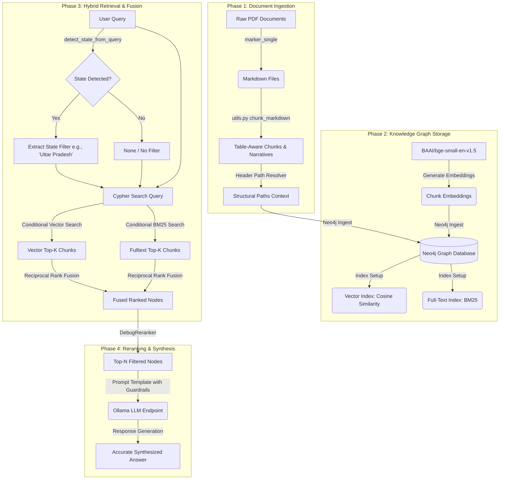
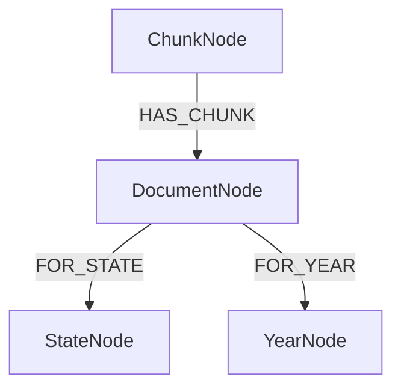

# Detailed RAG Architecture Documentation

This document describes the design, ingestion pipelines, database schemas, and retrieval mechanisms of the Graph-RAG architecture used for analyzing regulatory tariff orders.

---

## Architecture Diagram

Below is the end-to-end data flow showing how documents are converted, ingested, stored, retrieved, and synthesized.



---

## 1. Phase 1: Ingestion & Parsing

The ingestion pipeline converts complex regulatory documents (such as utility tariff orders, which are long, table-heavy PDFs) into clean, structured knowledge chunks.

### A. PDF-to-Markdown Conversion (`1_convert_documents.py`)
- Reads raw PDFs from `input_docs/` in a hierarchical subdirectory layout (e.g. `input_docs/<State>/<Year>/*.pdf`).
- Invokes the **Marker PDF layout parser** (`marker_single`) to convert documents into clean Markdown. Marker is specifically chosen because it excels at parsing formulas, multi-column layouts, structural headers, and tables.

### B. Custom Markdown Chunking (`utils.py`)
Standard character-split chunking fails on regulatory text because it splits tables and loses header context. We use a custom-tailored [chunk_markdown](file:///c:/Joulewise/Llama%20index%20rag/utils.py#L159) function:
1. **Header Hierarchy Tracking**:
   - Tracks headers up to level 4 (`####`) using structural paths (e.g., `/Commission's Analysis/Wheeling Charges/`).
   - Resets tracked child headers whenever a higher-level header changes.
   - **Structural Header Filter**: Non-structural sections, table titles, and lists (e.g. headers matching `\b(TABLE|Table|LIST OF TABLES|CONTENTS)\b`) are ignored by [is_structural_header](file:///c:/Joulewise/Llama%20index%20rag/utils.py#L131) so they do not contaminate downstream text chunks as sticky headers.
2. **Table Narrative Generation**:
   - Keeps Markdown tables atomic (no splitting across chunks).
   - Generates tabular row-by-row narrative sentences (e.g., `- For "Wheeling Charges": proposed is 1.03, approved is 0.9985.`) and appends them to the table chunk. This bridges tabular content with vector representation.
3. **Metadata Enrichment**:
   - Prepends a metadata block directly to the chunk text using [format_chunk_text](file:///c:/Joulewise/Llama%20index%20rag/utils.py#L139):
     `State: <State> | Year: <Year> | Document: <Doc> | Context: <HeaderPath> \n\n <Content>`
   - Prepended metadata ensures keyword terms like state name (e.g. "Uttar Pradesh", "UP") and financial years are embedded and indexed, ensuring matching query terms are highly scored.

---

## 2. Phase 2: Knowledge Graph Ingestion (`2_build_graph.py`)

Once documents are parsed into enriched chunks, we generate vectors and load the graph database.

### A. Schema Definition
The Neo4j database uses a hybrid schema combining metadata nodes and text chunk nodes:



- **`Chunk` Node**: Holds text, embeddings, state, year, document name, and structural header path properties.
- **`Document` Node**: Represents the source file.
- **`State` Node**: Captures geographic state boundaries.
- **`Year` Node**: Tracks the applicable financial/calendar year.

### B. Index Configuration
1. **Vector Index (`chunk_vector_index`)**:
   - Configured on `Chunk(embedding)`.
   - Dimension: `384` (matching the local `BAAI/bge-small-en-v1.5` embeddings model).
   - Similarity Metric: Cosine.
2. **Full-Text Index (`chunk_text_index`)**:
   - Configured on `Chunk(text)`.
   - Performs BM25 Lucene searches to capture exact keyword matches (like specific numbers or section codes).

---

## 3. Phase 3: Hybrid Retrieval & Fusion

The system retrieves documents by performing hybrid searches and merging results via Reciprocal Rank Fusion (RRF).

### A. Query-Time State Extraction
To resolve state-level ambiguity (e.g., user asks for "wheeling charges in UP"), the custom retriever runs [detect_state_from_query](file:///c:/Joulewise/Llama%20index%20rag/3_query_graph.py#L22):
- Analyzes query strings and matches state names or abbreviation codes (e.g., "UP" -> "Uttar Pradesh", "AP" -> "Andhra Pradesh") using boundary-aware regex tokens to avoid false positives.

### B. State-Filtered In-Index Searching
If a state filter is active, retrieval limits are scaled (from `15` to `150` candidates), and Cypher matches nodes where the state name matches:
```cypher
CALL db.index.vector.queryNodes('chunk_vector_index', $top_k, $embedding)
YIELD node, score
WHERE $state IS NULL OR node.state = $state
RETURN node.id, node.text, node.state, score
```
Similarly, full-text queries filter via `WHERE $state IS NULL OR node.state = $state` in Neo4j. This prevents out-of-state matches from cluttering RAG context.

### C. Reciprocal Rank Fusion (RRF)
Vector and fulltext result sets are fused using the standard RRF formula to rank results:
$$RRF(d) = \sum_{m \in M} \frac{1}{k + r_m(d)}$$
where $k$ defaults to `60` and $r_m(d)$ is the rank of document $d$ in retriever $m$.

---

## 4. Phase 4: Reranking & Synthesis

### A. Debug Reranker (`DebugReranker`)
The retrieved chunks pass through a post-processing layer supporting:
- **Sentence Transformer Reranker**: Runs `BAAI/bge-reranker-base` to re-score similarity against the query.
- **LLM Reranker**: Performs prompt-based relevance scoring.
- **Pass-through Mode**: Ranks purely on RRF scores and selects the top-N (default 8) chunks.

### B. Guardrailed Response Synthesizer
The final chunks are combined with a strict Prompt Template:
- Forces the LLM to only use the provided context.
- Mandates numeric precision, distinguishing between "Proposed", "Approved", "Revised", and "Actual" amounts, and tracking specific years.
- Enforces source and page-level citation.
- Prevents hallucination by requiring the LLM to state if numbers are not present in the context.
